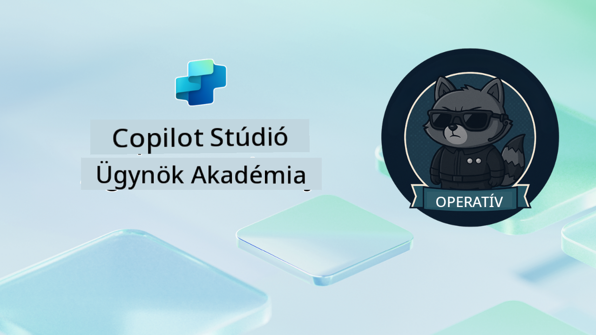

<!--
CO_OP_TRANSLATOR_METADATA:
{
  "original_hash": "24fcbe9a57d3439e05f8866e550c0a84",
  "translation_date": "2025-10-20T17:52:51+00:00",
  "source_file": "docs/operative-preview/README.md",
  "language_code": "hu"
}
-->
# Üdvözlünk, Operatív Munkatárs

**Üdvözlünk, Operatív Munkatárs.**  
A fejlett küldetésed—ha elfogadod—az, hogy elsajátítsd a **vállalati szintű többügynökös rendszerek** építésének művészetét a **Microsoft Copilot Studio** segítségével.

Ez az intenzív képzés túlmutat az alapvető ügynökök létrehozásán, és bevezet a **többügynökös koordináció** kifinomult világába: az automatizált toborzástól az AI biztonságig megtanulod, hogyan építs, koordinálj és telepíts intelligens ügynökök ökoszisztémáját valós vállalati szcenáriók alapján.

--8<-- "disclaimer.md"

---

## 🎯 Küldetés Célja

Az Agent Academy Operative program elvégzésével képes leszel:

- **Többügynökös rendszereket** tervezni és megvalósítani összetett üzleti szcenáriókhoz
- Elsajátítani az **ügynökök koordinációját** és együttműködési mintáit
- **AI biztonságot és tartalom moderációt** alkalmazni éles rendszerekben
- **Többmódú promptokat** készíteni dokumentumfeldolgozáshoz és elemzéshez
- **Vállalati szintű ügynököket** telepíteni megfelelő irányítással és teszteléssel

---

## 🧪 Előfeltételek

A küldetések teljesítéséhez szükséged lesz:

- **Agent Academy Recruit** képzés elvégzése
- Microsoft Power Platform környezet **Copilot Studio** licenccel
- Hozzáférés a **Microsoft Dataverse**-hez
- Adminisztrátori jogosultságok megoldások és ügynökök létrehozásához

---

## 🧬 Kiknek szól?

Ez a haladó kurzus ideális:

- **Megoldásarchitektnek**, akik vállalati AI rendszereket terveznek
- **Fejlesztőknek**, akik éles ügynökmegoldásokat építenek
- **IT szakembereknek**, akik AI irányítást és biztonságot valósítanak meg
- **Üzleti elemzőknek**, akik összetett automatizációs munkafolyamatokat hoznak létre
- Bárkinek, aki készen áll arra, hogy **szintet lépjen** az alapvető ügynököktől a vállalati rendszerekig

---

## 🧭 Tanterv Áttekintése

Ez az akadémia egy progresszív terepműveletek sorozataként van felépítve—minden küldetés az előzőre épül, hogy egy átfogó toborzási automatizációs rendszert hozzon létre.

| Küldetés | Cím | Műveleti Tájékoztató |
|----------|-----|-----------------------|
| `01` | 🚨 [Kezdd el a Toborzó Ügynökkel](./01-get-started/README.md) | Alapvető infrastruktúra telepítése és a központi koordinátor ügynök létrehozása |
| `02` | 🎭 [Tedd ügynöködet többügynökös rendszerekre kész állapotúvá](./02-multi-agent/README.md) | Alakítsd át az egyetlen ügynököt koordinált többügynökös rendszerré |
| `03` | ⚡ [Automatizáld ügynöködet Triggerek segítségével](./03-automate-triggers/README.md) | Valósíts meg autonóm ügynök viselkedést eseményvezérelt triggerek segítségével |
| `04` | 📝 [Ügynök Utasítások Szerkesztése](./04-agent-instructions/README.md) | Sajátítsd el az ügynökök pontos kommunikációját és viselkedésük irányítását |
| `05` | 💬 [Ügynök Válaszok Személyre Szabása](./05-agent-responses/README.md) | Személyre szabott ügynökválaszok létrehozása a maximális hatás és elkötelezettség érdekében |
| `06` | 🛡️ [Tartalom Moderáció és AI Biztonság Alapjai](./06-ai-safety/README.md) | Vállalati szintű biztonsági és megfelelőségi intézkedések megvalósítása |
| `07` | 🎨 [Önéletrajz Tartalmak Kinyerése Többmódú Promptokkal](./07-multimodal-prompts/README.md) | Dokumentumok és képek feldolgozása fejlett AI képességekkel |
| `08` | 🗄️ [Promptok - Dataverse Alapozás](./08-dataverse-grounding/README.md) | Ügynökök alapozása vállalati adatokra a pontos válaszok érdekében |
| `09` | 🧠 [Mélyebb Érvelés Alkalmazása Jelölt Alkalmazhatóságának Értékeléséhez és Interjúra Való Felkészüléshez](./09-deep-reasoning/README.md) | Kifinomult AI érvelés megvalósítása összetett döntésekhez |
| `10` | 📄 [Jelölt Specifikus Interjú Dokumentumok Generálása Promptokkal](./10-generate-documents/README.md) | Dinamikus dokumentumok létrehozása az ügynök elemzése alapján |
| `11` | 📊 [Felhasználói Visszajelzés Gyűjtése Adaptív Kártyákkal](./11-obtain-user-feedback/README.md) | Felhasználói visszajelzés gyűjtése és feldolgozása a folyamatos fejlesztés érdekében |
| `12` | 🌐 [Ügynökök Publikálása Demó Weboldalra Stakeholder Teszteléshez](./12-demo-website/README.md) | Teljes megoldás telepítése stakeholder bemutatóra és tesztelésre |

!!! note
    ✅ A tanterv teljesítése megszerzi neked az **Operative** jelvényt.  
    🔓 A **Commander** a jövőbeli fázisokban lesz elérhető.

<!-- markdownlint-disable-next-line MD033 -->

---

**Felelősség kizárása**:  
Ez a dokumentum az [Co-op Translator](https://github.com/Azure/co-op-translator) AI fordítási szolgáltatás segítségével lett lefordítva. Bár törekszünk a pontosságra, kérjük, vegye figyelembe, hogy az automatikus fordítások hibákat vagy pontatlanságokat tartalmazhatnak. Az eredeti dokumentum az eredeti nyelvén tekintendő hiteles forrásnak. Kritikus információk esetén javasolt professzionális emberi fordítást igénybe venni. Nem vállalunk felelősséget semmilyen félreértésért vagy téves értelmezésért, amely a fordítás használatából eredhet.