<!--
CO_OP_TRANSLATOR_METADATA:
{
  "original_hash": "d9cd8cd1a4fbd8915171a2ed972cc322",
  "translation_date": "2025-10-20T17:19:06+00:00",
  "source_file": "docs/recruit/00-course-setup/README.md",
  "language_code": "hu"
}
-->
# 🚨 Küldetés 00: Kurzus Beállítása

## 🕵️‍♂️ KÓDNÉV: `MŰVELET TELEPÍTÉSRE KÉSZ`

> **⏱️ Műveleti Időkeret:** `~30 perc`  

## 🎯 Küldetés Leírása

Üdvözlünk a Copilot Studio Ügynök képzésed első küldetésén.  
Mielőtt elkezdenéd az első AI ügynököd építését, létre kell hoznod a **terepre kész fejlesztési környezetedet**.

Ez az útmutató bemutatja a szükséges rendszereket, hozzáférési adatokat és beállítási lépéseket, amelyekkel sikeresen működhetsz a Microsoft 365 ökoszisztémában.

## 🔎 Célkitűzések

A küldetésed tartalmazza:

1. Microsoft 365 fiók létrehozása  
1. Hozzáférés megszerzése a Microsoft Copilot Studio-hoz  
1. (Opcionális) Microsoft 365 Copilot licenc biztosítása a gyártási publikáláshoz  
1. Fejlesztési környezet létrehozása, amely a Copilot Studio környezeted lesz  
1. SharePoint webhely létrehozása, amely későbbi küldetésekben adatforrásként szolgál majd  

---

## 🔍 Előfeltételek

Mielőtt elkezdenéd, győződj meg róla, hogy rendelkezel:

1. **Munkahelyi vagy iskolai e-mail címmel** (személyes @outlook.com, @gmail.com stb. nem támogatott).
1. Internet-hozzáféréssel és modern böngészővel (Edge, Chrome vagy Firefox ajánlott).  
1. Alapvető ismeretekkel a Microsoft 365-ről (például Office alkalmazásokba vagy Teams-be való bejelentkezés).  
1. (Opcionális) Hitelkártyával vagy fizetési móddal, ha fizetős licenceket tervez vásárolni.

---

## 1. lépés: Microsoft 365 fiók létrehozása

A Copilot Studio a Microsoft 365-ben található, így szükséged van egy Microsoft 365 fiókra a hozzáféréshez. Használhatod meglévő fiókodat, ha van, vagy kövesd az alábbi lépéseket egy megfelelő licenc megszerzéséhez:

1. **Fizetős Microsoft 365 Üzleti Előfizetés Beszerzése**  
   1. Látogass el a [Microsoft 365 Üzleti Tervek és Árak oldalra](https://www.microsoft.com/microsoft-365/business/microsoft-365-plans-and-pricing)
   1. A legolcsóbb opció a Microsoft 365 Business Basic terv. Válaszd a `Próbáld ki ingyen` lehetőséget, és kövesd az útmutatót az előfizetés, fiókadatok és fizetési információk kitöltéséhez.
   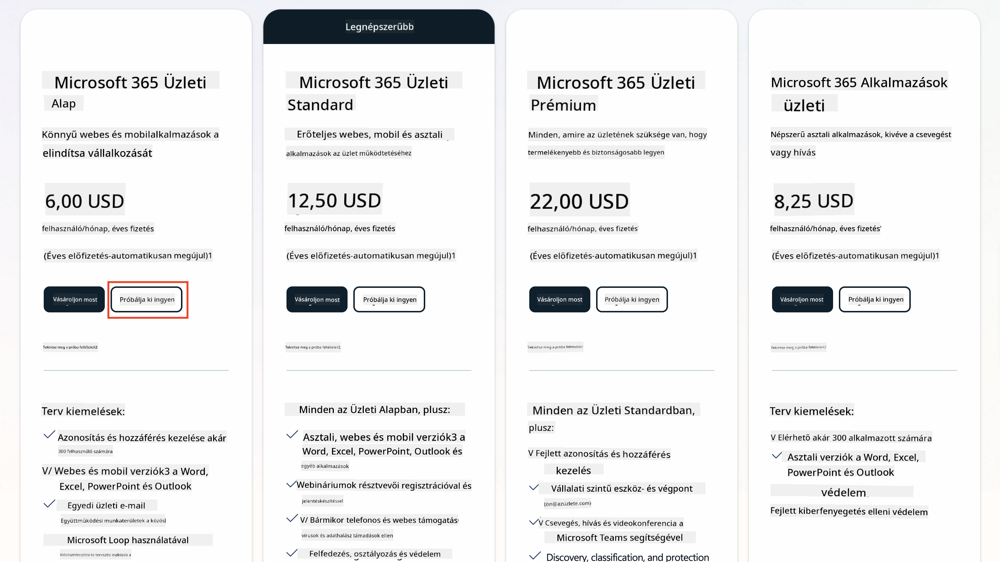
   1. Miután létrehoztad az új fiókodat, jelentkezz be.

    !!! Tipp
        Ha ügynököket szeretnél publikálni a Microsoft 365 Copilot Chat-be vagy csatlakozni szervezeti adatokhoz (SharePoint, OneDrive, Dataverse), szükséged lesz egy Microsoft 365 Copilot licencre. Ez egy kiegészítő licenc, amelyről többet megtudhatsz [a licencelési oldalon](https://www.microsoft.com/microsoft-365/copilot#plans).

---

## 2. lépés: Copilot Studio próbaidőszak indítása

Miután létrehoztad a Microsoft 365 bérlődet, hozzáférést kell szerezned a Copilot Studio-hoz. Ingyenes 30 napos próbaidőszakot szerezhetsz az alábbi lépések követésével:

1. Látogass el az [aka.ms/TryCopilotStudio](https://aka.ms/TryCopilotStudio) oldalra.  
1. Add meg az előző lépésben létrehozott fiók e-mail címét, majd válaszd a `Tovább` lehetőséget.  
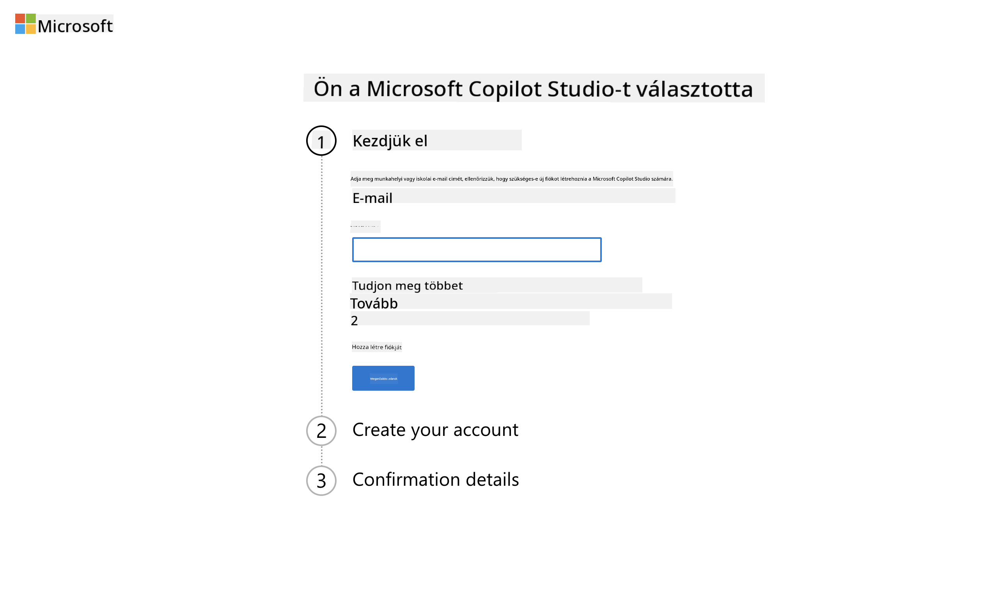
1. Felismeri a fiókodat. Válaszd a `Bejelentkezés` lehetőséget.  
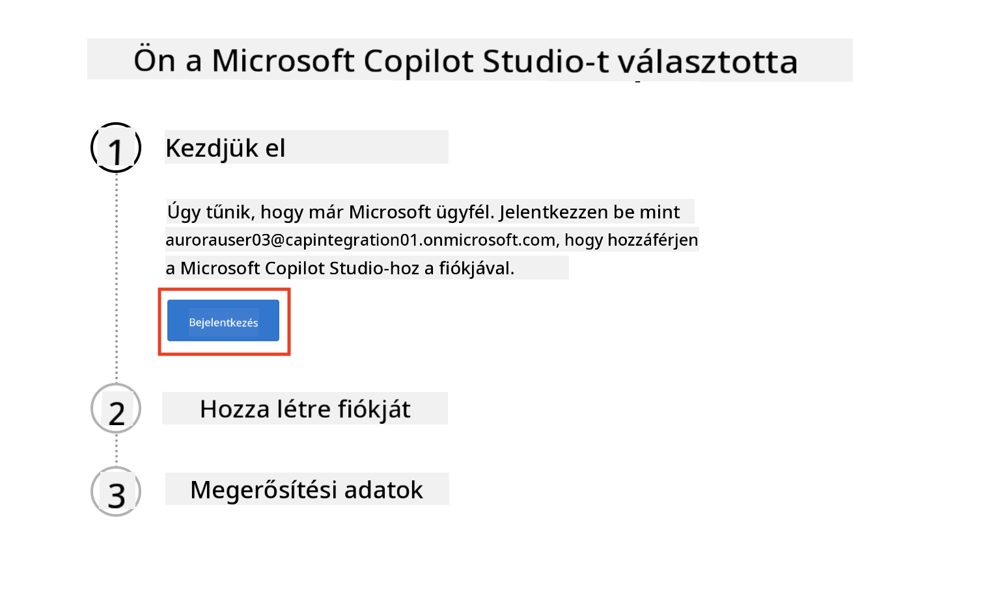  
1. Válaszd a `Próbáld ki ingyen` lehetőséget.  
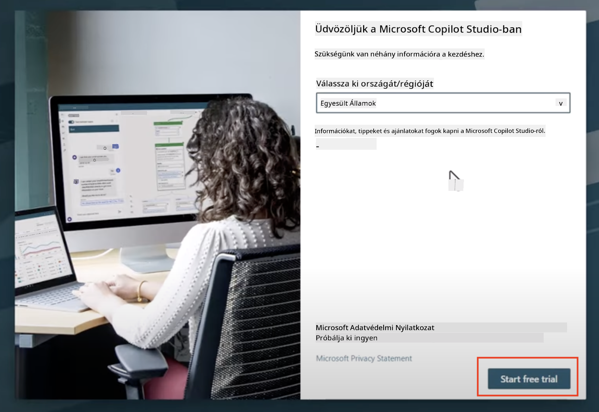

!!! info "Próbaidőszak Megjegyzések"  
     1. Az ingyenes próbaidőszak **teljes Copilot Studio funkciókat** biztosít.  
     1. E-mail értesítéseket kapsz a próbaidőszak lejáratáról. A próbaidőszakot 30 napos időszakokban meghosszabbíthatod (legfeljebb 90 napos ügynök futási idő).  
     1. Ha a bérlő adminisztrátorod letiltotta az önkiszolgáló regisztrációt, hibaüzenetet fogsz kapni—lépj kapcsolatba a Microsoft 365 adminisztrátoroddal, hogy újra engedélyezze.

---

## 3. lépés: Új fejlesztési környezet létrehozása

### Regisztráció a Power Apps Fejlesztői Tervre

Az 1. lépésben létrehozott Microsoft 365 bérlő használatával regisztrálj a Power Apps Fejlesztői Tervre, hogy létrehozz egy ingyenes fejlesztési környezetet a Copilot Studio-val való építéshez és teszteléshez.

1. Regisztrálj a [Power Apps Fejlesztői Terv weboldalán](https://aka.ms/PowerAppsDevPlan).

    - Add meg az e-mail címedet
    - Jelöld be a jelölőnégyzetet
    - Válaszd a **Próbáld ki ingyen** lehetőséget

    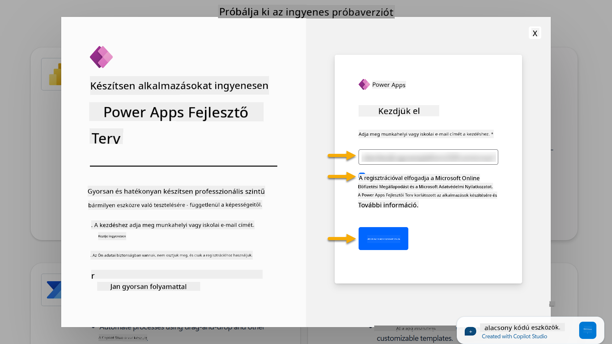

1. Miután regisztráltál a Fejlesztői Tervre, átirányítanak a [Power Apps](https://make.powerapps.com/) oldalra. A környezet a nevedet fogja viselni, például **Adele Vance környezete**. Ha már létezik ilyen nevű környezet, az új fejlesztői környezet neve **Adele Vance (1)** lesz.

    Használd ezt a fejlesztői környezetet a Copilot Studio-ban a laborok elvégzésekor.

!!! Megjegyzés
    Ha meglévő Microsoft 365 fiókot használsz, és nem hoztál létre újat az 1. lépésben, például - ha saját fiókodat használod a munkahelyi szervezetben, az IT adminisztrátorod (vagy az ezzel megbízott csapat) letilthatta a regisztrációs folyamatot. Ebben az esetben lépj kapcsolatba az adminisztrátoroddal, vagy hozz létre egy teszt bérlőt az 1. lépés szerint.

---

## 4. lépés: Új SharePoint webhely létrehozása

Új SharePoint webhelyet kell létrehozni, amelyet a [6. Lecke - Egyedi ügynök létrehozása a Copilot beszélgetési élményével és saját adatokkal](../06-create-agent-from-conversation/README.md#62-add-an-internal-knowledge-source-using-a-sharepoint-site) során fogunk használni.

1. Válaszd ki a bal felső sarokban található gofrit ikont a Microsoft Copilot Studio-ban a menü megtekintéséhez. Válaszd ki a SharePoint lehetőséget a menüből.

    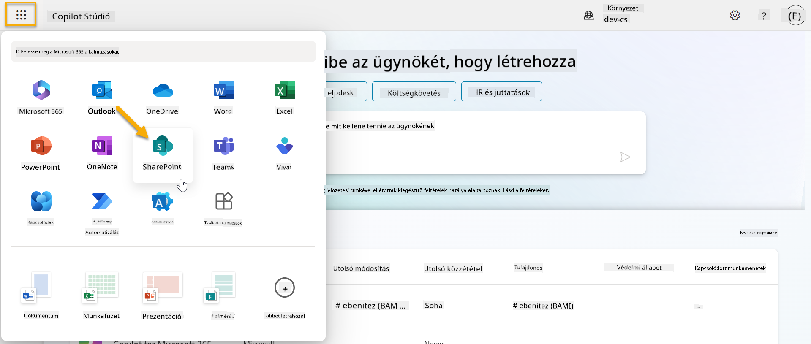

1. A SharePoint betöltődik. Válaszd a **+ Webhely létrehozása** lehetőséget egy új SharePoint webhely létrehozásához.

    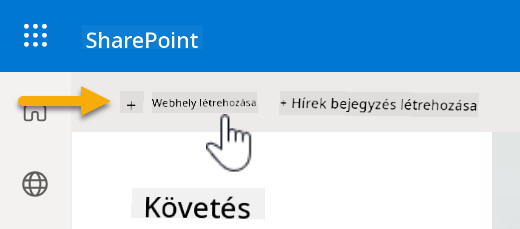

1. Megjelenik egy párbeszédablak, amely segít az új SharePoint webhely létrehozásában. Válaszd a **Csapat webhely** lehetőséget.

    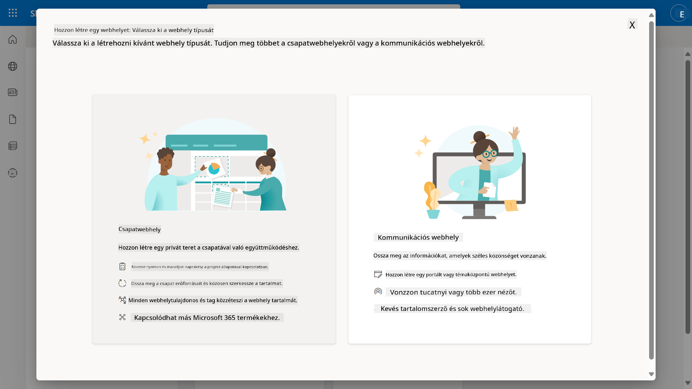

1. A következő lépésben alapértelmezés szerint betöltődnek a Microsoft sablonok. Görgess le, és válaszd az **IT help desk** sablont.

    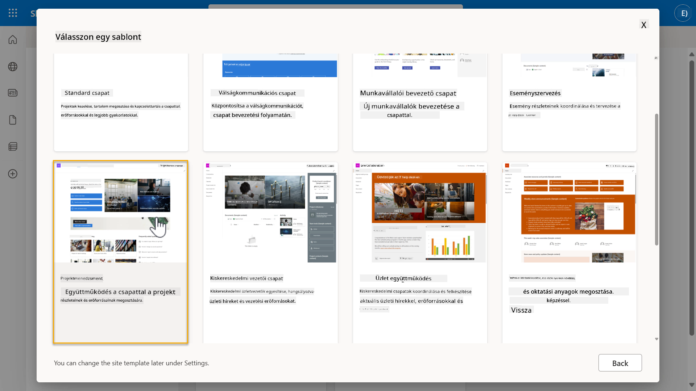

1. Válaszd a **Sablon használata** lehetőséget egy új SharePoint webhely létrehozásához az IT help desk sablonnal.

    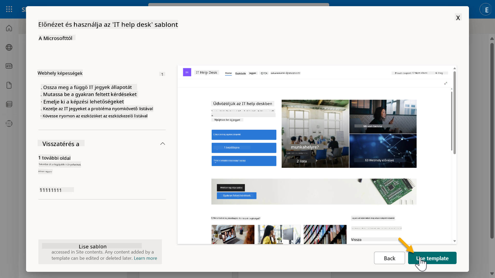

1. Add meg a webhelyed adatait. Az alábbi példa:

    | Mező | Érték |
    | --- | --- |
    | Webhely neve | Contoso IT |
    | Webhely leírása | Copilot Studio kezdőknek |
    | Webhely címe | ContosoIT |

    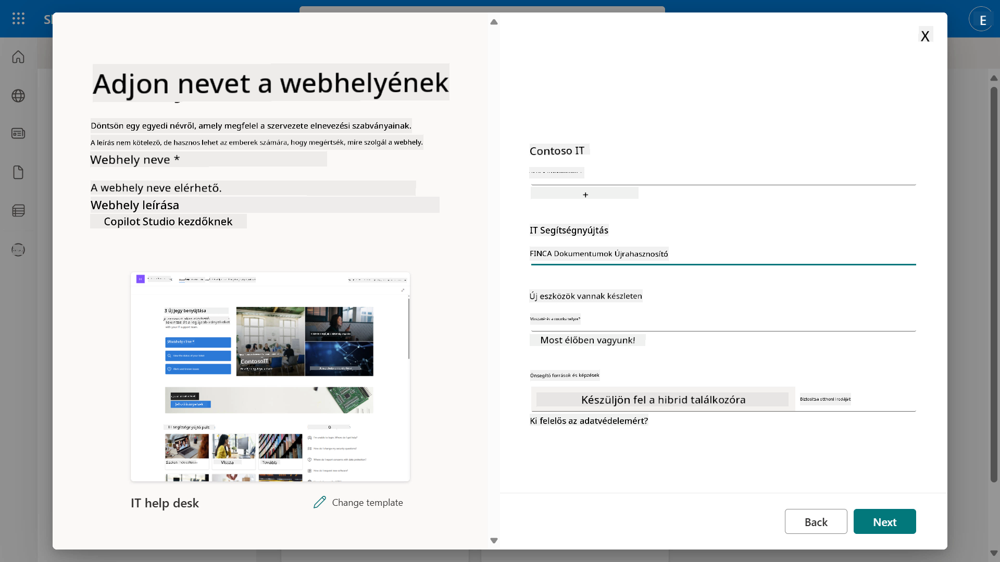

1. Az utolsó lépésben kiválaszthatod a SharePoint webhely nyelvét. Alapértelmezés szerint **Angol** lesz. Hagyd a nyelvet **Angol**-on, és válaszd a **Webhely létrehozása** lehetőséget.

    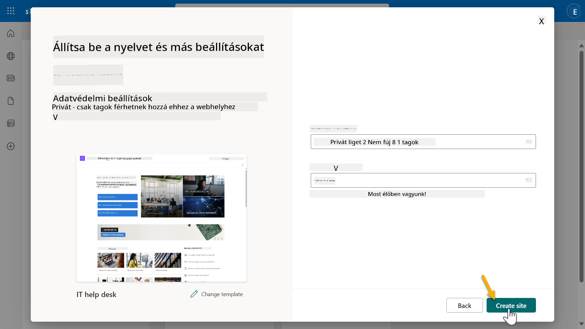

1. A SharePoint webhely néhány másodperc alatt létrejön. Közben hozzáadhatsz más felhasználókat a webhelyedhez az **Tagok hozzáadása** mezőben az e-mail címük megadásával. Ha kész, válaszd a **Befejezés** lehetőséget.

    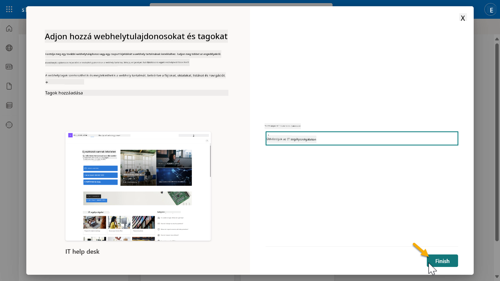

1. A SharePoint webhely kezdőlapja betöltődik. **Másold** a SharePoint webhely URL-jét.

1. Ez a sablon oldalak mintaadatokkal szolgál különböző IT szabályzatokról és két minta listát (Jegyek és Eszközök).

### Eszközök SharePoint lista használata

Az **Eszközök** listát fogjuk használni a [7. Küldetés - Új téma hozzáadása triggerrel és csomópontokkal](../07-add-new-topic-with-trigger/README.md#73-add-a-tool-using-a-connector) során.

### Új oszlop hozzáadása

Görgess a lista jobb szélére, és válaszd a **+ Oszlop hozzáadása** gombot. Válaszd a **hivatkozás** típust, add meg az **Kép** nevet az oszlopnak, majd válaszd a hozzáadást.

### Mintaadatok létrehozása az Eszközök SharePoint listában

Győződj meg róla, hogy legalább 4 mintaadatot töltesz fel ebbe a listába, és adj hozzá egy további oszlopot is.

Mintaadatok hozzáadásakor győződj meg róla, hogy a következő mezők ki vannak töltve:

- Eszköz fotó - használd a [eszköz képek mappájában](https://github.com/microsoft/agent-academy/tree/main/docs/recruit/00-course-setup/images/device-images) található képeket
- Cím
- Állapot
- Gyártó
- Modell
- Eszköz típusa
- Szín
- Sorozatszám
- Vásárlás dátuma
- Vásárlási ár
- Rendelési szám
- Kép - használd az alábbi linkeket

|Eszköz  |URL  |
|---------|---------|
|Surface Laptop 13     | [https://raw.githubusercontent.com/microsoft/agent-academy/refs/heads/main/docs/recruit/00-course-setup/images/device-images/Surface-Laptop-13.png](https://raw.githubusercontent.com/microsoft/agent-academy/refs/heads/main/docs/recruit/00-course-setup/images/device-images/Surface-Laptop-13.png)        |
|Surface Laptop 15     | [https://raw.githubusercontent.com/microsoft/agent-academy/refs/heads/main/docs/recruit/00-course-setup/images/device-images/Surface-Laptop-15.png](https://raw.githubusercontent.com/microsoft/agent-academy/refs/heads/main/docs/recruit/00-course-setup/images/device-images/Surface-Laptop-15.png)        |
|Surface Pro    | [https://raw.githubusercontent.com/microsoft/agent-academy/refs/heads/main/docs/recruit/00-course-setup/images/device-images/Surface-Pro-12.png](https://raw.githubusercontent.com/microsoft/agent-academy/refs/heads/main/docs/recruit/00-course-setup/images/device-images/Surface-Pro-12.png)        |
|Surface Studio    | [https://raw.githubusercontent.com/microsoft/agent-academy/refs/heads/main/docs/recruit/00-course-setup/images/device-images/Surface-Studio.png](https://raw.githubusercontent.com/microsoft/agent-academy/refs/heads/main/docs/recruit/00-course-setup/images/device-images/Surface-Studio.png)        |

---

## ✅ Küldetés Teljesítve

Sikeresen:

- Létrehoztál egy Microsoft 365 fejlesztési környezetet  
- Aktiváltad a Copilot Studio próbaidőszakot  
- Létrehoztál egy SharePoint webhelyet az ügynökök alapozásához  
- Feltöltötted az Eszközök listát a jövőbeli küldetésekhez

Hivatalosan készen állsz, hogy elkezdd **Toborzó szintű ügynökképzésedet** az [1. Leckében](../01-introduction-to-agents/README.md).  

<!-- markdownlint-disable-next-line MD033 -->

---

**Felelősség kizárása**:  
Ez a dokumentum az [Co-op Translator](https://github.com/Azure/co-op-translator) AI fordítási szolgáltatás segítségével lett lefordítva. Bár törekszünk a pontosságra, kérjük, vegye figyelembe, hogy az automatikus fordítások hibákat vagy pontatlanságokat tartalmazhatnak. Az eredeti dokumentum az eredeti nyelvén tekintendő hiteles forrásnak. Kritikus információk esetén javasolt professzionális emberi fordítást igénybe venni. Nem vállalunk felelősséget semmilyen félreértésért vagy téves értelmezésért, amely a fordítás használatából eredhet.