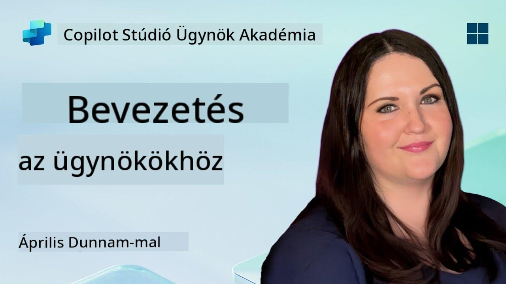

<!--
CO_OP_TRANSLATOR_METADATA:
{
  "original_hash": "d6706e107678264168d77b2e107710b1",
  "translation_date": "2025-10-20T17:45:00+00:00",
  "source_file": "docs/recruit/01-introduction-to-agents/README.md",
  "language_code": "hu"
}
-->
# 🚨 Küldetés 01: Bevezetés az ügynökök világába

## 🕵️‍♂️ FEDŐNÉV: `OPERATION AI AGENT DECODE`

> **⏱️ Küldetési időkeret:** `~30 perc – csak információgyűjtés, terepmunka nem szükséges`

🎥 **Nézd meg az útmutatót**

## 🎯 Küldetési összefoglaló

Üdvözlünk, Újonc. Mielőtt belevágnánk az ügynökök építésébe, elengedhetetlen, hogy alaposan megértsd az őket működtető mesterséges intelligencia alapjait. Ez a küldetés segít elsajátítani az alapvető ismereteket a beszélgetési mesterséges intelligenciáról, a nagy nyelvi modellekről (LLM-ek), a visszakeresés-alapú generálásról (RAG), valamint azokról az ügynöktípusokról, amelyeket a Copilot Studio-ban létrehozhatsz.

## 🔎 Célkitűzések

Ebben a küldetésben megtanulod:

1. Mi az a beszélgetési mesterséges intelligencia, és miért fontos  
1. Hogyan működtetik a nagy nyelvi modellek (LLM-ek) a csevegési élményeket  
1. Mit nyújt a visszakeresés-alapú generálás (RAG)  
1. A beszélgetési ügynökök és az autonóm ügynökök közötti különbséget  
1. Hogyan használják az ügynökök a Copilot Studio-ban ezeket a koncepciókat  

Vágjunk bele!

---

## Mi az a beszélgetési mesterséges intelligencia?

A beszélgetési mesterséges intelligencia olyan rendszert jelent, amely képes megérteni, feldolgozni és természetes módon válaszolni az emberi nyelvre – legyen az szöveg vagy beszéd. Gondolj például az ügyfélszolgálati chatbotokra vagy a kedvenc alkalmazásaid virtuális személyi asszisztenseire. A háttérben a legtöbb modern beszélgetési mesterséges intelligencia nagy nyelvi modellekre (LLM-ekre) támaszkodik, amelyeket a következőkben részletesebben is bemutatunk.

### Miért fontos?

- **Felhasználói élmény:** A beszélgetési felületek gyakran intuitívabbak, mint a menükön való kattintgatás.  
- **Skálázhatóság:** Egy ügynök egyszerre több tucat vagy akár száz beszélgetést is képes kezelni.  
- **Hatékonyság:** Ahelyett, hogy egyedi szabályalapú szkripteket kellene készíteni, az LLM-alapú ügynökök rugalmasan alkalmazkodnak a felhasználói bemenetekhez.  
- **Bővíthetőség:** Megfelelő tervezéssel az ügynökök hozzáférhetnek tudásbázisokhoz, API-khoz, vagy akár „digitális munkatársakként” működhetnek az üzleti folyamatokban.

---

## Nagy nyelvi modellek (LLM-ek) 101

A legtöbb beszélgetési mesterséges intelligencia rendszer középpontjában a **nagy nyelvi modellek** állnak – olyan neurális hálózatok, amelyeket hatalmas szövegkorpuszokon képeztek ki. Ezek statisztikai mintákat tanulnak meg a nyelvről, hogy koherens mondatokat generáljanak, kérdésekre válaszoljanak, vagy akár ötleteket adjanak. Fontos tudnivalók:

1. **Tanulási adatok:** Az LLM-ek terabájtnyi szöveget dolgoznak fel (weboldalak, könyvek, cikkek). Ez a „világtudás” teszi lehetővé, hogy sok témában válaszoljanak.  
1. **Tokenizáció:** A szöveget kisebb egységekre, úgynevezett tokenekre bontják (szavak, szóelemek vagy karakterek). A modell egy-egy tokent jósol meg egyszerre.  
1. **Kontextusablak:** Minden LLM-nek van egy korlátja arra, hogy egyszerre hány tokent „láthat”. Ezen korlát felett a korábbi tokenek levágásra kerülnek.  
1. **Promptolás:** Az LLM-mel úgy léphetsz kapcsolatba, hogy küldesz neki egy promptot. Minél jobb a promptod, annál fókuszáltabb és relevánsabb lesz a válasz.  
1. **Zero-shot vs. Finomhangolás:** A zero-shot azt jelenti, hogy az LLM-et úgy használod, ahogy van (csak nyers súlyokkal). A finomhangolás azt jelenti, hogy a modellt domain-specifikus adatokkal igazítod, hogy pontosabban válaszoljon az igényeidre.

!!! Tip "Profi tipp"
    Egy gyakori analógia szerint az LLM olyan, mint egy „szuperintelligens automatikus kiegészítő”. Nem érti igazán a jelentést, mint az emberi agy, de rendkívül jól meg tudja jósolni a következő legjobb szót (vagy kifejezést) egy sorozatban.

---

## Visszakeresés-alapú generálás (RAG)

Amikor az LLM-ek kizárólag statikus tanulási adatokra támaszkodnak, előfordulhat, hogy téves információkat adnak, vagy elavulttá válnak. A RAG ezt úgy oldja meg, hogy lehetővé teszi a modell számára, hogy „friss információkat keressen” mielőtt választ generálna. Nagyjából így működik a RAG:

1. **Felhasználói kérdés:** A felhasználó feltesz egy kérdést (pl. „Mi újság a Contoso negyedéves eredményeivel?”).  
1. **Visszakeresési lépés:** A rendszer megkeresi a releváns szövegrészeket egy tudásforrásban (dokumentumok, belső adatbázisok, SharePoint könyvtárak stb.).  
1. **Kiegészítés:** A visszakeresett szövegrészeket hozzáfűzik vagy elé helyezik az LLM promptnak.  
1. **Generálás:** Az LLM feldolgozza a felhasználó kérdését és a visszakeresett kontextust, majd olyan választ generál, amely aktuális adatokon alapul.  

A RAG segítségével az ügynököd hozzáférhet belső vállalati wikipédiákhoz, plugin API-khoz, vagy kereshet egy GYIK tudásbázisban – és olyan válaszokat adhat, amelyek nem korlátozódnak a statikusan publikált modellparaméterekre.

---

## Beszélgetési vs. autonóm ügynökök

A Copilot Studio kontextusában az **ügynök** kifejezés többféle AI asszisztensre utalhat. Érdemes különbséget tenni:

**Beszélgetési ügynökök:**

- Elsősorban kétirányú párbeszédre összpontosítanak.  
- Megőrzik a kontextust egy beszélgetés több fordulóján keresztül.  
- Általában előre meghatározott folyamatok vagy triggerek alapján működnek (pl. „Ha a felhasználó X-et mond, válaszolj Y-nal”).  
- Ideálisak ügyfélszolgálathoz, GYIK-hez, irányított interakciókhoz, időpontfoglaláshoz vagy egyszerű kérdezz-felelekhez.  
  - Példák:  
    - Egy Teams chatbot, amely HR szabályzatokkal kapcsolatos kérdésekre válaszol.  
    - Egy Power Virtual Agents bot egy SharePoint oldalon, amely segít a felhasználóknak egy űrlap kitöltésében.  

**Autonóm ügynökök:**

- Túlmutatnak a párbeszéden; képesek **cselekedni** a felhasználó nevében.  
- LLM-alapú logikai ciklusokat használnak (gondolj: „tervezés → cselekvés → megfigyelés → újratervezés”) a feladatok elvégzéséhez.  
- Külső eszközökhöz vagy API-khoz csatlakoznak (pl. Power Automate folyamat indítása, naptári meghívók küldése, adatok kezelése a Dataverse-ben).  
- Nem igényelnek folyamatos emberi beavatkozást – egyszer aktiválva önállóan kezelhetnek több lépéses folyamatokat.  
  - Példák:  
    - Egy ügynök, amely utazási tervet készít, repülőjegyeket foglal, és e-mailben küldi a visszaigazolásokat.  
    - Egy „Meeting Summarizer” ügynök, amely csatlakozik egy Teams híváshoz, valós időben leírja azt, és vezetői összefoglalót készít a OneNote-ba.  

!!! Info "Fő különbség"
    A beszélgetési ügynökök a felhasználói bemenetre várnak, és a párbeszédre koncentrálnak. Az autonóm ügynökök proaktívan terveznek és hajtanak végre lépéseket szélesebb eszköztárat használva.

---

## Ügynökök a Copilot Studio-ban

A **Copilot Studio** egyesíti a beszélgetési és autonóm forgatókönyveket egy keretrendszerben. Így segít a Copilot Studio ügynökök építésében:

1. **Vizualizált ügynöktervező:** Egy alacsony kódú vászon, ahol meghatározhatod a promptokat, memóriát és eszközöket mind a csevegési, mind a cselekvési munkafolyamatokhoz.  
1. **LLM konfigurációk:** Választhatsz különböző OpenAI modellek vagy a Microsoft vállalati szintű GPT közül, hogy teljesítményben és költségekben is megfeleljenek az igényeidnek.  
1. **Visszakeresési csatlakozók:** Előre elkészített integrációk a SharePoint, OneDrive, Azure Cognitive Search és Dataverse számára, amelyek alapértelmezés szerint támogatják a RAG-t.  
1. **Egyedi eszközök és funkciók:** Meghatározhatsz egyedi HTTP műveleteket vagy Power Automate folyamatokat, amelyeket az ügynök önállóan hívhat meg.  
1. **Multimodális támogatás:** A szövegen túl a Copilot Studio ügynökei képesek képeket, fájlokat vagy strukturált adatokat is feldolgozni a kontextus gazdagítása érdekében.  
1. **Publikálás és terjesztés:** Ha az ügynök készen áll, publikálhatod a Microsoft 365 Copilotba (így a felhasználók elérhetik a Teams, SharePoint, Outlook stb. alkalmazásokban), vagy beágyazhatod önálló csevegési widgetként egy weboldalra.

---

## 🎉 Küldetés teljesítve

Most már befejezted az ügynökök és az alapvető AI koncepciók bevezetését. Értesz:

1. **LLM-ek = Az ügynök „agya”**  
   - Felelős a nyelv megértéséért és generálásáért.  
   - Több token = gazdagabb kontextus, de magasabb költség hívásonként.  

1. **RAG = Valós idejű tudásintegráció**  
   - Áthidalja a statikus LLM és a folyamatosan változó adatforrások közötti szakadékot.  
   - Releváns dokumentumokat vagy rekordokat keres és illeszt be az LLM promptjába.  

1. **Beszélgetési vs. autonóm ügynökök**  
   - **Beszélgetési:** A párbeszéd folyamatára és a kontextus megőrzésére összpontosít (pl. „Session Memory”).  
   - **Autonóm:** „Action Blocks”-okat ad hozzá, amelyek lehetővé teszik az ügynök számára, hogy külső eszközöket vagy szolgáltatásokat hívjon meg.

---
A következő lépésben felfedezed a [Copilot Studio alapjait](../02-copilot-studio-fundamentals/README.md)!

Maradj éber, Újonc – az AI utazásod még csak most kezdődik!

## 📚 Taktikai források

🔗 [Copilot Studio Dokumentáció Kezdőlap](https://learn.microsoft.com/microsoft-copilot-studio/)

---

---

**Felelősség kizárása**:  
Ez a dokumentum az [Co-op Translator](https://github.com/Azure/co-op-translator) AI fordítási szolgáltatás segítségével lett lefordítva. Bár törekszünk a pontosságra, kérjük, vegye figyelembe, hogy az automatikus fordítások hibákat vagy pontatlanságokat tartalmazhatnak. Az eredeti dokumentum az eredeti nyelvén tekintendő hiteles forrásnak. Kritikus információk esetén javasolt professzionális emberi fordítást igénybe venni. Nem vállalunk felelősséget semmilyen félreértésért vagy téves értelmezésért, amely a fordítás használatából eredhet.