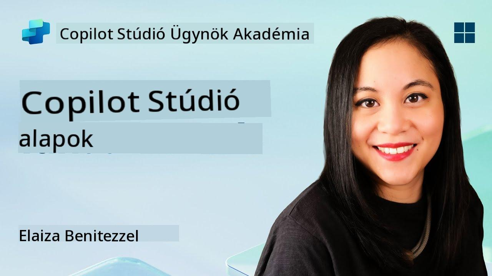
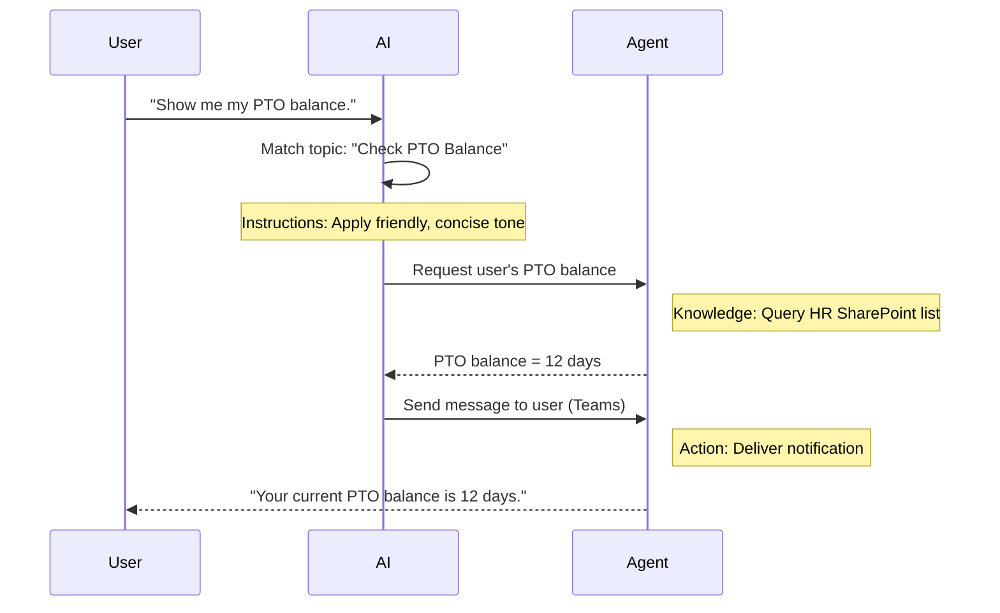

<!--
CO_OP_TRANSLATOR_METADATA:
{
  "original_hash": "90a3c5122f5687bbc8cc819990f175d4",
  "translation_date": "2025-10-20T17:46:29+00:00",
  "source_file": "docs/recruit/02-copilot-studio-fundamentals/README.md",
  "language_code": "hu"
}
-->
# 🚨 Küldetés 02: Copilot Studio Alapok

## 🕵️‍♂️ KÓDNEVE: `MŰVELET ALAP PROTOKOLL`

> **⏱️ Műveleti Időablak:** `~30 perc – csak információgyűjtés, terepmunka nem szükséges`  

🎥 **Nézd meg az útmutatót**

[](https://www.youtube.com/watch?v=x4OCwDRGeLE "Nézd meg az útmutatót a YouTube-on")

## 🎯 Küldetés összefoglaló

Üdvözlünk, Újonc! Ez a küldetés alapvető információkkal lát el arról, hogyan működik a Copilot Studio, és hogyan hozhatsz létre intelligens ügynököket, amelyek valódi üzleti értéket teremtenek.

Mielőtt megépítenéd az első ügynöködet, meg kell értened azt a négy kulcselemét, amelyek minden egyedi AI ügynököt alkotnak: Tudás, Eszközök, Témák és Utasítások. Megtanulod azt is, hogyan működnek ezek az elemek együtt a Copilot Studio vezérlőjében.

## 🔎 Célkitűzések

Ebben a küldetésben:

- **Megtanulod, mi az a Copilot Studio**
- **Megtanulod, mikor és miért érdemes ügynököket használni**
- **Felfedezed az ügynökök négy építőelemét**
      - **Tudás**
      - **Eszközök**
      - **Témák**
      - **Utasítások**
- **Megérted, hogyan működnek ezek az elemek együtt**, hogy létrehozzanak egy intelligens, automatizált ügynököt

---

## Mi az ügynök a Copilot Studio-ban?

Egy **ügynök** egy speciális AI asszisztens, amelyet arra tervezel, hogy konkrét feladatokat vagy kérdéseket kezeljen. Egy általános chatbothoz képest az ügynök:

- **Ismeri a vállalatspecifikus adatokat** (szabályzatok, dokumentumok, adatbázisok)  
- **Valós feladatokat végez el** (üzenetek küldése, naptári események létrehozása, rekordok frissítése)  
- **Fenntartja a beszélgetési kontextust**, így képes korábbi kérdésekre visszautalni  

Mivel a Copilot Studio alacsony kódú, előre elkészített komponenseket húzhatsz és ejthetsz be – mély programozási ismeretek nélkül. Miután az ügynök elkészült, az emberek használhatják azt a Teams-ben, Slack-en vagy akár egy egyedi weboldalon, hogy válaszokat kapjanak vagy automatikusan indítsanak munkafolyamatokat.

---

## Mikor és miért érdemes használni a Copilot Studio-t?

Míg a Microsoft 365 Copilot általános AI segítséget nyújt az Office alkalmazásokban, egy egyedi ügynökre van szükséged, ha:

### Szükséged van területspecifikus tudásra

- Az alapértelmezett Copilot lehet, hogy nem ismeri a vállalatod belső eljárásait vagy adatait. Egy ügynök képes lekérdezni a SharePoint oldalakat, adatbázisokat vagy egyedi forrásokat, hogy pontos, naprakész válaszokat adjon.  

### Többlépcsős munkafolyamatokat szeretnél automatizálni

- Például: "Amikor valaki benyújt egy költségelszámolást, küldje el jóváhagyásra, frissítse a pénzügyi nyilvántartót, és értesítse a vezetőt." Egy egyedi ügynök minden lépést kezelhet, egyetlen parancs vagy esemény által indítva.  

### Kontextuális, eszközön belüli élményre van szükséged  

- Képzelj el egy Új Munkatárs Bevezető ügynököt a Teams-ben, amely végigvezeti az HR munkatársakat minden szabályzaton, elküldi a szükséges űrlapokat, és ütemezi az orientációs találkozókat – közvetlenül a meglévő együttműködési platformodon belül.  

---

## Az ügynök négy építőeleme

Minden Copilot Studio ügynök négy alapvető komponensből épül fel:

1. **Tudás**  
1. **Eszközök (Műveletek)**  
1. **Témák**  
1. **Utasítások**

Az alábbiakban meghatározzuk az egyes építőelemeket, és bemutatjuk, hogyan működnek együtt egy hatékony ügynök létrehozásához.

### 1. Tudás

A **Tudás** az az adat és kontextus, amelyet az ügynök használ, hogy pontosan válaszoljon a kérdésekre. Két részből áll:

#### Egyedi Utasítások és Kontextus

- Rövid leírást írsz az ügynök céljáról és hangneméről. Például:  

    ```text
    You are an IT support agent. You help employees troubleshoot common software issues, provide troubleshooting steps, and escalate urgent tickets.
    ```

- A beszélgetés során az ügynök emlékszik az előző fordulatokra, így visszautalhat arra, amit már megbeszéltek (például, ha a felhasználó először azt mondja: "A nyomtatóm offline," majd később megkérdezi: "Ellenőrizted a tinta szintjét?" az ügynök emlékszik a nyomtató kontextusára).

#### Tudásforrások (Alapadatok)

- Az ügynököt több adatforráshoz is csatlakoztathatod – SharePoint könyvtárakhoz, dokumentációs oldalakhoz, wikipédiákhoz vagy más adatbázisokhoz.  
- Amikor a felhasználó kérdést tesz fel, az ügynök releváns részleteket húz ki ezekből a forrásokból, így a válaszok **alapozottak** a szervezet tényleges szabályzataira, termékkézikönyveire vagy bármilyen saját információra.  
- Az ügynököt akár arra is kényszerítheted, hogy csak ezekből a forrásokból válaszoljon, megakadályozva, hogy találgasson vagy "kitaláljon" válaszokat.

!!! példa
    Egy "Szabályzati Asszisztens" ügynök csatlakozhat az HR SharePoint oldaladhoz. Ha egy felhasználó megkérdezi: "Mi a szabadság felhalmozási arányunk?" az ügynök az HR szabályzat dokumentum pontos szövegét fogja előhívni, ahelyett, hogy egy általános AI választ adna.

---

### 2. Eszközök (Műveletek)

Az **Eszközök (Műveletek)** határozzák meg, hogy az ügynök mit tud tenni a csevegésen túl. Minden művelet egy programozott feladat, amelyet az ügynök végrehajt, például:

- E-mail vagy Teams üzenet küldése  
- Naptári esemény létrehozása vagy frissítése  
- Rekord hozzáadása vagy szerkesztése egy adatbázisban (például egy SharePoint listában vagy Dataverse táblában)  
- Power Automate folyamat vagy REST API hívása  

#### Hogyan működnek a műveletek

- **Bemenetek és kimenetek meghatározása**  
      - Például egy E-mail Küldés művelethez szükséges lehet:  
        - `CímzettEmailCím`  
        - `TárgySor`  
        - `EmailTartalom`  

- **Műveletek kombinálása munkafolyamatokká**  
      - Gyakran egy felhasználói kérés teljesítése több lépést igényel.  
      - A műveleteket sorba állíthatod, hogy:  
             1. Az ügynök adatokat kérjen le egy SharePoint listából.  
             2. Összefoglalót készítsen az LLM segítségével.  
             3. Küldjön egy Teams üzenetet az összefoglalóval.  

- **Kapcsolódás külső rendszerekhez**  
      - Ha frissíteni kell egy CRM-et vagy hívni egy belső API-t, hozz létre egy egyedi műveletet ennek kezelésére.  
      - A Copilot Studio integrálható a Power Platformmal vagy bármely HTTP-alapú végponttal.

!!! példa "Egy "Költségsegítő" ügynök képes lehet:"  
    1. Figyelni egy "Költség benyújtása" kérésre.  
    2. Lekérni a felhasználó költségadatait egy űrlapról.  
    3. Egy "Hozzáadás SharePoint Listához" művelettel tárolni az adatokat.  
    4. Egy "E-mail Küldés" műveletet indítani, hogy értesítse a jóváhagyót.  

---

### 3. Témák

A **Témák** határozzák meg az ügynök beszélgetési indítóit vagy belépési pontjait. Minden téma egy funkcióhoz vagy kérdéskategóriához kapcsolódik.

#### Beszélgetési Indítók  

- Egy téma lehet például "IT Jegy Benyújtása," "Szabadság Egyenleg Ellenőrzése," vagy "Értékesítési Jelentés Létrehozása."  
- A háttérben a Copilot Studio **generatív vezérlést** használ: ahelyett, hogy pontos kulcsszavakra támaszkodna, az AI értelmezi a felhasználói szándékot, és kiválasztja a megfelelő témát az általad megadott rövid leírás alapján.  

#### Téma Leírások  

- Minden témában világos, tömör leírást írsz arról, hogy mit fed le az adott téma.

!!! példa "Téma leírás példa"
    Ez a téma segít a felhasználóknak IT támogatási jegyet benyújtani azáltal, hogy összegyűjti a probléma részleteit, prioritását és kapcsolattartási információit.

- Az AI ezt a leírást használja annak eldöntésére, hogy mikor aktiválja ezt a témát, még akkor is, ha a felhasználó megfogalmazása nem pontosan egyezik.

#### Témák és Műveletek összekapcsolása  

- Minden téma egy vagy több művelethez vagy adatlekérési lépéshez kapcsolódik.  
- Amikor az AI kiválaszt egy témát, a beszélgetést az általad meghatározott sorrendben vezeti (feltesz további kérdéseket, műveleteket hív meg, eredményeket ad vissza).

!!! példa
    Ha egy felhasználó azt mondja: "Segítségre van szükségem az új laptopom beállításához," az AI ezt a szándékot a "IT Jegy Benyújtása" témához társíthatja. Az ügynök ezután megkérdezi a laptop modelljét, a felhasználói adatokat, és automatikusan jegyet küld a helpdesk rendszerbe.

---

### 4. Utasítások

Az **Utasítások** (néha "Promptok" vagy "Rendszerüzenetek") irányítják az LLM hangnemét, stílusát és határait. Meghatározzák, hogyan reagál az ügynök bármilyen helyzetben.

#### Szerep és Személyiség  

- Megmondod az AI-nak, hogy ki ő (például: "Te egy ügyfélszolgálati ügynök vagy a Contoso Retail számára").  
- Ez meghatározza a hangnemet – barátságos, tömör, hivatalos vagy laza – az esettől függően.

#### Válasz Iránymutatások  

- Meghatározod az ügynök által követendő szabályokat, például:  
      - "Mindig pontokba szedve foglalja össze a szabályzati információkat."  
      - "Ha nem tudja a választ, mondja: ‘Sajnálom, nincs információm erről.’"  
      - "Soha ne osszon meg bizalmas adatokat a kontextuson kívül."

#### Memória és Kontextus Szabályok

- Utasíthatod az ügynököt, hogy hány beszélgetési fordulatot emlékezzen meg.  
- Például: "Emlékezzen a felhasználó kérésének részleteire legfeljebb három további kérdés erejéig."

!!! példa "Egy "Juttatási Tanácsadó" ügynökben ezt tartalmazhatod:"
    "Mindig hivatkozzon a legfrissebb HR kézikönyvre, amikor kérdésekre válaszol. Ha a beiratkozási határidőkről kérdezik, adja meg a szabályzatban szereplő konkrét dátumokat. Tartsa a válaszokat 150 szón belül."

---

## Hogyan működnek együtt az ügynök négy építőeleme

Amikor összeállítod a **Tudást**, **Eszközöket**, **Témákat** és **Utasításokat**, a Copilot Studio AI vezérlője olyan ügynököt hoz létre, amely:

1. **Figyel egy releváns Témára** (az általad megadott téma leírások alapján).  
1. **Alkalmazza az Utasításokat**, hogy meghatározza a hangnemét, eldöntse, mikor tegyen fel további kérdéseket, és betartsa a szabályokat.  
1. **Használja a Tudásforrásokat**, hogy válaszait a szervezet adatain alapozza meg.  
1. **Hívja az Eszközöket (Műveleteket)**, amikor szükséges, hogy feladatokat végezzen el – üzenetek küldése, rekordok frissítése vagy API-k meghívása.

A háttérben a vezérlő **generatív tervezési** megközelítést alkalmaz: eldönti, hogy milyen lépéseket tegyen, milyen sorrendben, hogy teljesítse a felhasználói kérést. Ha egy művelet sikertelen (például nem lehet e-mailt küldeni), az ügynök követi az általad meghatározott kivételkezelési irányelveket (feltesz egy pontosító kérdést vagy jelenti a hibát). Mivel az LLM alkalmazkodik a beszélgetési kontextushoz, az ügynök képes több fordulón keresztül fenntartani a memóriát, és beépíteni az új információkat, ahogy a beszélgetés halad.

**Vizuális Folyamat Példa:**  
<!--
1. **Felhasználó:** "Mutasd meg a szabadság egyenlegemet."
1. **AI (Témák):** Párosítja a "Szabadság Egyenleg Ellenőrzése" témát.  
1. **AI (Utasítások):** Barátságos, tömör hangnemet használ.  
1. **Ügynök (Tudás):** Lekérdezi a HR SharePoint listát a felhasználó egyenlegéhez.  
1. **Ügynök (Műveletek):** Lekéri az értéket, és küld egy Teams üzenetet:  
   > "A jelenlegi szabadság egyenleged 12 nap."  
-->



---

## 🎉 Küldetés Teljesítve

Sikeresen teljesítetted az alapokkal kapcsolatos eligazítást. Most már ismered a Copilot Studio bármely ügynökének négy alapvető építőelemét:

1. **Tudás** – Ahonnan az ügynök tényeket keres és fenntartja a beszélgetés memóriáját.  
1. **Eszközök** – Az ügynök által végrehajtható feladatok, amelyek automatikusan történnek.  
1. **Témák** – Hogyan ismeri fel az ügynök a felhasználói szándékot, és dönt arról, melyik munkafolyamatot futtassa.  
1. **Utasítások** – Az ügynök minden válaszát irányító szabályok, hangnem és határok.

Ezekkel a komponensekkel létrehozhatsz egy alap ügynököt, amely válaszol a kérdésekre és egyszerű munkafolyamatokat hajt végre. A következő leckében lép

---

**Felelősség kizárása**:  
Ez a dokumentum az [Co-op Translator](https://github.com/Azure/co-op-translator) AI fordítási szolgáltatás segítségével lett lefordítva. Bár törekszünk a pontosságra, kérjük, vegye figyelembe, hogy az automatikus fordítások hibákat vagy pontatlanságokat tartalmazhatnak. Az eredeti dokumentum az eredeti nyelvén tekintendő hiteles forrásnak. Fontos információk esetén javasolt professzionális emberi fordítást igénybe venni. Nem vállalunk felelősséget semmilyen félreértésért vagy téves értelmezésért, amely a fordítás használatából eredhet.