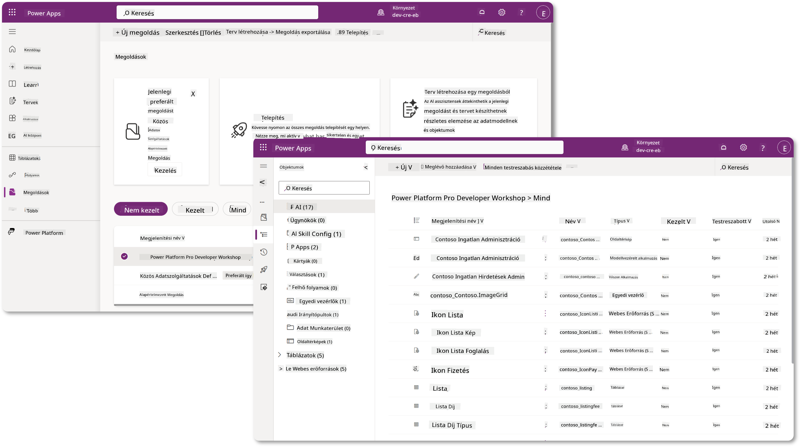
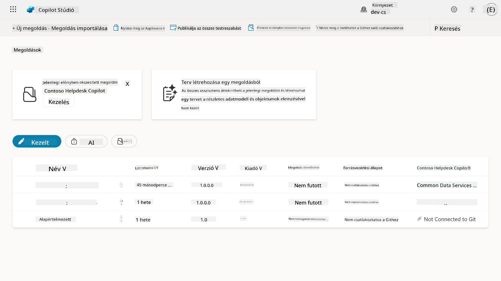
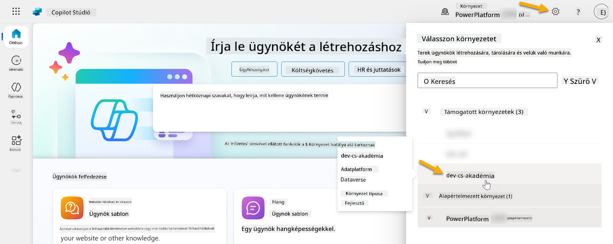
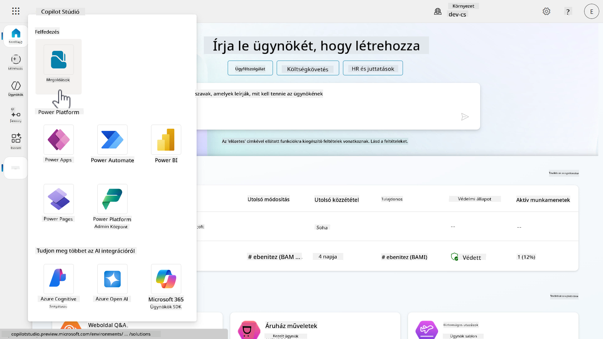
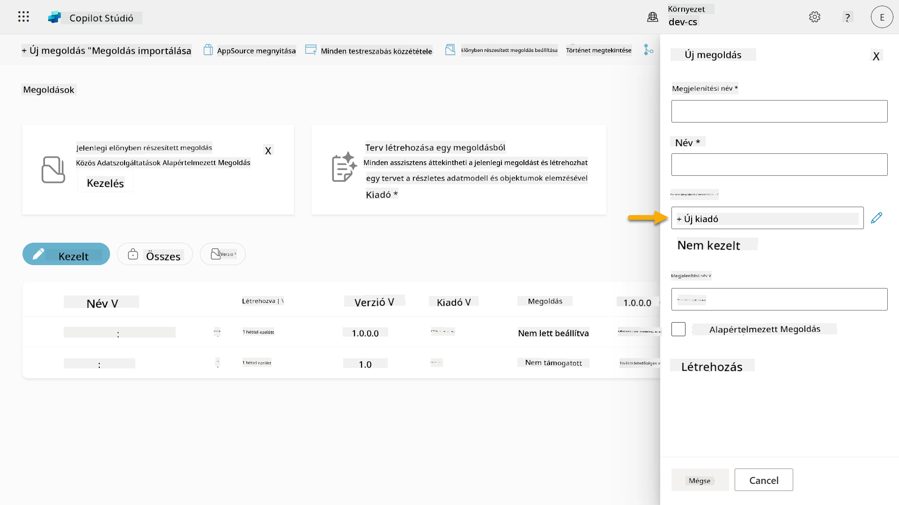
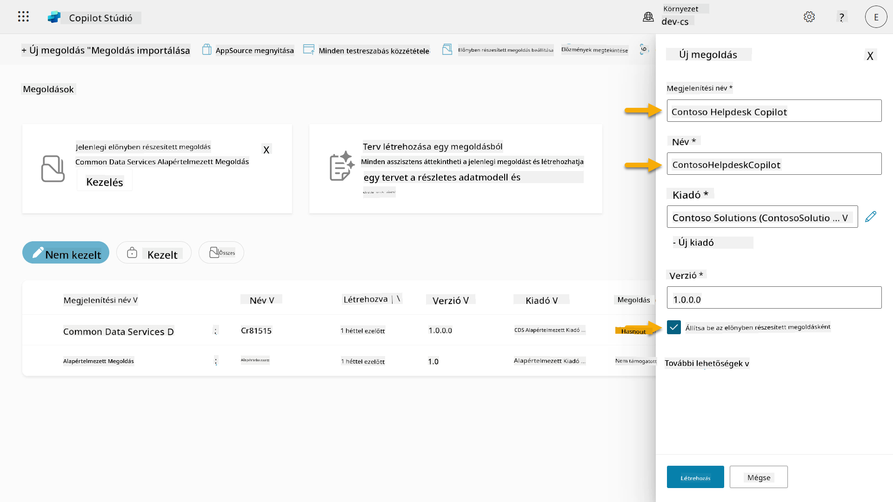
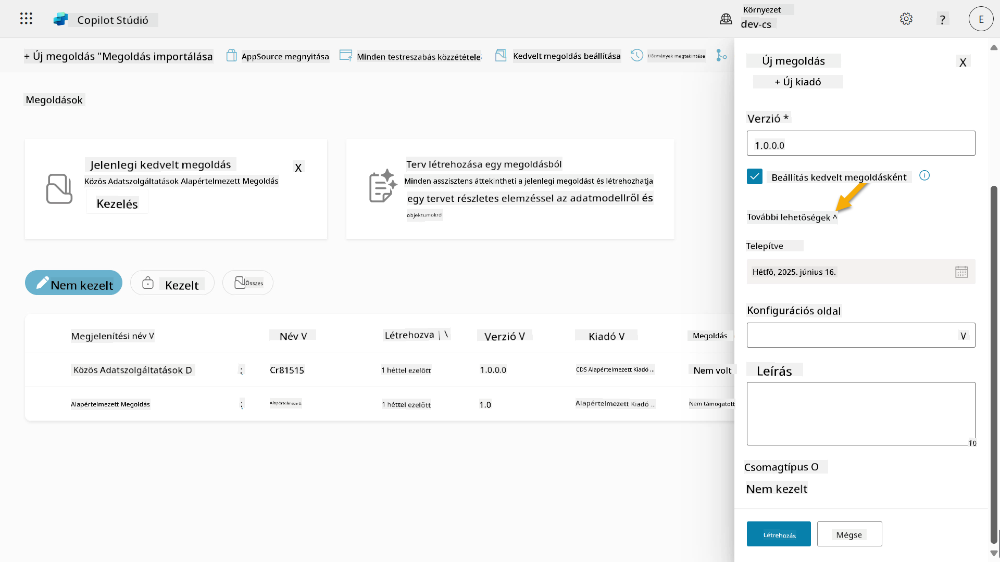
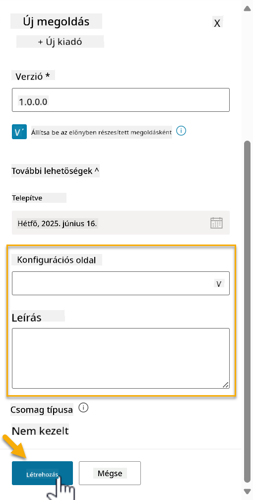
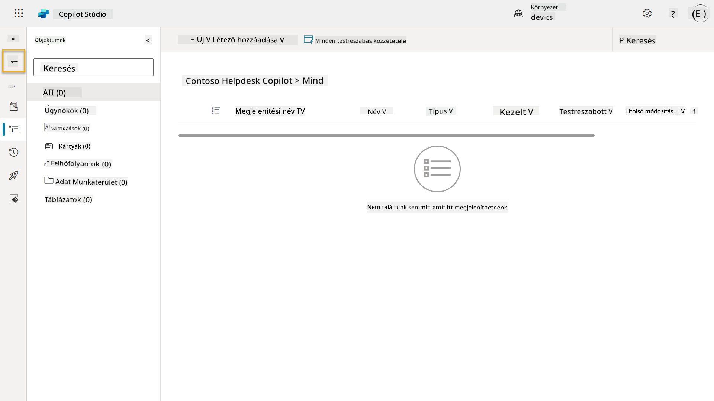
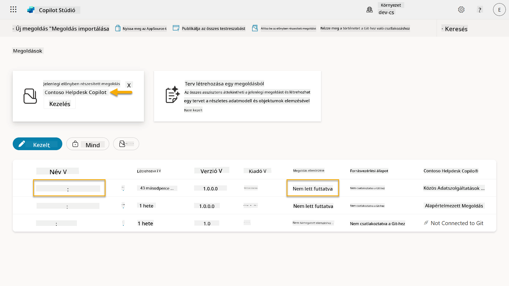

<!--
CO_OP_TRANSLATOR_METADATA:
{
  "original_hash": "0c51aabca81d6256990caf4c015e6195",
  "translation_date": "2025-10-20T17:32:02+00:00",
  "source_file": "docs/recruit/04-creating-a-solution/README.md",
  "language_code": "hu"
}
-->
# 🚨 Küldetés 04: Megoldás létrehozása az ügynököd számára

## 🕵️‍♂️ KÓDNEVE: `OPERATION CTRL-ALT-PACKAGE`

> **⏱️ Küldetés időkerete:** `~45 perc`

🎥 **Nézd meg az útmutatót**

[](https://www.youtube.com/watch?v=1iATbkgfcpU "Nézd meg az útmutatót a YouTube-on")

## 🎯 Küldetés összefoglaló

Ügynökkészítő, üdvözlünk a következő taktikai műveletben. Ebben a küldetésben megtanulod, hogyan állíts össze egy Megoldást - az IT Helpdesk Ügynököd hivatalos telepítési eszközét, amelyet a Microsoft Copilot Studio-val készítettél. Gondolj erre úgy, mint egy digitális aktatáskára, amely az ügynöködet és annak elemeit tartalmazza.

Minden ügynöknek szüksége van egy jól strukturált otthonra. Ezt biztosítja a Power Platform megoldás - rendet, hordozhatóságot és készenlétet a termelésre.

Csomagoljunk össze.

## 🔎 Célkitűzések

Ebben a küldetésben megtanulod:

1. Megérteni, hogy mik a Power Platform megoldások és milyen szerepet játszanak az ügynök fejlesztésében
1. Megismerni a megoldások előnyeit az ügynökök szervezésében és telepítésében
1. Felfedezni a megoldás kiadókat és azok fontosságát az összetevők kezelésében
1. Megérteni a Power Platform megoldás életciklusát a fejlesztéstől a termelésig
1. Létrehozni saját megoldás kiadót és egyedi megoldást az IT Helpdesk Ügynököd számára

## 🕵🏻‍♀️ Megoldás? Mi az?

A Microsoft Power Platformban a megoldások olyan konténerek vagy csomagok, amelyek az alkalmazásaid vagy ügynökeid összes részét tartalmazzák - ezek lehetnek táblák, űrlapok, folyamatok és egyedi logikák. A megoldások elengedhetetlenek az Alkalmazás Életciklus Kezeléshez (ALM), lehetővé teszik az alkalmazásaid és ügynökeid kezelését az ötlettől a fejlesztésen, tesztelésen, telepítésen és frissítéseken át.

A Copilot Studio-ban minden létrehozott ügynök egy Power Platform megoldásban van tárolva. Alapértelmezés szerint az ügynökök az Alapértelmezett megoldásban jönnek létre, hacsak nem hozol létre egy új egyedi megoldást, amelyben az ügynöködet létrehozod. Ezt fogjuk megtanulni 🤓 ebben a leckében és a gyakorlati laborban.

A megoldásokat hagyományosan a **Power Apps készítő portálon** hozták létre - egy webes felületen, ahol alkalmazásokat, Dataverse-t, folyamatokat lehet építeni és testre szabni, valamint AI komponenseket felfedezni.

   

A Copilot Studio-ban most már van **Megoldáskezelő**, ahol közvetlenül kezelheted a megoldásaidat. Nem kell átváltanod a Power Apps készítő portálra a megoldások kezeléséhez, ezt közvetlenül a Copilot Studio-ban elvégezheted 🪄

Ez azt jelenti, hogy elvégezheted a szokásos megoldáskapcsolatos feladatokat:

- **Megoldás létrehozása** - az egyedi megoldások lehetővé teszik az ügynökök exportálását és importálását különböző környezetek között.
- **Kedvenc megoldás beállítása** - válaszd ki, melyik megoldásban jönnek létre alapértelmezés szerint az ügynökök, alkalmazások stb.
- **Összetevők hozzáadása vagy eltávolítása** - az ügynököd hivatkozhat más összetevőkre, például környezeti változókra vagy felhőfolyamatokra. Ezért ezeket az összetevőket be kell vonni a megoldásba.
- **Megoldások exportálása** - megoldások áthelyezése más célkörnyezetbe.
- **Megoldások importálása** - máshol létrehozott megoldások importálása, beleértve a frissítést vagy frissítéseket.
- **Megoldáscsatornák létrehozása és kezelése** - megoldások telepítésének automatizálása környezetek között.
- **Git integráció** - lehetővé teszi a fejlesztők számára, hogy megoldásokat Git tárolókkal kapcsoljanak össze verziókezelés, együttműködés és ALM céljából. Csak fejlesztői környezetekben használható.

   

Kétféle megoldás létezik:

- **Nem kezelt megoldások** - fejlesztés során használatosak. Szabadon szerkeszthetők és testre szabhatók.
- **Kezelt megoldások** - amikor készen állsz az alkalmazás tesztelésre vagy termelésre való telepítésére. Ezek zárolva vannak, hogy elkerüljék a véletlen módosításokat.

## 🤔 Miért _kellene_ megoldást használnom az ügynökömhöz?

Gondolj a megoldásokra, mint egy _szerszámosládára_. Amikor valamit meg kell javítanod vagy építened (egy ügynököt) egy másik helyen (környezetben), összegyűjtöd az összes szükséges eszközt (összetevőt), és beteszed őket a szerszámosládába (Megoldás). Ezután elviheted ezt a szerszámosládát az új helyre (környezetbe), és használhatod az eszközöket (összetevőket) a munkád elvégzéséhez, vagy új eszközöket (összetevőket) adhatsz hozzá az ügynököd vagy projekted testreszabásához.

!!! quote "Elaiza, a barátságos felhőszószólód itt van 🙋🏻‍♀️, hogy megosszon néhány gondolatot:"
    Új-Zélandon van egy mondásunk: "Légy tiszta Kiwi!" Ez egy felhívás az új-zélandiak számára 🥝, hogy vállaljanak felelősséget környezetükért, megfelelően dobják el a szemetet, és tartsák tisztán a közterületeket. Ugyanezt az elvet alkalmazhatjuk az ügynökökre is, ha mindent, ami az ügynököddel kapcsolatos, szervezetten és hordozhatóan tartasz, ez segít tiszta környezetet fenntartani.

Jó gyakorlat, ha az ügynököt egy dedikált megoldásban hozod létre a forrás (fejlesztői) környezetedben. Íme, miért értékesek a megoldások:

🧩 **Szervezett fejlesztés**

- Az ügynöködet elkülöníted az Alapértelmezett megoldástól, amely mindent tartalmaz a környezetben. Az ügynököd összes összetevője egy helyen van 🎯

- Minden, amire az ügynöködhöz szükséged van, egy megoldásban van, így könnyebb exportálni és importálni egy célkörnyezetbe 👉🏻 ez az ALM egészséges szokása.

🧩 **Biztonságos telepítés**

- Az alkalmazásodat vagy ügynöködet exportálhatod kezelt megoldásként, és telepítheted más célkörnyezetekbe (például tesztelés vagy termelés) anélkül, hogy kockáztatnád a véletlen módosításokat.

🧩 **Verziókezelés**

- Készíthetsz javításokat (célzott hibajavítások), frissítéseket (átfogóbb változtatások) vagy frissítéseket (megoldás cseréje - általában nagyobb változtatások és új funkciók bevezetése).

- Segít a változtatások ellenőrzött bevezetésében.

🧩 **Függőségkezelés**

- A megoldások nyomon követik, hogy mely részek függenek másoktól. Ez megakadályozza, hogy változtatások során dolgokat elronts.

🧩 **Csapatmunka**

- A fejlesztők és készítők együtt dolgozhatnak nem kezelt megoldásokon a fejlesztés során, majd átadhatnak egy kezelt megoldást a telepítéshez.

## 🪪 A Megoldás Kiadók megértése

A Power Platformban a Megoldás Kiadó olyan, mint egy címke vagy márka, amely azonosítja, hogy ki hozta létre vagy birtokolja a megoldást. Ez egy kicsi, de fontos része az alkalmazások, ügynökök és folyamat testreszabások kezelésének, különösen csapatokban vagy környezetek között dolgozva.

Amikor létrehozol egy megoldást, kiadót kell választanod. Ez a kiadó határozza meg:

- Egy előtagot, amelyet minden egyedi összetevőhöz hozzáadnak (például táblák, mezők és folyamatok).

- Egy nevet és kapcsolattartási információt a szervezetről vagy személyről, aki a megoldást birtokolja.

### 🤔 Miért fontos?

1. **Könnyű azonosítás** - az előtag (példa - `new_` vagy `abc_`) segít gyorsan azonosítani, hogy mely összetevők tartoznak melyik megoldáshoz vagy csapathoz.

1. **Elkerüli az ütközéseket** - ha két csapat létrehoz egy oszlopot, amelynek neve státusz, az előtagjaik (`teamA_status`, `teamB_status`) megakadályozzák a névütközéseket.

1. **Támogatja az ALM-et** - amikor megoldásokat mozgatunk környezetek között (Fejlesztés → Teszt → Termelés), a kiadó segít nyomon követni a tulajdonjogot és fenntartani a konzisztenciát.

### ✨ Példa

Tegyük fel, hogy létrehozol egy kiadót Contoso Solutions néven, az előtagja pedig `cts_`.

Ha hozzáadsz egy egyedi oszlopot _Prioritás_ néven, az `cts_Priority` néven lesz tárolva a megoldásban.

Bárki, aki találkozik az oszloppal megoldás szinten, függetlenül attól, hogy melyik környezetben van, könnyen azonosíthatja, hogy ez egy oszlop, amely a Contoso Solutions-hoz kapcsolódik.

## 🧭 Power Platform Megoldás életciklus

Most, hogy megérted a Megoldás célját, tanuljuk meg az életciklusát.

**1. Megoldás létrehozása a Fejlesztési környezetben** - kezdj egy új megoldás létrehozásával a Fejlesztési környezetben.

**2. Összetevők hozzáadása** - adj hozzá alkalmazásokat, folyamatokat, táblákat és más elemeket a megoldásodhoz.

**3. Exportálás kezelt megoldásként** - csomagold a megoldásodat telepítésre, exportálva azt kezelt megoldásként.

**4. Importálás Teszt környezetbe** - teszteld a megoldásodat egy külön Teszt környezetben, hogy megbizonyosodj arról, hogy minden megfelelően működik.

**5. Importálás Termelési környezetbe** - telepítsd a tesztelt megoldást az élő Termelési környezetbe.

**6. Javítások, Frissítések vagy Frissítések alkalmazása** - végezz fejlesztéseket vagy javításokat javítások, frissítések vagy frissítések segítségével. 🔁 Ismételd meg a ciklust!

### ✨ Példa

Képzeld el, hogy egy IT helpdesk ügynököt építesz, amely segít az alkalmazottaknak olyan problémákban, mint eszközproblémák, hálózati hibaelhárítás, nyomtató beállítás és mások.

- Fejlesztési környezetben kezdesz egy nem kezelt megoldással.

- Amikor készen áll, exportálod kezelt megoldásként, és importálod egy célkörnyezetbe, például Rendszerteszt vagy Felhasználói Elfogadási Teszt (UAT) környezetbe.

- A tesztelés után áthelyezed a Termelési környezetbe - mindezt anélkül, hogy az eredeti fejlesztési verziót érintenéd.

## 🧪 Labor 04: Új Megoldás létrehozása

Most megtanuljuk

- [4.1 Hogyan hozzunk létre Megoldás kiadót](../../../../../docs/recruit/04-creating-a-solution)
- [4.2 Hogyan hozzunk létre egy Megoldást](../../../../../docs/recruit/04-creating-a-solution)

Maradunk az előző példánál, ahol egy megoldást hozunk létre a dedikált Copilot Studio környezetben, hogy az IT helpdesk ügynökünket építsük.

Kezdjük!

### Előfeltételek

#### Biztonsági szerepkör

A Copilot Studio-ban, hogy mit _tehetsz_ a megoldáskezelőben, az a felhasználói biztonsági szerepkörödtől függ.
Ha nincs engedélyed a megoldások kezelésére a Power Apps adminisztrációs központban, akkor ezeket a feladatokat a Copilot Studio-ban sem tudod elvégezni.

Annak érdekében, hogy minden zökkenőmentesen működjön, ellenőrizd, hogy rendelkezel-e a megfelelő biztonsági szerepkörökkel és engedélyekkel. Ha nem te kezeled a környezeteket a szervezetedben, kérd az IT adminisztrátor (vagy az ezzel egyenértékű) csapatot, aki a bérlődet/környezeteket kezeli.

Az alábbiak azok a biztonsági szerepkörök, amelyek lehetővé teszik a felhasználók számára, hogy megoldást hozzanak létre a környezetükben.

| Biztonsági szerepkör    | Leírás |
| ---------- | ---------- |
| Környezetkészítő | Biztosítja a szükséges engedélyeket a források létrehozásához, testreszabásához és kezeléséhez egy adott környezetben, beleértve a megoldásokat  |
| Rendszer testreszabó  | Szélesebb engedélyek, mint a Környezetkészítő, beleértve a környezet testreszabását és a biztonsági szerepkörök kezelését |
| Rendszer adminisztrátor   | Legmagasabb szintű engedélyekkel rendelkezik, és a környezet minden aspektusát kezelheti, beleértve a biztonsági szerepkörök létrehozását és hozzárendelését     |

#### Fejlesztői környezet

Győződj meg róla, hogy átváltasz a dedikált fejlesztői környezetedre, lásd [Lecke 00 - Kurzus beállítása - 3. lépés: Új fejlesztő létrehozása](../00-course-setup/README.md#step-3-create-new-developer-environment).

1. A jobb felső sarokban válaszd ki a **Fogaskerék** ikont, és válts az alapértelmezett környezetből a saját környezetedre, például **Adele Vance környezete**.

    

### 4.1 Megoldás kiadó létrehozása

1. Használva ugyanazt a Copilot Studio környezetet, amelyet az előző leckében használtál, válaszd ki a **három pont ikont (. . .)** a bal oldali menüben a Copilot Studio-ban. Válaszd ki a **Megoldások** opciót az **Felfedezés** fejléc alatt.

    

1. A **Megoldáskezelő** betöltődik a
1. Az Új kiadó panel bezárul, és visszakerülsz az **Új megoldás** panelre, ahol az újonnan létrehozott Kiadó lesz kiválasztva.

      

Gratulálok, most létrehoztál egy Megoldás Kiadót! 🙌🏻 Következő lépésként megtanuljuk, hogyan hozzunk létre egy új egyedi megoldást.

### 4.2 Új megoldás létrehozása

1. Most, hogy létrehoztuk a kiadónkat, kitölthetjük az **Új megoldás** panel többi részét.

    Másold be a következőt **Megjelenítési névként**,

    ```text
    Contoso Helpdesk Agent
    ```

    Másold be a következőt **Névként**,

    ```text
    ContosoHelpdeskAgent
    ```

    Mivel új megoldást hozunk létre, az [**Verzió** szám](https://learn.microsoft.com/power-apps/maker/data-platform/update-solutions#understanding-version-numbers-for-updates/?WT.mc_id=power-172615-ebenitez) alapértelmezés szerint `1.0.0.0` lesz.

    Jelöld be a **Beállítás alapértelmezett megoldásként** jelölőnégyzetet.

      

1. Bontsd ki a **További opciók** részt, hogy megtekintsd a megoldásban megadható további részleteket.

    

1. A következőket fogod látni:

    - **Telepítve ekkor** - a dátum, amikor a megoldás telepítve lett.

    - **Konfigurációs oldal** - a fejlesztők HTML webes erőforrást állítanak be, hogy segítsenek a felhasználóknak az alkalmazásukkal, ügynökükkel vagy eszközükkel való interakcióban, ahol ez az Információ szekcióban jelenik meg utasításokkal vagy gombokkal. Ez főként olyan cégek vagy fejlesztők által használt funkció, akik megoldásokat építenek és osztanak meg másokkal.

    - **Leírás** - a megoldás vagy a konfigurációs oldal magas szintű leírása.

    Ezeket üresen hagyjuk ebben a gyakorlatban.

    Válaszd a **Létrehozás** lehetőséget.

    

1. A Contoso Helpdesk Agent megoldás most létre lett hozva. Nem lesznek benne komponensek, amíg létre nem hozunk egy ügynököt a Copilot Studio-ban.

    Kattints a **vissza nyíl** ikonra, hogy visszatérj a Megoldáskezelőbe.

    

1. Figyeld meg, hogy a Contoso Helpdesk Agent most **Alapértelmezett megoldásként** jelenik meg, mivel korábban bejelöltük a **Beállítás alapértelmezett megoldásként** jelölőnégyzetet.

    

## ✅ Küldetés Teljesítve

Gratulálok! 👏🏻 Létrehoztál egy Kiadót, és felhasználtad az újonnan létrehozott Megoldásban, hogy felépítsd az ügynöködet!

Szép munka, Ügynökkészítő! Egy rendezett digitális lábnyom az első lépés a skálázhatóság felé. Most már megvannak az eszközeid és a gondolkodásmódod a fenntartható, vállalati szintű ügynökfejlesztéshez.

Ez a **4. labor - Megoldás létrehozása** vége, kattints az alábbi linkre, hogy továbblépj a következő leckére. Az ebben a laborban létrehozott megoldás a következő lecke laborjában lesz használva.

⏭️ [Tovább a **Gyors kezdés előre elkészített ügynökökkel** leckére](../05-using-prebuilt-agents/README.md)

## 📚 Taktikai Források

🔗 [Megoldás létrehozása](https://learn.microsoft.com/power-apps/maker/data-platform/create-solution/?WT.mc_id=power-172615-ebenitez)

🔗 [Megoldások létrehozása és kezelése a Copilot Studio-ban](https://learn.microsoft.com/microsoft-copilot-studio/authoring-solutions-overview/?WT.mc_id=power-172615-ebenitez)

🔗 [Ügynökök megosztása más felhasználókkal](https://learn.microsoft.com/microsoft-copilot-studio/admin-share-bots/?WT.mc_id=power-172615-ebenitez)

🔗 [Előre meghatározott biztonsági szerepkörökhöz elérhető erőforrások összefoglalása](https://learn.microsoft.com/power-platform/admin/database-security#summary-of-resources-available-to-predefined-security-roles/?WT.mc_id=power-172615-ebenitez)

🔗 [Megoldás frissítése vagy frissítése](https://learn.microsoft.com/power-apps/maker/data-platform/update-solutions/?WT.mc_id=power-172615-ebenitez)

🔗 [Áttekintés a Power Platform csővezetékeiről](https://learn.microsoft.com/power-platform/alm/pipelines/?WT.mc_id=power-172615-ebenitez)

🔗 [Áttekintés a Power Platform Git integrációjáról](https://learn.microsoft.com/power-platform/alm/git-integration/overview/?WT.mc_id=power-172615-ebenitez)


---

**Felelősség kizárása**:  
Ez a dokumentum az [Co-op Translator](https://github.com/Azure/co-op-translator) AI fordítási szolgáltatás segítségével lett lefordítva. Bár törekszünk a pontosságra, kérjük, vegye figyelembe, hogy az automatikus fordítások hibákat vagy pontatlanságokat tartalmazhatnak. Az eredeti dokumentum az eredeti nyelvén tekintendő hiteles forrásnak. Kritikus információk esetén javasolt professzionális emberi fordítást igénybe venni. Nem vállalunk felelősséget semmilyen félreértésért vagy téves értelmezésért, amely a fordítás használatából eredhet.