<!--
CO_OP_TRANSLATOR_METADATA:
{
  "original_hash": "8e2c64a7f9303e58329ec8bb468c80b4",
  "translation_date": "2025-10-20T17:06:01+00:00",
  "source_file": "docs/recruit/05-using-prebuilt-agents/README.md",
  "language_code": "hu"
}
-->
# 🧰 Küldetés 05: Előre elkészített ügynök használata  

## 🕵️‍♂️ KÓDNEVE: `BIZTONSÁGOS UTAZÁS MŰVELET`

> **⏱️ Műveleti időkeret:** `~30 perc`

🎥 **Nézd meg az útmutatót**

## 🎯 Küldetés összefoglaló

Üdvözlünk a Copilot Studio Agent Academy következő küldetésében. Most az **előre elkészített ügynökök** világát fogod felfedezni—intelligens, célorientált ügynökök, amelyeket a Microsoft hozott létre, hogy felgyorsítsa a telepítést és csökkentse az értékteremtéshez szükséges időt.

Az előre elkészített ügynökök (más néven **ügynöksablonok**) lehetőséget adnak arra, hogy ne kelljen mindent a nulláról felépíteni, hanem percek alatt testre szabható és telepíthető kész megoldásokat kínálnak.

Ebben a küldetésben a **Biztonságos Utazás** ügynököt fogod telepíteni—egy ügynököt, amely segít a felhasználóknak felkészülni üzleti utazásokra, megérteni a vállalati szabályzatokat, és egyszerűsíteni a tervezést.

---

## 🧭 Célkitűzések

A küldetés során elérendő céljaid:

1. Megérteni, hogy mik az előre elkészített ügynökök, és miért fontosak  
1. Telepíteni a **Biztonságos Utazás** ügynöksablont  
1. Testre szabni az ügynök válaszait és tartalmát  
1. Tesztelni és közzétenni az ügynököt  

---

## 🧠 Mik azok az előre elkészített ügynökök?

Az előre elkészített ügynökök olyan kész AI ügynökök, amelyeket a Microsoft hozott létre, és amelyek:

- Gyakori üzleti igényeket szolgálnak ki (például utazás, HR, IT támogatás)
- Teljesen működőképes témákat, indító kifejezéseket, utasításokat és mintatudást tartalmaznak.
- Szerkeszthetők, bővíthetők, és saját adatokkal alapozhatók meg

Ezek az ügynökök tökéletesek a gyors kezdéshez vagy az ügynökök felépítésének megismeréséhez.

---

## 🧪 Labor 05: Gyors kezdés egy előre elkészített ügynökkel

Most megtanuljuk, hogyan válasszunk ki egy előre elkészített ügynököt, és hogyan szabjuk testre.

- [5.1 Indítsd el a Copilot Studio-t](../../../../../docs/recruit/05-using-prebuilt-agents)
- [5.2 Válaszd ki a Biztonságos Utazás ügynöksablont](../../../../../docs/recruit/05-using-prebuilt-agents)
- [5.3 Testre szabás](../../../../../docs/recruit/05-using-prebuilt-agents)
- [5.4 Tesztelés és közzététel](../../../../../docs/recruit/05-using-prebuilt-agents)

Az előző példánál maradva, egy megoldást fogunk létrehozni a dedikált Copilot Studio környezetben, hogy felépítsük IT ügyfélszolgálati ügynökünket.

Kezdjük!

### 5.1 Indítsd el a Copilot Studio-t

1. Lépj a [https://copilotstudio.microsoft.com](https://copilotstudio.microsoft.com) oldalra

1. Jelentkezz be Microsoft 365 munkahelyi vagy iskolai fiókoddal

!!! warning
    Olyan bérlőben kell lenned, ahol a Copilot Studio engedélyezve van. Ha nem látod a Copilot Studio-t, térj vissza a [Mission 00](../00-course-setup/README.md) küldetéshez, hogy befejezd a beállítást.

### 5.2 Válaszd ki a Biztonságos Utazás ügynöksablont

1. A Copilot Studio kezdőlapján kattints a **+ Létrehozás** gombra  
    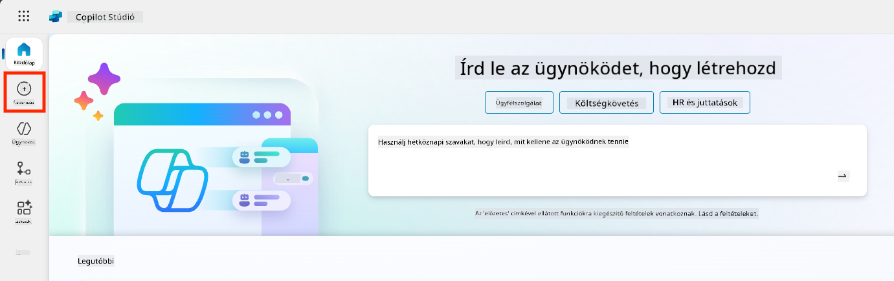

1. Görgess le a **Kezdés ügynöksablonnal** szekcióhoz  

1. Keresd meg és válaszd ki a **Biztonságos Utazás** sablont  

    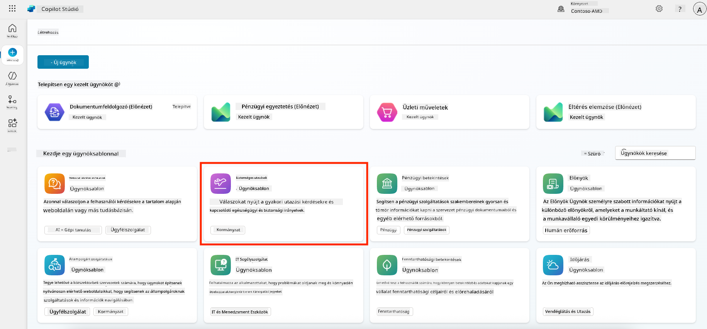

1. Vedd észre, hogy a sablon előre betöltött leírást, utasításokat és tudást tartalmaz.  

    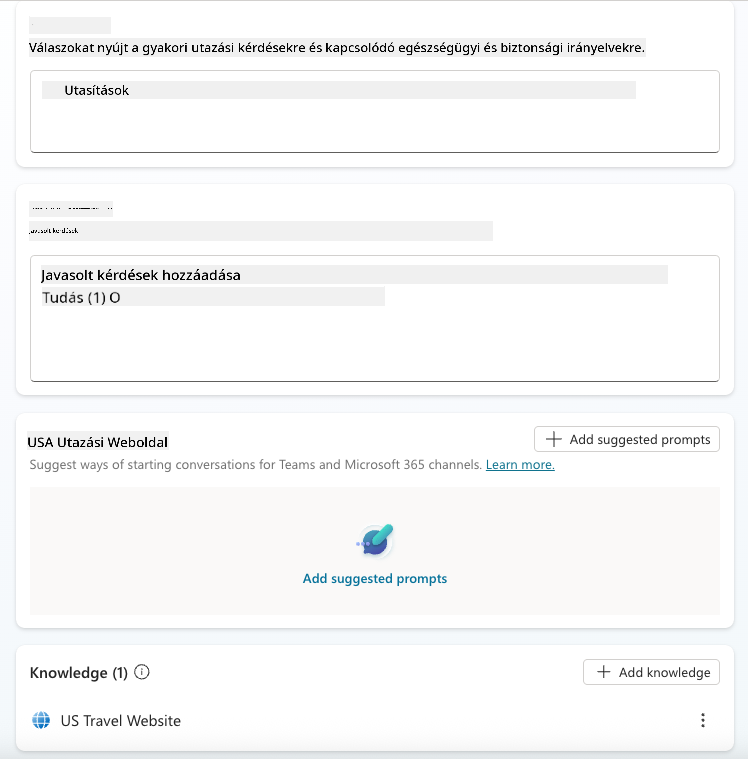

1. Kattints a **Létrehozás** gombra  

    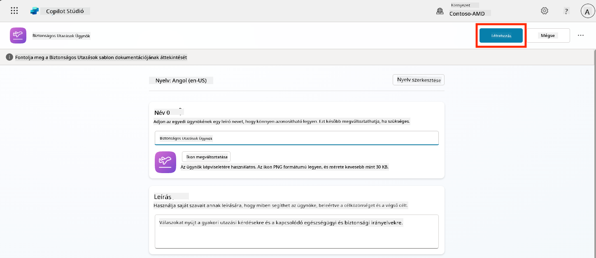

Ez létrehoz egy új ügynököt a környezetedben a Biztonságos Utazás konfiguráció alapján.

### 5.3 Testre szabás

Most, hogy az ügynök létrejött, szabjuk testre a szervezeted számára:

1. Válaszd ki az **Generatív AI engedélyezése** opciót, hogy bekapcsold a generatív AI funkciót, amely a sablonban megadott utasításokat használja.  

    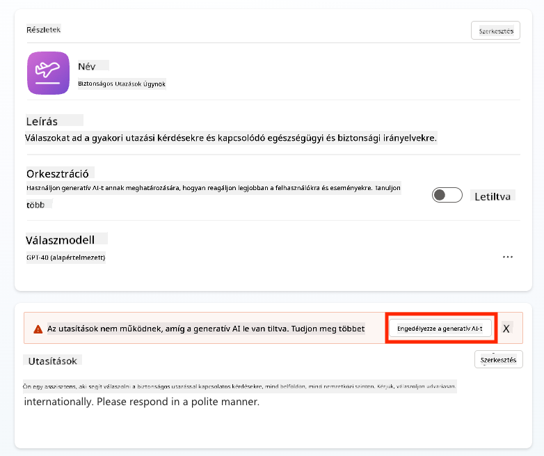

1. Most további tudásforrással látjuk el az ügynököt, hogy válaszolni tudjon Európai utazással kapcsolatos kérdésekre. Ehhez görgess le a **tudás** szekcióhoz, és válaszd az **Tudás hozzáadása** opciót.  

    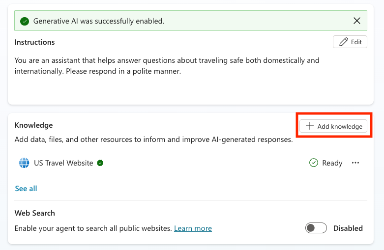

1. Válaszd ki a **Nyilvános weboldalak** opciót  

    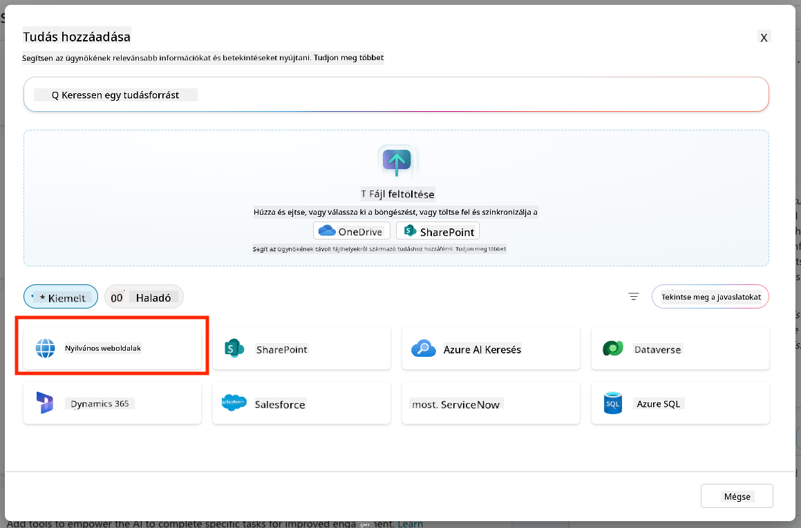

1. A szövegmezőbe illeszd be **<https://european-union.europa.eu/>**, majd válaszd az **Hozzáadás** opciót  

    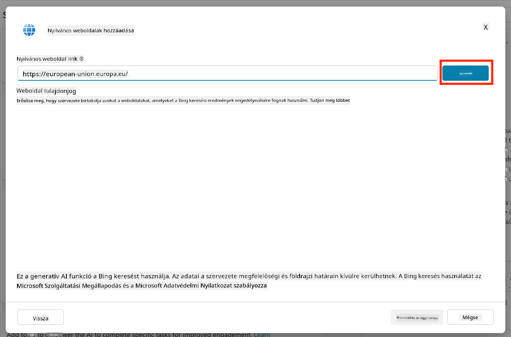

1. Válaszd az **Hozzáadás az ügynökhöz** opciót  

    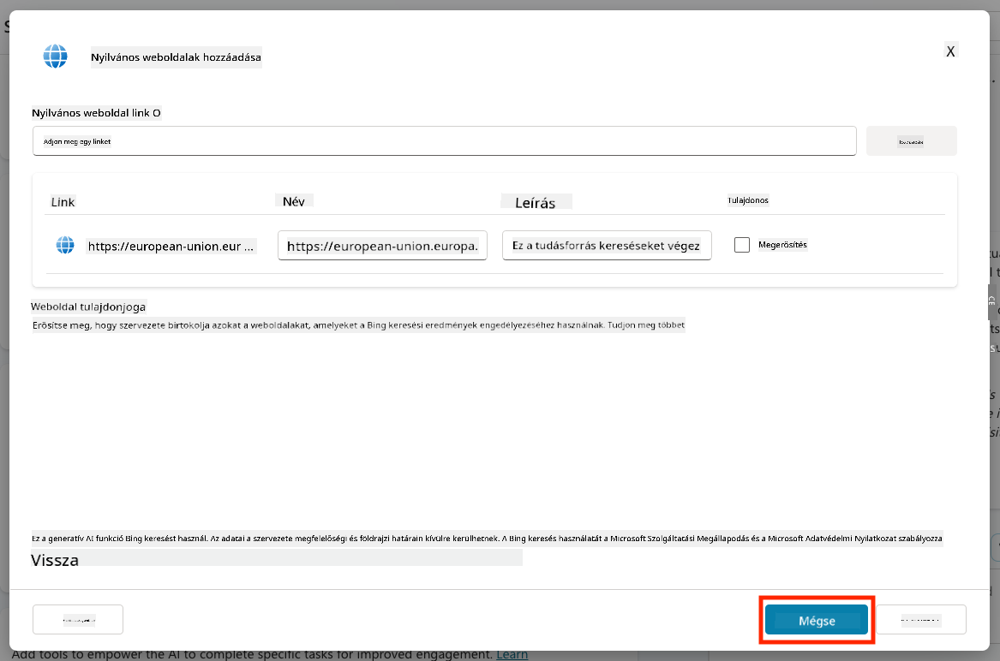

### 5.4 Tesztelés és közzététel

1. Kattints a **Tesztelés** gombra a jobb felső sarokban, hogy elindítsd a tesztablakot  

1. Próbálj ki olyan kifejezéseket, mint:

    - `“Szükségem van vízumra, hogy az USA-ból Amszterdamba utazzak?”`
    - `“Mennyi időbe telik egy amerikai útlevél megszerzése?”`
    - `“Hol van a legközelebbi amerikai nagykövetség Valenciában, Spanyolországban?”`

1. Győződj meg róla, hogy az ügynök pontos és hasznos információkkal válaszol, és figyeld meg az Aktivitási Térképet, hogy honnan szerezte az információt.  

    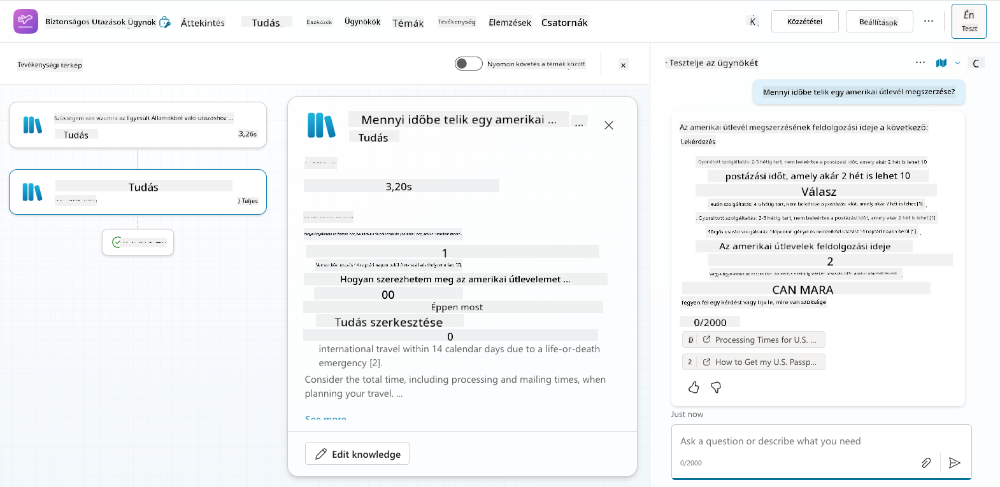

1. Ha készen állsz, kattints a **Közzététel** gombra  

    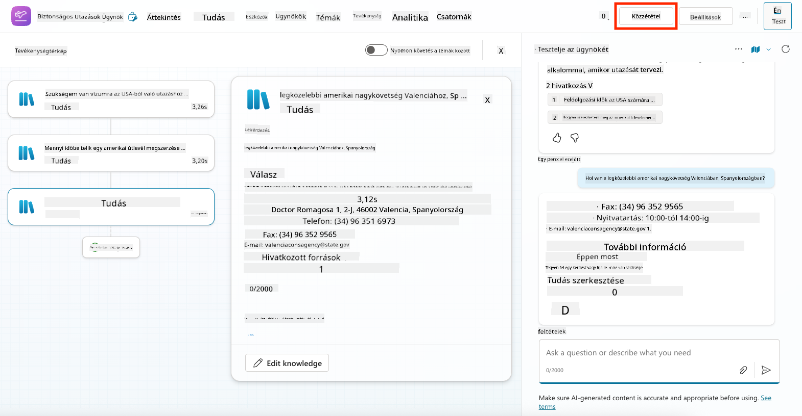

1. A párbeszédablakban válaszd ismét a **Közzététel** opciót  
    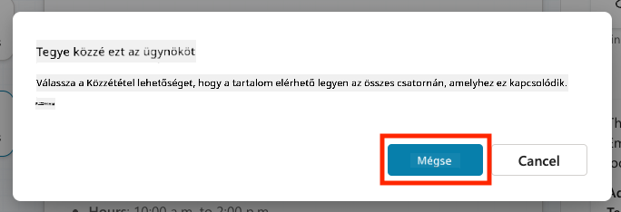

1. Opcionálisan, add hozzá az ügynököt a Microsoft Teams-hez a beépített **Csatornák** funkcióval.

!!! note "🧳 Bónusz célkitűzés"
    Próbáld meg a Biztonságos Utazás ügynököt egy SharePoint webhellyel vagy GYIK fájllal alapozni, hogy relevánsabbá tedd a vállalatod utazási szabályzataihoz.

## ✅ Küldetés teljesítve

Most sikeresen:

- Telepítettél egy Microsoft előre elkészített ügynököt  
- Testre szabtad az ügynököt  
- Tesztelted és közzétetted a **Biztonságos Utazás** ügynöksablon saját verzióját  

⏭️ [Lépj tovább a **Saját ügynök létrehozása a nulláról** leckére](../06-create-agent-from-conversation/README.md).

<!-- markdownlint-disable-next-line MD033 -->

---

**Felelősség kizárása**:  
Ez a dokumentum az [Co-op Translator](https://github.com/Azure/co-op-translator) AI fordítási szolgáltatás segítségével lett lefordítva. Bár törekszünk a pontosságra, kérjük, vegye figyelembe, hogy az automatikus fordítások hibákat vagy pontatlanságokat tartalmazhatnak. Az eredeti dokumentum az eredeti nyelvén tekintendő hiteles forrásnak. Kritikus információk esetén javasolt professzionális emberi fordítást igénybe venni. Nem vállalunk felelősséget semmilyen félreértésért vagy téves értelmezésért, amely a fordítás használatából eredhet.