<!--
CO_OP_TRANSLATOR_METADATA:
{
  "original_hash": "180f9cc0b40527f61be092c9b0f72aba",
  "translation_date": "2025-10-20T17:40:54+00:00",
  "source_file": "docs/recruit/06-create-agent-from-conversation/README.md",
  "language_code": "hu"
}
-->
# 🚨 Küldetés 06: Hozz létre egy egyedi ügynököt természetes nyelv használatával a Copilot segítségével, és alapozd meg saját adataiddal

## 🕵️‍♂️ KÓDNÉV: `ÜGYNÖK KOVÁCS MŰVELET`

> **⏱️ Műveleti időablak:** `~75 perc`

🎥 **Nézd meg az útmutatót**

[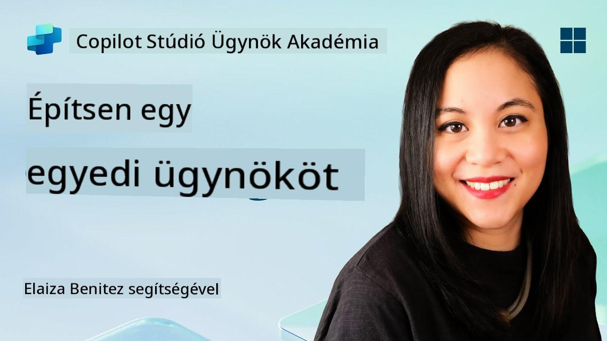](https://www.youtube.com/watch?v=qZTtQVncGFg "Nézd meg az útmutatót a YouTube-on")

## 🎯 Küldetés összefoglaló

Üdv újra, Ügynökkészítő! Ez a küldetés a Copilot Studio legnagyobb erejű képességének irányítását adja a kezedbe - egy egyedi ügynök létrehozását a semmiből, kizárólag természetes nyelv használatával… és a saját adataiddal való felturbózását.

Ez nem csupán egy újabb chatbot. Egy tudással felvértezett digitális munkatársat építesz - olyat, amely képes érvelni, válaszolni és valós vállalati információkra hivatkozni.

A választott fegyvered? Természetes nyelv. A küldetésed? Egy teljesen testreszabott ügyfélszolgálati ügynök megtervezése, betanítása és tesztelése, amely IT kérdésekre válaszol SharePoint, feltöltött fájlok vagy vállalati URL-ek segítségével.

Építsük fel az ügynököt az alapoktól!

## 🔎 Célkitűzések

Ebben a küldetésben megtanulod:

1. Megérteni, hogy mik az egyedi ügynökök, és miben különböznek az előre elkészített sablonoktól
1. Ügynökök létrehozása természetes nyelvi utasítások és beszélgetési tervezés segítségével a Copilotban
1. Ügynökök megalapozása vállalati tudásforrásokkal, beleértve a SharePointot, dokumentumokat és weboldalakat
1. Megismerni a generatív orkestrációt, és hogy az ügynökök hogyan keresnek és válaszolnak dinamikusan több adatforrás használatával
1. Teljesen működőképes IT ügyfélszolgálati ügynök építése és tesztelése, amely képes válaszolni a saját adataidból származó kérdésekre

## 🤔 Mi az a _egyedi_ ügynök?

Egy egyedi ügynök egy chatbot vagy virtuális asszisztens, amelyet te hozol létre és tervezel meg a Copilot Studio-ban, hogy segítsen a felhasználóknak konkrét feladatokban vagy kérdésekben. Azért hívják egyedinek, mert:

- **Te döntöd el a célját** - segít a felhasználóknak szabadságot kérni, rendelési állapotot ellenőrizni, IT kérdésekben segítséget nyújtani.
- **Te határozod meg a beszélgetést** - mit mondjon az ügynök, és hogyan reagáljon.
- **Te alapozod meg a saját adataiddal** - csatlakoztathatod a vállalati adataidat a beépített tudásforrások segítségével.
- **Te kapcsolod össze a saját rendszereiddel vagy alkalmazásaiddal** - választhatsz csatlakozókat, folyamatokat, REST API-kat és modell kontextus protokoll szervereket.

!!! note
    Gondolj rá úgy, mintha a saját digitális segítőt hoznád létre, amely képes beszélgetni a felhasználókkal és elvégezni a feladatokat, például válaszolni a kérdésekre, információt gyűjteni egy folyamat számára, vagy csatlakozni a vállalati adatokhoz.

### 🤖 Mit tud egy egyedi ügynök?

Egy egyedi ügynök képes a következőkre:

- Információt kérni a felhasználóktól, például neveket, dátumokat vagy preferenciákat.
- Elmenteni az információt egy adatbázisba vagy táblázatba.
- Adatokat keresni a feltett kérdések alapján, és válaszolni rájuk.
- Önállóan dolgozni anélkül, hogy a felhasználók közvetlenül interakcióba lépnének az ügynökkel.
- Akciókat indítani igény szerint közvetlen felhasználói interakcióval vagy önállóan, például e-mailek küldése vagy rekordok létrehozása.

### 👩🏻‍💻 Miért használjunk egyedi ügynököt?

- Időt takarít meg az ismétlődő feladatok automatizálásával.
- Barátságos, irányított élményt nyújt a felhasználóknak.
- Testreszabható az üzleti vagy projekt igényeidhez.

### ✨ Példa

Egy egyedi ügynököt hozol létre, amely segít az alkalmazottaknak szabadságot kérni.

Megkérdezi a nevüket, a szabadság időpontjait és a vezetőjük nevét, majd elmenti az információt a szabadságkérelmeket kezelő rendszerbe, például egy SharePoint listába.

Most, ahelyett, hogy a SharePoint listát kellene megnyitniuk és új elemet létrehozniuk, az alkalmazottak egyszerűen az ügynökkel beszélgetve intézhetik el.

## 🗣️ Hozz létre ügynököket természetes nyelv használatával

Korábban megtanultad, hogyan lehet gyorsan ügynököket létrehozni a Copilot Studio-ban előre elkészített ügynöksablonok használatával a [05. lecke - Kezdj gyorsan az előre elkészített ügynökökkel](../05-using-prebuilt-agents/README.md) című részben. Ebben a leckében mélyebben belemerülünk a Copilot beszélgetési létrehozási élményébe. A Copilot Studio megkönnyíti az ügynökök létrehozását azáltal, hogy a Copilottal való beszélgetéshez hasonlóan építjük fel őket.

A Copilot Studio-ban nem kell kódot írnod az ügynök létrehozásához. Ehelyett leírod, mit szeretnél, hogy az ügynök csináljon, és a Copilot lépésről lépésre segít neked a létrehozásban egy beszélgetésszerű élményen keresztül.

## 🌱 De új vagyok a "leírásban, mit szeretnék" - mit tegyek?

Az egyedi ügynök létrehozása természetes nyelv használatával új koncepció lehet számodra. Amikor a Copilotot használod a Microsoft termékek és szolgáltatások között, természetes nyelvet használsz _prompt_ formájában.

A prompt az üzenet vagy utasítás, amelyet egy AI ügynöknek adsz, hogy elmondja, mit szeretnél, hogy csináljon. Gondolj rá úgy, mint egy asszisztensnek adott irányításra. Minél világosabbak az utasításaid, annál könnyebben érti meg az asszisztens, és cselekszik.

### 🪄 Miért fontosak a promtok?

- Irányítják az ügynök viselkedését.
- Segítenek az ügynöknek megérteni, milyen típusú beszélgetést kell folytatnia.
- Egy jó prompt segít az ügynöknek hasznosabbá és pontosabbá válni.

### 📝 Tippek egy jó prompt írásához

- Légy világos és konkrét - mondd el pontosan, mit szeretnél, hogy az ügynök csináljon.
- Gondolkodj a felhasználó fejével - mit fog mondani a felhasználó? Mit kellene válaszolnia az ügynöknek?
- Adj példákat - ha lehetséges, adj mintainterakciót.

### ✨ Példa

Tegyük fel, hogy az HR csapatnak szüksége van egy ügynökre, amely segít a szabadságkérelmekkel.

A prompt lehet:

    „Egy olyan ügynököt szeretnék létrehozni, amely segít a felhasználóknak szabadságot kérni. Amikor egy felhasználó azt mondja, hogy szabadságot szeretne kérni, az ügynöknek meg kell kérdeznie a nevét, a szabadság kezdő dátumát, a szabadság végének dátumát és a vezetője nevét. Miután a felhasználó megadta ezeket az információkat, az ügynöknek el kell mentenie őket egy SharePoint listába, amelynek neve ‘Szabadságkérelmek’, és értesítést kell küldenie egy dedikált Microsoft Teams csatornára.”

Miért működik ez a prompt:

- **Világosan megfogalmazza a célt** - szabadságkérelem benyújtása
- **Leírja a felhasználói interakciót** - mit mond a felhasználó, és mit kell kérdeznie az ügynöknek
- **Felsorolja a szükséges adatokat** - név, kezdő dátum, vég dátum, vezető
- **Megemlíti, hová kerülnek az adatok** - egy SharePoint lista, amelynek neve Szabadságkérelmek

## 🔮 Rendben, létrehoztam az ügynökömet... hogyan alapozhatom meg tudással?

A Copilot Studio-ban a tudásforrások olyan helyek, ahol az ügynököd információt találhat, hogy jobb válaszokat adjon. Amikor hozzáadod ezeket a forrásokat, az ügynököd be tudja vonni a vállalati adataidat olyan helyekről, mint a Power Platform, Dynamics 365, weboldalak és más rendszerek vagy szolgáltatások, amelyeket a céged használ.

Ezek a források az AI-val együttműködve segítenek az ügynöködnek pontosabban válaszolni a felhasználói kérdésekre, ezt a folyamatot **generatív orkestrációnak** nevezzük.

### 🌿 Mi az a generatív orkestráció az ügynökök kontextusában?

A generatív orkestráció azt jelenti, hogy az ügynök AI-t használ, hogy dinamikusan eldöntse, hogyan válaszoljon egy kérdésre, azáltal, hogy beépített nyelvi képességeit kombinálja az általad hozzáadott tudásforrások információival.

Amikor egy felhasználó kérdést tesz fel, az ügynök:

- AI segítségével megérti a kérdést.
- Hiányzó információk esetén kérdéseket generál a helyszínen.
- Kiválasztja a legrelevánsabb tudásforrásokat.
- Keresést végez ezekben a forrásokban válaszokért.
- Természetes, hasznos választ generál az általa talált információk alapján.

### 🏦 Miért fontosak a tudásforrások?

1. **Okosabb válaszok** - amikor tudásforrásokat adsz hozzá, az ügynököd jobb, pontosabb válaszokat tud adni a szervezeted valós adatai alapján.

1. **Kevesebb manuális munka** - nem kell minden lehetséges választ megírnod. Az ügynök kereshet a hozzáadott forrásokban, és automatikusan válaszolhat.

1. **Megbízható információ használata** - az ügynököd válaszokat tud adni olyan rendszerekből, amelyeket már használsz, mint például a Dataverse, SharePoint vagy vállalati weboldalak, így a felhasználók megbízható információkat kapnak egy hiteles forrásból.

1. **Generatív AI-val működik** - a tudásforrások és az AI segítenek az ügynöködnek megérteni a kérdéseket és természetesen válaszolni, még akkor is, ha a kérdés nem volt előre programozva vagy kezdő promptként hozzáadva.

1. **Rugalmas és bővíthető** - bármikor hozzáadhatsz tudásforrásokat a beállítás során vagy később, az ügynököd okosabbá válik, ahogy az igényeid változnak.

### ✨ Példa

Képzeld el, hogy egy ügynököt hozol létre, amely segít az alkalmazottaknak HR kérdésekben. Hozzáadod a cég HR szabályzatát tartalmazó dokumentumot és a SharePoint oldalt tudásforrásként.

Amikor egy alkalmazott megkérdezi, _„Hány nap szabadságra vagyok jogosult?”_, az ügynök generatív orkestrációt használ, hogy keresést végezzen ezekben a forrásokban, és a helyes szabályzatot válaszolja meg anélkül, hogy neked manuálisan kellene megírnod azt a választ. Ez időt takarít meg, mivel nem kell minden lehetséges kérdést előre megválaszolnod, amit egy alkalmazott feltehet a jogosultságaival kapcsolatban.

## Hozzáadható tudásforrások típusai

1. **Nyilvános weboldalak**
    - **Mit csinál:** Keresést végez konkrét weboldalakon (például a céged weboldalán) Bing segítségével.
    - **Miért hasznos:** Kiválóan alkalmas nyilvános információk, például GYIK vagy termékadatok begyűjtésére.

1. **Dokumentumok**
    - **Mit csinál:** Az ügynök által közvetlenül feltöltött dokumentumokat használja, például PDF-eket vagy Word fájlokat. Ezek a feltöltött fájlok biztonságosan tárolódnak a Dataverse-ben.
    - **Miért hasznos:** Lehetővé teszi az ügynök számára, hogy belső útmutatók, kézikönyvek vagy szabályzatok alapján válaszoljon a kérdésekre.

1. **SharePoint**
    - **Mit csinál:** Csatlakozik a SharePoint mappákhoz vagy fájlokhoz a Microsoft Graph Search segítségével.
    - **Miért hasznos:** Ideális csapatdokumentumok, HR szabályzatok vagy SharePointon tárolt projektfájlok eléréséhez.

1. **Dataverse**
    - **Mit csinál:** Strukturált adatokat használ a Dataverse környezeted tábláiból és soraiból, és szinonimákat, valamint szószedeti definíciókat alkalmazhat a táblákhoz és oszlopokhoz az ügynök válaszainak javítása érdekében.
    - **Miért hasznos:** Ha vállalati adatokat kell keresni a Dataverse-ben, például ügyfélinformációkat.

1. **Valós idejű tudás csatlakozókkal**
    - **Mit csinál:** Lehetővé teszi az ügynök számára, hogy élő adatokat érjen el más vállalati rendszerekből, például Salesforce, ServiceNow, Dynamics 365, AzureSQL, Databricks és mások, a felhasználó saját engedélyei alapján.
    - **Miért hasznos:** Friss, biztonságos és pontos válaszokat nyújt anélkül, hogy adatokat tárolna vagy duplikálna, így az ügynök okosabb és biztonságosabb lesz.

1. **Azure AI Search**
    - **Mit csinál:** Lehetővé teszi az ügynök számára, hogy nagy dokumentumkészletek között keressen az Azure-ban, szemantikus és vektoros keresést használva a felhasználói kérdések megértéséhez.
    - **Miért hasznos:** Pontos, megbízható válaszokat nyújt összetett adatforrásokból, támogatja a hivatkozásokat, és jól skálázható nagy dokumentumgyűjteményekhez biztonságos hozzáférés-vezérléssel.

## 🔒 Megjegyzés a biztonságról

### Tudásforrás hitelesítés

Néhány forrás, például a SharePoint és a Dataverse, felhasználói hitelesítést igényel. Ez azt jelenti, hogy az ügynök csak olyan adatokat fog hivatkozni a válaszában, amelyeket a felhasználó láthat. Más források esetében további konfigurációra lehet szükség az ügynök csatlakoztatásához, például az Azure AI Search esetében, amely Azure-fiókot és
Ugyanazt az esettanulmányt fogjuk használni, mint a [03. lecke - Deklaratív ügynök létrehozása a Microsoft 365 Copilot számára](../03-create-a-declarative-agent-for-M365Copilot/README.md#use-case-scenario)

**Mint** alkalmazott

**Azt szeretném**, hogy gyors és pontos segítséget kapjak az IT ügyfélszolgálati ügynöktől olyan problémák esetén, mint eszközhibák, hálózati hibaelhárítás, nyomtató beállítása

**Azért, hogy** produktív maradhassak és késedelem nélkül megoldhassam a technikai problémákat

Kezdjük!

### ✨ Előfeltételek

- **SharePoint webhely**

A **Contoso IT** SharePoint webhelyet fogjuk használni a [00. lecke - Kurzus beállítása - 3. lépés: Új SharePoint webhely létrehozása](../00-course-setup/README.md#step-4-create-new-sharepoint-site) alapján.

Ha még nem állítottad be a **Contoso IT** SharePoint webhelyet, térj vissza a [00. lecke - Kurzus beállítása - 3. lépés: Új SharePoint webhely létrehozása](../00-course-setup/README.md#step-4-create-new-sharepoint-site) részhez.

- **Megoldás**

A **Contoso Helpdesk Agent** megoldást fogjuk használni a [04. lecke - Megoldás létrehozása az ügynök számára](../04-creating-a-solution/README.md#41-create-a-solution-publisher) alapján.

Ha még nem állítottad be a **Contoso Agent** megoldást, térj vissza a [04. lecke - Megoldás létrehozása az ügynök számára](../04-creating-a-solution/README.md#41-create-a-solution-publisher) részhez.

### 6.1 Természetes nyelv használata ügynök létrehozásához a Copilot segítségével

!!! warning "A Copilot kérdései eltérhetnek az egyes munkamenetek során"

    A Copilot beszélgetés alapú létrehozási élménye minden alkalommal változhat, ahol az iránymutatásként szolgáló kérdések kissé eltérhetnek az előzőektől.

1. Lépj a Copilot Studio kezdőlapjára, és a mezőbe írd be a következő utasítást, amely leírja az IT ügyfélszolgálati ügynököt. Az utasítás tartalmazza az ügynök célját, a kontextust, a várható feladatokat és az ügynök válaszának formátumát.

    ```text
    You are an IT help desk agent. Your goal is to assist users with their IT issues. You can access information from our company's knowledge base at https://support.microsoft.com/en-us. Your responses should be polite and helpful. If a user reports a slow computer, ask about the age of the device, current software versions, and if they've recently installed any new programs. If a user is experiencing trouble logging into their email, guide them through password reset procedures. You should be concise and informative, using step-by-step instructions with bullet points when appropriate.
    ```

      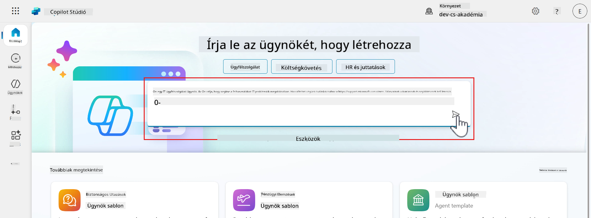

1. Ezután betöltődik a Copilot beszélgetés alapú létrehozási élménye. Látni fogod, hogy a Copilot éppen válaszol neked.

      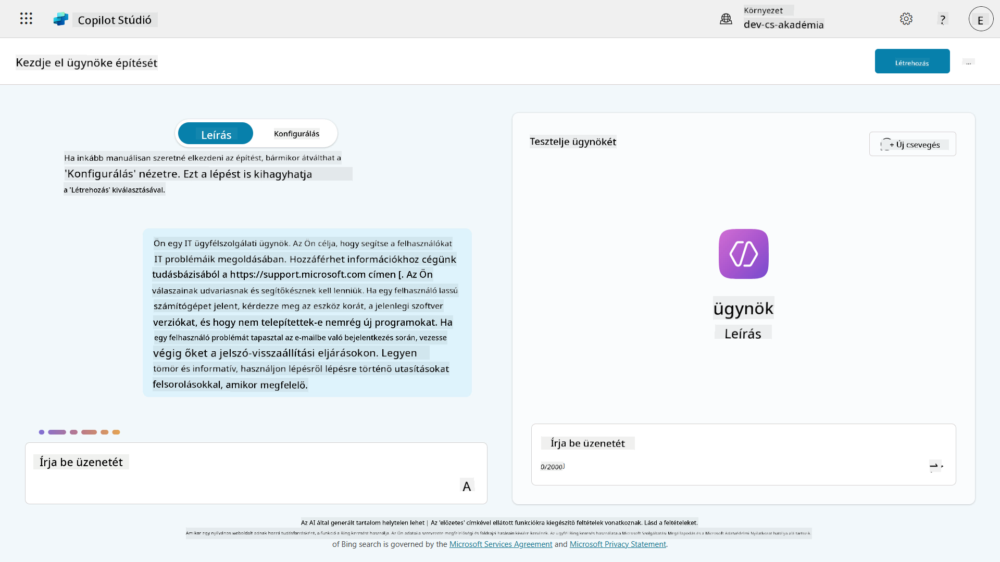

1. A Copilot megerősíti, hogy az ügynök létrehozása az utasítások alapján megtörtént, és megerősítést kér az ügynök nevére vonatkozóan. Kérjük a Copilotot, hogy nevezze el az ügynököt:

       ```text
       Contoso Helpdesk Agent
       ```

      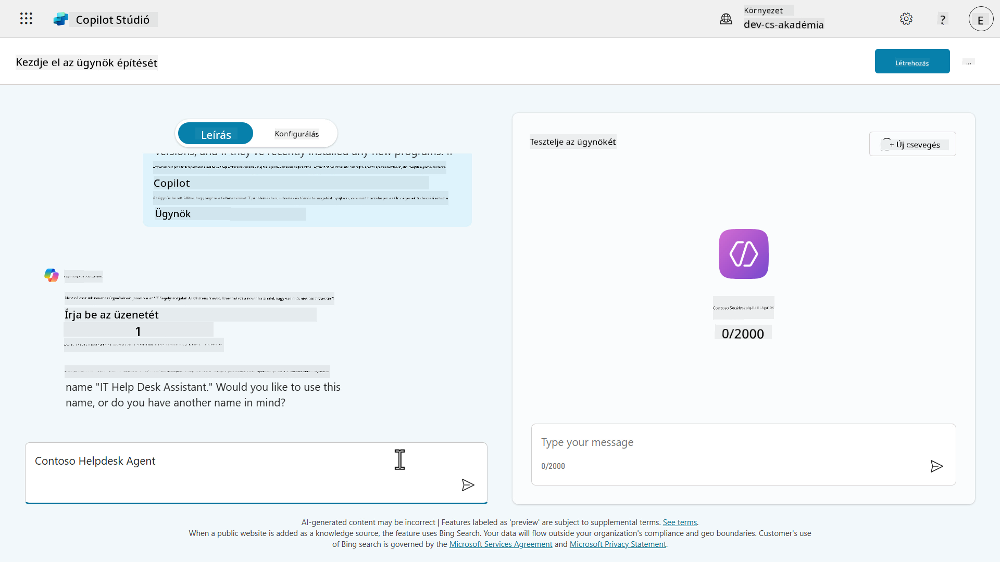

1. A Copilot végrehajtja a kérést, és látni fogjuk, hogy az ügynök neve frissült az ügynök panelen. Ezután a Copilot arra kér minket, hogy finomítsuk az utasításokat. Arra kér, hogy határozzuk meg, hogyan kell válaszolni bizonyos problémákra, és azt kérjük, hogy ismerje el a problémát, adjon példákat a válaszolandó témákra, és formázza a választ felsorolásként.

    Másold be és küldd el a következőt a Copilotnak:

       ```text
       Prioritizálja a sürgős kéréseket. Példák az IT problémákra vagy helyzetekre, amelyekben segíthet: eszközproblémák, hálózati kapcsolódási problémák, bejelentkezési problémák. Hibaelhárításkor először ismerje el a problémát és válaszoljon empátiával, majd lépésről lépésre adjon útmutatást felsorolás formájában, és kérdezze meg, hogy szükség van-e további segítségre.
       ```

      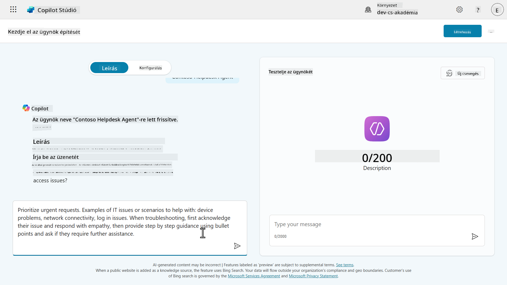

1. Az ügynök utasításai frissülnek, miután a Copilot megkapta a kérést. Figyeld meg, hogy a jobb oldali panelen megjelentek az alapvető utasítások. Ezek az utasításaink alapján lettek kialakítva.

    Ezután a Copilot nyilvános weboldalakat kér, hogy az ügynök tudását megalapozza.

    Másold be és küldd el a következőt a Copilotnak:

      ```text
      https://support.microsoft.com
      ```

      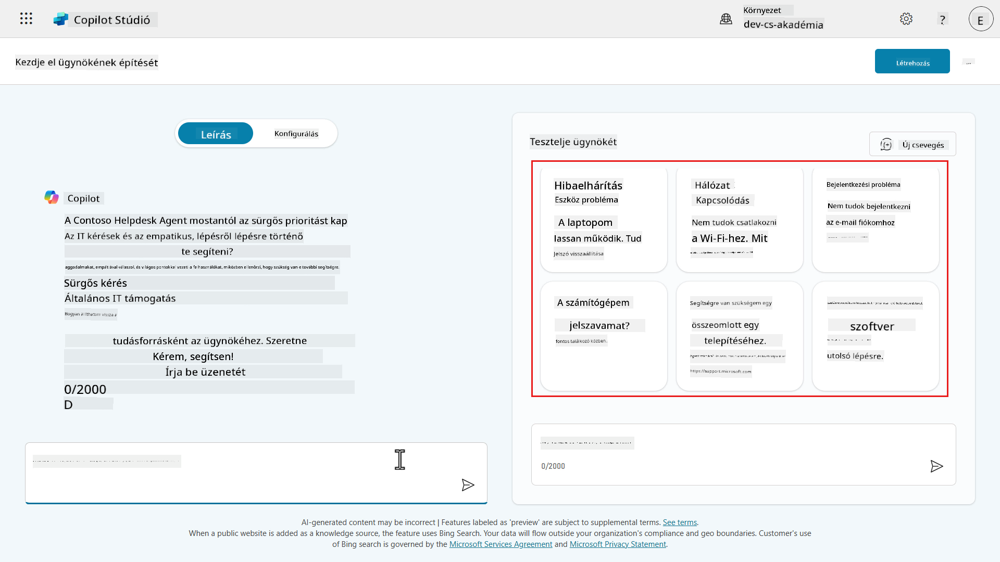

1. A nyilvános weboldal hozzá lesz adva tudásforrásként. A Copilot megkérdezi, hogy további tudásforrásokat kell-e hozzáadni. Nincs szükség további nyilvános weboldalak hozzáadására.

    Másold be és küldd el a következőt a Copilotnak:

      ```text
      Proceed with setup
      ```

      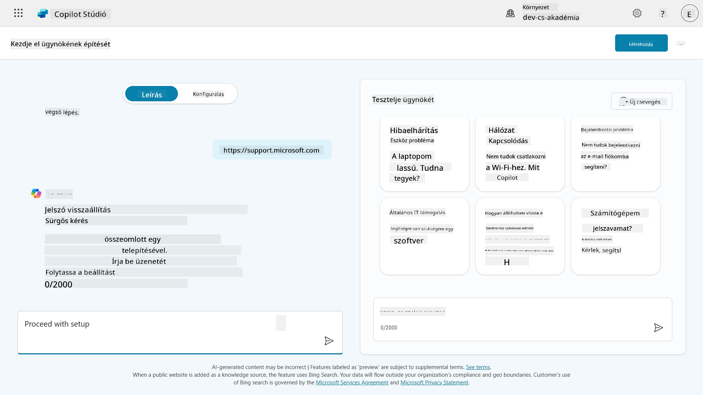

1. A Copilot megerősíti, hogy a Contoso Helpdesk Agent beállítása kész, de még egy módosítást hozzáadunk: kérjük, hogy az ügynök ne válaszoljon HR-rel kapcsolatos kérdésekre. Ez lehetővé teszi az ügynök számára, hogy ne válaszoljon a felhasználók által feltett HR-rel kapcsolatos kérdésekre.

    Másold be és küldd el a következőt a Copilotnak:

       ```text
       Ne nyújtson segítséget HR-rel kapcsolatos kérdésekben, példák: Mi a szabadságom egyenlege? Hány betegnapom van? Mi a bérszámfejtési portál URL-je?
       ```

      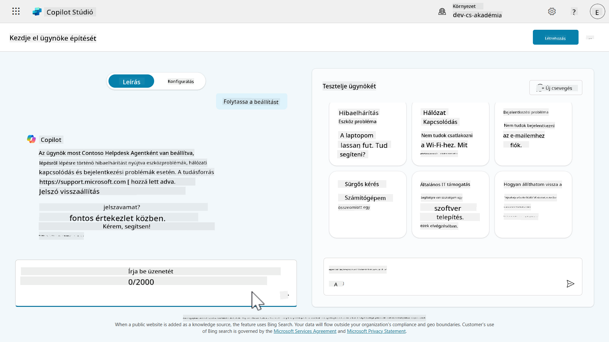

1. Az utasítások frissülnek, hogy ne nyújtsanak segítséget HR-rel kapcsolatos kérdésekben. Nincs szükség további frissítésekre, az ügynök készen áll a létrehozásra.

      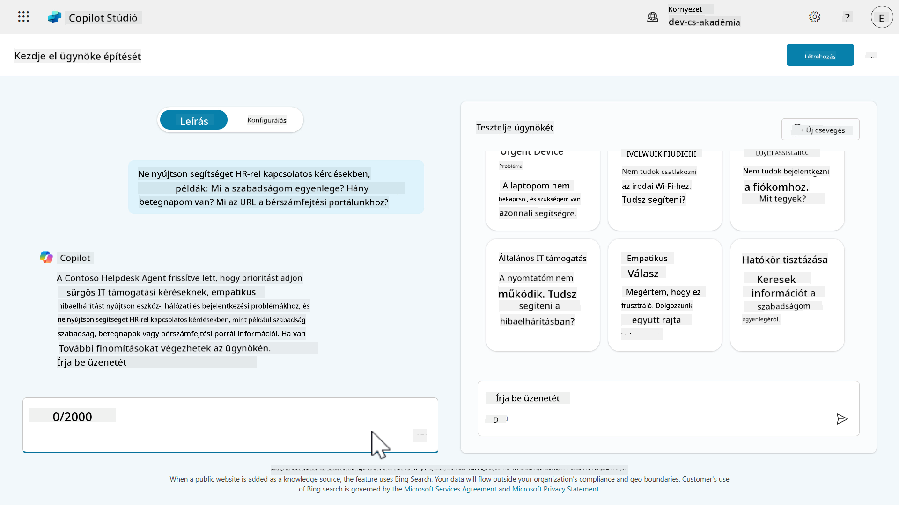

1. Mielőtt létrehoznánk az ügynököt, tegyünk néhány dolgot.

    Először válaszd ki a **Beállítások** fület, hogy megtekintsd az ügynök részleteit, amelyeket a Copilot-tal folytatott beszélgetés során határoztunk meg. Itt láthatod a nevet, leírást, utasításokat, tudást és javasolt/alapvető utasításokat.

      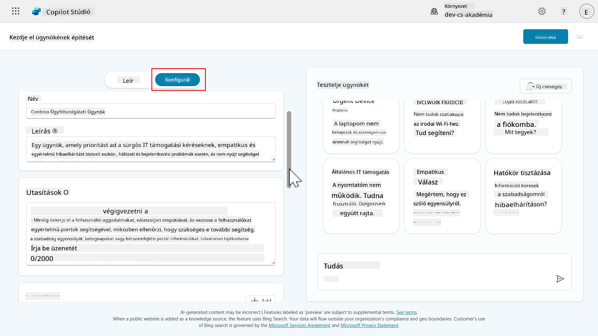

1. Másodszor, teszteljük az ügynököt. Másold be és küldd el a következő kérdést az ügynöknek:

       ```text
       Hogyan ellenőrizhetem a Surface garanciális állapotát?
       ```

      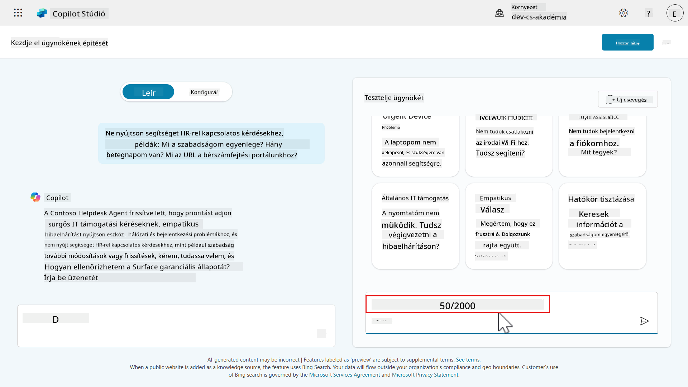

1. A kérdésre adott válasz megjelenik, ahol a válaszok lépésről lépésre útmutatóként vannak felsorolva. Szuper, az ügynök működik! 🙌🏻

      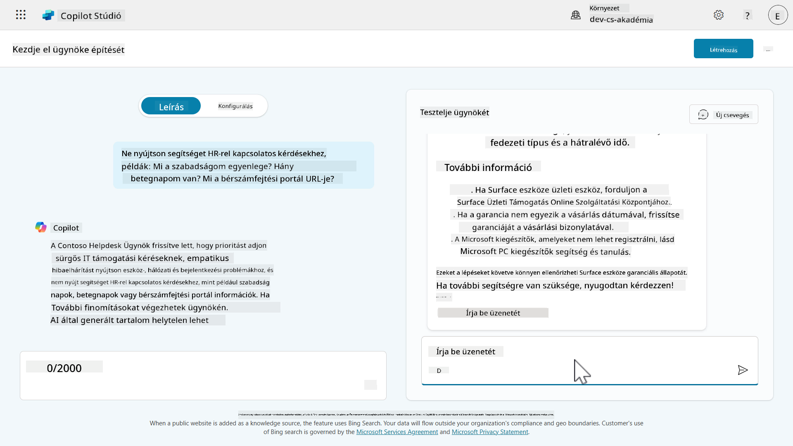

1. Végül ellenőrizzük, hogy az ügynök létrehozásához használt megoldás az a megoldás, amelyet korábban létrehoztunk és kiválasztottunk preferált megoldásként a [04. lecke - Új megoldás létrehozása](../04-creating-a-solution/README.md#42-create-a-new-solution) részben.

    Válaszd ki a **három pont ikont (...)**, majd válaszd az **Advanced Settings frissítése** lehetőséget.

      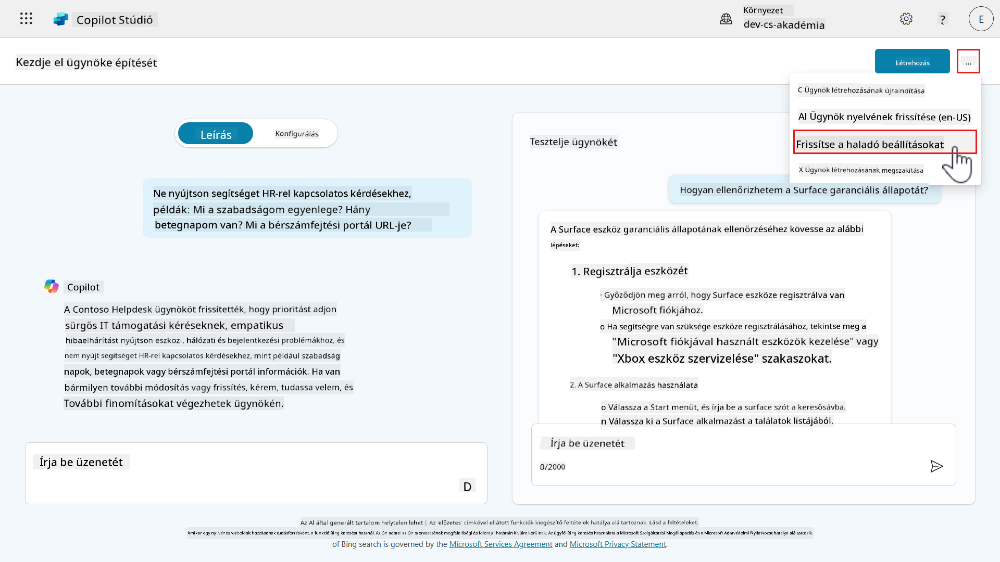

1. Az **Advanced Settings** modális ablak megjelenik, és láthatjuk, hogy az előzőleg létrehozott megoldás alapértelmezés szerint van kiválasztva. Ez annak köszönhető, hogy a megoldásunkat preferált megoldásként választottuk a [04. lecke - Új megoldás létrehozása](../04-creating-a-solution/README.md#42-create-a-new-solution) részben.

    Válaszd a **Mégse** lehetőséget.

      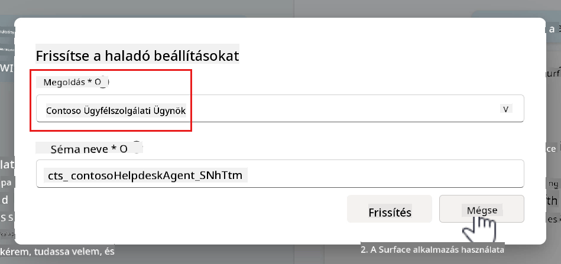

1. Most hozzuk létre az egyedi ügynökünket! Válaszd a **Létrehozás** lehetőséget.

      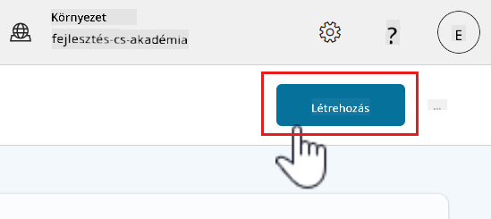

1. A Copilot Studio elkezdi az ügynök létrehozását.

      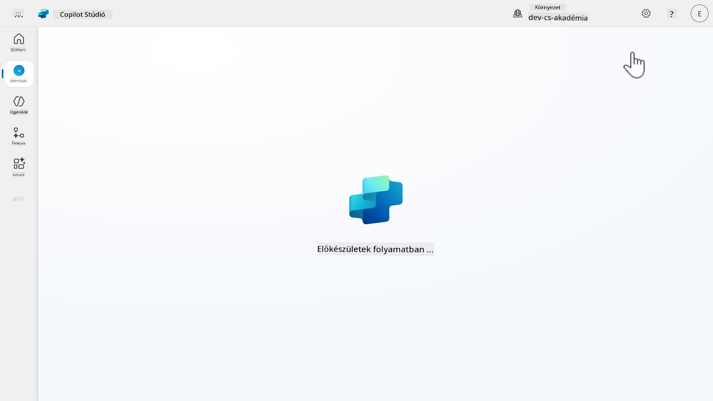

1. Miután az ügynök létrehozása megtörtént, láthatjuk az ügynök részleteit, amelyek tükrözik a Copilot beszélgetés alapú létrehozási élmény során kért beállításokat. Görgess le az ügynök áttekintéséhez, ahol láthatod a nevet, leírást, utasításokat, tudásforrásokat és javasolt utasításokat. Az orchestration mód alapértelmezés szerint engedélyezve van, és az alapértelmezett modell van használatban az ügynök válaszmodelljéhez.

      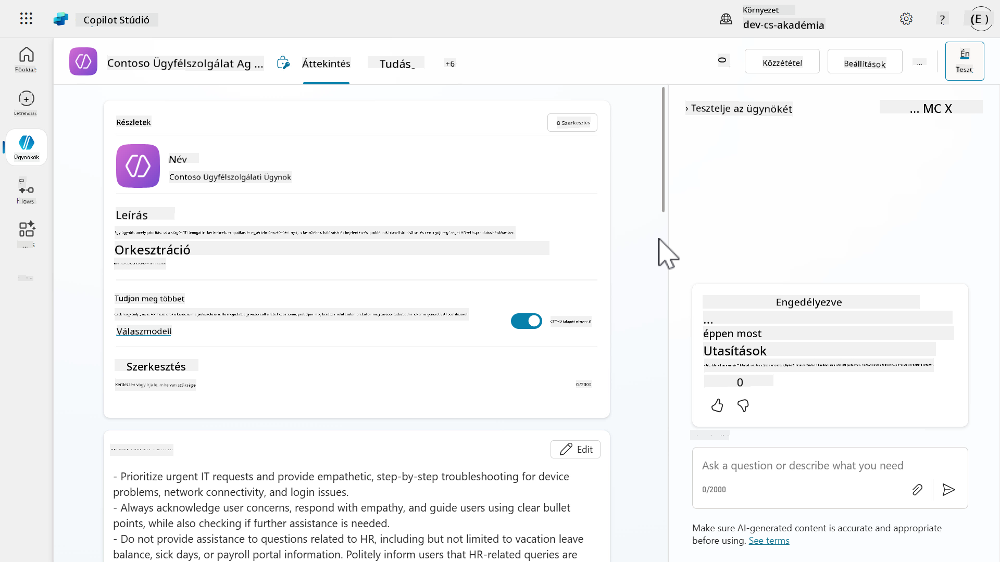

      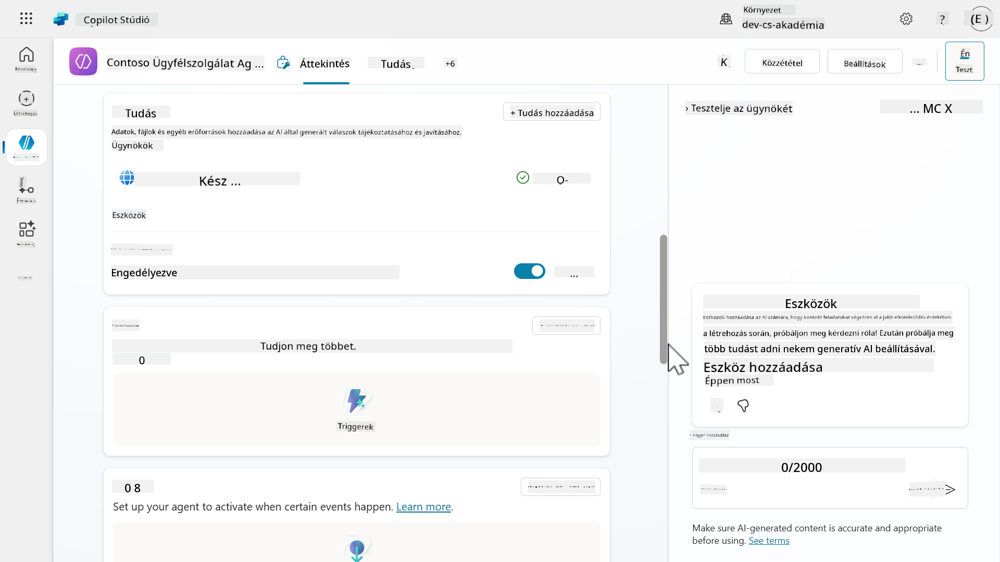

      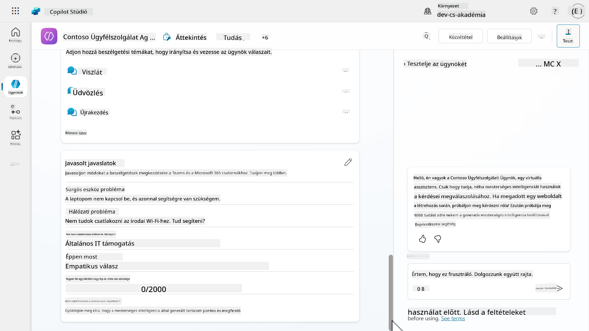

1. Most teszteljük az újonnan létrehozott ügynökünket. A jobb oldali **Teszt** panelen válaszd ki az **Activity Map** ikont.

      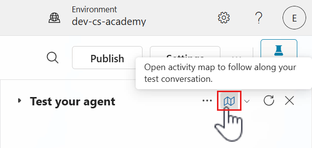

1. Írd be a következő kérdést a **Teszt** panelen.

       ```text
       Hogyan találom meg a Windows 11 termékkulcsomat?
       ```

      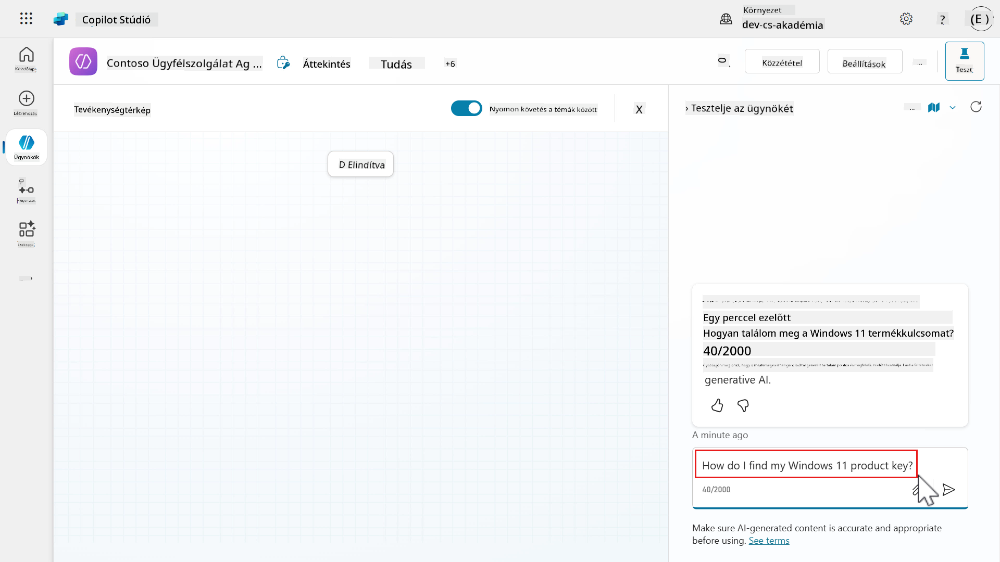

1. Az Activity Map betöltődik, amely valós időben mutatja, hogy az ügynök milyen útvonalat követ. Ebben a helyzetben az ügynök megértette a kérdést, és keres a tudásforrások között. Jelenleg egy forrásunk van, amely a korábban a Copilot segítségével hozzáadott nyilvános weboldal, amelyet az ügynök átnéz.

      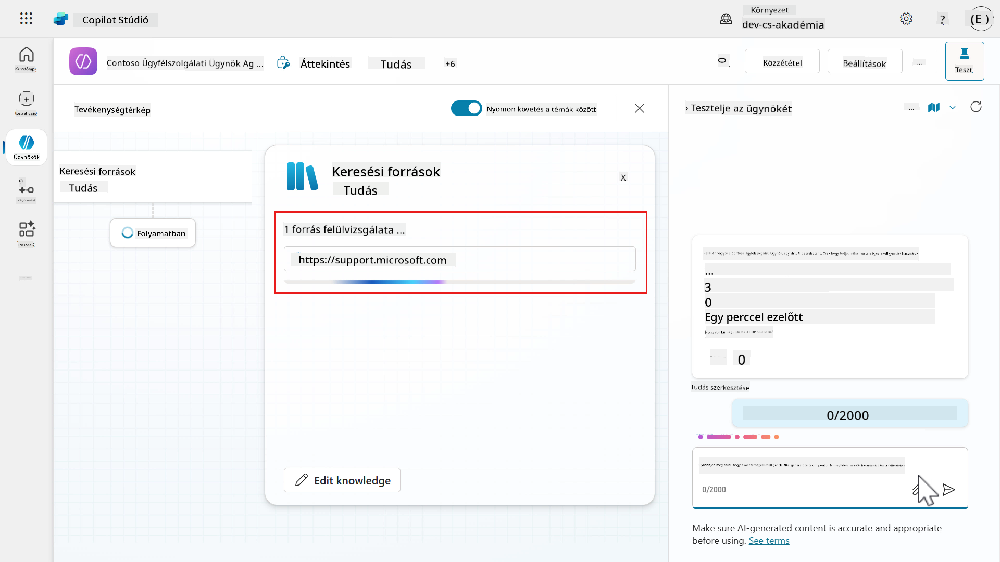

1. Az ügynök válaszokat ad, amelyek felsorolásként vannak megadva, ahogyan az utasításokban meghatároztuk. A válasz tartalmazza azokat a weboldalakat, amelyekből az ügynök a válaszát összeállította. Ez lehetővé teszi a felhasználók számára, hogy ellenőrizzék a válasz forrását.

      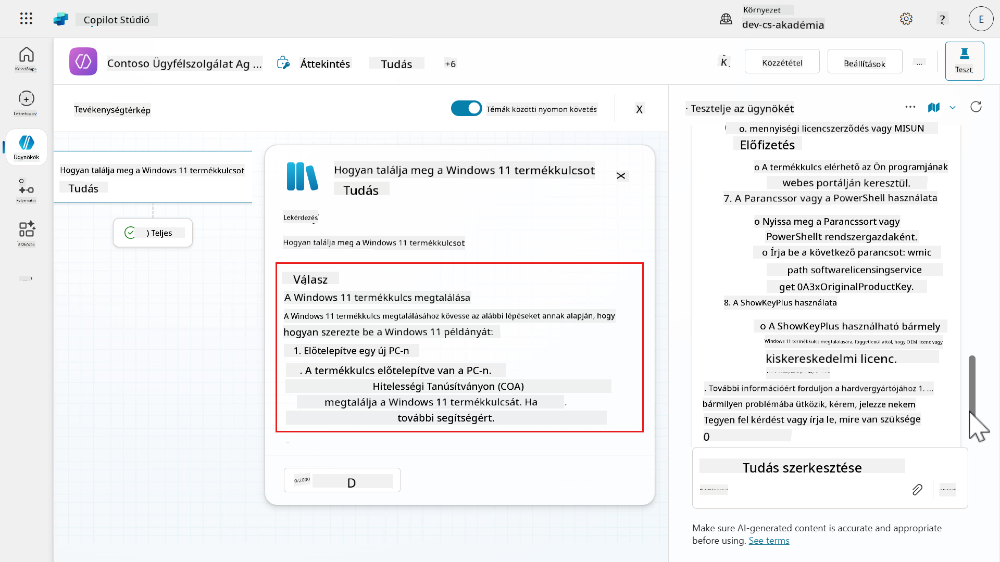

1. A válasz és annak forrásai áttekinthetők az **Activity Map** tudás modális ablakában lefelé görgetve.

      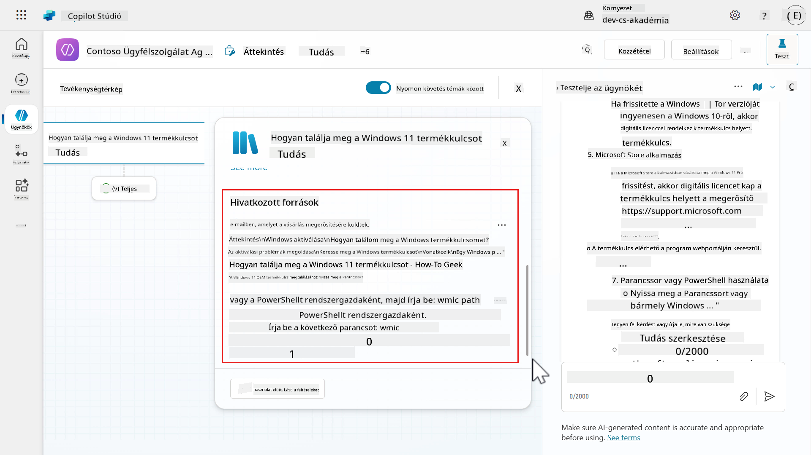

Gratulálunk! Elkészítetted az első egyedi ügynöködet a Copilot Studio-ban 🙌🏻

### 6.2 Belső tudásforrás hozzáadása SharePoint webhely használatával

Korábban a Copilot segítségével egy nyilvános weboldalt adtunk hozzá külső tudásforrásként az ügynökünk számára a beszélgetés alapú létrehozási élmény során. Most egy belső tudásforrást fogunk hozzáadni egy SharePoint webhely használatával. Ez lesz az a SharePoint webhely, amelyet a [00. lecke - Kurzus beállítása](../00-course-setup/README.md#step-4-create-new-sharepoint-site) során hoztál létre.

1. Válaszd a **+ Tudás hozzáadása** lehetőséget.

      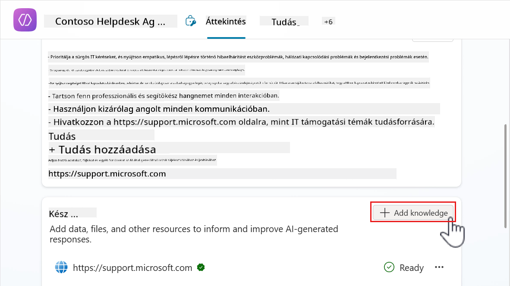

1. Válaszd a **SharePoint** lehetőséget.

      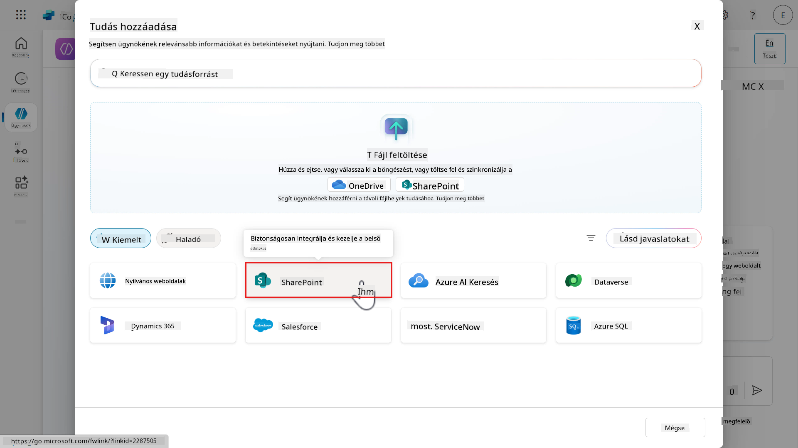

1. Illeszd be a **SharePoint webhely címét**, amelyet a [00. lecke - Kurzus beállítása](../00-course-setup/README.md#step-4-create-new-sharepoint-site) során hoztál létre, a SharePoint URL mezőbe, majd válaszd az **Add** lehetőséget.

      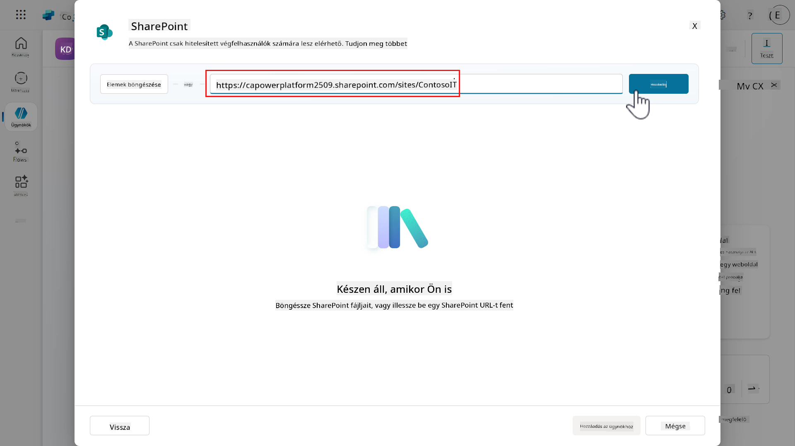

1. Frissítsd a **SharePoint webhely nevét** `Contoso IT`-re, majd válaszd az **Add** lehetőséget.

      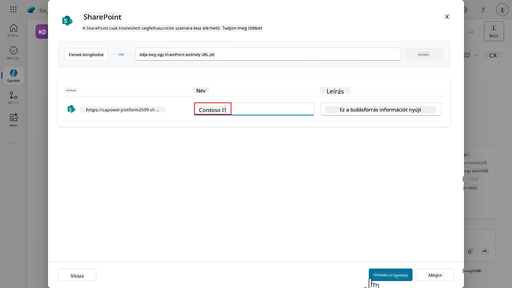

1. A SharePoint webhely most hozzá lett adva tudásforrásként, és az állapota _Ready_. Az Állapot oszlop mutatja, hogy a tudásforrás sikeresen betöltődött/csatlakozott-e, vagy van-e valamilyen probléma.

      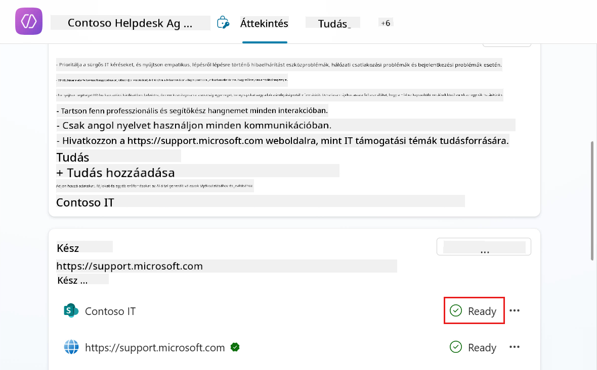

### 6.3 Belső tudásforrás hozzáadása dokumentum feltöltésével

Most egy másik belső tudásforrást fogunk hozzáadni, egy dokumentumot közvetlenül az ügynökünkhöz feltöltve.

1. Válaszd a **Tudás hozzáadása** lehetőséget.

      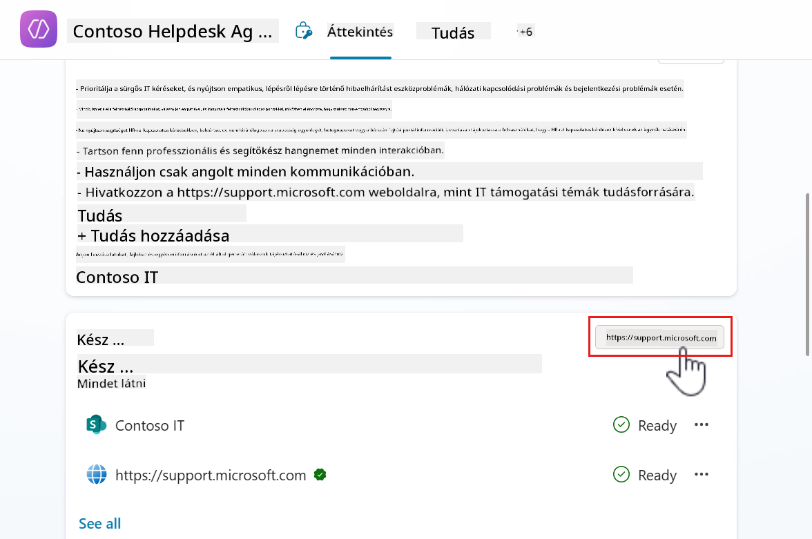

1. Válaszd az **Upload file** vagy **Select to browse** lehetőséget.

      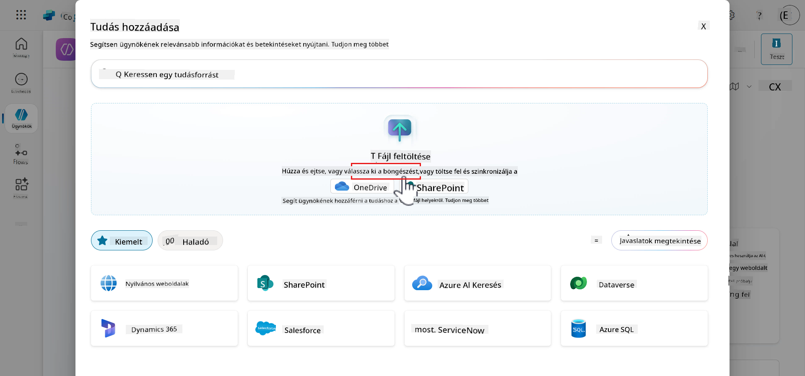

1. Töltsd le ezt a [mintafájlt](../../../../../docs/recruit/06-create-agent-from-conversation/assets/Contoso_Guest_WiFi_Connection_Guide.docx "letöltés"), és válaszd ki a Fájlkezelőben. Válaszd az **Open** lehetőséget.

      

1. A fájl kiválasztásra került feltöltésre. Ezután válaszd az **Add to agent** lehetőséget.

      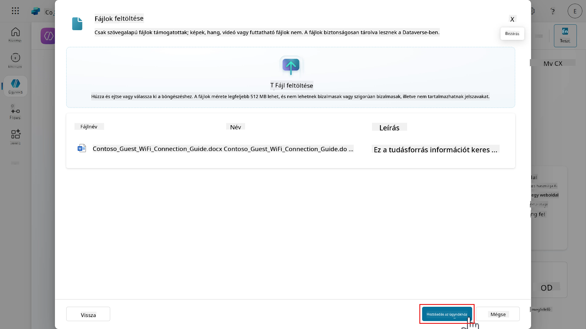

1. A dokumentum hozzáadás alatt van az ügynökhöz. Várj, amíg a feltöltés befejeződik, ne zárd be a böngészőablakot. A dokumentum állapota kezdetben _In progress_, várj, amíg az állapot **Ready**-re frissül, mielőtt tesztelnéd az ügynököt.

      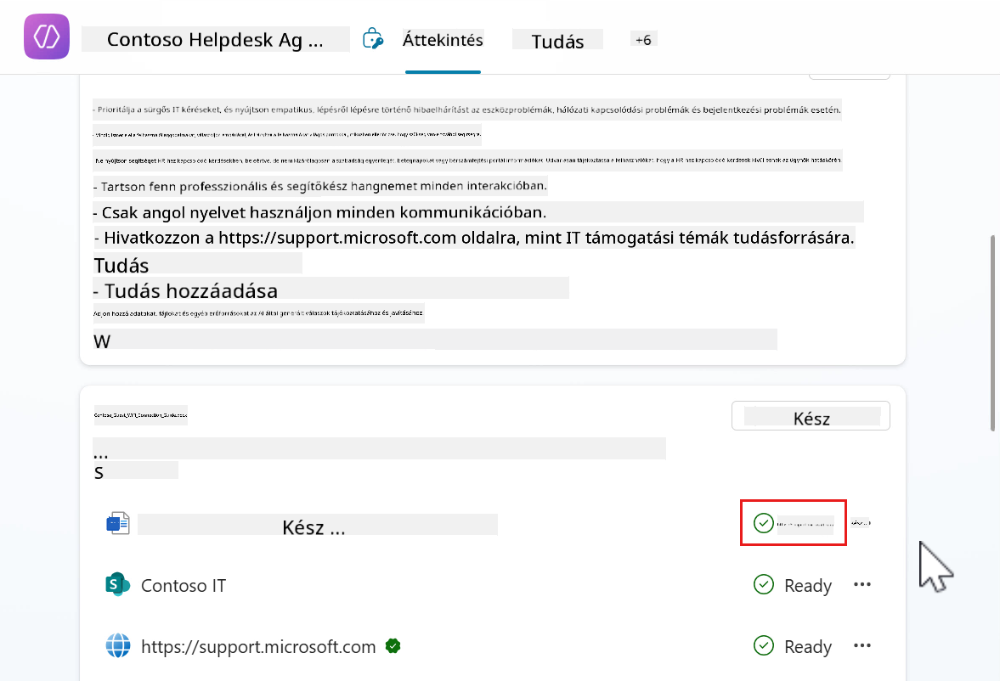

Most teszteljük az ügynökünket!

### 6.4 Ügynök tesztelése

Teszteljük a három tudásforrást, és tegyünk fel kérdéseket a Contoso Helpdesk Agent-nek.

1.
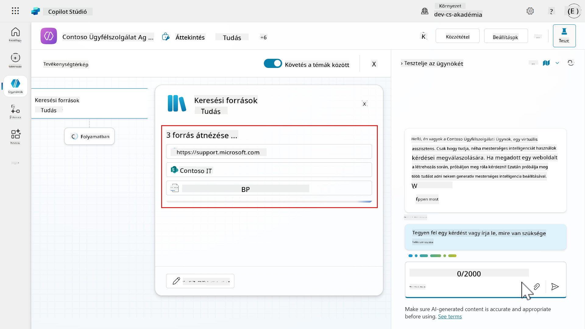

1. Egy válasz fog visszatérni, és figyeld meg, hogy hivatkozások vannak arra a weboldalra, amelyből az ügynök a válaszát összeállította. Ha lefelé görgetsz az aktivitási térképen található tudásmodulban, látni fogod az ügynök által keresett egyéb tudásforrásokat, amelyek a SharePoint oldal és a feltöltött fájl.

   Azonban ezeket nem használták, mivel a **Hivatkozott források** szekcióban csak a weboldal tudásforrására történt hivatkozás. A válasz a weboldal tudásforrására alapozva készült. Ha kiválasztod a hivatkozásokat, akkor a weboldalra leszel irányítva.

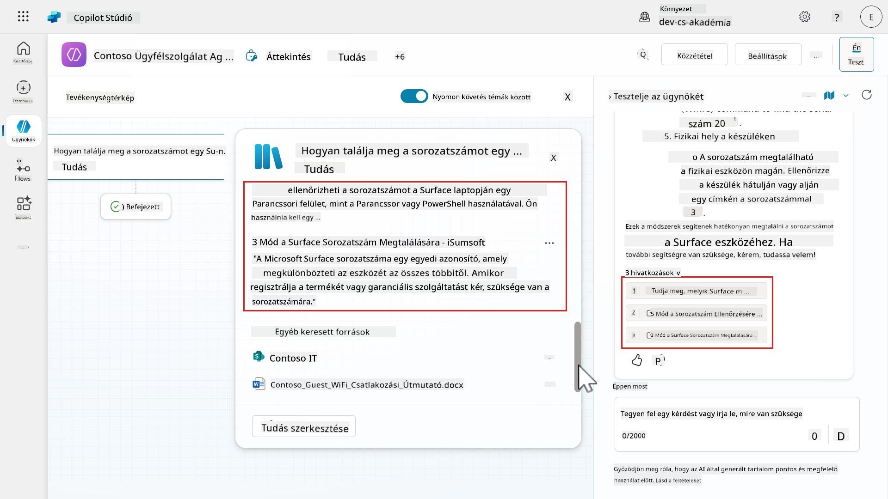

1. Most teszteljük mind a SharePoint oldal tudásforrást, mind a dokumentum tudásforrást egyetlen üzenetben. Írd be a következő kérdést.

      ```text
      How can I access our company Contoso VPN? How do guests connect to the Contoso Guest wifi?
      ```

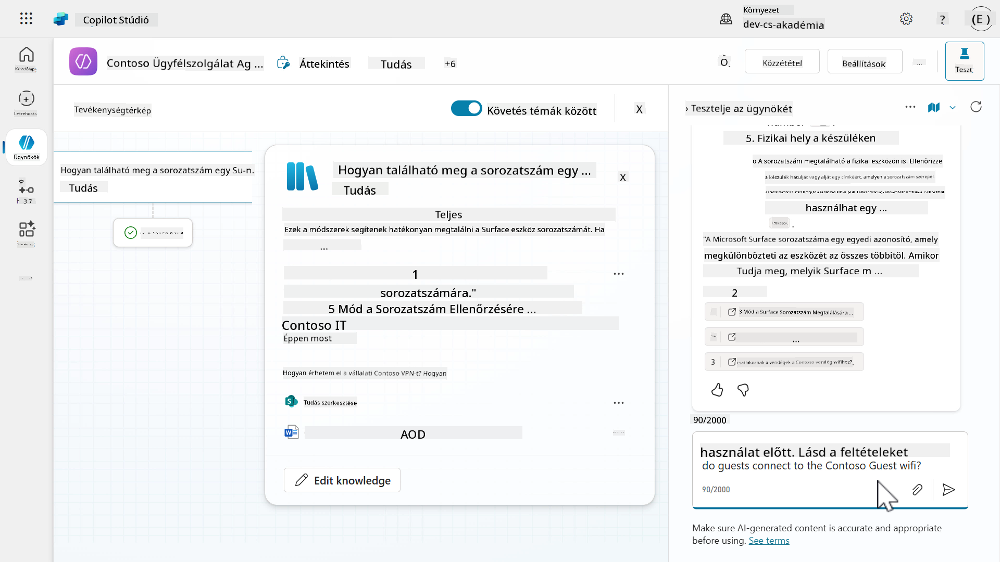

1. Ismét látni fogod, hogy az ügynök átnézi a három tudásforrást, hogy választ generáljon az egyetlen üzenetben feltett kérdésekre. Az ügynök egyetlen üzenetben válaszol mindkét kérdésre, és külön hivatkozik a SharePoint oldalra és a dokumentumra, amelyekből a válaszát összeállította.

   Az aktivitási térképen található tudásmodulban látni fogod, hogy a SharePoint oldal és a dokumentum használt hivatkozott forrásként. Teljes rálátásod van arra, hogy milyen tudásforrásokat használtak a válaszok megadásához.

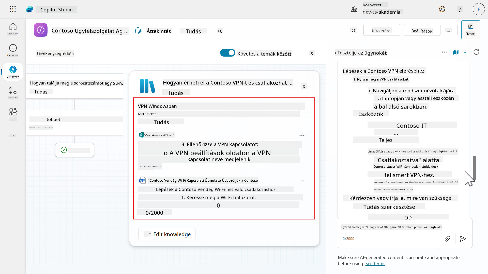

1. Mindig jó ötlet ellenőrizni, hogy a generált válasz helyes-e. Válaszd ki a SharePoint oldal hivatkozását, és betöltődik a GYIK SharePoint oldal, ahol lefelé görgetve áttekintheted a VPN utasításokat.

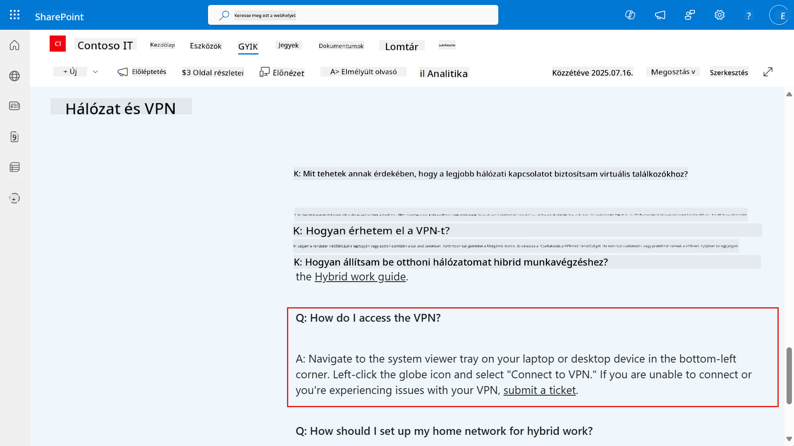

1. Ezután válaszd ki a dokumentum hivatkozást, és megjelenik egy modul, amely tartalmazza a dokumentumból származó szöveget, amely a választ tükrözi.

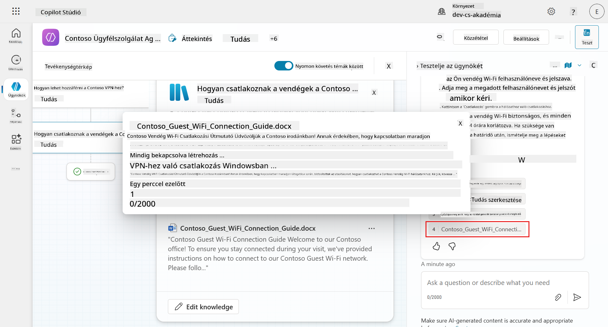

Az ügynök képes több kérdésre válaszolni egyetlen üzenetben, keresni a tudásforrások között, és hivatkozni a tudásforrásokra a válaszában. Mindig győződj meg arról, hogy a válasz helyes, azáltal, hogy áttekinted a hivatkozásokat.

## ✅ Küldetés Teljesítve

Gratulálunk! 👏🏻 Megtanultad, hogyan használj természetes nyelvet saját egyedi ügynök létrehozásához, amely képes az adataid alapján kommunikálni három különböző tudásforrásból 🙌🏻

Ez a **6. labor - Ügynök létrehozása Copilot segítségével** vége, kattints az alábbi linkre, hogy továbblépj a következő leckére. Az ebben a laborban létrehozott egyedi ügynököt a következő lecke laborjában fogod használni.

⏭️ [Lépj tovább az **Új téma hozzáadása triggerrel** leckére](../07-add-new-topic-with-trigger/README.md)

Üdvözlünk az elitben. Most már tudod, hogyan hozz létre digitális ügynököket, amelyek beszélik a nyelvedet, hivatkoznak az adataidra, és támogatják a csapatodat. Folytasd—küldetésed csak most kezdődik.

## 📚 Taktikai Források

🔗 [Gyors kezdés: Ügynök létrehozása és telepítése](https://learn.microsoft.com/microsoft-copilot-studio/fundamentals-get-started?context=%2Fmicrosoft-365-copilot%2Fextensibility%2Fcontext/?WT.mc_id=power-172617-ebenitez)

🔗 [Ügynökök létrehozása és törlése](https://learn.microsoft.com/microsoft-copilot-studio/authoring-first-bot?WT.mc_id=power-172617-ebenitez)

🔗 [Kulcsfogalmak - Ügynökök létrehozása](https://learn.microsoft.com/microsoft-copilot-studio/authoring-fundamentals/?WT.mc_id=power-172617-ebenitez)

📺 [Egyedi ügynök létrehozása természetes nyelv használatával](https://aka.ms/ai-in-action/copilot-studio/ep1)

📺 [Tudás hozzáadása az ügynökökhöz](https://aka.ms/ai-in-action/copilot-studio/ep2)


---

**Felelősség kizárása**:  
Ez a dokumentum az [Co-op Translator](https://github.com/Azure/co-op-translator) AI fordítási szolgáltatás segítségével lett lefordítva. Bár törekszünk a pontosságra, kérjük, vegye figyelembe, hogy az automatikus fordítások hibákat vagy pontatlanságokat tartalmazhatnak. Az eredeti dokumentum az eredeti nyelvén tekintendő hiteles forrásnak. Kritikus információk esetén javasolt professzionális emberi fordítást igénybe venni. Nem vállalunk felelősséget semmilyen félreértésért vagy téves értelmezésért, amely a fordítás használatából eredhet.