<!--
CO_OP_TRANSLATOR_METADATA:
{
  "original_hash": "c04b3587170139bc23e3b5cfc24c89ac",
  "translation_date": "2025-10-20T17:14:07+00:00",
  "source_file": "docs/recruit/07-add-new-topic-with-trigger/README.md",
  "language_code": "hu"
}
-->
# 🚨 Küldetés 07: Új téma hozzáadása triggerrel és csomópontokkal

## 🕵️‍♂️ KÓDNEVE: `MŰVELET MARADJ A TÉMÁNÁL`

> **⏱️ Műveleti időkeret:** `~60 perc`

🎥 **Nézd meg az útmutatót**

[](https://www.youtube.com/watch?v=7iPAZaA8nJs "Nézd meg az útmutatót a YouTube-on")

## 🎯 Küldetés összefoglaló

Már létrehoztál egy ügynököt. Hallgat, tanul és válaszol a kérdésekre - de most itt az ideje, hogy taktikusabbá válj. Ebben a küldetésben mélyebbre ásunk, és megtanítjuk az ügynöködet arra, hogyan reagáljon pontosan meghatározott felvetésekre.

A témák és triggerek segítségével az ügynököd képes lesz:

- Felismerni a szándékot

- Logikával irányítani a beszélgetéseket

- Változókat gyűjteni és tárolni

- Folyamatokat indítani és cselekedni

Nem csupán párbeszédet építesz, hanem az ügynök döntéshozó központját is bekötöd. Üdvözlünk a Neurális Nexusban.

## 🔎 Célkitűzések

Ebben a küldetésben megtanulod:

1. Megérteni, hogy mik azok a témák, és milyen szerepet játszanak az ügynököd strukturált beszélgetéseinek létrehozásában
1. Megismerni a témák anatómiáját, beleértve a trigger kifejezéseket és a beszélgetési csomópontokat
1. Felfedezni a különböző típusú beszélgetési csomópontokat, és hogyan használhatod a Power Fx-et dinamikus logikához
1. Egyedi témák létrehozása a semmiből, hogy specifikus felhasználói kéréseket és feladatokat kezeljenek
1. Egy működőképes téma létrehozása, amely SharePoint adatokhoz kapcsolódik csatlakozók és eszközök segítségével

## 🤔 Mi az a téma?

A téma egy strukturált beszélgetés, amely segít az ügynöködnek specifikus felhasználói kérdésekre vagy feladatokra válaszolni. Gondolj egy témára úgy, mint egy mini-beszélgetésre vagy feladatra, amelyet az ügynököd képes kezelni. Minden téma arra van tervezve, hogy egy adott felhasználói kérésre vagy kérdésre válaszoljon.

### 🌌 A téma célja

A témák három általános célja van, a felhasználók igényei alapján:

**Információs** - válaszol az alábbi kérdésekre:

- `Mi az …?`
- `Mikor lesz …?`
- `Miért …?`
- `El tudnád mondani …?`

**Feladatvégrehajtás** - segít a felhasználóknak _valamit megtenni_:

- `"Szeretnék …"`
- `"Hogyan tudom …?"`
- `"Szükségem van …?"`

**Hibaelhárítás** - problémákat old meg:

- `Valami nem működik …`
- `Hibaüzenetet kapok …`
- `Valami váratlan dolgot látok …?`

Témákat létrehozhatsz homályos kérdésekhez is, mint például `Segítségre van szükségem`, amelyek további részleteket kérnek a felhasználótól, mielőtt folytatnák.

## 🐦 Miért hasznosak a témák?

A témák segítenek:

- Az ügynököd tudásának rendszerezésében.

- Természetesebbé tenni a beszélgetéseket.

- Hatékonyan megoldani a felhasználói problémákat.

## 🪺 Témák típusai

1. **Rendszer témák** - ezek beépítettek, és gyakori eseményeket kezelnek, mint például:
    - Beszélgetés indítása
    - Beszélgetés befejezése
    - Hibák kezelése
    - Felhasználók bejelentkezésre kérése
    - Emberi ügynökhöz való továbbítás

1. **Egyedi témák** - ezeket te hozod létre specifikus feladatok vagy kérdések kezelésére, mint például:
    - Munkavállalói szabadságkérelem
    - Új vagy csereeszköz igénylése

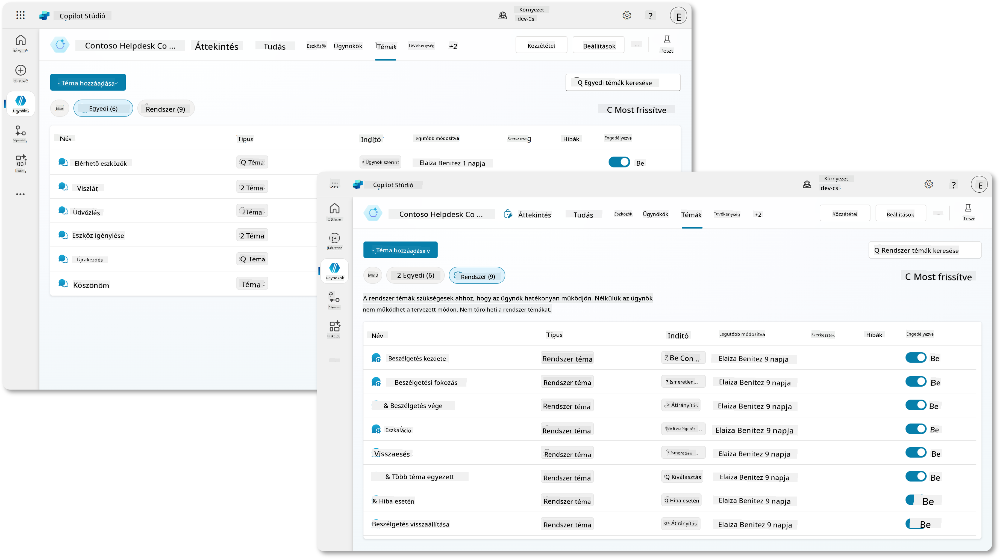

## 🧬 A téma anatómiája

Minden téma általában a következőket tartalmazza.

### 🗣️ Trigger kifejezések

Ezek azok a szavak vagy mondatok, amelyeket a felhasználók mondhatnak, hogy elindítsák a témát.

**Példák:**

Egy szabadságkérelem témához a trigger kifejezések lehetnek:

- `Szeretnék szabadságot kivenni`
- `Szabadságot kérek`
- `Szabadságot szeretnék igényelni`
- `Hogyan tudok szabadságot kérni?`

Egy eszköz igénylés témához a trigger kifejezések lehetnek:

- `Szükségem van egy új eszközre`
- `Kérhetek egy eszközt?`
- `Segítenél egy eszköz igénylésében?`

### 💬 Beszélgetési csomópontok

Egy téma csomópontokból áll, amelyek az ügynök által követett lépések, miután a téma aktiválódott. Ezeket a lépéseket összekapcsolva építed fel a beszélgetési folyamatot, amelyet az ügynök követ, amikor a felhasználókkal kommunikál.

Gondolj ezekre úgy, mint utasításokra vagy cselekvésekre, például:

- Kérdések feltevése a felhasználónak
- Üzenetek küldése
- Külső szolgáltatás hívása, például szabadságkezelő rendszer
- Változók beállítása vagy ellenőrzése
- Feltételek használata a beszélgetés elágaztatásához
- Átirányítás egy másik témára

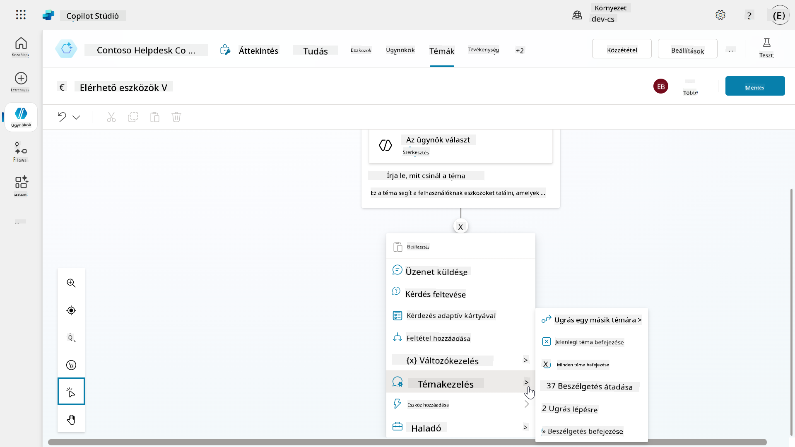

Az alábbiak a fő csomópont típusok, amelyeket hozzáadhatsz az ügynöködhöz:

#### Üzenet küldése

- **Cél** - üzenetet küld a felhasználónak.
- **Példa** - `Köszönöm a kérésedet! Segítek neked ebben.`

Ez a csomópont lehetővé teszi az ügynököd számára, hogy üzeneteket küldjön a felhasználóknak, amelyek lehetnek egyszerű szövegek vagy gazdag tartalmak, mint képek, videók, kártyák, gyors válaszok és adaptív kártyák.

Személyre szabhatod az üzeneteket változók használatával, több üzenetváltozatot adhatsz hozzá a változatosság érdekében, és testre szabhatod a beszédkimenetet hangalapú csatornákhoz.

!!! tip
    Gondolj rá úgy, mint egy "mondj valamit" blokkra, amely segít az ügynöködnek tisztán és interaktívan kommunikálni a felhasználókkal.

#### Kérdés feltevése

- **Cél** - kérdést tesz fel a felhasználónak, és várja a válaszát.
- **Példa** - `Mik a szabadság dátumai?`

Ez a csomópont arra szolgál, hogy specifikus információt kérjen a felhasználóktól a beszélgetés során, és tárolja a válaszaikat változókban későbbi felhasználásra.

Testre szabhatod a kérdés típusát, például szöveges bemenetet, vagy használhatsz entitásokat egy meghatározott értéklistával, amelyből a felhasználó választhat, és meghatározhatod, hogyan viselkedjen az ügynök, ha a felhasználó érvénytelen választ ad vagy kihagyja a kérdést.

Ez támogatja a gazdag tartalmakat, mint képek és gyors válaszok, és lehetővé teszi a validáció, újrakérdezés és megszakítási beállítások finomhangolását, hogy a beszélgetés zökkenőmentesen folyjon.

!!! tip
    Gondolj rá úgy, mint egy "kérdezz és hallgass" blokkra, amely segít az ügynöködnek strukturált módon kommunikálni a felhasználókkal.

#### Kérdés adaptív kártyával

- **Cél** - gazdag, interaktív kártyát küld JSON segítségével.
- **Példa** - egy kártya, amely naptár dátumválasztót jelenít meg, hogy a felhasználó kiválasszon egy dátumot.

Ez a csomópont gazdag, interaktív kártyákat jelenít meg, amelyeket a felhasználók kitölthetnek és beküldhetnek, például űrlapokat szövegdobozokkal, gombokkal és képekkel. Rögzíti a felhasználó bemenetét, és változókban tárolja, amelyeket az ügynök később használhat a beszélgetés során.

!!! tip
    Gondolj rá úgy, mint egy testreszabható "űrlapkészítő" blokkra, amely az ügynöködet interaktívabbá és képessé teszi arra, hogy részletes információkat gyűjtsön a felhasználóktól.

#### Feltétel hozzáadása

- **Cél** - logikát ad a beszélgetéshez. Ellenőriz valamit, és eldönti, mi legyen a következő lépés.
- **Példa** - ha a felhasználó azt mondja, hogy `Igen`, lépjen a következő lépésre. Ha `Nem`, fejezze be a beszélgetést.

Ez a csomópont döntési pontokat hoz létre az ügynök beszélgetési folyamatában azáltal, hogy ellenőrzi, hogy egy változó megfelel-e bizonyos kritériumoknak. Attól függően, hogy a feltétel igaz vagy hamis, az ügynök különböző utakat követ.

!!! tip
    Gondolj rá úgy, mint egy "ha-akkor" blokkra, amely segít az ügynöködnek döntéseket hozni a felhasználói bemenet vagy a változókban tárolt adatok alapján.

#### Változókezelés

- **Cél** - információt (változókat) tárol vagy töröl a beszélgetés során.
- **Példa** - elmenti a dátumot, amelyet a felhasználó kiválasztott az adaptív kártyát megjelenítő Kérdés csomópontban.

Ez a csomópont lehetővé teszi, hogy információt tárolj és kezelj a beszélgetés során, például a felhasználó nevét, válaszát vagy preferenciáit. Különböző típusú változókat használhatsz, mint szöveg, számok vagy dátumok, és ezek lehetnek egyetlen témára korlátozva, megosztva a témák között (globális), vagy akár a rendszerből vagy környezetből származó adatok.

!!! tip
    Gondolj rá úgy, mint egy "emlékezetes dobozra", amely segít az ügynöködnek információkat megjegyezni és használni, ahogy a beszélgetés folytatódik a felhasználóval.

#### Téma kezelése

- **Cél** - áthelyezi a beszélgetést egy másik témára vagy lépésre a témán belül, átadja a beszélgetést, vagy befejezi a témát vagy beszélgetést.
- **Példa** - átirányítás a "Szabadságpolitika" témára.

Ez a csomópont lehetővé teszi az ügynököd számára, hogy egyik témáról a másikra ugorjon anélkül, hogy újra kellene kezdeni a beszélgetést, befejezze a témát, átadja vagy befejezze a beszélgetést, vagy egy másik lépésre lépjen ugyanazon a témán belül. Segít a felhasználókat a beszélgetési folyamat különböző részein keresztül vezetni, zökkenőmentesen váltva a témák között, és változókat is átadhatsz közöttük, hogy megőrizd a kontextust.

!!! tip
    Gondolj rá úgy, mint egy "menj egy másik szekcióba/lépésre" blokkra, amely segít az ügynöködnek rugalmasan kommunikálni a felhasználókkal.

#### Eszköz hozzáadása

- **Cél** - csatlakozik eszközökhöz, mint például csatlakozók, ügynökfolyamatok, felhívások, egyedi keresés, keresési lekérdezés, készségek, modell kontextus protokoll.
- **Példa** - Ügynökfolyamat végrehajtása, miután a felhasználó benyújtotta a szabadságkérelmét.

Ez a csomópont képessé teszi az ügynöködet arra, hogy külső rendszerekkel kommunikáljon vagy specifikus feladatokat hajtson végre, például e-mailek küldése, időjárás ellenőrzése vagy adatbázisok elérése. Eszközöket adhatsz hozzá beépített csatlakozók, egyedi API-k, ügynökfolyamatok, felhívások vagy a Modell Kontextus Protokoll (MCP) szerverekhez való csatlakozás segítségével, sőt grafikus felhasználói felület automatizálást is végezhetsz asztali alkalmazásokhoz a számítógép használati eszközével.

!!! tip
    Gondolj az eszközökre úgy, mint "akció blokkokra", amelyek szuperképességeket adnak az ügynöködnek, hogy olyan dolgokat tegyen, amelyek túlmutatnak a _beszélgetésen_, például API hívásokat végezzen, folyamatokat futtasson, vagy automatikusan gyűjtsön felhasználói adatokat.

#### Generatív válaszok csomópont

- **Cél** - nagy nyelvi modellt használ, hogy természetes, emberi válaszokat generáljon a felhasználó kérdései és a csatlakoztatott adatok alapján.
- **Példa** - a csatlakoztatott tudásforrást használja, amely információkat tartalmaz a szabadságjogosultságokról, hogy válaszoljon a felhasználói kérdésekre a szabadságkérelmekkel kapcsolatban.

Ez a csomópont lehetővé teszi az ügynököd számára, hogy válaszoljon a felhasználói kérdésekre különböző tudásforrásokból, mint weboldalak, dokumentumok, SharePoint vagy egyedi adatok. Használható tartalék megoldásként, ha nincs megfelelő téma, vagy egy témán belül részletesebb, dinamikus válaszok nyújtására az általad konfigurált specifikus források alapján.

!!! tip
    Gondolj rá úgy, mint egy "okos válasz blokkra", amely segít az ügynöködnek hasznos, pontos válaszokat adni az általad meghatározott megbízható tartalmak keresésével.

#### HTTP kérés csomópont

- **Cél** - csatlakoztatja az ügynöködet külső rendszerekhez API hívások (például `GET` vagy `POST`) küldésével adatok lekérésére vagy frissítésére.
- **Példa** - amikor a felhasználó megkérdezi a szabadságnapok egyenlegét, az ügynök `GET` kérést végez a szabadságkezelő rendszerhez, és kinyeri a `remainingLeaveDays` értéket az API válaszából, majd válaszol a felhasználónak az értékkel.

Ez a csomópont lehetővé teszi az ügynököd számára, hogy külső rendszerekkel kommunikáljon REST API hívások küldésével, mint például
Ez lehetővé teszi, hogy természetes nyelven leírd, mit szeretnél, és a Copilot felépíti számodra a beszélgetést. Ugyanez vonatkozik a téma szerkesztésére is: használd a természetes nyelvet, és a Copilot átnézi és módosítja a témát.

#### Amit a Copilot támogat

- Létrehozhat és szerkeszthet:
      - Üzenetcsomópontokat
      - Kérdéscsomópontokat
      - Feltételcsomópontokat
- Nem támogatja az olyan haladó beállításokat, mint például hogyan kérdezzen újra a felhasználótól, ha nem válaszol, vagy hogyan kezelje a megszakításokat egy kérdés során. Ezeket a beállításokat manuálisan is módosíthatod, ha szükséges.

#### Miért hasznos ez?

- Felgyorsítja a fejlesztést AI segítséggel.
- Lehetővé teszi, hogy a logikára és a felhasználói élményre koncentrálj a repetitív beállítások helyett.
- Könnyebbé teszi a beszélgetési folyamatok iterálását és javítását minimális erőfeszítéssel.

#### ✨ Példa kérések

- **Téma létrehozása**
      - `Fogadd el a felhasználó nevét, életkorát és születési dátumát, majd ismételd meg a válaszaikat`
      - `Gyűjtsd be a felhasználó utcacímét, államát és irányítószámát. A felhasználónak legfeljebb 4 alkalommal kell tudnia újrapróbálkozni minden kérdésnél`

- **Téma szerkesztése**
      - `Adj hozzá egy kérdést, amely a felhasználó születési dátumát kérdezi`
      - `Összegezd az összegyűjtött információkat egy Adaptive Card-ban.`

## 👩🏻‍🎨 Rendben, hogyan tervezzek témákat az ügynököm számára?

### 🧙🏻‍♂️ 1. lépés - értsd meg, mire van szüksége a felhasználóknak

Kezdd azzal, hogy azonosítod a gyakori kérdéseket vagy feladatokat, amelyeket a felhasználók az ügynöködtől kérnek. Ezek lehetnek:

- Gyakran feltett kérdések, mint például: `Mennyi betegszabadságra vagyok jogosult?`
- Gyakori feladatok, amelyeket a felhasználók el akarnak végezni, például egy űrlap benyújtása
- Problémák, amelyekkel a felhasználók gyakran szembesülnek, például bejelentkezési problémák

### 📦 2. lépés - Csoportosítsd a forgatókönyveket

Szervezd a felhasználói igényeket három kategóriába az alapján, amit korábban tanultunk - a téma célja szerint:

- Információs - a felhasználó tudni szeretne valamit
- Feladatvégzés - a felhasználó el akar végezni valamit
- Hibajavítás - a felhasználónak segítségre van szüksége egy probléma megoldásában

### 🗺️ 3. lépés - Térképezd fel a beszélgetést

Vázolj fel egy egyszerű beszélgetési folyamatot arról, hogyan kellene az ügynöknek válaszolnia:

- Kezdj egy üdvözléssel vagy megerősítéssel
- Tegyél fel követő kérdéseket a részletek megszerzéséhez
- Adj válaszokat vagy hajts végre műveleteket

!!! tip
    Tartsd röviden és fókuszáltan a beszélgetést. Csak azt kérdezd, ami szükséges.

### 🔀 4. lépés - Kezeld a különböző beszélgetéstípusokat

Tervezd meg mindkettőt:

- **Egyszeri kérdés-válasz** - egy kérdés, egy válasz

- **Többfordulós** - oda-vissza beszélgetés követő kérdésekkel

Példa:

- Felhasználó: `Szeretnék szabadságot kérni.`

- Ügynök: `Rendben! Melyik dátumtól szeretnéd, hogy kezdődjön a szabadságod?`

- Felhasználó: `Július 15.`

- Ügynök: `Értem. És mikor ér véget a szabadságod?`

- Felhasználó: `Július 22.`

- Ügynök: `Köszönöm! Mi az oka a szabadságodnak?`

- Felhasználó: `Családi nyaralás.`

- Ügynök: `Köszönöm az információkat. Beadtam a szabadságkérelmedet július 15-től július 22-ig családi nyaralás céljából. Hamarosan visszajelzést kapsz.`

### 🤖 5. lépés - Használj AI-t váratlan kérdésekhez

Még ha terveztél is egy témát a szabadságkérelmekhez, előfordulhat, hogy a felhasználók olyan kérdéseket tesznek fel, amelyek nem tartoznak közvetlenül a témába. Itt jön képbe az AI funkció, mint például a _Beszélgetési erősítés_ rendszer téma.

Ez a téma tartalmaz egy generatív válaszok csomópontot, amely lehetővé teszi az ügynök számára, hogy azonnal használja a csatlakoztatott tudásforrásokat. Az ügynök szintjén hozzáadott bármely tudásforrás automatikusan bekerül a generatív válaszok csomópontba a _Beszélgetési erősítés_ rendszer témában.

#### Példa

- Felhasználó: `Átvihetem a fel nem használt szabadságnapjaimat a következő évre?`

Ez a kérdés lehet, hogy nem része az előre meghatározott témának, különösen, ha a téma csak a szabadságkérelmek benyújtásával foglalkozik.

#### Hogyan segít az AI?

Ha az ügynök csatlakozik a vállalat HR szabályzat dokumentumaihoz vagy belső weboldalához, az AI képes:

- Megkeresni a releváns szabadságpolitikai szabályokat
- Értelmezni és összefoglalni azokat
- Az ügynök válaszol: `A HR szabályzat szerint a fel nem használt szabadságnapokat átviheted a következő naptári évre. További részletekért nézd meg a szabadságpolitika szekciót a HR portálon.`

#### Miért hasznos ez?

- Nem kell manuálisan létrehoznod egy témát minden szabályzattal kapcsolatos kérdéshez.
- Az AI pontos válaszokat tud adni megbízható tudásforrásokból.
- Javítja a felhasználói élményt, mivel az ügynök okosabbnak és reagálóbbnak tűnik.

### 🔬 6. lépés - Teszteld a témát, a beszélgetési folyamatot

Mielőtt közzéteszed a témát:

- Teszteld valós kérdésekkel vagy mintabevitellel.
- Győződj meg róla, hogy természetesnek és segítőkésznek hangzik.

!!! tip
    Alkalmazz javításokat a témádon a tesztelés során, például adj hozzá több csomópontot, vagy távolíts el csomópontokat, és irányítsd át egy másik témára.

### ⚠️ 7. lépés - Kerüld a weboldal tartalmának másolását

Ne másold le azt, ami már megtalálható a weboldaladon.

- Koncentrálj azokra a témákra, amelyekről a felhasználók gyakran kérdeznek.
- Adj hozzá új témákat a csevegési előzmények vagy támogatási kérések alapján.

### ✨ Beszélgetési folyamat példa

Az alábbiakban egy szabadságkérelmek kezelésére szolgáló téma példáját láthatod.

#### 1. lépés: Indító kifejezés

A felhasználó beírja,

`Szeretnék szabadságot kérni`

#### 2. lépés: Az ügynök Adaptive Card segítségével kér információt

Az ügynök megkérdezi,

`Rendben! Milyen dátumokat szeretnél szabadságként megadni?`

Az Adaptive Card tartalmaz egy kezdő dátum és egy befejező dátum naptárválasztó vezérlőt.

#### 3. lépés: A felhasználó megadja a dátumokat

A felhasználó kiválasztja a kezdő dátumot augusztus 5-re 2025-ben, és a befejező dátumot augusztus 10-re 2025-ben, majd beküldi a kártyát. A dátumértékek az Adaptive Card kimenetében változóként kerülnek tárolásra.

#### 4. lépés: Felhőfolyamat végrehajtása

Egy Power Automate felhőfolyamat kerül végrehajtásra, amely új kérelmet hoz létre a szabadságkezelő rendszerben, és e-mailt küld a vezetőnek a szabadságkérelemről.

#### 5. lépés: Visszaigazoló üzenet küldése a felhasználónak

Az ügynök válaszol:

`A szabadságkérelmedet augusztus 5-től augusztus 10-ig benyújtottuk. A vezetőd hamarosan átnézi és visszajelzést küld.`

## 🧪 Lab 07 - Új téma hozzáadása beszélgetési csomópontokkal

Most megtanuljuk, hogyan adjunk hozzá egy új témát indítóval és eszközökkel. Ez a labor bemutatja, hogyan lehet nulláról létrehozni egy témát, hogy testre szabhassuk az igényeink szerint.

- [7.1 Új téma hozzáadása nulláról](../../../../../docs/recruit/07-add-new-topic-with-trigger)
- [7.2 Az indító bemeneteinek és kimeneteinek meghatározása](../../../../../docs/recruit/07-add-new-topic-with-trigger)
- [7.3 Eszköz hozzáadása csatlakozón keresztül](../../../../../docs/recruit/07-add-new-topic-with-trigger)

### ✨ Felhasználási eset

**Mint** alkalmazott

**Szeretném** tudni, hogy milyen eszközök állnak rendelkezésre

**Hogy** legyen egy listám az elérhető eszközökről

Kezdjük!

### Előfeltételek

1. **SharePoint lista**

    A **Devices** SharePoint listát fogjuk használni a [00. lecke - Kurzus beállítása - 3. lépés: Új SharePoint webhely létrehozása](../00-course-setup/README.md#step-4-create-new-sharepoint-site) című részben.

    Ha még nem állítottad be a **Devices** SharePoint listát, kérlek, térj vissza a [00. lecke - Kurzus beállítása - 3. lépés: Új SharePoint webhely létrehozása](../00-course-setup/README.md#step-4-create-new-sharepoint-site) című részhez.

1. **Contoso Helpdesk Agent**

    Ugyanazt az ügynököt fogjuk használni, amelyet korábban hoztunk létre a [06. lecke - Egyedi ügynök létrehozása természetes nyelv használatával a Copilot segítségével és adataink alapozásával](../06-create-agent-from-conversation/README.md) című részben.

### 7.1 Új téma hozzáadása nulláról

1. Válaszd ki az ügynök neve melletti **Témák** fület. Ha nem látod, kattints a **+6** gombra, és ott megtalálod a **Témák** listát.

    

1. A **Témák** fül betöltődik, és alapértelmezés szerint a _Egyedi_ témák jelennek meg. Szűrheted a témákat az Összes, Egyedi és Rendszer kategóriák szerint. Az egyedi és rendszer témák, amelyeket jelenleg látsz, automatikusan jöttek létre, amikor az ügynököt beállítottad.

    Válaszd ki a **+ Téma hozzáadása** lehetőséget, majd válaszd ki a **Nulláról** opciót.

    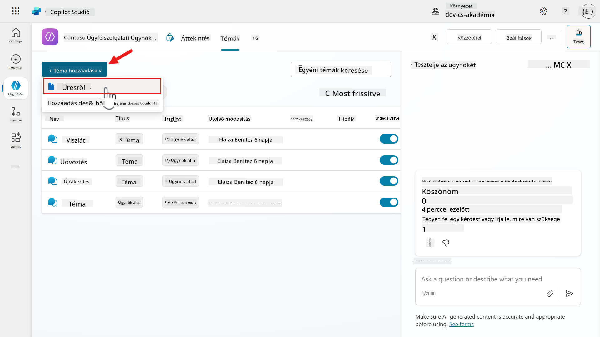

1. Adj nevet a témának. Másold be a következőt:

    ```text
    Available devices
    ```

    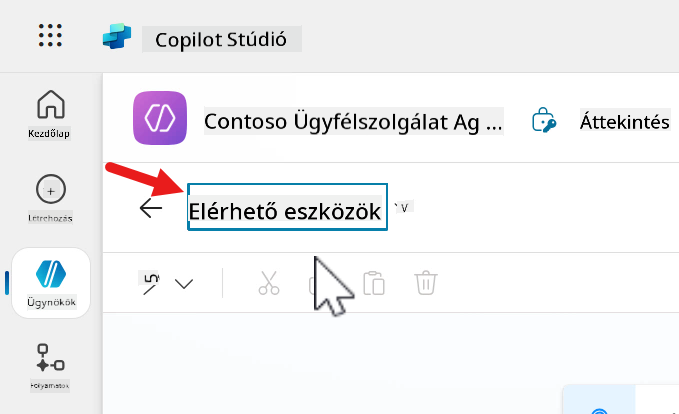

1. Adj meg egy indító leírást, amely körvonalazza, mit csinál a téma. Másold be a következőt:

    ```text
    This topic helps users find devices that are available from our SharePoint Devices list. User can ask to see available devices and it will return a list of devices that are available which can include laptops, smartphones, accessories and more.
    ```

    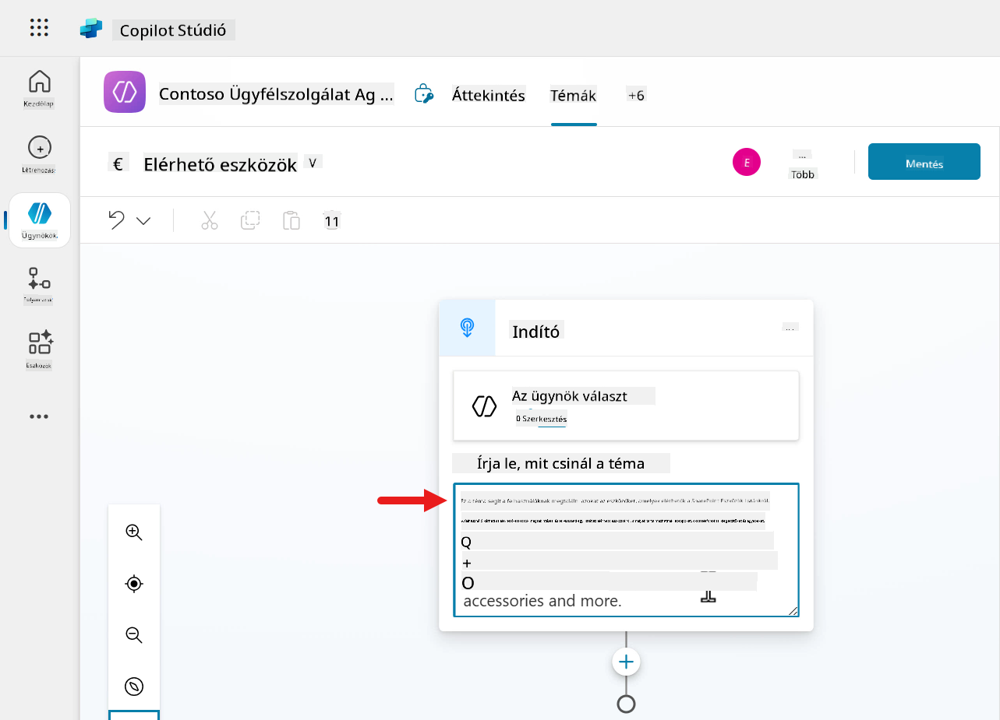

### 7.2 Az indító bemeneteinek és kimeneteinek meghatározása

1. Ezután hozzáadunk egy új bemeneti változót, amelyet a generatív AI használ az eszköztípus értékének kinyerésére a felhasználó üzenetéből. Válaszd ki a **További három pont (...)** lehetőséget a témában, majd válaszd ki a **Részletek** opciót a téma részleteinek megtekintéséhez.

    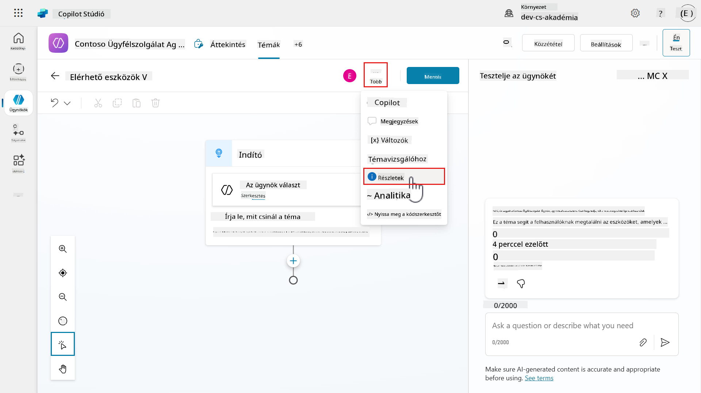

1. A **Téma részletei** panel betöltődött. Válaszd ki a **Bemenet** fület.

    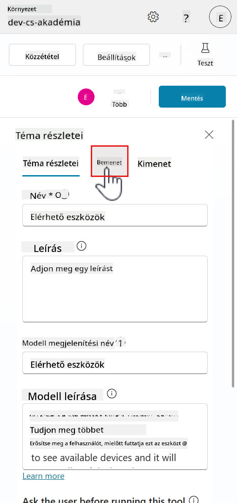

1. Válaszd ki a **Új változó létrehozása** lehetőséget.

    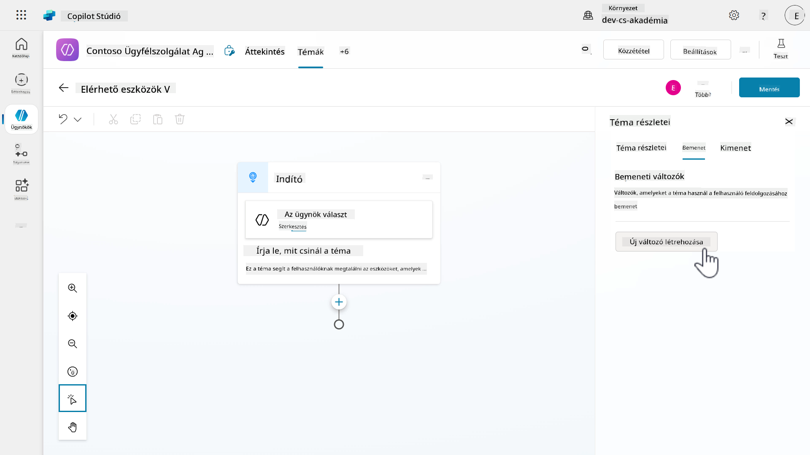

1. Adj nevet a változónak. Másold be a következőt:

    ```text
    VarDeviceType
    ```

    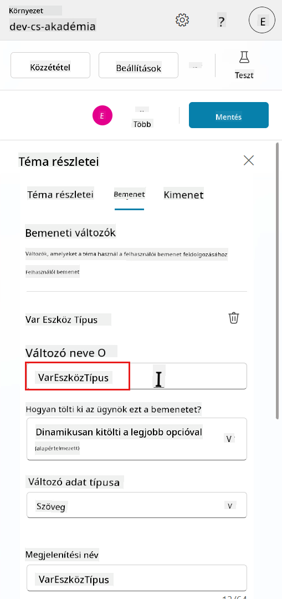

1. Most meg kell határoznunk a bemeneti és kimeneti változóinkat. Az alábbiak a bemeneti és kimeneti tulajdonságok, amelyeket a témához definiálhatunk.

    | Mező    | Érték |
    | ---------- | :--------- |
    | Hogyan tölti ki az ügynök ezt a bemenetet? | Meghatározza, hogyan tölti ki az ügynök ezt a változót egy értékkel a téma futtatása előtt. Alapértelmezés szerint _Dinamikusan kitölti a legjobb opcióval_. Ellenkező esetben felülírhatod a bemenetet egy értékkel a felhasználó megkérdezése helyett |
    | Változó adattípusa  | A változó adattípusa. Támogatott adattípusok: `String`, `Boolean`, `Number`, `Date`, `DateTime`, `DateTimeNoTimeZone`, `Time`, `Record`, `Table`, `Unspecified`, `From sample data` |
    | Megjelenítési név   | A változó neve   |
    | Azonosítás mint  | Az entitás típusa, amelyet az ügynök a megfelelő értéktípus rögzítéséhez használ  |
    | Leírás    | A leírás segít az ügynöknek automatikusan kitölteni a bemeneteket a téma futtatása előtt, vagy kérdéseket generálni az értékek megkérdezéséhez   |

    A _Hogyan tölti ki az ügynök ezt a bemenetet?_, _Változó adattípusa_ és _Megjelenítési név_ maradhat változatlan. Frissítsd az **Azonosítás mint** tulajdonságot **Felhasználó teljes válasza** értékre.

    

1. Másold be a következőt leírásként:

    ```text
    List of possible values: Laptop, Desktop, Smartphone
    ```

    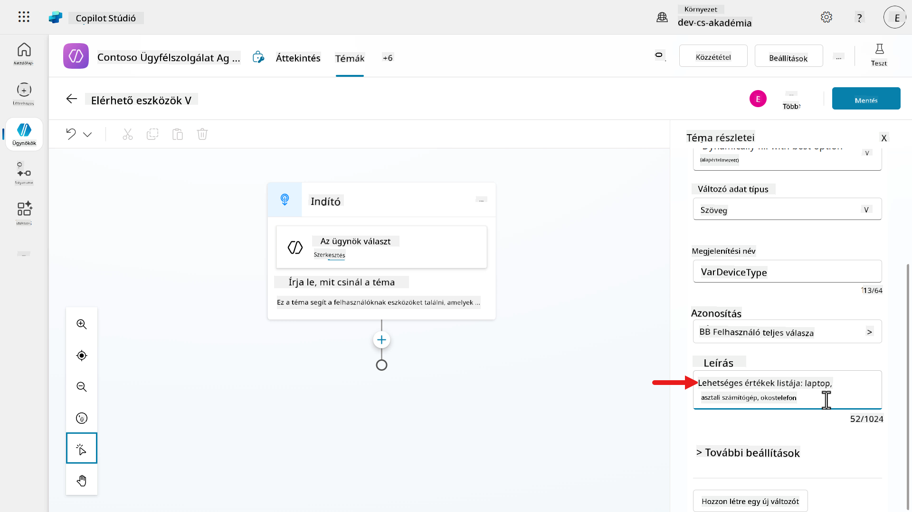

1. Ezután határozzuk meg a téma kimenetét. Válaszd ki a **Kimenet** fület.

    ![Kimenet fül
Válassza a **Létrehozás** lehetőséget.

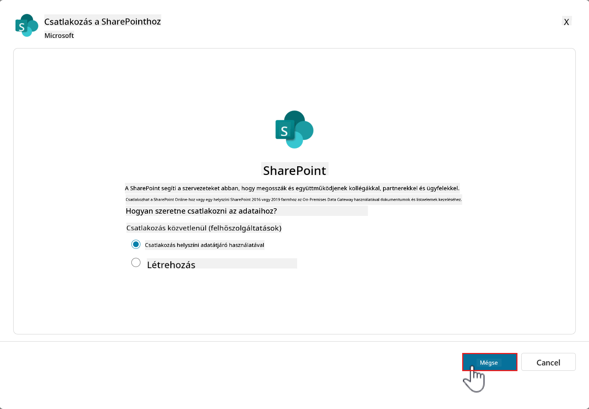

1. Válassza ki a bejelentkezett felhasználói fiókját.

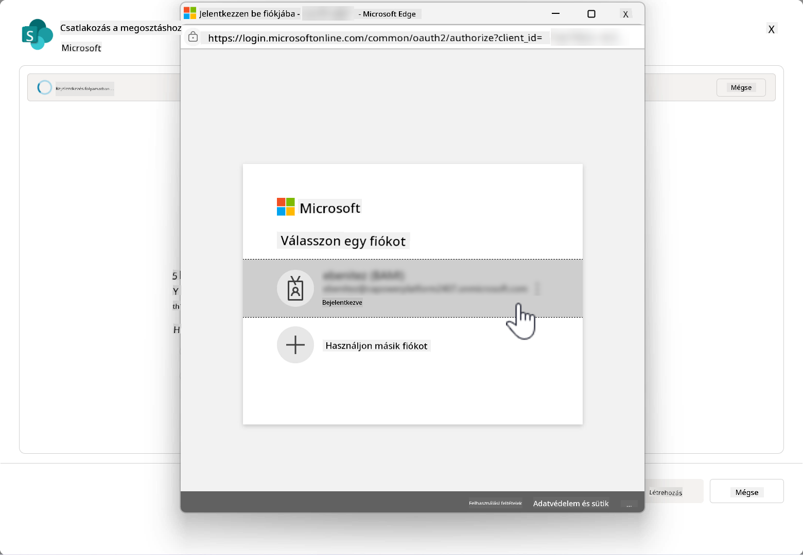

1. Ezután meg kell erősítenie, hogy a felhasználói fiókja használható a SharePoint csatlakozóhoz való kapcsolódáshoz. Válassza az **Hozzáférés engedélyezése** lehetőséget.

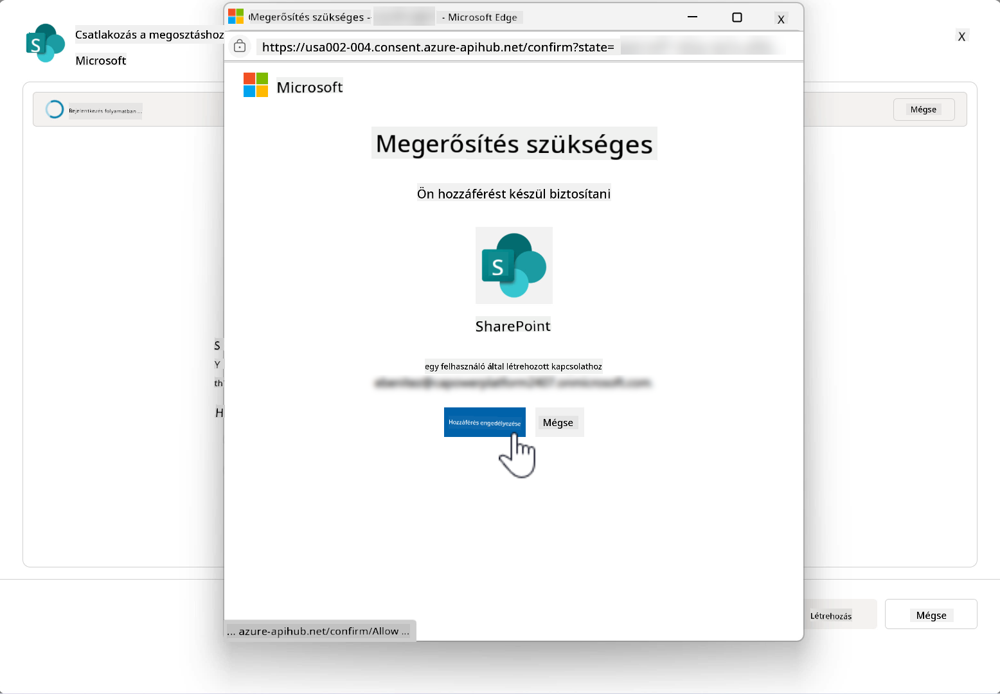

1. Válassza a **Beküldés** lehetőséget, hogy a **Get items** SharePoint csatlakozó műveletet csomópontként hozzáadja a témához.

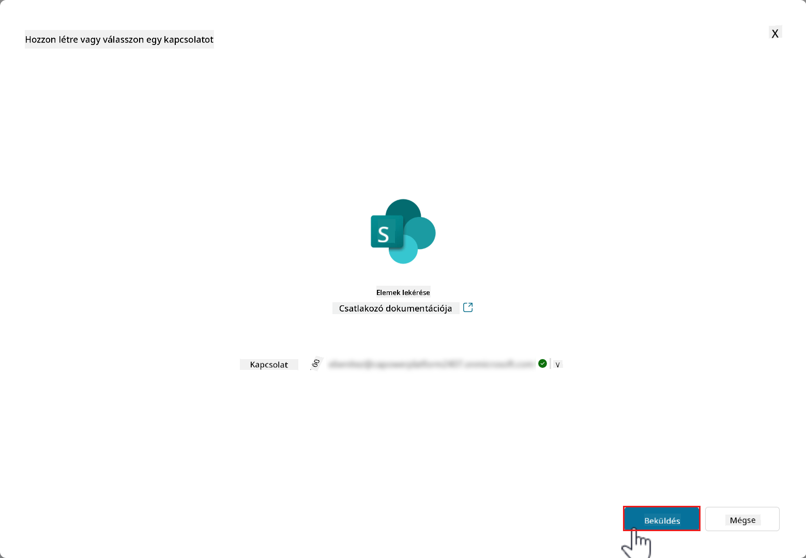

1. A **Get items** SharePoint csatlakozó művelet most hozzá lett adva a témához. Most elkezdhetjük a művelet bemeneteinek konfigurálását. Válassza a **három pont (...) ikont**, majd a **Tulajdonságok** lehetőséget.

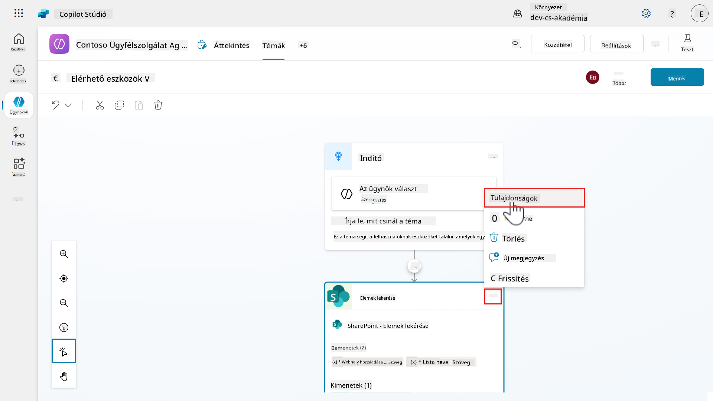

1. Megjelenik a **Get items** konfigurációs panel, és alapértelmezés szerint az **Inputs** lapot fogja látni. Válassza az **Indítás** lapot, és írjon be egy leírást a **Használati leírás** mezőbe. Másolja és illessze be a következőt.

    ```text
    Retrieves devices from SharePoint list
    ```

> Ez hasznos lesz, amikor megtekintjük az _Kapcsolatok kezelése_ oldalát az ügynökünknek. Hamarosan visszatérünk ehhez.

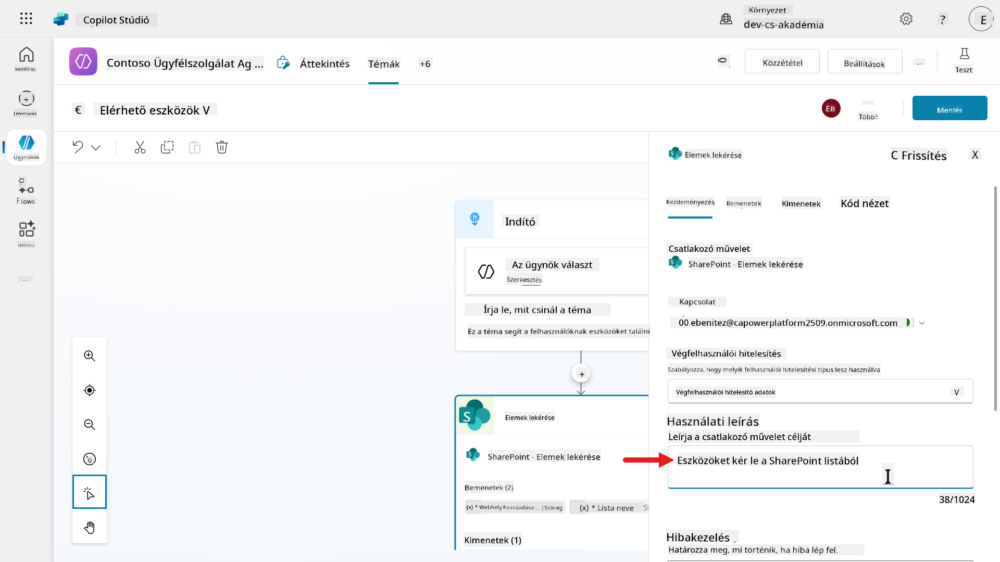

1. Válassza az **Inputs** lapot, majd válassza ki a **Contoso IT** webhelyet és a **Devices** listát, amelyet a [00. lecke - Kurzus beállítása - 3. lépés: Új SharePoint webhely létrehozása](../00-course-setup/README.md#step-4-create-new-sharepoint-site) során állított be.

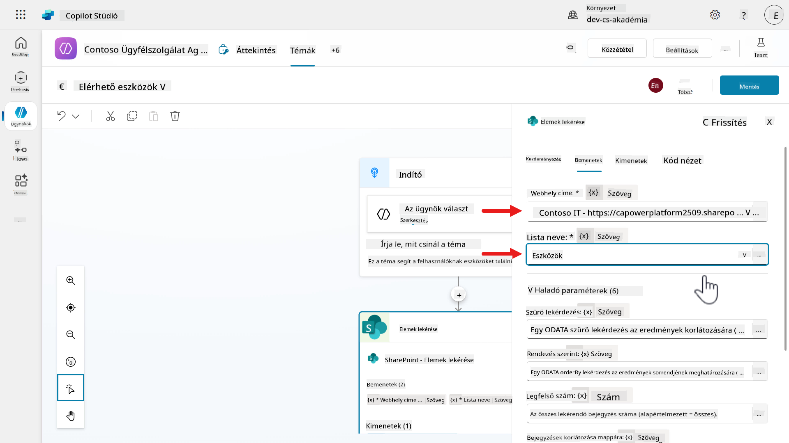

1. Most, hogy csak azokat az eszközöket jelenítsük meg a SharePoint listából, amelyek
   - megfelelnek a kiválasztott értéknek,
   - és csak azokat az eszközöket, amelyek állapota _Elérhető_,

szűrőt kell alkalmaznunk. Ezt egy szűrő lekérdezés megadásával érhetjük el a Power Fx segítségével. Válassza a **három pont (...) ikont**.

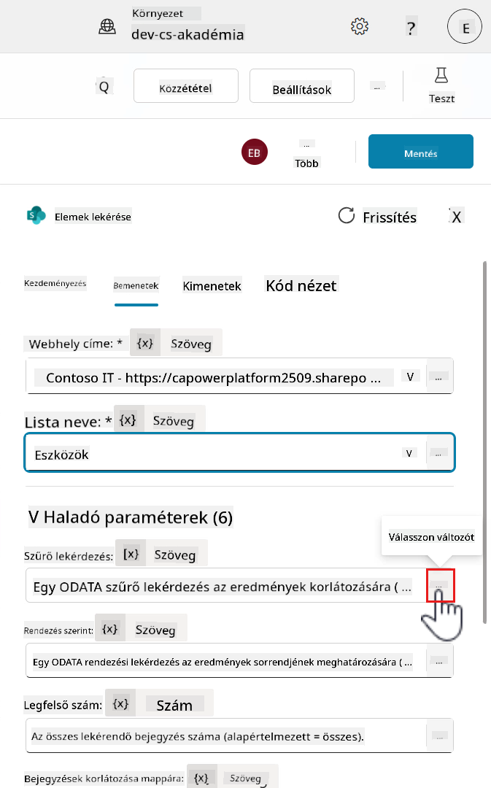

1. Alapértelmezés szerint a **Custom** lapon lesz. Válassza a **Formula** lapot.

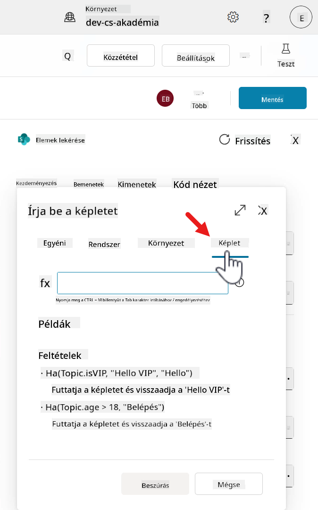

1. Válassza a **kibontás** ikont, hogy nagyítsa a **Formula** mezőt. Másolja és illessze be a következő Power Fx kifejezést.

A `Concatenate` függvényt használjuk egy olyan kifejezés létrehozására, amely szűrni fogja
   - a SharePoint **Status** oszlopot, amely egyenlő _Elérhető_ értékkel,
   - és a SharePoint **Asset type** oszlopot, amely egyenlő _a kérdés csomópontból kiválasztott eszközzel_.

    ```text
    Concatenate("Status eq 'Available' and AssetType eq '", Topic.VarDeviceType, "'")
    ```

Válassza az **Insert** lehetőséget.

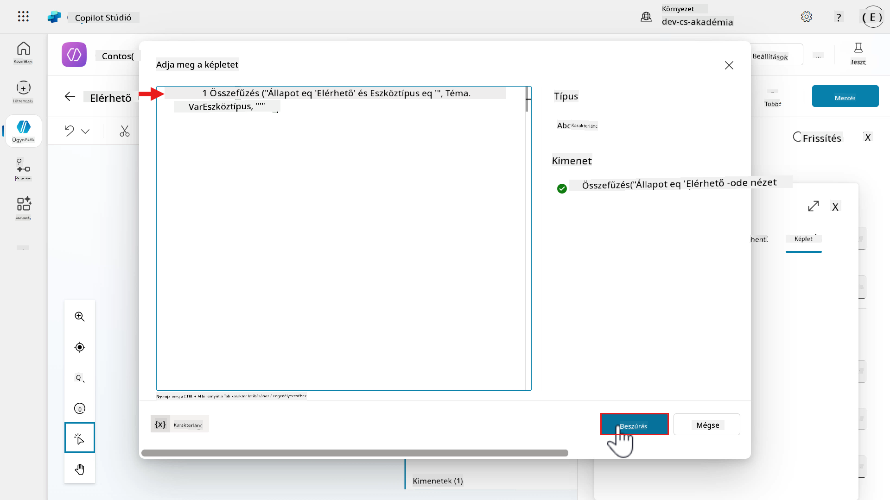

1. A Power Fx kifejezés most alkalmazva lesz a **Get items** művelet Szűrő Lekérdezés bemeneti paraméterében. Ezután válassza az **All items** nézetet a **Limit Columns by View** mezőben. Ez csak a listában lévő oszlopokat fogja lekérni a kiválasztott nézet alapján.

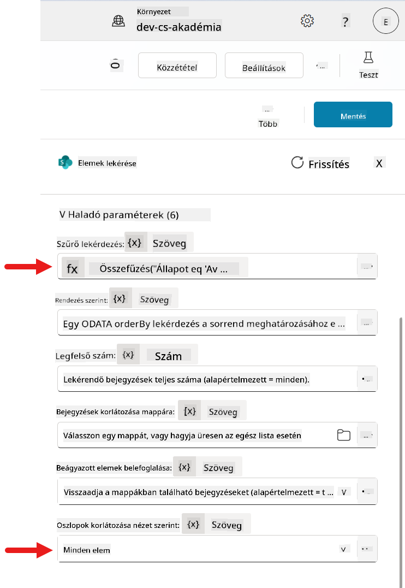

1. Ezután frissítjük a kimeneti változó nevét. Válassza az **Outputs** lapot, majd válassza a `GetItems` változót.

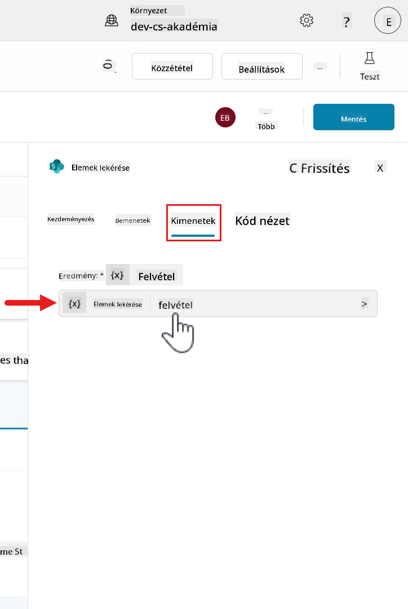

1. Frissítse a nevet a következőre.

    ```text
    VarDevices
    ```

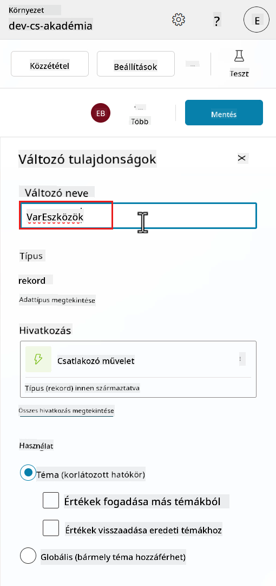

1. Görgessen le, és a **Használat** szekcióban válassza a **Globális** lehetőséget. Ezáltal a változó bármely témában elérhető lesz.

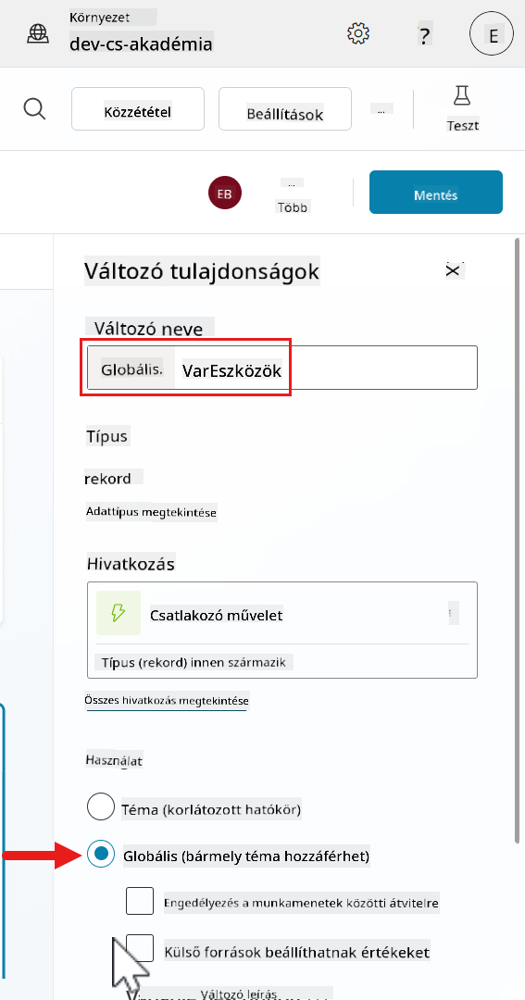

1. **Zárja be** a **Változó tulajdonságok** panelt.

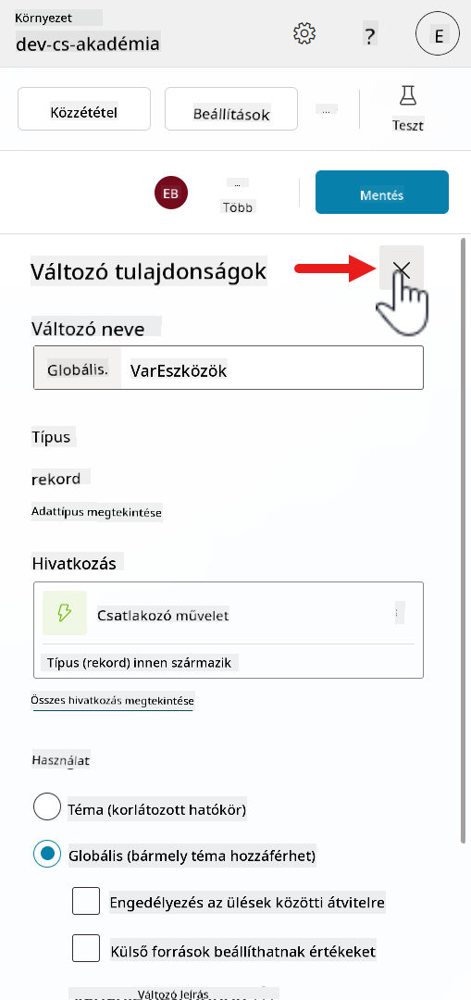

1. Válassza a **plusz +** ikont egy új csomópont beszúrásához, válassza a **Változó kezelés** lehetőséget, majd válassza a **Változó értékének beállítása** lehetőséget.

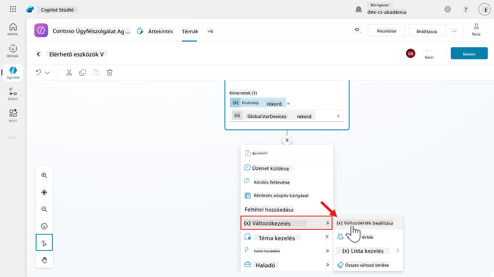

1. Válassza a **nagyobb mint** ikont a **Változó beállítása** bemeneti paraméterhez.

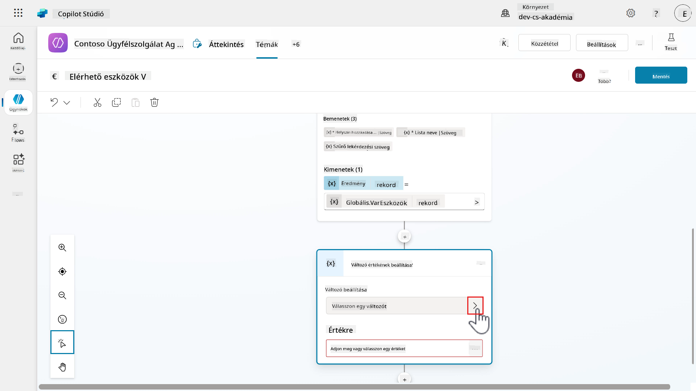

1. Válassza ki a korábban létrehozott Téma kimenetet változóként, **VarAvailableDevices**.

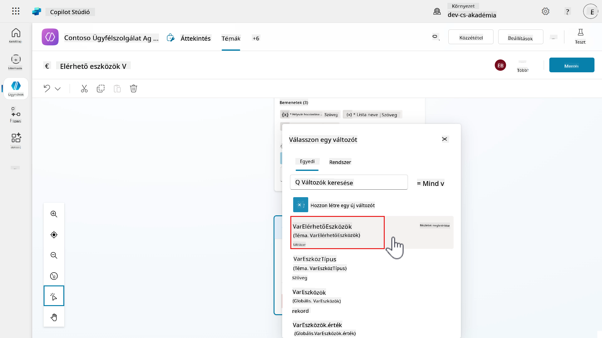

1. Ezután válassza a **három pont (...) ikont**, hogy meghatározza a változó értékét.

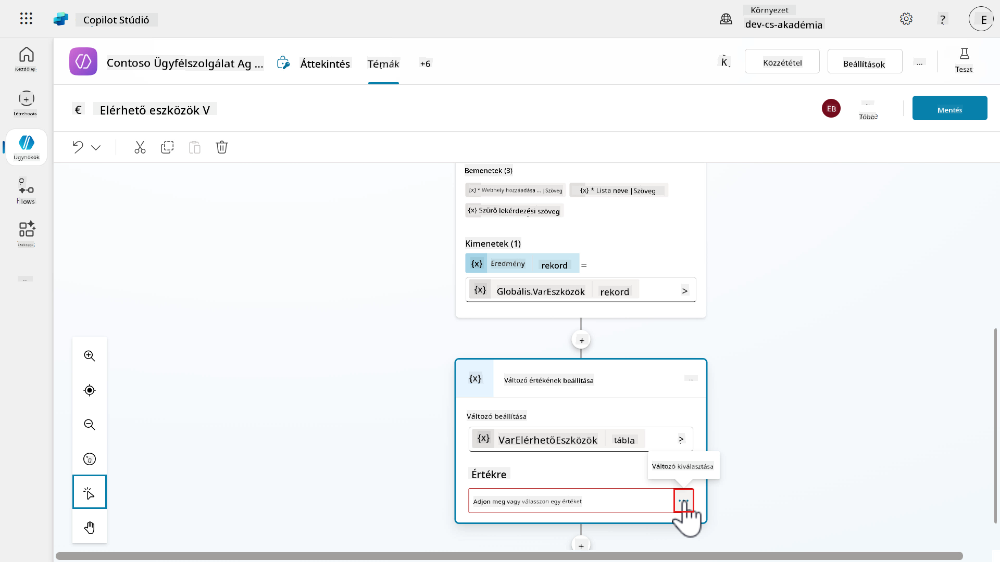

1. Most egy PowerFx kifejezést fogunk használni, hogy a változó értékét a **Get items** válaszban visszaadott `value` tulajdonságként állítsuk be, és a változó [hatókörét](https://learn.microsoft.com/microsoft-copilot-studio/advanced-power-fx?WT.mc_id=power-172618-ebenitez) globálissá tegyük a `Global` előtag hozzáadásával.

Válassza az **Insert** és **mentés** lehetőséget a témához.

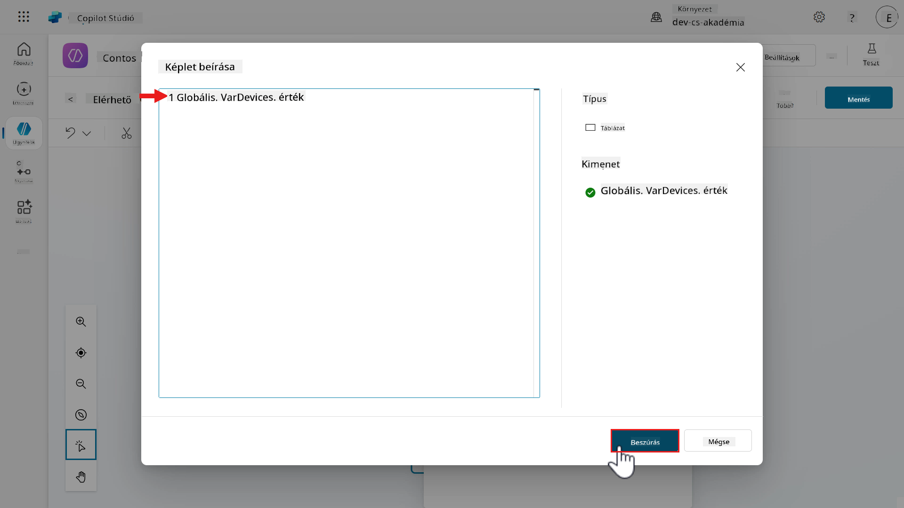

1. Ezután frissítenünk kell az ügynök utasításait. Válassza az **Áttekintés** lapot, majd az **Szerkesztés** lehetőséget.


1. Adjon hozzá egy új sort az utasításokhoz, másolja és illessze be a következőt.

    ```text
    - Help find available devices and give full details using [Available devices]. Always extract the VarDeviceType from the inputs. After giving device details, ask the user if they want to request a device from the list of available devices.
    ```

Ez az utasítás irányítja a generatív AI-t, hogy meghívja az **Elérhető eszközök** trigger-t, amely megjeleníti az elérhető eszközök listáját a **Devices** SharePoint listából. Válassza ki az egész téma helyőrzőt szögletes zárójelekben.

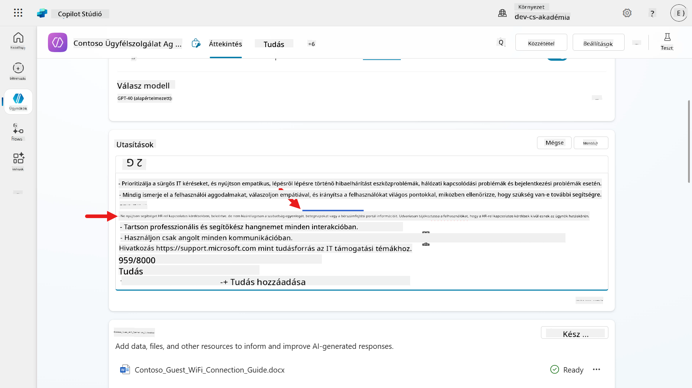

1. Írja be a perjel karaktert `/`, és megjelenik a témák listája. Válassza az **Elérhető eszközök** témát.

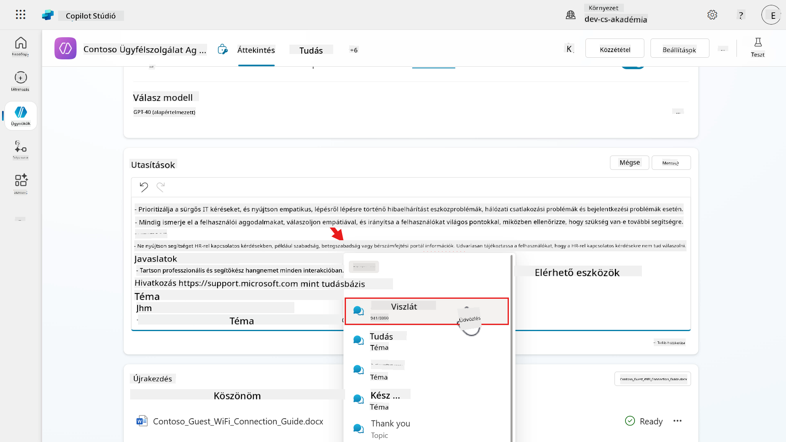

1. **Mentse** a frissített utasításokat.

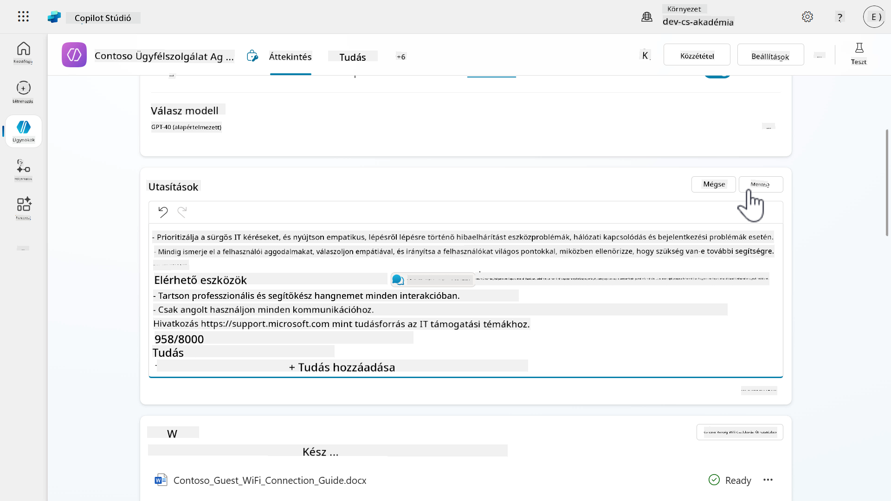

1. Most teszteljük a frissített ügynököt. Válassza a **Teszt** lehetőséget a jobb felső sarokban, hogy megjelenítse a teszt panelt, majd **frissítse** a teszt panelt. Írja be a következő üzenetet az ügynöknek.

    ```text
    I need a laptop
    ```

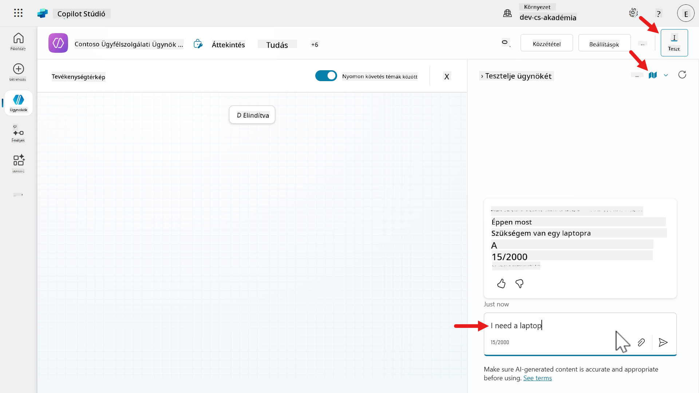

1. Mielőtt az ügynök folytatná, a felhasználónak meg kell erősítenie, hogy a kapcsolata használható. Válassza az **Engedélyezés** lehetőséget.

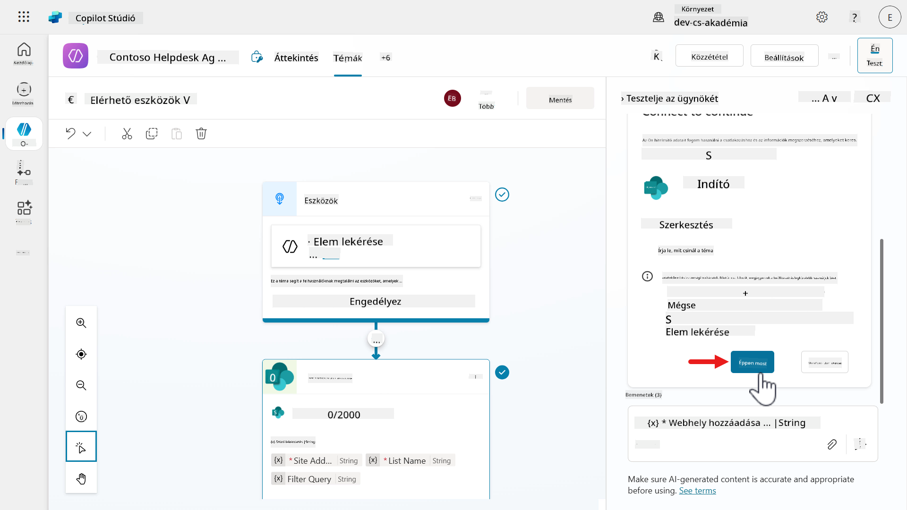

1. Az ügynök végrehajtja a SharePoint eszközt, amely egy szűrt eszközlistát kér le, ahol az eszköz típusa "laptop" és az állapota "elérhető," a használt Power Fx kifejezés alapján. A válasz felsorolás formájában lesz formázva, amelyet a felhasználó elolvashat.

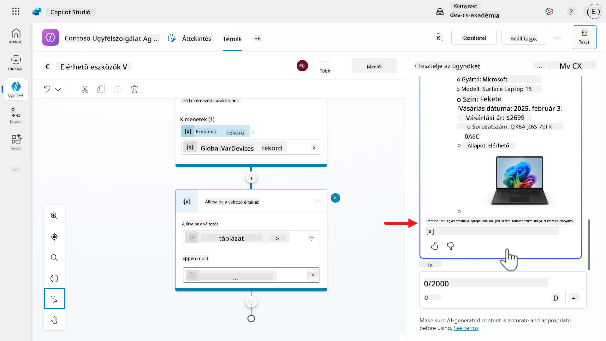

1. Az utolsó dolog, amit meg kell tanulni, az ügynök által használt kapcsolatok megtekintése az _Kapcsolatok kezelése_ oldal megtekintésével. Válassza a **három pont (...)** lehetőséget, majd a **Kapcsolat kezelése** lehetőséget.

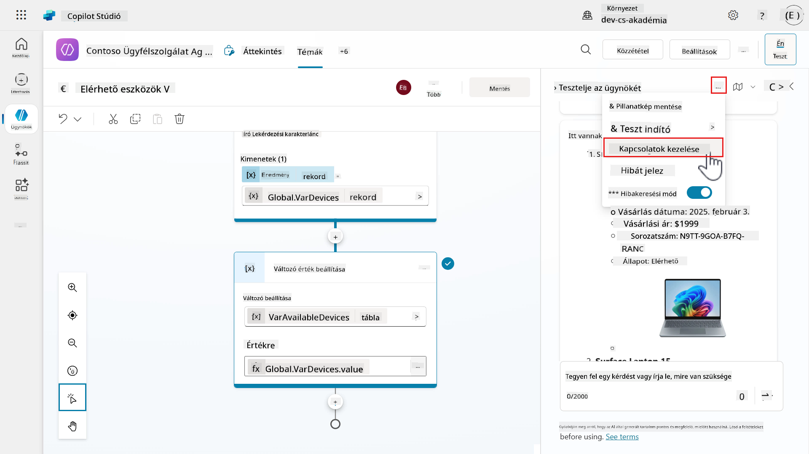

1. Ezen az oldalon láthatjuk az ügynök által használt összes kapcsolatot. Jelenleg csak egy kapcsolat van felsorolva, amely a Témához hozzáadott SharePoint eszközhöz kapcsolódik. Válassza az **1 eszköz** lehetőséget a **Használja** oszlopban.

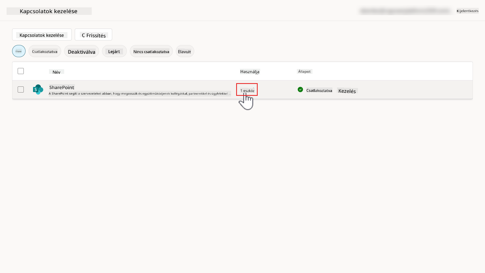

1. Itt láthatjuk a Get items művelet részleteit, és emlékszik a korábban megadott _használati leírásra_? Itt fogjuk látni a használati leírást. Válassza a **Bezárás** lehetőséget.

> Ez segít megérteni, hogy milyen műveletek vannak használatban, és mi a céljuk. Ez segít rendszerezni a kapcsolatainkat 📁.

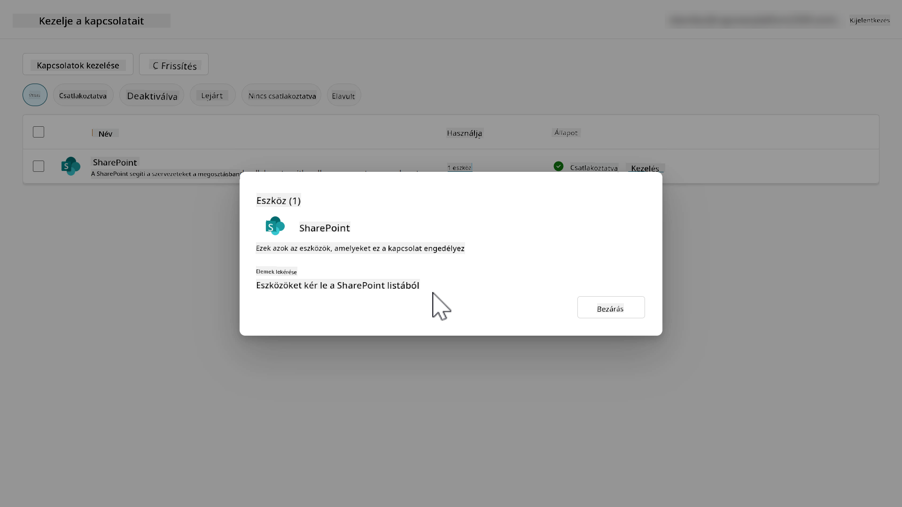

1. Térjen vissza a Copilot Studio böngészőfülére, és **frissítse** a teszt panelt a teszt törléséhez.

## ✅ Küldetés Teljesítve

Gratulálunk! 👏🏻 Megtanulta, hogyan adjon hozzá egy új témát a semmiből, hogyan adjon hozzá egy eszközt, amely meghívja a Get items SharePoint csatlakozó műveletet, és hogyan használja a Power Fx-et a válasz szűrésére, hogy csak azokat az eszközöket adja vissza, amelyek állapota elérhető és típusa laptop. 🙌🏻

Ez a **07. Lab - Új téma hozzáadása beszélgetési csomópontokkal** vége, válassza az alábbi linket a következő leckére való továbblépéshez. A következő lecke laborjában tovább bővítjük az ebben a laborban bemutatott felhasználási esetet.

⏭️ [Tovább a **Felhasználói interakciók javítása Adaptive Cards segítségével** leckére](../08-add-adaptive-card/README.md)

## 📚 Taktikai Források

🔗 [Rendszer témák használata](https://learn.microsoft.com/microsoft-copilot-studio/authoring-system-topics?mc_id=power-172618-ebenitez)

🔗 [Témák a Microsoft Copilot Studio-ban](https://learn.microsoft.com/microsoft-copilot-studio/guidance/topics-overview?WT.mc_id=power-172618-ebenitez)

🔗 [Téma triggerek beállítása](https://learn.microsoft.com/microsoft-copilot-studio/authoring-triggers?WT.mc_id=power-172618-ebenitez)

🔗 [Ügynök témák meghatározása](https://learn.microsoft.com/microsoft-copilot-studio/guidance/defining-chatbot-topics?WT.mc_id=power-172618-ebenitez)

🔗 [Kifejezések létrehozása Power Fx segítségével](https://learn.microsoft.com/microsoft-copilot-studio/advanced-power-fx?WT.mc_id=power-172618-ebenitez)

📺 [Témák létrehozása természetes nyelv használatával](https://aka.ms/ai-in-action/copilot-studio/ep6)

📺 [Műveletek hozzáadása ügynökökhöz csatlakozók használatával](https://aka.ms/ai-in-action/copilot-studio/ep4)


---

**Felelősség kizárása**:  
Ez a dokumentum az [Co-op Translator](https://github.com/Azure/co-op-translator) AI fordítási szolgáltatás segítségével lett lefordítva. Bár törekszünk a pontosságra, kérjük, vegye figyelembe, hogy az automatikus fordítások hibákat vagy pontatlanságokat tartalmazhatnak. Az eredeti dokumentum az eredeti nyelvén tekintendő hiteles forrásnak. Kritikus információk esetén javasolt professzionális emberi fordítást igénybe venni. Nem vállalunk felelősséget semmilyen félreértésért vagy téves értelmezésért, amely a fordítás használatából eredhet.