<!--
CO_OP_TRANSLATOR_METADATA:
{
  "original_hash": "cc4afa4a5a11c9d03896decfbcbd4060",
  "translation_date": "2025-10-20T17:22:21+00:00",
  "source_file": "docs/recruit/09-add-an-agent-flow/README.md",
  "language_code": "hu"
}
-->
# 🚨 Küldetés 09: Adj hozzá egy ügynökfolyamatot a Témádhoz az automatizálás érdekében

## 🕵️‍♂️ KÓDNEVE: `MŰVELET AUTOMATIZÁLÁSI ERŐMŰ`

> **⏱️ Műveleti időablak:** `~30 perc`  

🎥 **Nézd meg az útmutatót**

[](https://www.youtube.com/watch?v=vtLZJT3eBXg "Nézd meg az útmutatót a YouTube-on")

## 🎯 Küldetés összefoglaló

Az ügynököd már képes kommunikálni a felhasználókkal és információt nyújtani, de az igazi működési kiválóság érdekében az ügynöknek cselekednie is kell. Ez a küldetés átalakítja a beszélgető ügynöködet egy automatizálási erőművé, amely ügynökfolyamatokkal van felszerelve.

A küldetés végére létrehozol egy teljes körű eszköz igénylési automatizációt, amely adaptív kártyán keresztül gyűjti be a felhasználói adatokat, SharePointból adatokat nyer ki, e-mailben értesítéseket küld a vezetőknek, és zökkenőmentes visszajelzést nyújt a felhasználóknak - mindezt az ügynököd intelligens munkafolyamat-automatizációval irányítja.

## 🔎 Célok

Ebben a küldetésben megtanulod:

1. Megérteni, mik azok az ügynökfolyamatok, és miben különböznek a Power Automate felhőfolyamataitól az automatizáció terén.
1. Megismerni az ügynökfolyamatok erőteljes funkcióit, beleértve az AI műveleteket és a természetes nyelvi szerkesztést.
1. Felfedezni az ügynökfolyamat-tervezőt és az kifejezések használatát a dinamikus adatkezeléshez.
1. Létrehozni egy teljes eszköz igénylési automatizációt, amely integrálja a SharePoint adatokat és az e-mail értesítéseket.

## 🤔 Mi az az ügynökfolyamat?

Az ügynökfolyamatok hatékony eszközt kínálnak az ismétlődő feladatok automatizálására és az alkalmazások, szolgáltatások integrálására. Gondolj rájuk úgy, mint strukturált, lépésről lépésre haladó munkafolyamatokra, amelyeket az ügynököd végrehajthat a feladatok automatizálása vagy más alkalmazásokkal és szolgáltatásokkal való kapcsolódás érdekében. Ezek mini munkafolyamatok, amelyek segítik az ügynököt például értesítések küldésében, rekordok frissítésében vagy eseményekre való reagálásban.

Az autonóm ügynökökkel ellentétben, amelyek mesterséges intelligenciát használnak a döntések meghozatalához, az ügynökfolyamatok **determinista munkafolyamatok** - vagyis mindig ugyanazt az utat követik, biztosítva a következetes és megbízható eredményeket.

Egyszerűen fogalmazva:

- Segítenek az ügynöködnek _cselekedni_, nem csak _beszélni_ a felhasználókkal.
- Újrahasználhatók különböző témák és ügynökök között, és aktiválhatók felhasználói üzenetek, események vagy más alkalmazások és szolgáltatások által.

## 🙋🏽 Igen, de miben különbözik a Power Automate felhőfolyamataitól?

Mind az ügynökfolyamatok, mind a Power Automate felhőfolyamatok segítenek a feladatok automatizálásában. Különböző célokra készültek, és eltérő módon működnek.

### 🤖 Ügynökfolyamatok a Copilot Studio-ban

**Mire valók:**

- Beszélgető és autonóm ügynökök számára készültek (ügynöki utasításokon keresztül) a Copilot Studio-ban.
- Az üzleti rendszerekkel való interakcióra összpontosítanak intelligens, AI-vezérelt automatizációval.

**Miért hasznosak:**

- Könnyen építhetők és kezelhetők közvetlenül a Copilot Studio-ban.
- Kiválóan alkalmasak olyan feladatok automatizálására, amelyek _beszélgetés közben_ történnek a felhasználókkal, például szabadságigénylés benyújtása.
- Nincs szükség külön Power Automate licencre, mivel a számlázás a Copilot Studio-n belüli használaton alapul. Ez időt és költséget takaríthat meg a vállalati csapatok számára.

**Korlátozások:**

- Nem oszthatók meg, másolhatók vagy rendelhetők hozzá társtulajdonosok.
- Az ügynökfolyamatok csak a Copilot Studio-ban láthatók és használhatók.
- Jelenleg az ügynökök eseményindítói szerkeszthetők a Power Automate készítői portálon.

### ☁️ Power Automate felhőfolyamatok

**Mire valók:**

- Általános célú automatizációra tervezték, amely számos alkalmazás és szolgáltatás között működik.
- Függetlenül futtathatók, vagy együttműködhetnek az ügynökfolyamatokkal.

**Miért hasznosak:**

- Széles körű csatlakozók kínálata.
- Ideális az ügynökökön kívüli folyamatok automatizálására.
- Megoszthatók, újrahasználhatók és kezelhetők csapatok között.

**Követelmények:**

- Power Automate licencre van szükség a használatukhoz.

### 📗 Összefoglaló

| Ezt használd | Amikor azt szeretnéd, hogy |
| :- | :- |
| Ügynökfolyamatok | Automatizálj feladatokat egy ügynökön belül, használj AI-t, és tartsd mindent a Copilot Studio-ban |  
| Power Automate felhőfolyamatok | Automatizálj alkalmazások és szolgáltatások között, vagy építs munkafolyamatokat ügynökökön kívül |

## 👍🏻 Miért érdemes ügynökfolyamatokat használni

Az ügynökfolyamatok mindig egy fix útvonalat követnek - ugyanazt teszik minden alkalommal, ha ugyanazt a bemenetet kapják.

Ezáltal:

- **Megbízhatóak** - biztos lehetsz benne, hogy minden alkalommal ugyanúgy működnek.
- **Kiszámíthatóak** - tudod, milyen eredményt várhatsz, amikor a folyamat fut.
- **Szabályalapúak** - az általad meghatározott lépéseket követik.

További előnyök:

- **Automatizáció** - lehetővé teszi az ügynök számára, hogy ismétlődő feladatokat kezeljen, például űrlapok benyújtását vagy értesítések küldését.
- **Kapcsolódás** - több mint 1400 csatlakozóval, mint például ServiceNow, SharePoint, Salesforce. Vagy készíthetsz saját egyedi csatlakozót.
- **Szorosan integrált** - az ügynökfolyamatok az ügynök logikájának részei, közvetlenül a felhasználói üzenetek vagy beszélgetésben történő műveletek indítják el őket.
- **Skálázhatóság** - folyamatok újrahasználata több ügynök vagy forgatókönyv között.
- **Kódmentes vagy alacsony kódú** - természetes nyelv vagy vizuális tervező segítségével építhetsz folyamatokat.
- **Minden egy platformon** - az ügynökfolyamatokat egy helyen tervezheted, tesztelheted és telepítheted - a Copilot Studio-ban. Nincs szükség platformok közötti váltásra.

## 🏄🏻‍♂️ Hogyan javítják az ügynökfolyamatok az ügynöködet?

Az ügynökfolyamatok lehetővé teszik, hogy az ügynököd többet tegyen annál, mint hogy "beszélget" a felhasználókkal. Lehetővé teszik, hogy cselekedjen és kapcsolatba lépjen rendszerekkel.

Tegyük fel, hogy egy pénzügyi osztályon dolgozol, és sok számlát kapsz a beszállítóktól. Általában valakinek el kell olvasnia minden számlát, ki kell emelnie a fontos részleteket - az összeget, dátumot, kitől érkezett -, ellenőriznie kell, hogy minden egyezik-e a nyilvántartásoddal, majd elküldeni a megfelelő személynek jóváhagyásra. Ez időigényes és fárasztó.

A Copilot Studio ügynökfolyamataival automatizálhatod ezt a folyamatot. Amint a számla beérkezik, az ügynök:

1. Elolvassa a dokumentumot intelligens dokumentumfeldolgozással, hogy megtalálja a kulcsfontosságú információkat.
1. Ellenőrzi az adatokat a vállalati nyilvántartásod alapján, hogy minden rendben van-e.
1. Jóváhagyásra továbbítja a megfelelő személy(ek)nek.

Ez időt takarít meg, csökkenti a hibák számát, és sokkal gördülékenyebbé teszi az egész folyamatot.

### Gondolj rá így

- **Ügynökök**: az okos döntéshozók
- **Ügynökfolyamatok**: a megbízható végrehajtók

### Miért fontos ez?

- A legjobb mindkét világból: megbízható automatizáció és rugalmas AI.
- Könnyen építhetsz és frissíthetsz folyamatokat, ahogy az üzleti igények változnak.
- Az automatizációt skálázhatod csapatok között.

## 🔌 Kulcsfunkciók, amelyek erőteljessé teszik az ügynökfolyamatokat

1. **Természetes nyelvi szerkesztés**
    - Leírhatod, mit szeretnél, hogy a folyamat tegyen, egyszerű hétköznapi nyelven.
    - A Copilot megérti a szándékodat, és létrehozza a folyamatot neked.
    - Nem kell kódot írnod - csak magyarázd el az ötletedet.

1. **AI műveletek**

    Használj AI-t:

    - Dokumentumok vagy képek olvasására és megértésére.
    - Hosszú tartalmak összefoglalására rövid, hasznos válaszokká.
    - Okos ajánlások vagy döntések meghozatalára.

1. **Generatív műveletek**
    - Ezek lehetővé teszik, hogy a folyamat valós időben alkalmazkodjon.
    - Az ügynök megtervezheti és módosíthatja a lépéseket a változó információk alapján.

1. **Integrációs műveletek**
    - Kapcsold össze a folyamatot más eszközökkel, mint például Outlook, Microsoft Teams, ServiceNow, SharePoint és más alkalmazások és szolgáltatások, több mint 1400 beépített csatlakozón keresztül, vagy saját egyedi csatlakozón keresztül.
    - Ez segíti az ügynököt, hogy együttműködjön a csapatod által már használt alkalmazásokkal.

1. **Ember a folyamatban**
    - Adj hozzá jóváhagyási lépéseket, ahol egy személynek kell átnéznie vagy megerősítenie valamit.
    - [Haladó jóváhagyások](https://learn.microsoft.com/microsoft-copilot-studio/flows-advanced-approvals?WT.mc_id=power-172621-ebenitez) támogatják az emlékeztetőket, delegálást és többlépcsős jóváhagyásokat.

## ⚙️ Hogyan működnek

1. **Indítás**

    Egy esemény indítja el a folyamatot - például egy felhasználó kérdést tesz fel, a folyamatot egy témából indítják, egy ütemezett időpontban, vagy egy másik rendszerben történő esemény.

1. **Műveletek**

    Ezek azok a lépések, amelyeket az ügynök követ - e-mail küldése, API hívása, jegy frissítése a ServiceNow-ban.

## 🧶 Hogyan hozz létre ügynökfolyamatot

1. **Természetes nyelv**: írd le, mit szeretnél, hogy az ügynök tegyen, és a Copilot megépíti neked.
1. **Tervező vászon**: húzd és ejtsd a műveleteket, feltételeket és ciklusokat az ügynökfolyamat-tervezőben, hogy létrehozd a folyamatot.

## 🎨 Mi az ügynökfolyamat-tervező?

Ez egy vizuális eszköz a Copilot Studio-ban, amely segít ügynökfolyamatokat építeni, szerkeszteni és kezelni, amelyek lépésről lépésre utasításokat adnak az ügynöködnek a feladatok elvégzéséhez. Úgy tervezték, hogy könnyen használható legyen, még akkor is, ha új vagy az ügynökfolyamatok terén.

### Az ügynökfolyamat-tervező kulcsfunkciói

1. **Vizuális vászon**
    - Az egész folyamatot diagramként láthatod.
    - Könnyen nagyíthatsz/kicsinyíthetsz, illesztheted a nézetet vagy használhatsz minitérképet nagy folyamatok navigálásához.

1. **Műveletek hozzáadása és eltávolítása**
    - Kattints a _plusz (+)_ gombra, hogy új műveletet adj hozzá, például üzenet küldése vagy elem frissítése egy SharePoint listában.
    - Kereshetsz műveleteket csatlakozókból, és beállíthatod őket a beállításokon keresztül.
    - Egy művelet eltávolításához kattints a _három pont (⋮)_ gombra, és válaszd a _Törlés_ opciót.

1. **Paraméterek ellenőrzése**
    - Kattints bármelyik műveletre, hogy megtekintsd vagy szerkeszd a beállításait, amelyeket _paramétereknek_ neveznek.
    - Manuálisan megadhatsz értékeket, vagy használhatsz _kifejezéseket_, hogy dinamikussá tedd őket.

1. **Verziótörténet**
    - Minden alkalommal, amikor elmented a folyamatot, egy verzió rögzítésre kerül.
    - Visszatérhetsz, megtekintheted vagy visszaállíthatod a korábbi verziót, ha szükséges.

1. **Hibakeresés**
    - A _Folyamatellenőrző_ kiemeli az esetleges hibákat.
    - Minden hibát meg kell oldani a folyamat közzététele előtt.

1. **Közzététel és tesztelés**
    - Miután a folyamat hibamentes, tedd közzé, hogy élő legyen.
    - Használd a _Teszt_ funkciót, hogy manuálisan vagy automatikusan futtasd a folyamatot, és ellenőrizd, hogy működik-e a vártak szerint.

### Miért érdemes az ügynökfolyamat-tervezőt használni?

- **Vizuális és intuitív** - folyamatokat építhetsz húzással és kattintással.
- **Biztonságos kísérletezés** - a verziótörténet lehetővé teszi a változtatások visszavonását.
- **Beépített tesztelés** - segít megbizonyosodni arról, hogy minden működik, mielőtt élővé válik.

## 🔤 Említetted a _kifejezéseket_ - mik azok a kifejezések?

A kifejezések kis formulák vagy parancsok, amelyek segítenek az ügynökfolyamatnak az adatok kezelésében. Ezeket használhatod értékek kisz
- Példa: `addDays(utcNow(), 7)` kimenete 7 nappal későbbi dátum.

- `formatDateTime()` - Formázza a dátumot olvasható szöveggé.
      - Példa: Hétfő, 2025. július 7.

#### ✅ Logikai

- `if()` - Egy értéket futtat, ha igaz, másikat, ha hamis.
      - Példa: `if(score > 50, 'Pass', 'Fail')`

- `equals()` - Ellenőrzi, hogy két érték megegyezik-e.

- `and()`, `or()`, `not()` - Több feltétel kombinálása.

#### 🪣 Egyéb hasznos függvények

- `coalesce()` - Az első nem üres értéket adja vissza.
      - Hasznos tartalék/előre beállított értékekhez.

- `guid()` - Egyedi azonosítót generál.
      - Hasznos nyomon követéshez vagy naplózáshoz.

- `length()` - Megszámolja, hány karakter vagy elem van egy szövegben vagy tömbben.

## ⭐ Legjobb gyakorlatok

Íme néhány legjobb gyakorlat a Copilot Studio-ban történő ügynökfolyamatok létrehozásához.

1. **Kezdje egyszerűen, és építse fokozatosan**

    - Kezdjen egy kis, egyértelmű feladattal, például egy üzenet küldésével.
    - Adjon hozzá további lépéseket, miután tesztelte az automatizálás alapjait.

1. **Használjon egyértelmű és leíró műveletneveket**

    - Nevezze el egyértelműen az egyes lépéseket, hogy Ön és csapata is megértse, mit csinálnak.
    - Példa: a SharePoint csatlakozó művelet alapértelmezett "Elem frissítése" neve helyett nevezze át arra, amit frissít, például "Eszköz állapotának frissítése".

1. **Ellenőrizze a hibákat a közzététel előtt**

    - Használja a **folyamatellenőrzőt**, hogy megtalálja és kijavítsa az esetleges problémákat.
    - Nem tudja közzétenni a folyamatokat, ha hibák vannak, ezért próbálja meg azokat azonnal megoldani.

1. **Tesztelje alaposan a folyamatot**

    - Csak azért, mert elmenti és közzéteszi, még nem biztos, hogy úgy működik, ahogy várja.
    - Használja a _Teszt_ funkciót, hogy manuálisan vagy automatikusan futtassa a folyamatot, és ellenőrizze az eredményeket.

1. **Használja a verzióelőzményeket**

    - Gyakran mentse a folyamatot, hogy szükség esetén visszatérhessen korábbi verziókhoz.
    - A _Verzióelőzmények_ panelen megtekintheti és visszaállíthatja a korábbi verziókat.

1. **Használja bölcsen a paramétereket és kifejezéseket**

    - A műveletek konfigurálásakor használjon paramétereket, hogy a folyamat dinamikus legyen.
    - Értékeket kézzel is megadhat, vagy kifejezéseket használhat azok kiszámításához, illetve kombinálhatja azokat a korábbi műveletek értékeivel a _dinamikus tartalom_ választó segítségével.

1. **Törölje a nem használt műveleteket**

    - Ha hozzáad egy műveletet, de később úgy dönt, hogy nincs rá szüksége, távolítsa el, hogy a folyamata tiszta maradjon.

## 🧪 Labor 09 - Ügynökfolyamat hozzáadása automatizáláshoz és a témaképességek fejlesztése

Most megtanuljuk, hogyan fejleszthetjük a témánkat adaptív kártyák segítségével, valamint a témák és csomópontok fejlettebb funkcióinak használatával.

- [9.1 Ügynökfolyamat létrehozása](../../../../../docs/recruit/09-add-an-agent-flow)
- [9.2 Ügynökfolyamat hozzáadása a témához](../../../../../docs/recruit/09-add-an-agent-flow)
- [9.3 Kérés eszköz téma frissítése több csomóponttal a jobb felhasználói élmény érdekében](../../../../../docs/recruit/09-add-an-agent-flow)
- [9.4 Ügynök tesztelése több forgatókönyvvel](../../../../../docs/recruit/09-add-an-agent-flow)

### ✨ Használati eset

**Mint** egy alkalmazott vezetője

**Azt szeretném**, hogy eszközökre vonatkozó kérelmeket kapjak

**Hogy** át tudjam tekinteni az alkalmazott által kért eszközt.

Kezdjük!

### Előfeltételek

1. **SharePoint lista**

    A **Devices** SharePoint listát fogjuk használni a [00. lecke - Kurzus beállítása - 3. lépés: Új SharePoint webhely létrehozása](../00-course-setup/README.md#step-4-create-new-sharepoint-site) alapján.

    Ha még nem állította be a **Devices** SharePoint listát, térjen vissza a [00. lecke - Kurzus beállítása - 3. lépés: Új SharePoint webhely létrehozása](../00-course-setup/README.md#step-4-create-new-sharepoint-site) részhez.

1. **Contoso Helpdesk Agent**

    Az előzőekben létrehozott ügynököt fogjuk használni a [06. lecke - Egyedi ügynök létrehozása természetes nyelv használatával a Copilotban és az adatokkal való alapozás](../06-create-agent-from-conversation/README.md) alapján.

### 9.1 Ügynökfolyamat létrehozása

Ebben a gyakorlatban létrehozunk egy ügynökfolyamatot, amely lekéri a SharePoint elemét a kiválasztott eszközről, és e-mailt küld egy vezetőnek az eszköz részleteivel.

1. A **Kérés eszköz** témában görgessen le az **Adaptív kártyával kérdezés** csomóponthoz, és adjon hozzá egy új csomópontot. Válassza a **Eszköz hozzáadása** lehetőséget, majd a megjelenő panel **Alapvető eszközök** fülén válassza az **Új ügynökfolyamat** lehetőséget.

    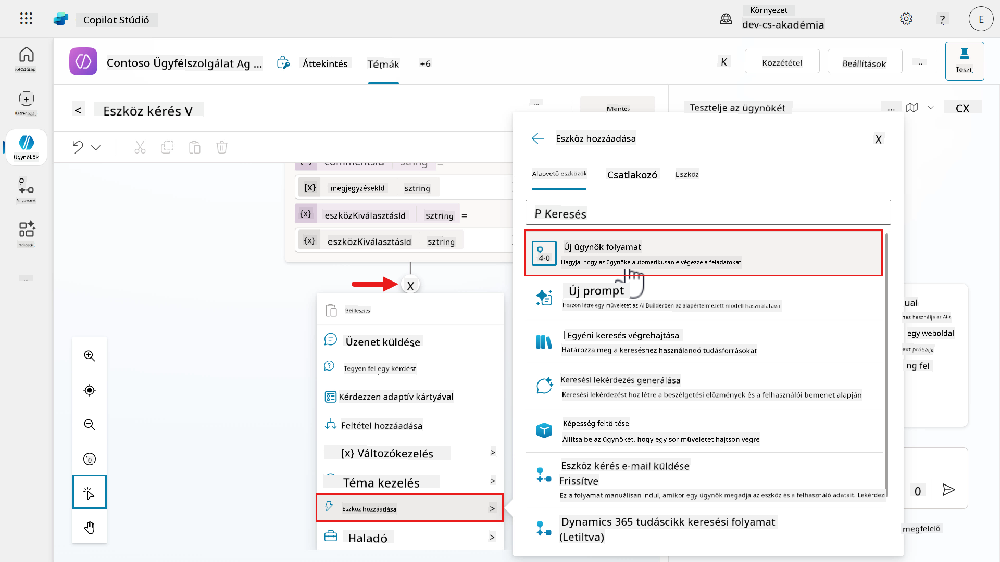

1. Az Ügynökfolyamatok **Tervezője** betöltődik egy triggerrel és egy művelettel.

    - **Trigger** - Amikor egy ügynök elindítja a folyamatot
        - Ez elindítja a folyamatot egy Copilot Studio ügynöktől.

    - **Művelet** - Válasz az ügynöknek
        - Ez egy választ küld, amely tartalmazhat kimeneti értékeket vissza a Copilot Studio ügynöknek.

    Válassza ki a triggert.

    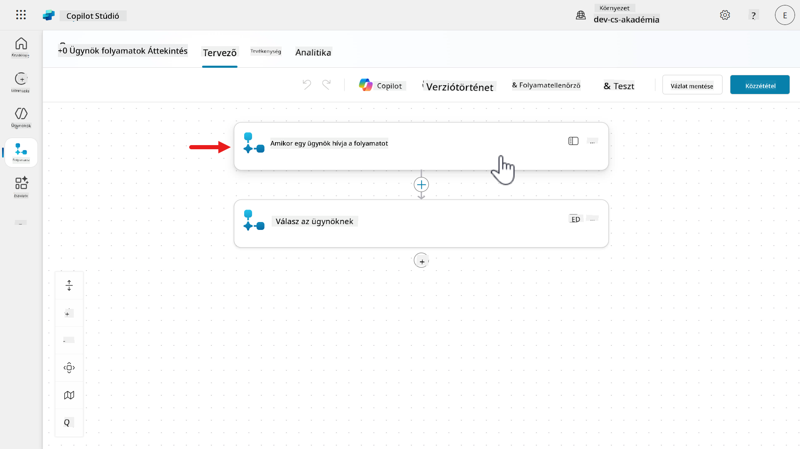

1. Ezután több bemenetet fogunk hozzáadni az ügynökfolyamathoz.

    - `DeviceSharePointId` - Ez fogja tárolni a SharePoint elem értékét, az ID-t. Ez az ID érték az Adaptív kártyával kérdezés csomópont kimenete, ahol a felhasználó kiválasztotta az eszközt.

    - `User` - Ez lesz a felhasználó neve, amely az ügynök rendszer változójából származik.

    - `AdditionalComments` - Ez lesz a felhasználó által megadott megjegyzés, amely az Adaptív kártyával kérdezés csomópont kimenete.

    Először hozzáadjuk a `DeviceSharePointId` bemenetet a triggerhez. Válassza a **+ Bemenet hozzáadása** lehetőséget.

    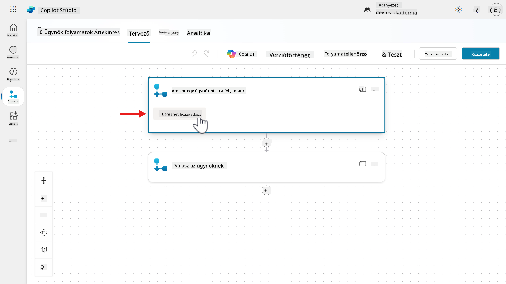

1. A felhasználói bemenet típusához válassza a **Szöveg** lehetőséget.

    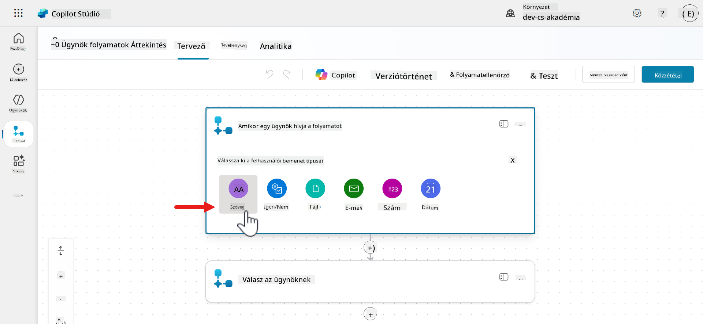

1. A bemenet nevéhez írja be a következőt.

    ```text
    DeviceSharePointId
    ```

    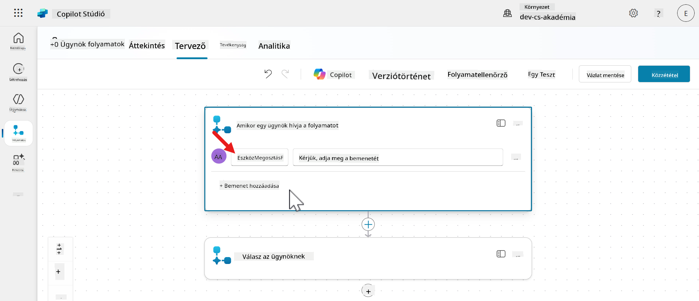

1. Most hozzáadjuk a második bemenetet, `User`. Ismételje meg ugyanazokat a lépéseket, válassza a **+ Bemenet hozzáadása** lehetőséget, majd válassza a **Szöveg** lehetőséget.

    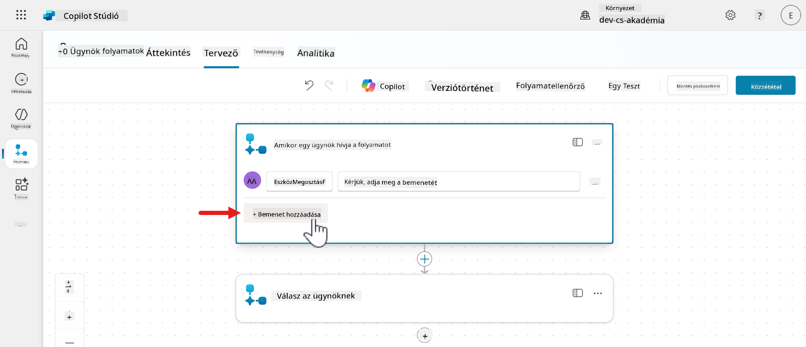

1. A bemenet nevéhez írja be a következőt.

    ```text
    User
    ```

    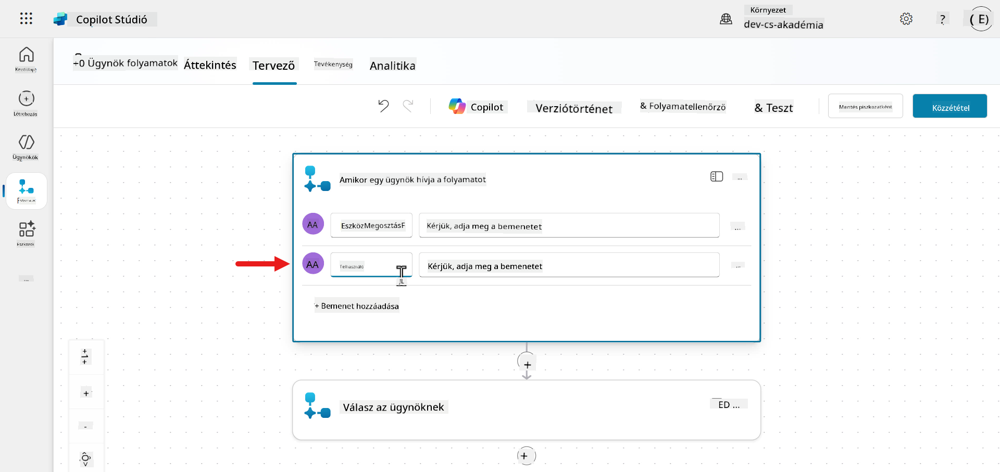

1. Most hozzáadjuk a harmadik bemenetet, `AdditionalComments`. Ismételje meg ugyanazokat a lépéseket, válassza a **+ Bemenet hozzáadása** lehetőséget, majd válassza a **Szöveg** lehetőséget.

    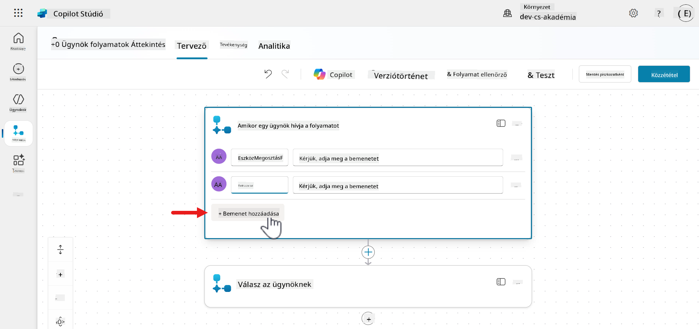

1. A bemenet nevéhez írja be a következőt.

    ```text
    AdditionalComments
    ```

    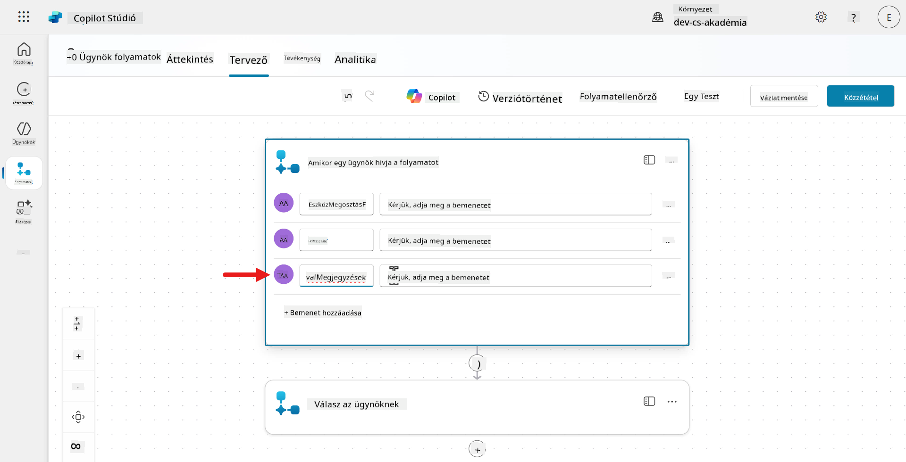

1. Az `AdditionalComments` bemenetet frissítjük, hogy opcionális legyen. Válassza a **három pont (...) ikont**, majd válassza a **Mező opcionálissá tétele** lehetőséget.

    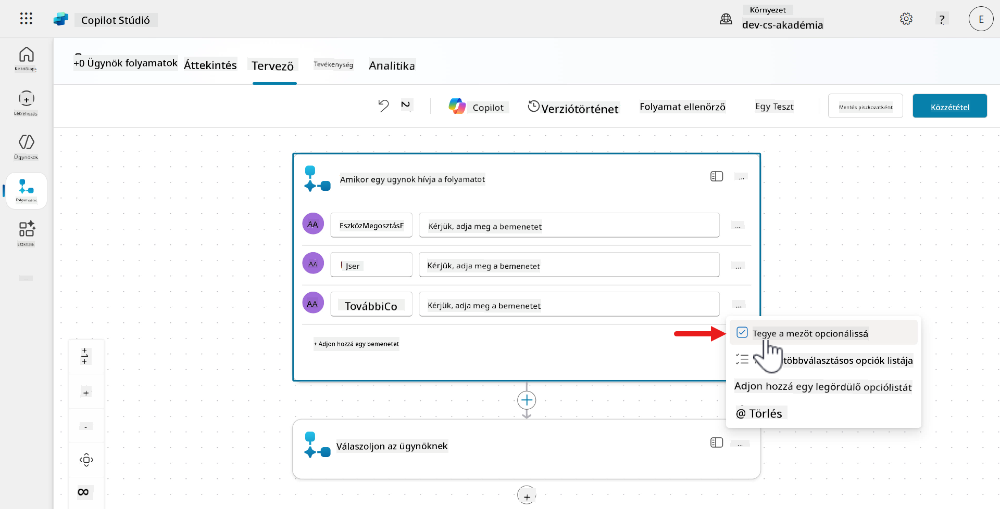

1. Szép munka! A trigger most már konfigurálva van, folytassuk. Válassza a **plusz + ikont** a trigger alatt, hogy új műveletet illesszen be.

    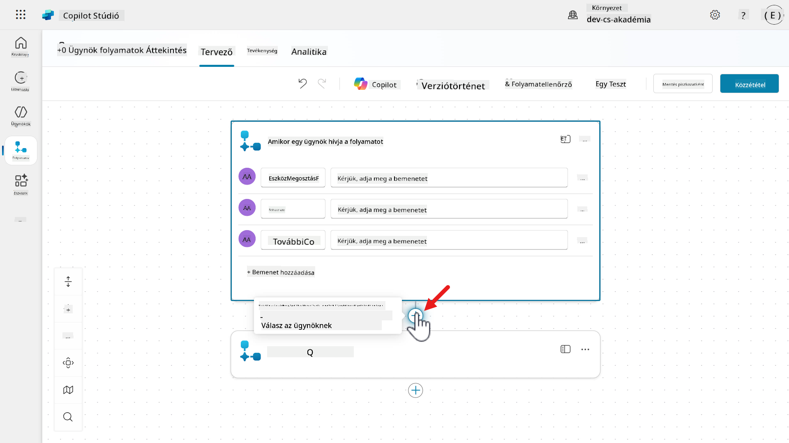

1. Megjelenik az **Műveletek panel**, ahol megtekintheti a Microsoft és harmadik fél szolgáltatások több mint 1400 beépített csatlakozójának műveleteit. A **keresőmezőbe** írja be a következőt,

    ```text
    Get item
    ```

    A keresési eredményekben megjelenik a műveletek listája. Válassza a **Get item** műveletet a **SharePoint csatlakozóból**.

    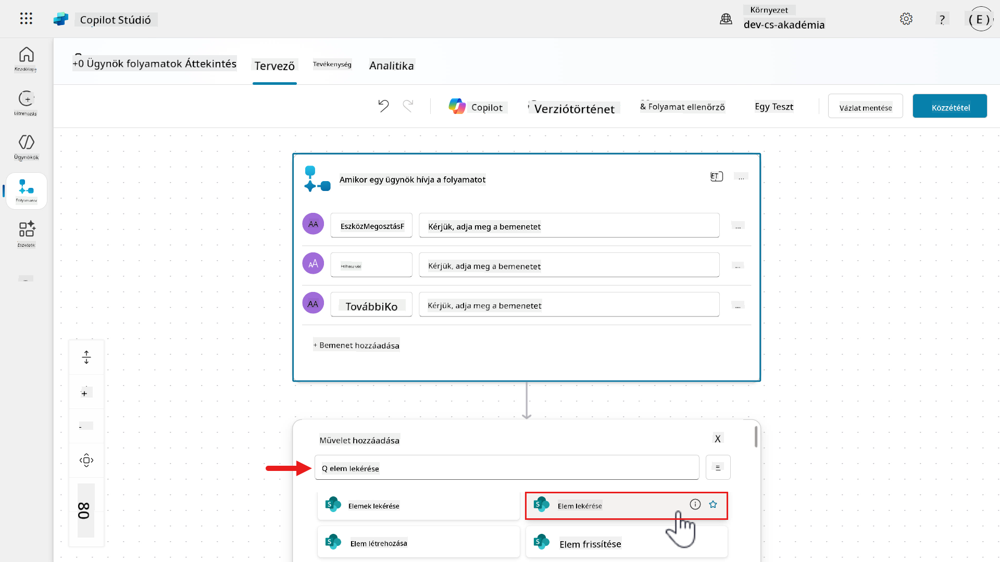

1. Most elkezdhetjük konfigurálni a **Get item** műveletet.

    Válassza a **Három pont (...)** ikont a **Get item** műveletben.

    

1. Válassza a **Átnevezés** lehetőséget.

    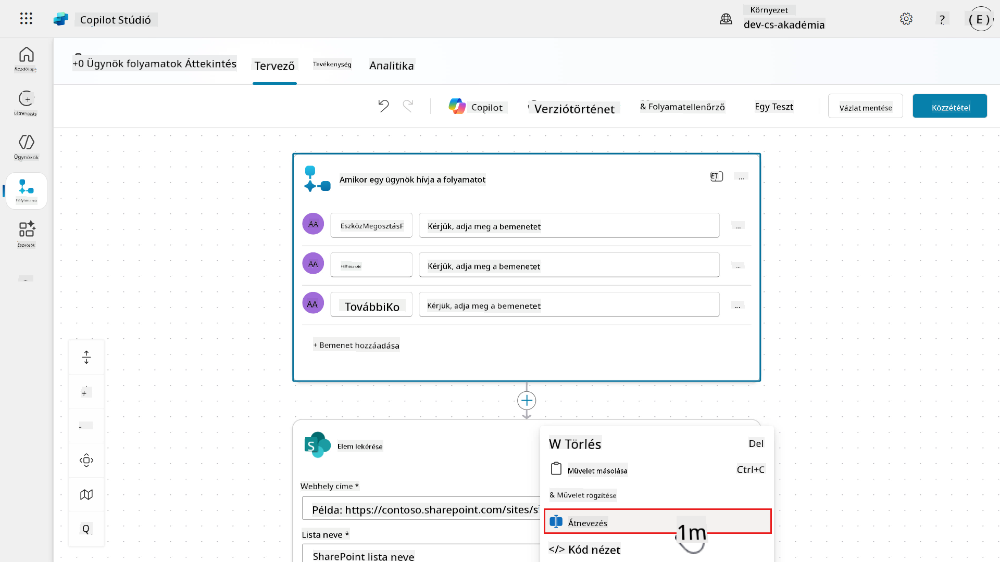

1. Nevezze át a műveletet a következőre,

    ```text
    Get Device
    ```

    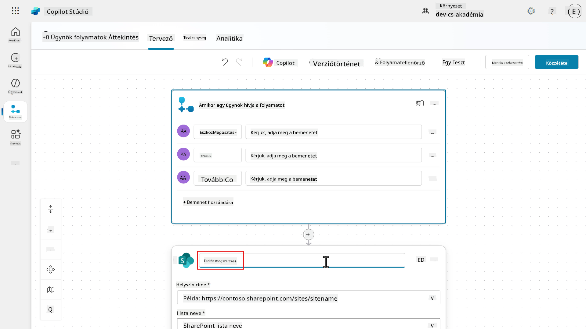

1. A **Webhely címe** mezőben válassza ki a Contoso IT SharePoint webhely **Webhely címét**, amelyet a [00. lecke - Kurzus beállítása - 3. lépés: Új SharePoint webhely létrehozása](../00-course-setup/README.md#step-4-create-new-sharepoint-site) során hozott létre.

    A **Lista neve** mezőben válassza ki a **Devices** SharePoint listát.

    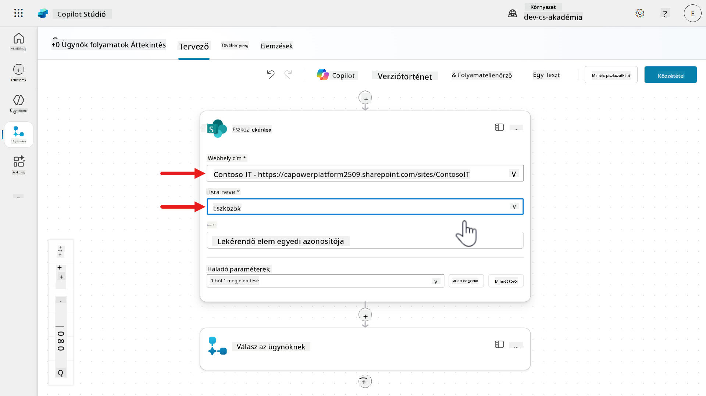

1. Az **Id** mezőben válassza a **villám ikon** vagy **fx ikon** lehetőséget a jobb oldalon.

    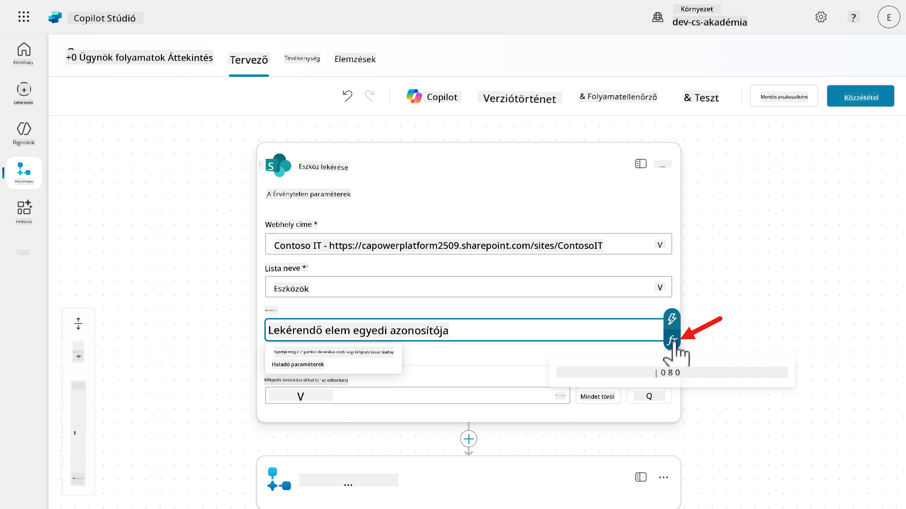

1. A megjelenő **Dinamikus tartalom** panelen írja be a következőt,

    ```text
    sharepoint
    ```

    A keresési eredményekben megjelennek a bemeneti paraméterek, amelyek megfelelnek a keresett értéknek. Válassza a **DeviceSharePointId** paramétert a triggerből.

    Ezután válassza a **Hozzáadás** lehetőséget, hogy a dinamikus tartalom bemenetet hozzáadja a művelet **Id** paraméteréhez.

    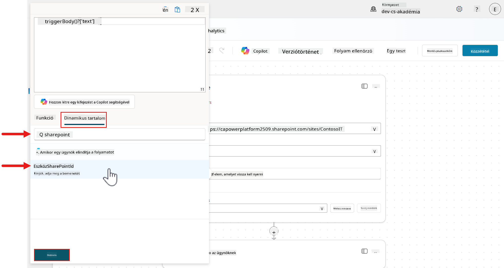

1. A triggerből származó dinamikus tartalom bemenet most már hivatkozva van a művelet **Id** paraméterében. Most frissítjük az egyik haladó paramétert. Válassza a **Mindet megjelenít** lehetőséget, hogy megtekintse a haladó paramétereket.

    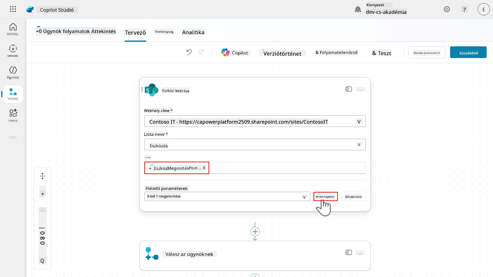

1. A **Limit Columns by View** paraméter megjelenik, és alapértelmezés szerint **Minden oszlop használata (Ne korlátozz)** értékre van állítva. Frissítjük ezt az értéket egy nézetre, hogy korlátozzuk az oszlopokat, amelyeket a művelet válaszában visszaad. Válassza a **Limit Columns by View** paramétert, hogy megtekintse a nézetek listáját.

    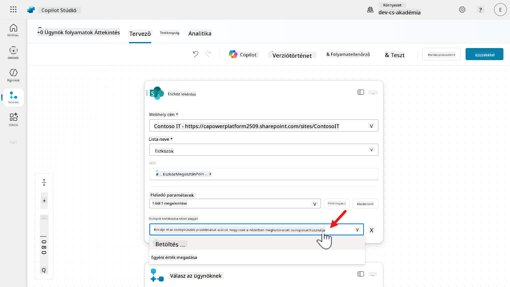

1. Válassza az **All Items** nézetet.

    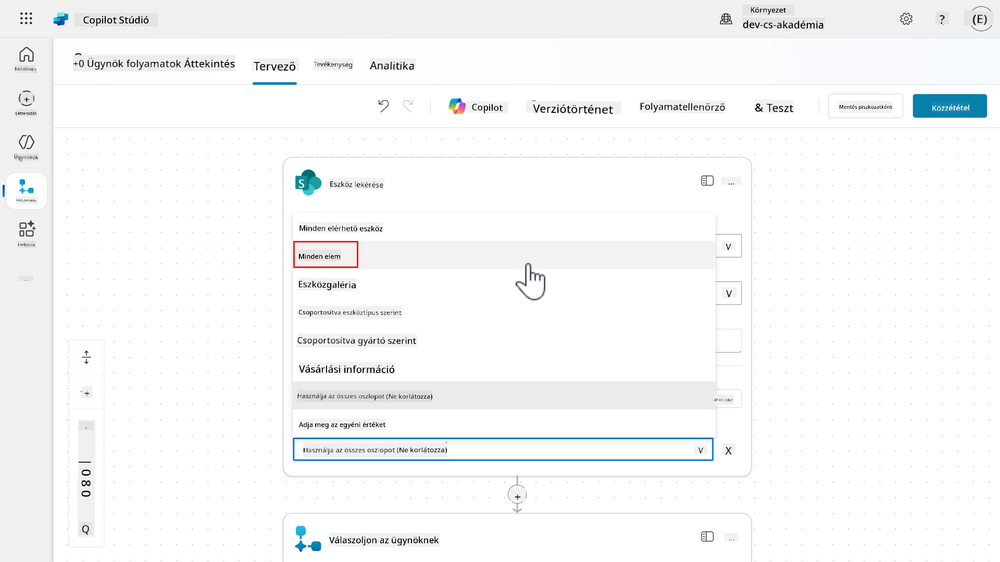

1. Válassza a **plusz + ikont** a _Get Device_ művelet alatt, hogy új műveletet illesszen be.

    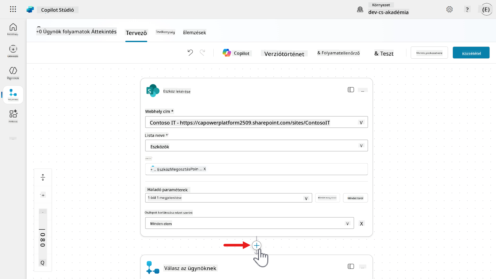

1. A keresőmezőbe írja be a következőt,

    ```text
    send an email
    ```

    A keresési eredményekben megjelenik a műveletek listája. Válassza a **Send an email (V2)** műveletet az **Office 365 Outlook csatlakozóból**.

    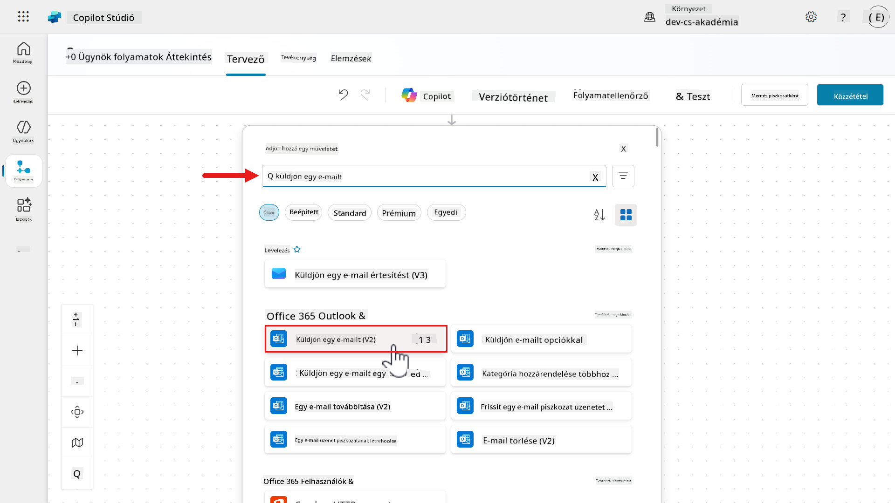

1. Ezután létre kell hoznunk egy kapcsolatot a csatlakozó művelethez. Válassza a **Bejelentkezés** lehetőséget.

    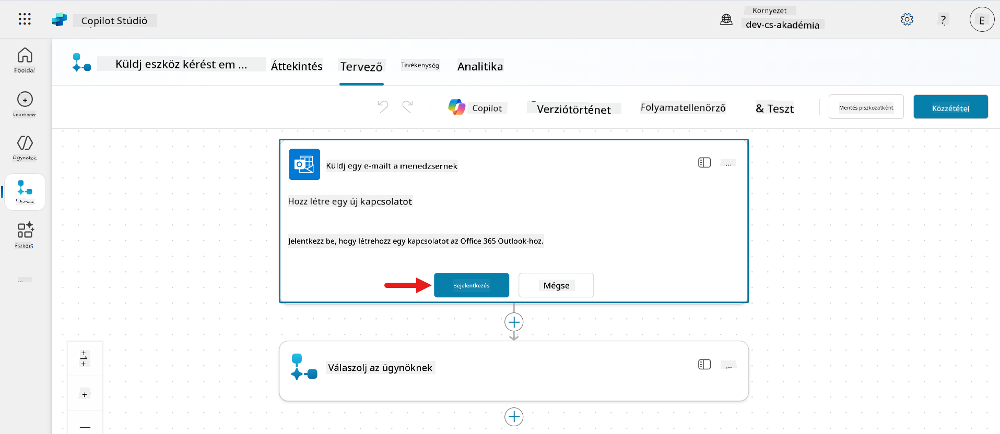

1. Válassza ki a bejelentkezett felhasználói fiókját.

    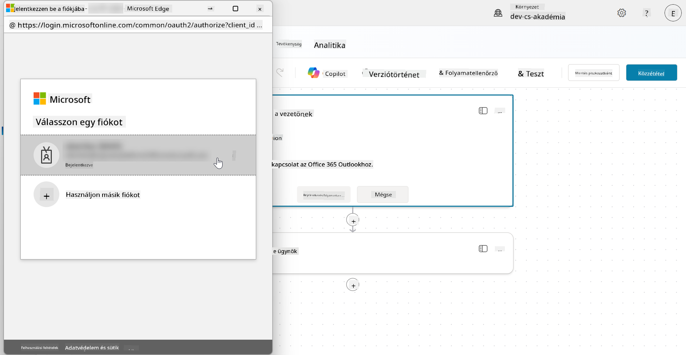

1. Válassza az **Hozzáférés engedélyezése** lehetőséget. Most létrejött a kapcsolat.

    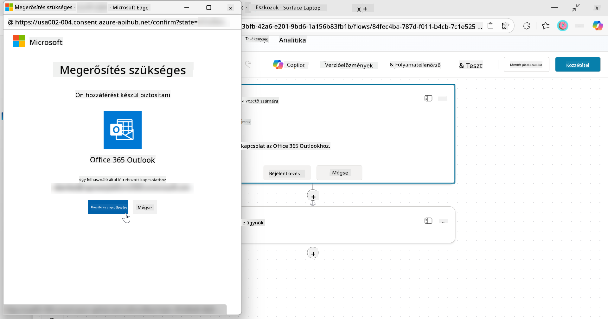

1. Nevezze át a műveletet a következőre,

    ```text
    Send an email to manager
    ```

    Ezután határozzuk meg a művelet bemeneti paramétereit.

    A **Címzett** bemeneti paraméterhez válassza ki saját magát. Normál esetben ez az Ön vezetője lenne, vagy egy másik műveletet használnánk, amely az Entra ID profilja alapján hozza át a vezetőjét, de ennek a leckének a céljából válassza ki saját magát.

    A **Tárgy** bemeneti paraméterhez írja be a következőt,

    ```text
    Request type: new device
    ```

    A **Tartalom** bemeneti paraméterhez írja be a következőt,

    ```text
    Hi,

    New device requested from

    Manufacturer:
    Model:
    Link to item in SharePoint
    Additional comments from:

    This is an automated email from Contoso Helpdesk Copilot
    ```

    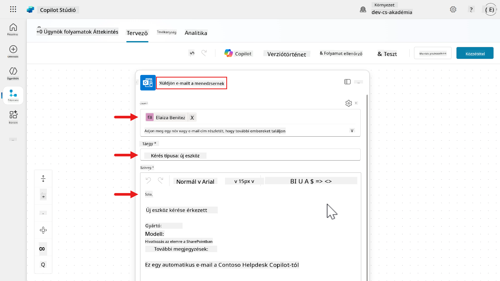

1. Ezután frissítjük a **Tartalom** bemeneti paramétert, hogy hivatkozzon a dinamikus tartalom bemenetre a **triggerből** vagy a **Get item** műveletből. Írjon egy szóközt a második sor után, mivel beillesztjük a felhasználó nevét a trigger bemenetből, **User**.

    Válassza a **villám ikon** vagy **fx ikon** lehetőséget a jobb oldalon.

    ![User bemenet dinamik
1. A triggerből származó dinamikus tartalom bemenete most az akció **Body** paraméterében van hivatkozva. Ugyanezt megismételjük az e-mail üzenet szövegének fennmaradó soraira.

    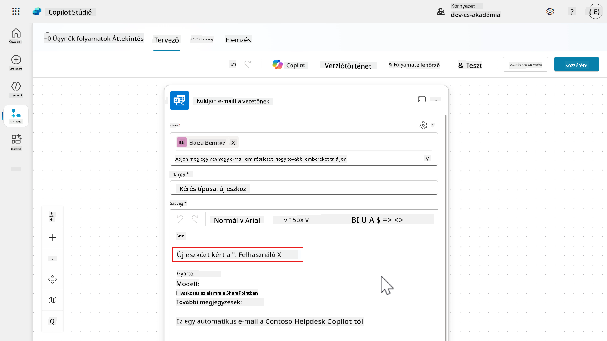

1. Kattints a `Manufacturer:` melletti helyre. Válaszd ki a jobb oldalon található **villám ikon** vagy **fx ikon** lehetőséget.

    A felugró ablak **Dynamic content** fülén írd be a következőt a keresőmezőbe,

    ```text
    manufacturer
    ```

    Válaszd ki a triggerből származó **Manufacturer value** bemenetet, majd kattints az **Add** gombra.

    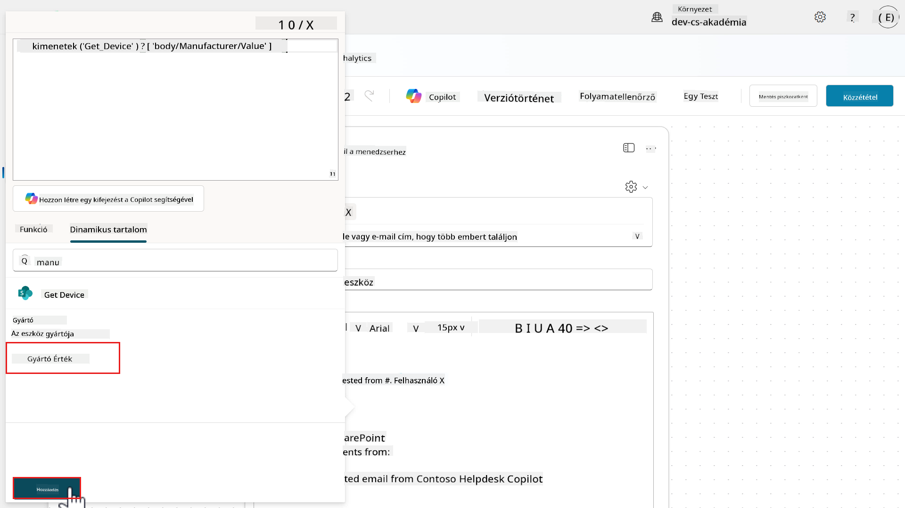

1. Kattints a `Model:` melletti helyre. Válaszd ki a jobb oldalon található **villám ikon** vagy **fx ikon** lehetőséget.

    A felugró ablak **Dynamic content** fülén írd be a következőt a keresőmezőbe,

    ```text
    model
    ```

    Válaszd ki a **Model** bemenetet a **Get item** akcióból, majd kattints az **Add** gombra.

    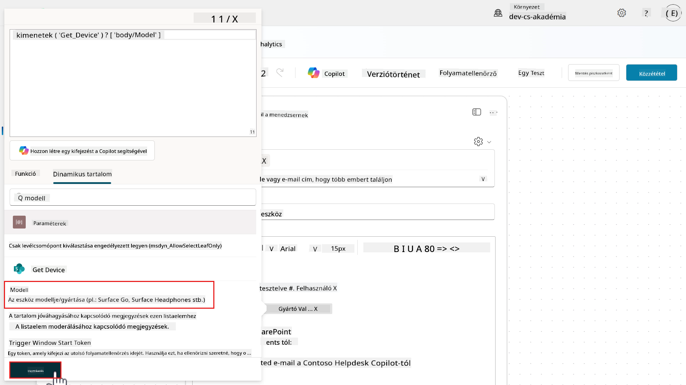

1. A `Link to item in SharePoint` szöveghez frissítést végzünk, hogy hiperhivatkozás legyen az e-mail üzenet szövegében. Kattints a sor elejére, majd válaszd ki a jobb oldalon található **villám ikon** vagy **fx ikon** lehetőséget.

    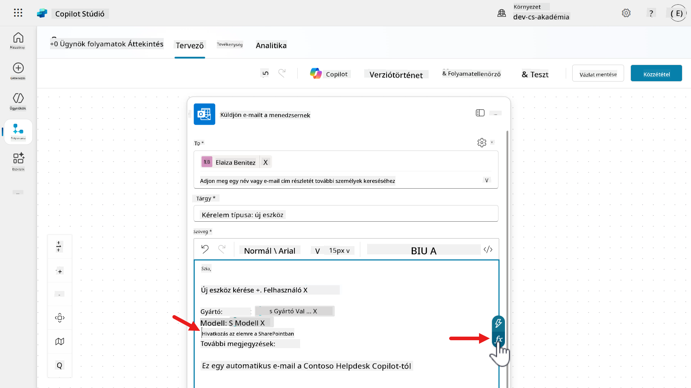

1. Kattints a HTML horgonycímke után, majd válaszd ki a jobb oldalon található **villám ikon** vagy **fx ikon** lehetőséget.

    A felugró ablak **Dynamic content** fülén írd be a következőt a keresőmezőbe,

    ```text
    link to item
    ```

    Válaszd ki a **Link to item** bemenetet a **Get item** akcióból, majd kattints az **Add** gombra.

    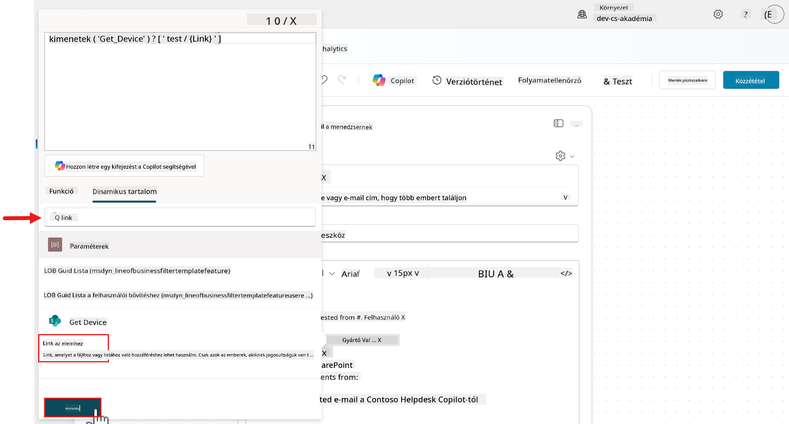

1. Váltanunk kell a HTML szerkesztőre, ehhez válaszd ki a **&lt;/&gt;** ikont.

    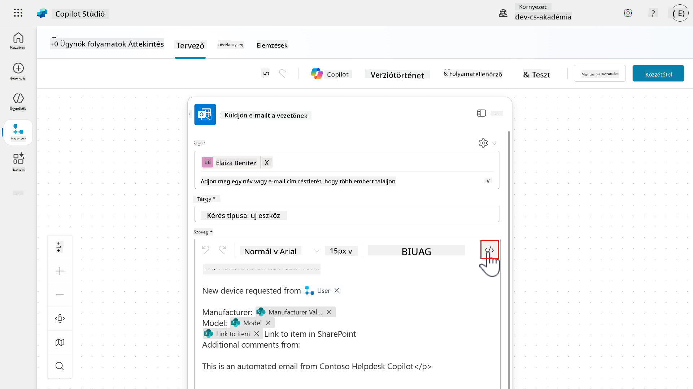

1. A HTML szerkesztő most engedélyezve van. Kattints a `Link to item in SharePoint` szöveg elé, és adj hozzá egy HTML horgonycímkét, hogy létrehozz egy hiperhivatkozást. Másold és illeszd be a következőt.

    ```text
    <a href="
    ```

    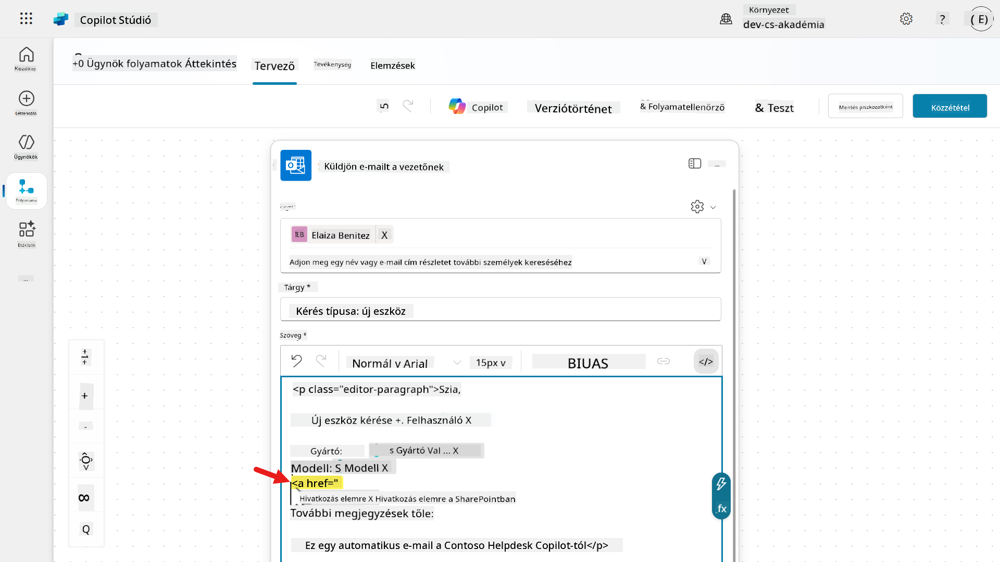

1. A **Link to item** dinamikus tartalom bemenete most az **Body** paraméterben van hivatkozva. Kattints a **Link to item** bemenet után, másold és illeszd be a következőt.

    ```text
    ">
    ```

    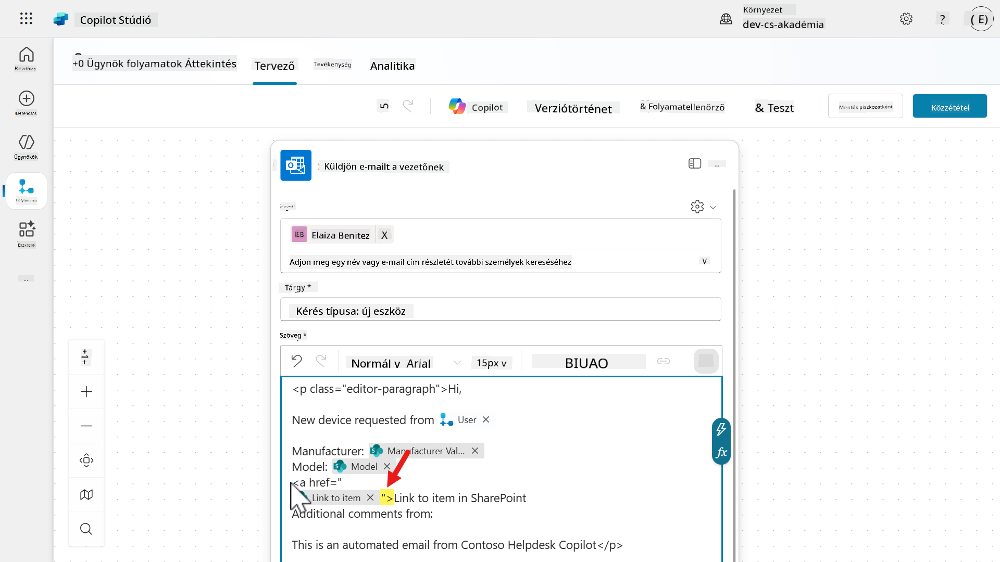

1. Kattints a `Link to item in SharePoint` szöveg után, és zárd be a HTML horgonycímkét. Másold és illeszd be a következőt.

    ```text
    </a>
    ```

    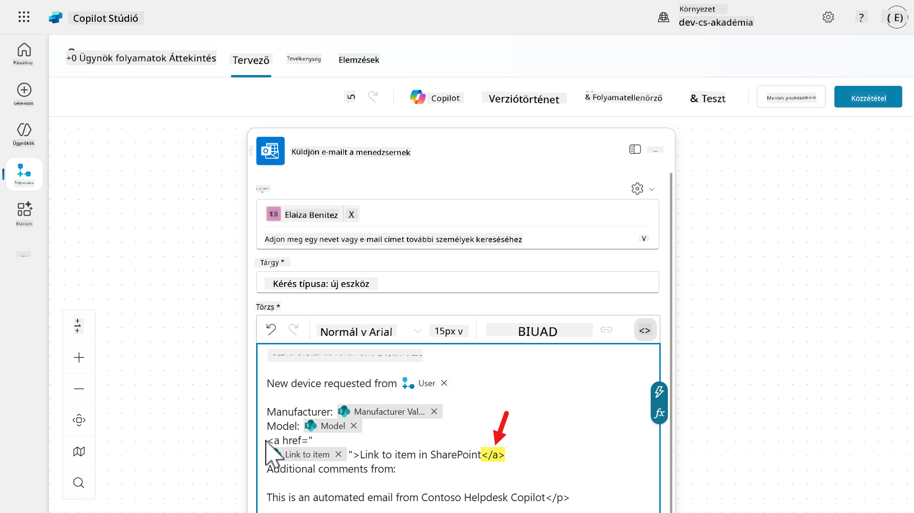

1. Válaszd ki a **&lt;/&gt;** ikont a kódnézet váltásához.

    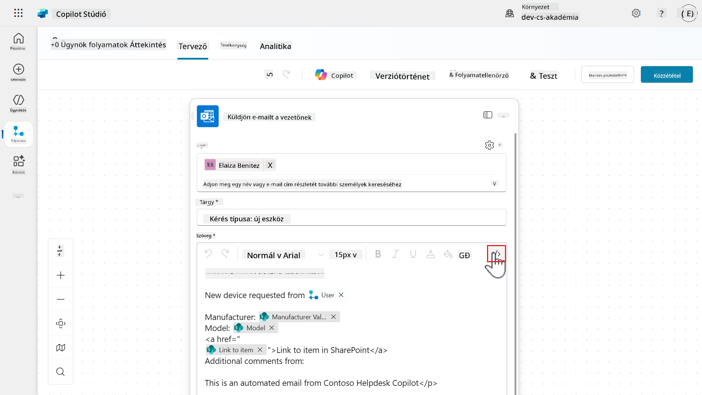

1. Ezután válaszd ki újra a **&lt;/&gt;** ikont a kódnézet visszakapcsolásához.

    

1. Vedd észre, hogy több extra karakter, például `&lt;br&gt;` van jelen. Töröld ezeket a karaktereket.

    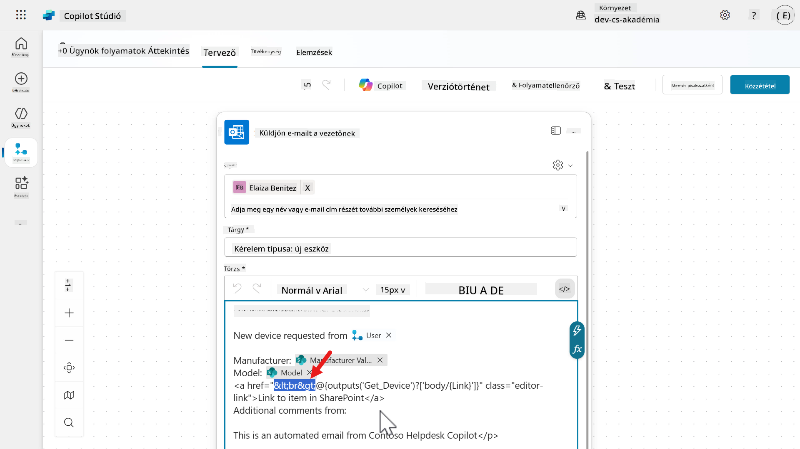

1. Most befejeztük a hiperhivatkozás hozzáadását az e-mail üzenet szövegéhez 😎 Válaszd ki a **&lt;/&gt;** ikont a kódnézet váltásához.

    

1. Kattints az `Additional comments from` szöveg után, a kettőspont karakter előtt, majd válaszd ki a jobb oldalon található **villám ikon** vagy **fx ikon** lehetőséget.

    

1. A felugró ablak **Dynamic content** fülén írd be a következőt a keresőmezőbe,

    ```text
    user
    ```

    Válaszd ki a triggerből származó **User** paramétert, majd kattints az **Add** gombra.

    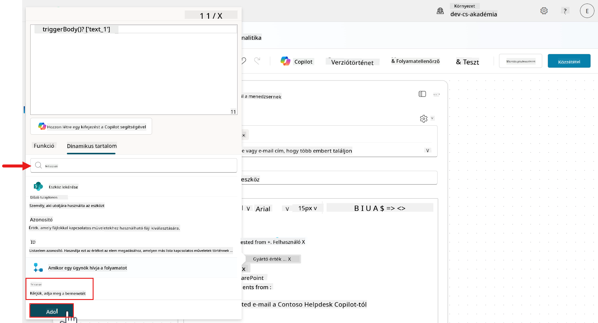

1. Most beillesztünk egy kifejezést, amely megjeleníti az Additional Comments értékét, ha a felhasználó megadta az **Ask an adaptive card** csomópontban, vagy "None"-t jelenít meg, ha a felhasználó nem adott meg megjegyzéseket.

    Kattints a kettőspont után, majd válaszd ki a jobb oldalon található **villám ikon** vagy **fx ikon** lehetőséget.

    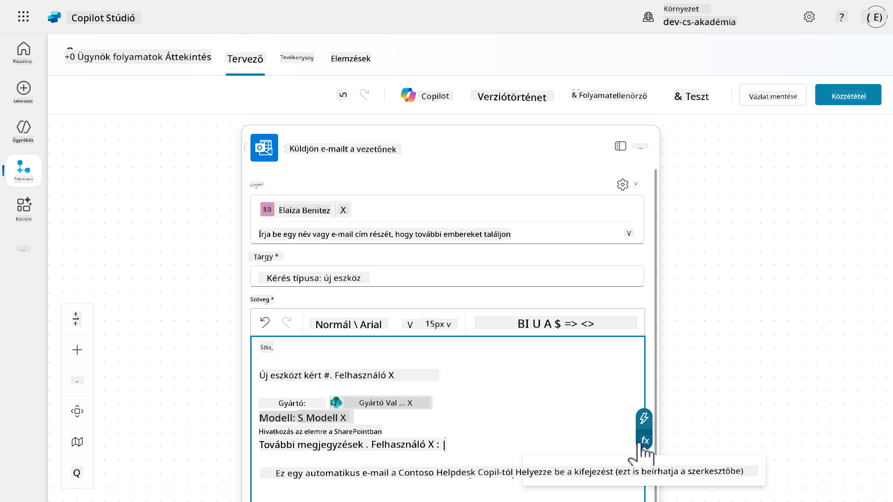

1. A felugró ablak **Function** fülén és a kifejezés mezőben fent írd be a következőt,

    ```text
    if(empty())
    ```

    Ez a kifejezés az `if` függvényt használja egy if-else állításhoz.

    A következő függvény az `empty`, amely ellenőrzi, hogy létezik-e érték egy string paraméterben. A hivatkozott string paraméter a triggerből származó `AdditionalComments` bemenet paraméter értéke.

    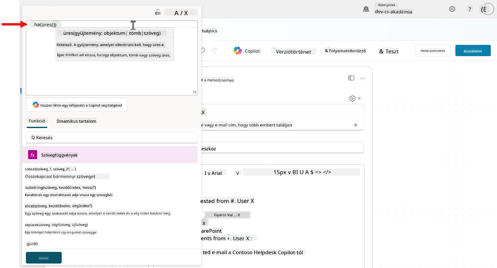

1. Ezután kattints **a zárójelek belsejébe** az `empty` függvény után. Beillesztjük a triggerből származó `AdditionalComments` bemenet paramétert.

    Válaszd ki a **Dynamic content** fület. Írd be a következőt a keresőmezőbe,

    ```text
    Additional
    ```

    Görgess le a panelen, és válaszd ki a triggerből származó **AdditionalComments** bemenetet. A paraméter most hozzáadódik a kifejezés string paramétereként.

    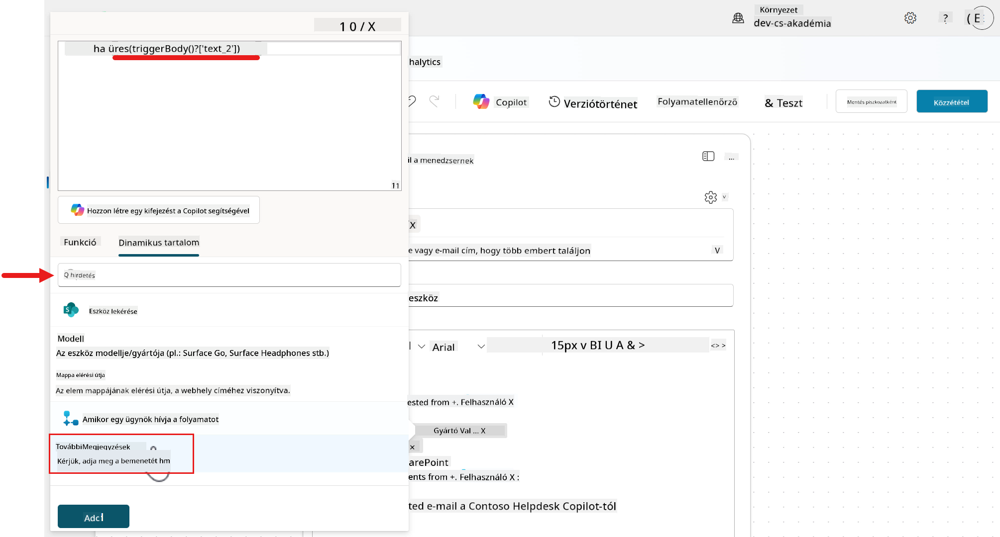

1. Ezután meghatározzuk a **_true_** logikát, ahol ha az `AdditionalComments` string paraméter üres, akkor egy `None` szöveget (stringet) szeretnénk megjeleníteni.

    A string paramétert záró zárójel után írd be a következőt,

    ```text
    , 'None',
    ```

    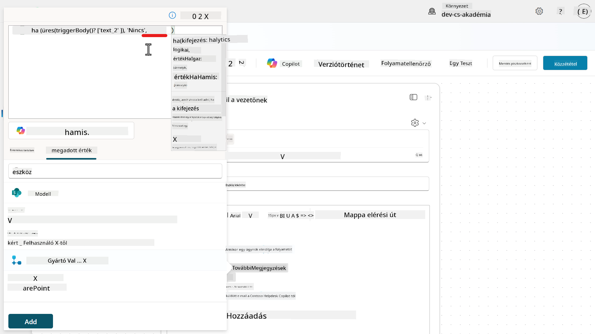

1. Végül meghatározzuk a **_false_** logikát, ahol ha az `AdditionalComments` string paraméter nem üres, akkor az **AdditionalComments** bemenet paraméter értékét szeretnénk megjeleníteni a triggerből.

    > Emlékeztető: ez az érték az adaptív kártya Additional Comments mezőjéből származik az **Ask with adaptive card** csomópontban a **Request device** témában.

    A **_true_** logika utáni vessző után válaszd ki a **Dynamic content** fület. Írd be a következőt a keresőmezőbe,

    ```text
    Additional
    ```

    Görgess le a panelen, és válaszd ki a triggerből származó **AdditionalComments** bemenetet. A paraméter most hozzáadódik a kifejezés string paramétereként.

    Most add hozzá az **Body** paraméterhez az **Add** gomb kiválasztásával.

    

1. Kiváló, a kifejezésünk elkészült! A kifejezés most hozzáadódott az **Body** paraméterhez. Végül formázd az utolsó sort dőlt betűvel.

    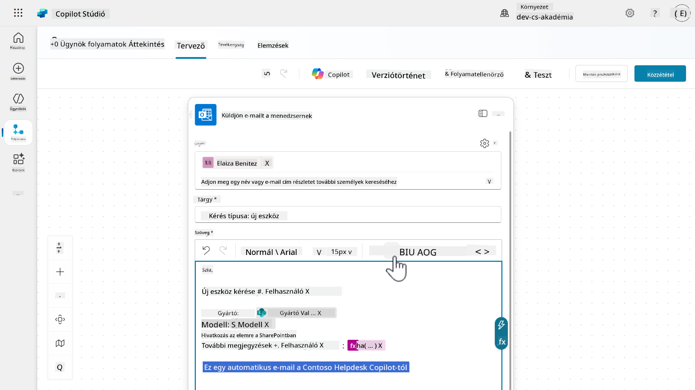

1. Most frissítjük a **Respond to the agent** akciót, hogy visszaküldje az ügynöknek a **Model value** paraméter értékét a **Get item** akcióból.

    Tartsd lenyomva az egér bal gombját, és mozgasd felfelé a tervezőben, hogy megtekintsd a **Respond to the agent** akciót.

    Válaszd ki a **Respond to the agent** akciót, majd válaszd ki a **Text** kimenetet típusnak.

    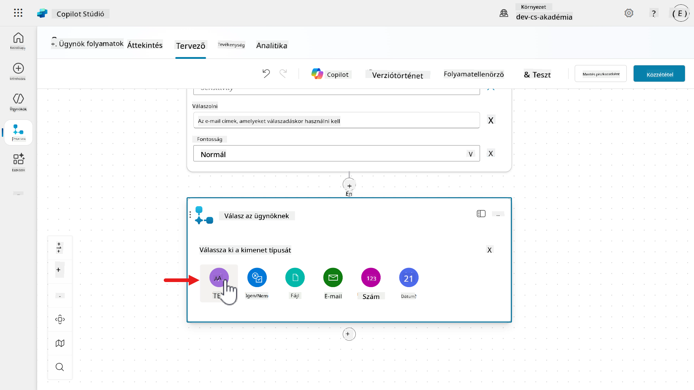

1. Írd be a következőt a kimenet nevének.

    ```text
    ModelValue
    ```

    

1. Válaszd ki az érték mezőt, majd válaszd ki a jobb oldalon található **villám ikon** vagy **fx ikon** lehetőséget.

    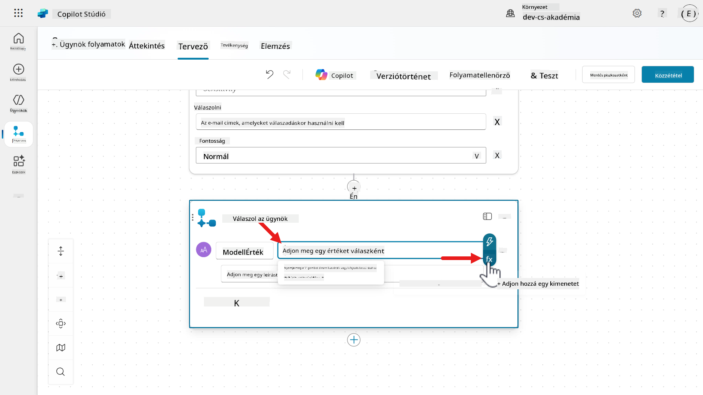

1. A felugró ablak **Dynamic content** fülén írd be a következőt a keresőmezőbe,

    ```text
    model
    ```

    Válaszd ki a **Model** paramétert a **Get item** akcióból, majd kattints az **Add** gombra.

    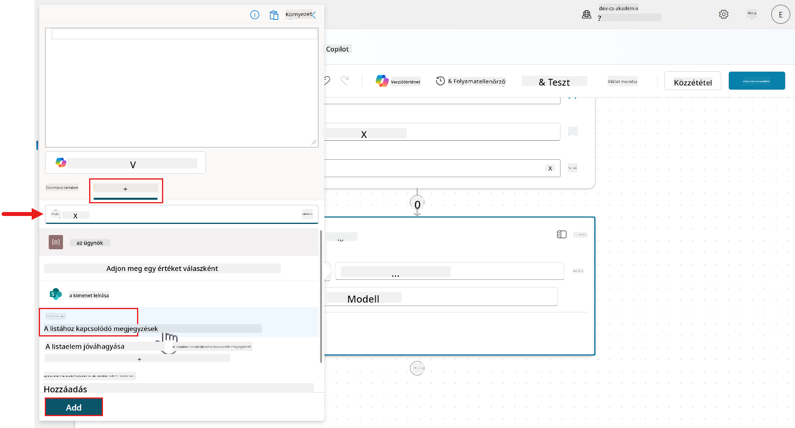

1. A **Model** paraméter most a szöveg kimenetének értéke. Válaszd ki a **Save draft** lehetőséget az ügynökfolyamat mentéséhez.

    Most befejeztük az ügynökfolyamatot 👏🏻

    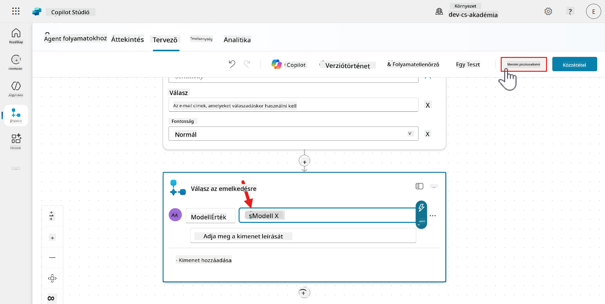

1. Tegyünk még egy frissítést az ügynökfolyamatunkon a közzététel előtt. Válaszd ki az **Overview** fület, majd válaszd ki az **Edit** lehetőséget.

    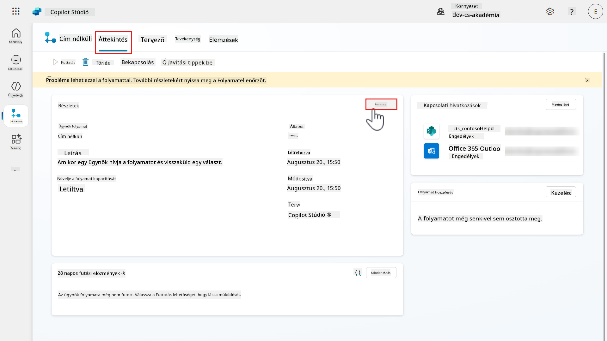

1. Az **Flow name** mezőbe másold és illeszd be a következőt.

    ```text
    Send device request email
    ```

    Az **Description** mezőben válaszd ki a **refresh icon** lehetőséget, hogy AI segítségével automatikusan generálj leírást a trigger és az ügynökfolyamatban lévő akciók alapján.

    Válaszd ki a **Save** lehetőséget az ügynökfolyamat frissített nevének és leírásának mentéséhez.

    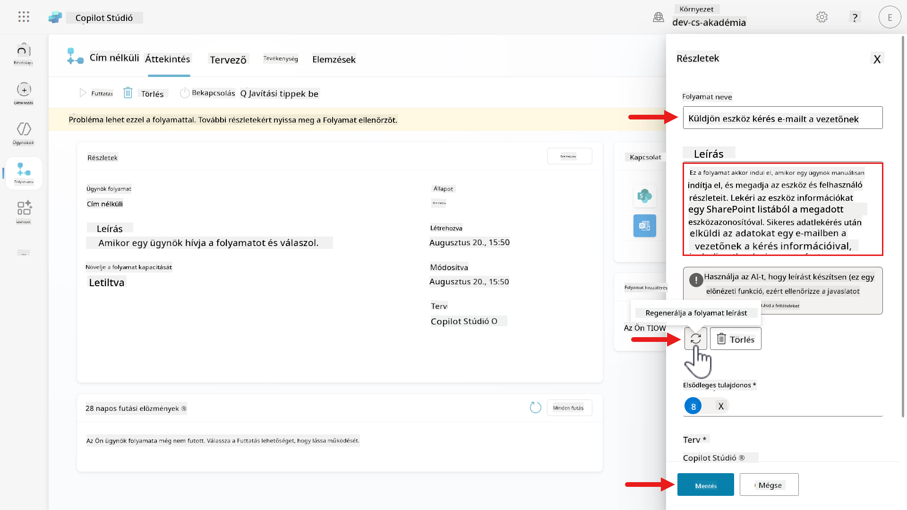

1. Válaszd ki a **Designer** fület, majd válaszd ki a **Publish** lehetőséget az ügynökfolyamat közzétételéhez, hogy hozzáadható legyen a **Request device** témában csomópontként.

    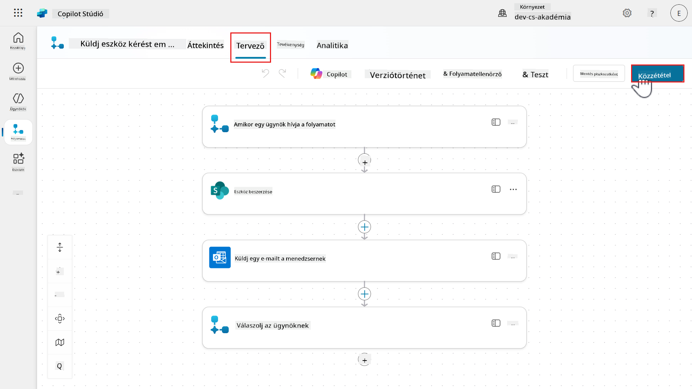

1. Rövidesen megjelenik egy megerősítő üzenet, amely megerősíti, hogy az ügynökfolyamat közzétéve lett.

    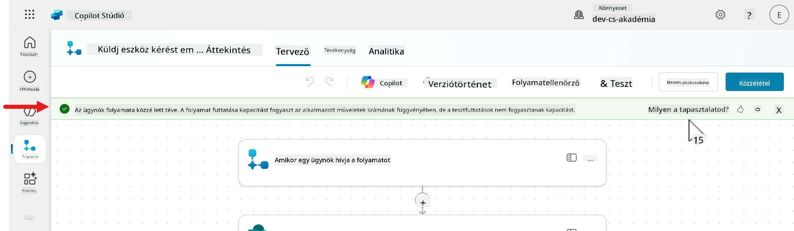

### 9.2 Ügynökfolyamat hozzáadása a témához

Most adjuk hozzá az ügynökfolyamatot a **Request device** témához.

1. Válaszd ki a bal oldali menüben az **Agents** lehetőséget, majd válaszd ki a **Contoso Helpdesk Agent** ügynököt.

    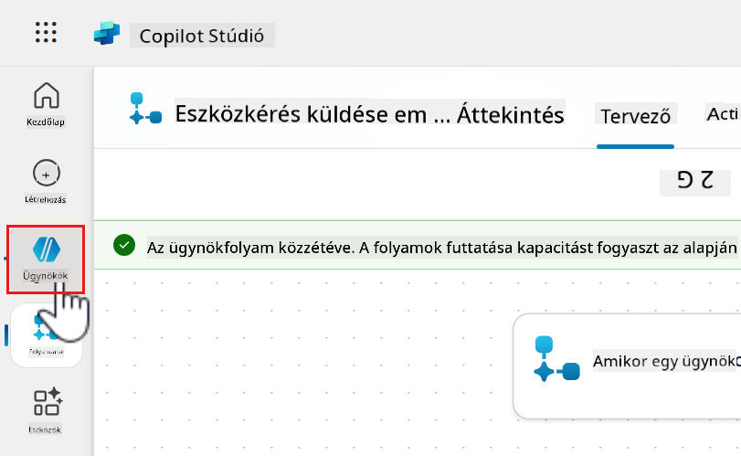

1. Válaszd ki a **Topics** fület.

    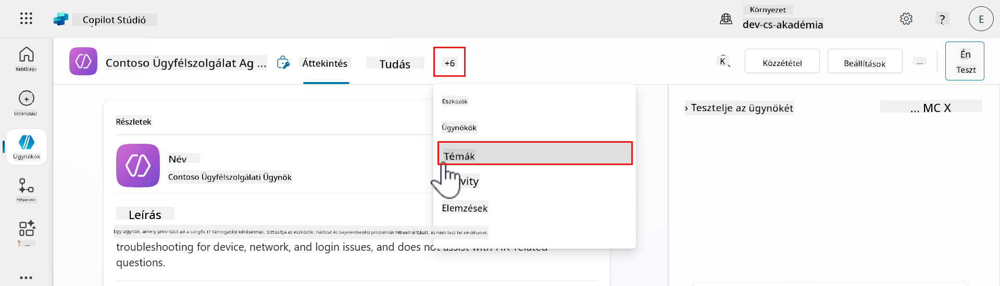

1. Válaszd ki a **Request device** témát.

    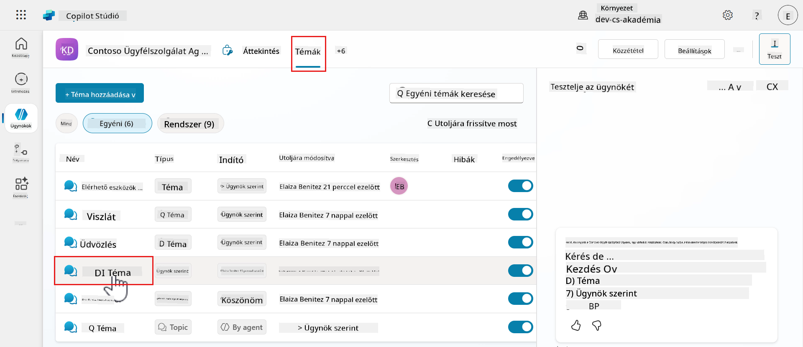

1. Görgess le az **Ask with adaptive card** csomóponthoz, és adj hozzá egy új csomópontot.

    Válaszd ki az **Add a tool** lehetőséget, majd a felugró ablak **Basic tools** fülén válaszd ki a nemrég létrehozott és közzétett **Send device request email** ügynökfolyamatot.

    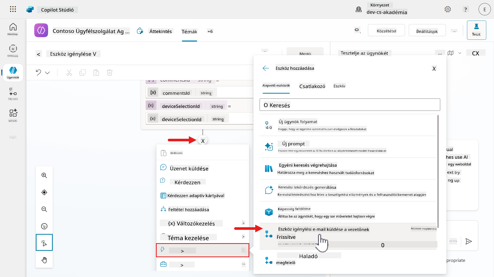

1. Az ügynökfolyamat trigger bemeneteihez ki kell választanunk az **Ask with adaptive card** csomópontból származó változó kimeneteket.

    Válaszd ki a **három pont (...) ikont** a **DeviceSharePointId** bemenethez.

    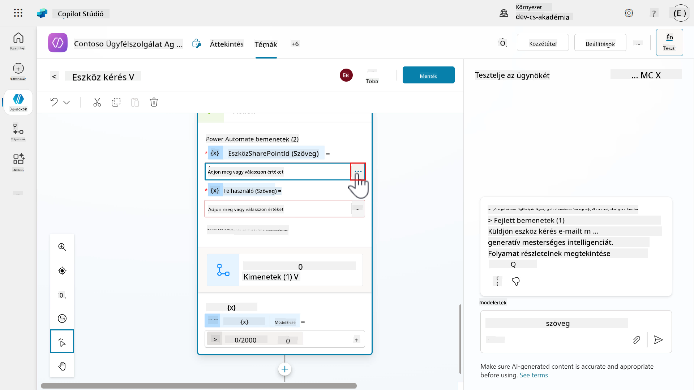

1. Válaszd ki a **deviceSelectionId** változót, amely az **Ask with adaptive card** csomópontban meghatározott kimenetek egyike.

    

1. Ezután válaszd ki a **három pont (...) ikont** a **User** bemenethez.

    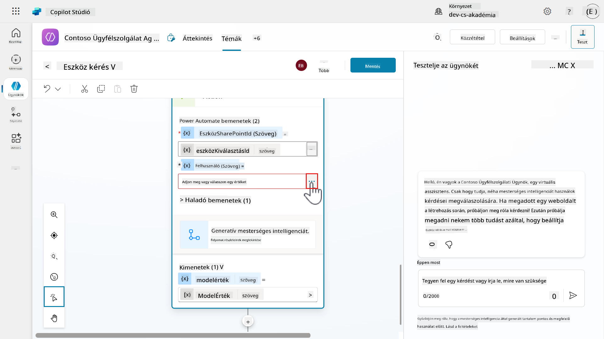

1. Válaszd ki a felugró változó panel **System** fület, majd válaszd ki a **User.DisplayName** lehetőséget. Ez a változó tárolja az ügynökkel interakcióba lépő belső felhasználó megjelenítési nevét.

    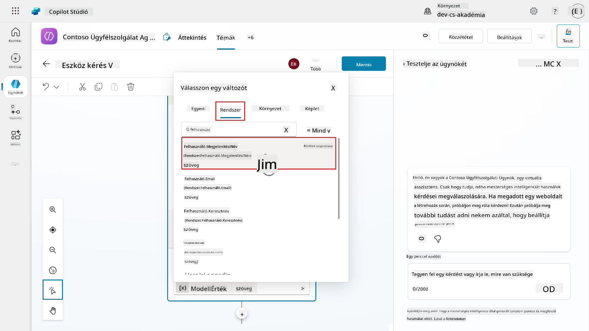

1. Ezután válaszd ki a **nagyobb mint ikon** lehetőséget az **Advanced inputs** kibővítéséhez, hogy látható legyen az **AdditionalComments** bemenet.

    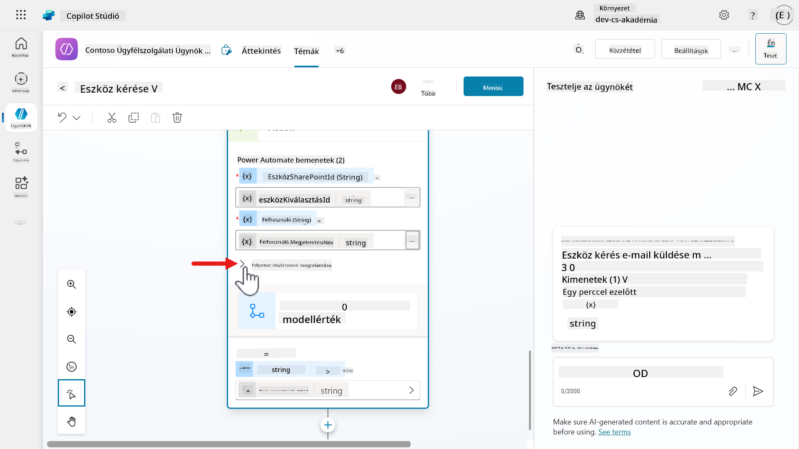

1. Válaszd ki a **három pont (...) ikont** az AdditionalComments bemenethez.

    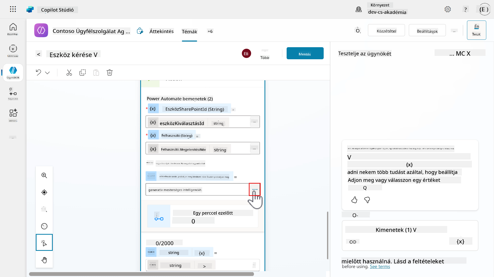

1. Válaszd ki a **Formula** fület, majd a felugró változó panelen a kibővítés ikont, mivel Power Fx kifejezést fogunk használni.

    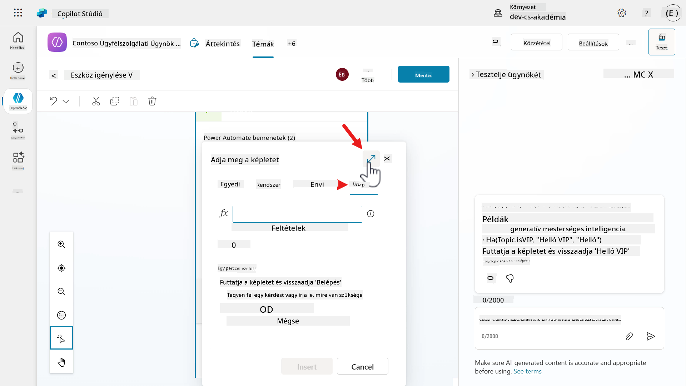

1. Hasonlóan az ügynökfolyamatban lévő kifejezéshez, amely feltételes ellenőrzést végez az _if_ függvény használatával, de ezúttal
    - Power Fx függvényeket használva,
    - és vagy nem adunk meg értéket, vagy a `commentsId` kimeneti változó értékét adjuk meg az **Ask with adaptive card** csomópontból.

    Írd be a következő függvényeket a Power Fx mezőbe,

    ```text
    If(IsBlank())
    ```

Ez a kifejezés az `If` függvényt használja egy if-else állításhoz.

A következő használt függvény az `IsBlank`, amely ellenőrzi, hogy létezik-e vagy sem egy érték egy szöveges paraméterben. A hivatkozott szöveges paraméter a **Kérdezés adaptív kártyával** csomópont `commentsId` kimeneti változója.

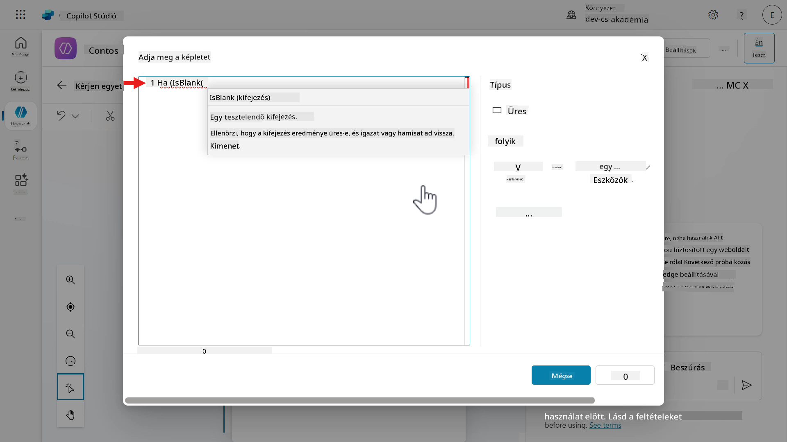

1. Ezután kattints **a zárójelek belsejébe** az `IsBlank` függvény után. Be fogjuk illeszteni a **Kérdezés adaptív kártyával** csomópont `commentsId` kimeneti változóját.

   Írd be a következőt a zárójelek közé:

    ```text
    Topic.commentsId
    ```

   És adj hozzá egy vesszőt a zárójel után.

   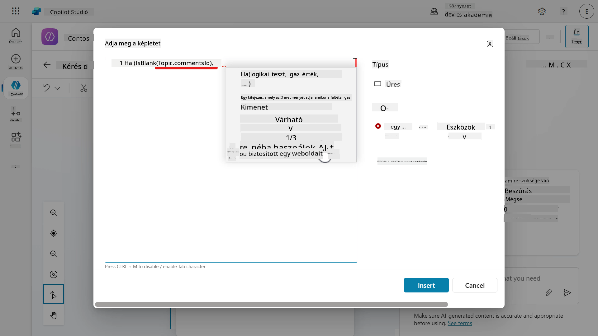

1. Ezután meghatározzuk a logikát:

   - amikor **_igaz_** - ha a `Topic.commentsId` szöveges paraméter üres, akkor nem akarunk értéket beilleszteni.
   - amikor **_hamis_** - ha a `Topic.commentsId` szöveges paraméter nem üres, akkor illesszük be a commentsId változó értékét.

   A szöveges paramétert lezáró zárójel után írd be a következőt:

    ```text
    "", Topic.commentsId)
    ```

   A Power Fx kifejezés a következő lesz:

    ```text
    If(IsBlank(Topic.commentsId), "", Topic.commentsId)
    ```

   Nagyszerű munka, a kifejezésünk elkészült! 🙌🏻 Most válaszd a **Beszúrás** lehetőséget, hogy beállítsd az ügynökfolyamat bemeneti paraméterét a Power Fx kifejezésre.

   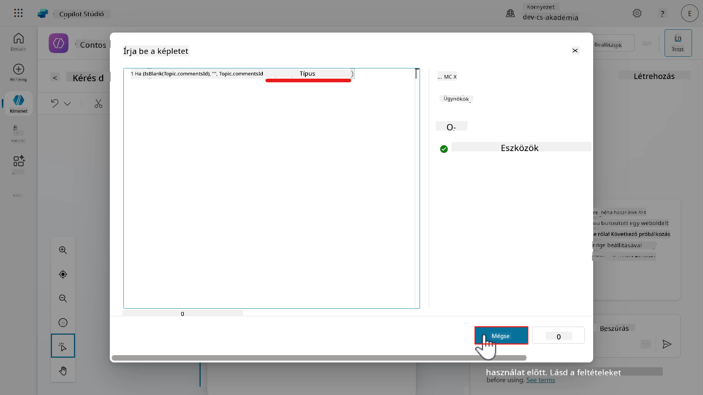

1. **Mentsd el** a témát.

### 9.3 Frissítsd a Kérés eszköz témát több csomóponttal a jobb felhasználói élmény érdekében

Ezután hozzáadunk két további csomópontot:

- **Üzenet küldése** - ez egy megerősítő üzenetként fog működni, amely hivatkozik a kiválasztott eszközre, és jelzi, hogy a kérésüket benyújtották.

- **Téma kezelése** - a beszélgetés lezárásához átirányítunk a **Beszélgetés vége** csomópontra.

Kezdjük el!

1. Válaszd ki az **plusz + ikont** az ügynökfolyamat csomópont alatt, és válaszd az **Üzenet küldése** csomópontot.

   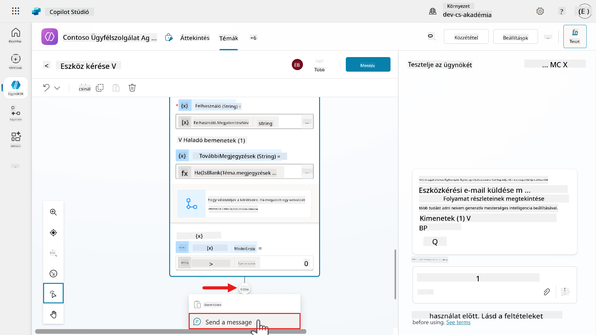

1. Írd be a következőt az üzenet mezőbe:

    ```text
    Thanks
    ```

   Ezután válaszd a **Változó beszúrása** lehetőséget, mivel hivatkozni fogunk a felhasználó nevére.

   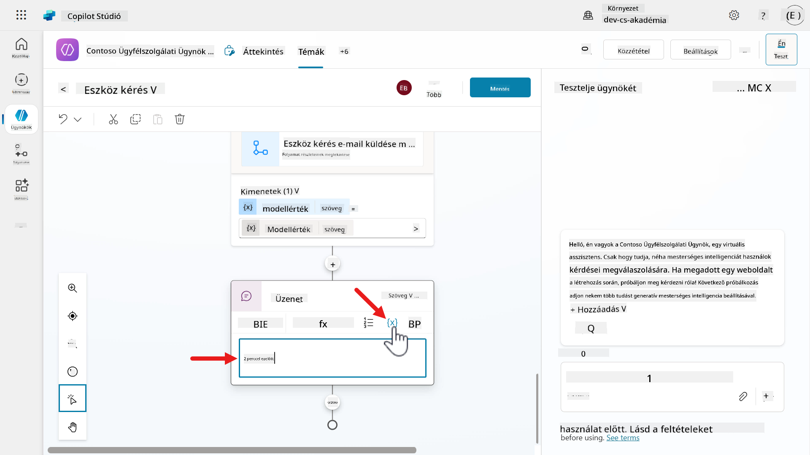

1. Válaszd ki a **Rendszer** fület, és keresd meg a `User` kifejezést a keresőmezőben. Válaszd ki a **User.DisplayName** változót.

   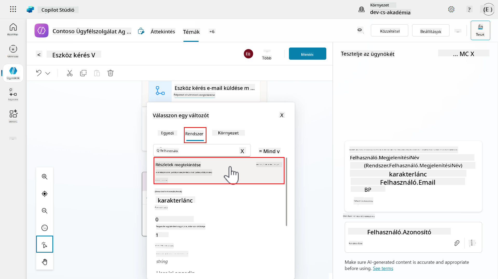

1. Írd be a következőt az üzenet mezőbe:

    ```text
    . Your selected device,
    ```

   Ezután válaszd a **Változó beszúrása** lehetőséget, és ezúttal a **Egyéni** fülön válaszd ki a **ModelValue** változót.

   Ezután írd be a következőt az üzenet mezőbe a befejezéshez:

    ```text
    , has been submitted and will be reviewed by your manager.
    ```

   Az üzenetnek így kell kinéznie:

   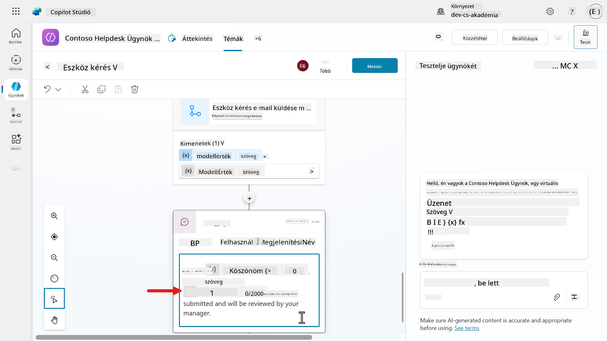

1. Végül válaszd ki az **plusz + ikont** az **Üzenet küldése** csomópont alatt, és válaszd a **Téma kezelése**, majd a **Másik témára ugrás** lehetőséget, és válaszd a **Beszélgetés vége** lehetőséget.

   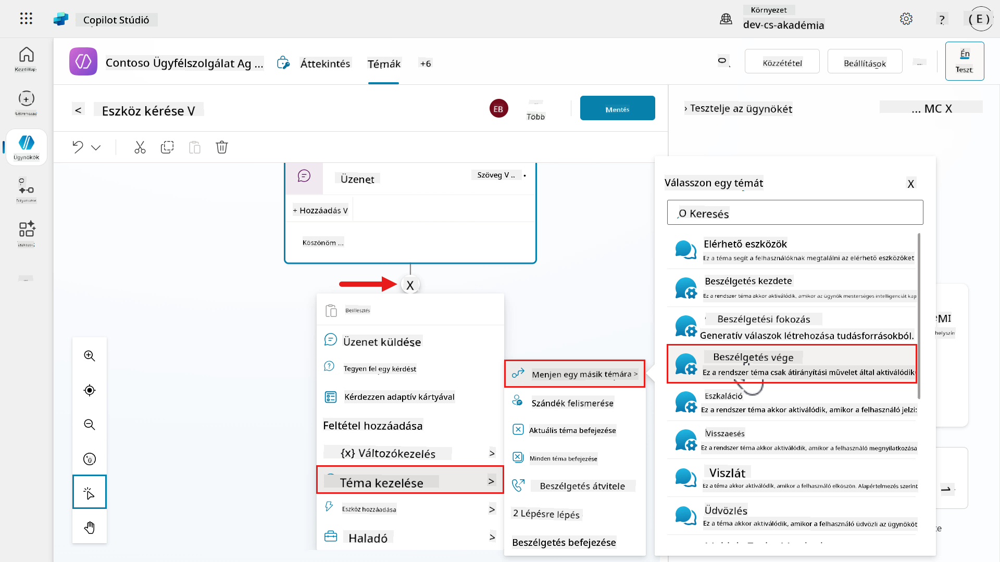

1. **Mentsd el** a témát.

   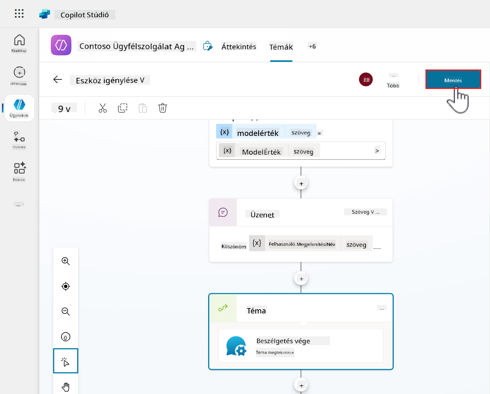

### 9.4 Az ügynök tesztelése több forgatókönyvvel

Nagyszerű munka!!! 😁 Most már tesztelhetjük az ügynökünket.

#### 9.4.1 Kérj egy eszközt, és adj meg egy megjegyzést az adaptív kártyán

1. **Frissítsd** a tesztpanelt, válaszd ki a **tevékenységtérkép** ikont, és írd be a következőt üzenetként az ügynöknek:

    ```text
    I need a laptop
    ```

   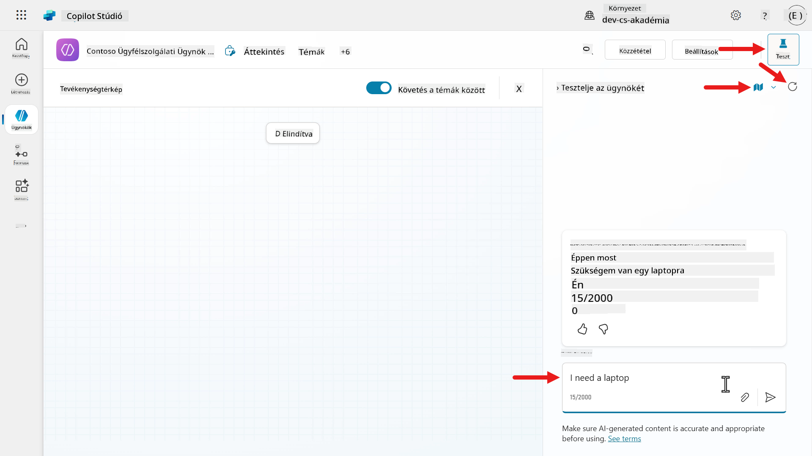

1. Az ügynök elindítja az **Elérhető eszközök** témát, és válaszol az elérhető eszközök listájával. Írd be a következőt válaszként arra a kérdésre, hogy szeretnél-e eszközt kérni:

    ```text
    Yes
    ```

   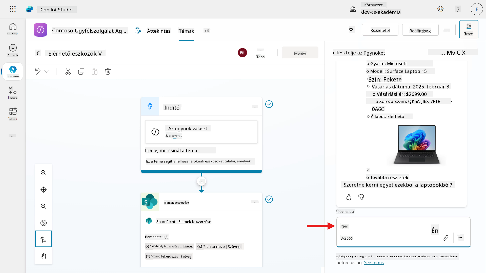

1. Figyeld meg, hogy az ügynök a **Kérés eszköz** témát indította el az ügynök utasításai szerint, és hogy az adaptív kártya most megjelenik az ügynök üzenetében.

   Válaszd ki a **Surface Laptop 15** eszközt, és adj meg a következőt megjegyzésként:

    ```text
    I need 16GB of RAM please
    ```

   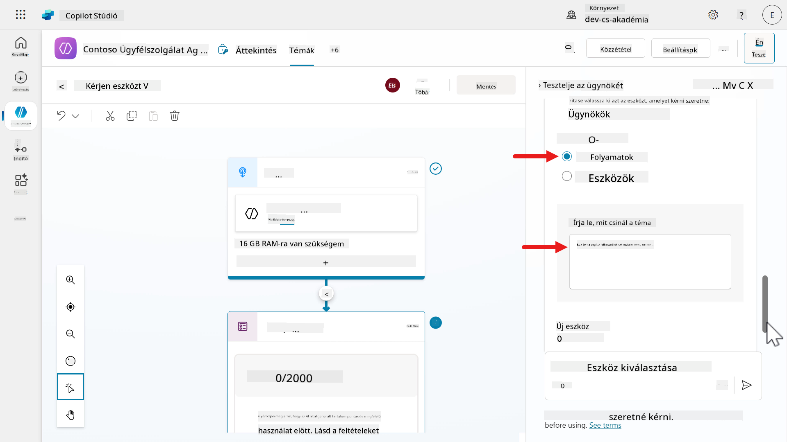

1. Görgess le, amíg meg nem látod a **Kérés benyújtása** gombot, és válaszd ki, hogy benyújtsd az adaptív kártyát az ügynöknek.

   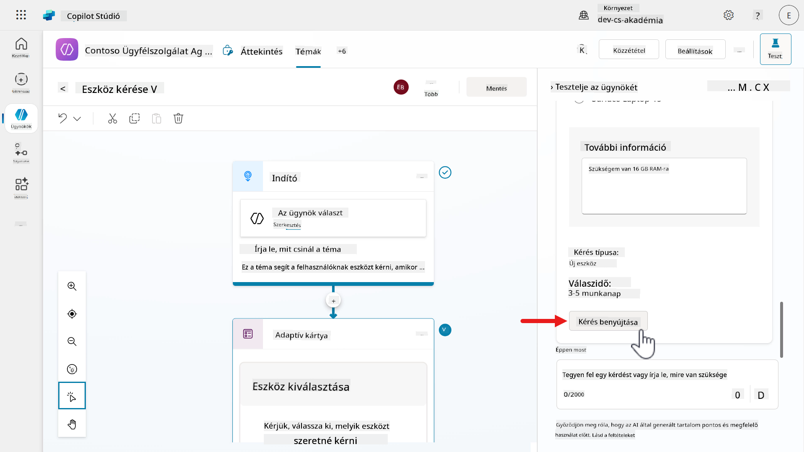

1. Válaszd az **Engedélyezés** lehetőséget, hogy az ügynök használhassa a hitelesítési adataidat a két csatlakozó művelethez.

   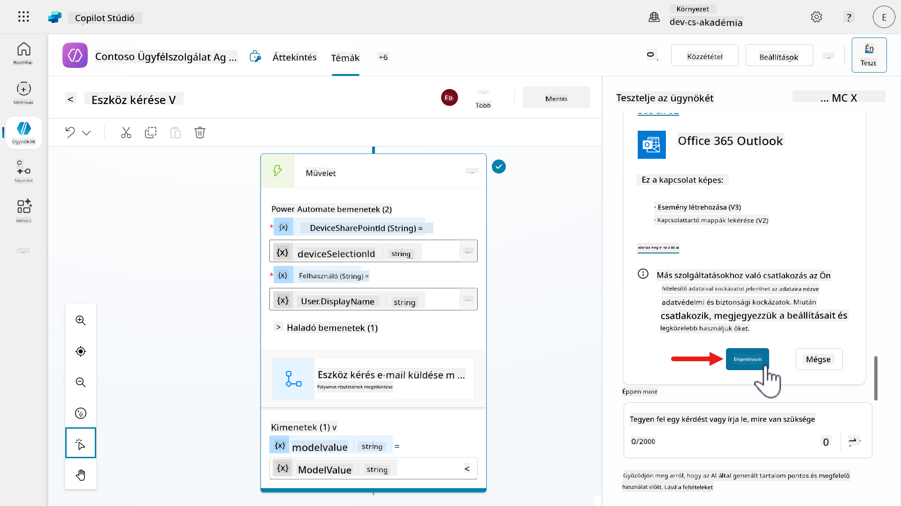

1. Az ügynök ezután megjeleníti a megerősítő üzenetet, amely tartalmazza a kiválasztott modellt, majd átirányít a **Beszélgetés vége** témára. Szuper!

   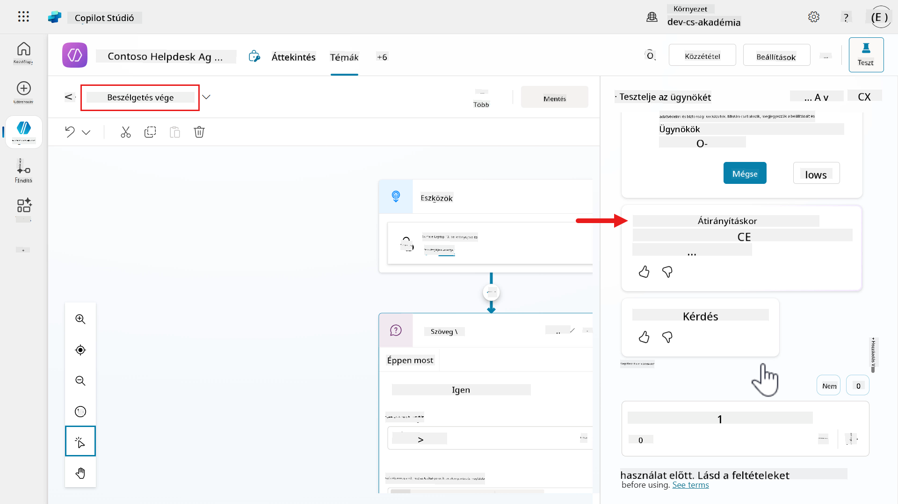

1. Válaszd az **Igen** lehetőséget, hogy ellenőrizd a **Beszélgetés vége** téma többi részét.

   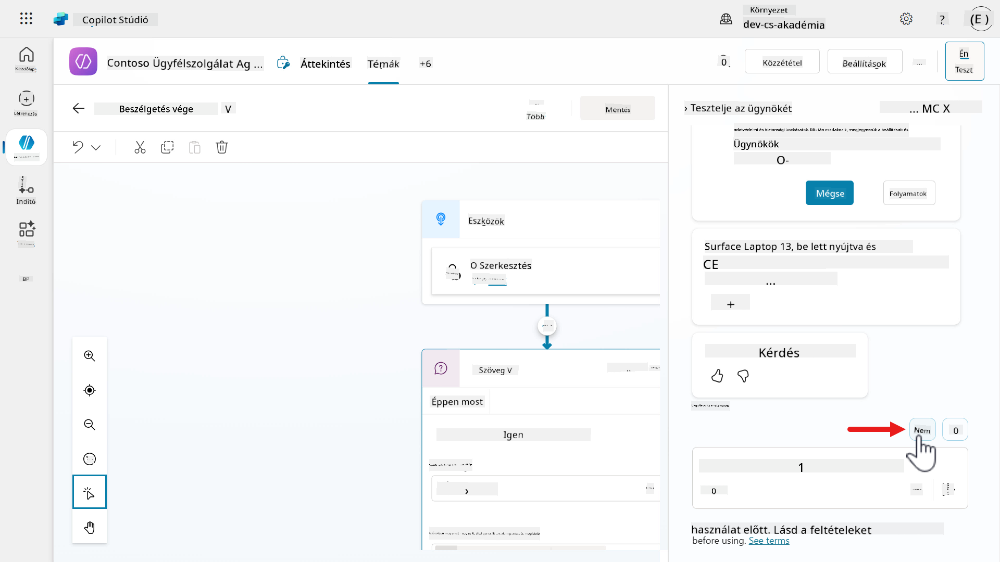

1. Ezután értékeld az élményt az értékelési skála kártyán bármelyik csillag kiválasztásával.

   Az ügynök ezután a **Beszélgetés vége** téma utolsó **Kérdés** csomópontjára lép. Válaszd a **Nem** lehetőséget.

   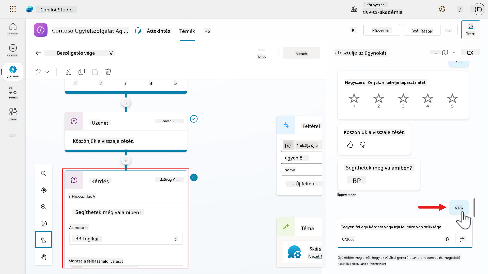

1. A téma ezután befejeződik, és egy záró üzenet jelenik meg a tesztpanelen.

   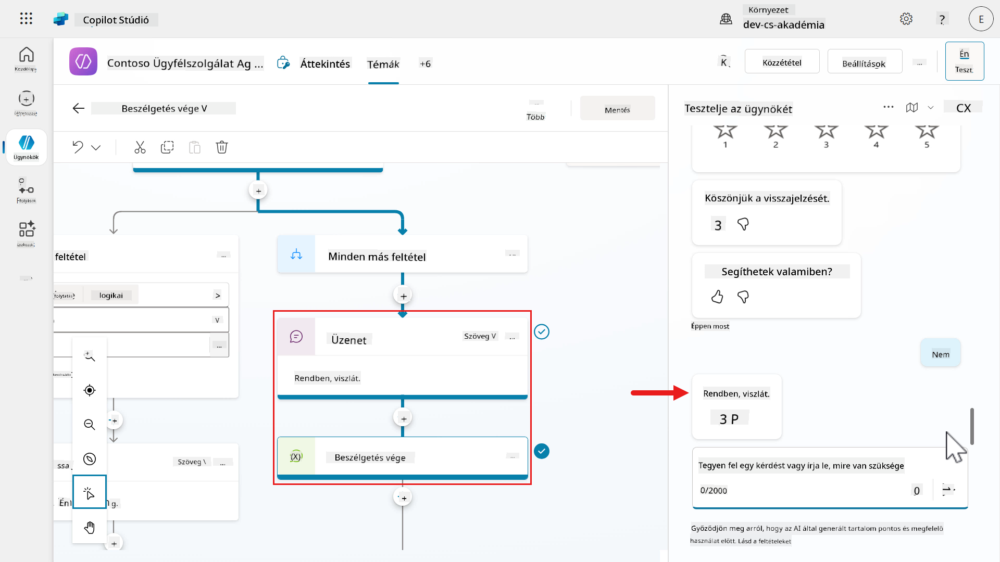

1. Ellenőrizd az e-mail fiókod beérkező leveleit, hogy megtekintsd az ügynökfolyamat által a menedzsernek küldött e-mailt. Láthatod a kiválasztott eszköz részleteit és az adaptív kártyán megadott megjegyzést.

   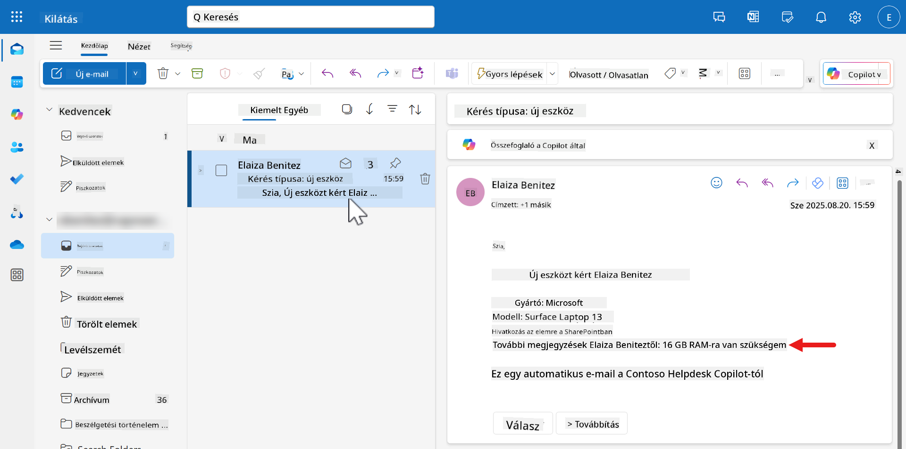

1. Kattints a hiperhivatkozásra, és a böngészőnek be kell töltenie az eszköz SharePoint elemét. Szuper!

   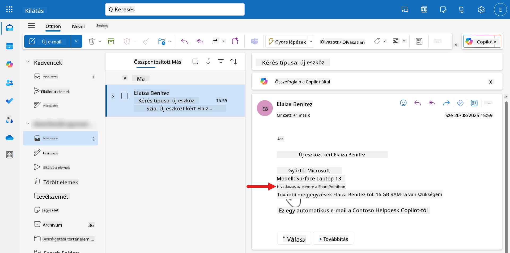

#### 9.4.2 Kérj egy eszközt, és ne adj meg megjegyzést az adaptív kártyán

Most teszteljük azt a forgatókönyvet, amikor nem adunk meg megjegyzést.

1. Ismételd meg ugyanazokat a lépéseket:

   - **Frissítsd** a tesztpanelt, és válaszd ki a **tevékenységtérkép** ikont
   - Írd be az üzenetet: `Szükségem van egy laptopra`
   - Válaszolj `Igen`-nel az eszközkérés kérdésére

   

1. Ezúttal válaszd a **Surface Laptop 13** eszközt, és ne adj meg megjegyzést.

   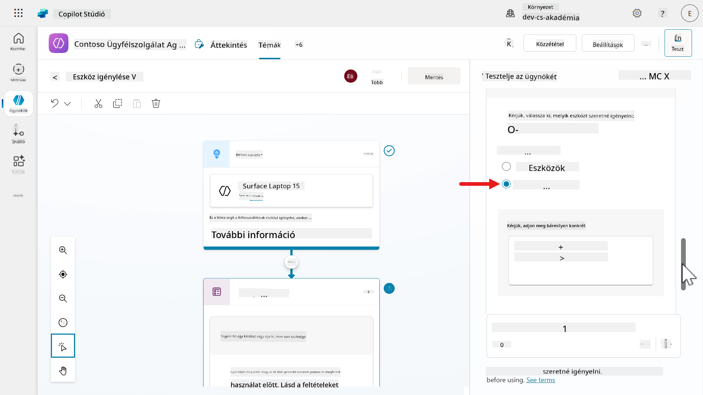

1. **Nyújtsd be** a kérést a **Kérés benyújtása** gomb kiválasztásával.

   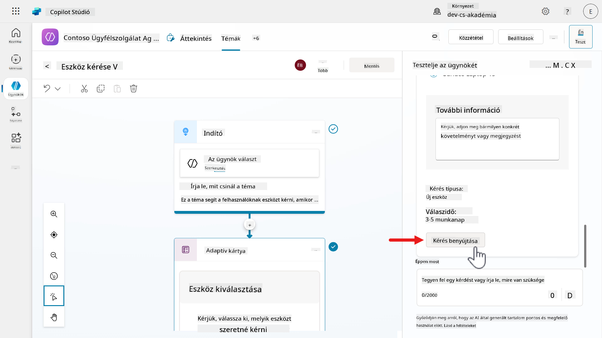

1. Ezúttal az e-mail, amelyet a beérkező leveleidben kapsz, **Nincs** megjegyzést fog mutatni.

   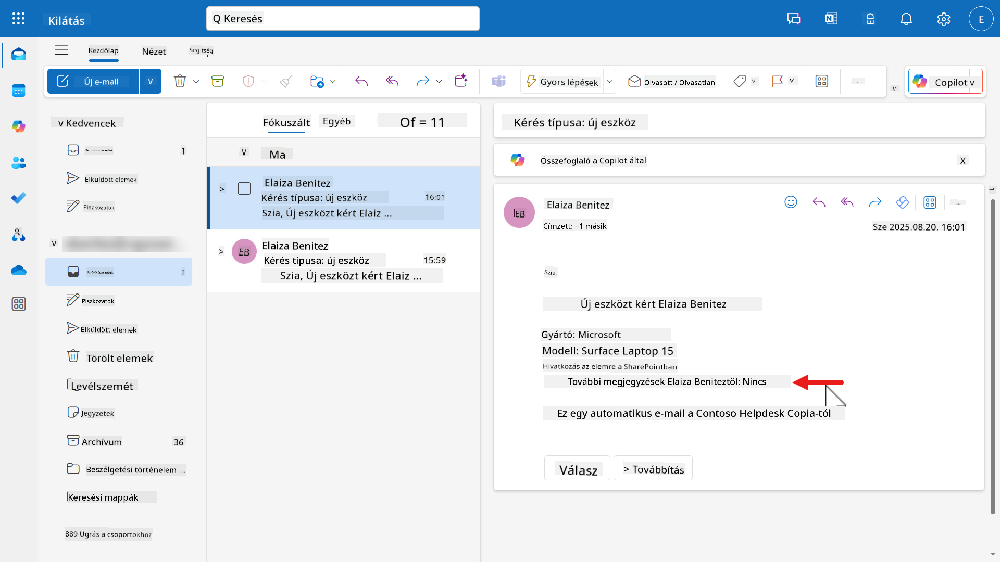

#### 9.4.3 Ne kérj eszközt

Teszteljük az utolsó forgatókönyvet, amelyben nem kérünk eszközt, és a **Viszlát** téma kerül elő az ügynök utasításai szerint.

1. Ismételd meg ugyanazokat a lépéseket:

   - **Frissítsd** a tesztpanelt, és válaszd ki a **tevékenységtérkép** ikont
   - Írd be az üzenetet: `Szükségem van egy laptopra`
   - Ezúttal válaszolj `Nem`-mel az eszközkérés kérdésére

   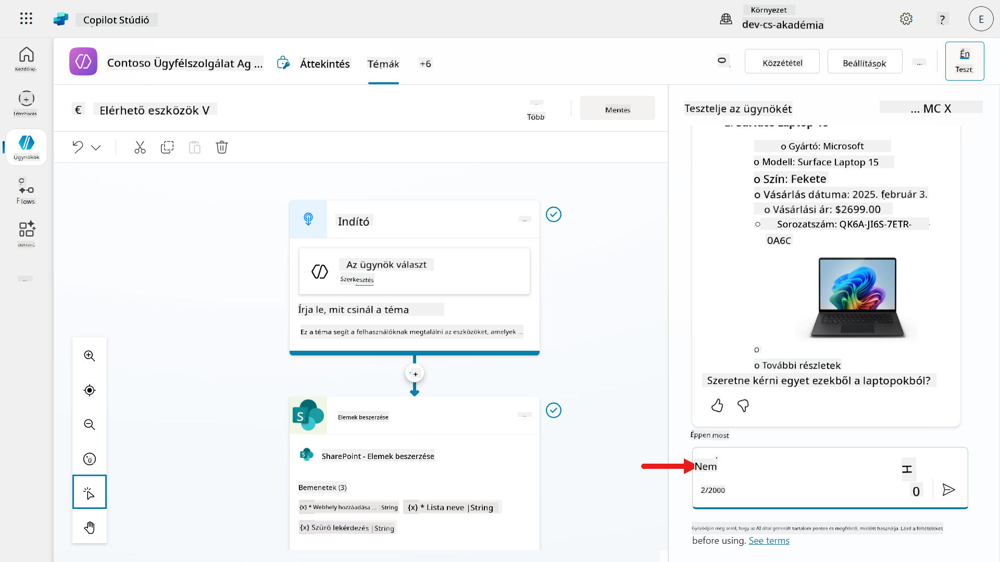

1. Az ügynök a **Viszlát** témát indította el, és a témában meghatározott kérdést tette fel.

   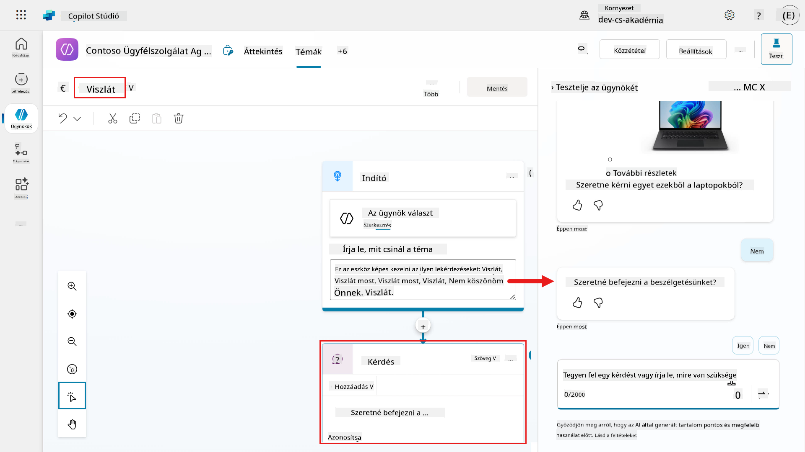

## ✅ Küldetés Teljesítve

Gratulálunk! 👏🏻 Megtanultad, hogyan építsd fel az ügynökfolyamatot, és hogyan add hozzá a meglévő **Kérés eszköz** témához, valamint hogyan irányítsd át az ügynököt egy másik témára.

Ez a vége a **9. labor - Ügynökfolyamat hozzáadása az automatizáláshoz és a téma képességeinek bővítéséhez** című résznek. Kattints az alábbi linkre, hogy továbblépj a következő leckére. A következő lecke laborjában tovább bővítjük az itt bemutatott felhasználási esetet.

⏭️ [Tovább az **Eseményindítók hozzáadása - Az autonóm ügynök képességeinek engedélyezése** leckére](../10-add-event-triggers/README.md)

## 📚 Taktikai Források

🔗 [Ügynökfolyamatok bemutatása: Az automatizálás átalakítása AI-első munkafolyamatokkal](https://www.microsoft.com/microsoft-copilot/blog/copilot-studio/introducing-agent-flows-transforming-automation-with-ai-first-workflows/)

🔗 [Ügynökfolyamatok áttekintése](https://learn.microsoft.com/microsoft-copilot-studio/flows-overview?WT.mc_id=power-172621-ebenitez)

🔗 [Ügynökfolyamatok használata az ügynököddel](https://learn.microsoft.com/microsoft-copilot-studio/advanced-flow?WT.mc_id=power-172621-ebenitez)

🔗 [Függvények listája a referencia útmutatóban](https://learn.microsoft.com/azure/logic-apps/workflow-definition-language-functions-reference?WT.mc_id=power-172621-ebenitez)

📺 [Ügynökfolyamatok a Copilot Stúdióban](https://www.youtube.com/watch?v=VJTKyk3Pr7s)


---

**Felelősségi nyilatkozat**:  
Ez a dokumentum az [Co-op Translator](https://github.com/Azure/co-op-translator) AI fordítási szolgáltatás segítségével lett lefordítva. Bár törekszünk a pontosságra, kérjük, vegye figyelembe, hogy az automatikus fordítások hibákat vagy pontatlanságokat tartalmazhatnak. Az eredeti dokumentum az eredeti nyelvén tekintendő hiteles forrásnak. Kritikus információk esetén javasolt professzionális emberi fordítást igénybe venni. Nem vállalunk felelősséget a fordítás használatából eredő félreértésekért vagy téves értelmezésekért.