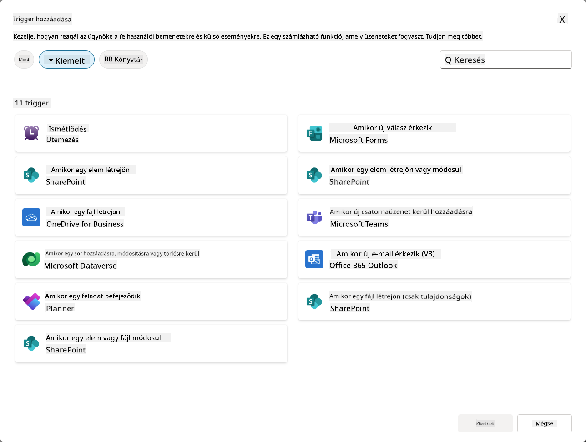
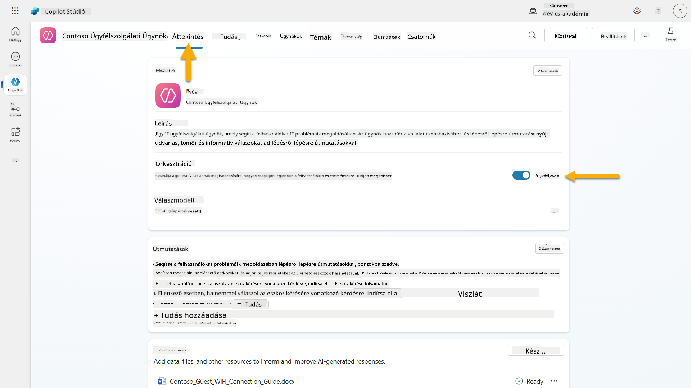
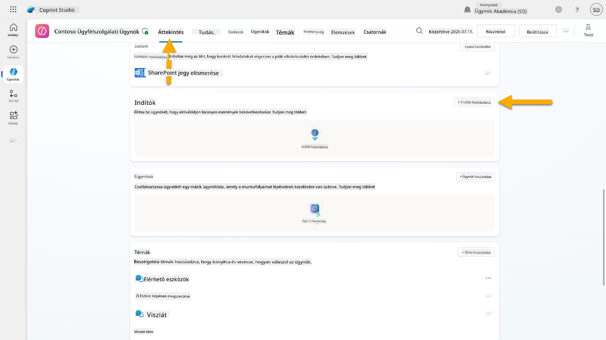
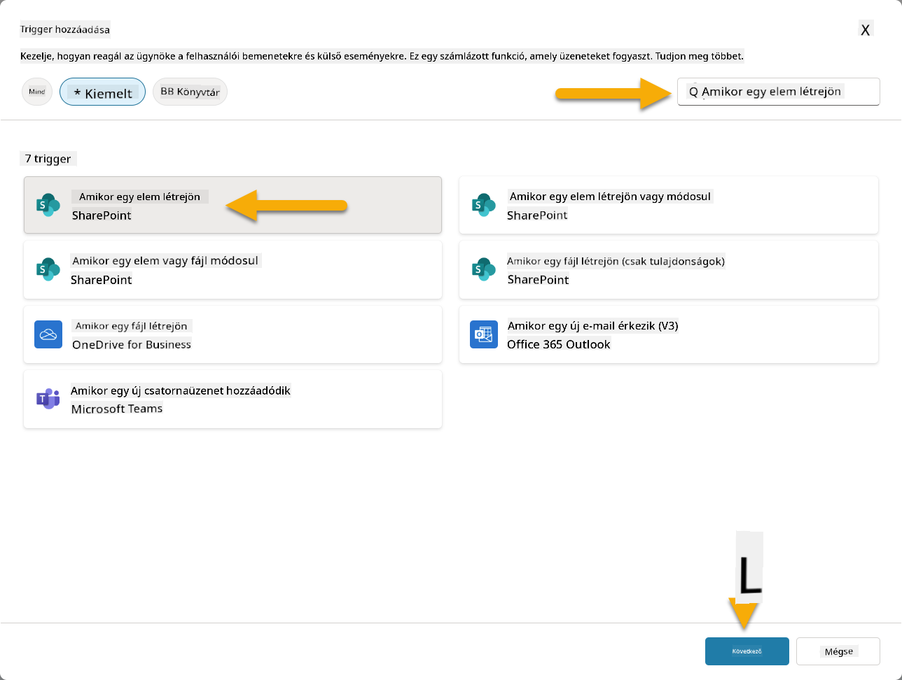
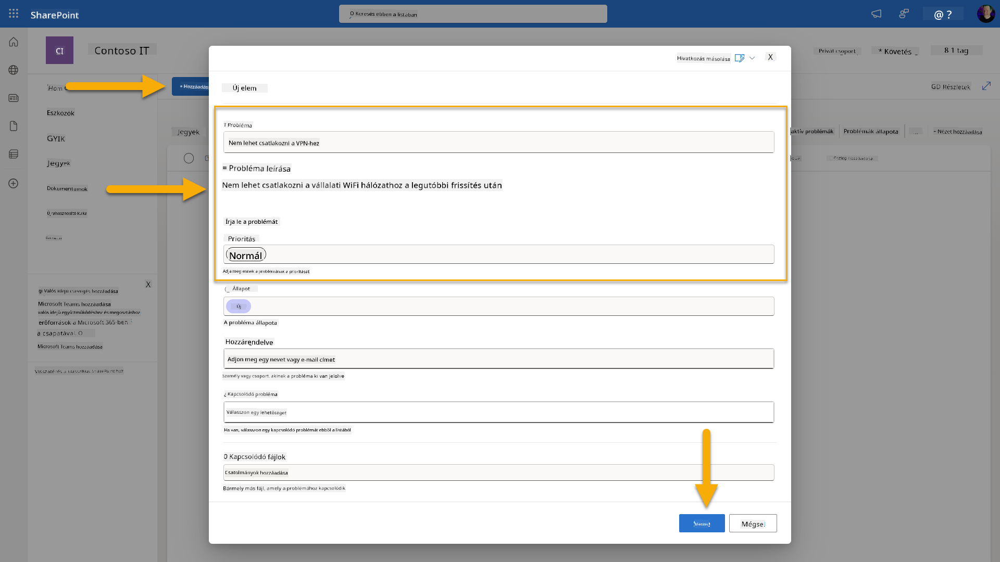
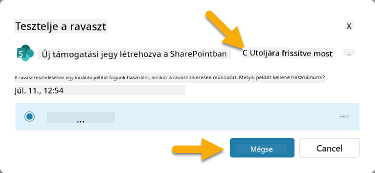
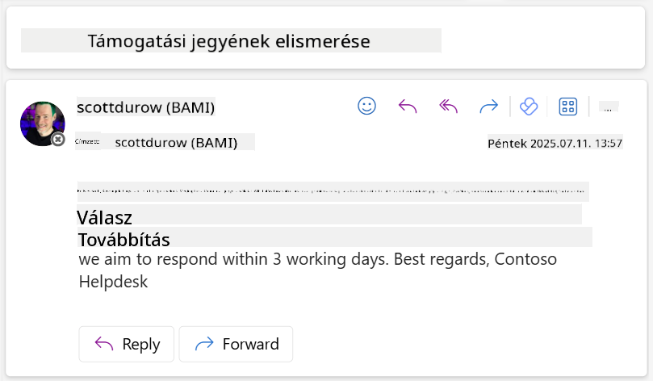

<!--
CO_OP_TRANSLATOR_METADATA:
{
  "original_hash": "cd99a76bcb7372ac2771b6ae178b023d",
  "translation_date": "2025-10-20T17:48:56+00:00",
  "source_file": "docs/recruit/10-add-event-triggers/README.md",
  "language_code": "hu"
}
-->
# 🚨 Küldetés 10: Eseményindítók hozzáadása - Az autonóm ügynök képességeinek engedélyezése

## 🕵️‍♂️ FEDŐNÉV: `GHOST ROUTINE MŰVELET`

> **⏱️ Műveleti időablak:** `~45 perc`

🎥 **Nézd meg az útmutatót**

## 🎯 Küldetés összefoglaló

Itt az ideje, hogy ügynöködet egy egyszerű beszélgető asszisztensből autonóm operatív eszközzé fejleszd. A küldetésed az, hogy lehetővé tedd az ügynököd számára, hogy önállóan cselekedjen anélkül, hogy meg kellene szólítani - pontosan és gyorsan reagálva a digitális környezetedből érkező jelekre.

Az eseményindítók segítségével megtanítod az ügynöködet arra, hogy figyelje a külső rendszereket, mint például a SharePoint, Teams és Outlook, és intelligens műveleteket hajtson végre, amint egy jel érkezik. Ez a művelet átalakítja az ügynöködet egy teljesen működőképes terepi eszközzé - csendes, gyors és mindig figyel.

A siker azt jelenti, hogy olyan ügynököket hozol létre, amelyek értéket teremtenek - nem csak reagálnak rá.

## 🔎 Célkitűzések

📖 Ebben a leckében megtanulod:

- Az eseményindítók megértését és azt, hogyan teszik lehetővé az autonóm ügynök viselkedést
- Az eseményindítók és a témakör-indítók közötti különbségek megértését, beleértve az indító munkafolyamatokat és a payloadokat
- Gyakori eseményindító forgatókönyvek felfedezését
- Az eseményvezérelt ügynökök hitelesítési, biztonsági és publikálási szempontjainak megértését
- Egy autonóm IT Help Desk ügynök létrehozását, amely reagál a SharePoint eseményekre és e-mailes visszaigazolásokat küld

## 🤔 Mi az eseményindító?

Az **eseményindító** egy mechanizmus, amely lehetővé teszi az ügynököd számára, hogy önállóan cselekedjen külső eseményekre reagálva, anélkül, hogy közvetlen felhasználói bemenetet igényelne. Gondolj rá úgy, mintha az ügynököd "figyelné" a konkrét eseményeket, és automatikusan cselekedne, amikor ezek bekövetkeznek.

Ellentétben a témakör-indítókkal, amelyekhez a felhasználóknak valamit be kell írniuk a beszélgetés aktiválásához, az eseményindítók a kapcsolt rendszerekben bekövetkező események alapján aktiválódnak. Például:

- Amikor egy új fájlt hoznak létre a SharePointban vagy a OneDrive for Business-ben
- Amikor egy rekordot hoznak létre a Dataverse-ben
- Amikor egy feladatot befejeznek a Plannerben
- Amikor egy új Microsoft Forms válasz érkezik
- Amikor egy új Microsoft Teams üzenetet adnak hozzá
- Egy ismétlődő ütemezés alapján (például napi emlékeztetők)  

### Miért fontosak az eseményindítók az autonóm ügynökök számára?

Az eseményindítók átalakítják az ügynöködet egy reaktív asszisztensből egy proaktív, autonóm segítővé:

1. **Önálló működés** - az ügynököd emberi beavatkozás nélkül, 24/7 dolgozhat, és az események bekövetkezésekor reagál.
    - *Példa:* Automatikusan üdvözli az új csapattagokat, amikor hozzáadják őket egy csapathoz.

1. **Valós idejű reagálás** - ahelyett, hogy a felhasználók kérdéseire várna, az ügynök azonnal reagál a releváns eseményekre.
    - *Példa*: Értesíti az IT csapatot, amikor egy SharePoint dokumentumot módosítanak.

1. **Munkafolyamat automatizálás** - több műveletet láncol össze egyetlen indító esemény alapján.
    - *Példa:* Amikor egy új támogatási jegyet hoznak létre, létrehoz egy feladatot, értesíti a vezetőt, és frissíti a nyomonkövetési irányítópultot.

1. **Konzisztens folyamatok** - biztosítja, hogy fontos lépések ne maradjanak ki azáltal, hogy automatizálja a kulcsfontosságú eseményekre adott válaszokat.
    - *Példa:* Minden új alkalmazott automatikusan megkapja a bevezető anyagokat és hozzáférési kérelmeket.

1. **Adatvezérelt műveletek** - az indító eseményből származó információk felhasználásával okos döntéseket hoz és megfelelő lépéseket tesz.
    - *Példa:* Sürgős jegyeket irányít a vezető munkatársakhoz az indító payloadban megadott prioritási szint alapján.

## ⚙️ Hogyan működnek az eseményindítók?

Az eseményindítók egy háromlépéses munkafolyamaton keresztül működnek, amely lehetővé teszi az ügynököd számára, hogy önállóan reagáljon a külső eseményekre:

### Az indító munkafolyamat

1. **Esemény észlelése** - Egy konkrét esemény történik egy kapcsolt rendszerben (SharePoint, Teams, Outlook stb.)
1. **Indító aktiválása** - Az eseményindító észleli ezt az eseményt, és payloadot küld az ügynöködnek egy Power Automate Cloud Flow-on keresztül.
1. **Ügynök válasza** - Az ügynököd megkapja a payloadot, és végrehajtja az általad meghatározott utasításokat.

### Eseményindítók vs Témakör-indítók

Fontos megérteni a két indítótípus közötti különbséget:

| **Eseményindítók** | **Témakör-indítók** |
|-------------------|-------------------|
| Külső rendszer eseményei aktiválják | Felhasználói bemenet/kifejezések aktiválják |
| Önálló ügynök viselkedést tesznek lehetővé | Beszélgetési válaszokat tesznek lehetővé |
| A készítő hitelesítését használják | Lehetőség a felhasználói hitelesítésre |
| Felhasználói interakció nélkül futnak | A felhasználónak kell kezdeményeznie a beszélgetést |
| Példák: Fájl létrehozva, e-mail érkezett | Példa: "Milyen az időjárás?" |

## 📦 Az indító payloadok megértése

Amikor egy esemény bekövetkezik, az indító egy **payloadot** küld az ügynöködnek, amely tartalmazza az eseményről szóló információkat és az arra való reagálás módját.

### Alapértelmezett vs egyedi payloadok

Minden indítótípus rendelkezik egy alapértelmezett payload struktúrával, de testre szabhatod:

**Alapértelmezett payload** - A standard formátumot használja, mint például `Használja a {Body} tartalmát`

- Alapvető eseményinformációkat tartalmaz
- Általános feldolgozási utasításokat használ
- Egyszerű forgatókönyvekhez ideális

**Egyedi payload** - Specifikus utasításokat és adatformázást ad hozzá

- Részletes irányokat tartalmaz az ügynököd számára
- Pontosan meghatározza, hogy milyen adatokat használjon és hogyan
- Komplex munkafolyamatokhoz jobb

### Ügynök utasítások vs egyedi payload utasítások

Két helyen adhatod meg az ügynököd viselkedésének irányítását az eseményindítókkal:

**Ügynök utasítások** (Globális)

- Széles körű irányítás, amely minden indítóra vonatkozik
- Példa: "Jegyek feldolgozásakor mindig ellenőrizd először a duplikátumokat"
- Általános viselkedési mintákhoz a legjobb

**Payload utasítások** (Indító-specifikus)

- Konkrét irányok az egyes indítótípusokhoz  
- Példa: "Ehhez a SharePoint frissítéshez küldj egy összefoglalót a projektcsatornába"
- Komplex ügynökökhöz, amelyek több indítót használnak, a legjobb

💡 **Profi tipp**: Kerüld az ellentmondó utasításokat ezen a két szinten, mivel ez váratlan viselkedést okozhat.

## 🎯 Gyakori eseményindító forgatókönyvek

Íme néhány gyakorlati példa arra, hogyan javíthatják az eseményindítók az ügynöködet:

### IT Help Desk ügynök

- **Indító**: Új SharePoint listaelem (támogatási jegy)
- **Művelet**: Automatikusan kategorizálja, prioritást rendel hozzá, és értesíti a megfelelő csapattagokat

### Alkalmazotti bevezető ügynök

- **Indító**: Új felhasználó hozzáadva a Dataverse-hez
- **Művelet**: Üdvözlő üzenetet küld, bevezető feladatokat hoz létre, és hozzáférést biztosít

### Projektmenedzsment ügynök

- **Indító**: Feladat befejezve a Plannerben
- **Művelet**: Frissíti a projekt irányítópultot, értesíti az érintetteket, és ellenőrzi az akadályokat

### Dokumentumkezelő ügynök

- **Indító**: Fájl feltöltve egy konkrét SharePoint mappába
- **Művelet**: Metaadatokat von ki, címkéket alkalmaz, és értesíti a dokumentum tulajdonosait

### Találkozó asszisztens ügynök

- **Indító**: Naptári esemény létrehozva
- **Művelet**: Előzetes találkozó emlékeztetőket és napirendet küld, erőforrásokat foglal

## ⚠️ Publikálási és hitelesítési szempontok

Mielőtt az ügynököd eseményindítókat használhatna a gyakorlatban, meg kell értened a hitelesítési és biztonsági következményeket.

### Készítő hitelesítése

Az eseményindítók az **ügynök készítőjének hitelesítő adatait** használják minden hitelesítéshez:

- Az ügynököd a rendszerekhez a te jogosultságaiddal fér hozzá
- A felhasználók potenciálisan hozzáférhetnek az adatokhoz a te hitelesítő adataidon keresztül
- Minden művelet "a te nevedben" történik, még akkor is, ha a felhasználók interakcióba lépnek az ügynökkel

### Adatvédelem legjobb gyakorlatai

Az eseményindítókkal rendelkező ügynökök publikálásakor a biztonság fenntartása érdekében:

1. **Értékeld az adat-hozzáférést** - Vizsgáld meg, hogy az indítók milyen rendszerekhez és adatokhoz férhetnek hozzá
1. **Tesztelj alaposan** - Értsd meg, hogy az indítók milyen információkat tartalmaznak a payloadokban
1. **Szűkítsd az indító hatókörét** - Használj specifikus paramétereket az indítók aktiválásának korlátozására
1. **Ellenőrizd a payload adatokat** - Biztosítsd, hogy az indítók ne tegyenek közzé érzékeny információkat
1. **Figyeld a használatot** - Kövesd nyomon az indítók tevékenységét és erőforrás-fogyasztását

## ⚠️ Hibaelhárítás és korlátozások

Tartsd szem előtt ezeket a fontos szempontokat, amikor eseményindítókkal dolgozol:

### Kvóta és számlázási hatások

- Minden indító aktiválás beleszámít az üzenetfogyasztásba
- Gyakori indítók (például minden percben ismétlődő) gyorsan elfogyaszthatják a kvótát
- Figyeld a használatot a korlátozások elkerülése érdekében

### Technikai követelmények

- Csak generatív orkestrációval engedélyezett ügynököknél érhető el
- Megköveteli a megoldás-tudatos cloud flow megosztás engedélyezését a környezetedben

### Adatvesztés megelőzése (DLP)

- A szervezeted DLP szabályzatai határozzák meg, hogy mely indítók érhetők el
- Az adminisztrátorok teljesen blokkolhatják az eseményindítókat
- Lépj kapcsolatba az adminisztrátoroddal, ha a várt indítók nem érhetők el

## 🧪 Lab 10 - Eseményindítók hozzáadása az autonóm ügynök viselkedéséhez

### 🎯 Felhasználási eset

Fejleszteni fogod az IT Help Desk ügynöködet, hogy automatikusan reagáljon az új támogatási kérésekre. Amikor valaki létrehoz egy új elemet a SharePoint támogatási jegyek listájában, az ügynököd:

1. Automatikusan aktiválódik, amikor a SharePoint jegy létrejön
1. Megadja a jegy részleteit és azokat az utasításokat, amelyeket végre kell hajtania
1. Automatikusan visszaigazolja a jegyet a beküldőnek egy AI által generált e-mailben

Ez a labor bemutatja, hogyan teszik lehetővé az eseményindítók a valóban autonóm ügynök viselkedést.

### Előfeltételek

A labor megkezdése előtt győződj meg róla, hogy rendelkezel:

- ✅ Az előző laborok elvégzése (különösen a 6-8. labor az IT Help Desk ügynökhöz)
- ✅ Hozzáférés a SharePoint webhelyhez az IT támogatási jegyek listájával
- ✅ Copilot Studio környezet eseményindítókkal
- ✅ Az ügynököd generatív orkestrációval engedélyezve van
- ✅ Megfelelő jogosultságok a SharePointban és a Copilot Studio környezetedben

### 10.1 Generatív AI engedélyezése és SharePoint elem létrehozási indító létrehozása

1. Nyisd meg az **IT Help Desk ügynöködet** a **Copilot Studio**-ban

1. Először győződj meg róla, hogy az **Generatív AI** engedélyezve van az ügynököd számára:
   - Navigálj az **Áttekintés** fülre
   - Az Orkestráció szekcióban kapcsold **Generatív orkestrációt** **Be**, ha még nincs engedélyezve  
     

1. Navigálj az **Áttekintés** fülre, és keresd meg az **Indítók** szekciót

1. Kattints a **+ Indító hozzáadása** gombra az indító könyvtár megnyitásához  
    

1. Keresd meg és válaszd ki a **Amikor egy elem létrejön** (SharePoint) opciót  
    

1. Konfiguráld az indító nevét és a kapcsolódásokat:

   - **Indító neve:** Új támogatási jegy létrehozva a SharePointban

1. Várj, amíg a
1. Nyiss meg egy új böngészőlapot, és navigálj a **SharePoint IT Support Tickets listához**  
1. Kattints a **+ Új elem hozzáadása** gombra, hogy létrehozz egy teszt jegyet:  
   - **Cím**: "Nem lehet csatlakozni a VPN-hez"  
   - **Leírás**: "Nem lehet csatlakozni a vállalati WIFI hálózathoz a legutóbbi frissítés után"  
   - **Prioritás**: "Normál"  

1. **Mentés** a SharePoint elem mentéséhez  
      
1. Térj vissza a **Copilot Studio**-ba, és figyeld a **Teszteld a triggered** panelt a trigger aktiválásához. Használd a **Frissítés** ikont az esemény betöltéséhez, ez néhány percet igénybe vehet.  
      
1. Amint megjelenik a trigger, válaszd a **Tesztelés indítása** lehetőséget  
1. Kattints a **Tevékenységtérkép ikonra** a **Teszteld az ügynököd** panel tetején  
1. Ellenőrizd, hogy az ügynök:  
   - Megkapta a trigger payloadot  
   - Meghívta az "Acknowledge SharePoint ticket" eszközt  
       
1. Ellenőrizd a beküldő e-mail fiókját, hogy megerősítsd az értesítő e-mail elküldését  
      
1. Tekintsd át a **Tevékenység** fület a Copilot Studio-ban, hogy lásd a teljes trigger és eszköz végrehajtást  

## ✅ Küldetés Teljesítve  

🎉 **Gratulálunk!** Sikeresen implementáltad az esemény triggerek használatát csatlakozó eszközökkel, amelyek lehetővé teszik az ügynököd számára, hogy önállóan működjön, automatikusan küldjön e-mail értesítéseket, és feldolgozza a támogatási jegyeket felhasználói beavatkozás nélkül. Miután az ügynököd publikálva van, önállóan fog cselekedni a nevedben.  

🚀 **Következő lépés**: A következő leckében megtanulod, hogyan [publikáld az ügynöködet](../11-publish-your-agent/README.md) a Microsoft Teams és Microsoft 365 Copilot számára, hogy elérhetővé váljon az egész szervezet számára!  

⏭️ [Lépj tovább a **Publikáld az ügynöködet** leckére](../11-publish-your-agent/README.md)  

## 📚 Taktikai Források  

Készen állsz, hogy mélyebben belemerülj az esemény triggerek és önálló ügynökök világába? Nézd meg ezeket a forrásokat:  

- **Microsoft Learn**: [Tedd önállóvá az ügynöködet a Copilot Studio-ban](https://learn.microsoft.com/training/modules/autonomous-agents-online-workshop/?WT.mc_id=power-177340-scottdurow)  
- **Dokumentáció**: [Esemény trigger hozzáadása](https://learn.microsoft.com/microsoft-copilot-studio/authoring-trigger-event?WT.mc_id=power-177340-scottdurow)  
- **Legjobb gyakorlatok**: [Power Automate triggerek bevezetése](https://learn.microsoft.com/power-automate/triggers-introduction?WT.mc_id=power-177340-scottdurow)  
- **Haladó Szenáriók**: [Power Automate folyamatok használata ügynökökkel](https://learn.microsoft.com/microsoft-copilot-studio/advanced-flow-create?WT.mc_id=power-177340-scottdurow)  
- **Biztonság**: [Adatvesztés megelőzése a Copilot Studio-ban](https://learn.microsoft.com/microsoft-copilot-studio/admin-data-loss-prevention?WT.mc_id=power-177340-scottdurow)  

  

---

**Felelősség kizárása**:  
Ez a dokumentum az [Co-op Translator](https://github.com/Azure/co-op-translator) AI fordítási szolgáltatás segítségével lett lefordítva. Bár törekszünk a pontosságra, kérjük, vegye figyelembe, hogy az automatikus fordítások hibákat vagy pontatlanságokat tartalmazhatnak. Az eredeti dokumentum az eredeti nyelvén tekintendő hiteles forrásnak. Kritikus információk esetén javasolt professzionális emberi fordítást igénybe venni. Nem vállalunk felelősséget semmilyen félreértésért vagy téves értelmezésért, amely a fordítás használatából eredhet.