<!--
CO_OP_TRANSLATOR_METADATA:
{
  "original_hash": "9dceeba2eae2bb73e328602a060eddab",
  "translation_date": "2025-10-20T17:29:05+00:00",
  "source_file": "docs/recruit/11-publish-your-agent/README.md",
  "language_code": "hu"
}
-->
# 🚨 Küldetés 11: Az ügynök közzététele

## 🕵️‍♂️ KÓDNEVE: `MŰVELET KÖZZÉTÉTEL KÖZZÉTÉTEL KÖZZÉTÉTEL`

> **⏱️ Műveleti időablak:** `~30 perc`  

🎥 **Nézd meg az útmutatót**

[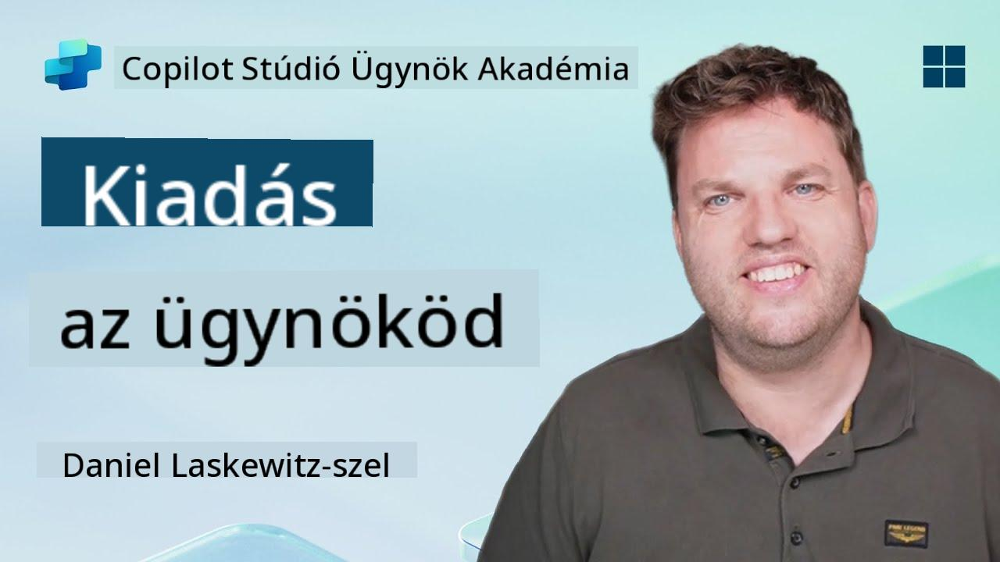](https://www.youtube.com/watch?v=eVZmljhYlSI "Nézd meg az útmutatót a YouTube-on")

## 🎯 Küldetés összefoglaló

Miután számos kihívást jelentő modulon túljutottál, Ügynökkészítő, most készen állsz a legkritikusabb lépésre: az ügynök közzétételére. Itt az ideje, hogy alkotásodat elérhetővé tedd a Microsoft Teams és a Microsoft 365 Copilot felhasználói számára.

Az ügynököd—egyértelmű küldetéssel, hatékony eszközökkel és kulcsfontosságú tudásforrásokhoz való hozzáféréssel—készen áll a szolgálatra. A Microsoft Copilot Studio segítségével telepíted az ügynöködet, hogy valódi felhasználókat segíthessen ott, ahol dolgoznak.

Indítsd el az ügynöködet akcióba!

## 🔎 Célkitűzések

📖 Ez a lecke az alábbiakat tartalmazza:

1. Miért fontos az ügynök közzététele
1. Mi történik, amikor közzéteszed az ügynöködet
1. Hogyan adj hozzá csatornát (Microsoft Teams és Microsoft 365 Copilot)
1. Hogyan add hozzá az ügynököt a Microsoft Teams-hez
1. Hogyan tedd elérhetővé az ügynököt az egész szervezet számára a Microsoft Teams-ben

## 🚀 Ügynök közzététele

Minden alkalommal, amikor dolgozol egy ügynökön a Copilot Studio-ban, frissítheted azt új tudás vagy eszközök hozzáadásával. Amikor minden változtatással készen állsz, és alaposan tesztelted, készen állsz a közzétételre. A közzététel biztosítja, hogy a legfrissebb frissítések élőben legyenek. Ha frissíted az ügynöködet új eszközökkel, de nem kattintasz a közzététel gombra, akkor az még nem lesz elérhető a végfelhasználók számára.

Mindig győződj meg róla, hogy megnyomod a közzététel gombot, amikor a frissítéseket elérhetővé szeretnéd tenni az ügynököd felhasználói számára. Az ügynöködnek lehetnek hozzáadott csatornái, és amikor megnyomod a közzététel gombot, a frissítések elérhetővé válnak az ügynök összes hozzáadott csatornáján.

## ⚙️ Csatornák konfigurálása

A csatornák határozzák meg, hogy a felhasználók hol érhetik el és léphetnek kapcsolatba az ügynököddel. Miután közzétetted az ügynöködet, több csatornán is elérhetővé teheted. Minden csatorna eltérően jelenítheti meg az ügynök tartalmát.

Az ügynöködet az alábbi csatornákhoz adhatod hozzá:

- **Microsoft Teams és Microsoft 365 Copilot** - Tedd elérhetővé az ügynöködet a Teams csevegésekben és értekezleteken, valamint a Microsoft 365 Copilot élményekben ([További információ](https://learn.microsoft.com/microsoft-copilot-studio/publication-add-bot-to-microsoft-teams))
- **Demo weboldal** - Teszteld az ügynöködet a Copilot Studio által biztosított demo weboldalon ([További információ](https://learn.microsoft.com/microsoft-copilot-studio/publication-connect-bot-to-web-channels))
- **Egyedi weboldal** - Ágyazd be az ügynöködet közvetlenül a saját weboldaladba ([További információ](https://learn.microsoft.com/microsoft-copilot-studio/publication-connect-bot-to-web-channels))
- **Mobilalkalmazás** - Integráld az ügynöködet egy egyedi mobilalkalmazásba ([További információ](https://learn.microsoft.com/microsoft-copilot-studio/publication-connect-bot-to-custom-application))
- **SharePoint** - Add hozzá az ügynöködet a SharePoint webhelyekhez dokumentum- és webhelytámogatás céljából ([További információ](https://learn.microsoft.com/microsoft-copilot-studio/publication-add-bot-to-sharepoint))
- **Facebook Messenger** - Kapcsolódj a felhasználókhoz a Facebook üzenetküldő platformján keresztül ([További információ](https://learn.microsoft.com/microsoft-copilot-studio/publication-add-bot-to-facebook))
- **Power Pages** - Integráld az ügynöködet a Power Pages weboldalakba ([További információ](https://learn.microsoft.com/microsoft-copilot-studio/publication-add-bot-to-power-pages))
- **Azure Bot Service csatornák** - Érj el további csatornákat, például Slack, Telegram, Twilio SMS és mások ([További információ](https://learn.microsoft.com/microsoft-copilot-studio/publication-connect-bot-to-azure-bot-service-channels))

A csatorna hozzáadásához navigálj az ügynök **Csatornák** fülére, és válaszd ki a konfigurálni kívánt csatornát. Minden csatornának megvannak a saját beállítási követelményei, és további hitelesítési vagy konfigurációs lépéseket igényelhet.

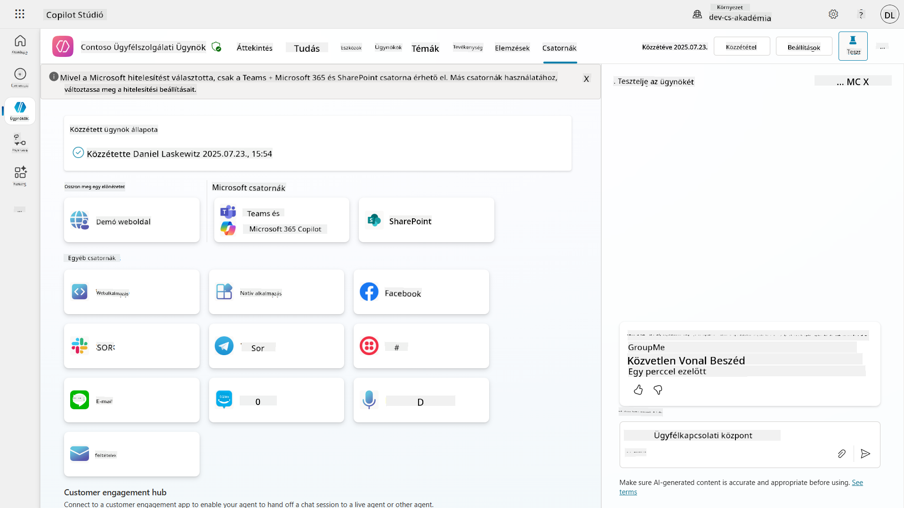

## 📺 Csatornaélmények

A különböző csatornák eltérő felhasználói élményt nyújtanak. Ha több csatornára építesz ügynököt, győződj meg róla, hogy tisztában vagy az egyes csatornák közötti különbségekkel. Mindig jó stratégia, ha több csatornán teszteled az ügynöködet, hogy megbizonyosodj róla, valóban azt teszi, amit szándékoztál.

| Élmény                           | Weboldal      | Teams és Microsoft 365 Copilot         | Facebook                 | Dynamics Omnichannel az ügyfélszolgálathoz                  |
| -------------------------------- | ------------- | --------------------------------------- | ------------------------ | ----------------------------------------------------------- |
| [Ügyfél-elégedettségi kérdőív][1] | Adaptív kártya | Csak szöveg                            | Csak szöveg              | Csak szöveg                                                  |
| [Többválasztásos opciók][1]      | Támogatott    | [Legfeljebb hat (hero kártyaként)][4]   | [Legfeljebb 13 támogatott][6] | [Részben támogatott][8]                                    |
| [Markdown][2]                   | Támogatott    | [Részben támogatott][5]                | [Részben támogatott][7]  | [Részben támogatott][9]                                    |
| [Üdvözlő üzenet][1]              | Támogatott    | Támogatott                             | Nem támogatott           | Támogatott [Chat][10] esetén. Nem támogatott más csatornák esetén. |
| [Tippelés][3]                    | Támogatott    | Támogatott                             | Támogatott               | Támogatott [Microsoft Teams][11], [Chat][10], Facebook, és csak szöveges csatornák esetén (rövid üzenet szolgáltatás (SMS) [TeleSign][12] és [Twilio][13], [WhatsApp][14], [WeChat][15], és [Twitter][16]). A javasolt műveletek szöveges listaként jelennek meg; a felhasználóknak újra be kell gépelniük egy opciót a válaszadáshoz. |

[1]: https://learn.microsoft.com/microsoft-copilot-studio/authoring-create-edit-topics  
[2]: https://daringfireball.net/projects/markdown/  
[3]: https://learn.microsoft.com/microsoft-copilot-studio/advanced-ai-features  
[4]: https://learn.microsoft.com/microsoftteams/platform/concepts/cards/cards-reference#hero-card  
[5]: https://learn.microsoft.com/microsoftteams/platform/bots/how-to/format-your-bot-messages#text-only-messages  
[6]: https://developers.facebook.com/docs/messenger-platform/send-messages/quick-replies/  
[7]: https://www.facebook.com/help/147348452522644?helpref=related  
[8]: https://learn.microsoft.com/dynamics365/customer-service/asynchronous-channels#suggested-actions-support  
[9]: https://learn.microsoft.com/dynamics365/customer-service/asynchronous-channels#preview-support-for-formatted-messages  
[10]: https://learn.microsoft.com/dynamics365/customer-service/set-up-chat-widget  
[11]: https://learn.microsoft.com/dynamics365/customer-service/configure-microsoft-teams  
[12]: https://learn.microsoft.com/dynamics365/customer-service/configure-sms-channel  
[13]: https://learn.microsoft.com/dynamics365/customer-service/configure-sms-channel-twilio  
[14]: https://learn.microsoft.com/dynamics365/customer-service/configure-whatsapp-channel  
[15]: https://learn.microsoft.com/dynamics365/customer-service/configure-wechat-channel  
[16]: https://learn.microsoft.com/dynamics365/customer-service/configure-twitter-channel  

> [!NOTE]  
> Vannak példák arra, hogy különböző logikát használj különböző csatornákhoz. Egy példa erre megtalálható a Power Platform Snippets adattárban:  
>  
> Henry Jammes megosztott egy példát arra, hogyan lehet különböző adaptív kártyát megjeleníteni, ha a csatorna Microsoft Teams. ([Példa linkje](https://github.com/pnp/powerplatform-snippets/blob/main/copilot-studio/multiple-topics-matched-topic/source/multiple-topics-matched.yaml#L40))

## 🧪 Labor 11: Ügynök közzététele a Teams és Microsoft 365 Copilot számára

### 🎯 Felhasználási eset

A Contoso IT Help Desk ügynököd most már teljesen konfigurálva van erőteljes funkciókkal—hozzáfér a SharePoint tudásforrásokhoz, támogatási jegyeket hoz létre, proaktív értesítéseket küld, és intelligensen válaszol a felhasználói kérdésekre. Azonban ezek a funkciók jelenleg csak abban a fejlesztési környezetben érhetők el, ahol létrehoztad őket.

**A kihívás:** A végfelhasználók nem tudják kihasználni az ügynököd képességeit, amíg az megfelelően közzé nem lesz téve, és elérhetővé nem válik azokon a csatornákon, ahol ténylegesen dolgoznak.

**A megoldás:** Az ügynök közzététele biztosítja, hogy a legfrissebb verzió—minden új frissítéssel, új témákkal, bővített tudásforrásokkal és konfigurált folyamatokkal—elérhető legyen a valódi felhasználók számára. Közzététel nélkül a felhasználók továbbra is az ügynök régebbi verziójával lépnének kapcsolatba, amelyből hiányozhatnak kritikus funkciók.

A Teams és Microsoft 365 Copilot csatorna hozzáadása szintén kulcsfontosságú, mert:

- **Teams integráció**: A szervezet alkalmazottai idejük nagy részét a Microsoft Teams-ben töltik együttműködés, értekezletek és kommunikáció céljából. Az ügynök Teams-hez való hozzáadásával a felhasználók IT támogatást kaphatnak anélkül, hogy elhagynák elsődleges munkakörnyezetüket.

- **Microsoft 365 Copilot**: A felhasználók közvetlenül a Microsoft 365 Copilot élményen belül érhetik el a speciális IT help desk ügynöködet, amely zökkenőmentesen integrálódik napi munkafolyamataikba az Office alkalmazásokban.

- **Központosított hozzáférés**: Ahelyett, hogy külön weboldalakat vagy alkalmazásokat kellene megjegyezniük, a felhasználók az általuk már használt platformokon keresztül érhetik el az IT támogatást, csökkentve a súrlódást és növelve az elfogadottságot.

Ez a küldetés átalakítja fejlesztési munkádat egy termelésre kész megoldássá, amely valódi értéket nyújt a szervezet végfelhasználói számára.

### Előfeltételek

Mielőtt elkezdenéd ezt a labort, győződj meg róla, hogy:

- ✅ Teljesítetted az előző laborokat, és teljesen konfiguráltad a Contoso Helpdesk Agent-et
- ✅ Az ügynöködet tesztelted, és készen áll a termelési használatra
- ✅ Rendelkezel jogosultságokkal a Copilot Studio környezetedben az ügynökök közzétételéhez
- ✅ Hozzáférsz a Microsoft Teams-hez a szervezetedben

### 11.1 Az ügynök közzététele

Most, hogy az ügynökön végzett munkánk befejeződött, gondoskodnunk kell arról, hogy minden munkánk elérhető legyen a végfelhasználók számára, akik használni fogják az ügynököt. Annak érdekében, hogy a tartalom minden felhasználó számára elérhető legyen, közzé kell tennünk az ügynököt.

1. Lépj be a Contoso Helpdesk Agent-be a Copilot Studio-ban (a [Copilot Studio készítői portálon](https://copilotstudio.microsoft.com))

    A Copilot Studio-ban egyszerű az ügynök közzététele. Csak válaszd ki a közzététel gombot az ügynök áttekintő oldalának tetején.

    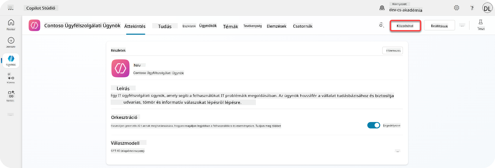

1. Válaszd ki az **Publish** gombot az ügynöködben

    Megnyílik a közzétételi felugró ablak - hogy megerősítsd, valóban közzé szeretnéd tenni az ügynöködet.

    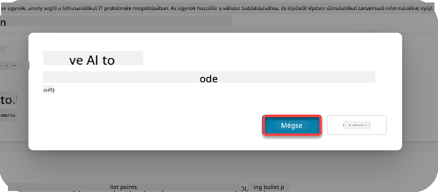

1. Válaszd ki a **Publish** gombot a közzététel megerősítéséhez

    Most megjelenik egy üzenet, amely azt mutatja, hogy az ügynököd közzététel alatt áll. Nem kell nyitva tartanod ezt a felugró ablakot. Értesítést kapsz, amikor az ügynök közzététele befejeződik.

    

    Amikor az ügynök közzététele befejeződik, értesítést látsz az ügynök oldalának tetején.

    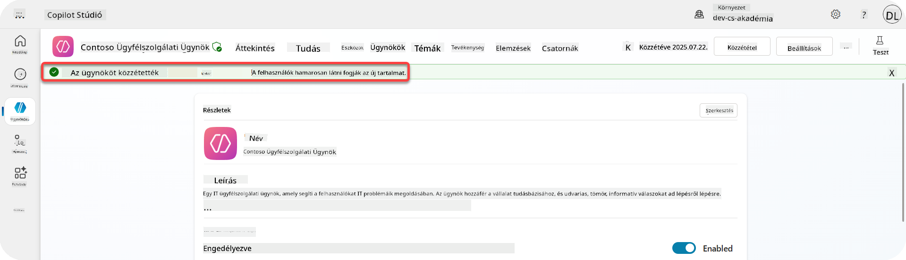

De - csak közzétettük az ügynököt, még nem adtuk hozzá csatornához, szóval most ezt is meg kell oldanunk!

### 11.2 A Teams és Microsoft 365 Copilot csatorna hozzáadása

1. Ahhoz, hogy hozzáadjuk a Teams és Microsoft 365 Copilot csatornát az ügynökünkhöz, ki kell választanunk a **Channel** opciót az ügynök felső navigációjában

    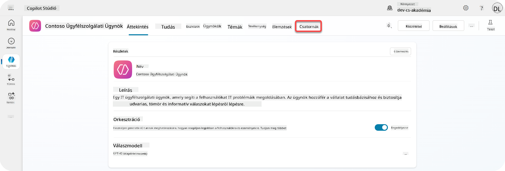

    Itt láthatjuk az összes csatornát, amelyet hozzáadhatunk ehhez az ügynökhöz.

1. Válaszd ki a **Teams és Microsoft 365** opciót

    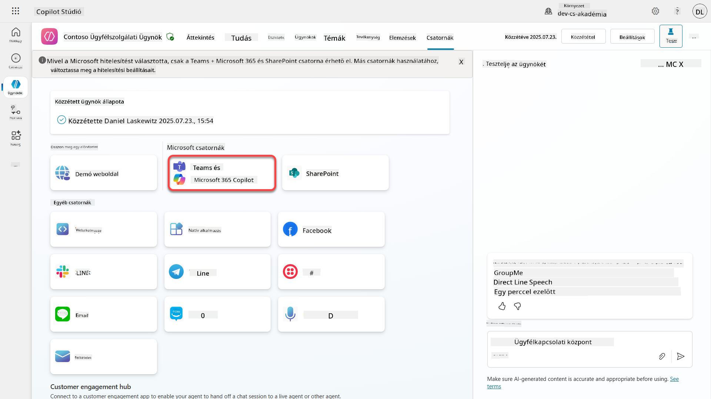

1. Válaszd ki az **Add channel** gombot, hogy befejezd a varázslót, és hozzáadd a csatornát az ügynökhöz

    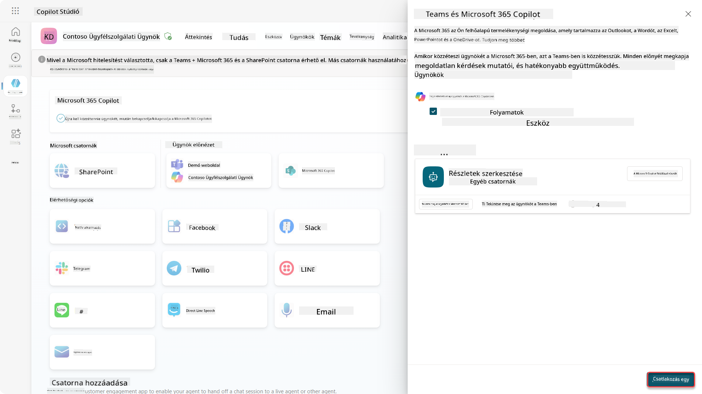

    Ez egy kis időt vesz igénybe, amíg hozzáadódik. Miután hozzáadódott, egy zöld értesítés jelenik meg az oldalsáv tetején.

    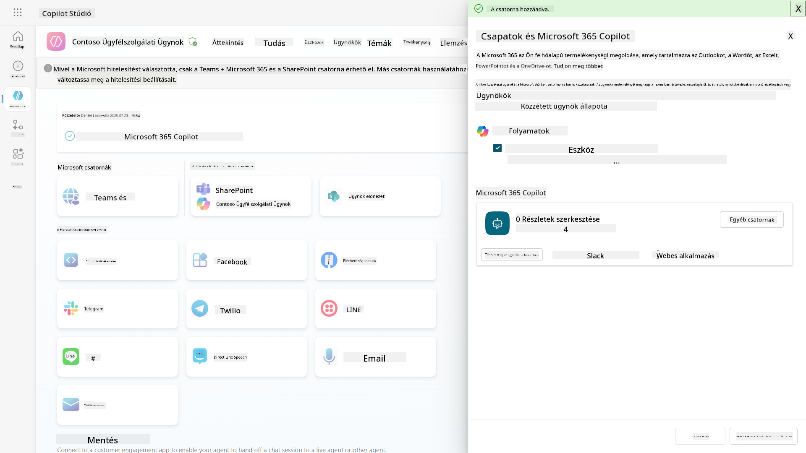

1. Válaszd ki a **See agent in Teams** opciót, hogy megnyiss egy új lapot

    ![Ügynök meg
Ez megnyit egy panelt, ahol módosíthatjuk az ügynök különböző részleteit és beállításait. Megváltoztathatjuk az alapvető részleteket, például az ikont, az ikon háttérszínét és a leírásokat. Itt módosíthatjuk a Teams beállításait is (például engedélyezhetjük, hogy egy felhasználó hozzáadja az ügynököt egy csapathoz, vagy engedélyezhetjük az ügynök használatát csoportos és értekezleti csevegésekben). Ha a *továbbiak* lehetőséget választjuk, módosíthatjuk a fejlesztői részleteket is, például a fejlesztő nevét, a weboldalt, az adatvédelmi nyilatkozatot és a használati feltételeket.

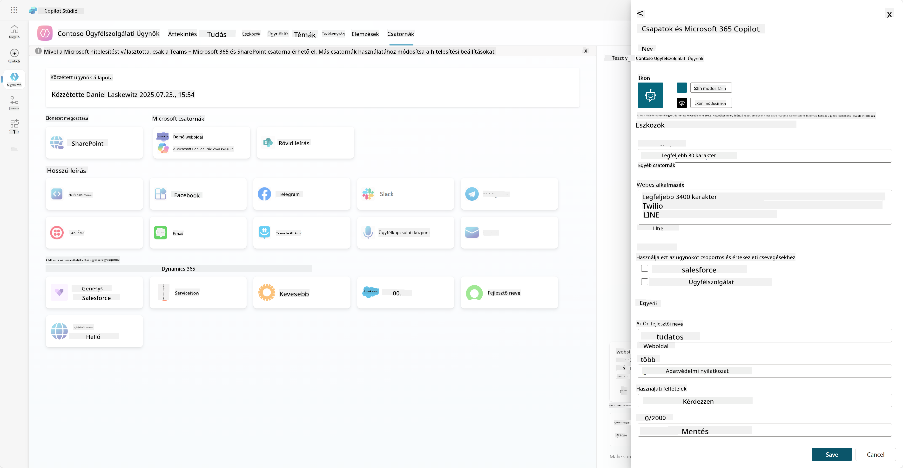

1. Válassza a **Mégse** lehetőséget a Részletek szerkesztése panel bezárásához.

1. Válassza az **Elérhetőségi opciók** lehetőséget.

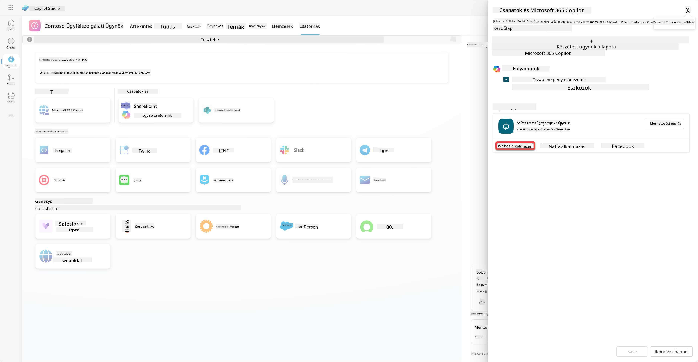

Ez megnyitja az elérhetőségi opciók panelt, ahol másolhat egy linket, amelyet elküldhet a felhasználóknak az ügynök használatához (figyelem, az ügynököt meg kell osztania a felhasználóval is), és letölthet egy fájlt, amely lehetővé teszi az ügynök hozzáadását a Microsoft Teams vagy a Microsoft 365 áruházba. Az ügynök áruházban való megjelenítéséhez más lehetőségek is rendelkezésre állnak: megjelenítheti azt a csapattársainak és a megosztott felhasználóknak (hogy megjelenjen a *Built with Power Platform* szekcióban), vagy megjelenítheti az egész szervezet számára (ehhez adminisztrátori jóváhagyás szükséges).

1. Válassza a **Megjelenítés az egész szervezet számára** lehetőséget.

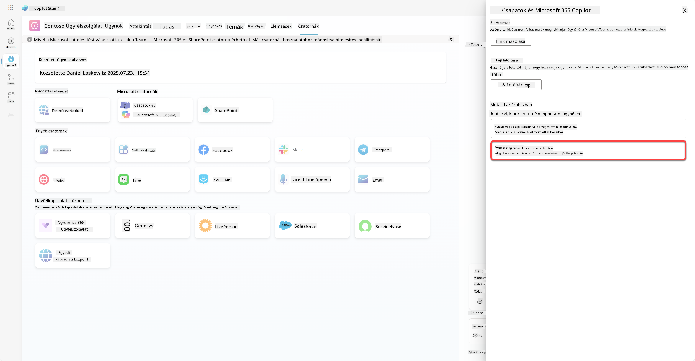

1. Válassza a **Beküldés adminisztrátori jóváhagyásra** lehetőséget.

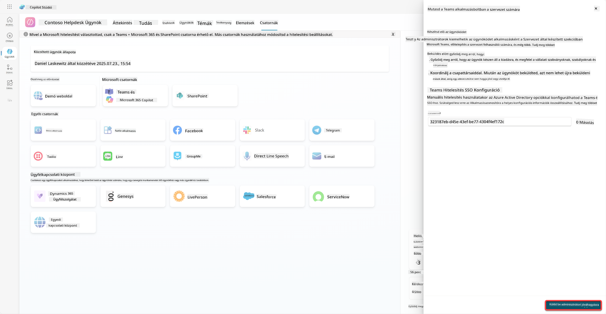

Most az adminisztrátornak kell jóváhagynia az ügynök beküldését. Ezt megtehetik úgy, hogy belépnek a Teams Admin Centerbe, és megkeresik a Contoso Helpdesk Agent alkalmazást. A képernyőképen látható, hogy mit látna az adminisztrátor a Teams Admin Centerben.

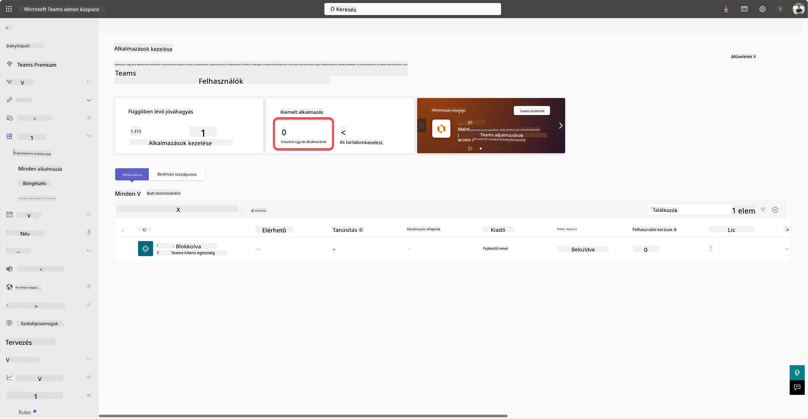

Az adminisztrátornak ki kell választania a Contoso Helpdesk Agentet, majd a *Közzététel* lehetőséget kell választania, hogy közzétegye az ügynököt mindenki számára.

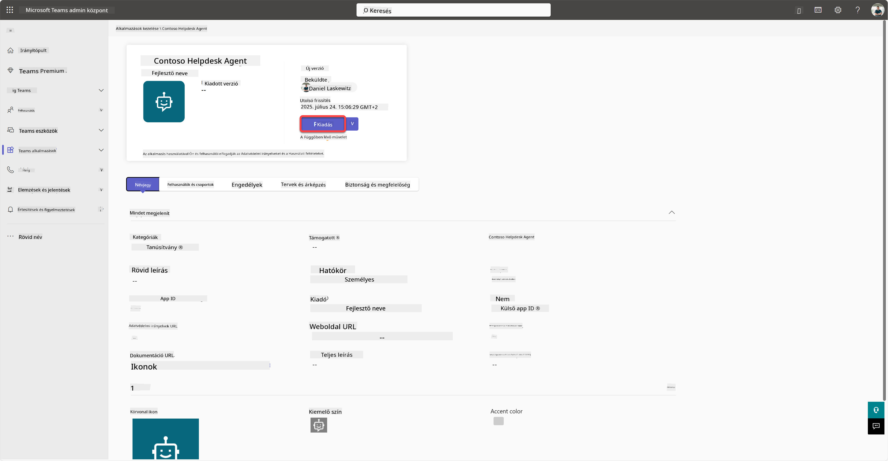

Amikor az adminisztrátor közzétette az ügynök beküldését, frissítheti a Copilot Studiót, és látnia kell az *elérhető az alkalmazásboltban* szalagcímet az elérhetőségi opciók között.

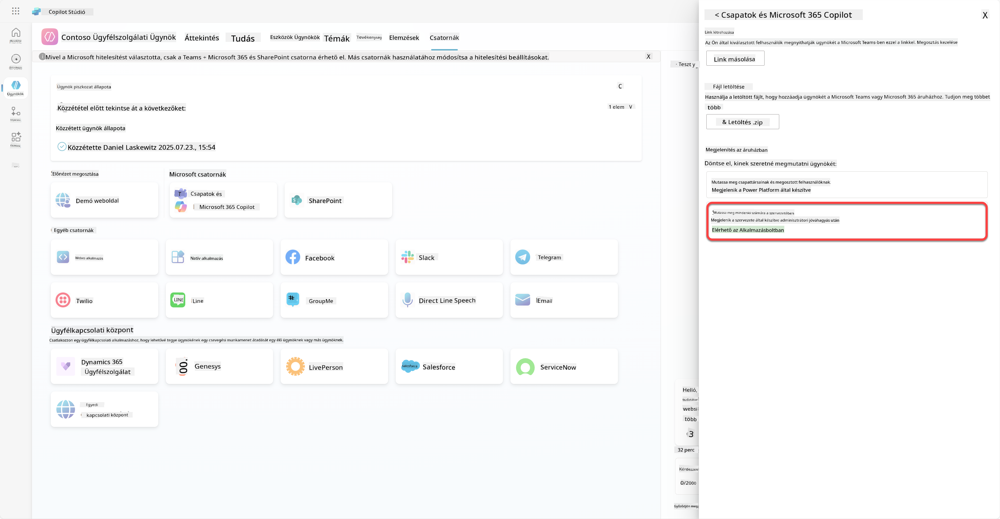

Itt még több lehetőség is van. Az adminisztrátor megváltoztathatja a globális beállítási szabályzatot, és automatikusan telepítheti a Contoso Helpdesk Agentet mindenki számára a bérlőn belül. Ezen felül - lehetősége van a Contoso Helpdesk Agentet a bal oldali sávhoz rögzíteni, hogy mindenki könnyen hozzáférhessen.

## ✅ Küldetés Teljesítve

🎉 **Gratulálunk!** Sikeresen közzétette az ügynököt, és hozzáadta a Teamshez és a Microsoft 365 Copilothoz! Következik a kurzus utolsó küldetése: A licencelés megértése.

⏭️ [Lépjen tovább a **Licencelés megértése** leckére](../12-understanding-licensing/README.md)

## 📚 Taktikai Források

🔗 [Közzétételi csatornák dokumentációja](https://learn.microsoft.com/microsoft-copilot-studio/publication-fundamentals-publish-channels)

---

**Felelősség kizárása**:  
Ez a dokumentum az [Co-op Translator](https://github.com/Azure/co-op-translator) AI fordítási szolgáltatás segítségével lett lefordítva. Bár törekszünk a pontosságra, kérjük, vegye figyelembe, hogy az automatikus fordítások hibákat vagy pontatlanságokat tartalmazhatnak. Az eredeti dokumentum az eredeti nyelvén tekintendő hiteles forrásnak. Kritikus információk esetén javasolt professzionális emberi fordítást igénybe venni. Nem vállalunk felelősséget semmilyen félreértésért vagy téves értelmezésért, amely a fordítás használatából eredhet.