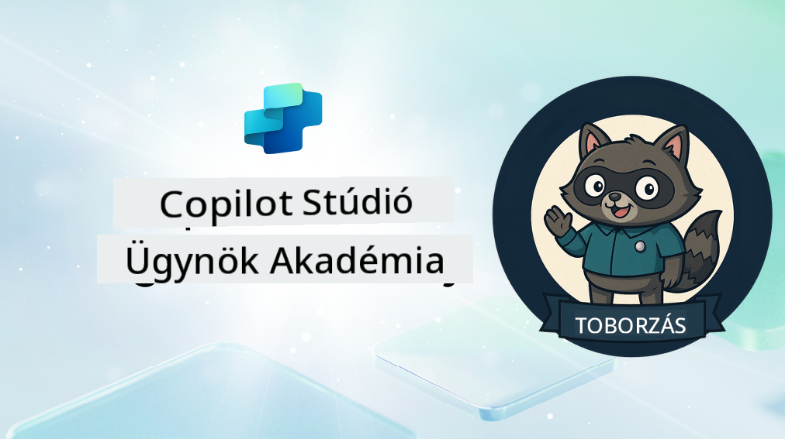

<!--
CO_OP_TRANSLATOR_METADATA:
{
  "original_hash": "8b5ecad9d5d073ea3f4c2b844e80f2e5",
  "translation_date": "2025-10-20T17:05:12+00:00",
  "source_file": "docs/recruit/README.md",
  "language_code": "hu"
}
-->
# Üdvözlünk, Újonc

**Üdvözlünk, Újonc.**  
A küldetésed—ha elfogadod—az, hogy elsajátítsd az ügynökök építésének művészetét a **Microsoft Copilot Studio** segítségével.

Ez a gyakorlati képzés a belépőd az **ügynökök világába**: a megalapozott utasításoktól kezdve az Adaptive Cards-okon és ügynökfolyamokon át megtanulhatod, hogyan építs, méretezz és telepíts intelligens ügynököket valós eszközök és felhasználási esetek segítségével.

---

## 🎯 Küldetés Célja

Az Agent Academy elvégzésével képes leszel:

- Megérteni, hogy mik az ügynökök a Microsoft Copilot Studio kontextusában
- Felfedezni, hogyan működnek együtt a Nagy Nyelvi Modellek (LLM-ek), a visszakeresés-alapú generálás (RAG) és az orkestráció egy ügynökben
- Építeni **deklaratív** és **egyedi ügynököket**
- Fejleszteni az ügynököket **Témákkal**, **Adaptive Cards-okkal** és **Ügynökfolyamokkal**
- Telepíteni az ügynököket a **Microsoft Teams**-be és a **Microsoft 365 Copilot**-ba

---

## 🧪 Előfeltételek

A küldetések teljesítéséhez szükséged lesz:

- Egy Microsoft 365 Fejlesztői bérlőre (SharePoint engedélyezve)
- Hozzáférésre a **Microsoft Copilot Studio**-hoz (próba vagy licencelt verzió)
- Opcionális: Alapvető ismeretek a SharePoint-ról, Power Platform-ról vagy Power Fx-ről

---

## 🧬 Kiknek Szól

Ez a kurzus ideális:

- Készítőknek és fejlesztőknek, akik felfedezik a **Copilot Studio**-t
- IT szakembereknek, akik **Microsoft 365 Copilot bővítményeket** építenek
- Power Platform rajongóknak, akik **szintet lépnének** intelligens ügynökökkel
- Bárkinek, aki **gyakorlati tanulást** részesíti előnyben

---

## 🧭 Tananyag Áttekintése

Ez az akadémia fokozatos leckékre van bontva—mindegyik egy terepi küldetésként szolgál, hogy fejleszd az ügynöképítési képességeidet.

| Lecke | Cím | Küldetés Tájékoztató |
|-------|-----|-----------------------|
| `00` | 🧰 [Kurzus Beállítása](./00-course-setup/README.md) | Állítsd be a fejlesztői környezetedet, Copilot Studio próbaverziót és SharePoint webhelyet |
| `01` | 🧠 [Bevezetés az Ügynökökbe](./01-introduction-to-agents/README.md) | Ismerd meg a beszélgetési AI fogalmait, LLM-eket, és az autonóm vs. deklaratív ügynököket |
| `02` | 🛠️ [Copilot Studio Alapok](./02-copilot-studio-fundamentals/README.md) | Ismerd meg az építőelemeket: tudás, készségek, autonómia |
| `03` | 👩‍💻 [Deklaratív Ügynök Létrehozása](./03-create-a-declarative-agent-for-M365Copilot/README.md) | Adj hozzá saját ügynököt a Microsoft 365 Copilot-hoz, megalapozott utasítással |
| `04` | 🧩 [Megoldás Létrehozása](./04-creating-a-solution/README.md) | Csomagold az ügynöködet egy újrahasznosítható megoldásba környezetkezeléshez |
| `05` | 🚀 [Előre Elkészített Ügynökök Használata](./05-using-prebuilt-agents/README.md) | Használj és testreszabj egy sablon ügynököt a gyorsabb beállításhoz |
| `06` | ✍️ [Egyedi Ügynök Létrehozása](./06-create-agent-from-conversation/README.md) | Hozz létre egy új Copilot-ot, amely tudásforrásokra épül |
| `07` | 🧠 [Téma Hozzáadása Triggerrel](./07-add-new-topic-with-trigger/README.md) | Használj Témákat egyedi kérdés/válasz útvonalak meghatározásához |
| `08` | 🪪 [Fejlesztés Adaptive Cards-okkal](./08-add-adaptive-card/README.md) | Építs egy Adaptive Card-ot Power Fx és SharePoint segítségével |
| `09` | 🔁 [Automatizálás Ügynökfolyamokkal](./09-add-an-agent-flow/README.md) | Használj Adaptive Card bemenetet háttérfolyamok indításához |
| `10` | 🧭 [Esemény Triggerek Hozzáadása](./10-add-event-triggers/README.md) | Engedélyezd az ügynököd számára, hogy autonóm módon cselekedjen eseményalapú logika segítségével |
| `11` | 📢 [Ügynök Közzététele](./11-publish-your-agent/README.md) | Telepítsd az ügynöködet a Microsoft Teams-be és a Microsoft 365 Copilot-ba |
| `12` | 🪪 [Licencelés Megértése](./12-understanding-licensing/README.md) | Ismerd meg, hogyan működik a licencelés és számlázás a Copilot Studio-val |
| `13` | 🚨 [Újonc Jelvény Megszerzése](./course-completion-badges-recruit/README.md) | Szerezd meg a jelvényedet és ünnepeld a teljesítményedet! |

!!! note
    ✅ A tananyag elvégzése után megszerzed az **Újonc** jelvényt.  
    🔓 Az **Operatív** és **Parancsnok** szintek a jövőbeli fázisokban lesznek elérhetők.

<!-- markdownlint-disable-next-line MD033 -->

---

**Felelősség kizárása**:  
Ez a dokumentum az [Co-op Translator](https://github.com/Azure/co-op-translator) AI fordítási szolgáltatás segítségével lett lefordítva. Bár törekszünk a pontosságra, kérjük, vegye figyelembe, hogy az automatikus fordítások hibákat vagy pontatlanságokat tartalmazhatnak. Az eredeti dokumentum az eredeti nyelvén tekintendő hiteles forrásnak. Fontos információk esetén javasolt professzionális emberi fordítást igénybe venni. Nem vállalunk felelősséget semmilyen félreértésért vagy téves értelmezésért, amely a fordítás használatából eredhet.