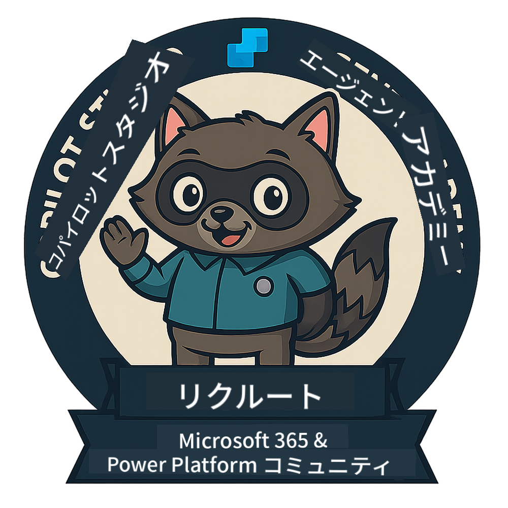
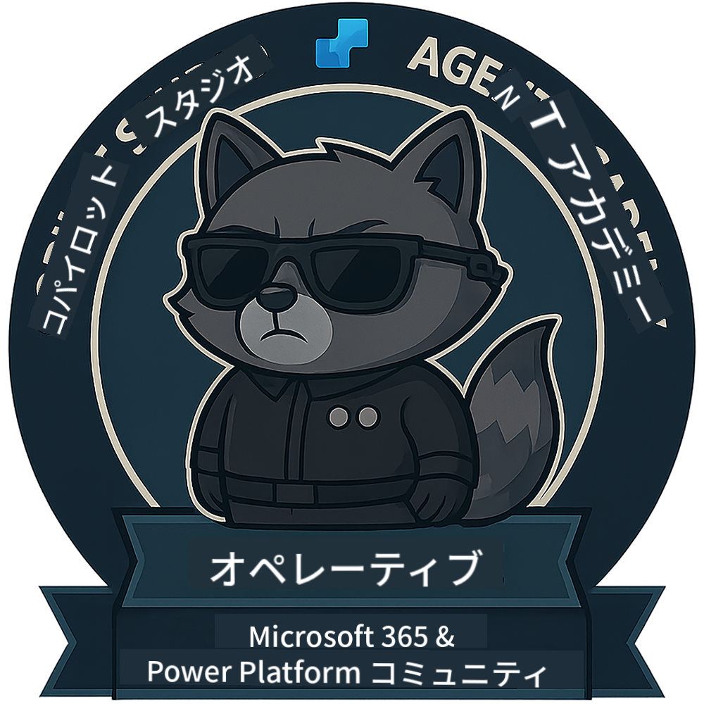
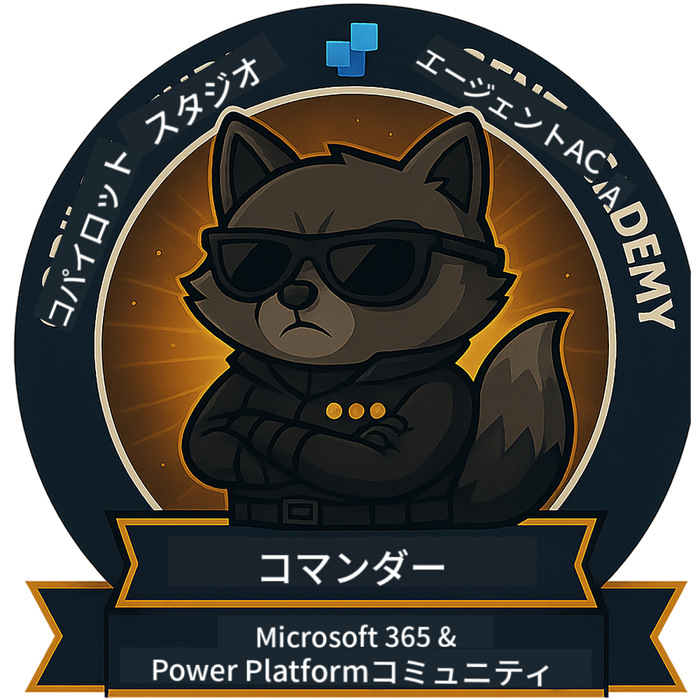

<!--
CO_OP_TRANSLATOR_METADATA:
{
  "original_hash": "15e57e059ce7689d602d7853187235cd",
  "translation_date": "2025-10-18T02:42:24+00:00",
  "source_file": "docs/index.md",
  "language_code": "ja"
}
-->
---
hide:
- navigation
---

# Copilot Studio Agent Academy

**Copilot Studio Agent Academyへようこそ。**

あなたのミッション—受け入れるかどうかはあなた次第—は、**Microsoft Copilot Studio**を使ってエージェントを構築する技術を習得することです。

この実践的なトレーニングは、**エージェントの世界**への入り口です。基礎的なプロンプトからAdaptive Cardsやエージェントフローまで、実際のツールやユースケースを使用して、インテリジェントなエージェントを構築、拡張、展開する方法を学びます。

---

## 🏅 ランク進行

**Copilot Studio Agent Academy**は、3つのエージェントランクを通じてスキルを向上させるための多段階トレーニングプログラムです。各レベルにはバッジがあり、責任が増していきます。

| ランク             | レベル | ビジュアル |
|------------------|:-----:|--------|
| 🟢 **Recruit**  [🚀 始める](https://aka.ms/agent-academy-recruit){ .md-button .md-button--primary }     | •     | { width="300" }     |
| 🔵 **Operative** (近日公開)   | ••    | { width="300" } |
| 🟡 **Commander** (近日公開)    | •••   | { width="300" } |

各レベルは前のレベルを基盤にしています。Recruitミッションを完了したら、次のエージェント資格をレベルアップする準備をしてください。

---

## 🎒 その他のコース

AIとエージェントについて学び続けるために、以下のコースもチェックしてください：

- [Microsoft Copilot Studio <3 MCP Lab](https://aka.ms/mcsmcplab)
- [Copilot Developer Camp](https://microsoft.github.io/copilot-camp/)
- [AI Agents for Beginners](https://microsoft.github.io/ai-agents-for-beginners/)
- [Model Context Protocol (MCP) For Beginners](https://github.com/microsoft/mcp-for-beginners)

---

## 🚑 問題

フィードバックを大変感謝しています！コメントや問題を共有するには、[issues list](https://github.com/microsoft/agent-academy/issues)をご利用ください。ありがとうございます！

---

## 📜 行動規範

このプロジェクトは[Microsoft Open Source Code of Conduct](https://opensource.microsoft.com/codeofconduct/)を採用しています。

!!! info "リソース:"

    - [Microsoft Open Source Code of Conduct](https://opensource.microsoft.com/codeofconduct/)
    - [Microsoft Code of Conduct FAQ](https://opensource.microsoft.com/codeofconduct/faq/)
    - 質問や懸念がある場合は[opencode@microsoft.com](mailto:opencode@microsoft.com)までお問い合わせください

---

[⭐️ リポジトリをスターする](https://github.com/microsoft/agent-academy){ .md-button .md-button--primary }

<!-- markdownlint-disable-next-line MD033 -->

---

**免責事項**:  
この文書はAI翻訳サービス[Co-op Translator](https://github.com/Azure/co-op-translator)を使用して翻訳されています。正確性を追求しておりますが、自動翻訳には誤りや不正確な部分が含まれる可能性があります。元の言語で記載された文書を正式な情報源としてご参照ください。重要な情報については、専門の人間による翻訳を推奨します。この翻訳の使用に起因する誤解や誤解について、当社は責任を負いません。