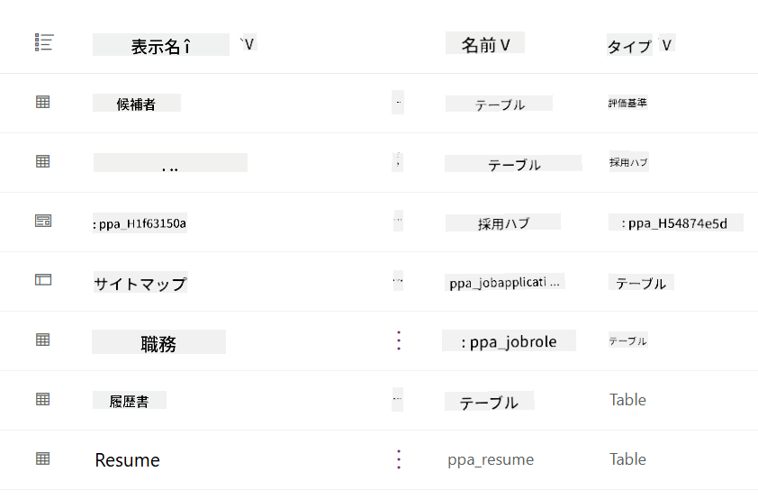
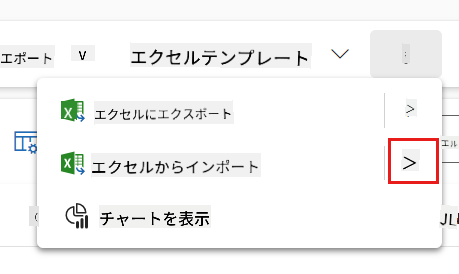
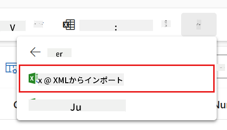
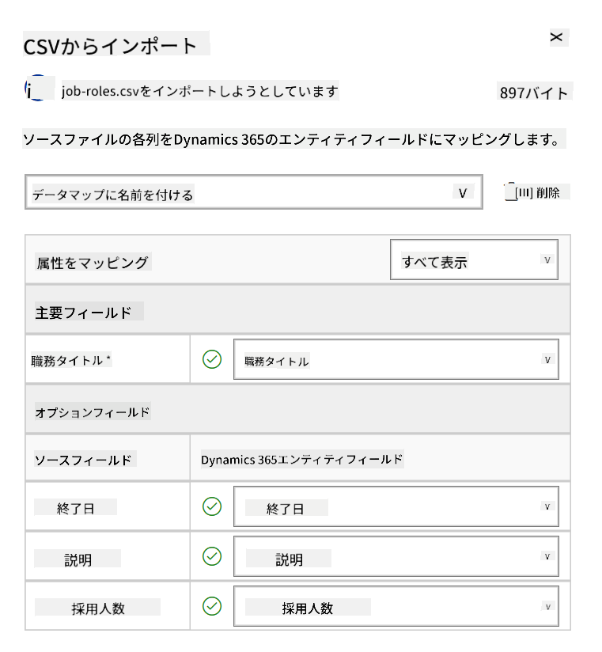
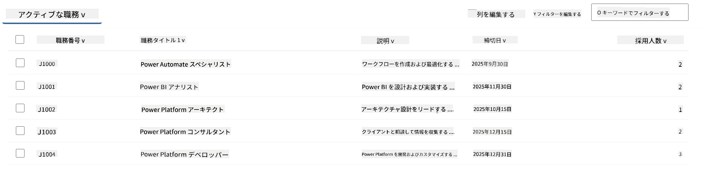
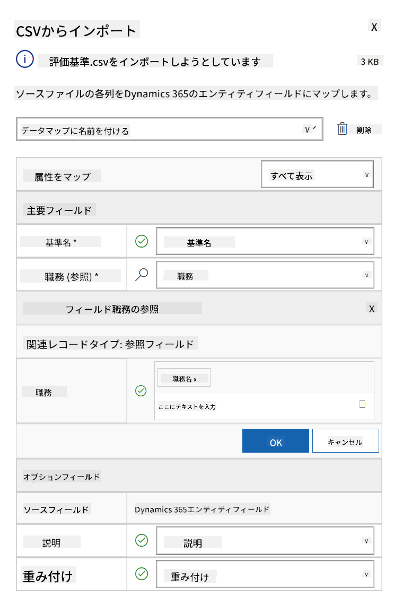
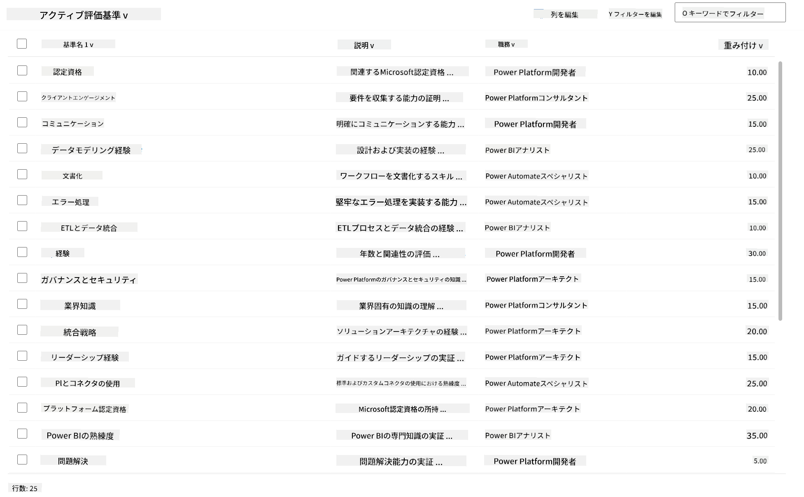

<!--
CO_OP_TRANSLATOR_METADATA:
{
  "original_hash": "2620cf9eaf09a3fc6be7fa31a3a62956",
  "translation_date": "2025-10-18T03:14:19+00:00",
  "source_file": "docs/operative-preview/01-get-started/README.md",
  "language_code": "ja"
}
-->
# 🚨 ミッション 01: 採用エージェントを始めよう

--8<-- "disclaimer.md"

## 🕵️‍♂️ コードネーム: `OPERATION TALENT SCOUT`

> **⏱️ 作戦時間枠:** `約45分`

## 🎯 ミッション概要

ようこそ、エージェント。あなたの最初の任務は **Operation Talent Scout** です。これは、組織が優秀な人材を特定し採用する方法を変革する、AIを活用した採用システムの基盤を構築することです。

この任務を受け入れる場合、Microsoft Copilot Studio を使用して包括的な採用管理システムを展開し設定する必要があります。事前に構築されたソリューションをインポートし、最初のAIエージェントである **採用エージェント** を作成します。このエージェントは、今後の採用業務の中心的な役割を果たします。

この初期展開は、Agent Academy Operativeプログラムを通じて強化していく指令センターを確立するものです。これを拠点として、次のミッションで専門エージェントのネットワーク全体を構築していきます。

---

## 🔎 目標

このミッションを完了することで、以下を達成します:

- **シナリオの理解**: 採用自動化の課題と解決策について包括的な知識を得る
- **ソリューションの展開**: 採用管理システムの基礎をインポートし設定する
- **エージェントの作成**: Agent Academy Operativeとして構築するシナリオの出発点となる採用エージェントを作成する

---

## 🔍 前提条件

このミッションを開始する前に、以下を確認してください:

- Copilot Studio ライセンス
- Microsoft Power Platform 環境へのアクセス
- ソリューションやエージェントを作成するための管理者権限

---

## 🏢 採用自動化シナリオの理解

このシナリオでは、Microsoft Copilot Studio を使用して企業が採用プロセスを改善し自動化する方法を示します。履歴書のレビュー、職務の推薦、面接資料の準備、候補者の評価などのタスクを処理するエージェントのシステムを紹介します。

### ビジネス価値

このソリューションは、HRチームが時間を節約し、より良い意思決定を行うのを助けます:

- メールで受け取った履歴書を自動的に処理
- 候補者のプロフィールに基づいて適切な職務を提案
- 各候補者に合わせた求人応募書類や面接ガイドを作成
- 安全性とモデレーション機能を組み込むことで、公平でコンプライアンスに準拠した採用を実現
- フィードバックを収集してソリューションを改善

### 仕組み

- 中央の **採用エージェント** がプロセスを調整し、Microsoft Dataverse にデータを保存します。
- **応募受付エージェント** が履歴書を読み取り、求人応募書類を作成します。
- **面接準備エージェント** が候補者の背景に基づいて面接質問や資料を作成します。
- システムはデモウェブサイトに公開され、関係者が操作できるようになります。

このシナリオは、AIを活用した自動化を通じて採用ワークフローを近代化し、透明性、公平性、効率性を維持したいと考える組織に最適です。

---

## 🧪 ラボ: 採用エージェントのセットアップ

この実践的なラボでは、採用自動化システムの基盤を構築します。まず、候補者、職務、採用ワークフローを管理するために必要なDataverseテーブルとデータ構造を含む事前設定済みのソリューションをインポートします。次に、これらのテーブルにサンプルデータを入力し、このモジュール全体での学習をサポートし、テストのための現実的なシナリオを提供します。最後に、Copilot Studioで採用エージェントを作成し、今後のミッションで追加するすべての機能の基盤となる基本的な会話インターフェースを設定します。

### 🧪 ラボ 1.1: ソリューションのインポート

1. **[Copilot Studio](https://copilotstudio.microsoft.com)** にアクセス
1. 左側のナビゲーションで **...** を選択し、**Solutions** を選択
1. 上部の **Import Solution** ボタンを選択
1. 事前に準備されたソリューションを **[ダウンロード](https://raw.githubusercontent.com/microsoft/agent-academy/refs/heads/main/docs/operative-preview/01-get-started/assets/Operative_1_0_0_0.zip)**
1. **Browse** を選択し、前のステップでダウンロードしたソリューションを選択
1. **Next** を選択
1. **Import** を選択

!!! success
    成功すると、完了時に次のメッセージが表示される緑色の通知バーが表示されます:  
    "Solution "Operative" imported successfully."

ソリューションがインポートされたら、ソリューションの表示名 (`Operative`) を選択して、インポートした内容を確認してください。



以下のコンポーネントがインポートされます:

| 表示名 | 種類 | 説明 |
|-------------|------|-------------|
| Candidate | テーブル | 候補者情報 |
| Evaluation Criteria | テーブル | 職務の評価基準 |
| Hiring Hub | モデル駆動型アプリ | 採用プロセスを管理するアプリ |
| Hiring Hub | サイトマップ | Hiring Hub アプリのナビゲーション構造 |
| Job Application | テーブル | 求人応募 |
| Job Role | テーブル | 職務 |
| Resume | テーブル | 候補者の履歴書 |

このラボの最後のタスクとして、ページ上部の **Publish all customizations** ボタンを選択してください。

### 🧪 ラボ 1.2: サンプルデータのインポート

このラボでは、ラボ1.1でインポートしたいくつかのテーブルにサンプルデータを追加します。

#### インポートするファイルをダウンロード

1. **[評価基準のCSVファイルをダウンロード](https://raw.githubusercontent.com/microsoft/agent-academy/refs/heads/main/docs/operative-preview/01-get-started/assets/evaluation-criteria.csv)**
1. **[職務のCSVファイルをダウンロード](https://raw.githubusercontent.com/microsoft/agent-academy/refs/heads/main/docs/operative-preview/01-get-started/assets/job-roles.csv)**

#### 職務サンプルデータのインポート

1. 前のラボでインポートしたソリューションに戻る
1. **Hiring Hub** モデル駆動型アプリを選択し、行の前にあるチェックマークを選択
1. 上部の **Play** ボタンを選択

    !!! warning
        再度ログインを求められる場合があります。その場合はログインしてください。その後、Hiring Hub アプリが表示されるはずです。

1. 左側のナビゲーションで **Job Roles** を選択
1. コマンドバーで **More** アイコン（縦に並んだ3つの点）を選択
1. *Import from Excel* の右矢印を選択

    

1. **Import from CSV** を選択

    

1. **Choose File** ボタンを選択し、ダウンロードした **job-roles.csv** ファイルを選択して **Open** を選択
1. **Next** を選択
1. 次のステップはそのままにして **Review Mapping** を選択

    

1. マッピングが正しいことを確認し、**Finish Import** を選択

    !!! info
        これによりインポートが開始され、進行状況を追跡するか、**Done** を選択してプロセスを完了できます。

1. **Done** を選択

これには少し時間がかかる場合がありますが、**Refresh** ボタンを押してインポートが成功したか確認できます。



#### 評価基準サンプルデータのインポート

1. 左側のナビゲーションで **Evaluation Criteria** を選択
1. コマンドバーで **More** アイコン（縦に並んだ3つの点）を選択
1. *Import from Excel* の右矢印を選択

    

1. **Import from CSV** を選択

    

1. **Choose File** ボタンを選択し、ダウンロードした **evaluation-criteria.csv** ファイルを選択して **Open** を選択
1. **Next** を選択
1. 次のステップはそのままにして **Review Mapping** を選択

    

1. Job Role フィールドの横にある虫眼鏡(🔎アイコン)を選択
1. **Job Title** が選択されていることを確認し、選択されていない場合は追加
1. **OK** を選択
1. 残りのマッピングが正しいことを確認し、**Finish Import** を選択

    !!! info
        これにより再度インポートが開始され、進行状況を追跡するか、**Done** を選択してプロセスを完了できます。

1. **Done** を選択

これには少し時間がかかる場合がありますが、**Refresh** ボタンを押してインポートが成功したか確認できます。



### 🧪 ラボ 1.3: 採用エージェントの作成

前提条件のセットアップが完了したので、いよいよ本作業に取り掛かりましょう！まずは採用エージェントを追加します。

1. **[Copilot Studio](https://copilotstudio.microsoft.com)** にアクセスし、ソリューションとデータをインポートしたのと同じ環境にいることを確認
1. 左側のナビゲーションで **Agents** を選択
1. **New Agent** を選択
1. **Configure** を選択
1. **Name** に以下を入力:

    ```text
    Hiring Agent
    ```

1. **Description** に以下を入力:

    ```text
    Central orchestrator for all hiring activities
    ```

1. 右上の *Create* ボタンの横にある **...** を選択
1. **Update advanced settings** を選択
1. **Solution** として `Operative` を選択
1. **Update** を選択
1. 右上の **Create** を選択

これで、Operativeコース全体で使用する採用エージェントが作成されます。

---

## 🎉 ミッション完了

ミッション01が完了しました！以下のスキルを習得しました:

✅ **シナリオの理解**: 採用自動化の課題と解決策についての包括的な知識  
✅ **ソリューションの展開**: 採用管理システムの基礎をインポートし設定  
✅ **エージェントの作成**: Agent Academy Operativeとして構築するシナリオの出発点となる採用エージェントを作成  

次は [ミッション02](../02-multi-agent/README.md): 接続されたエージェントでマルチエージェント対応にする。

---

## 📚 戦術的リソース

📖 [Microsoft Copilot Studio - エージェントの作成](https://learn.microsoft.com/microsoft-copilot-studio/authoring-first-bot)  
📖 [Microsoft Dataverse ドキュメント](https://learn.microsoft.com/power-apps/maker/data-platform)

---

**免責事項**:  
この文書はAI翻訳サービス[Co-op Translator](https://github.com/Azure/co-op-translator)を使用して翻訳されています。正確性を追求しておりますが、自動翻訳には誤りや不正確な部分が含まれる可能性があります。元の言語で記載された文書を正式な情報源としてお考えください。重要な情報については、専門の人間による翻訳を推奨します。この翻訳の使用に起因する誤解や誤解について、当社は責任を負いません。