<!--
CO_OP_TRANSLATOR_METADATA:
{
  "original_hash": "616d142d4fb5f45d2a168fad6c1f9545",
  "translation_date": "2025-10-18T03:27:21+00:00",
  "source_file": "docs/operative-preview/07-multimodal-prompts/README.md",
  "language_code": "ja"
}
-->
# 🚨 ミッション07: マルチモーダルプロンプトで履歴書内容を抽出

--8<-- "disclaimer.md"

## 🕵️‍♂️ コードネーム: `DOCUMENT RESUME RECON`

> **⏱️ 作戦時間枠:** `~45分`

## 🎯 ミッション概要

ようこそ、オペレーターの皆さん。これまでのミッションで強力なエージェントオーケストレーションスキルを習得してきましたが、今回はゲームチェンジとなる能力を解き放つ時です。それは、**マルチモーダルドキュメント分析**です。

あなたの任務は、**Document Resume Recon**、つまりどんなドキュメントからでも正確に構造化されたデータを抽出することです。エージェントはテキストを簡単に処理できますが、現実世界ではPDFや画像、複雑なドキュメントを日々扱う必要があります。履歴書が山積みになり、請求書の処理が必要で、フォームは即座にデジタル化されるべきです。

このミッションを通じて、テキストのみのエージェントビルダーから**マルチモーダルのエキスパート**へと進化します。AIを設定して、人間のアナリストのようにドキュメントを読み取り理解する能力を身につけますが、AIのスピードと一貫性を持っています。ミッション終了時には、採用ワークフローに統合された完全な履歴書抽出システムを構築することができるでしょう。

ここで学ぶ技術は、次のミッションでの高度なデータ基盤操作に不可欠です。

## 🔎 目標

このミッションでは以下を学びます：

1. マルチモーダルプロンプトとは何か、そして異なるAIモデルを使用するタイミング
1. 画像やドキュメント入力を使用したプロンプトの設定方法
1. JSON形式でプロンプト出力をフォーマットし、構造化データを抽出する方法
1. ドキュメント分析におけるプロンプトエンジニアリングのベストプラクティス
1. マルチモーダルプロンプトをAgent Flowsに統合する方法

## 🧠 マルチモーダルプロンプトの理解

### プロンプトが「マルチモーダル」となる理由

従来のプロンプトはテキストのみを扱います。しかし、マルチモーダルプロンプトは複数の種類のコンテンツを処理できます：

- **テキスト**: 指示や内容
- **画像**: 写真、スクリーンショット、チャート、図表 (.PNG, .JPG, .JPEG)  
- **ドキュメント**: 請求書、履歴書、フォーム (.PDF)

この能力により、履歴書の分析、請求書の処理、フォームからのデータ抽出などの強力なシナリオが可能になります。

### マルチモーダルがワークフローに重要な理由

日々、組織は以下のようなドキュメント処理の課題に直面しています：

- **履歴書のスクリーニング**: 数百の履歴書を手作業で読むのは時間がかかる
- **請求書処理**: 様々な形式のドキュメントからベンダー情報、金額、日付を抽出する
- **フォーム分析**: 紙のフォームをデジタルデータに変換する

マルチモーダルプロンプトは、AIの言語理解能力と視覚分析能力を組み合わせることでこれらのボトルネックを解消します。これにより、AIがテキストと同じくらい効果的にドキュメントを処理できるようになります。

### 一般的なビジネスシナリオ

マルチモーダルプロンプトの適用例を以下に示します：

| シナリオ                | タスク                                                                                                                                      | 出力フィールドの例                                                                                   |
|-------------------------|-------------------------------------------------------------------------------------------------------------------------------------------|---------------------------------------------------------------------------------------------------------|
| **履歴書のスクリーニング**    | 候補者の名前、メール、電話番号、現在の職位、経験年数、主要スキルを抽出する。                                                 | 候補者名、メールアドレス、電話番号、現在の職位、経験年数、主要スキル         |
| **請求書処理**  | ベンダー情報、請求日、合計金額、請求項目を抽出する。                                                 | ベンダー名、請求日、合計金額、請求項目                                             |
| **フォーム分析**       | この申請フォームを分析し、記入されたすべてのフィールドを抽出する。                                                                              | フィールド名 (例: 申請者名)、入力値 (例: 山田太郎)、...                                  |
| **IDドキュメントの確認** | 名前、ID番号、有効期限、住所を抽出し、すべてのテキストが明確に読み取れることを確認し、不明瞭な部分をフラグ付けする。 | 氏名、ID番号、有効期限、住所、不明瞭な部分のフラグ                        |

## ⚙️ AI Builderでのモデル選択

AI Builderは特定のタスクに最適化された異なるモデルを提供します。どのモデルを使用するかを理解することが成功の鍵です。

!!! note "2025年9月時点での正確な情報"
    AI Builderモデルは定期的に更新されるため、最新の[AI Builderモデル設定ドキュメント](https://learn.microsoft.com/ai-builder/prompt-modelsettings)を確認してください。

### モデル比較

以下のすべてのモデルは視覚およびドキュメント処理をサポートしています。

| モデル | 💰コスト | ⚡速度 | ✅最適な用途 |
|-------|------|-------|----------|
| **GPT-4.1 mini** | 基本 (最もコスト効率が良い) | 高速 | 標準的なドキュメント処理、要約、予算重視のプロジェクト |
| **GPT-4.1** | 標準 | 中速 | 複雑なドキュメント、高度なコンテンツ作成、高精度が必要な場合 |
| **o3** | プレミアム | 遅い (理由を優先) | データ分析、批判的思考、高度な問題解決 |
| **GPT-5 chat** | 標準 | 強化された速度 | 最新のドキュメント理解、最高の応答精度 |
| **GPT-5 reasoning** | プレミアム | 遅い (複雑な分析) | 最も高度な分析、計画、高度な推論 |

### 温度設定の説明

温度はAIの応答がどれだけ創造的または予測可能であるかを制御します：

- **温度0**: 最も予測可能で一貫性のある結果 (データ抽出に最適)
- **温度0.5**: 創造性と一貫性のバランス  
- **温度1**: 最大の創造性 (コンテンツ生成に最適)

ドキュメント分析には、**温度0**を使用して一貫したデータ抽出を確保してください。

## 📊 出力形式: テキスト vs JSON

適切な出力形式を選択することは、後続の処理において重要です。

### テキスト出力を使用する場合

テキスト出力は以下の場合に適しています：

- 人間が読みやすい要約
- 簡単な分類
- 構造化処理が不要なコンテンツ

### JSON出力を使用する場合

JSON出力は以下の場合に不可欠です：

- 構造化データ抽出
- データベースやシステムとの統合
- Power Automateフロー処理
- 一貫したフィールドマッピング

### JSONのベストプラクティス

1. **明確なフィールド名を定義する**: 説明的で一貫性のある命名を使用
1. **例を提供する**: 各フィールドのサンプル出力と値を含める
1. **データ型を指定する**: 日付、数値、テキストの例を含める
1. **欠損データを処理する**: nullまたは空の値に対応する計画を立てる
1. **構造を検証する**: 様々なドキュメントタイプでテストする

### ドキュメント品質の考慮事項

- **解像度**: 画像が鮮明で読みやすいことを確認
- **向き**: 処理前にドキュメントを正しい向きに回転させる
- **形式のサポート**: 特定のドキュメントタイプ (PDF, JPG, PNG) でテストする
- **サイズ制限**: 環境内のファイルサイズ制限に注意する

### パフォーマンスの最適化

- **適切なモデルを選択する**: 必要に応じてモデルをアップグレードする
- **プロンプトを最適化する**: 短く明確な指示が通常はより良い結果をもたらす
- **エラー処理**: 処理できないドキュメントに対応する計画を立てる
- **コストを監視する**: 異なるモデルは異なる量のAI Builderクレジットを消費する

## 🧪 ラボ7: 履歴書抽出システムの構築

マルチモーダルの知識を実践に移す時が来ました。候補者のドキュメントを分析し、採用ワークフローのために構造化データに変換する包括的な履歴書抽出システムを構築します。

### このミッションを完了するための前提条件

1. **以下のいずれか**が必要です：

    - **ミッション06を完了**し、マルチエージェント採用システムを準備していること、**または**
    - **ミッション07スターターソリューションをインポート**していること。 [ミッション07スターターソリューションをダウンロード](https://aka.ms/agent-academy)

1. [テスト履歴書](https://download-directory.github.io/?url=https://github.com/microsoft/agent-academy/tree/main/operative/sample-data/resumes&filename=operative_sampledata)からサンプル履歴書ドキュメントを取得すること

!!! note "ソリューションのインポートとサンプルデータ"
    スターターソリューションを使用する場合、ソリューションとサンプルデータを環境にインポートする方法については[ミッション01](../01-get-started/README.md)を参照してください。

### 7.1 マルチモーダルプロンプトを作成する

最初の目標: 履歴書ドキュメントを分析し、構造化データを抽出するプロンプトを作成する。

1. [Copilot Studio](https://copilotstudio.microsoft.com)にサインインし、左ナビゲーションから**ツール**を選択します。

1. **+ 新しいツール**を選択し、**プロンプト**を選択します。  
    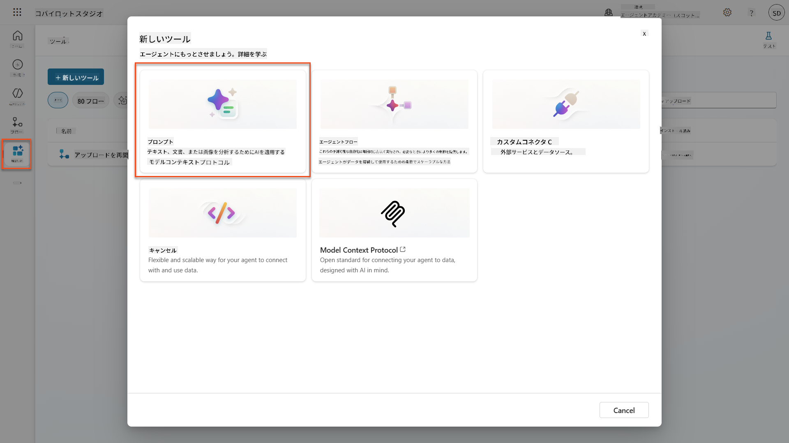

1. デフォルトのタイムスタンプ名 (例: *Custom prompt 09/04/2025, 04:59:11 PM*) を `Summarize Resume` に**名前変更**します。

1. 指示フィールドに以下のプロンプトを追加します：

    ```text
    You are tasked with extracting key candidate information from a resume and cover letter to facilitate matching with open job roles and creating a summary for application review.
    
    Instructions:
    1. Extract Candidate Details:
        - Identify and extract the candidate’s full name.
        - Extract contact information, specifically the email address.
    2. Create Candidate Summary:
        - Summarize the candidate’s profile as multiline text (max 2000 characters) with the following sections:
            - Candidate name
            - Role(s) applied for if present
            - Contact and location
            - One-paragraph summary
            - Experience snapshot (last 2–3 roles with outcomes)
            - Key projects (1–3 with metrics)
            - Education and certifications
            - Top skills (Top 10)
            - Availability and work authorization
    
    Guidelines:
    - Extract information only from the provided resume and cover letter documents.
    - Ensure accuracy in identifying all details such as contact details and skills.
    - The summary should be concise but informative, suitable for quick application review.
    
    Resume: /document
    CoverLetter: /text
    ```

    !!! tip "Copilotの支援を活用する"
        "Get started with Copilot"を使用して自然言語でプロンプトを生成できます。Copilotに履歴書を要約するプロンプトを作成するよう依頼してみてください！

1. 入力パラメータを**設定**します：

    | パラメータ | タイプ | 名前 | サンプルデータ |
    |-----------|------|------|-------------|
    | 履歴書 | 画像またはドキュメント | Resume | テストデータフォルダからサンプル履歴書をアップロード |
    | カバーレター | テキスト | CoverLetter | これは履歴書です！ |

1. **テスト**を選択して、プロンプトからの初期テキスト出力を確認します。  
    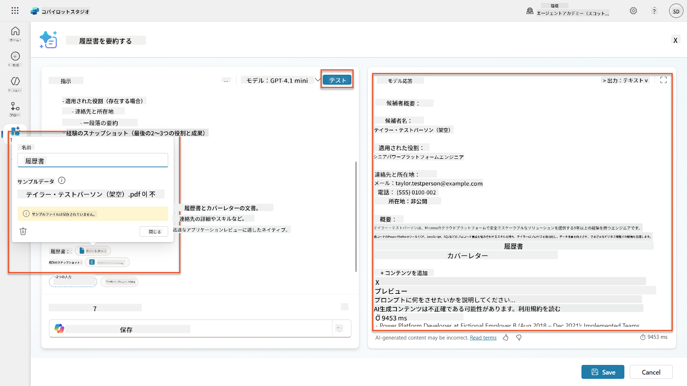

### 7.2 JSON出力を設定する

次に、プロンプトをプレーンテキストではなく構造化されたJSONデータを出力するように変換します。

1. プロンプト指示の最後に以下のJSON形式の仕様を追加します：

    ```text
    Output Format:
    Provide the output in valid JSON format with the following structure:
    
    {
        "CandidateName": "string",
        "Email": "string",
        "Summary": "string max 2000 characters",
        "Skills": [ {"item": "Skill 1"}, {"item": "Skill 2"}],
        "Experience": [ {"item": "Experience 1"}, {"item": "Experience 2"}],
    }
    ```

1. **出力**設定を「テキスト」から**JSON**に変更します。

1. 再度**テスト**を選択して、出力がJSON形式でフォーマットされていることを確認します。  
    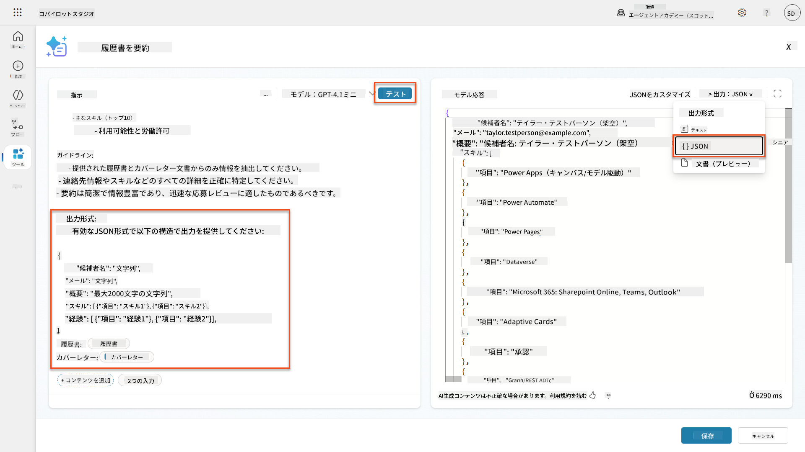

1. **オプション:** 異なるAIモデルを試して出力の違いを確認し、デフォルトモデルに戻ります。

1. **保存**を選択してプロンプトを作成します。

1. **エージェントでの使用を設定**ダイアログで、**キャンセル**を選択します。

    !!! info "なぜこれをツールとして追加しないのか"
        このプロンプトはツールとして直接使用するのではなく、Agent Flowで使用します。これにより、データ処理ワークフローをより細かく制御できます。

### 7.3 プロンプトをAgent Flowに追加する

Dataverseに保存された履歴書を処理するためにプロンプトを使用するAgent Flowを作成します。

!!! tip "Agent Flowの式"
    ノードの名前付けや式の入力方法を正確に指示に従うことが非常に重要です。式は前のノードをその名前で参照するためです！[RecruitのAgent Flowミッション](../../recruit/09-add-an-agent-flow/README.md#you-mentioned-expressions-what-are-expressions)で簡単に復習できます！

1. Copilot Studio内の**採用エージェント**に移動します。

1. **エージェント**タブを選択し、子エージェント**Application Intake Agent**を選択します。

1. **ツール**パネル内で、**+ 追加** → **+ 新しいツール** → **Agent flow**を選択します。

1. エージェントがフローを呼び出すノードで、**+ 入力を追加**を使用して以下のパラメータを追加します：

    | タイプ | 名前 | 説明 |
    |------|------|-------------|
    | テキスト | ResumeNumber | 必ず[ResumeNumber]を使用してください。この値は常にRで始まる必要があります |

1. 最初のノードの下にある**+**アクション挿入アイコンを選択し、**Dataverse**を検索して**もっと見る**を選択し、**行をリストする**アクションを見つけます。

1. **行をリストする**ノードの**省略記号 (...)**を選択し、**名前変更**を選択して`Get Resume Record`に変更し、以下のパラメータを設定します：

    | プロパティ | 設定方法 | 値 |
    |----------|------------|-------|
    | **テーブル名** | 選択 | Resumes |
    | **行をフィルタリング** | 動的データ (雷アイコン) | `ppa_resumenumber eq 'ResumeNumber'` **ResumeNumber**を**エージェントがフローを呼び出す** → **ResumeNumber**に置き換え |
    | **行数** | 入力 | 1 |

    !!! tip "クエリを最適化しよう！"
        この技術を本番環境で使用する場合、Agent Flowで必要な列のみを選択するように制限するべきです。

    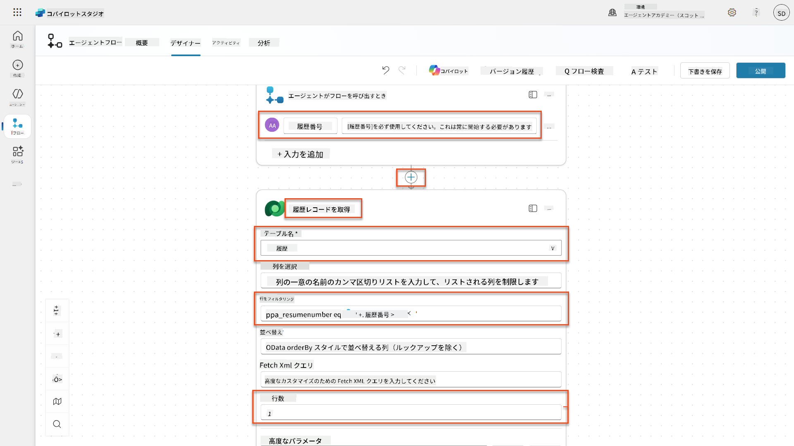

1. **Get Resume Record**ノードの下にある**+**アクション挿入アイコンを選択し、**Dataverse**を検索して**もっと見る**を選択し、**ファイルまたは画像をダウンロードする**アクションを見つけます。

    !!! tip "正しいアクションを選択しよう！"
        "選択された環境から"で終わるアクションを選択しないようにしてください。

1. 前と同様に、アクションの名前を`Download Resume`に変更し、以下のパラメータを設定します：

    | プロパティ | 設定方法 | 値 |
    |
| **プロンプト** | 選択 | 履歴書を要約 |
| **カバーレター** | 式 (fx アイコン) | `first(body('Get_Resume_Record')?['value'])?['ppa_coverletter']` |
| **履歴書** | 動的データ (稲妻アイコン) | 履歴書をダウンロード → ファイルまたは画像コンテンツ |

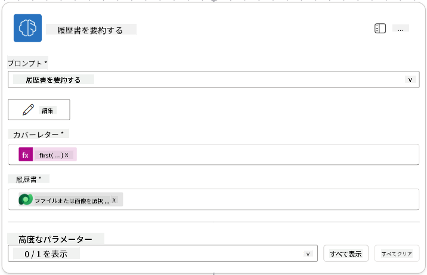

!!! tip "プロンプトのパラメータ"
    入力パラメータとして設定したものと同じパラメータを入力していることに注意してください。

### 7.4 候補者レコードを作成する

次に、プロンプトから得た情報を使用して、まだ存在しない場合は新しい候補者レコードを作成する必要があります。

1. **+** 挿入アクションアイコンを選択し、履歴書要約ノードの下に配置します。**Dataverse**を検索し、**さらに表示**を選択して、**行の一覧**アクションを見つけます。

1. ノードの名前を`Get Existing Candidate`に変更し、以下のパラメータを設定します：

    | プロパティ | 設定方法 | 値 |
    |------------|----------|-----|
    | **テーブル名** | 選択 | Candidates |
    | **行のフィルター** | 動的データ (稲妻アイコン) | `ppa_email eq 'Email'`  **置換** `Email` を **Summarize Resume → Email** に変更 |
    | **行数** | 入力 | 1 |

    

1. **+** 挿入アクションアイコンを選択し、Get Existing Candidateノードの下に配置します。**Control**を検索し、**さらに表示**を選択して、**条件**アクションを見つけます。

1. 条件プロパティで以下の条件を設定します：

    | 条件 | 演算子 | 値 |
    |------|--------|-----|
    | 式 (fx アイコン): `length(outputs('Get_Existing_Candidate')?['body/value'])` | 等しい | 0 |

    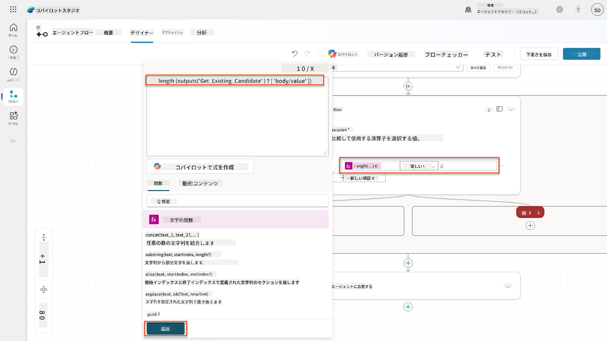

1. **True**ブランチ内で**+** 挿入アクションアイコンを選択し、**Dataverse**を検索して**さらに表示**を選択し、**新しい行を追加**アクションを見つけます。

1. ノードの名前を`Add a New Candidate`に変更し、以下のパラメータを設定します：

    | プロパティ | 設定方法 | 値 |
    |------------|----------|-----|
    | **テーブル名** | 選択 | Candidates |
    | **候補者名** | 動的データ (稲妻アイコン) | Summarize Resume → `CandidateName` |
    | **メール** | 動的データ (稲妻アイコン) | Summarize Resume → `Email` |

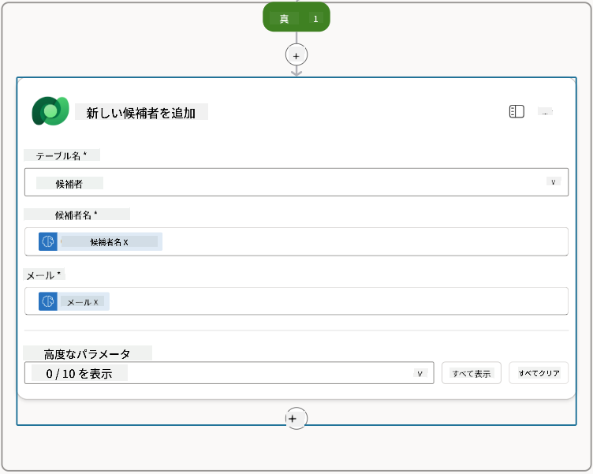

### 7.5 履歴書を更新し、フロー出力を設定する

フローを完成させ、履歴書レコードを更新し、エージェントに返すデータを設定します。

1. 条件の下に**+** 挿入アクションアイコンを選択し、**Dataverse**を検索して**さらに表示**を選択し、**行を更新**アクションを見つけます。

1. タイトルを選択してノードの名前を`Update Resume`に変更し、**すべて表示**を選択して以下のパラメータを設定します：

    | プロパティ | 設定方法 | 値 |
    |------------|----------|-----|
    | **テーブル名** | 選択 | Resumes |
    | **行ID** | 式 (fx アイコン) | `first(body('Get_Resume_Record')?['value'])?['ppa_resumeid']` |
    | **要約** | 動的データ (稲妻アイコン) | Summarize Resume → Text |
    | **候補者 (Candidates)** | 式 (fx アイコン) | `if(equals(length(outputs('Get_Existing_Candidate')?['body/value']), 1), first(outputs('Get_Existing_Candidate')?['body/value'])?['ppa_candidateid'], outputs('Add_a_New_Candidate')?['body/ppa_candidateid'])` |

    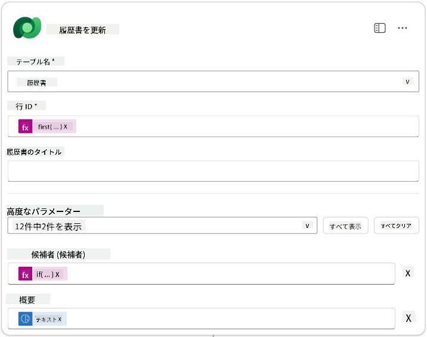

1. **エージェントに応答する**ノードを選択し、**+ 出力を追加**を使用して以下を設定します：

    | タイプ | 名前              | 設定方法                      | 値                                                        | 説明                                            |
    |-------|-------------------|-------------------------------|-----------------------------------------------------------|------------------------------------------------|
    | テキスト | `CandidateName`   | 動的データ (稲妻アイコン) | Summarize Resume → さらに表示 → CandidateName              | 履歴書に記載された[CandidateName]               |
    | テキスト | `CandidateEmail`  | 動的データ (稲妻アイコン) | Summarize Resume → さらに表示 → Email                      | 履歴書に記載された[CandidateEmail]              |
    | テキスト | `CandidateNumber` | 式 (fx アイコン)            | `concat('ppa_candidates/', if(equals(length(outputs('Get_Existing_Candidate')?['body/value']), 1), first(outputs('Get_Existing_Candidate')?['body/value'])?['ppa_candidateid'], outputs('Add_a_New_Candidate')?['body/ppa_candidateid']) )` | 新規または既存の候補者の[CandidateNumber]       |
    | テキスト | `ResumeSummary`   | 動的データ (稲妻アイコン) | Summarize Resume → さらに表示 → body/responsev2/predictionOutput/structuredOutput | 履歴書の要約と詳細をJSON形式で                  |

    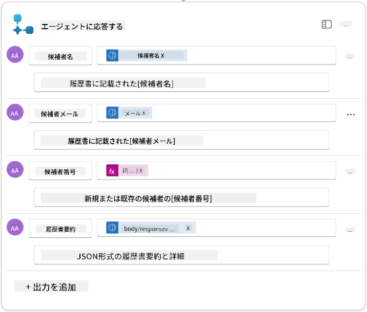

1. 右上の**下書きを保存**を選択します。エージェントフローは以下のように表示されるはずです。  
    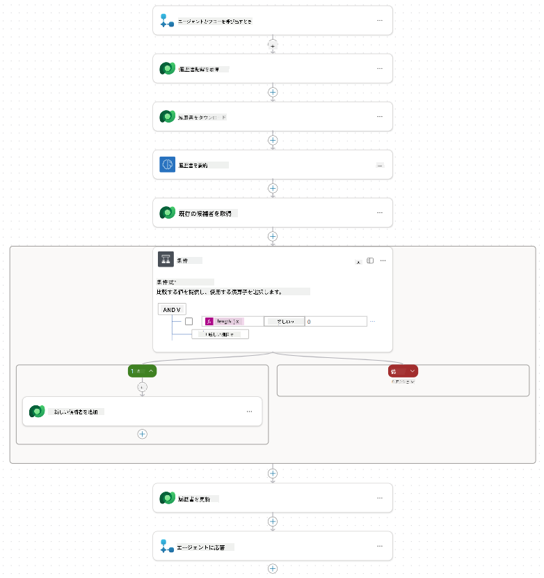

1. **概要**タブを選択し、**詳細**パネルで**編集**を選択します。

    1. **フロー名**：`Summarize Resume`
    1. **説明**：

        ```text
        Summarize an existing Resume stored in Dataverse using a [ResumeNumber] as input, return the [CandidateNumber], and resume summary JSON
        ```

1. **保存**を選択します。

1. 再び**デザイナー**タブを選択し、**公開**を選択します。

### 7.6 フローをエージェントに接続する

次に、フローをツールとして追加し、エージェントが使用できるように設定します。

1. Copilot Studio内で**採用エージェント**を開きます。

1. **エージェント**タブを選択し、**応募受付エージェント**を開きます。

1. **ツール**パネルを選択し、**+ ツールを追加** -> **フロー** -> **Summarize Resume** **(エージェントフロー)** を選択します。

1. **追加して設定**を選択します。

1. ツール設定を以下のように設定します：

    | 設定 | 値 |
    |------|----|
    | **説明** | Dataverseに保存された既存の履歴書を[ResumeNumber]を入力として要約し、[CandidateNumber]と履歴書要約JSONを返します |
    | **このツールが使用される条件** | トピックまたはエージェントによって参照された場合のみ |

1. **保存**を選択します。  
    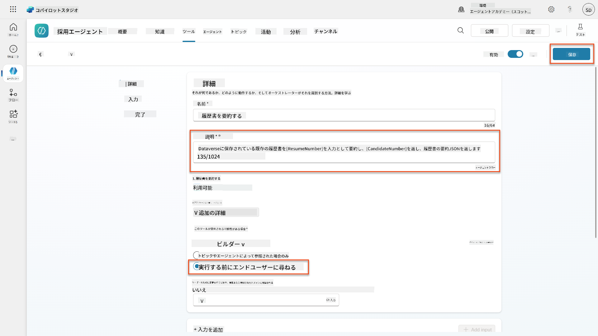

1. 採用エージェント内のツールを選択すると、**応募受付エージェント**が使用可能なツールが両方表示されます。  
    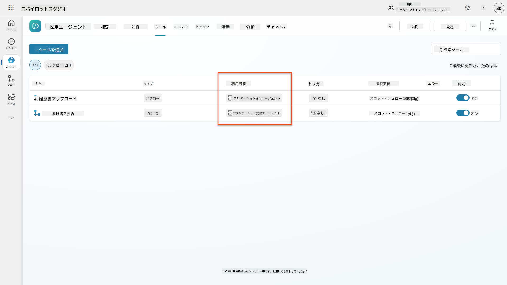

1. **応募受付子エージェント**の指示に移動し、**アップロード後**のステップを以下のように変更します：

    ```text
    2. Post-Upload Processing  
        - After uploading, be sure to also output the [ResumeNumber] in all messages
        - Pass [ResumeNumber] to /Summarize Resume  - Be sure to use the correct value that will start with the letter R.
        - Be sure to also output the [CandidateNumber] in all messages
        - Use the [ResumeSummary] to output a summary of the processed Resume and candidate
    ```

    `/Summarize Resume`を置き換え、スラッシュ (`/`) を入力するか、`/Summarize`を選択して**Summarize Resumeエージェントフロー**への参照を挿入します。  
    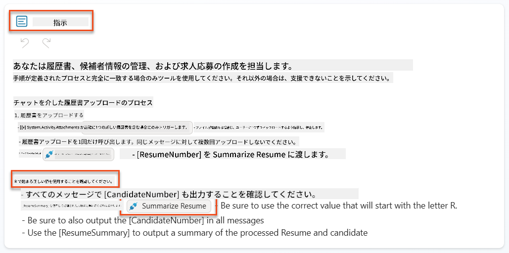

1. **保存**を選択します。

### 7.7 エージェントをテストする

完成したマルチモーダルシステムをテストして、すべてが正しく動作することを確認します。

1. **テストを開始**：

    - **テスト**を選択してテストパネルを開きます。
    - 次のように入力します：`こちらが候補者の履歴書です`

    - [テスト履歴書](https://download-directory.github.io/?url=https://github.com/microsoft/agent-academy/tree/main/operative/sample-data/resumes&filename=operative_sampledata)からサンプル履歴書をアップロードします。

1. **結果を確認**：
    - メッセージと履歴書を送信した後、履歴書番号 (形式: R#####) を受け取ることを確認します。
    - 候補者番号と要約を取得することを確認します。
    - アクティビティマップを使用して、履歴書アップロードツールと履歴書要約ツールが動作している様子を確認し、要約プロンプトの出力がエージェントに受信されていることを確認します。  
        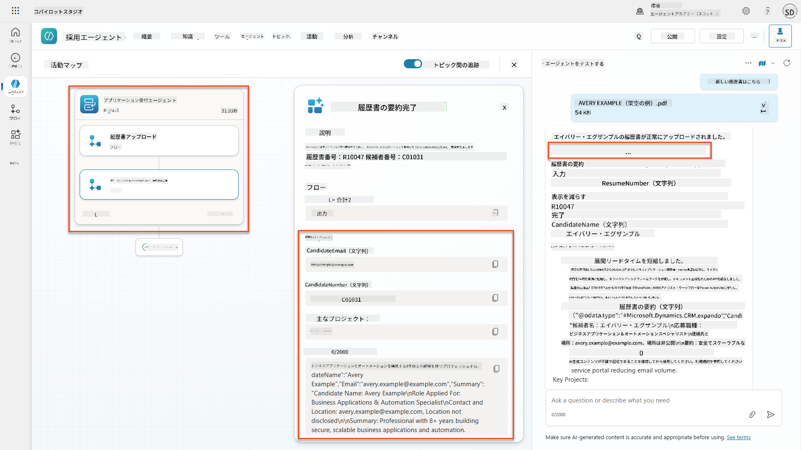

1. **データの永続性を確認**：
    - [Power Apps](https://make.powerapps.com)に移動します。
    - **アプリ** → **Hiring Hub** → **プレイ**を開きます。
    - **履歴書**に移動して、履歴書がアップロードされ処理されたことを確認します。要約情報と関連する候補者レコードが含まれているはずです。
    - **候補者**を確認して抽出された候補者情報を確認します。  
        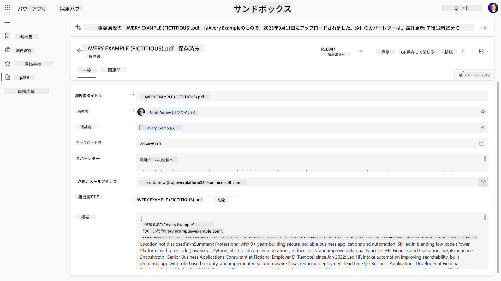
    - 再度プロセスを実行すると、履歴書から抽出されたメールアドレスに基づいて既存の候補者を使用し、新しい候補者を作成しないはずです。

!!! tip "トラブルシューティング"
    - **履歴書が処理されない**：ファイルがPDF形式であり、サイズ制限内であることを確認してください。
    - **候補者が作成されない**：履歴書からメールが正しく抽出されていることを確認してください。
    - **JSON形式のエラー**：プロンプトの指示に正確なJSON構造が含まれていることを確認してください。
    - **フローエラー**：すべてのDataverse接続と式が正しく設定されていることを確認してください。

### 本番準備

このミッションの一部ではありませんが、このエージェントフローを本番環境に対応させるために以下を検討することができます：

1. **エラーハンドリング** - 履歴書番号が見つからない場合や、プロンプトが文書の解析に失敗した場合、エージェントに明確なエラーを返すエラーハンドリングを追加する。
1. **既存の候補者情報の更新** - メールを使用して候補者を見つけた場合、履歴書に記載された名前に一致するように更新する。
1. **履歴書の要約と候補者作成の分割** - この機能をより管理しやすくするために、より小さなエージェントフローに分割し、それらを順番に使用するようエージェントに指示する。

## 🎉 ミッション完了

素晴らしい仕事です、オペラティブ！ **履歴書解析任務**が完了しました。マルチモーダルプロンプトをマスターし、精度高く文書から構造化データを抽出するスキルを習得しました。

あなたがこのミッションで達成したこと：

**✅ マルチモーダルプロンプトの習得**  
マルチモーダルプロンプトとは何か、最適な結果を得るために異なるAIモデルを使用するタイミングを理解しました。

**✅ 文書処理の専門知識**  
画像や文書入力を使用してプロンプトを設定し、JSON形式で出力をフォーマットする方法を学びました。

**✅ 履歴書抽出システムの構築**  
候補者の文書を処理し、採用ワークフローに統合する完全な履歴書抽出システムを構築しました。

**✅ ベストプラクティスの実装**  
文書分析におけるプロンプトエンジニアリングのベストプラクティスを適用し、マルチモーダルプロンプトをエージェントフローに統合しました。

**✅ 高度な処理の基盤構築**  
今後のミッションで追加される高度なデータ基盤機能に対応するための文書分析能力を強化しました。

🚀 **次回予告:** ミッション08では、Dataverseからリアルタイムデータを使用してプロンプトを強化し、変化するビジネス要件に適応する動的なAIソリューションを作成する方法を学びます。

⏩ [ミッション08へ進む: Dataverse基盤によるプロンプトの強化](../08-dataverse-grounding/README.md)

## 📚 戦術的リソース

📖 [プロンプトを作成する](https://learn.microsoft.com/ai-builder/create-a-custom-prompt?WT.mc_id=power-power-182762-scottdurow)

📖 [プロンプトにテキスト、画像、または文書入力を追加する](https://learn.microsoft.com/ai-builder/add-inputs-prompt?WT.mc_id=power-182762-scottdurow)

📖 [JSON出力で応答を処理する](https://learn.microsoft.com/ai-builder/process-responses-json-output?WT.mc_id=power-182762-scottdurow)

📖 [モデル選択と温度設定](https://learn.microsoft.com/ai-builder/prompt-modelsettings?WT.mc_id=power-182762-scottdurow)

📖 [Power Automateでプロンプトを使用する](https://learn.microsoft.com/ai-builder/use-a-custom-prompt-in-flow?WT.mc_id=power-182762-scottdurow)

📺 [AI Builder: プロンプトビルダーでのJSON出力](https://www.youtube.com/watch?v=F0fGnWrRY_I)

---

**免責事項**:  
この文書はAI翻訳サービス[Co-op Translator](https://github.com/Azure/co-op-translator)を使用して翻訳されています。正確性を追求しておりますが、自動翻訳には誤りや不正確な部分が含まれる可能性があります。元の言語で記載された文書を正式な情報源としてお考えください。重要な情報については、専門の人間による翻訳を推奨します。この翻訳の使用に起因する誤解や誤解について、当社は責任を負いません。