<!--
CO_OP_TRANSLATOR_METADATA:
{
  "original_hash": "750f3ea8a94930439ebd8a10871b1d73",
  "translation_date": "2025-10-18T03:09:06+00:00",
  "source_file": "docs/operative-preview/08-dataverse-grounding/README.md",
  "language_code": "ja"
}
-->
# 🚨 ミッション08: Dataverseを活用したプロンプトの強化

--8<-- "disclaimer.md"

## 🕵️‍♂️ コードネーム: `OPERATION GROUNDING CONTROL`

> **⏱️ 作戦時間:** `約60分`

## 🎯 ミッション概要

おかえりなさい、オペレーター。あなたのマルチエージェント採用システムは稼働していますが、**データの基盤強化**という重要な改善が必要です。AIモデルが組織の構造化データにリアルタイムでアクセスし、賢明な意思決定を行えるようにする必要があります。

現在、あなたの「履歴書要約プロンプト」は静的な知識で動作しています。しかし、もしそれが動的に求人情報データベースにアクセスし、正確で最新のマッチングを提供できたらどうでしょう？評価基準をハードコーディングすることなく理解できたらどうでしょう？

このミッションでは、**Dataverse基盤**を使用してカスタムプロンプトを強化し、プロンプトをライブデータソースに直接接続します。これにより、エージェントは静的な応答者から、変化するビジネスニーズに適応する動的でデータ駆動型のシステムへと進化します。

ミッションの目標: リアルタイムの求人情報と評価基準データを履歴書分析ワークフローに統合し、組織の採用要件に常に対応できる自己更新システムを構築すること。

## 🔎 目標

このミッションでは以下を学びます:

1. **Dataverse基盤**がカスタムプロンプトをどのように強化するか
1. 静的な指示とデータ基盤を使い分けるタイミング
1. ライブデータを動的に組み込むプロンプトの設計方法
1. 履歴書要約フローを求人情報マッチングで強化する方法

## 🧠 プロンプトにおけるDataverse基盤の理解

**Dataverse基盤**を使用すると、カスタムプロンプトがリクエストを処理する際にDataverseテーブルからライブデータにアクセスできます。静的な指示の代わりに、プロンプトがリアルタイムの情報を組み込んで、情報に基づいた意思決定を行うことが可能になります。

### Dataverse基盤が重要な理由

従来のプロンプトは固定された指示で動作します:

```text
Match this candidate to these job roles: Developer, Manager, Analyst
```

Dataverse基盤を使用すると、プロンプトが最新のデータにアクセスします:

```text
Match this candidate to available job roles from the Job Roles table, 
considering current evaluation criteria and requirements
```

このアプローチには以下のような重要な利点があります:

- **動的更新:** プロンプトを変更することなく求人情報や基準を更新可能
- **一貫性:** すべてのエージェントが同じ最新のデータソースを使用
- **スケーラビリティ:** 新しい役職や基準が自動的に利用可能
- **正確性:** リアルタイムデータにより、意思決定が最新のニーズを反映

### Dataverse基盤の仕組み

カスタムプロンプトにDataverse基盤を有効にすると:

1. **データ選択:** 含める特定のDataverseテーブルと列を選択します。また、取得した親レコードに基づいてフィルタリングされる関連テーブルを選択することもできます。
1. **コンテキスト注入:** プロンプトは取得したデータを自動的にコンテキストに含めます。
1. **インテリジェントフィルタリング:** フィルタリングを提供した場合、システムは現在のリクエストに関連するデータのみを含めます。
1. **構造化された出力:** プロンプトは取得したデータを参照し、レコードを基に推論して出力を作成できます。

### 静的から動的へ: 基盤の利点

ミッション07の現在の履歴書要約フローを見て、Dataverse基盤がどのようにそれを静的な知能から動的な知能へと変えるかを見てみましょう。

**現在の静的アプローチ:**
既存のプロンプトには、ハードコーディングされた評価基準と事前に決められたマッチングロジックが含まれています。このアプローチは機能しますが、新しい役職を追加したり、評価基準を変更したり、会社の優先順位を変更するたびに手動で更新する必要があります。

**Dataverse基盤による変革:**
Dataverse基盤を追加することで、履歴書要約フローは以下を実現します:

- **現在の求人情報にアクセス** (Job Rolesテーブルから)
- **静的な説明ではなくライブ評価基準を使用**
- **リアルタイムの要件に基づいた正確なマッチングを提供**

## 🎯 専用プロンプト vs エージェント会話

ミッション02では、Interview Agentが候補者を求人情報にマッチングする方法を体験しましたが、以下のような複雑なユーザープロンプトが必要でした:

```text
Upload this resume, then show me open job roles,
each with a description of the evaluation criteria, 
then use this to match the resume to at least one suitable
job role even if not a perfect match.
```

これが機能する一方で、Dataverse基盤を使用した専用プロンプトは特定のタスクに対して大きな利点を提供します。

### 専用プロンプトの主な利点

| 項目 | エージェント会話 | 専用プロンプト |
|--------|-------------------|------------------|
| **一貫性** | ユーザーのプロンプト作成スキルに依存 | 毎回標準化された処理 |
| **専門性** | 一般的な推論ではビジネスのニュアンスを見逃す可能性 | ビジネスロジックを最適化した専用設計 |
| **自動化** | 人間の操作と解釈が必要 | 構造化されたJSON出力で自動トリガー |

## 🧪 ラボ8: プロンプトにDataverse基盤を追加

履歴書分析機能をアップグレードする時が来ました！既存の履歴書要約フローを動的な求人情報マッチングで強化します。

### このミッションを完了するための前提条件

1. 以下のいずれかを満たしている必要があります:

    - **ミッション07を完了している**こと、または履歴書分析システムが準備されていること、**または**
    - **ミッション08のスターターソリューションをインポート**していること。 [ミッション08スターターソリューションをダウンロード](https://aka.ms/agent-academy)

1. [テスト用履歴書](https://download-directory.github.io/?url=https://github.com/microsoft/agent-academy/tree/main/operative/sample-data/resumes&filename=operative_sampledata)からサンプル履歴書をダウンロードしてください。

!!! note "ソリューションのインポートとサンプルデータ"
    スターターソリューションを使用する場合は、[ミッション01](../01-get-started/README.md)を参照して、環境にソリューションとサンプルデータをインポートする方法を確認してください。

### 8.1 プロンプトにDataverse基盤を追加

ミッション07で作成した履歴書要約プロンプトを基に構築します。現在は単に履歴書を要約するだけですが、これをDataverseに存在する求人情報で基盤化し、常に最新の状態を保つようにします。

まず、基盤化するDataverseテーブルを確認しましょう:

1. **[Power Apps](https://make.powerapps.com)**に移動し、ナビゲーションバーの右上にある**環境スイッチャー**を使用して環境を選択します。

1. **テーブル**を選択し、**Job Roles**テーブルを見つけます。

1. 基盤化に使用する主要な列を確認します:

    | 列名 | 目的 |
    |--------|---------|
    | **Job Role Number** | 役職のマッチング用の一意の識別子 |
    | **Job Title** | 役職の表示名 |
    | **Description** | 詳細な役職要件 |

1. 同様に、**Evaluation Criteria**テーブルなど他のテーブルも確認します。

### 8.2 プロンプトにDataverse基盤データを追加

1. **Copilot Studio**に移動し、ナビゲーションバーの右上にある**環境スイッチャー**を使用して環境を選択します。

1. 左側のナビゲーションから**ツール**を選択します。

1. **プロンプト**を選択し、ミッション07の**Summarize Resume**プロンプトを見つけます。  
    

1. **編集**を選択してプロンプトを修正し、以下の強化版に置き換えます:

    !!! important
        履歴書とカバーレターのパラメータはそのままパラメータとして保持してください。

    ```text
    You are tasked with extracting key candidate information from a resume and cover letter to facilitate matching with open job roles and creating a summary for application review.
    
    ### Instructions:
    1. **Extract Candidate Details:**
       - Identify and extract the candidate's full name.
       - Extract contact information, specifically the email address.
    
    2. **Analyze Resume and Cover Letter:**
       - Review the resume content to identify relevant skills, experience, and qualifications.
       - Review the cover letter to understand the candidate's motivation and suitability for the roles.
    
    3. **Match Against Open Job Roles:**
       - Compare the extracted candidate information with the requirements and descriptions of the provided open job roles.
       - Use the job descriptions to assess potential fit.
       - Identify all roles that align with the candidate's cover letter and profile. You don't need to assess perfect suitability.
       - Provide reasoning for each match based on the specific job requirements.
    
    4. **Create Candidate Summary:**
       - Summarize the candidate's profile as multiline text with the following sections:
          - Candidate name
          - Role(s) applied for if present
          - Contact and location
          - One-paragraph summary
          - Top skills (8–10)
          - Experience snapshot (last 2–3 roles with outcomes)
          - Key projects (1–3 with metrics)
          - Education and certifications
          - Availability and work authorization
    
    ### Output Format
    
    Provide the output in valid JSON format with the following structure:
    
    {
      "CandidateName": "string",
      "Email": "string",
      "MatchedRoles": [
        {
          "JobRoleNumber": "ppa_jobrolenumber from grounded data",
          "RoleName": "ppa_jobtitle from grounded data",
          "Reasoning": "Detailed explanation based on job requirements"
        }
      ],
      "Summary": "string"
    }
    
    ### Guidelines
    
    - Extract information only from the provided resume and cover letter documents.
    - Ensure accuracy in identifying contact details.
    - Use the available job role data for matching decisions.
    - The summary should be concise but informative, suitable for quick application review.
    - If no suitable matches are found, indicate an empty list for MatchedRoles and explain briefly in the summary.
    
    ### Input Data
    Open Job Roles (ppa_jobrolenumber, ppa_jobtitle): /Job Role 
    Resume: {Resume}
    Cover Letter: {CoverLetter}
    ```

1. プロンプトエディタで、**/Job Role**を置き換えるために**+ コンテンツを追加**を選択し、**Dataverse** → **Job Role**を選択して以下の列を選択し、**追加**を選択します:

    1. **Job Role Number**

    1. **Job Title**

    1. **Description**

    !!! tip
        テーブル名を入力して検索することができます。

1. **Job Role**ダイアログで**フィルター**属性を選択し、**Status**を選択して、**フィルター**値として**Active**を入力します。  
    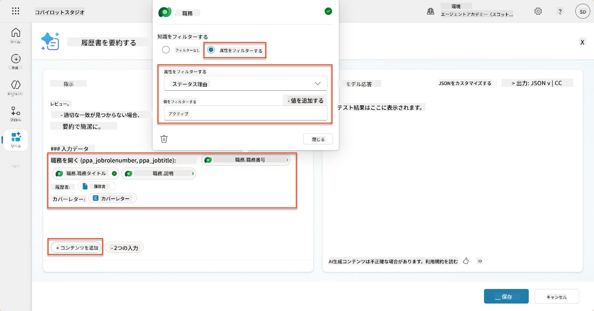

    !!! tip
        ここで**値を追加**を使用して入力パラメータを追加することもできます。例えば、既存のレコードを要約するプロンプトがある場合、履歴書番号をパラメータとして提供してフィルタリングすることができます。

1. 次に、関連するDataverseテーブル**Evaluation Criteria**を追加します。再び**+ コンテンツを追加**を選択し、**Job Roles**を見つけ、Job Roleの列を選択する代わりに、**Job Role (Evaluation Criteria)**を展開して以下の列を選択し、**追加**を選択します:

    1. **Criteria Name**

    1. **Description**  
        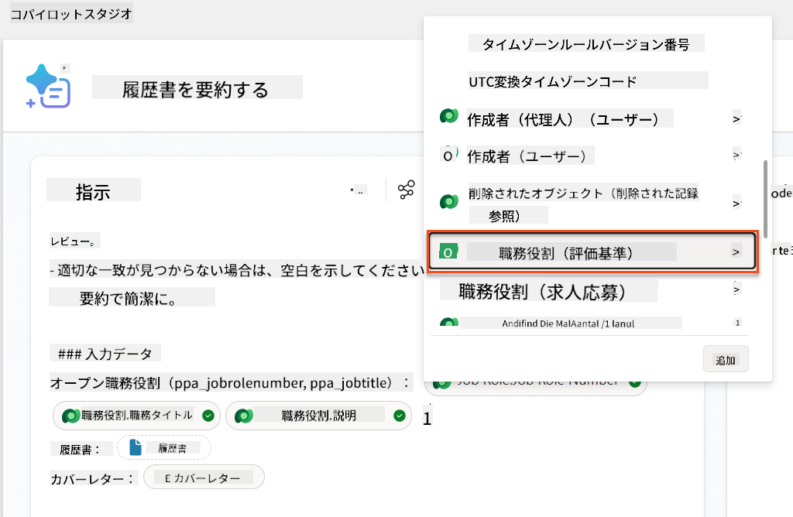

        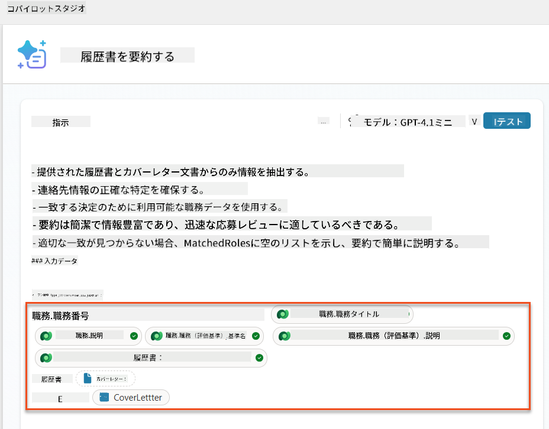

    !!! tip
        Job Roleを最初に選択し、メニューでJob Role (Evaluation Criteria)に移動して関連する評価基準を選択することが重要です。これにより、Job Roleに関連するレコードのみが読み込まれるようになります。

1. **設定**を選択し、**レコード取得**を1000に調整します。これにより、プロンプトに最大限のJob RolesとEvaluation Criteriaが含まれるようになります。  
    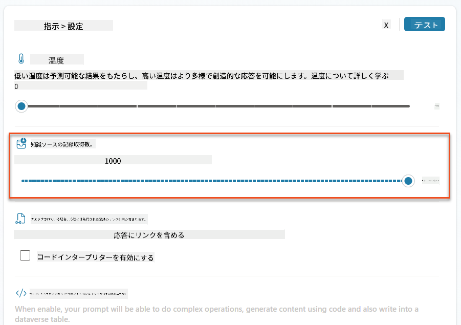

### 8.3 強化されたプロンプトをテストする

1. **履歴書**パラメータを選択し、ミッション07で使用したサンプル履歴書をアップロードします。
1. **テスト**を選択します。
1. テストが実行された後、JSON出力に**Matched Roles**が含まれていることに気づきます。
1. **使用された知識**タブを選択し、実行前にプロンプトと統合されたDataverseデータを確認します。
1. **保存**して更新されたプロンプトを保存します。これにより、既存のSummarize Resumeエージェントフローがプロンプトを呼び出す際に、このDataverseデータが自動的に含まれるようになります。  
    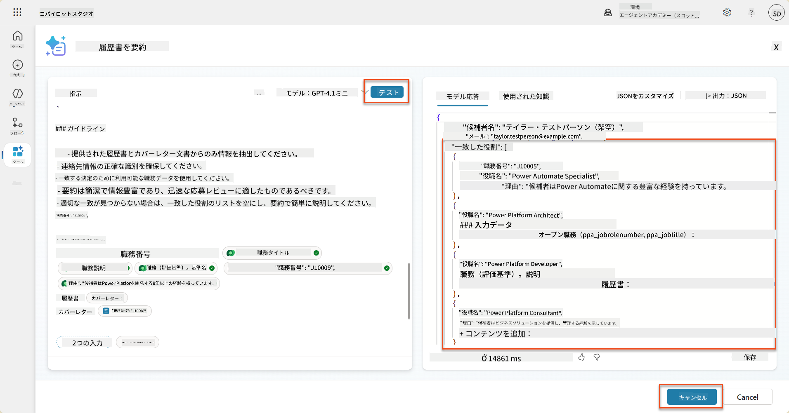

### 8.4 求人応募エージェントフローを追加

候補者が興味を持つ役職に基づいて求人情報を作成するために、Application Intake Agentにエージェントフローを作成する必要があります。このエージェントは、候補者が興味を持つ各役職に対してこのツールを呼び出します。

!!! tip "エージェントフローの式"
    ノードの名前付けや式の入力方法を正確に指示に従うことが非常に重要です。式は前のノードをその名前で参照するためです！式についての簡単な復習は、[Recruitのエージェントフローミッション](../../recruit/09-add-an-agent-flow/README.md#you-mentioned-expressions-what-are-expressions)を参照してください。

1. **Hiring Agent**内で**エージェント**タブを選択し、**Application Intake Agent**の子エージェントを開きます。

1. **ツール**パネル内で**+ 追加** → **+ 新しいツール** → **エージェントフロー**を選択します。

1. **エージェントがフローを呼び出すとき**ノードを選択し、**+ 入力を追加**を使用して以下のパラメータを追加します:

    | タイプ | 名前            | 説明                                                  |
    | ---- | --------------- | ------------------------------------------------------------ |
    | テキスト | `ResumeNumber`  | 必ず[ResumeNumber]のみを使用してください - 必ずRで始まる必要があります |
    | テキスト | `JobRoleNumber` | 必ず[JobRoleNumber]のみを使用してください - 必ずJで始まる必要があります |

    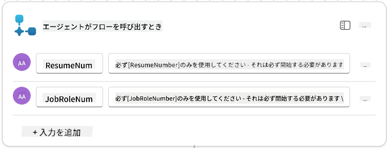

1. 最初のノードの下にある**+** アクション挿入アイコンを選択し、**Dataverse**を検索して**もっと見る**を選択し、**List rows**アクションを見つけます。

1. ノードを**Get Resume**と**名前変更**し、以下のパラメータを設定します:

    | プロパティ        | 設定方法                      | 値                                                        |
    | --------------- | ------------------------------- | ------------------------------------------------------------ |
    | **テーブル名**  | 選択                          | Resumes                                                      |
    | **フィルタ行** | 動的データ (雷アイコン) | `ppa_resumenumber eq 'ResumeNumber'` 選択して**ResumeNumber**を**エージェントがフローを呼び出すとき** → **ResumeNumber**に置き換えます |
    | **行数**   | 入力                           | 1                                                            |

    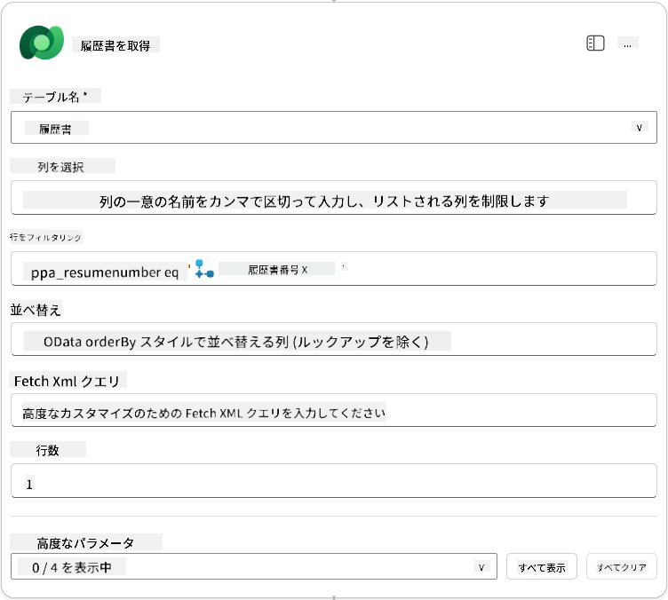

1. 次に、**Get Resume**の下にある**+** アクション挿入アイコンを選択し、**Dataverse**を検索して**もっと見る**を選択し、**List rows**アクションを見つけます。

1. ノードを**Get Job Role**と**名前変更**し、以下のパラメータを設定します:

    | プロパティ        | 設定方法                      | 値                                                        |
    | --------------- | ------------------------------- | ------------------------------------------------------------ |
    | **テーブル名**  | 選択                          | Job Roles                                                    |
    | **フィルタ行** | 動的データ (雷アイコン) | `ppa_jobrolenumber eq 'JobRoleNumber'` 選択して**JobRoleNumber**を**エージェントがフローを呼び出すとき** → **JobRoleNumber**に置き換えます |
    | **行数**   | 入力                           | 1                                                            |

    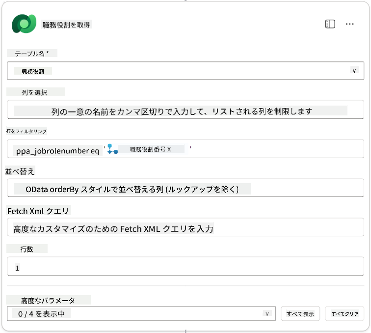

1. 次に、Get Job Roleの下にある**+** アクション挿入アイコンを選択し、**Dataverse**を検索して**もっと見る**を選択し、**Add a new row**アクションを見つけます。

1. ノードを**Add Application**と**名前変更**し、以下のパラメータを設定します:

    | プロパティ                           | 設定方法           | 値                                                        |
    | ---------------------------------- | -------------------- | ------------------------------------------------------------ |
    | **テーブル名**                     | 選択               | Job Applications                                             |
    | **Candidate (Candidates)**             | 式 (fxアイコン) | `concat('ppa_candidates/',first(outputs('Get_Resume')?['body/value'])?['_ppa_candidate_value'])` |
| **職務 (Job Roles)**               | 式 (fx アイコン) | `concat('ppa_jobroles/',first(outputs('Get_Job_Role')?['body/value'])?['ppa_jobroleid'])` |
| **履歴書 (Resumes)**                | 式 (fx アイコン) | `concat('ppa_resumes/', first(outputs('Get_Resume')?['body/value'])?['ppa_resumeid'])` |
| **応募日** (**すべて表示**を使用)   | 式 (fx アイコン) | `utcNow()`                                                   |

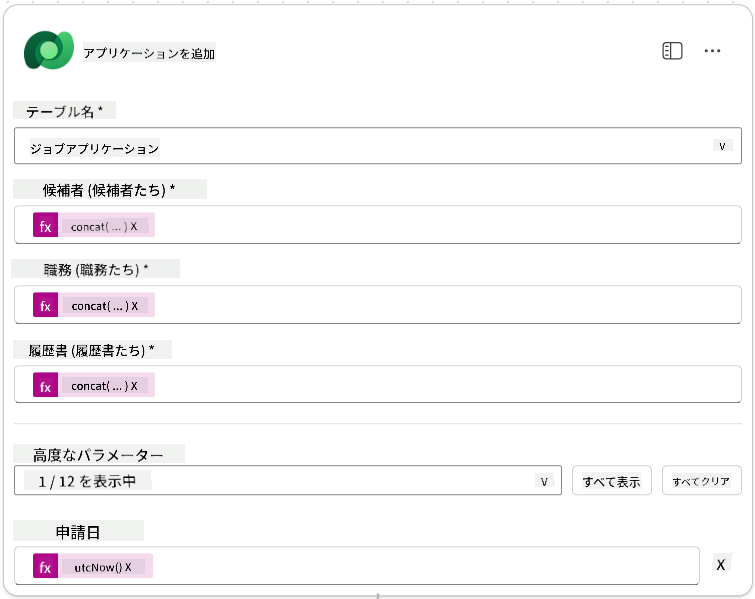

1. **エージェントへの応答ノード**を選択し、**+ 出力を追加**を選択します。

     | プロパティ        | 設定方法                      | 詳細                                         |
     | ----------------- | ----------------------------- | ------------------------------------------- |
     | **タイプ**        | 選択                          | `Text`                                      |
     | **名前**          | 入力                          | `ApplicationNumber`                         |
     | **値**            | 動的データ (雷アイコン)       | *応募を追加 → さらに表示 → 応募番号*       |
     | **説明**          | 入力                          | `作成された求人応募の[ApplicationNumber]`  |

     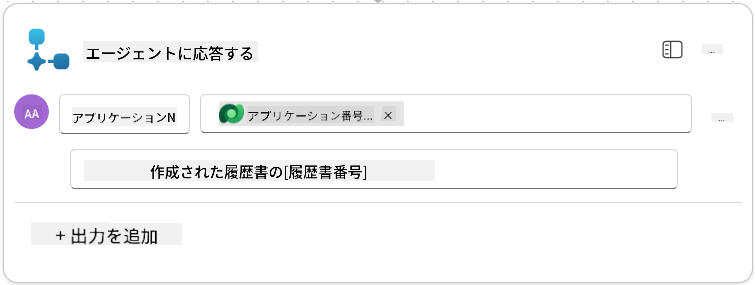

1. 右上の**下書きを保存**を選択します。

1. **概要**タブを選択し、**詳細**パネルで**編集**を選択します。

      - **フロー名**:`Create Job Application`
      - **説明**:`[ResumeNumber]と[JobRoleNumber]が与えられた場合に新しい求人応募を作成します`
      - **保存**

1. 再び**デザイナー**タブを選択し、**公開**を選択します。

### 8.5 求人応募作成をエージェントに追加

次に、公開されたフローを応募受付エージェントに接続します。

1. **採用エージェント**に戻り、**エージェント**タブを選択します。**応募受付エージェント**を開き、**ツール**パネルを見つけます。

1. **+ 追加**を選択します。

1. **フロー**フィルターを選択し、`Create Job Application`を検索します。**Create Job Application**フローを選択し、**追加して設定**を選択します。

1. 以下のパラメータを設定します：

    | パラメータ                                           | 値                                                        |
    | --------------------------------------------------- | -------------------------------------------------------- |
    | **説明**                                           | `[ResumeNumber]と[JobRoleNumber]が与えられた場合に新しい求人応募を作成します` |
    | **追加の詳細 → このツールが使用される場合**         | `トピックやエージェントによって参照される場合のみ`       |

1. **保存**を選択  
    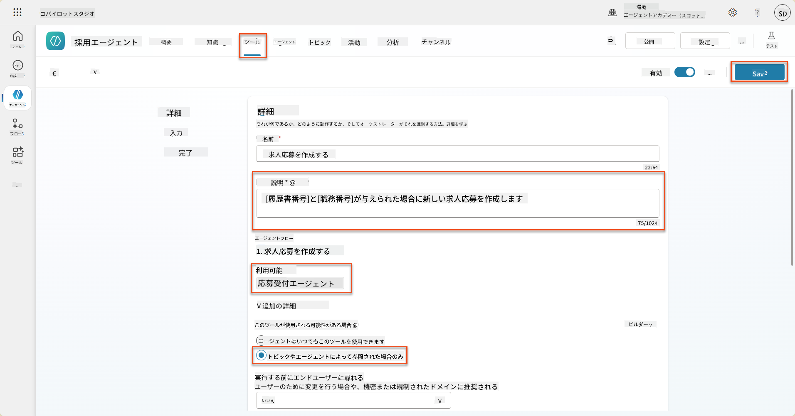

### 8.6 エージェントの指示を定義

求人応募を作成するには、エージェントに新しいツールを使用するタイミングを指示する必要があります。この場合、ユーザーに提案された求人役割に応募するかどうかを確認し、各役割に対してツールを実行するようエージェントに指示します。

1. **応募受付エージェント**に戻り、**指示**パネルを見つけます。

1. **指示**フィールドで、**既存の指示の最後**に以下の明確なガイダンスを**追加**します：

    ```text
    3. Post Resume Upload
       - Respond with a formatted bullet list of [SuggestedJobRoles] the candidate could apply for.  
       - Use the format: [JobRoleNumber] - [RoleDescription]
       - Ask the user to confirm which Job Roles to create applications for the candidate.
       - When the user has confirmed a set of [JobRoleNumber]s, move to the next step.
    
    4. Post Upload - Application Creation
        - After the user confirms which [SuggestedJobRoles] for a specific [ResumeNumber]:
        E.g. "Apply [ResumeNumber] for the Job Roles [JobRoleNumber], [JobRoleNumber], [JobRoleNumber]
        E.g. "apply to all suggested job roles" - this implies use all the [JobRoleNumbers] 
         - Loop over each [JobRoleNumber] and send with [ResumeNumber] to /Create Job Application   
         - Summarize the Job Applications Created
    
    Strict Rules (that must never be broken)
    You must always follow these rules and never break them:
    1. The only valid identifiers are:
      - ResumeNumber (ppa_resumenumber)→ format R#####
      - CandidateNumber (ppa_candidatenumber)→ format C#####
      - ApplicationNumber (ppa_applicationnumber)→ format A#####
      - JobRoleNumber (ppa_jobrolenumber)→ format J#####
    2. Never guess or invent these values.
    3. Always extract identifiers from the current context (conversation, data, or system output). 
    ```

1. 指示にスラッシュ (/) が含まれている場合、スラッシュの後のテキストを選択し、**Create Job Application**ツールを選択します。

1. **保存**を選択  
    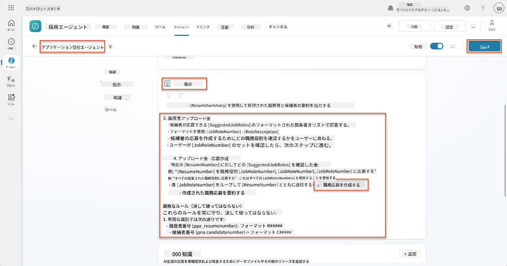

!!! tip "生成オーケストレーションで複数項目を反復処理する"
    これらの指示は、生成オーケストレーションの機能を使用して、どのステップやツールを使用するかを決定する際に複数の行を反復処理します。マッチした求人役割は自動的に読み取られ、応募受付エージェントは各行に対して実行されます。生成オーケストレーションの魔法の世界へようこそ！

### 8.7 エージェントをテストする

1. Copilot Studioで**採用エージェント**を開きます。

1. サンプルの履歴書をチャットに**アップロード**し、以下を入力します：

    ```text
    This is a new resume for the Power Platform Developer Role.
    ```

1. エージェントが提案された求人役割のリストを提供する様子を確認します - 各役割には求人役割番号が付いています。  
    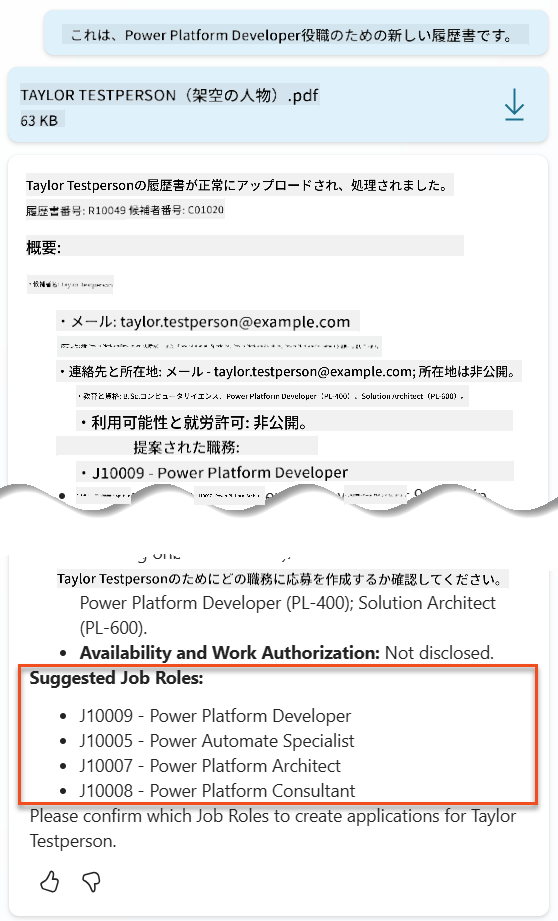

1. 次に、これらのうちどれを求人応募として追加したいかを指定できます。
    **例：**

    ```text
    "Apply for all of those job roles"
    "Apply for the J10009 Power Platform Developer role"
    "Apply for the Developer and Architect roles"
    ```

    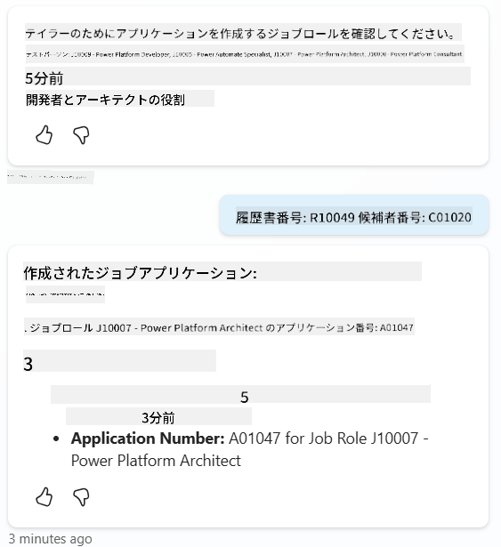

1. **Create Job Applicationツール**は、指定した各求人役割に対して実行されます。アクティビティマップ内で、指定した求人役割ごとにCreate Job Applicationツールが実行される様子が確認できます：  
    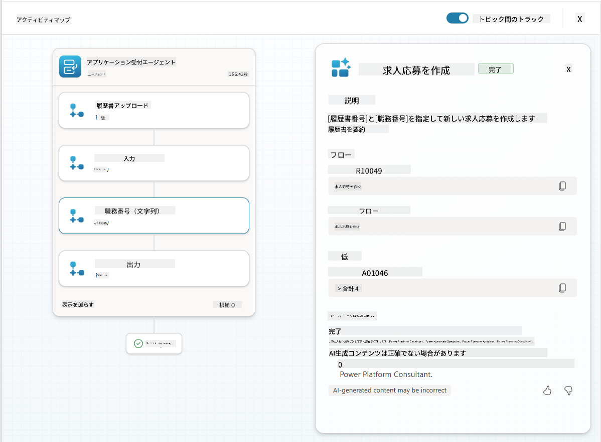

## 🎉 ミッション完了

素晴らしい仕事です、オペレーティブ！ **Operation Grounding Control**が完了しました。動的データの基盤を活用して、真に知的な採用システムを構築することに成功しました。

このミッションで達成したこと：

**✅ Dataverse基盤の習得**  
カスタムプロンプトをライブデータソースに接続して動的な知能を実現する方法を理解しました。

**✅ 履歴書分析の強化**  
Summarize Resumeフローがリアルタイムの求人役割データと評価基準にアクセスし、正確なマッチングを行えるようになりました。

**✅ データ駆動型の意思決定**  
採用エージェントが求人要件の変化に自動的に適応し、手動でプロンプトを更新する必要がなくなりました。

**✅ 求人応募の作成**  
強化されたシステムが求人応募を作成できるようになり、さらに複雑なワークフローオーケストレーションに対応する準備が整いました。

🚀 **次回:** 次のミッションでは、エージェントが複雑な意思決定を行い、推奨事項に関する詳細な説明を提供するための深い推論能力を実装する方法を学びます。

⏩ [ミッション09へ進む: 深い推論](../09-deep-reasoning/README.md)

## 📚 戦術的リソース

📖 [プロンプトで独自のデータを使用する](https://learn.microsoft.com/ai-builder/use-your-own-prompt-data?WT.mc_id=power-182762-scottdurow)

📖 [カスタムプロンプトを作成する](https://learn.microsoft.com/ai-builder/create-a-custom-prompt?WT.mc_id=power-182762-scottdurow)

📖 [Copilot StudioでDataverseを操作する](https://learn.microsoft.com/microsoft-copilot-studio/knowledge-add-dataverse?WT.mc_id=power-182762-scottdurow)

📖 [AI Builderカスタムプロンプト概要](https://learn.microsoft.com/ai-builder/prompts-overview?WT.mc_id=power-182762-scottdurow)

📖 [Power Platform AI Builderドキュメント](https://learn.microsoft.com/ai-builder/?WT.mc_id=power-182762-scottdurow)

📖 [トレーニング: Dataverseデータを使用したAI Builderプロンプトの作成](https://learn.microsoft.com/training/modules/ai-builder-grounded-prompts/?WT.mc_id=power-182762-scottdurow)

---

**免責事項**:  
この文書はAI翻訳サービス[Co-op Translator](https://github.com/Azure/co-op-translator)を使用して翻訳されています。正確性を追求しておりますが、自動翻訳には誤りや不正確な部分が含まれる可能性があります。元の言語で記載された文書を正式な情報源としてご参照ください。重要な情報については、専門の人間による翻訳を推奨します。この翻訳の使用に起因する誤解や誤解について、当社は責任を負いません。