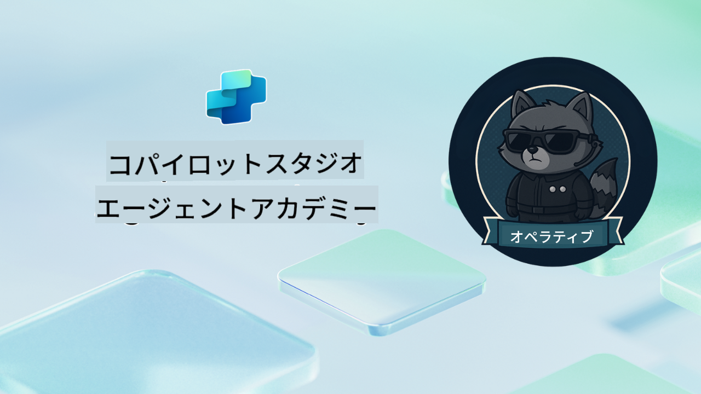

<!--
CO_OP_TRANSLATOR_METADATA:
{
  "original_hash": "24fcbe9a57d3439e05f8866e550c0a84",
  "translation_date": "2025-10-18T03:07:39+00:00",
  "source_file": "docs/operative-preview/README.md",
  "language_code": "ja"
}
-->
# ようこそ、オペレーティブへ

**ようこそ、オペレーティブへ。**  
あなたの高度なミッション—それを受け入れるなら—は、**Microsoft Copilot Studio** を使用して **エンタープライズ向けのマルチエージェントシステム** を構築する技術を習得することです。

この集中的なトレーニングでは、基本的なエージェント作成を超えて、**マルチエージェントのオーケストレーション**の洗練された世界へと進みます。採用の自動化からAIの安全性まで、実際のエンタープライズシナリオを使用して、インテリジェントなエージェントエコシステムを構築、調整、展開する方法を学びます。

--8<-- "disclaimer.md"

---

## 🎯 ミッションの目的

Agent Academy Operativeプログラムを完了することで、以下が可能になります：

- 複雑なビジネスシナリオに対応する **マルチエージェントシステム** を設計・実装する
- **エージェントのオーケストレーション**とコラボレーションパターンを習得する
- **AIの安全性とコンテンツモデレーション**を本番システムに実装する
- 文書処理と分析のための **マルチモーダルプロンプト** を構築する
- 適切なガバナンスとテストを備えた **エンタープライズ対応エージェント** を展開する

---

## 🧪 前提条件

すべてのミッションを完了するためには以下が必要です：

- **Agent Academy Recruit** トレーニングを完了していること
- **Copilot Studio** ライセンスを持つMicrosoft Power Platform環境
- **Microsoft Dataverse** へのアクセス
- ソリューションやエージェントを作成するための管理者権限

---

## 🧬 対象者

この上級コースは以下の方に最適です：

- エンタープライズAIシステムを設計する **ソリューションアーキテクト**
- 本番対応のエージェントソリューションを構築する **開発者**
- AIガバナンスと安全性を実装する **ITプロフェッショナル**
- 複雑な自動化ワークフローを作成する **ビジネスアナリスト**
- 基本的なエージェントからエンタープライズシステムへ **レベルアップ** したい方

---

## 🧭 カリキュラム概要

このアカデミーは進行型のフィールドオペレーションとして構成されており、各ミッションが前のミッションを基にして、包括的な採用自動化システムを構築します。

| ミッション | タイトル | オペレーション概要 |
|------------|----------|-------------------|
| `01` | 🚨 [採用エージェントの開始](./01-get-started/README.md) | 基盤インフラを展開し、中央オーケストレーターエージェントを作成する |
| `02` | 🎭 [接続されたエージェントでマルチエージェント対応にする](./02-multi-agent/README.md) | 単一エージェントを協調的なマルチエージェントシステムに変換する |
| `03` | ⚡ [トリガーでエージェントを自動化する](./03-automate-triggers/README.md) | イベント駆動型トリガーで自律的なエージェント動作を実装する |
| `04` | 📝 [エージェント指示の作成](./04-agent-instructions/README.md) | 正確なエージェントのコミュニケーションと動作制御を習得する |
| `05` | 💬 [エージェントの応答をパーソナライズする](./05-agent-responses/README.md) | 最大の効果とエンゲージメントを得るためにエージェントの応答をカスタマイズする |
| `06` | 🛡️ [コンテンツモデレーションとAI安全性の基本](./06-ai-safety/README.md) | エンタープライズグレードの安全性とコンプライアンス対策を実装する |
| `07` | 🎨 [マルチモーダルプロンプトで履歴書内容を抽出する](./07-multimodal-prompts/README.md) | 高度なAI機能で文書や画像を処理する |
| `08` | 🗄️ [プロンプト - Dataverseの基盤化](./08-dataverse-grounding/README.md) | エージェントをエンタープライズデータに基づかせ、正確な応答を提供する |
| `09` | 🧠 [候補者の適合性評価と面接準備への深い推論の適用](./09-deep-reasoning/README.md) | 複雑な意思決定のための高度なAI推論を実装する |
| `10` | 📄 [プロンプトで候補者特有の面接資料を生成する](./10-generate-documents/README.md) | エージェント分析に基づいた動的な文書を作成する |
| `11` | 📊 [アダプティブカードでユーザーフィードバックを取得する](./11-obtain-user-feedback/README.md) | ユーザーフィードバックを収集し、継続的な改善に活用する |
| `12` | 🌐 [ステークホルダーのテスト用デモウェブサイトにエージェントを公開する](./12-demo-website/README.md) | 完全なソリューションを展開し、ステークホルダーにデモを行う |

!!! note
    ✅ このカリキュラムを完了すると、**Operative** バッジを獲得できます。  
    🔓 **Commander** は今後のフェーズで解放されます。

<!-- markdownlint-disable-next-line MD033 -->

---

**免責事項**:  
この文書はAI翻訳サービス[Co-op Translator](https://github.com/Azure/co-op-translator)を使用して翻訳されています。正確性を追求しておりますが、自動翻訳には誤りや不正確な部分が含まれる可能性があります。元の言語で記載された文書を正式な情報源としてご参照ください。重要な情報については、専門の人間による翻訳を推奨します。この翻訳の使用に起因する誤解や誤解について、当社は責任を負いません。