<!--
CO_OP_TRANSLATOR_METADATA:
{
  "original_hash": "d9cd8cd1a4fbd8915171a2ed972cc322",
  "translation_date": "2025-10-18T02:49:48+00:00",
  "source_file": "docs/recruit/00-course-setup/README.md",
  "language_code": "ja"
}
-->
# 🚨 ミッション00: コースセットアップ

## 🕵️‍♂️ コードネーム: `OPERATION DEPLOYMENT READY`

> **⏱️ 作戦時間:** `約30分`  

## 🎯 ミッション概要

Copilot Studioエージェントとしてのトレーニングの最初のミッションへようこそ。  
最初のAIエージェントを構築する前に、**現場対応可能な開発環境**を整える必要があります。

このブリーフィングでは、Microsoft 365エコシステムで成功するために必要なシステム、アクセス資格情報、セットアップ手順を説明します。

## 🔎 目標

このミッションでは以下を行います:

1. Microsoft 365アカウントの取得  
1. Microsoft Copilot Studioへのアクセス権の取得  
1. (オプション) Microsoft 365 Copilotライセンスを取得して本番公開を可能にする  
1. Copilot Studio環境として構築するための開発環境の作成  
1. 後のミッションでデータソースとして使用するSharePointサイトの作成  

---

## 🔍 前提条件

始める前に以下を確認してください:

1. **職場または学校のメールアドレス** (個人の@outlook.com、@gmail.comなどはサポートされません)。
1. インターネットへのアクセスと最新のブラウザ (Edge、Chrome、またはFirefox推奨)。  
1. Microsoft 365の基本的な操作に慣れていること (例: OfficeアプリやTeamsへのサインイン)。  
1. (オプション) 有料ライセンスを購入する予定がある場合、クレジットカードまたは支払い方法。

---

## ステップ1: Microsoft 365アカウントの取得

Copilot StudioはMicrosoft 365内にあるため、アクセスするにはMicrosoft 365アカウントが必要です。既存のアカウントを使用するか、以下の手順で適切なライセンスを取得してください:

1. **有料のMicrosoft 365 Businessサブスクリプションを取得**  
   1. [Microsoft 365 Businessプランと価格ページ](https://www.microsoft.com/microsoft-365/business/microsoft-365-plans-and-pricing)にアクセスします。  
   1. 最も安価なオプションはMicrosoft 365 Business Basicプランです。`無料で試す`を選択し、ガイド付きフォームに従ってサブスクリプション、アカウント詳細、支払い情報を入力します。  
   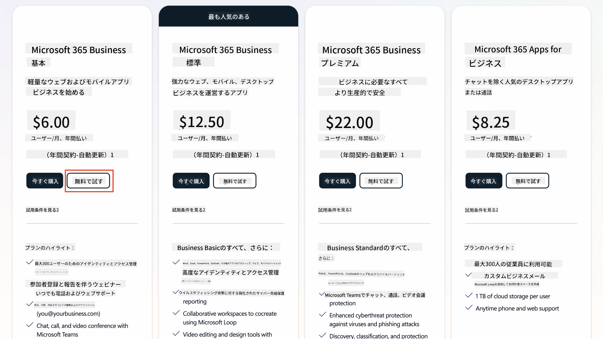  
   1. 新しいアカウントを取得したら、ログインします。

    !!! Tip
        Microsoft 365 Copilot Chatにエージェントを公開したり、組織データ (SharePoint、OneDrive、Dataverse) に接続したりする予定がある場合は、Microsoft 365 Copilotライセンスが必要です。このライセンスは追加ライセンスであり、詳細は[ライセンスサイト](https://www.microsoft.com/microsoft-365/copilot#plans)で確認できます。

---

## ステップ2: Copilot Studioトライアルを開始

Microsoft 365テナントを取得したら、Copilot Studioへのアクセスを取得する必要があります。以下の手順で30日間の無料トライアルを開始できます:

1. [aka.ms/TryCopilotStudio](https://aka.ms/TryCopilotStudio)にアクセスします。  
1. 前のステップで設定した新しいアカウントのメールアドレスを入力し、`次へ`を選択します。  
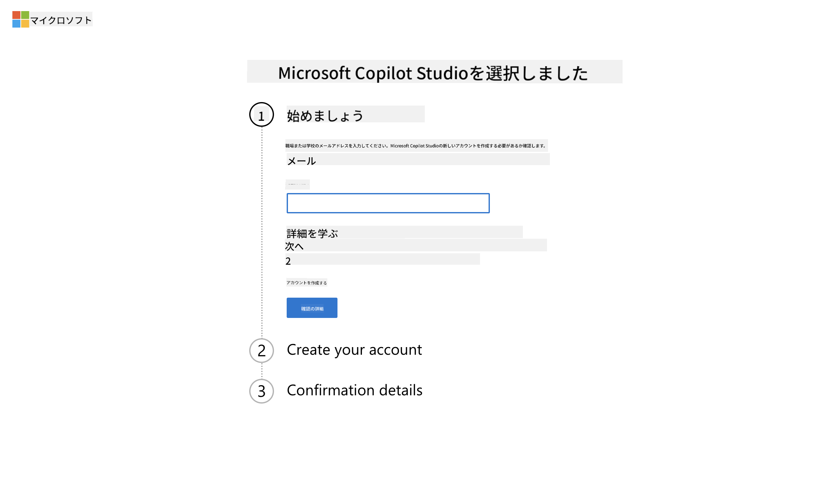  
1. アカウントが認識されます。`サインイン`を選択します。  
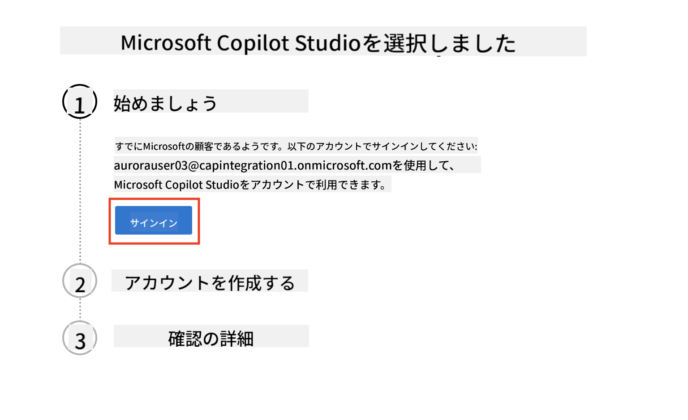  
1. `無料トライアルを開始`を選択します。  
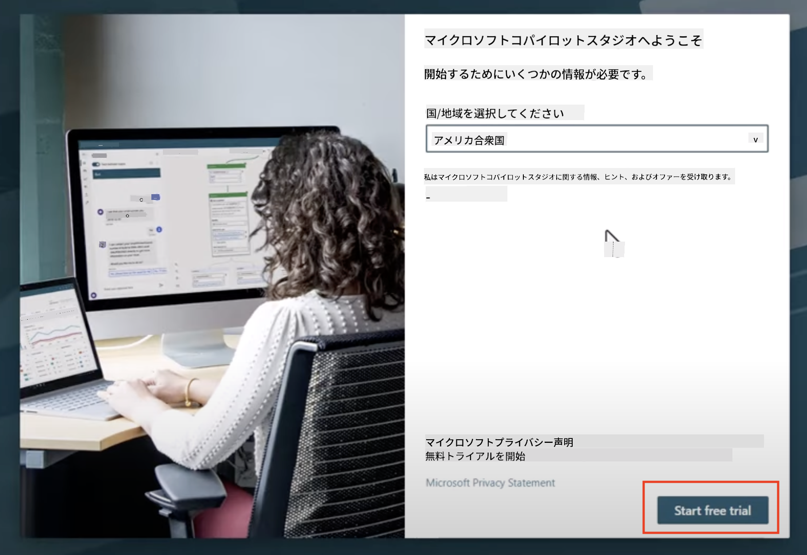  

!!! info "トライアルに関する注意事項"  
     1. 無料トライアルでは**完全なCopilot Studio機能**が提供されます。  
     1. トライアルの有効期限に関するメール通知が届きます。トライアルは30日単位で延長可能で、最大90日間のエージェント稼働が可能です。  
     1. テナント管理者がセルフサービスサインアップを無効にしている場合、エラーが表示されます。その場合はMicrosoft 365管理者に再有効化を依頼してください。

---

## ステップ3: 新しい開発環境の作成

### Power Apps Developer Planにサインアップ

ステップ1で使用したMicrosoft 365テナントを使用して、Power Apps Developer Planにサインアップし、Copilot Studioで構築およびテストするための無料開発環境を作成します。

1. [Power Apps Developer Planウェブサイト](https://aka.ms/PowerAppsDevPlan)にサインアップします。

    - メールアドレスを入力  
    - チェックボックスをオンにする  
    - **無料で開始**を選択  

    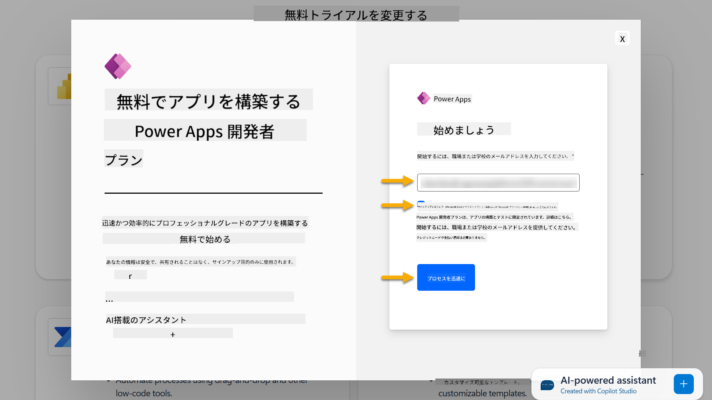

1. Developer Planにサインアップすると、[Power Apps](https://make.powerapps.com/)にリダイレクトされます。環境はあなたの名前を使用して作成されます。例: **Adele Vance's environment**。すでに同じ名前の環境がある場合、新しい開発環境は**Adele Vance's (1)**という名前になります。

    この開発環境を使用して、Copilot Studioでラボを完了してください。

!!! Note
    既存のMicrosoft 365アカウントを使用している場合 (例: 職場のアカウントを使用している場合) で、ステップ1で新しいアカウントを作成していない場合、テナント/環境を管理するIT管理者 (または同等のチーム) がサインアッププロセスを無効にしている可能性があります。この場合、管理者に連絡するか、ステップ1に従ってテストテナントを作成してください。

---

## ステップ4: 新しいSharePointサイトの作成

新しいSharePointサイトを作成する必要があります。このサイトは、[レッスン06 - Copilotを使用した会話型作成体験でカスタムエージェントを作成し、データで基盤を構築する](../06-create-agent-from-conversation/README.md#62-add-an-internal-knowledge-source-using-a-sharepoint-site)で使用されます。

1. Microsoft Copilot Studioの左上にあるワッフルアイコンを選択してメニューを表示します。メニューからSharePointを選択します。

    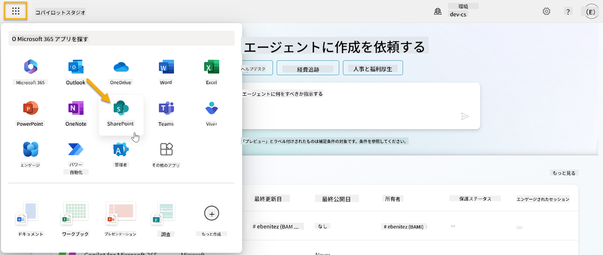

1. SharePointが読み込まれます。**+ サイトを作成**を選択して新しいSharePointサイトを作成します。

    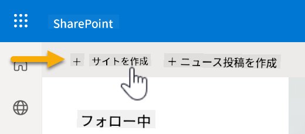

1. 新しいSharePointサイトを作成するためのダイアログが表示されます。**チームサイト**を選択します。

    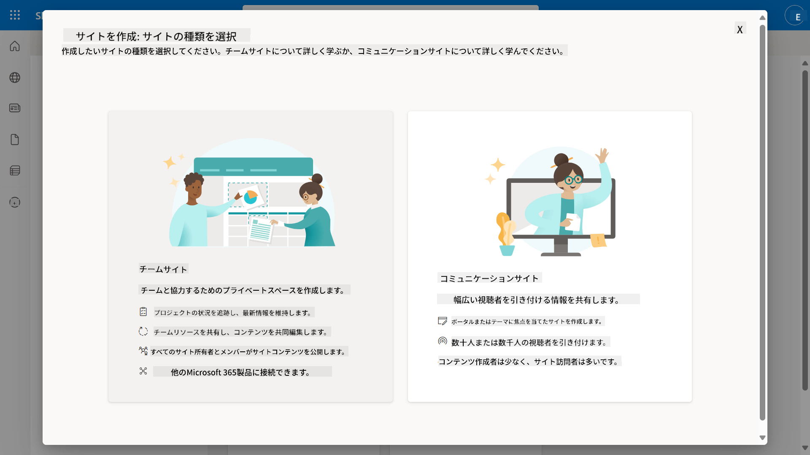

1. 次のステップでは、デフォルトでMicrosoftテンプレートのリストが読み込まれます。スクロールして**ITヘルプデスク**テンプレートを選択します。

    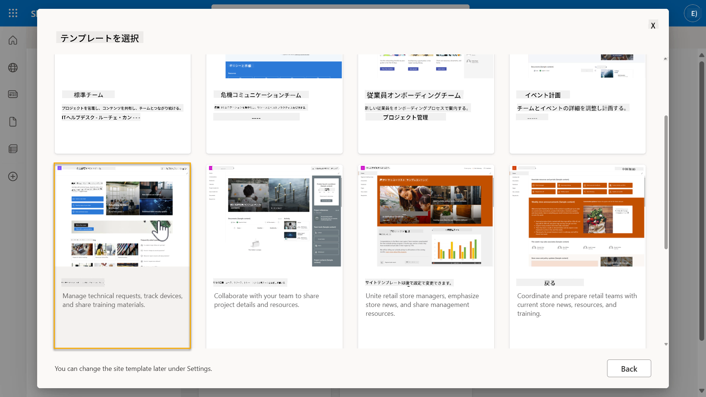

1. **テンプレートを使用**を選択して、ITヘルプデスクテンプレートを使用して新しいSharePointサイトを作成します。

    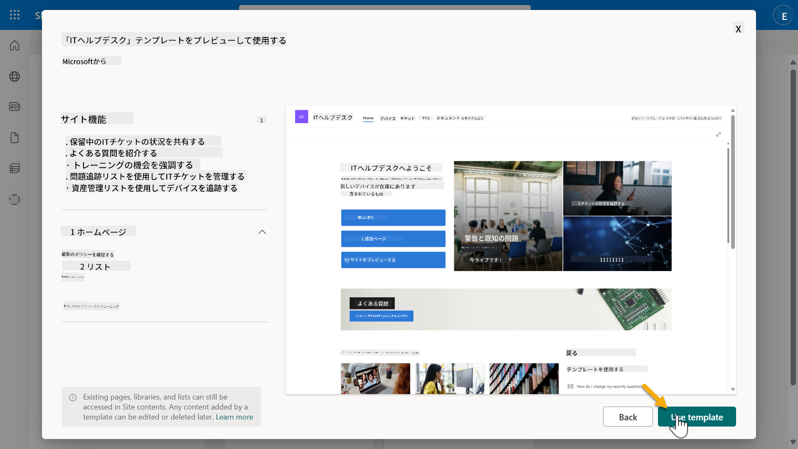

1. サイト情報を入力します。以下は例です:

    | フィールド | 値 |
    | --- | --- |
    | サイト名 | Contoso IT |
    | サイトの説明 | Copilot Studio for Beginners |
    | サイトアドレス | ContosoIT |

    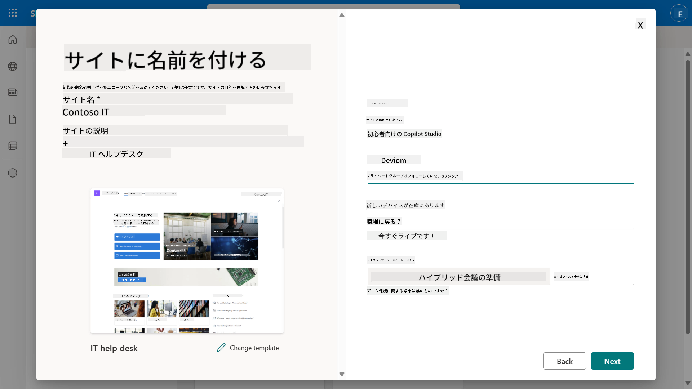

1. 最終ステップで、SharePointサイトの言語を選択できます。デフォルトでは**英語**です。言語を**英語**のままにして**サイトを作成**を選択します。

    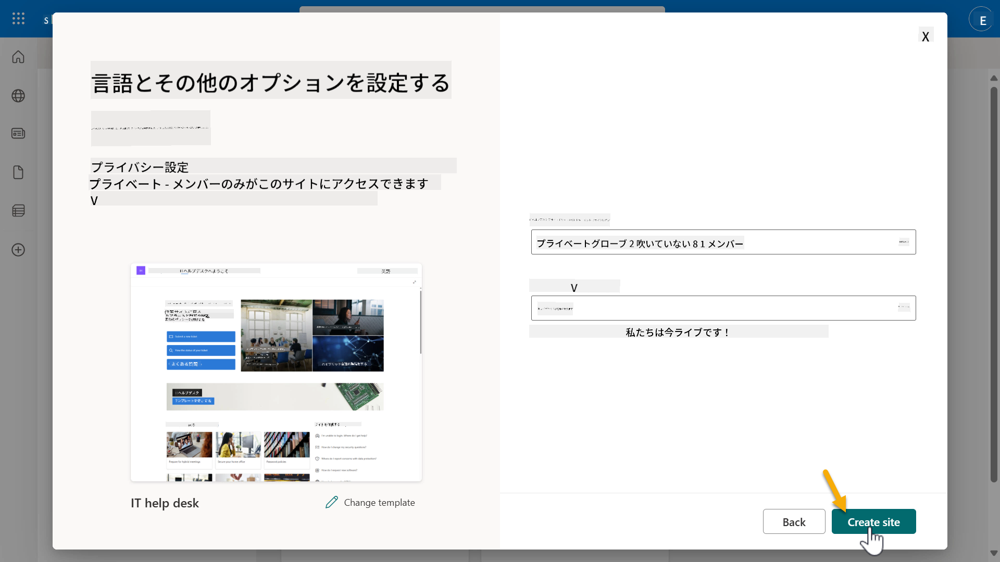

1. SharePointサイトが数秒でプロビジョニングされます。その間に、**メンバーを追加**フィールドにメールアドレスを入力して、他のユーザーをサイトに追加することができます。完了したら**完了**を選択します。

    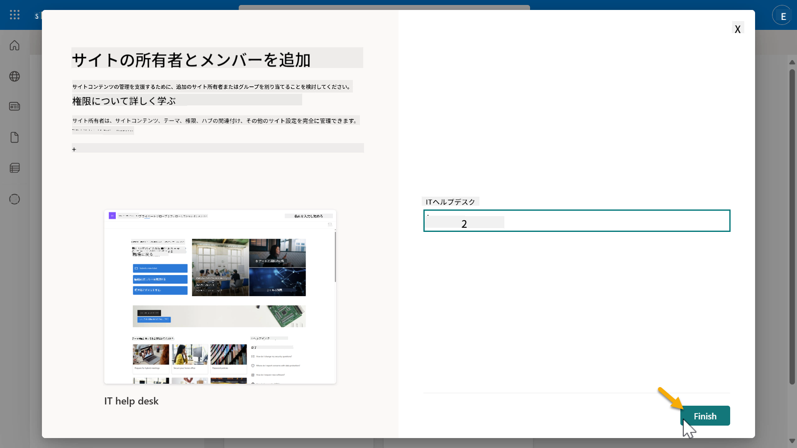

1. 次にSharePointサイトのホームページが読み込まれます。**SharePointサイトのURLをコピー**してください。

1. このテンプレートには、さまざまなITポリシーに関するサンプルデータを含むページと、2つのサンプルリスト (チケットとデバイス) が含まれています。

### デバイスSharePointリストを使用

[ミッション07 - トリガーとノードを使用した新しいトピックの追加](../07-add-new-topic-with-trigger/README.md#73-add-a-tool-using-a-connector)で**デバイス**リストを使用します。

### 新しい列を追加

リストの右端までスクロールし、**+ 列を追加**ボタンを選択します。**ハイパーリンク**タイプを選択し、列名に**画像**を入力して追加します。

### デバイスSharePointリストにサンプルデータを作成

このリストに少なくとも4つのサンプルデータ項目を入力し、このリストに追加の列を1つ作成してください。  

サンプルデータを追加する際、以下のフィールドを必ず記入してください:

- デバイス写真 - [デバイス画像フォルダ](https://github.com/microsoft/agent-academy/tree/main/docs/recruit/00-course-setup/images/device-images)の画像を使用  
- タイトル  
- ステータス  
- 製造元  
- モデル  
- 資産タイプ  
- 色  
- シリアル番号  
- 購入日  
- 購入価格  
- 注文番号  
- 画像 - 以下のリンクを使用  

|デバイス  |URL  |
|---------|---------|
|Surface Laptop 13     | [https://raw.githubusercontent.com/microsoft/agent-academy/refs/heads/main/docs/recruit/00-course-setup/images/device-images/Surface-Laptop-13.png](https://raw.githubusercontent.com/microsoft/agent-academy/refs/heads/main/docs/recruit/00-course-setup/images/device-images/Surface-Laptop-13.png)        |
|Surface Laptop 15     | [https://raw.githubusercontent.com/microsoft/agent-academy/refs/heads/main/docs/recruit/00-course-setup/images/device-images/Surface-Laptop-15.png](https://raw.githubusercontent.com/microsoft/agent-academy/refs/heads/main/docs/recruit/00-course-setup/images/device-images/Surface-Laptop-15.png)        |
|Surface Pro    | [https://raw.githubusercontent.com/microsoft/agent-academy/refs/heads/main/docs/recruit/00-course-setup/images/device-images/Surface-Pro-12.png](https://raw.githubusercontent.com/microsoft/agent-academy/refs/heads/main/docs/recruit/00-course-setup/images/device-images/Surface-Pro-12.png)        |
|Surface Studio    | [https://raw.githubusercontent.com/microsoft/agent-academy/refs/heads/main/docs/recruit/00-course-setup/images/device-images/Surface-Studio.png](https://raw.githubusercontent.com/microsoft/agent-academy/refs/heads/main/docs/recruit/00-course-setup/images/device-images/Surface-Studio.png)        |

---

## ✅ ミッション完了

以下を成功裏に完了しました:

- Microsoft 365開発環境のセットアップ  
- Copilot Studioトライアルの有効化  
- エージェントの基盤として使用するSharePointサイトの作成  
- 今後のミッションで使用するためのデバイスリストのデータ入力  

これで、[レッスン01](../01-introduction-to-agents/README.md)での**新兵レベルのエージェントトレーニング**を開始する準備が整いました。  

<!-- markdownlint-disable-next-line MD033 -->

---

**免責事項**:  
この文書はAI翻訳サービス[Co-op Translator](https://github.com/Azure/co-op-translator)を使用して翻訳されています。正確性を追求しておりますが、自動翻訳には誤りや不正確な部分が含まれる可能性があります。元の言語で記載された文書を正式な情報源としてお考えください。重要な情報については、専門の人間による翻訳を推奨します。この翻訳の使用に起因する誤解や誤認について、当社は責任を負いません。