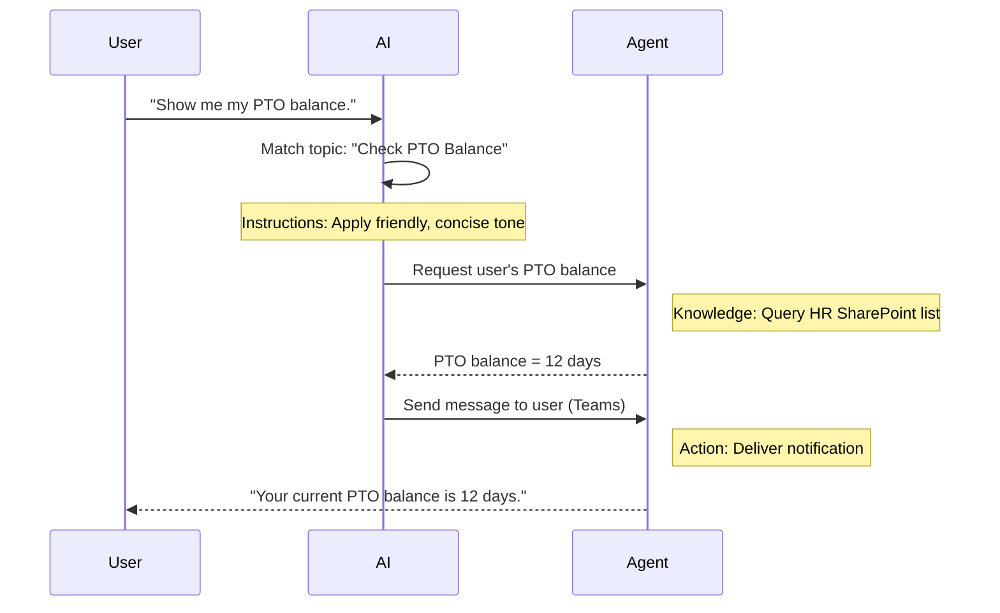

<!--
CO_OP_TRANSLATOR_METADATA:
{
  "original_hash": "90a3c5122f5687bbc8cc819990f175d4",
  "translation_date": "2025-10-18T03:04:34+00:00",
  "source_file": "docs/recruit/02-copilot-studio-fundamentals/README.md",
  "language_code": "ja"
}
-->
# 🚨 ミッション 02: Copilot Studio 基礎

## 🕵️‍♂️ コードネーム: `OPERATION CORE PROTOCOL`

> **⏱️ 作戦時間枠:** `約30分 – 情報収集のみ、現場作業は不要`  

🎥 **ウォークスルーを見る**

[](https://www.youtube.com/watch?v=x4OCwDRGeLE "YouTubeでウォークスルーを見る")

## 🎯 ミッション概要

ようこそ、新人。今回のミッションでは、Copilot Studioの仕組みを理解し、実際のビジネス価値を提供するインテリジェントエージェントを構築するための基礎的な情報を提供します。

最初のエージェントを構築する前に、カスタムAIエージェントを構成する4つの重要な要素、つまり「知識」「ツール」「トピック」「指示」を理解する必要があります。また、これらの要素がCopilot Studioオーケストレーターでどのように連携するかも学びます。

## 🔎 目標

このミッションでは以下を学びます:

- **Copilot Studioとは何かを学ぶ**
- **エージェントを使用するタイミングと理由を学ぶ**
- **エージェントの4つの構成要素を探る**
      - **知識**
      - **ツール**
      - **トピック**
      - **指示**
- **これらの要素がどのように連携するかを理解する**ことで、インテリジェントで自動化されたエージェントを作成する方法を学ぶ

---

## Copilot Studioのエージェントとは？

**エージェント**とは、特定のタスクや質問に対応するために設計された専門的なAIアシスタントです。汎用的なチャットボットとは異なり、エージェントは以下の特徴を持っています:

- **会社特有のデータを知っている**（ポリシー、文書、データベースなど）  
- **実際のタスクを実行する**（メッセージ送信、カレンダーイベントの作成、記録の更新など）  
- **会話の文脈を維持する**ことで、以前の質問に基づいてフォローアップが可能  

Copilot Studioはローコードであるため、事前に構築されたコンポーネントをドラッグ＆ドロップするだけで、深いコーディングスキルは必要ありません。エージェントを構築した後は、Teams、Slack、またはカスタムウェブページ内で呼び出して、回答を得たり、ワークフローを自動的にトリガーしたりすることができます。

---

## Copilot Studioを使用するタイミングと理由

Microsoft 365 CopilotはOfficeアプリ全体で一般的なAI支援を提供しますが、カスタムエージェントが必要になる場合があります:

### 特定の分野の知識が必要な場合

- 標準のCopilotでは、会社の内部手続きやデータを知らないことがあります。エージェントは、SharePointサイト、データベース、カスタムソースを照会して、正確で最新の回答を提供できます。  

### 複数ステップのワークフローを自動化したい場合

- 例えば、「誰かが経費を提出したら承認に送信し、財務トラッカーを更新し、マネージャーに通知する」というようなワークフローを、単一のコマンドやイベントでトリガーできます。  

### 文脈に応じたツール内での体験が必要な場合  

- 例えば、Teams内でHRスタッフをガイドし、ポリシーを説明し、必要なフォームを送信し、オリエンテーションの会議をスケジュールする「新入社員オンボーディングエージェント」を想像してください。  

---

## エージェントの4つの構成要素

すべてのCopilot Studioエージェントは、以下の4つの基本的な構成要素から成り立っています:

1. **知識**  
1. **ツール（アクション）**  
1. **トピック**  
1. **指示**

以下では、それぞれの構成要素を定義し、それらがどのように連携して効果的なエージェントを作成するかを説明します。

### 1. 知識

**知識**は、エージェントが正確に質問に答えるために使用するデータと文脈です。以下の2つの部分から構成されます:

#### カスタム指示と文脈

- エージェントの目的やトーンを簡潔に記述します。例えば:  

    ```text
    You are an IT support agent. You help employees troubleshoot common software issues, provide troubleshooting steps, and escalate urgent tickets.
    ```

- 会話中、エージェントは以前のやり取りを記憶し、すでに話し合った内容を参照することができます（例えば、ユーザーが最初に「プリンターがオフラインです」と言った後、「インクの残量を確認しましたか？」と尋ねた場合、エージェントはプリンターの文脈を覚えています）。

#### 知識ソース（基盤データ）

- エージェントを複数のデータソース（SharePointライブラリ、ドキュメントサイト、ウィキ、その他のデータベースなど）に接続します。  
- ユーザーが質問をすると、エージェントはこれらのソースから関連する抜粋を取得し、回答を**基盤**に基づいたものにします。  
- エージェントがこれらのソースからの情報のみを使用して回答するように強制することも可能で、推測や「幻覚」の回答を防ぐことができます。

!!! example
    「ポリシーアシスタント」エージェントは、HRのSharePointサイトに接続することができます。ユーザーが「私たちのPTOの累積率は何ですか？」と尋ねた場合、エージェントはHRポリシー文書から正確なテキストを取得し、一般的なAIの回答に頼ることなく情報を提供します。

---

### 2. ツール（アクション）

**ツール（アクション）**は、チャット以外でエージェントが実行できるタスクを定義します。各アクションは、エージェントがプログラム的に実行するタスクです。例えば:

- メールやTeamsメッセージの送信  
- カレンダーイベントの作成や更新  
- データベース（例: SharePointリストやDataverseテーブル）への記録の追加や編集  
- Power AutomateフローやREST APIの呼び出し  

#### アクションの仕組み

- **入力と出力の定義**  
      - 例えば、メール送信アクションには以下が必要です:  
        - `RecipientEmailAddress`  
        - `SubjectLine`  
        - `EmailBody`  

- **アクションをワークフローに組み合わせる**  
      - ユーザーのリクエストを満たすには、複数のステップが必要な場合があります。  
      - アクションを順序付けて以下のように実行できます:  
             1. エージェントがSharePointリストからデータを取得する。  
             2. LLMを使用して要約を生成する。  
             3. Teamsメッセージでその要約を送信する。  

- **外部システムへの接続**  
      - CRMを更新したり、内部APIを呼び出したりする必要がある場合は、カスタムアクションを作成して対応します。  
      - Copilot StudioはPower Platformや任意のHTTPベースのエンドポイントと統合できます。

!!! example "「経費ヘルパー」エージェントの例:"  
    1. 「経費を提出する」というリクエストを受け取る。  
    2. フォームからユーザーの経費詳細を取得する。  
    3. 「SharePointリストに追加」アクションを使用してデータを保存する。  
    4. 「メール送信」アクションをトリガーして承認者に通知する。  

---

### 3. トピック

**トピック**は、エージェントの会話のトリガーやエントリーポイントを定義します。各トピックは、機能や質問カテゴリに対応しています。

#### 会話のトリガー  

- トピックには「ITチケットの提出」「休暇残高の確認」「営業レポートの作成」などがあります。  
- Copilot Studioは**生成的オーケストレーション**を使用しており、正確なキーワードに依存せず、AIがユーザーの意図を解釈して、提供された短い説明に基づいて適切なトピックを選択します。  

#### トピックの説明  

- 各トピックでは、そのトピックがカバーする内容を明確かつ簡潔に記述します。

!!! example "トピック説明の例"
    このトピックは、ユーザーがITサポートチケットを提出する際に、問題の詳細、優先度、連絡先情報を収集するのを支援します。

- AIはその説明を使用して、ユーザーの表現が完全に一致しなくてもこのトピックをアクティブにします。

#### トピックとアクションのマッピング  

- 各トピックは、1つ以上のアクションやデータ取得ステップに接続されています。  
- AIがトピックを選択すると、定義されたシーケンスに従って会話を進めます（フォローアップ質問をする、アクションを呼び出す、結果を返すなど）。

!!! example
    ユーザーが「新しいラップトップのセットアップを手伝ってほしい」と言った場合、AIはその意図を「ITチケットの提出」トピックに一致させるかもしれません。その後、エージェントはラップトップのモデル、ユーザーの詳細を尋ね、ヘルプデスクシステムにチケットを自動的に送信します。

---

### 4. 指示

**指示**（時には「プロンプト」や「システムメッセージ」とも呼ばれる）は、LLMのトーン、スタイル、境界を導きます。これにより、エージェントがどのように応答するかが形作られます。

#### 役割とペルソナ  

- AIにその役割を伝えます（例: 「あなたはContoso Retailのカスタマーサービスエージェントです」）。  
- これにより、用途に応じてフレンドリー、簡潔、フォーマル、カジュアルなどのトーンが設定されます。

#### 応答ガイドライン  

- エージェントが従うべきルールを指定します。例えば:  
      - 「常にポリシー情報を箇条書きで要約する。」  
      - 「答えがわからない場合は、『その情報は持っていません』と言う。」  
      - 「文脈外で機密データを含めない。」  

#### メモリと文脈のルール

- エージェントが会話の詳細をどれだけ記憶するかを指示できます。  
- 例えば: 「このユーザーのリクエストの詳細を最大3回のフォローアップ質問まで記憶する。」

!!! example "「福利厚生アドバイザー」エージェントでは以下を含めることができます:"
    「質問に答える際は常に最新のHRハンドブックを参照してください。登録期限について尋ねられた場合は、ポリシーから具体的な日付を提供してください。回答は150語以内にしてください。」

---

## 4つの構成要素がどのように連携するか

**知識**、**ツール**、**トピック**、**指示**を組み合わせることで、Copilot StudioのAIオーケストレーターは以下のようなエージェントを作成します:

1. **関連するトピックを聞き取る**（トピック説明に基づいてガイドされる）。  
1. **指示を適用する**ことで、トーンを設定し、フォローアップ質問をするタイミングを決定し、ルールを適用する。  
1. **知識ソースを活用する**ことで、組織のデータに基づいた回答を提供する。  
1. **必要に応じてツール（アクション）を呼び出す**ことで、メッセージ送信、記録の更新、APIの呼び出しなどのタスクを実行する。  

内部的には、オーケストレーターは**生成的プランニング**アプローチを使用して、ユーザーのリクエストを満たすためにどのステップをどの順序で実行するかを決定します。アクションが失敗した場合（例えば、メールが送信できない場合）、エージェントは例外処理ガイドラインに従います（明確化の質問をする、またはエラーを報告する）。LLMは会話の文脈に適応するため、エージェントは複数のターンにわたってメモリを維持し、会話が進むにつれて新しい情報を取り入れることができます。

**ビジュアルフロー例:**  
<!--
1. **ユーザー:** 「私のPTO残高を教えてください。」
1. **AI（トピック）:** 「PTO残高の確認」トピックに一致。  
1. **AI（指示）:** フレンドリーで簡潔なトーンを使用。  
1. **エージェント（知識）:** HRのSharePointリストを照会してユーザーの残高を確認。  
1. **エージェント（アクション）:** 値を取得し、Teamsメッセージを送信:  
   > 「現在のPTO残高は12日です。」  
-->



---

## 🎉 ミッション完了

基礎的なブリーフィングを無事に完了しました。これで、Copilot Studioのエージェントを構成する4つの重要な要素について学びました:

1. **知識** – エージェントが事実情報を調べ、会話の記憶を維持する場所。  
1. **ツール** – エージェントが自動的に物事を実行するために使用するタスク。  
1. **トピック** – エージェントがユーザーの意図を認識し、どのワークフローを実行するかを決定する方法。  
1. **指示** – すべての応答を導くルール、トーン、境界。

これらの構成要素が揃えば、質問に答えたり、簡単なワークフローを実行する基本的なエージェントを構築することができます。次のレッスンでは、「サービスデスク」エージェントを作成するステップバイステップのチュートリアルを実施します—最初の知識ソースを接続するところから、トピックを定義し、アクションを設定するところまで。

次回: [M365 Copilot用の最初の宣言型エージェントを構築する](../03-create-a-declarative-agent-for-M365Copilot/README.md)。

<!-- markdownlint-disable-next-line MD033 -->


---

**免責事項**:  
この文書はAI翻訳サービス[Co-op Translator](https://github.com/Azure/co-op-translator)を使用して翻訳されています。正確性を追求しておりますが、自動翻訳には誤りや不正確な部分が含まれる可能性があります。元の言語で記載された文書を正式な情報源としてご参照ください。重要な情報については、専門の人間による翻訳を推奨します。この翻訳の使用に起因する誤解や誤認について、当社は一切の責任を負いません。