<!--
CO_OP_TRANSLATOR_METADATA:
{
  "original_hash": "0c51aabca81d6256990caf4c015e6195",
  "translation_date": "2025-10-18T02:57:18+00:00",
  "source_file": "docs/recruit/04-creating-a-solution/README.md",
  "language_code": "ja"
}
-->
# 🚨 ミッション 04: エージェントのためのソリューションを作成する

## 🕵️‍♂️ コードネーム: `OPERATION CTRL-ALT-PACKAGE`

> **⏱️ ミッション実行時間:** `約45分`

🎥 **ウォークスルーを視聴する**

[](https://www.youtube.com/watch?v=1iATbkgfcpU "YouTubeでウォークスルーを視聴する")

## 🎯 ミッション概要

エージェントメーカーの皆さん、次の戦術的なミッションへようこそ。このミッションでは、Microsoft Copilot Studioで構築したITヘルプデスクエージェントの公式デプロイメントツールである「ソリューション」を組み立てる方法を学びます。これは、エージェントとそのアーティファクトを収納するデジタルブリーフケースを作成するようなものです。

すべてのエージェントには、しっかりとしたホームが必要です。それがPower Platformソリューションの役割です。秩序、移植性、そして本番環境への準備を提供します。

さあ、準備を始めましょう。

## 🔎 目標

このミッションでは以下を学びます:

1. Power Platformソリューションとは何か、その役割について理解する
1. エージェントを整理しデプロイするためにソリューションを使用する利点を学ぶ
1. ソリューションパブリッシャーの重要性とコンポーネント管理について探る
1. 開発から本番までのPower Platformソリューションライフサイクルを理解する
1. ITヘルプデスクエージェントのための独自のソリューションパブリッシャーとカスタムソリューションを作成する

## 🕵🏻‍♀️ ソリューションって何？

Microsoft Power Platformでは、ソリューションはアプリやエージェントのすべての部品を収納するコンテナやパッケージのようなものです。これには、テーブル、フォーム、フロー、カスタムロジックなどが含まれます。ソリューションはアプリケーションライフサイクル管理（ALM）に不可欠で、アイデアから開発、テスト、デプロイ、更新まで、アプリやエージェントを管理することができます。

Copilot Studioでは、作成するすべてのエージェントがPower Platformソリューションに保存されます。デフォルトでは、エージェントはデフォルトソリューションに作成されますが、新しいカスタムソリューションを作成してエージェントを作成することもできます。このレッスンと実践ラボでその方法を学びます 🤓。

従来、ソリューションは**Power Apps メーカーポータル**で作成されていました。これは、アプリを構築・カスタマイズしたり、Dataverse、フロー、AIコンポーネントを探索したりするためのウェブベースのインターフェースです。

   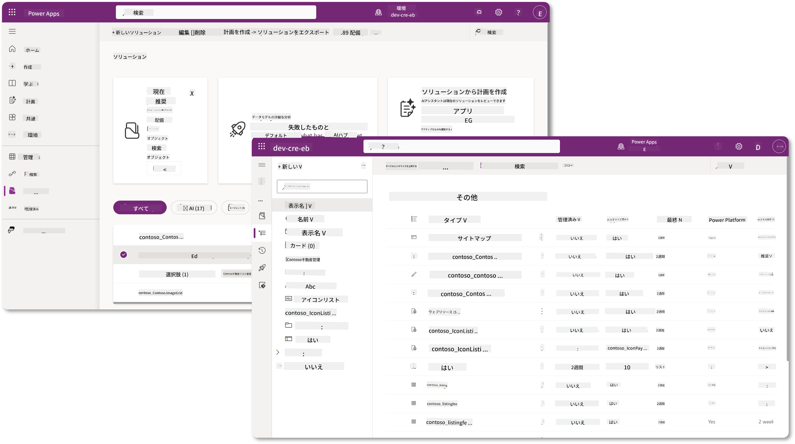

Copilot Studioでは、**ソリューションエクスプローラー**が新たに導入され、ソリューションを直接管理することができます。Power Appsメーカーポータルに切り替える必要がなくなり、Copilot Studio内でソリューション関連のタスクを実行できます 🪄。

これにより、以下のような通常のソリューション関連タスクを実行できます:

- **ソリューションの作成** - カスタムソリューションを作成することで、エージェントを環境間でエクスポートおよびインポートできます。
- **優先ソリューションの設定** - デフォルトでエージェント、アプリなどが作成されるソリューションを選択します。
- **コンポーネントの追加または削除** - エージェントが環境変数やクラウドフローなどの他のコンポーネントを参照している場合、これらのコンポーネントをソリューションに含める必要があります。
- **ソリューションのエクスポート** - ソリューションを別のターゲット環境に移動します。
- **ソリューションのインポート** - 他の場所で作成されたソリューションをインポートし、ソリューションのアップグレードや更新を行います。
- **ソリューションパイプラインの作成と管理** - 環境間でのソリューションのデプロイを自動化します。
- **Git統合** - 開発者がGitリポジトリとソリューションを接続し、バージョン管理、コラボレーション、ALMを実現します。開発環境でのみ使用することを目的としています。

   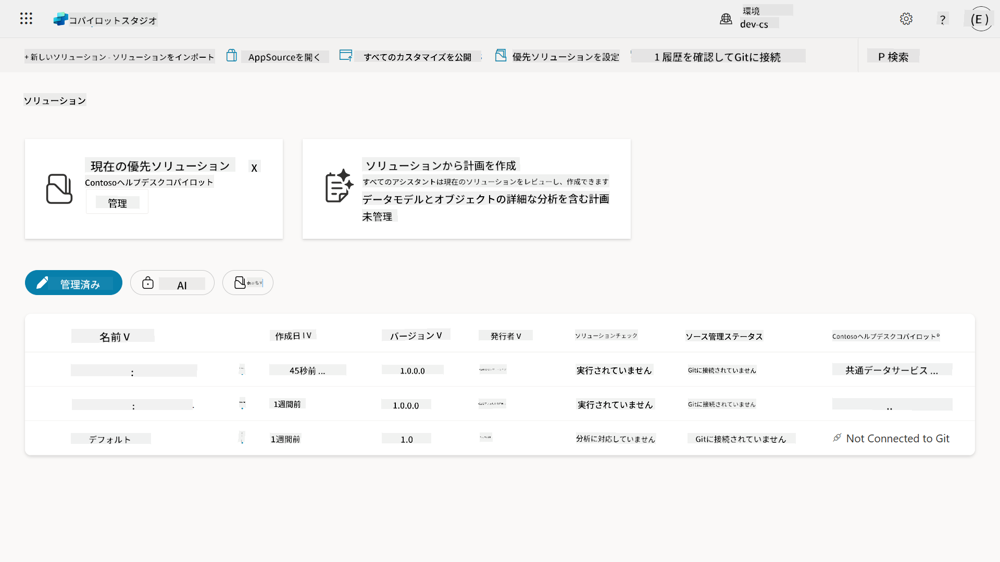

ソリューションには2種類あります:

- **アンマネージドソリューション** - 開発中に使用されます。必要に応じて自由に編集やカスタマイズが可能です。
- **マネージドソリューション** - アプリをテストや本番環境にデプロイする準備が整った際に使用されます。誤った変更を防ぐためにロックされています。

## 🤔 なぜエージェントにソリューションを使用するべきなのか？

ソリューションを_ツールボックス_と考えてみてください。別の場所（環境）で何かを修理したり構築したりする必要があるとき（エージェント）、必要なツール（コンポーネント）をすべて集めてツールボックス（ソリューション）に入れます。そして、このツールボックスを新しい場所（環境）に持ち運び、ツール（コンポーネント）を使って作業を完了したり、新しいツール（コンポーネント）を追加してエージェントやプロジェクトをカスタマイズすることができます。

!!! quote "クラウドアドボケートのElaizaが登場🙋🏻‍♀️"
    ニュージーランドには「Be a tidy Kiwi!」という言葉があります。これはニュージーランド人 🥝 に対して、環境に責任を持ち、ゴミを適切に処分し公共の場を清潔に保つよう呼びかけるものです。同じ考え方をエージェントにも適用し、エージェントに関連するすべてを整理し、持ち運び可能にすることで、環境を整然と保つことができます。

エージェントをソース（開発者）環境内の専用ソリューションで作成することは良い習慣です。以下がソリューションの価値です:

🧩 **整理された開発**

- エージェントを環境内のすべてを含むデフォルトソリューションから分離して管理できます。エージェントのコンポーネントが一箇所にまとまります 🎯。

- エージェントに必要なすべてがソリューション内にあるため、ターゲット環境へのエクスポートやインポートが簡単になります 👉🏻 これはALMの健全な習慣です。

🧩 **安全なデプロイ**

- アプリやエージェントをマネージドソリューションとしてエクスポートし、テストや本番環境などの他のターゲット環境にデプロイすることで、誤った編集のリスクを回避できます。

🧩 **バージョン管理**

- パッチ（特定の修正）、更新（より包括的な変更）、またはアップグレード（ソリューションの置き換え - 通常は大きな変更や新機能の導入）を作成できます。

- 変更を制御された方法で展開するのに役立ちます。

🧩 **依存関係の管理**

- ソリューションは、どの部分が他の部分に依存しているかを追跡します。これにより、変更を加えた際に問題が発生するのを防ぎます。

🧩 **チームコラボレーション**

- 開発者やメーカーがアンマネージドソリューションを使用して共同作業を行い、マネージドソリューションをデプロイのために引き渡すことができます。

## 🪪 ソリューションパブリッシャーを理解する

Power Platformのソリューションパブリッシャーは、ソリューションを作成または所有している人を識別するラベルやブランドのようなものです。これは、アプリ、エージェント、フローのカスタマイズを管理する上で、特にチームや環境間で作業する際に重要な要素です。

ソリューションを作成する際には、パブリッシャーを選択する必要があります。このパブリッシャーは以下を定義します:

- テーブル、フィールド、フローなどのカスタムコンポーネントに追加されるプレフィックス。

- ソリューションを所有する組織や個人の名前と連絡先情報。

### 🤔 なぜ重要なのか？

1. **簡単な識別** - プレフィックス（例: `new_` や `abc_`）は、どのコンポーネントがどのソリューションやチームに属しているかをすぐに識別するのに役立ちます。

1. **衝突の回避** - 2つのチームが「status」という列を作成した場合、プレフィックス（`teamA_status`、`teamB_status`）が名前の衝突を防ぎます。

1. **ALMのサポート** - ソリューションを環境間（開発 → テスト → 本番）で移動する際に、パブリッシャーが所有権を追跡し、一貫性を維持します。

### ✨ 例

例えば、Contoso Solutionsというパブリッシャーを作成し、プレフィックスを`cts_`とします。

カスタム列として_Priority_を追加すると、その列はソリューション内で`cts_Priority`として保存されます。

どの環境であっても、ソリューションレベルでその列を見た人は、それがContoso Solutionsに関連する列であることを簡単に識別できます。

## 🧭 Power Platformソリューションライフサイクル

ソリューションの目的を理解したところで、次にライフサイクルについて学びましょう。

**1. 開発環境でソリューションを作成** - 開発環境で新しいソリューションを作成します。

**2. コンポーネントを追加** - アプリ、フロー、テーブル、その他の要素をソリューションに追加します。

**3. マネージドソリューションとしてエクスポート** - デプロイ用にソリューションをパッケージ化し、マネージドソリューションとしてエクスポートします。

**4. テスト環境にインポート** - 別のテスト環境でソリューションをテストし、すべてが期待通りに動作することを確認します。

**5. 本番環境にインポート** - テスト済みのソリューションをライブの本番環境にデプロイします。

**6. パッチ、更新、またはアップグレードを適用** - パッチ、更新、またはアップグレードを使用して改善や修正を行います。🔁 サイクルを繰り返します！

### ✨ 例

例えば、ITヘルプデスクエージェントを構築して、デバイスの問題、ネットワークのトラブルシューティング、プリンターのセットアップなどの問題を従業員が解決できるようにする場合を考えます。

- 開発環境でアンマネージドソリューションを使用して開始します。

- 準備が整ったら、マネージドソリューションとしてエクスポートし、システムテストやユーザー受け入れテスト（UAT）環境などのターゲット環境にインポートします。

- テスト後、元の開発バージョンに触れることなく、本番環境に移行します。

## 🧪 ラボ 04: 新しいソリューションを作成する

ここでは以下を学びます:

- [4.1 ソリューションパブリッシャーの作成方法](../../../../../docs/recruit/04-creating-a-solution)
- [4.2 ソリューションの作成方法](../../../../../docs/recruit/04-creating-a-solution)

先ほどの例に従い、ITヘルプデスクエージェントを構築するために専用のCopilot Studio環境でソリューションを作成します。

さあ、始めましょう！

### 前提条件

#### セキュリティロール

Copilot Studioでは、ソリューションエクスプローラーで_できること_は、ユーザーのセキュリティロールに依存します。
Power Apps管理センターでソリューションを管理する権限がない場合、Copilot Studioでもこれらのタスクを実行することはできません。

すべてがスムーズに進むように、適切なセキュリティロールと権限を持っていることを確認してください。もし組織内で環境を管理していない場合は、テナントや環境を管理しているIT管理者（またはそれに相当するチーム）に確認してください。

以下は、環境内でソリューションを作成するために必要なセキュリティロールです。

| セキュリティロール    | 説明 |
| ---------- | ---------- |
| Environment Maker | 特定の環境内でリソースを作成、カスタマイズ、管理するための必要な権限を提供します  |
| System Customizer  | Environment Makerより広範な権限を持ち、環境をカスタマイズし、セキュリティロールを管理する能力を含みます |
| System Administrator   | 最高レベルの権限を持ち、環境のすべての側面を管理し、セキュリティロールを作成および割り当てることができます     |

#### 開発者環境

専用の開発者環境に切り替えてください。[レッスン00 - コースセットアップ - ステップ3: 新しい開発者環境を作成する](../00-course-setup/README.md#step-3-create-new-developer-environment)を参照してください。

1. 右上の**歯車アイコン**を選択し、デフォルト環境から専用環境に切り替えます。例えば、**Adele Vanceの環境**。

    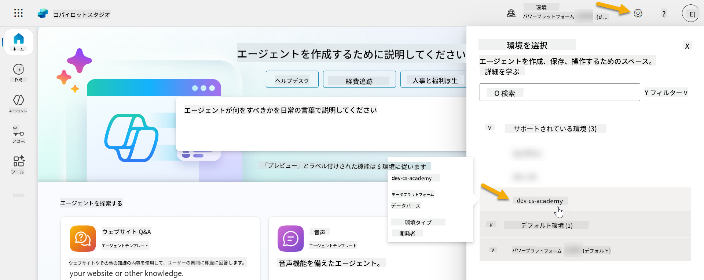

### 4.1 ソリューションパブリッシャーを作成する

1. 前のレッスンで使用した同じCopilot Studio環境を使用して、Copilot Studioの左側メニューにある**省略記号アイコン (. . .)**を選択します。**Explore**ヘッダーの下にある**Solutions**を選択します。

    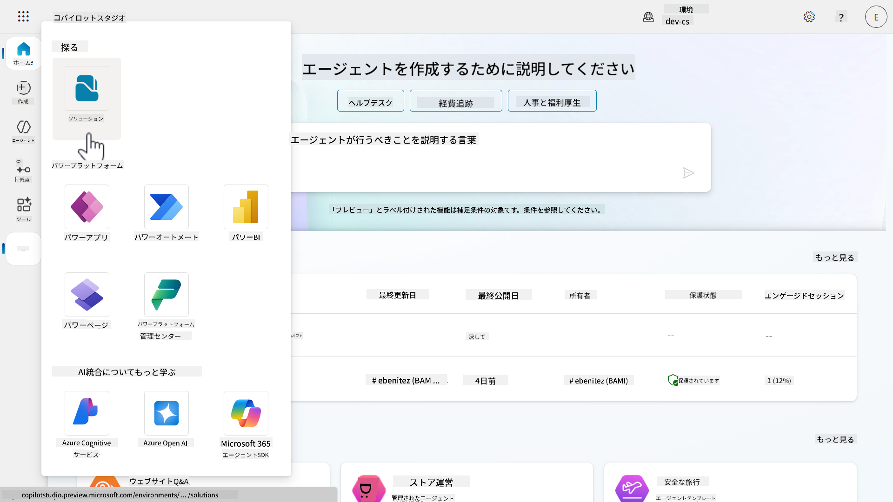

1. Copilot Studioの**ソリューションエクスプローラー**が読み込まれます。**+ New solution**を選択します。

    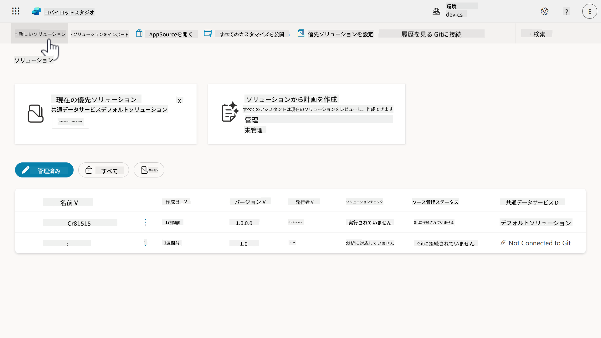

1. **New solution**ペインが表示され、ソリューションの詳細を定義できます。まず、新しいパブリッシャーを作成する必要があります。**+ New publisher**を選択します。

    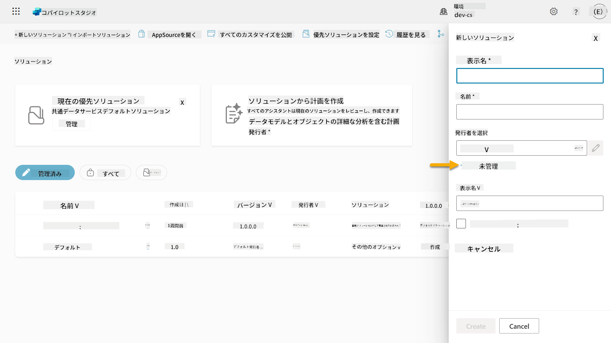  

1. **New publisher**ペインの**Properties**タブが表示され、必須および非必須フィールドを入力します。このタブでは、ソリューションを作成または所有する人を識別するラベルやブランドの詳細を記載します。

    | プロパティ    | 説明 | 必須 |
    | ---------- | ---------- | :----------: |
    | 表示名 | パブリッシャーの表示名 | はい   |
    | 名前  | パブリッシャーの一意の名前とスキーマ名  | はい    |
    | 説明   | ソリューションの目的を記載    | いいえ     |
    | プレフィックス    | 新しく作成されたコンポーネントに適用されるパブリッシャープレフィックス   | はい      |
    | 選択値プレフィックス   | パブリッシャープレフィックスに基づいて生成される番号
1. 新しいパブリッシャーパネルが閉じられ、**新しいソリューション**パネルに戻ります。ここでは、先ほど作成したパブリッシャーが選択されています。

    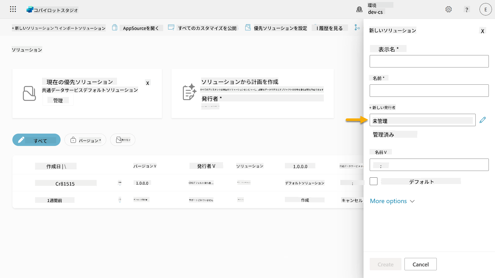  

やったね！これでソリューションパブリッシャーが作成できました！🙌🏻 次は新しいカスタムソリューションの作成方法を学びましょう。

### 4.2 新しいソリューションを作成する

1. ソリューションを作成したので、**新しいソリューション**パネルでフォームの残りの部分を完成させましょう。

    以下を**表示名**としてコピー＆ペーストしてください。

    ```text
    Contoso Helpdesk Agent
    ```

    以下を**名前**としてコピー＆ペーストしてください。

    ```text
    ContosoHelpdeskAgent
    ```

    新しいソリューションを作成しているため、[**バージョン**番号](https://learn.microsoft.com/power-apps/maker/data-platform/update-solutions#understanding-version-numbers-for-updates/?WT.mc_id=power-172615-ebenitez)はデフォルトで`1.0.0.0`になります。

    **優先ソリューションとして設定**チェックボックスをオンにしてください。

    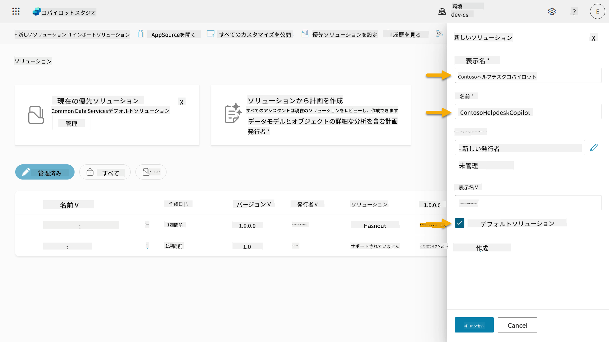  

1. **その他のオプション**を展開して、ソリューションに提供できる追加の詳細を確認してください。

    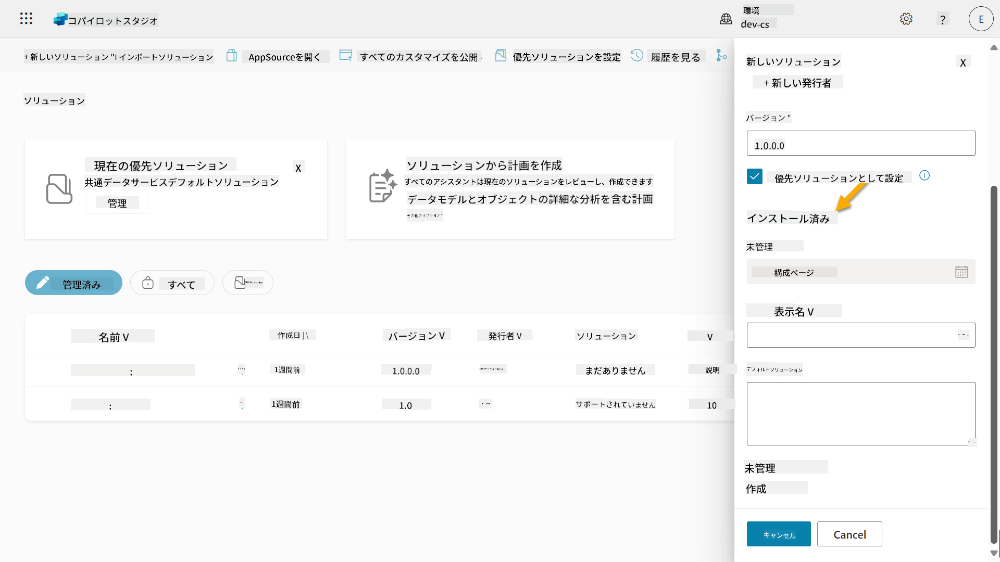

1. 以下の項目が表示されます。

    - **インストール日** - ソリューションがインストールされた日付。
    - **構成ページ** - 開発者がHTMLウェブリソースを設定し、ユーザーがアプリ、エージェント、またはツールと対話できるようにするもの。情報セクションにウェブページとして表示され、指示やボタンが含まれます。主に企業や他者とソリューションを共有する開発者によって使用されます。
    - **説明** - ソリューションや構成ページの概要を説明します。

    このラボではこれらは空白のままにしておきます。

    **作成**を選択してください。

    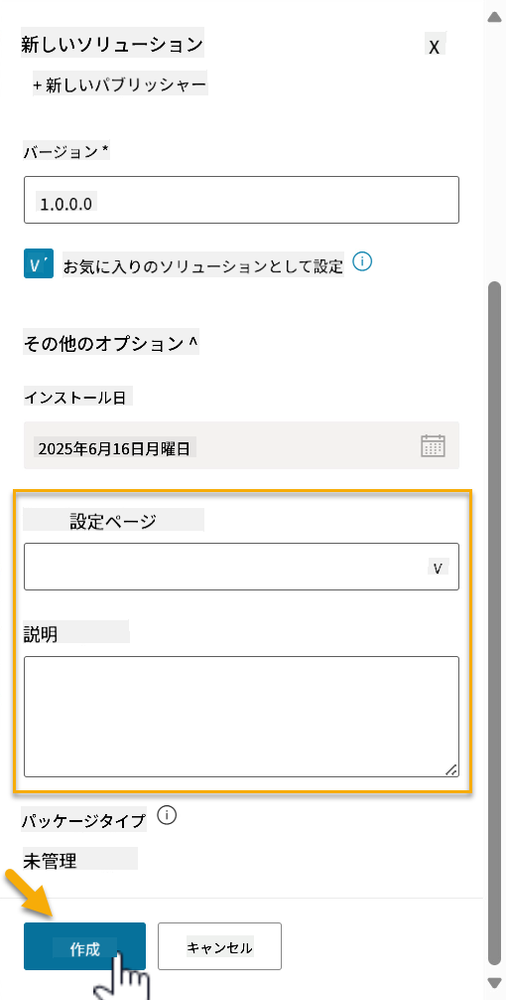

1. Contoso Helpdesk Agentのソリューションが作成されました。Copilot Studioでエージェントを作成するまで、コンポーネントはゼロのままです。

    **戻る矢印**アイコンを選択して、ソリューションエクスプローラーに戻ります。

    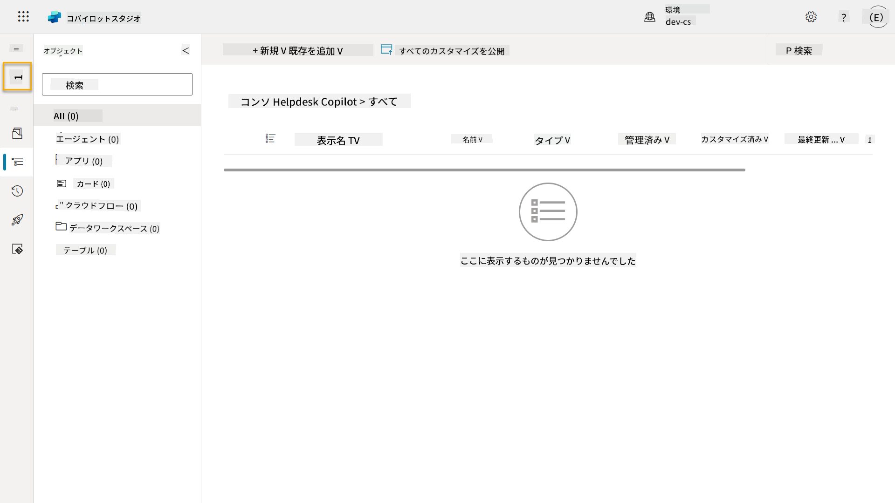

1. 先ほど**優先ソリューションとして設定**チェックボックスをオンにしたため、Contoso Helpdesk Agentが**現在の優先ソリューション**として表示されていることに気づくでしょう。

    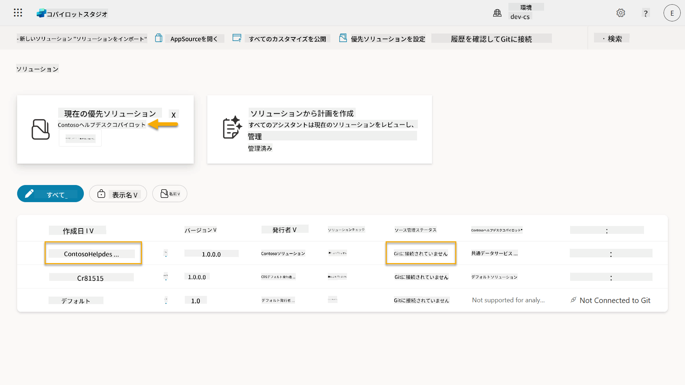

## ✅ ミッション完了

おめでとうございます！👏🏻 パブリッシャーを作成し、それを使用して新しいソリューションを作成し、エージェントを構築する準備が整いました！

素晴らしい仕事です、エージェントメーカー。整然としたデジタルフットプリントは、スケールでの運用性への第一歩です。これで、持続可能で企業向けのエージェント開発のためのツールと考え方を手に入れました。

これで**ラボ04 - ソリューションの作成**は終了です。次のレッスンに進むには、以下のリンクを選択してください。このラボで作成したソリューションは、次のレッスンのラボで使用されます。

⏭️ [**事前構築されたエージェントで迅速に始める**レッスンに進む](../05-using-prebuilt-agents/README.md)

## 📚 戦術的リソース

🔗 [ソリューションを作成する](https://learn.microsoft.com/power-apps/maker/data-platform/create-solution/?WT.mc_id=power-172615-ebenitez)

🔗 [Copilot Studioでソリューションを作成および管理する](https://learn.microsoft.com/microsoft-copilot-studio/authoring-solutions-overview/?WT.mc_id=power-172615-ebenitez)

🔗 [エージェントを他のユーザーと共有する](https://learn.microsoft.com/microsoft-copilot-studio/admin-share-bots/?WT.mc_id=power-172615-ebenitez)

🔗 [事前定義されたセキュリティロールに利用可能なリソースの概要](https://learn.microsoft.com/power-platform/admin/database-security#summary-of-resources-available-to-predefined-security-roles/?WT.mc_id=power-172615-ebenitez)

🔗 [ソリューションをアップグレードまたは更新する](https://learn.microsoft.com/power-apps/maker/data-platform/update-solutions/?WT.mc_id=power-172615-ebenitez)

🔗 [Power Platformにおけるパイプラインの概要](https://learn.microsoft.com/power-platform/alm/pipelines/?WT.mc_id=power-172615-ebenitez)

🔗 [Power PlatformにおけるGit統合の概要](https://learn.microsoft.com/power-platform/alm/git-integration/overview/?WT.mc_id=power-172615-ebenitez)


---

**免責事項**:  
この文書はAI翻訳サービス[Co-op Translator](https://github.com/Azure/co-op-translator)を使用して翻訳されています。正確性を追求しておりますが、自動翻訳には誤りや不正確な部分が含まれる可能性があります。元の言語で記載された文書を正式な情報源としてご参照ください。重要な情報については、専門の人間による翻訳を推奨します。この翻訳の使用に起因する誤解や誤解釈について、当社は責任を負いません。