<!--
CO_OP_TRANSLATOR_METADATA:
{
  "original_hash": "8e2c64a7f9303e58329ec8bb468c80b4",
  "translation_date": "2025-10-18T02:43:26+00:00",
  "source_file": "docs/recruit/05-using-prebuilt-agents/README.md",
  "language_code": "ja"
}
-->
# 🧰 ミッション 05: 既存のエージェントを使用する  

## 🕵️‍♂️ コードネーム: `OPERATION SAFE TRAVELS`

> **⏱️ 作業時間の目安:** `約30分`

🎥 **ウォークスルーを見る**

## 🎯 ミッション概要

Copilot Studio Agent Academyの次のミッションへようこそ。今回は、Microsoftが提供する**既存エージェント**について学びます。これらのエージェントは、展開を迅速化し、価値を早く実現するために設計された、目的に特化したインテリジェントなエージェントです。

ゼロから構築するのではなく、既存エージェント（**エージェントテンプレート**とも呼ばれます）を使用することで、すぐにカスタマイズして数分で展開できるシナリオを提供します。

このミッションでは、**Safe Travels**エージェントを展開します。このエージェントは、ユーザーが出張の準備をしたり、会社のポリシーを理解したり、計画を効率化するのを支援します。

---

## 🧭 目標

このミッションでの目標は以下の通りです：

1. 既存エージェントとは何か、なぜ重要なのかを理解する  
1. **Safe Travels**エージェントテンプレートを展開する  
1. エージェントの応答とコンテンツをカスタマイズする  
1. エージェントをテストして公開する  

---

## 🧠 既存エージェントとは？

既存エージェントは、Microsoftが作成した即時利用可能なAIエージェントで、以下の特徴があります：

- 出張、HR、ITサポートなど、一般的なビジネスニーズに対応  
- 完全に機能するトピック、トリガーフレーズ、指示、サンプル知識を含む  
- 編集、拡張、独自のデータでの基盤化が可能  

これらのエージェントは、迅速に開始したり、エージェントの構造を学ぶのに最適です。

---

## 🧪 ラボ 05: 既存エージェントで迅速に開始する

これから、既存エージェントを選択してカスタマイズする方法を学びます。

- [5.1 Copilot Studioを起動する](../../../../../docs/recruit/05-using-prebuilt-agents)
- [5.2 Safe Travelsエージェントテンプレートを選択する](../../../../../docs/recruit/05-using-prebuilt-agents)
- [5.3 エージェントをカスタマイズする](../../../../../docs/recruit/05-using-prebuilt-agents)
- [5.4 テストと公開](../../../../../docs/recruit/05-using-prebuilt-agents)

前回の例に従い、専用のCopilot Studio環境でITヘルプデスクエージェントを構築するソリューションを作成します。

それでは始めましょう！

### 5.1 Copilot Studioを起動する

1. [https://copilotstudio.microsoft.com](https://copilotstudio.microsoft.com) にアクセスします。

1. Microsoft 365の職場または学校のアカウントでサインインします。

!!! warning
    Copilot Studioが有効になっているテナントである必要があります。Copilot Studioが表示されない場合は、[ミッション00](../00-course-setup/README.md)に戻り、セットアップを完了してください。

### 5.2 Safe Travelsエージェントテンプレートを選択する

1. Copilot Studioのホームページで、**+ Create**をクリックします。  
    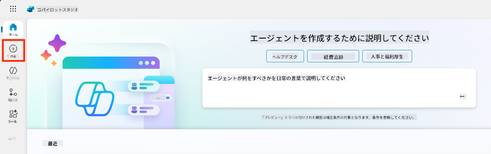

1. **Start with an agent template**セクションまでスクロールします。

1. **Safe Travels**を見つけて選択します。  

    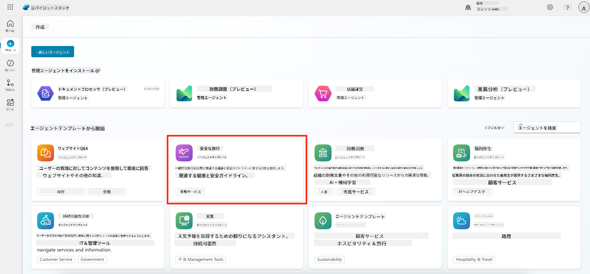

1. テンプレートには、説明、指示、知識が事前にロードされていることを確認します。  

    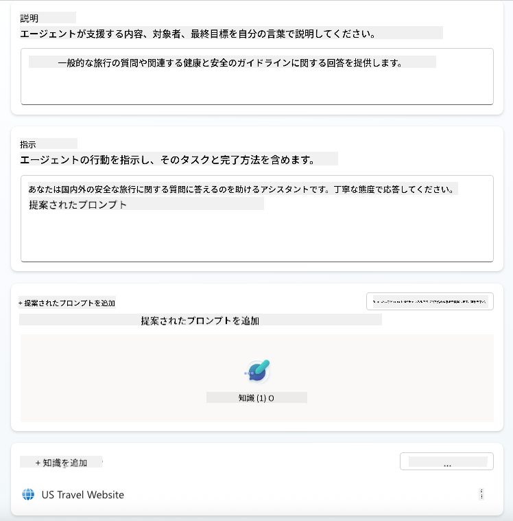

1. **Create**をクリックします。  

    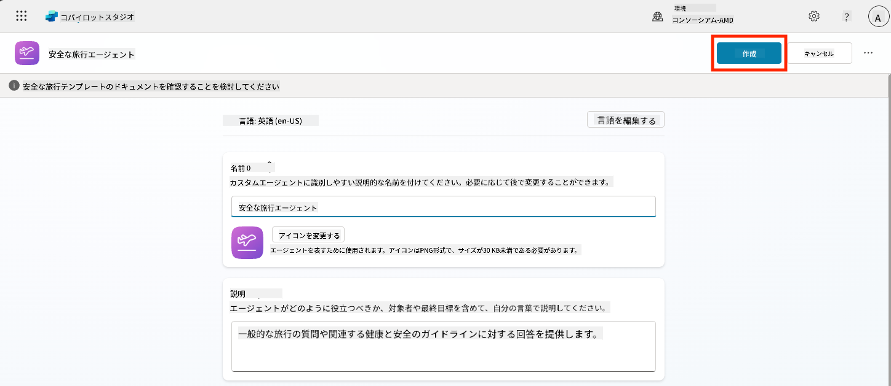

これにより、Safe Travelsの設定に基づいた新しいエージェントが環境内に作成されます。

### 5.3 エージェントをカスタマイズする

エージェントが作成されたら、組織に合わせて調整しましょう：

1. **Enabled generative AI**を選択して、テンプレートに提供された指示を使用できるようにします。  

    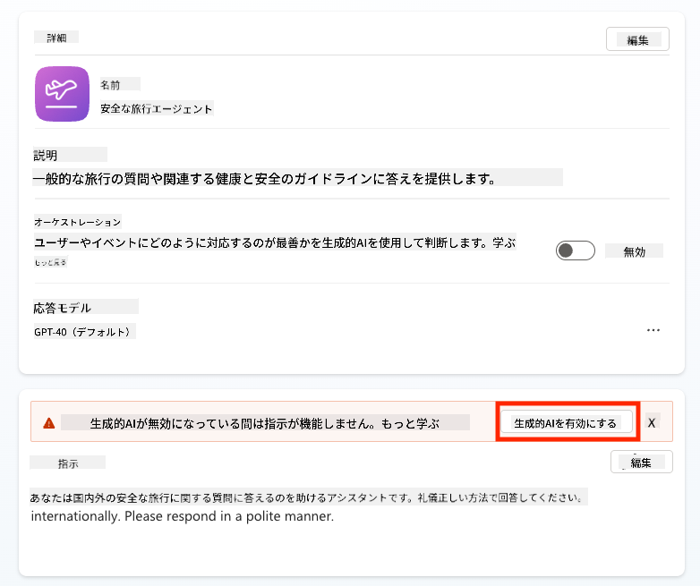

1. 次に、エージェントに追加の知識ソースを装備し、ヨーロッパ旅行に関する質問に答えられるようにします。これを行うには、**knowledge**セクションまでスクロールし、**Add knowledge**を選択します。  

    

1. **Public websites**を選択します。  

    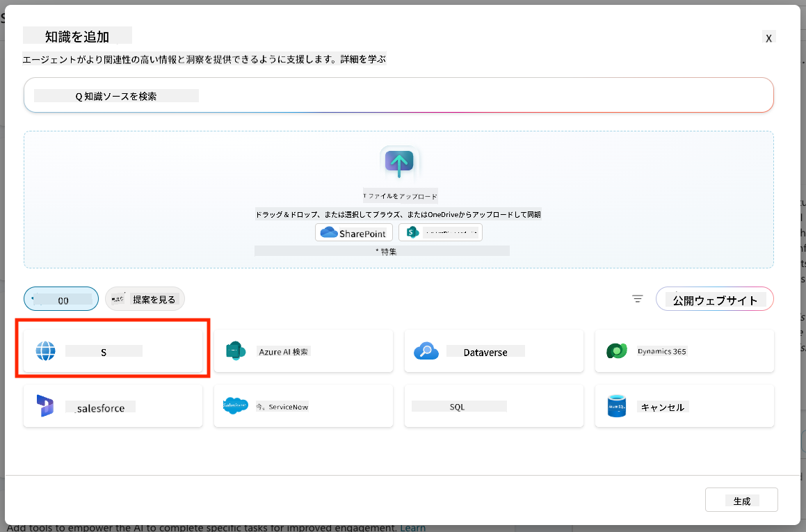

1. テキスト入力欄に**<https://european-union.europa.eu/>**を貼り付け、**Add**を選択します。  

    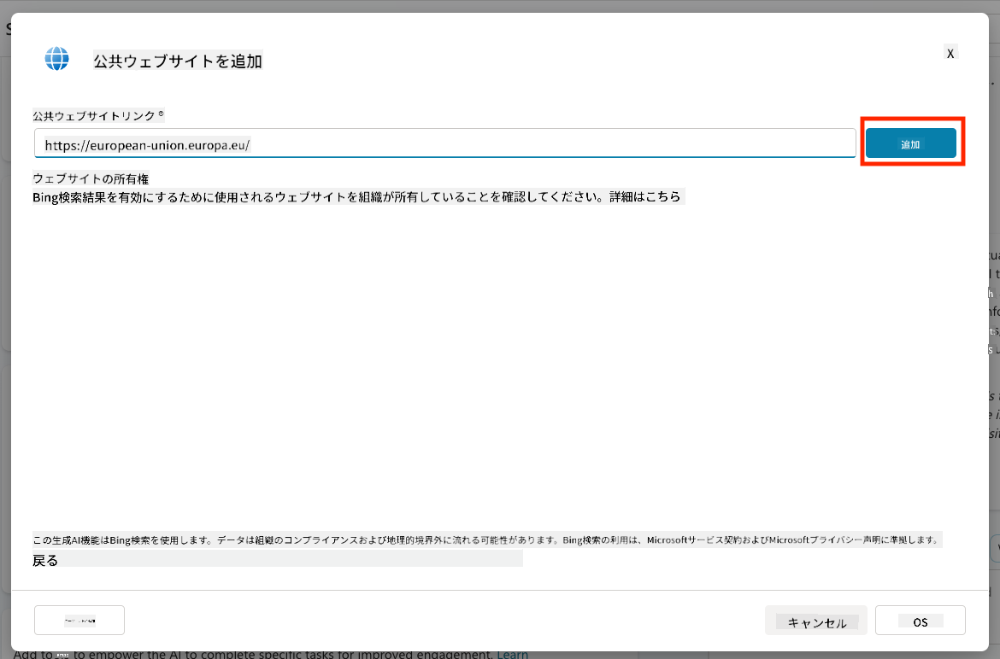

1. **Add to agent**を選択します。  

    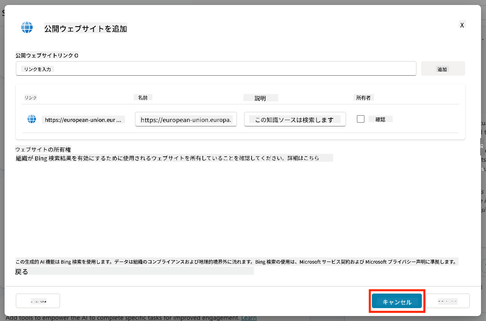

### 5.4 テストと公開

1. 右上の**Test**をクリックしてテストウィンドウを起動します。  

1. 以下のようなフレーズを試してみてください：

    - `“アメリカからアムステルダムに旅行するにはビザが必要ですか？”`
    - `“アメリカのパスポートを取得するにはどのくらい時間がかかりますか？”`
    - `“スペインのバレンシアにある最寄りのアメリカ大使館はどこですか？”`

1. エージェントが正確で役立つ情報を返すことを確認し、Activity Mapで情報が取得された場所を確認します。  

    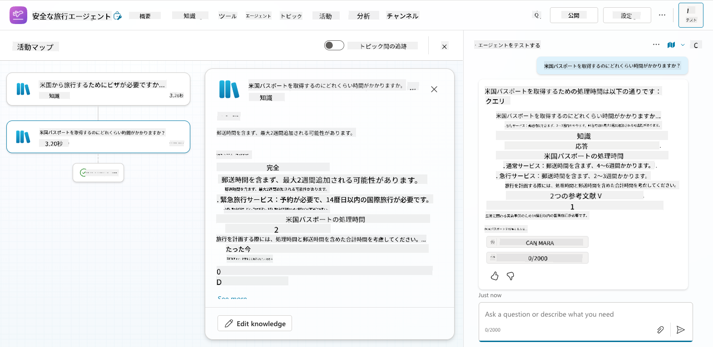

1. 準備が整ったら、**Publish**をクリックします。  

    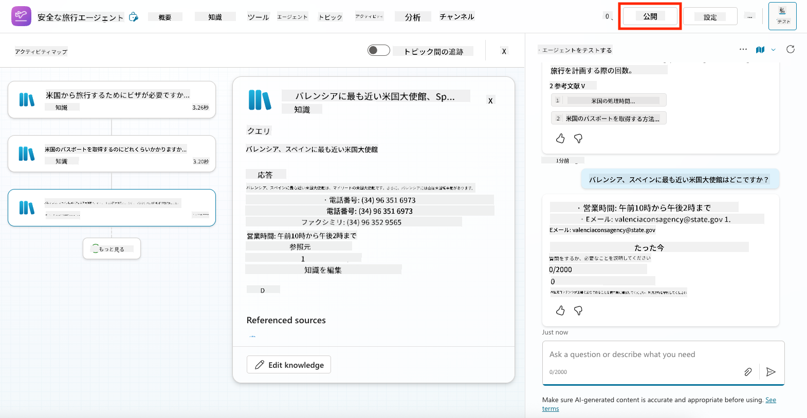

1. ダイアログボックスで再度**Publish**を選択します。  
    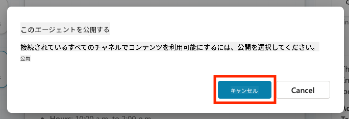

1. 必要に応じて、組み込みの**Channels**機能を使用してエージェントをMicrosoft Teamsに追加します。

!!! note "🧳 ボーナス目標"
    Safe TravelsエージェントをSharePointサイトやFAQファイルで基盤化し、会社の旅行ポリシーにより関連性を持たせてみてください。

## ✅ ミッション完了

以下を成功裏に達成しました：

- Microsoftの既存エージェントを展開  
- エージェントをカスタマイズ  
- **Safe Travels**エージェントテンプレートの独自バージョンをテストして公開  

⏭️ [次のレッスン **カスタムエージェントをゼロから作成する** へ進む](../06-create-agent-from-conversation/README.md)。

<!-- markdownlint-disable-next-line MD033 -->

---

**免責事項**:  
この文書はAI翻訳サービス[Co-op Translator](https://github.com/Azure/co-op-translator)を使用して翻訳されています。正確性を追求しておりますが、自動翻訳には誤りや不正確な部分が含まれる可能性があります。元の言語で記載された文書を正式な情報源としてご参照ください。重要な情報については、専門の人間による翻訳を推奨します。この翻訳の使用に起因する誤解や誤認について、当社は責任を負いません。