<!--
CO_OP_TRANSLATOR_METADATA:
{
  "original_hash": "cd99a76bcb7372ac2771b6ae178b023d",
  "translation_date": "2025-10-18T03:06:34+00:00",
  "source_file": "docs/recruit/10-add-event-triggers/README.md",
  "language_code": "ja"
}
-->
# 🚨 ミッション10: イベントトリガーを追加 - 自律型エージェント機能を有効化

## 🕵️‍♂️ コードネーム: `OPERATION GHOST ROUTINE`

> **⏱️ 作戦時間:** `約45分`

🎥 **ウォークスルーを見る**

[](https://www.youtube.com/watch?v=ZgwHL8PQ1nY "YouTubeでウォークスルーを見る")

## 🎯 ミッション概要

あなたのエージェントを会話型アシスタントから自律型オペレーターへと進化させる時が来ました。このミッションでは、エージェントが呼び出されることなく、デジタル領域全体からの信号に精密かつ迅速に反応できるようにします。

イベントトリガーを使用することで、エージェントがSharePoint、Teams、Outlookなどの外部システムを監視し、信号を受信した瞬間にインテリジェントなアクションを実行するようにトレーニングします。この操作により、エージェントは完全に機能するフィールド資産へと変貌します。静かで迅速、そして常に監視しています。

成功すれば、価値を生み出すエージェントを構築することができ、単なる応答だけではなくなります。

## 🔎 目標

📖 このレッスンでは以下を学びます:

- イベントトリガーの理解と自律型エージェントの動作を可能にする方法
- イベントトリガーとトピックトリガーの違い、トリガーワークフローとペイロードの理解
- 一般的なイベントトリガーのシナリオの探索
- イベント駆動型エージェントの認証、セキュリティ、公開に関する考慮事項の理解
- SharePointイベントに応答し、メールで確認を送信する自律型ITヘルプデスクエージェントの構築

## 🤔 イベントトリガーとは？

**イベントトリガー**は、エージェントが外部イベントに応答して自律的に行動できるようにする仕組みです。ユーザーの直接入力を必要とせず、特定のイベントを「監視」し、それが発生した際に自動的にアクションを実行します。

トピックトリガーとは異なり、イベントトリガーはユーザーが会話を開始するために何かを入力する必要がなく、接続されたシステムで発生する出来事に基づいてアクティブになります。例:

- SharePointやOneDrive for Businessで新しいファイルが作成されたとき
- Dataverseでレコードが作成されたとき
- Plannerでタスクが完了したとき
- Microsoft Formで新しい回答が送信されたとき
- Microsoft Teamsで新しいメッセージが追加されたとき
- 定期的なスケジュールに基づく（例: 毎日のリマインダー）  
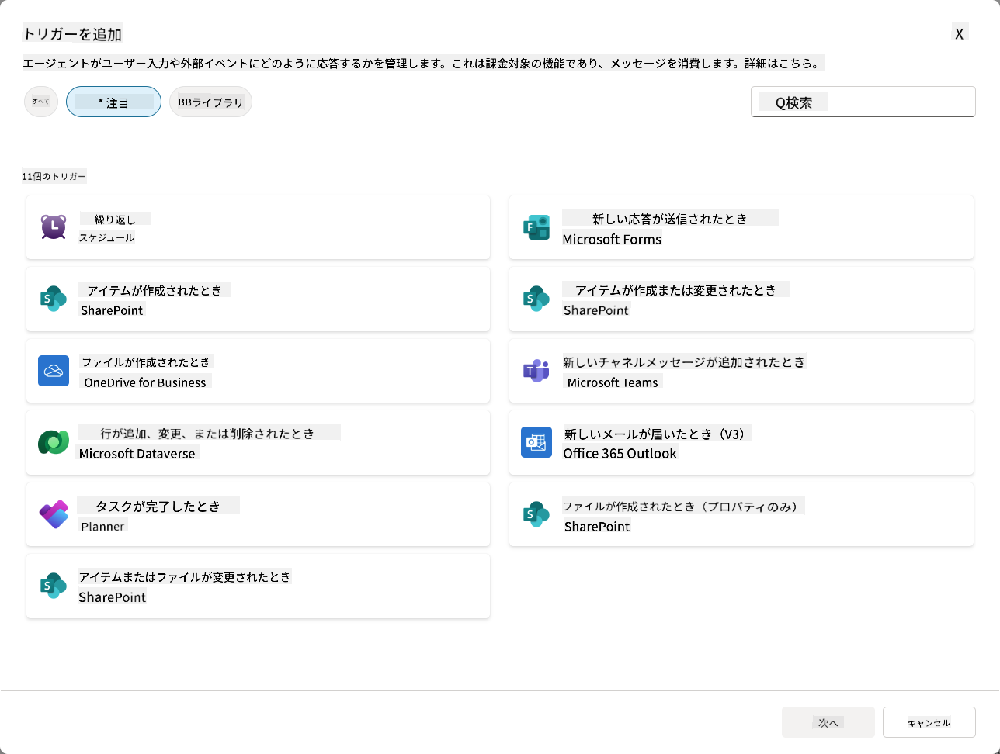

### 自律型エージェントにおけるイベントトリガーの重要性

イベントトリガーは、エージェントを反応型アシスタントからプロアクティブで自律的なヘルパーへと変える力を持っています:

1. **自律的な運用** - エージェントは人間の介入なしで24時間365日稼働し、発生するイベントに応答します。
    - *例:* チームに新しいメンバーが追加された際に自動的に歓迎メッセージを送信。

1. **リアルタイムの応答性** - ユーザーが質問するのを待つのではなく、関連するイベントに即座に応答します。
    - *例*: SharePointのドキュメントが変更された際にITチームに通知。

1. **ワークフローの自動化** - 単一のトリガーイベントに基づいて複数のアクションを連鎖的に実行。
    - *例:* 新しいサポートチケットが作成された際に、タスクを作成し、マネージャーに通知し、トラッキングダッシュボードを更新。

1. **一貫したプロセス** - 重要なステップが見逃されないように、主要なイベントへの応答を自動化。
    - *例:* 新しい従業員が自動的にオンボーディング資料とアクセスリクエストを受け取る。

1. **データ駆動型アクション** - トリガーイベントからの情報を使用して、賢明な決定を下し、適切なアクションを実行。
    - *例:* トリガーペイロードの優先度レベルに基づいて緊急チケットを上級スタッフにルーティング。

## ⚙️ イベントトリガーはどのように機能するのか？

イベントトリガーは、外部イベントに自律的に応答するための3ステップワークフローで動作します:

### トリガーワークフロー

1. **イベント検出** - 接続されたシステム（SharePoint、Teams、Outlookなど）で特定のイベントが発生
1. **トリガーのアクティベーション** - イベントトリガーがこのイベントを検出し、Power Automate Cloud Flowを介してペイロードをエージェントに送信
1. **エージェントの応答** - エージェントがペイロードを受信し、定義された指示を実行

### イベントトリガーとトピックトリガーの違い

これら2つのトリガータイプの違いを理解することが重要です:

| **イベントトリガー** | **トピックトリガー** |
|-------------------|-------------------|
| 外部システムイベントによってアクティブ化 | ユーザー入力/フレーズによってアクティブ化 |
| 自律型エージェントの動作を可能にする | 会話型応答を可能にする |
| 作成者の認証を使用 | ユーザーの認証を選択可能 |
| ユーザーの操作なしで実行 | ユーザーが会話を開始する必要あり |
| 例: ファイル作成、メール受信 | 例: 「天気はどう？」 |

## 📦 トリガーペイロードの理解

イベントが発生すると、トリガーはエージェントに**ペイロード**を送信し、イベントに関する情報と応答方法の指示を含みます。

### デフォルトペイロードとカスタムペイロード

すべてのトリガータイプにはデフォルトのペイロード構造が付属していますが、カスタマイズすることも可能です:

**デフォルトペイロード** - `{Body}`の内容を使用する標準フォーマット

- 基本的なイベント情報を含む
- 汎用的な処理指示を使用
- シンプルなシナリオに適している

**カスタムペイロード** - 特定の指示とデータフォーマットを追加

- エージェントに詳細な指示を含む
- 使用するデータとその方法を正確に指定
- 複雑なワークフローに適している

### エージェント指示とカスタムペイロード指示

イベントトリガーでエージェントの動作を指示する方法は2つあります:

**エージェント指示**（グローバル）

- すべてのトリガーに適用される広範な指示
- 例: 「チケットを処理する際は、まず重複を確認する」
- 一般的な動作パターンに最適

**ペイロード指示**（トリガー固有）

- 個々のトリガータイプに特化した指示  
- 例: 「このSharePointの更新について、プロジェクトチャンネルに要約を送信する」
- 複数のトリガーを持つ複雑なエージェントに最適

💡 **プロのヒント**: これら2つのレベル間で指示が矛盾しないように注意してください。予期しない動作を引き起こす可能性があります。

## 🎯 一般的なイベントトリガーのシナリオ

イベントトリガーがエージェントをどのように強化できるかの実用例を以下に示します:

### ITヘルプデスクエージェント

- **トリガー**: 新しいSharePointリストアイテム（サポートチケット）
- **アクション**: 自動的に分類、優先順位付け、適切なチームメンバーに通知

### 従業員オンボーディングエージェント

- **トリガー**: Dataverseに新しいユーザーが追加される
- **アクション**: 歓迎メッセージを送信、オンボーディングタスクを作成、アクセスをプロビジョニング

### プロジェクト管理エージェント

- **トリガー**: Plannerでタスクが完了
- **アクション**: プロジェクトダッシュボードを更新、関係者に通知、ブロッカーを確認

### ドキュメント管理エージェント

- **トリガー**: 特定のSharePointフォルダにファイルがアップロードされる
- **アクション**: メタデータを抽出、タグを適用、ドキュメント所有者に通知

### 会議アシスタントエージェント

- **トリガー**: カレンダーイベントが作成される
- **アクション**: 会議前のリマインダーとアジェンダを送信、リソースを予約

## ⚠️ 公開と認証に関する考慮事項

エージェントが本番環境でイベントトリガーを使用できるようにする前に、認証とセキュリティの影響を理解する必要があります。

### 作成者の認証

イベントトリガーは**エージェント作成者の資格情報**をすべての認証に使用します:

- エージェントは作成者の権限を使用してシステムにアクセス
- ユーザーは作成者の資格情報を通じてデータにアクセスする可能性あり
- すべてのアクションは、ユーザーがエージェントと対話する際も「作成者として」実行される

### データ保護のベストプラクティス

イベントトリガーを使用してエージェントを公開する際のセキュリティを維持するために:

1. **データアクセスの評価** - トリガーがアクセスできるシステムとデータを確認
1. **徹底的なテスト** - トリガーがペイロードに含む情報を理解
1. **トリガー範囲の絞り込み** - 特定のパラメータを使用してトリガーをアクティブ化するイベントを制限
1. **ペイロードデータの確認** - トリガーが機密情報を公開しないことを確認
1. **使用状況の監視** - トリガーの活動とリソース消費を追跡

## ⚠️ トラブルシューティングと制限事項

イベントトリガーを使用する際に重要な考慮事項を覚えておきましょう:

### クォータと課金への影響

- 各トリガーのアクティベーションはメッセージ消費にカウントされます
- 頻繁なトリガー（例: 毎分のリカレンス）はクォータをすぐに消費する可能性あり
- 使用状況を監視してスロットリングを回避

### 技術的要件

- ジェネレーティブオーケストレーションが有効なエージェントでのみ利用可能
- 環境でソリューション対応のクラウドフロー共有が有効である必要あり

### データ損失防止（DLP）

- 組織のDLPポリシーが利用可能なトリガーを決定
- 管理者がイベントトリガーを完全にブロックする可能性あり
- 期待されるトリガーが利用できない場合は管理者に連絡

## 🧪 ラボ10 - 自律型エージェント動作のためのイベントトリガーを追加

### 🎯 ユースケース

ITヘルプデスクエージェントを強化し、新しいサポートリクエストに自動的に応答できるようにします。SharePointのサポートチケットリストに新しいアイテムが作成されると、エージェントは以下を実行します:

1. SharePointチケットが作成されると自律的にトリガーされる
1. チケットの詳細と実行する手順の指示を提供する
1. AI生成のメールで送信者にチケットを受け取ったことを自動的に確認する

このラボでは、イベントトリガーが真に自律型のエージェント動作を可能にする方法を示します。

### 前提条件

このラボを開始する前に、以下を確認してください:

- ✅ 前のラボ（特にITヘルプデスクエージェントのLab 6-8）を完了している
- ✅ ITサポートチケットリストがあるSharePointサイトへのアクセス権を持っている
- ✅ イベントトリガーが有効なCopilot Studio環境を持っている
- ✅ エージェントにジェネレーティブオーケストレーションが有効である
- ✅ SharePointおよびCopilot Studio環境で適切な権限を持っている

### 10.1 ジェネレーティブAIを有効化し、SharePointアイテム作成トリガーを作成

1. **Copilot Studio**で**ITヘルプデスクエージェント**を開く

1. まず、エージェントに**ジェネレーティブAI**が有効になっていることを確認します:
   - **概要**タブに移動
   - オーケストレーションセクションで、**ジェネレーティブオーケストレーション**を**オン**に切り替えます（まだ有効でない場合）  
     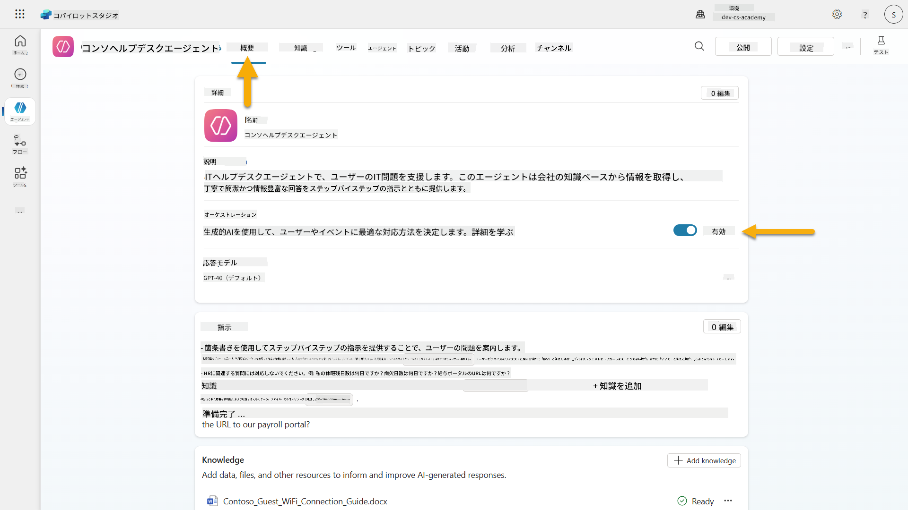

1. **概要**タブに移動し、**トリガー**セクションを見つけます

1. **+ トリガーを追加**をクリックしてトリガーライブラリを開きます  
    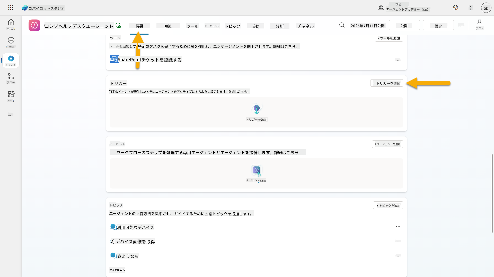

1. **アイテムが作成されたとき**（SharePoint）を検索して選択します  
    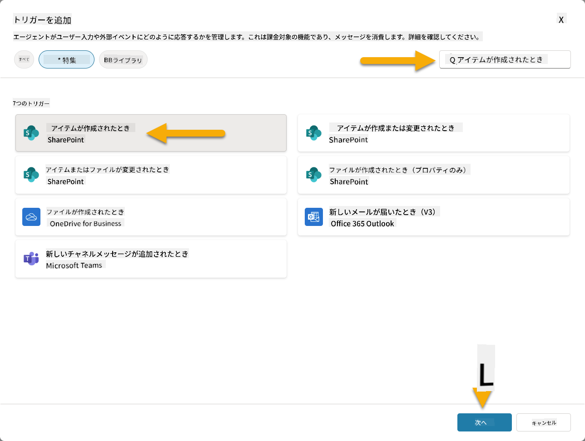

1. トリガー名と接続を設定します:

   - **トリガー名:** SharePointで新しいサポートチケットが作成されました

1. 接続が設定されるのを待ち、**次へ**を選択して進みます。  
   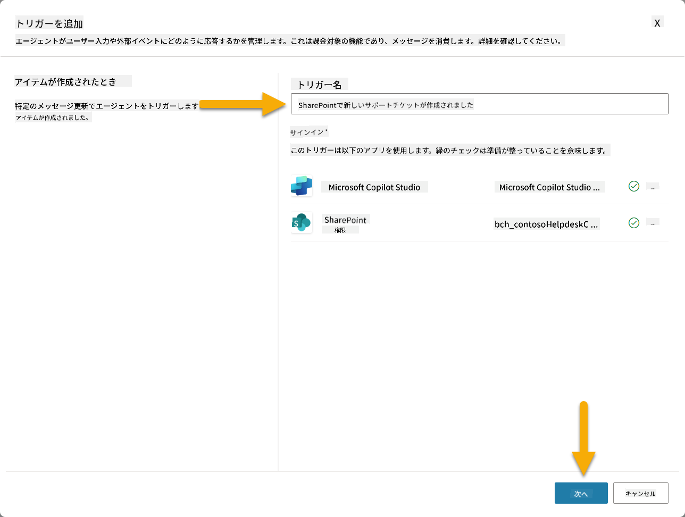

1. トリガーパラメータを設定します:

   - **サイトアドレス**: "Contoso IT" SharePointサイトを選択

   - **リスト名**: "Tickets"リストを選択

   - **トリガーによってエージェントが呼び出された際の追加指示:**

     ```text
     New Support Ticket Created in SharePoint: {Body}
     
     Use the 'Acknowledge SharePoint Ticket' tool to generate the email body automatically and respond.
     
     IMPORTANT: Do not wait for any user input. Work completely autonomously.
     ```

     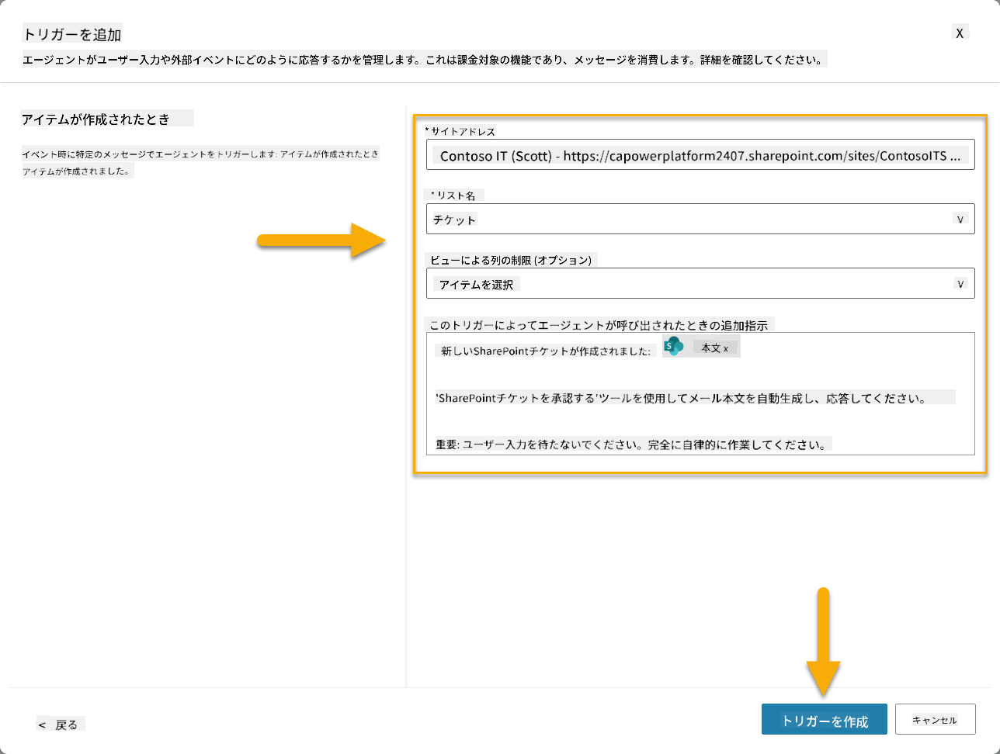

1. **トリガーを作成**を選択してトリガー作成を完了します。エージェントを自律的にトリガーするためのPower Automate Cloud Flowが自動的に作成されます。

1. **閉じる**を選択。

### 10.2 トリガーを編集

1. **概要**タブの**トリガー**セクション内で、**SharePointで新しいサポートチケットが作成されました**トリガーの**...**メニューを選択

1. **Power Automateで編集**を選択  
   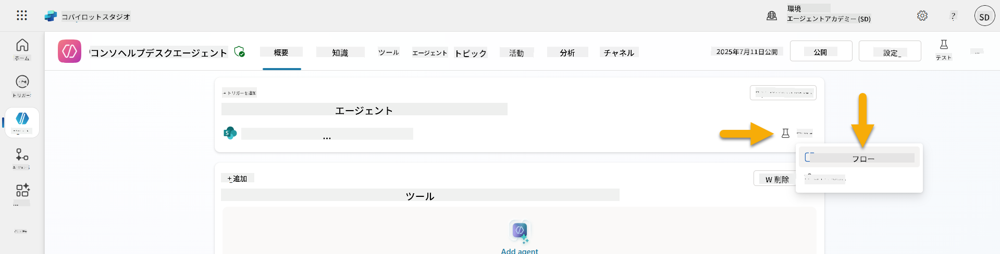

1. **指定されたCopilotにプロンプトを送信して処理する**ノードを選択

1.
1. 新しいブラウザタブを開き、**SharePoint ITサポートチケットリスト**に移動します。  
1. **+ 新しいアイテムを追加**をクリックしてテストチケットを作成します:  
   - **タイトル**: "VPNに接続できない"  
   - **説明**: "最近の更新後、社内WIFIネットワークに接続できない"  
   - **優先度**: "通常"  

1. **SharePointアイテムを保存**します  
    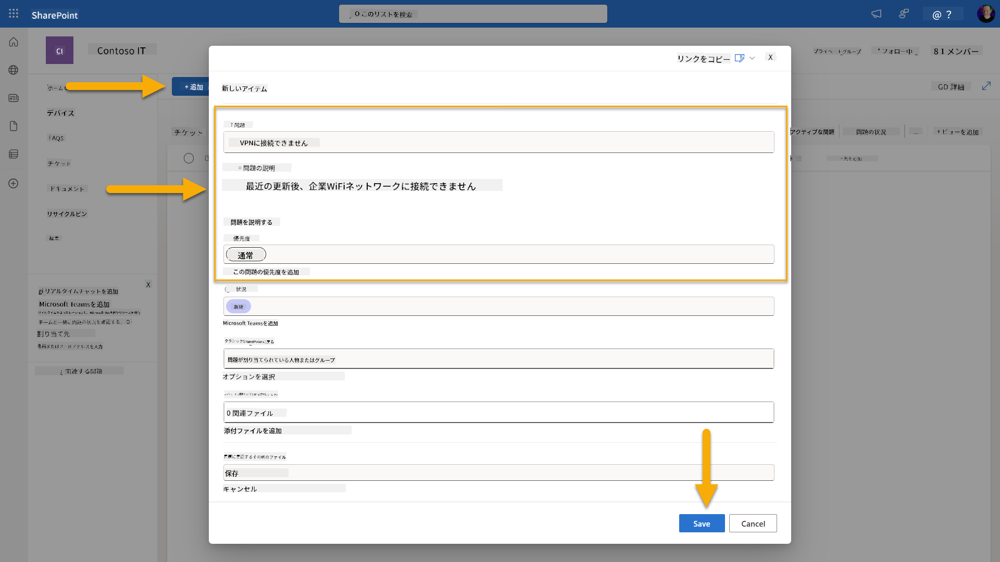  
1. **Copilot Studio**に戻り、**トリガーをテストする**パネルでトリガーのアクティベーションを監視します。**更新**アイコンを使用してトリガーイベントを読み込みます。これには数分かかる場合があります。  
    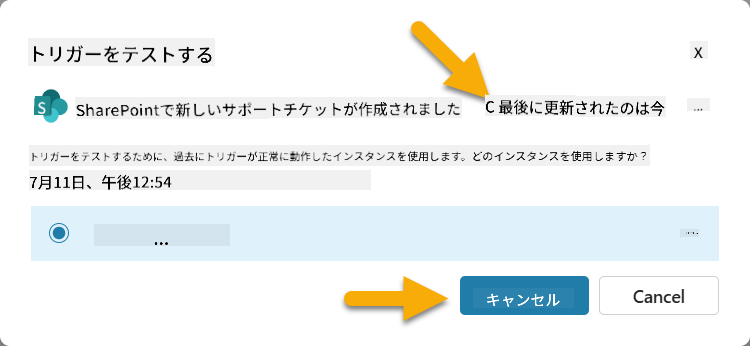  
1. トリガーが表示されたら、**テスト開始**を選択します。  
1. **テストエージェント**パネルの上部にある**アクティビティマップアイコン**を選択します。  
1. エージェントが以下を確認できることを確認します:  
   - トリガーペイロードを受信した  
   - "SharePointチケットを確認する"ツールを呼び出した  
     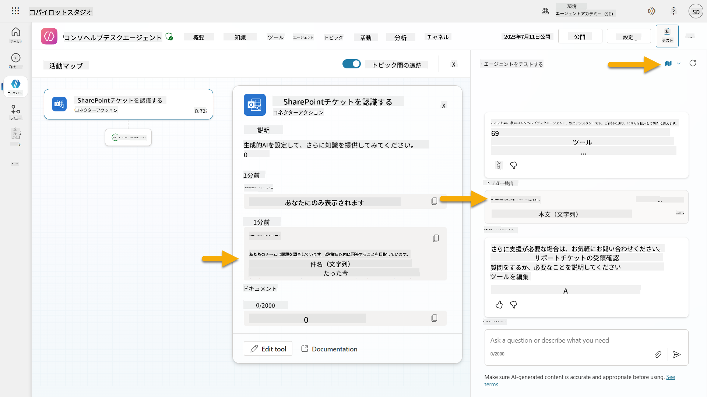  
1. 提出者のメール受信箱を確認し、確認メールが送信されたことを確認します。  
    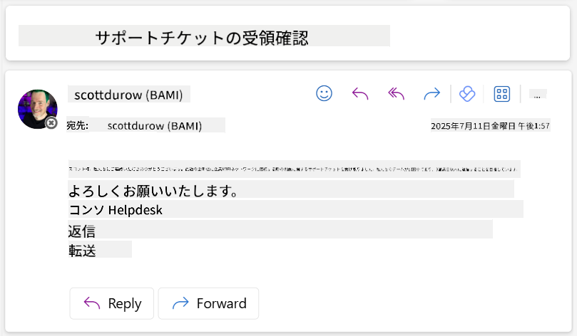  
1. Copilot Studioの**アクティビティ**タブを確認し、トリガーとツールの実行全体をレビューします。  

## ✅ ミッション完了  

🎉 **おめでとうございます！** イベントトリガーをコネクターツールと組み合わせて実装し、エージェントが自律的に動作し、メール確認を自動送信し、ユーザーの介入なしでサポートチケットを処理できるようになりました。エージェントを公開すると、あなたの代わりに自律的に動作します。  

🚀 **次のステップ**: 次のレッスンでは、エージェントをMicrosoft TeamsやMicrosoft 365 Copilotに[公開する方法](../11-publish-your-agent/README.md)を学び、組織全体で利用できるようにします！  

⏭️ [**エージェントを公開する**レッスンに進む](../11-publish-your-agent/README.md)  

## 📚 戦術的リソース  

イベントトリガーと自律エージェントについてさらに詳しく学びたいですか？以下のリソースをご覧ください:  

- **Microsoft Learn**: [Copilot Studioでエージェントを自律的にする](https://learn.microsoft.com/training/modules/autonomous-agents-online-workshop/?WT.mc_id=power-177340-scottdurow)  
- **ドキュメント**: [イベントトリガーを追加する](https://learn.microsoft.com/microsoft-copilot-studio/authoring-trigger-event?WT.mc_id=power-177340-scottdurow)  
- **ベストプラクティス**: [Power Automateトリガーの概要](https://learn.microsoft.com/power-automate/triggers-introduction?WT.mc_id=power-177340-scottdurow)  
- **高度なシナリオ**: [エージェントでPower Automateフローを使用する](https://learn.microsoft.com/microsoft-copilot-studio/advanced-flow-create?WT.mc_id=power-177340-scottdurow)  
- **セキュリティ**: [Copilot Studioのデータ損失防止](https://learn.microsoft.com/microsoft-copilot-studio/admin-data-loss-prevention?WT.mc_id=power-177340-scottdurow)  


---

**免責事項**:  
この文書はAI翻訳サービス[Co-op Translator](https://github.com/Azure/co-op-translator)を使用して翻訳されています。正確性を追求しておりますが、自動翻訳には誤りや不正確な部分が含まれる可能性があります。元の言語で記載された文書を正式な情報源としてご参照ください。重要な情報については、専門の人間による翻訳を推奨します。この翻訳の使用に起因する誤解や誤認について、当方は責任を負いかねますのでご了承ください。