<!--
CO_OP_TRANSLATOR_METADATA:
{
  "original_hash": "9dceeba2eae2bb73e328602a060eddab",
  "translation_date": "2025-10-18T02:55:13+00:00",
  "source_file": "docs/recruit/11-publish-your-agent/README.md",
  "language_code": "ja"
}
-->
# 🚨 ミッション11: エージェントを公開しよう

## 🕵️‍♂️ コードネーム: `OPERATION PUBLISH PUBLISH PUBLISH`

> **⏱️ 作業時間の目安:** `約30分`  

🎥 **ウォークスルーを視聴する**

## 🎯 ミッション概要

いくつもの挑戦的なモジュールを完了したエージェントメーカーの皆さん、いよいよ最も重要なステップに進む準備が整いました。それは、エージェントの公開です。Microsoft TeamsやMicrosoft 365 Copilotを通じて、あなたの作成物をユーザーに提供する時が来ました。

明確なミッション、強力なツール、重要な知識源を備えたあなたのエージェントは、ユーザーをサポートする準備が整っています。Microsoft Copilot Studioを使用してエージェントを展開し、実際のユーザーが働く場で役立つようにしましょう。

さあ、エージェントを行動に移しましょう。

## 🔎 目標

📖 このレッスンでは以下を学びます:

1. エージェントを公開することの重要性
1. エージェントを公開すると何が起こるか
1. チャンネル（Microsoft Teams & Microsoft 365 Copilot）を追加する方法
1. Microsoft Teamsにエージェントを追加する方法
1. 組織全体でMicrosoft Teamsでエージェントを利用可能にする方法

## 🚀 エージェントを公開する

Copilot Studioでエージェントを作成するたびに、知識やツールを追加して更新することがあります。すべての変更が完了し、十分にテストしたら、エージェントを公開する準備が整います。公開することで、最新の更新が反映されます。新しいツールをエージェントに追加しても、公開ボタンを押さない限り、エンドユーザーにはまだ利用できません。

エージェントの更新をユーザーに提供したい場合は、必ず公開ボタンを押してください。エージェントにチャンネルが追加されている場合、公開ボタンを押すことで、追加されたすべてのチャンネルで更新が利用可能になります。

## ⚙️ チャンネルの設定

チャンネルは、ユーザーがエージェントにアクセスしてやり取りできる場所を決定します。エージェントを公開した後、複数のチャンネルで利用可能にすることができます。各チャンネルはエージェントのコンテンツを異なる方法で表示する場合があります。

以下のチャンネルにエージェントを追加できます:

- **Microsoft TeamsとMicrosoft 365 Copilot** - Teamsのチャットや会議、Microsoft 365 Copilotの体験内でエージェントを利用可能にする ([詳細はこちら](https://learn.microsoft.com/microsoft-copilot-studio/publication-add-bot-to-microsoft-teams))
- **デモウェブサイト** - Copilot Studioが提供するデモウェブサイトでエージェントをテストする ([詳細はこちら](https://learn.microsoft.com/microsoft-copilot-studio/publication-connect-bot-to-web-channels))
- **カスタムウェブサイト** - 自分のウェブサイトにエージェントを直接埋め込む ([詳細はこちら](https://learn.microsoft.com/microsoft-copilot-studio/publication-connect-bot-to-web-channels))
- **モバイルアプリ** - カスタムモバイルアプリにエージェントを統合する ([詳細はこちら](https://learn.microsoft.com/microsoft-copilot-studio/publication-connect-bot-to-custom-application))
- **SharePoint** - SharePointサイトにエージェントを追加し、ドキュメントやサイトのサポートを提供する ([詳細はこちら](https://learn.microsoft.com/microsoft-copilot-studio/publication-add-bot-to-sharepoint))
- **Facebook Messenger** - Facebookのメッセージングプラットフォームを通じてユーザーと接続する ([詳細はこちら](https://learn.microsoft.com/microsoft-copilot-studio/publication-add-bot-to-facebook))
- **Power Pages** - Power Pagesウェブサイトにエージェントを統合する ([詳細はこちら](https://learn.microsoft.com/microsoft-copilot-studio/publication-add-bot-to-power-pages))
- **Azure Bot Serviceチャンネル** - Slack、Telegram、Twilio SMSなどの追加チャンネルにアクセスする ([詳細はこちら](https://learn.microsoft.com/microsoft-copilot-studio/publication-connect-bot-to-azure-bot-service-channels))

チャンネルを追加するには、エージェントの**Channels**タブに移動し、設定したいチャンネルを選択します。各チャンネルには特定の設定要件があり、追加の認証や設定手順が必要な場合があります。

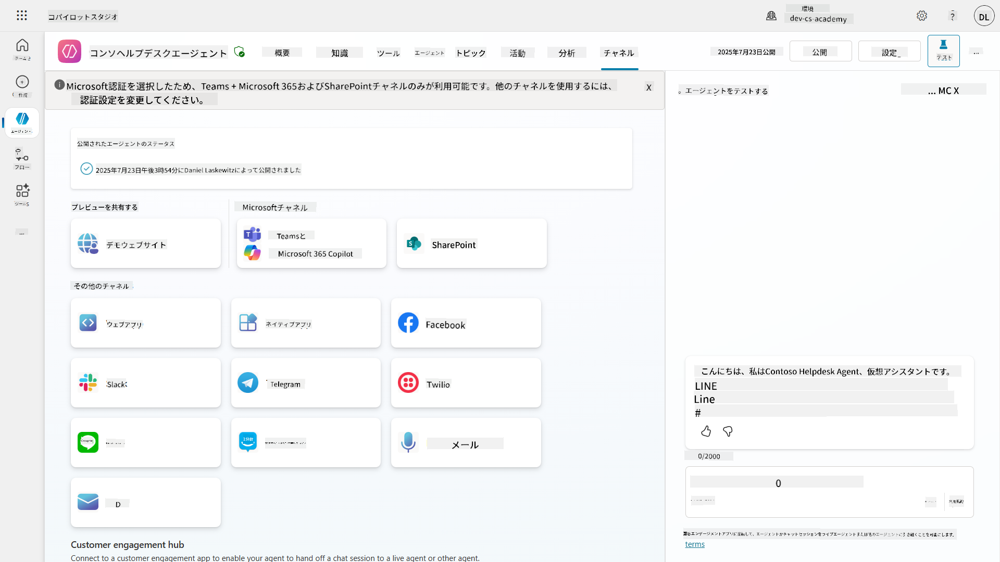

## 📺 チャンネル体験

異なるチャンネルでは、ユーザー体験が異なります。複数のチャンネル向けにエージェントを構築する際は、各チャンネルごとの違いを理解しておくことが重要です。複数のチャンネルでエージェントをテストし、意図した通りに機能しているか確認するのが良い戦略です。

| 体験                              | ウェブサイト   | TeamsとMicrosoft 365 Copilot           | Facebook                 | Dynamics Omnichannel for Customer Service                   |
| --------------------------------- | ------------- | --------------------------------------- | ------------------------ | ----------------------------------------------------------- |
| [顧客満足度調査][1]               | アダプティブカード | テキストのみ                           | テキストのみ             | テキストのみ                                                 |
| [選択肢][1]                       | 対応           | [最大6つまで対応（ヒーローカードとして）][4] | [最大13個まで対応][6]    | [部分的に対応][8]                                            |
| [Markdown][2]                     | 対応           | [部分的に対応][5]                       | [部分的に対応][7]        | [部分的に対応][9]                                            |
| [ウェルカムメッセージ][1]         | 対応           | 対応                                   | 非対応                  | [チャット][10]では対応。他のチャンネルでは非対応。           |
| [Did-You-Mean][3]                 | 対応           | 対応                                   | 対応                     | [Microsoft Teams][11]、[チャット][10]、Facebook、テキストのみのチャンネル（[TeleSign][12]、[Twilio][13]、[WhatsApp][14]、[WeChat][15]、[Twitter][16]経由のSMS）で対応。提案アクションはテキストのみのリストとして表示され、ユーザーはオプションを再入力する必要があります。 |

[1]: https://learn.microsoft.com/microsoft-copilot-studio/authoring-create-edit-topics
[2]: https://daringfireball.net/projects/markdown/
[3]: https://learn.microsoft.com/microsoft-copilot-studio/advanced-ai-features
[4]: https://learn.microsoft.com/microsoftteams/platform/concepts/cards/cards-reference#hero-card
[5]: https://learn.microsoft.com/microsoftteams/platform/bots/how-to/format-your-bot-messages#text-only-messages
[6]: https://developers.facebook.com/docs/messenger-platform/send-messages/quick-replies/
[7]: https://www.facebook.com/help/147348452522644?helpref=related
[8]: https://learn.microsoft.com/dynamics365/customer-service/asynchronous-channels#suggested-actions-support
[9]: https://learn.microsoft.com/dynamics365/customer-service/asynchronous-channels#preview-support-for-formatted-messages
[10]: https://learn.microsoft.com/dynamics365/customer-service/set-up-chat-widget
[11]: https://learn.microsoft.com/dynamics365/customer-service/configure-microsoft-teams
[12]: https://learn.microsoft.com/dynamics365/customer-service/configure-sms-channel
[13]: https://learn.microsoft.com/dynamics365/customer-service/configure-sms-channel-twilio
[14]: https://learn.microsoft.com/dynamics365/customer-service/configure-whatsapp-channel
[15]: https://learn.microsoft.com/dynamics365/customer-service/configure-wechat-channel
[16]: https://learn.microsoft.com/dynamics365/customer-service/configure-twitter-channel

> [!NOTE]
> チャンネルごとに異なるロジックを使用する例があります。Power Platform Snippetsリポジトリにその例が掲載されています:
>
> Henry JammesがMicrosoft Teamsのチャンネルで異なるアダプティブカードを表示する方法の例を共有しています。 ([例へのリンク](https://github.com/pnp/powerplatform-snippets/blob/main/copilot-studio/multiple-topics-matched-topic/source/multiple-topics-matched.yaml#L40))

## 🧪 ラボ11: TeamsとMicrosoft 365 Copilotにエージェントを公開する

### 🎯 ユースケース

Contoso ITヘルプデスクエージェントは、SharePointの知識源へのアクセス、サポートチケットの作成、プロアクティブな通知の送信、ユーザーのクエリへのインテリジェントな応答など、強力な機能を備えて完全に構成されています。しかし、これらの機能は現在、エージェントを構築した開発環境でのみ利用可能です。

**課題:** エンドユーザーは、エージェントが適切に公開され、実際に使用するチャンネルでアクセス可能になるまで、その機能を利用することができません。

**解決策:** エージェントを公開することで、最新バージョンが実際のユーザーに利用可能になります。これにより、最近の更新、新しいトピック、強化された知識源、構成されたフローがすべて含まれます。公開しない場合、ユーザーは古いバージョンのエージェントとやり取りすることになり、重要な機能が欠けている可能性があります。

TeamsとMicrosoft 365 Copilotチャンネルを追加することも非常に重要です。なぜなら:

- **Teamsとの統合**: 組織の従業員は、コラボレーション、会議、コミュニケーションのために日々Microsoft Teamsを使用しています。エージェントをTeamsに追加することで、ユーザーは主要な作業環境を離れることなくITサポートを受けることができます。

- **Microsoft 365 Copilot**: ユーザーは、Officeアプリケーション全体で日常のワークフローにシームレスに統合されたMicrosoft 365 Copilot体験内で、専門的なITヘルプデスクエージェントに直接アクセスできます。

- **集中アクセス**: 別々のウェブサイトやアプリケーションを覚える必要がなくなり、ユーザーはすでに使用しているプラットフォームを通じてITサポートにアクセスできるため、利便性が向上し、採用率が上がります。

このミッションは、開発作業を本番環境で使用可能なソリューションに変え、組織のエンドユーザーに実際の価値を提供します。

### 前提条件

このラボを開始する前に、以下を確認してください:

- ✅ 前のラボを完了し、完全に構成されたContoso Helpdesk Agentを持っていること
- ✅ エージェントがテストされ、本番使用の準備が整っていること
- ✅ Copilot Studio環境でエージェントを公開する権限があること
- ✅ 組織内でMicrosoft Teamsにアクセスできること

### 11.1 エージェントを公開する

エージェントに関するすべての作業が完了したら、エンドユーザーがエージェントを利用できるようにする必要があります。コンテンツをすべてのユーザーに利用可能にするために、エージェントを公開する必要があります。

1. Copilot Studioの[Copilot Studio maker portal](https://copilotstudio.microsoft.com)を通じてContoso Helpdesk Agentにアクセスします。

    Copilot Studioでは、エージェントを簡単に公開できます。エージェント概要の上部にある公開ボタンを選択するだけです。

    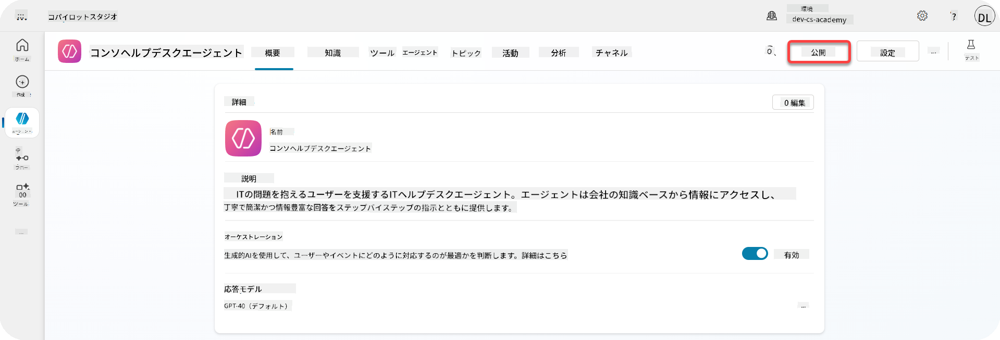

1. エージェントの**公開**ボタンを選択します。

    公開確認のポップアップが表示され、エージェントを本当に公開するかどうか確認します。

    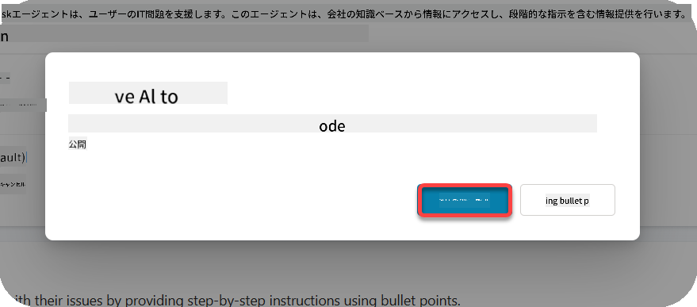

1. **公開**を選択して、エージェントの公開を確定します。

    エージェントが公開中であることを示すメッセージが表示されます。このポップアップを開いたままにしておく必要はありません。エージェントが公開されると通知が届きます。

    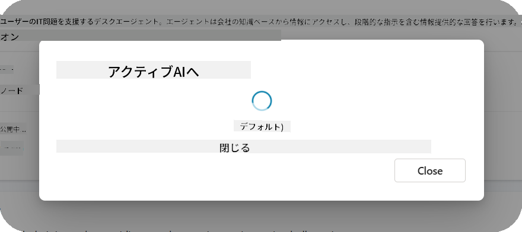

    エージェントの公開が完了すると、エージェントページの上部に通知が表示されます。

    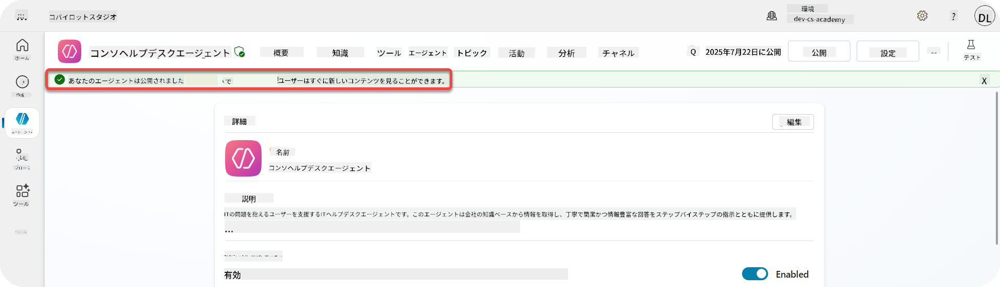

ただし、エージェントを公開しただけでは、まだチャンネルに追加されていません。これを今すぐ設定しましょう！

### 11.2 TeamsとMicrosoft 365 Copilotチャンネルを追加する

1. エージェントにTeamsとMicrosoft 365 Copilotチャンネルを追加するには、エージェントの上部ナビゲーションで**Channel**を選択します。

    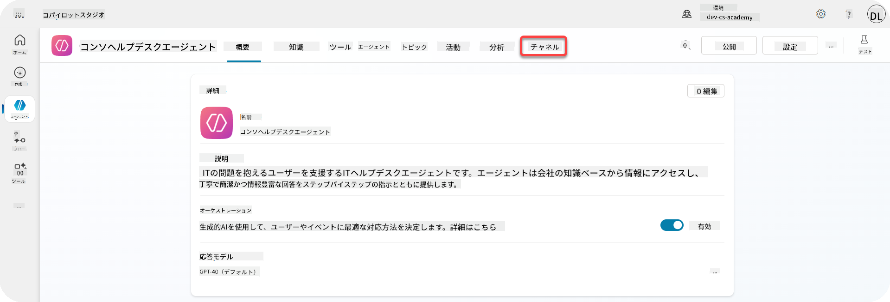

    ここで、このエージェントに追加できるすべてのチャンネルを確認できます。

1. **TeamsとMicrosoft 365**を選択します。

    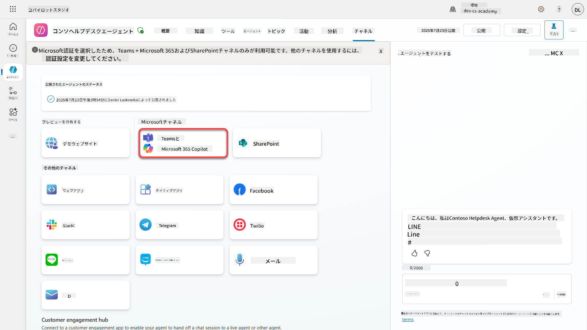

1. **Add channel**を選択してウィザードを完了し、エージェントにチャンネルを追加します。

    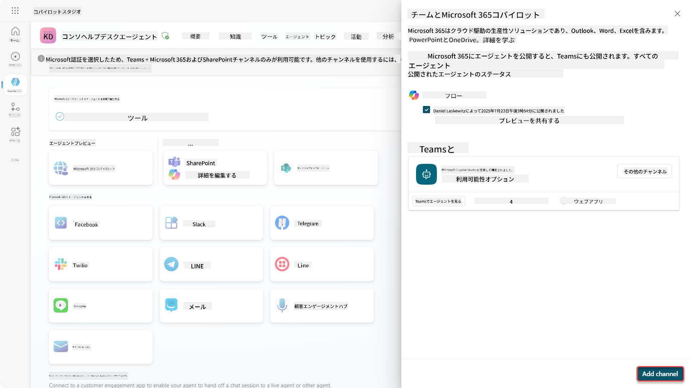

    追加が完了するまで少し時間がかかります。追加が完了すると、サイドバーの上部に緑色の通知が表示されます。

    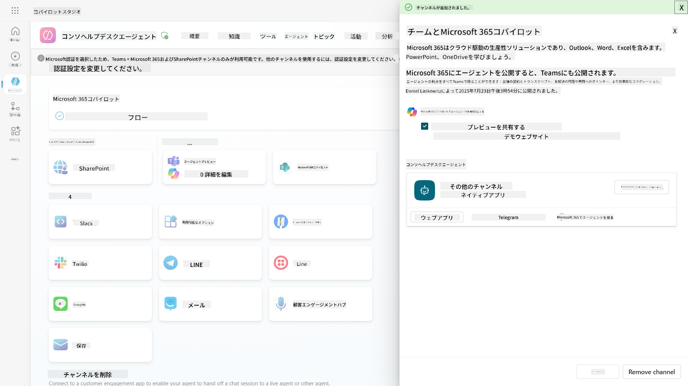

1. **See agent in Teams**を選択して新しいタブを開きます。

    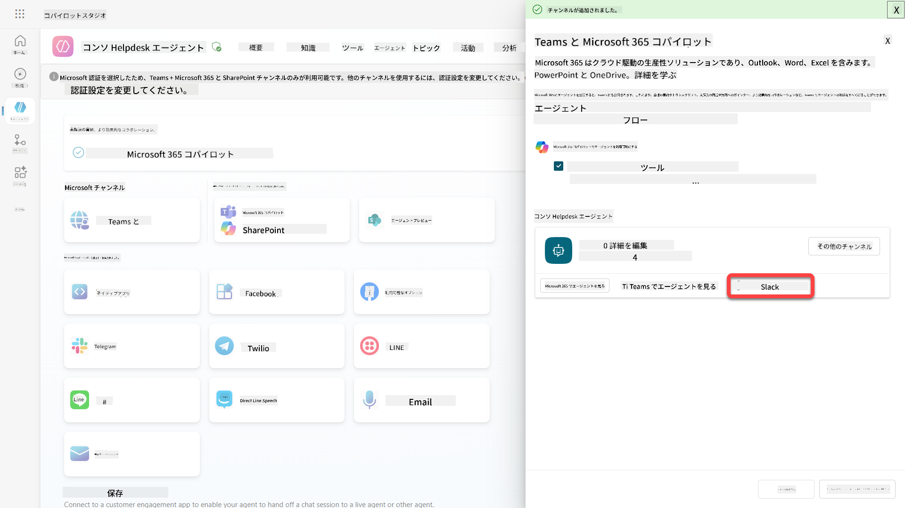

1. **Add**を選択してContoso Helpdesk AgentをTeamsに追加します。

    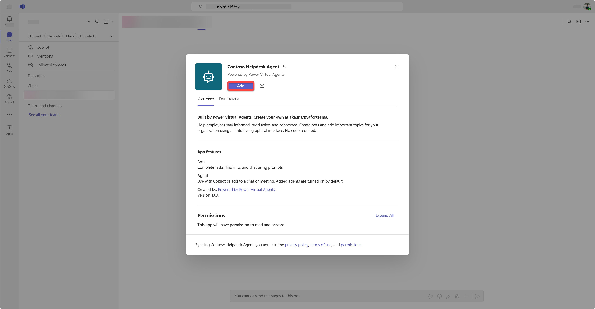

    少し時間がかかります。その後、以下の画面が表示されるはずです。

    

1. **Open**を選択してTeamsでエージェントを開きます。

    これにより、エージェントがTeams内でアプリとして開かれます。

    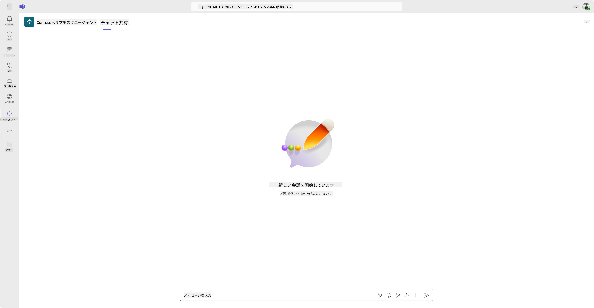

これでエージェントがMicrosoft Teamsで利用できるようになりましたが、これをより多くの人々に利用可能にしたい場合があります。

### 11.3 テナント内のすべてのユーザーにエージェントを利用可能にする

1. Contoso Helpdesk Agentが開かれているブラウザタブを閉じます。

    これにより、Copilot Studioに戻ります。TeamsとMicrosoft 365 Copilotのサイドパネルはまだ開いています。現在はエージェントをTeamsで開いただけですが、ここでさらに多くのことができます。エージェントの詳細を編集したり、エージェントをより多くのユーザーに展開したりすることができます。

1. **Edit details**を選択します。

    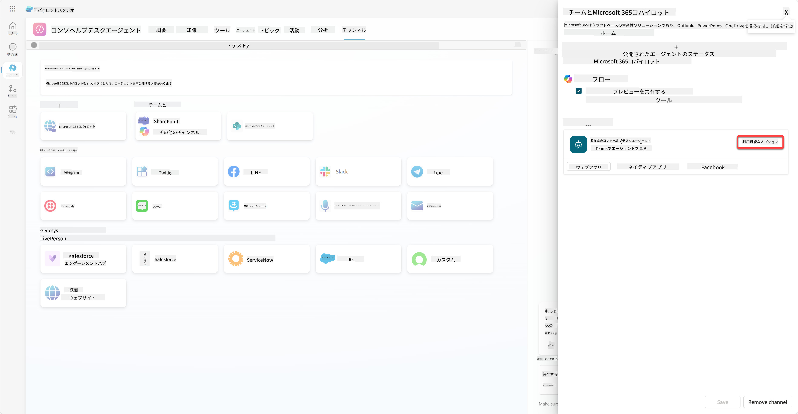
これにより、エージェントの詳細や設定を変更できるペインが開きます。アイコンやアイコンの背景色、説明などの基本的な詳細を変更することができます。また、Teamsの設定（例えば、ユーザーがエージェントをチームに追加できるようにしたり、グループチャットや会議チャットでこのエージェントを使用できるようにする）も変更可能です。さらに、*詳細*を選択すると、開発者名、ウェブサイト、プライバシー声明、利用規約などの開発者情報も変更できます。

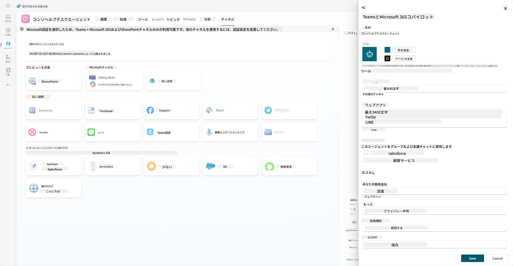

1. **キャンセル**を選択して詳細編集ペインを閉じます。

1. **利用可能オプション**を選択します。

    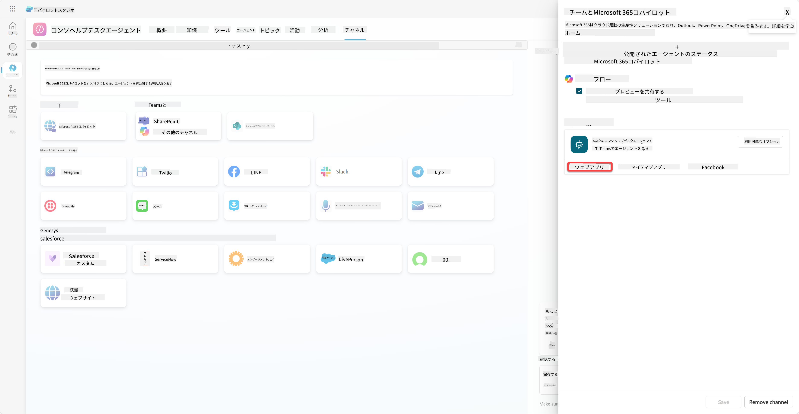

    これにより、利用可能オプションのペインが開きます。ここでは、ユーザーにエージェントを使用してもらうためのリンクをコピーしたり（注意：エージェントをユーザーと共有する必要があります）、Microsoft TeamsやMicrosoft 365ストアにエージェントを追加するためのファイルをダウンロードすることができます。ストアにエージェントを表示するには、他にもオプションがあります。例えば、チームメイトや共有ユーザーに表示する（*Power Platformで作成*セクションに表示する）か、組織内の全員に表示する（管理者の承認が必要）ことができます。

1. **組織内の全員に表示**を選択します。

    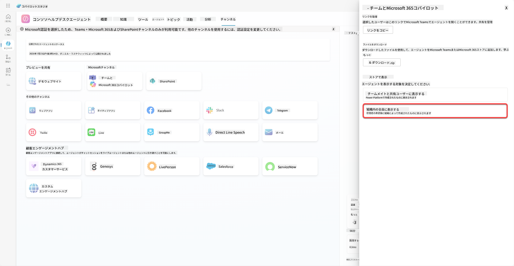

1. **管理者承認を申請**を選択します。

    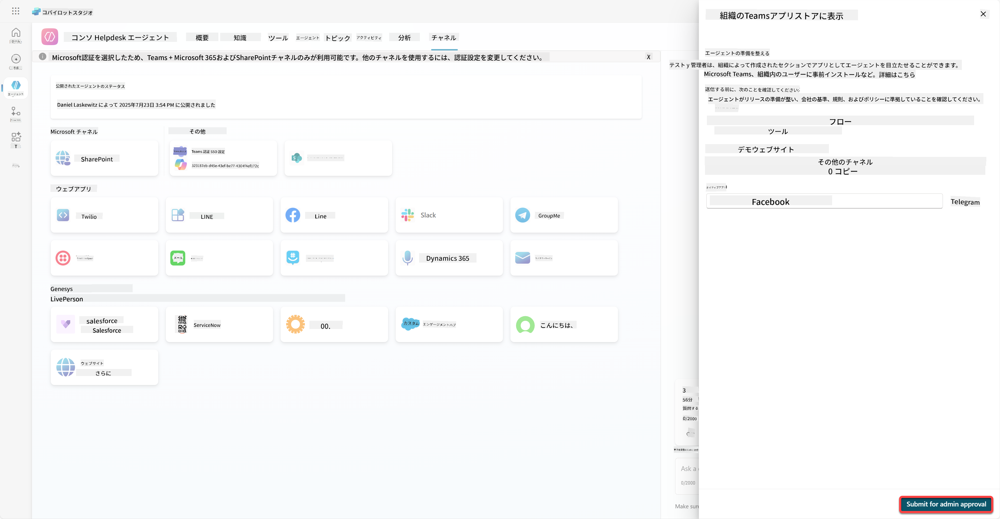

    これで、管理者がエージェントの申請を承認する必要があります。管理者はTeams管理センターにアクセスし、アプリ内でContoso Helpdesk Agentを検索して承認を行います。以下のスクリーンショットは、管理者がTeams管理センターで見る画面の例です。

    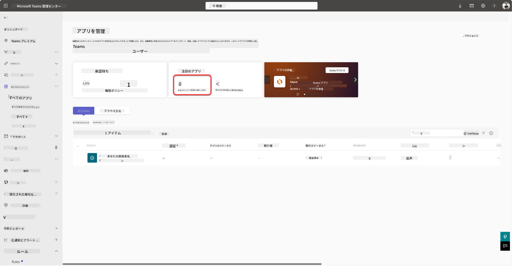

    管理者はContoso Helpdesk Agentを選択し、*公開*を選択してContoso Helpdesk Agentを全員に公開します。

    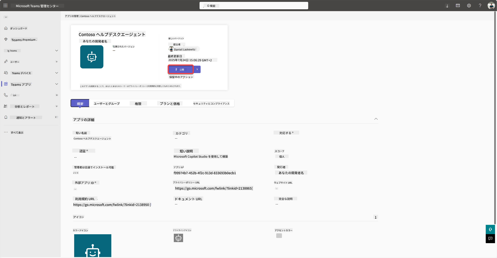

    管理者がエージェントの申請を公開すると、Copilot Studioを更新することで、利用可能オプションに*アプリストアで利用可能*のバナーが表示されるはずです。

    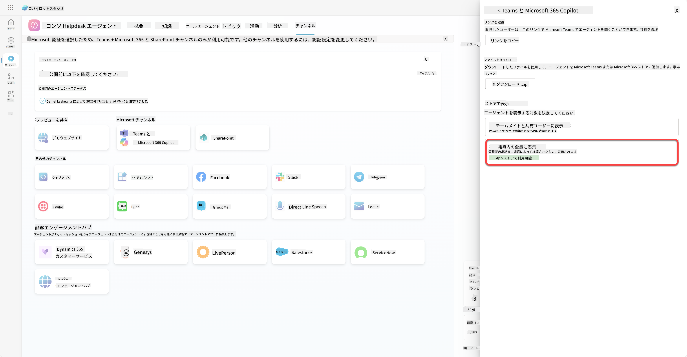

さらに多くの可能性があります。管理者はグローバル設定ポリシーを変更し、テナント内の全員に対してContoso Helpdesk Agentを自動インストールすることができます。それに加えて、Contoso Helpdesk Agentを左側のレールに固定して、全員が簡単にアクセスできるようにすることも可能です。

## ✅ ミッション完了

🎉 **おめでとうございます！** エージェントを無事に公開し、TeamsとMicrosoft 365 Copilotに追加することができました！次はコースの最後のミッションです：ライセンスの理解。

⏭️ [**ライセンスの理解**レッスンに進む](../12-understanding-licensing/README.md)

## 📚 戦略的リソース

🔗 [公開チャネルのドキュメント](https://learn.microsoft.com/microsoft-copilot-studio/publication-fundamentals-publish-channels)

---

**免責事項**:  
この文書はAI翻訳サービス[Co-op Translator](https://github.com/Azure/co-op-translator)を使用して翻訳されています。正確性を追求しておりますが、自動翻訳には誤りや不正確な部分が含まれる可能性があります。元の言語で記載された文書を正式な情報源としてご参照ください。重要な情報については、専門の人間による翻訳を推奨します。この翻訳の使用に起因する誤解や誤認について、当方は一切の責任を負いません。