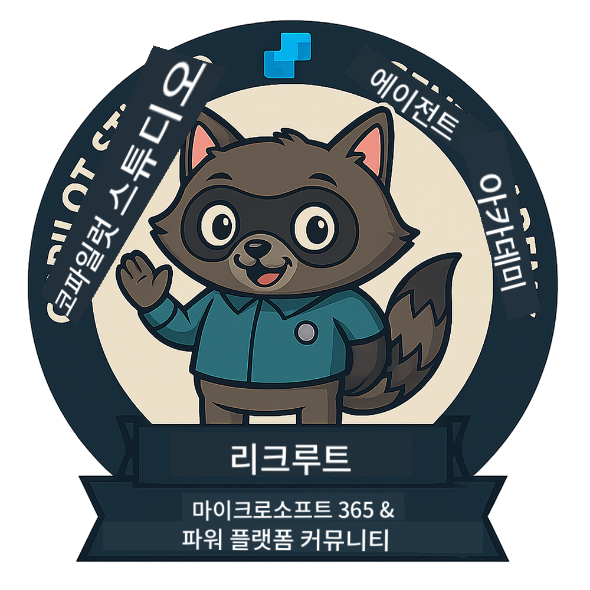
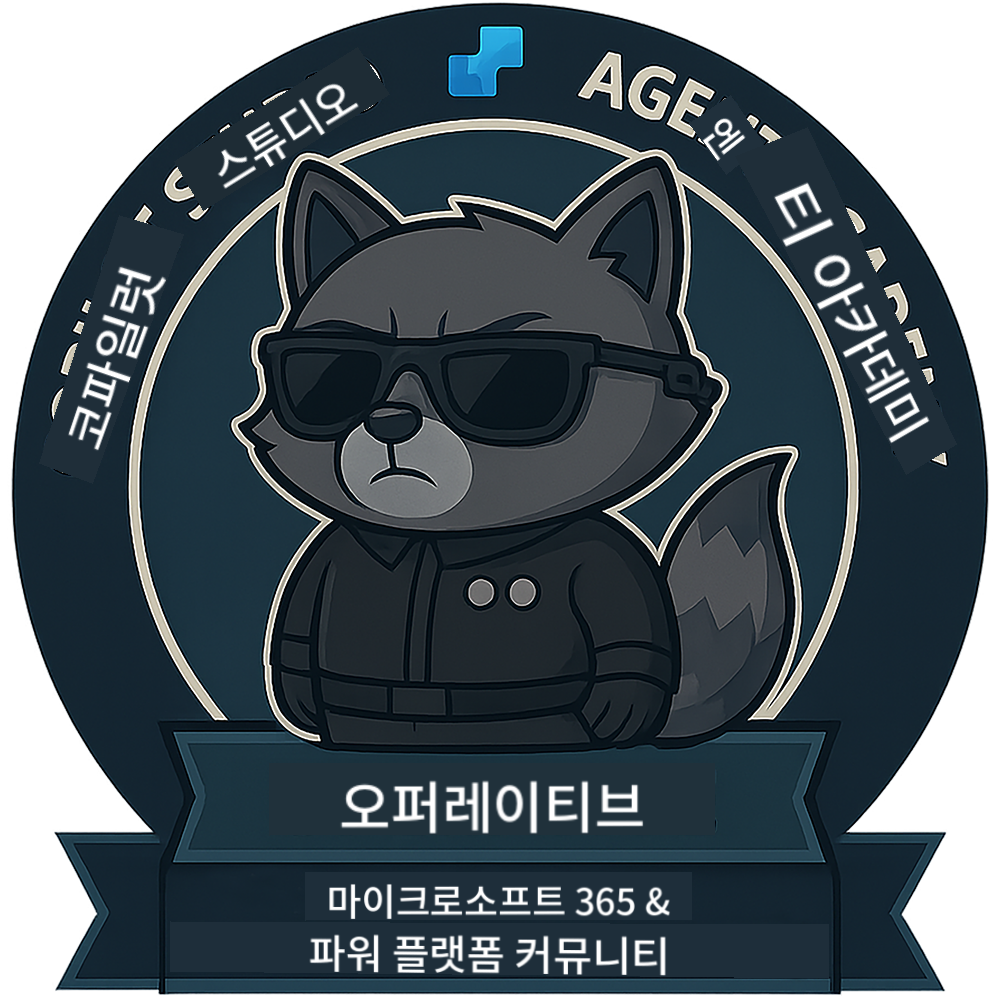
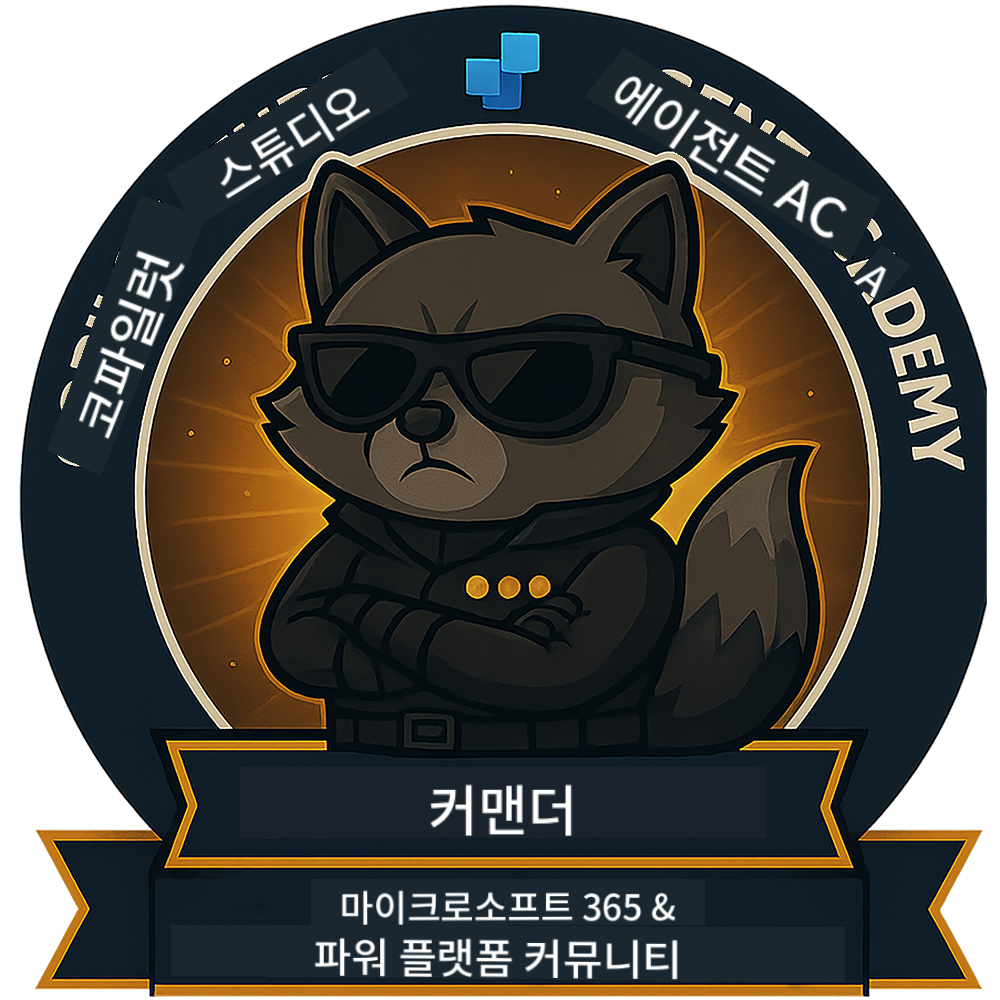

<!--
CO_OP_TRANSLATOR_METADATA:
{
  "original_hash": "15e57e059ce7689d602d7853187235cd",
  "translation_date": "2025-10-21T23:43:27+00:00",
  "source_file": "docs/index.md",
  "language_code": "ko"
}
-->
---
hide:
- navigation
---

# Copilot Studio Agent Academy

**Copilot Studio Agent Academy에 오신 것을 환영합니다.**  

여러분의 임무는—수락한다면—**Microsoft Copilot Studio**를 사용하여 에이전트를 구축하는 기술을 마스터하는 것입니다.

이 실습형 교육은 **에이전트의 세계**로 들어가는 입문 과정입니다. 기본 프롬프트부터 Adaptive Cards와 에이전트 흐름까지, 실제 도구와 사례를 통해 지능형 에이전트를 구축, 확장, 배포하는 방법을 배우게 됩니다.

---

## 🏅 계급 진급

**Copilot Studio Agent Academy**는 세 가지 에이전트 계급을 통해 여러분의 기술을 단계적으로 향상시키는 다단계 교육 프로그램입니다. 각 단계는 배지와 더 많은 책임을 포함합니다:

| 계급             | 단계 | 시각적 자료 |
|------------------|:-----:|--------|
| 🟢 **Recruit**  [🚀 시작하기](https://aka.ms/agent-academy-recruit){ .md-button .md-button--primary }     | •     | { width="300" }     |
| 🔵 **Operative** (곧 출시 예정)   | ••    | { width="300" } |
| 🟡 **Commander** (곧 출시 예정)    | •••   | { width="300" } |

각 단계는 이전 단계를 기반으로 합니다. Recruit 임무를 완료하고, 에이전트 자격을 업그레이드할 준비를 하세요.

---

## 🎒 기타 과정

AI와 에이전트에 대해 계속 학습할 수 있는 다른 과정을 확인하세요:

- [Microsoft Copilot Studio <3 MCP Lab](https://aka.ms/mcsmcplab)
- [Copilot Developer Camp](https://microsoft.github.io/copilot-camp/)
- [AI Agents for Beginners](https://microsoft.github.io/ai-agents-for-beginners/)
- [Model Context Protocol (MCP) For Beginners](https://github.com/microsoft/mcp-for-beginners)

---

## 🚑 문제

여러분의 피드백을 정말로 소중히 생각합니다! [문제 목록](https://github.com/microsoft/agent-academy/issues)을 사용하여 의견과 문제를 공유해주세요. 감사합니다!

---

## 📜 행동 강령

이 프로젝트는 [Microsoft Open Source Code of Conduct](https://opensource.microsoft.com/codeofconduct/)를 채택했습니다.

!!! info "리소스:"

    - [Microsoft Open Source Code of Conduct](https://opensource.microsoft.com/codeofconduct/)
    - [Microsoft Code of Conduct FAQ](https://opensource.microsoft.com/codeofconduct/faq/)
    - 질문이나 우려 사항이 있다면 [opencode@microsoft.com](mailto:opencode@microsoft.com)으로 연락하세요

---

[⭐️ 우리의 저장소에 별표를 달아주세요](https://github.com/microsoft/agent-academy){ .md-button .md-button--primary }

<!-- markdownlint-disable-next-line MD033 -->

---

**면책 조항**:  
이 문서는 AI 번역 서비스 [Co-op Translator](https://github.com/Azure/co-op-translator)를 사용하여 번역되었습니다. 정확성을 위해 최선을 다하고 있지만, 자동 번역에는 오류나 부정확성이 포함될 수 있습니다. 원본 문서의 원어 버전을 권위 있는 출처로 간주해야 합니다. 중요한 정보의 경우, 전문적인 인간 번역을 권장합니다. 이 번역 사용으로 인해 발생하는 오해나 잘못된 해석에 대해 책임을 지지 않습니다.