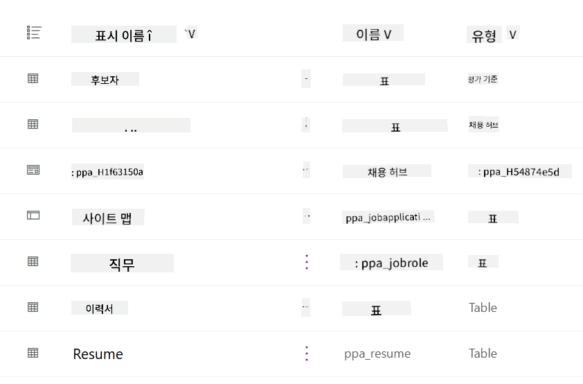
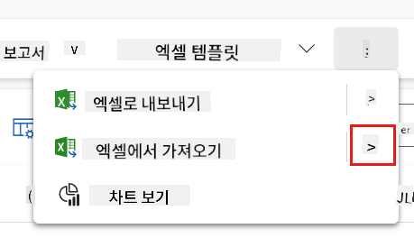
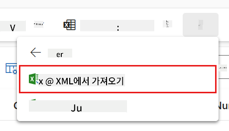
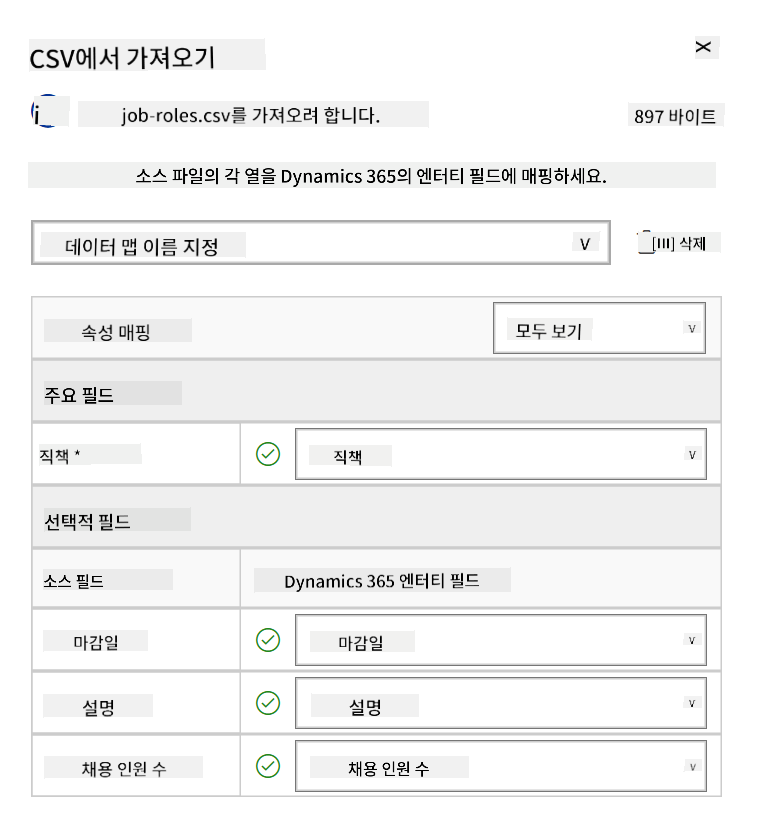
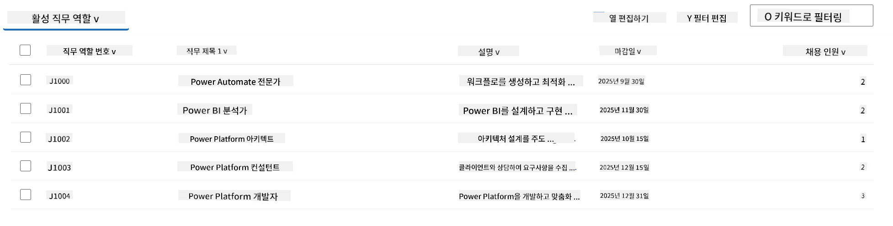
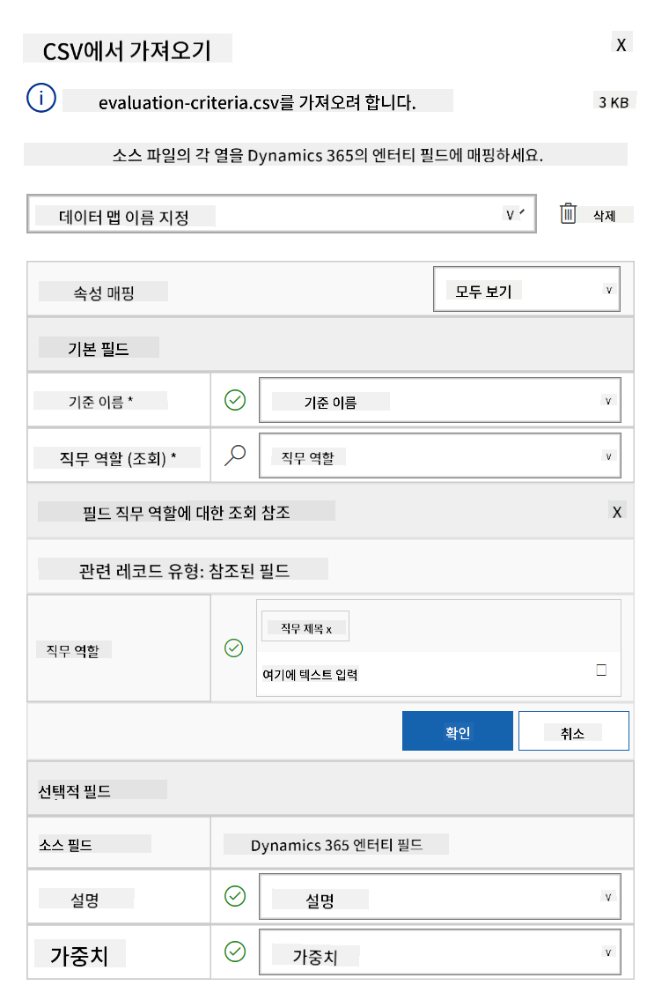
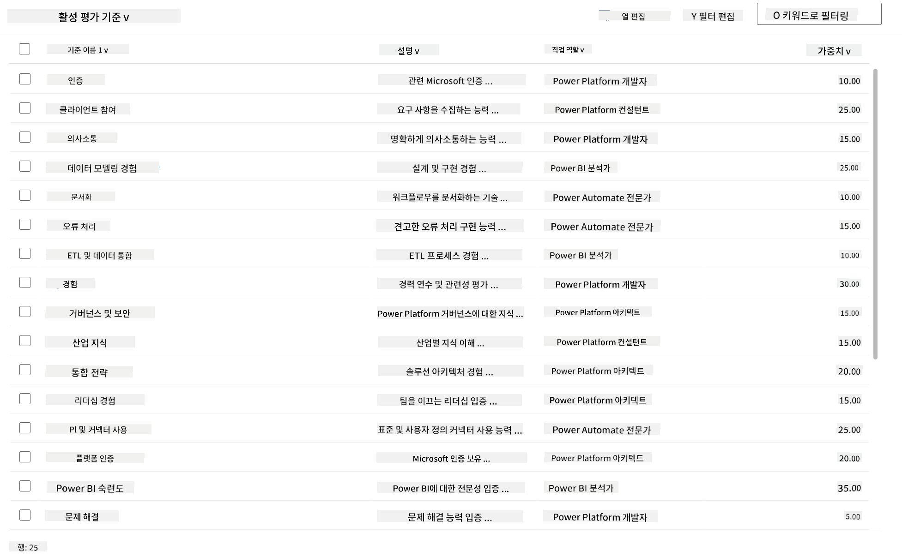

<!--
CO_OP_TRANSLATOR_METADATA:
{
  "original_hash": "2620cf9eaf09a3fc6be7fa31a3a62956",
  "translation_date": "2025-10-22T00:07:27+00:00",
  "source_file": "docs/operative-preview/01-get-started/README.md",
  "language_code": "ko"
}
-->
# 🚨 미션 01: 채용 에이전트 시작하기

--8<-- "disclaimer.md"

## 🕵️‍♂️ 코드명: `OPERATION TALENT SCOUT`

> **⏱️ 작전 시간:** `~45분`

## 🎯 미션 개요

환영합니다, 에이전트. 첫 번째 임무는 **Operation Talent Scout**입니다. 이는 조직이 최고의 인재를 식별하고 채용하는 방식을 혁신할 AI 기반 채용 시스템의 기초를 구축하는 것입니다.

이 임무를 수락한다면, Microsoft Copilot Studio를 사용하여 포괄적인 채용 관리 시스템을 배포하고 구성해야 합니다. 필요한 데이터 구조를 포함한 사전 구축된 솔루션을 가져온 후, 첫 번째 AI 에이전트인 **채용 에이전트**를 생성하게 됩니다. 이 에이전트는 향후 모든 채용 작업의 중심 역할을 하게 됩니다.

이 초기 배포는 Agent Academy Operative 프로그램을 통해 강화할 지휘 센터를 구축하는 것입니다. 이를 기반으로 이후 미션에서 전문화된 에이전트 네트워크를 구축하게 될 것입니다.

---

## 🔎 목표

이 미션을 완료하면 다음을 달성할 수 있습니다:

- **시나리오 이해**: 채용 자동화의 과제와 솔루션에 대한 포괄적인 이해
- **솔루션 배포**: 채용 관리 시스템의 기본 요소를 성공적으로 가져오고 구성
- **에이전트 생성**: Agent Academy Operative로서 구축할 시나리오의 시작점인 채용 에이전트 생성

---

## 🔍 사전 준비

이 미션을 시작하기 전에 다음을 준비하세요:

- Copilot Studio 라이선스
- Microsoft Power Platform 환경에 대한 접근 권한
- 솔루션 및 에이전트를 생성할 수 있는 관리자 권한

---

## 🏢 채용 자동화 시나리오 이해하기

이 시나리오는 Microsoft Copilot Studio를 사용하여 회사가 채용 프로세스를 개선하고 자동화하는 방법을 보여줍니다. 이 시스템은 이력서 검토, 직무 추천, 인터뷰 자료 준비, 후보자 평가와 같은 작업을 처리하는 에이전트 시스템을 소개합니다.

### 비즈니스 가치

이 솔루션은 HR 팀이 시간을 절약하고 더 나은 결정을 내릴 수 있도록 돕습니다:

- 이메일로 받은 이력서를 자동으로 처리
- 후보자 프로필에 기반한 적합한 직무 추천
- 각 후보자에 맞춘 직무 신청서와 인터뷰 가이드 생성
- 내장된 안전 및 중재 기능을 통해 공정하고 준법적인 채용 관행 보장
- 솔루션 개선을 위한 피드백 수집

### 작동 방식

- 중앙 **채용 에이전트**가 프로세스를 조정하고 데이터를 Microsoft Dataverse에 저장
- **신청 접수 에이전트**가 이력서를 읽고 직무 신청서를 생성
- **인터뷰 준비 에이전트**가 후보자의 배경에 기반한 인터뷰 질문과 문서를 생성
- 시스템은 데모 웹사이트에 게시되어 이해관계자가 상호작용 가능

이 시나리오는 AI 기반 자동화를 통해 채용 워크플로를 현대화하면서 투명성, 공정성, 효율성을 유지하려는 조직에 적합합니다.

---

## 🧪 실습: 채용 에이전트 설정

이 실습에서는 채용 자동화 시스템의 기초를 구축합니다. 사전 구성된 솔루션을 가져와 후보자, 직무, 채용 워크플로를 관리하기 위한 Dataverse 테이블과 데이터 구조를 포함합니다. 그런 다음, 이 테이블에 샘플 데이터를 채워 학습을 지원하고 테스트를 위한 현실적인 시나리오를 제공합니다. 마지막으로 Copilot Studio에서 채용 에이전트를 생성하여 향후 미션에서 추가할 모든 기능의 중심이 될 기본 대화형 인터페이스를 설정합니다.

### 🧪 실습 1.1: 솔루션 가져오기

1. **[Copilot Studio](https://copilotstudio.microsoft.com)**로 이동
1. 왼쪽 탐색에서 **...**을 선택하고 **Solutions**를 선택
1. 상단의 **Import Solution** 버튼을 선택
1. 준비된 솔루션을 **[다운로드](https://raw.githubusercontent.com/microsoft/agent-academy/refs/heads/main/docs/operative-preview/01-get-started/assets/Operative_1_0_0_0.zip)**
1. **Browse**를 선택하고 이전 단계에서 다운로드한 솔루션을 선택
1. **Next**를 선택
1. **Import**를 선택

!!! success
    성공 시, 완료되면 다음 메시지가 포함된 녹색 알림 바가 표시됩니다:  
    "Solution "Operative" imported successfully."

솔루션이 가져와지면, 솔루션의 표시 이름(`Operative`)을 선택하여 가져온 내용을 확인하세요.



다음 구성 요소가 가져와집니다:

| 표시 이름 | 유형 | 설명 |
|-------------|------|-------------|
| Candidate | Table | 후보자 정보 |
| Evaluation Criteria | Table | 직무 평가 기준 |
| Hiring Hub | Model-Driven App | 채용 프로세스를 관리하는 애플리케이션 |
| Hiring Hub | Site Map | Hiring Hub 앱의 탐색 구조 |
| Job Application | Table | 직무 신청서 |
| Job Role | Table | 직무 역할 |
| Resume | Table | 후보자의 이력서 |

이 실습의 마지막 작업으로, 페이지 상단의 **Publish all customizations** 버튼을 선택하세요.

### 🧪 실습 1.2: 샘플 데이터 가져오기

이 실습에서는 실습 1.1에서 가져온 일부 테이블에 샘플 데이터를 추가합니다.

#### 가져올 파일 다운로드

1. 평가 기준이 포함된 CSV 파일을 **[다운로드](https://raw.githubusercontent.com/microsoft/agent-academy/refs/heads/main/docs/operative-preview/01-get-started/assets/evaluation-criteria.csv)**
1. 직무 역할이 포함된 CSV 파일을 **[다운로드](https://raw.githubusercontent.com/microsoft/agent-academy/refs/heads/main/docs/operative-preview/01-get-started/assets/job-roles.csv)**

#### 직무 역할 샘플 데이터 가져오기

1. 이전 실습에서 가져온 솔루션으로 돌아가기
1. **Hiring Hub** Model-Driven App을 선택하여 행 앞의 체크 표시를 선택
1. 상단의 **Play** 버튼을 선택

    !!! warning
        다시 로그인하라는 메시지가 표시될 수 있습니다. 로그인 후 Hiring Hub 앱이 표시됩니다.

1. 왼쪽 탐색에서 **Job Roles**를 선택
1. 명령 표시줄에서 **More** 아이콘(세로로 배열된 세 개의 점)을 선택
1. *Import from Excel* 옆의 **오른쪽 화살표**를 선택

    

1. **Import from CSV**를 선택

    

1. **Choose File** 버튼을 선택하고, 방금 다운로드한 **job-roles.csv** 파일을 선택한 후 **Open**을 선택
1. **Next**를 선택
1. 다음 단계를 그대로 두고 **Review Mapping**을 선택

    

1. 매핑이 올바른지 확인하고 **Finish Import**를 선택

    !!! info
        가져오기가 시작되며 진행 상황을 추적하거나 **Done**을 선택하여 프로세스를 즉시 완료할 수 있습니다.

1. **Done**을 선택

이 작업은 시간이 조금 걸릴 수 있지만, **Refresh** 버튼을 눌러 가져오기가 성공했는지 확인할 수 있습니다.



#### 평가 기준 샘플 데이터 가져오기

1. 왼쪽 탐색에서 **Evaluation Criteria**를 선택
1. 명령 표시줄에서 **More** 아이콘(세로로 배열된 세 개의 점)을 선택
1. *Import from Excel* 옆의 **오른쪽 화살표**를 선택

    

1. **Import from CSV**를 선택

    

1. **Choose File** 버튼을 선택하고, 방금 다운로드한 **evaluation-criteria.csv** 파일을 선택한 후 **Open**을 선택
1. **Next**를 선택
1. 다음 단계를 그대로 두고 **Review Mapping**을 선택

    

1. 이제 매핑을 위해 조금 더 작업해야 합니다. Job Role 필드 옆의 돋보기(🔎 아이콘)를 선택
1. **Job Title**이 선택되어 있는지 확인하고, 선택되어 있지 않다면 추가
1. **OK**를 선택
1. 나머지 매핑도 올바른지 확인한 후 **Finish Import**를 선택

    !!! info
        가져오기가 다시 시작되며 진행 상황을 추적하거나 **Done**을 선택하여 프로세스를 즉시 완료할 수 있습니다.

1. **Done**을 선택

이 작업은 시간이 조금 걸릴 수 있지만, **Refresh** 버튼을 눌러 가져오기가 성공했는지 확인할 수 있습니다.



### 🧪 실습 1.3: 채용 에이전트 생성

이제 사전 준비가 완료되었으니, 본격적으로 작업을 시작할 시간입니다! 먼저 채용 에이전트를 추가해봅시다!

1. **[Copilot Studio](https://copilotstudio.microsoft.com)**로 이동하여 솔루션과 데이터를 가져온 동일한 환경에 있는지 확인
1. 왼쪽 탐색에서 **Agents**를 선택
1. **New Agent**를 선택
1. **Configure**를 선택
1. **Name**에 다음을 입력:

    ```text
    Hiring Agent
    ```

1. **Description**에 다음을 입력:

    ```text
    Central orchestrator for all hiring activities
    ```

1. 오른쪽 상단의 *Create* 버튼 옆의 **...**을 선택
1. **Update advanced settings**을 선택
1. **Solution**으로 `Operative`를 선택
1. **Update**를 선택
1. 오른쪽 상단의 **Create**를 선택

이 작업은 Operative 과정 동안 사용할 채용 에이전트를 생성합니다.

---

## 🎉 미션 완료

미션 01이 완료되었습니다! 이제 다음 기술을 마스터했습니다:

✅ **시나리오 이해**: 채용 자동화의 과제와 솔루션에 대한 포괄적인 이해  
✅ **솔루션 배포**: 채용 관리 시스템의 기본 요소를 성공적으로 가져오고 구성  
✅ **에이전트 생성**: Agent Academy Operative로서 구축할 시나리오의 시작점인 채용 에이전트 생성  

다음은 [미션 02](../02-multi-agent/README.md): 연결된 에이전트를 통해 에이전트를 다중 에이전트로 준비하기입니다.

---

## 📚 전술적 자료

📖 [Microsoft Copilot Studio - 에이전트 생성](https://learn.microsoft.com/microsoft-copilot-studio/authoring-first-bot)  
📖 [Microsoft Dataverse 문서](https://learn.microsoft.com/power-apps/maker/data-platform)  

---

**면책 조항**:  
이 문서는 AI 번역 서비스 [Co-op Translator](https://github.com/Azure/co-op-translator)를 사용하여 번역되었습니다. 정확성을 위해 최선을 다하고 있지만, 자동 번역에는 오류나 부정확성이 포함될 수 있습니다. 원본 문서의 원어 버전을 권위 있는 출처로 간주해야 합니다. 중요한 정보의 경우, 전문적인 인간 번역을 권장합니다. 이 번역 사용으로 인해 발생하는 오해나 잘못된 해석에 대해 책임을 지지 않습니다.