<!--
CO_OP_TRANSLATOR_METADATA:
{
  "original_hash": "75efaf515d5694d4fd549bfd6518901a",
  "translation_date": "2025-10-22T00:08:52+00:00",
  "source_file": "docs/operative-preview/03-automate-triggers/README.md",
  "language_code": "ko"
}
-->
# 미션 03: 이벤트 트리거 추가하여 자율적으로 작동하기

--8<-- "disclaimer.md"

## 🕵️‍♂️ 암호명: `작전 신호 지점`

> **⏱️ 작전 시간:** `~45분`

## 🎯 미션 개요

다시 만나서 반갑습니다, 요원님. [미션 02](../02-multi-agent/README.md)에서는 애플리케이션 접수 하위 에이전트와 인터뷰 준비 연결 에이전트를 구축하여 주요 채용 에이전트의 기능을 확장하는 방법을 배웠습니다.

이번 임무는 **작전 신호 지점**입니다. **이벤트 트리거**를 심층적으로 탐구하여 에이전트 시스템을 반응형에서 **자율 작동**으로 업그레이드하는 것입니다. 에이전트를 인간의 입력을 기다리는 상태에서 외부 이벤트에 능동적으로 반응하고 감독 없이 지능적으로 행동할 수 있도록 변환하게 됩니다.

질문에 답하는 에이전트에서 필요를 예측하고 독립적으로 행동하는 에이전트로 업그레이드하는 것이라고 생각하시면 됩니다. 이벤트 트리거와 자동화된 워크플로를 통해 채용 에이전트는 들어오는 이력서 이메일을 감지하고, 첨부 파일을 자동으로 처리하며, 데이터를 Dataverse에 저장하고, Microsoft Teams를 통해 HR 채용 팀에 알림을 보냅니다. 이 모든 동안 여러분은 더 가치 있는 작업에 집중할 수 있습니다.

자동화와 지능이 만나는 세계에 오신 것을 환영합니다.

## 🔎 목표

이번 미션에서는 다음을 배우게 됩니다:

1. 이벤트 트리거가 사용자 상호작용 없이 자율적인 에이전트 행동을 가능하게 하는 방법
1. Copilot Studio에서 상호작용형 에이전트와 자율형 에이전트의 차이점
1. 이메일 첨부 파일을 자동으로 처리하고 Dataverse에 파일을 업로드하는 이벤트 트리거 생성 방법
1. Teams 채널에 적응형 카드를 게시하여 알림을 보내는 에이전트 흐름 구축 방법
1. 이벤트 트리거와 에이전트 흐름 간 데이터를 전달하여 끝에서 끝까지 자동화하는 방법

## 🤔 이벤트 트리거란?

[Recruit](../../recruit/10-add-event-triggers/README.md)에서 이벤트 트리거에 대해 배운 적이 있습니다. 혹시 놓쳤을 경우를 대비해 간단히 복습해 보겠습니다.

**이벤트 트리거**는 다른 시스템에서 무언가가 발생했을 때 에이전트가 사용자 메시지 없이 스스로 행동할 수 있도록 합니다. 설정된 이벤트가 발생하면, 예를 들어 “새 SharePoint 항목,” “새 이메일,” “Planner 작업 할당,” 또는 시간 기반 반복 등이 발생하면, 커넥터가 트리거 페이로드를 에이전트에 보냅니다. 에이전트는 여러분의 지시에 따라 어떤 작업이나 주제를 호출할지 결정합니다.

### 주요 특징

- **자율적 활성화:**
      - 사용자 입력으로 시작되는 주제 트리거와 달리, 이벤트 트리거는 외부 이벤트에서 시작되어 능동적인 행동을 가능하게 합니다.

- **페이로드 기반:**
      - 각 이벤트는 커넥터를 통해 페이로드(변수 + 선택적 지시사항)를 전달합니다. 에이전트는 정의된 지시사항과 페이로드를 사용하여 다음에 무엇을 할지 결정합니다.
      - 예를 들어 _주제를 호출하거나_ _도구로 정의된 작업을 실행_합니다.

- **기본 제공 예제:**
      - SharePoint/OneDrive 파일 또는 항목 생성
      - Planner 작업 완료/할당
      - Microsoft Forms 응답 제출
      - 반복/일정

    사용 가능 여부는 Power Automate에서 구성된 조직의 데이터 정책에 따라 달라집니다.

- **생성적 오케스트레이션 필요:**
      - 이벤트 트리거는 에이전트에 생성적 오케스트레이션이 활성화된 경우에만 사용할 수 있습니다.

- **청구/사용:**
      - 각 트리거 전달은 Copilot Studio 용량에 메시지로 계산됩니다.
      - 예를 들어 10분 반복은 10분마다 메시지를 보냅니다.

- **인증 모델 및 설정:**
      - 에이전트 개요의 _Triggers_에서 트리거를 추가합니다. 트리거 커넥터 인증은 에이전트 제작자의 계정을 사용합니다(“에이전트 작성자 인증”).
      - Power Automate 제작자 포털에서 트리거 매개변수와 페이로드를 편집할 수 있습니다.

- **테스트 및 관찰 가능성:**
      - 에이전트의 테스트 창에서 트리거를 테스트하고 게시 전에 활동 맵으로 동작을 확인할 수 있습니다.

!!! info "개발자를 위한 요약"

    이벤트 트리거를 **웹훅과 같은 신호**로 생각하세요. 구조화된 페이로드를 에이전트에 푸시하여 작업을 시작하고 시스템 간 작업을 연결할 수 있습니다 - 사용자가 요청하기를 기다리지 않아도 됩니다.

### 주제 트리거 - 차이점

[Recruit](../../recruit/07-add-new-topic-with-trigger/README.md)에서 주제 트리거에 대해 배운 적이 있지만, 여전히 _주제_ 트리거와 _이벤트_ 트리거의 차이점과 에이전트를 자율적으로 만드는 데 왜 중요한지 궁금할 수 있습니다.

주제 트리거는 일반적으로 사용자 메시지에 응답하여 _주제가 실행되는 시점_을 제어합니다.

- 생성적 오케스트레이션에서는 기본 트리거가 **By agent**입니다 - 플래너는 사용자 메시지와 가장 잘 맞는 주제 이름/설명을 선택합니다.
- 클래식 오케스트레이션에서는 기본 트리거가 **Phrases**입니다 - 플래너는 하나 이상의 트리거 문구가 사용자 메시지와 가장 잘 맞는 주제를 선택합니다.

다른 트리거 유형에는 `Message received`, `Event received`, `Activity received`, `Conversation update`, `Invoke received`, `On redirect`, `Inactivity`, `Plan complete` 등이 포함됩니다.

!!! info "핵심 차이점"

    주제 트리거는 채팅 내에서 _대화 활동_을 시작합니다.
    
    이벤트 트리거는 커넥터를 통해 전달된 시스템 _이벤트_를 시작하여 대화 없이도 에이전트를 실행할 수 있습니다.

### 주제 트리거와 이벤트 트리거의 간단한 가이드

- **주제 트리거:** 사용자(또는 채팅 활동)가 X를 말하거나 행동 ➡️ 주제 T 실행.
- **이벤트 트리거:** SharePoint/Planner/이메일/타이머가 페이로드 P와 함께 실행 ➡️ 에이전트가 지시사항 평가 ➡️ 작업/주제를 적절히 호출.

## 🏓 상호작용형 에이전트 vs 자율형 에이전트 - 비교

이제 이벤트 트리거와 주제 트리거의 차이를 알았으니, 다음으로 상호작용형 에이전트와 자율형 에이전트의 차이점을 배워보겠습니다.

Copilot Studio 용어에서 "상호작용형"은 주로 채널의 **주제**를 통해 상호작용하는 에이전트를 의미합니다. "자율형"은 **이벤트 트리거**를 활용하여 사용자 입력 없이도 작동하는 에이전트를 의미합니다.

다음 표는 두 유형의 차이점과 유사점을 요약합니다.

| 차원                              | 상호작용형 에이전트     | 자율형 에이전트                                                                                              |
|-------------------------------------|-----------------------|---------------------------------------------------------------------------------------------------------------|
| 시작 방식                          | 사용자(또는 채팅 활동)가 주제를 트리거. 예: By agent, Phrases, Message received.   | 외부 이벤트 트리거가 커넥터를 통해 페이로드를 에이전트에 보냄. 예: SharePoint, Planner, 이메일, 일정 등. |
| 주요 용도                          | Q&A, 안내 워크플로, 채팅 내 요청 기반 작업 - Teams, 웹 등.  | 시스템 변경에 반응하여 작업을 알리거나 파일을 저장하거나 작업을 조율하는 능동적 운영 및 백그라운드 자동화. |
| 트리거 표면                        | 주제 트리거: By agent / Phrases / Message received / Activity types / Invoke / Inactivity / Plan complete | 커넥터를 통한 이벤트 트리거 라이브러리; 페이로드에는 이벤트 데이터 + 선택적 지시사항 포함. |
| 플래너(생성적 오케스트레이션)       | By agent 및 Plan complete 트리거를 강력히 활용하여 주제를 선택/순서 지정. | 이벤트 트리거에 필수; 에이전트는 지시사항 + 페이로드를 사용하여 호출할 작업/주제를 결정. |
| 일반적인 예                        | 사용자가 "환불 정책이 뭐예요?"라고 묻는다 → 주제가 실행, 지식 쿼리, 응답. | 새 Planner 작업 할당 → 이벤트 트리거 실행 → 에이전트가 Teams 메시지 게시, 기록 업데이트 또는 주제 호출. |
| 설정 경로                          | 주제 생성, 트리거 유형 정의, 대화/작업 작성; 채널에 게시. | 이벤트 트리거 추가(Overview → Triggers), 에이전트 작성자 자격 증명으로 커넥터 인증, 페이로드/지시사항 구성; 테스트 창에서 테스트; 게시. |
| 인증 및 관리                       | 채널/인증 컨텍스트에서 실행; 주제 트리거는 허용된 채널에서 채팅 활동에 응답. | 트리거 사용 가능 여부는 Power Automate 데이터 정책에 따라 다름; 커넥터는 에이전트 제작자의 계정으로 실행. |
| 관찰 가능성                        | Copilot Studio 내에서 주제를 테스트하고 대화 기록/활동을 검사. | 트리거 테스트 및 활동 맵을 사용하여 게시 전에 실행을 검증하고, 게시 후 활동을 모니터링. |
| 용량 영향                         | 각 사용자 메시지/에이전트 응답은 용량을 소비하는 메시지. | 각 이벤트 전달도 메시지이며, 이후 작업도 포함. 예: 10분 반복 = 시간당 6개의 메시지 |

### 언제 어떤 것을 사용할까?

- 사용자가 에이전트 대화를 시작할 때 **주제 트리거(상호작용형)**를 선택하세요 - FAQ, 안내 접수, 또는 채팅 내 명령형 작업. 플래너의 By agent 트리거는 수동 문구 작성 작업을 줄여줍니다.
- 에이전트가 대화를 시작하거나 스스로 행동해야 할 때 **이벤트 트리거(자율형)**를 추가하세요 - SharePoint/Dataverse 업데이트, 들어오는 이메일, 또는 일정에 따라. 이를 통해 반응형에서 능동적 운영으로 전환할 수 있습니다.

## 개발자 팁 및 주의사항

1. **생성적 오케스트레이션을 활성화**하여 자율형 에이전트를 만드세요. 그렇지 않으면 이벤트 트리거가 표시되지 않습니다.

1. **페이로드를 미리 모델링하세요.** 에이전트가 트리거에서 필요한 최소 필드(예: `itemId`, `assignedTo`, `dueDate`)를 결정하고 페이로드 값에 따라 어떤 작업/주제를 호출할지 지시하는 간결한 지시사항을 추가하세요.

1. **인증 범위가 중요합니다.** 트리거는 에이전트 제작자의 계정을 사용하여 인증합니다. 해당 계정이 올바른 커넥터 권한을 가지고 있고 Power Automate 데이터 정책을 준수하는지 확인하세요.

1. **비용과 소음을 제어하세요.** 높은 빈도의 반복 또는 지나치게 많은 이벤트는 메시지 소비를 빠르게 증가시킬 수 있습니다 - 가능한 경우 제한하거나 트리거에 조건을 추가하여 이벤트를 필터링하세요.

1. **게시 전에 테스트하세요.** **Test trigger**와 활동 맵을 사용하여 계획 및 호출된 작업을 확인하세요 - 지시사항/페이로드를 반복적으로 조정하여 동작이 안정적이도록 하세요.

## 🧪 실습 03 - 지원자 이력서 이메일 자동화

다음으로 **채용 에이전트**에 이벤트 트리거를 추가하고 자율성을 위해 추가 처리를 담당하는 하위 **애플리케이션 접수 에이전트**에서 에이전트 흐름을 구축할 것입니다.

### ✨ 사용 사례 시나리오

!!! info ""

    **HR 채용 담당자로서**

    **지원자가 이메일로 이력서를 보냈을 때 이를 자동으로 Dataverse에 업로드하고 알림을 받고 싶습니다.**

    **그래서** 이메일로 보내진 이력서가 자동으로 Dataverse에 업로드된 것을 확인할 수 있습니다.

이를 다음 두 가지 기술을 사용하여 달성할 것입니다.

1. 이메일이 도착했을 때 이벤트 트리거를 사용하여,
    1. 파일의 `contentType`이 `PDF` 형식인지 확인합니다.
    1. 파일을 추출하여 Dataverse에 업로드합니다.
    1. 그런 다음 Dataverse 작업에서 입력 매개변수를 전달하여 에이전트에 프롬프트를 보냅니다.

1. 이벤트 트리거의 프롬프트에서 전달된 입력 매개변수를 사용하여 HR 채용 팀에 알림을 보내는 Microsoft Teams 채널에 적응형 카드를 게시하는 하위 **애플리케이션 접수 에이전트**에 에이전트 흐름을 추가합니다. 적응형 카드에는 **채용 에이전트**에서 Dataverse의 행을 볼 수 있는 링크가 포함됩니다.

시작해봅시다!

### ✨ 미션 완료를 위한 사전 준비

다음을 **준비**해야 합니다:

- **미션 01과 미션 02를 완료**하고 채용 에이전트를 준비했거나, **또는**
- **미션 03 시작 솔루션을 가져오기** (처음 시작하거나 따라잡아야 하는 경우). [미션 03 시작 솔루션 다운로드](https://aka.ms/agent-academy)

!!! note "솔루션 가져오기 및 샘플 데이터"
    시작 솔루션을 사용하는 경우, 환경에 솔루션과 샘플 데이터를 가져오는 자세한 지침은 [미션 01](../01-get-started/README.md)을 참조하세요.

**Microsoft Teams**에 액세스할 수 있어야 Microsoft Teams에 적응형 카드를 게시하는 두 번째 실습을 완료할 수 있습니다.

### 실습 3.1 - 이메일로 받은 이력서를 Dataverse에 자동 업로드하기

1. 채용 에이전트에서 **Overview 탭**으로 이동하여 **+ Add trigger**를 선택합니다.

       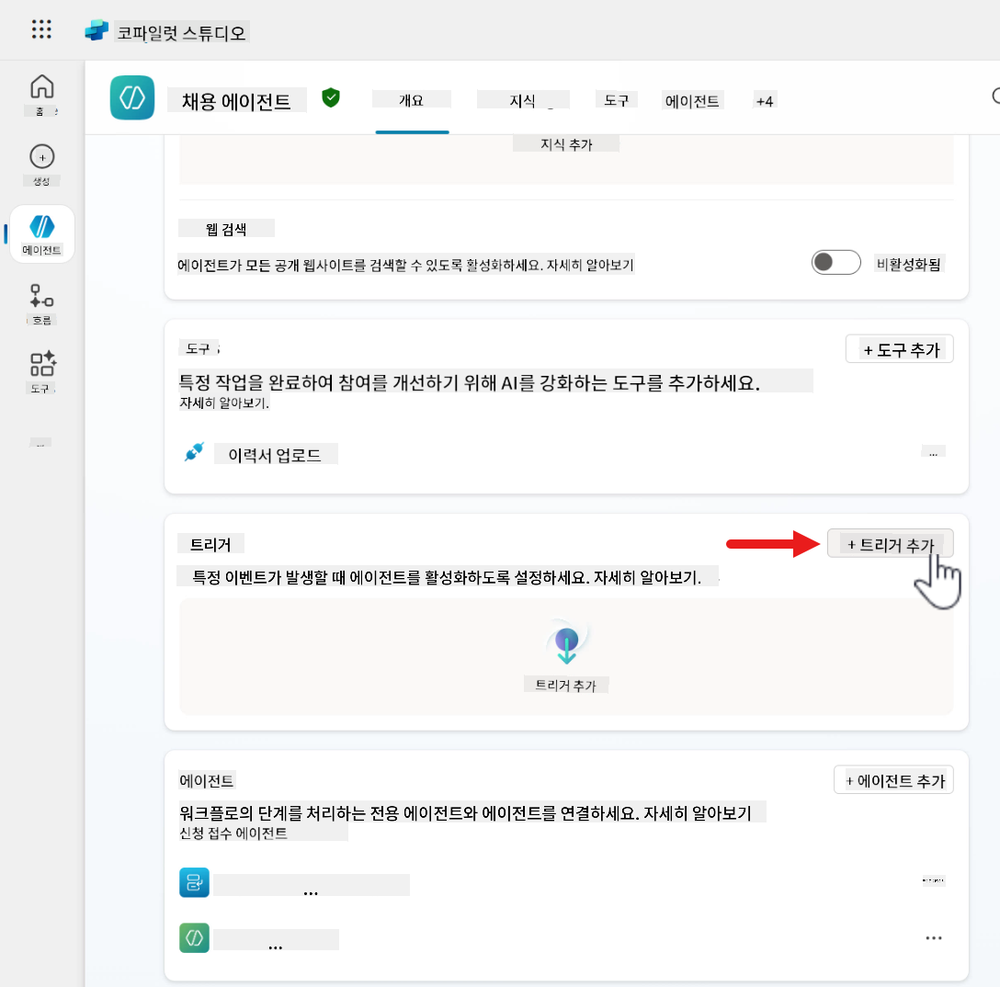

1. 트리거 목록이 나타납니다. **When a new email arrives (V3)**를 선택하고 **Next**를 클릭합니다.

       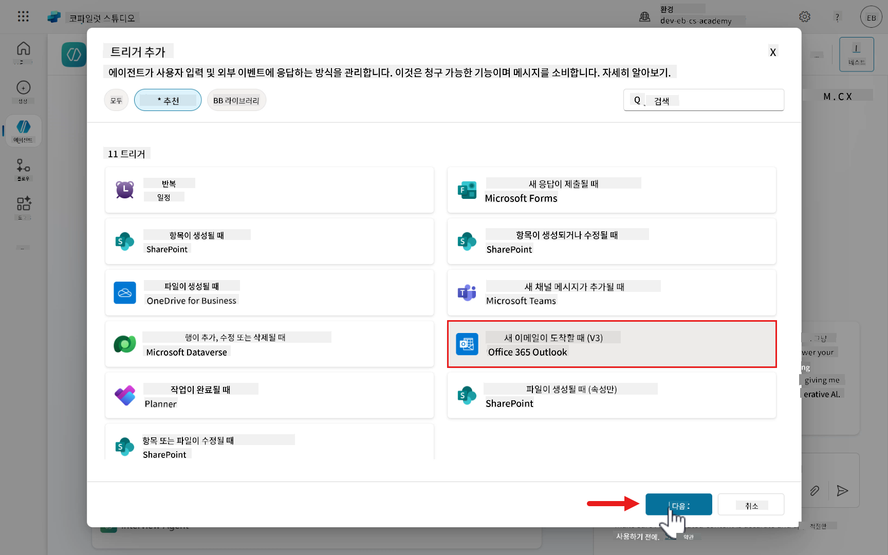

1. 이제 **Trigger name**과 앱에 대한 **Sign in** 연결 참조를 확인할 수 있습니다.

       트리거 이름을 다음과 같이 변경하세요,
    
       ```text
       지원자가 보낸 새 이메일이 도착했을 때
       ```

       나열된 앱의 연결 참조 옆에 초록색 체크 표시가 있는지 확인하세요. 초록색 체크 표시가 보이지 않으면, 줄임표(...)를 통해 로그인하고 **+ New connection reference**를 선택하여 새 연결 참조를 만드세요.

       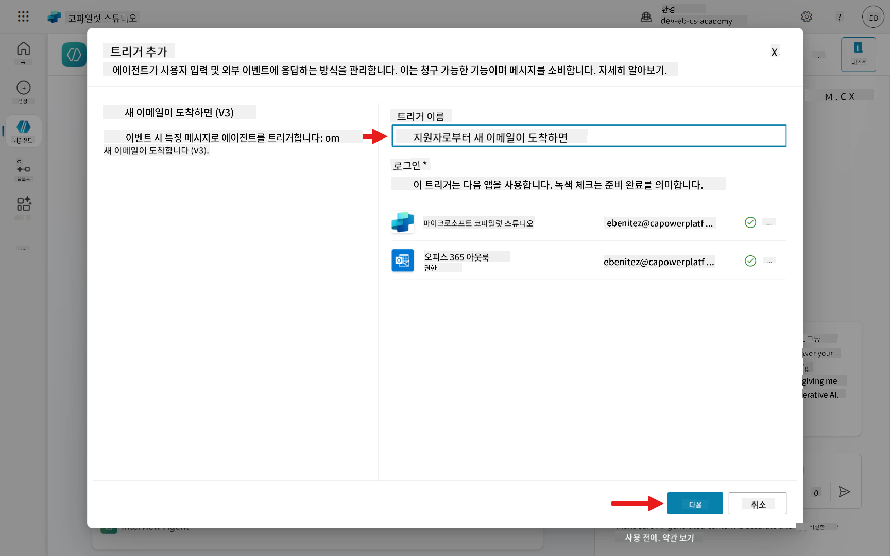

1. 마지막 단계는 트리거의 입력 속성을 설정하는 것입니다. 다음 속성을 다음과 같이 업데이트하세요.

     | 속성 | 설정 방법 | 세부 정보 |
     |------|----------|-----------|
     | **Include Attachments (Optional)** | 드롭다운 | Yes |
     | **Subject Filter (Optional)** | 키보드로 입력 | Application |
     | **Only with Attachments (Optional)** | 드롭다운 | Yes |

       **Create trigger**를 선택하세요.

       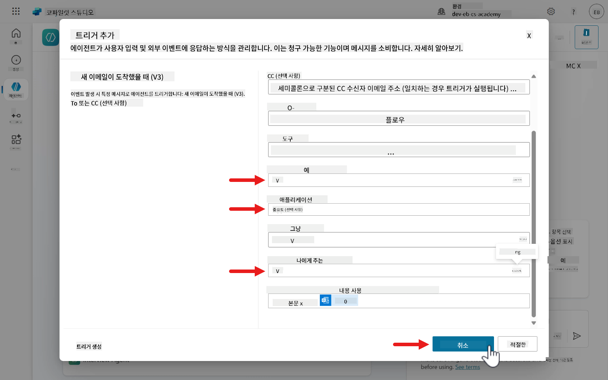

1. 생성이 완료되면 트리거가 에이전트에 추가되었다는 확인 메시지가 나타납니다. **Close**를 선택하면 트리거가 **Triggers** 섹션에 나열됩니다.
이제 이벤트 트리거를 업데이트하여 자동화 기능을 추가하려고 합니다. 트리거 옆의 **점 세 개 (...)**를 선택하고 **Power Automate에서 편집**을 선택하세요.

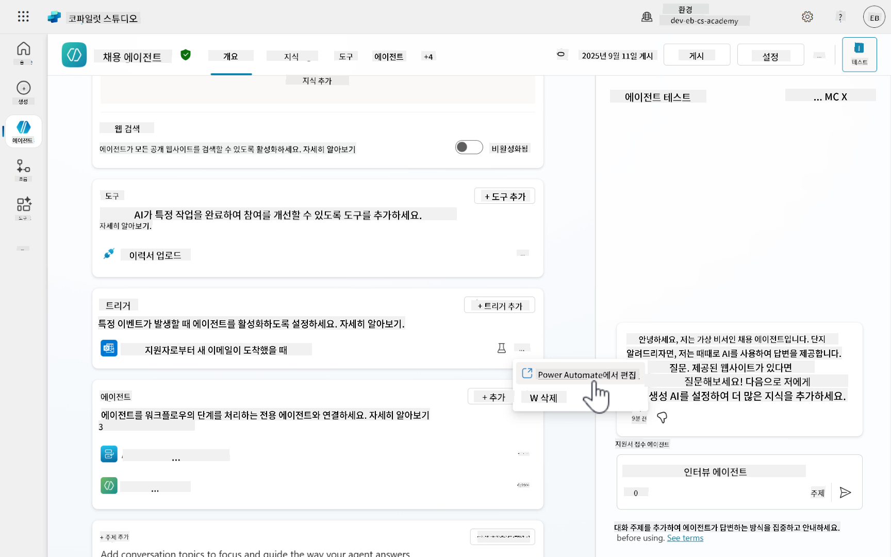

1. 트리거는 Power Automate 제작 포털에서 흐름으로 로드됩니다. 여기서 보이는 것은 Power Automate 제작 포털의 흐름 디자이너입니다. 이곳에서 추가적인 논리와 작업을 추가하여 더 많은 자동화를 구현할 수 있습니다. 트리거는 상단에 나타나며, 흐름의 마지막 작업으로 **지정된 Copilot에 처리 요청을 보냄**이 표시됩니다.

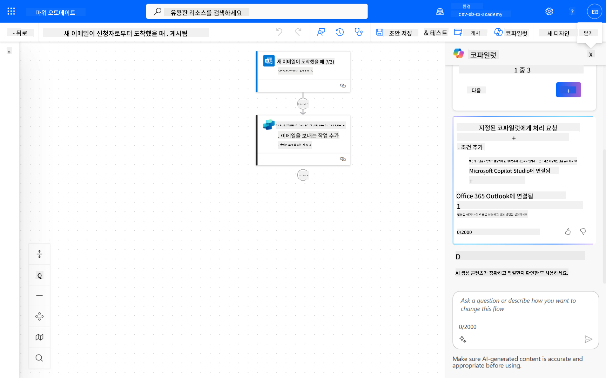

1. 기본적으로 Power Automate의 **새 이메일이 도착했을 때** 트리거는 여러 이메일이 동시에 도착하면 한 번만 흐름을 실행하여 배치를 처리할 수 있습니다.

   각 이메일에 대해 흐름이 개별적으로 실행되도록 하려면 트리거 설정에서 **Split On** 설정을 활성화하고 드롭다운 배열 필드에서 `@triggerOutputs()?['body/value']`를 선택하세요.

   **Split On**을 활성화하고 배열 필드를 `@triggerOutputs()?['body/value']`로 설정하면, 여러 이메일이 동시에 도착하더라도 각 메시지에 대해 개별적으로 흐름이 실행됩니다.

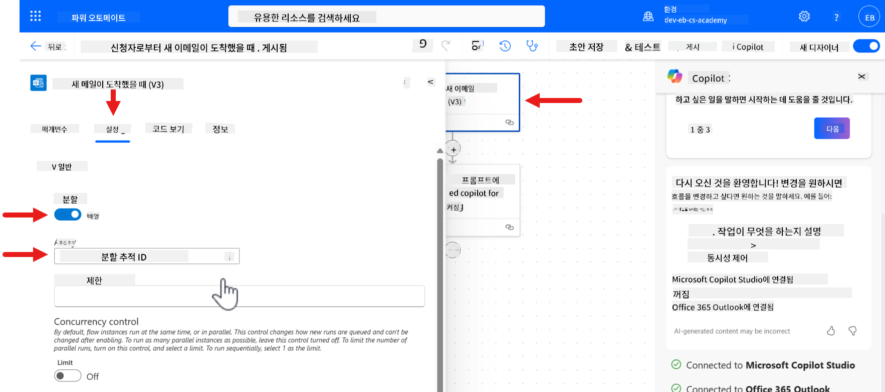

1. 다음으로 첨부 파일의 파일 유형을 확인하는 논리를 추가하겠습니다. 우리는 .PDF 파일 첨부만 업로드하고 이메일 서명에서 올 수 있는 이미지는 업로드하지 않으려 합니다. 트리거 아래의 **+** 아이콘을 선택하고 **내장 도구** 섹션에서 **Control**을 선택하세요.

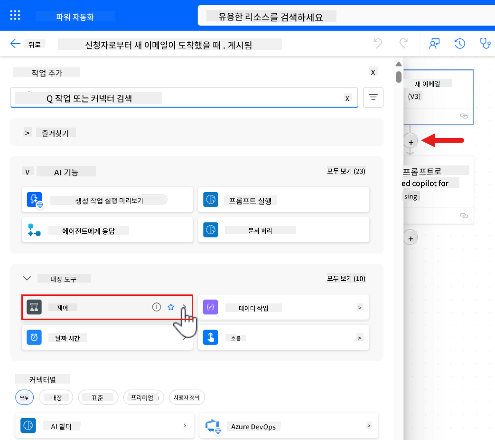

1. **Condition** 작업을 선택하세요.

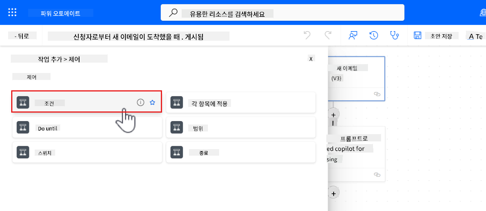

1. 이제 파일 첨부의 유형이 .PDF인지 확인하는 조건을 구성합니다. **값 선택** 필드에서 오른쪽의 **번개 아이콘** 또는 **fx 아이콘**을 선택하세요.

   1. **검색** 필드에 다음을 입력하세요.

      ```text
      content type
      ```

   1. 그런 다음 트리거에서 **Attachments Content-Type** 매개변수를 선택하세요.

   1. 다음으로 **추가**를 선택하여 작업의 **Id** 매개변수에 동적 콘텐츠 입력을 추가하세요.

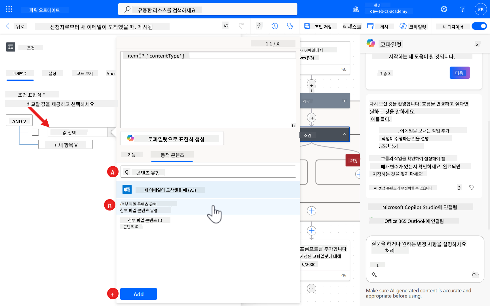

1. 잠시 멈춰보면, **For each** 작업이 자동으로 나타난 것을 아마도 눈치챘을 것입니다.

   **For each** 작업을 선택하세요. 이 작업은 이메일의 각 첨부 파일을 반복 처리하는 것을 나타냅니다. 이는 트리거에서 **Attachments Content-Type** 매개변수가 각 첨부 파일에 연결되어 있기 때문입니다.

   내부적으로 배열로 처리되며, **Attachments Content-Type** 매개변수를 **Condition** 작업에서 선택했을 때 **For each** 작업이 자동으로 추가된 이유입니다.

   이에 대해 더 알아보려면 아래 추가 학습 블록을 확장하세요.

??? info "추가 학습: For each 작업 자동 생성"

    🤔 **왜 "Apply to each" 또는 "For each"가 자동으로 나타날까요?**
    
    리스트나 배열 항목을 나타내는 매개변수(동적 콘텐츠)를 선택하면 - 예를 들어 첨부 파일, 이메일, 행 목록 - Power Automate는 각 항목을 개별적으로 처리하려는 의도를 인식합니다.
    
    이를 돕기 위해 Power Automate는 작업 주위에 **“Apply to each”** (또는 **For each**) 루프를 자동으로 추가합니다. 이는 작업이 리스트 전체를 한 번에 처리하려고 시도하는 대신 리스트의 각 항목에 대해 한 번씩 실행되도록 보장합니다.

    🦋 **예시**
    
    - 이전 작업에서 "Attachments"를 선택하고 (배열임) 단일 파일을 기대하는 작업에서 사용하려고 하면, Power Automate는 작업 주위에 **"Apply to each"** (또는 **For each**) 루프를 추가합니다.
    - 이렇게 하면 작업이 **각 첨부 파일**에 대해 한 번씩 실행됩니다.

    💡 **핵심 포인트**
    
    - **자동:** 루프는 컬렉션의 각 항목을 처리하도록 돕기 위해 자동으로 나타납니다.
    - **오류 방지:** 루프 없이 작업이 여러 항목을 한 번에 처리할 수 없어 실패할 수 있습니다.
    - **시각적 표시:** 흐름이 리스트의 각 항목에 대해 작업을 반복 실행할 것임을 시각적으로 보여줍니다.

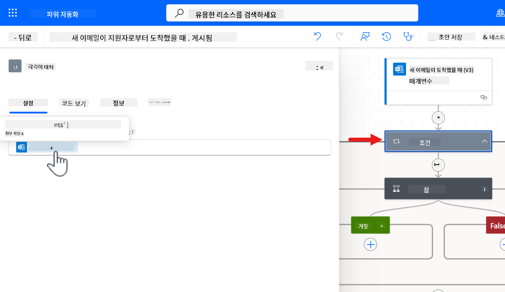

1. 다음으로 다른 **값 선택** 필드에 다음을 입력하세요.

   ```text
   application/pdf
   ```

   이렇게 하면 각 파일 첨부에 대해 파일 확장자 형식이 .PDF인지 확인합니다.

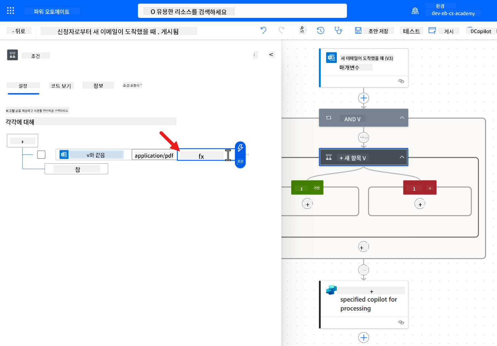

1. 이제 **True** 경로를 구성하여 이메일에서 파일을 추출하고 **Resume** Dataverse 테이블에 업로드하겠습니다.

   **True** 경로 아래에 새 작업을 추가하고 `html to text`를 검색하세요. **Html to text** 작업을 선택하세요.

   **Html to text** 작업에 대해 더 알아보려면 아래 추가 학습 블록을 확장하세요.

??? info "추가 학습: Html to text 작업"

    🤔 **"HTML to text" 작업이란 무엇인가요?**
    
    Power Automate의 **HTML to text** 작업은 HTML 형식의 콘텐츠를 일반 텍스트로 변환하는 데 사용됩니다. 이는 이메일, 웹 콘텐츠 또는 API 응답과 같이 HTML 태그가 포함된 데이터를 수신할 때, 포맷이나 코드 없이 읽을 수 있는 텍스트만 추출하고자 할 때 유용합니다.

    ⚙️ **작동 방식**
    
    - **입력:** HTML 콘텐츠 문자열을 제공합니다 (예: 이메일 본문).
    - **출력:** 작업은 모든 HTML 태그를 제거하고 일반 텍스트만 반환합니다.
    
    👍🏻 **언제 사용해야 하나요?**
    
    - HTML 태그가 포함된 이메일, 웹 페이지 또는 API 응답에서 읽을 수 있는 텍스트를 추출할 때.
    - HTML 포맷을 지원하지 않는 시스템(SMS, Teams 메시지, 데이터베이스 등)에 콘텐츠를 보내기 전에.
    - 데이터를 정리하고 추가 처리 또는 분석을 준비할 때.

    🔭 **어디에서 찾을 수 있나요?**
    
    - Power Automate의 에이전트 흐름에서 `HTML to text` 작업을 검색하세요. **Data Operations** 커넥터 아래에 있습니다.
       
    💡 **핵심 포인트**
    
    - 모든 HTML 태그를 제거하고 텍스트만 남깁니다.
    - 스크립트/스타일을 해석하거나 실행하지 않으며 태그만 제거합니다.
    - 데이터 정리 및 일반 텍스트 출력 준비에 유용합니다.

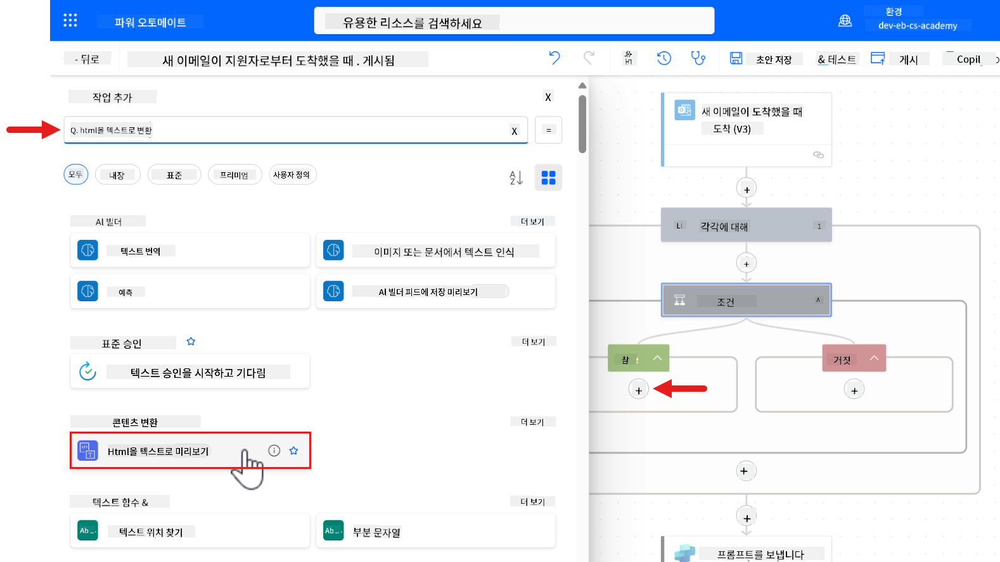

1. 다음으로 **Html to text** 작업에 대해 새 연결 참조를 생성해야 합니다. **새로 추가**를 선택하세요.

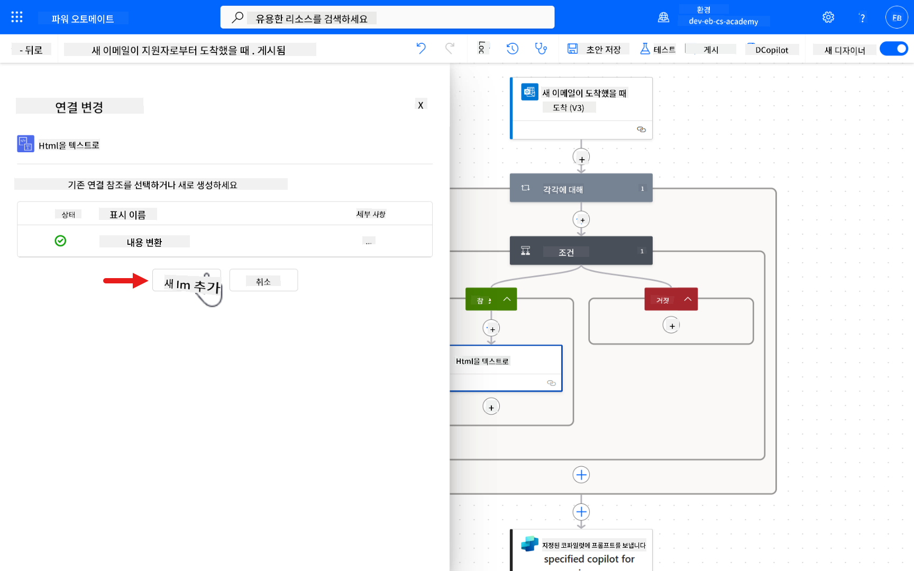

1. 이제 작업을 구성할 수 있습니다. 트리거에서 **Body** 매개변수를 추가하세요. **Content** 필드에서 오른쪽의 **번개 아이콘** 또는 **fx 아이콘**을 선택하세요.

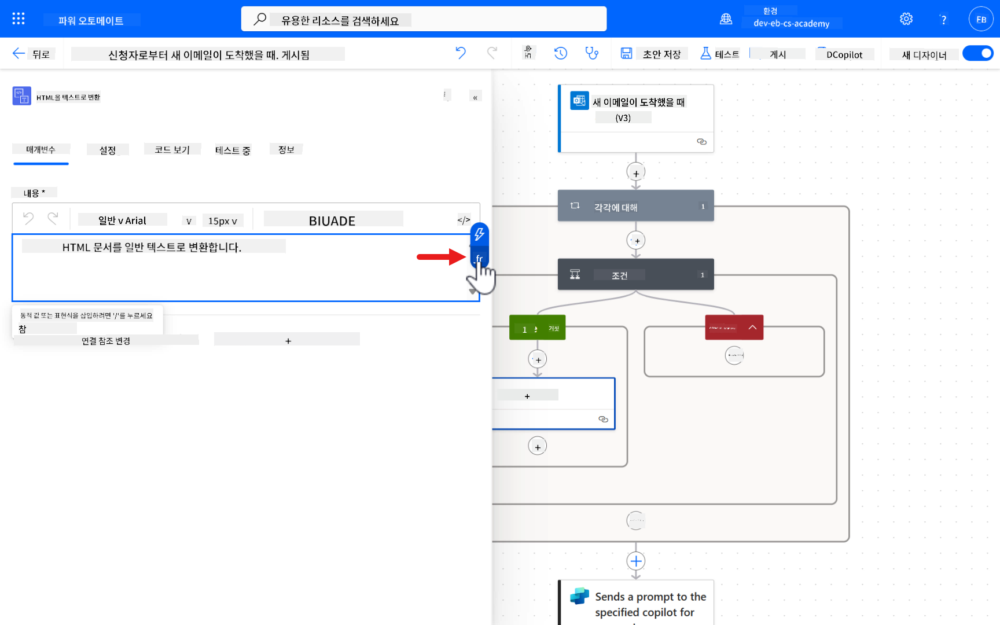

1. **동적 콘텐츠** 탭에서 `body`를 검색하고 **Body** 매개변수를 선택한 후 **추가**를 선택하세요.

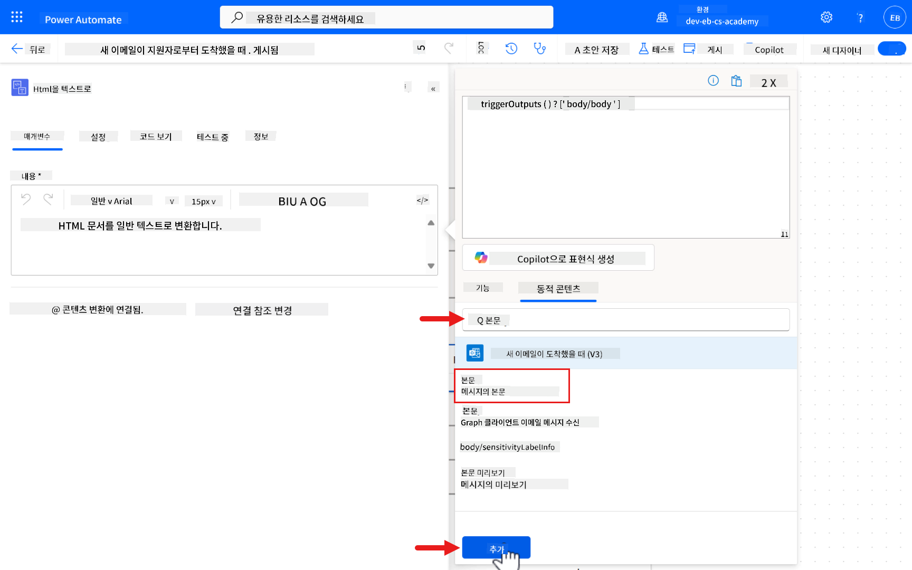

1. 이 작업 구성을 완료했으므로 작업에서 나가려면 왼쪽으로 향하는 두 개의 각괄호 («)를 선택하여 패널을 축소하세요.

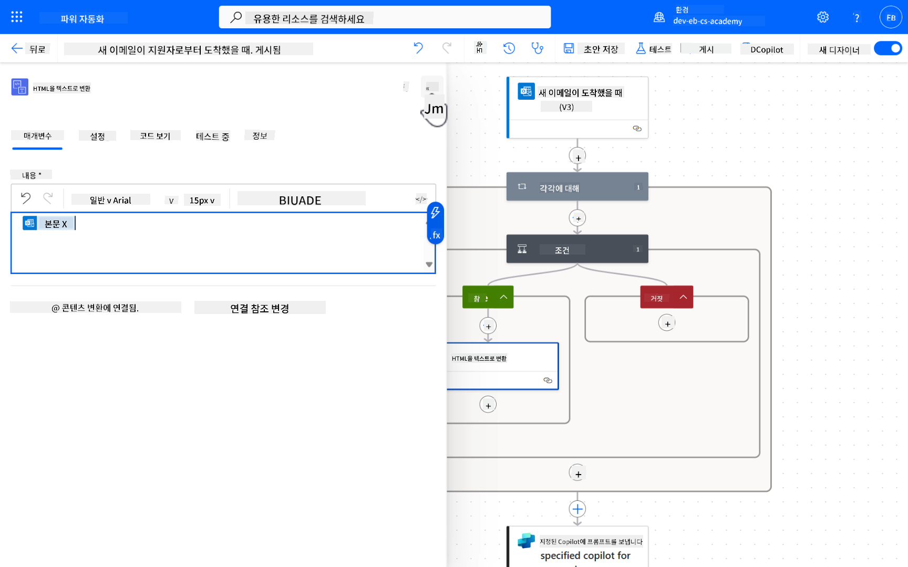

1. **Html to text** 작업 아래에 **+ 아이콘**을 선택하여 새 작업을 추가하세요. 패널이 로드되면 **Microsoft Dataverse** 커넥터를 선택하세요.

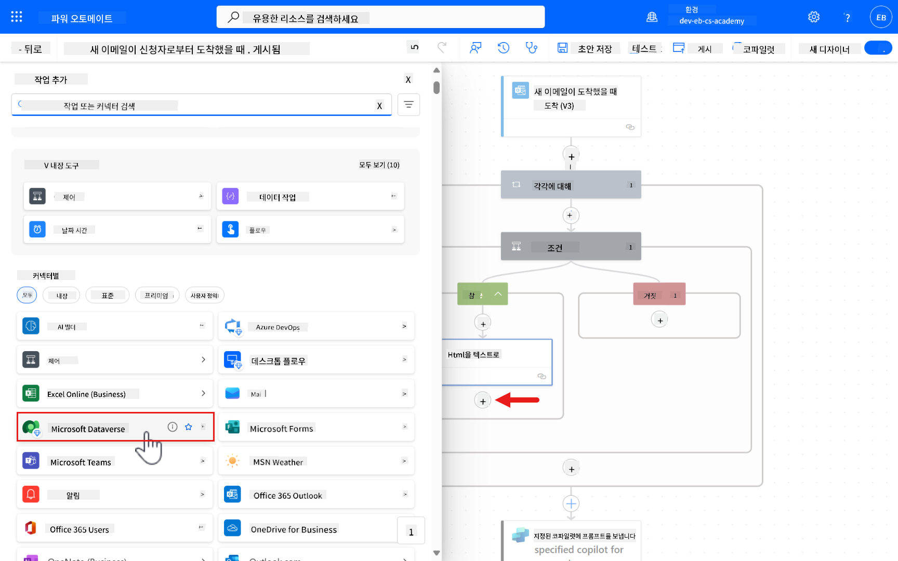

1. **새 행 추가** 작업을 선택하세요.

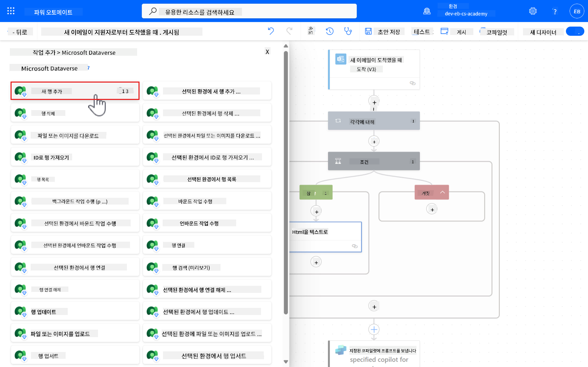

1. 작업 이름을 변경하려면 **점 세 개 (...)**를 선택하고 다음을 복사하여 붙여넣으세요.

   ```text
   Add a new Resume row
   ```

   **테이블 이름** 매개변수에서 `res`를 검색하고 **Resumes** 테이블을 선택하세요.

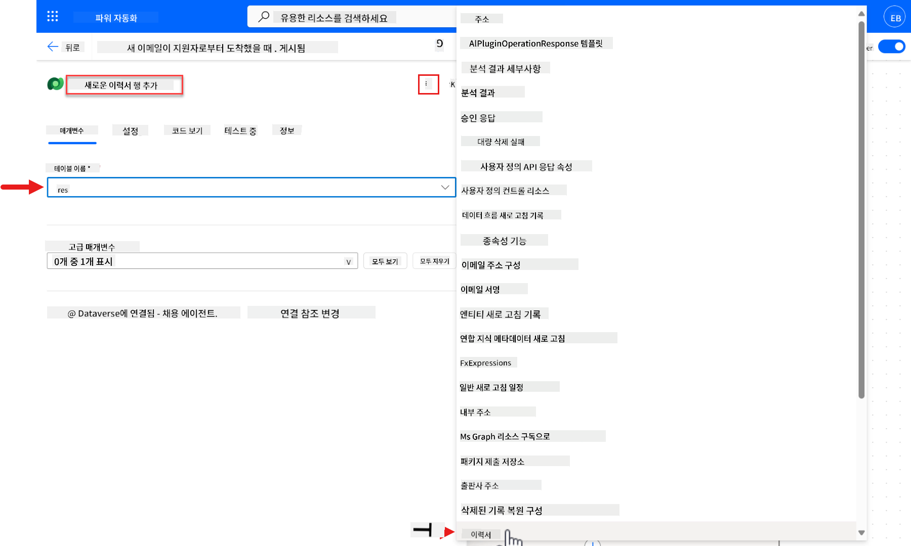

1. 다음으로 **Resume Title** 필드를 선택하고 오른쪽의 **번개 아이콘** 또는 **fx 아이콘**을 선택하세요.

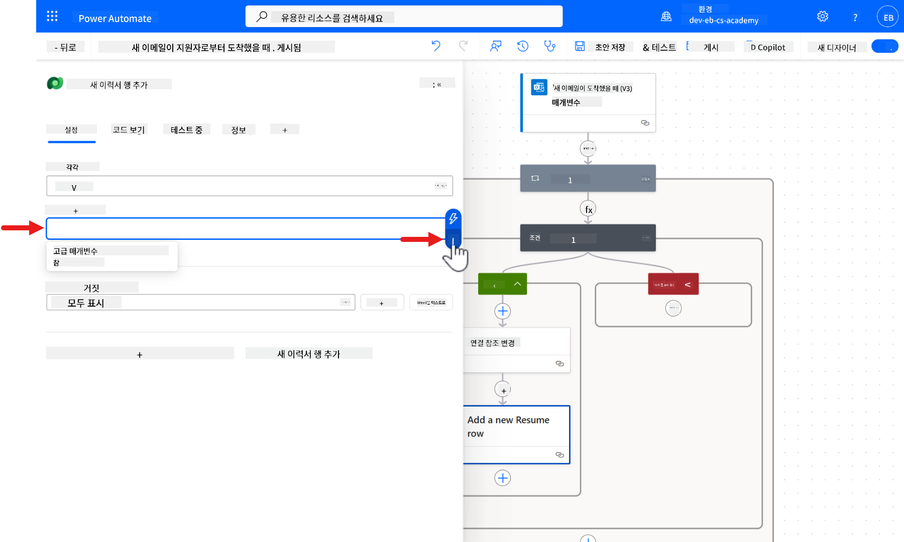

1. **Function 탭**에서 다음 표현식을 입력하세요. 이 표현식은 `item()` 함수를 사용합니다.

   ```text
   item()?['name']
   ```

   `item()` 함수에 대해 더 알아보려면 아래 추가 학습 블록을 확장하세요.

??? info "추가 학습: `item()` 함수"

    🤔 **`item()` 함수란 무엇인가요?**
    
    - **Apply to each** 작업을 사용할 때 Power Automate는 컬렉션(배열)의 각 요소를 처리합니다.
    - 주로 **Apply to each** (또는 **For each**), **Select**, **Filter array**와 같은 작업 내에서 사용됩니다.

    ⚙️ **작동 방식**
    
    - `item()`은 루프 또는 배열 작업에서 현재 처리 중인 항목을 반환하는 함수입니다.
    - 해당 루프 내에서 `item()`은 처리 중인 _현재 요소_를 나타냅니다.
    
    📌 **어디에서 사용하나요?**
    
    - **Apply to each:** 현재 항목의 속성에 접근할 때.
    - **Select:** 배열의 각 항목을 변환할 때.
    - **Filter array:** 평가 중인 현재 항목을 참조할 때.

    🦋 **예시**
    
    - 루프 내 표현식:
           -  `item()?['Email']`
    - 현재 항목의 `Email` 속성을 가져옵니다.
       
    💡 **핵심 포인트**
    
    - `item()`은 _컨텍스트에 민감_하며, 항상 루프 또는 배열 작업 내에서 현재 항목을 참조합니다.
    - 루프를 중첩하면 `items('LoopName')`을 사용하여 특정 루프의 항목을 참조할 수 있습니다.

   **Resume Title** 매개변수에 표현식을 추가하려면 **추가**를 선택하세요.

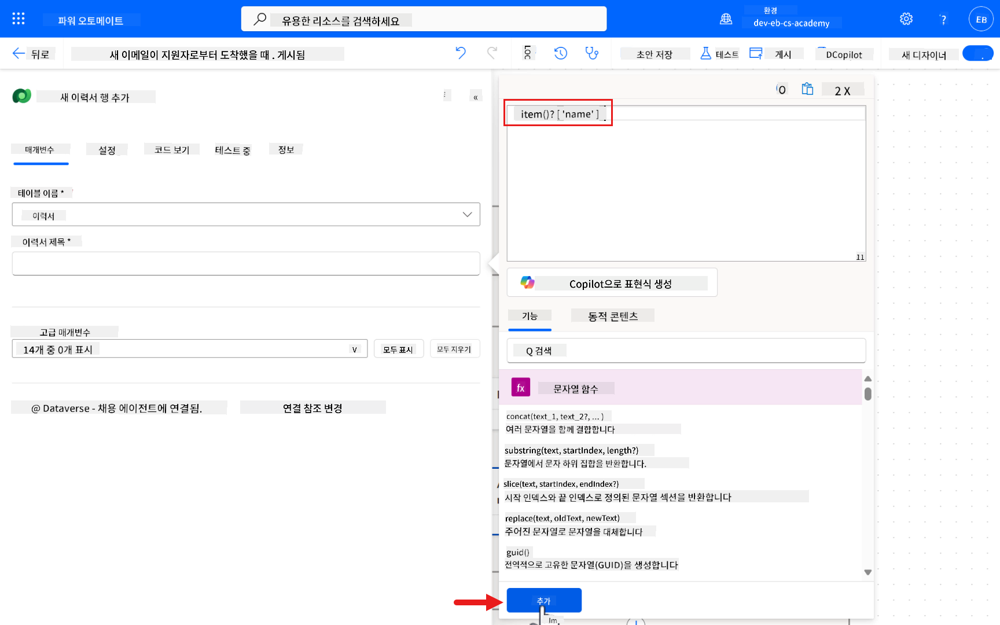

1. 아직 몇 가지 매개변수를 더 구성해야 합니다. **모두 표시**를 선택하고 **Cover Letter** 필드에서 오른쪽의 **번개 아이콘** 또는 **fx 아이콘**을 선택하세요.

   **Function 탭**에서 이전 [미션](../02-multi-agent/README.md)에서 사용한 동일한 표현식을 입력하세요.

   ```text
   if(greater(length(body('Html_to_text')), 2000), substring(body('Html_to_text'), 0, 2000), body('Html_to_text'))
   ```

   이 표현식은 **Html to text** 작업에서 가져온 _텍스트_가 2000자보다 긴지 확인하고, 그렇다면 처음 2000자만 반환하며, 그렇지 않으면 전체 텍스트를 반환합니다.

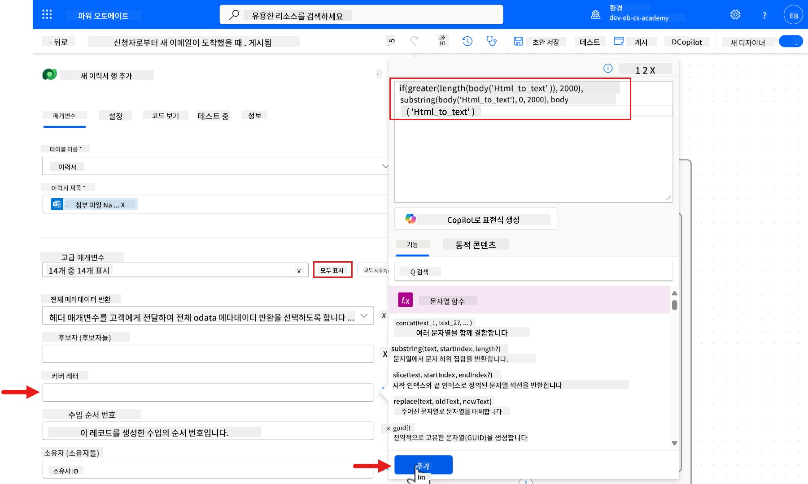

1. 이제 표현식이 **Cover Letter** 필드에 추가됩니다.


1. **Source Email Address** 필드에서는 `from`을 검색하고 트리거에서 **From** 매개변수를 선택하세요. 이 매개변수는 이메일 주소 값을 포함합니다.

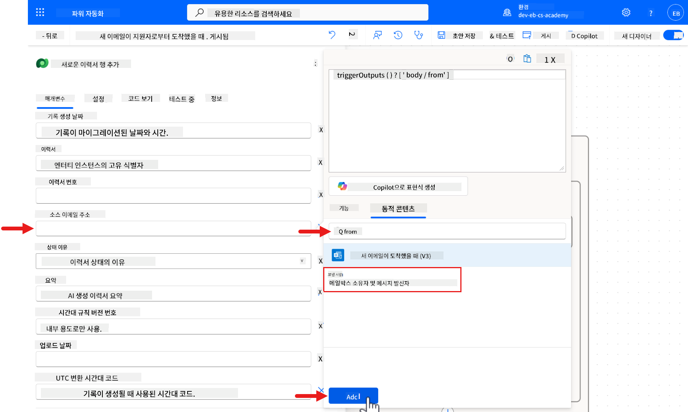

1. **Upload Date** 필드에서는 오른쪽의 **번개 아이콘** 또는 **fx 아이콘**을 선택하세요. **Function 탭**에서 `utcNow()` 함수를 사용하는 다음 표현식을 입력하세요.

   ```text
   utcNow()
   ```

   `utcNow` 함수에 대해 더 알아보려면 아래 추가 학습 블록을 확장하세요.

??? info "추가 학습: `utcNow` 함수"

    🤔 **`utcNow()` 함수란 무엇인가요?**
    
    - Power Automate의 `utcNow()` 함수는 현재 날짜와 시간을 ISO 8601 형식으로 된 협정 세계시(UTC)로 반환합니다. 예: `2025-09-23T04:32:14Z`
    
    🦋 **예시**
    
    - 표현식:
           -  `concat('Report generated on ', utcNow())`
    - 출력:
           - Report generated on `2025-09-23T04:32:14Z`
       
    💡 **핵심 포인트**

- **인수(입력 매개변수) 필요 없음:** 항상 현재 UTC 타임스탬프를 제공합니다.
   - **사용 사례**
       - 로그 또는 파일 이름에 타임스탬프 추가
       - 현재 시간과 다른 날짜 비교
       - 일정 또는 시간 기반 조건 설정

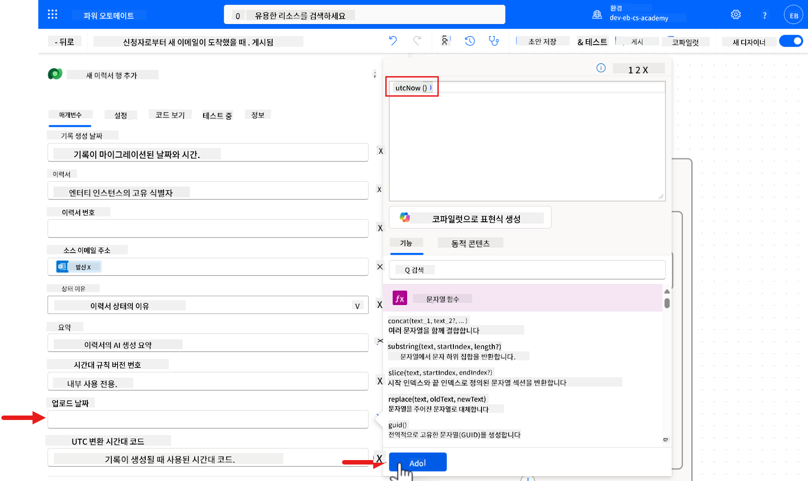

1. 이제 **새 이력서 행 추가** 작업 구성을 완료했으므로 패널을 축소하여 종료합니다.


1. **새 이력서 행 추가** 작업 아래의 **+ 아이콘**을 선택하여 새 작업을 추가합니다. 그러면 작업을 추가할 패널이 로드됩니다. 다시 **Microsoft Dataverse** 커넥터를 선택합니다.

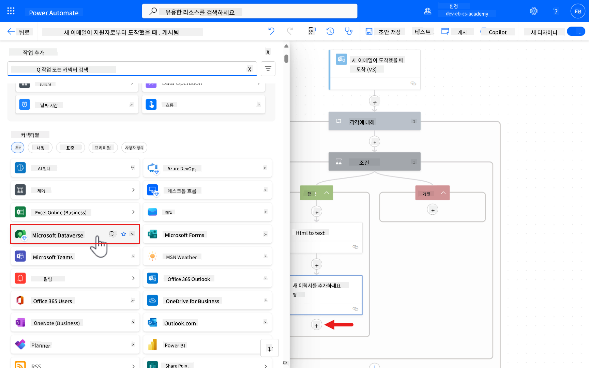

1. **파일 또는 이미지 업로드** 작업을 선택합니다.


1. 작업 이름을 변경하려면 **점 세 개(...)**를 선택하고 아래 텍스트를 복사하여 붙여넣습니다.

```text
Upload Resume File
```


1. 다음으로 **Content name** 필드를 선택하고 오른쪽의 **번개 아이콘** 또는 **fx 아이콘**을 선택합니다.

   **Function 탭**에서 `item()` 함수를 사용하는 다음 표현식을 입력합니다. 이는 현재 항목(첨부 파일)의 `name` 속성을 가져옵니다.

```text
item()?['name']
```

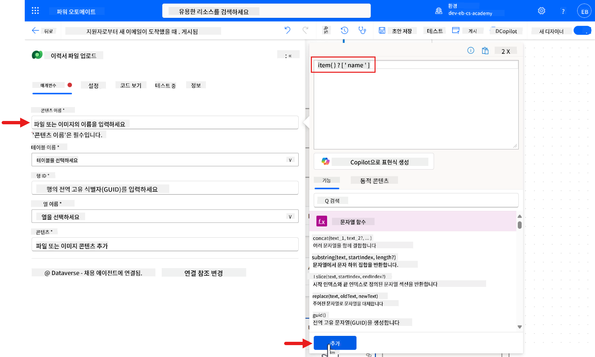

1. **Table name** 매개변수에 대해 `res`를 검색하고 **Resumes** 테이블을 선택합니다.

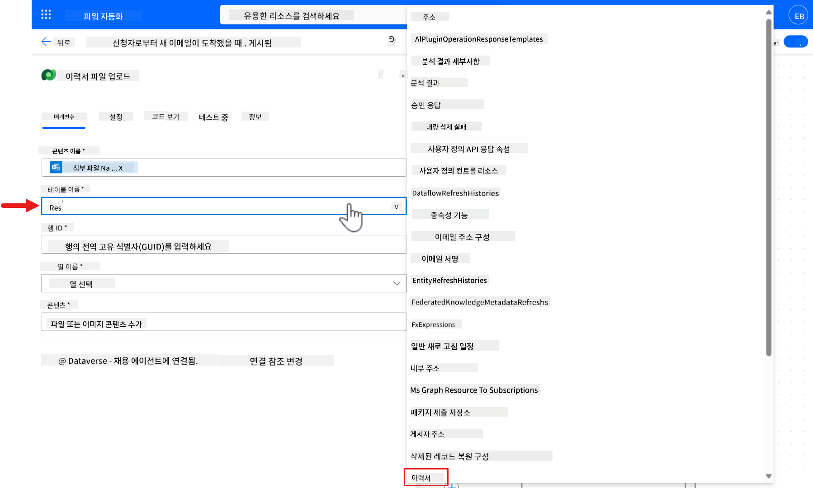

1. 다음으로 **Row ID** 필드를 선택하고 오른쪽의 **번개 아이콘** 또는 **fx 아이콘**을 선택합니다.

   `ID`를 검색하고 _새 행 추가_ Dataverse 작업에서 **Resume** 매개변수를 선택합니다. 이는 PDF 파일을 업로드할 행의 ID 값을 포함합니다.

   **추가**를 선택합니다.

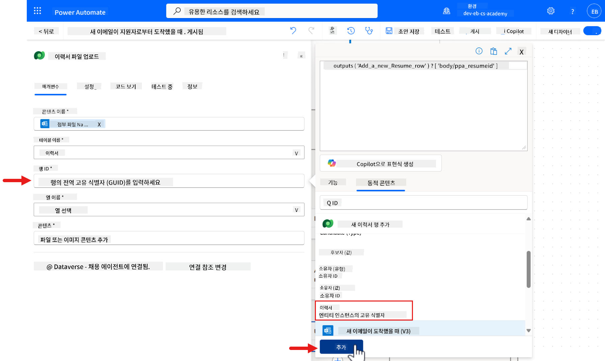

1. **Column name** 필드를 선택하고 **Resume PDF** 옵션을 선택합니다.

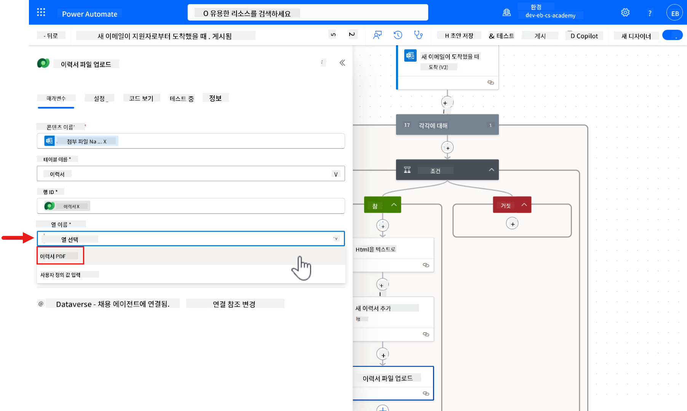

1. **Content** 필드를 선택하고 오른쪽의 **번개 아이콘** 또는 **fx 아이콘**을 선택합니다.

   **Function 탭**에서 `item()` 함수를 사용하는 다음 표현식을 입력합니다. 이는 현재 항목(첨부 파일)의 `contentBytes` 속성을 가져옵니다. `contentBytes`는 파일 또는 첨부 파일의 원시 바이너리 데이터를 Base64 문자열로 인코딩한 것입니다.

```text
item()?['contentBytes']
```

1. 이 작업 구성을 완료했으므로 왼쪽으로 향하는 두 개의 꺾쇠 괄호(«)를 선택하여 패널을 축소합니다.

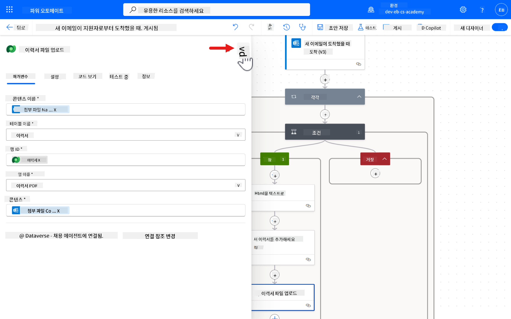

1. 다음으로 **지정된 Copilot에 처리 요청을 보냄** 작업을 선택한 후, 이 작업을 조건의 _True_ 경로에서 **Upload Resume File** 작업 아래로 드래그 앤 드롭합니다.

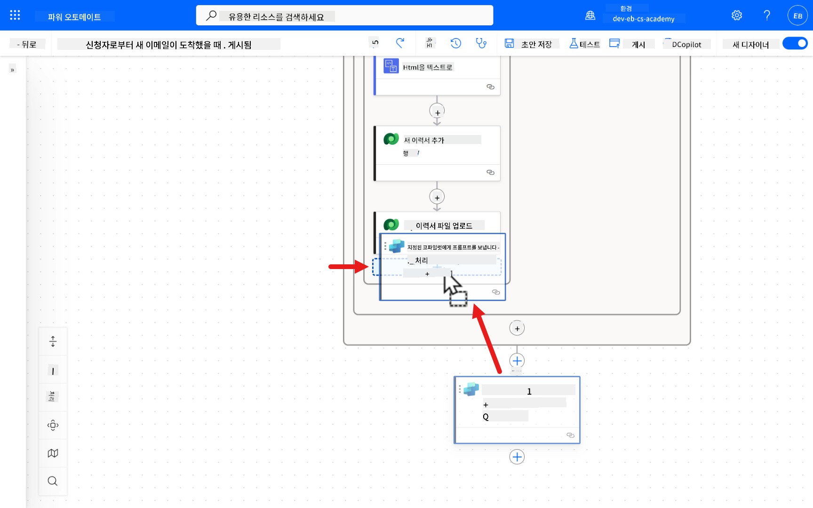

1. **지정된 Copilot에 처리 요청을 보냄** 작업을 선택하여 구성합니다.

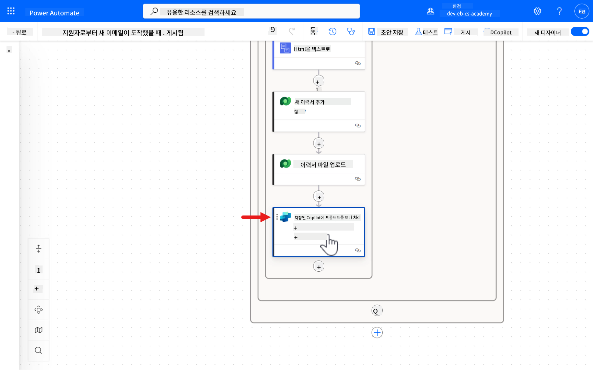

1. **Body/message** 필드에서 모든 필드 내용을 선택하고 삭제합니다.

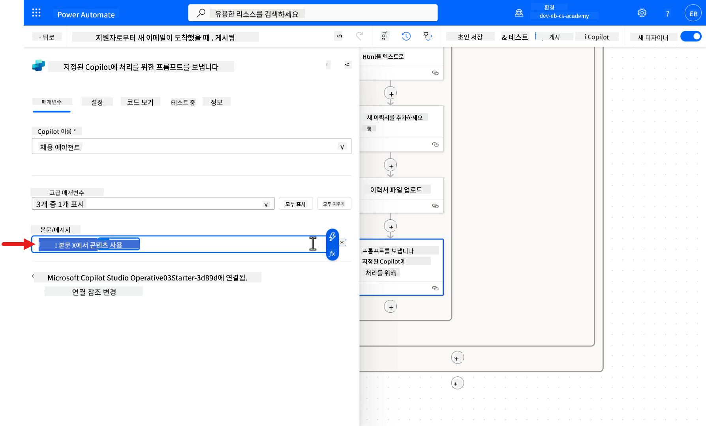

1. 아래 텍스트를 **Body/message** 필드에 복사하여 붙여넣고 `RESUME ID PLACEHOLDER`를 강조 표시합니다.

```text
Send [ResumeId (text)] = "RESUME ID PLACEHOLDER" and [ResumeTitle (text_1)] = "RESUME TITLE PLACEHOLDER" and [ResumeNumber (text_2)]= "RESUME NUMBER PLACEHOLDER" to the Tool "Notify Teams Applicant channel" in the child agent "Application Intake Agent"
```

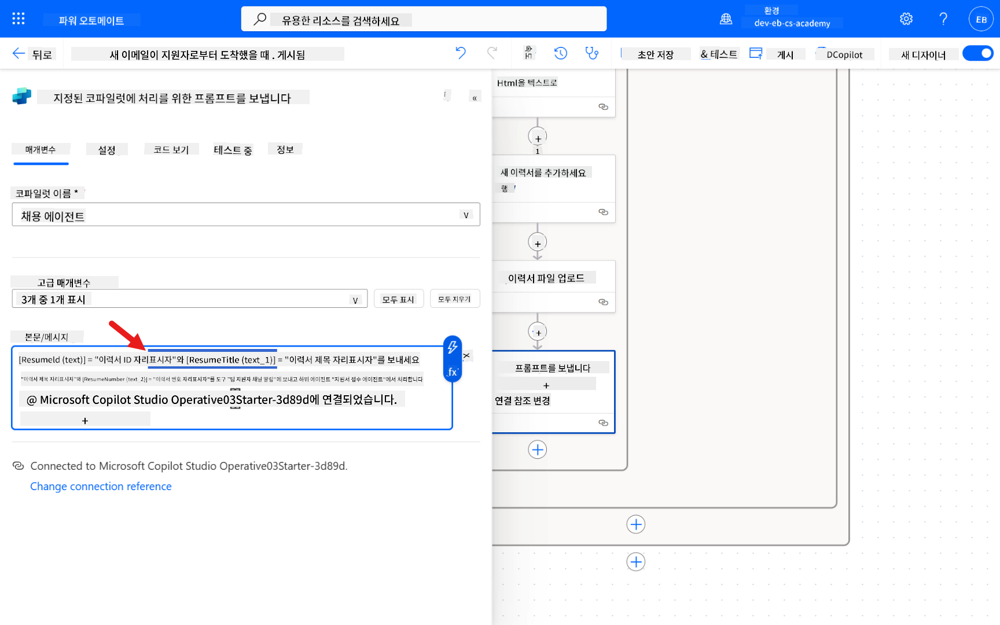

1. 오른쪽의 **번개 아이콘** 또는 **fx 아이콘**을 선택합니다.

   `resume`을 검색하고 _새 행 추가 Dataverse_ 작업에서 **Resume** 매개변수를 선택합니다. 이는 생성된 이력서 행의 `ID` 값을 포함합니다.

   **추가**를 선택합니다.


1. `RESUME TITLE PLACEHOLDER`를 강조 표시합니다. 오른쪽의 **번개 아이콘** 또는 **fx 아이콘**을 선택합니다.

   `title`을 검색하고 _새 행 추가 Dataverse_ 작업에서 **Resume Title** 매개변수를 선택합니다. 이는 생성된 이력서 행의 `resume title` 값을 포함합니다.

   **추가**를 선택합니다.

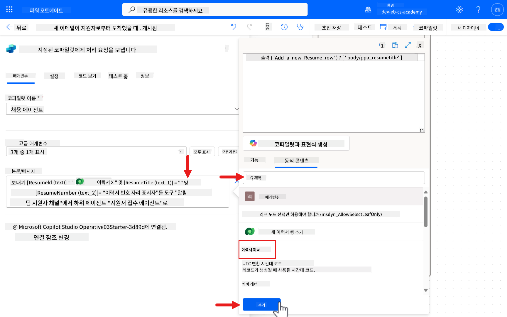

1. `RESUME NUMBER PLACEHOLDER`를 강조 표시합니다. 오른쪽의 **번개 아이콘** 또는 **fx 아이콘**을 선택합니다.

   `resume number`를 검색하고 _새 행 추가 Dataverse_ 작업에서 **Resume Number** 매개변수를 선택합니다. 이는 생성된 이력서 행의 `Resume Number` 값을 포함합니다.

   **추가**를 선택합니다.

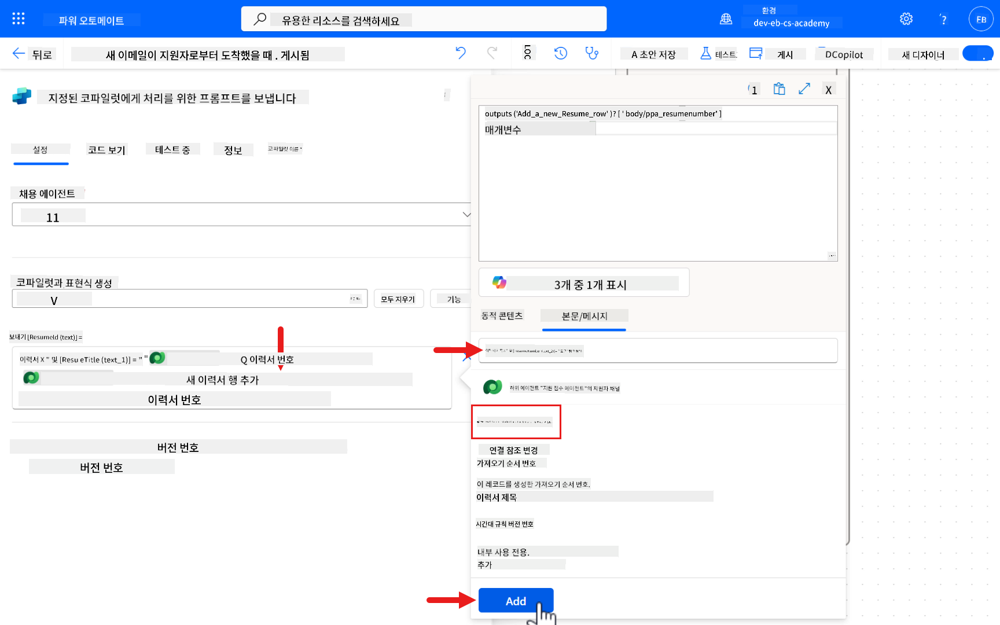

1. 이 작업 구성을 완료했으며 에이전트 흐름도 완료되었습니다 🙌🏻 잘하고 있어요! 이제 **임시 저장**을 선택하여 이벤트 트리거 흐름을 저장합니다.

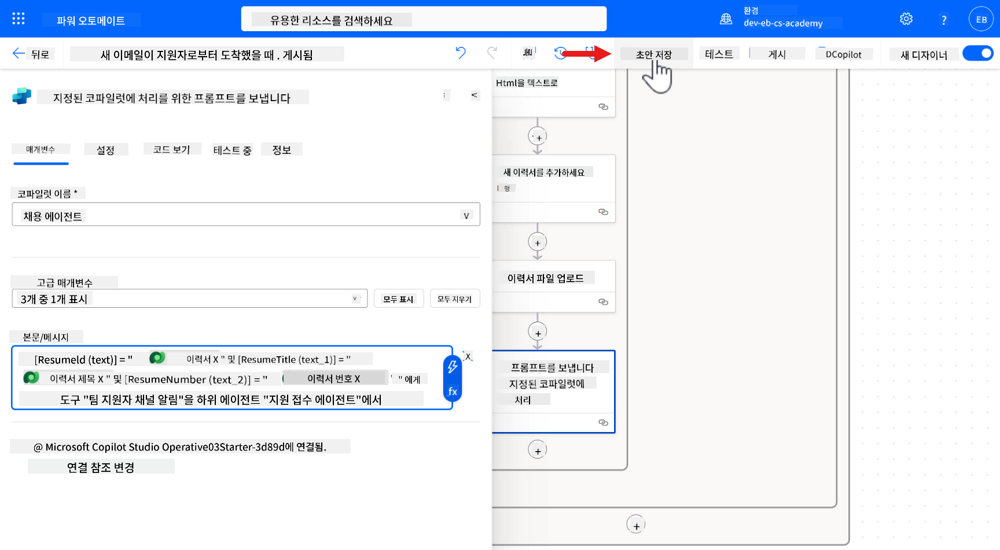

1. 이제 에이전트 흐름의 세부 정보를 편집해야 합니다. **뒤로**를 선택합니다.

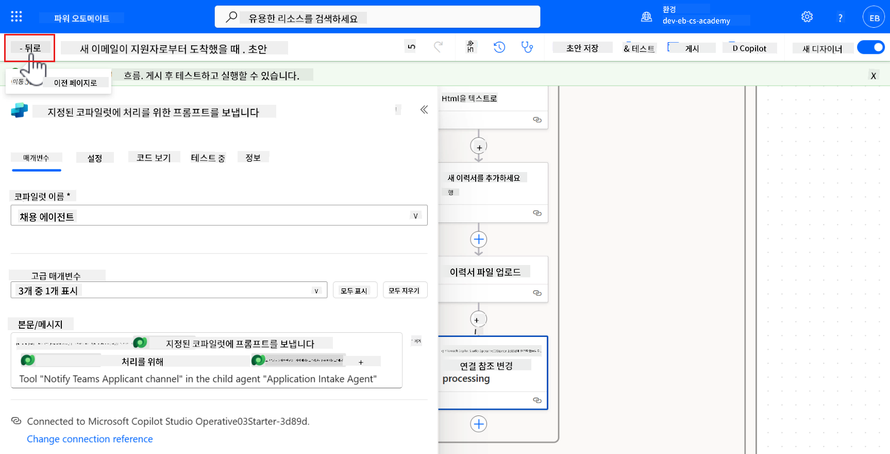

1. **세부 정보** 섹션에서 **편집**을 선택하고 **계획**을 **Copilot Studio** 옵션으로 업데이트합니다.

   **저장**을 선택합니다.

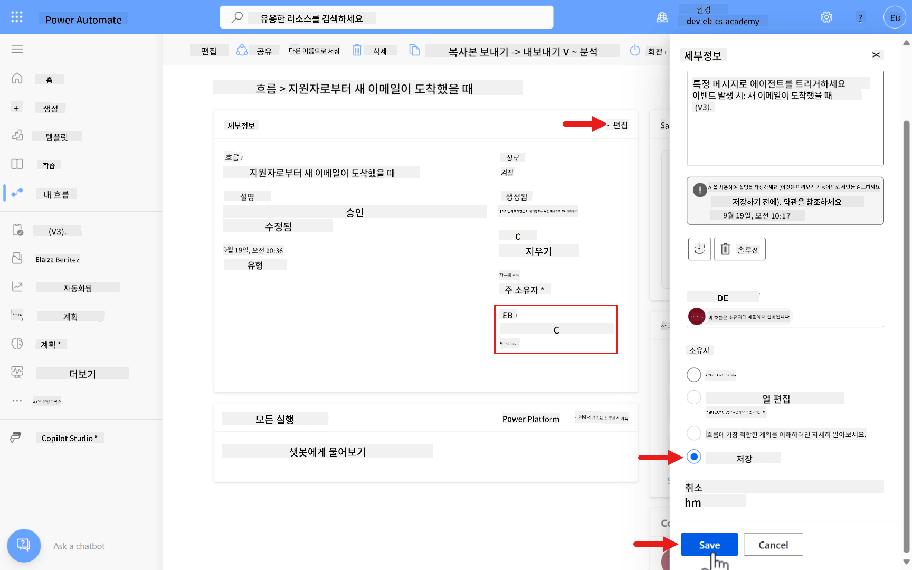

1. Copilot Studio 계획으로 전환을 확인하라는 모달이 나타납니다. **확인**을 선택합니다.

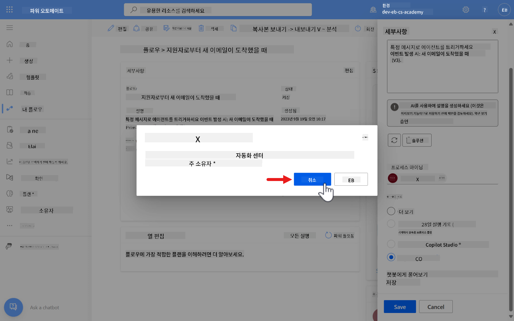

1. 계획이 **Copilot Studio**로 업데이트되었습니다. 이벤트 트리거 흐름을 게시해야 하므로 **편집**을 선택합니다.

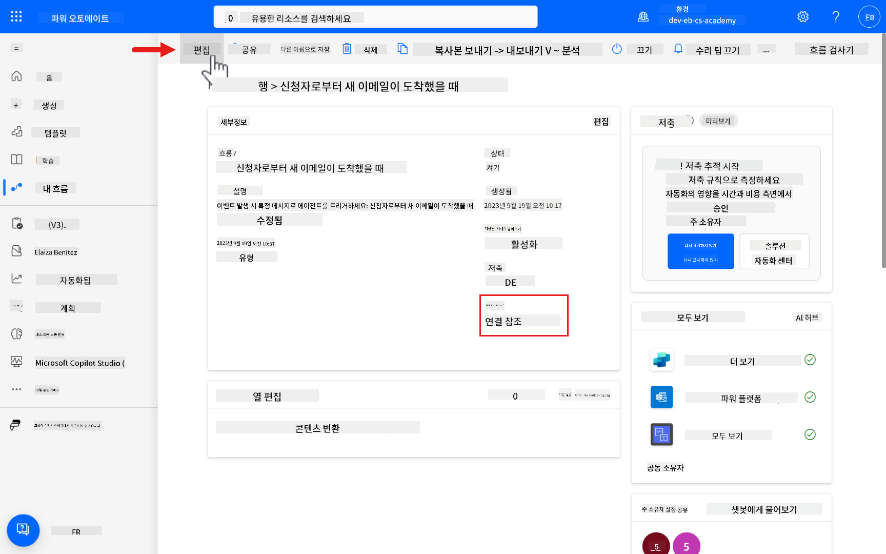

1. **게시**를 선택합니다.

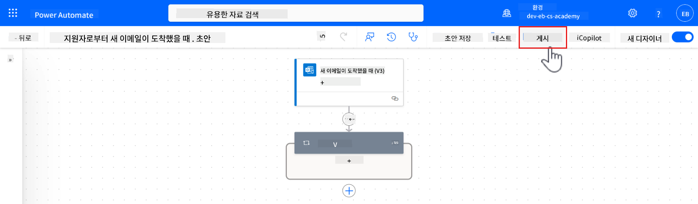

   축하합니다! 이벤트 트리거 흐름이 게시되었습니다 😃

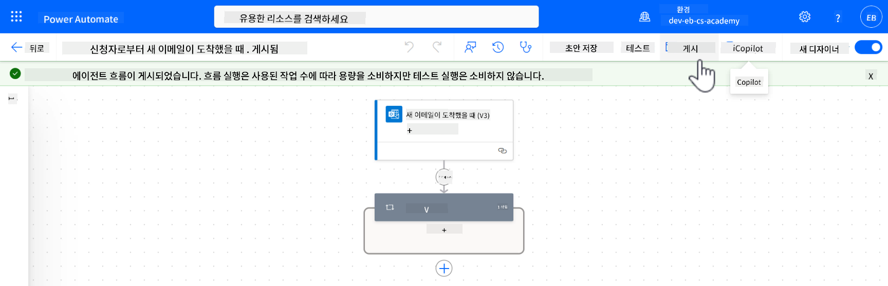

이제 자식 **Intake Application Agent**에 의해 호출될 새 에이전트 흐름을 생성해 보겠습니다.

### 실습 3.2 - 적응형 카드를 사용하여 Teams 채널 알림 보내기

이제 이벤트 트리거에서 전달된 값을 사용하여 적응형 카드를 Teams 채널에 게시하는 자식 **Intake Application Agent**를 위한 새 에이전트 흐름을 생성할 것입니다. 이 적응형 카드는 자동으로 업로드된 PDF에 대해 HR 채용 팀에 알림을 보내 검토할 수 있도록 합니다.

시작해봅시다!

1. **Hiring Agent**에서 **Agents** 탭을 선택하고 **Application Intake Agent**를 선택합니다.

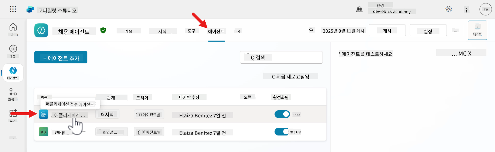

1. **도구**로 스크롤하여 **+ 추가**를 선택합니다.

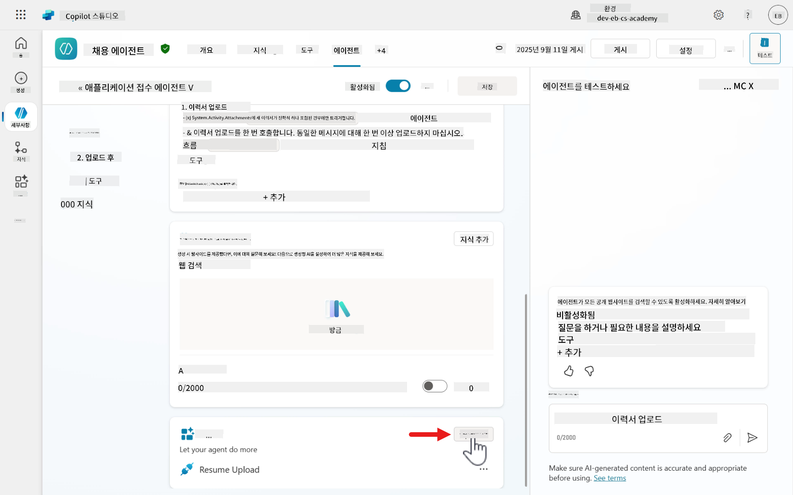

1. **도구 추가** 모달이 나타납니다. **+ 새 도구**를 선택합니다.

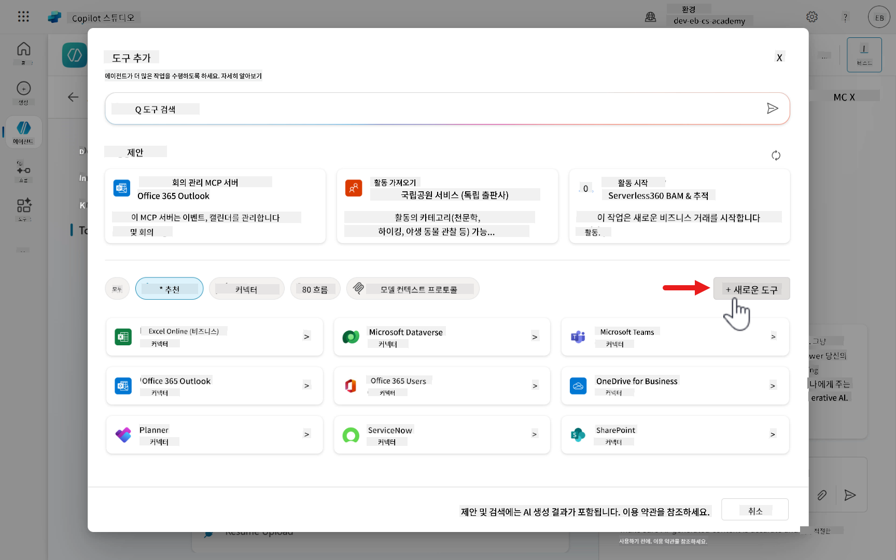

1. **에이전트 흐름**을 선택합니다.

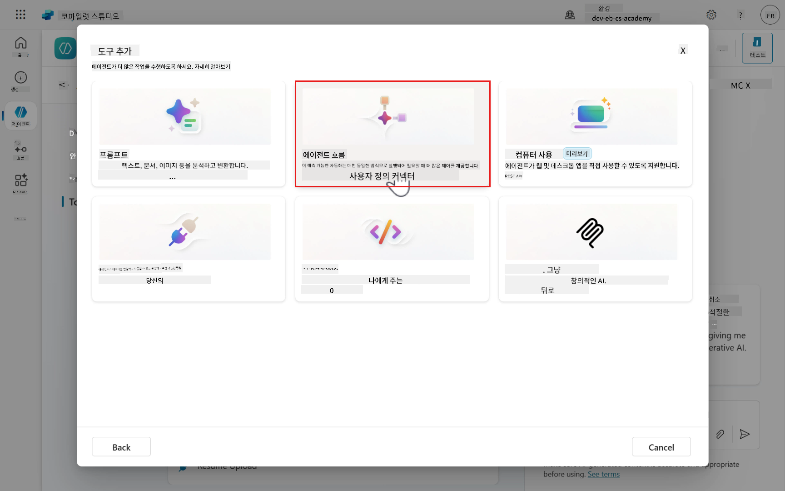

1. **에이전트 흐름 디자이너**가 로드됩니다. **에이전트가 흐름을 호출할 때** 트리거에서 **+ 입력 추가**를 선택합니다.

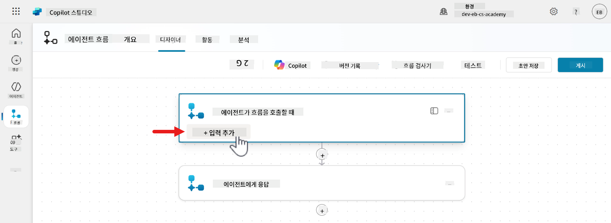

1. 사용자 입력 유형으로 **텍스트**를 선택합니다.

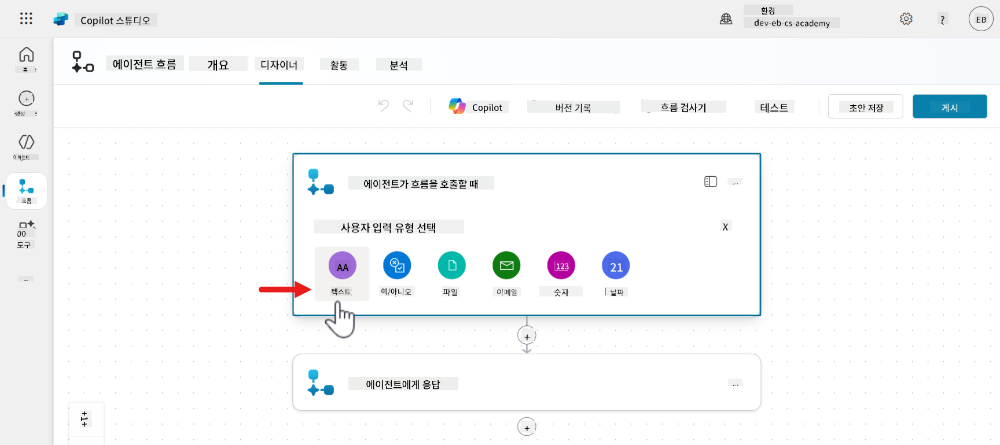

1. 입력 텍스트 필드에 아래 내용을 복사하여 붙여넣어 입력 매개변수 이름으로 설정합니다.

```text
ResumeId
```


1. 동일한 단계를 반복하여 두 번째 텍스트 입력을 추가합니다. 아래 내용을 복사하여 붙여넣어 입력 매개변수 이름으로 설정합니다.

```text
ResumeTitle
```


1. 동일한 단계를 반복하여 세 번째 텍스트 입력을 추가합니다. 아래 내용을 복사하여 붙여넣어 입력 매개변수 이름으로 설정합니다.

```text
ResumeNumber
```


1. [Recruit](../../recruit/08-add-adaptive-card/README.md#81-create-a-new-topic-with-an-adaptive-card-for-user-to-submit-their-request)에서 에이전트의 주제 내에 적응형 카드를 추가했던 것을 기억하시나요? 이번에는 에이전트 흐름 내에 적응형 카드를 추가할 것입니다. 이제 Teams 채널에 적응형 카드를 게시하는 작업을 에이전트 흐름에 추가합니다.

   트리거 아래의 **+ 아이콘**을 선택합니다.


1. **채팅 또는 채널에 카드 게시** 작업을 선택합니다.


1. Microsoft Teams에 대한 연결 참조를 로그인한 사용자 계정으로 생성해야 합니다. **로그인**을 선택합니다.


1. 사용자 계정을 선택한 후 **액세스 허용**을 선택합니다.


1. 다음 입력 매개변수에 대해,

   | 매개변수 | 설정 방법 | 세부 정보 |
   |----------|------------|---------|
   | **게시자** | 드롭다운 | `Flow bot` 옵션 선택 |
   | **게시 위치** | 드롭다운 | `Channel` 옵션 선택 |
   | **팀** | 드롭다운 | 이 실습을 완료하기 위해 액세스 가능한 환경 내 팀 선택 |
   | **채널** | 드롭다운 | 이 실습을 완료하기 위해 액세스 가능한 환경 내 채널 선택 |


1. 다음으로 **적응형 카드** 필드를 구성합니다. **적응형 카드** 필드를 선택합니다.


1. [Resume Table Updated JSON 파일](../../../../../docs/operative-preview/03-automate-triggers/assets/3.2_ResumeTableUpdated.json)을 열고 전체 내용을 복사하여 적응형 카드 필드에 붙여넣습니다.


1. [Recruit](../../recruit/08-add-adaptive-card/README.md#81-create-a-new-topic-with-an-adaptive-card-for-user-to-submit-their-request)에서 했던 것처럼 JSON 페이로드의 기존 값을 실제 값 또는 동적 콘텐츠로 교체합니다.

   먼저, `selectAction` 속성 내의 `url` 속성에 대한 URL을 업데이트합니다. 이 URL은 **Hiring Hub** 모델 기반 앱의 Resumes 시스템 뷰 URL로 교체됩니다. 이를 통해 채용 담당자가 작업을 선택하고 모델 기반 앱의 Resumes 시스템 뷰로 이동할 수 있습니다.

   현재 URL 값을 강조 표시하고 삭제합니다.


1. **Hiring Hub** 모델 기반 앱에서 왼쪽 메뉴를 사용하여 **Resumes** 시스템 뷰로 이동하고 URL을 복사합니다. 그런 다음 에이전트 흐름으로 돌아가서 복사한 URL을 `selectAction` 속성 내의 **url** 속성에 붙여넣습니다.


1. 노란색으로 강조된 부분은 **Hiring Hub** 모델 기반 앱의 환경 세부 정보입니다.

     | 매개변수 | 값 | 설명 |
     |----------|------------|---------|
     | **Organization URI** | GUID | Dataverse/Dynamics 365 환경 조직 URL |
     | **appid** | GUID | 특정 모델 기반 앱을 열기 위해 appid 또는 appname 쿼리 매개변수를 사용합니다. 이 경우 appid가 사용됩니다 |
     | **viewid** | GUID | 뷰의 ID인 쿼리 매개변수 |

       

1. 다음으로, 여러 속성에 대한 동적 콘텐츠 값을 추가합니다. 이벤트 트리거에 의해 자율적으로 생성된 행의 이력서 번호 참조를 표시할 텍스트부터 시작합니다.

      **패널** 아이콘을 선택하여 작업 패널을 로드합니다.

       

1. `RESUME NUMBER PLACEHOLDER`의 `text` 속성이 표시된 줄로 스크롤합니다. 플레이스홀더 값을 강조 표시하고 삭제합니다.

       

1. 큰따옴표 사이를 클릭하고 오른쪽에 있는 **번개 아이콘** 또는 **fx 아이콘**을 선택합니다.

      **Dynamic Content** 탭에서 **ResumeNumber** 매개변수를 선택하고 **Add**를 선택합니다.

       

1. **ResumeNumber** 매개변수가 이제 `text` 속성에 동적 콘텐츠로 추가됩니다.

       

1. 동일한 단계를 `RESUME NAME PLACEHOLDER`에 대해 반복합니다. `RESUME NAME PLACEHOLDER`의 `text` 속성이 표시된 줄로 스크롤합니다. 플레이스홀더 값을 강조 표시하고 삭제합니다.

       

1. 큰따옴표 사이를 클릭하고 오른쪽에 있는 **번개 아이콘** 또는 **fx 아이콘**을 선택합니다.

      **Dynamic Content** 탭에서 **ResumeTitle** 매개변수를 선택하고 **Add**를 선택합니다.

       

1. **ResumeTitle** 매개변수가 이제 `text` 속성에 동적 콘텐츠로 추가됩니다.

       

1. 채용 담당자가 이력서를 검토해야 하는 기한을 나타내는 **Due Date** 값에 대해 동일한 단계를 반복합니다. `May 21, 2023`의 `text` 속성이 표시된 줄로 스크롤합니다.

       

1. 이 날짜 플레이스홀더 값을 삭제하고 큰따옴표 사이를 클릭합니다.

       

1. 오른쪽에 있는 **번개 아이콘** 또는 **fx 아이콘**을 선택하고 **Function** 탭에서 다음 표현식을 입력한 후 **Add**를 선택합니다.

       ```text
       addDays(utcNow(), 3, 'MMM dd, yyyy')
       ```

      이 표현식은 두 가지 함수를 사용합니다.

     | 함수 | 설명 |
     |----------|------------|
     | **addDays** | 지정된 날짜에 특정 일수를 추가하고 결과 날짜를 문자열 형식으로 반환합니다 |
     | **utcNow** | 현재 날짜와 시간을 UTC 형식의 문자열로 반환합니다 |

      utcNow 값의 경우, 날짜를 월과 날짜, 그리고 연도로 포맷합니다.

       

      표현식이 이제 `text` 속성에 추가됩니다.

       

1. 마지막으로, JSON 페이로드의 `actions` 배열 속성 하단에 있는 `url` 속성의 URL을 업데이트합니다. 현재 플레이스홀더 URL은 **Hiring Hub** 모델 기반 앱의 이력서 행 URL로 대체됩니다. 이를 통해 채용 담당자가 적응형 카드의 `Action.OpenURL` 작업을 선택하여 모델 기반 앱에서 이력서를 확인할 수 있습니다.

       

1. **Hiring Hub** 모델 기반 앱에서 왼쪽 메뉴를 사용하여 **Resumes** 시스템 뷰에서 행을 엽니다. 이력서 행이 모델 기반 앱에서 양식으로 로드됩니다.

      이력서 행의 URL을 복사합니다.

    ??? info "**Hiring Hub** 모델 기반 앱으로 다시 이동하는 방법 (종료/닫은 경우)"

        1. [https://make.powerapps.com](https://make.powerapps.com)으로 이동하여 이 실습을 위해 사용하는 개발자 환경에 있는지 확인합니다. 그렇지 않으면 해당 환경으로 전환합니다.
        
        

        1. 왼쪽 메뉴 창에서 **Apps**를 선택하고 **Hiring Hub** 모델 기반 앱에서 **Play** 아이콘을 선택하여 브라우저에서 로드합니다.
        
        

       

1. 에이전트 흐름으로 다시 이동하여 현재 플레이스홀더 URL 값을 강조 표시하고 삭제합니다.

       

1. 복사한 URL을 `url` 속성의 `url property`에 붙여넣습니다.

       

1. 다음과 같은 화면이 표시됩니다. 끝부분의 `GUID` ID 값을 삭제합니다. 이를 동적 콘텐츠인 **ResumeId** 매개변수로 대체합니다.

       

1. 오른쪽에 있는 **번개 아이콘** 또는 **fx 아이콘**을 선택합니다.

      **Dynamic Content** 탭에서 **ResumeId** 매개변수를 선택하고 **Add**를 선택합니다.

       

1. **ResumeId**가 동적 콘텐츠로 추가됩니다. 노란색으로 강조된 부분은 **Hiring Hub** 모델 기반 앱의 환경 세부 정보입니다.

     | 매개변수 | 값 | 설명 |
     |----------|------------|---------|
     | **Organization URI** | GUID | Dataverse/Dynamics 365 환경 조직 URL |
     | **appid** | GUID | 특정 모델 기반 앱을 열기 위해 appid 또는 appname 쿼리 매개변수를 사용합니다. 이 경우 appid가 사용됩니다 |
     | **id** | GUID | 이력서 행의 ID인 쿼리 매개변수 |

       

1. **Post card in a chat or channel** 작업 구성을 완료했습니다 👏🏻 **x** 아이콘을 선택하여 작업 구성 패널을 종료합니다.

       

1. 마지막으로, **Respond to the agent** 작업을 구성하여 에이전트에게 텍스트를 보내 처리 과정을 종료합니다.

      **Respond to the agent** 작업에서 **+Add an output**을 선택합니다.

       

1. 출력 유형으로 **Text**를 선택합니다.

       

1. 출력 이름으로 다음을 입력합니다.

       

1. 출력 값으로 다음을 입력합니다.

       ```text
       Finished
       ```

       

1. 에이전트 흐름 구성을 완료했습니다. **Save draft**를 선택하여 에이전트 흐름을 저장합니다. 저장이 완료되면 확인 메시지가 나타납니다.

       

1. 에이전트 흐름을 게시하기 전에 에이전트 흐름의 세부 정보를 업데이트해야 합니다. **Overview** 탭을 선택하고 **Edit**을 선택합니다.

      흐름 이름 필드에 다음을 입력합니다.

       ```text
       Notify Teams Applicant channel
       ```      

      그런 다음 **Refresh** 아이콘을 선택하여 AI를 사용해 에이전트 흐름의 설명을 업데이트합니다.

      그런 다음 **Save**를 선택하여 에이전트 흐름의 업데이트된 세부 정보를 저장합니다.

       

1. **Designer** 탭으로 돌아가 **Publish**를 선택하여 에이전트 흐름을 게시합니다. 저장이 완료되면 확인 메시지가 나타납니다.

       

1. 이제 에이전트 흐름을 **Application Intake Agent**의 도구로 추가해야 합니다. **Hiring Agent**로 돌아가 **Agents** 탭을 선택한 다음 **Application Intake Agent**를 선택합니다.

       

1. 에이전트의 **Details** 섹션에서 **Description** 필드를 업데이트합니다. 다음을 복사하여 설명 텍스트 끝에 붙여넣습니다.

       ```text
       and also notify the Teams Applicant channel
       ```

       

1. 다음으로 에이전트 흐름을 도구로 추가합니다. 아래로 스크롤하여 **+ Add**를 선택합니다.

       

1. 이전에 생성한 에이전트 흐름 **Notify Teams Applicant Channel**을 선택합니다.

       

1. 다음으로 **Add and configure**를 선택합니다.

       

1. 에이전트 흐름의 **Inputs** 섹션에서 이전에 에이전트 흐름에서 구성한 세 가지 입력이 표시됩니다. 기본적으로 **Fill using** 구성은 **Dynamically fill with AI**로 설정되어 있습니다. 이 설정은 그대로 유지합니다. 이벤트 트리거에서 보낸 프롬프트(마지막 작업 **Sends a prompt to the specified copilot for processing** - 이는 **Lab 3.1 - Automate uploading resumes to Dataverse received by email**의 38-44 단계)에는 AI가 추출할 매개변수 값이 포함됩니다.

       

1. 이제 도구가 **Application Intake Agent**에 추가되었으므로 에이전트의 지침을 업데이트해야 합니다. **뒤로 화살표** 아이콘을 선택하여 에이전트 목록으로 돌아갑니다.

       

1. **Hiring Agent**의 **Agents** 탭에서 **Application Intake Agent**를 선택합니다.

       

1. **Instructions** 필드에서 `2.Post-Upload` 지침 다음에 새 줄을 추가합니다. 다음 지침을 복사하여 붙여넣습니다.

       ```text
       Process for Resume Upload via Email
       1. When you receive a message, **Send [ResumeId (text)] = "1680265f-5793-f011-b41b-7c1e525be9f7" and [ResumeTitle (text_1)] = "TAYLOR TESTPERSON (FICTITIOUS).pdf" and [ResumeNumber (text_2)]= "R01026" to the Tool "Notify Teams Applicant channel"** in the child agent "Application Intake Agent", call [AGENT FLOW PLACEHOLDER]
       ```

       

1. `[AGENT FLOW PLACEHOLDER` 텍스트를 강조 표시합니다.

       

1. 슬래시 문자 `/`를 입력하고 **Notify Teams Applicant Channel** 도구를 선택합니다.

       
1. 에이전트 흐름은 이제 이벤트 트리거의 마지막 작업(**지정된 Copilot에 처리 요청을 보냄**)에서 매개변수 값을 포함한 요청을 에이전트로 다시 보낸 후, **Application Intake Agent**의 지시에 따라 호출됩니다.

   **Save**를 선택하여 **Application Intake Agent**의 업데이트된 지침을 저장합니다.

   

1. 에이전트가 저장되면 지침이 업데이트됩니다.

   

1. 이제 **Hiring Agent**를 **Publish**해야 합니다. 오른쪽 상단에서 **Publish**를 선택하고 나타나는 _Publish this agent modal_에서 **Publish**를 선택합니다.

   

1. 게시가 완료되면 에이전트가 게시되었다는 확인 메시지가 나타납니다.

   

이제 에이전트를 테스트할 수 있습니다!

### Lab 3.3 - 이벤트 트리거 테스트

1. 이벤트 트리거를 실행하려면 이력서 PDF 파일을 첨부한 이메일을 보내야 합니다. Outlook에서 새 이메일 메시지를 작성합니다.

   | 이메일 구성 요소 | 세부 정보 |
   |----------|------------|
   | **받는 사람** | 로그인한 사용자 계정을 값으로 사용 |
   | **파일 첨부** | [TAYLOR TESTPERSON (FICTITIOUS)](../../../../../docs/operative-preview/test-data/resumes/TAYLOR%20TESTPERSON%20(FICTITIOUS).pdf) 파일 업로드 |
   | **본문** | 아래 내용을 이메일 본문으로 복사하여 붙여넣기 |

   ```text
   Dear Hiring Manager,

   I am writing to express my interest in the Senior Power Platform Engineer position at your organization. With over nine years of experience delivering secure and scalable solutions on Microsoft cloud platforms, I am confident in my ability to contribute effectively to your team.

   In my most recent role as Lead Power Platform Engineer, I developed an automated resume-intake pipeline, reducing manual triage and improving searchability. I have delivered HR case management applications, introduced solution-aware flows, and implemented PR checks to enhance deployment lead times. My expertise includes Power Apps, Power Automate, Power Pages, Dataverse, and a range of Microsoft 365 services, as well as integration with Graph/REST APIs and Azure Functions.

   Previously, I developed Teams approvals with adaptive cards, cutting approval times to the same day, and created robust error-handling frameworks. My background also includes migrating legacy workflows to Power Automate and building self-service portals adopted by hundreds of employees.

   I hold a B.Sc. in Computer Science and am certified as a Power Platform Developer (PL-400) and Solution Architect (PL-600). I am also passionate about mentoring and have volunteered with local maker groups.

   Please find my CV attached for your consideration. I would welcome the opportunity to discuss how my skills and experience align with your needs.

   Thank you for your time and consideration.

   Kind regards,
   Taylor Testperson
   ```

   **Send** 버튼을 눌러 이메일을 보냅니다.

   

1. 이벤트 트리거 흐름을 확인하려면 Power Automate 제작 포털에서 **Refresh** 아이콘을 선택하여 보낸 이메일에 대한 성공적인 흐름 실행을 확인합니다.

   

1. Copilot Studio의 **Hiring Agent**로 돌아가 **Activity** 탭을 선택합니다.

   

1. **Activity** 탭이 로드되면 **Hiring Agent**의 모든 활동이 표시됩니다. 상태가 **Complete**인 **Automated**라는 이름의 활동이 있습니다. 이 활동은 이벤트 트리거와 호출된 에이전트 흐름을 나타냅니다.

   

1. 활동을 선택한 후 활동 맵에서 이벤트 트리거를 선택합니다. 오른쪽 패널에서 요청의 입력 매개변수가 **Dataverse** 행에서 생성된 `Resume Id`, `Resume Title`, `Resume Number` 매개변수 값을 포함하고 있는 것을 확인합니다. 이는 **Lab 3.1 - 이메일로 받은 이력서를 Dataverse에 업로드 자동화하기**의 단계 18 - 27에서 이전에 구성한 동적 콘텐츠 값에서 가져온 것입니다.

   

1. **Hiring Hub** 모델 기반 앱으로 돌아가 **Resumes system view**에서 **Refresh**를 선택하여 뷰를 새로 고칩니다. 이메일로 보낸 이력서에 대해 새로 생성된 행이 이벤트 트리거를 통해 생성되었으므로 이제 목록에 표시됩니다.

   

1. Copilot Studio로 돌아가 **Application Intake Agent**의 활동 맵에서 **Notify Teams Applicant Channel** 에이전트 흐름을 선택합니다. 오른쪽 패널에서 입력값이 Dataverse 행에서 가져온 값임을 확인합니다. 이는 이벤트 트리거의 마지막 작업(**지정된 Copilot에 처리 요청을 보냄**)에서 새로 생성된 Dataverse 행의 매개변수 값을 포함한 요청에서 가져온 것입니다. 이렇게 하면 이벤트 트리거에서 에이전트 흐름으로 매개변수 값을 전달할 수 있습니다.

   

1. 마지막으로 **Microsoft Teams** 채널에 게시된 적응형 카드를 확인합니다. 채널에서 Dataverse에 새로 생성된 이력서 행에 대한 정보를 표시하는 적응형 카드를 볼 수 있습니다. 적응형 카드 시작 부분의 하이퍼링크 위에 마우스를 올리면 URL이 적응형 카드의 JSON 페이로드(**Lab 3.2 - 적응형 카드를 사용하여 Teams 채널에 알림 보내기**의 단계 15 - 19에서 구성한 내용)에서 구성한 이력서 시스템 뷰 URL임을 확인할 수 있습니다.

   

1. 하이퍼링크를 선택하면 브라우저에서 **Hiring Hub** 모델 기반 앱의 이력서 시스템 뷰로 이동합니다.

   

1. Microsoft Teams 채널에 게시된 적응형 카드로 돌아갑니다. 이번에는 적응형 카드의 `Action.OpenURL` 작업인 **View Resume** 위에 마우스를 올립니다. URL이 적응형 카드의 JSON 페이로드(**Lab 3.2 - 적응형 카드를 사용하여 Teams 채널에 알림 보내기**의 단계 30 - 36에서 구성한 내용)에서 구성한 이력서 행 URL임을 확인합니다.

   

1. 작업을 선택하면 브라우저에서 **Hiring Hub** 모델 기반 앱의 이력서 행 폼으로 이동합니다.

   

## ✅ 미션 완료

축하합니다! 👏🏻 훌륭한 작업이었습니다, Operative.

✅ 이벤트 트리거: Dataverse 매개변수 값을 에이전트 흐름으로 전달하는 이벤트 트리거를 생성했습니다.  
✅ 에이전트 흐름 구축: Dataverse 매개변수 값을 사용하여 Microsoft Teams 채널에 적응형 카드를 게시하고 HR 채용 팀에 알림을 보냅니다.  
✅ 하위 에이전트 지침 업데이트: 이벤트 트리거가 완료된 후 흐름을 호출하도록 설정했습니다.

이를 통해 **Hiring Agent**는 이력서가 이메일 첨부 파일로 수신될 때마다 자율적으로 작동하며 HR 채용 팀에 수동 검토를 알릴 수 있습니다.

이것으로 **Lab 03 - 지원자 이메일 자동화**가 끝났습니다. 아래 링크를 선택하여 다음 레슨으로 이동하세요.

⏭️ [**Authoring Agent Instructions** 레슨으로 이동](../04-agent-instructions/README.md)

## 📚 전술적 자료

📖 [Copilot Studio에서 에이전트를 자율적으로 만들기](https://learn.microsoft.com/training/modules/autonomous-agents-online-workshop/?WT.mc_id=power-188561-ebenitez)  
📖 [이벤트 트리거 추가](https://learn.microsoft.com/microsoft-copilot-studio/authoring-trigger-event?WT.mc_id=power-188561-ebenitez)  
📖 [에이전트와 함께 에이전트 흐름 사용](https://learn.microsoft.com/microsoft-copilot-studio/advanced-flow?WT.mc_id=power-188561-ebenitez)  
📖 [Power Automate 트리거 소개](https://learn.microsoft.com/power-automate/triggers-introduction?WT.mc_id=power-188561-ebenitez)  
📖 [에이전트와 함께 Power Automate 흐름 사용](https://learn.microsoft.com/microsoft-copilot-studio/advanced-flow-create?WT.mc_id=power-188561-ebenitez)  
📖 [Copilot Studio의 데이터 손실 방지](https://learn.microsoft.com/microsoft-copilot-studio/admin-data-loss-prevention?WT.mc_id=power-188561-ebenitez)  

---

**면책 조항**:  
이 문서는 AI 번역 서비스 [Co-op Translator](https://github.com/Azure/co-op-translator)를 사용하여 번역되었습니다. 정확성을 위해 최선을 다하고 있지만, 자동 번역에는 오류나 부정확성이 포함될 수 있습니다. 원본 문서를 해당 언어로 작성된 상태에서 권위 있는 자료로 간주해야 합니다. 중요한 정보의 경우, 전문적인 인간 번역을 권장합니다. 이 번역 사용으로 인해 발생하는 오해나 잘못된 해석에 대해 책임을 지지 않습니다.