<!--
CO_OP_TRANSLATOR_METADATA:
{
  "original_hash": "616d142d4fb5f45d2a168fad6c1f9545",
  "translation_date": "2025-10-22T00:02:19+00:00",
  "source_file": "docs/operative-preview/07-multimodal-prompts/README.md",
  "language_code": "ko"
}
-->
# 🚨 미션 07: 다중 모달 프롬프트로 이력서 내용 추출하기

--8<-- "disclaimer.md"

## 🕵️‍♂️ 코드명: `DOCUMENT RESUME RECON`

> **⏱️ 작전 시간:** `~45분`

## 🎯 미션 개요

환영합니다, 요원님. 이전 미션에서 강력한 에이전트 오케스트레이션 기술을 익혔지만, 이제 게임 체인저 능력을 발휘할 때가 왔습니다: **다중 모달 문서 분석**.

이번 임무는 선택하신다면 **Document Resume Recon**입니다 - 문서에서 구조화된 데이터를 정밀하게 추출하는 작업입니다. 에이전트가 텍스트를 쉽게 처리할 수 있지만, 현실 세계에서는 PDF, 이미지, 복잡한 문서를 매일 처리해야 합니다. 이력서는 쌓이고, 송장은 처리해야 하며, 양식은 즉시 디지털화가 필요합니다.

이번 미션은 텍스트 전용 에이전트 빌더에서 **다중 모달 전문가**로 변신하게 해줍니다. 인간 분석가처럼 문서를 읽고 이해하는 AI를 구성하는 방법을 배우게 되며, AI의 속도와 일관성을 갖추게 됩니다. 미션이 끝날 때쯤, 채용 워크플로우와 통합된 완벽한 이력서 추출 시스템을 구축하게 될 것입니다.

여기서 배우는 기술은 다음 미션에서 고급 데이터 기반 작업을 수행하는 데 필수적입니다.

## 🔎 목표

이번 미션에서 배우게 될 내용:

1. 다중 모달 프롬프트란 무엇이며, 다양한 AI 모델을 언제 사용하는지
1. 이미지 및 문서 입력으로 프롬프트를 구성하는 방법
1. JSON으로 프롬프트 출력을 포맷하여 구조화된 데이터를 추출하는 방법
1. 문서 분석을 위한 프롬프트 엔지니어링의 모범 사례
1. 다중 모달 프롬프트를 Agent Flows와 통합하는 방법

## 🧠 다중 모달 프롬프트 이해하기

### 프롬프트가 "다중 모달"이 되는 이유는?

전통적인 프롬프트는 텍스트만 처리합니다. 하지만 다중 모달 프롬프트는 여러 유형의 콘텐츠를 처리할 수 있습니다:

- **텍스트**: 작성된 지침 및 콘텐츠
- **이미지**: 사진, 스크린샷, 차트 및 다이어그램 (.PNG, .JPG, .JPEG)  
- **문서**: 송장, 이력서, 양식 (.PDF)

이 기능은 이력서 분석, 송장 처리, 양식에서 데이터 추출과 같은 강력한 시나리오를 가능하게 합니다.

### 다중 모달이 워크플로우에 중요한 이유

매일 조직은 다음과 같은 문서 처리 문제에 직면합니다:

- **이력서 검토**: 수백 개의 이력서를 수작업으로 읽는 데 많은 시간이 소요됨
- **송장 처리**: 다양한 문서 형식에서 공급업체 정보, 금액 및 날짜를 추출
- **양식 분석**: 종이 양식을 디지털 데이터로 변환

다중 모달 프롬프트는 AI의 언어 이해와 시각적 분석 기능을 결합하여 이러한 병목 현상을 제거합니다. 이를 통해 AI가 텍스트만큼 문서를 효과적으로 처리할 수 있습니다.

### 일반적인 비즈니스 시나리오

다중 모달 프롬프트를 적용할 수 있는 몇 가지 예는 다음과 같습니다:

| 시나리오                | 작업                                                                                                                                      | 예제 출력 필드                                                                                   |
|-------------------------|-------------------------------------------------------------------------------------------------------------------------------------------|---------------------------------------------------------------------------------------------------------|
| **이력서 검토**    | 후보자 이름, 이메일, 전화번호, 현재 직책, 경력 연수 및 주요 기술을 추출합니다.                                                 | 후보자 이름, 이메일 주소, 전화번호, 현재 직책, 경력 연수, 주요 기술         |
| **송장 처리**  | 공급업체 정보, 송장 날짜, 총 금액 및 송장 항목을 추출합니다.                                                 | 공급업체 이름, 송장 날짜, 총 금액, 송장 항목                                             |
| **양식 분석**       | 이 신청서를 분석하고 모든 작성된 필드를 추출합니다.                                                                              | 필드 이름 (예: 신청자 이름), 입력된 값 (예: John Doe), ...                                  |
| **신분증 확인** | 이 신분증에서 이름, 신분증 번호, 만료 날짜 및 주소를 추출합니다. 모든 텍스트가 명확히 읽을 수 있는지 확인하고 불명확한 섹션을 표시합니다. | 전체 이름, 신분증 번호, 만료 날짜, 주소, 불명확한 섹션 플래그                        |

## ⚙️ AI Builder에서 모델 선택

AI Builder는 특정 작업에 최적화된 다양한 모델을 제공합니다. 어떤 모델을 사용할지 이해하는 것이 성공의 열쇠입니다.

!!! note "2025년 9월 기준 정확성"
    AI Builder 모델은 정기적으로 업데이트되므로 최신 [AI Builder 모델 설정 문서](https://learn.microsoft.com/ai-builder/prompt-modelsettings)를 확인하여 현재 모델 가용성을 확인하세요.

### 모델 비교

다음 모델은 모두 비전 및 문서 처리를 지원합니다.

| 모델 | 💰비용 | ⚡속도 | ✅최적 용도 |
|-------|------|-------|----------|
| **GPT-4.1 mini** | 기본 (가장 경제적) | 빠름 | 표준 문서 처리, 요약, 예산 친화적 프로젝트 |
| **GPT-4.1** | 표준 | 보통 | 복잡한 문서, 고급 콘텐츠 생성, 높은 정확도 요구 |
| **o3** | 프리미엄 | 느림 (우선 이유 분석) | 데이터 분석, 비판적 사고, 정교한 문제 해결 |
| **GPT-5 chat** | 표준 | 향상됨 | 최신 문서 이해, 최고 응답 정확도 |
| **GPT-5 reasoning** | 프리미엄 | 느림 (복잡한 분석) | 가장 정교한 분석, 계획, 고급 추론 |

### 온도 설정 설명

온도는 AI 응답이 얼마나 창의적이거나 예측 가능한지를 제어합니다:

- **온도 0**: 가장 예측 가능하고 일관된 결과 (데이터 추출에 최적)
- **온도 0.5**: 창의성과 일관성의 균형  
- **온도 1**: 최대 창의성 (콘텐츠 생성에 최적)

문서 분석에는 **온도 0**을 사용하여 일관된 데이터 추출을 보장하세요.

## 📊 출력 형식: 텍스트 vs JSON

적절한 출력 형식을 선택하는 것은 후속 처리에 매우 중요합니다.

### 텍스트 출력이 필요한 경우

텍스트 출력은 다음에 적합합니다:

- 사람이 읽을 수 있는 요약
- 간단한 분류
- 구조화된 처리가 필요 없는 콘텐츠

### JSON 출력이 필요한 경우

JSON 출력은 다음에 필수적입니다:

- 구조화된 데이터 추출
- 데이터베이스 또는 시스템과의 통합
- Power Automate 흐름 처리
- 일관된 필드 매핑

### JSON 모범 사례

1. **명확한 필드 이름 정의**: 설명적이고 일관된 이름 사용
1. **예제 제공**: 각 필드에 대한 샘플 출력 및 값을 포함
1. **데이터 유형 지정**: 날짜, 숫자, 텍스트에 대한 예제 포함
1. **누락된 데이터 처리**: null 또는 빈 값에 대한 계획 수립
1. **구조 검증**: 다양한 문서 유형으로 테스트

### 문서 품질 고려 사항

- **해상도**: 이미지가 명확하고 읽을 수 있는지 확인
- **방향**: 문서를 처리 전에 올바른 방향으로 회전
- **형식 지원**: 특정 문서 유형(PDF, JPG, PNG)으로 테스트
- **크기 제한**: 환경의 파일 크기 제한을 인지

### 성능 최적화

- **적절한 모델 선택**: 필요할 때만 모델 업그레이드
- **프롬프트 최적화**: 종종 짧고 명확한 지침이 더 잘 작동
- **오류 처리**: 처리할 수 없는 문서에 대한 계획 수립
- **비용 모니터링**: 모델마다 AI Builder 크레딧 소비량이 다름

## 🧪 실습 7: 이력서 추출 시스템 구축

이제 다중 모달 지식을 실전에 적용할 시간입니다. 후보자 문서를 분석하고 이를 채용 워크플로우를 위한 구조화된 데이터로 변환하는 포괄적인 이력서 추출 시스템을 구축하게 됩니다.

### 미션 완료를 위한 사전 준비

1. **다음 중 하나를 준비하세요**:

    - **미션 06을 완료**하여 다중 에이전트 채용 시스템을 준비하거나, **OR**
    - **미션 07 시작 솔루션을 가져오기**: 처음 시작하거나 따라잡아야 하는 경우 [미션 07 시작 솔루션 다운로드](https://aka.ms/agent-academy)

1. [테스트 이력서](https://download-directory.github.io/?url=https://github.com/microsoft/agent-academy/tree/main/operative/sample-data/resumes&filename=operative_sampledata)에서 샘플 이력서 문서 준비

!!! note "솔루션 가져오기 및 샘플 데이터"
    시작 솔루션을 사용하는 경우, 솔루션 및 샘플 데이터를 환경에 가져오는 방법에 대한 자세한 지침은 [미션 01](../01-get-started/README.md)을 참조하세요.

### 7.1 다중 모달 프롬프트 생성

첫 번째 목표: 이력서 문서를 분석하고 구조화된 데이터를 추출할 수 있는 프롬프트를 생성하세요.

1. [Copilot Studio](https://copilotstudio.microsoft.com)에 로그인하고 왼쪽 탐색에서 **도구**를 선택합니다.

1. **+ 새 도구**를 선택한 다음 **프롬프트**를 선택합니다.  
    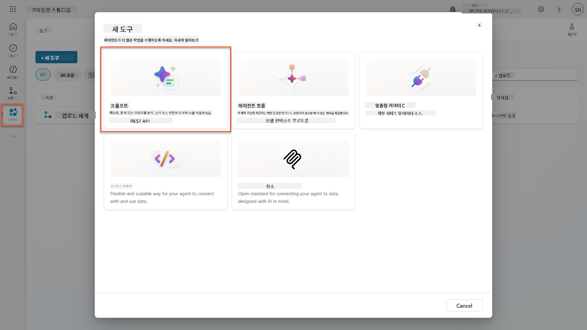

1. 기본 타임스탬프 이름(예: *Custom prompt 09/04/2025, 04:59:11 PM*)을 `Summarize Resume`로 **이름 변경**합니다.

1. 지침 필드에 다음 프롬프트를 추가합니다:

    ```text
    You are tasked with extracting key candidate information from a resume and cover letter to facilitate matching with open job roles and creating a summary for application review.
    
    Instructions:
    1. Extract Candidate Details:
        - Identify and extract the candidate’s full name.
        - Extract contact information, specifically the email address.
    2. Create Candidate Summary:
        - Summarize the candidate’s profile as multiline text (max 2000 characters) with the following sections:
            - Candidate name
            - Role(s) applied for if present
            - Contact and location
            - One-paragraph summary
            - Experience snapshot (last 2–3 roles with outcomes)
            - Key projects (1–3 with metrics)
            - Education and certifications
            - Top skills (Top 10)
            - Availability and work authorization
    
    Guidelines:
    - Extract information only from the provided resume and cover letter documents.
    - Ensure accuracy in identifying all details such as contact details and skills.
    - The summary should be concise but informative, suitable for quick application review.
    
    Resume: /document
    CoverLetter: /text
    ```

    !!! tip "Copilot 도움말 사용"
        "Get started with Copilot"을 사용하여 자연어로 프롬프트를 생성할 수 있습니다. Copilot에게 이력서를 요약하는 프롬프트를 생성하도록 요청해보세요!

1. **입력 매개변수 구성**:

    | 매개변수 | 유형 | 이름 | 샘플 데이터 |
    |-----------|------|------|-------------|
    | Resume | 이미지 또는 문서 | Resume | 테스트 데이터 폴더에서 샘플 이력서를 업로드 |
    | CoverLetter | 텍스트 | CoverLetter | Here is a Resume! |

1. **테스트**를 선택하여 프롬프트의 초기 텍스트 출력을 확인합니다.  
    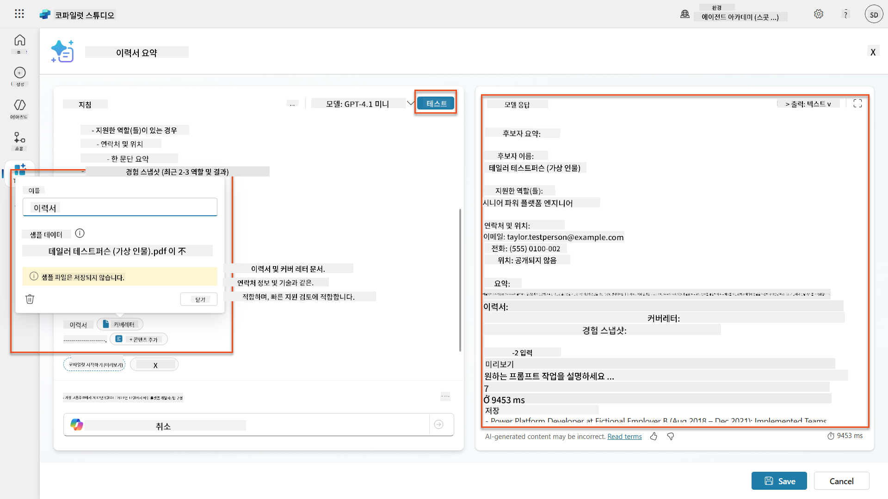

### 7.2 JSON 출력 구성

이제 프롬프트를 일반 텍스트 대신 구조화된 JSON 데이터를 출력하도록 변환합니다.

1. 프롬프트 지침 끝에 다음 JSON 형식 사양을 추가합니다:

    ```text
    Output Format:
    Provide the output in valid JSON format with the following structure:
    
    {
        "CandidateName": "string",
        "Email": "string",
        "Summary": "string max 2000 characters",
        "Skills": [ {"item": "Skill 1"}, {"item": "Skill 2"}],
        "Experience": [ {"item": "Experience 1"}, {"item": "Experience 2"}],
    }
    ```

1. **출력** 설정을 "텍스트"에서 **JSON**으로 변경합니다.

1. **테스트**를 다시 선택하여 출력이 JSON 형식으로 포맷되었는지 확인합니다.  
    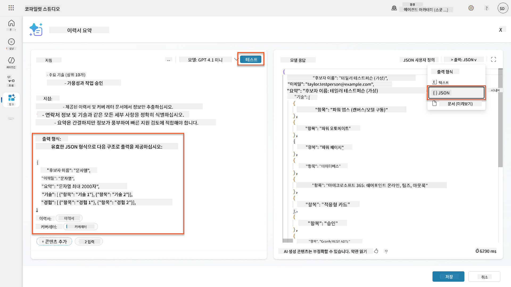

1. **선택 사항:** 다양한 AI 모델을 실험하여 출력이 어떻게 달라지는지 확인한 후 기본 모델로 돌아갑니다.

1. **저장**을 선택하여 프롬프트를 생성합니다.

1. **에이전트에서 사용하도록 구성** 대화 상자에서 **취소**를 선택합니다.

    !!! info "왜 도구로 추가하지 않는가"
        이 프롬프트를 도구로 직접 사용하는 대신 Agent Flow에서 사용할 것입니다. 이를 통해 데이터 처리 워크플로우를 더 잘 제어할 수 있습니다.

### 7.3 프롬프트를 Agent Flow에 추가

Dataverse에 저장된 이력서를 처리하는 Agent Flow를 생성합니다.

!!! tip "Agent Flow 표현식"
    노드 이름 지정 및 표현식 입력 지침을 정확히 따르는 것이 매우 중요합니다. 표현식은 이전 노드를 이름으로 참조하기 때문입니다! [Agent Flow 미션 in Recruit](../../recruit/09-add-an-agent-flow/README.md#you-mentioned-expressions-what-are-expressions)를 참조하여 표현식에 대한 빠른 복습을 진행하세요!

1. Copilot Studio에서 **채용 에이전트**로 이동합니다.

1. **에이전트** 탭을 선택하고 하위 **Application Intake Agent**를 선택합니다.

1. **도구** 패널에서 **+ 추가** → **+ 새 도구** → **Agent flow**를 선택합니다.

1. 첫 번째 노드에서 **+ 입력 추가**를 선택하여 다음 매개변수를 추가합니다:

    | 유형 | 이름 | 설명 |
    |------|------|-------------|
    | 텍스트 | ResumeNumber | 반드시 [ResumeNumber]를 사용하세요. 항상 R로 시작해야 합니다 |

1. 첫 번째 노드 아래의 **+** 삽입 작업 아이콘을 선택하고 **Dataverse**를 검색한 후 **더 보기**를 선택하여 **행 목록** 작업을 찾습니다.

1. **행 목록** 노드에서 **점(...)**을 선택하고 **이름 변경**을 `Get Resume Record`로 설정한 후 다음 매개변수를 설정합니다:

    | 속성 | 설정 방법 | 값 |
    |----------|------------|-------|
    | **테이블 이름** | 선택 | Resumes |
    | **행 필터** | 동적 데이터 (번개 아이콘) | `ppa_resumenumber eq 'ResumeNumber'` **ResumeNumber**를 **When an agent calls the flow** → **ResumeNumber**로 대체 |
    | **행 수** | 입력 | 1 |

    !!! tip "쿼리 최적화!"
        이 기술을 프로덕션에서 사용할 때는 항상 선택되는 열을 Agent Flow에 필요한 것만 제한해야 합니다.

    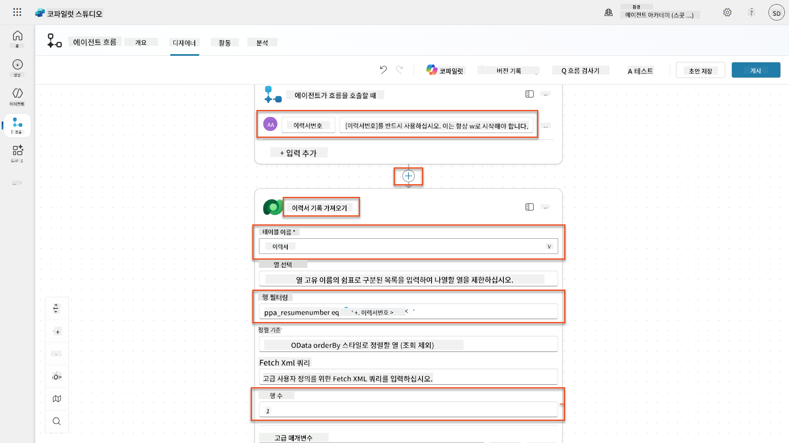

1. Get Resume Record 노드 아래의 **+** 삽입 작업 아이콘을 선택하고 **Dataverse**를 검색한 후 **더 보기**를 선택하여 **파일 또는 이미지 다운로드** 작업을 찾습니다.

    !!! tip "올바른 작업 선택!"
        "선택된 환경에서"로 끝나는 작업을 선택하지 않도록 주의하세요.

1. 이전과 마찬가지로 작업 이름을 `Download Resume`로 변경하고 다음 매개변수를 설정합니다:

    | 속성 | 설정 방법 | 값 |
    |----------|------------|-------|
    | **테이블 이름** | 선택 | Resumes |
    | **행 ID** | 표현식 (fx 아이콘) | `first(body('Get_Resume_Record')?['value'])?['ppa_resumeid']` |
    | **열 이름** | 선택 | Resume PDF |

    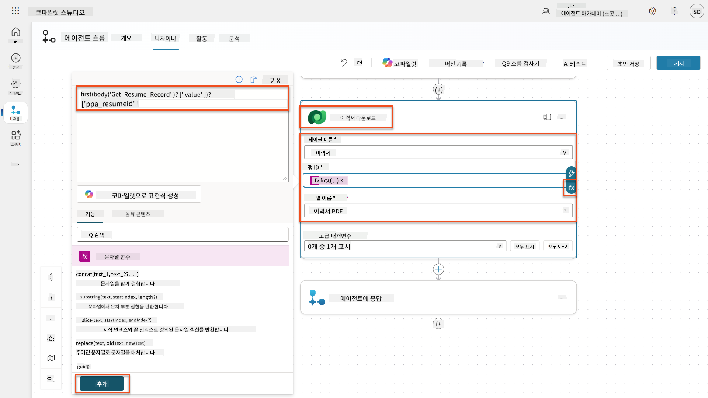

1. 이제 Download Resume 아래의 **+** 삽입 작업 아이콘을 선택하고 **AI 기능**에서 **프롬프트 실행**을 선택합니다.

1. 작업 이름을 `Summarize Resume`로 변경하고 다음 매개변수를 설정합니다:

    | 속성 | 설정 방법 | 값 |
| **프롬프트** | 선택 | 이력서 요약 |
| **CoverLetter** | 표현식 (fx 아이콘) | `first(body('Get_Resume_Record')?['value'])?['ppa_coverletter']` |
| **Resume** | 동적 데이터 (번개 아이콘) | 이력서 다운로드 → 파일 또는 이미지 콘텐츠 |

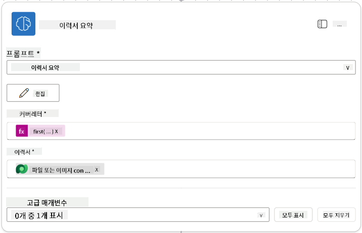

!!! tip "프롬프트 매개변수"
    작성한 프롬프트의 입력 매개변수와 동일한 매개변수를 채우고 있는지 확인하세요.

### 7.4 후보자 레코드 생성

이제 프롬프트에서 제공한 정보를 사용하여 새로운 후보자 레코드를 생성해야 합니다. 단, 이미 존재하지 않는 경우에만 생성합니다.

1. **+** 삽입 작업 아이콘을 선택하여 이력서 요약 노드 아래에 추가하고, **Dataverse**를 검색한 후 **더 보기**를 선택하고 **List rows** 작업을 찾습니다.

1. 노드 이름을 `Get Existing Candidate`로 변경하고 다음 매개변수를 설정합니다:

    | 속성 | 설정 방법 | 값 |
    |------|----------|-----|
    | **테이블 이름** | 선택 | Candidates |
    | **필터 행** | 동적 데이터 (번개 아이콘) | `ppa_email eq 'Email'`  **대체** `Email`을 **Summarize Resume → Email**로 변경 |
    | **행 수** | 입력 | 1 |

    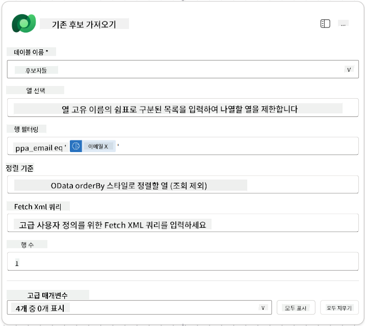

1. **+** 삽입 작업 아이콘을 선택하여 기존 후보자 가져오기 노드 아래에 추가하고, **Control**을 검색한 후 **더 보기**를 선택하고 **Condition** 작업을 찾습니다.

1. 조건 속성에서 다음 조건을 설정합니다:

    | 조건 | 연산자 | 값 |
    |------|--------|-----|
    | 표현식 (fx 아이콘): `length(outputs('Get_Existing_Candidate')?['body/value'])` | 같음 | 0 |

    

1. **True** 분기에서 **+** 삽입 작업 아이콘을 선택하고 **Dataverse**를 검색한 후 **더 보기**를 선택하고 **Add a new row** 작업을 찾습니다.

1. 노드 이름을 `Add a New Candidate`로 변경하고 다음 매개변수를 설정합니다:

    | 속성 | 설정 방법 | 값 |
    |------|----------|-----|
    | **테이블 이름** | 선택 | Candidates |
    | **후보자 이름** | 동적 데이터 (번개 아이콘) | Summarize Resume → `CandidateName` |
    | **이메일** | 동적 데이터 (번개 아이콘) | Summarize Resume → `Email` |

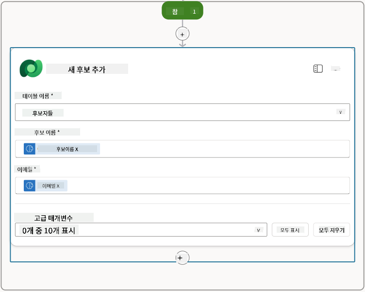

### 7.5 이력서 업데이트 및 흐름 출력 구성

흐름을 완료하려면 이력서 레코드를 업데이트하고 에이전트에게 반환할 데이터를 구성해야 합니다.

1. 조건 아래에서 **+** 삽입 작업 아이콘을 선택하고 **Dataverse**를 검색한 후 **더 보기**를 선택하고 **Update a row** 작업을 찾습니다.

1. 제목을 선택하여 노드 이름을 `Update Resume`으로 변경하고 **모두 보기**를 선택한 후 다음 매개변수를 설정합니다:

    | 속성 | 설정 방법 | 값 |
    |------|----------|-----|
    | **테이블 이름** | 선택 | Resumes |
    | **행 ID** | 표현식 (fx 아이콘) | `first(body('Get_Resume_Record')?['value'])?['ppa_resumeid']` |
    | **요약** | 동적 데이터 (번개 아이콘) | Summarize Resume → Text |
    | **후보자 (Candidates)** | 표현식 (fx 아이콘) | `if(equals(length(outputs('Get_Existing_Candidate')?['body/value']), 1), first(outputs('Get_Existing_Candidate')?['body/value'])?['ppa_candidateid'], outputs('Add_a_New_Candidate')?['body/ppa_candidateid'])` |

    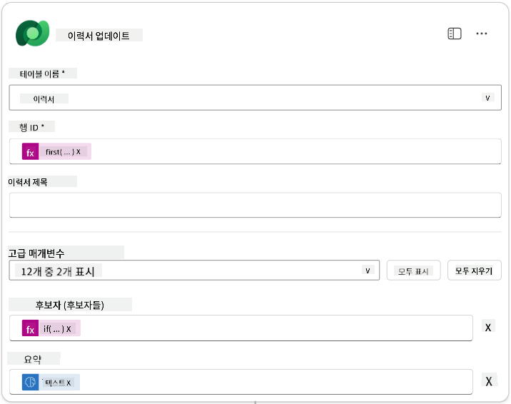

1. **Respond to the agent** 노드를 선택한 후 **+ Add an output**을 사용하여 구성합니다:

    | 유형 | 이름              | 설정 방법                      | 값                                                        | 설명                                            |
    | ---- | ----------------- | ------------------------------- | ------------------------------------------------------------ | ------------------------------------------------------ |
    | 텍스트 | `CandidateName`   | 동적 데이터 (번개 아이콘) | Summarize Resume → 더 보기 → CandidateName                  | 이력서에 제공된 [CandidateName]                |
    | 텍스트 | `CandidateEmail`  | 동적 데이터 (번개 아이콘) | Summarize Resume → 더 보기 → Email                          | 이력서에 제공된 [CandidateEmail]               |
    | 텍스트 | `CandidateNumber` | 표현식 (fx 아이콘)            | `concat('ppa_candidates/', if(equals(length(outputs('Get_Existing_Candidate')?['body/value']), 1), first(outputs('Get_Existing_Candidate')?['body/value'])?['ppa_candidateid'], outputs('Add_a_New_Candidate')?['body/ppa_candidateid']) )` | 새 후보자 또는 기존 후보자의 [CandidateNumber] |
    | 텍스트 | `ResumeSummary`   | 동적 데이터 (번개 아이콘) | Summarize Resume → 더 보기 → body/responsev2/predictionOutput/structuredOutput | JSON 형식의 이력서 요약 및 세부 정보            |

    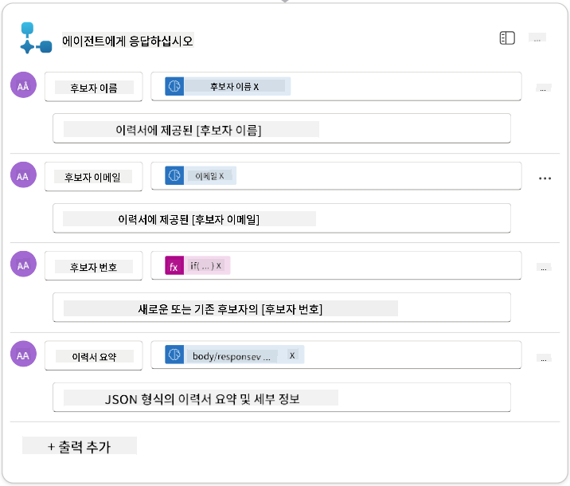

1. 오른쪽 상단에서 **Save draft**를 선택합니다. 에이전트 흐름은 다음과 같아야 합니다.  
    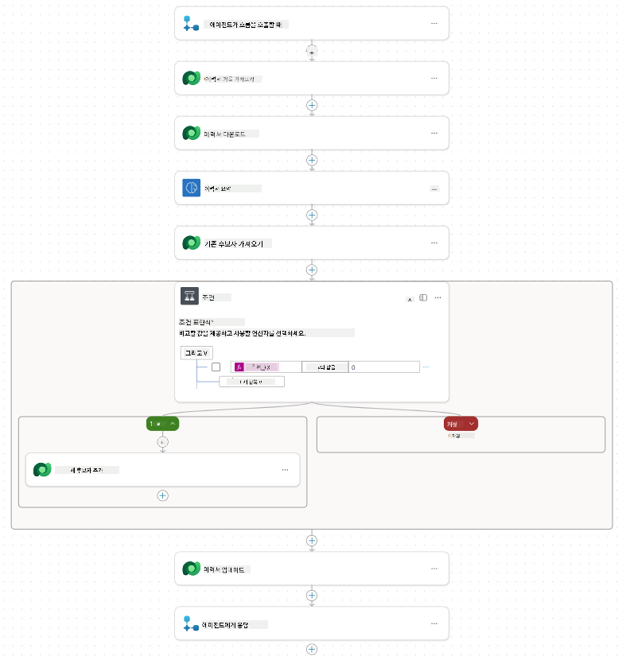

1. **Overview** 탭을 선택하고 **Details** 패널에서 **Edit**을 선택합니다.

    1. **흐름 이름**:`Summarize Resume`
    1. **설명**:

        ```text
        Summarize an existing Resume stored in Dataverse using a [ResumeNumber] as input, return the [CandidateNumber], and resume summary JSON
        ```

1. **Save**를 선택합니다.

1. 다시 **Designer** 탭을 선택하고 **Publish**를 선택합니다.

### 7.6 흐름을 에이전트에 연결

이제 흐름을 도구로 추가하고 에이전트가 이를 사용할 수 있도록 구성합니다.

1. Copilot Studio에서 **Hiring Agent**를 엽니다.

1. **Agents** 탭을 선택하고 **Application Intake Agent**를 엽니다.

1. **Tools** 패널을 선택하고 **+ Add a tool** - > **Flow** -> **Summarize Resume** **(Agent Flow)**를 선택합니다.

1. **Add and configure**를 선택합니다.

1. 도구 설정을 다음과 같이 구성합니다:

    | 설정 | 값 |
    |------|-----|
    | **설명** | Dataverse에 저장된 기존 이력서를 [ResumeNumber]를 입력으로 요약하고 [CandidateNumber]와 이력서 요약 JSON을 반환합니다. |
    | **이 도구가 사용될 수 있는 경우** | 주제 또는 에이전트에 의해 참조될 때만 |

1. **Save**를 선택합니다.  
    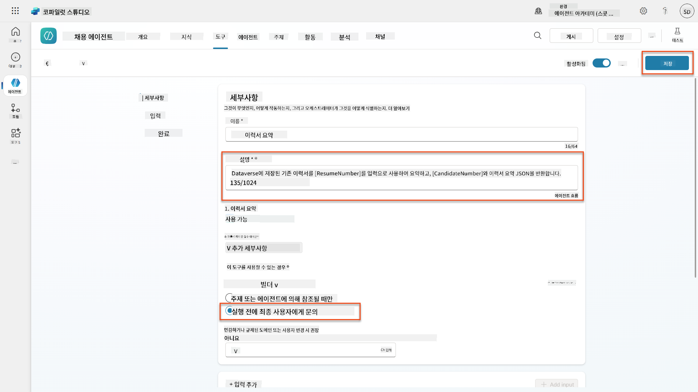

1. Hiring Agent 내에서 Tools를 선택하면 **Application Intake Agent**에서 사용할 수 있는 두 도구를 확인할 수 있습니다.  
    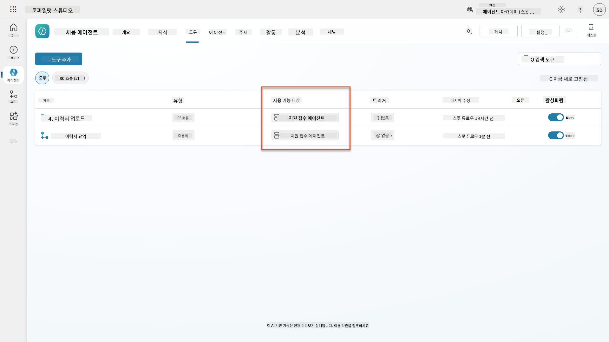

1. **Application Intake Child** 에이전트 지침으로 이동하여 **Post-Upload** 단계를 다음으로 수정합니다:

    ```text
    2. Post-Upload Processing  
        - After uploading, be sure to also output the [ResumeNumber] in all messages
        - Pass [ResumeNumber] to /Summarize Resume  - Be sure to use the correct value that will start with the letter R.
        - Be sure to also output the [CandidateNumber] in all messages
        - Use the [ResumeSummary] to output a summary of the processed Resume and candidate
    ```

    `/Summarize Resume`를 `/Summarize`를 입력하거나 선택하여 **Summarize Resume agent flow** 참조를 삽입합니다.  
    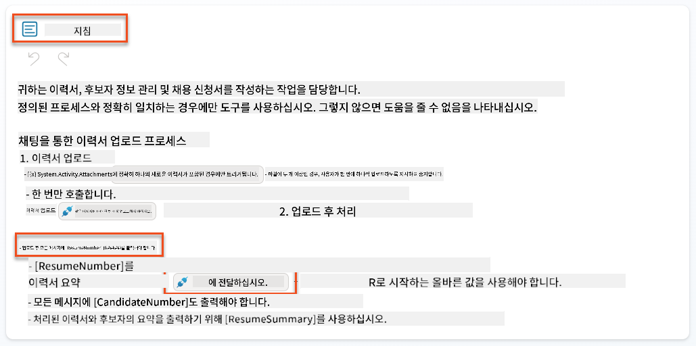

1. **Save**를 선택합니다.

### 7.7 에이전트 테스트

완전한 멀티모달 시스템을 테스트하여 모든 것이 올바르게 작동하는지 확인합니다.

1. **테스트 시작**:

    - **Test**를 선택하여 테스트 패널을 엽니다.
    - 입력: `Here is a candidate Resume`

    - [Test Resumes](https://download-directory.github.io/?url=https://github.com/microsoft/agent-academy/tree/main/operative/sample-data/resumes&filename=operative_sampledata)에서 샘플 이력서 중 하나를 업로드합니다.

1. **결과 확인**:
    - 메시지와 이력서를 보낸 후 이력서 번호(형식: R#####)를 받았는지 확인합니다.
    - 후보자 번호와 요약을 받았는지 확인합니다.
    - 활동 맵을 사용하여 이력서 업로드 도구와 이력서 요약 도구가 작동하는지 확인하고 요약 프롬프트의 출력이 에이전트에 수신되는지 확인합니다.  
        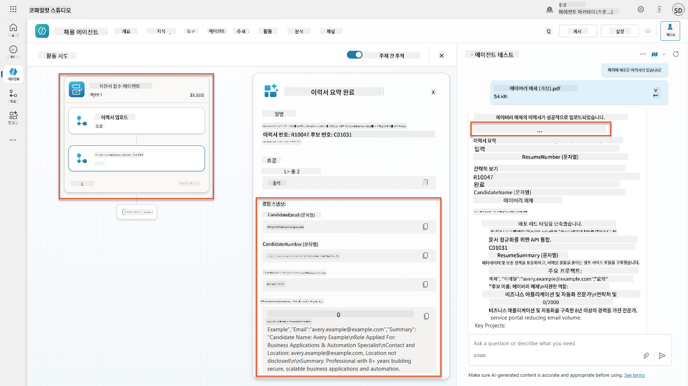

1. **데이터 지속성 확인**:
    - [Power Apps](https://make.powerapps.com)로 이동합니다.
    - **Apps** → **Hiring Hub** → **Play**를 엽니다.
    - **Resumes**로 이동하여 이력서가 업로드되고 처리되었는지 확인합니다. 요약 정보와 관련된 후보자 레코드가 있어야 합니다.
    - **Candidates**를 확인하여 추출된 후보자 정보를 확인합니다.  
        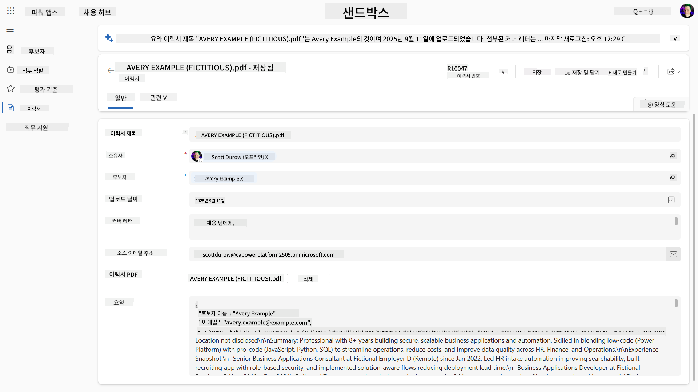
    - 프로세스를 다시 실행하면 이력서에서 추출된 이메일과 일치하는 기존 후보자를 사용해야 하며 새로 생성하지 않아야 합니다.

!!! tip "문제 해결"
    - **이력서가 처리되지 않음**: 파일이 PDF 형식이고 크기 제한을 초과하지 않았는지 확인하세요.
    - **후보자가 생성되지 않음**: 이력서에서 이메일이 올바르게 추출되었는지 확인하세요.
    - **JSON 형식 오류**: 프롬프트 지침에 정확한 JSON 구조가 포함되어 있는지 확인하세요.
    - **흐름 오류**: 모든 Dataverse 연결과 표현식이 올바르게 구성되었는지 확인하세요.

### 프로덕션 준비

이 미션의 일부는 아니지만, 에이전트 흐름을 프로덕션 준비 상태로 만들기 위해 다음을 고려할 수 있습니다:

1. **오류 처리** - 이력서 번호를 찾을 수 없거나 프롬프트가 문서를 분석하지 못한 경우, 에이전트에게 명확한 오류를 반환하도록 오류 처리를 추가해야 합니다.
1. **기존 후보자 업데이트** - 이메일을 사용하여 후보자를 찾은 후, 이력서에 있는 이름으로 업데이트할 수 있습니다.
1. **이력서 요약과 후보자 생성 분리** - 이 기능을 더 작은 에이전트 흐름으로 분리하여 유지보수를 쉽게 만들고, 에이전트에게 순차적으로 사용하도록 지침을 제공할 수 있습니다.

## 🎉 미션 완료

훌륭한 작업입니다, Operative! **Document Resume Recon**이 완료되었습니다. 이제 멀티모달 프롬프트를 완벽히 익혔으며, 어떤 문서에서도 정밀하게 구조화된 데이터를 추출할 수 있습니다.

다음은 이번 미션에서 달성한 내용입니다:

**✅ 멀티모달 프롬프트 숙달**  
멀티모달 프롬프트가 무엇인지 이해하고 최적의 결과를 위해 다양한 AI 모델을 사용하는 방법을 배웠습니다.

**✅ 문서 처리 전문성**  
이미지 및 문서 입력으로 프롬프트를 구성하고 JSON 형식으로 출력하여 구조화된 데이터를 추출하는 방법을 배웠습니다.

**✅ 이력서 추출 시스템**  
후보자 문서를 처리하고 채용 워크플로우와 통합하는 완전한 이력서 추출 시스템을 구축했습니다.

**✅ 모범 사례 구현**  
문서 분석을 위한 프롬프트 엔지니어링 모범 사례를 적용하고 멀티모달 프롬프트를 에이전트 흐름과 통합했습니다.

**✅ 고급 처리 준비**  
향상된 문서 분석 기능이 이제 다음 미션에서 추가할 고급 데이터 기반 기능을 사용할 준비가 되었습니다.

🚀 **다음 단계:** 미션 08에서는 Dataverse의 실시간 데이터를 사용하여 프롬프트를 강화하고 변화하는 비즈니스 요구에 적응하는 동적 AI 솔루션을 만드는 방법을 배웁니다.

⏩ [미션 08로 이동: Dataverse 기반 프롬프트 강화](../08-dataverse-grounding/README.md)

## 📚 전술적 자료

📖 [프롬프트 생성하기](https://learn.microsoft.com/ai-builder/create-a-custom-prompt?WT.mc_id=power-power-182762-scottdurow)

📖 [프롬프트에 텍스트, 이미지 또는 문서 입력 추가하기](https://learn.microsoft.com/ai-builder/add-inputs-prompt?WT.mc_id=power-182762-scottdurow)

📖 [JSON 출력으로 응답 처리하기](https://learn.microsoft.com/ai-builder/process-responses-json-output?WT.mc_id=power-182762-scottdurow)

📖 [모델 선택 및 온도 설정](https://learn.microsoft.com/ai-builder/prompt-modelsettings?WT.mc_id=power-182762-scottdurow)

📖 [Power Automate에서 프롬프트 사용하기](https://learn.microsoft.com/ai-builder/use-a-custom-prompt-in-flow?WT.mc_id=power-182762-scottdurow)

📺 [AI Builder: 프롬프트 빌더에서 JSON 출력](https://www.youtube.com/watch?v=F0fGnWrRY_I)

---

**면책 조항**:  
이 문서는 AI 번역 서비스 [Co-op Translator](https://github.com/Azure/co-op-translator)를 사용하여 번역되었습니다. 정확성을 위해 최선을 다하고 있지만, 자동 번역에는 오류나 부정확성이 포함될 수 있습니다. 원본 문서를 해당 언어로 작성된 상태에서 권위 있는 자료로 간주해야 합니다. 중요한 정보의 경우, 전문적인 인간 번역을 권장합니다. 이 번역 사용으로 인해 발생하는 오해나 잘못된 해석에 대해 책임을 지지 않습니다.