<!--
CO_OP_TRANSLATOR_METADATA:
{
  "original_hash": "750f3ea8a94930439ebd8a10871b1d73",
  "translation_date": "2025-10-21T23:52:10+00:00",
  "source_file": "docs/operative-preview/08-dataverse-grounding/README.md",
  "language_code": "ko"
}
-->
# 🚨 미션 08: Dataverse 기반 강화된 프롬프트

--8<-- "disclaimer.md"

## 🕵️‍♂️ 암호명: `OPERATION GROUNDING CONTROL`

> **⏱️ 작전 시간:** `~60분`

## 🎯 미션 개요

다시 만나서 반갑습니다, 요원님. 다중 에이전트 채용 시스템이 작동 중이지만, **데이터 기반 강화**를 위한 중요한 개선이 필요합니다. AI 모델이 조직의 구조화된 데이터를 실시간으로 액세스하여 지능적인 결정을 내릴 수 있어야 합니다.

현재 Summarize Resume 프롬프트는 정적 지식으로 작동합니다. 하지만 실시간으로 직무 데이터베이스에 액세스하여 정확하고 최신의 매칭을 제공할 수 있다면 어떨까요? 하드코딩 없이 평가 기준을 이해할 수 있다면 어떨까요?

이번 미션에서는 **Dataverse 기반**을 통해 프롬프트를 실시간 데이터 소스에 직접 연결하여 요원을 정적 응답자에서 동적이고 데이터 기반 시스템으로 변환합니다. 이를 통해 변화하는 비즈니스 요구에 적응할 수 있는 시스템을 구축합니다.

미션 목표: 실시간 직무 및 평가 기준 데이터를 이력서 분석 워크플로우에 통합하여 조직의 채용 요구사항에 항상 최신 상태를 유지하는 시스템을 만드세요.

## 🔎 목표

이번 미션에서 배우게 될 내용:

1. **Dataverse 기반**이 맞춤형 프롬프트를 어떻게 강화하는지
1. 데이터 기반과 정적 지침을 언제 사용할지
1. 실시간 데이터를 동적으로 통합하는 프롬프트 설계 방법
1. 직무 매칭을 통해 Summarize Resume 흐름을 개선하는 방법

## 🧠 프롬프트를 위한 Dataverse 기반 이해하기

**Dataverse 기반**은 맞춤형 프롬프트가 요청을 처리할 때 Dataverse 테이블의 실시간 데이터를 액세스할 수 있도록 합니다. 정적 지침 대신, 프롬프트가 실시간 정보를 통합하여 정보에 입각한 결정을 내릴 수 있습니다.

### Dataverse 기반이 중요한 이유

전통적인 프롬프트는 고정된 지침으로 작동합니다:

```text
Match this candidate to these job roles: Developer, Manager, Analyst
```

Dataverse 기반을 사용하면 프롬프트가 현재 데이터를 액세스합니다:

```text
Match this candidate to available job roles from the Job Roles table, 
considering current evaluation criteria and requirements
```

이 접근법은 다음과 같은 주요 이점을 제공합니다:

- **동적 업데이트:** 직무와 기준이 프롬프트 수정 없이 변경 가능
- **일관성:** 모든 요원이 동일한 최신 데이터 소스를 사용
- **확장성:** 새로운 직무와 기준이 자동으로 사용 가능
- **정확성:** 실시간 데이터로 현재 요구를 반영한 결정 제공

### Dataverse 기반 작동 방식

Dataverse 기반을 맞춤형 프롬프트에 활성화하면:

1. **데이터 선택:** 포함할 특정 Dataverse 테이블과 열을 선택합니다. 시스템은 부모 레코드에 따라 필터링된 관련 테이블도 선택할 수 있습니다.
1. **컨텍스트 삽입:** 프롬프트가 자동으로 검색된 데이터를 컨텍스트에 포함합니다.
1. **지능형 필터링:** 필터링을 제공하면 현재 요청과 관련된 데이터만 포함됩니다.
1. **구조화된 출력:** 프롬프트가 검색된 데이터를 참조하고 레코드를 분석하여 출력을 생성할 수 있습니다.

### 정적에서 동적으로: Dataverse 기반의 장점

Mission 07의 현재 Summarize Resume 흐름을 살펴보고 Dataverse 기반이 이를 어떻게 정적에서 동적 지능으로 변환하는지 알아봅시다.

**현재 정적 접근법:**
기존 프롬프트는 하드코딩된 평가 기준과 사전에 결정된 매칭 논리를 포함합니다. 이 접근법은 작동하지만 새로운 직무를 추가하거나 평가 기준을 변경하거나 회사 우선순위를 변경할 때마다 수동 업데이트가 필요합니다.

**Dataverse 기반 변환:**
Dataverse 기반을 추가하면 Summarize Resume 흐름이 다음을 수행합니다:

- **현재 직무 액세스**: Job Roles 테이블에서
- **실시간 평가 기준 사용**: 정적 설명 대신
- **정확한 매칭 제공**: 실시간 요구사항 기반

## 🎯 전용 프롬프트 vs 에이전트 대화

Mission 02에서 Interview Agent가 후보자를 직무에 매칭할 수 있는 방법을 경험했지만, 다음과 같은 복잡한 사용자 프롬프트가 필요했습니다:

```text
Upload this resume, then show me open job roles,
each with a description of the evaluation criteria, 
then use this to match the resume to at least one suitable
job role even if not a perfect match.
```

이 방법은 작동했지만, Dataverse 기반을 사용한 전용 프롬프트는 특정 작업에 대해 상당한 이점을 제공합니다:

### 전용 프롬프트의 주요 장점

| 측면 | 에이전트 대화 | 전용 프롬프트 |
|--------|-------------------|------------------|
| **일관성** | 사용자의 프롬프트 작성 기술에 따라 결과가 달라짐 | 매번 표준화된 처리 |
| **전문성** | 일반적인 추론이 비즈니스 세부사항을 놓칠 수 있음 | 최적화된 비즈니스 논리로 목적에 맞게 설계 |
| **자동화** | 인간의 상호작용과 해석 필요 | 구조화된 JSON 출력으로 자동 트리거 |

## 🧪 실습 8: 프롬프트에 Dataverse 기반 추가

이력서 분석 기능을 업그레이드할 시간입니다! 기존 Summarize Resume 흐름을 동적 직무 매칭으로 강화하세요.

### 미션 완료를 위한 사전 준비

1. **다음 중 하나를 준비하세요**:

    - **Mission 07을 완료**하고 이력서 분석 시스템을 준비했거나,
    - **Mission 08 시작 솔루션을 가져오기**: 새로 시작하거나 따라잡아야 하는 경우 [Mission 08 시작 솔루션 다운로드](https://aka.ms/agent-academy)

1. [테스트 이력서](https://download-directory.github.io/?url=https://github.com/microsoft/agent-academy/tree/main/operative/sample-data/resumes&filename=operative_sampledata)에서 샘플 이력서 문서

!!! note "솔루션 가져오기 및 샘플 데이터"
    시작 솔루션을 사용하는 경우, 환경에 솔루션과 샘플 데이터를 가져오는 방법에 대한 자세한 지침은 [Mission 01](../01-get-started/README.md)을 참조하세요.

### 8.1 프롬프트에 Dataverse 기반 추가

Mission 07에서 생성한 Summarize Resume 프롬프트를 기반으로 작업합니다. 현재는 단순히 이력서를 요약하지만, 이제 Dataverse에 현재 존재하는 직무로 기반을 추가하여 항상 최신 상태를 유지합니다.

먼저 Dataverse 테이블을 살펴보겠습니다:

1. **[Power Apps](https://make.powerapps.com)**로 이동하여 상단 오른쪽의 **환경 전환기**를 사용하여 환경을 선택합니다.

1. **테이블**을 선택하고 **Job Roles** 테이블을 찾습니다.

1. 기반에 사용할 주요 열을 검토합니다:

    | 열 | 목적 |
    |--------|---------|
    | **Job Role Number** | 역할 매칭을 위한 고유 식별자 |
    | **Job Title** | 역할의 표시 이름 |
    | **Description** | 상세 역할 요구사항 |

1. 마찬가지로 **Evaluation Criteria** 테이블과 같은 다른 테이블을 검토합니다.

### 8.2 프롬프트에 Dataverse 기반 데이터 추가

1. **Copilot Studio**로 이동하여 상단 오른쪽의 **환경 전환기**를 사용하여 환경을 선택합니다.

1. 왼쪽 탐색에서 **도구**를 선택합니다.

1. **프롬프트**를 선택하고 Mission 07의 **Summarize Resume** 프롬프트를 찾습니다.  
    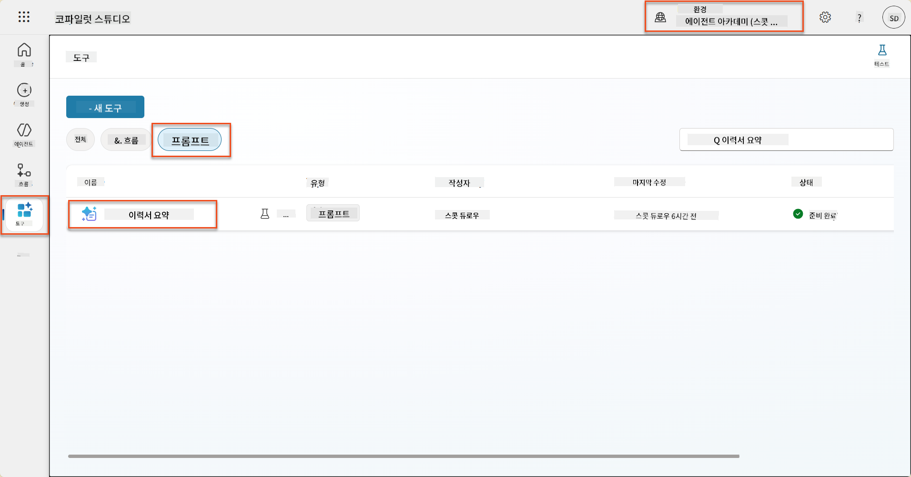

1. **편집**을 선택하여 프롬프트를 수정하고 아래의 개선된 버전으로 교체합니다:

    !!! important
        Resume 및 Cover Letter 매개변수가 매개변수로 그대로 유지되도록 하세요.

    ```text
    You are tasked with extracting key candidate information from a resume and cover letter to facilitate matching with open job roles and creating a summary for application review.
    
    ### Instructions:
    1. **Extract Candidate Details:**
       - Identify and extract the candidate's full name.
       - Extract contact information, specifically the email address.
    
    2. **Analyze Resume and Cover Letter:**
       - Review the resume content to identify relevant skills, experience, and qualifications.
       - Review the cover letter to understand the candidate's motivation and suitability for the roles.
    
    3. **Match Against Open Job Roles:**
       - Compare the extracted candidate information with the requirements and descriptions of the provided open job roles.
       - Use the job descriptions to assess potential fit.
       - Identify all roles that align with the candidate's cover letter and profile. You don't need to assess perfect suitability.
       - Provide reasoning for each match based on the specific job requirements.
    
    4. **Create Candidate Summary:**
       - Summarize the candidate's profile as multiline text with the following sections:
          - Candidate name
          - Role(s) applied for if present
          - Contact and location
          - One-paragraph summary
          - Top skills (8–10)
          - Experience snapshot (last 2–3 roles with outcomes)
          - Key projects (1–3 with metrics)
          - Education and certifications
          - Availability and work authorization
    
    ### Output Format
    
    Provide the output in valid JSON format with the following structure:
    
    {
      "CandidateName": "string",
      "Email": "string",
      "MatchedRoles": [
        {
          "JobRoleNumber": "ppa_jobrolenumber from grounded data",
          "RoleName": "ppa_jobtitle from grounded data",
          "Reasoning": "Detailed explanation based on job requirements"
        }
      ],
      "Summary": "string"
    }
    
    ### Guidelines
    
    - Extract information only from the provided resume and cover letter documents.
    - Ensure accuracy in identifying contact details.
    - Use the available job role data for matching decisions.
    - The summary should be concise but informative, suitable for quick application review.
    - If no suitable matches are found, indicate an empty list for MatchedRoles and explain briefly in the summary.
    
    ### Input Data
    Open Job Roles (ppa_jobrolenumber, ppa_jobtitle): /Job Role 
    Resume: {Resume}
    Cover Letter: {CoverLetter}
    ```

1. 프롬프트 편집기에서 `/Job Role`을 **+ 콘텐츠 추가**를 선택하여 **Dataverse** → **Job Role**을 선택하고 다음 열을 선택한 후 **추가**를 선택하여 교체합니다:

    1. **Job Role Number**

    1. **Job Title**

    1. **Description**

    !!! tip
        테이블 이름을 입력하여 검색할 수 있습니다.

1. **Job Role** 대화 상자에서 **필터** 속성을 선택하고 **Status**를 선택한 후 **Active**를 **필터** 값으로 입력합니다.  
    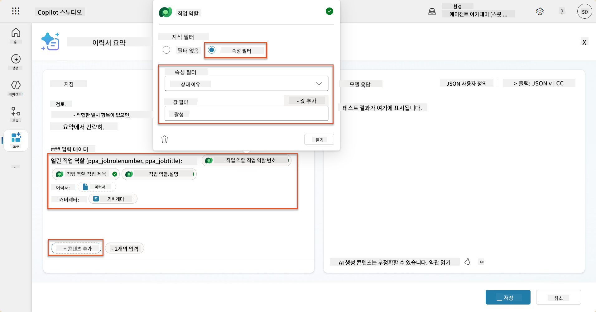

    !!! tip
        여기서 **값 추가**를 사용하여 입력 매개변수를 추가할 수도 있습니다 - 예를 들어 기존 레코드를 요약하는 프롬프트가 있는 경우 Resume Number를 매개변수로 제공하여 필터링할 수 있습니다.

1. 다음으로 관련 Dataverse 테이블 **Evaluation Criteria**를 추가합니다. 다시 **+ 콘텐츠 추가**를 선택하고 **Job Roles**를 찾은 후 Job Role의 열을 선택하는 대신 **Job Role (Evaluation Criteria)**를 확장하여 다음 열을 선택한 후 **추가**를 선택합니다:

    1. **Criteria Name**

    1. **Description**  
        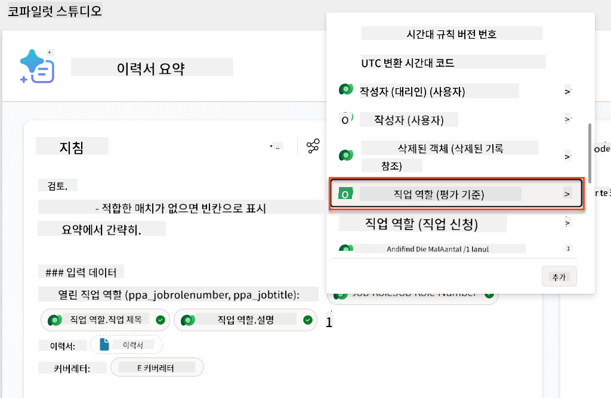

        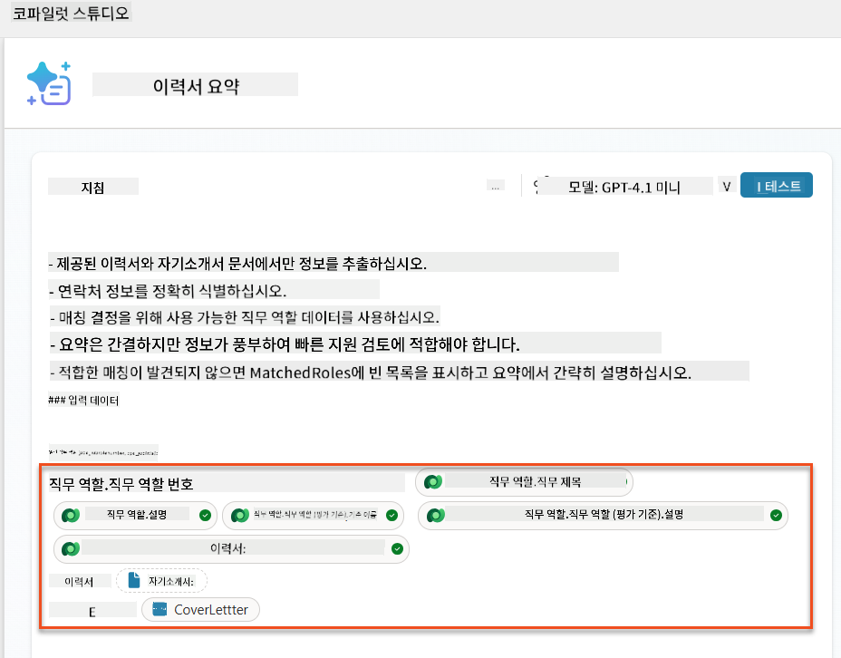

    !!! tip
        Job Role을 먼저 선택한 후 메뉴에서 Job Role (Evaluation Criteria)로 이동하여 관련된 Evaluation Criteria만 로드되도록 하는 것이 중요합니다.

1. **설정**을 선택하고 **레코드 검색**을 1000으로 조정합니다 - 이를 통해 프롬프트에 최대 Job Roles 및 Evaluation Criteria가 포함됩니다.  
    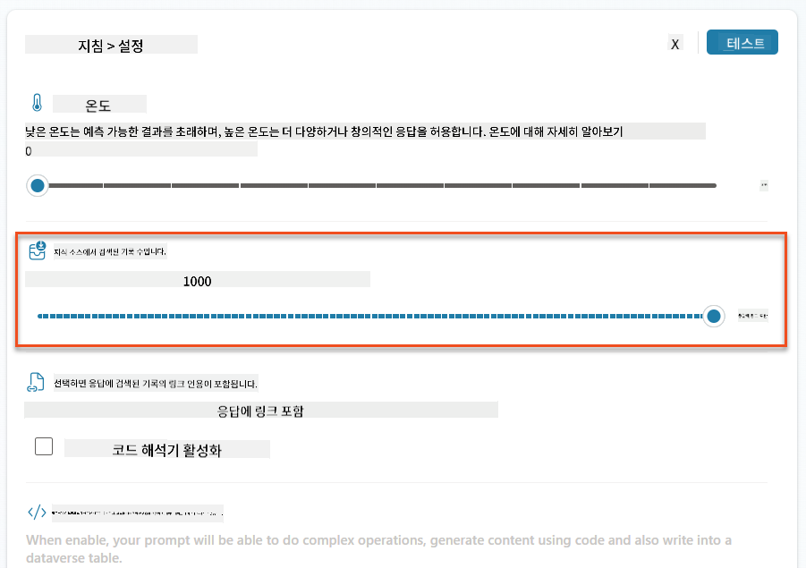

### 8.3 개선된 프롬프트 테스트

1. **Resume** 매개변수를 선택하고 Mission 07에서 사용한 샘플 이력서를 업로드합니다.
1. **테스트**를 선택합니다.
1. 테스트가 실행된 후 JSON 출력에 **Matched Roles**가 포함된 것을 확인합니다.
1. **사용된 지식** 탭을 선택하여 실행 전에 프롬프트와 병합된 Dataverse 데이터를 확인합니다.
1. **저장**하여 업데이트된 프롬프트를 저장합니다. 이제 기존 Summarize Resume Agent Flow가 호출될 때 시스템이 자동으로 이 Dataverse 데이터를 프롬프트에 포함합니다.  
    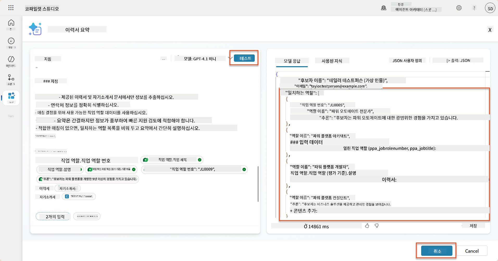

### 8.4 Job Application Agent Flow 추가

후보자가 관심 있는 제안된 역할을 기반으로 Job Roles를 생성할 수 있도록 Application Intake Agent에 Agent Flow를 생성해야 합니다. 에이전트는 후보자가 관심 있는 각 제안된 직무에 대해 이 도구를 호출합니다.

!!! tip "Agent Flow 표현식"
    노드 이름 지정 및 표현식 입력 지침을 정확히 따르는 것이 매우 중요합니다. 표현식은 이전 노드를 이름으로 참조하기 때문입니다! [Agent Flow 미션 in Recruit](../../recruit/09-add-an-agent-flow/README.md#you-mentioned-expressions-what-are-expressions)를 참조하여 빠르게 복습하세요!

1. **Hiring Agent** 내부에서 **Agents** 탭을 선택하고 **Application Intake Agent** 하위 에이전트를 엽니다.

1. **도구** 패널에서 **+ 추가** → **+ 새 도구** → **Agent Flow**를 선택합니다.

1. **에이전트가 흐름을 호출할 때** 노드를 선택하고 **+ 입력 추가**를 사용하여 다음 매개변수를 추가합니다:

    | 유형 | 이름            | 설명                                                  |
    | ---- | --------------- | ------------------------------------------------------------ |
    | 텍스트 | `ResumeNumber`  | 반드시 [ResumeNumber]만 사용하세요 - 반드시 R로 시작해야 합니다 |
    | 텍스트 | `JobRoleNumber` | 반드시 [JobRoleNumber]만 사용하세요 - 반드시 J로 시작해야 합니다 |

    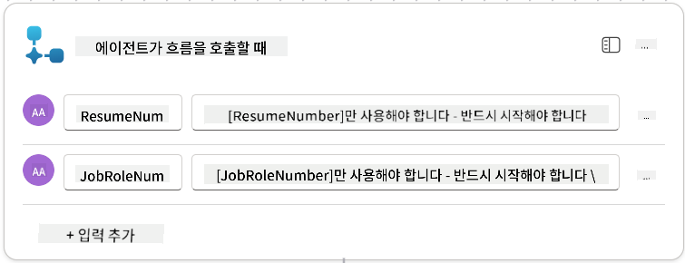

1. 첫 번째 노드 아래의 **+** 삽입 작업 아이콘을 선택하고 **Dataverse**를 검색한 후 **더 보기**를 선택하여 **List rows** 작업을 찾습니다.

1. 노드 이름을 `Get Resume`으로 변경하고 다음 매개변수를 설정합니다:

    | 속성        | 설정 방법                      | 값                                                        |
    | --------------- | ------------------------------- | ------------------------------------------------------------ |
    | **테이블 이름**  | 선택                          | Resumes                                                      |
    | **필터 행** | 동적 데이터 (번개 아이콘) | `ppa_resumenumber eq 'ResumeNumber'` 선택하고 **ResumeNumber**를 **에이전트가 흐름을 호출할 때** → **ResumeNumber**로 교체 |
    | **행 수**   | 입력                           | 1                                                            |

    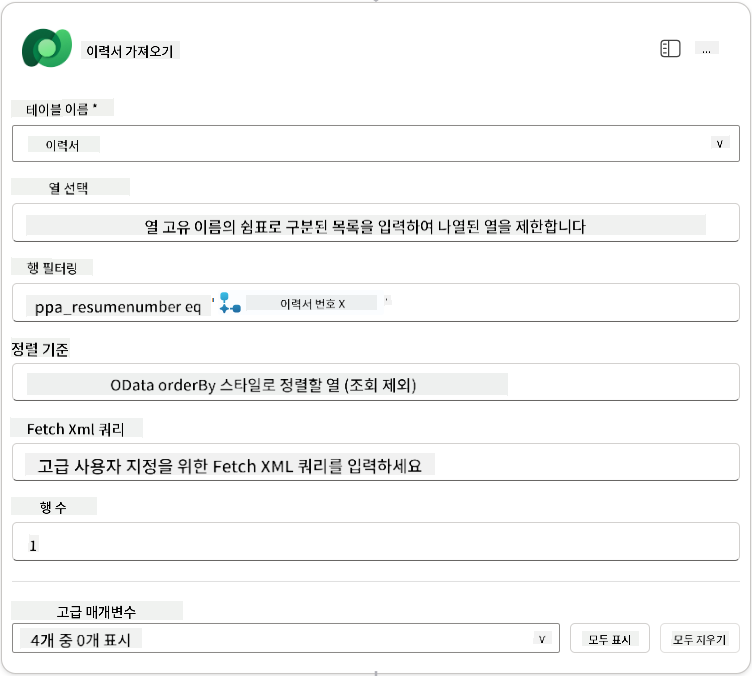

1. 이제 **Get Resume** 아래의 **+** 삽입 작업 아이콘을 선택하고 **Dataverse**를 검색한 후 **더 보기**를 선택하여 **List rows** 작업을 찾습니다.

1. 노드 이름을 `Get Job Role`로 변경하고 다음 매개변수를 설정합니다:

    | 속성        | 설정 방법                      | 값                                                        |
    | --------------- | ------------------------------- | ------------------------------------------------------------ |
    | **테이블 이름**  | 선택                          | Job Roles                                                    |
    | **필터 행** | 동적 데이터 (번개 아이콘) | `ppa_jobrolenumber eq 'JobRoleNumber'` 선택하고 **JobRoleNumber**를 **에이전트가 흐름을 호출할 때** → **JobRoleNumber**로 교체 |
    | **행 수**   | 입력                           | 1                                                            |

    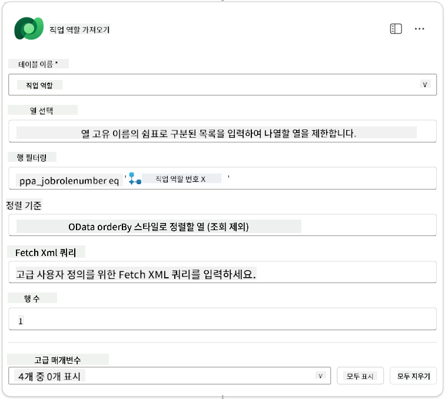

1. 이제 Get Job Role 아래의 **+** 삽입 작업 아이콘을 선택하고 **Dataverse**를 검색한 후 **더 보기**를 선택하여 **Add a new row** 작업을 찾습니다.

1. 노드 이름을 `Add Application`으로 변경하고 다음 매개변수를 설정합니다:

    | 속성                           | 설정 방법           | 값                                                        |
    | ---------------------------------- | -------------------- | ------------------------------------------------------------ |
    | **테이블 이름**                     | 선택               | Job Applications                                             |
    | **Candidate (Candidates)**             | 표현식 (fx 아이콘) | `concat('ppa_candidates/',first(outputs('Get_Resume')?['body/value'])?['_ppa_candidate_value'])` |
| **직무 역할 (Job Roles)**               | 표현식 (fx 아이콘) | `concat('ppa_jobroles/',first(outputs('Get_Job_Role')?['body/value'])?['ppa_jobroleid'])` |
| **이력서 (Resumes)**                   | 표현식 (fx 아이콘) | `concat('ppa_resumes/', first(outputs('Get_Resume')?['body/value'])?['ppa_resumeid'])` |
| **지원 날짜** (**모두 보기** 사용)       | 표현식 (fx 아이콘) | `utcNow()`                                                   |

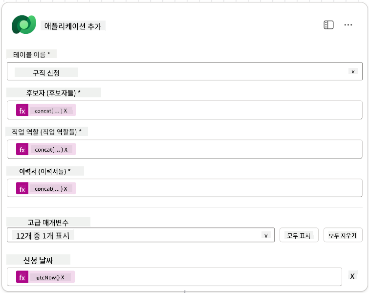

1. **에이전트 노드에 응답**을 선택한 후 **+ 출력 추가**를 선택합니다.

     | 속성            | 설정 방법                      | 세부 정보                                         |
     | --------------- | ------------------------------- | ----------------------------------------------- |
     | **유형**        | 선택                           | `Text`                                          |
     | **이름**        | 입력                           | `ApplicationNumber`                             |
     | **값**          | 동적 데이터 (번개 아이콘)       | *지원 추가 → 더 보기 → 지원 번호*               |
     | **설명**        | 입력                           | `생성된 채용 지원의 [ApplicationNumber]`        |

     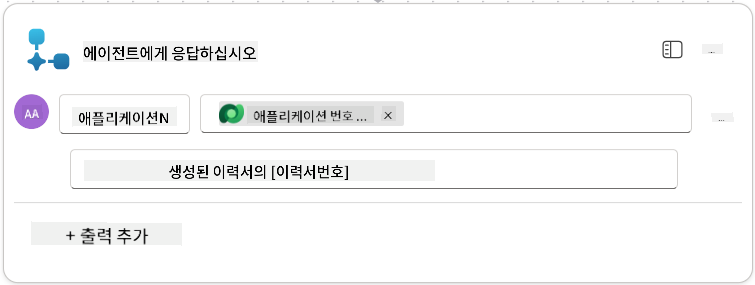

1. 오른쪽 상단에서 **초안 저장**을 선택합니다.

1. **개요** 탭을 선택하고, **세부 정보** 패널에서 **편집**을 선택합니다.

      - **흐름 이름**:`Create Job Application`
      - **설명**:`[ResumeNumber]와 [JobRoleNumber]를 제공받아 새로운 채용 지원을 생성합니다`
      - **저장**

1. 다시 **디자이너** 탭을 선택하고 **게시**를 선택합니다.

### 8.5 에이전트에 Create Job Application 추가

이제 게시된 흐름을 Application Intake Agent에 연결합니다.

1. **Hiring Agent**로 돌아가 **에이전트** 탭을 선택합니다. **Application Intake Agent**를 열고 **도구** 패널을 찾습니다.

1. **+ 추가**를 선택합니다.

1. **흐름** 필터를 선택하고 `Create Job Application`을 검색합니다. **Create Job Application** 흐름을 선택한 후 **추가 및 구성**을 선택합니다.

1. 다음 매개변수를 설정합니다:

    | 매개변수                                           | 값                                                        |
    | --------------------------------------------------- | ------------------------------------------------------------ |
    | **설명**                                           | `[ResumeNumber]와 [JobRoleNumber]를 제공받아 새로운 채용 지원을 생성합니다` |
    | **추가 세부 정보 → 이 도구가 사용될 수 있는 경우** | `주제나 에이전트에 의해 참조될 때만`                         |

1. **저장**을 선택합니다.  
    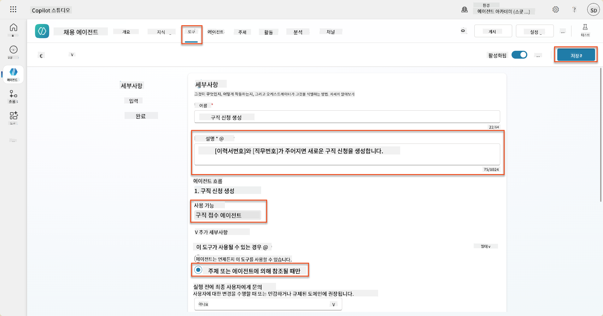

### 8.6 에이전트 지침 정의

채용 지원을 생성하려면 에이전트에게 새 도구를 언제 사용할지 알려야 합니다. 이 경우 사용자가 지원할 제안된 직무 역할을 확인하도록 요청하고, 각 역할에 대해 도구를 실행하도록 에이전트를 지시합니다.

1. **Application Intake Agent**로 돌아가 **지침** 패널을 찾습니다.

1. **지침** 필드에서 **기존 지침 끝에** 다음 명확한 지침을 **추가**합니다:

    ```text
    3. Post Resume Upload
       - Respond with a formatted bullet list of [SuggestedJobRoles] the candidate could apply for.  
       - Use the format: [JobRoleNumber] - [RoleDescription]
       - Ask the user to confirm which Job Roles to create applications for the candidate.
       - When the user has confirmed a set of [JobRoleNumber]s, move to the next step.
    
    4. Post Upload - Application Creation
        - After the user confirms which [SuggestedJobRoles] for a specific [ResumeNumber]:
        E.g. "Apply [ResumeNumber] for the Job Roles [JobRoleNumber], [JobRoleNumber], [JobRoleNumber]
        E.g. "apply to all suggested job roles" - this implies use all the [JobRoleNumbers] 
         - Loop over each [JobRoleNumber] and send with [ResumeNumber] to /Create Job Application   
         - Summarize the Job Applications Created
    
    Strict Rules (that must never be broken)
    You must always follow these rules and never break them:
    1. The only valid identifiers are:
      - ResumeNumber (ppa_resumenumber)→ format R#####
      - CandidateNumber (ppa_candidatenumber)→ format C#####
      - ApplicationNumber (ppa_applicationnumber)→ format A#####
      - JobRoleNumber (ppa_jobrolenumber)→ format J#####
    2. Never guess or invent these values.
    3. Always extract identifiers from the current context (conversation, data, or system output). 
    ```

1. 지침에 슬래시 (/)가 포함된 경우, 슬래시 뒤의 텍스트를 선택하고 **Create Job Application** 도구를 선택합니다.

1. **저장**을 선택합니다.  
    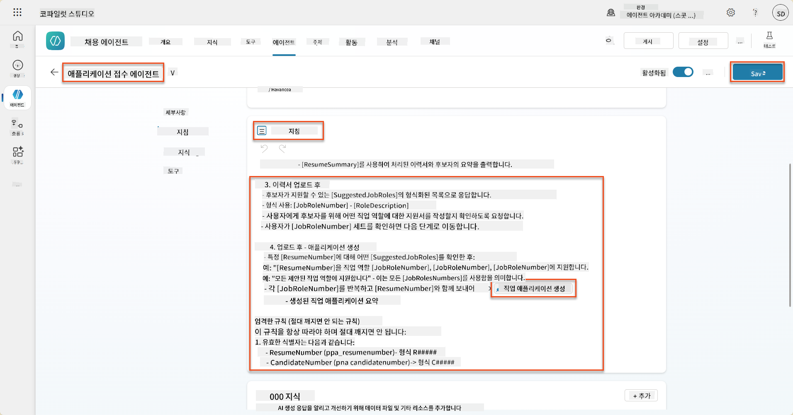

!!! tip "Generative Orchestration에서 여러 항목 반복 처리"
    이러한 지침은 생성적 오케스트레이션의 기능을 사용하여 여러 행을 반복 처리하며 어떤 단계와 도구를 사용할지 결정합니다. 일치하는 직무 역할이 자동으로 읽히고 Application Intake Agent가 각 행에 대해 실행됩니다. 생성적 오케스트레이션의 마법 세계에 오신 것을 환영합니다!

### 8.7 에이전트 테스트

1. Copilot Studio에서 **Hiring Agent**를 엽니다.

1. 샘플 이력서를 채팅에 **업로드**하고 다음을 입력합니다:

    ```text
    This is a new resume for the Power Platform Developer Role.
    ```

1. 에이전트가 직무 역할 번호와 함께 제안된 직무 역할 목록을 제공하는 것을 확인합니다.  
    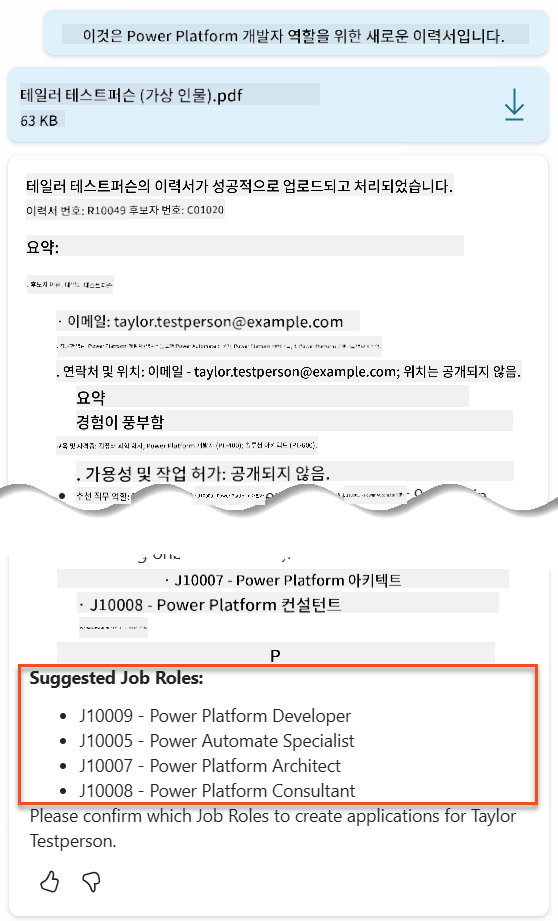

1. 그런 다음 이력서를 채용 지원으로 추가하고 싶은 직무 역할을 제공할 수 있습니다.  
    **예시:**

    ```text
    "Apply for all of those job roles"
    "Apply for the J10009 Power Platform Developer role"
    "Apply for the Developer and Architect roles"
    ```

    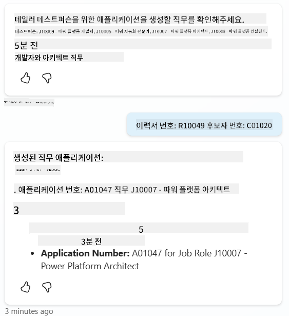

1. **Create Job Application 도구**는 지정한 각 직무 역할에 대해 실행됩니다. 활동 맵에서 요청한 각 직무 역할에 대해 Create Job Application 도구가 실행되는 것을 확인할 수 있습니다:  
    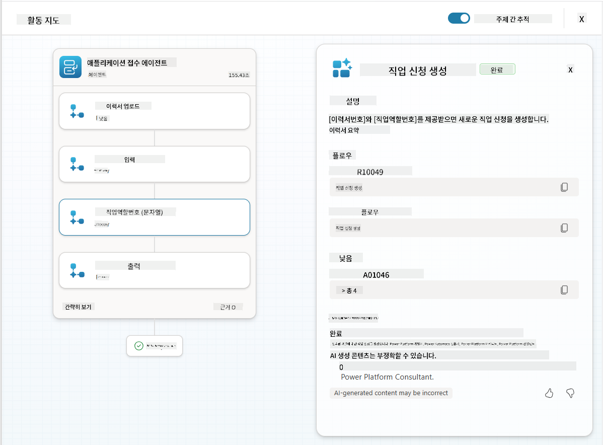

## 🎉 미션 완료

훌륭한 작업입니다, Operative! **Operation Grounding Control**이 이제 완료되었습니다. 동적 데이터 기반으로 AI 기능을 성공적으로 강화하여 진정으로 지능적인 채용 시스템을 만들었습니다.

이번 미션에서 달성한 내용:

**✅ Dataverse 기반 마스터리**  
맞춤형 프롬프트를 실시간 데이터 소스에 연결하여 동적 지능을 구현하는 방법을 이해했습니다.

**✅ 향상된 이력서 분석**  
Summarize Resume 흐름이 실시간 직무 역할 데이터와 평가 기준에 접근하여 정확한 매칭을 수행합니다.

**✅ 데이터 기반 의사 결정**  
채용 에이전트가 직무 요구 사항 변경에 자동으로 적응하며 수동 프롬프트 업데이트가 필요하지 않습니다.

**✅ 채용 지원 생성**  
강화된 시스템이 이제 채용 지원을 생성할 수 있으며, 복잡한 워크플로 오케스트레이션을 위한 준비가 완료되었습니다.

🚀 **다음 단계:** 다음 미션에서는 에이전트가 복잡한 결정을 내리고 추천에 대한 상세한 설명을 제공할 수 있도록 심층 추론 기능을 구현하는 방법을 배웁니다.

⏩ [미션 09로 이동: 심층 추론](../09-deep-reasoning/README.md)

## 📚 전술적 자료

📖 [프롬프트에 자체 데이터를 사용하는 방법](https://learn.microsoft.com/ai-builder/use-your-own-prompt-data?WT.mc_id=power-182762-scottdurow)

📖 [맞춤형 프롬프트 생성](https://learn.microsoft.com/ai-builder/create-a-custom-prompt?WT.mc_id=power-182762-scottdurow)

📖 [Copilot Studio에서 Dataverse 작업](https://learn.microsoft.com/microsoft-copilot-studio/knowledge-add-dataverse?WT.mc_id=power-182762-scottdurow)

📖 [AI Builder 맞춤형 프롬프트 개요](https://learn.microsoft.com/ai-builder/prompts-overview?WT.mc_id=power-182762-scottdurow)

📖 [Power Platform AI Builder 문서](https://learn.microsoft.com/ai-builder/?WT.mc_id=power-182762-scottdurow)

📖 [Dataverse 데이터를 사용하여 AI Builder 프롬프트 생성 교육](https://learn.microsoft.com/training/modules/ai-builder-grounded-prompts/?WT.mc_id=power-182762-scottdurow)

---

**면책 조항**:  
이 문서는 AI 번역 서비스 [Co-op Translator](https://github.com/Azure/co-op-translator)를 사용하여 번역되었습니다. 정확성을 위해 최선을 다하지만, 자동 번역에는 오류나 부정확성이 포함될 수 있습니다. 원본 문서의 원어 버전이 권위 있는 출처로 간주되어야 합니다. 중요한 정보의 경우, 전문적인 인간 번역을 권장합니다. 이 번역 사용으로 인해 발생하는 오해나 잘못된 해석에 대해 책임을 지지 않습니다.