<!--
CO_OP_TRANSLATOR_METADATA:
{
  "original_hash": "d9cd8cd1a4fbd8915171a2ed972cc322",
  "translation_date": "2025-10-22T01:01:26+00:00",
  "source_file": "docs/recruit/00-course-setup/README.md",
  "language_code": "ko"
}
-->
# 🚨 미션 00: 코스 설정

## 🕵️‍♂️ 코드명: `OPERATION DEPLOYMENT READY`

> **⏱️ 작전 시간:** `~30분`  

## 🎯 미션 개요

Copilot Studio 에이전트로서의 첫 번째 훈련 미션에 오신 것을 환영합니다.  
첫 번째 AI 에이전트를 구축하기 전에 **현장 준비 개발 환경**을 설정해야 합니다.

이 브리핑은 Microsoft 365 생태계에서 성공적으로 작동하기 위해 필요한 시스템, 액세스 자격 증명 및 설정 단계를 설명합니다.

## 🔎 목표

이번 미션의 목표는 다음과 같습니다:

1. Microsoft 365 계정 얻기  
1. Microsoft Copilot Studio에 대한 액세스 권한 얻기  
1. (선택 사항) Microsoft 365 Copilot 라이선스를 확보하여 프로덕션 게시 준비  
1. Copilot Studio 환경에서 작업할 개발 환경 생성  
1. 이후 미션에서 데이터 소스로 사용할 SharePoint 사이트 생성  

---

## 🔍 사전 준비 사항

시작하기 전에 다음을 확인하세요:

1. **직장 또는 학교 이메일 주소** (개인 @outlook.com, @gmail.com 등은 지원되지 않음).
1. 인터넷 액세스 및 최신 브라우저 (Edge, Chrome, 또는 Firefox 권장).  
1. Microsoft 365에 대한 기본적인 이해 (예: Office 앱 또는 Teams에 로그인).  
1. (선택 사항) 유료 라이선스를 구매하려는 경우 신용카드 또는 결제 방법.

---

## Step 1: Microsoft 365 계정 얻기

Copilot Studio는 Microsoft 365 내에 있으므로 액세스하려면 Microsoft 365 계정이 필요합니다. 기존 계정을 사용할 수도 있고, 적절한 라이선스를 얻기 위해 다음 단계를 따를 수도 있습니다:

1. **유료 Microsoft 365 비즈니스 구독 획득**  
   1. [Microsoft 365 비즈니스 플랜 및 가격 페이지](https://www.microsoft.com/microsoft-365/business/microsoft-365-plans-and-pricing)로 이동합니다.  
   1. 시작하기에 가장 저렴한 옵션은 Microsoft 365 Business Basic 플랜입니다. `무료 체험`을 선택하고 안내 양식을 따라 구독, 계정 세부 정보 및 결제 정보를 입력합니다.  
   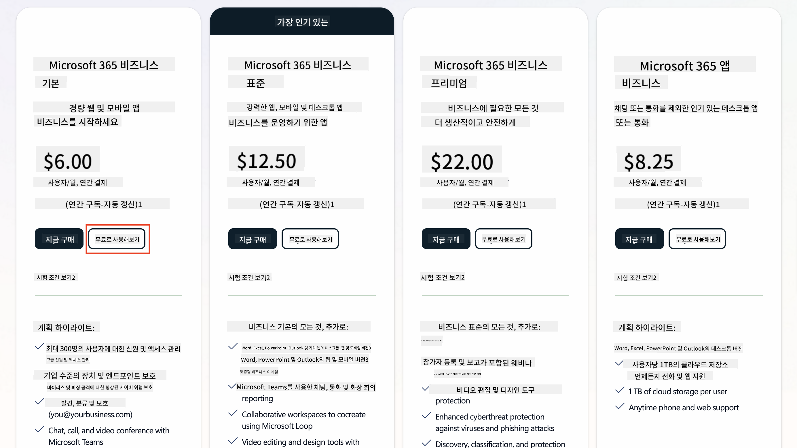  
   1. 새 계정을 생성한 후 로그인합니다.

    !!! Tip
        Microsoft 365 Copilot Chat에 에이전트를 게시하거나 조직 데이터(SharePoint, OneDrive, Dataverse)에 연결하려면 Microsoft 365 Copilot 라이선스가 필요합니다. 이는 추가 라이선스이며 [라이선스 사이트](https://www.microsoft.com/microsoft-365/copilot#plans)에서 자세히 알아볼 수 있습니다.

---

## Step 2: Copilot Studio 체험 시작

Microsoft 365 테넌트를 얻은 후 Copilot Studio에 액세스해야 합니다. 다음 단계를 따라 무료 30일 체험을 시작할 수 있습니다:

1. [aka.ms/TryCopilotStudio](https://aka.ms/TryCopilotStudio)로 이동합니다.  
1. 이전 단계에서 설정한 새 계정의 이메일 주소를 입력하고 `다음`을 선택합니다.  
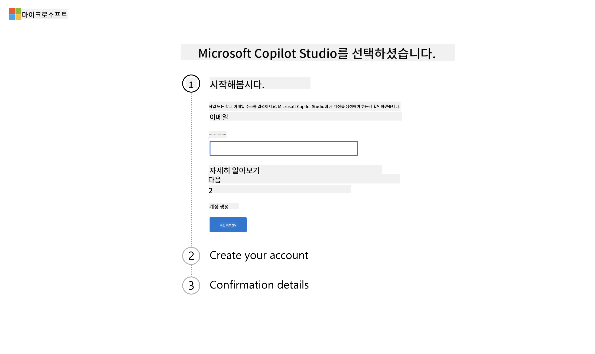  
1. 계정을 인식하면 `로그인`을 선택합니다.  
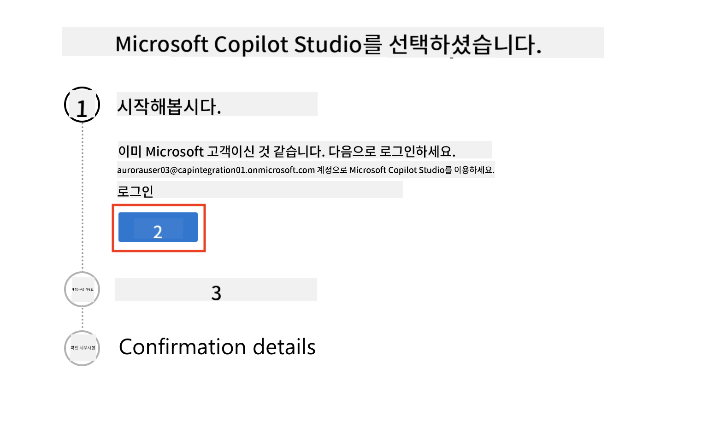  
1. `무료 체험 시작`을 선택합니다.  
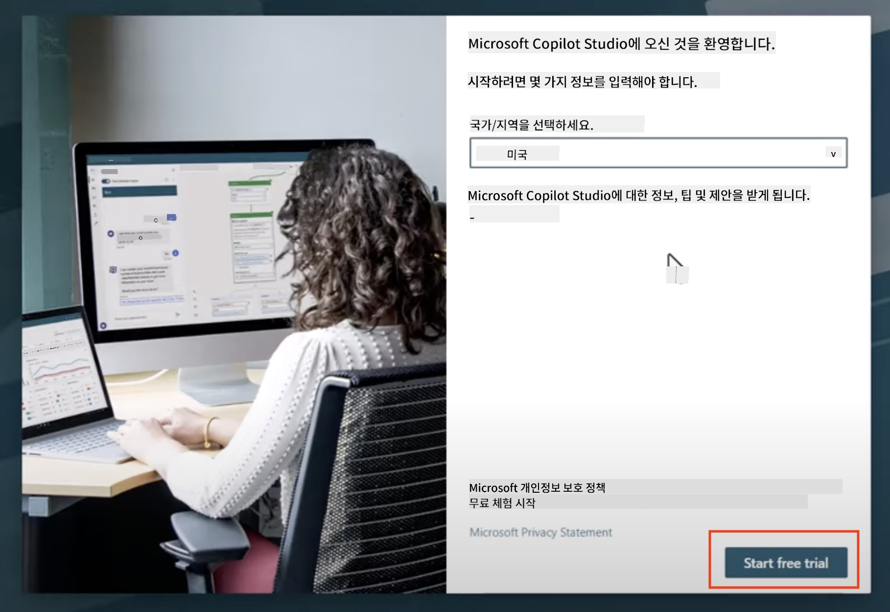  

!!! info "체험 관련 정보"  
     1. 무료 체험은 **Copilot Studio의 모든 기능**을 제공합니다.  
     1. 체험 만료에 대한 이메일 알림을 받게 됩니다. 체험은 30일 단위로 연장 가능하며 최대 90일 동안 에이전트 실행이 가능합니다.  
     1. 테넌트 관리자가 셀프 서비스 가입을 비활성화한 경우 오류가 표시됩니다. Microsoft 365 관리자에게 문의하여 다시 활성화하세요.

---

## Step 3: 새로운 개발 환경 생성

### Power Apps 개발자 플랜 가입

Step 1에서 사용한 동일한 Microsoft 365 테넌트를 사용하여 Copilot Studio에서 빌드 및 테스트할 무료 개발 환경을 생성하기 위해 Power Apps 개발자 플랜에 가입하세요.

1. [Power Apps 개발자 플랜 웹사이트](https://aka.ms/PowerAppsDevPlan)에서 가입합니다.

    - 이메일 주소 입력
    - 체크박스 선택
    - **무료 시작** 선택

    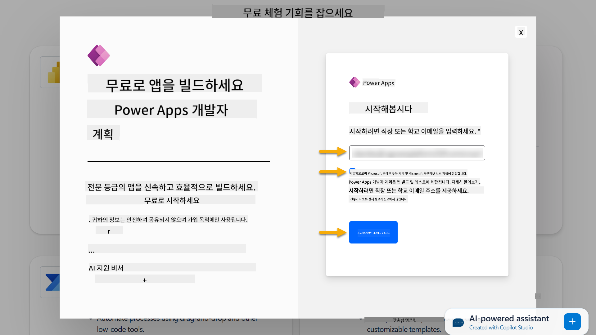

1. 개발자 플랜에 가입한 후 [Power Apps](https://make.powerapps.com/)로 리디렉션됩니다. 환경은 사용자 이름을 사용하며, 예를 들어 **Adele Vance의 환경**으로 표시됩니다. 이미 동일한 이름의 환경이 있는 경우 새 개발자 환경은 **Adele Vance의 (1)** 환경으로 명명됩니다.

    Copilot Studio에서 실습을 완료할 때 이 개발 환경을 사용하세요.

!!! Note
    기존 Microsoft 365 계정을 사용하고 Step 1에서 새 계정을 생성하지 않은 경우, 예를 들어 직장 조직에서 자신의 계정을 사용하는 경우, 테넌트/환경을 관리하는 IT 관리자(또는 해당 팀)가 가입 프로세스를 비활성화했을 수 있습니다. 이 경우 관리자에게 문의하거나 Step 1에 따라 테스트 테넌트를 생성하세요.

---

## Step 4: 새로운 SharePoint 사이트 생성

새로운 SharePoint 사이트를 생성해야 하며, 이는 [Lesson 06 - Copilot과 데이터 기반 대화형 생성 경험을 사용하여 맞춤형 에이전트 생성](../06-create-agent-from-conversation/README.md#62-add-an-internal-knowledge-source-using-a-sharepoint-site)에서 사용됩니다.

1. Microsoft Copilot Studio의 왼쪽 상단에 있는 와플 아이콘을 선택하여 메뉴를 확인합니다. 메뉴에서 SharePoint를 선택합니다.

    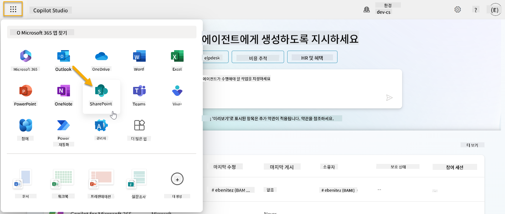

1. SharePoint가 로드됩니다. **+ 사이트 생성**을 선택하여 새로운 SharePoint 사이트를 생성합니다.

    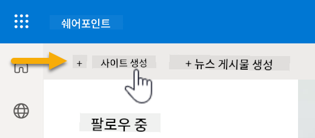

1. 새로운 SharePoint 사이트를 생성하는 데 도움을 주는 대화 상자가 나타납니다. **팀 사이트**를 선택합니다.

    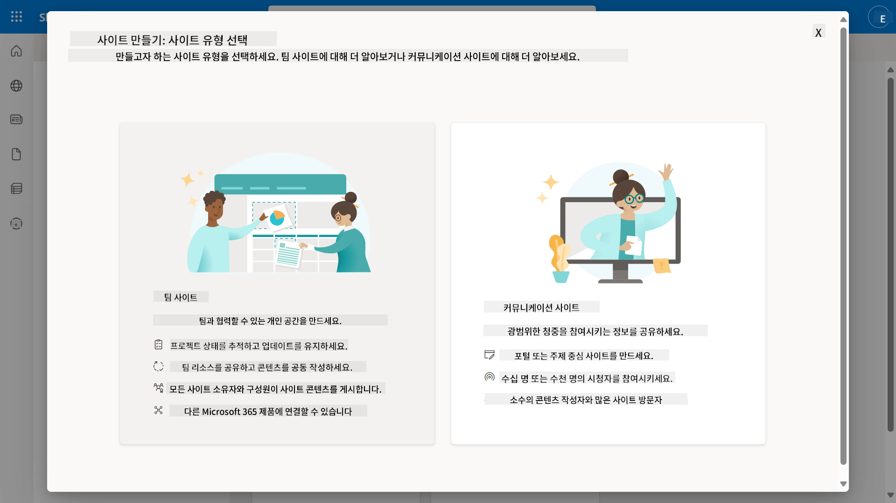

1. 다음 단계에서 기본적으로 Microsoft 템플릿 목록이 로드됩니다. 아래로 스크롤하여 **IT 헬프 데스크** 템플릿을 선택합니다.

    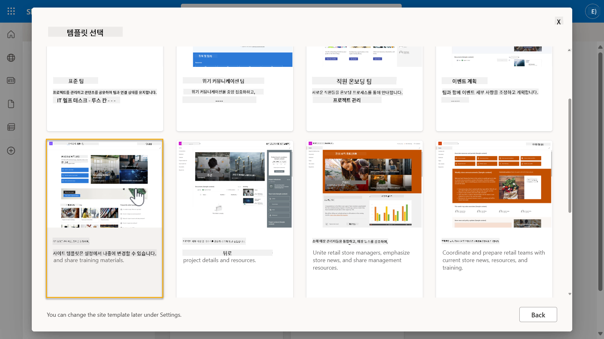

1. **템플릿 사용**을 선택하여 IT 헬프 데스크 템플릿을 사용하여 새로운 SharePoint 사이트를 생성합니다.

    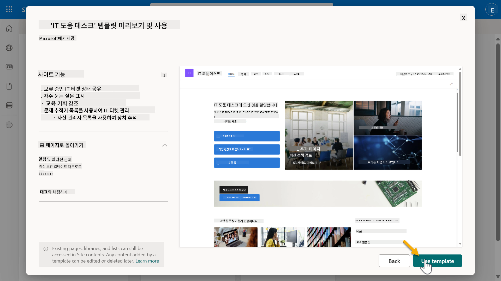

1. 사이트 정보를 입력합니다. 다음은 예시입니다:

    | 필드 | 값 |
    | --- | --- |
    | 사이트 이름 | Contoso IT |
    | 사이트 설명 | Copilot Studio for Beginners |
    | 사이트 주소 | ContosoIT |

    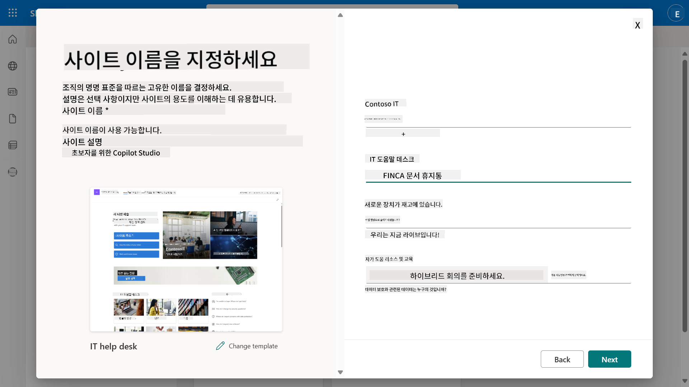

1. 마지막 단계에서 SharePoint 사이트의 언어를 선택할 수 있습니다. 기본값은 **영어**입니다. 언어를 **영어**로 유지하고 **사이트 생성**을 선택합니다.

    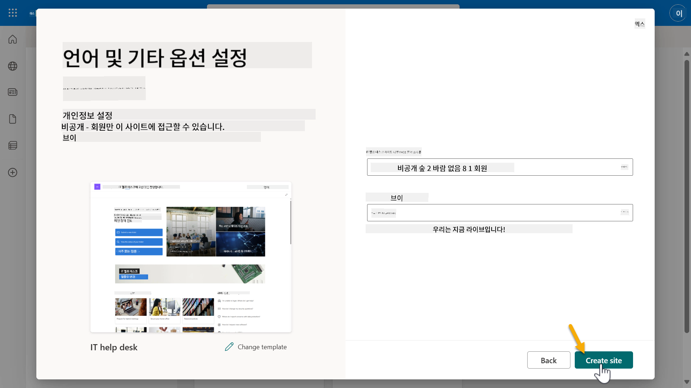

1. SharePoint 사이트가 몇 초 동안 프로비저닝됩니다. 이 동안 **멤버 추가** 필드에 이메일 주소를 입력하여 사이트에 다른 사용자를 추가할 수 있습니다. 완료되면 **완료**를 선택합니다.

    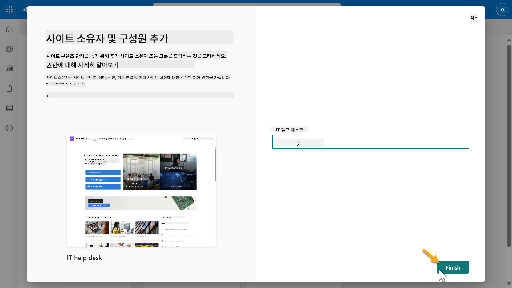

1. SharePoint 사이트 홈 페이지가 로드됩니다. **SharePoint 사이트 URL을 복사**하세요.

1. 이 템플릿은 다양한 IT 정책에 대한 샘플 데이터가 포함된 페이지와 두 개의 샘플 목록(Tickets 및 Devices)을 제공합니다.

### Devices SharePoint 목록 사용

[Mission 07 - 트리거와 노드를 사용하여 새 주제 추가](../07-add-new-topic-with-trigger/README.md#73-add-a-tool-using-a-connector)에서 **Devices** 목록을 사용합니다.

### 새 열 추가

목록의 가장 오른쪽으로 스크롤하여 **+ 열 추가** 버튼을 선택합니다. **하이퍼링크** 유형을 선택하고 열 이름으로 **Image**를 입력한 후 추가를 선택합니다.

### Devices SharePoint 목록에 샘플 데이터 생성

이 목록에 최소 4개의 샘플 데이터를 채우고 이 목록에 추가 열을 하나 더 추가해야 합니다.  

샘플 데이터를 추가할 때 다음 필드를 반드시 채우세요:

- 장치 사진 - [장치 이미지 폴더](https://github.com/microsoft/agent-academy/tree/main/docs/recruit/00-course-setup/images/device-images)의 이미지를 사용하세요.
- 제목
- 상태
- 제조사
- 모델
- 자산 유형
- 색상
- 일련 번호
- 구매 날짜
- 구매 가격
- 주문 번호
- 이미지 - 다음 링크를 사용하세요

|장치  |URL  |
|---------|---------|
|Surface Laptop 13     | [https://raw.githubusercontent.com/microsoft/agent-academy/refs/heads/main/docs/recruit/00-course-setup/images/device-images/Surface-Laptop-13.png](https://raw.githubusercontent.com/microsoft/agent-academy/refs/heads/main/docs/recruit/00-course-setup/images/device-images/Surface-Laptop-13.png)        |
|Surface Laptop 15     | [https://raw.githubusercontent.com/microsoft/agent-academy/refs/heads/main/docs/recruit/00-course-setup/images/device-images/Surface-Laptop-15.png](https://raw.githubusercontent.com/microsoft/agent-academy/refs/heads/main/docs/recruit/00-course-setup/images/device-images/Surface-Laptop-15.png)        |
|Surface Pro    | [https://raw.githubusercontent.com/microsoft/agent-academy/refs/heads/main/docs/recruit/00-course-setup/images/device-images/Surface-Pro-12.png](https://raw.githubusercontent.com/microsoft/agent-academy/refs/heads/main/docs/recruit/00-course-setup/images/device-images/Surface-Pro-12.png)        |
|Surface Studio    | [https://raw.githubusercontent.com/microsoft/agent-academy/refs/heads/main/docs/recruit/00-course-setup/images/device-images/Surface-Studio.png](https://raw.githubusercontent.com/microsoft/agent-academy/refs/heads/main/docs/recruit/00-course-setup/images/device-images/Surface-Studio.png)        |

---

## ✅ 미션 완료

다음 작업을 성공적으로 완료했습니다:

- Microsoft 365 개발 환경 설정  
- Copilot Studio 체험 활성화  
- 에이전트를 위한 SharePoint 사이트 생성  
- 향후 미션에서 사용할 Devices 목록 채우기  

이제 [Lesson 01](../01-introduction-to-agents/README.md)에서 **리크루트 레벨 에이전트 훈련**을 시작할 준비가 완료되었습니다.  

<!-- markdownlint-disable-next-line MD033 -->

---

**면책 조항**:  
이 문서는 AI 번역 서비스 [Co-op Translator](https://github.com/Azure/co-op-translator)를 사용하여 번역되었습니다. 정확성을 위해 최선을 다하고 있지만, 자동 번역에는 오류나 부정확성이 포함될 수 있습니다. 원본 문서의 원어 버전을 권위 있는 출처로 간주해야 합니다. 중요한 정보의 경우, 전문적인 인간 번역을 권장합니다. 이 번역 사용으로 인해 발생하는 오해나 잘못된 해석에 대해 책임지지 않습니다.