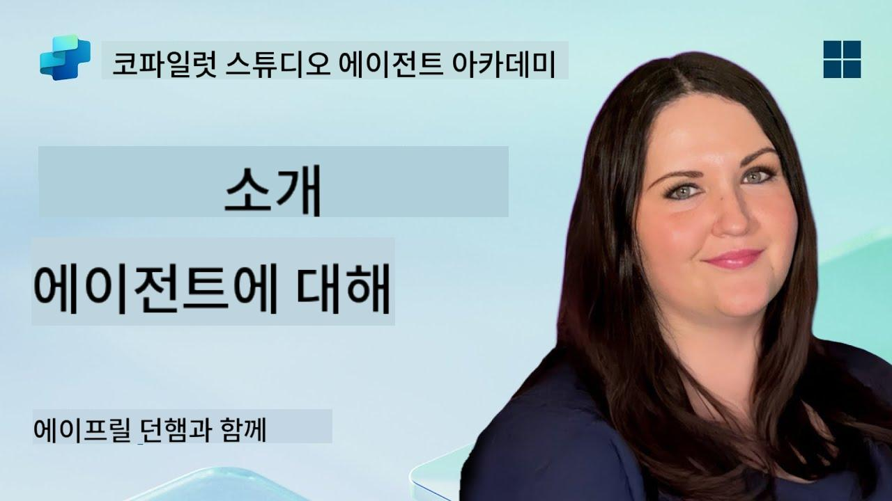

<!--
CO_OP_TRANSLATOR_METADATA:
{
  "original_hash": "d6706e107678264168d77b2e107710b1",
  "translation_date": "2025-10-22T00:32:07+00:00",
  "source_file": "docs/recruit/01-introduction-to-agents/README.md",
  "language_code": "ko"
}
-->
# 🚨 미션 01: 에이전트 소개

## 🕵️‍♂️ 코드명: `OPERATION AI AGENT DECODE`

> **⏱️ 작전 시간:** `~30분 – 정보 수집만, 현장 작업 없음`

🎥 **영상 보기**

## 🎯 미션 브리핑

환영합니다, 신입 요원. 에이전트를 구축하기 전에 이를 구동하는 AI 개념을 확실히 이해해야 합니다. 이번 미션에서는 대화형 AI, 대규모 언어 모델(LLM), 검색 증강 생성(RAG), 그리고 Copilot Studio에서 생성할 수 있는 에이전트 유형에 대한 기초 지식을 제공합니다.

## 🔎 목표

이번 미션에서 배우게 될 내용:

1. 대화형 AI란 무엇이며 왜 중요한지  
1. 대규모 언어 모델(LLM)이 채팅 경험을 어떻게 지원하는지  
1. 검색 증강 생성(RAG)이 제공하는 이점  
1. 대화형 에이전트와 자율 에이전트의 차이점  
1. Copilot Studio에서 에이전트가 이러한 개념을 어떻게 활용하는지  

시작해봅시다!

---

## 대화형 AI란 무엇인가?

대화형 AI는 텍스트 또는 음성으로 인간의 언어를 이해하고 처리하며 자연스럽게 응답할 수 있는 시스템을 말합니다. 예를 들어, 고객 지원용 챗봇이나 앱 내 가상 개인 비서가 이에 해당합니다. 대부분의 현대 대화형 AI는 대규모 언어 모델(LLM)을 기반으로 작동하며, 이에 대해서는 다음에서 다룹니다.

### 왜 중요한가?

- **사용자 경험:** 대화형 인터페이스는 메뉴를 클릭하는 것보다 직관적입니다.  
- **확장성:** 하나의 에이전트가 수십 또는 수백 개의 동시 대화를 처리할 수 있습니다.  
- **효율성:** 맞춤형 규칙 기반 스크립트를 작성하는 대신, LLM 기반 에이전트는 사용자 입력에 따라 즉각적으로 적응합니다.  
- **확장 가능성:** 적절한 설계로 에이전트는 지식 베이스에 접근하거나 API에 연결하거나 비즈니스 워크플로 내에서 "디지털 동료" 역할을 할 수 있습니다.

---

## 대규모 언어 모델(LLM) 101

대부분의 대화형 AI 시스템의 핵심은 **대규모 언어 모델**입니다. 이는 방대한 텍스트 데이터를 학습한 신경망으로, 언어의 통계적 패턴을 학습하여 일관된 문장을 생성하거나 질문에 답하거나 아이디어를 제안할 수 있습니다. 주요 포인트:

1. **학습 데이터:** LLM은 웹 페이지, 책, 기사 등 테라바이트 단위의 텍스트를 학습합니다. 이 "세계 지식"은 다양한 주제에 대해 응답할 수 있게 합니다.  
1. **토큰화:** 텍스트는 단어, 부분 단어, 문자 등 작은 단위인 토큰으로 나뉩니다. 모델은 한 번에 하나의 토큰을 예측합니다.  
1. **컨텍스트 윈도우:** 각 LLM은 한 번에 "볼 수 있는" 토큰 수에 제한이 있습니다. 이 제한을 초과하면 이전 토큰이 잘립니다.  
1. **프롬프트:** LLM과 상호작용하려면 프롬프트를 보내야 합니다. 프롬프트가 좋을수록 응답이 더 집중적이고 관련성이 높아집니다.  
1. **제로샷 vs. 파인튜닝:** 제로샷은 LLM을 그대로 사용하는 것이며(단순한 가중치 사용), 파인튜닝은 도메인별 데이터로 모델을 조정하여 더 정확한 응답을 얻는 것입니다.

!!! Tip "전문가 팁"
    흔히 LLM은 "매우 똑똑한 자동완성"과 같다고 비유됩니다. 인간의 뇌처럼 의미를 진정으로 이해하지는 못하지만, 시퀀스에서 다음으로 적합한 단어(또는 구)를 예측하는 데 매우 능숙합니다.

---

## 검색 증강 생성(RAG)

LLM이 정적 학습 데이터에만 의존하면 환각을 일으키거나 최신 정보가 부족할 수 있습니다. RAG는 모델이 응답을 작성하기 전에 최신 정보를 "검색"할 수 있도록 하여 이를 해결합니다. RAG의 작동 방식은 다음과 같습니다:

1. **사용자 질문:** 사용자가 질문을 합니다(예: "Contoso의 분기별 실적 최신 정보는?").  
1. **검색 단계:** 시스템이 지식 소스(문서, 내부 데이터베이스, SharePoint 라이브러리 등)를 검색하여 관련 구절을 찾습니다.  
1. **증강:** 검색된 구절이 LLM 프롬프트 앞이나 뒤에 추가됩니다.  
1. **생성:** LLM은 사용자의 질문과 검색된 컨텍스트를 모두 처리하여 최신 데이터에 기반한 응답을 생성합니다.  

RAG를 사용하면 에이전트가 내부 회사 위키, 플러그인 API, FAQ 지식 베이스를 호출하여 정적으로 게시된 모델 매개변수에 제한되지 않는 답변을 반환할 수 있습니다.

---

## 대화형 에이전트 vs. 자율 에이전트

Copilot Studio에서 **에이전트**라는 용어는 여러 유형의 AI 어시스턴트를 의미할 수 있습니다. 다음과 같은 차이를 이해하는 것이 중요합니다:

**대화형 에이전트:**

- 주로 양방향 대화에 초점.  
- 대화의 여러 턴 동안 컨텍스트를 유지.  
- 미리 정의된 흐름 또는 트리거를 통해 주로 조정됨(예: "사용자가 X를 말하면 Y로 응답").  
- 고객 지원, FAQ, 안내형 상호작용, 일정 관리 또는 간단한 Q&A에 적합.  
  - 예시:  
    - HR 정책 질문에 답변하는 Teams 챗봇.  
    - SharePoint 페이지에서 사용자를 양식 작성으로 안내하는 Power Virtual Agents 봇.  

**자율 에이전트:**

- 단순한 대화 이상의 작업을 수행하며, 사용자 대신 **행동**을 취할 수 있음.  
- LLM 추론 루프를 사용하여(예: "계획 → 행동 → 관찰 → 재계획") 작업을 완료.  
- 외부 도구 또는 API에 연결(예: Power Automate 흐름 호출, 일정 초대 전송, Dataverse 데이터 조작).  
- 지속적인 사용자 입력 없이 작동하며, 트리거되면 다단계 프로세스를 자율적으로 처리.  
  - 예시:  
    - 여행 일정 생성, 항공편 예약, 확인 이메일 발송 에이전트.  
    - Teams 회의에 참여하여 실시간으로 기록하고 OneNote에 요약 작성하는 "회의 요약" 에이전트.  

!!! Info "핵심 차이점"
    대화형 에이전트는 사용자 입력을 기다리고 대화에 집중합니다. 자율 에이전트는 더 넓은 도구 접근을 사용하여 계획을 세우고 실행하며 일련의 단계를 수행합니다.

---

## Copilot Studio의 에이전트

**Copilot Studio**는 대화형 및 자율 시나리오를 하나의 프레임워크로 통합합니다. Copilot Studio가 에이전트를 구축하는 데 어떻게 도움을 주는지 살펴보세요:

1. **비주얼 에이전트 디자이너:** 대화 및 작업 워크플로를 위한 프롬프트, 메모리, 도구를 정의하는 저코드 캔버스.  
1. **LLM 구성:** 다양한 OpenAI 모델 또는 Microsoft의 엔터프라이즈급 GPT를 선택하여 성능과 비용 요구를 충족.  
1. **검색 커넥터:** SharePoint, OneDrive, Azure Cognitive Search, Dataverse와의 사전 통합으로 RAG를 즉시 사용 가능.  
1. **맞춤형 도구 및 기능:** 에이전트가 자율적으로 호출할 수 있는 맞춤형 HTTP 작업 또는 Power Automate 흐름 정의.  
1. **멀티모달 지원:** 텍스트 외에도 Copilot Studio 에이전트는 이미지, 파일, 구조화된 데이터를 처리하여 컨텍스트를 풍부하게 함.  
1. **배포 및 배포:** 에이전트가 준비되면 Microsoft 365 Copilot에 게시하여(사용자가 Teams, SharePoint, Outlook 등에서 호출) 독립형 채팅 위젯으로 웹페이지에 임베드 가능.

---

## 🎉 미션 완료

이제 에이전트와 기초 AI 개념에 대한 소개를 완료했습니다. 다음을 이해했습니다:

1. **LLM = 에이전트의 "뇌"**  
   - 언어 이해 및 생성 담당.  
   - 더 많은 토큰 = 더 풍부한 컨텍스트, 하지만 호출당 비용 증가.  

1. **RAG = 실시간 지식 통합**  
   - 정적 LLM과 끊임없이 변화하는 데이터 소스 간의 격차를 연결.  
   - 관련 문서 또는 기록을 검색하여 LLM 프롬프트에 삽입.  

1. **대화형 vs. 자율**  
   - **대화형:** 대화 흐름과 컨텍스트 유지에 초점(예: "세션 메모리").  
   - **자율:** 외부 도구 또는 서비스를 호출할 수 있는 "액션 블록" 추가.

---
다음으로, [Copilot Studio의 기본 사항](../02-copilot-studio-fundamentals/README.md)을 탐구하게 됩니다!

신입 요원, 긴장을 늦추지 마세요 - 당신의 AI 여정은 이제 시작입니다!

## 📚 전술적 자료

🔗 [Copilot Studio 문서 홈](https://learn.microsoft.com/microsoft-copilot-studio/)

---

<!-- markdownlint-disable-next-line MD033 -->

---

**면책 조항**:  
이 문서는 AI 번역 서비스 [Co-op Translator](https://github.com/Azure/co-op-translator)를 사용하여 번역되었습니다. 정확성을 위해 최선을 다하고 있지만, 자동 번역에는 오류나 부정확성이 포함될 수 있습니다. 원본 문서의 원어를 권위 있는 출처로 간주해야 합니다. 중요한 정보의 경우, 전문적인 인간 번역을 권장합니다. 이 번역 사용으로 인해 발생하는 오해나 잘못된 해석에 대해 책임을 지지 않습니다.