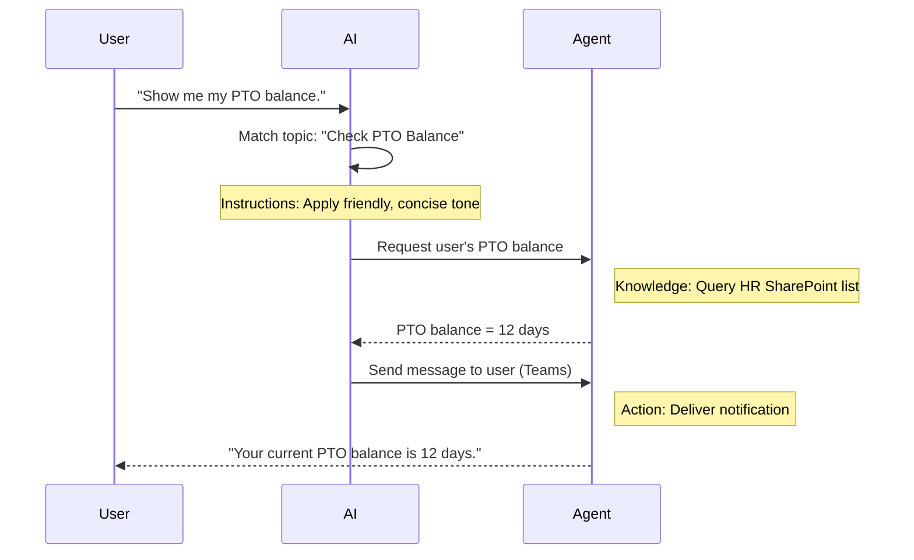

<!--
CO_OP_TRANSLATOR_METADATA:
{
  "original_hash": "90a3c5122f5687bbc8cc819990f175d4",
  "translation_date": "2025-10-22T00:53:00+00:00",
  "source_file": "docs/recruit/02-copilot-studio-fundamentals/README.md",
  "language_code": "ko"
}
-->
# 🚨 미션 02: Copilot Studio 기본 사항

## 🕵️‍♂️ 코드명: `OPERATION CORE PROTOCOL`

> **⏱️ 작전 시간:** `~30분 – 정보 수집만, 현장 작업 없음`  

🎥 **가이드 영상 보기**

[](https://www.youtube.com/watch?v=x4OCwDRGeLE "YouTube에서 가이드 영상 보기")

## 🎯 미션 개요

환영합니다, 신입 요원. 이 미션은 Copilot Studio가 어떻게 작동하는지, 그리고 실제 비즈니스 가치를 제공하는 지능형 에이전트를 구축하는 방법에 대한 기본 정보를 제공합니다.

첫 번째 에이전트를 구축하기 전에, 모든 맞춤형 AI 에이전트를 구성하는 네 가지 핵심 요소인 지식, 도구, 주제, 지침을 이해해야 합니다. 또한 Copilot Studio 오케스트레이터에서 이러한 요소들이 어떻게 함께 작동하는지 배우게 됩니다.

## 🔎 목표

이 미션에서 당신은:

- **Copilot Studio가 무엇인지 배우기**
- **에이전트를 언제, 왜 사용하는지 배우기**
- **에이전트의 네 가지 구성 요소 탐색**
      - **지식**
      - **도구**
      - **주제**
      - **지침**
- **이 구성 요소들이 어떻게 함께 작동하는지 이해하기**  
  지능적이고 자동화된 에이전트를 만드는 방법

---

## Copilot Studio에서 에이전트란 무엇인가?

**에이전트**는 특정 작업이나 질문을 처리하도록 설계된 전문 AI 도우미입니다. 일반적인 챗봇과 달리, 당신의 에이전트는:

- **회사 고유의 데이터**를 알고 있습니다 (정책, 문서, 데이터베이스)  
- **실제 작업을 수행합니다** (메시지 보내기, 캘린더 이벤트 생성, 기록 업데이트)  
- **대화의 맥락을 유지합니다** 이전 질문에 대한 후속 질문을 처리할 수 있도록  

Copilot Studio는 로우코드 플랫폼이기 때문에 사전 제작된 구성 요소를 드래그 앤 드롭하여 사용할 수 있습니다—깊은 코딩 기술이 필요하지 않습니다. 에이전트를 구축한 후에는 사람들이 Teams, Slack 또는 맞춤형 웹 페이지 내에서 호출하여 답변을 얻거나 워크플로를 자동으로 트리거할 수 있습니다.

---

## Copilot Studio를 언제, 왜 사용해야 하는가

Microsoft 365 Copilot은 Office 앱 전반에 걸쳐 일반적인 AI 지원을 제공하지만, 맞춤형 에이전트가 필요할 때가 있습니다:

### 도메인별 지식이 필요할 때

- 기본 제공 Copilot은 회사의 내부 절차나 데이터를 알지 못할 수 있습니다. 에이전트는 SharePoint 사이트, 데이터베이스 또는 맞춤형 소스를 쿼리하여 정확하고 최신 정보를 제공합니다.  

### 다단계 워크플로를 자동화하고 싶을 때

- 예를 들어: "누군가 비용을 제출하면 승인 요청을 보내고, 재무 추적기를 업데이트하며, 관리자를 알립니다." 맞춤형 에이전트는 단일 명령이나 이벤트로 모든 단계를 처리할 수 있습니다.  

### 맥락에 맞는 도구 내 경험이 필요할 때  

- 예를 들어, Teams에서 HR 직원에게 모든 정책을 안내하고 필요한 양식을 보내며 오리엔테이션 미팅을 예약하는 신입 직원 온보딩 에이전트를 상상해 보세요—기존 협업 플랫폼 내에서 바로 가능합니다.  

---

## 에이전트의 네 가지 구성 요소

모든 Copilot Studio 에이전트는 네 가지 핵심 구성 요소로 이루어져 있습니다:

1. **지식**  
1. **도구 (작업)**  
1. **주제**  
1. **지침**

아래에서 각 구성 요소를 정의하고 효과적인 에이전트를 만드는 방법을 보여드리겠습니다.

### 1. 지식

**지식**은 에이전트가 질문에 정확히 답하기 위해 사용하는 데이터와 맥락입니다. 두 가지 부분으로 구성됩니다:

#### 맞춤형 지침 및 맥락

- 에이전트의 목적과 톤에 대한 간단한 설명을 작성합니다. 예를 들어:  

    ```text
    You are an IT support agent. You help employees troubleshoot common software issues, provide troubleshooting steps, and escalate urgent tickets.
    ```

- 대화 중에 에이전트는 이전 턴을 기억하여 이미 논의된 내용을 참조할 수 있습니다 (예: 사용자가 처음에 "내 프린터가 오프라인입니다"라고 말한 후 나중에 "잉크 수준을 확인했나요?"라고 묻는 경우, 에이전트는 프린터 맥락을 기억합니다).

#### 지식 소스 (기반 데이터)

- 에이전트를 여러 데이터 소스—SharePoint 라이브러리, 문서 사이트, 위키 또는 기타 데이터베이스—에 연결합니다.  
- 사용자가 질문을 하면, 에이전트는 해당 소스에서 관련된 내용을 가져와 답변을 **기반**으로 제공합니다.  
- 에이전트가 해당 소스에서만 정보를 제공하도록 강제할 수도 있어, 추측하거나 "환각" 답변을 방지할 수 있습니다.

!!! example
    "정책 도우미" 에이전트는 HR SharePoint 사이트에 연결될 수 있습니다. 사용자가 "우리의 PTO 적립률은 얼마인가요?"라고 묻는 경우, 에이전트는 HR 정책 문서에서 정확한 텍스트를 가져와 일반적인 AI 응답에 의존하지 않습니다.

---

### 2. 도구 (작업)

**도구 (작업)**은 에이전트가 채팅 외에 수행할 수 있는 작업을 정의합니다. 각 작업은 에이전트가 프로그래밍 방식으로 실행하는 작업을 나타냅니다. 예를 들어:

- 이메일 또는 Teams 메시지 보내기  
- 캘린더 이벤트 생성 또는 업데이트  
- 데이터베이스(예: SharePoint 목록 또는 Dataverse 테이블)에 기록 추가 또는 편집  
- Power Automate 흐름 또는 REST API 호출  

#### 작업의 작동 방식

- **입력 및 출력 정의**  
      - 예를 들어, 이메일 보내기 작업은 다음을 요구할 수 있습니다:  
        - `RecipientEmailAddress`  
        - `SubjectLine`  
        - `EmailBody`  

- **작업을 워크플로로 결합**  
      - 종종 사용자 요청을 충족하려면 여러 단계가 필요합니다.  
      - 작업을 순서대로 배치하여:  
             1. 에이전트가 SharePoint 목록에서 데이터를 검색합니다.  
             2. LLM을 사용하여 요약을 생성합니다.  
             3. Teams 메시지로 해당 요약을 보냅니다.  

- **외부 시스템에 연결**  
      - CRM을 업데이트하거나 내부 API를 호출해야 하는 경우, 이를 처리하기 위한 맞춤형 작업을 생성합니다.  
      - Copilot Studio는 Power Platform 또는 HTTP 기반 엔드포인트와 통합할 수 있습니다.

!!! example "예산 도우미 에이전트는 다음을 수행할 수 있습니다:"  
    1. "비용 제출" 요청을 듣습니다.  
    2. 사용자의 비용 세부 정보를 양식에서 가져옵니다.  
    3. "SharePoint 목록에 추가" 작업을 사용하여 데이터를 저장합니다.  
    4. "이메일 보내기" 작업을 트리거하여 승인자를 알립니다.  

---

### 3. 주제

**주제**는 에이전트의 대화 트리거 또는 진입점을 정의합니다. 각 주제는 기능 또는 질문 카테고리에 해당합니다.

#### 대화 트리거  

- 주제는 "IT 티켓 제출," "휴가 잔여 확인," 또는 "판매 보고서 생성"일 수 있습니다.  
- Copilot Studio는 **생성적 오케스트레이션**을 사용합니다: 정확한 키워드에 의존하지 않고, AI가 사용자 의도를 해석하여 제공된 짧은 설명을 기반으로 적절한 주제를 선택합니다.  

#### 주제 설명  

- 각 주제에서 해당 주제가 다루는 내용을 명확하고 간결하게 설명합니다.

!!! example "주제 설명 예시"
    이 주제는 사용자가 IT 지원 티켓을 제출할 수 있도록 문제 세부 사항, 우선순위, 연락처 정보를 수집합니다.

- AI는 이 설명을 사용하여 사용자의 표현이 정확히 일치하지 않더라도 이 주제를 활성화할 시점을 결정합니다.

#### 주제를 작업에 매핑  

- 각 주제는 하나 이상의 작업 또는 데이터 검색 단계와 연결됩니다.  
- AI가 주제를 선택하면, 정의된 순서에 따라 대화를 안내합니다 (후속 질문을 하고, 작업을 호출하며, 결과를 반환).

!!! example
    사용자가 "새 노트북 설정에 도움이 필요합니다"라고 말하면, AI는 "IT 티켓 제출" 주제와 의도를 매칭할 수 있습니다. 에이전트는 노트북 모델, 사용자 세부 정보 등을 묻고 자동으로 헬프데스크 시스템에 티켓을 생성합니다.

---

### 4. 지침

**지침** (때로는 "프롬프트" 또는 "시스템 메시지"라고도 함)은 LLM의 톤, 스타일, 경계를 안내합니다. 이는 에이전트가 어떤 상황에서도 어떻게 응답할지를 형성합니다.

#### 역할 및 페르소나  

- AI에게 자신이 누구인지 알려줍니다 (예: "당신은 Contoso Retail의 고객 서비스 에이전트입니다").  
- 이는 톤을 설정합니다—친근한, 간결한, 공식적인, 또는 캐주얼한—사용 사례에 따라 다릅니다.

#### 응답 지침  

- 에이전트가 따라야 할 규칙을 지정합니다. 예를 들어:  
      - "항상 정책 정보를 간략히 요약하여 제공하세요."  
      - "답을 모를 경우, ‘죄송합니다, 해당 정보를 가지고 있지 않습니다’라고 말하세요."  
      - "맥락 외의 기밀 정보를 절대 포함하지 마세요."

#### 메모리 및 맥락 규칙

- 에이전트가 대화에서 몇 턴을 기억할지 지시할 수 있습니다.  
- 예를 들어: "이 사용자의 요청 세부 정보를 최대 세 번의 후속 질문 동안 기억하세요."

!!! example "예를 들어, '복지 상담사' 에이전트에서는 다음을 포함할 수 있습니다:"
    "질문에 답할 때 항상 최신 HR 핸드북을 참조하세요. 등록 마감일에 대해 질문을 받으면 정책에서 특정 날짜를 제공하세요. 답변은 150단어 이하로 유지하세요."

---

## 네 가지 구성 요소가 함께 작동하는 방식

**지식**, **도구**, **주제**, **지침**을 조합하면 Copilot Studio의 AI 오케스트레이터는 다음을 수행하는 에이전트를 만듭니다:

1. **관련 주제를 듣습니다** (주제 설명에 따라 안내).  
1. **지침을 적용합니다** 톤을 설정하고, 후속 질문 시점을 결정하며, 규칙을 준수합니다.  
1. **지식 소스를 활용합니다** 조직의 데이터에 기반하여 답변을 제공합니다.  
1. **필요에 따라 도구 (작업)를 호출합니다** 메시지 보내기, 기록 업데이트, API 호출 등의 작업을 수행합니다.  

내부적으로 오케스트레이터는 **생성적 계획** 접근 방식을 사용합니다: 사용자 요청을 충족하기 위해 어떤 단계를 어떤 순서로 수행할지 결정합니다. 작업이 실패하면 (예: 이메일을 보낼 수 없는 경우), 에이전트는 예외 처리 지침을 따릅니다 (명확한 질문을 하거나 오류를 보고). LLM은 대화 맥락에 적응하기 때문에, 에이전트는 여러 턴 동안 메모리를 유지하고 대화가 진행됨에 따라 새로운 정보를 통합할 수 있습니다.

**시각적 흐름 예시:**  
<!--
1. **사용자:** "내 PTO 잔여를 보여주세요."
1. **AI (주제):** "PTO 잔여 확인" 주제를 매칭합니다.  
1. **AI (지침):** 친근하고 간결한 톤을 사용합니다.  
1. **에이전트 (지식):** HR SharePoint 목록에서 사용자의 잔여를 쿼리합니다.  
1. **에이전트 (작업):** 값을 검색하고 Teams 메시지를 보냅니다:  
   > "현재 PTO 잔여는 12일입니다."  
-->



---

## 🎉 미션 완료

기본 브리핑을 성공적으로 완료했습니다. 이제 Copilot Studio에서 모든 에이전트를 구성하는 네 가지 필수 요소를 배웠습니다:

1. **지식** – 에이전트가 사실 정보를 검색하고 대화 메모리를 유지하는 곳.  
1. **도구** – 에이전트가 자동으로 작업을 수행할 수 있는 기능.  
1. **주제** – 에이전트가 사용자 의도를 인식하고 실행할 워크플로를 결정하는 방법.  
1. **지침** – 모든 응답을 안내하는 규칙, 톤, 경계.

이 구성 요소를 갖추면 질문에 답하고 간단한 워크플로를 실행하는 기본 에이전트를 구축할 수 있습니다. 다음 강의에서는 첫 번째 "서비스 데스크" 에이전트를 만드는 단계별 튜토리얼을 진행할 것입니다—첫 번째 지식 소스를 연결하고 주제를 정의하며 작업을 설정하는 방법까지.

다음 단계: [M365 Copilot을 위한 첫 번째 선언적 에이전트 만들기](../03-create-a-declarative-agent-for-M365Copilot/README.md).

<!-- markdownlint-disable-next-line MD033 -->


---

**면책 조항**:  
이 문서는 AI 번역 서비스 [Co-op Translator](https://github.com/Azure/co-op-translator)를 사용하여 번역되었습니다. 정확성을 위해 최선을 다하고 있지만, 자동 번역에는 오류나 부정확성이 포함될 수 있습니다. 원본 문서를 해당 언어로 작성된 상태에서 권위 있는 자료로 간주해야 합니다. 중요한 정보의 경우, 전문적인 인간 번역을 권장합니다. 이 번역 사용으로 인해 발생하는 오해나 잘못된 해석에 대해 책임지지 않습니다.