<!--
CO_OP_TRANSLATOR_METADATA:
{
  "original_hash": "0c51aabca81d6256990caf4c015e6195",
  "translation_date": "2025-10-22T00:33:24+00:00",
  "source_file": "docs/recruit/04-creating-a-solution/README.md",
  "language_code": "ko"
}
-->
# 🚨 미션 04: 에이전트를 위한 솔루션 만들기

## 🕵️‍♂️ 코드명: `OPERATION CTRL-ALT-PACKAGE`

> **⏱️ 작전 시간:** `~45분`

🎥 **가이드 영상 보기**

[](https://www.youtube.com/watch?v=1iATbkgfcpU "YouTube에서 가이드 영상 보기")

## 🎯 미션 개요

에이전트 제작자님, 다음 작전에 오신 것을 환영합니다. 이번 미션에서는 Microsoft Copilot Studio로 제작한 IT 헬프데스크 에이전트를 배포하기 위한 공식 도구인 솔루션을 조립하는 방법을 배우게 됩니다. 이를 디지털 서류 가방을 만드는 것이라고 생각해보세요. 이 가방은 에이전트와 그 아티팩트를 담고 있습니다.

모든 에이전트는 잘 구조화된 집이 필요합니다. Power Platform 솔루션은 질서, 이동성, 그리고 프로덕션 준비를 제공합니다.

이제 준비를 시작해봅시다.

## 🔎 목표

이번 미션에서 배우게 될 내용:

1. Power Platform 솔루션이 무엇인지와 에이전트 개발에서의 역할 이해하기
1. 에이전트를 조직화하고 배포하는 데 솔루션을 사용하는 이점 배우기
1. 솔루션 퍼블리셔와 구성 요소 관리에서의 중요성 탐구하기
1. 개발부터 프로덕션까지 Power Platform 솔루션 라이프사이클 이해하기
1. IT 헬프데스크 에이전트를 위한 솔루션 퍼블리셔와 사용자 정의 솔루션 만들기

## 🕵🏻‍♀️ 솔루션? 그게 뭐죠?

Microsoft Power Platform에서 솔루션은 앱이나 에이전트의 모든 구성 요소를 담고 있는 컨테이너 또는 패키지와 같습니다. 여기에는 테이블, 폼, 플로우, 사용자 정의 로직 등이 포함될 수 있습니다. 솔루션은 애플리케이션 라이프사이클 관리(ALM)에 필수적이며, 아이디어에서 개발, 테스트, 배포, 업데이트까지 앱과 에이전트를 관리할 수 있게 해줍니다.

Copilot Studio에서는 생성한 모든 에이전트가 Power Platform 솔루션에 저장됩니다. 기본적으로 에이전트는 기본 솔루션(Default solution)에 생성되며, 새로운 사용자 정의 솔루션을 생성하지 않는 한 기본 솔루션에 저장됩니다. 이번 레슨과 실습에서는 이를 배우게 됩니다 🤓

전통적으로 솔루션은 **Power Apps 제작 포털**에서 생성되었습니다. 이는 앱을 빌드하고 사용자 정의하며, Dataverse, 플로우, AI 구성 요소 등을 탐색할 수 있는 웹 기반 인터페이스입니다.

   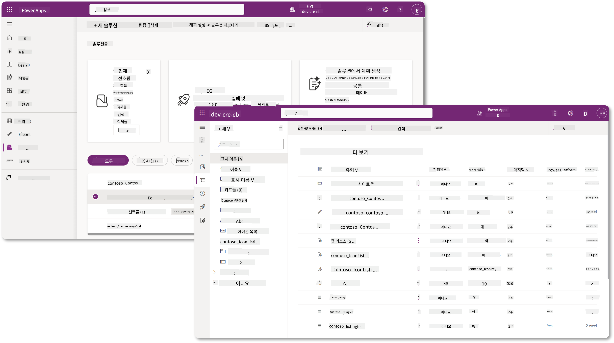

Copilot Studio에서는 이제 **솔루션 탐색기(Solution Explorer)**를 통해 직접 솔루션을 관리할 수 있습니다. 더 이상 Power Apps 제작 포털로 전환할 필요 없이 Copilot Studio 내에서 솔루션을 관리할 수 있습니다 🪄

이를 통해 다음과 같은 일반적인 솔루션 관련 작업을 수행할 수 있습니다:

- **솔루션 생성** - 사용자 정의 솔루션은 에이전트를 환경 간에 내보내고 가져올 수 있게 합니다.
- **선호하는 솔루션 설정** - 기본적으로 에이전트, 앱 등이 생성될 솔루션을 선택합니다.
- **구성 요소 추가 또는 제거** - 에이전트가 환경 변수나 클라우드 플로우와 같은 다른 구성 요소를 참조할 수 있으므로 이러한 구성 요소를 솔루션에 포함해야 합니다.
- **솔루션 내보내기** - 솔루션을 다른 대상 환경으로 이동합니다.
- **솔루션 가져오기** - 다른 곳에서 생성된 솔루션을 가져오며, 솔루션 업그레이드 또는 업데이트를 포함합니다.
- **솔루션 파이프라인 생성 및 관리** - 환경 간 솔루션 배포를 자동화합니다.
- **Git 통합** - 개발자가 Git 저장소와 솔루션을 연결하여 버전 관리, 협업 및 ALM을 지원합니다. 개발자 환경에서만 사용됩니다.

   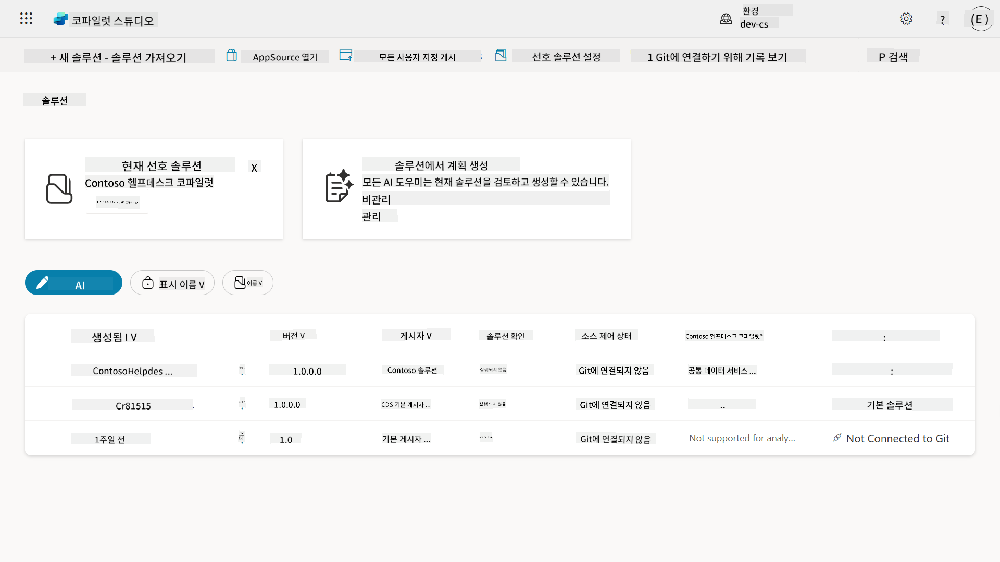

솔루션에는 두 가지 유형이 있습니다:

- **비관리 솔루션(Unmanaged solutions)** - 개발 중에 사용됩니다. 필요에 따라 자유롭게 편집하고 사용자 정의할 수 있습니다.
- **관리 솔루션(Managed solutions)** - 앱을 테스트 또는 프로덕션에 배포할 준비가 되었을 때 사용됩니다. 실수로 변경되는 것을 방지하기 위해 잠금 상태로 유지됩니다.

## 🤔 왜 에이전트에 솔루션을 사용해야 할까요?

솔루션을 _도구 상자_로 생각해보세요. 다른 장소(환경)에서 무언가를 고치거나 만들기 위해 필요한 모든 도구(구성 요소)를 모아 도구 상자(솔루션)에 넣습니다. 그런 다음 이 도구 상자를 새로운 장소(환경)로 가져가 작업을 완료하거나 새로운 도구(구성 요소)를 추가하여 에이전트나 프로젝트를 사용자 정의할 수 있습니다.

!!! quote "Elaiza, 친절한 클라우드 옹호자가 여기서 몇 마디를 공유합니다 🙋🏻‍♀️:"
    뉴질랜드에서는 "Be a tidy Kiwi!"라는 말이 있습니다. 이는 뉴질랜드 사람들이 환경을 책임지고 쓰레기를 적절히 처리하며 공공 장소를 깨끗하게 유지하라는 의미입니다. 에이전트와 관련된 모든 것을 조직화하고 이동 가능하게 유지함으로써 깨끗한 환경을 유지할 수 있습니다.

에이전트를 소스(개발자) 환경에서 전용 솔루션에 생성하는 것이 좋은 습관입니다. 솔루션이 가치 있는 이유는 다음과 같습니다:

🧩 **조직화된 개발**

- 에이전트를 환경의 모든 것을 포함하는 기본 솔루션에서 분리하여 한 곳에 모든 에이전트 구성 요소를 보관합니다 🎯

- 에이전트에 필요한 모든 것이 솔루션에 포함되어 있어 대상 환경으로 내보내고 가져오기 쉬워집니다 👉🏻 이는 ALM의 건강한 습관입니다.

🧩 **안전한 배포**

- 앱이나 에이전트를 관리 솔루션으로 내보내고 다른 대상 환경(예: 테스트 또는 프로덕션)에 배포하여 실수로 편집될 위험을 줄일 수 있습니다.

🧩 **버전 관리**

- 패치(타겟 수정), 업데이트(더 포괄적인 변경) 또는 업그레이드(솔루션 교체 - 일반적으로 주요 변경 및 새로운 기능 도입)를 생성할 수 있습니다.

- 변경 사항을 통제된 방식으로 배포하는 데 도움이 됩니다.

🧩 **종속성 관리**

- 솔루션은 어떤 부분이 다른 부분에 의존하는지 추적합니다. 이를 통해 변경 시 문제가 발생하지 않도록 방지합니다.

🧩 **팀 협업**

- 개발자와 제작자가 개발 중 비관리 솔루션을 사용하여 협력한 후 관리 솔루션을 배포용으로 전달할 수 있습니다.

## 🪪 솔루션 퍼블리셔 이해하기

Power Platform에서 솔루션 퍼블리셔는 솔루션을 생성하거나 소유한 사람을 식별하는 레이블 또는 브랜드와 같습니다. 이는 팀 간 또는 환경 간 작업 시 앱, 에이전트 및 플로우 사용자 정의를 관리하는 데 중요한 작은 부분입니다.

솔루션을 생성할 때 퍼블리셔를 선택해야 합니다. 이 퍼블리셔는 다음을 정의합니다:

- 모든 사용자 정의 구성 요소에 추가되는 접두사(예: 테이블, 필드, 플로우).

- 솔루션을 소유한 조직 또는 개인의 이름 및 연락처 정보.

### 🤔 왜 중요할까요?

1. **쉽게 식별 가능** - 접두사(예: `new_` 또는 `abc_`)는 어떤 구성 요소가 어떤 솔루션 또는 팀에 속하는지 빠르게 식별할 수 있도록 도와줍니다.

1. **충돌 방지** - 두 팀이 상태라는 열을 생성할 경우, 접두사(`teamA_status`, `teamB_status`)가 이름 충돌을 방지합니다.

1. **ALM 지원** - 솔루션을 환경 간 이동(개발 → 테스트 → 프로덕션)할 때 퍼블리셔는 소유권을 추적하고 일관성을 유지하는 데 도움을 줍니다.

### ✨ 예시

Contoso Solutions라는 퍼블리셔를 접두사 `cts_`로 생성했다고 가정해봅시다.

사용자 정의 열 _Priority_를 추가하면 솔루션에 `cts_Priority`로 저장됩니다.

솔루션 수준에서 열을 접할 때, 어떤 환경에 있든 간에 Contoso Solutions와 관련된 열임을 쉽게 식별할 수 있습니다.

## 🧭 Power Platform 솔루션 라이프사이클

이제 솔루션의 목적을 이해했으니, 다음으로 라이프사이클을 배워봅시다.

**1. 개발 환경에서 솔루션 생성** - 개발 환경에서 새 솔루션을 생성합니다.

**2. 구성 요소 추가** - 앱, 플로우, 테이블 및 기타 요소를 솔루션에 추가합니다.

**3. 관리 솔루션으로 내보내기** - 배포를 위해 솔루션을 관리 솔루션으로 내보냅니다.

**4. 테스트 환경에 가져오기** - 별도의 테스트 환경에서 솔루션이 예상대로 작동하는지 확인합니다.

**5. 프로덕션 환경에 가져오기** - 테스트된 솔루션을 라이브 프로덕션 환경에 배포합니다.

**6. 패치, 업데이트 또는 업그레이드 적용** - 패치, 업데이트 또는 업그레이드를 사용하여 개선하거나 수정합니다. 🔁 이 과정을 반복하세요!

### ✨ 예시

직원들이 장치 문제, 네트워크 문제 해결, 프린터 설정 등을 도와주는 IT 헬프데스크 에이전트를 구축한다고 가정해봅시다.

- 개발 환경에서 비관리 솔루션을 사용하여 시작합니다.

- 준비가 되면 관리 솔루션으로 내보내고 시스템 테스트 또는 사용자 수용 테스트(UAT) 환경과 같은 대상 환경에 가져옵니다.

- 테스트 후, 프로덕션 환경으로 이동합니다. 원래 개발 버전을 건드리지 않고도 가능합니다.

## 🧪 실습 04: 새 솔루션 생성

이제 다음을 배울 것입니다:

- [4.1 솔루션 퍼블리셔 생성 방법](../../../../../docs/recruit/04-creating-a-solution)
- [4.2 새 솔루션 생성 방법](../../../../../docs/recruit/04-creating-a-solution)

앞서 예시에서 사용한 IT 헬프데스크 에이전트를 구축하기 위해 전용 Copilot Studio 환경에서 솔루션을 생성할 것입니다.

시작해봅시다!

### 사전 준비 사항

#### 보안 역할

Copilot Studio에서 솔루션 탐색기에서 할 수 있는 작업은 사용자의 보안 역할에 따라 달라집니다. Power Apps 관리 센터에서 솔루션을 관리할 권한이 없다면 Copilot Studio에서도 해당 작업을 수행할 수 없습니다.

모든 것이 원활히 작동하도록 올바른 보안 역할과 권한을 확인하세요. 또는 조직에서 환경을 관리하지 않는 경우, 테넌트/환경을 관리하는 IT 관리자(또는 해당 팀)에게 문의하세요.

다음은 환경에서 솔루션을 생성할 수 있는 보안 역할입니다.

| 보안 역할    | 설명 |
| ---------- | ---------- |
| Environment Maker | 특정 환경 내에서 솔루션을 포함한 리소스를 생성, 사용자 정의 및 관리할 수 있는 권한을 제공합니다.  |
| System Customizer  | Environment Maker보다 더 넓은 권한을 제공하며, 환경을 사용자 정의하고 보안 역할을 관리할 수 있습니다. |
| System Administrator   | 가장 높은 수준의 권한을 가지며 환경의 모든 측면을 관리할 수 있습니다. 보안 역할 생성 및 할당 포함.     |

#### 개발자 환경

전용 개발자 환경으로 전환하세요. [Lesson 00 - Course Setup - Step 3: Create new developer](../00-course-setup/README.md#step-3-create-new-developer-environment)를 참조하세요.

1. 오른쪽 상단에서 **톱니바퀴 아이콘**을 선택하고 기본 환경에서 예를 들어 **Adele Vance의 환경**으로 전환합니다.

    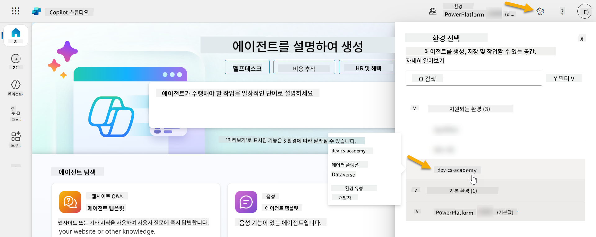

### 4.1 솔루션 퍼블리셔 생성

1. 이전 레슨에서 사용한 동일한 Copilot Studio 환경을 사용하여 Copilot Studio 왼쪽 메뉴에서 **점 세 개 아이콘(. . .)**을 선택합니다. **탐색(Explore)** 헤더 아래에서 **솔루션(Solutions)**을 선택합니다.

    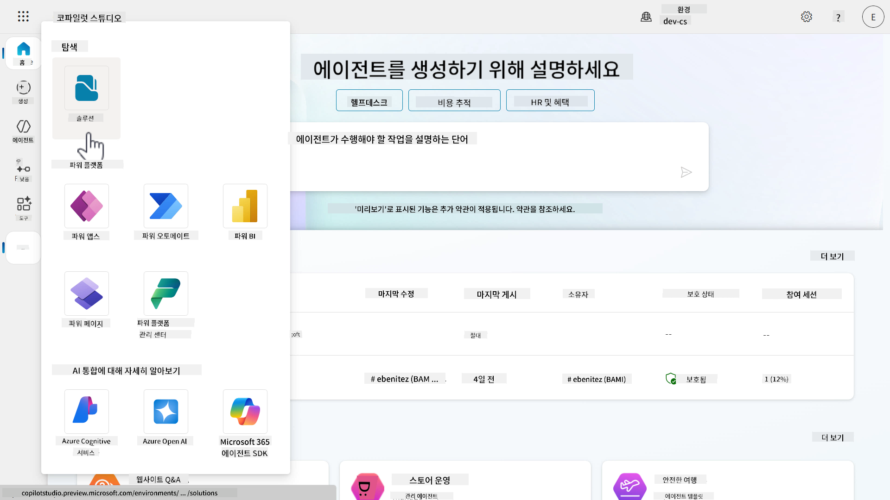

1. Copilot Studio의 **솔루션 탐색기(Solution Explorer)**가 로드됩니다. **+ 새 솔루션(New solution)**을 선택합니다.

    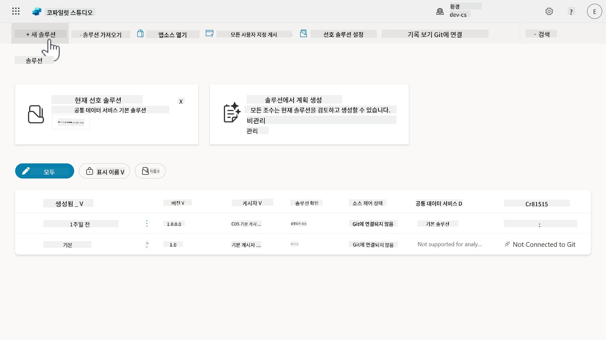

1. **새 솔루션(New solution)** 창이 나타나며, 여기에서 솔루션의 세부 정보를 정의할 수 있습니다. 먼저 새 퍼블리셔를 생성해야 합니다. **+ 새 퍼블리셔(New publisher)**를 선택합니다.

    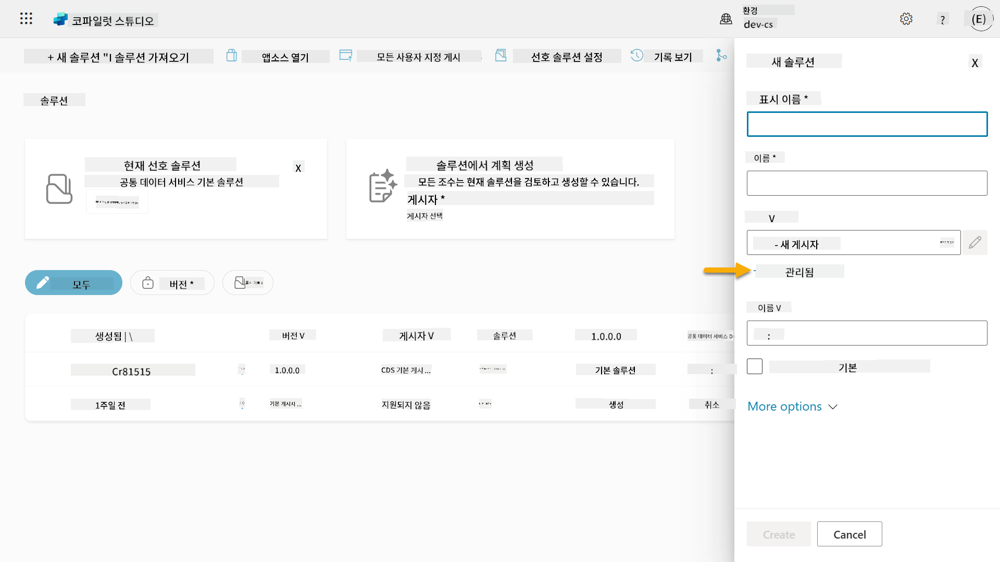  

1. **새 퍼블리셔(New publisher)** 창의 **속성(Properties)** 탭이 나타나며, 필수 및 비필수 필드를 채울 수 있습니다. 이곳에서 솔루션을 생성하거나 소유한 사람을 식별하는 레이블 또는 브랜드로 사용될 퍼블리셔의 세부 정보를 작성할 수 있습니다.

    | 속성    | 설명 | 필수 |
    | ---------- | ---------- | :----------: |
    | 표시 이름 | 퍼블리셔의 표시 이름 | 예   |
    | 이름  | 퍼블리셔의 고유 이름 및 스키마 이름  | 예    |
    | 설명   | 솔루션의 목적을 설명합니다.    | 아니오     |
    | 접두사    | 새로 생성된 구성 요소에 적용될 퍼블리셔 접두사   | 예      |
    | 선택 값 접두사   | 퍼블리셔 접두사를 기반으로 숫자를 생성합니다. 이 숫자는 선택 항목에 옵션을 추가할 때 사용되며, 어떤 솔루션이 옵션을 추가했는지 표시합니다.   | 예      |

    **표시 이름(Display name)**에 다음을 복사하여 붙여넣으세요,

    ```text
    Contoso Solutions
    ```

    **이름(Name)**에 다음을 복사하여 붙여넣으세요,

    ```text
    ContosoSolutions
    ```

    **설명(Description)**에 다음을 복사하여 붙여넣으세요,

    ```text
    Copilot Studio Agent Academy
    ```

    **접두사(Prefix)**에 다음을 복사하여 붙여넣으세요,

    ```text
    cts
    ```

    기본적으로 **선택 값(Choice value)** 접두사는 정수 값을 표시합니다. 이 정수 값을 가장 가까운 천 단위로 업데이트하세요. 예를 들어, 아래 스크린샷에서 처음에는 `77074`였습니다. 이를 `77074`에서 `77000`으로 업데이트하세요.

    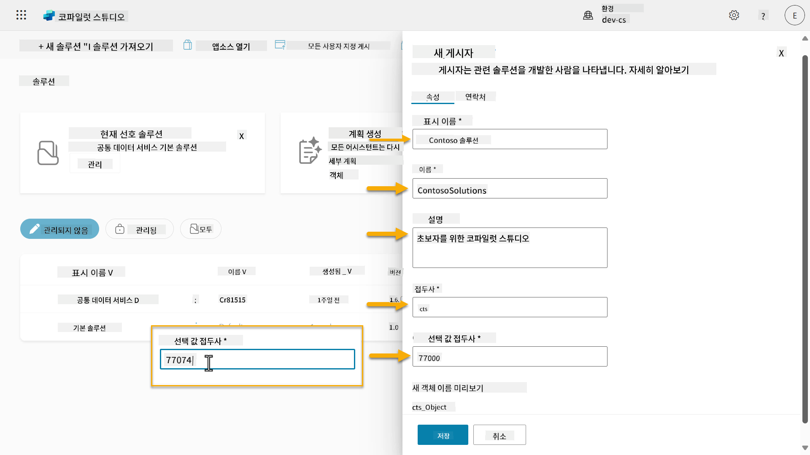  

1. 솔루션에 대한 연락처 정보를 제공하려면 **연락처(Contact)** 탭을 선택하고 표시된 열을 채우세요.

    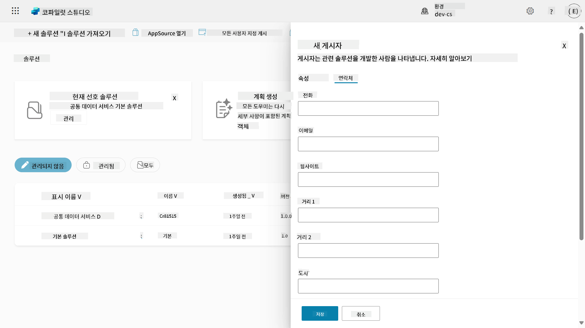

1. **속성(Properties)** 탭을 선택하고 **저장(Save)**을 눌러 퍼블리셔를 생성하세요.

    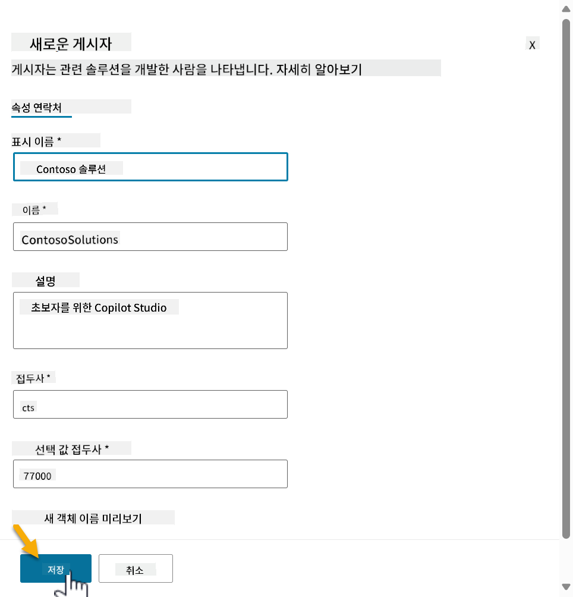
1. 새 게시자 창이 닫히고 새로 생성된 게시자가 선택된 상태로 **새 솔루션** 창으로 돌아갑니다.

    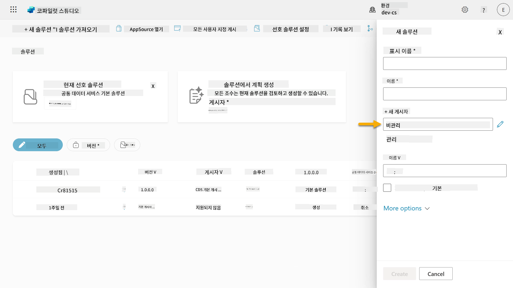  

잘했어요! 이제 솔루션 게시자를 만들었네요! 🙌🏻 다음으로 새로운 사용자 정의 솔루션을 만드는 방법을 배워보겠습니다.

### 4.2 새로운 솔루션 만들기

1. 이제 솔루션을 만들었으니, **새 솔루션** 창에서 나머지 양식을 작성할 수 있습니다.

    다음을 **표시 이름**으로 복사하여 붙여넣으세요,

    ```text
    Contoso Helpdesk Agent
    ```

    다음을 **이름**으로 복사하여 붙여넣으세요,

    ```text
    ContosoHelpdeskAgent
    ```

    새로운 솔루션을 만들고 있으므로, 기본적으로 [**버전** 번호](https://learn.microsoft.com/power-apps/maker/data-platform/update-solutions#understanding-version-numbers-for-updates/?WT.mc_id=power-172615-ebenitez)는 `1.0.0.0`입니다.

    **선호하는 솔루션으로 설정** 체크박스를 선택하세요.

    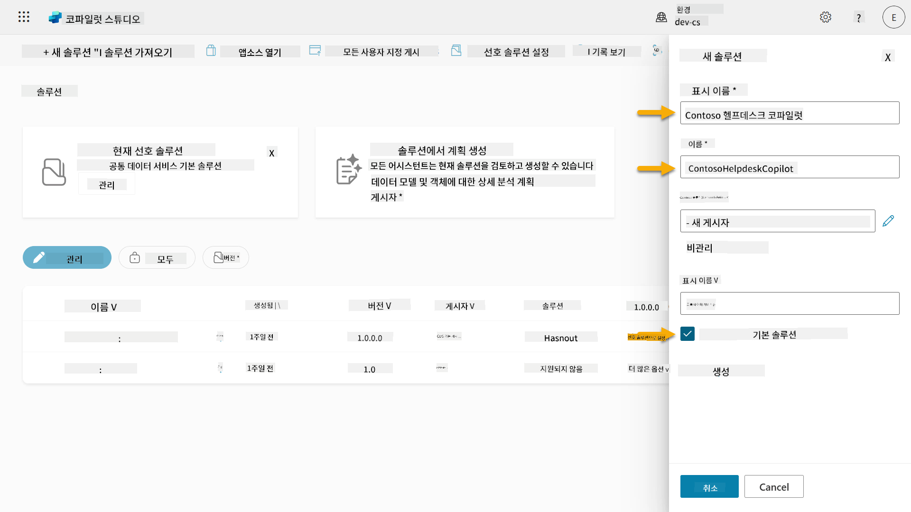  

1. **추가 옵션**을 확장하여 솔루션에 제공할 수 있는 추가 세부 정보를 확인하세요.

    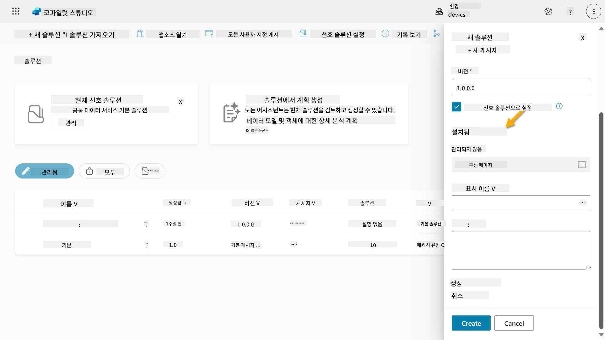

1. 다음을 확인할 수 있습니다,

    - **설치 날짜** - 솔루션이 설치된 날짜.

    - **구성 페이지** - 개발자가 HTML 웹 리소스를 설정하여 사용자들이 앱, 에이전트 또는 도구와 상호작용할 수 있도록 돕습니다. 정보 섹션에 웹 페이지로 나타나며 지침이나 버튼을 포함합니다. 주로 솔루션을 다른 사람들과 공유하는 회사나 개발자가 사용합니다.

    - **설명** - 솔루션 또는 구성 페이지에 대한 간략한 설명.

    이번 실습에서는 이 항목들을 비워둡니다.

    **생성**을 선택하세요.

    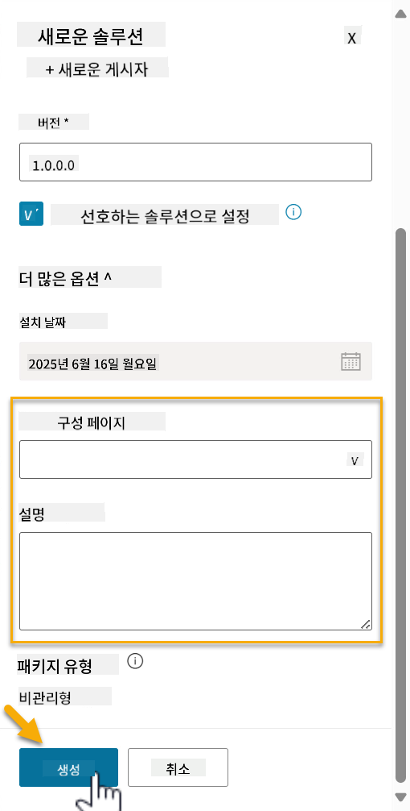

1. Contoso Helpdesk Agent 솔루션이 이제 생성되었습니다. Copilot Studio에서 에이전트를 생성하기 전까지는 구성 요소가 없습니다.

    **뒤로 화살표** 아이콘을 선택하여 솔루션 탐색기로 돌아갑니다.

    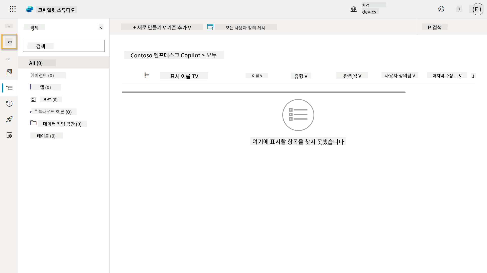

1. 이전에 **선호하는 솔루션으로 설정** 체크박스를 선택했기 때문에 Contoso Helpdesk Agent가 이제 **현재 선호하는 솔루션**으로 표시됩니다.

    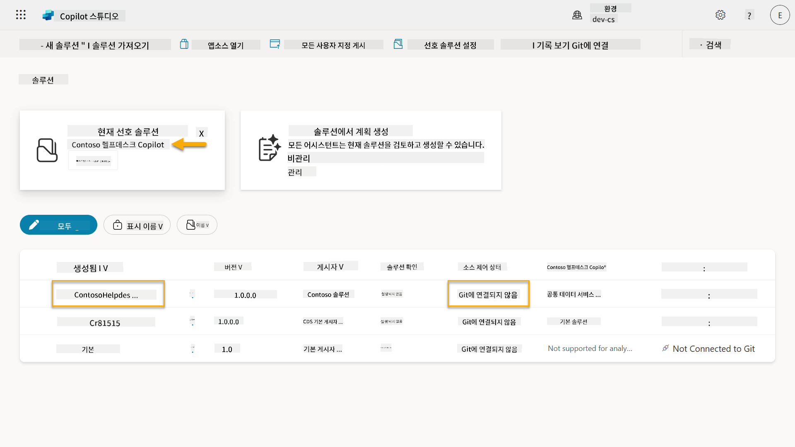

## ✅ 미션 완료

축하합니다! 👏🏻 게시자를 만들고 이를 사용하여 새로 생성된 솔루션에서 에이전트를 구축했습니다!

잘했어요, 에이전트 제작자님. 깔끔한 디지털 발자국은 규모에 맞는 운영 가능성을 위한 첫걸음입니다. 이제 지속 가능하고 기업 준비가 된 에이전트 개발을 위한 도구와 사고방식을 갖추셨습니다.

이것으로 **Lab 04 - 솔루션 만들기**가 끝났습니다. 아래 링크를 선택하여 다음 레슨으로 이동하세요. 이번 실습에서 생성한 솔루션은 다음 레슨의 실습에서 사용됩니다.

⏭️ [**사전 제작된 에이전트로 빠르게 시작하기** 레슨으로 이동](../05-using-prebuilt-agents/README.md)

## 📚 전술적 자료

🔗 [솔루션 만들기](https://learn.microsoft.com/power-apps/maker/data-platform/create-solution/?WT.mc_id=power-172615-ebenitez)

🔗 [Copilot Studio에서 솔루션 생성 및 관리](https://learn.microsoft.com/microsoft-copilot-studio/authoring-solutions-overview/?WT.mc_id=power-172615-ebenitez)

🔗 [다른 사용자와 에이전트 공유](https://learn.microsoft.com/microsoft-copilot-studio/admin-share-bots/?WT.mc_id=power-172615-ebenitez)

🔗 [미리 정의된 보안 역할에 사용 가능한 리소스 요약](https://learn.microsoft.com/power-platform/admin/database-security#summary-of-resources-available-to-predefined-security-roles/?WT.mc_id=power-172615-ebenitez)

🔗 [솔루션 업그레이드 또는 업데이트](https://learn.microsoft.com/power-apps/maker/data-platform/update-solutions/?WT.mc_id=power-172615-ebenitez)

🔗 [Power Platform의 파이프라인 개요](https://learn.microsoft.com/power-platform/alm/pipelines/?WT.mc_id=power-172615-ebenitez)

🔗 [Power Platform의 Git 통합 개요](https://learn.microsoft.com/power-platform/alm/git-integration/overview/?WT.mc_id=power-172615-ebenitez)


---

**면책 조항**:  
이 문서는 AI 번역 서비스 [Co-op Translator](https://github.com/Azure/co-op-translator)를 사용하여 번역되었습니다. 정확성을 위해 노력하고 있지만, 자동 번역에는 오류나 부정확성이 포함될 수 있습니다. 원본 문서의 원어 버전을 권위 있는 출처로 간주해야 합니다. 중요한 정보의 경우, 전문적인 인간 번역을 권장합니다. 이 번역 사용으로 인해 발생하는 오해나 잘못된 해석에 대해 책임지지 않습니다.