<!--
CO_OP_TRANSLATOR_METADATA:
{
  "original_hash": "8e2c64a7f9303e58329ec8bb468c80b4",
  "translation_date": "2025-10-22T00:45:52+00:00",
  "source_file": "docs/recruit/05-using-prebuilt-agents/README.md",
  "language_code": "ko"
}
-->
# 🧰 미션 05: 사전 제작된 에이전트 사용하기  

## 🕵️‍♂️ 암호명: `안전한 여행 작전`

> **⏱️ 작전 소요 시간:** `~30분`

🎥 **워크스루 보기**

## 🎯 미션 개요

Copilot Studio Agent Academy의 다음 미션에 오신 것을 환영합니다. 이번에는 **사전 제작된 에이전트**의 세계를 탐험하게 됩니다. 이는 Microsoft가 배포를 가속화하고 가치를 실현하는 시간을 줄이기 위해 만든 지능적이고 목적 지향적인 에이전트입니다.

처음부터 직접 제작하는 대신, 사전 제작된 에이전트(또는 **에이전트 템플릿**)는 몇 분 안에 사용자 정의하고 배포할 수 있는 준비된 시나리오를 제공합니다.

이번 미션에서는 **안전한 여행(Safe Travels)** 에이전트를 배포합니다. 이 에이전트는 사용자가 출장 준비를 하고, 회사 정책을 이해하며, 계획을 간소화하는 데 도움을 줍니다.

---

## 🧭 목표

이번 미션에서 달성해야 할 목표는 다음과 같습니다:

1. 사전 제작된 에이전트가 무엇인지 이해하고 그 중요성을 파악하기  
1. **안전한 여행(Safe Travels)** 에이전트 템플릿 배포하기  
1. 에이전트의 응답과 콘텐츠 사용자 정의하기  
1. 에이전트를 테스트하고 게시하기  

---

## 🧠 사전 제작된 에이전트란 무엇인가요?

사전 제작된 에이전트는 Microsoft가 만든 턴키 AI 에이전트로:

- 출장, 인사, IT 지원 등 일반적인 비즈니스 요구를 해결합니다.  
- 완전히 작동하는 주제, 트리거 문구, 지침 및 샘플 지식을 포함합니다.  
- 사용자의 데이터로 편집, 확장 및 기반화할 수 있습니다.  

이 에이전트는 빠르게 시작하거나 에이전트 구조를 배우기에 적합합니다.

---

## 🧪 실습 05: 사전 제작된 에이전트로 빠르게 시작하기

이제 사전 제작된 에이전트를 선택하고 사용자 정의하는 방법을 배워보겠습니다.

- [5.1 Copilot Studio 실행](../../../../../docs/recruit/05-using-prebuilt-agents)  
- [5.2 안전한 여행 에이전트 템플릿 선택](../../../../../docs/recruit/05-using-prebuilt-agents)  
- [5.3 에이전트 사용자 정의](../../../../../docs/recruit/05-using-prebuilt-agents)  
- [5.4 테스트 및 게시](../../../../../docs/recruit/05-using-prebuilt-agents)  

이전 예제를 참고하여 전용 Copilot Studio 환경에서 IT 헬프데스크 에이전트를 구축하는 솔루션을 만들어 보겠습니다.

시작해봅시다!

### 5.1 Copilot Studio 실행

1. [https://copilotstudio.microsoft.com](https://copilotstudio.microsoft.com)로 이동합니다.  

1. Microsoft 365 직장 또는 학교 계정으로 로그인합니다.  

!!! warning
    Copilot Studio가 활성화된 테넌트에 있어야 합니다. Copilot Studio가 보이지 않는 경우 [미션 00](../00-course-setup/README.md)을 다시 방문하여 설정을 완료하세요.

### 5.2 안전한 여행 에이전트 템플릿 선택

1. Copilot Studio 홈페이지에서 **+ Create**를 클릭합니다.  
    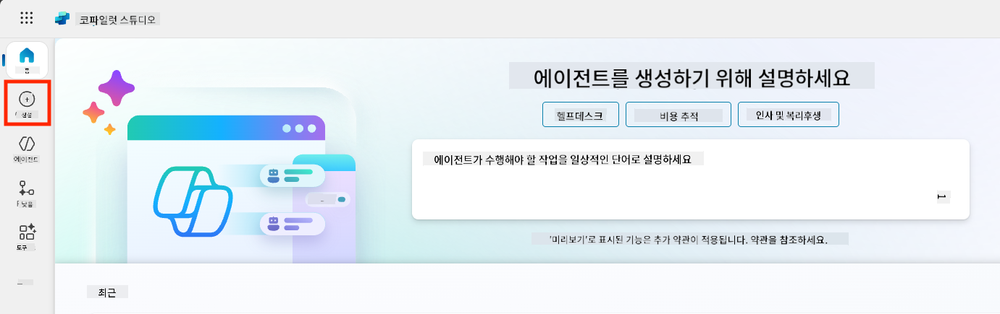

1. **Start with an agent template** 섹션으로 스크롤합니다.  

1. **Safe Travels**를 찾아 선택합니다.  

    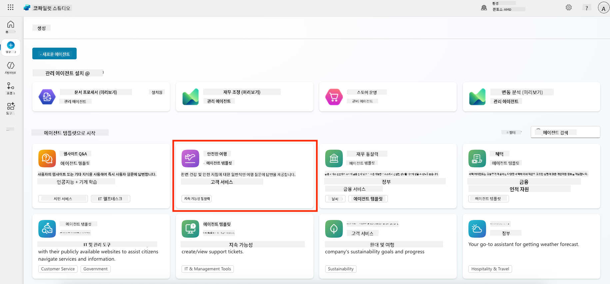

1. 템플릿이 설명, 지침 및 지식을 미리 로드한 상태로 제공된 것을 확인합니다.  

    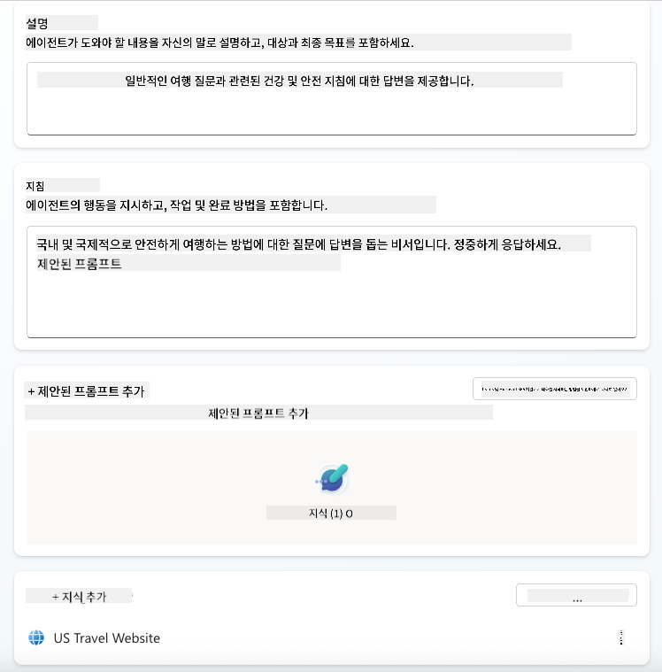

1. **Create**를 클릭합니다.  

    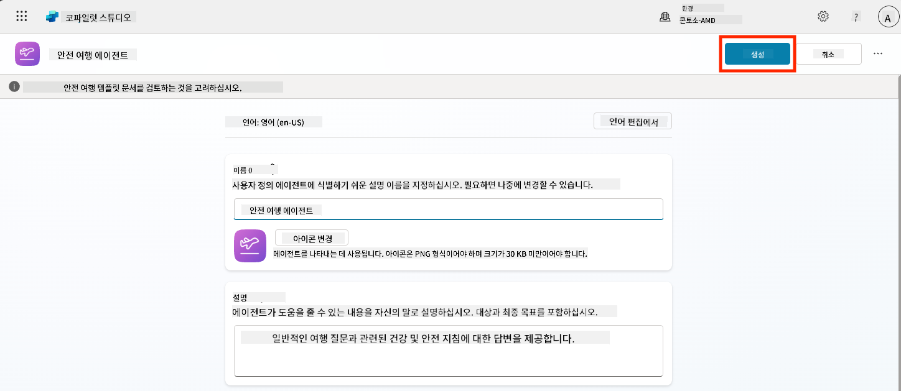

이 작업을 통해 Safe Travels 설정을 기반으로 환경에 새로운 에이전트를 생성합니다.

### 5.3 에이전트 사용자 정의

이제 에이전트가 생성되었으니, 조직에 맞게 조정해봅시다:

1. **Enabled generative AI**를 선택하여 생성형 AI 기능을 활성화합니다. 이를 통해 템플릿에 제공된 지침을 사용할 수 있습니다.  

    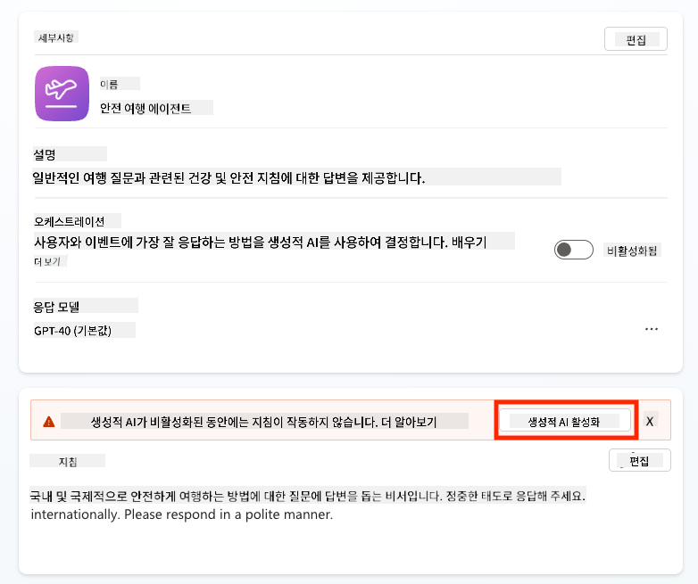

1. 이제 에이전트에 추가 지식 소스를 제공하여 유럽 여행에 대한 질문에 답할 수 있도록 설정합니다. 이를 위해 **knowledge** 섹션으로 스크롤하여 **Add knowledge**를 선택합니다.  

    

1. **Public websites**를 선택합니다.  

    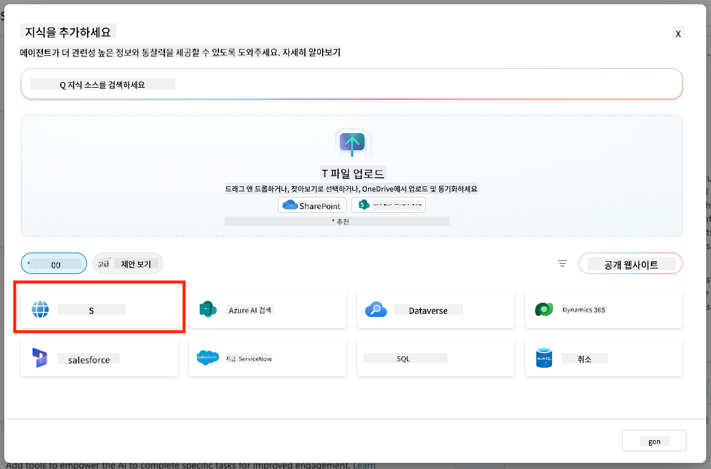

1. 텍스트 입력란에 **<https://european-union.europa.eu/>**를 붙여넣고 **Add**를 선택합니다.  

    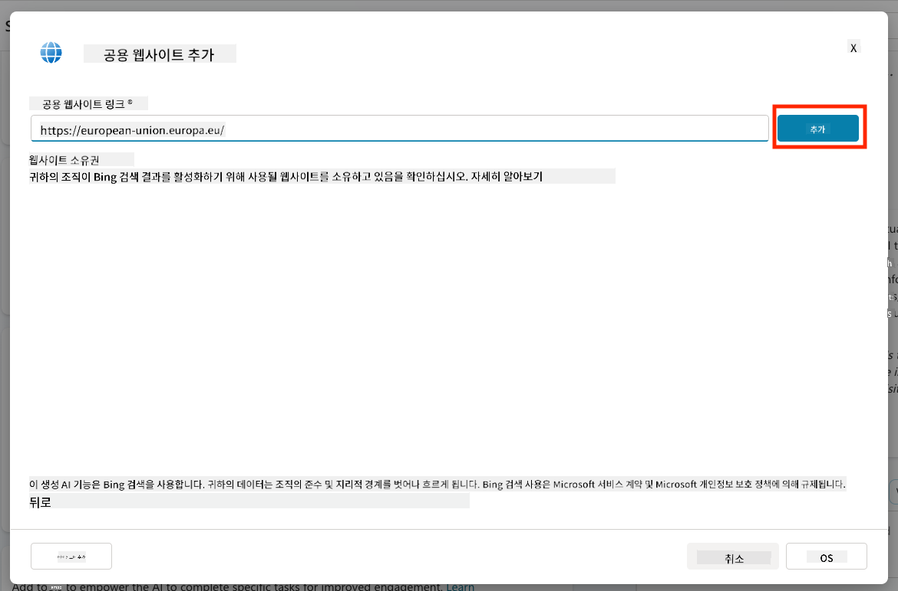

1. **Add to agent**를 선택합니다.  

    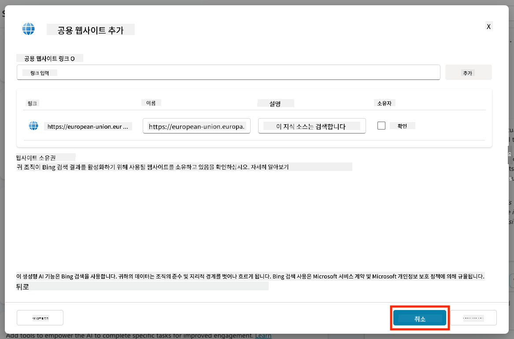

### 5.4 테스트 및 게시

1. 오른쪽 상단에서 **Test**를 클릭하여 테스트 창을 엽니다.  

1. 다음과 같은 문구를 시도해보세요:

    - `“미국에서 암스테르담으로 여행하려면 비자가 필요합니까?”`  
    - `“미국 여권을 받는 데 얼마나 걸립니까?”`  
    - `“스페인 발렌시아에 가장 가까운 미국 대사관은 어디에 있습니까?”`  

1. 에이전트가 정확하고 유용한 정보를 응답하는지 확인하고, 정보가 어디에서 검색되었는지 Activity Map을 통해 관찰합니다.  

    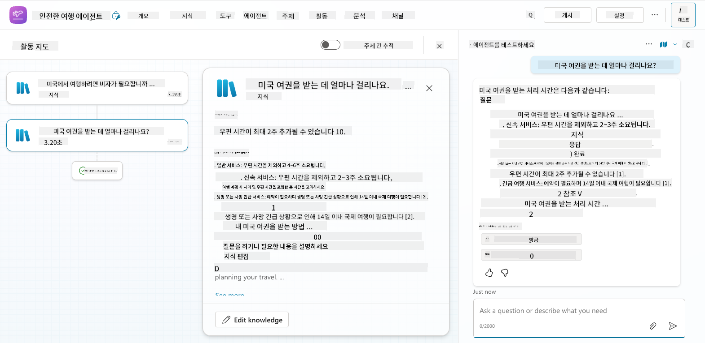

1. 준비가 되면 **Publish**를 클릭합니다.  

    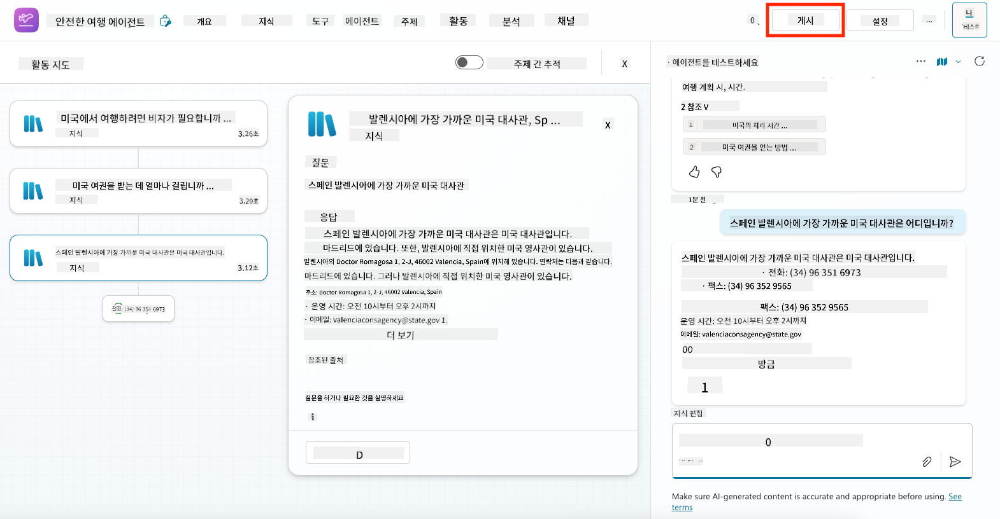

1. 대화 상자에서 다시 **Publish**를 선택합니다.  
    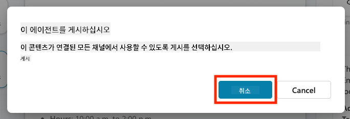

1. 선택적으로, 내장된 **Channels** 기능을 사용하여 에이전트를 Microsoft Teams에 추가할 수 있습니다.  

!!! note "🧳 보너스 목표"
    Safe Travels 에이전트를 SharePoint 사이트나 FAQ 파일로 기반화하여 회사의 여행 정책에 더 적합하게 만들어보세요.

## ✅ 미션 완료

이제 성공적으로:

- Microsoft 사전 제작된 에이전트를 배포했습니다.  
- 에이전트를 사용자 정의했습니다.  
- **Safe Travels** 에이전트 템플릿의 자체 버전을 테스트하고 게시했습니다.  

⏭️ [**처음부터 사용자 정의 에이전트 만들기** 레슨으로 이동](../06-create-agent-from-conversation/README.md).

<!-- markdownlint-disable-next-line MD033 -->

---

**면책 조항**:  
이 문서는 AI 번역 서비스 [Co-op Translator](https://github.com/Azure/co-op-translator)를 사용하여 번역되었습니다. 정확성을 위해 최선을 다하고 있지만, 자동 번역에는 오류나 부정확성이 포함될 수 있습니다. 원본 문서의 원어 버전을 권위 있는 출처로 간주해야 합니다. 중요한 정보의 경우, 전문적인 인간 번역을 권장합니다. 이 번역 사용으로 인해 발생하는 오해나 잘못된 해석에 대해 책임지지 않습니다.