<!--
CO_OP_TRANSLATOR_METADATA:
{
  "original_hash": "180f9cc0b40527f61be092c9b0f72aba",
  "translation_date": "2025-10-22T00:36:30+00:00",
  "source_file": "docs/recruit/06-create-agent-from-conversation/README.md",
  "language_code": "ko"
}
-->
# 🚨 미션 06: Copilot을 사용하여 자연어로 맞춤형 에이전트 생성 및 데이터 기반 설정

## 🕵️‍♂️ 코드명: `OPERATION AGENT FORGE`

> **⏱️ 작전 시간:** `~75분`

🎥 **워크스루 보기**

[](https://www.youtube.com/watch?v=qZTtQVncGFg "YouTube에서 워크스루 보기")

## 🎯 미션 브리프

다시 만나서 반갑습니다, 에이전트 메이커. 이번 미션에서는 Copilot Studio의 가장 강력한 기능인 자연어만을 사용하여 맞춤형 에이전트를 처음부터 생성하고, 이를 여러분의 데이터로 강화하는 작업을 수행하게 됩니다.

이것은 단순한 챗봇이 아닙니다. 여러분은 실제 기업 정보를 바탕으로 추론하고, 응답하며, 참조할 수 있는 지식 기반 디지털 동료를 만드는 것입니다.

여러분의 무기는 자연어입니다. 여러분의 미션은? SharePoint, 업로드된 파일, 또는 회사 URL을 사용하여 IT 관련 질문에 답변하는 완전히 맞춤화된 헬프데스크 에이전트를 설계, 훈련, 테스트하는 것입니다.

지금부터 여러분의 에이전트를 처음부터 만들어 봅시다.

## 🔎 목표

이번 미션에서 여러분은 다음을 배우게 됩니다:

1. 맞춤형 에이전트가 무엇인지 이해하고, 사전 제작된 템플릿과 어떻게 다른지 알아보기
1. Copilot을 사용하여 자연어 프롬프트와 대화형 디자인으로 에이전트 생성하기
1. SharePoint, 문서, 웹사이트 등 기업 지식 소스를 활용하여 에이전트를 기반 설정하기
1. 생성적 오케스트레이션에 대해 배우고, 에이전트가 여러 데이터 소스를 동적으로 검색하고 응답하는 방법 이해하기
1. 여러분의 데이터를 사용하여 질문에 답변할 수 있는 완전히 기능적인 IT 헬프데스크 에이전트를 구축하고 테스트하기

## 🤔 _맞춤형_ 에이전트란 무엇인가요?

맞춤형 에이전트는 Copilot Studio에서 여러분이 직접 설계하고 생성하여 특정 작업이나 질문에 대해 사용자들을 도울 수 있는 챗봇 또는 가상 비서입니다. 맞춤형이라고 불리는 이유는 다음과 같습니다:

- **목적을 결정합니다** - 사용자들이 휴가를 요청하거나, 주문 상태를 확인하거나, IT 관련 질문에 도움을 제공하도록 설정합니다.
- **대화를 정의합니다** - 에이전트가 말하는 내용과 응답 방식.
- **자신의 데이터를 기반으로 설정합니다** - 내장된 지원 지식 리소스를 통해 기업 데이터를 연결합니다.
- **자신의 시스템 또는 애플리케이션에 연결합니다** - 커넥터, 플로우, REST API 및 모델 컨텍스트 프로토콜 서버를 선택합니다.

!!! note
    이렇게 생각해 보세요: 여러분은 사용자들과 대화하며 질문에 답변하고, 프로세스에 필요한 정보를 수집하거나 기업 데이터에 연결할 수 있는 디지털 도우미를 만드는 것입니다.

### 🤖 맞춤형 에이전트가 할 수 있는 일은 무엇인가요?

맞춤형 에이전트는 다음을 수행할 수 있습니다:

- 이름, 날짜, 선호도와 같은 정보를 사용자에게 요청합니다.
- 해당 정보를 데이터베이스나 테이블에 저장합니다.
- 질문에 따라 데이터를 조회하고 답변합니다.
- 사용자와 직접 상호작용하지 않고도 자율적으로 작업합니다.
- 이메일을 보내거나 기록을 생성하는 등의 작업을 사용자 상호작용을 통해 또는 자율적으로 트리거합니다.

### 👩🏻‍💻 왜 맞춤형 에이전트를 사용해야 하나요?

- 반복적인 작업을 자동화하여 시간을 절약합니다.
- 사용자들에게 친근하고 안내적인 경험을 제공합니다.
- 비즈니스 또는 프로젝트 요구사항에 맞게 조정할 수 있습니다.

### ✨ 예시

여러분은 직원들이 휴가를 요청할 수 있도록 돕는 맞춤형 에이전트를 만듭니다.

에이전트는 직원의 이름, 휴가 시작 날짜, 휴가 종료 날짜, 그리고 매니저의 이름을 요청한 후, 휴가 요청을 관리하는 지정된 시스템(예: SharePoint 리스트)에 정보를 저장합니다.

이제 직원들은 SharePoint 리스트로 이동하여 새 항목을 생성하는 대신 에이전트와 채팅만 하면 됩니다.

## 🗣️ 자연어를 사용하여 에이전트 생성하기

이전에 [Lesson 05 - 사전 제작된 에이전트를 사용하여 빠르게 시작하기](../05-using-prebuilt-agents/README.md)에서 Copilot Studio에서 사전 제작된 에이전트 템플릿을 사용하여 에이전트를 빠르게 생성하는 방법을 배웠습니다. 이번 레슨에서는 Copilot과의 대화형 생성 경험을 깊이 탐구할 것입니다. Copilot Studio는 Copilot과 대화하듯이 에이전트를 쉽게 생성할 수 있도록 도와줍니다.

Copilot Studio에서는 에이전트를 생성하기 위해 코드를 작성할 필요가 없습니다. 대신, 여러분이 원하는 에이전트의 작업을 평범한 언어로 설명하면 Copilot이 단계별로 대화형 경험을 통해 이를 구축하는 데 도움을 줍니다.

## 🌱 "내가 원하는 것을 설명하는 것"이 처음인데, 어떻게 해야 하나요?

자연어로 맞춤형 에이전트를 생성하는 것은 여러분에게 새로운 개념일 수 있습니다. Microsoft 제품 및 서비스 전반에서 Copilot을 사용할 때, 여러분은 _프롬프트_ 형태로 자연어를 사용하고 있습니다.

프롬프트는 AI 에이전트에게 원하는 작업을 지시하는 메시지 또는 명령입니다. 이를 비서에게 지시를 내리는 것처럼 생각해 보세요. 지시가 명확할수록 비서가 이를 이해하고 실행하기 쉬워집니다.

### 🪄 프롬프트가 중요한 이유

- 에이전트의 행동을 안내합니다.
- 에이전트가 어떤 대화를 해야 할지 이해하도록 돕습니다.
- 좋은 프롬프트는 에이전트를 더 유용하고 정확하게 만듭니다.

### 📝 좋은 프롬프트 작성 팁

- 명확하고 구체적으로 작성하세요 - 에이전트가 해야 할 일을 정확히 말하세요.
- 사용자처럼 생각하세요 - 사용자가 무엇을 말할까요? 에이전트는 어떻게 답변해야 할까요?
- 예제를 포함하세요 - 가능하다면 샘플 상호작용을 제공하세요.

### ✨ 예시

HR 팀이 휴가 요청을 돕는 에이전트를 필요로 한다고 가정해 봅시다.

프롬프트는 다음과 같을 수 있습니다:

    “사용자가 휴가 요청을 제출할 수 있도록 돕는 에이전트를 만들고 싶습니다. 사용자가 휴가를 요청하고 싶다고 말하면, 에이전트는 이름, 휴가 시작 날짜, 휴가 종료 날짜, 그리고 매니저의 이름을 요청해야 합니다. 사용자가 이 정보를 제공하면, 에이전트는 이를 ‘Vacation Requests’라는 SharePoint 리스트에 저장하고, 전용 Microsoft Teams 채널에 알림을 게시해야 합니다.”

이 프롬프트가 효과적인 이유:

- **목표를 명확히 제시** - 휴가 요청 제출
- **사용자 상호작용을 설명** - 사용자가 말하는 내용과 에이전트가 요청해야 할 내용
- **필요한 데이터를 나열** - 이름, 시작 날짜, 종료 날짜, 매니저
- **데이터가 저장될 위치를 언급** - Vacation Requests라는 SharePoint 리스트

## 🔮 에이전트를 생성했는데... 다음으로 어떻게 지식을 기반으로 설정하나요?

Copilot Studio에서 지식 소스는 에이전트가 더 나은 답변을 제공하기 위해 정보를 찾을 수 있는 장소입니다. 이러한 소스를 추가하면 여러분의 에이전트가 Power Platform, Dynamics 365, 웹사이트 및 회사에서 사용하는 기타 시스템 또는 서비스와 같은 곳에서 기업 데이터를 가져올 수 있습니다.

이러한 소스는 AI와 함께 작동하여 에이전트가 사용자 질문에 더 정확하게 응답할 수 있도록 돕습니다. 이는 **생성적 오케스트레이션**으로 알려진 과정을 통해 이루어집니다.

### 🌿 에이전트의 생성적 오케스트레이션이란 무엇인가요?

생성적 오케스트레이션은 에이전트가 내장된 언어 기술과 추가된 지식 소스의 정보를 결합하여 질문에 답변하는 방법을 동적으로 결정하는 것을 의미합니다.

사용자가 질문을 하면, 에이전트는:

- AI를 사용하여 질문을 이해합니다.
- 즉석에서 질문을 생성하여 누락된 정보를 사용자에게 요청할 수 있습니다.
- 가장 관련성이 높은 지식 소스를 선택합니다.
- 해당 소스를 검색하여 답변을 찾습니다.
- 찾은 정보를 사용하여 자연스럽고 유용한 답변을 생성합니다.

### 🏦 지식 소스가 중요한 이유는 무엇인가요?

1. **더 스마트한 답변** - 지식 소스를 추가하면 에이전트가 조직의 실제 데이터를 사용하여 더 나은, 더 정확한 답변을 제공할 수 있습니다.

1. **수작업 감소** - 모든 가능한 응답을 작성할 필요가 없습니다. 에이전트가 추가된 소스를 검색하고 자동으로 응답할 수 있습니다.

1. **신뢰할 수 있는 정보 사용** - 에이전트가 Dataverse, SharePoint 또는 회사 웹사이트와 같은 시스템에서 답변을 가져올 수 있으므로 사용자는 신뢰할 수 있는 정보 출처에서 정보를 얻을 수 있습니다.

1. **생성적 AI와 함께 작동** - 지식 소스와 AI는 에이전트가 질문을 이해하고 자연스럽게 응답할 수 있도록 돕습니다. 이는 질문이 미리 프로그래밍되지 않았거나 시작 프롬프트로 추가되지 않은 경우에도 가능합니다.

1. **유연하고 확장 가능** - 설정 중 또는 이후에 언제든지 지식 소스를 추가할 수 있으며, 필요에 따라 에이전트가 더 스마트해집니다.

### ✨ 예시

여러분이 직원들의 HR 질문을 돕기 위해 에이전트를 만든다고 가정해 봅시다. 회사의 HR 정책 문서와 SharePoint 사이트를 지식 소스로 추가합니다.

직원이 _“내가 받을 수 있는 휴가 일수는 몇 일인가요?”_라고 질문하면, 에이전트는 생성적 오케스트레이션을 사용하여 해당 소스를 검색하고, 올바른 정책을 찾아 수동으로 답변을 작성하지 않아도 정확한 정보를 제공합니다. 이는 직원들이 자신의 권리에 대해 질문할 수 있는 모든 가능성을 고려할 필요 없이 시간을 절약해 줍니다.

## 추가할 수 있는 지식 소스 유형

1. **공개 웹사이트**
    - **기능:** Bing을 사용하여 특정 웹사이트(예: 회사 웹사이트)를 검색합니다.
    - **유용성:** FAQ나 제품 세부 정보와 같은 공개 정보 가져오기에 적합합니다.

1. **문서**
    - **기능:** PDF 또는 Word 파일과 같은 문서를 에이전트에 직접 업로드합니다. 업로드된 파일은 Dataverse에 안전하게 저장됩니다.
    - **유용성:** 내부 가이드, 매뉴얼 또는 정책을 기반으로 질문에 답변할 수 있도록 합니다.

1. **SharePoint**
    - **기능:** Microsoft Graph Search를 사용하여 SharePoint 폴더 또는 파일에 연결합니다.
    - **유용성:** SharePoint에 저장된 팀 문서, HR 정책 또는 프로젝트 파일에 액세스하는 데 이상적입니다.

1. **Dataverse**
    - **기능:** Dataverse 환경 테이블 및 행에서 구조화된 데이터를 사용하며, 테이블 및 열에 대한 동의어와 용어집 정의를 적용하여 에이전트 응답을 개선할 수 있습니다.
    - **유용성:** Dataverse에 저장된 고객 정보와 같은 기업 데이터를 조회해야 할 때 유용합니다.

1. **실시간 지식 커넥터**
    - **기능:** Salesforce, ServiceNow, Dynamics 365, AzureSQL, Databricks 등과 같은 다른 기업 시스템에서 사용자 권한을 사용하여 대화 중 실시간 데이터를 에이전트가 액세스할 수 있도록 합니다.
    - **유용성:** 데이터를 저장하거나 복제하지 않고 최신, 안전하고 정확한 응답을 제공하여 에이전트를 더 스마트하고 안전하게 만듭니다.

1. **Azure AI Search**
    - **기능:** 사용자 질문을 이해하기 위해 의미적 및 벡터 검색을 사용하여 Azure에 저장된 대량의 문서를 검색할 수 있습니다.
    - **유용성:** 복잡한 데이터 소스에서 정확하고 신뢰할 수 있는 답변을 제공하며, 인용을 지원하고 대규모 문서 컬렉션에 대해 잘 확장되며 안전한 액세스 제어를 제공합니다.

## 🔒 보안 관련 주의사항

### 지식 소스 인증

SharePoint 및 Dataverse와 같은 일부 소스는 사용자 인증이 필요합니다. 이는 에이전트가 사용자에게 허용된 데이터만 응답에 참조하도록 한다는 것을 의미합니다. 반면, Azure AI Search와 같은 다른 소스는 에이전트가 연결할 수 있도록 Azure 계정 및 인증 유형 지정과 같은 추가 구성이 필요할 수 있습니다.

## Copilot Studio에서 에이전트 응답 개선하기

대화형 생성 경험에서 에이전트가 프로비저닝된 후, 여러분은 Copilot이 프롬프트에서 생성한 지침에 따라 에이전트를 테스트해야 합니다. Copilot Studio에서 에이전트의 응답을 개선하는 것은 에이전트가 여러분의 목표를 명확히 이해하고 작업할 올바른 정보를 가지고 있는지 확인하는 것입니다.

1. **에이전트 지침을 세분화하세요** - 에이전트가 어떻게 행동해야 하는지 명확하고 구체적으로 지시합니다.

    예를 들어:

    ✅ “친근한 고객 지원 에이전트처럼 행동하며 간단하게 설명하세요.”

    ❌ “도움이 되세요.” (너무 모호함)

1. **톤과 언어를 확인하세요** - 에이전트의 톤이 대상 사용자와 일치하는지 확인하세요.

    다음과 같이 설정할 수 있습니다:

    - 친근하고 캐주얼한 톤.
    - 전문적이고 간결한 톤.
    - 지원적이고 인내심 있는 톤.

1. **지식 소스를 추가하거나 업데이트하세요** - 에이전트가 특정 주제에 대한 질문에 답변해야 하는 경우, 올바른 정보에 액세스할 수 있도록 하세요.

    - 웹사이트, 문서 또는 FAQ 링크를 추가하세요.
    - 콘텐츠를 최신 상태로 유지하세요.
    - 명확하고 잘 구조화된 정보를 사용하세요.

1. **주제와 트리거 사용** - 에이전트가 특정 작업이나 대화를 처리해야 하는 경우, 트리거 문구가 포함된 주제를 생성할 수 있습니다. 이는 대화를 더 정확하게 안내하는 데 도움이 됩니다. 다음 레슨에서 이에 대해 더 배울 것입니다.

1. **실제 질문으로 테스트하세요** - 사용자가 할 수 있는 질문 유형을 에이전트에게 시도해 보세요.

    답변이 좋지 않다면:

    - 시스템 지침을 조정하세요.
    - 더 많은 예제나 지식을 추가하세요.
    - 질문을 다시 표현하여 에이전트가 어떻게 응답하는지 확인하세요.

1. **검토 및 반복** - 에이전트를 개선하는 것은 지속적인 과정입니다!

    게시 후:

    - 사용자로부터 피드백을 수집하세요.
    - 일반적인 질문이나 혼란을 관찰하세요.
    - 에이전트 설정을 계속 개선하세요.

## 🧪 실습 06: Copilot Studio에서 맞춤형 에이전트 생성하기

이제 여러분의 데이터를 기반으로 대화할 수 있는 맞춤형 에이전트를 생성하는 방법을 배워보겠습니다.

- [6.1 Copilot을 사용하여 자연어로 에이전트 생성하기](../../../../../docs/recruit/06-create-agent-from-conversation)
- [6.2 SharePoint 사이트를 사용하여 내부 지식 소스 추가하기](../../../../../docs/recruit/06-create-agent-from-conversation)
- [6.3 문서를 업로드하여 내부 지식 소스 추가하기](../../../../../docs/recruit/06-create-agent-from-conversation)
- [6.4 에이전트 테스트하기](../../../../../docs/recruit/06-create-agent-from-conversation)

### ✨ 사용 사례
우리는 [Lesson 03 - Microsoft 365 Copilot을 위한 선언적 에이전트 생성](../03-create-a-declarative-agent-for-M365Copilot/README.md#use-case-scenario)에서 동일한 사용 사례를 사용할 것입니다.

**직원으로서**

**IT 헬프데스크 에이전트로부터** 장치 문제, 네트워크 문제 해결, 프린터 설정과 같은 문제에 대해 빠르고 정확한 도움을 받고 싶습니다.

**그래서** 생산성을 유지하고 기술적 문제를 지체 없이 해결할 수 있기를 바랍니다.

시작해봅시다!

### ✨ 사전 준비 사항

- **SharePoint 사이트**

[Lesson 00 - 과정 설정 - Step 3: 새로운 SharePoint 사이트 생성](../00-course-setup/README.md#step-4-create-new-sharepoint-site)에서 **Contoso IT** SharePoint 사이트를 사용할 것입니다.

**Contoso IT** SharePoint 사이트를 설정하지 않았다면, [Lesson 00 - 과정 설정 - Step 3: 새로운 SharePoint 사이트 생성](../00-course-setup/README.md#step-4-create-new-sharepoint-site)으로 돌아가세요.

- **솔루션**

[Lesson 04 - 에이전트를 위한 솔루션 생성](../04-creating-a-solution/README.md#41-create-a-solution-publisher)에서 **Contoso Helpdesk Agent** 솔루션을 사용할 것입니다.

**Contoso Agent** 솔루션을 설정하지 않았다면, [Lesson 04 - 에이전트를 위한 솔루션 생성](../04-creating-a-solution/README.md#41-create-a-solution-publisher)으로 돌아가세요.

### 6.1 Copilot을 사용하여 자연어로 에이전트 생성하기

!!! warning "Copilot 질문은 세션마다 다를 수 있습니다"

    Copilot의 대화형 생성 경험은 매번 다를 수 있으며, 제공되는 안내 질문이 이전과 약간 다를 수 있습니다.

1. Copilot Studio의 홈 페이지로 이동하여 IT 헬프데스크 에이전트를 설명하는 다음 프롬프트를 입력하세요. 프롬프트에는 에이전트의 목표, 컨텍스트, 예상 작업 및 에이전트 응답 형식이 포함됩니다.

    ```text
    You are an IT help desk agent. Your goal is to assist users with their IT issues. You can access information from our company's knowledge base at https://support.microsoft.com/en-us. Your responses should be polite and helpful. If a user reports a slow computer, ask about the age of the device, current software versions, and if they've recently installed any new programs. If a user is experiencing trouble logging into their email, guide them through password reset procedures. You should be concise and informative, using step-by-step instructions with bullet points when appropriate.
    ```

      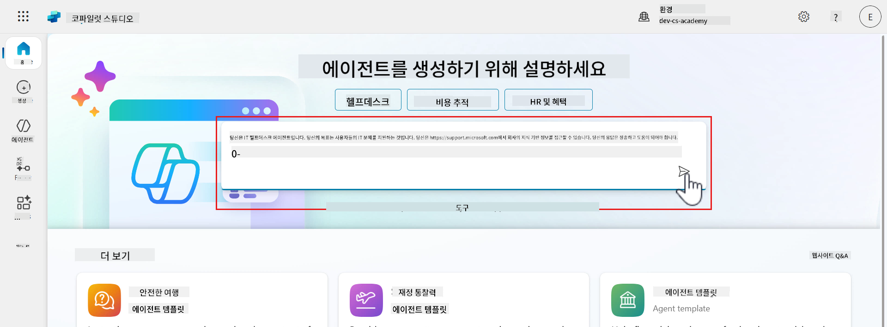

1. Copilot의 대화형 생성 경험이 로드됩니다. Copilot이 응답을 준비 중인 것을 볼 수 있습니다.

      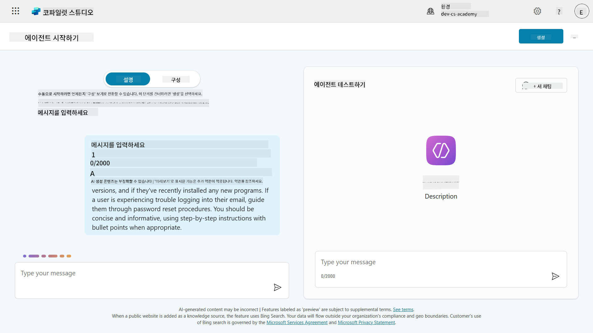

1. Copilot이 제공된 지침에 따라 에이전트를 설정했음을 확인하고 에이전트 이름에 대한 확인을 요청합니다. 우리는 에이전트 이름을 다음과 같이 지정할 것입니다.

       ```text
       Contoso Helpdesk Agent
       ```

      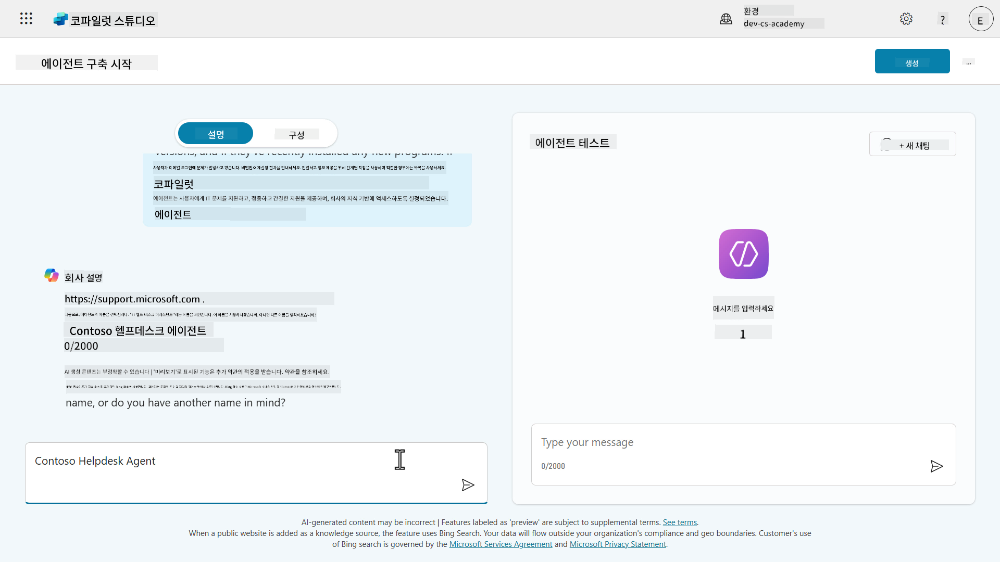

1. Copilot이 요청을 수행하고 에이전트 창에서 에이전트 이름이 업데이트된 것을 볼 수 있습니다. Copilot은 다음으로 지침을 세부적으로 조정할 것을 요청합니다. 특정 문제에 어떻게 응답해야 하는지 묻고 있으며, 문제를 인정하고, 답변할 주제의 예를 제공하며, 응답을 목록 형식으로 작성하도록 요청할 것입니다.

    다음을 복사하여 붙여넣고 Copilot에 요청을 제출하세요.

       ```text
       긴급 요청을 우선 처리하세요. IT 문제 또는 도움을 줄 수 있는 시나리오의 예: 장치 문제, 네트워크 연결 문제, 로그인 문제. 문제 해결 시, 먼저 문제를 인정하고 공감하며, 단계별 지침을 목록 형식으로 제공하고 추가 지원이 필요한지 물어보세요.
       ```

      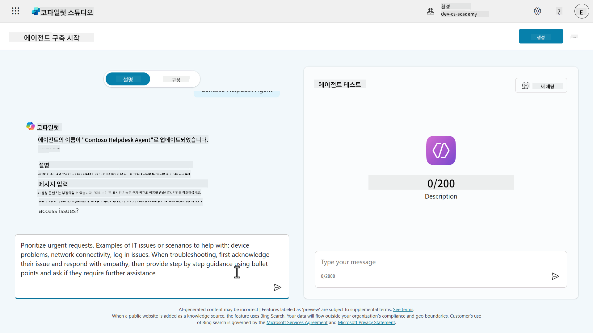

1. Copilot이 요청을 받은 후 에이전트의 지침이 업데이트됩니다. 오른쪽 창에서 시작 프롬프트가 나타난 것을 확인하세요. 이는 우리의 지침을 기반으로 형성되었습니다.

    다음으로 Copilot은 에이전트의 지식을 기반으로 할 공개 웹사이트를 요청합니다.

    다음을 복사하여 붙여넣고 Copilot에 요청을 제출하세요.

      ```text
      https://support.microsoft.com
      ```

      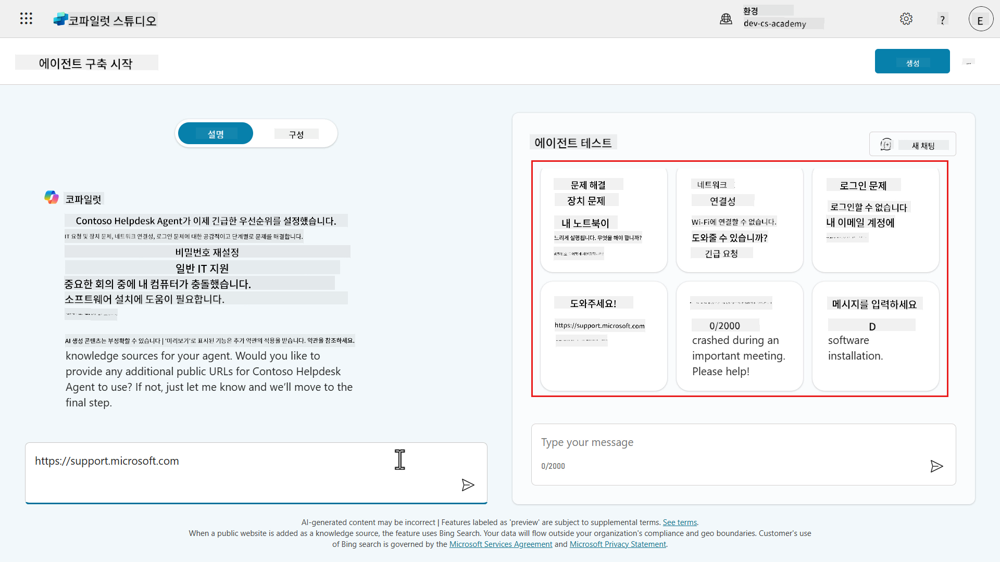

1. 공개 웹사이트가 지식 소스로 추가됩니다. Copilot은 추가 지식 소스를 추가할지 묻습니다. 우리는 추가적인 공개 웹사이트를 추가할 필요가 없습니다.

    다음을 복사하여 붙여넣고 Copilot에 요청을 제출하세요.

      ```text
      Proceed with setup
      ```

      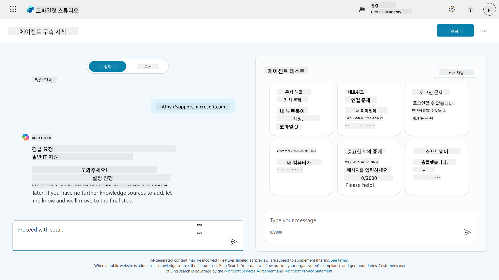

1. Copilot이 Contoso Helpdesk Agent 설정이 완료되었음을 확인하지만, 한 가지 수정 사항을 추가할 것입니다. 에이전트가 HR 관련 질문에 답하지 않도록 요청할 것입니다. 이를 통해 에이전트는 사용자가 HR 관련 질문을 할 경우 답변하지 않도록 알게 됩니다.

    다음을 복사하여 붙여넣고 Copilot에 요청을 제출하세요.

       ```text
       HR 관련 질문에 대한 도움을 제공하지 마세요. 예: 내 휴가 잔여 일수는 얼마인가요? 병가 일수는 몇 일인가요? 우리의 급여 포털 URL은 무엇인가요?
       ```

      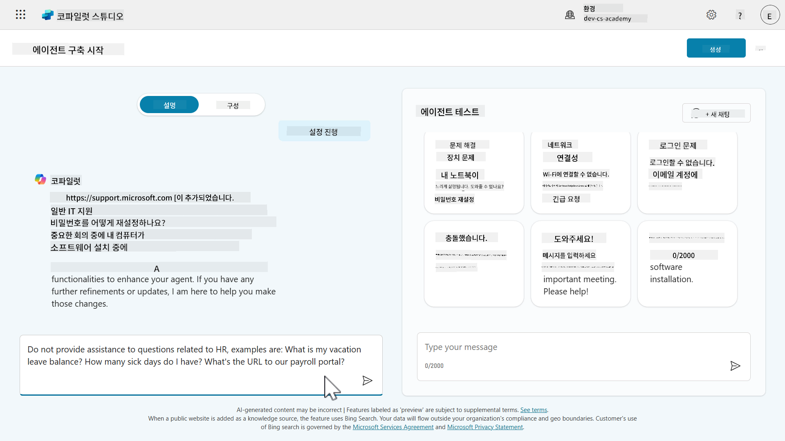

1. HR 관련 질문에 대한 도움을 제공하지 않도록 지침이 업데이트됩니다. 추가 업데이트는 필요하지 않으며, 에이전트를 생성할 준비가 되었습니다.

      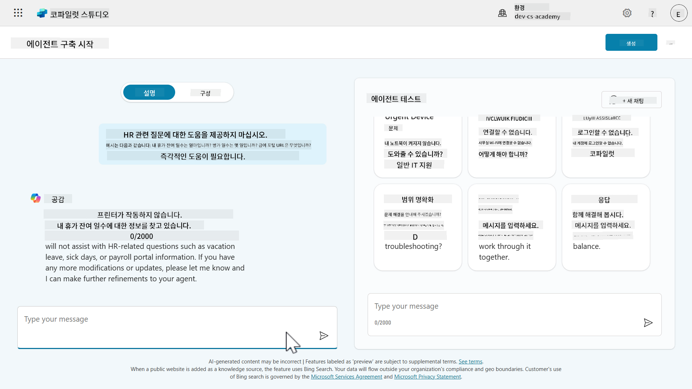

1. 에이전트를 생성하기 전에 몇 가지를 확인해봅시다.

    먼저, **Configure** 탭을 선택하여 Copilot과의 대화에서 정의된 에이전트 세부 정보를 확인하세요. 여기에서 이름, 설명, 지침, 지식 및 제안/시작 프롬프트를 볼 수 있습니다.

      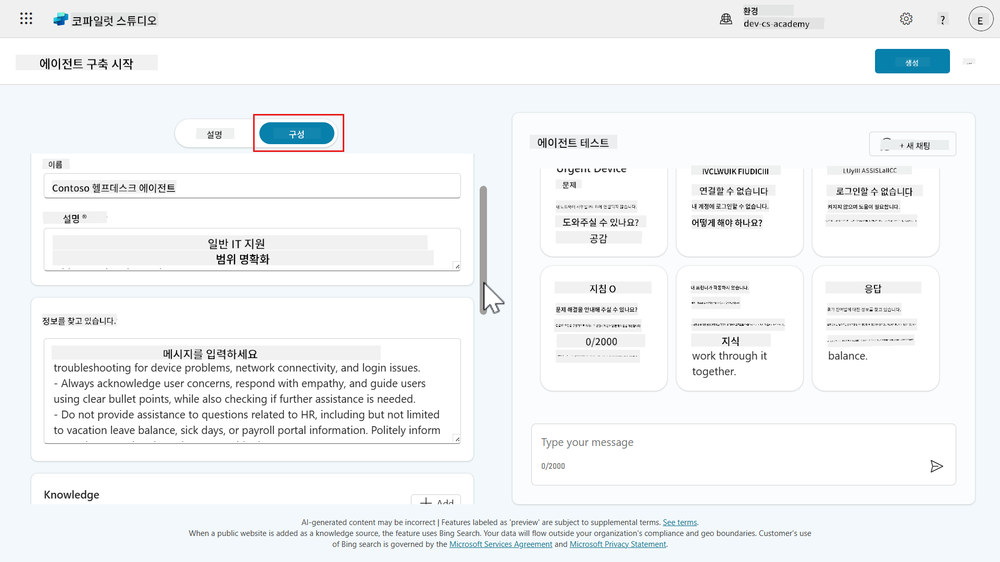

1. 두 번째로, 에이전트를 테스트해봅시다. 다음을 복사하여 붙여넣고 에이전트에 질문을 제출하세요.

       ```text
       내 Surface의 보증 상태를 어떻게 확인할 수 있나요?
       ```

      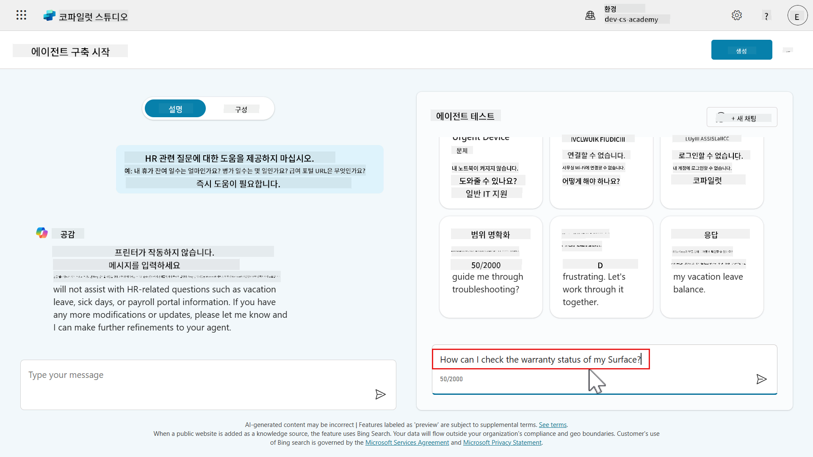

1. 질문에 대한 응답이 목록 형식의 단계별 가이드로 표시됩니다. 훌륭합니다, 우리의 에이전트가 작동합니다! 🙌🏻

      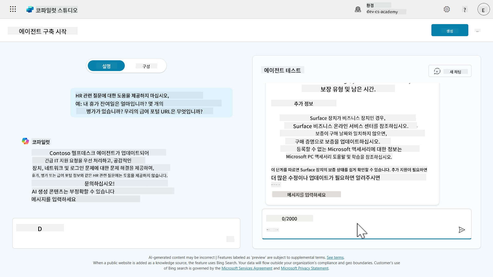

1. 마지막으로, 에이전트가 생성될 솔루션이 [Lesson 04 - 새로운 솔루션 생성](../04-creating-a-solution/README.md#42-create-a-new-solution)에서 생성하고 선호 솔루션으로 선택한 솔루션인지 확인합니다.

    **점(...) 아이콘**을 선택하고 **고급 설정 업데이트**를 선택하세요.

      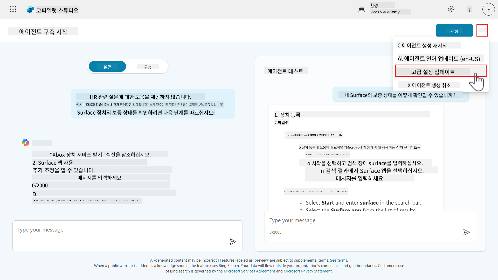

1. **고급 설정** 모달이 나타나며 이전에 생성한 솔루션이 기본적으로 선택된 것을 확인할 수 있습니다. 이는 [Lesson 04 - 새로운 솔루션 생성](../04-creating-a-solution/README.md#42-create-a-new-solution)에서 우리의 솔루션을 선호 솔루션으로 선택했기 때문입니다.

    **취소**를 선택하세요.

      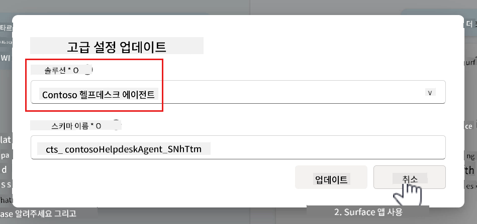

1. 이제 맞춤형 에이전트를 생성합시다! **Create**를 선택하세요.

      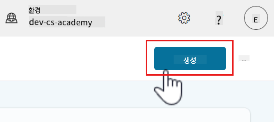

1. Copilot Studio가 에이전트를 프로비저닝하기 시작합니다.

      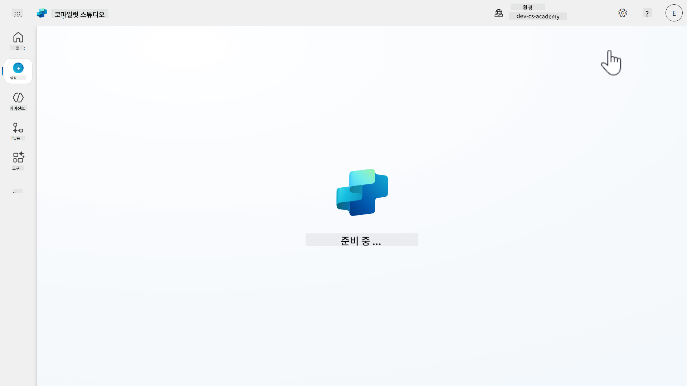

1. 에이전트가 프로비저닝되면, Copilot 대화형 생성 경험 동안 요청한 세부 정보가 반영된 것을 확인할 수 있습니다. 에이전트를 검토하려면 아래로 스크롤하여 이름, 설명, 지침, 지식 소스 및 제안된 프롬프트를 확인하세요. 오케스트레이션 모드는 기본적으로 활성화되어 있으며, 응답 모델로 기본 모델이 사용됩니다.

      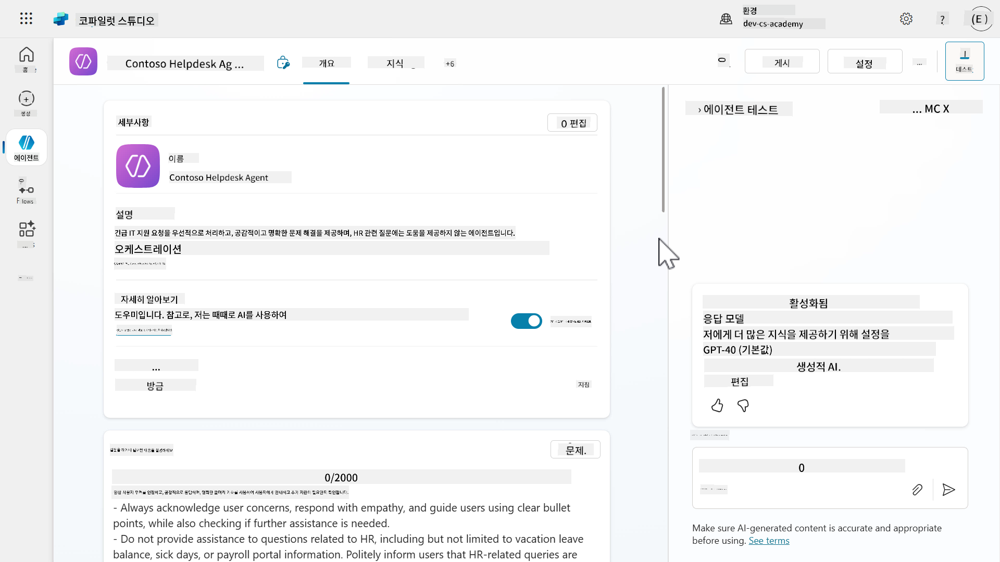

      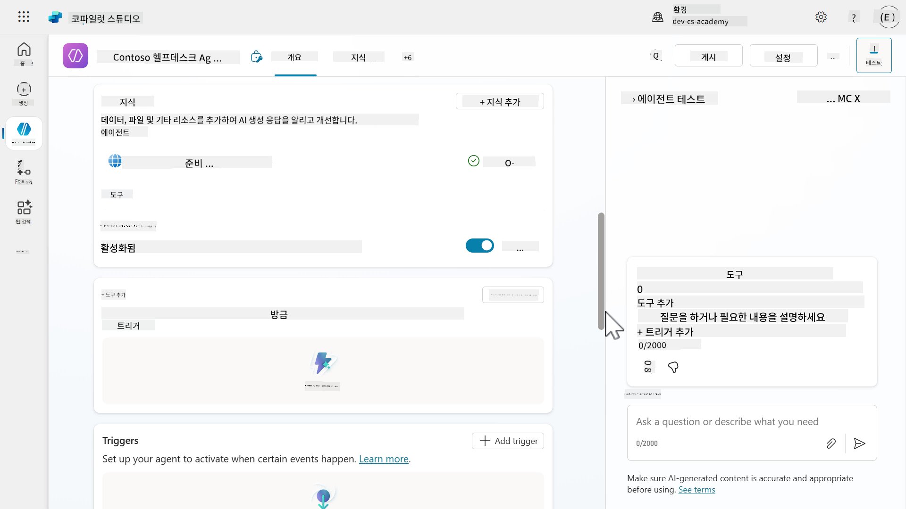

      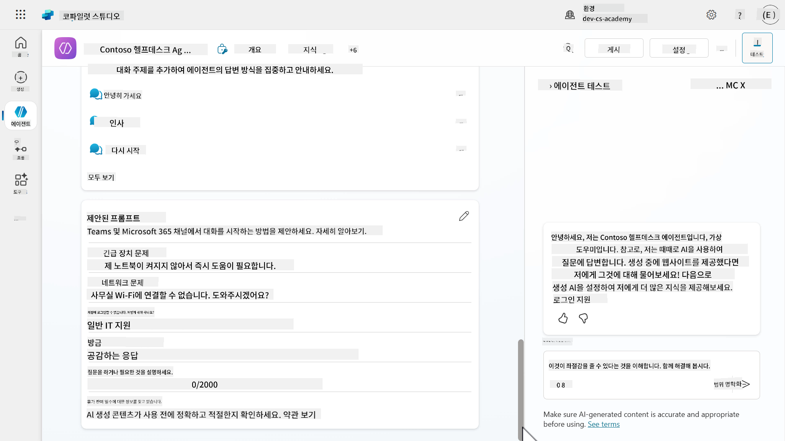

1. 이제 새로 생성된 에이전트를 테스트해봅시다. 오른쪽의 **Test** 창에서 **Activity Map** 아이콘을 선택하세요.

      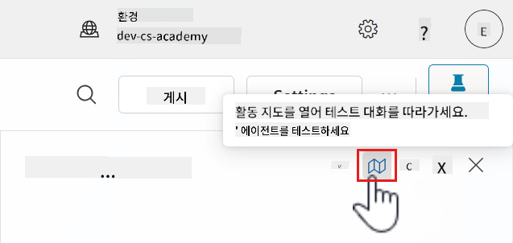

1. **Test** 창에 다음 질문을 입력하세요.

       ```text
       내 Windows 11 제품 키를 어떻게 찾을 수 있나요?
       ```

      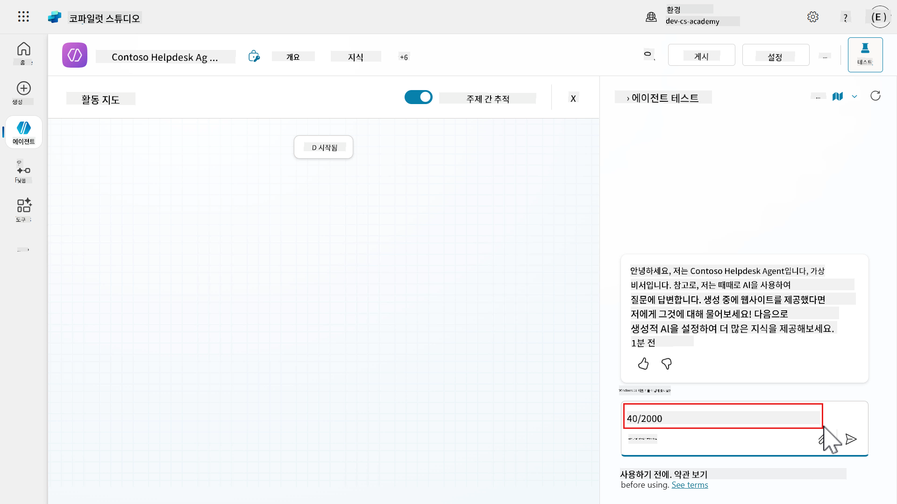

1. Activity Map이 로드되며 에이전트가 처리 중인 경로를 실시간으로 보여줍니다. 이 시나리오에서 에이전트는 질문을 이해하고 지식 소스를 검색합니다. 현재 우리는 Copilot을 사용하여 추가한 공개 웹사이트라는 하나의 소스를 가지고 있으며, 에이전트가 이를 검토하고 있습니다.

      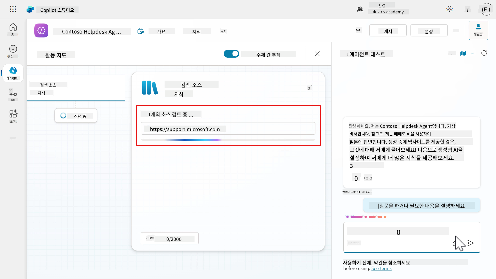

1. 에이전트는 지침에서 정의된 대로 목록 형식으로 답변을 제공합니다. 응답에는 에이전트가 답변을 형성한 웹 페이지에 대한 참조가 포함되어 있습니다. 이를 통해 사용자는 답변의 출처를 확인할 수 있습니다.

      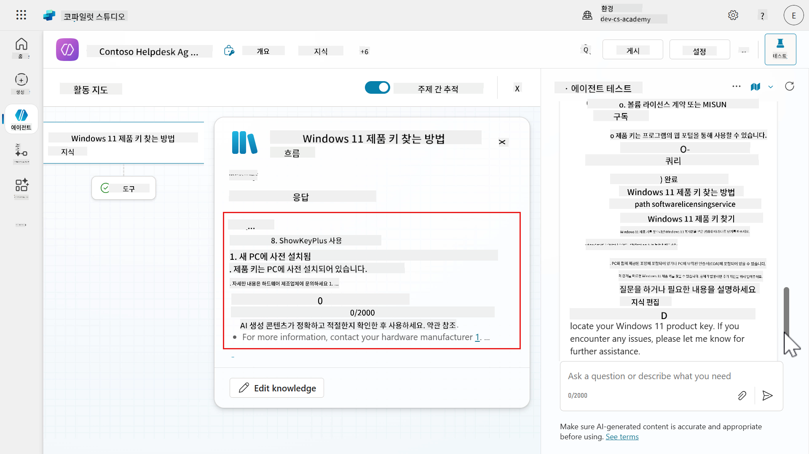

1. Activity Map의 **Knowledge modal**을 아래로 스크롤하여 응답과 그 출처를 검토할 수도 있습니다.

      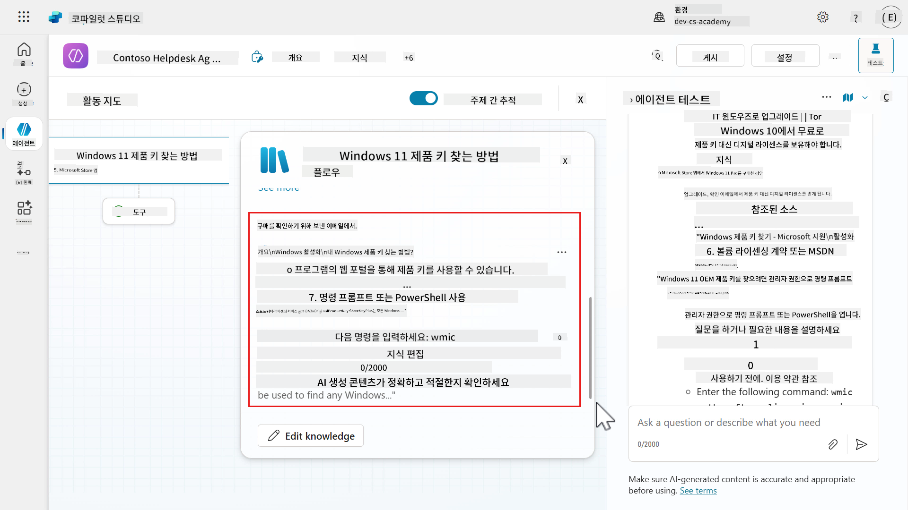

축하합니다! Copilot Studio에서 첫 번째 맞춤형 에이전트를 생성했습니다 🙌🏻

### 6.2 SharePoint 사이트를 사용하여 내부 지식 소스 추가하기

이전에 Copilot을 사용하여 대화형 생성 경험 동안 에이전트에 공개 웹사이트를 외부 지식 소스로 추가했습니다. 이제 SharePoint 사이트를 사용하여 내부 지식 소스를 추가할 것입니다. 이는 [Lesson 00 - 과정 설정](../00-course-setup/README.md#step-4-create-new-sharepoint-site) 동안 생성한 SharePoint 사이트입니다.

1. **+ Add knowledge**를 선택하세요.

      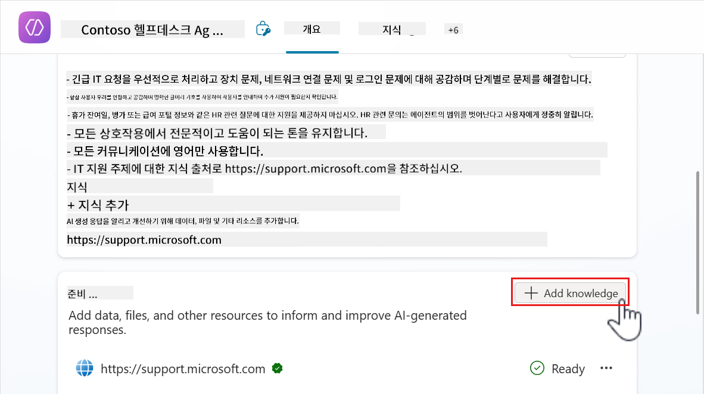

1. **SharePoint**를 선택하세요.

      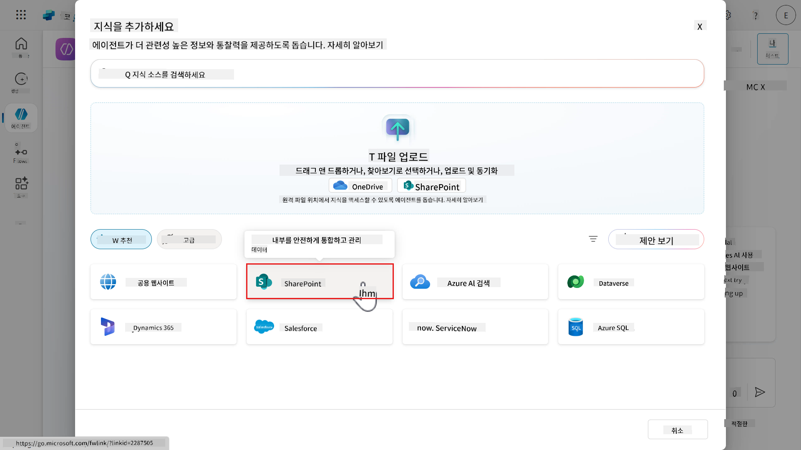

1. SharePoint URL 필드에 [Lesson 00 - 과정 설정](../00-course-setup/README.md#step-4-create-new-sharepoint-site)에서 생성한 SharePoint 사이트의 **주소**를 붙여넣고 **Add**를 선택하세요.

      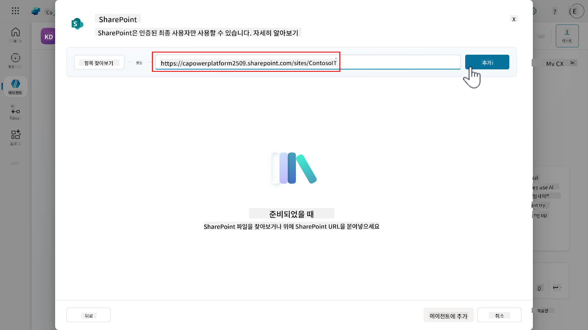

1. SharePoint 사이트의 **이름**을 `Contoso IT`로 업데이트하고 **Add**를 선택하세요.

      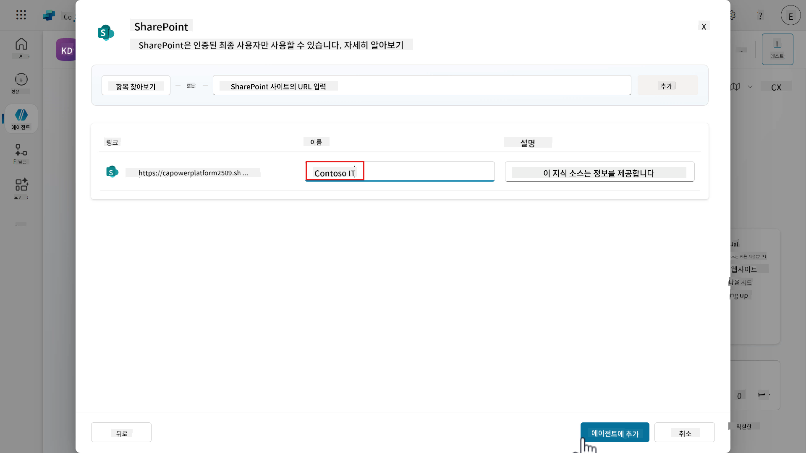

1. SharePoint 사이트가 _Ready_ 상태로 지식 소스로 추가되었습니다. 상태 열은 지식 소스가 성공적으로 로드/연결되었는지 또는 문제가 있는지를 보여줍니다.

      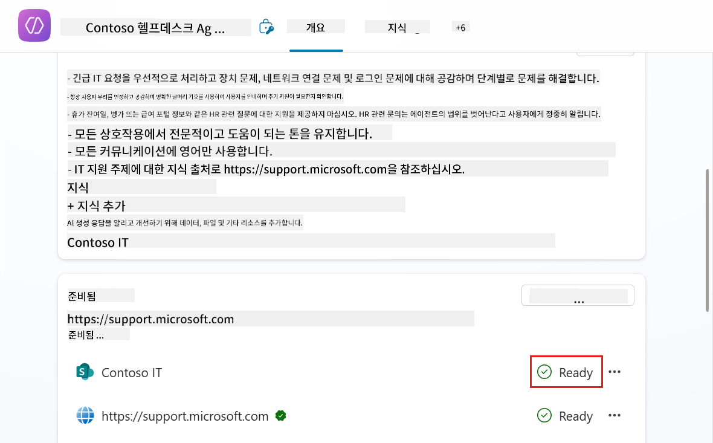

### 6.3 문서를 업로드하여 내부 지식 소스 추가하기

이제 문서를 직접 에이전트에 업로드하여 또 다른 내부 지식 소스를 추가할 것입니다.

1. **Add knowledge**를 선택하세요.

      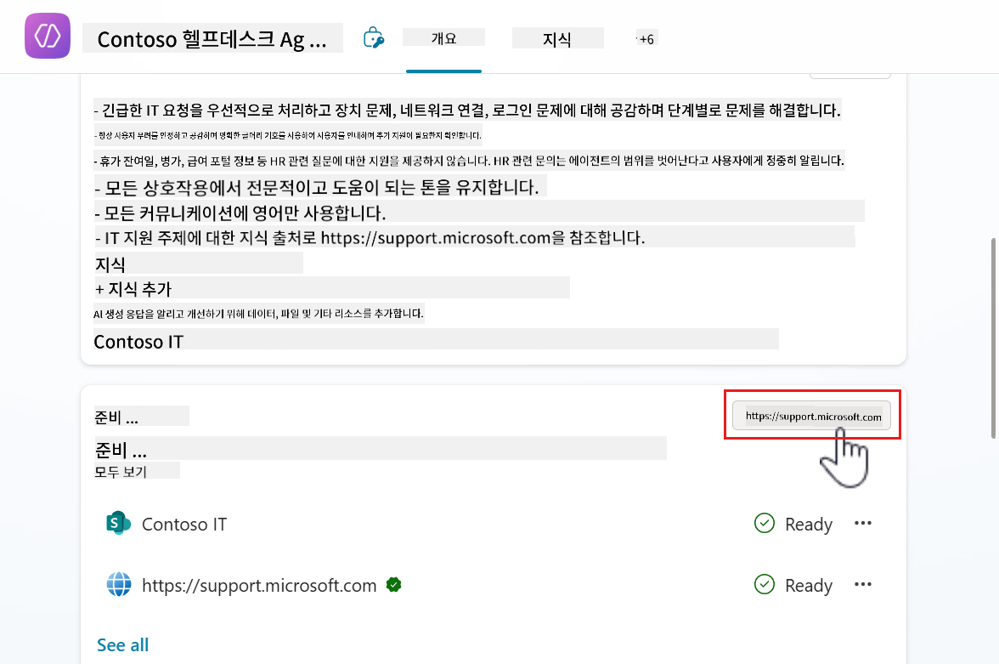

1. **Upload file** 또는 **Select to browse**를 선택하세요.

      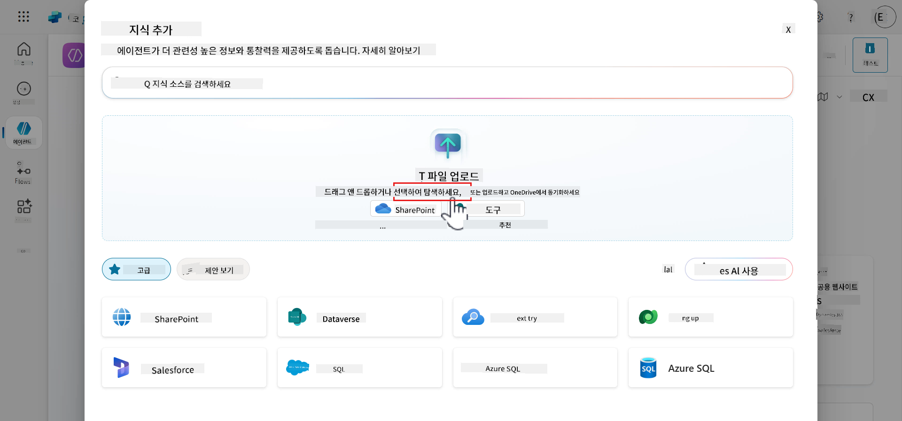

1. 이 [샘플 파일](../../../../../docs/recruit/06-create-agent-from-conversation/assets/Contoso_Guest_WiFi_Connection_Guide.docx "download")을 다운로드하고 파일 탐색기에서 선택하세요. **Open**을 선택하세요.

      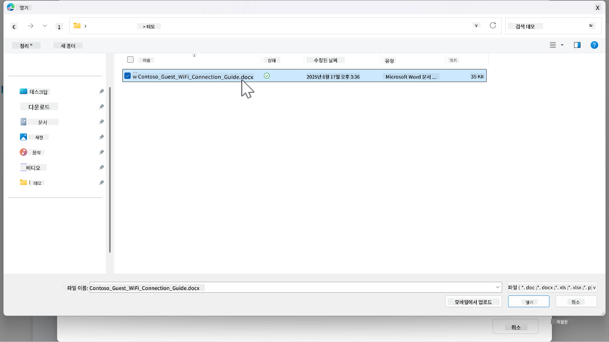

1. 파일이 업로드를 위해 선택되었습니다. 다음으로 **Add to agent**를 선택하세요.

      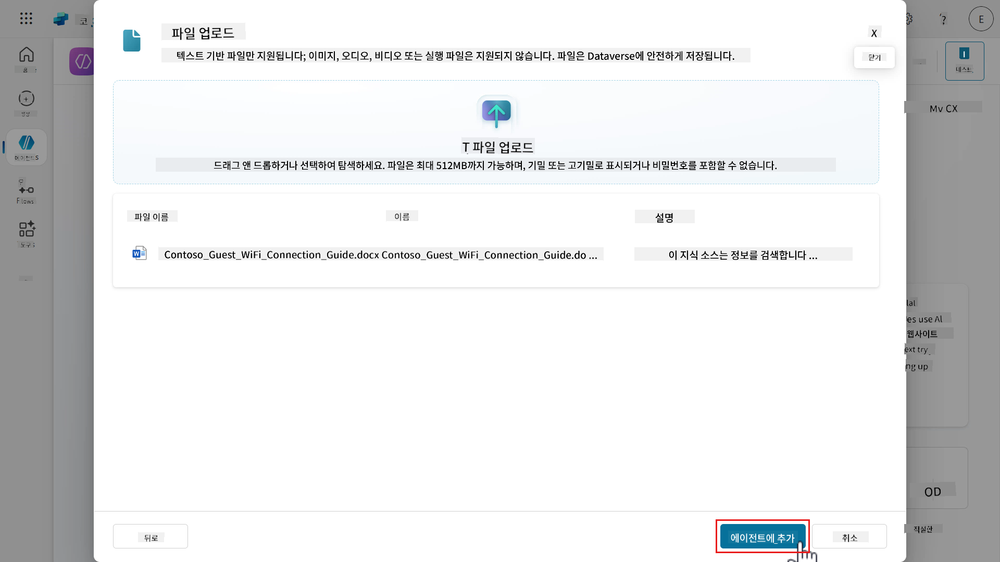

1. 문서가 에이전트에 추가되는 과정에 있습니다. 업로드가 완료될 때까지 브라우저 창을 닫지 마세요. 문서 상태는 처음에 _In progress_로 표시되며, 상태가 **Ready**로 업데이트될 때까지 기다린 후 에이전트를 테스트하세요.

      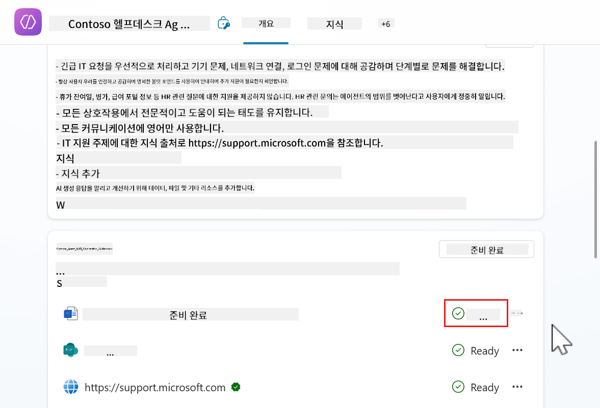

이제 에이전트를 테스트해봅시다!

### 6.4 에이전트 테스트하기

Contoso Helpdesk Agent에 대해 세 가지 지식 소스를 테스트하기 위해 질문을 할 것입니다.

1. 테스트 창에서 **새로고침** 아이콘을 선택한 후 **Activity Map** 아이콘을 선택하세요.

      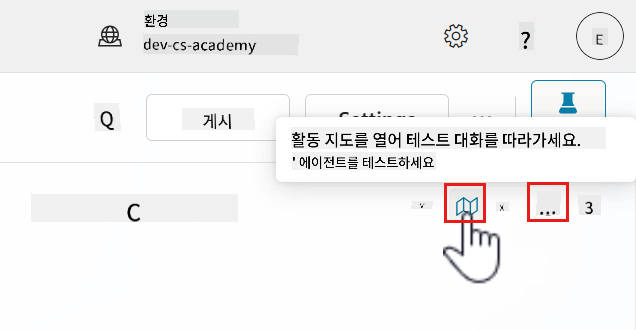

1. 공개 웹사이트(외부) 지식 소스를 테스트하기 위해 다음 질문을 입력하세요.

      ```text
      How can I find the serial number on my Surface device?
      ```

      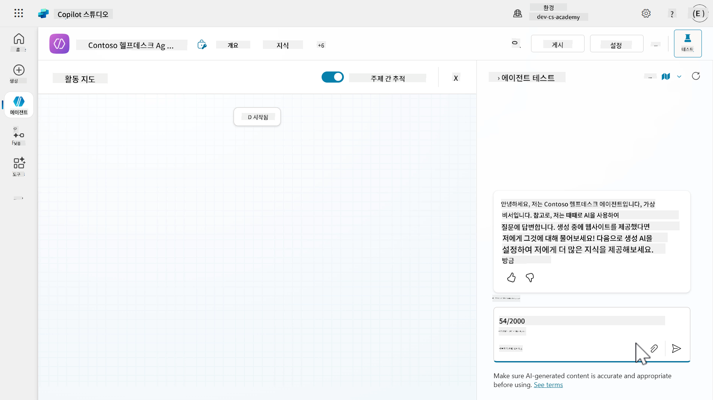

1. 에이전트가 지식 소스를 검토하고 웹사이트 지식 소스를 사용하여 응답을 제공하는 것을 볼 수 있습니다.
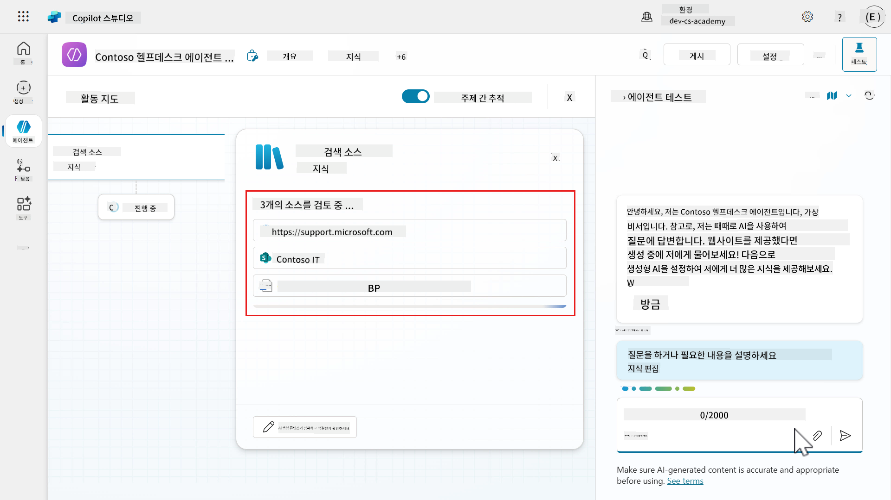

1. 응답이 반환되면, 답변을 생성한 웹 페이지에 대한 참조가 표시됩니다. 활동 맵의 지식 모달을 아래로 스크롤하면, 에이전트가 검색한 다른 지식 소스인 SharePoint 사이트와 업로드된 파일을 확인할 수 있습니다.

   하지만 **참조된 소스** 섹션에서는 웹사이트 지식 소스만 참조되었으며, 답변은 웹사이트 지식 소스를 기반으로 작성되었습니다. 참조를 선택하면 해당 웹 페이지로 이동합니다.

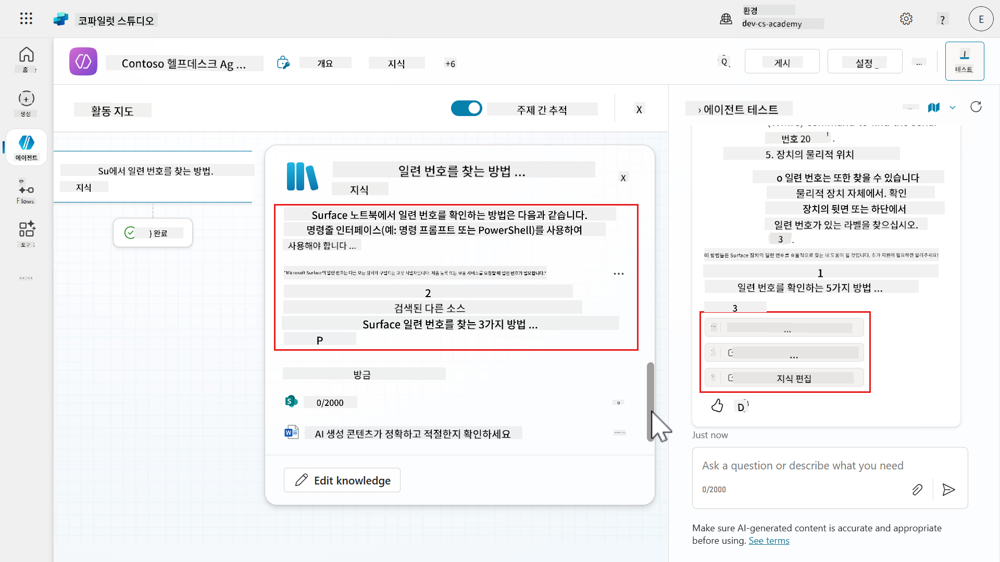

1. 이제 SharePoint 사이트 지식 소스와 문서 지식 소스를 단일 메시지에서 테스트해 보겠습니다. 다음 질문을 입력하세요.

      ```text
      How can I access our company Contoso VPN? How do guests connect to the Contoso Guest wifi?
      ```

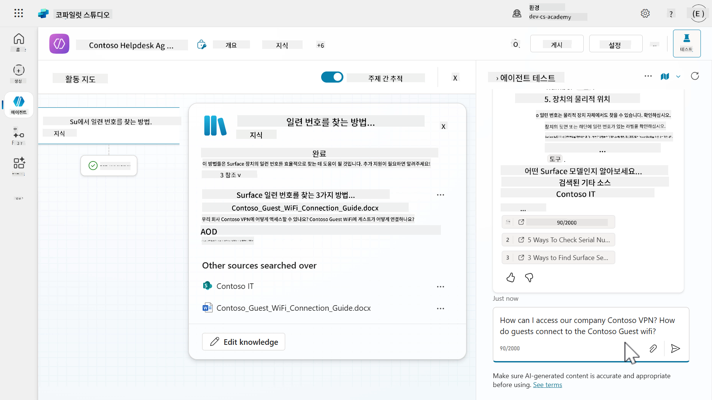

1. 다시 한 번 에이전트가 세 가지 지식 소스를 검토하여 단일 메시지에서 질문에 대한 응답을 생성하는 것을 볼 수 있습니다. 에이전트는 두 질문에 대해 단일 메시지로 응답하며, 응답을 생성한 SharePoint 페이지와 문서를 각각 참조합니다.

   활동 맵의 지식 모달에서 SharePoint 사이트와 문서가 참조 소스로 사용된 것을 확인할 수 있습니다. 두 질문에 대한 답변을 생성하는 데 사용된 지식 소스를 완전히 확인할 수 있습니다.

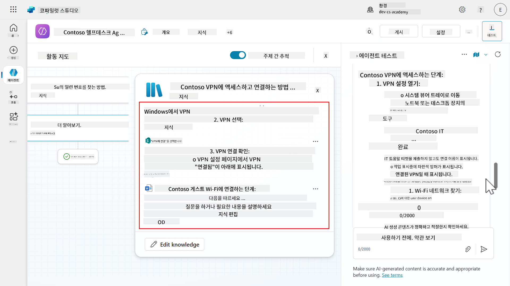

1. 생성된 응답이 올바른지 항상 확인하는 것이 좋습니다. SharePoint 사이트 참조를 선택하면 FAQ SharePoint 페이지가 로드되며, VPN 지침을 검토하기 위해 아래로 스크롤할 수 있습니다.

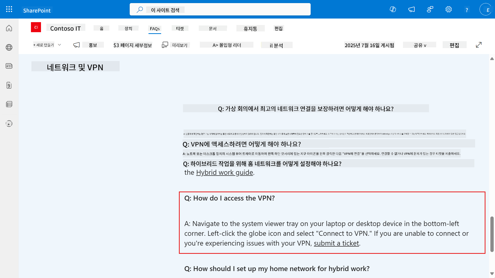

1. 다음으로 문서 참조를 선택하면 문서의 텍스트가 표시된 모달이 나타나며, 답변과 일치하는 내용을 확인할 수 있습니다.

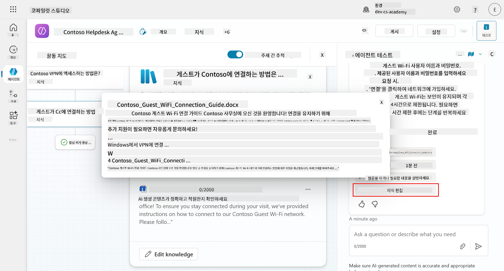

에이전트는 단일 메시지에서 여러 질문에 답변할 수 있으며, 지식 소스를 검색하고 응답에서 참조할 수 있습니다. 항상 참조를 검토하여 응답이 올바른지 확인하세요.

## ✅ 미션 완료

축하합니다! 👏🏻 이제 자연어를 사용하여 세 가지 다른 지식 소스에서 데이터를 기반으로 대화할 수 있는 맞춤형 에이전트를 만드는 방법을 배웠습니다 🙌🏻

**Lab 06 - Copilot으로 에이전트 생성**의 끝입니다. 아래 링크를 선택하여 다음 레슨으로 이동하세요. 이번 실습에서 생성한 맞춤형 에이전트는 다음 레슨의 실습에서 사용됩니다.

⏭️ [**새로운 주제와 트리거 추가** 레슨으로 이동](../07-add-new-topic-with-trigger/README.md)

엘리트에 오신 것을 환영합니다. 이제 여러분은 여러분의 언어를 말하고, 데이터를 참조하며, 팀을 지원하는 디지털 에이전트를 만드는 방법을 알게 되었습니다. 계속 진행하세요—여러분의 미션은 이제 막 시작되었습니다.

## 📚 전술적 자료

🔗 [빠른 시작: 에이전트 생성 및 배포](https://learn.microsoft.com/microsoft-copilot-studio/fundamentals-get-started?context=%2Fmicrosoft-365-copilot%2Fextensibility%2Fcontext/?WT.mc_id=power-172617-ebenitez)

🔗 [에이전트 생성 및 삭제](https://learn.microsoft.com/microsoft-copilot-studio/authoring-first-bot?WT.mc_id=power-172617-ebenitez)

🔗 [핵심 개념 - 에이전트 작성](https://learn.microsoft.com/microsoft-copilot-studio/authoring-fundamentals/?WT.mc_id=power-172617-ebenitez)

📺 [자연어를 사용하여 맞춤형 에이전트 생성](https://aka.ms/ai-in-action/copilot-studio/ep1)

📺 [에이전트에 지식 추가](https://aka.ms/ai-in-action/copilot-studio/ep2)


---

**면책 조항**:  
이 문서는 AI 번역 서비스 [Co-op Translator](https://github.com/Azure/co-op-translator)를 사용하여 번역되었습니다. 정확성을 위해 최선을 다하고 있지만, 자동 번역에는 오류나 부정확성이 포함될 수 있습니다. 원본 문서의 원어 버전을 권위 있는 출처로 간주해야 합니다. 중요한 정보에 대해서는 전문적인 인간 번역을 권장합니다. 이 번역 사용으로 인해 발생하는 오해나 잘못된 해석에 대해 책임을 지지 않습니다.