<!--
CO_OP_TRANSLATOR_METADATA:
{
  "original_hash": "cd99a76bcb7372ac2771b6ae178b023d",
  "translation_date": "2025-10-22T00:21:05+00:00",
  "source_file": "docs/recruit/10-add-event-triggers/README.md",
  "language_code": "ko"
}
-->
# 🚨 미션 10: 이벤트 트리거 추가 - 자율 에이전트 기능 활성화

## 🕵️‍♂️ 코드명: `OPERATION GHOST ROUTINE`

> **⏱️ 작전 시간:** `~45분`

🎥 **워크스루 보기**

[](https://www.youtube.com/watch?v=ZgwHL8PQ1nY "YouTube에서 워크스루 보기")

## 🎯 미션 개요

이제 에이전트를 단순한 대화형 비서에서 자율적인 작전 요원으로 업그레이드할 때입니다. 이번 미션은 에이전트가 호출되지 않아도 디지털 환경에서 발생하는 신호에 정밀하고 신속하게 반응하도록 만드는 것입니다.

이벤트 트리거를 사용하면 에이전트가 SharePoint, Teams, Outlook과 같은 외부 시스템을 모니터링하고 신호가 수신되는 즉시 지능적인 작업을 수행하도록 훈련할 수 있습니다. 이 작전은 에이전트를 완전한 작전 자산으로 변모시킵니다 - 조용하고 신속하며 항상 주시하는 상태로.

성공은 단순히 반응하는 것이 아니라 가치를 창출하는 에이전트를 구축하는 것입니다.

## 🔎 목표

📖 이번 레슨에서는 다음을 다룹니다:

- 이벤트 트리거의 이해와 자율 에이전트 행동 활성화 방법
- 이벤트 트리거와 주제 트리거의 차이점, 트리거 워크플로 및 페이로드 학습
- 일반적인 이벤트 트리거 시나리오 탐구
- 이벤트 기반 에이전트의 인증, 보안 및 게시 고려 사항 이해
- SharePoint 이벤트에 반응하고 이메일 확인을 보내는 자율 IT 헬프 데스크 에이전트 구축

## 🤔 이벤트 트리거란?

**이벤트 트리거**는 에이전트가 사용자 입력 없이 외부 이벤트에 반응하여 자율적으로 행동할 수 있도록 하는 메커니즘입니다. 에이전트가 특정 이벤트를 "감지"하고 해당 이벤트가 발생했을 때 자동으로 작업을 수행하도록 만드는 것입니다.

주제 트리거와 달리, 주제 트리거는 사용자가 대화를 활성화하기 위해 무언가를 입력해야 하지만, 이벤트 트리거는 연결된 시스템에서 발생하는 이벤트를 기반으로 활성화됩니다. 예를 들어:

- SharePoint 또는 OneDrive for Business에서 새 파일이 생성될 때
- Dataverse에서 레코드가 생성될 때
- Planner에서 작업이 완료될 때
- Microsoft Form 응답이 제출될 때
- Microsoft Teams 메시지가 추가될 때
- 반복 일정에 따라 (예: 매일 알림)  
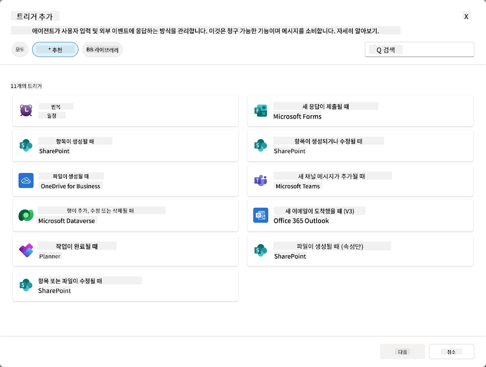

### 자율 에이전트에서 이벤트 트리거가 중요한 이유

이벤트 트리거는 에이전트를 반응형 비서에서 능동적이고 자율적인 도우미로 변모시킵니다:

1. **자율적 운영** - 에이전트가 인간의 개입 없이 24/7 작동하며, 발생하는 이벤트에 즉시 반응합니다.
    - *예시:* 팀에 새 멤버가 추가되면 자동으로 환영 메시지를 보냅니다.

1. **실시간 반응성** - 사용자가 질문을 하기를 기다리는 대신, 에이전트가 관련 이벤트에 즉시 반응합니다.
    - *예시:* SharePoint 문서가 수정되면 IT 팀에 알림을 보냅니다.

1. **워크플로 자동화** - 단일 트리거 이벤트를 기반으로 여러 작업을 연결합니다.
    - *예시:* 새 지원 티켓이 생성되면 작업을 생성하고, 매니저에게 알리고, 추적 대시보드를 업데이트합니다.

1. **일관된 프로세스** - 중요한 단계가 누락되지 않도록 주요 이벤트에 대한 반응을 자동화합니다.
    - *예시:* 모든 신규 직원에게 자동으로 온보딩 자료와 접근 요청을 제공합니다.

1. **데이터 기반 행동** - 트리거 이벤트에서 정보를 사용하여 스마트한 결정을 내리고 적절한 행동을 취합니다.
    - *예시:* 트리거 페이로드의 우선순위 수준에 따라 긴급 티켓을 고급 직원에게 라우팅합니다.

## ⚙️ 이벤트 트리거는 어떻게 작동하나요?

이벤트 트리거는 외부 이벤트에 자율적으로 반응할 수 있도록 에이전트를 활성화하는 3단계 워크플로를 통해 작동합니다:

### 트리거 워크플로

1. **이벤트 감지** - 연결된 시스템(SharePoint, Teams, Outlook 등)에서 특정 이벤트가 발생합니다.
1. **트리거 활성화** - 이벤트 트리거가 이 이벤트를 감지하고 Power Automate Cloud Flow를 통해 페이로드를 에이전트에 보냅니다.
1. **에이전트 반응** - 에이전트가 페이로드를 수신하고 정의된 지침을 실행합니다.

### 이벤트 트리거 vs 주제 트리거

이 두 트리거 유형의 차이를 이해하는 것이 중요합니다:

| **이벤트 트리거** | **주제 트리거** |
|-------------------|-------------------|
| 외부 시스템 이벤트로 활성화 | 사용자 입력/문구로 활성화 |
| 자율 에이전트 행동 활성화 | 대화형 반응 활성화 |
| 제작자의 인증 사용 | 사용자의 인증 옵션 |
| 사용자 상호작용 없이 실행 | 사용자가 대화를 시작해야 함 |
| 예시: 파일 생성, 이메일 수신 | 예시: "날씨가 어때?" |

## 📦 트리거 페이로드 이해하기

이벤트가 발생하면 트리거는 에이전트에게 이벤트 정보와 반응 방법에 대한 지침을 포함한 **페이로드**를 보냅니다.

### 기본 페이로드 vs 사용자 정의 페이로드

모든 트리거 유형은 기본 페이로드 구조를 제공하지만, 이를 사용자 정의할 수 있습니다:

**기본 페이로드** - `{Body}`의 콘텐츠 사용과 같은 표준 형식 사용

- 기본 이벤트 정보 포함
- 일반적인 처리 지침 사용
- 간단한 시나리오에 적합

**사용자 정의 페이로드** - 특정 지침 및 데이터 형식 추가

- 에이전트에 대한 상세한 지침 포함
- 사용할 데이터와 처리 방법을 명확히 지정
- 복잡한 워크플로에 적합

### 에이전트 지침 vs 사용자 정의 페이로드 지침

이벤트 트리거를 사용하여 에이전트의 행동을 안내할 수 있는 두 가지 방법이 있습니다:

**에이전트 지침** (전역)

- 모든 트리거에 적용되는 광범위한 지침
- 예시: "티켓을 처리할 때 항상 중복을 먼저 확인하세요"
- 일반적인 행동 패턴에 적합

**페이로드 지침** (트리거별)

- 개별 트리거 유형에 대한 특정 지침  
- 예시: "이 SharePoint 업데이트에 대해 프로젝트 채널에 요약을 보내세요"
- 여러 트리거가 있는 복잡한 에이전트에 적합

💡 **프로 팁**: 이 두 수준 간의 지침 충돌을 피하세요. 예상치 못한 행동을 초래할 수 있습니다.

## 🎯 일반적인 이벤트 트리거 시나리오

다음은 이벤트 트리거가 에이전트를 향상시키는 실용적인 예입니다:

### IT 헬프 데스크 에이전트

- **트리거**: 새 SharePoint 리스트 항목(지원 티켓)
- **작업**: 자동으로 분류, 우선순위 지정, 적절한 팀원에게 알림

### 직원 온보딩 에이전트

- **트리거**: Dataverse에 새 사용자 추가
- **작업**: 환영 메시지 전송, 온보딩 작업 생성, 접근 권한 제공

### 프로젝트 관리 에이전트

- **트리거**: Planner에서 작업 완료
- **작업**: 프로젝트 대시보드 업데이트, 이해관계자 알림, 장애물 확인

### 문서 관리 에이전트

- **트리거**: 특정 SharePoint 폴더에 파일 업로드
- **작업**: 메타데이터 추출, 태그 적용, 문서 소유자 알림

### 회의 보조 에이전트

- **트리거**: 캘린더 이벤트 생성
- **작업**: 사전 회의 알림 및 의제 전송, 리소스 예약

## ⚠️ 게시 및 인증 고려 사항

에이전트가 프로덕션에서 이벤트 트리거를 사용할 수 있도록 하기 전에 인증 및 보안 관련 사항을 이해해야 합니다.

### 제작자 인증

이벤트 트리거는 **에이전트 제작자의 자격 증명**을 사용하여 모든 인증을 수행합니다:

- 에이전트가 제작자의 권한으로 시스템에 접근
- 사용자가 제작자의 자격 증명을 통해 데이터를 접근할 가능성 있음
- 모든 작업이 사용자가 에이전트와 상호작용할 때도 "제작자"로 수행됨

### 데이터 보호 모범 사례

이벤트 트리거를 사용하는 에이전트를 게시할 때 보안을 유지하려면:

1. **데이터 접근 평가** - 트리거가 접근할 수 있는 시스템과 데이터를 검토하세요
1. **철저히 테스트** - 트리거가 페이로드에 포함하는 정보를 이해하세요
1. **트리거 범위 좁히기** - 특정 매개변수를 사용하여 트리거를 활성화하는 이벤트를 제한하세요
1. **페이로드 데이터 검토** - 트리거가 민감한 정보를 노출하지 않도록 하세요
1. **사용 모니터링** - 트리거 활동과 리소스 소비를 추적하세요

## ⚠️ 문제 해결 및 제한 사항

이벤트 트리거 작업 시 다음 중요한 사항을 염두에 두세요:

### 할당량 및 비용 영향

- 각 트리거 활성화는 메시지 소비에 포함됩니다
- 매분 반복과 같은 빈번한 트리거는 할당량을 빠르게 소비할 수 있습니다
- 사용량을 모니터링하여 제한을 피하세요

### 기술 요구 사항

- 생성적 오케스트레이션이 활성화된 에이전트에서만 사용 가능
- 환경에서 솔루션 인식 클라우드 플로우 공유가 활성화되어야 함

### 데이터 손실 방지(DLP)

- 조직의 DLP 정책이 사용 가능한 트리거를 결정합니다
- 관리자가 이벤트 트리거를 완전히 차단할 수 있음
- 예상 트리거가 사용 가능하지 않으면 관리자에게 문의하세요

## 🧪 실습 10 - 자율 에이전트 행동을 위한 이벤트 트리거 추가

### 🎯 사용 사례

SharePoint 지원 티켓 리스트에 새 항목이 생성될 때 자동으로 반응하도록 IT 헬프 데스크 에이전트를 강화합니다. 에이전트는 다음을 수행합니다:

1. SharePoint 티켓이 생성될 때 자율적으로 트리거됩니다
1. 티켓 세부 정보와 수행할 작업에 대한 지침을 제공합니다
1. AI 생성 이메일을 통해 제출자에게 티켓을 자동으로 확인합니다

이 실습은 이벤트 트리거가 진정한 자율 에이전트 행동을 어떻게 활성화하는지 보여줍니다.

### 사전 준비

실습을 시작하기 전에 다음을 확인하세요:

- ✅ 이전 실습 완료 (특히 IT 헬프 데스크 에이전트를 위한 실습 6-8)
- ✅ IT 지원 티켓 리스트가 있는 SharePoint 사이트 접근 가능
- ✅ 이벤트 트리거가 활성화된 Copilot Studio 환경
- ✅ 에이전트에 생성적 오케스트레이션 활성화됨
- ✅ SharePoint 및 Copilot Studio 환경에서 적절한 권한 보유

### 10.1 생성적 AI 활성화 및 SharePoint 항목 생성 트리거 만들기

1. **Copilot Studio**에서 **IT 헬프 데스크 에이전트**를 엽니다

1. 먼저 에이전트에 **생성적 AI**가 활성화되어 있는지 확인합니다:
   - **개요** 탭으로 이동합니다
   - 오케스트레이션 섹션에서 **생성적 오케스트레이션**을 **켜기**로 전환합니다 (이미 활성화되어 있지 않은 경우)  
     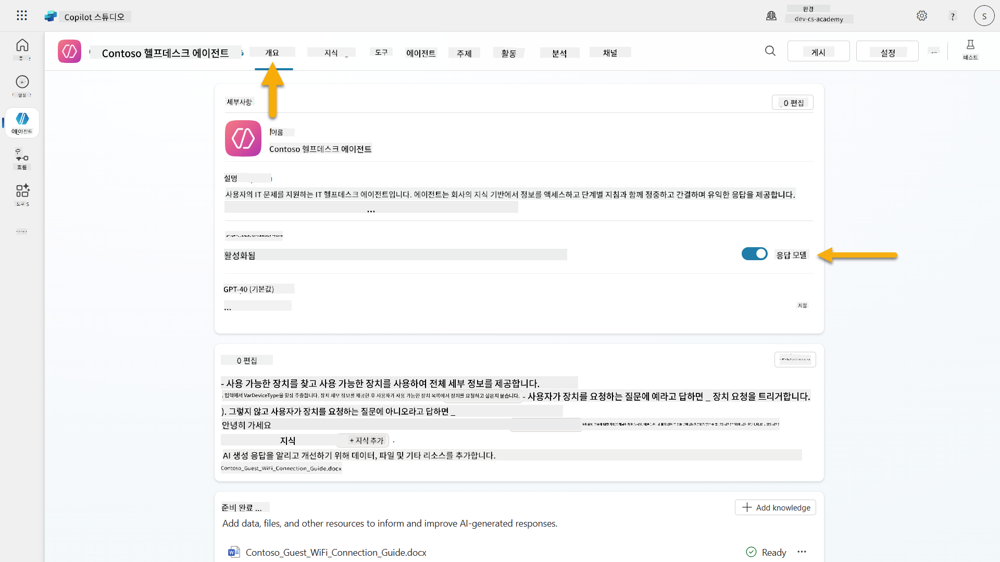

1. **개요** 탭으로 이동하여 **트리거** 섹션을 찾습니다

1. **+ 트리거 추가**를 클릭하여 트리거 라이브러리를 엽니다  
    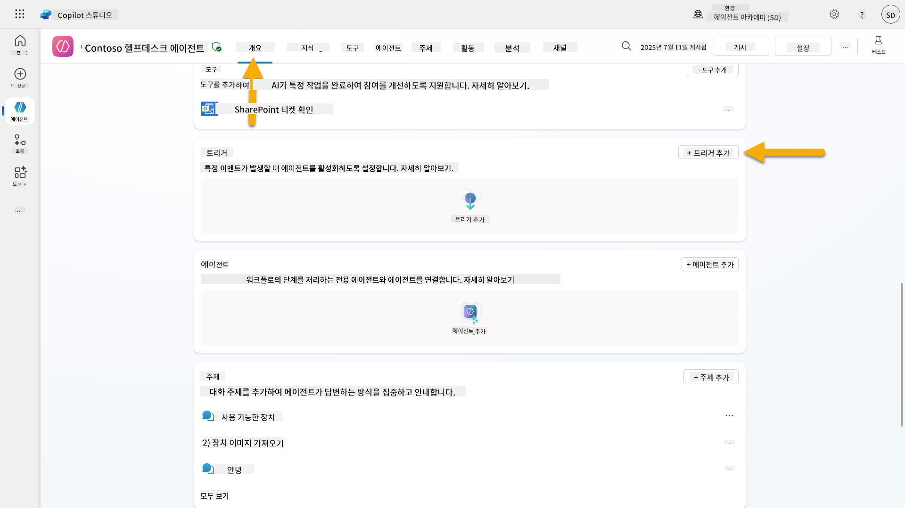

1. **항목이 생성될 때** (SharePoint)를 검색하고 선택합니다  
    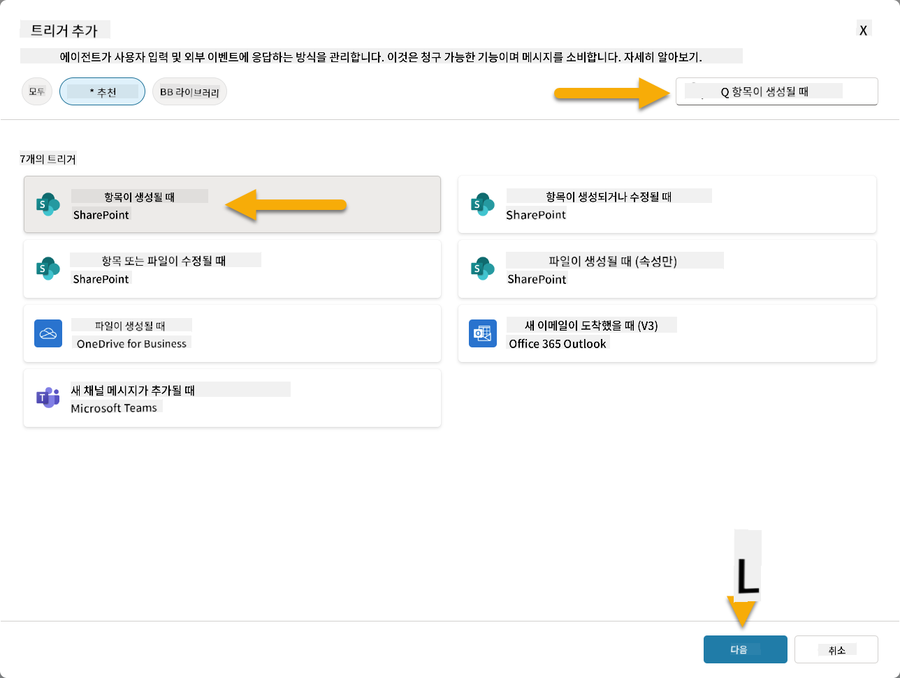

1. 트리거 이름과 연결을 구성합니다:

   - **트리거 이름:** SharePoint에서 새 지원 티켓 생성됨

1. 연결 구성을 기다린 후 **다음**을 선택하여 진행합니다.  
   

1. 트리거 매개변수를 구성합니다:

   - **사이트 주소**: "Contoso IT" SharePoint 사이트 선택

   - **리스트 이름**: "Tickets" 리스트 선택

   - **트리거에 의해 호출될 때 에이전트에 대한 추가 지침:**

     ```text
     New Support Ticket Created in SharePoint: {Body}
     
     Use the 'Acknowledge SharePoint Ticket' tool to generate the email body automatically and respond.
     
     IMPORTANT: Do not wait for any user input. Work completely autonomously.
     ```

     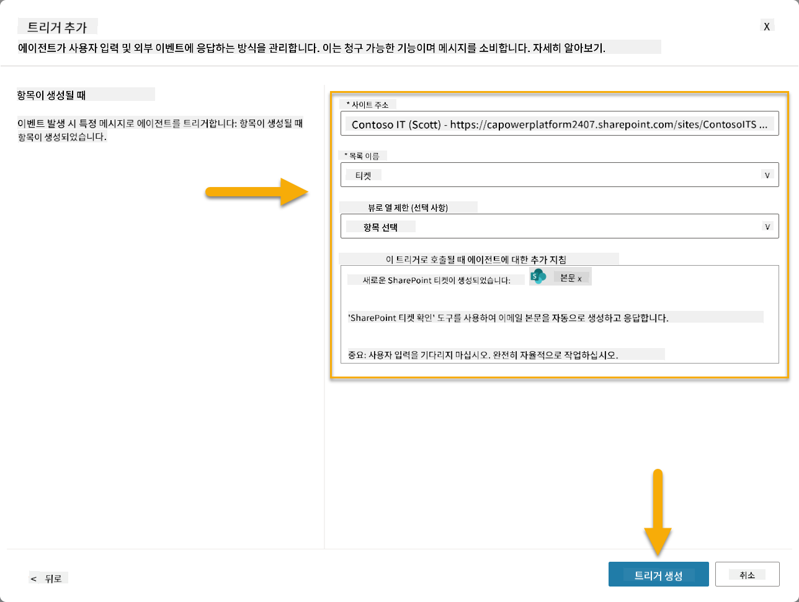

1. **트리거 생성**을 선택하여 트리거 생성을 완료합니다. 에이전트를 자율적으로 트리거하는 Power Automate Cloud Flow가 자동으로 생성됩니다.

1. **닫기**를 선택합니다.

### 10.2 트리거 편집

1. **개요** 탭의 **트리거** 섹션에서 **SharePoint에서 새 지원 티켓 생성됨** 트리거의 **...** 메뉴를 선택합니다

1. **Power Automate에서 편집**을 선택합니다  
   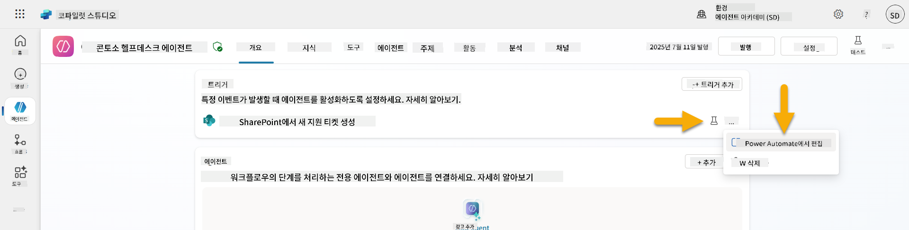

1. **지정된 Copilot에 처리 요청을 보내는** 노드를 선택합니다

1. **Body/메시지** 필드에서 Body 콘텐츠를 제거하고, **슬래시 키**(/)를 누른 후 **표현식 삽입**을 선택합니다  
   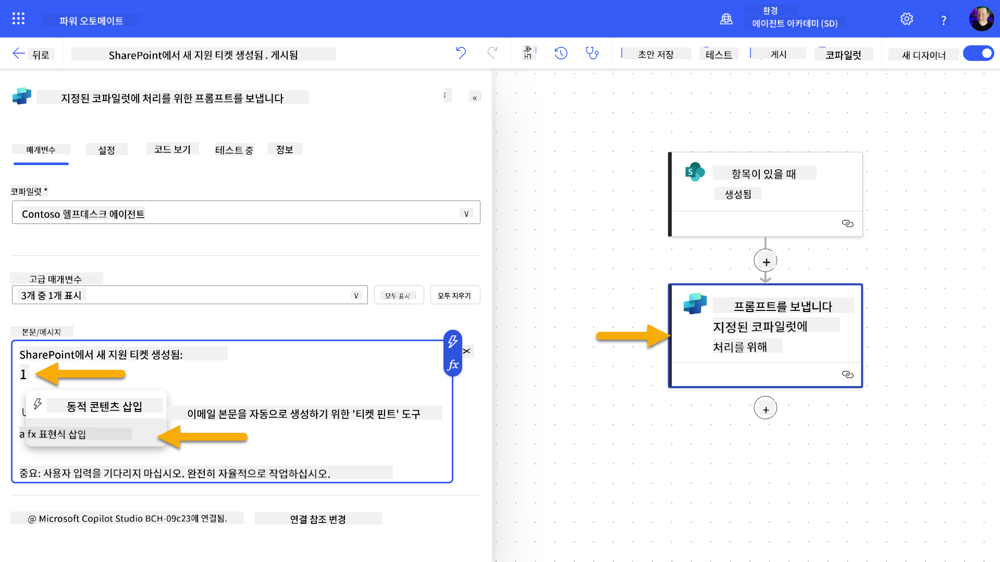

1. 티켓에 대한 특정 세부 정보를 에이전트에 제공하기 위해 다음 표현식을 입력합니다:

    ```text
    concat('Submitted By Name: ', first(triggerOutputs()?['body/value'])?['Author/DisplayName'], '\nSubmitted By Email: ', first(triggerOutputs()?['body/value'])?['Author/Email'], '\nTitle: ', first(triggerOutputs()?['body/value'])?['Title'], '\nIssue Description: ', first(triggerOutputs()?['body/value'])?['Description'], '\nPriority: ', first(triggerOutputs()?['body/value'])?['Priority/Value'],'\nTicket ID : ', first(triggerOutputs()?['body/value'])?['ID'])
    ```

1. **추가**를 선택합니다  
   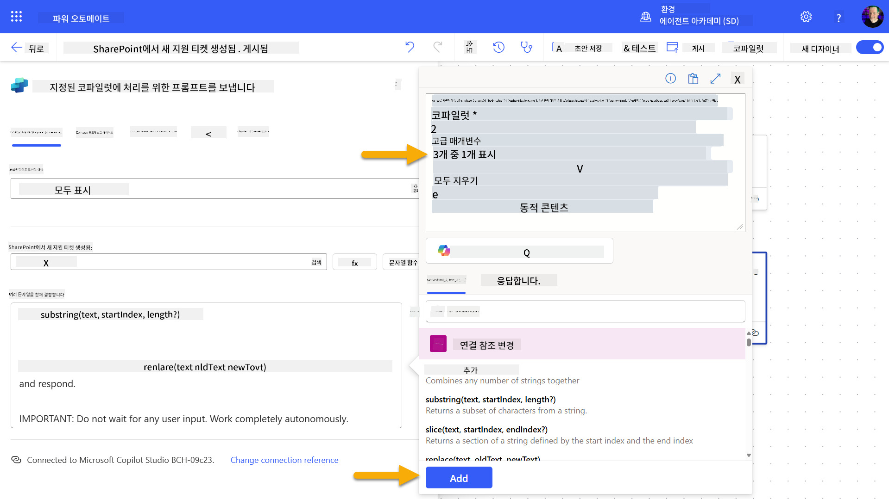

1. 상단 오른쪽 툴바에서 **게시**를 선택합니다.

### 10.3 이메일 확인 도구 생성

1. **Copilot Studio**에서 에이전트로 돌아갑니다

1. 에이전트의 **도구** 탭으로 이동합니다

1. **+ 도구 추가**를 클릭하고 **커넥터**를 선택합니다

1. **이메일 보내기 (V2)** 커넥터를 검색하고 선택합니다  
    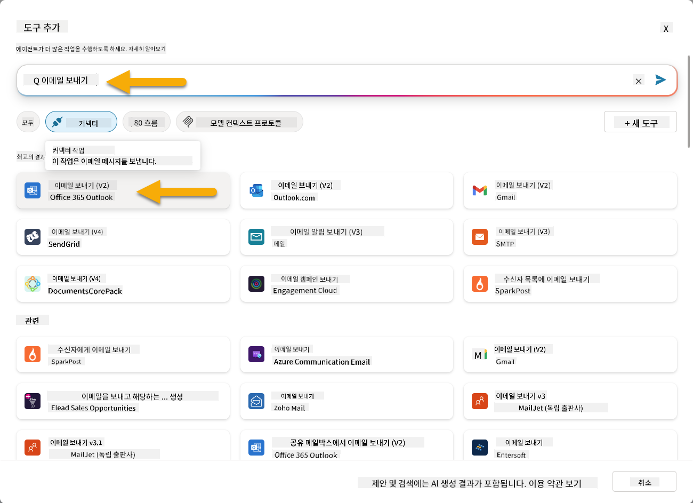

1. 연결 구성을 기다린 후 **추가 및 구성**을 선택합니다

1. 도구 설정을 구성합니다:

   - **이름**: SharePoint 티켓 확인
   - **설명**: 이 도구는 SharePoint 티켓이 접수되었음을 확인하는 이메일을 보냅니다.

1. **입력 매개변수** 옆의 **사용자 정의**를 선택하고 다음과 같이 구성합니다:

    **To**:

    - **설명**: SharePoint 티켓을 제출한 사람의 이메일 주소
    - **식별**: 이메일

    **Body**:

    - **설명**: 티켓이 접수되었으며, 3영업일 이내에 응답할 예정이라는 확인 메시지.

    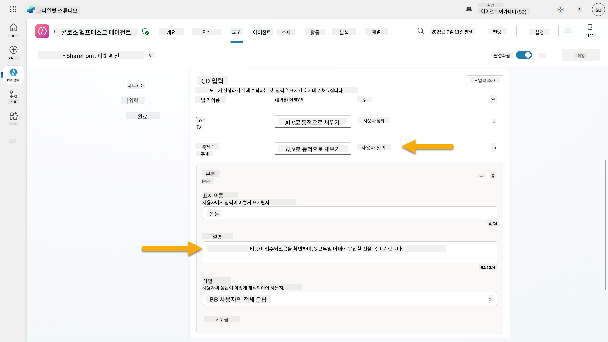

1. **저장**을 선택합니다

### 10.4 트리거 테스트

1. **헬프 데스크 에이전트** 내에서 **개요** 탭을 선택합니다
1. **SharePoint에서 새 지원 티켓 생성됨** 트리거 옆의 **트리거 테스트** 아이콘을 클릭합니다. **트리거 테스트** 창이 로드됩니다.
1. 새 브라우저 탭을 열고 **SharePoint IT 지원 티켓 목록**으로 이동합니다.  
1. **+ 새 항목 추가**를 클릭하여 테스트 티켓을 생성합니다:  
   - **제목**: "VPN 연결 불가"  
   - **설명**: "최근 업데이트 이후 회사 WIFI 네트워크에 연결할 수 없음"  
   - **우선순위**: "보통"  

1. SharePoint 항목을 **저장**합니다.  
    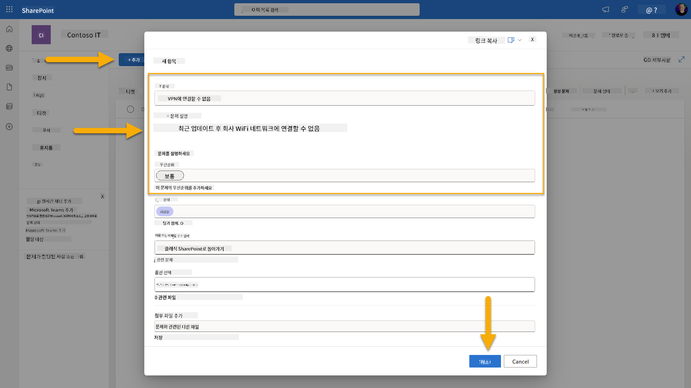  
1. **Copilot Studio**로 돌아가 **트리거 테스트** 패널에서 트리거 활성화를 모니터링합니다. **새로고침** 아이콘을 사용하여 트리거 이벤트를 로드합니다. 이 작업은 몇 분이 걸릴 수 있습니다.  
    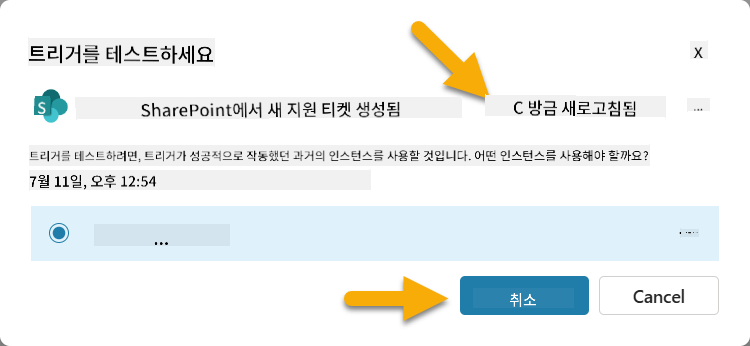  
1. 트리거가 나타나면 **테스트 시작**을 선택합니다.  
1. **테스트 에이전트** 패널 상단의 **활동 맵 아이콘**을 선택합니다.  
1. 에이전트가 다음을 수행했는지 확인합니다:  
   - 트리거 페이로드를 수신했는지  
   - "SharePoint 티켓 확인" 도구를 호출했는지  
     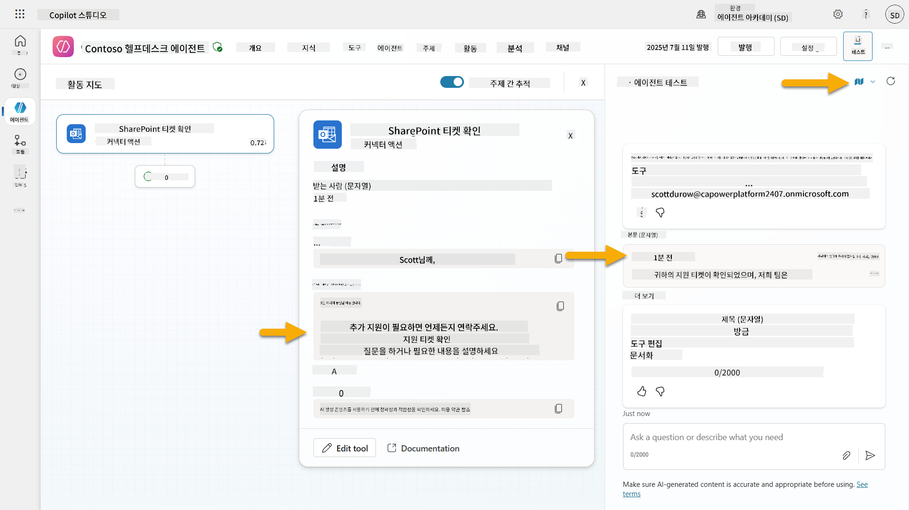  
1. 제출자의 이메일 받은 편지함을 확인하여 확인 이메일이 전송되었는지 확인합니다.  
    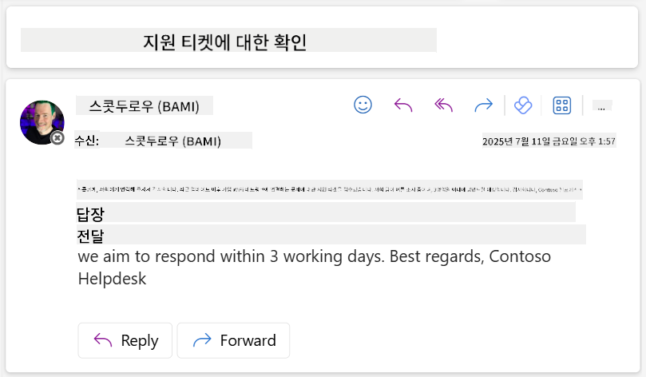  
1. Copilot Studio의 **활동** 탭을 검토하여 트리거 및 도구 실행 전체를 확인합니다.  

## ✅ 미션 완료  

🎉 **축하합니다!** 이벤트 트리거와 커넥터 도구를 성공적으로 구현하여 에이전트가 자율적으로 작동하고, 사용자 개입 없이 이메일 확인을 자동으로 전송하며 지원 티켓을 처리할 수 있게 되었습니다. 에이전트가 게시되면 여러분을 대신하여 자율적으로 작동할 것입니다.  

🚀 **다음 단계**: 다음 강의에서는 에이전트를 Microsoft Teams와 Microsoft 365 Copilot에 [게시하는 방법](../11-publish-your-agent/README.md)을 배워 조직 전체에서 사용할 수 있도록 설정합니다!  

⏭️ [**에이전트 게시** 강의로 이동](../11-publish-your-agent/README.md)  

## 📚 실용적인 자료  

이벤트 트리거와 자율 에이전트에 대해 더 깊이 알아볼 준비가 되셨나요? 아래 자료를 확인하세요:  

- **Microsoft Learn**: [Copilot Studio에서 에이전트를 자율적으로 만들기](https://learn.microsoft.com/training/modules/autonomous-agents-online-workshop/?WT.mc_id=power-177340-scottdurow)  
- **문서**: [이벤트 트리거 추가](https://learn.microsoft.com/microsoft-copilot-studio/authoring-trigger-event?WT.mc_id=power-177340-scottdurow)  
- **모범 사례**: [Power Automate 트리거 소개](https://learn.microsoft.com/power-automate/triggers-introduction?WT.mc_id=power-177340-scottdurow)  
- **고급 시나리오**: [에이전트와 함께 Power Automate 흐름 사용](https://learn.microsoft.com/microsoft-copilot-studio/advanced-flow-create?WT.mc_id=power-177340-scottdurow)  
- **보안**: [Copilot Studio의 데이터 손실 방지](https://learn.microsoft.com/microsoft-copilot-studio/admin-data-loss-prevention?WT.mc_id=power-177340-scottdurow)  

<!-- markdownlint-disable-next-line MD033 -->
  

---

**면책 조항**:  
이 문서는 AI 번역 서비스 [Co-op Translator](https://github.com/Azure/co-op-translator)를 사용하여 번역되었습니다. 정확성을 위해 최선을 다하고 있지만, 자동 번역에는 오류나 부정확성이 포함될 수 있습니다. 원본 문서의 원어 버전을 권위 있는 출처로 간주해야 합니다. 중요한 정보의 경우, 전문적인 인간 번역을 권장합니다. 이 번역 사용으로 인해 발생하는 오해나 잘못된 해석에 대해 책임지지 않습니다.