<!--
CO_OP_TRANSLATOR_METADATA:
{
  "original_hash": "9dceeba2eae2bb73e328602a060eddab",
  "translation_date": "2025-10-22T00:50:42+00:00",
  "source_file": "docs/recruit/11-publish-your-agent/README.md",
  "language_code": "ko"
}
-->
# 🚨 미션 11: 에이전트 게시하기

## 🕵️‍♂️ 코드명: `OPERATION PUBLISH PUBLISH PUBLISH`

> **⏱️ 작전 시간:** `~30분`  

🎥 **워크스루 시청하기**

## 🎯 미션 개요

여러 도전적인 모듈을 완료한 후, 에이전트 제작자님, 이제 가장 중요한 단계인 에이전트 게시를 준비할 때입니다. 여러분의 창작물을 Microsoft Teams와 Microsoft 365 Copilot 사용자들에게 제공할 준비가 되었습니다.

명확한 임무, 강력한 도구, 그리고 주요 지식 소스에 대한 접근 권한을 갖춘 여러분의 에이전트는 이제 사용자들을 도울 준비가 되었습니다. Microsoft Copilot Studio를 사용하여 에이전트를 배포하고, 실제 사용자들이 일하는 곳에서 도움을 줄 수 있도록 설정하세요.

이제 에이전트를 실전에 투입할 시간입니다.

## 🔎 목표

📖 이번 레슨에서는 다음을 다룹니다:

1. 에이전트를 게시하는 것이 중요한 이유
1. 에이전트를 게시하면 어떤 일이 발생하는지
1. 채널 추가 방법 (Microsoft Teams 및 Microsoft 365 Copilot)
1. Microsoft Teams에 에이전트를 추가하는 방법
1. 조직 전체에서 Microsoft Teams에서 에이전트를 사용할 수 있도록 설정하는 방법

## 🚀 에이전트 게시하기

Copilot Studio에서 에이전트를 작업할 때마다 지식이나 도구를 추가하여 업데이트할 수 있습니다. 모든 변경 사항을 완료하고 철저히 테스트한 후에는 게시할 준비가 됩니다. 게시를 통해 최신 업데이트가 실시간으로 적용됩니다. 새로운 도구로 에이전트를 업데이트했지만 게시 버튼을 누르지 않으면 최종 사용자에게는 아직 제공되지 않습니다.

사용자에게 업데이트를 제공하려면 항상 게시 버튼을 눌러야 합니다. 에이전트에 채널이 추가되어 있을 경우, 게시 버튼을 누르면 업데이트가 에이전트에 추가된 모든 채널에 적용됩니다.

## ⚙️ 채널 구성하기

채널은 사용자가 에이전트에 접근하고 상호작용할 수 있는 위치를 결정합니다. 에이전트를 게시한 후 여러 채널에서 사용할 수 있도록 설정할 수 있습니다. 각 채널은 에이전트의 콘텐츠를 다르게 표시할 수 있습니다.

다음 채널에 에이전트를 추가할 수 있습니다:

- **Microsoft Teams 및 Microsoft 365 Copilot** - Teams 채팅 및 회의, Microsoft 365 Copilot 환경에서 에이전트를 사용할 수 있도록 설정 ([자세히 알아보기](https://learn.microsoft.com/microsoft-copilot-studio/publication-add-bot-to-microsoft-teams))
- **데모 웹사이트** - Copilot Studio에서 제공하는 데모 웹사이트에서 에이전트를 테스트 ([자세히 알아보기](https://learn.microsoft.com/microsoft-copilot-studio/publication-connect-bot-to-web-channels))
- **사용자 정의 웹사이트** - 에이전트를 직접 웹사이트에 삽입 ([자세히 알아보기](https://learn.microsoft.com/microsoft-copilot-studio/publication-connect-bot-to-web-channels))
- **모바일 앱** - 사용자 정의 모바일 애플리케이션에 에이전트 통합 ([자세히 알아보기](https://learn.microsoft.com/microsoft-copilot-studio/publication-connect-bot-to-custom-application))
- **SharePoint** - SharePoint 사이트에 에이전트를 추가하여 문서 및 사이트 지원 제공 ([자세히 알아보기](https://learn.microsoft.com/microsoft-copilot-studio/publication-add-bot-to-sharepoint))
- **Facebook Messenger** - Facebook 메시징 플랫폼을 통해 사용자와 연결 ([자세히 알아보기](https://learn.microsoft.com/microsoft-copilot-studio/publication-add-bot-to-facebook))
- **Power Pages** - Power Pages 웹사이트에 에이전트 통합 ([자세히 알아보기](https://learn.microsoft.com/microsoft-copilot-studio/publication-add-bot-to-power-pages))
- **Azure Bot Service 채널** - Slack, Telegram, Twilio SMS 등 추가 채널에 접근 ([자세히 알아보기](https://learn.microsoft.com/microsoft-copilot-studio/publication-connect-bot-to-azure-bot-service-channels))

채널을 추가하려면 에이전트의 **채널** 탭으로 이동하여 구성하려는 채널을 선택하세요. 각 채널은 특정 설정 요구사항이 있으며 추가 인증 또는 구성 단계가 필요할 수 있습니다.

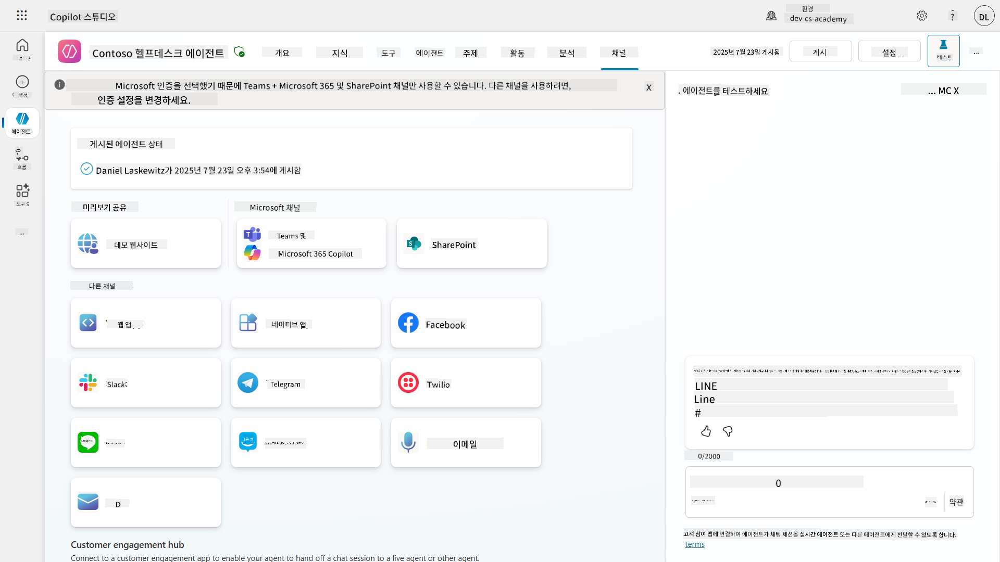

## 📺 채널 경험

채널마다 사용자 경험이 다릅니다. 여러 채널용 에이전트를 구축할 때는 채널별 차이를 인지하는 것이 중요합니다. 에이전트를 여러 채널에서 테스트하여 의도한 대로 작동하는지 확인하는 것이 항상 좋은 전략입니다.

| 경험                              | 웹사이트       | Teams 및 Microsoft 365 Copilot         | Facebook                 | Dynamics Omnichannel for Customer Service                   |
| --------------------------------- | ------------- | --------------------------------------- | ------------------------ | ----------------------------------------------------------- |
| [고객 만족도 설문조사][1]         | 적응형 카드    | 텍스트 전용                             | 텍스트 전용              | 텍스트 전용                                                 |
| [다중 선택 옵션][1]               | 지원됨         | [최대 6개 지원 (히어로 카드)][4]        | [최대 13개 지원][6]      | [부분적으로 지원됨][8]                                      |
| [Markdown][2]                     | 지원됨         | [부분적으로 지원됨][5]                  | [부분적으로 지원됨][7]    | [부분적으로 지원됨][9]                                      |
| [환영 메시지][1]                  | 지원됨         | 지원됨                                  | 지원되지 않음            | [채팅][10]에서는 지원됨. 다른 채널에서는 지원되지 않음.     |
| [Did-You-Mean][3]                 | 지원됨         | 지원됨                                  | 지원됨                  | [Microsoft Teams][11], [채팅][10], Facebook, 텍스트 전용 채널(SMS, [TeleSign][12], [Twilio][13], [WhatsApp][14], [WeChat][15], [Twitter][16])에서 지원됨. 제안된 작업은 텍스트 전용 목록으로 표시되며, 사용자는 응답하려면 옵션을 다시 입력해야 합니다. |

[1]: https://learn.microsoft.com/microsoft-copilot-studio/authoring-create-edit-topics
[2]: https://daringfireball.net/projects/markdown/
[3]: https://learn.microsoft.com/microsoft-copilot-studio/advanced-ai-features
[4]: https://learn.microsoft.com/microsoftteams/platform/concepts/cards/cards-reference#hero-card
[5]: https://learn.microsoft.com/microsoftteams/platform/bots/how-to/format-your-bot-messages#text-only-messages
[6]: https://developers.facebook.com/docs/messenger-platform/send-messages/quick-replies/
[7]: https://www.facebook.com/help/147348452522644?helpref=related
[8]: https://learn.microsoft.com/dynamics365/customer-service/asynchronous-channels#suggested-actions-support
[9]: https://learn.microsoft.com/dynamics365/customer-service/asynchronous-channels#preview-support-for-formatted-messages
[10]: https://learn.microsoft.com/dynamics365/customer-service/set-up-chat-widget
[11]: https://learn.microsoft.com/dynamics365/customer-service/configure-microsoft-teams
[12]: https://learn.microsoft.com/dynamics365/customer-service/configure-sms-channel
[13]: https://learn.microsoft.com/dynamics365/customer-service/configure-sms-channel-twilio
[14]: https://learn.microsoft.com/dynamics365/customer-service/configure-whatsapp-channel
[15]: https://learn.microsoft.com/dynamics365/customer-service/configure-wechat-channel
[16]: https://learn.microsoft.com/dynamics365/customer-service/configure-twitter-channel

> [!NOTE]
> 채널별로 다른 로직을 사용하는 예시가 있습니다. 예를 들어, Microsoft Teams 채널에서 다른 적응형 카드를 표시하는 방법은 Power Platform Snippets 저장소에서 확인할 수 있습니다:
>
> Henry Jammes가 Microsoft Teams 채널에서 다른 적응형 카드를 표시하는 예제를 공유했습니다. ([예제 링크](https://github.com/pnp/powerplatform-snippets/blob/main/copilot-studio/multiple-topics-matched-topic/source/multiple-topics-matched.yaml#L40))

## 🧪 실습 11: 에이전트를 Teams 및 Microsoft 365 Copilot에 게시하기

### 🎯 사용 사례

Contoso IT 헬프데스크 에이전트는 이제 강력한 기능으로 완전히 구성되었습니다. SharePoint 지식 소스에 접근하고, 지원 티켓을 생성하며, 사전 알림을 보내고, 사용자 질문에 지능적으로 응답할 수 있습니다. 하지만 이러한 모든 기능은 현재 여러분이 작업한 개발 환경에서만 사용할 수 있습니다.

**도전 과제:** 최종 사용자가 에이전트의 기능을 활용하려면 에이전트를 적절히 게시하고 실제로 사용하는 채널에서 접근 가능하도록 만들어야 합니다.

**해결책:** 에이전트를 게시하면 최근 업데이트, 새로운 주제, 향상된 지식 소스, 구성된 흐름이 포함된 최신 버전이 실제 사용자에게 제공됩니다. 게시하지 않으면 사용자는 중요한 기능이 누락된 이전 버전의 에이전트와 상호작용하게 됩니다.

Teams 및 Microsoft 365 Copilot 채널을 추가하는 것도 매우 중요합니다. 그 이유는 다음과 같습니다:

- **Teams 통합**: 조직의 직원들은 대부분의 시간을 Microsoft Teams에서 협업, 회의, 커뮤니케이션에 사용합니다. Teams에 에이전트를 추가하면 사용자가 주요 작업 환경을 벗어나지 않고 IT 지원을 받을 수 있습니다.
- **Microsoft 365 Copilot**: 사용자는 Microsoft 365 Copilot 환경 내에서 IT 헬프데스크 에이전트를 직접 사용할 수 있어 Office 애플리케이션 전반에 걸쳐 일상적인 워크플로에 원활하게 통합됩니다.
- **중앙화된 접근**: 별도의 웹사이트나 애플리케이션을 기억할 필요 없이, 사용자는 이미 사용 중인 플랫폼을 통해 IT 지원에 접근할 수 있어 마찰을 줄이고 채택률을 높입니다.

이 미션은 여러분의 개발 작업을 실제로 조직의 최종 사용자에게 가치를 제공하는 프로덕션 준비 솔루션으로 변환합니다.

### 사전 준비

이 실습을 시작하기 전에 다음을 확인하세요:

- ✅ 이전 실습을 완료하고 완전히 구성된 Contoso 헬프데스크 에이전트를 보유
- ✅ 에이전트가 테스트를 완료하고 프로덕션 사용 준비가 완료됨
- ✅ Copilot Studio 환경에서 에이전트를 게시할 수 있는 권한 보유
- ✅ 조직 내 Microsoft Teams에 접근 가능

### 11.1 에이전트 게시하기

이제 에이전트 작업이 모두 완료되었으니, 최종 사용자가 에이전트를 사용할 수 있도록 모든 작업을 게시해야 합니다. 콘텐츠를 모든 사용자에게 제공하려면 에이전트를 게시해야 합니다.

1. Copilot Studio에서 Contoso 헬프데스크 에이전트로 이동 (via [Copilot Studio 제작자 포털](https://copilotstudio.microsoft.com))

    Copilot Studio에서는 에이전트를 쉽게 게시할 수 있습니다. 에이전트 개요 상단에서 게시 버튼을 선택하면 됩니다.

    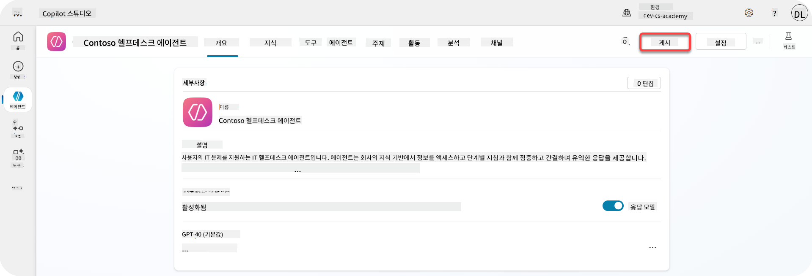

1. 에이전트에서 **게시** 버튼 선택

    게시 팝업이 열리며, 에이전트를 정말로 게시할 것인지 확인합니다.

    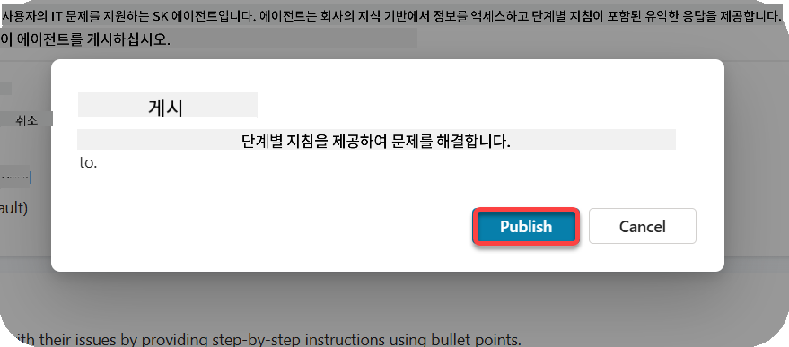

1. **게시**를 선택하여 에이전트 게시 확인

    이제 에이전트가 게시 중이라는 메시지가 표시됩니다. 팝업을 열어둘 필요는 없습니다. 에이전트가 게시되면 알림을 받게 됩니다.

    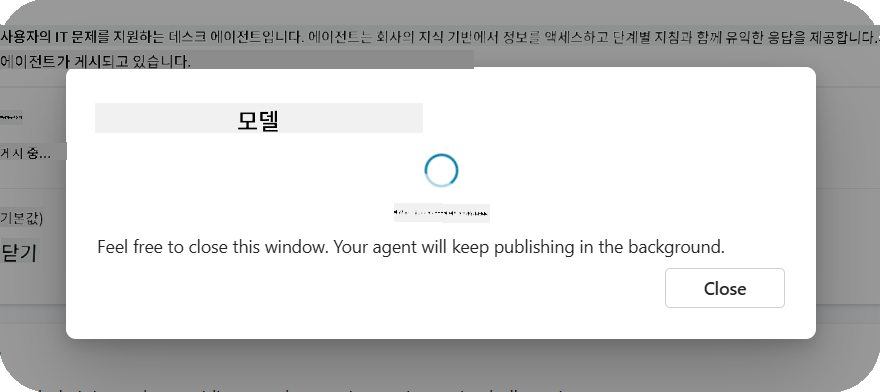

    에이전트 게시가 완료되면 에이전트 페이지 상단에 알림이 표시됩니다.

    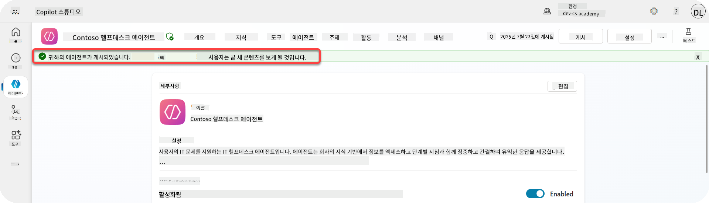

하지만 - 에이전트를 게시했을 뿐, 아직 채널에 추가하지 않았습니다. 이제 이를 해결해 봅시다!

### 11.2 Teams 및 Microsoft 365 Copilot 채널 추가하기

1. 에이전트에 Teams 및 Microsoft 365 Copilot 채널을 추가하려면 에이전트 상단 탐색에서 **채널**을 선택합니다.

    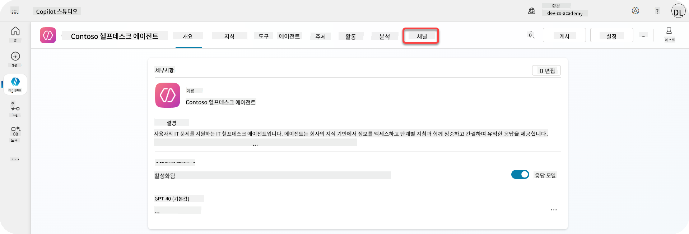

    여기에서 이 에이전트에 추가할 수 있는 모든 채널을 확인할 수 있습니다.

1. **Teams 및 Microsoft 365** 선택

    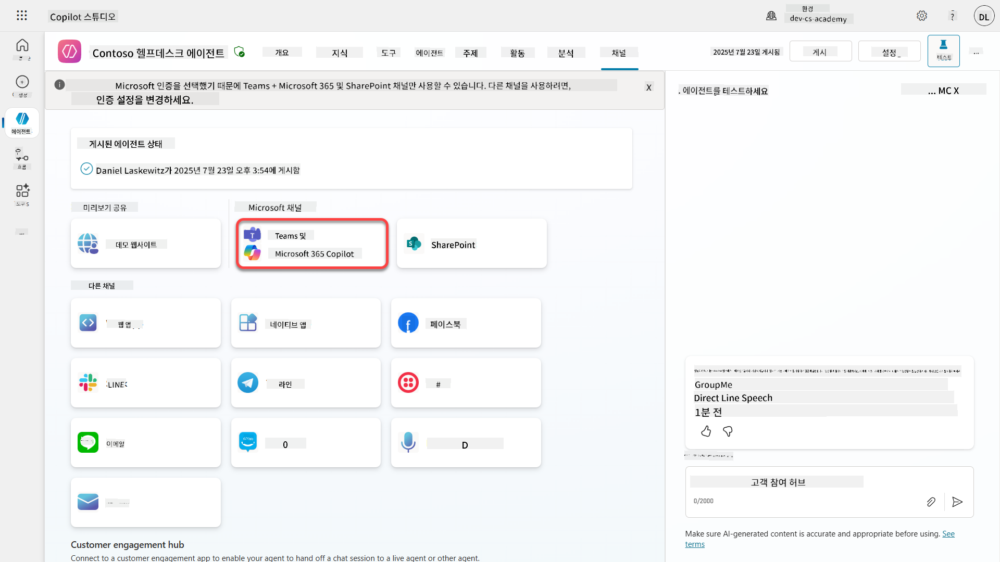

1. **채널 추가**를 선택하여 마법사를 완료하고 채널을 에이전트에 추가

    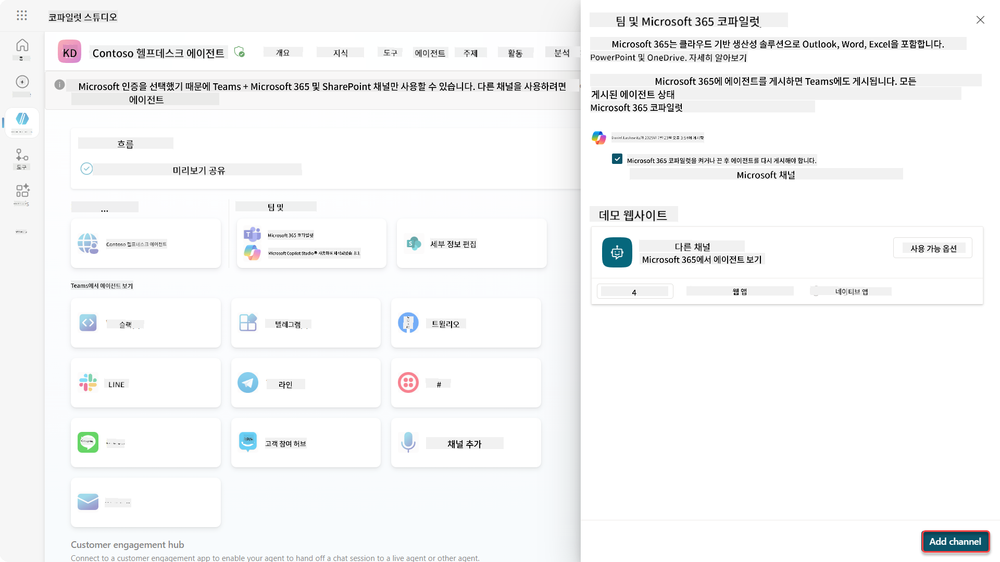

    추가하는 데 약간의 시간이 걸립니다. 추가가 완료되면 사이드바 상단에 녹색 알림이 나타납니다.

    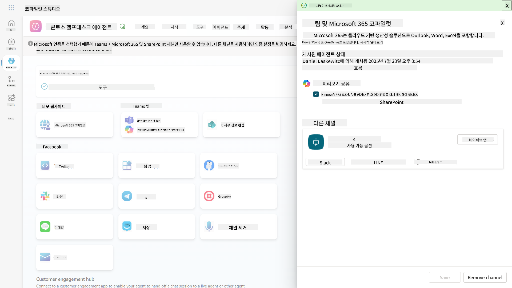

1. **Teams에서 에이전트 보기**를 선택하여 새 탭 열기

    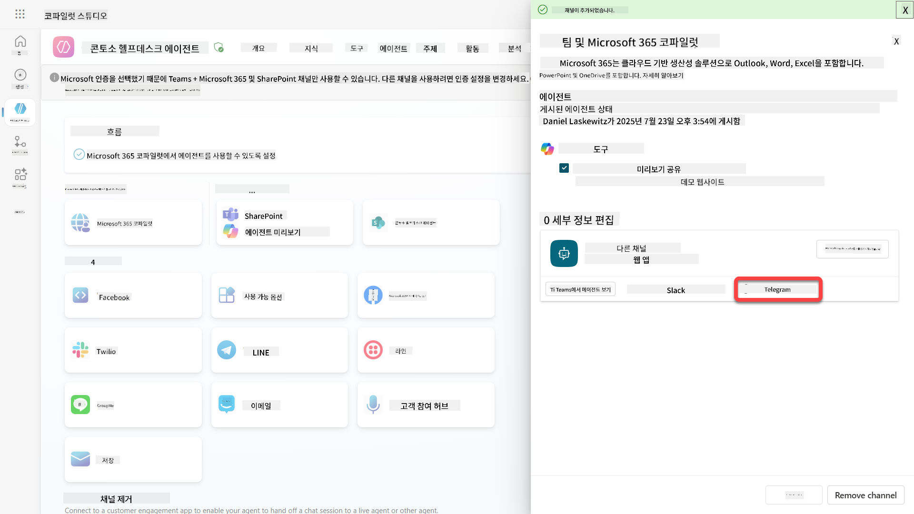

1. **추가**를 선택하여 Contoso 헬프데스크 에이전트를 Teams에 추가

    

    약간의 시간이 걸립니다. 완료되면 다음 화면이 표시됩니다:

    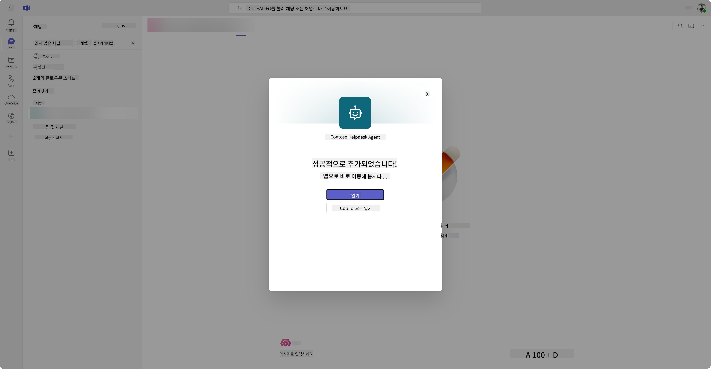

1. **열기**를 선택하여 Teams에서 에이전트 열기

    이 작업은 에이전트를 Teams 앱으로 엽니다.

    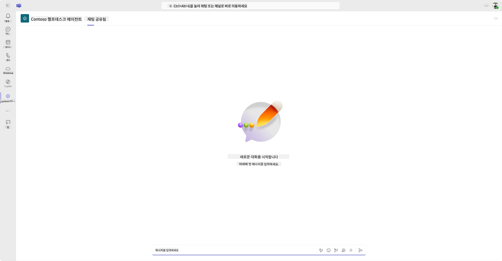

이제 Microsoft Teams에서 여러분을 위해 작동하는 에이전트를 게시했지만, 이를 더 많은 사람들에게 제공하고 싶을 수도 있습니다.

### 11.3 테넌트의 모든 사용자에게 에이전트 제공하기

1. Contoso 헬프데스크 에이전트가 열려 있는 브라우저 탭 닫기

    이렇게 하면 Copilot Studio로 돌아가며, Teams 및 Microsoft 365 Copilot 사이드 패널이 여전히 열려 있습니다. 지금은 에이전트를 Teams에서 열었지만, 여기서 더 많은 작업을 할 수 있습니다. 에이전트의 세부 정보를 편집하거나, 더 많은 사용자에게 배포할 수 있습니다.

1. **세부 정보 편집** 선택

    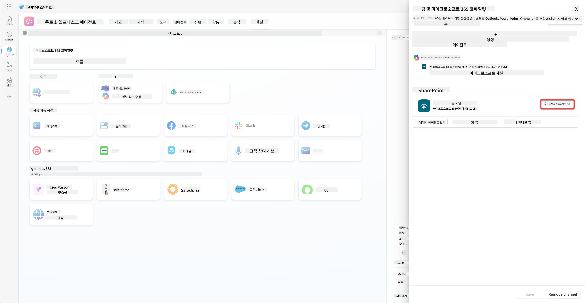
이 패널을 열면 에이전트의 여러 세부 정보와 설정을 변경할 수 있습니다. 아이콘, 아이콘의 배경색, 설명과 같은 기본 정보를 변경할 수 있습니다. 또한 Teams 설정(예: 사용자가 에이전트를 팀에 추가하거나 그룹 및 회의 채팅에서 이 에이전트를 사용할 수 있도록 허용)을 변경할 수도 있습니다. *더 보기*를 선택하면 개발자 이름, 웹사이트, 개인정보 보호 정책, 이용 약관과 같은 개발자 세부 정보도 변경할 수 있습니다.

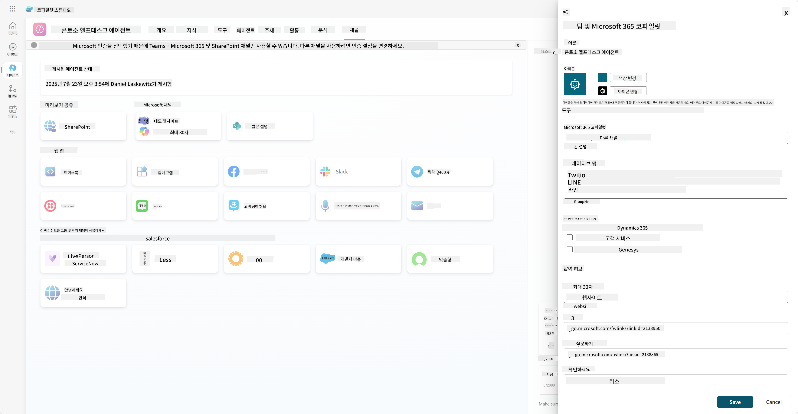

1. **취소**를 선택하여 세부 정보 편집 패널을 닫습니다.

1. **사용 가능 옵션**을 선택합니다.

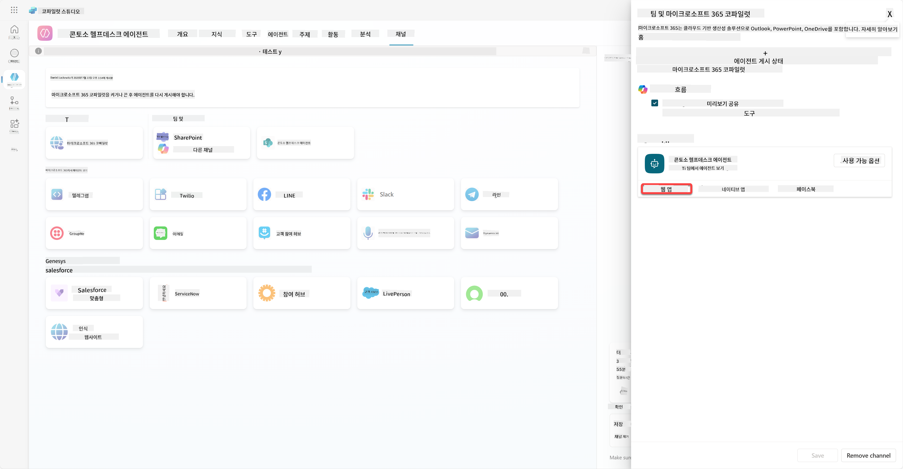

이 패널을 열면 사용자가 이 에이전트를 사용할 수 있도록 링크를 복사하여 보낼 수 있습니다(참고로, 에이전트를 사용자와 공유해야 합니다). 또한 Microsoft Teams 또는 Microsoft 365 스토어에 에이전트를 추가하기 위한 파일을 다운로드할 수 있습니다. 스토어에 에이전트를 표시하려면 다른 옵션도 있습니다. 팀원 및 공유 사용자에게 표시하여 *Power Platform으로 제작됨* 섹션에 표시하거나 조직 내 모든 사람에게 표시할 수 있습니다(관리자 승인이 필요).

1. **내 조직의 모든 사람에게 표시**를 선택합니다.

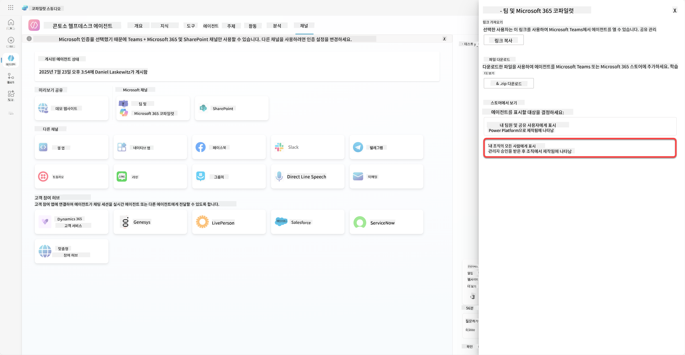

1. **관리자 승인 제출**을 선택합니다.

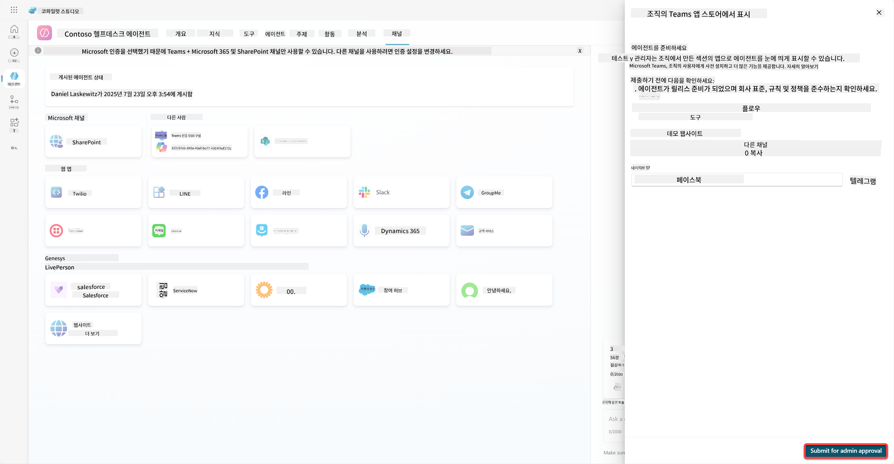

이제 관리자가 에이전트 제출을 승인해야 합니다. 관리자는 Teams 관리 센터로 이동하여 앱에서 Contoso Helpdesk Agent를 찾아 승인할 수 있습니다. 아래 스크린샷에서 관리자가 Teams 관리 센터에서 볼 수 있는 화면을 확인할 수 있습니다.

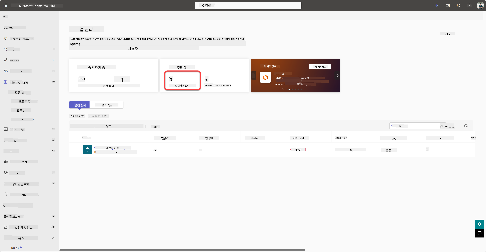

관리자는 Contoso Helpdesk Agent를 선택하고 *게시*를 선택하여 Contoso Helpdesk Agent를 모든 사용자에게 게시해야 합니다.

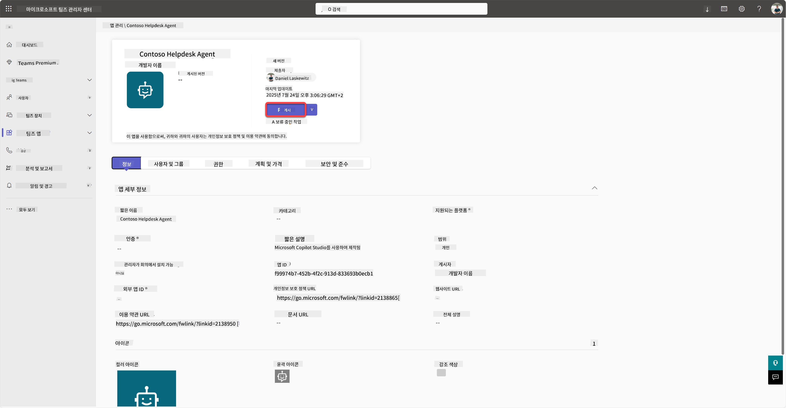

관리자가 에이전트 제출을 게시하면 Copilot Studio를 새로고침하여 사용 가능 옵션에서 *앱 스토어에서 사용 가능* 배너를 확인할 수 있습니다.

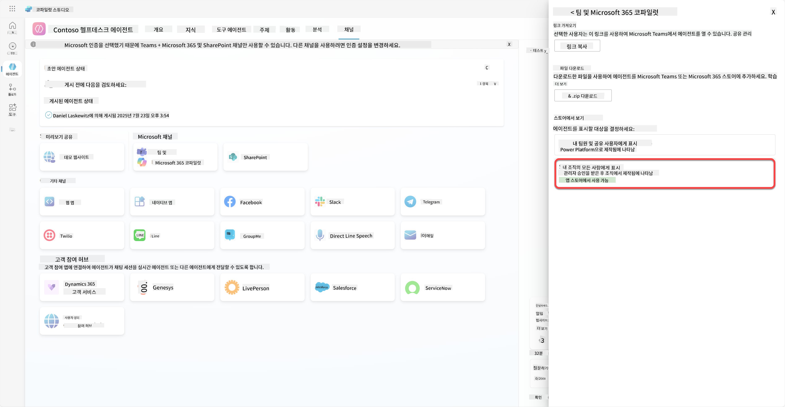

여기에는 더 많은 가능성이 있습니다. 관리자는 글로벌 설정 정책을 변경하고 테넌트의 모든 사용자에게 Contoso Helpdesk Agent를 자동 설치할 수 있습니다. 게다가 Contoso Helpdesk Agent를 왼쪽 레일에 고정하여 모든 사용자가 쉽게 접근할 수 있도록 할 수 있습니다.

## ✅ 미션 완료

🎉 **축하합니다!** 에이전트를 성공적으로 게시하고 Teams 및 Microsoft 365 Copilot에 추가했습니다! 다음은 코스의 마지막 미션입니다: 라이선스 이해하기.

⏭️ [**라이선스 이해하기** 레슨으로 이동](../12-understanding-licensing/README.md)

## 📚 전술적 자료

🔗 [게시 채널 문서](https://learn.microsoft.com/microsoft-copilot-studio/publication-fundamentals-publish-channels)

---

**면책 조항**:  
이 문서는 AI 번역 서비스 [Co-op Translator](https://github.com/Azure/co-op-translator)를 사용하여 번역되었습니다. 정확성을 위해 최선을 다하지만, 자동 번역에는 오류나 부정확성이 포함될 수 있습니다. 원본 문서의 원어를 권위 있는 출처로 간주해야 합니다. 중요한 정보의 경우, 전문적인 인간 번역을 권장합니다. 이 번역 사용으로 인해 발생하는 오해나 잘못된 해석에 대해 책임지지 않습니다.