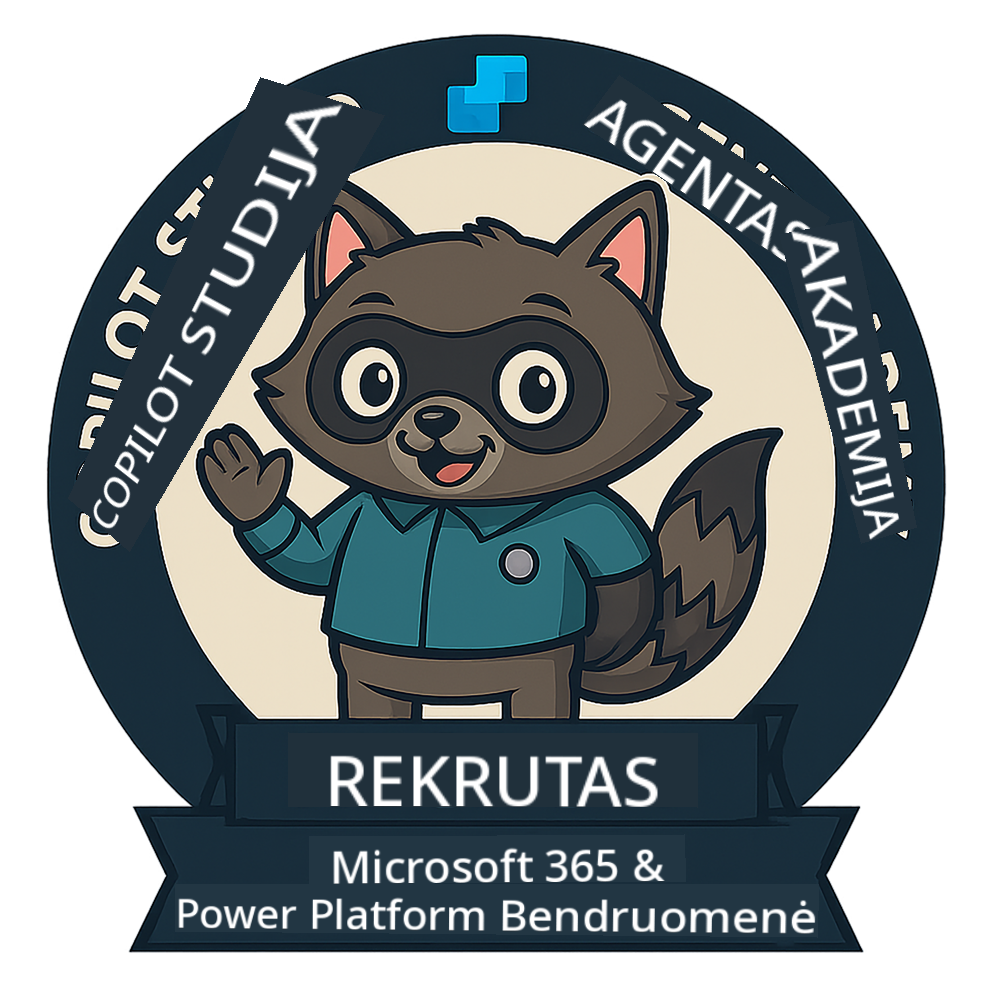

<!--
CO_OP_TRANSLATOR_METADATA:
{
  "original_hash": "15e57e059ce7689d602d7853187235cd",
  "translation_date": "2025-10-21T23:43:36+00:00",
  "source_file": "docs/index.md",
  "language_code": "lt"
}
-->
---
hide:
- navigation
---

# Copilot Studio Agentų Akademija

**Sveiki atvykę į Copilot Studio Agentų Akademiją.**  

Jūsų misija—jei nuspręsite ją priimti—yra įvaldyti agentų kūrimo meną naudojant **Microsoft Copilot Studio**.

Ši praktinė mokymo programa yra jūsų įėjimo taškas į **agentų pasaulį**: nuo pagrįstų užklausų iki Adaptive Cards ir agentų srautų, jūs išmoksite kurti, plėsti ir diegti intelektualius agentus, naudodami realius įrankius ir praktinius pavyzdžius.

---

## 🏅 Rangų progresija

**Copilot Studio Agentų Akademija** yra daugiapakopė mokymo programa, skirta ugdyti jūsų įgūdžius per tris agentų rangus. Kiekvienas lygis apima ženkliuką ir didėjančias atsakomybes:

| Rangas           | Lygis | Vizualas |
|------------------|:-----:|--------|
| 🟢 **Naujokas**  [🚀 Pradėti](https://aka.ms/agent-academy-recruit){ .md-button .md-button--primary }     | •     | { width="300" }     |
| 🔵 **Operatyvinis agentas** (Netrukus)   | ••    | { width="300" } |
| 🟡 **Komandoras** (Netrukus)    | •••   | { width="300" } |

Kiekvienas lygis remiasi ankstesniu. Baigkite savo Naujoko misiją ir sekite naujienas, kad galėtumėte pakelti savo agento kvalifikaciją.

---

## 🎒 Kiti kursai

Peržiūrėkite šiuos kitus kursus, kad tęstumėte mokymąsi apie AI ir agentus:

- [Microsoft Copilot Studio <3 MCP Lab](https://aka.ms/mcsmcplab)
- [Copilot Developer Camp](https://microsoft.github.io/copilot-camp/)
- [AI Agentai pradedantiesiems](https://microsoft.github.io/ai-agents-for-beginners/)
- [Model Context Protocol (MCP) pradedantiesiems](https://github.com/microsoft/mcp-for-beginners)

---

## 🚑 Problemos

Labai vertiname jūsų atsiliepimus! Prašome naudoti [problemų sąrašą](https://github.com/microsoft/agent-academy/issues), kad pasidalintumėte savo komentarais ir problemomis. Ačiū!

---

## 📜 Elgesio kodeksas

Šis projektas priėmė [Microsoft atvirojo kodo elgesio kodeksą](https://opensource.microsoft.com/codeofconduct/).

!!! info "Ištekliai:"

    - [Microsoft atvirojo kodo elgesio kodeksas](https://opensource.microsoft.com/codeofconduct/)
    - [Microsoft elgesio kodekso DUK](https://opensource.microsoft.com/codeofconduct/faq/)
    - Susisiekite [opencode@microsoft.com](mailto:opencode@microsoft.com) dėl klausimų ar rūpesčių

---

[⭐️ Pažymėkite mūsų saugyklą](https://github.com/microsoft/agent-academy){ .md-button .md-button--primary }

<!-- markdownlint-disable-next-line MD033 -->

---

**Atsakomybės apribojimas**:  
Šis dokumentas buvo išverstas naudojant AI vertimo paslaugą [Co-op Translator](https://github.com/Azure/co-op-translator). Nors siekiame tikslumo, prašome atkreipti dėmesį, kad automatiniai vertimai gali turėti klaidų ar netikslumų. Originalus dokumentas jo gimtąja kalba turėtų būti laikomas autoritetingu šaltiniu. Dėl svarbios informacijos rekomenduojama profesionali žmogaus vertimo paslauga. Mes neprisiimame atsakomybės už nesusipratimus ar neteisingus interpretavimus, atsiradusius naudojant šį vertimą.