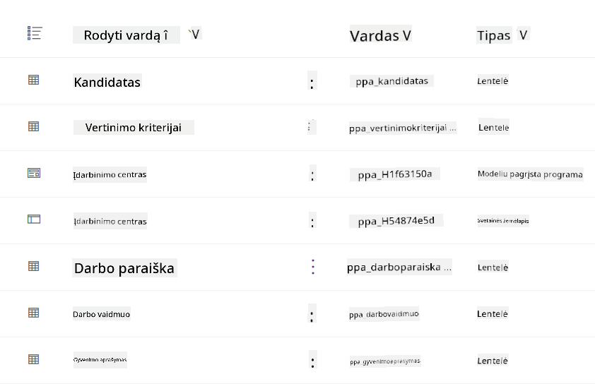
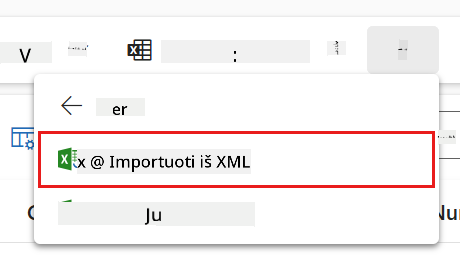
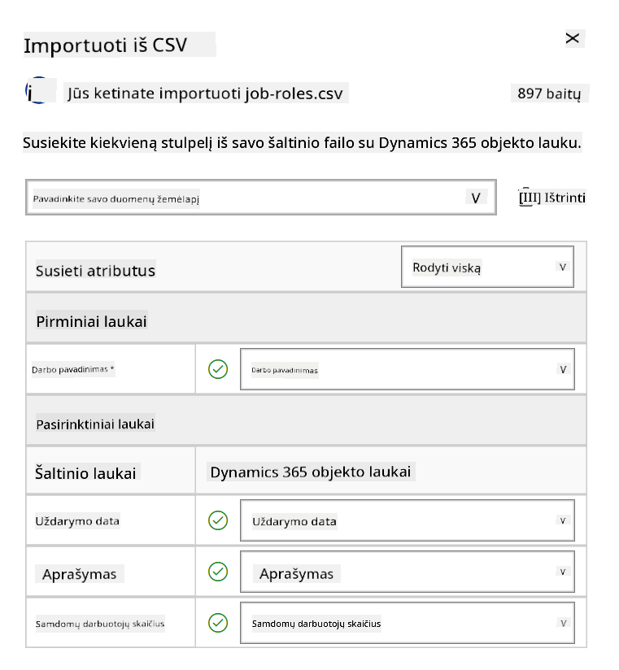
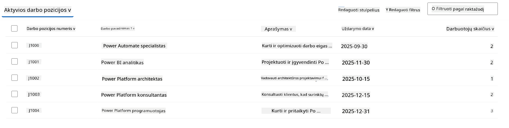
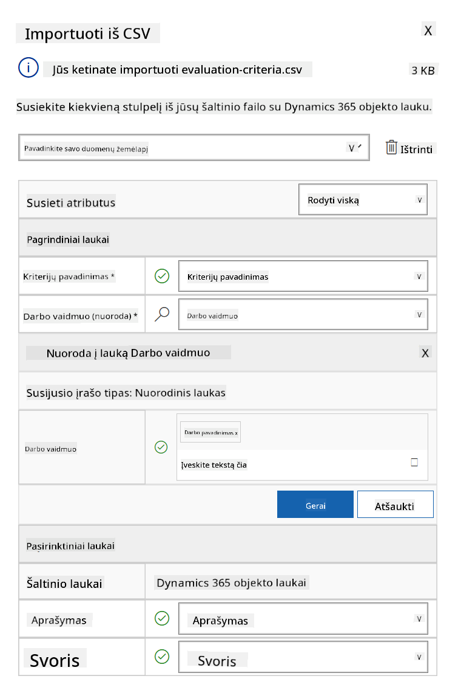
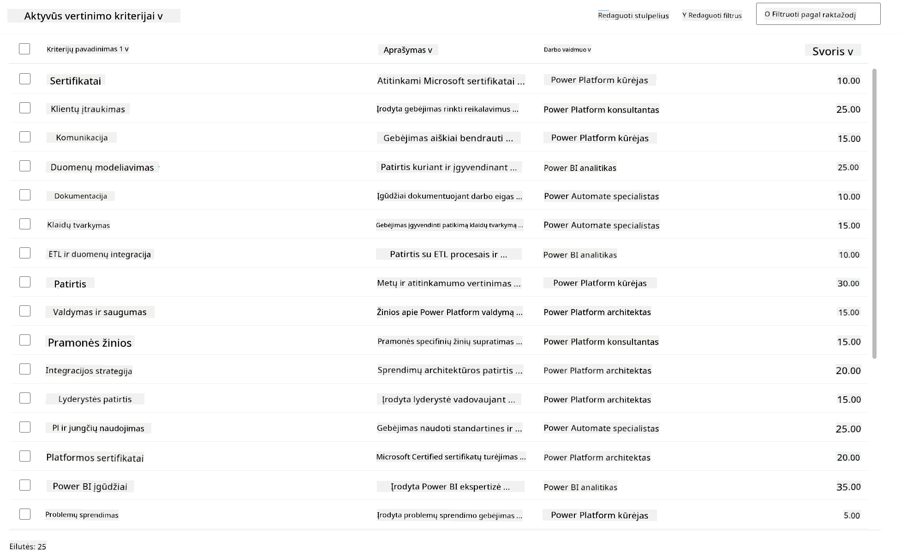

<!--
CO_OP_TRANSLATOR_METADATA:
{
  "original_hash": "2620cf9eaf09a3fc6be7fa31a3a62956",
  "translation_date": "2025-10-22T00:07:46+00:00",
  "source_file": "docs/operative-preview/01-get-started/README.md",
  "language_code": "lt"
}
-->
# 🚨 Misija 01: Pradėkite su Įdarbinimo Agentu

--8<-- "disclaimer.md"

## 🕵️‍♂️ SLAPTAŽODIS: `OPERACIJA TALENTŲ ŽVALGAS`

> **⏱️ Operacijos trukmė:** `~45 minutės`

## 🎯 Misijos aprašymas

Sveiki atvykę, agente. Jūsų pirmoji užduotis – **Operacija Talentų Žvalgas** – sukurti pagrindinę infrastruktūrą AI pagrįstai įdarbinimo sistemai, kuri pakeis organizacijų būdą identifikuoti ir samdyti geriausius talentus.

Jūsų misija, jei nuspręsite ją priimti, yra įdiegti ir sukonfigūruoti išsamią įdarbinimo valdymo sistemą naudojant Microsoft Copilot Studio. Jūs importuosite iš anksto paruoštą sprendimą, kuriame yra visi reikalingi duomenų struktūros elementai, o tada sukursite savo pirmąjį AI agentą – **Įdarbinimo Agentą**, kuris taps pagrindiniu visų būsimų įdarbinimo operacijų koordinatoriumi.

Šis pirminis diegimas sukuria valdymo centrą, kurį tobulinsite viso Agentų Akademijos Operatyvinės programos metu. Laikykite tai savo operacijų baze – pamatu, ant kurio vėliau statysite visą specializuotų agentų tinklą.

---

## 🔎 Tikslai

Atlikę šią misiją, jūs:

- **Scenarijaus supratimas**: Įgysite išsamų supratimą apie įdarbinimo automatizavimo iššūkius ir sprendimus
- **Sprendimo diegimas**: Sėkmingai importuosite ir sukonfigūruosite įdarbinimo valdymo sistemos pagrindus
- **Agentų kūrimas**: Sukursite įdarbinimo agentą, kuris taps scenarijaus, kurį kursite kaip Agentų Akademijos Operatyvas, pradžia

---

## 🔍 Reikalavimai

Prieš pradėdami šią misiją, įsitikinkite, kad turite:

- Copilot Studio licenciją
- Prieigą prie Microsoft Power Platform aplinkos
- Administratoriaus teises sprendimų ir agentų kūrimui

---

## 🏢 Įdarbinimo automatizavimo scenarijaus supratimas

Šis scenarijus parodo, kaip įmonė gali naudoti Microsoft Copilot Studio, kad pagerintų ir automatizuotų savo įdarbinimo procesą. Jame pristatoma agentų sistema, kuri kartu atlieka užduotis, tokias kaip gyvenimo aprašymų peržiūra, darbo pozicijų rekomendavimas, interviu medžiagos paruošimas ir kandidatų vertinimas.

### Verslo vertė

Sprendimas padeda HR komandoms taupyti laiką ir priimti geresnius sprendimus:

- Automatiškai apdorojant gyvenimo aprašymus, gautus el. paštu.
- Siūlant tinkamas darbo pozicijas pagal kandidatų profilius.
- Kuriant darbo paraiškas ir interviu gaires, pritaikytas kiekvienam kandidatui.
- Užtikrinant sąžiningą ir atitinkantį reikalavimus įdarbinimo procesą per integruotas saugumo ir moderavimo funkcijas.
- Renkant atsiliepimus, kad būtų galima tobulinti sprendimą.

### Kaip tai veikia

- Centrinis **Įdarbinimo Agentas** koordinuoja procesą ir saugo duomenis Microsoft Dataverse.
- **Paraiškų Priėmimo Agentas** skaito gyvenimo aprašymus ir kuria darbo paraiškas.
- **Interviu Paruošimo Agentas** generuoja interviu klausimus ir dokumentus pagal kandidato patirtį.
- Sistema gali būti publikuota demonstraciniame tinklalapyje, leidžiant suinteresuotiems asmenims su ja sąveikauti.

Šis scenarijus puikiai tinka organizacijoms, siekiančioms modernizuoti savo įdarbinimo darbo eigą naudojant AI pagrįstą automatizavimą, išlaikant skaidrumą, sąžiningumą ir efektyvumą.

---

## 🧪 Laboratorija: Įdarbinimo Agentas

Šioje praktinėje laboratorijoje sukursite savo įdarbinimo automatizavimo sistemos pagrindą. Pradėsite importuodami iš anksto sukonfigūruotą sprendimą, kuriame yra visi reikalingi Dataverse lentelės ir duomenų struktūros kandidatais, darbo pozicijomis ir įdarbinimo darbo eigomis valdyti. Tada užpildysite šias lenteles pavyzdiniais duomenimis, kurie padės mokytis viso šio modulio metu ir suteiks realistiškus scenarijus testavimui. Galiausiai sukursite Įdarbinimo Agentą Copilot Studio, nustatydami pagrindinę pokalbių sąsają, kuri taps pagrindu visoms kitoms funkcijoms, kurias pridėsite būsimose misijose.

### 🧪 Laboratorija 1.1: Sprendimo importavimas

1. Eikite į **[Copilot Studio](https://copilotstudio.microsoft.com)**
1. Pasirinkite **...** kairėje navigacijoje ir pasirinkite **Sprendimai**
1. Pasirinkite **Importuoti sprendimą** mygtuką viršuje
1. **[Atsisiųskite](https://raw.githubusercontent.com/microsoft/agent-academy/refs/heads/main/docs/operative-preview/01-get-started/assets/Operative_1_0_0_0.zip)** paruoštą sprendimą
1. Pasirinkite **Naršyti** ir pasirinkite atsisiųstą sprendimą iš ankstesnio žingsnio
1. Pasirinkite **Toliau**
1. Pasirinkite **Importuoti**

!!! success
    Jei importavimas sėkmingas, pamatysite žalią pranešimų juostą su šia žinute:  
    "Sprendimas "Operative" sėkmingai importuotas."

Kai sprendimas bus importuotas, peržiūrėkite, ką importavote, pasirinkdami sprendimo pavadinimą (`Operative`).



Importuoti šie komponentai:

| Pavadinimas | Tipas | Aprašymas |
|-------------|------|-------------|
| Kandidatas | Lentelė | Informacija apie kandidatus |
| Vertinimo kriterijai | Lentelė | Vertinimo kriterijai pozicijai |
| Įdarbinimo centras | Modeliu pagrįsta programa | Programa įdarbinimo procesui valdyti |
| Įdarbinimo centras | Svetainės žemėlapis | Navigacijos struktūra Įdarbinimo centro programai |
| Darbo paraiška | Lentelė | Darbo paraiškos |
| Darbo pozicija | Lentelė | Darbo pozicijos |
| Gyvenimo aprašymas | Lentelė | Kandidatų gyvenimo aprašymai |

Kaip paskutinę užduotį šioje laboratorijoje, pasirinkite **Publikuoti visas pritaikytas konfigūracijas** mygtuką puslapio viršuje.

### 🧪 Laboratorija 1.2: Pavyzdinių duomenų importavimas

Šioje laboratorijoje pridėsite pavyzdinius duomenis į kai kurias lenteles, kurias importavote laboratorijoje 1.1.

#### Atsisiųskite importuojamus failus

1. **[Atsisiųskite](https://raw.githubusercontent.com/microsoft/agent-academy/refs/heads/main/docs/operative-preview/01-get-started/assets/evaluation-criteria.csv)** CSV failą su vertinimo kriterijais
1. **[Atsisiųskite](https://raw.githubusercontent.com/microsoft/agent-academy/refs/heads/main/docs/operative-preview/01-get-started/assets/job-roles.csv)** CSV failą su darbo pozicijomis

#### Darbo pozicijų pavyzdinių duomenų importavimas

1. Grįžkite į sprendimą, kurį ką tik importavote paskutinėje laboratorijoje
1. Pasirinkite **Įdarbinimo centras** Modeliu pagrįstą programą, pažymėdami varnelę prieš eilutę
1. Pasirinkite **Leisti** mygtuką viršuje

    !!! warning
        Jums gali tekti prisijungti iš naujo. Įsitikinkite, kad tai padarėte. Po to turėtumėte matyti Įdarbinimo centro programą.

1. Pasirinkite **Darbo pozicijos** kairėje navigacijoje
1. Pasirinkite **Daugiau** piktogramą (trys taškai vienas po kitu) komandų juostoje
1. Pasirinkite **dešinę rodyklę** šalia *Importuoti iš Excel*

    

1. Pasirinkite **Importuoti iš CSV**

    

1. Pasirinkite **Pasirinkti failą** mygtuką, pasirinkite **job-roles.csv** failą, kurį ką tik atsisiuntėte, ir tada pasirinkite **Atidaryti**
1. Pasirinkite **Toliau**
1. Palikite kitą žingsnį kaip yra ir pasirinkite **Peržiūrėti susiejimą**

    

1. Įsitikinkite, kad susiejimas yra teisingas, ir pasirinkite **Baigti importą**

    !!! info
        Tai pradės importavimą, ir galėsite stebėti progresą arba užbaigti procesą iš karto pasirinkdami **Atlikta**

1. Pasirinkite **Atlikta**

Tai gali užtrukti šiek tiek laiko, bet galite paspausti **Atnaujinti** mygtuką, kad pamatytumėte, ar importavimas pavyko.



#### Vertinimo kriterijų pavyzdinių duomenų importavimas

1. Pasirinkite **Vertinimo kriterijai** kairėje navigacijoje
1. Pasirinkite **Daugiau** piktogramą (trys taškai vienas po kitu) komandų juostoje
1. Pasirinkite **dešinę rodyklę** šalia *Importuoti iš Excel*

    

1. Pasirinkite **Importuoti iš CSV**

    

1. Pasirinkite **Pasirinkti failą** mygtuką, pasirinkite **evaluation-criteria.csv** failą, kurį ką tik atsisiuntėte, ir tada pasirinkite **Atidaryti**
1. Pasirinkite **Toliau**
1. Palikite kitą žingsnį kaip yra ir pasirinkite **Peržiūrėti susiejimą**

    

1. Dabar turime atlikti šiek tiek daugiau darbo susiejimui. Pasirinkite didinamąjį stiklą (🔎 piktogramą) šalia Darbo pozicijos lauko
1. Įsitikinkite, kad **Darbo pavadinimas** yra pasirinktas, o jei ne – pridėkite jį
1. Pasirinkite **Gerai**
1. Įsitikinkite, kad likęs susiejimas taip pat yra teisingas, ir pasirinkite **Baigti importą**

    !!! info
        Tai vėl pradės importavimą, ir galėsite stebėti progresą arba užbaigti procesą iš karto pasirinkdami **Atlikta**

1. Pasirinkite **Atlikta**

Tai gali užtrukti šiek tiek laiko, bet galite paspausti **Atnaujinti** mygtuką, kad pamatytumėte, ar importavimas pavyko.



### 🧪 Laboratorija 1.3: Įdarbinimo agento kūrimas

Dabar, kai baigėte parengiamuosius darbus, laikas pradėti tikrąjį darbą! Pirmiausia pridėkime mūsų Įdarbinimo Agentą!

1. Eikite į **[Copilot Studio](https://copilotstudio.microsoft.com)** ir įsitikinkite, kad esate toje pačioje aplinkoje, kurioje importavote sprendimą ir duomenis
1. Pasirinkite **Agentai** kairėje navigacijoje
1. Pasirinkite **Naujas agentas**
1. Pasirinkite **Konfigūruoti**
1. Laukelyje **Pavadinimas** įveskite:

    ```text
    Hiring Agent
    ```

1. Laukelyje **Aprašymas** įveskite:

    ```text
    Central orchestrator for all hiring activities
    ```

1. Pasirinkite **...** šalia *Sukurti* mygtuko viršutiniame dešiniajame kampe
1. Pasirinkite **Atnaujinti išplėstinius nustatymus**
1. Kaip **Sprendimas**, pasirinkite `Operative`
1. Pasirinkite **Atnaujinti**
1. Pasirinkite **Sukurti** viršutiniame dešiniajame kampe

Tai sukurs Įdarbinimo Agentą, kurį naudosite viso šio Operatyvinio kurso metu.

---

## 🎉 Misija įvykdyta

Misija 01 baigta! Dabar jūs įvaldėte šiuos įgūdžius:

✅ **Scenarijaus supratimas**: Išsamus įdarbinimo automatizavimo iššūkių ir sprendimų supratimas  
✅ **Sprendimo diegimas**: Sėkmingai importuota ir sukonfigūruota įdarbinimo valdymo sistemos pagrindai  
✅ **Agentų kūrimas**: Sukurtas įdarbinimo agentas, kuris yra scenarijaus, kurį kursite kaip Agentų Akademijos Operatyvas, pradžia  

Toliau [Misija 02](../02-multi-agent/README.md): Padarykite savo agentą pasiruošusį dirbti su kitais agentais.

---

## 📚 Taktiniai ištekliai

📖 [Microsoft Copilot Studio - Sukurkite agentą](https://learn.microsoft.com/microsoft-copilot-studio/authoring-first-bot)  
📖 [Microsoft Dataverse Dokumentacija](https://learn.microsoft.com/power-apps/maker/data-platform)  

---

**Atsakomybės apribojimas**:  
Šis dokumentas buvo išverstas naudojant AI vertimo paslaugą [Co-op Translator](https://github.com/Azure/co-op-translator). Nors siekiame tikslumo, prašome atkreipti dėmesį, kad automatiniai vertimai gali turėti klaidų ar netikslumų. Originalus dokumentas jo gimtąja kalba turėtų būti laikomas autoritetingu šaltiniu. Dėl svarbios informacijos rekomenduojama profesionali žmogaus vertimo paslauga. Mes neprisiimame atsakomybės už nesusipratimus ar neteisingus interpretavimus, atsiradusius naudojant šį vertimą.