<!--
CO_OP_TRANSLATOR_METADATA:
{
  "original_hash": "75efaf515d5694d4fd549bfd6518901a",
  "translation_date": "2025-10-22T00:12:37+00:00",
  "source_file": "docs/operative-preview/03-automate-triggers/README.md",
  "language_code": "lt"
}
-->
# Misija 03: Pridėti įvykių paleidiklius, kad agentai veiktų savarankiškai

--8<-- "disclaimer.md"

## 🕵️‍♂️ SLAPTAŽODIS: `OPERACIJA SIGNALO TAŠKAS`

> **⏱️ Operacijos trukmė:** `~45 minutės`

## 🎯 Misijos aprašymas

Sveiki sugrįžę, agente. [Misijoje 02](../02-multi-agent/README.md) jūs išmokote sukurti Vaiko agentą paraiškų priėmimui ir susijusį agentą interviu pasiruošimui, kad išplėstumėte pagrindinio Įdarbinimo agento galimybes.

Jūsų užduotis, jei nuspręsite ją priimti, yra **Operacija Signalo Taškas** - gilintis į **įvykių paleidiklius**, kad jūsų agentų sistema pereitų nuo reaktyvios prie **autonominės veiklos**. Jūs transformuosite savo agentus iš laukiančių žmogaus įvesties į proaktyviai reaguojančius į išorinius įvykius ir priimančius protingus sprendimus be priežiūros.

Pagalvokite apie tai kaip apie atnaujinimą nuo agentų, kurie _atsako į klausimus_, iki agentų, kurie _numato poreikius_ ir _veikia savarankiškai_. Naudodami įvykių paleidiklius ir automatizuotus darbo procesus, jūsų Įdarbinimo agentas aptiks gaunamus gyvenimo aprašymų el. laiškus, automatiškai apdoros priedus, saugos duomenis Dataverse ir praneš jūsų HR įdarbinimo komandai per Microsoft Teams - tuo metu jūs galėsite susitelkti į svarbesnes užduotis.

Sveiki atvykę į pasaulį, kuriame susitinka automatizacija ir intelektas.

## 🔎 Tikslai

Šioje misijoje jūs išmoksite:

1. Kaip įvykių paleidikliai leidžia agentams veikti savarankiškai be vartotojo sąveikos
1. Skirtumus tarp interaktyvių ir autonominių agentų Copilot Studio
1. Kaip sukurti įvykių paleidiklius, kurie automatiškai apdoroja el. laiškų priedus ir įkelia failus į Dataverse
1. Kaip sukurti agentų srautus, kurie skelbia adaptacines korteles Teams kanaluose pranešimams
1. Kaip perduoti duomenis tarp įvykių paleidiklių ir agentų srautų, kad būtų užtikrinta pilna automatizacija

## 🤔 Kas yra įvykių paleidiklis?

Anksčiau [Recruit](../../recruit/10-add-event-triggers/README.md) mes mokėmės apie įvykių paleidiklius. Greitai apžvelkime tai, jei praleidote.

**Įvykių paleidikliai** leidžia agentui _veikti_ savarankiškai, kai kažkas įvyksta kitoje sistemoje - nereikia vartotojo žinutės. Kai sukonfigūruotas įvykis įvyksta, pvz., „naujas SharePoint elementas“, „naujas el. laiškas“, „Planner užduotis priskirta“ ar net laiko pagrindu pasikartojantis įvykis, jungiklis siunčia paleidimo duomenis jūsų agentui. Tada agentas vykdo jūsų nurodymus, kad nuspręstų, kokius veiksmus ar temas vykdyti.

### Pagrindinės savybės

- **Autonominis aktyvavimas:**
      - Skirtingai nuo temų paleidiklių, kurie prasideda, kai vartotojas rašo agentui, įvykių paleidikliai aktyvuojami iš išorinių įvykių, leidžiant proaktyvų elgesį.

- **Duomenų pagrindu:**
      - Kiekvienas įvykis perduoda duomenis (kintamuosius + pasirinktinius nurodymus) per jungiklį. Agentas naudoja jūsų apibrėžtus nurodymus ir duomenis, kad nuspręstų, ką daryti toliau.
      - Pavyzdžiui, _paleisti temą_ arba _vykdyti veiksmus, apibrėžtus įrankiais_.

- **Pavyzdžiai iš karto:**
      - SharePoint/OneDrive failas ar elementas sukurtas
      - Planner užduotis užbaigta/priskirta
      - Microsoft Forms atsakymas pateiktas
      - Pasikartojimas/tvarkaraštis

    Prieinamumas priklauso nuo jūsų organizacijos duomenų politikos, sukonfigūruotos Power Automate.

- **Reikalinga generatyvinė orkestracija:**
      - Įvykių paleidikliai yra prieinami tik tada, kai generatyvinė orkestracija yra įjungta agentui.

- **Apmokėjimas/naudojimas:**
      - Kiekvienas paleidimo pristatymas skaičiuojamas kaip žinutė Copilot Studio pajėgumui.
      - Pavyzdžiui, 10 minučių pasikartojimas siunčia žinutę kas 10 minučių.

- **Autentifikacijos modelis ir nustatymas:**
      - Paleidiklius pridedate agento Apžvalgoje, skiltyje _Paleidikliai_. Jungiklio autentifikacija naudoja agento kūrėjo paskyrą („agentų autoriaus autentifikacija“).
      - Galite redaguoti paleidiklio parametrus ir duomenis Power Automate kūrėjo portale.

- **Testavimas ir stebėjimas:**
      - Galite testuoti paleidiklius iš agento testavimo skydelio ir stebėti elgesį veiklos žemėlapyje prieš publikavimą.

!!! info "Trumpai programuotojams"

    Įsivaizduokite įvykių paleidiklius kaip **webhook tipo signalus**, kurie perduoda struktūrizuotus duomenis jūsų agentui, leidžiant jam _pradėti_ darbą ir grandininius veiksmus tarp sistemų - nelaukiant vartotojo užklausos.

### Temų paleidikliai - kuo jie skiriasi

Anksčiau jūs mokėtės apie temų paleidiklius [Recruit](../../recruit/07-add-new-topic-with-trigger/README.md), tačiau vis dar galite stebėtis, kuo _Temų_ paleidikliai skiriasi nuo _Įvykių_ paleidiklių ir kodėl šis skirtumas yra svarbus suprantant, kas daro agentą autonominį.

Temų paleidikliai kontroliuoja _kada tema vykdoma_, paprastai reaguojant į vartotojo žinutę.

- Generatyvinėje orkestracijoje numatytasis paleidiklis yra **Agentas** - planuotojas pasirenka temą, kurios pavadinimas/aprašymas geriausiai atitinka vartotojo žinutę.
- Klasikinėje orkestracijoje numatytasis paleidiklis yra **Frazių** - planuotojas pasirenka temą, kai viena ar kelios paleidimo frazės geriausiai atitinka vartotojo žinutę.

Kiti paleidiklių tipai apima `Gauta žinutė`, `Gautas įvykis`, `Gauta veikla`, `Pokalbio atnaujinimas`, `Gautas kvietimas`, `Peradresavimas`, `Neaktyvumas` ir `Plano užbaigimas`.

!!! info "Pagrindinis skirtumas"

    Temų paleidikliai yra _pokalbio veiklos_ pradžia pokalbyje.
    
    Įvykių paleidikliai yra sistemos _įvykių_ pradžia, perduodami per jungiklius, kurie gali vykdyti agentą be jokio pokalbio.

### Greitas temų paleidiklio ir įvykių paleidiklio palyginimas

- **Temų paleidiklis:** Vartotojas (arba pokalbio veikla) pasakė/padarė X ➡️ vykdyti temą T.
- **Įvykių paleidiklis:** SharePoint/Planner/El. paštas/Laikmatis aktyvavo su duomenimis P ➡️ agentas įvertina nurodymus ➡️ vykdo veiksmus/temas pagal poreikį.

## 🏓 Interaktyvus agentas vs Autonominis agentas - palyginimas

Dabar, kai žinote skirtumą tarp įvykių paleidiklių ir temų paleidiklių, pereikime prie skirtumų tarp interaktyvaus agento ir autonominio agento.

Copilot Studio terminais, "interaktyvus" reiškia agentus, kurie daugiausia bendrauja per **temas** pokalbyje ar kanale. "Autonominis" reiškia agentus, kurie taip pat naudoja **įvykių paleidiklius**, kad veiktų be vartotojo įvesties.

Šioje lentelėje apibendrinti jų skirtumai ir panašumai.

| Matmuo                              | Interaktyvus agentas  | Autonominis agentas                                                                                           |
|-------------------------------------|-----------------------|---------------------------------------------------------------------------------------------------------------|
| Kaip jis prasideda                  | Vartotojas (arba pokalbio veikla) aktyvuoja temą. Pavyzdys: Agentas, Frazių, Gauta žinutė. | Išorinis įvykių paleidiklis siunčia duomenis per jungiklį agentui. Pavyzdys: SharePoint, Planner, el. paštas, tvarkaraštis ir kt. |
| Pagrindinis naudojimas              | Klausimų ir atsakymų, vadovaujami darbo procesai, užklausų pagrindu veiksmai pokalbyje - Teams, web ir kt. | Proaktyvios operacijos ir foninė automatizacija - reaguoti į sistemos pokyčius ir tada pranešti, saugoti ar organizuoti užduotis. |
| Paleidiklio paviršius               | Temų paleidikliai: Agentas / Frazių / Gauta žinutė / Veiklos tipai / Kvietimas / Neaktyvumas / Plano užbaigimas | Įvykių paleidiklių biblioteka per jungiklius; duomenys apima įvykio informaciją + pasirinktinius nurodymus. |
| Planavimo priemonė (generatyvinė orkestracija) | Stipriai naudojama Agentas ir Plano užbaigimo paleidikliams, kad būtų pasirinktos/sujungtos temos. | Reikalinga įvykių paleidikliams; agentas naudoja nurodymus + duomenis, kad nuspręstų, kokius veiksmus/temas vykdyti. |
| Tipinis pavyzdys                    | Vartotojas klausia „Kokia mūsų grąžinimo politika?“ → Tema vykdoma, užklausiama žinių bazė, atsakoma. | Nauja Planner užduotis priskirta → Įvykių paleidiklis aktyvuojamas → Agentas skelbia Teams žinutę, atnaujina įrašą arba vykdo temą. |
| Nustatymo kelias                   | Sukurti temas, apibrėžti paleidiklio tipą, kurti dialogą/veiksmus; publikuoti į kanalus. | Pridėti įvykių paleidiklį (Apžvalga → Paleidikliai), autentifikuoti jungiklį su agento autoriaus kredencialais, konfigūruoti duomenis/nurodymus; testuoti per testavimo skydelį; publikuoti. |
| Autentifikacija ir valdymas         | Veikia pagal kanalo/autentifikacijos kontekstą; temų paleidikliai reaguoja į pokalbio veiklas leistinuose kanaluose. | Paleidiklio prieinamumas priklauso nuo Power Automate duomenų politikos; jungikliai veikia pagal agento kūrėjo paskyrą. |
| Stebėjimas                          | Testuoti temas Copilot Studio, analizuoti pokalbio transkriptus/veiklas. | Naudoti Testavimo paleidiklį ir veiklos žemėlapį, kad patikrintumėte vykdymą prieš publikavimą, stebėti veiklą po publikavimo. |
| Pajėgumo poveikis                   | Kiekviena vartotojo žinutė/agentų atsakymas yra žinutė, sunaudojanti pajėgumą. | Kiekvienas įvykio pristatymas taip pat yra žinutė, plius bet kokie tolesni veiksmai. Pavyzdys: 10 minučių pasikartojimas = 6 žinutės/valandą |

### Kada naudoti kurį?

- Pasirinkite **temų paleidiklius (interaktyvius)**, kai vartotojai inicijuoja agento pokalbį - DUK, vadovaujamas priėmimas ar komandų tipo užduotys pokalbyje. Planavimo priemonės Agentas paleidiklis sumažina rankinį frazių kūrimą.
- Pridėkite **įvykių paleidiklius (autonominius)**, kai agentas turėtų pradėti pokalbį arba veikti pats - atnaujinus SharePoint/Dataverse, gavus el. laišką arba pagal tvarkaraštį. Tai leidžia pereiti nuo reaktyvių prie proaktyvių operacijų.

## Programuotojų patarimai ir įspėjimai

1. **Įjunkite generatyvinę orkestraciją** bet kuriam agentui, kurį norite padaryti autonominiu. Įvykių paleidikliai kitaip nebus rodomi.

1. **Modeliuokite duomenis anksti.** Nuspręskite, kokių minimalių laukų jūsų agentui reikia iš paleidiklio, pvz., `itemId`, `assignedTo`, `dueDate`, ir pridėkite aiškius nurodymus, kurie pasakytų agentui, kokį veiksmą/temą vykdyti pagal duomenų reikšmes.

1. **Autentifikacijos apimtis yra svarbi.** Paleidikliai autentifikuojami naudojant agento kūrėjo paskyrą. Įsitikinkite, kad paskyra turi tinkamus jungiklio leidimus ir atitinka Power Automate duomenų politiką.

1. **Kontroliuokite išlaidas ir triukšmą.** Didelio dažnio pasikartojimai arba labai aktyvūs šaltiniai gali greitai padidinti žinučių sunaudojimą - ribokite, kur įmanoma, arba pridėkite sąlygas paleidiklyje, kad filtruotumėte įvykius.

1. **Testuokite prieš publikavimą.** Naudokite **Testavimo paleidiklį** ir veiklos žemėlapį, kad stebėtumėte planą ir vykdomus veiksmus - koreguokite nurodymus/duomenis, kol elgesys taps stabilus.

## 🧪 Laboratorija 03 - Kandidatų paraiškų el. laiškų automatizavimas

Toliau pridėsime įvykių paleidiklį prie **Įdarbinimo agento** ir sukursime agento srautą vaiko **Paraiškų priėmimo agente**, kad būtų užtikrintas tolesnis apdorojimas autonomiškai.

### ✨ Naudojimo scenarijus

!!! info ""

    **Kaip** HR įdarbinimo specialistas

    **Noriu** būti informuotas, kai mano pašto dėžutėje gaunamas el. laiškas su gyvenimo aprašymu, kuris automatiškai įkeliamas į Dataverse

    **Kad galėčiau** būti informuotas apie gyvenimo aprašymus, siunčiamus el. paštu, kurie automatiškai įkeliami į Dataverse

Tai pasieksime naudodami du metodus:

1. Įvykių paleidiklį, kai atkeliauja el. laiškas,
    1. Patikrinti, ar failo `contentType` yra `PDF` kaip formato tipas.
    1. Išgauti failą ir įkelti į Dataverse naudojant veiksmus per Dataverse jungiklį.
    1. Tada išsiųsti agentui užklausą tolesniam apdorojimui, perduodant įvesties parametrus iš Dataverse veiksmų.

1. Pridėti agento srautą vaiko **Paraiškų priėmimo agente**, kuris bus aktyvuojamas užklausos įvykių paleidiklyje.
    1. Naudoti įvesties parametrus, perduotus iš įvykių paleidiklio užklausos, adaptacinėje kortelėje, paskelbtoje Microsoft Teams kanale, kad informuotų HR įdarbinimo komandą. Adaptacinė kortelė turės nuorodą į eilutę Dataverse, kuri bus peržiūrėta **Įdarbinimo agente**.

Pradėkime!

### ✨ Būtinos sąlygos misijai užbaigti

Jums reikės **arba**:

- **Užbaigti Misiją 01 ir Misiją 02** ir turėti paruoštą Įdarbinimo agentą, **ARBA**
-
Dabar atnaujinsime įvykio paleidiklį, kad pridėtume daugiau automatizavimo galimybių. Pasirinkite **tritaškį (...)** šalia paleidiklio ir pasirinkite **Redaguoti Power Automate**.

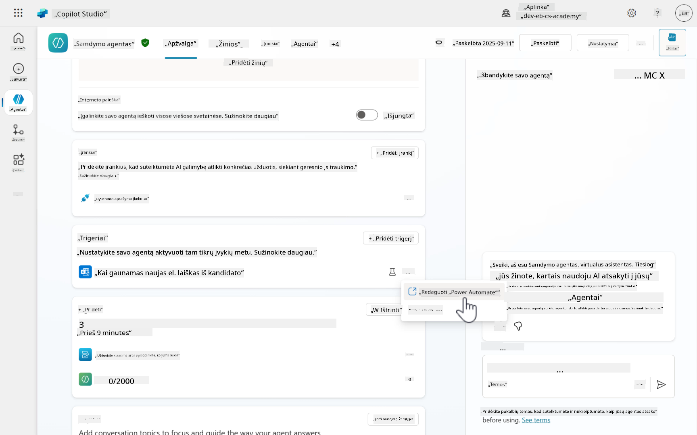

1. Paleidiklis bus įkeltas kaip srautas Power Automate kūrimo portale. Tai, ką matote, yra srauto dizaineris Power Automate kūrimo portale. Čia galime pridėti papildomą logiką ir veiksmus, kad padidintume automatizavimą. Paleidiklis bus viršuje, o **Siunčia užklausą nurodytam kopilotui apdoroti** bus paskutinis veiksmas sraute.

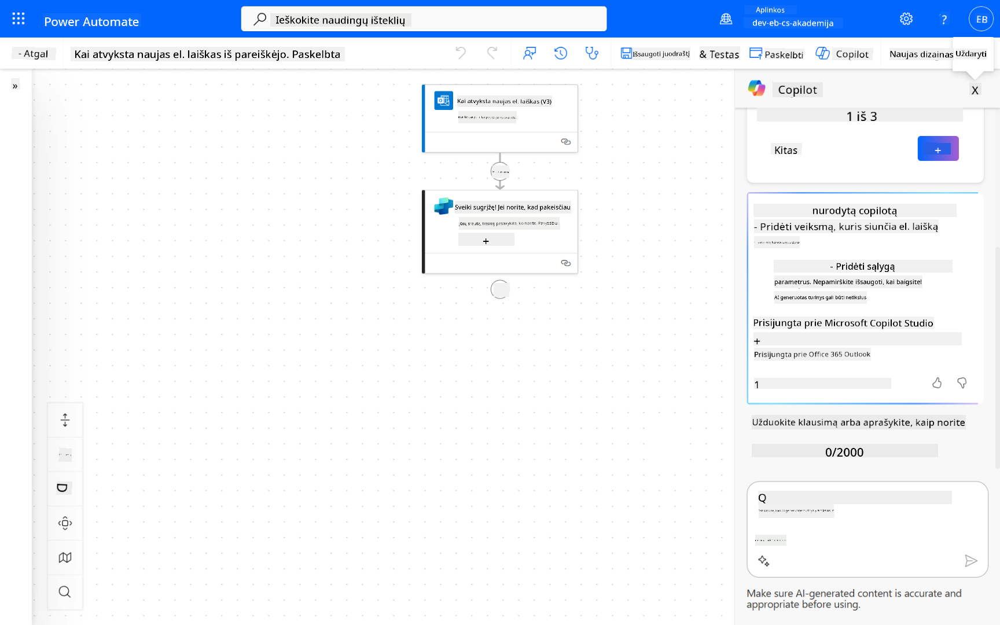

1. Pagal numatymą, **Kai atvyksta naujas el. laiškas** paleidiklis Power Automate gali apdoroti kelis el. laiškus kartu, jei keli atvyksta vienu metu, vykdydamas srautą tik vieną kartą visam paketui.

Norėdami užtikrinti, kad srautas būtų vykdomas atskirai kiekvienam el. laiškui, įjunkite **Split On** nustatymą paleidiklio nustatymuose ir pasirinkite `@triggerOutputs()?['body/value']` išskleidžiamame masyvo lauke.

Įjungus **Split On** ir nustatant masyvo lauką į `@triggerOutputs()?['body/value']`, srautas bus vykdomas atskirai kiekvienai žinutei, net jei jos atvyksta vienu metu.

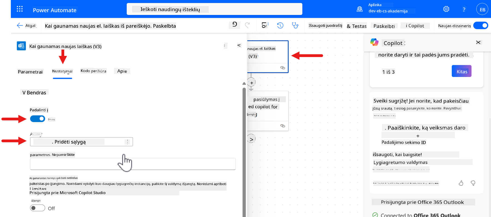

1. Toliau pridėsime logiką, kad patikrintume priedo failo tipą. Norime įkelti tik .PDF failų priedus, o ne vaizdus (jie gali būti iš el. pašto parašų). Pasirinkite **+** piktogramą po paleidikliu ir pasirinkite **Control** skiltyje **Built in tools**.

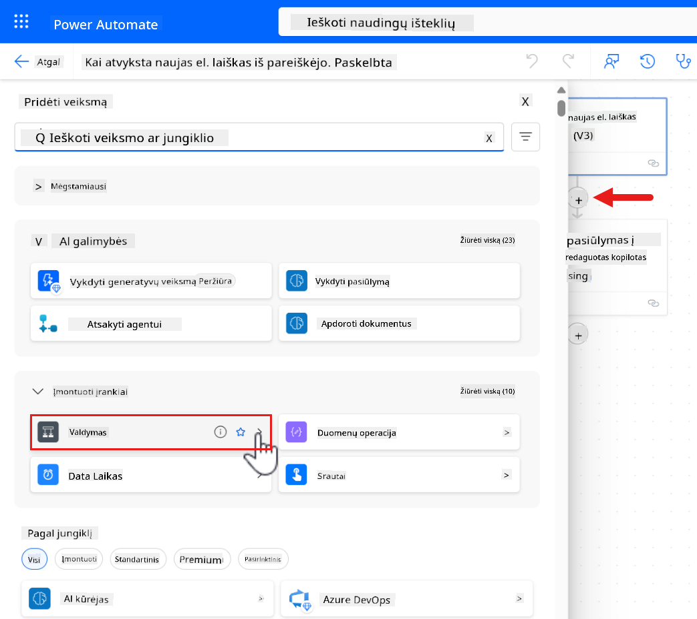

1. Pasirinkite **Condition** veiksmą.

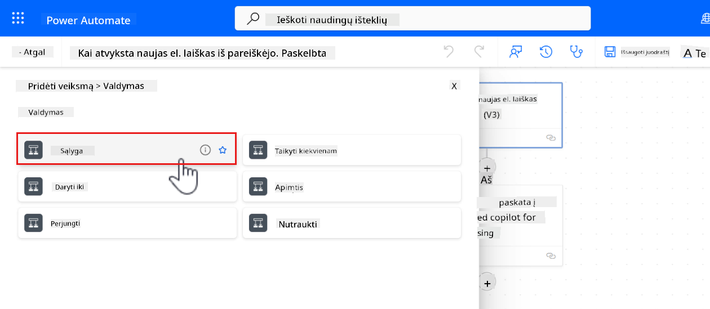

1. Dabar sukonfigūruosime sąlygą, kad patikrintume, ar failo priedo tipas yra .PDF. Lauke **Choose a value** pasirinkite **žaibo piktogramą** arba **fx piktogramą** dešinėje.

1. Paieškos lauke įveskite:

```text
content type
```

1. Tada pasirinkite **Attachments Content-Type** parametrą iš paleidiklio.

1. Tada pasirinkite **Pridėti**, kad pridėtumėte dinaminio turinio įvestį į **Id** parametrą veiksme.

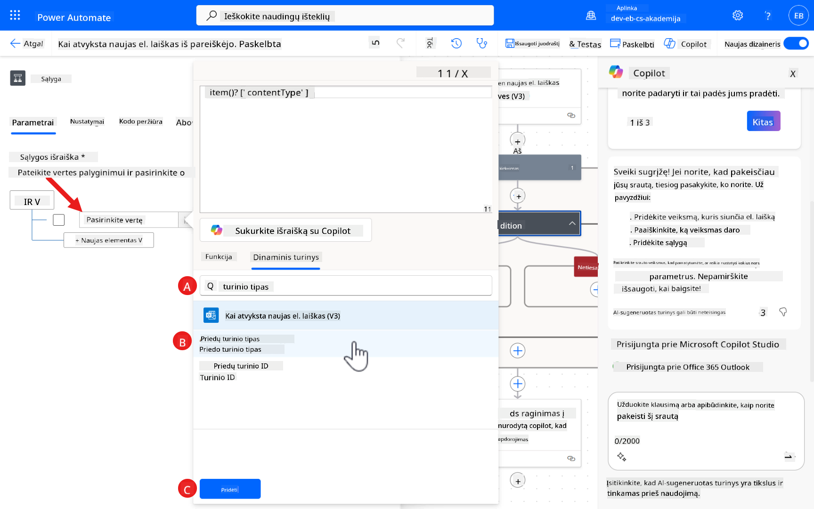

1. Sustokime čia trumpam, tikriausiai pastebėjote, kad automatiškai atsirado **For each** veiksmas.

Pasirinkite **For each** veiksmą. Šis veiksmas reiškia, kad bus kilpa per kiekvieną priedą el. laiške, nes **Attachments Content-Type** parametras iš paleidiklio yra susietas su kiekvienu priedu.

Viduje tai yra masyvas, todėl **For each** veiksmas buvo automatiškai pridėtas, kai pasirinkome **Attachments Content-Type** parametrą **Condition** veiksme.

Norėdami sužinoti daugiau apie tai, išplėskite šį papildomą mokymosi bloką.

??? info "Papildomas mokymasis: automatiškai atsirandantis For each veiksmas"

🤔 **Kodėl automatiškai atsiranda "Apply to each" arba "For each"?**

Kai pasirenkate parametrą (dinaminį turinį), kuris atspindi elementų sąrašą arba masyvą - pavyzdžiui, priedų, el. laiškų ar eilučių sąrašą - Power Automate atpažįsta, kad galbūt norėsite apdoroti kiekvieną elementą atskirai.

Kad padėtų tai padaryti, Power Automate automatiškai prideda **“Apply to each”** (arba **For each**) kilpą aplink jūsų veiksmą. Tai užtikrina, kad jūsų veiksmas bus vykdomas vieną kartą kiekvienam sąrašo elementui, o ne bandant apdoroti visą sąrašą vienu metu (kas galėtų sukelti klaidų).

🦋 **Pavyzdys**

- Jei pasirinksite "Attachments" iš ankstesnio veiksmo (kuris yra masyvas) ir bandysite jį naudoti veiksme, kuris tikisi vieno failo, Power Automate apgaubia jūsų veiksmą **"Apply to each"** (arba **For each**) kilpa.
- Tokiu būdu jūsų veiksmas bus vykdomas **kiekvienam priedui** - po vieną kartą.

💡 **Svarbiausi punktai**

- **Automatiškai:** Kilpa atsiranda automatiškai, kad padėtų apdoroti kiekvieną elementą kolekcijoje.
- **Apsaugo nuo klaidų:** Be kilpos jūsų veiksmas gali nepavykti, nes negali apdoroti kelių elementų vienu metu.
- **Vizualinis ženklas:** Tai vizualinis būdas parodyti, kad jūsų srautas pakartos veiksmą kiekvienam sąrašo elementui.

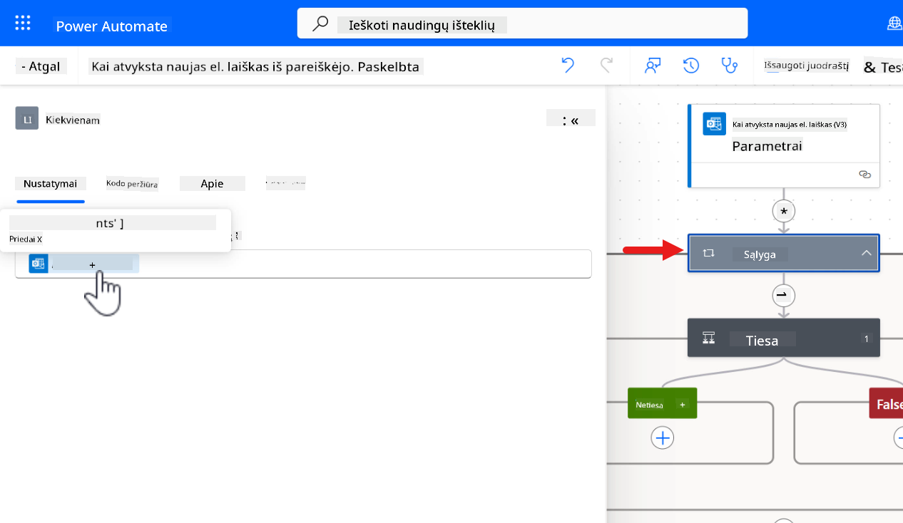

1. Toliau, kitame **Choose a value** lauke, įveskite:

```text
application/pdf
```

Tai užtikrins, kad kiekvienam failo priedui bus patikrinta, ar failo plėtinys yra .PDF.

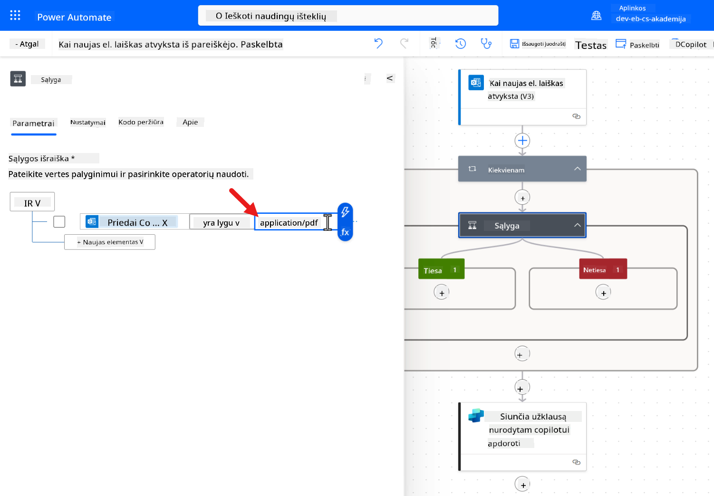

1. Dabar sukonfigūruosime **True** kelią, kad išgautume failą iš el. laiško ir įkeltume jį į **Resume** Dataverse lentelę.

Pridėkite naują veiksmą žemiau **True** kelio ir ieškokite `html to text`. Pasirinkite **Html to text** veiksmą.

Norėdami sužinoti daugiau apie **Html to text** veiksmą, išplėskite šį papildomą mokymosi bloką.

??? info "Papildomas mokymasis: Html to text veiksmas"

🤔 **Kas yra "HTML to text" veiksmas?**

**HTML to text** veiksmas Power Automate naudojamas HTML formatuoto turinio konvertavimui į paprastą tekstą. Tai ypač naudinga, kai gaunate duomenis (pvz., el. laiškus, interneto turinį ar API atsakymus), kuriuose yra HTML žymų, ir norite išgauti tik skaitomą tekstą be jokio formatavimo ar kodo.

⚙️ **Kaip tai veikia?**

- **Įvestis:** Jūs pateikiate HTML turinio eilutę (pvz., el. laiško turinį).
- **Išvestis:** Veiksmas pašalina visas HTML žymas ir grąžina tik paprastą tekstą.

👍🏻 **Kada jį naudoti?**

- Kai norite išgauti skaitomą tekstą iš el. laiškų, interneto puslapių ar API atsakymų, kuriuose yra HTML.
- Prieš siunčiant turinį sistemoms, kurios nepalaiko HTML formatavimo (pvz., SMS, Teams žinutės ar duomenų bazės).
- Norint išvalyti duomenis tolimesniam apdorojimui ar analizei.

🔭 **Kur jį rasti?**

- Power Automate agentų srautuose ieškokite veiksmo pavadinimu `HTML to text`. Jis yra **Data Operations** jungiklyje.

💡 **Svarbiausi punktai**

- Pašalina visas HTML žymas ir palieka tik tekstą.
- Neinterpretuoja ar nevykdo skriptų/stilių - tiesiog pašalina žymas.
- Naudinga duomenų valymui ir turinio paruošimui paprasto teksto išvestims.

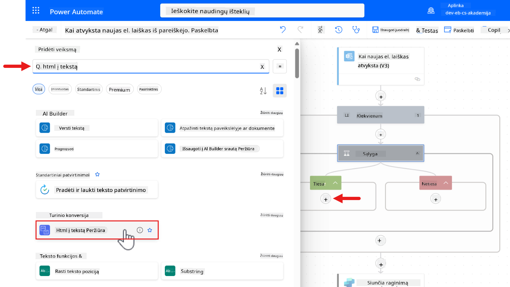

1. Toliau turime sukurti naują ryšio nuorodą **Html to text** veiksmui, pasirinkdami **Pridėti naują**.

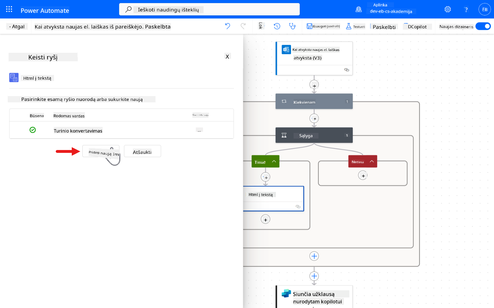

1. Veiksmas dabar gali būti sukonfigūruotas. Pridėkime **Body** parametrą iš paleidiklio. Lauke **Content** pasirinkite **žaibo piktogramą** arba **fx piktogramą** dešinėje.

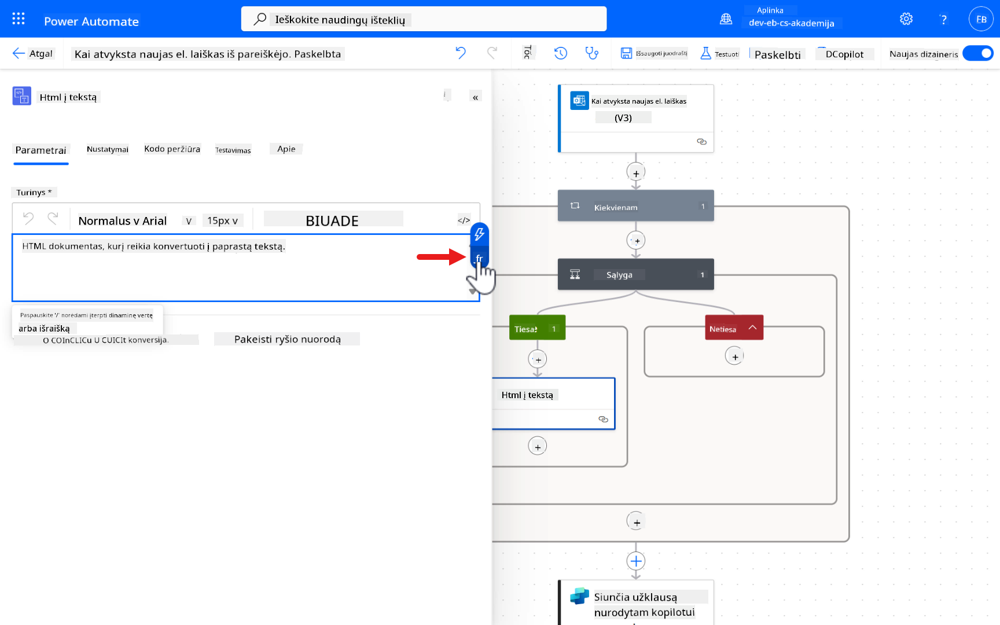

1. Dinaminio turinio skirtuke ieškokite `body` ir pasirinkite **Body** parametrą, tada pasirinkite **Pridėti**.

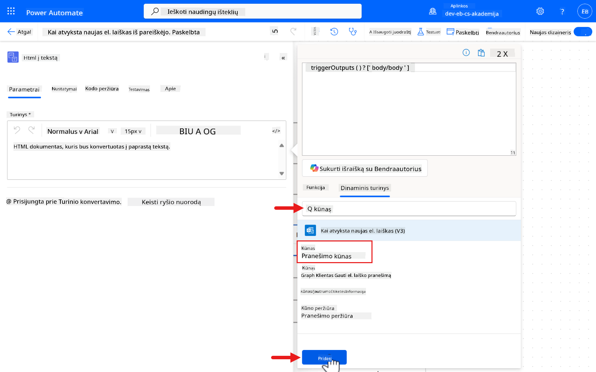

1. Baigėme konfigūruoti šį veiksmą, todėl išeikime iš veiksmo, pasirinkdami dvi kampines skliaustelius («), nukreiptus į kairę, kad suskleistume panelę.

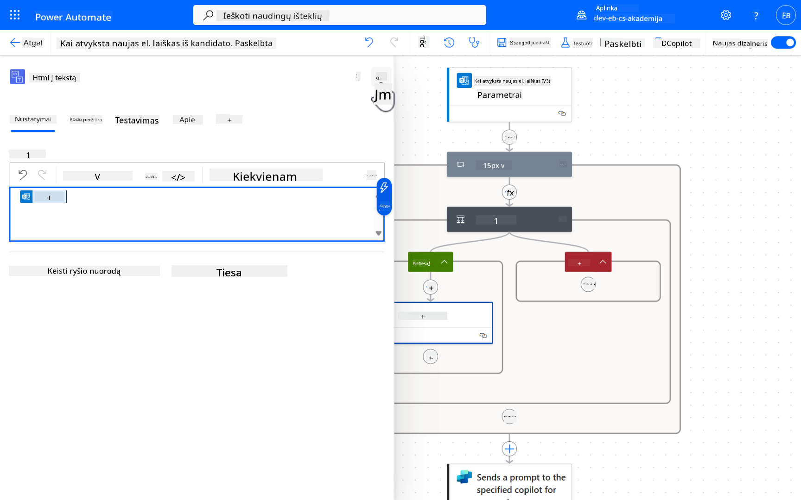

1. Pridėsime naują veiksmą, pasirinkdami **+ piktogramą** po **Html to text** veiksmu, kuris įkels panelę veiksmams pridėti. Pasirinkite **Microsoft Dataverse** jungiklį.

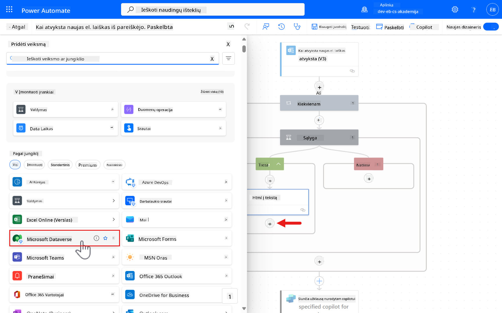

1. Pasirinkite **Pridėti naują eilutę** veiksmą.

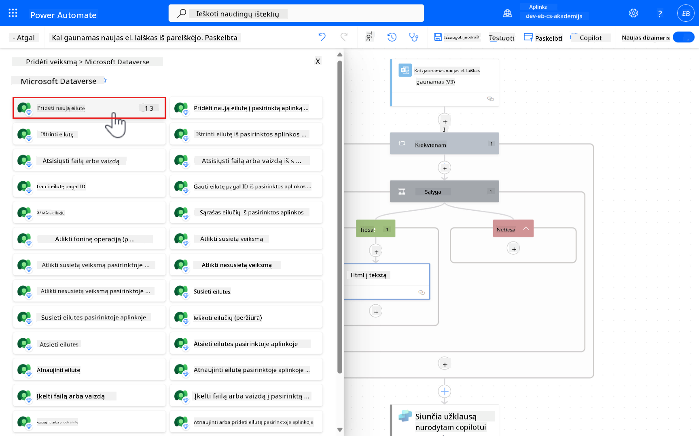

1. Pervadinkite veiksmą, pasirinkdami **Tritaškį (...)**, nukopijuokite ir įklijuokite šį pavadinimą:

```text
Pridėti naują Resume eilutę
```

Lauke **Table name** ieškokite `res` ir pasirinkite **Resumes** lentelę.

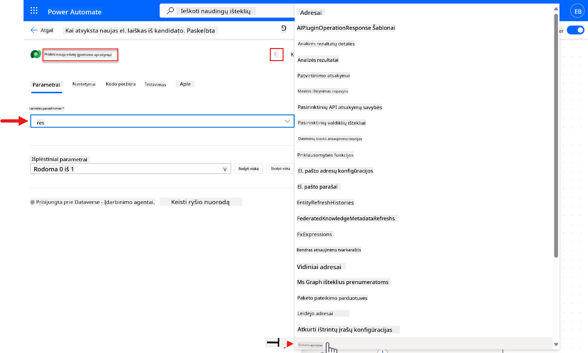

1. Pasirinkite **Resume Title** lauką ir pasirinkite **žaibo piktogramą** arba **fx piktogramą** dešinėje.

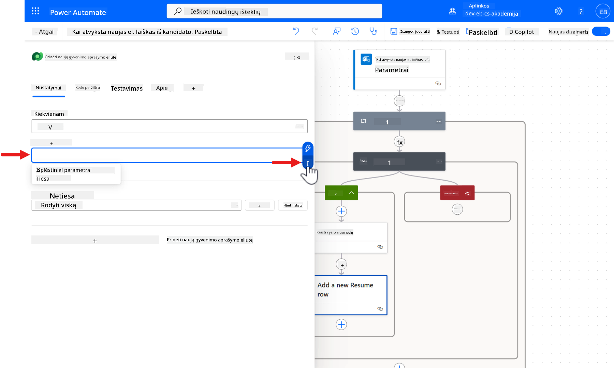

1. Funkcijų skirtuke įveskite šią išraišką, naudojančią `item()` funkciją:

```text
item()?['name']
```

Norėdami sužinoti daugiau apie `item()` funkciją, išplėskite šį papildomą mokymosi bloką.

??? info "Papildomas mokymasis: `item()` funkcija"

🤔 **Kas yra `item()` funkcija?**

- Kai naudojate **Apply to each** veiksmą, Power Automate pereina per kiekvieną elementą kolekcijoje (masyve).
- Dažniausiai naudojama veiksmuose, tokiuose kaip **Apply to each** (arba **For each**), **Select** arba **Filter array**.

⚙️ **Kaip tai veikia?**

- `item()` yra funkcija, kuri grąžina dabartinį elementą, apdorojamą kilpoje arba masyvo operacijoje.
- Viduje kilpos `item()` reiškia _dabartinį elementą_, kuris yra apdorojamas.

📌 **Kur ją naudoti?**

- **Apply to each:** norint pasiekti dabartinio elemento savybes.
- **Select:** norint transformuoti kiekvieną masyvo elementą.
- **Filter array:** norint nurodyti dabartinį elementą, kuris yra vertinamas.

🦋 **Pavyzdys**

- Išraiška kilpoje:
       -  `item()?['Email']`
- Tai gauna dabartinio elemento `Email` savybę.

💡 **Svarbiausi punktai**

- `item()` yra _konteksto jautri_: ji visada nurodo dabartinį elementą kilpoje arba masyvo operacijoje, kurioje esate.
- Jei kilpos yra įdėtos, galite naudoti `items('LoopName')`, kad nurodytumėte elementus konkrečioje kilpoje.

Pasirinkite **Pridėti**, kad pridėtumėte išraišką į **Resume Title** parametrą.

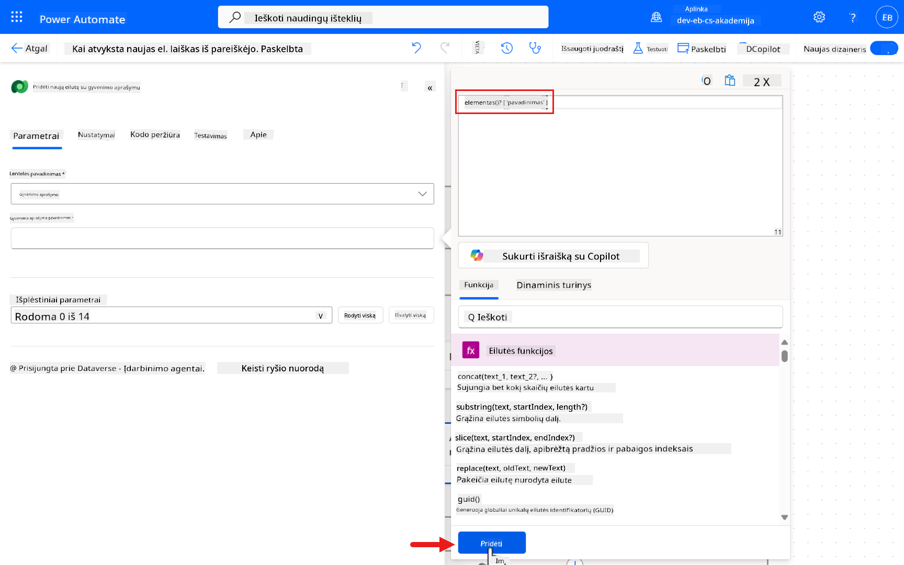

1. Dar reikia sukonfigūruoti kelis parametrus, pasirinkite **Rodyti viską** ir lauke **Cover Letter** pasirinkite **žaibo piktogramą** arba **fx piktogramą** dešinėje.

Funkcijų skirtuke įveskite šią išraišką, naudojančią tą pačią išraišką, kaip ir ankstesnėje [misijoje](../02-multi-agent/README.md).

```text
if(greater(length(body('Html_to_text')), 2000), substring(body('Html_to_text'), 0, 2000), body('Html_to_text'))
```

Ši išraiška patikrina, ar tekstas iš **Html to text** veiksmo yra ilgesnis nei 2000 simbolių, ir jei taip, grąžina tik pirmuosius 2000 simbolių; kitaip grąžina visą tekstą.

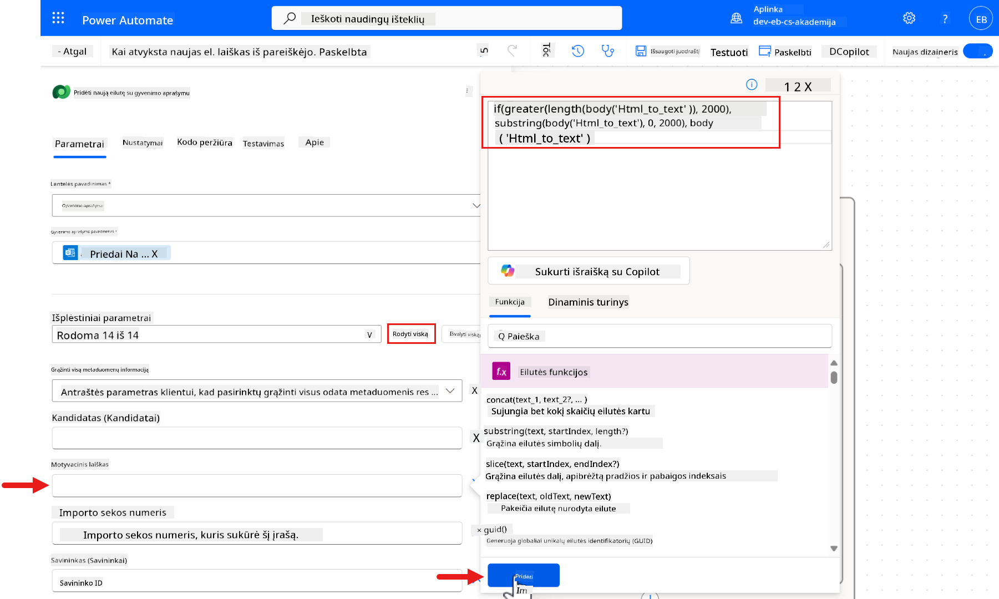

1. Išraiška dabar bus pridėta prie **Cover Letter** lauko.

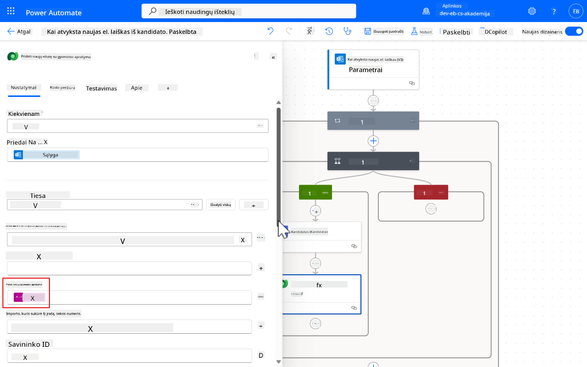

1. Lauke **Source Email Address** ieškokite `from` ir pasirinkite **From** parametrą iš paleidiklio, nes jis turi el. pašto adreso reikšmę.

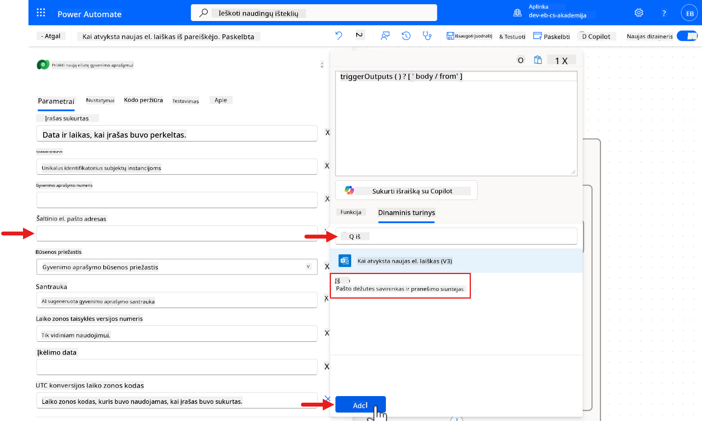

1. Lauke **Upload Date** pasirinkite **žaibo piktogramą** arba **fx piktogramą** dešinėje. Funkcijų skirtuke įveskite šią išraišką, naudojančią `utcNow()` funkciją.

```text
utcNow()
```

Norėdami sužinoti daugiau apie `utcNow` funkciją, išplėskite šį papildomą mokymosi bloką.

??? info "Papildomas mokymasis: `utcNow` funkcija"

🤔 **Kas yra `utcNow()` funkcija?**

- `utcNow()` funkcija Power Automate grąžina dabartinę datą ir laiką koordinuoto universalaus laiko (UTC) formatu ISO 8601, pvz.: `2025-09-23T04:32:14Z`

🦋 **Pavyzdys**

- Išraiška:
       -  `concat('Ataskaita sukurta ', utcNow())`
- Rezultatas:
       - Ataskaita sukurta `2025-09-23T04:32:14Z`

💡 **Svarbiausi punktai**
- **Argumentų (įvesties parametrų) nereikia:** visada pateikia dabartinį UTC laiko žymą.
   - **Naudojimo atvejai**
       - Laiko žymų pridėjimas prie žurnalų ar failų pavadinimų
       - Dabartinio laiko palyginimas su kitomis datomis
       - Planavimas ar sąlygos, susijusios su laiku

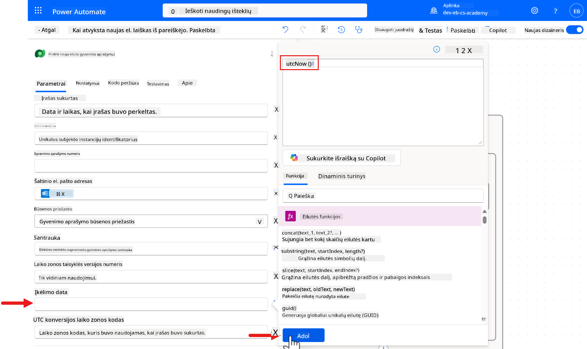

1. Dabar baigėme konfigūruoti veiksmą **Pridėti naują gyvenimo aprašymo eilutę**, todėl išeikime iš skydelio jį suskleidę.

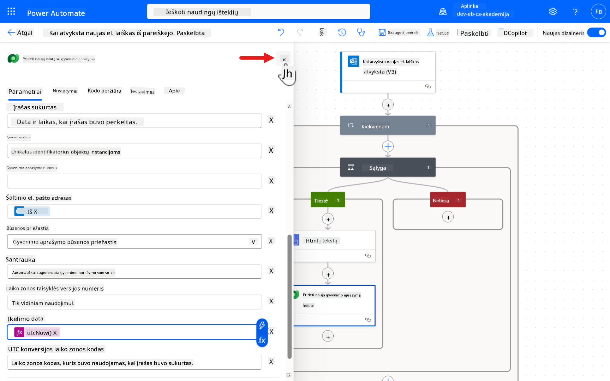

1. Pridėsime naują veiksmą pasirinkdami **+ piktogramą** po veiksmu **Pridėti naują gyvenimo aprašymo eilutę**, kuris įkels skydelį veiksmams pridėti. Vėl pasirinkite **Microsoft Dataverse** jungtį.

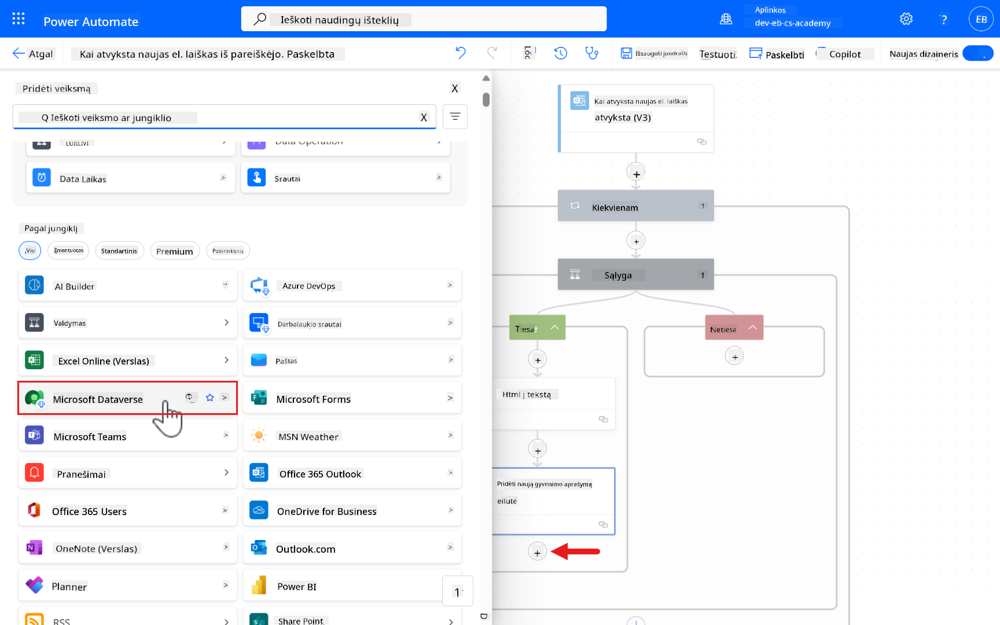

1. Pasirinkite veiksmą **Įkelti failą ar vaizdą**.

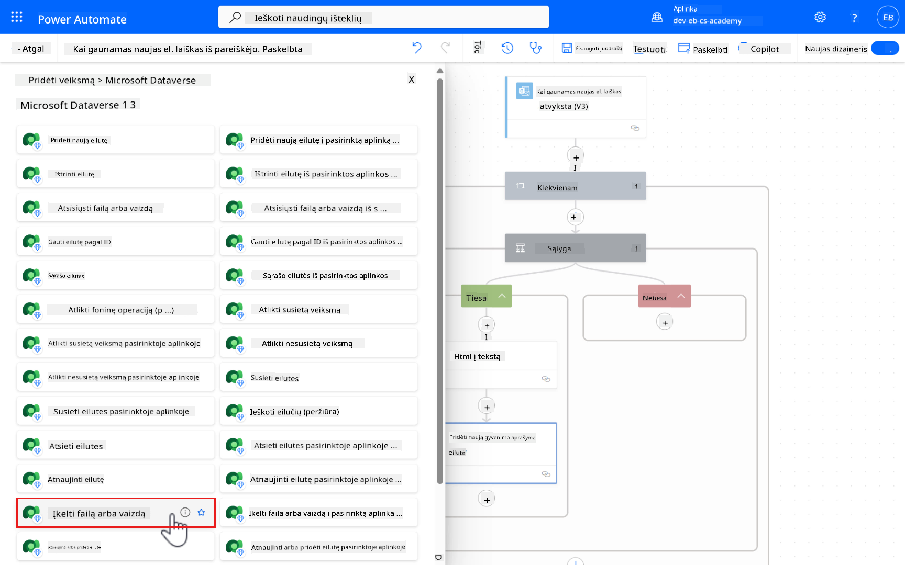

1. Pervadinkite veiksmą pasirinkdami **Tris taškus (...)**, nukopijuokite ir įklijuokite šį pavadinimą:

```text
Įkelti gyvenimo aprašymo failą
```

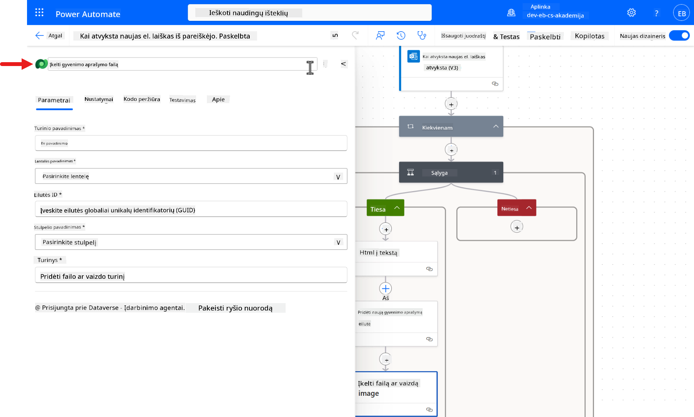

1. Tada pasirinkite lauką **Turinio pavadinimas** ir dešinėje pusėje pasirinkite **žaibo piktogramą** arba **fx piktogramą**.

   Skiltyje **Funkcijos**, įveskite šią išraišką, kuri naudoja funkciją `item()`. Tai gauna dabartinio elemento (priedų failo) `name` savybę.

```text
item()?['name']
```

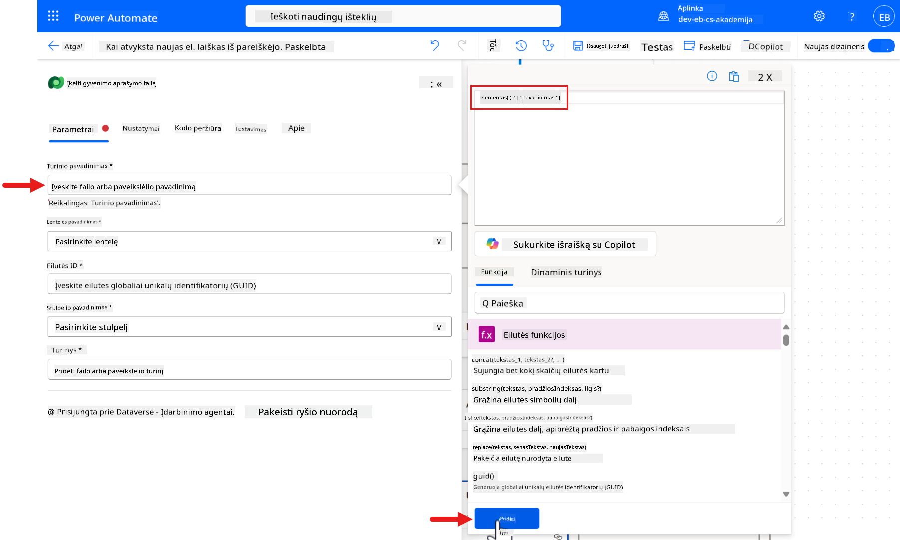

1. Dėl parametro **Lentelės pavadinimas** ieškokite `res` ir pasirinkite lentelę **Gyvenimo aprašymai**.

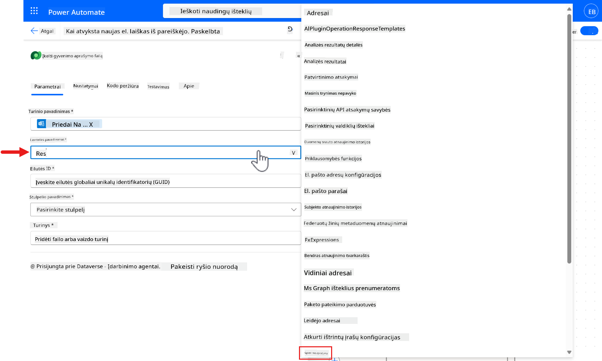

1. Tada pasirinkite lauką **Eilutės ID** ir dešinėje pusėje pasirinkite **žaibo piktogramą** arba **fx piktogramą**.

   Ieškokite `ID` ir pasirinkite parametrą **Gyvenimo aprašymas** iš _Pridėti naują eilutę_ Dataverse veiksmo, nes jame yra ID reikšmė, į kurią reikia įkelti PDF failą.

   Pasirinkite **Pridėti**.

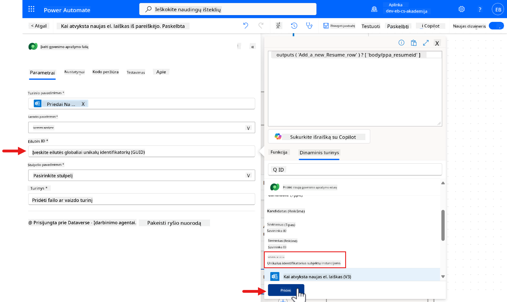

1. Pasirinkite lauką **Stulpelio pavadinimas** ir pasirinkite parinktį **Gyvenimo aprašymo PDF**.

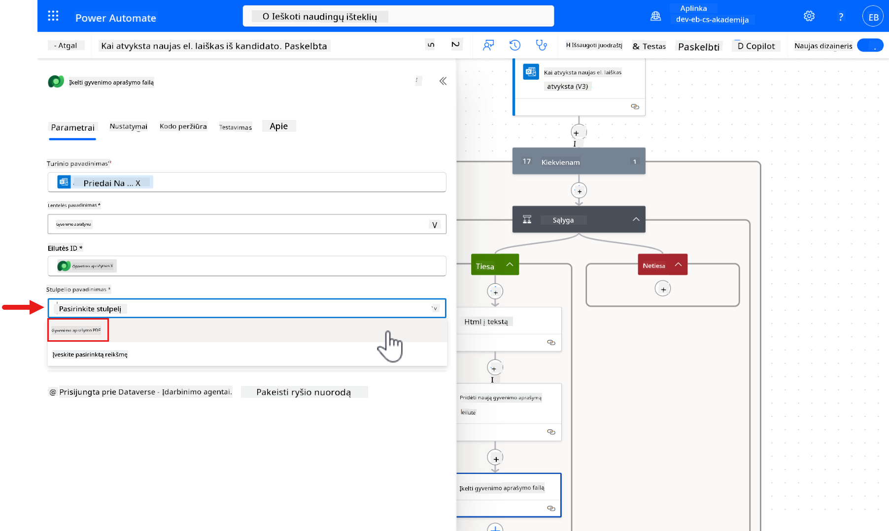

1. Pasirinkite lauką **Turinys** ir dešinėje pusėje pasirinkite **žaibo piktogramą** arba **fx piktogramą**.

   Skiltyje **Funkcijos**, įveskite šią išraišką, kuri naudoja funkciją `item()`. Tai gauna dabartinio elemento (priedų failo) `contentBytes` savybę. `contentBytes` reiškia neapdorotus failo ar priedo dvejetainius duomenis, užkoduotus Base64 formatu.

```text
item()?['contentBytes']
```

1. Baigėme konfigūruoti šį veiksmą, todėl išeikime iš veiksmo pasirinkdami dvi kampines skliaustelius («), nukreiptus į kairę, kad suskleistume skydelį.


1. Tada pasirinkite **Siunčia užklausą nurodytam copilot apdorojimui**, tada vilkite ir numeskite šį veiksmą po veiksmu **Įkelti gyvenimo aprašymo failą** _True_ sąlygos kelyje.


1. Pasirinkite **Siunčia užklausą nurodytam copilot apdorojimui**, kad jį sukonfigūruotumėte.

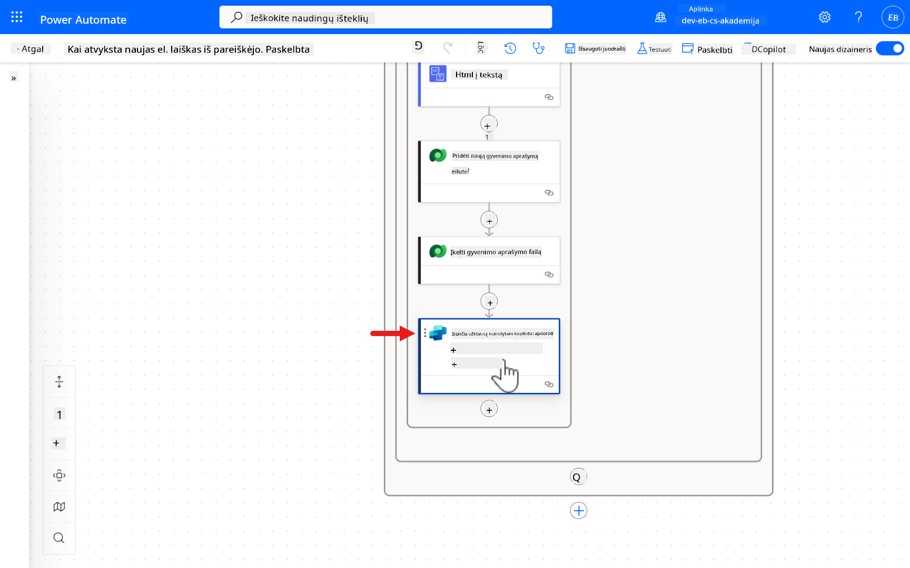

1. Lauke **Kūnas/žinutė** pasirinkite visą lauko turinį ir jį ištrinkite.

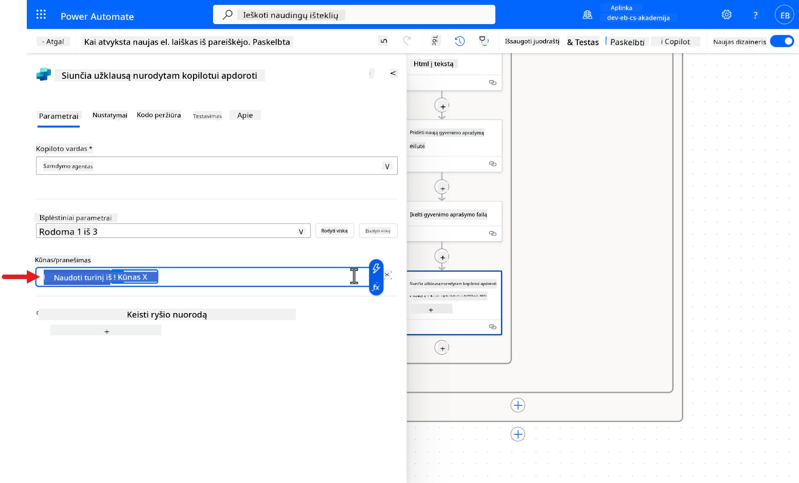

1. Nukopijuokite ir įklijuokite šį tekstą į lauką **Kūnas/žinutė** ir pažymėkite `GYVENIMO APRAŠYMO ID VIETOS LAIKIKLIS`.

```text
Siųsti [GyvenimoAprašymoId (tekstas)] = "GYVENIMO APRAŠYMO ID VIETOS LAIKIKLIS" ir [GyvenimoAprašymoPavadinimas (tekstas_1)] = "GYVENIMO APRAŠYMO PAVADINIMO VIETOS LAIKIKLIS" ir [GyvenimoAprašymoNumeris (tekstas_2)] = "GYVENIMO APRAŠYMO NUMERIO VIETOS LAIKIKLIS" į Įrankį "Pranešti Teams Kandidatų kanalui" vaikų agentui "Paraiškų priėmimo agentas"
```

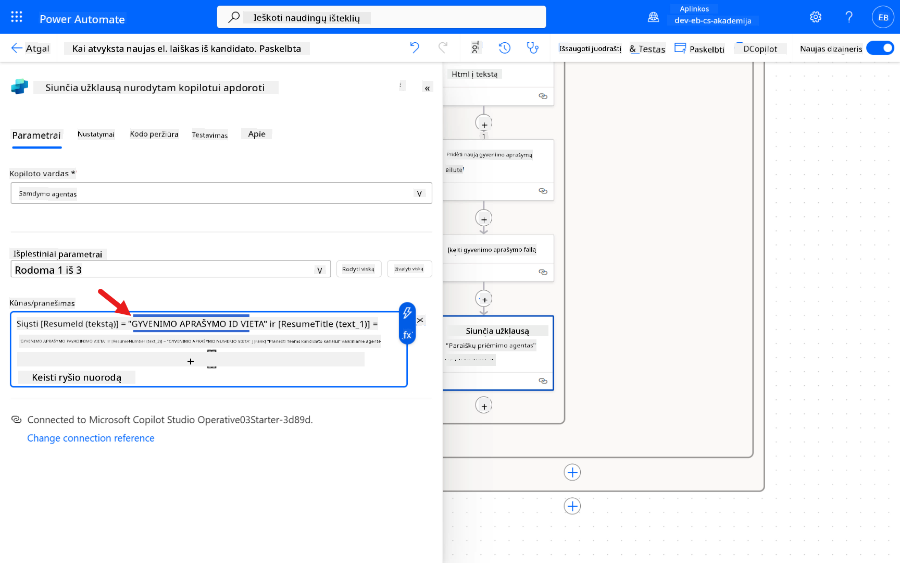

1. Pasirinkite **žaibo piktogramą** arba **fx piktogramą** dešinėje.

   Ieškokite `gyvenimo aprašymas` ir pasirinkite parametrą **Gyvenimo aprašymas** iš _Pridėti naują eilutę Dataverse_ veiksmo, nes jame yra sukurtos gyvenimo aprašymo eilutės `ID` reikšmė.

   Pasirinkite **Pridėti**.

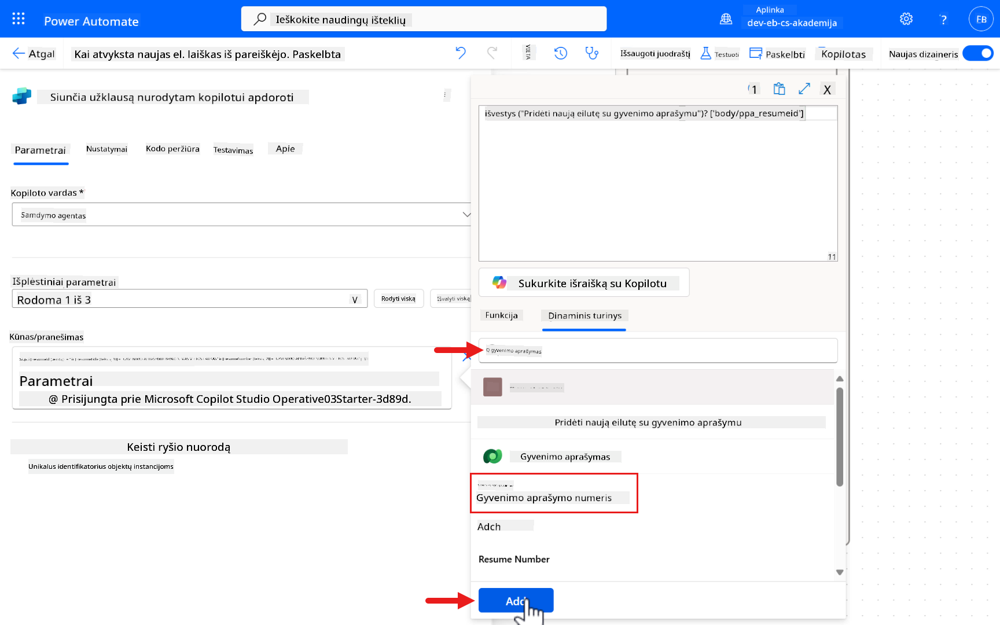

1. Pažymėkite `GYVENIMO APRAŠYMO PAVADINIMO VIETOS LAIKIKLIS`. Pasirinkite **žaibo piktogramą** arba **fx piktogramą** dešinėje.

   Ieškokite `pavadinimas` ir pasirinkite parametrą **Gyvenimo aprašymo pavadinimas** iš _Pridėti naują eilutę Dataverse_ veiksmo, nes jame yra sukurtos gyvenimo aprašymo eilutės `gyvenimo aprašymo pavadinimas` reikšmė.

   Pasirinkite **Pridėti**.

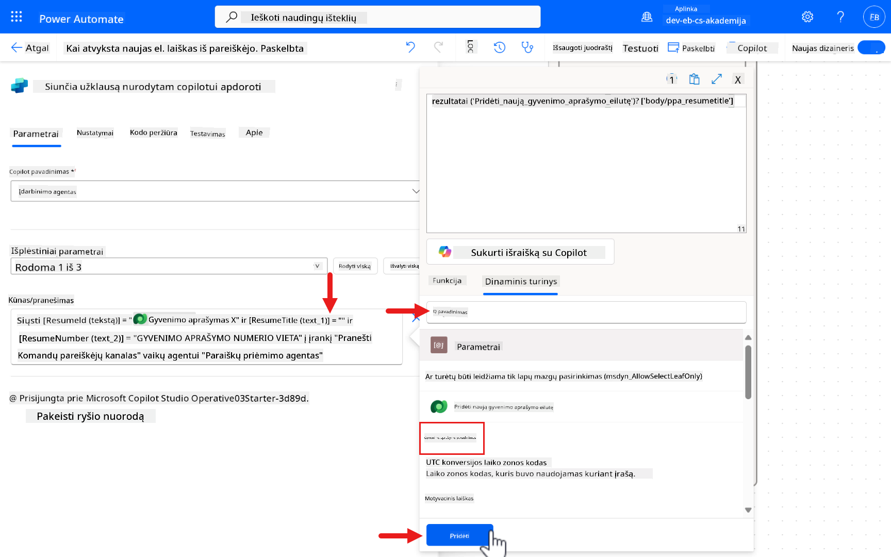

1. Pažymėkite `GYVENIMO APRAŠYMO NUMERIO VIETOS LAIKIKLIS`. Pasirinkite **žaibo piktogramą** arba **fx piktogramą** dešinėje.

   Ieškokite `gyvenimo aprašymo numeris` ir pasirinkite parametrą **Gyvenimo aprašymo numeris** iš _Pridėti naują eilutę Dataverse_ veiksmo, nes jame yra sukurtos gyvenimo aprašymo eilutės `Gyvenimo aprašymo numeris` reikšmė.

   Pasirinkite **Pridėti**.

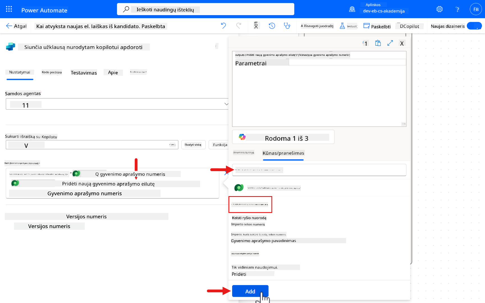

1. Baigėme konfigūruoti šį veiksmą ir mūsų agento srautą 🙌🏻 Puikiai sekasi! Dabar išsaugokime mūsų įvykio paleidimo srautą pasirinkdami **Išsaugoti juodraštį**.


1. Dabar turime redaguoti agento srauto detales, pasirinkite **Atgal**.

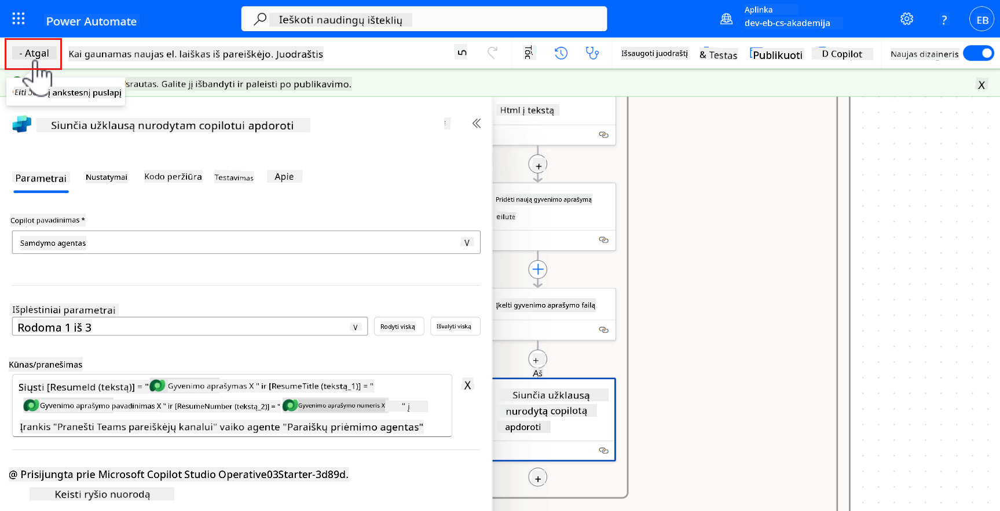

1. Pasirinkite **Redaguoti** skiltyje **Detalės** ir atnaujinkite **Planą** į parinktį **Copilot Studio**.

   Pasirinkite **Išsaugoti**.

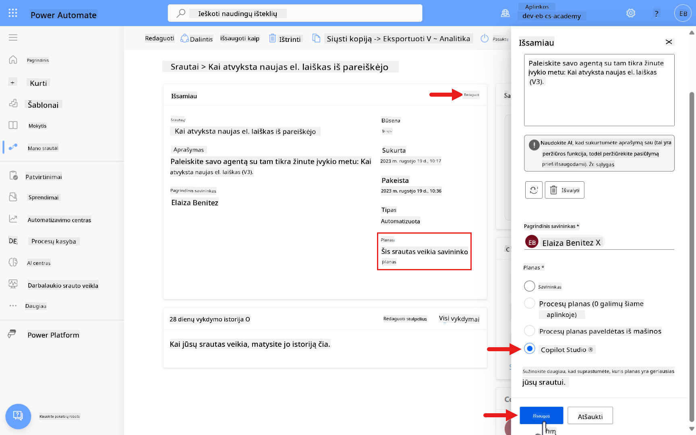

1. Atsiras modalas, prašantis patvirtinti perėjimą prie Copilot Studio plano. Pasirinkite **Patvirtinti**.

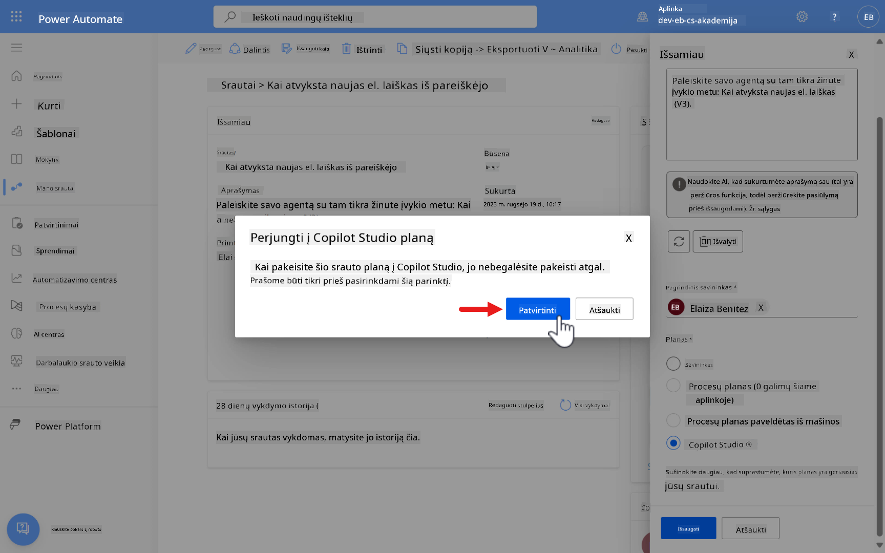

1. Planas dabar atnaujintas į **Copilot Studio**. Pasirinkite **Redaguoti**, nes turime paskelbti įvykio paleidimo srautą mūsų agentui.

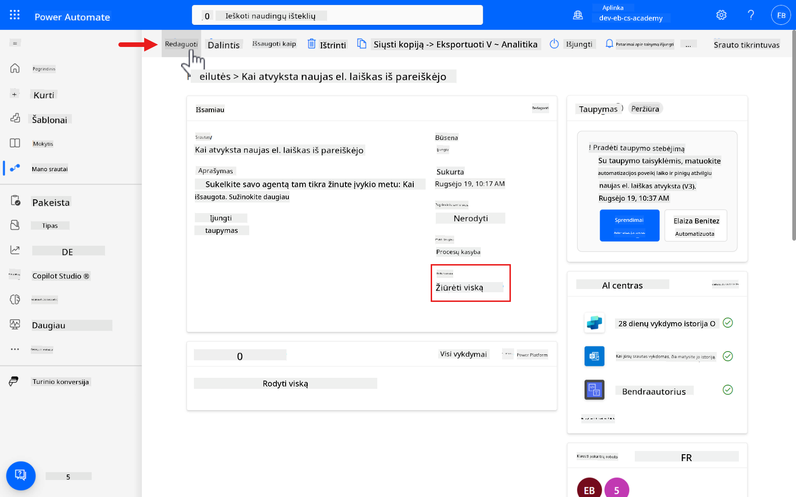

1. Pasirinkite **Paskelbti**.

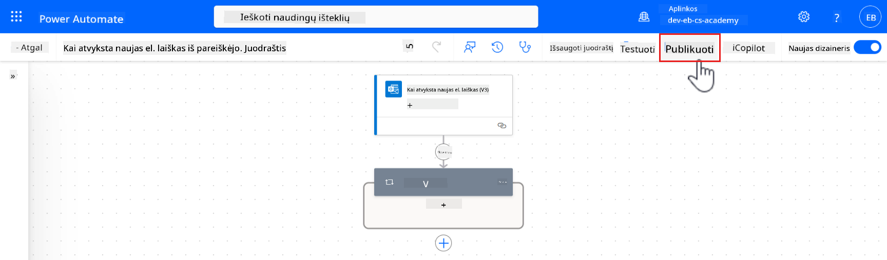

   Valio! Įvykio paleidimo srautas dabar paskelbtas 😃

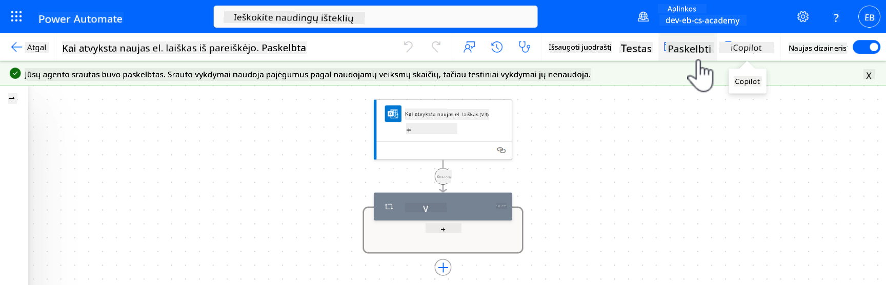

Tęskime kurdami naują agento srautą, kuris bus iškviečiamas vaikų **Paraiškų priėmimo agento**.

### Laboratorija 3.2 - Pranešimas Teams kanalui naudojant adaptacinę kortelę

Dabar kursime naują agento srautą vaikų **Paraiškų priėmimo agentui**, kuris naudos įvykio paleidimo perduotas reikšmes, kad paskelbtų adaptacinę kortelę Teams kanale. Ši adaptacinė kortelė informuos HR atrankos komandą apie automatiškai įkeltą PDF, kad jie galėtų jį peržiūrėti.

Pradėkime!

1. **Įdarbinimo agento** skiltyje pasirinkite **Agentai** ir pasirinkite **Paraiškų priėmimo agentą**.

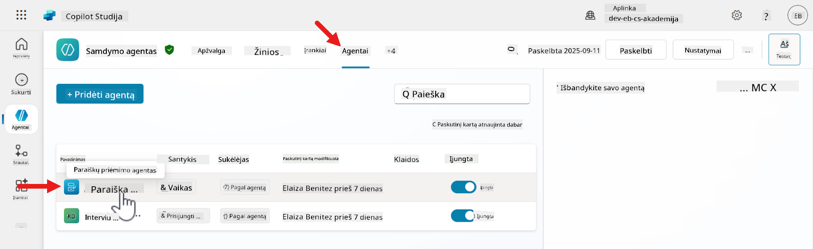

1. Slinkite žemyn iki **Įrankiai** ir pasirinkite **+ Pridėti**.

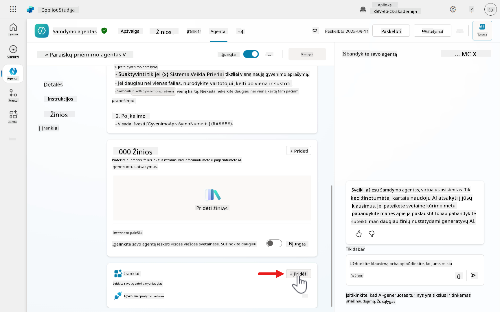

1. Atsiras modalas **Pridėti įrankį**. Pasirinkite **+ Naujas įrankis**.

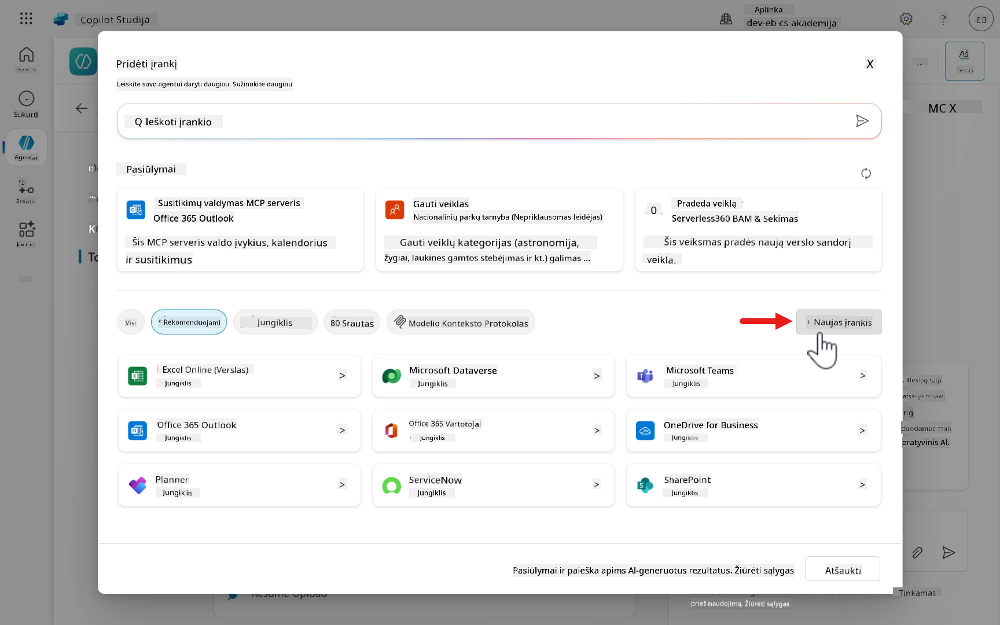

1. Pasirinkite **Agentų srautas**.

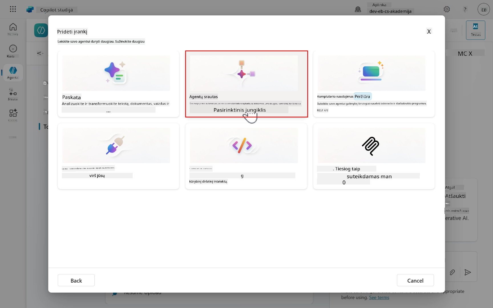

1. Tada bus įkeltas **agentų srauto dizaineris**. Trigerio **Kai agentas iškviečia srautą** skiltyje pasirinkite **+ Pridėti įvestį**.

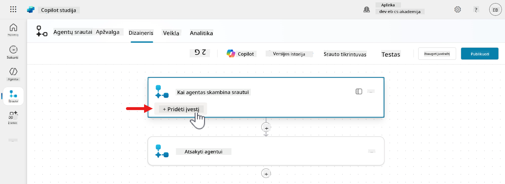

1. Pasirinkite **Tekstas** kaip vartotojo įvesties tipą.

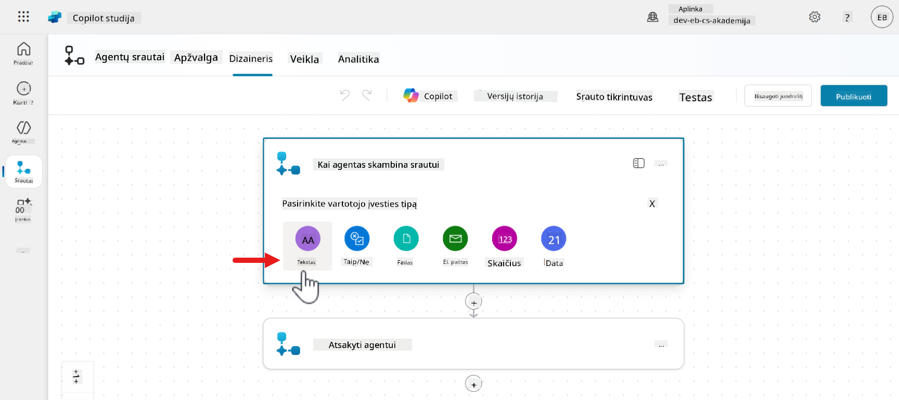

1. Įveskite šį tekstą kaip įvesties parametro pavadinimą.

```text
GyvenimoAprašymoId
```

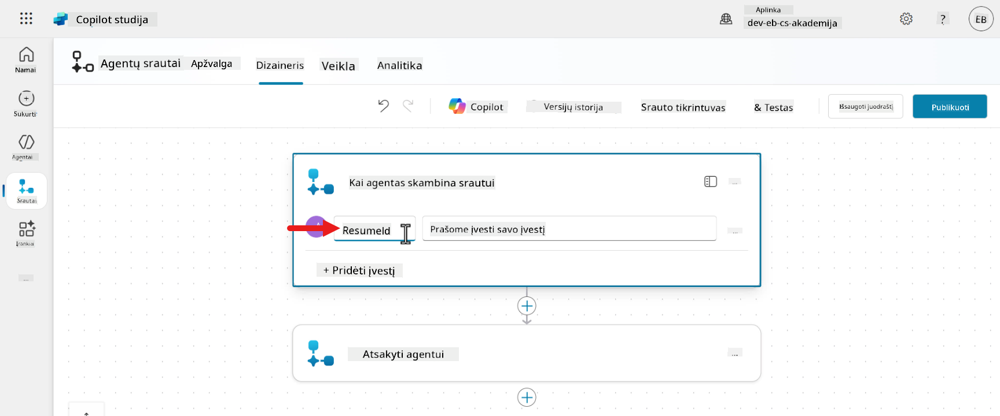

1. Pakartokite tuos pačius veiksmus, kad pridėtumėte antrą teksto įvestį. Įveskite šį tekstą kaip įvesties parametro pavadinimą.

```text
GyvenimoAprašymoPavadinimas
```

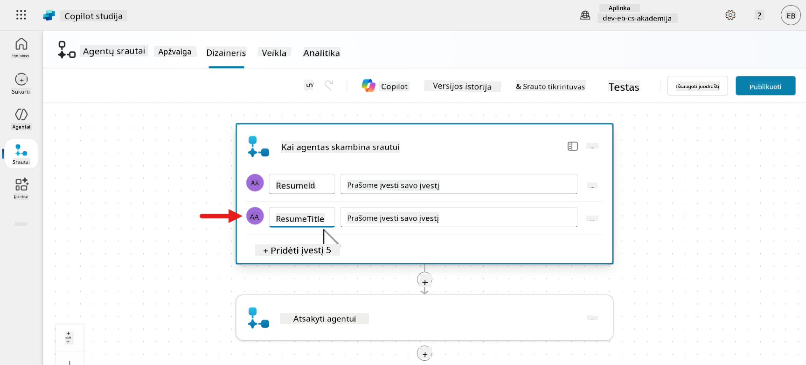

1. Pakartokite tuos pačius veiksmus, kad pridėtumėte trečią teksto įvestį. Įveskite šį tekstą kaip įvesties parametro pavadinimą.

```text
GyvenimoAprašymoNumeris
```


1. Ar prisimenate, kaip [Įdarbinime](../../recruit/08-add-adaptive-card/README.md#81-create-a-new-topic-with-an-adaptive-card-for-user-to-submit-their-request) pridėjome adaptacinę kortelę temoje mūsų agentui? Šį kartą mes pridėsime adaptacinę kortelę agento sraute. Dabar pridėsime kitą veiksmą mūsų agento srautui, kuris paskelbs adaptacinę kortelę Teams kanale.

   Pasirinkite **+ piktogramą** po trigeriu.


1. Pasirinkite veiksmą **Paskelbti kortelę pokalbyje ar kanale**.


1. Reikia sukurti Microsoft Teams prisijungimo nuorodą su jūsų prisijungimo paskyra. Pasirinkite **Prisijungti**.


1. Pasirinkite savo vartotojo paskyrą ir tada pasirinkite **Leisti prieigą**.


1. Šiems įvesties parametrams:

   | Parametras | Kaip nustatyti | Detalės |
   |------------|----------------|---------|
   | **Paskelbti kaip** | Išskleidžiamasis meniu | Pasirinkite parinktį `Flow bot` |
   | **Paskelbti į** | Išskleidžiamasis meniu | Pasirinkite parinktį `Kanalas` |
   | **Komanda** | Išskleidžiamasis meniu | Pasirinkite komandą, kuri yra prieinama jūsų aplinkoje ir prie kurios turite prieigą, kad užbaigtumėte šį laboratorinį pratimą |
   | **Kanalas** | Išskleidžiamasis meniu | Pasirinkite kanalą, kuris yra prieinamas jūsų aplinkoje ir prie kurio turite prieigą, kad užbaigtumėte šį laboratorinį pratimą |


1. Tada konfigūruosime lauką **Adaptacinė kortelė**. Pasirinkite lauką **Adaptacinė kortelė**.


1. Atidarykite [Gyvenimo aprašymo lentelės atnaujintą JSON failą](../../../../../docs/operative-preview/03-automate-triggers/assets/3.2_ResumeTableUpdated.json), nukopijuokite visą jo turinį ir įklijuokite jį į Adaptacinės kortelės lauką.


1. Kaip ir [Įdarbinime](../../recruit/08-add-adaptive-card/README.md#81-create-a-new-topic-with-an-adaptive-card-for-user-to-submit-their-request), mes pakeisime esamas reikšmes JSON duomenų rinkinyje tikromis reikšmėmis arba dinamišku turiniu.

   Pirmiausia atnaujinkime URL `url` savybei, esančiai `selectAction` savybėje. Šis URL bus pakeistas į Gyvenimo aprašymų sistemos peržiūros URL **Įdarbinimo centre** modeliu pagrįstoje programoje. Tai leis atrankos specialistui pasirinkti veiksmą ir būti nukreiptam į Gyvenimo aprašymų sistemos peržiūrą modeliu pagrįstoje programoje.

   Pažymėkite dabartinę URL reikšmę ir ją ištrinkite.


1. **Įdarbinimo centre** modeliu pagrįstoje programoje, naudodamiesi kairės pusės meniu, eikite į **Gyvenimo aprašymų** sistemos peržiūrą ir nukopijuokite URL. Tada grįžkite į agento srautą ir įklijuokite nukopijuotą URL į **url** savybę, esančią `selectAction` savybėje.

![Nukopijuoti Gyvenimo aprašymų sistemos per
1. Turėtumėte matyti šiuos duomenis, kur geltonai pažymėta jūsų aplinkos informacija apie **Hiring Hub** modeliu pagrįstą programą.

     | Parametras | Vertė | Paaiškinimas |
     |----------|------------|---------|
     | **Organizacijos URI** | GUID | Dataverse/Dynamics 365 aplinkos organizacijos URL |
     | **appid** | GUID | Norint atidaryti konkrečią modeliu pagrįstą programą, naudojamas užklausos parametras appid arba appname. Šiuo atveju naudojamas appid |
     | **viewid** | GUID | Užklausos parametras, kuris yra peržiūros ID |

       

1. Toliau pridėsime dinaminio turinio reikšmes kelioms savybėms. Pradėkime nuo teksto, kuris parodys autonomiškai įvykio trigerio sukurtos eilutės Reziumė numerio nuorodą.

      Pasirinkite **panelės** piktogramą, kad įkeltumėte veiksmų panelę.

       

1. Slinkite žemyn iki eilutės, kur matote `text` savybę `RESUME NUMBER PLACEHOLDER`. Pažymėkite vietos rezervavimo reikšmę ir ištrinkite ją.

       

1. Spustelėkite tarp dvigubų kabučių ir pasirinkite **žaibo piktogramą** arba **fx piktogramą** dešinėje.

      Skiltyje **Dynamic Content** pasirinkite parametrą **ResumeNumber** ir spustelėkite **Add**.

       

1. Parametras **ResumeNumber** dabar bus pridėtas kaip dinaminis turinys prie `text` savybės.

       

1. Pakartosime tuos pačius veiksmus `RESUME NAME PLACEHOLDER`. Slinkite žemyn iki eilutės, kur matote `text` savybę `RESUME NAME PLACEHOLDER`. Pažymėkite vietos rezervavimo reikšmę ir ištrinkite ją.

       

1. Spustelėkite tarp dvigubų kabučių ir pasirinkite **žaibo piktogramą** arba **fx piktogramą** dešinėje.

      Skiltyje **Dynamic Content** pasirinkite parametrą **ResumeTitle** ir spustelėkite **Add**.

       

1. Parametras **ResumeTitle** dabar bus pridėtas kaip dinaminis turinys prie `text` savybės.

       

1. Pakartosime tuos pačius veiksmus **Due Date** reikšmei, kuri nurodo, kada personalo atrankos specialistas turėtų peržiūrėti reziumė. Slinkite žemyn iki eilutės, kur matote `text` savybę `May 21, 2023`.

       

1. Ištrinkite šią datos vietos rezervavimo reikšmę ir spustelėkite tarp dvigubų kabučių.

       

1. Pasirinkite **žaibo piktogramą** arba **fx piktogramą** dešinėje ir skiltyje **Function** įveskite šią išraišką ir spustelėkite **Add**.

       ```text
       addDays(utcNow(), 3, 'MMM dd, yyyy')
       ```

      Ši išraiška naudoja dvi funkcijas.

     | Funkcija | Paaiškinimas |
     |----------|------------|
     | **addDays** | Prideda nurodytą dienų skaičių prie pateiktos datos ir grąžina gautą datą kaip tekstą |
     | **utcNow** | Grąžina dabartinę datą ir laiką koordinuoto pasaulinio laiko (UTC) formatu kaip tekstą. |

      utcNow reikšmei mes formatuojame datą kaip mėnesį ir dieną, po to metus.

       

      Išraiška dabar bus pridėta prie `text` savybės.

       

1. Galiausiai, atnaujinsime URL `url` savybei, esančiai `actions` masyvo savybėje JSON duomenyse. Dabartinis vietos rezervavimo URL bus pakeistas reziumė eilutės URL **Hiring Hub** modeliu pagrįstoje programoje. Tai leis personalo atrankos specialistui pasirinkti adaptacinės kortelės veiksmą `Action.OpenURL` ir būti nukreiptam į reziumė modeliu pagrįstoje programoje.

       

1. **Hiring Hub** modeliu pagrįstoje programoje, atidarykite eilutę **Resumes** sistemos peržiūroje naudodami kairės pusės meniu. Reziumė eilutė bus įkelta kaip forma modeliu pagrįstoje programoje.

      Nukopijuokite reziumė eilutės URL.

    ??? info "Kaip grįžti į **Hiring Hub** modeliu pagrįstą programą, jei ją uždarėte/išėjote"

        1. Naršykite į [https://make.powerapps.com](https://make.powerapps.com) ir įsitikinkite, kad esate savo kūrėjo aplinkoje, kurią naudojate šiems laboratoriniams pratimams, kitaip perjunkite į ją.
        
        

        1. Pasirinkite **Apps** kairės pusės meniu skydelyje ir **Hiring Hub** modeliu pagrįstai programai pasirinkite **Play** piktogramą, kad ją įkeltumėte į savo naršyklę.
        
        

       

1. Tada grįžkite į agento srautą, pažymėkite dabartinę vietos rezervavimo URL reikšmę ir ištrinkite ją.

       

1. Tada įklijuokite nukopijuotą URL į `url` savybę.

       

1. Turėtumėte matyti šiuos duomenis. Ištrinkite `GUID` ID reikšmę pabaigoje. Mes pakeisime šį dinaminį turinį - **ResumeId** parametrą.

       

1. Pasirinkite **žaibo piktogramą** arba **fx piktogramą** dešinėje.

      Skiltyje **Dynamic Content** pasirinkite parametrą **ResumeId** ir spustelėkite **Add**.

       

1. **ResumeId** bus pridėtas kaip dinaminis turinys. Šie duomenys, pažymėti geltonai, yra jūsų aplinkos informacija apie **Hiring Hub** modeliu pagrįstą programą.

     | Parametras | Vertė | Paaiškinimas |
     |----------|------------|---------|
     | **Organizacijos URI** | GUID | Dataverse/Dynamics 365 aplinkos organizacijos URL |
     | **appid** | GUID | Norint atidaryti konkrečią modeliu pagrįstą programą, naudojamas užklausos parametras appid arba appname. Šiuo atveju naudojamas appid |
     | **id** | GUID | Užklausos parametras, kuris yra Reziumė eilutės ID |

       

1. Baigėme konfigūruoti veiksmą **Post card in a chat or channel** 👏🏻 Išeikite iš veiksmo konfigūracijos panelės pasirinkdami **x** piktogramą.

       

1. Galiausiai, konfigūruosime paskutinį veiksmą, **Respond to the agent**, siųsdami tekstą agentui, kad užbaigtume apdorojimą.

      Veiksme **Respond to the agent** pasirinkite **+Add an output**.

       

1. Pasirinkite **Text** kaip išvesties tipą.

       

1. Įveskite šį pavadinimą kaip išvesties pavadinimą.

       

1. Įveskite šią reikšmę kaip išvesties reikšmę.

       ```text
       Finished
       ```

       

1. Dabar baigėme konfigūruoti agento srautą. Pasirinkite **Save draft**, kad išsaugotumėte agento srautą. Patvirtinimo pranešimas pasirodys, kai bus išsaugota.

       

1. Prieš publikuodami agento srautą, turime atnaujinti agento srauto detales. Pasirinkite **Overview** skirtuką ir pasirinkite **Edit**.

      Lauke srauto pavadinimas įveskite šį tekstą.

       ```text
       Notify Teams Applicant channel
       ```      

      Po to pasirinkite **Refresh** piktogramą, kad atnaujintumėte agento srauto aprašymą naudodami AI.

      Tada pasirinkite **Save**, kad išsaugotumėte atnaujintas agento srauto detales.

       

1. Grįžkite į **Designer** skirtuką ir pasirinkite **Publish**, kad publikuotumėte agento srautą. Patvirtinimo pranešimas pasirodys, kai bus išsaugota.

       

1. Agentų srautą dabar reikia pridėti kaip įrankį **Application Intake Agent**. Grįžkite į **Hiring Agent** ir pasirinkite **Agents** skirtuką, tada pasirinkite **Application Intake Agent**.

       

1. Agentų **Details** skiltyje atnaujinsime **Description** lauką. Nukopijuokite šį tekstą ir įklijuokite pabaigoje aprašymo teksto.

       ```text
       ir taip pat pranešti Teams Applicant kanalui
       ```

       

1. Toliau pridėsime agento srautą kaip įrankį. Slinkite žemyn ir pasirinkite **+ Add**.

       

1. Pasirinkite anksčiau sukurtą agento srautą, **Notify Teams Applicant Channel**.

       

1. Tada pasirinkite **Add and configure**.

       

1. Agentų srauto **Inputs** skiltyje matomi trys anksčiau konfigūruoti įvesties parametrai. Pagal numatymą **Fill using** konfigūracija nustatyta kaip **Dynamically fill with AI**. Paliksime šį nustatymą, nes įvykio trigerio pranešimas (paskutiniame veiksme, **Sends a prompt to the specified copilot for processing** - tai yra 38-44 žingsniai **Lab 3.1 - Automate uploading resumes to Dataverse received by email**) turės parametrų reikšmes, kurias AI ištrauks.

       

1. Dabar, kai įrankis buvo pridėtas prie **Application Intake Agent**, reikia atnaujinti agento instrukcijas. Pasirinkite **atgal rodyklės** piktogramą, kad grįžtumėte į agentų sąrašą.

       

1. Pasirinkite **Application Intake Agent** **Agents** skirtuke **Hiring Agent**.

       

1. Lauke **Instructions** įveskite naują eilutę po `2.Post-Upload` instrukcijomis. Nukopijuokite ir įklijuokite šias instrukcijas.

       ```text
       Procesas Reziumė įkėlimui per el. paštą
       1. Kai gaunate pranešimą, **Siųsti [ResumeId (text)] = "1680265f-5793-f011-b41b-7c1e525be9f7" ir [ResumeTitle (text_1)] = "TAYLOR TESTPERSON (FICTITIOUS).pdf" ir [ResumeNumber (text_2)]= "R01026" į įrankį "Notify Teams Applicant channel"** vaiko agente "Application Intake Agent", iškviesti [AGENT FLOW PLACEHOLDER]
       ```

       

1. Pažymėkite `[AGENT FLOW PLACEHOLDER` tekstą.

       

1. Įveskite pasvirąjį brūkšnį, `/`, ir pasirinkite **Notify Teams Applicant Channel** įrankį.

       
1. Agentų srautas dabar bus paleistas **Application Intake Agent** pagal instrukcijas, po paskutinio veiksmo (**Siunčia užklausą nurodytam copilot apdorojimui**) įvykio paleidiklyje, kuris siunčia užklausą su parametrų reikšmėmis atgal agentui.

      Pasirinkite **Save**, kad išsaugotumėte atnaujintas instrukcijas **Application Intake Agent**.

       

1. Instrukcijos bus atnaujintos, kai agentas bus išsaugotas.

       

1. Dabar reikia **Publish** **Hiring Agent**. Pasirinkite **Publish** viršutiniame dešiniajame kampe, o atsiradusiame _Publish this agent modal_ lange pasirinkite **Publish**.

       

1. Kai publikuojama, pasirodys patvirtinimo pranešimas, kad agentas buvo publikuotas.

       

Dabar galime išbandyti agentą!

### Laboratorija 3.3 - Testuoti įvykio paleidiklį

1. Norint paleisti įvykio paleidiklį, reikia išsiųsti el. laišką su pridėtu CV PDF failu. Outlook programoje sukurkite naują el. laišką.

     | El. laiško komponentas | Informacija |
     |------------------------|-------------|
     | **Kam (To)** | Naudokite savo prisijungimo vartotojo paskyrą kaip reikšmę |
     | **Failo priedas** | Įkelkite [TAYLOR TESTPERSON (FICTITIOUS)](../../../../../docs/operative-preview/test-data/resumes/TAYLOR%20TESTPERSON%20(FICTITIOUS).pdf) failą |
     | **Tekstas** | Nukopijuokite ir įklijuokite žemiau pateiktą tekstą kaip el. laiško turinį |

       ```text
       Gerbiamas personalo vadove,

       Rašau norėdamas išreikšti savo susidomėjimą vyresniojo Power Platform inžinieriaus pozicija jūsų organizacijoje. Turėdamas daugiau nei devynerių metų patirtį kuriant saugius ir mastelio keičiamus sprendimus Microsoft debesų platformose, esu įsitikinęs, kad galėsiu efektyviai prisidėti prie jūsų komandos.

       Paskutinėje mano pozicijoje kaip pagrindinis Power Platform inžinierius sukūriau automatizuotą CV priėmimo procesą, sumažinant rankinį rūšiavimą ir pagerinant paieškos galimybes. Sukūriau HR bylų valdymo programas, įdiegiau sprendimų sąmoningus srautus ir įgyvendinau PR patikrinimus, kad pagerinčiau diegimo laiką. Mano kompetencijos apima Power Apps, Power Automate, Power Pages, Dataverse ir įvairias Microsoft 365 paslaugas, taip pat integraciją su Graph/REST API ir Azure Functions.

       Anksčiau sukūriau Teams patvirtinimus su adaptacinėmis kortelėmis, sumažindamas patvirtinimo laiką iki tos pačios dienos, ir sukūriau patikimas klaidų tvarkymo sistemas. Mano patirtis taip pat apima senų darbo eigų perkėlimą į Power Automate ir savitarnos portalų kūrimą, kuriuos naudoja šimtai darbuotojų.

       Turiu kompiuterių mokslo bakalauro laipsnį ir esu sertifikuotas kaip Power Platform Developer (PL-400) ir Solution Architect (PL-600). Taip pat esu aistringas mentorius ir savanoriavau vietinėse kūrėjų grupėse.

       Prašome peržiūrėti mano CV, pridėtą prie šio laiško. Būčiau dėkingas už galimybę aptarti, kaip mano įgūdžiai ir patirtis atitinka jūsų poreikius.

       Dėkoju už jūsų laiką ir dėmesį.

       Pagarbiai,
       Taylor Testperson
       ```

       **Siųsti** el. laišką, kai jis bus paruoštas.

       

1. Power Automate kūrimo portale, skirtame įvykio paleidiklio srautui, pasirinkite **Refresh** piktogramą, kad peržiūrėtumėte srauto vykdymą, kuris buvo sėkmingai atliktas išsiuntus el. laišką.

       

1. Grįžkite į Copilot Studio, **Hiring Agent** ir pasirinkite **Activity** skirtuką.

       

1. **Activity** skirtukas bus įkeltas, kuriame bus rodomos visos **Hiring Agent** veiklos. Bus veikla su pavadinimu **Automated**, kurios būsena yra **Complete**. Ši veikla atspindi įvykio paleidiklį ir agentų srautą, kuris buvo paleistas.

       

1. Pasirinkite veiklą ir veiklos žemėlapyje pasirinkite įvykio paleidiklį. Dešinėje pusėje esančiame skydelyje pastebėkite, kaip užklausos įvesties parametrai apima `Resume Id`, `Resume Title` ir `Resume Number` parametrų reikšmes iš **Dataverse** eilutės, kuri buvo sukurta. Tai buvo iš dinaminio turinio reikšmių, sukonfigūruotų anksčiau 18 - 27 žingsniuose **Laboratorija 3.1 - Automatinis CV įkėlimas į Dataverse, gautas el. paštu**.

       

1. Grįžkite į **Hiring Hub** modeliu pagrįstą programą ir **Resumes system view** pasirinkite **Refresh**, kad atnaujintumėte vaizdą. Nauja eilutė su CV, kuris buvo išsiųstas el. paštu, dabar bus įtraukta, nes ji buvo sukurta per įvykio paleidiklį.

       

1. Grįžkite į Copilot Studio ir pasirinkite **Notify Teams Applicant Channel** agentų srautą **Application Intake Agent** veiklos žemėlapyje. Dešinėje pusėje esančiame skydelyje pastebėkite, kaip įvestys turi reikšmes iš Dataverse eilutės. Tai buvo iš užklausos, išsiųstos paskutiniu veiksmu (**Siunčia užklausą nurodytam copilot apdorojimui**) įvykio paleidiklyje, kuriame yra parametrų reikšmės iš naujai sukurtos Dataverse eilutės. Taip galime perduoti parametrų reikšmes iš įvykio paleidiklių į agentų srautus.

       

1. Galiausiai, pažvelkime į adaptacinę kortelę, paskelbtą kanale **Microsoft Teams**. Kanale matysime adaptacinę kortelę, kurioje pateikiama informacija apie naujai sukurtą CV eilutę Dataverse. Užveskite pelės žymeklį ant hipersaitų adaptacinės kortelės pradžioje, pastebėkite, kaip URL yra Resumes sistemos vaizdo URL, kurį sukonfigūravome anksčiau JSON (žingsniai 15 - 19 **Laboratorija 3.2 - Pranešimas Teams kanalui naudojant adaptacinę kortelę**) adaptacinės kortelės naštos.

       

1. Pasirinkite hipersaitą ir būsite nukreipti į Resumes sistemos vaizdą **Hiring Hub** modeliu pagrįstoje programoje savo naršyklėje.

       

1. Grįžkite į adaptacinę kortelę, paskelbtą kanale Microsoft Teams. Šį kartą užveskite pelės žymeklį ant **View Resume**, kuris yra `Action.OpenURL` adaptacinės kortelės veiksmas. Pastebėkite, kaip URL yra CV eilutė, kurią sukonfigūravome anksčiau JSON (žingsniai 30 - 36 **Laboratorija 3.2 - Pranešimas Teams kanalui naudojant adaptacinę kortelę**) adaptacinės kortelės naštos.

       

1. Pasirinkite veiksmą ir būsite nukreipti į CV eilutės formą **Hiring Hub** modeliu pagrįstoje programoje savo naršyklėje.

       

## ✅ Misija įvykdyta

Sveikiname! 👏🏻 Puikus darbas, Operatyve.

✅ Įvykio paleidiklis: sukūrėte įvykio paleidiklį, kuris perduoda Dataverse parametrų reikšmes agentų srautui.  
✅ Sukurtas agentų srautas: naudoja Dataverse parametrų reikšmes, kad paskelbtų adaptacinę kortelę kanale Microsoft Teams, informuodamas HR atrankos komandą.  
✅ Atnaujintos antrinių agentų instrukcijos: paleisti srautą, kai įvykio paleidiklis baigtas.

Tai leidžia **Hiring Agent** veikti savarankiškai, kai CV gaunami kaip el. laiško priedai, ir informuoti HR atrankos komandą apie rankinę peržiūrą.

Tai yra **Laboratorijos 03 - Kandidatų paraiškų el. laiškų automatizavimas** pabaiga, pasirinkite žemiau esančią nuorodą, kad pereitumėte prie kitos pamokos.

⏭️ [Pereiti prie **Agentų instrukcijų kūrimo** pamokos](../04-agent-instructions/README.md)

## 📚 Taktiniai ištekliai

📖 [Padarykite savo agentą savarankišku Copilot Studio](https://learn.microsoft.com/training/modules/autonomous-agents-online-workshop/?WT.mc_id=power-188561-ebenitez)  
📖 [Pridėti įvykio paleidiklį](https://learn.microsoft.com/microsoft-copilot-studio/authoring-trigger-event?WT.mc_id=power-188561-ebenitez)  
📖 [Naudoti agentų srautus su savo agentu](https://learn.microsoft.com/microsoft-copilot-studio/advanced-flow?WT.mc_id=power-188561-ebenitez)  
📖 [Power Automate paleidiklių įvadas](https://learn.microsoft.com/power-automate/triggers-introduction?WT.mc_id=power-188561-ebenitez)  
📖 [Naudojant Power Automate srautus su agentais](https://learn.microsoft.com/microsoft-copilot-studio/advanced-flow-create?WT.mc_id=power-188561-ebenitez)  
📖 [Duomenų praradimo prevencija Copilot Studio](https://learn.microsoft.com/microsoft-copilot-studio/admin-data-loss-prevention?WT.mc_id=power-188561-ebenitez)

---

**Atsakomybės apribojimas**:  
Šis dokumentas buvo išverstas naudojant AI vertimo paslaugą [Co-op Translator](https://github.com/Azure/co-op-translator). Nors siekiame tikslumo, prašome atkreipti dėmesį, kad automatiniai vertimai gali turėti klaidų ar netikslumų. Originalus dokumentas jo gimtąja kalba turėtų būti laikomas autoritetingu šaltiniu. Dėl svarbios informacijos rekomenduojama profesionali žmogaus vertimo paslauga. Mes neprisiimame atsakomybės už nesusipratimus ar neteisingus interpretavimus, atsiradusius naudojant šį vertimą.