<!--
CO_OP_TRANSLATOR_METADATA:
{
  "original_hash": "616d142d4fb5f45d2a168fad6c1f9545",
  "translation_date": "2025-10-22T00:03:52+00:00",
  "source_file": "docs/operative-preview/07-multimodal-prompts/README.md",
  "language_code": "lt"
}
-->
# 🚨 Misija 07: Turinio ištraukimas iš gyvenimo aprašymų naudojant multimodalinius užklausų modelius

--8<-- "disclaimer.md"

## 🕵️‍♂️ SLAPTAKODIS: `DOKUMENTŲ GYVENIMO APRAŠYMAS`

> **⏱️ Operacijos laikas:** `~45 minutės`

## 🎯 Misijos aprašymas

Sveiki, Operatyve. Ankstesnės misijos suteikė jums galingų agentų koordinavimo įgūdžių, tačiau dabar atėjo laikas atrakinti revoliucinį gebėjimą: **multimodalinę dokumentų analizę**.

Jūsų užduotis, jei nuspręsite ją priimti, yra **Dokumentų gyvenimo aprašymų analizė** – struktūrizuotų duomenų ištraukimas iš bet kokio dokumento su precizija. Nors jūsų agentai lengvai apdoroja tekstą, realiame pasaulyje kasdien reikia tvarkyti PDF, vaizdus ir sudėtingus dokumentus. Gyvenimo aprašymai kaupiasi, sąskaitos faktūros reikalauja apdorojimo, o formos turi būti skaitmenizuotos akimirksniu.

Ši misija pavers jus iš tekstą apdorojančio agento kūrėjo į **multimodalinį ekspertą**. Jūs išmoksite konfigūruoti AI, kuris skaito ir supranta dokumentus kaip žmogus analitikas – bet su AI greičiu ir nuoseklumu. Misijos pabaigoje jūs sukursite pilną gyvenimo aprašymų ištraukimo sistemą, integruotą į jūsų įdarbinimo procesą.

Technikos, kurias išmoksite čia, bus būtinos pažangiems duomenų pagrindimo operacijoms jūsų kitoje misijoje.

## 🔎 Tikslai

Šioje misijoje jūs išmoksite:

1. Kas yra multimodalinės užklausos ir kada naudoti skirtingus AI modelius
1. Kaip konfigūruoti užklausas su vaizdų ir dokumentų įvestimis
1. Kaip formatuoti užklausų išvestis JSON formatu struktūrizuotam duomenų ištraukimui
1. Geriausią praktiką užklausų kūrimui dokumentų analizei
1. Kaip integruoti multimodalines užklausas su Agent Flows

## 🧠 Multimodalinių užklausų supratimas

### Kas daro užklausą „multimodaline“?

Tradicinės užklausos veikia tik su tekstu. Tačiau multimodalinės užklausos gali apdoroti kelis turinio tipus:

- **Tekstas**: Rašytinės instrukcijos ir turinys
- **Vaizdai**: Nuotraukos, ekrano nuotraukos, diagramos ir schemos (.PNG, .JPG, .JPEG)  
- **Dokumentai**: Sąskaitos faktūros, gyvenimo aprašymai, formos (.PDF)

Ši galimybė atveria galingus scenarijus, tokius kaip gyvenimo aprašymų analizė, sąskaitų faktūrų apdorojimas ar duomenų ištraukimas iš formų.

### Kodėl multimodalumas svarbus jūsų darbo procesams

Kasdien jūsų organizacija susiduria su šiais dokumentų apdorojimo iššūkiais:

- **Gyvenimo aprašymų peržiūra**: Rankinis šimtų gyvenimo aprašymų skaitymas užima daug laiko
- **Sąskaitų faktūrų apdorojimas**: Tiekėjų duomenų, sumų ir datų ištraukimas iš įvairių dokumentų formatų
- **Formų analizė**: Popierinių formų konvertavimas į skaitmeninius duomenis

Multimodalinės užklausos pašalina šiuos kliuvinius, sujungdamos AI kalbos supratimą su vizualinės analizės galimybėmis. Tai suteikia jūsų AI gebėjimą apdoroti dokumentus taip pat efektyviai kaip tekstą.

### Dažni verslo scenarijai

Štai keletas pavyzdžių, kaip galima pritaikyti multimodalines užklausas:

| Scenarijus                | Užduotis                                                                                                                                      | Pavyzdinės išvesties laukai                                                                                   |
|-------------------------|-------------------------------------------------------------------------------------------------------------------------------------------|---------------------------------------------------------------------------------------------------------|
| **Gyvenimo aprašymų peržiūra**    | Ištraukite kandidato vardą, el. pašto adresą, telefono numerį, dabartinį pareigų pavadinimą, darbo patirtį ir pagrindinius įgūdžius.                                                 | Kandidato vardas, el. pašto adresas, telefono numeris, dabartinis pareigų pavadinimas, darbo patirtis, pagrindiniai įgūdžiai         |
| **Sąskaitų faktūrų apdorojimas**  | Ištraukite tiekėjo informaciją, sąskaitos datą, bendrą sumą ir eilutes iš šios sąskaitos faktūros.                                                 | Tiekėjo vardas, sąskaitos data, bendra suma, sąskaitos faktūros eilutės                                             |
| **Formų analizė**       | Analizuokite šią paraiškos formą ir ištraukite visus užpildytus laukus.                                                                              | Lauko pavadinimas (pvz., Pareiškėjo vardas), įvestas reikšmė (pvz., Jonas Jonaitis), ...                                  |
| **Asmens dokumentų patikra** | Ištraukite vardą, ID numerį, galiojimo datą ir adresą iš šio asmens dokumento. Patikrinkite, ar visas tekstas yra aiškiai įskaitomas, ir pažymėkite neaiškias dalis. | Pilnas vardas, identifikacijos numeris, galiojimo data, adresas, neaiškių dalių žymė                        |

## ⚙️ Modelio pasirinkimas AI Builder

AI Builder siūlo skirtingus modelius, optimizuotus specifinėms užduotims. Suprasti, kurį modelį naudoti, yra labai svarbu sėkmei.

!!! note "Tikslūs duomenys iki 2025 m. rugsėjo"
    AI Builder modeliai reguliariai atnaujinami, todėl patikrinkite naujausią [AI Builder modelio nustatymų dokumentaciją](https://learn.microsoft.com/ai-builder/prompt-modelsettings) dėl dabartinio modelių prieinamumo.

### Modelių palyginimas

Visi šie modeliai palaiko viziją ir dokumentų apdorojimą

| Modelis | 💰Kaina | ⚡Greitis | ✅Geriausiai tinka |
|-------|------|-------|----------|
| **GPT-4.1 mini** | Bazinis (labiausiai ekonomiškas) | Greitas | Standartinis dokumentų apdorojimas, santrauka, biudžetui draugiški projektai |
| **GPT-4.1** | Standartinis | Vidutinis | Sudėtingi dokumentai, pažangus turinio kūrimas, didelio tikslumo poreikiai |
| **o3** | Premium | Lėtas (pirmiausia analizė) | Duomenų analizė, kritinis mąstymas, sudėtingas problemų sprendimas |
| **GPT-5 chat** | Standartinis | Patobulintas | Naujausias dokumentų supratimas, didžiausias atsakymų tikslumas |
| **GPT-5 reasoning** | Premium | Lėtas (sudėtinga analizė) | Pažangiausia analizė, planavimas, sudėtingas mąstymas |

### Temperatūros nustatymų paaiškinimas

Temperatūra kontroliuoja, kaip kūrybiški ar nuspėjami yra AI atsakymai:

- **Temperatūra 0**: Labiausiai nuspėjami, nuoseklūs rezultatai (geriausia duomenų ištraukimui)
- **Temperatūra 0.5**: Subalansuota kūrybiškumas ir nuoseklumas  
- **Temperatūra 1**: Maksimalus kūrybiškumas (geriausia turinio generavimui)

Dokumentų analizei naudokite **temperatūrą 0**, kad užtikrintumėte nuoseklų duomenų ištraukimą.

## 📊 Išvesties formatai: Tekstas vs JSON

Tinkamo išvesties formato pasirinkimas yra kritinis tolesniam apdorojimui.

### Kada naudoti teksto išvestį

Teksto išvestis gerai tinka:

- Žmogui suprantamoms santraukoms
- Paprastoms klasifikacijoms
- Turinys, kuriam nereikia struktūrizuoto apdorojimo

### Kada naudoti JSON išvestį

JSON išvestis yra būtina:

- Struktūrizuotam duomenų ištraukimui
- Integracijai su duomenų bazėmis ar sistemomis
- Power Automate srautų apdorojimui
- Nuosekliam laukų susiejimui

### JSON geriausia praktika

1. **Apibrėžkite aiškius laukų pavadinimus**: Naudokite aprašomuosius, nuoseklius pavadinimus
1. **Pateikite pavyzdžius**: Įtraukite pavyzdinę išvestį ir reikšmes kiekvienam laukui
1. **Nurodykite duomenų tipus**: Pateikite pavyzdžius datoms, skaičiams ir tekstui
1. **Tvarkykite trūkstamus duomenis**: Planuokite null arba tuščias reikšmes
1. **Patikrinkite struktūrą**: Išbandykite su įvairių tipų dokumentais

### Dokumentų kokybės svarstymai

- **Rezoliucija**: Užtikrinkite, kad vaizdai būtų aiškūs ir įskaitomi
- **Orientacija**: Pasukite dokumentus į tinkamą orientaciją prieš apdorojimą
- **Formatų palaikymas**: Išbandykite su savo specifiniais dokumentų tipais (PDF, JPG, PNG)
- **Dydžio apribojimai**: Atkreipkite dėmesį į failo dydžio apribojimus jūsų aplinkoje

### Veikimo optimizavimas

- **Pasirinkite tinkamus modelius**: Atnaujinkite modelius tik tada, kai tai būtina
- **Optimizuokite užklausas**: Dažnai trumpesnės, aiškesnės instrukcijos veikia geriau
- **Klaidos tvarkymas**: Planuokite dokumentus, kurių negalima apdoroti
- **Stebėkite išlaidas**: Skirtingi modeliai sunaudoja skirtingą AI Builder kreditų kiekį

## 🧪 Laboratorija 7: Gyvenimo aprašymų ištraukimo sistemos kūrimas

Laikas pritaikyti jūsų multimodalines žinias praktikoje. Jūs sukursite išsamią gyvenimo aprašymų ištraukimo sistemą, kuri analizuoja kandidatų dokumentus ir paverčia juos struktūrizuotais duomenimis jūsų įdarbinimo procesui.

### Būtinos sąlygos misijai užbaigti

1. Jums reikės **arba**:

    - **Užbaigti Misiją 06** ir turėti paruoštą savo daugiagentę įdarbinimo sistemą, **ARBA**
    - **Importuoti Misijos 07 pradinį sprendimą**, jei pradedate nuo nulio arba norite pasivyti. [Atsisiųsti Misijos 07 pradinį sprendimą](https://aka.ms/agent-academy)

1. Pavyzdiniai gyvenimo aprašymo dokumentai iš [Testiniai gyvenimo aprašymai](https://download-directory.github.io/?url=https://github.com/microsoft/agent-academy/tree/main/operative/sample-data/resumes&filename=operative_sampledata)

!!! note "Sprendimo importavimas ir pavyzdiniai duomenys"
    Jei naudojate pradinį sprendimą, žr. [Misija 01](../01-get-started/README.md) dėl išsamių instrukcijų, kaip importuoti sprendimus ir pavyzdinius duomenis į savo aplinką.

### 7.1 Sukurkite multimodalinę užklausą

Jūsų pirmasis tikslas: sukurti užklausą, galinčią analizuoti gyvenimo aprašymo dokumentus ir ištraukti struktūrizuotus duomenis.

1. Prisijunkite prie [Copilot Studio](https://copilotstudio.microsoft.com) ir pasirinkite **Įrankiai** iš kairės navigacijos.

1. Pasirinkite **+ Naujas įrankis**, tada pasirinkite **Užklausa**.  
    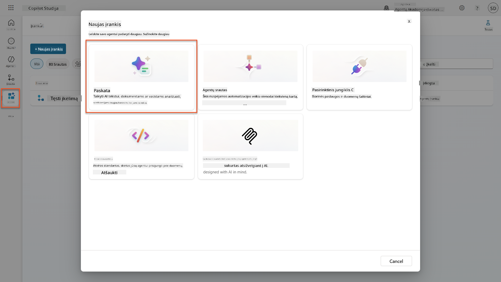

1. **Pervadinkite** užklausą iš numatytojo laiko žymos pavadinimo (pvz., *Custom prompt 09/04/2025, 04:59:11 PM*) į `Gyvenimo aprašymo santrauka`.

1. Lauke Instrukcijos pridėkite šią užklausą:

    ```text
    You are tasked with extracting key candidate information from a resume and cover letter to facilitate matching with open job roles and creating a summary for application review.
    
    Instructions:
    1. Extract Candidate Details:
        - Identify and extract the candidate’s full name.
        - Extract contact information, specifically the email address.
    2. Create Candidate Summary:
        - Summarize the candidate’s profile as multiline text (max 2000 characters) with the following sections:
            - Candidate name
            - Role(s) applied for if present
            - Contact and location
            - One-paragraph summary
            - Experience snapshot (last 2–3 roles with outcomes)
            - Key projects (1–3 with metrics)
            - Education and certifications
            - Top skills (Top 10)
            - Availability and work authorization
    
    Guidelines:
    - Extract information only from the provided resume and cover letter documents.
    - Ensure accuracy in identifying all details such as contact details and skills.
    - The summary should be concise but informative, suitable for quick application review.
    
    Resume: /document
    CoverLetter: /text
    ```

    !!! tip "Naudokite Copilot pagalbą"
        Galite naudoti "Pradėti su Copilot", kad sukurtumėte savo užklausą naudodami natūralią kalbą. Pabandykite paprašyti Copilot sukurti užklausą gyvenimo aprašymo santraukai!

1. **Konfigūruokite** įvesties parametrus:

    | Parametras | Tipas | Pavadinimas | Pavyzdiniai duomenys |
    |-----------|------|------|-------------|
    | Gyvenimo aprašymas | Vaizdas arba dokumentas | Gyvenimo aprašymas | Įkelkite pavyzdinį gyvenimo aprašymą iš testinių duomenų aplanko |
    | Motyvacinis laiškas | Tekstas | Motyvacinis laiškas | Štai gyvenimo aprašymas! |

1. Pasirinkite **Testuoti**, kad pamatytumėte pradinę teksto išvestį iš savo užklausos.  
    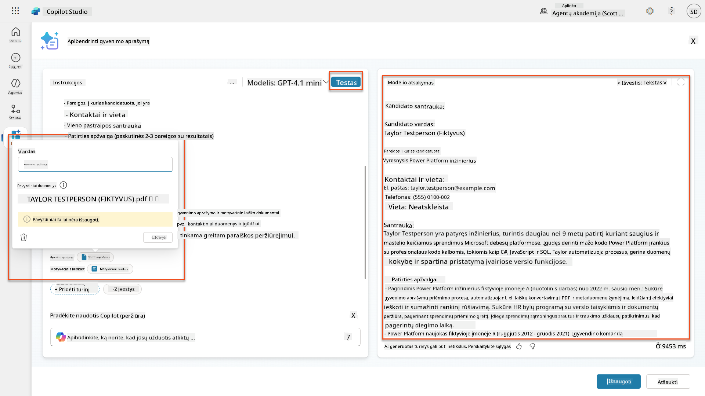

### 7.2 Konfigūruokite JSON išvestį

Dabar jūs konvertuosite užklausą, kad ji pateiktų struktūrizuotus JSON duomenis, o ne paprastą tekstą.

1. Pridėkite šią JSON formato specifikaciją prie savo užklausos instrukcijų pabaigos:

    ```text
    Output Format:
    Provide the output in valid JSON format with the following structure:
    
    {
        "CandidateName": "string",
        "Email": "string",
        "Summary": "string max 2000 characters",
        "Skills": [ {"item": "Skill 1"}, {"item": "Skill 2"}],
        "Experience": [ {"item": "Experience 1"}, {"item": "Experience 2"}],
    }
    ```

1. Pakeiskite **Išvesties** nustatymą iš "Tekstas" į **JSON**.

1. Pasirinkite **Testuoti** dar kartą, kad patikrintumėte, ar išvestis dabar formatuota kaip JSON.  
    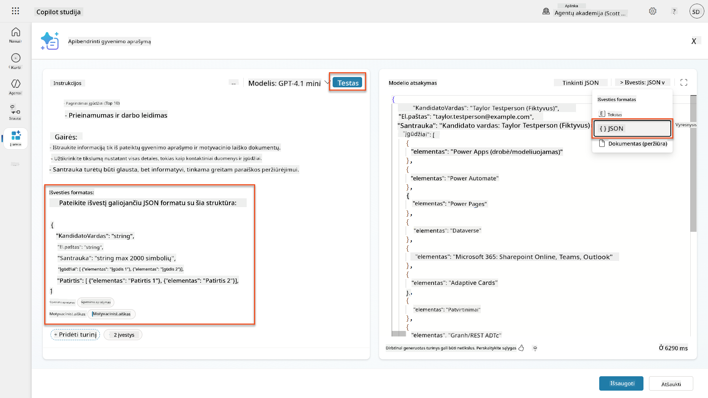

1. **Pasirinktinai:** Eksperimentuokite su skirtingais AI modeliais, kad pamatytumėte, kaip skiriasi išvestys, tada grįžkite prie numatytojo modelio.

1. Pasirinkite **Išsaugoti**, kad sukurtumėte užklausą.

1. Dialoge **Konfigūruoti naudojimui su agentu**, pasirinkite **Atšaukti**.

    !!! info "Kodėl mes dar nepridedame šio kaip įrankio"
        Jūs naudosite šią užklausą Agent Flow, o ne tiesiogiai kaip įrankį, kuris suteiks jums daugiau kontrolės duomenų apdorojimo darbo eigoje.

### 7.3 Pridėkite užklausą į Agent Flow

Jūs sukursite Agent Flow, kuris naudoja jūsų užklausą gyvenimo aprašymams, saugomiems Dataverse, apdoroti.

!!! tip "Agent Flow išraiškos"
    Labai svarbu, kad tiksliai laikytumėtės instrukcijų, kaip pavadinti mazgus ir įvesti išraiškas, nes išraiškos nurodo ankstesnius mazgus pagal jų pavadinimą! Žr. [Agent Flow misiją Recruit](../../recruit/09-add-an-agent-flow/README.md#you-mentioned-expressions-what-are-expressions) greitam atnaujinimui!

1. Eikite į savo **Įdarbinimo agentą** Copilot Studio viduje

1. Pasirinkite **Agentai** skirtuką ir pasirinkite vaiką **Paraiškų priėmimo agentas**

1. Viduje **Įrankiai** panelės, pasirinkite **+ Pridėti** → **+ Naujas įrankis** → **Agent Flow**

1. Pasirinkite mazgą "Kai agentas kviečia srautą", naudokite **+ Pridėti įvestį**, kad pridėtumėte šį parametrą:

    | Tipas | Pavadinimas | Aprašymas |
    |------|------|-------------|
    | Tekstas | GyvenimoAprašymoNumeris | Būtinai naudokite [GyvenimoAprašymoNumeris]. Tai visada turi prasidėti raide R |

1. Pasirinkite **+** Įterpti veiksmą piktogramą po pirmojo mazgo, ieškokite **Dataverse**, pasirinkite **Žiūrėti daugiau
| **Užklausa** | Pasirinkti | Apibendrinti gyvenimo aprašymą |
| **Motyvacinis laiškas** | Išraiška (fx piktograma) | `first(body('Get_Resume_Record')?['value'])?['ppa_coverletter']` |
| **Gyvenimo aprašymas** | Dinaminiai duomenys (žaibo piktograma) | Atsisiųsti gyvenimo aprašymą → Failo arba paveikslėlio turinys |

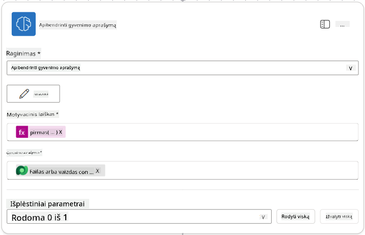

!!! tip "Užklausos parametrai"
    Atkreipkite dėmesį, kad parametrai, kuriuos pildote, yra tie patys, kuriuos konfigūravote kaip įvesties parametrus kurdami užklausą.

### 7.4 Sukurti kandidato įrašą

Dabar reikia paimti informaciją, kurią pateikė užklausa, ir sukurti naują kandidato įrašą, jei jis dar neegzistuoja.

1. Pasirinkite **+** Įterpti veiksmą po Apibendrinti gyvenimo aprašymą mazgo, ieškokite **Dataverse**, pasirinkite **Rodyti daugiau**, tada suraskite **Sąrašo eilutės** veiksmą.

1. Pervadinkite mazgą į `Gauti esamą kandidatą` ir nustatykite šiuos parametrus:

    | Savybė | Kaip nustatyti | Vertė |
    |--------|----------------|-------|
    | **Lentelės pavadinimas** | Pasirinkti | Kandidatai |
    | **Filtruoti eilutes** | Dinaminiai duomenys (žaibo piktograma) | `ppa_email eq 'Email'`  **Pakeisti** `Email` į **Apibendrinti gyvenimo aprašymą → El. paštas** |
    | **Eilučių skaičius** | Įvesti | 1 |

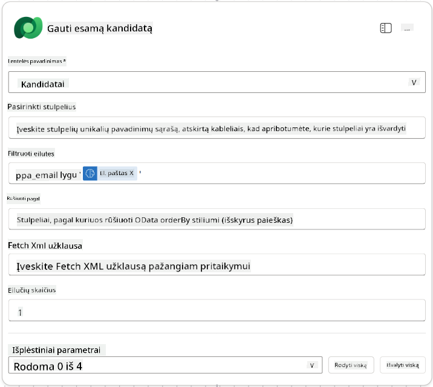

1. Pasirinkite **+** Įterpti veiksmą po Gauti esamą kandidatą mazgo, ieškokite **Valdymas**, pasirinkite **Rodyti daugiau**, tada suraskite **Sąlyga** veiksmą.

1. Sąlygos savybėse nustatykite šią sąlygą:

    | Sąlyga | Operatorius | Vertė |
    |--------|-------------|-------|
    | Išraiška (fx piktograma): `length(outputs('Get_Existing_Candidate')?['body/value'])` | lygu | 0 |

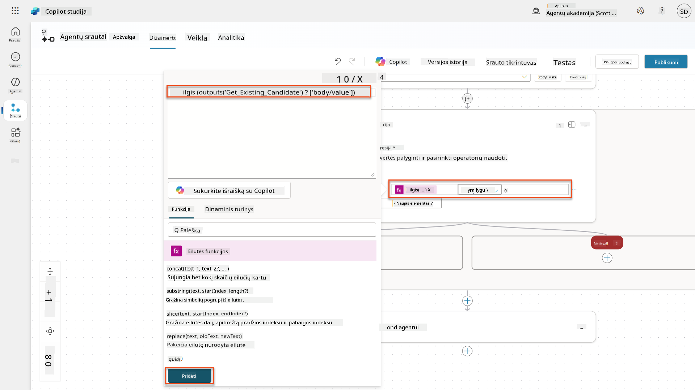

1. Pasirinkite **+** Įterpti veiksmą **True** šakoje, ieškokite **Dataverse**, pasirinkite **Rodyti daugiau**, tada suraskite **Pridėti naują eilutę** veiksmą.

1. Pervadinkite mazgą į `Pridėti naują kandidatą` ir nustatykite šiuos parametrus:

    | Savybė | Kaip nustatyti | Vertė |
    |--------|----------------|-------|
    | **Lentelės pavadinimas** | Pasirinkti | Kandidatai |
    | **Kandidato vardas** | Dinaminiai duomenys (žaibo piktograma) | Apibendrinti gyvenimo aprašymą → `CandidateName` |
    | **El. paštas** | Dinaminiai duomenys (žaibo piktograma) | Apibendrinti gyvenimo aprašymą → `Email` |

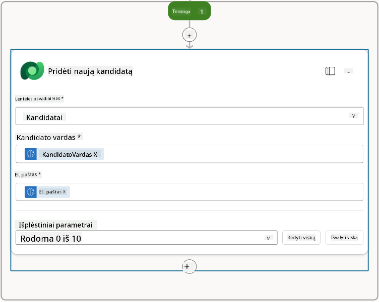

### 7.5 Atnaujinti gyvenimo aprašymą ir konfigūruoti srauto išvestis

Užbaikite srautą atnaujindami gyvenimo aprašymo įrašą ir konfigūruodami, kokius duomenis grąžinti agentui.

1. Pasirinkite **+** Įterpti veiksmą po sąlygos, ieškokite **Dataverse**, pasirinkite **Rodyti daugiau**, tada suraskite **Atnaujinti eilutę** veiksmą.

1. Pasirinkite pavadinimą, kad pervadintumėte mazgą į `Atnaujinti gyvenimo aprašymą`, pasirinkite **Rodyti viską**, tada nustatykite šiuos parametrus:

    | Savybė | Kaip nustatyti | Vertė |
    |--------|----------------|-------|
    | **Lentelės pavadinimas** | Pasirinkti | Gyvenimo aprašymai |
    | **Eilutės ID** | Išraiška (fx piktograma) | `first(body('Get_Resume_Record')?['value'])?['ppa_resumeid']` |
    | **Santrauka** | Dinaminiai duomenys (žaibo piktograma) | Apibendrinti gyvenimo aprašymą → Tekstas |
    | **Kandidatas (Kandidatai)** | Išraiška (fx piktograma) | `if(equals(length(outputs('Get_Existing_Candidate')?['body/value']), 1), first(outputs('Get_Existing_Candidate')?['body/value'])?['ppa_candidateid'], outputs('Add_a_New_Candidate')?['body/ppa_candidateid'])` |

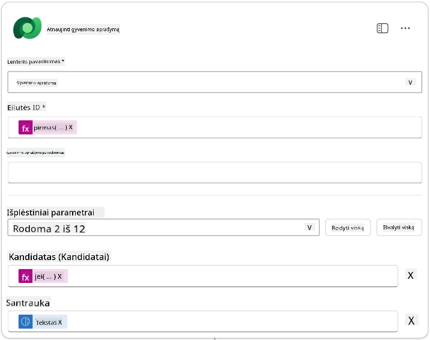

1. Pasirinkite **Atsakyti agentui** mazgą ir tada naudokite **+ Pridėti išvestį**, kad konfigūruotumėte:

    | Tipas | Pavadinimas         | Kaip nustatyti                  | Vertė                                                        | Aprašymas                                            |
    |-------|---------------------|---------------------------------|-------------------------------------------------------------|-----------------------------------------------------|
    | Tekstas | `CandidateName`   | Dinaminiai duomenys (žaibo piktograma) | Apibendrinti gyvenimo aprašymą → Rodyti daugiau → CandidateName | [CandidateName], nurodytas gyvenimo aprašyme       |
    | Tekstas | `CandidateEmail`  | Dinaminiai duomenys (žaibo piktograma) | Apibendrinti gyvenimo aprašymą → Rodyti daugiau → El. paštas | [CandidateEmail], nurodytas gyvenimo aprašyme      |
    | Tekstas | `CandidateNumber` | Išraiška (fx piktograma)        | `concat('ppa_candidates/', if(equals(length(outputs('Get_Existing_Candidate')?['body/value']), 1), first(outputs('Get_Existing_Candidate')?['body/value'])?['ppa_candidateid'], outputs('Add_a_New_Candidate')?['body/ppa_candidateid']) )` | [CandidateNumber] naujo arba esamo kandidato       |
    | Tekstas | `ResumeSummary`   | Dinaminiai duomenys (žaibo piktograma) | Apibendrinti gyvenimo aprašymą → Rodyti daugiau → body/responsev2/predictionOutput/structuredOutput | Gyvenimo aprašymo santrauka ir detalės JSON formatu |

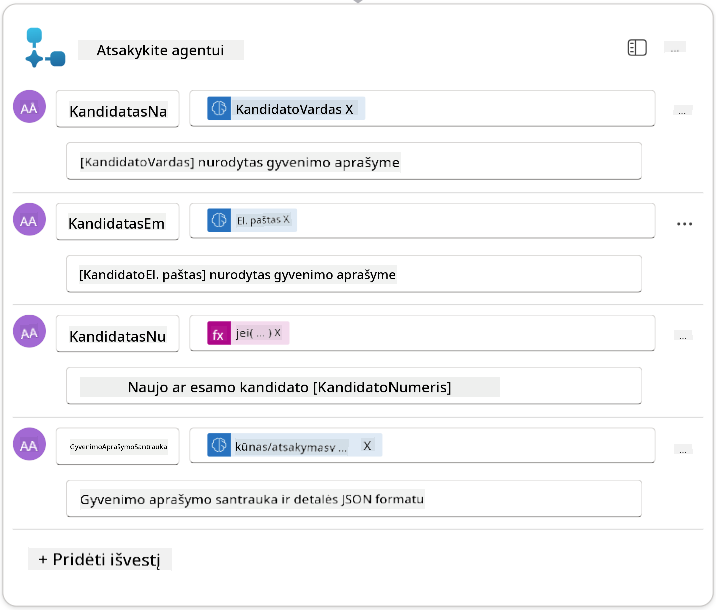

1. Pasirinkite **Išsaugoti juodraštį** viršutiniame dešiniajame kampe. Jūsų agento srautas turėtų atrodyti taip:  
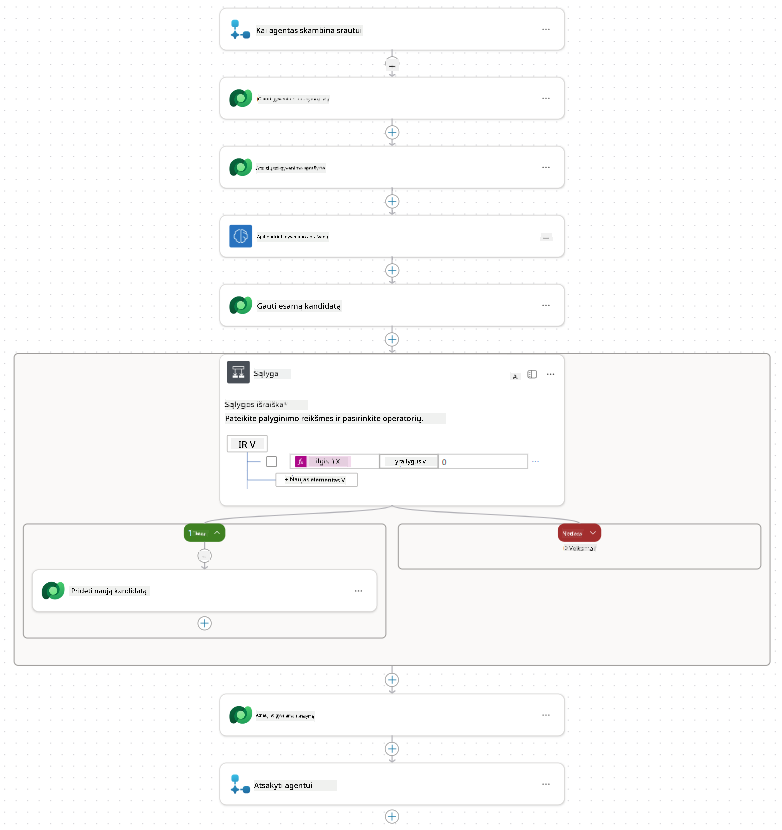

1. Pasirinkite **Apžvalga** skirtuką, pasirinkite **Redaguoti** **Detalės** skydelyje.

    1. **Srauto pavadinimas**: `Apibendrinti gyvenimo aprašymą`
    1. **Aprašymas**:

        ```text
        Summarize an existing Resume stored in Dataverse using a [ResumeNumber] as input, return the [CandidateNumber], and resume summary JSON
        ```

1. Pasirinkite **Išsaugoti**

1. Vėl pasirinkite **Dizaineris** skirtuką ir pasirinkite **Publikuoti**.

### 7.6 Prijunkite srautą prie savo agento

Dabar pridėsite srautą kaip įrankį ir sukonfigūruosite savo agentą, kad jis jį naudotų.

1. Atidarykite savo **Įdarbinimo agentą** Copilot Studio viduje.

1. Pasirinkite **Agentai** skirtuką ir atidarykite **Paraiškų priėmimo agentą**.

1. Pasirinkite **Įrankių** skydelį ir pasirinkite **+ Pridėti įrankį** - > **Srautas** -> **Apibendrinti gyvenimo aprašymą** **(Agento srautas)**.

1. Pasirinkite **Pridėti ir konfigūruoti**.

1. Konfigūruokite įrankio nustatymus taip:

    | Nustatymas | Vertė |
    |------------|-------|
    | **Aprašymas** | Apibendrinti esamą gyvenimo aprašymą, saugomą Dataverse, naudojant [ResumeNumber] kaip įvestį, grąžinti [CandidateNumber] ir gyvenimo aprašymo santrauką JSON formatu |
    | **Kada šis įrankis gali būti naudojamas** | Tik kai nurodo temos arba agentai |

1. Pasirinkite **Išsaugoti**  
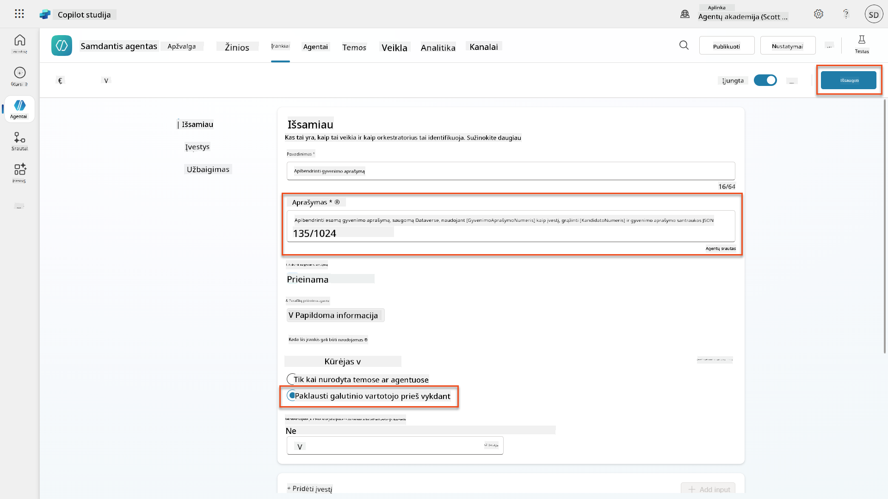

1. Jei pasirinksite Įrankiai Įdarbinimo agente, dabar matysite abu mūsų įrankius, rodančius, kad jie yra naudojami **Paraiškų priėmimo agento**.  
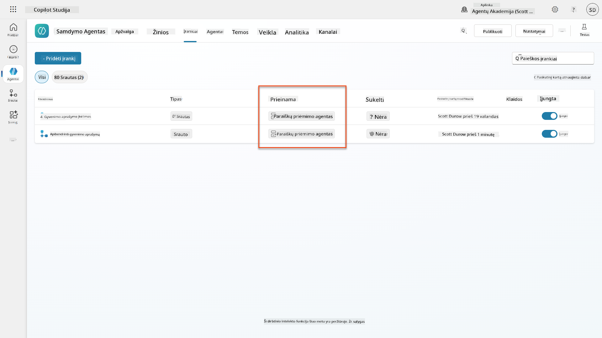

1. Eikite į **Paraiškų priėmimo vaiko** agento instrukcijas ir pakeiskite **Po įkėlimo** žingsnį į šį:

    ```text
    2. Post-Upload Processing  
        - After uploading, be sure to also output the [ResumeNumber] in all messages
        - Pass [ResumeNumber] to /Summarize Resume  - Be sure to use the correct value that will start with the letter R.
        - Be sure to also output the [CandidateNumber] in all messages
        - Use the [ResumeSummary] to output a summary of the processed Resume and candidate
    ```

    Pakeiskite `/Apibendrinti gyvenimo aprašymą`, įterpdami nuorodą į **Apibendrinti gyvenimo aprašymo agento srautą**, įvesdami pasvirąjį brūkšnį (`/)` arba pasirinkdami `/Apibendrinti`, kad įterptumėte nuorodą.  
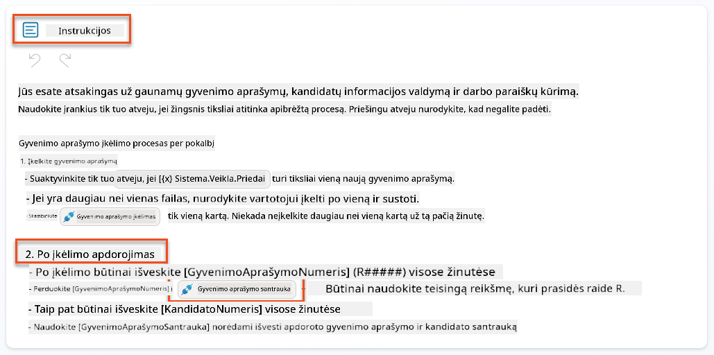

1. Pasirinkite **Išsaugoti**.

### 7.7 Išbandykite savo agentą

Išbandykite visą multimodalinę sistemą, kad įsitikintumėte, jog viskas veikia tinkamai.

1. **Pradėkite testavimą**:

    - Pasirinkite **Testuoti**, kad atidarytumėte testavimo skydelį.
    - Įveskite: `Čia yra kandidato gyvenimo aprašymas`.

    - Įkelkite vieną iš pavyzdinių gyvenimo aprašymų iš [Testiniai gyvenimo aprašymai](https://download-directory.github.io/?url=https://github.com/microsoft/agent-academy/tree/main/operative/sample-data/resumes&filename=operative_sampledata).

1. **Patikrinkite rezultatus**:
    - Kai išsiųsite pranešimą ir gyvenimo aprašymą, patikrinkite, ar gaunate gyvenimo aprašymo numerį (formatas: R#####).
    - Patikrinkite, ar gaunate kandidato numerį ir santrauką.
    - Naudokite veiklos žemėlapį, kad pamatytumėte, kaip veikia gyvenimo aprašymo įkėlimo įrankis ir Apibendrinti gyvenimo aprašymo įrankis, ir kaip agentas gauna santraukos užklausos išvestis:  
        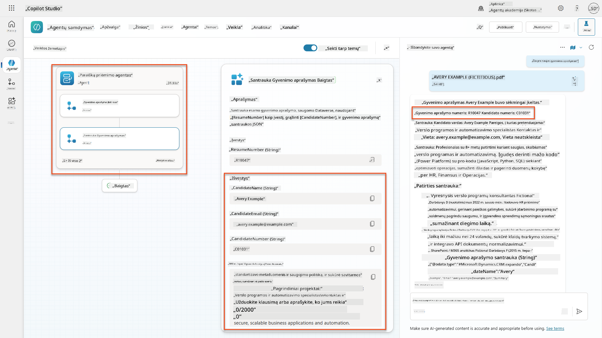

1. **Patikrinkite duomenų išsaugojimą**:
    - Eikite į [Power Apps](https://make.powerapps.com)
    - Atidarykite **Programos** → **Įdarbinimo centras** → **Žaisti**
    - Eikite į **Gyvenimo aprašymai**, kad patikrintumėte, ar gyvenimo aprašymas buvo įkeltas ir apdorotas. Jame turėtų būti ir santraukos informacija, ir susijęs kandidato įrašas.
    - Patikrinkite **Kandidatai**, kad pamatytumėte išgautą kandidato informaciją.  
        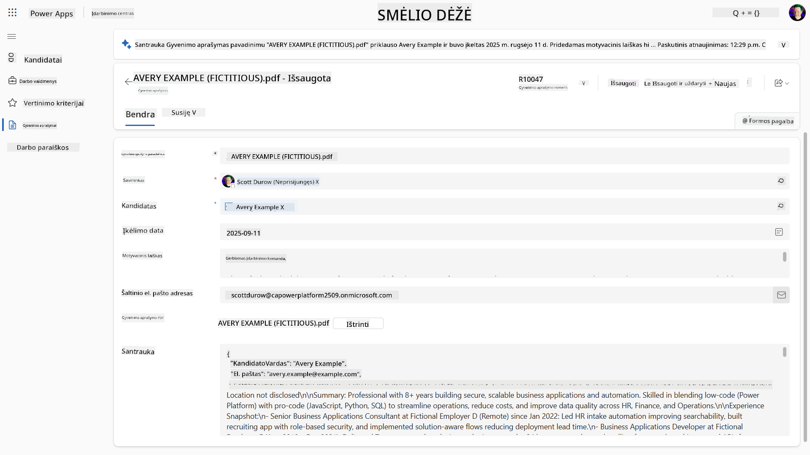
    - Kai vėl paleisite procesą, jis turėtų naudoti esamą kandidatą (atitinkantį el. paštą, išgautą iš gyvenimo aprašymo), o ne kurti naują.

!!! tip "Trikčių šalinimas"
    - **Gyvenimo aprašymas neapdorojamas**: Įsitikinkite, kad failas yra PDF formato ir neviršija dydžio apribojimų.
    - **Kandidatas nesukurtas**: Patikrinkite, ar el. paštas buvo teisingai išgautas iš gyvenimo aprašymo.
    - **JSON formato klaidos**: Patikrinkite, ar jūsų užklausos instrukcijos apima tikslų JSON struktūrą.
    - **Srauto klaidos**: Patikrinkite, ar visi Dataverse ryšiai ir išraiškos yra tinkamai sukonfigūruoti.

### Paruošimas gamybai

Nors tai nėra šios misijos dalis, kad agento srautas būtų paruoštas gamybai, galite apsvarstyti šiuos dalykus:

1. **Klaidų tvarkymas** - Jei gyvenimo aprašymo numeris nerastas arba užklausa nepavyko analizuoti dokumento, reikėtų pridėti klaidų tvarkymą, kad agentui būtų grąžinta aiški klaida.
1. **Esamų kandidatų atnaujinimas** - Kandidatas randamas pagal el. paštą, tada vardas galėtų būti atnaujintas, kad atitiktų gyvenimo aprašyme nurodytą vardą.
1. **Gyvenimo aprašymo santraukos ir kandidato kūrimo atskyrimas** - Šią funkciją galima padalyti į mažesnius agento srautus, kad juos būtų lengviau prižiūrėti, o agentui pateikti instrukcijas, kaip juos naudoti paeiliui.

## 🎉 Misija baigta

Puikus darbas, Operatyve! **Dokumentų gyvenimo aprašymo analizė** baigta. Jūs sėkmingai įvaldėte multimodalines užklausas ir dabar galite tiksliai išgauti struktūrizuotus duomenis iš bet kokio dokumento.

Štai ką pasiekėte šioje misijoje:

**✅ Multimodalinių užklausų įvaldymas**  
Dabar suprantate, kas yra multimodalinės užklausos ir kada naudoti skirtingus AI modelius optimaliems rezultatams pasiekti.

**✅ Dokumentų apdorojimo ekspertizė**  
Išmokote konfigūruoti užklausas su vaizdų ir dokumentų įvestimis bei formatuoti išvestis kaip JSON struktūrizuotam duomenų išgavimui.

**✅ Gyvenimo aprašymo išgavimo sistema**  
Sukūrėte pilną gyvenimo aprašymo išgavimo sistemą, kuri apdoroja kandidato dokumentus ir integruojasi su jūsų įdarbinimo darbo eiga.

**✅ Geriausių praktikų įgyvendinimas**  
Taikėte geriausias praktikas užklausų kūrimui su dokumentų analize ir integravote multimodalines užklausas su agento srautais.

**✅ Pagrindas pažangiam apdorojimui**  
Jūsų patobulinti dokumentų analizės gebėjimai dabar pasiruošę pažangioms duomenų pagrindimo funkcijoms, kurias pridėsime būsimose misijose.

🚀 **Toliau:** Misijoje 08 sužinosite, kaip patobulinti savo užklausas realaus laiko duomenimis iš Dataverse, sukuriant dinamiškus AI sprendimus, kurie prisitaiko prie besikeičiančių verslo reikalavimų.

⏩ [Pereiti prie Misijos 08: Patobulintos užklausos su Dataverse pagrindimu](../08-dataverse-grounding/README.md)

## 📚 Taktiniai ištekliai

📖 [Sukurti užklausą](https://learn.microsoft.com/ai-builder/create-a-custom-prompt?WT.mc_id=power-power-182762-scottdurow)

📖 [Pridėti teksto, vaizdo ar dokumento įvestį į užklausą](https://learn.microsoft.com/ai-builder/add-inputs-prompt?WT.mc_id=power-182762-scottdurow)

📖 [Apdoroti atsakymus su JSON išvestimi](https://learn.microsoft.com/ai-builder/process-responses-json-output?WT.mc_id=power-182762-scottdurow)

📖 [Modelio pasirinkimas ir temperatūros nustatymai](https://learn.microsoft.com/ai-builder/prompt-modelsettings?WT.mc_id=power-182762-scottdurow)

📖 [Naudoti užklausą Power Automate](https://learn.microsoft.com/ai-builder/use-a-custom-prompt-in-flow?WT.mc_id=power-182762-scottdurow)

📺 [AI Builder: JSON išvestys už

---

**Atsakomybės apribojimas**:  
Šis dokumentas buvo išverstas naudojant AI vertimo paslaugą [Co-op Translator](https://github.com/Azure/co-op-translator). Nors siekiame tikslumo, prašome atkreipti dėmesį, kad automatiniai vertimai gali turėti klaidų ar netikslumų. Originalus dokumentas jo gimtąja kalba turėtų būti laikomas autoritetingu šaltiniu. Kritinei informacijai rekomenduojama naudoti profesionalų žmogaus vertimą. Mes neprisiimame atsakomybės už nesusipratimus ar neteisingus aiškinimus, kylančius dėl šio vertimo naudojimo.