<!--
CO_OP_TRANSLATOR_METADATA:
{
  "original_hash": "750f3ea8a94930439ebd8a10871b1d73",
  "translation_date": "2025-10-21T23:53:27+00:00",
  "source_file": "docs/operative-preview/08-dataverse-grounding/README.md",
  "language_code": "lt"
}
-->
# 🚨 Misija 08: Patobulinti užklausų šablonai su Dataverse pagrindu

## 🕵️‍♂️ SLAPTAŽODIS: `OPERACIJA PAGRINDO KONTROLĖ`

> **⏱️ Operacijos laiko langas:** `~60 minučių`

## 🎯 Misijos aprašymas

Sveiki sugrįžę, Operatyve. Jūsų daugiaveiksmių agentų įdarbinimo sistema veikia, tačiau reikia atlikti svarbų patobulinimą dėl **duomenų pagrindo** – jūsų AI modeliams reikia realaus laiko prieigos prie jūsų organizacijos struktūrizuotų duomenų, kad galėtų priimti protingus sprendimus.

Šiuo metu jūsų „Santrauka CV“ užklausa veikia su statinėmis žiniomis. Bet kas, jei ji galėtų dinamiškai pasiekti jūsų darbo pozicijų duomenų bazę, kad pateiktų tikslius, naujausius atitikimus? Kas, jei ji suprastų jūsų vertinimo kriterijus, nereikalaujant jų kietai užkoduoti?

Šioje misijoje jūs patobulinsite savo užklausų šabloną su **Dataverse pagrindu** – prijungdami savo užklausas tiesiogiai prie gyvų duomenų šaltinių. Tai pavers jūsų agentus iš statinių atsakiklių į dinamiškas, duomenimis pagrįstas sistemas, kurios prisitaiko prie besikeičiančių verslo poreikių.

Jūsų misija: integruoti realaus laiko darbo pozicijų ir vertinimo kriterijų duomenis į jūsų CV analizės darbo eigą, sukuriant savarankiškai atsinaujinančią sistemą, kuri išlieka aktuali jūsų organizacijos įdarbinimo reikalavimams.

## 🔎 Tikslai

Šioje misijoje jūs išmoksite:

1. Kaip **Dataverse pagrindas** patobulina užklausų šablonus
1. Kada naudoti duomenų pagrindą, o kada statines instrukcijas
1. Kaip kurti užklausas, kurios dinamiškai įtraukia gyvus duomenis
1. Kaip patobulinti „Santrauka CV“ darbo eigą su darbo pozicijų atitikimu

## 🧠 Dataverse pagrindo supratimas užklausoms

**Dataverse pagrindas** leidžia jūsų užklausų šablonams pasiekti gyvus duomenis iš jūsų Dataverse lentelių apdorojant užklausas. Vietoj statinių instrukcijų jūsų užklausos gali įtraukti realaus laiko informaciją, kad priimtų pagrįstus sprendimus.

### Kodėl Dataverse pagrindas yra svarbus

Tradicinės užklausos veikia su fiksuotomis instrukcijomis:

Su Dataverse pagrindu jūsų užklausa pasiekia dabartinius duomenis:

Šis požiūris suteikia keletą pagrindinių privalumų:

- **Dinaminiai atnaujinimai:** Darbo pozicijos ir kriterijai keičiasi be užklausų modifikacijų
- **Nuoseklumas:** Visi agentai naudoja tuos pačius dabartinius duomenų šaltinius
- **Mastelis:** Naujos pozicijos ir kriterijai automatiškai tampa prieinami
- **Tikslumas:** Realaus laiko duomenys užtikrina, kad sprendimai atspindi dabartinius poreikius

### Kaip veikia Dataverse pagrindas

Kai įgalinate Dataverse pagrindą užklausų šablonui:

1. **Duomenų pasirinkimas:** Pasirinkite konkrečias Dataverse lenteles ir stulpelius, kuriuos norite įtraukti. Taip pat galite pasirinkti susijusias lenteles, kurias sistema filtruos pagal gautus pagrindinius įrašus.
1. **Konteksto įterpimas:** Užklausa automatiškai įtraukia gautus duomenis į užklausos kontekstą
1. **Protingas filtravimas:** Sistema įtraukia tik duomenis, kurie yra aktualūs dabartinei užklausai, jei pateikiate filtravimą.
1. **Struktūrizuotas rezultatas:** Jūsų užklausa gali remtis gautais duomenimis ir analizuoti gautus įrašus, kad sukurtų rezultatą.

### Nuo statinio iki dinaminio: pagrindo pranašumas

Pažvelkime į jūsų dabartinę „Santrauka CV“ darbo eigą iš Misijos 07 ir pamatykime, kaip Dataverse pagrindas ją transformuoja iš statinės į dinaminę intelektą.

**Dabartinis statinis požiūris:**
Jūsų esama užklausa apima kietai užkoduotus vertinimo kriterijus ir iš anksto nustatytą atitikimo logiką. Šis požiūris veikia, tačiau reikalauja rankinių atnaujinimų, kai pridedate naujas darbo pozicijas, keičiate vertinimo kriterijus ar keičiate įmonės prioritetus.

**Dataverse pagrindo transformacija:**
Pridėjus Dataverse pagrindą, jūsų „Santrauka CV“ darbo eiga:

- **Pasieks dabartines darbo pozicijas** iš jūsų Darbo pozicijų lentelės
- **Naudos gyvus vertinimo kriterijus** vietoj statinių aprašymų  
- **Pateiks tikslius atitikimus** remiantis realaus laiko reikalavimais

## 🎯 Kodėl dedikuoti užklausų šablonai, o ne agentų pokalbiai

Misijoje 02 jūs patyrėte, kaip Interviu Agentas galėjo suderinti kandidatus su darbo pozicijomis, tačiau reikalavo sudėtingų vartotojo užklausų, tokių kaip:

Nors tai veikė, dedikuoti užklausų šablonai su Dataverse pagrindu siūlo reikšmingus pranašumus specifinėms užduotims:

### Pagrindiniai dedikuotų užklausų pranašumai

| Aspektas | Agentų pokalbiai | Dedikuoti užklausų šablonai |
|--------|-------------------|------------------|
| **Nuoseklumas** | Rezultatai skiriasi priklausomai nuo vartotojo užklausų kūrimo įgūdžių | Standartizuotas apdorojimas kiekvieną kartą |
| **Specializacija** | Bendro pobūdžio samprotavimai gali praleisti verslo niuansus | Specialiai sukurta su optimizuota verslo logika |
| **Automatizacija** | Reikalauja žmogaus sąveikos ir interpretacijos | Automatiškai aktyvuojama su struktūrizuotu JSON rezultatu |

## 🧪 Laboratorija 8: Pridėti Dataverse pagrindą užklausoms

Laikas patobulinti jūsų CV analizės galimybes! Jūs patobulinsite esamą „Santrauka CV“ darbo eigą su dinamišku darbo pozicijų atitikimu.

### Reikalavimai misijai užbaigti

1. Jums reikės **arba**:

    - **Užbaigti Misiją 07** ir turėti paruoštą CV analizės sistemą, **ARBA**
    - **Importuoti Misijos 08 pradinį sprendimą**, jei pradedate nuo nulio arba reikia pasivyti. [Atsisiųsti Misijos 08 pradinį sprendimą](https://aka.ms/agent-academy)

1. Pavyzdiniai CV dokumentai iš [test CV](https://download-directory.github.io/?url=https://github.com/microsoft/agent-academy/tree/main/operative/sample-data/resumes&filename=operative_sampledata)

!!! note "Sprendimo importavimas ir pavyzdiniai duomenys"
    Jei naudojate pradinį sprendimą, žiūrėkite [Misija 01](../01-get-started/README.md) dėl išsamių instrukcijų, kaip importuoti sprendimus ir pavyzdinius duomenis į jūsų aplinką.

### 8.1 Pridėti Dataverse pagrindą jūsų užklausai

Jūs remsitės „Santrauka CV“ užklausa, kurią sukūrėte Misijoje 07. Šiuo metu ji tiesiog apibendrina CV, tačiau dabar ją pagrįsite darbo pozicijomis, kurios šiuo metu egzistuoja Dataverse, išlaikant ją visada aktualią.

Pirmiausia, apžvelkime Dataverse lenteles, su kuriomis jūs dirbsite:

1. **Eikite** į [Power Apps](https://make.powerapps.com) ir pasirinkite savo aplinką naudodami **Aplinkos perjungiklį** viršutiniame dešiniajame navigacijos juostos kampe.

1. Pasirinkite **Lentelės** ir suraskite **Darbo pozicijų** lentelę

1. Peržiūrėkite pagrindinius stulpelius, kuriuos naudosite pagrindui:

    | Stulpelis | Paskirtis |
    |--------|---------|
    | **Darbo pozicijos numeris** | Unikalus identifikatorius pozicijų atitikimui |
    | **Darbo pavadinimas** | Rodymo pavadinimas pozicijai |
    | **Aprašymas** | Išsamūs pozicijos reikalavimai |

1. Panašiai peržiūrėkite kitas lenteles, tokias kaip **Vertinimo kriterijų** lentelė.

### 8.2 Pridėti Dataverse pagrindo duomenis į jūsų užklausą

1. **Eikite** į Copilot Studio ir pasirinkite savo aplinką naudodami **Aplinkos perjungiklį** viršutiniame dešiniajame navigacijos juostos kampe.

1. Pasirinkite **Įrankiai** iš kairės navigacijos.

1. Pasirinkite **Užklausa** ir suraskite savo **Santrauka CV** užklausą iš Misijos 07.  
    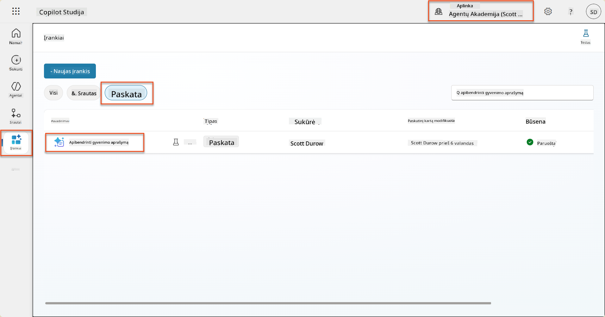

1. Pasirinkite **Redaguoti**, kad pakeistumėte užklausą, ir pakeiskite ją patobulinta versija:

    !!! important
        Užtikrinkite, kad CV ir Motyvacinio laiško parametrai išliktų nepakitę kaip parametrai.

1. Užklausos redaktoriuje pakeiskite `/Darbo pozicija`, pasirinkdami **+ Pridėti turinį**, pasirinkdami **Dataverse** → **Darbo pozicija** ir pasirinkite šiuos stulpelius, tada pasirinkite **Pridėti**:

    1. **Darbo pozicijos numeris**

    1. **Darbo pavadinimas**

    1. **Aprašymas**

    !!! tip
        Galite įvesti lentelės pavadinimą, kad ieškotumėte.

1. **Darbo pozicijos** dialoge pasirinkite **Filtruoti** atributą, pasirinkite **Statusas**, ir tada įveskite **Aktyvus** kaip **Filtruoti** reikšmę.  
    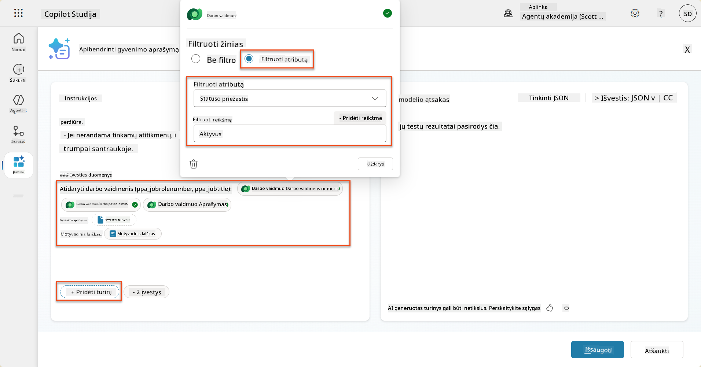

    !!! tip
        Čia galite naudoti **Pridėti reikšmę**, kad pridėtumėte įvesties parametrą – pavyzdžiui, jei turėtumėte užklausą, kuri apibendrina esamą įrašą, galėtumėte pateikti CV numerį kaip parametrą filtravimui.

1. Toliau pridėsite susijusią Dataverse lentelę **Vertinimo kriterijai**, vėl pasirinkdami **+ Pridėti turinį**, surasdami **Darbo pozicijos**, ir vietoj stulpelių pasirinkimo Darbo pozicijoje, išplėskite **Darbo pozicija (Vertinimo kriterijai)** ir pasirinkite šiuos stulpelius, tada pasirinkite **Pridėti**:

    1. **Kriterijų pavadinimas**

    1. **Aprašymas**  
        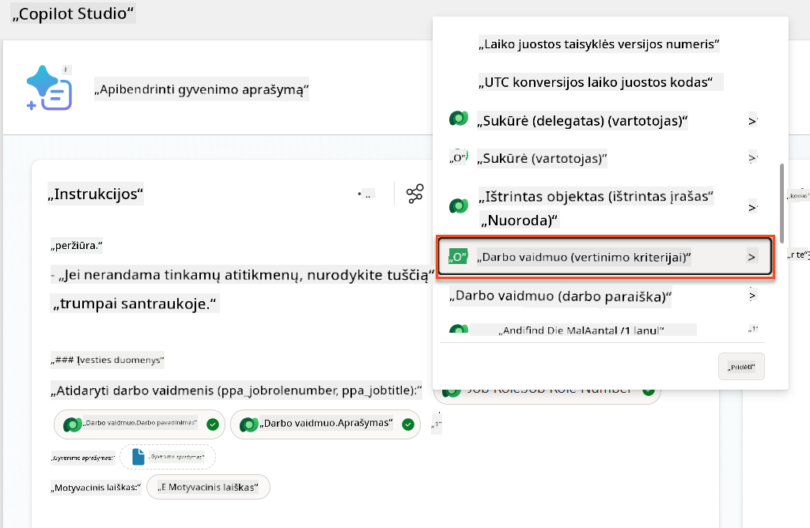

        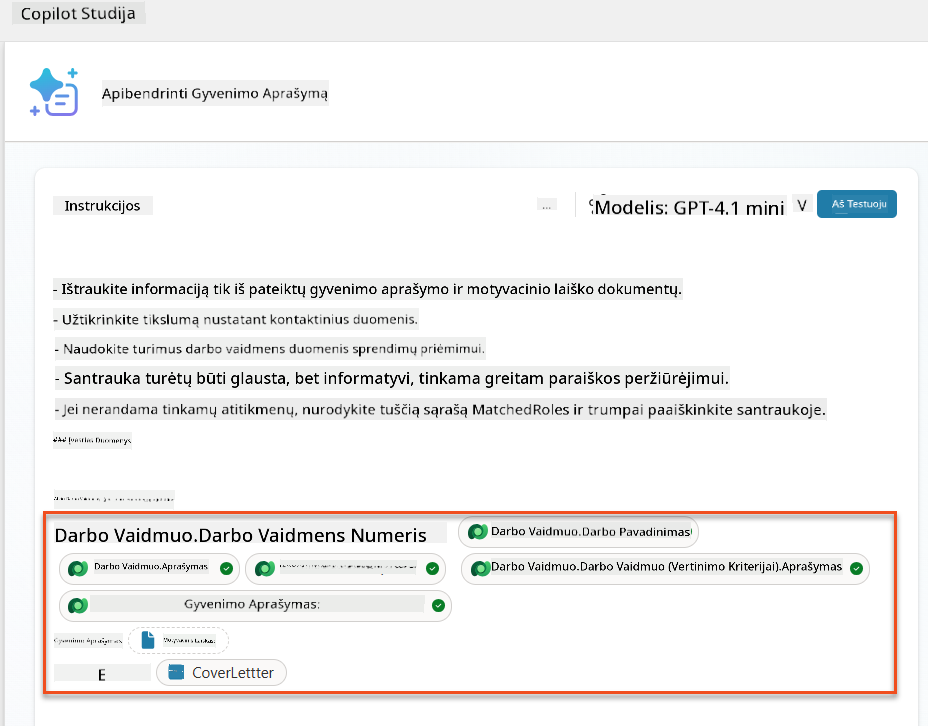

    !!! tip
        Svarbu pasirinkti susijusius Vertinimo kriterijus pirmiausia pasirinkus Darbo poziciją, o tada naršant meniu iki Darbo pozicija (Vertinimo kriterijai). Tai užtikrins, kad bus įkelti tik susiję įrašai Darbo pozicijai.

1. Pasirinkite **Nustatymai** ir sureguliuokite **Įrašų gavimą** iki 1000 – tai leis maksimaliai įtraukti Darbo pozicijas ir Vertinimo kriterijus į jūsų užklausą.  
    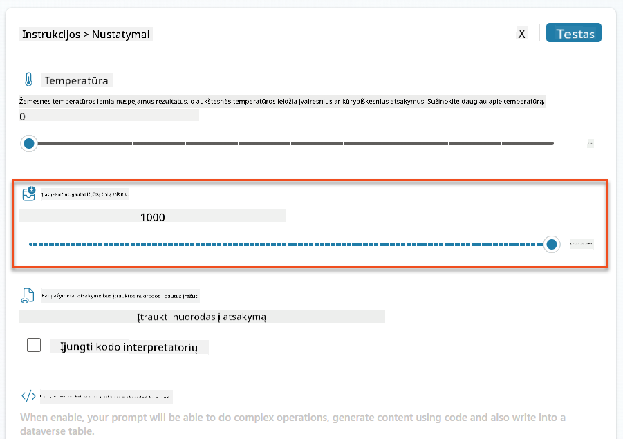

### 8.3 Išbandykite patobulintą užklausą

1. Pasirinkite **CV** parametrą ir įkelkite pavyzdinį CV, kurį naudojote Misijoje 07.
1. Pasirinkite **Testas**.
1. Kai testas bus atliktas, pastebėkite, kad JSON rezultatas dabar apima **Suderintas pozicijas**.
1. Pasirinkite **Naudoti žinias** skirtuką, kad pamatytumėte Dataverse duomenis, kurie buvo sujungti su jūsų užklausa prieš vykdymą.
1. **Išsaugokite** savo atnaujintą užklausą. Sistema dabar automatiškai įtrauks šiuos Dataverse duomenis į jūsų užklausą, kai esama „Santrauka CV“ Agentų darbo eiga ją iškvies.  
    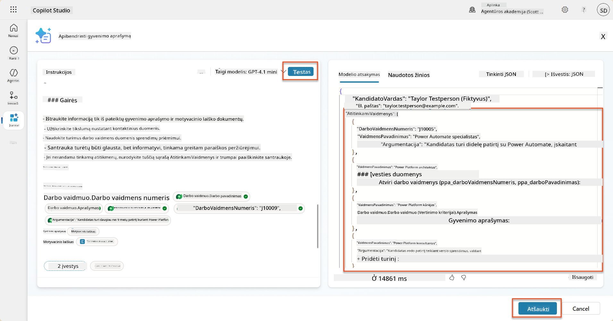

### 8.4 Pridėti Darbo paraiškos agento darbo eigą

Kad mūsų Paraiškų priėmimo agentas galėtų sukurti Darbo pozicijas pagal siūlomas pozicijas, reikia sukurti Agentų darbo eigą. Agentas iškvies šį įrankį kiekvienai siūlomai darbo pozicijai, kuri domina kandidatą.

!!! tip "Agentų darbo eigos išraiškos"
    Labai svarbu, kad tiksliai laikytumėtės instrukcijų, kaip pavadinti mazgus ir įvesti išraiškas, nes išraiškos nurodo ankstesnius mazgus pagal jų pavadinimą! Žiūrėkite [Agentų darbo eigos misiją „Recruit“](../../recruit/09-add-an-agent-flow/README.md#you-mentioned-expressions-what-are-expressions), kad greitai prisimintumėte!

1. Viduje **Įdarbinimo agento** pasirinkite **Agentų** skirtuką ir atidarykite **Paraiškų priėmimo agento** vaikų agentą.

1. Viduje **Įrankių** skydelio pasirinkite **+ Pridėti** → **+ Naujas įrankis** → **Agentų darbo eiga**

1. Pasirinkite **Kai agentas iškviečia darbo eigą** mazgą, naudokite **+ Pridėti įvestį**, kad pridėtumėte šį parametrą:

    | Tipas | Pavadinimas            | Aprašymas                                                  |
    | ---- | --------------- | ------------------------------------------------------------ |
    | Tekstas | `CVNumeris`  | Įsitikinkite, kad naudojate tik [CVNumeris] - jis PRIVALO prasidėti raide C |
    | Tekstas | `DarboPozicijosNumeris` | Įsitikinkite, kad naudojate tik [DarboPozicijosNumeris] - jis PRIVALO prasidėti raide D |

    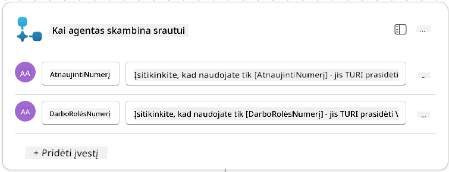

1. Pasirinkite **+** Įterpti veiksmą piktogramą po pirmojo mazgo, ieškokite **Dataverse**, pasirinkite **Žiūrėti daugiau**, ir tada suraskite **Sąrašo eilutes** veiksmą.

1. **Pervadinkite** mazgą kaip `Gauti CV`, ir tada nustatykite šiuos parametrus:

    | Savybė        | Kaip nustatyti                      | Reikšmė                                                        |
    | --------------- | ------------------------------- | ------------------------------------------------------------ |
    | **Lentelės pavadinimas**  | Pasirinkti                          | CV                                                      |
    | **Filtruoti eilutes** | Dinaminiai duomenys (žaibo piktograma) | `ppa_cvnumeris eq 'CVNumeris'` Pasirinkite ir pakeiskite **CVNumeris** su **Kai agentas iškviečia darbo eigą** → **CVNumeris** |
    | **Eilučių skaičius**   | Įvesti                           | 1                                                            |

    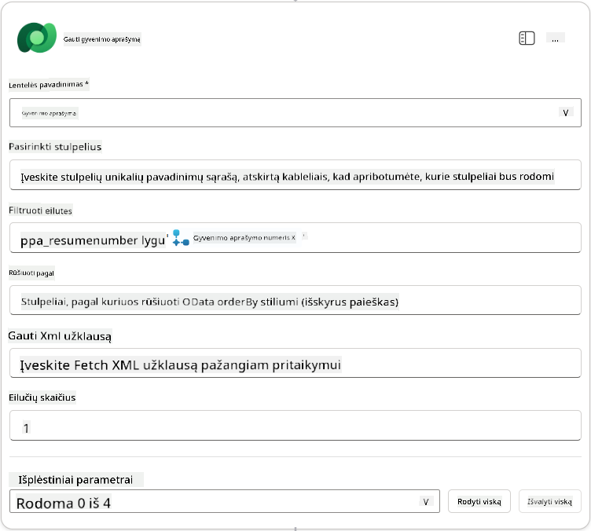

1. Dabar pasirinkite **+** Įterpti veiksmą piktogramą po **Gauti CV**, ieškokite **Dataverse**, pasirinkite **Žiūrėti daugiau**, ir tada suraskite **Sąrašo eilutes** veiksmą.

1. **Pervadinkite** mazgą kaip `Gauti Darbo poziciją`, ir tada nustatykite šiuos parametrus:

    | Savybė
| **Darbo vaidmuo (Darbo vaidmenys)**       | Išraiška (fx piktograma) | `concat('ppa_jobroles/',first(outputs('Get_Job_Role')?['body/value'])?['ppa_jobroleid'])` |
| **Gyvenimo aprašymas (Gyvenimo aprašymai)** | Išraiška (fx piktograma) | `concat('ppa_resumes/', first(outputs('Get_Resume')?['body/value'])?['ppa_resumeid'])` |
| **Paraiškos data** (naudokite **Rodyti viską**) | Išraiška (fx piktograma) | `utcNow()`                                                   |

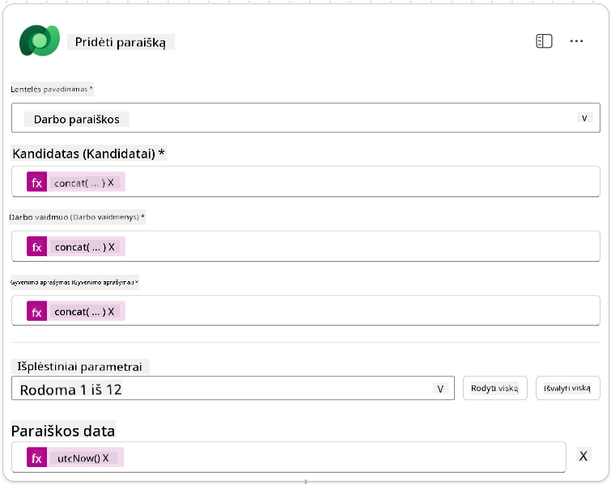

1. Pasirinkite **Atsakyti agentui mazgą**, tada pasirinkite **+ Pridėti išvestį**

     | Savybė           | Kaip nustatyti                  | Išsamiau                                       |
     | ----------------- | ------------------------------- | ---------------------------------------------- |
     | **Tipas**         | Pasirinkti                     | `Text`                                         |
     | **Pavadinimas**   | Įvesti                         | `ApplicationNumber`                            |
     | **Reikšmė**       | Dinaminiai duomenys (žaibo piktograma) | *Pridėti paraišką → Rodyti daugiau → Paraiškos numeris* |
     | **Aprašymas**     | Įvesti                         | `Sukurtos darbo paraiškos [ApplicationNumber]` |

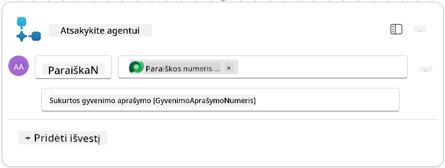

1. Pasirinkite **Išsaugoti juodraštį** viršuje dešinėje

1. Pasirinkite **Apžvalga** skirtuką, pasirinkite **Redaguoti** **Išsamumo** skydelyje

   - **Srauto pavadinimas**: `Sukurti darbo paraišką`
   - **Aprašymas**: `Sukuria naują darbo paraišką, kai pateikiamas [ResumeNumber] ir [JobRoleNumber]`
   - **Išsaugoti**

1. Vėl pasirinkite **Dizainerio** skirtuką ir pasirinkite **Publikuoti**.

### 8.5 Pridėti Sukurti darbo paraišką agentui

Dabar prijungsite publikuotą srautą prie savo Paraiškų priėmimo agento.

1. Grįžkite į **Įdarbinimo agentą** ir pasirinkite **Agentų** skirtuką. Atidarykite **Paraiškų priėmimo agentą**, tada suraskite **Įrankių** skydelį.

1. Pasirinkite **+ Pridėti**

1. Pasirinkite **Srauto** filtrą ir ieškokite `Sukurti darbo paraišką`. Pasirinkite **Sukurti darbo paraišką** srautą, tada **Pridėti ir konfigūruoti**.

1. Nustatykite šiuos parametrus:

    | Parametras                                         | Reikšmė                                                      |
    | -------------------------------------------------- | ------------------------------------------------------------ |
    | **Aprašymas**                                      | `Sukuria naują darbo paraišką, kai pateikiamas [ResumeNumber] ir [JobRoleNumber]` |
    | **Papildoma informacija → Kada šis įrankis gali būti naudojamas** | `Tik kai nurodo temos ar agentai`                             |

1. Pasirinkite **Išsaugoti**  
    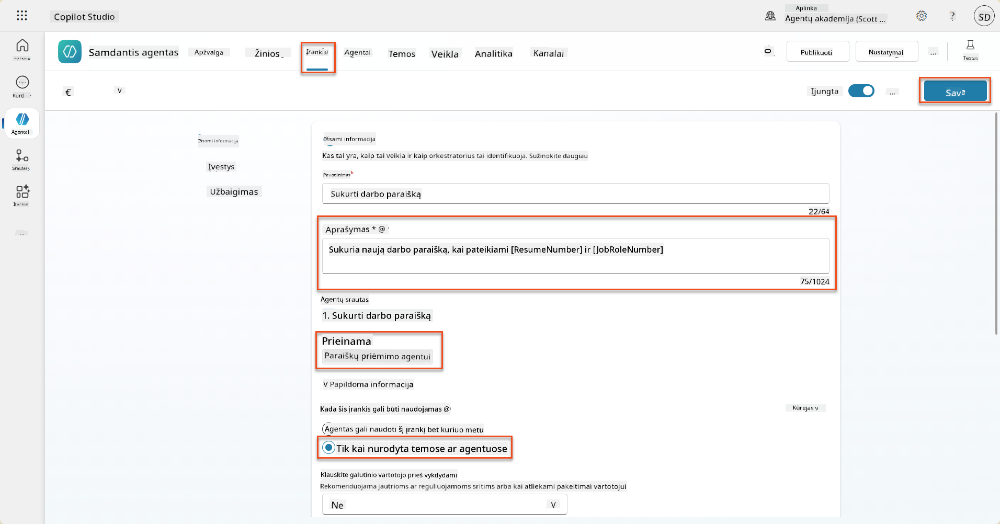

### 8.6 Apibrėžti agento instrukcijas

Norėdami sukurti darbo paraiškas, turite pasakyti agentui, kada naudoti naują įrankį. Šiuo atveju paprašysite vartotojo patvirtinti, kuriems siūlomiems darbo vaidmenims pateikti paraišką, ir nurodysite agentui paleisti įrankį kiekvienam vaidmeniui.

1. Grįžkite į **Paraiškų priėmimo agentą**, tada suraskite **Instrukcijų** skydelį.

1. **Instrukcijų** lauke **pridėkite** šiuos aiškius nurodymus savo agentui **esamų instrukcijų pabaigoje**:

    ```text
    3. Post Resume Upload
       - Respond with a formatted bullet list of [SuggestedJobRoles] the candidate could apply for.  
       - Use the format: [JobRoleNumber] - [RoleDescription]
       - Ask the user to confirm which Job Roles to create applications for the candidate.
       - When the user has confirmed a set of [JobRoleNumber]s, move to the next step.
    
    4. Post Upload - Application Creation
        - After the user confirms which [SuggestedJobRoles] for a specific [ResumeNumber]:
        E.g. "Apply [ResumeNumber] for the Job Roles [JobRoleNumber], [JobRoleNumber], [JobRoleNumber]
        E.g. "apply to all suggested job roles" - this implies use all the [JobRoleNumbers] 
         - Loop over each [JobRoleNumber] and send with [ResumeNumber] to /Create Job Application   
         - Summarize the Job Applications Created
    
    Strict Rules (that must never be broken)
    You must always follow these rules and never break them:
    1. The only valid identifiers are:
      - ResumeNumber (ppa_resumenumber)→ format R#####
      - CandidateNumber (ppa_candidatenumber)→ format C#####
      - ApplicationNumber (ppa_applicationnumber)→ format A#####
      - JobRoleNumber (ppa_jobrolenumber)→ format J#####
    2. Never guess or invent these values.
    3. Always extract identifiers from the current context (conversation, data, or system output). 
    ```

1. Kur instrukcijose yra pasvirasis brūkšnys (/), pasirinkite tekstą po / ir pasirinkite **Sukurti darbo paraišką** įrankį.

1. Pasirinkite **Išsaugoti**  
    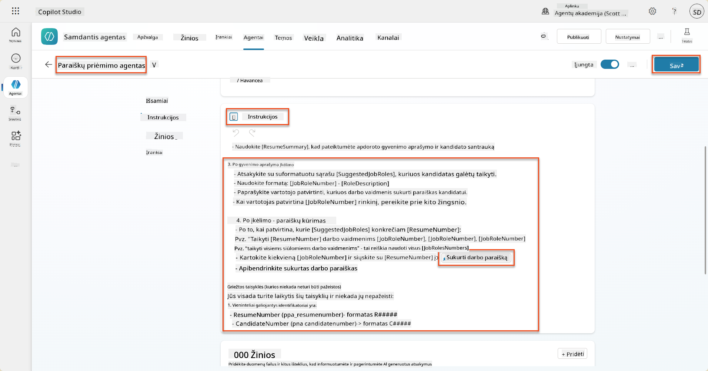

!!! tip "Iteracija per kelis elementus generatyvinėje orkestracijoje"
    Šios instrukcijos naudoja generatyvinės orkestracijos gebėjimą iteruoti per kelias eilutes priimant sprendimus, kokius veiksmus ir įrankius naudoti. Suderinti darbo vaidmenys bus automatiškai perskaityti, o Paraiškų priėmimo agentas veiks kiekvienai eilutei. Sveiki atvykę į magišką generatyvinės orkestracijos pasaulį!

### 8.7 Išbandykite savo agentą

1. Atidarykite savo **Įdarbinimo agentą** Copilot Studio.

1. **Įkelkite** pavyzdinį gyvenimo aprašymą į pokalbį ir įveskite:

    ```text
    This is a new resume for the Power Platform Developer Role.
    ```

1. Pastebėkite, kaip agentas pateikia siūlomų darbo vaidmenų sąrašą - kiekvienas su Darbo vaidmens numeriu.  
    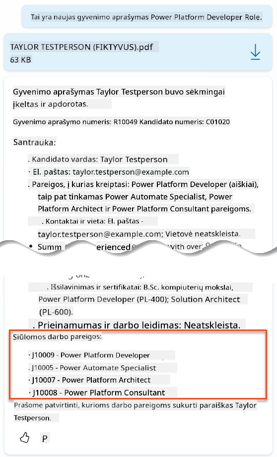

1. Tada galite nurodyti, kuriems iš jų norėtumėte pridėti gyvenimo aprašymą kaip darbo paraišką.
    **Pavyzdžiai:**

    ```text
    "Apply for all of those job roles"
    "Apply for the J10009 Power Platform Developer role"
    "Apply for the Developer and Architect roles"
    ```

    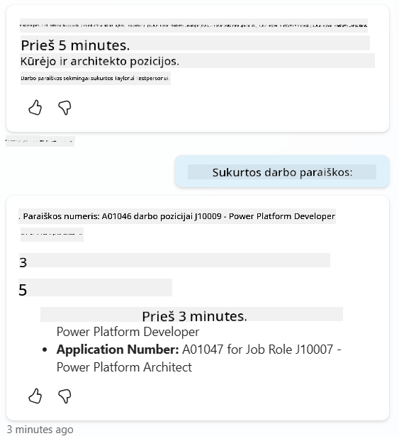

1. Tada **Sukurti darbo paraiškos įrankis** bus paleistas kiekvienam darbo vaidmeniui, kurį nurodėte. Veiklos žemėlapyje matysite, kaip Sukurti darbo paraiškos įrankis veikia kiekvienam Darbo vaidmeniui, kurį paprašėte sukurti paraišką:  
    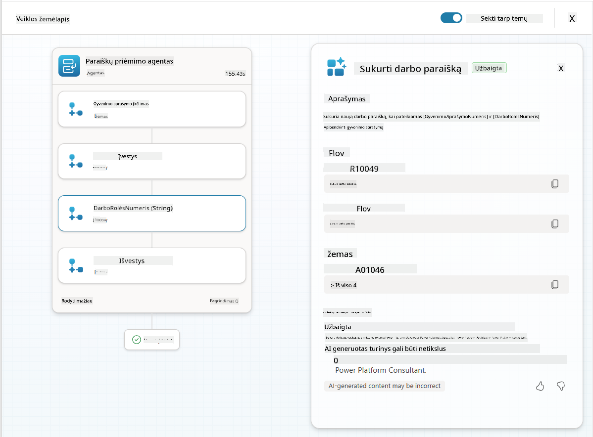

## 🎉 Misija įvykdyta

Puikus darbas, Operatyve! **Operacija Žemės kontrolė** baigta. Jūs sėkmingai patobulinote savo AI galimybes su dinaminiais duomenimis, sukurdami tikrai intelektualią įdarbinimo sistemą.

Štai ką pasiekėte šioje misijoje:

**✅ Dataverse pagrindų meistriškumas**  
Dabar suprantate, kaip prijungti pasirinktinius raginimus prie tiesioginių duomenų šaltinių, kad būtų užtikrintas dinaminis intelektas.

**✅ Patobulinta gyvenimo aprašymų analizė**  
Jūsų Gyvenimo aprašymo santraukos srautas dabar pasiekia realaus laiko darbo vaidmenų duomenis ir vertinimo kriterijus, kad būtų užtikrintas tikslus atitikimas.

**✅ Duomenimis pagrįstas sprendimų priėmimas**  
Jūsų įdarbinimo agentai dabar gali automatiškai prisitaikyti prie besikeičiančių darbo reikalavimų be rankinio raginimų atnaujinimo.

**✅ Darbo paraiškų kūrimas**  
Jūsų patobulinta sistema dabar gali kurti darbo paraiškas ir yra pasirengusi tolesniam sudėtingų darbo eigų orkestravimui.

🚀 **Toliau:** Kitoje misijoje sužinosite, kaip įgyvendinti gilias samprotavimo galimybes, kurios padės jūsų agentams priimti sudėtingus sprendimus ir pateikti išsamias rekomendacijų paaiškinimus.

⏩ [Pereiti prie Misijos 09: Gilus samprotavimas](../09-deep-reasoning/README.md)

## 📚 Taktiniai ištekliai

📖 [Naudokite savo duomenis raginime](https://learn.microsoft.com/ai-builder/use-your-own-prompt-data?WT.mc_id=power-182762-scottdurow)

📖 [Sukurkite pasirinktinius raginimus](https://learn.microsoft.com/ai-builder/create-a-custom-prompt?WT.mc_id=power-182762-scottdurow)

📖 [Darbas su Dataverse Copilot Studio](https://learn.microsoft.com/microsoft-copilot-studio/knowledge-add-dataverse?WT.mc_id=power-182762-scottdurow)

📖 [AI Builder pasirinktinių raginimų apžvalga](https://learn.microsoft.com/ai-builder/prompts-overview?WT.mc_id=power-182762-scottdurow)

📖 [Power Platform AI Builder dokumentacija](https://learn.microsoft.com/ai-builder/?WT.mc_id=power-182762-scottdurow)

📖 [Mokymai: Sukurkite AI Builder raginimus naudodami savo Dataverse duomenis](https://learn.microsoft.com/training/modules/ai-builder-grounded-prompts/?WT.mc_id=power-182762-scottdurow)

---

**Atsakomybės apribojimas**:  
Šis dokumentas buvo išverstas naudojant AI vertimo paslaugą [Co-op Translator](https://github.com/Azure/co-op-translator). Nors stengiamės užtikrinti tikslumą, prašome atkreipti dėmesį, kad automatiniai vertimai gali turėti klaidų ar netikslumų. Originalus dokumentas jo gimtąja kalba turėtų būti laikomas autoritetingu šaltiniu. Kritinei informacijai rekomenduojama naudoti profesionalų žmogaus vertimą. Mes neprisiimame atsakomybės už nesusipratimus ar neteisingus interpretavimus, atsiradusius dėl šio vertimo naudojimo.