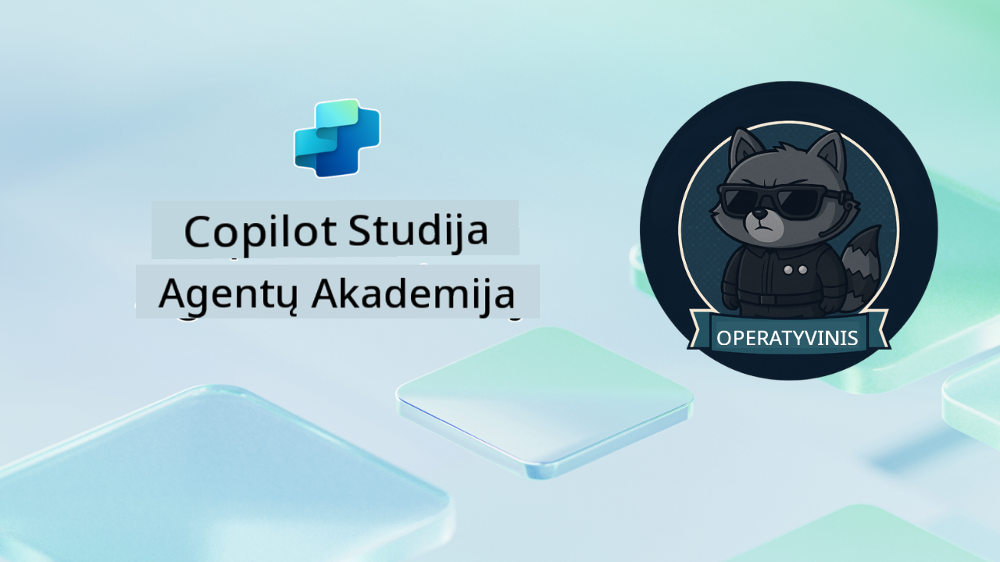

<!--
CO_OP_TRANSLATOR_METADATA:
{
  "original_hash": "24fcbe9a57d3439e05f8866e550c0a84",
  "translation_date": "2025-10-21T23:44:31+00:00",
  "source_file": "docs/operative-preview/README.md",
  "language_code": "lt"
}
-->
# Sveiki atvykę, Operatyve

**Sveiki atvykę, Operatyve.**  
Jūsų pažangi misija—jei nuspręsite ją priimti—yra įvaldyti **įmonės lygio daugiaveiksmių sistemų kūrimo meną** naudojant **Microsoft Copilot Studio**.

Šis intensyvus mokymas peržengs paprasto agentų kūrimo ribas ir nukels jus į sudėtingą **daugiaveiksmių sistemų koordinavimo** pasaulį: nuo automatizavimo iki AI saugumo, išmoksite kurti, koordinuoti ir diegti intelektualias agentų ekosistemas, remdamiesi realiomis įmonių scenarijomis.

--8<-- "disclaimer.md"

---

## 🎯 Misijos tikslas

Baigę Agentų Akademijos Operatyvo programą, galėsite:

- Kurti ir įgyvendinti **daugiaveiksmes sistemas** sudėtingiems verslo scenarijams
- Įvaldyti **agentų koordinavimo** ir bendradarbiavimo modelius
- Įgyvendinti **AI saugumą ir turinio moderavimą** gamybos sistemose
- Kurti **daugiarūšius raginimus** dokumentų apdorojimui ir analizei
- Diegti **įmonės lygio agentus** su tinkamu valdymu ir testavimu

---

## 🧪 Reikalavimai

Norint įvykdyti visas misijas, jums reikės:

- Baigto **Agentų Akademijos Rekruto** mokymo
- Microsoft Power Platform aplinkos su **Copilot Studio** licencija
- Prieigos prie **Microsoft Dataverse**
- Administracinių teisių kurti sprendimus ir agentus

---

## 🧬 Kam tai skirta

Šis pažangus kursas idealiai tinka:

- **Sprendimų architektams**, kuriantiems įmonės AI sistemas
- **Programuotojams**, kuriantiems gamybai paruoštus agentų sprendimus
- **IT specialistams**, įgyvendinantiems AI valdymą ir saugumą
- **Verslo analitikams**, kuriantiems sudėtingus automatizavimo procesus
- Visiems, pasiruošusiems **pakilti į aukštesnį lygį** nuo paprastų agentų iki įmonės sistemų

---

## 🧭 Mokymo programos apžvalga

Ši akademija yra struktūrizuota kaip progresyvi operacijų serija—kiekviena misija remiasi ankstesne, kad sukurtų išsamų automatizavimo sistemą.

| Misija | Pavadinimas | Operacijos aprašymas |
|--------|-------------|-----------------------|
| `01` | 🚨 [Pradėkite nuo Įdarbinimo agento](./01-get-started/README.md) | Diekite pagrindinę infrastruktūrą ir sukurkite savo centrinį koordinatorių agentą |
| `02` | 🎭 [Padarykite savo agentą daugiaveiksmiu su prijungtais agentais](./02-multi-agent/README.md) | Paverskite vieną agentą koordinuota daugiaveiksme sistema |
| `03` | ⚡ [Automatizuokite savo agentą su Trigeriais](./03-automate-triggers/README.md) | Įgyvendinkite autonominius agento veiksmus, pagrįstus įvykiais |
| `04` | 📝 [Agentų instrukcijų kūrimas](./04-agent-instructions/README.md) | Įvaldykite tikslią agentų komunikaciją ir elgesio kontrolę |
| `05` | 💬 [Agentų atsakymų personalizavimas](./05-agent-responses/README.md) | Pritaikykite agentų atsakymus maksimaliam poveikiui ir įsitraukimui |
| `06` | 🛡️ [Turinio moderavimo ir AI saugumo pagrindai](./06-ai-safety/README.md) | Įgyvendinkite įmonės lygio saugumo ir atitikties priemones |
| `07` | 🎨 [CV turinio ištraukimas su daugiarūšiais raginimais](./07-multimodal-prompts/README.md) | Apdorokite dokumentus ir vaizdus naudodami pažangias AI galimybes |
| `08` | 🗄️ [Raginimai - Dataverse pagrindimas](./08-dataverse-grounding/README.md) | Pagrįskite agentus įmonės duomenimis, kad gautumėte tikslius atsakymus |
| `09` | 🧠 [Gilus samprotavimas kandidatų tinkamumo vertinimui ir interviu pasiruošimui](./09-deep-reasoning/README.md) | Įgyvendinkite sudėtingą AI samprotavimą sudėtingiems sprendimams |
| `10` | 📄 [Kandidatui pritaikytų interviu dokumentų generavimas su raginimais](./10-generate-documents/README.md) | Kurkite dinamiškus dokumentus, pagrįstus agento analize |
| `11` | 📊 [Vartotojų atsiliepimų gavimas su adaptacinėmis kortelėmis](./11-obtain-user-feedback/README.md) | Rinkite ir apdorokite vartotojų atsiliepimus nuolatiniam tobulėjimui |
| `12` | 🌐 [Agentų publikavimas demonstraciniame tinklalapyje suinteresuotųjų šalių testavimui](./12-demo-website/README.md) | Diekite pilną sprendimą demonstracijai ir testavimui suinteresuotoms šalims |

!!! note
    ✅ Baigę šią mokymo programą, gausite **Operatyvo** ženklelį.  
    🔓 **Komandoro** lygis bus pasiekiamas ateityje.

<!-- markdownlint-disable-next-line MD033 -->

---

**Atsakomybės apribojimas**:  
Šis dokumentas buvo išverstas naudojant AI vertimo paslaugą [Co-op Translator](https://github.com/Azure/co-op-translator). Nors siekiame tikslumo, prašome atkreipti dėmesį, kad automatiniai vertimai gali turėti klaidų ar netikslumų. Originalus dokumentas jo gimtąja kalba turėtų būti laikomas autoritetingu šaltiniu. Dėl svarbios informacijos rekomenduojama profesionali žmogaus vertimo paslauga. Mes neprisiimame atsakomybės už nesusipratimus ar neteisingus interpretavimus, atsiradusius naudojant šį vertimą.