<!--
CO_OP_TRANSLATOR_METADATA:
{
  "original_hash": "d9cd8cd1a4fbd8915171a2ed972cc322",
  "translation_date": "2025-10-22T01:01:44+00:00",
  "source_file": "docs/recruit/00-course-setup/README.md",
  "language_code": "lt"
}
-->
# 🚨 Misija 00: Kurso paruošimas

## 🕵️‍♂️ SLAPTAŽODIS: `OPERACIJA PASIRUOŠIMAS DIEGIMUI`

> **⏱️ Operacijos trukmė:** `~30 minučių`  

## 🎯 Misijos aprašymas

Sveiki atvykę į pirmąją jūsų mokymo misiją kaip Copilot Studio agentas.  
Prieš pradėdami kurti savo pirmąjį AI agentą, turite įdiegti savo **darbo aplinką, paruoštą veikti lauke**.

Šiame aprašyme pateikiama informacija apie sistemas, prieigos duomenis ir nustatymo veiksmus, reikalingus sėkmingai veikti Microsoft 365 ekosistemoje.

## 🔎 Tikslai

Jūsų misija apima:

1. Microsoft 365 paskyros sukūrimą  
1. Prieigos prie Microsoft Copilot Studio gavimą  
1. (Pasirinktinai) Microsoft 365 Copilot licencijos įsigijimą, skirtą gamybos publikavimui  
1. Kūrėjo aplinkos sukūrimą kaip Copilot Studio aplinką darbui  
1. SharePoint svetainės sukūrimą, kuri vėliau bus naudojama kaip duomenų šaltinis

---

## 🔍 Reikalavimai

Prieš pradėdami, įsitikinkite, kad turite:

1. **Darbo arba mokyklos el. pašto adresą** (asmeniniai @outlook.com, @gmail.com ir pan. nėra palaikomi).
1. Prieigą prie interneto ir modernią naršyklę (rekomenduojama Edge, Chrome arba Firefox).  
1. Pagrindines žinias apie Microsoft 365 (pvz., prisijungimą prie Office programų ar Teams).  
1. (Pasirinktinai) Kredito kortelę arba mokėjimo metodą, jei planuojate įsigyti mokamas licencijas.

---

## 1 žingsnis: Gaukite Microsoft 365 paskyrą

Copilot Studio yra Microsoft 365 dalis, todėl jums reikės Microsoft 365 paskyros, kad galėtumėte ją pasiekti. Galite naudoti esamą paskyrą, jei ją turite, arba atlikti šiuos veiksmus, kad gautumėte tinkamą licenciją:

1. **Įsigykite mokamą Microsoft 365 verslo prenumeratą**  
   1. Eikite į [Microsoft 365 verslo planų ir kainų puslapį](https://www.microsoft.com/microsoft-365/business/microsoft-365-plans-and-pricing)
   1. Pigiausias variantas pradėti yra Microsoft 365 Business Basic planas. Pasirinkite `Išbandyti nemokamai` ir užpildykite vedlio formą, kad užregistruotumėte prenumeratą, paskyros duomenis ir mokėjimo informaciją.
   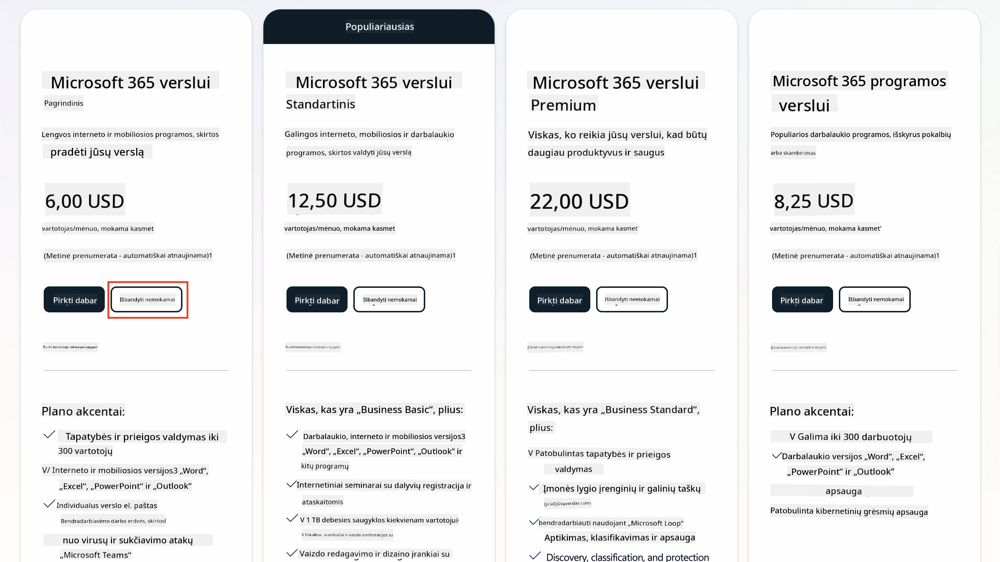
   1. Kai turėsite naują paskyrą, prisijunkite.

    !!! Patarimas
        Jei planuojate publikuoti agentus Microsoft 365 Copilot Chat arba jungtis prie organizacijos duomenų (SharePoint, OneDrive, Dataverse), jums reikės Microsoft 365 Copilot licencijos. Tai yra papildoma licencija, apie kurią galite sužinoti daugiau [licencijavimo svetainėje](https://www.microsoft.com/microsoft-365/copilot#plans)

---

## 2 žingsnis: Pradėkite Copilot Studio bandomąjį laikotarpį

Kai turėsite savo Microsoft 365 tenantą, jums reikės gauti prieigą prie Copilot Studio. Galite gauti nemokamą 30 dienų bandomąjį laikotarpį, atlikdami šiuos veiksmus:

1. Eikite į [aka.ms/TryCopilotStudio](https://aka.ms/TryCopilotStudio).  
1. Įveskite el. pašto adresą iš naujos paskyros, kurią sukūrėte ankstesniame žingsnyje, ir pasirinkite `Toliau`.  

1. Sistema turėtų atpažinti jūsų paskyrą. Pasirinkite `Prisijungti`.
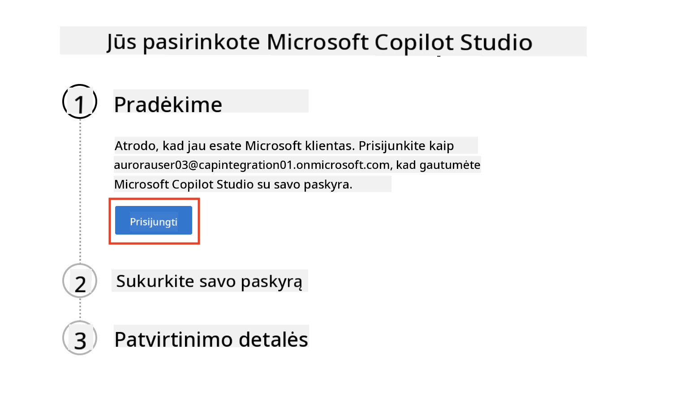  
1. Pasirinkite `Pradėti nemokamą bandomąjį laikotarpį`.
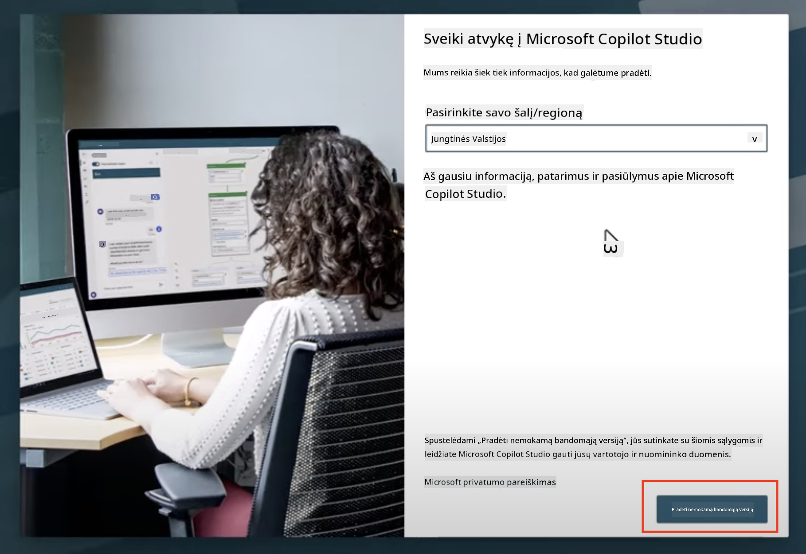

!!! info "Bandomojo laikotarpio pastabos"  
     1. Nemokamas bandomasis laikotarpis suteikia **visas Copilot Studio galimybes**.
     1. Jūs gausite el. laiškus apie bandomojo laikotarpio pabaigą. Galite pratęsti bandomąjį laikotarpį 30 dienų intervalais (iki 90 dienų agento veikimo).  
     1. Jei jūsų tenant administratorius išjungė savarankišką registraciją, pamatysite klaidą—kreipkitės į savo Microsoft 365 administratorių, kad jis ją vėl įjungtų.

---

## 3 žingsnis: Sukurkite naują kūrėjo aplinką

### Užsiregistruokite Power Apps kūrėjo plane

Naudodami tą patį Microsoft 365 tenantą iš 1 žingsnio, užsiregistruokite Power Apps kūrėjo plane, kad sukurtumėte nemokamą kūrimo aplinką darbui ir testavimui su Copilot Studio.

1. Užsiregistruokite [Power Apps kūrėjo plano svetainėje](https://aka.ms/PowerAppsDevPlan).

    - Įveskite savo el. pašto adresą
    - Pažymėkite varnelę
    - Pasirinkite **Pradėti nemokamai**

    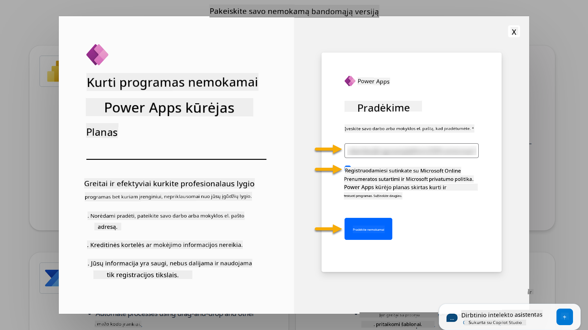

1. Po registracijos būsite nukreipti į [Power Apps](https://make.powerapps.com/). Aplinka naudos jūsų vardą, pvz., **Adele Vance aplinka**. Jei jau yra aplinka su tokiu pavadinimu, nauja kūrėjo aplinka bus pavadinta **Adele Vance (1) aplinka**.

    Naudokite šią kūrėjo aplinką Copilot Studio, kai atliksite laboratorijas.

!!! Pastaba
    Jei naudojate esamą Microsoft 365 paskyrą ir nesukūrėte naujos 1 žingsnyje, pvz., naudojate savo paskyrą darbo organizacijoje, jūsų IT administratorius (arba atitinkama komanda), valdanti jūsų tenantą/aplinkas, galėjo išjungti registracijos procesą. Tokiu atveju kreipkitės į savo administratorių arba sukurkite testinį tenantą pagal 1 žingsnį.

---

## 4 žingsnis: Sukurkite naują SharePoint svetainę

Reikia sukurti naują SharePoint svetainę, kuri bus naudojama [Pamokoje 06 - Sukurkite pasirinktą agentą naudodami pokalbių kūrimo patirtį su Copilot ir pagrindžiant jį jūsų duomenimis](../06-create-agent-from-conversation/README.md#62-add-an-internal-knowledge-source-using-a-sharepoint-site).

1. Pasirinkite vaflio piktogramą viršutiniame kairiajame Microsoft Copilot Studio kampe, kad pamatytumėte meniu. Pasirinkite SharePoint iš meniu.

    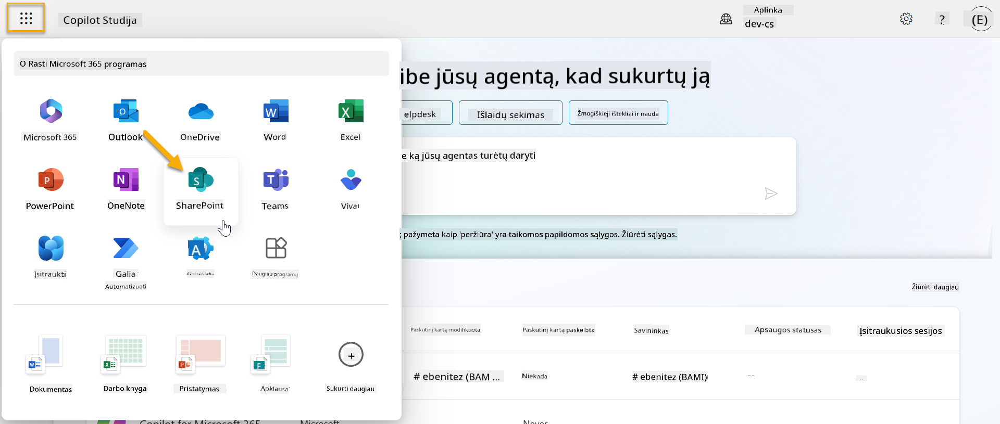

1. Atsidarys SharePoint. Pasirinkite **+ Sukurti svetainę**, kad sukurtumėte naują SharePoint svetainę.

    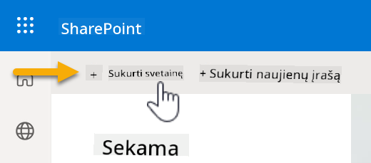

1. Atsiras dialogo langas, kuris padės sukurti naują SharePoint svetainę. Pasirinkite **Komandos svetainė**.

    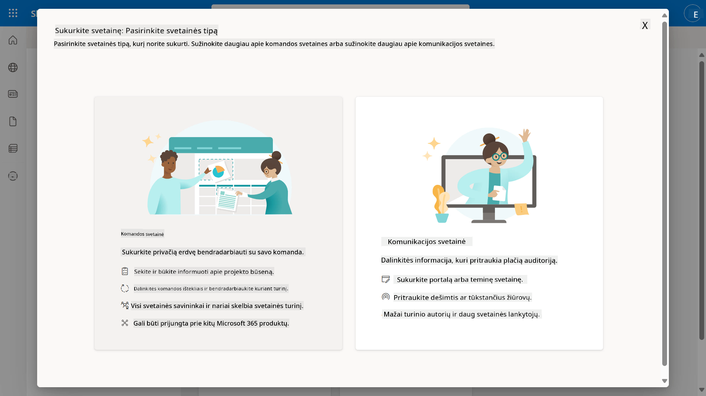

1. Kitame žingsnyje pagal numatytuosius nustatymus bus įkeltas Microsoft šablonų sąrašas. Slinkite žemyn ir pasirinkite **IT pagalbos tarnybos** šabloną.

    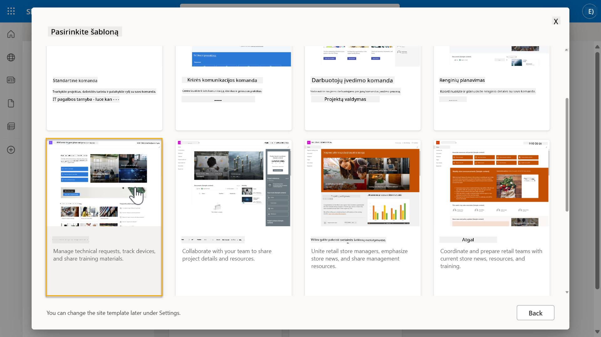

1. Pasirinkite **Naudoti šabloną**, kad sukurtumėte naują SharePoint svetainę, naudodami IT pagalbos tarnybos šabloną.

    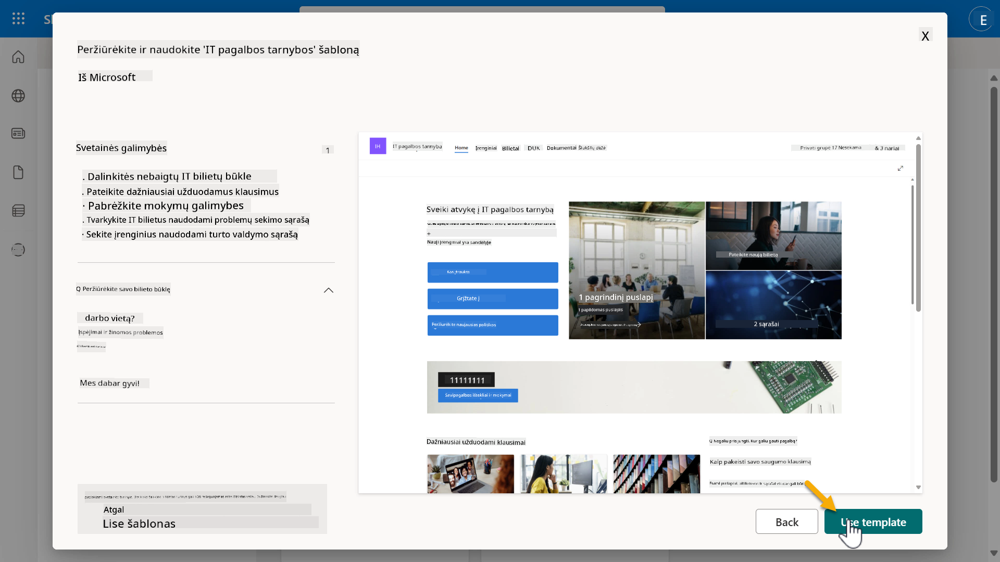

1. Įveskite informaciją apie savo svetainę. Pavyzdys:

    | Laukas | Vertė |
    | --- | --- |
    | Svetainės pavadinimas | Contoso IT |
    | Svetainės aprašymas | Copilot Studio pradedantiesiems |
    | Svetainės adresas | ContosoIT |

    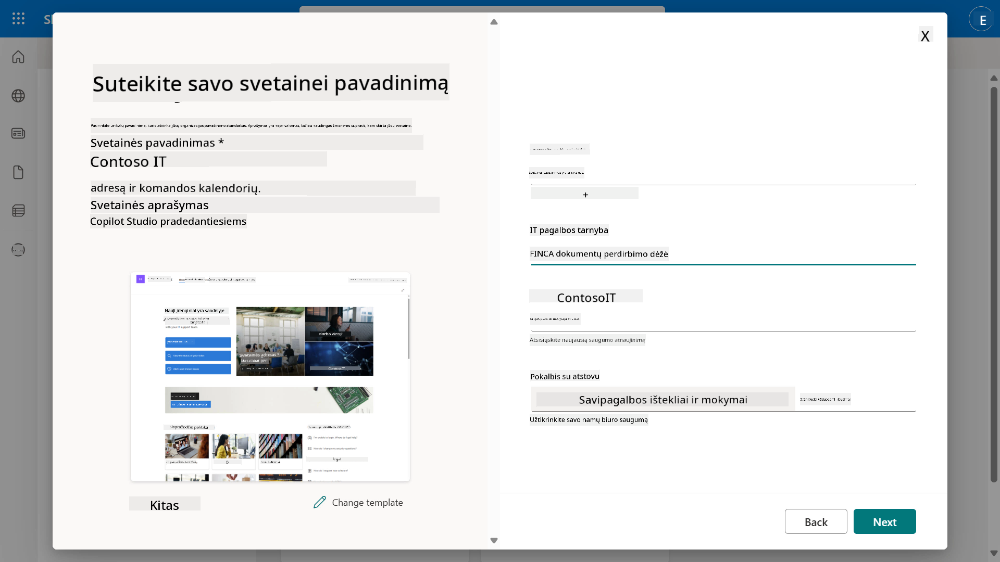

1. Paskutiniame žingsnyje galima pasirinkti kalbą SharePoint svetainei. Pagal numatytuosius nustatymus tai bus **anglų**. Palikite kalbą kaip **anglų** ir pasirinkite **Sukurti svetainę**.

    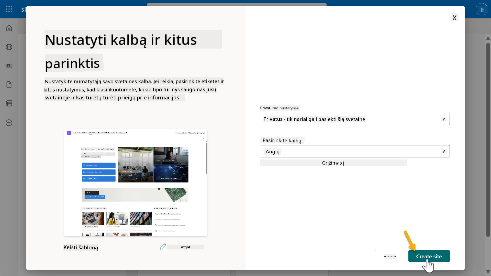

1. SharePoint svetainė bus kuriama kelias sekundes. Tuo tarpu galite pridėti kitus vartotojus į savo svetainę, įvesdami jų el. pašto adresą laukelyje **Pridėti narius**. Kai baigsite, pasirinkite **Baigti**.

    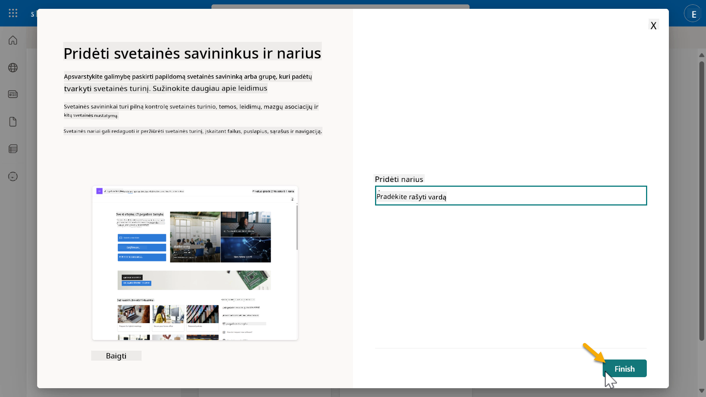

1. Tada bus įkeliamas SharePoint svetainės pagrindinis puslapis. **Nukopijuokite** SharePoint svetainės URL.

1. Šis šablonas pateikia puslapius su pavyzdiniais duomenimis apie įvairias IT politikos ir dvi pavyzdines sąrašus (Bilietai ir Įrenginiai).

### Naudokite Įrenginių SharePoint sąrašą

Mes naudosime **Įrenginių** sąrašą [Misijoje 07 - Pridėti naują temą su trigeriu ir mazgais](../07-add-new-topic-with-trigger/README.md#73-add-a-tool-using-a-connector).

### Pridėkite naują stulpelį

Slinkite į sąrašo dešinę pusę ir pasirinkite **+ Pridėti stulpelį** mygtuką. Pasirinkite **hiperlinko** tipą, įveskite **Vaizdas** kaip stulpelio pavadinimą ir pasirinkite pridėti.

### Sukurkite pavyzdinius duomenis Įrenginių SharePoint sąraše

Turite užpildyti šį sąrašą bent 4 pavyzdiniais duomenų elementais ir pridėti vieną papildomą stulpelį į šį sąrašą.  

Pridedant pavyzdinius duomenis, įsitikinkite, kad šie laukai yra užpildyti:

- Įrenginio nuotrauka - naudokite vaizdus iš [įrenginių vaizdų aplanko](https://github.com/microsoft/agent-academy/tree/main/docs/recruit/00-course-setup/images/device-images)
- Pavadinimas
- Būsena
- Gamintojas
- Modelis
- Turto tipas
- Spalva
- Serijos numeris
- Pirkimo data
- Pirkimo kaina,
- Užsakymo #
- Vaizdas - naudokite šias nuorodas

|Įrenginys  |URL  |
|---------|---------|
|Surface Laptop 13     | [https://raw.githubusercontent.com/microsoft/agent-academy/refs/heads/main/docs/recruit/00-course-setup/images/device-images/Surface-Laptop-13.png](https://raw.githubusercontent.com/microsoft/agent-academy/refs/heads/main/docs/recruit/00-course-setup/images/device-images/Surface-Laptop-13.png)        |
|Surface Laptop 15     | [https://raw.githubusercontent.com/microsoft/agent-academy/refs/heads/main/docs/recruit/00-course-setup/images/device-images/Surface-Laptop-15.png](https://raw.githubusercontent.com/microsoft/agent-academy/refs/heads/main/docs/recruit/00-course-setup/images/device-images/Surface-Laptop-15.png)        |
|Surface Pro    | [https://raw.githubusercontent.com/microsoft/agent-academy/refs/heads/main/docs/recruit/00-course-setup/images/device-images/Surface-Pro-12.png](https://raw.githubusercontent.com/microsoft/agent-academy/refs/heads/main/docs/recruit/00-course-setup/images/device-images/Surface-Pro-12.png)        |
|Surface Studio    | [https://raw.githubusercontent.com/microsoft/agent-academy/refs/heads/main/docs/recruit/00-course-setup/images/device-images/Surface-Studio.png](https://raw.githubusercontent.com/microsoft/agent-academy/refs/heads/main/docs/recruit/00-course-setup/images/device-images/Surface-Studio.png)        |

---

## ✅ Misija įvykdyta

Jūs sėkmingai:

- Sukūrėte Microsoft 365 kūrimo aplinką  
- Aktyvavote Copilot Studio bandomąjį laikotarpį  
- Sukūrėte SharePoint svetainę agentų pagrindimui  
- Užpildėte Įrenginių sąrašą, kuris bus naudojamas būsimose misijose

Jūs oficialiai pasiruošę pradėti savo **Agentų mokymo pradedančiųjų lygį** [Pamokoje 01](../01-introduction-to-agents/README.md).  

<!-- markdownlint-disable-next-line MD033 -->

---

**Atsakomybės apribojimas**:  
Šis dokumentas buvo išverstas naudojant AI vertimo paslaugą [Co-op Translator](https://github.com/Azure/co-op-translator). Nors siekiame tikslumo, prašome atkreipti dėmesį, kad automatiniai vertimai gali turėti klaidų ar netikslumų. Originalus dokumentas jo gimtąja kalba turėtų būti laikomas autoritetingu šaltiniu. Dėl svarbios informacijos rekomenduojama profesionali žmogaus vertimo paslauga. Mes neprisiimame atsakomybės už nesusipratimus ar neteisingus aiškinimus, atsiradusius naudojant šį vertimą.