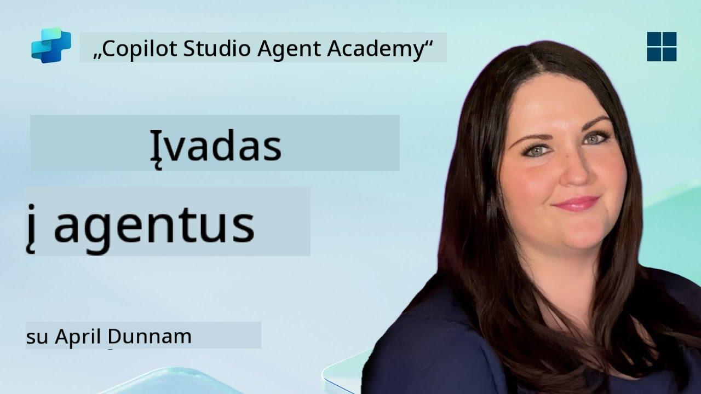

<!--
CO_OP_TRANSLATOR_METADATA:
{
  "original_hash": "d6706e107678264168d77b2e107710b1",
  "translation_date": "2025-10-22T00:32:25+00:00",
  "source_file": "docs/recruit/01-introduction-to-agents/README.md",
  "language_code": "lt"
}
-->
# 🚨 Misija 01: Įvadas į agentus

## 🕵️‍♂️ SLAPTAŽODIS: `OPERACIJA AI AGENTO DEKODAVIMAS`

> **⏱️ Operacijos laiko langas:** `~30 minučių – tik informacija, be praktinių užduočių`

🎥 **Žiūrėkite vaizdo įrašą**

## 🎯 Misijos aprašymas

Sveiki atvykę, naujokai. Prieš pradedant kurti agentus, jums reikia gerai suprasti AI koncepcijas, kurios juos valdo. Ši misija suteiks jums pagrindines žinias apie pokalbių AI, didelius kalbos modelius (LLM), informacijos paieška ir generavimą (RAG) bei agentų tipus, kuriuos galite sukurti Copilot Studio.

## 🔎 Tikslai

Šios misijos metu sužinosite:

1. Kas yra pokalbių AI ir kodėl jis svarbus  
1. Kaip dideli kalbos modeliai (LLM) valdo pokalbių patirtį  
1. Ką informacijos paieška ir generavimas (RAG) prideda prie proceso  
1. Skirtumą tarp pokalbių agentų ir autonominių agentų  
1. Kaip agentai Copilot Studio naudoja šias koncepcijas  

Pradėkime!

---

## Kas yra pokalbių AI?

Pokalbių AI reiškia bet kokią sistemą, kuri gali suprasti, apdoroti ir atsakyti į žmogaus kalbą – tiek tekstą, tiek garsą – natūraliu būdu. Pagalvokite apie pokalbių robotus pagalbos tarnybose ar virtualius asmeninius asistentus jūsų mėgstamose programose. Dauguma šiuolaikinių pokalbių AI remiasi dideliais kalbos modeliais (LLM), apie kuriuos kalbėsime toliau.

### Kodėl tai svarbu

- **Vartotojo patirtis:** Pokalbių sąsajos dažnai yra intuityvesnės nei naršymas per meniu.  
- **Mastelio keitimas:** Vienas agentas gali tvarkyti dešimtis ar šimtus pokalbių vienu metu.  
- **Efektyvumas:** Vietoj individualių scenarijų kūrimo, LLM valdomi agentai prisitaiko prie vartotojo įvesties.  
- **Išplėstumas:** Tinkamai suprojektuoti agentai gali pasiekti žinių bazes, prisijungti prie API ar veikti kaip „skaitmeniniai kolegos“ verslo procesuose.

---

## Dideli kalbos modeliai (LLM) 101

Daugumos pokalbių AI sistemų pagrindas yra **dideli kalbos modeliai** – neuroniniai tinklai, apmokyti naudojant didžiulius tekstų rinkinius. Jie išmoksta kalbos statistinius modelius, kad galėtų generuoti nuoseklius sakinius, atsakyti į klausimus ar net kurti idėjas. Pagrindiniai dalykai, kuriuos reikia suprasti:

1. **Mokymo duomenys:** LLM apdoroja terabaitus tekstų (interneto puslapių, knygų, straipsnių). Šios „pasaulio žinios“ leidžia jiems atsakyti į daugelį temų.  
1. **Tokenizacija:** Tekstas suskaidomas į mažesnius vienetus, vadinamus tokenais (žodžius, subžodžius ar simbolius). Modelis prognozuoja vieną tokeną vienu metu.  
1. **Konteksto langas:** Kiekvienas LLM turi ribą, kiek tokenų jis gali „matyti“ vienu metu. Viršijus šią ribą, ankstesni tokenai yra pašalinami.  
1. **Užklausos formulavimas:** Jūs bendraujate su LLM siųsdami jam užklausą. Kuo geriau suformuluota užklausa, tuo tikslesnis ir aktualesnis atsakymas.  
1. **Zero-shot vs. Fine-tuning:** Zero-shot reiškia LLM naudojimą tokį, koks jis yra (tik žali svoriai). Fine-tuning reiškia modelio pritaikymą specifiniams duomenims, kad jis atsakytų tiksliau pagal jūsų poreikius.

!!! Tip "Profesionalo patarimas"
    Dažnai LLM lyginamas su „super protingu automatinio užbaigimo įrankiu“. Jis iš tikrųjų nesupranta prasmės kaip žmogaus smegenys, tačiau yra labai geras prognozuojant kitą geriausią žodį (ar frazę) sekoje.

---

## Informacijos paieška ir generavimas (RAG)

Kai LLM remiasi tik statiniais mokymo duomenimis, jie gali suklysti arba tapti pasenę. RAG sprendžia šią problemą, leisdamas modeliui „ieškoti“ naujos informacijos prieš sudarant atsakymą. Aukštu lygiu RAG veikia taip:

1. **Vartotojo užklausa:** Vartotojas užduoda klausimą (pvz., „Kokia naujausia informacija apie Contoso ketvirčio pajamas?“).  
1. **Paieškos žingsnis:** Sistema ieško žinių šaltinio (dokumentų, vidinių duomenų bazių, SharePoint bibliotekų ir pan.), kad rastų aktualias ištraukas.  
1. **Papildymas:** Rasti tekstai pridedami prie LLM užklausos arba įtraukiami prieš ją.  
1. **Generavimas:** LLM apdoroja tiek vartotojo klausimą, tiek rastą kontekstą ir generuoja atsakymą, pagrįstą naujausia informacija.  

Naudojant RAG, jūsų agentas gali pasiekti vidines įmonės wikis, API įskiepius ar ieškoti FAQ žinių bazėje – ir pateikti atsakymus, kurie nėra apriboti statiniais modelio parametrais.

---

## Pokalbių vs. autonominiai agentai

Copilot Studio kontekste terminas **agentas** gali reikšti įvairius AI asistentų tipus. Svarbu atskirti:

**Pokalbių agentai:**

- Pagrindinis dėmesys skiriamas dvipusiam dialogui.  
- Išlaiko kontekstą per kelis pokalbio etapus.  
- Paprastai valdomi per iš anksto nustatytus scenarijus ar trigerius (pvz., „Jei vartotojas sako X, atsakyk Y“).  
- Idealiai tinka klientų aptarnavimui, FAQ, vadovaujamoms sąveikoms, planavimui ar paprastiems klausimams ir atsakymams.  
  - Pavyzdžiai:  
    - Teams pokalbių robotas, atsakantis į HR politikos klausimus.  
    - Power Virtual Agents robotas SharePoint puslapyje, padedantis vartotojams užpildyti formą.  

**Autonominiai agentai:**

- Veikia ne tik kaip pokalbių partneriai; jie gali **veikti** vartotojo vardu.  
- Naudoja LLM logikos ciklus (pvz., „planuoti → veikti → stebėti → perplanuoti“) užduotims atlikti.  
- Prisijungia prie išorinių įrankių ar API (pvz., paleidžia Power Automate srautą, siunčia kalendoriaus kvietimus, manipuliuoja duomenimis Dataverse).  
- Veikia be nuolatinės žmogaus įvesties – kartą aktyvuoti, jie gali savarankiškai atlikti daugiapakopius procesus.  
  - Pavyzdžiai:  
    - Agentas, kuris sudaro kelionės maršrutą, užsako skrydžius ir siunčia patvirtinimus el. paštu.  
    - „Susitikimo santraukos“ agentas, kuris prisijungia prie Teams skambučio, realiu laiku transkribuoja ir rašo vykdomąją santrauką į OneNote.  

!!! Info "Pagrindinis skirtumas"
    Pokalbių agentai laukia vartotojo įvesties ir apsiriboja dialogu. Autonominiai agentai aktyviai planuoja ir vykdo veiksmus, naudodami platesnę įrankių prieigą.

---

## Agentai Copilot Studio

**Copilot Studio** sujungia tiek pokalbių, tiek autonominius scenarijus į vieną sistemą. Štai kaip Copilot Studio padeda kurti agentus:

1. **Vizualinis agentų dizaineris:** Mažo kodo drobė, skirta apibrėžti užklausas, atmintį ir įrankius tiek pokalbių, tiek veiksmų darbo eigoms.  
1. **LLM konfigūracijos:** Pasirinkite iš įvairių OpenAI modelių arba Microsoft verslo klasės GPT, kad atitiktumėte našumo ir kainos poreikius.  
1. **Paieškos jungtys:** Iš anksto paruoštos integracijos su SharePoint, OneDrive, Azure Cognitive Search ir Dataverse, leidžiančios naudoti RAG iš karto.  
1. **Individualūs įrankiai ir funkcijos:** Apibrėžkite individualius HTTP veiksmus ar Power Automate srautus, kuriuos jūsų agentas gali savarankiškai vykdyti.  
1. **Daugiarūšė parama:** Be teksto, Copilot Studio agentai gali apdoroti vaizdus, failus ar struktūrizuotus duomenis, kad praturtintų kontekstą.  
1. **Publikavimas ir platinimas:** Kai jūsų agentas bus paruoštas, galite jį publikuoti Microsoft 365 Copilot (kad vartotojai galėtų jį naudoti Teams, SharePoint, Outlook ir kt.) arba įdiegti kaip atskirą pokalbių valdiklį tinklalapyje.

---

## 🎉 Misija baigta

Dabar baigėte įvadą į agentus ir pagrindines AI koncepcijas. Jūs suprantate:

1. **LLM = Jūsų agento „smegenys“**  
   - Atsakingos už kalbos supratimą ir generavimą.  
   - Daugiau tokenų = turtingesnis kontekstas, bet ir didesnė kaina už užklausą.  

1. **RAG = Realaus laiko žinių integracija**  
   - Užpildo spragą tarp statinio LLM ir nuolat besikeičiančių duomenų šaltinių.  
   - Ieško ir įtraukia aktualius dokumentus ar įrašus į LLM užklausą.  

1. **Pokalbių vs. autonominiai**  
   - **Pokalbių:** Dėmesys dialogo eigai ir konteksto išlaikymui (pvz., „sesijos atmintis“).  
   - **Autonominiai:** Prideda „veiksmų blokus“, leidžiančius agentui prisijungti prie išorinių įrankių ar paslaugų.

---
Toliau tyrinėsite [Copilot Studio pagrindus](../02-copilot-studio-fundamentals/README.md)!

Išlikite budrūs, naujokai – jūsų AI kelionė tik prasideda!

## 📚 Taktiniai ištekliai

🔗 [Copilot Studio dokumentacijos pradžia](https://learn.microsoft.com/microsoft-copilot-studio/)

---

---

**Atsakomybės apribojimas**:  
Šis dokumentas buvo išverstas naudojant AI vertimo paslaugą [Co-op Translator](https://github.com/Azure/co-op-translator). Nors siekiame tikslumo, prašome atkreipti dėmesį, kad automatiniai vertimai gali turėti klaidų ar netikslumų. Originalus dokumentas jo gimtąja kalba turėtų būti laikomas autoritetingu šaltiniu. Kritinei informacijai rekomenduojama profesionali žmogaus vertimo paslauga. Mes neprisiimame atsakomybės už nesusipratimus ar neteisingus aiškinimus, atsiradusius dėl šio vertimo naudojimo.