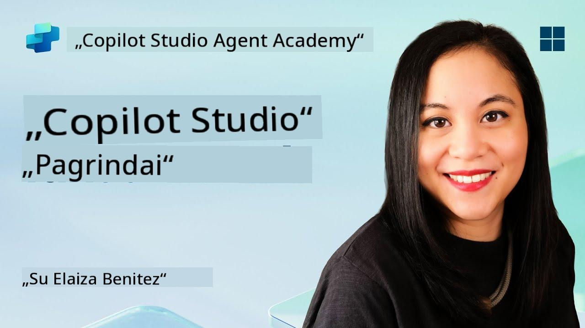
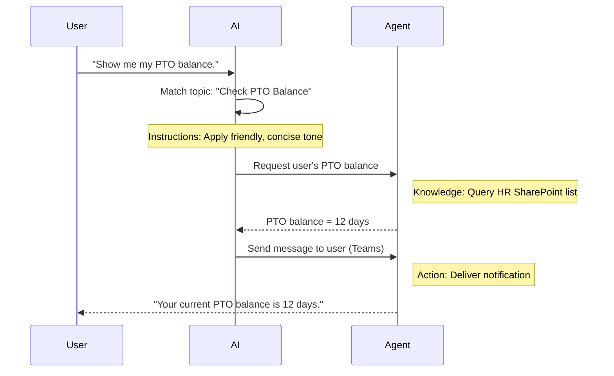

<!--
CO_OP_TRANSLATOR_METADATA:
{
  "original_hash": "90a3c5122f5687bbc8cc819990f175d4",
  "translation_date": "2025-10-22T00:53:23+00:00",
  "source_file": "docs/recruit/02-copilot-studio-fundamentals/README.md",
  "language_code": "lt"
}
-->
# 🚨 Misija 02: Copilot Studio Pagrindai

## 🕵️‍♂️ SLAPTAŽODIS: `OPERACIJA PAGRINDINIS PROTOKOLAS`

> **⏱️ Operacijos trukmė:** `~30 minučių – tik informacija, be praktinių užduočių`  

🎥 **Žiūrėkite Vaizdo Įrašą**

[](https://www.youtube.com/watch?v=x4OCwDRGeLE "Žiūrėkite vaizdo įrašą YouTube")

## 🎯 Misijos Aprašymas

Sveiki, naujokai. Ši misija suteiks jums pagrindinę informaciją apie tai, kaip veikia Copilot Studio ir kaip kurti intelektualius agentus, kurie teikia realią verslo vertę.

Prieš kuriant savo pirmąjį agentą, turite suprasti keturis pagrindinius komponentus, sudarančius kiekvieną pritaikytą AI agentą: Žinios, Įrankiai, Temos ir Instrukcijos. Taip pat sužinosite, kaip šie elementai veikia kartu Copilot Studio orkestratoriuje.

## 🔎 Tikslai

Šios misijos metu jūs:

- **Sužinosite, kas yra Copilot Studio**
- **Sužinosite, kada ir kodėl naudoti agentus**
- **Išnagrinėsite keturis agentų kūrimo blokus**
      - **Žinios**
      - **Įrankiai**
      - **Temos**
      - **Instrukcijos**
- **Suprasite, kaip šie komponentai veikia kartu**, kad sukurtų intelektualų, automatizuotą agentą

---

## Kas yra agentai Copilot Studio?

**Agentas** yra specializuotas AI asistentas, kurį sukuriate tam, kad jis atliktų konkrečias užduotis ar atsakytų į užklausas. Skirtingai nuo bendro pobūdžio pokalbių roboto, jūsų agentas:

- **Žino įmonės specifinius duomenis** (politikas, dokumentus, duomenų bazes)  
- **Atlieka realaus pasaulio užduotis** (siunčia žinutes, kuria kalendoriaus įvykius, atnaujina įrašus)  
- **Išlaiko pokalbio kontekstą**, kad galėtų tęsti ankstesnius klausimus  

Kadangi Copilot Studio yra mažo kodo platforma, galite vilkti ir mesti iš anksto sukurtus komponentus – nereikia gilių programavimo įgūdžių. Kai jūsų agentas bus sukurtas, žmonės galės jį naudoti Teams, Slack ar net pritaikytame tinklalapyje, kad gautų atsakymus ar automatiškai paleistų darbo eigas.

---

## Kada ir kodėl naudoti Copilot Studio

Nors Microsoft 365 Copilot teikia bendrą AI pagalbą Office programose, jums reikės pritaikyto agento, kai:

### Jums reikia specifinių žinių apie sritį

- Standartinis Copilot gali nežinoti jūsų įmonės vidinių procedūrų ar duomenų. Agentas gali užklausti jūsų SharePoint svetaines, duomenų bazes ar pritaikytus šaltinius, kad pateiktų tikslius, naujausius atsakymus.  

### Norite automatizuoti daugiapakopes darbo eigas

- Pavyzdžiui: "Kai kas nors pateikia išlaidų ataskaitą, nusiųskite ją patvirtinimui, atnaujinkite finansų sekimo sistemą ir praneškite vadovui." Pritaikytas agentas gali atlikti kiekvieną žingsnį, kurį suaktyvina viena komanda ar įvykis.  

### Jums reikia kontekstinės patirties įrankyje  

- Įsivaizduokite naujų darbuotojų įdarbinimo agentą Teams, kuris vadovauja HR darbuotojams per kiekvieną politiką, siunčia reikalingas formas ir planuoja orientacijos susitikimus – tiesiai jūsų esamoje bendradarbiavimo platformoje.  

---

## Keturi agento kūrimo blokai

Kiekvienas Copilot Studio agentas yra sudarytas iš keturių pagrindinių komponentų:

1. **Žinios**  
1. **Įrankiai (Veiksmai)**  
1. **Temos**  
1. **Instrukcijos**

Žemiau apibrėšime kiekvieną bloką ir parodysime, kaip jie veikia kartu, kad sukurtų efektyvų agentą.

### 1. Žinios

**Žinios** yra duomenys ir kontekstas, kuriais remiasi jūsų agentas, kad pateiktų tikslius atsakymus. Jos turi dvi dalis:

#### Pritaikytos Instrukcijos ir Kontekstas

- Jūs parašote trumpą agento paskirties ir tono aprašymą. Pavyzdžiui:  

    ```text
    You are an IT support agent. You help employees troubleshoot common software issues, provide troubleshooting steps, and escalate urgent tickets.
    ```

- Pokalbio metu agentas prisimena ankstesnius posūkius, kad galėtų remtis tuo, kas jau buvo aptarta (pavyzdžiui, jei vartotojas pirmiausia sako: "Mano spausdintuvas neveikia," o vėliau klausia: "Ar patikrinote rašalo lygį?" agentas prisimena spausdintuvo kontekstą).

#### Žinių Šaltiniai (Pagrindiniai Duomenys)

- Jūs prijungiate savo agentą prie kelių duomenų šaltinių – SharePoint bibliotekų, dokumentacijos svetainių, wiki ar kitų duomenų bazių.  
- Kai vartotojas užduoda klausimą, agentas ištraukia atitinkamus fragmentus iš tų šaltinių, kad atsakymai būtų **pagrįsti** jūsų organizacijos faktinėmis politikomis, produktų vadovais ar bet kokia nuosavybine informacija.  
- Galite net priversti agentą atsakyti tik remiantis tais šaltiniais, užkertant kelią spėlionėms ar "halucinacijoms".

!!! example
    "Politikos Asistentas" agentas galėtų prisijungti prie jūsų HR SharePoint svetainės. Jei vartotojas klausia: "Koks yra mūsų PTO kaupimo tarifas?" agentas ištraukia tikslų tekstą iš HR politikos dokumento, o ne remiasi bendru AI atsakymu.

---

### 2. Įrankiai (Veiksmai)

**Įrankiai (Veiksmai)** apibrėžia, ką agentas gali padaryti be pokalbio. Kiekvienas veiksmas yra užduotis, kurią agentas vykdo programiškai, pavyzdžiui:

- Siųsti el. laišką ar Teams žinutę  
- Kurti ar atnaujinti kalendoriaus įvykį  
- Pridėti ar redaguoti įrašą duomenų bazėje (pvz., SharePoint sąraše ar Dataverse lentelėje)  
- Paleisti Power Automate srautą ar REST API  

#### Kaip Veiksmai Veikia

- **Apibrėžti Įvestis ir Išvestis**  
      - Pavyzdžiui, "Siųsti El. Laišką" veiksmas gali reikalauti:  
        - `RecipientEmailAddress`  
        - `SubjectLine`  
        - `EmailBody`  

- **Sujungti Veiksmus į Darbo Eigas**  
      - Dažnai vartotojo užklausos įvykdymas apima kelis žingsnius.  
      - Galite sudaryti veiksmų seką, kad:  
             1. Agentas ištraukia duomenis iš SharePoint sąrašo.  
             2. Jis sukuria santrauką naudodamas LLM.  
             3. Jis siunčia Teams žinutę su ta santrauka.  

- **Prisijungti prie Išorinių Sistemų**  
      - Jei reikia atnaujinti CRM ar paleisti vidinį API, sukurkite pritaikytą veiksmą, kad tai atliktumėte.  
      - Copilot Studio gali integruotis su Power Platform ar bet kokiu HTTP pagrindu veikiančiu galiniu tašku.

!!! example "„Išlaidų Pagalbininkas“ agentas galėtų:"  
    1. Klausytis "Pateikti Išlaidą" užklausos.  
    2. Paimti vartotojo išlaidų detales iš formos.  
    3. Naudoti "Pridėti į SharePoint Sąrašą" veiksmą, kad išsaugotų duomenis.  
    4. Paleisti "Siųsti El. Laišką" veiksmą, kad praneštų patvirtintojui.  

---

### 3. Temos

**Temos** apibrėžia pokalbio trigerius ar įėjimo taškus jūsų agentui. Kiekviena tema atitinka tam tikrą funkcionalumą ar klausimų kategoriją.

#### Pokalbio Trigeriai  

- Tema gali būti "Pateikti IT Užklausą," "Patikrinti Atostogų Balansą," ar "Sukurti Pardavimų Ataskaitą."  
- Copilot Studio naudoja **generatyvinį orkestravimą**: vietoj to, kad remtųsi tiksliais raktažodžiais, AI interpretuoja vartotojo ketinimus ir pasirenka tinkamą temą pagal trumpą aprašymą, kurį pateikiate.  

#### Temų Aprašymai  

- Kiekvienoje temoje parašote aiškų, glaustą aprašymą, ką ta tema apima.

!!! example "Temos aprašymo pavyzdys"
    Ši tema padeda vartotojams pateikti IT palaikymo užklausą, surenkant problemos detales, prioritetą ir kontaktinę informaciją.

- AI naudoja tą aprašymą, kad nuspręstų, kada aktyvuoti šią temą, net jei vartotojo formuluotė tiksliai nesutampa.

#### Temų Susiejimas su Veiksmais  

- Kiekviena tema yra susieta su vienu ar daugiau veiksmų ar duomenų ištraukimo žingsnių.  
- Kai AI pasirenka temą, ji veda pokalbį per jūsų apibrėžtą seką (užduoda papildomus klausimus, paleidžia veiksmus, pateikia rezultatus).

!!! example
    Jei vartotojas sako: "Man reikia pagalbos nustatant naują nešiojamąjį kompiuterį," AI gali susieti tą ketinimą su "Pateikti IT Užklausą" tema. Agentas tada prašo nešiojamojo kompiuterio modelio, vartotojo detalių ir automatiškai pateikia užklausą pagalbos tarnybos sistemai.

---

### 4. Instrukcijos

**Instrukcijos** (kartais vadinamos "Paskatomis" ar "Sistemos Žinutėmis") vadovauja LLM tonui, stiliui ir riboms. Jos formuoja, kaip agentas reaguoja bet kokioje situacijoje.

#### Vaidmuo ir Asmenybė  

- Jūs pasakote AI, kas jis yra (pvz., "Jūs esate klientų aptarnavimo agentas Contoso Retail").  
- Tai nustato toną – draugišką, glaustą, oficialų ar neformalų – priklausomai nuo jūsų naudojimo atvejo.

#### Atsakymų Gairės  

- Nurodykite bet kokias taisykles, kurių agentas turi laikytis, pvz.:  
      - "Visada apibendrinkite politikos informaciją punktuose."  
      - "Jei nežinote atsakymo, sakykite ‘Atsiprašau, neturiu tokios informacijos.’"  
      - "Niekada neįtraukite konfidencialių duomenų už konteksto ribų."

#### Atminties ir Konteksto Taisyklės

- Galite nurodyti agentui, kiek pokalbio posūkių prisiminti.  
- Pavyzdžiui: "Prisiminkite detales iš šio vartotojo užklausų iki trijų papildomų klausimų."

!!! example "„Naudų Patarėjas“ agente galite įtraukti:"
    "Visada remkitės naujausiu HR vadovu atsakydami į klausimus. Jei klausiama apie registracijos terminus, pateikite konkrečias datas iš politikos. Atsakymus laikykite iki 150 žodžių."

---

## Kaip keturi kūrimo blokai veikia kartu

Kai sujungiate **Žinias**, **Įrankius**, **Temas** ir **Instrukcijas**, Copilot Studio AI orkestratorius sukuria agentą, kuris:

1. **Klauso atitinkamos Temos** (vadovaujasi jūsų temų aprašymais).  
1. **Taiko Instrukcijas**, kad nustatytų toną, nuspręstų, kada užduoti papildomus klausimus, ir laikytųsi taisyklių.  
1. **Naudoja Žinių Šaltinius**, kad pagrįstų atsakymus jūsų organizacijos duomenimis.  
1. **Paleidžia Įrankius (Veiksmus)**, kai reikia atlikti užduotis – siųsti žinutes, atnaujinti įrašus ar paleisti API.  

Viduje orkestratorius naudoja **generatyvinio planavimo** metodą: jis nusprendžia, kokius žingsnius atlikti ir kokia tvarka, kad įvykdytų vartotojo užklausą. Jei veiksmas nepavyksta (pavyzdžiui, el. laiško nepavyksta išsiųsti), agentas laikosi jūsų išimčių tvarkymo gairių (užduoda patikslinantį klausimą arba praneša apie klaidą). Kadangi LLM prisitaiko prie pokalbio konteksto, agentas gali išlaikyti atmintį per kelis posūkius ir įtraukti naują informaciją, kai pokalbis vystosi.

**Vizualinio Srauto Pavyzdys:**  
<!--
1. **Vartotojas:** "Parodyk mano PTO balansą."
1. **AI (Temos):** Susieja su "Patikrinti PTO Balansą" tema.  
1. **AI (Instrukcijos):** Naudoja draugišką, glaustą toną.  
1. **Agentas (Žinios):** Užklausia HR SharePoint sąrašą dėl vartotojo balanso.  
1. **Agentas (Veiksmai):** Ištraukia vertę ir siunčia Teams žinutę:  
   > "Jūsų dabartinis PTO balansas yra 12 dienų."  
-->



---

## 🎉 Misija Baigta

Jūs sėkmingai baigėte pagrindų apžvalgą. Dabar sužinojote keturis esminius Copilot Studio agento komponentus:

1. **Žinios** – Kur agentas ieško faktinės informacijos ir išlaiko pokalbio atmintį.  
1. **Įrankiai** – Užduotys, kurias agentas gali atlikti, kad viskas vyktų automatiškai.  
1. **Temos** – Kaip agentas atpažįsta vartotojo ketinimus ir nusprendžia, kurią darbo eigą vykdyti.  
1. **Instrukcijos** – Taisyklės, tonas ir ribos, kurios vadovauja kiekvienam atsakymui.

Turėdami šiuos komponentus, galite sukurti pagrindinį agentą, kuris atsako į klausimus ir vykdo paprastas darbo eigas. Kitoje pamokoje mes žingsnis po žingsnio parodysime, kaip sukurti "Paslaugų Stalo" agentą – nuo pirmojo žinių šaltinio prijungimo iki temos apibrėžimo ir veiksmo sujungimo.

Toliau: Sukursite savo [pirmąjį deklaratyvų agentą M365 Copilot](../03-create-a-declarative-agent-for-M365Copilot/README.md).

<!-- markdownlint-disable-next-line MD033 -->


---

**Atsakomybės apribojimas**:  
Šis dokumentas buvo išverstas naudojant AI vertimo paslaugą [Co-op Translator](https://github.com/Azure/co-op-translator). Nors siekiame tikslumo, prašome atkreipti dėmesį, kad automatiniai vertimai gali turėti klaidų ar netikslumų. Originalus dokumentas jo gimtąja kalba turėtų būti laikomas autoritetingu šaltiniu. Kritinei informacijai rekomenduojama profesionali žmogaus vertimo paslauga. Mes neprisiimame atsakomybės už nesusipratimus ar neteisingus interpretavimus, atsiradusius naudojant šį vertimą.