<!--
CO_OP_TRANSLATOR_METADATA:
{
  "original_hash": "0c51aabca81d6256990caf4c015e6195",
  "translation_date": "2025-10-22T00:34:40+00:00",
  "source_file": "docs/recruit/04-creating-a-solution/README.md",
  "language_code": "lt"
}
-->
# 🚨 Misija 04: Sukurti sprendimą jūsų agentui

## 🕵️‍♂️ SLAPTAŽODIS: `OPERACIJA CTRL-ALT-PAKETAS`

> **⏱️ Operacijos laiko langas:** `~45 minutės`

🎥 **Žiūrėkite vaizdo įrašą**

[](https://www.youtube.com/watch?v=1iATbkgfcpU "Žiūrėkite vaizdo įrašą „YouTube“")

## 🎯 Misijos aprašymas

Agentų kūrėjau, sveikiname atvykus į kitą taktinę operaciją. Šioje misijoje išmoksite sukurti Sprendimą – oficialų jūsų IT pagalbos tarnybos agento, sukurto naudojant Microsoft Copilot Studio, diegimo įrankį. Galvokite apie tai kaip apie skaitmeninį lagaminą, kuriame saugomas jūsų agentas ir jo artefaktai.

Kiekvienam agentui reikia gerai struktūruoto namo. Būtent tai suteikia „Power Platform“ sprendimas – tvarką, mobilumą ir pasirengimą gamybai.

Pradėkime pakuoti.

## 🔎 Tikslai

Šioje misijoje išmoksite:

1. Suprasti, kas yra „Power Platform“ sprendimai ir kokį vaidmenį jie atlieka kuriant agentus
1. Sužinoti sprendimų naudojimo privalumus organizuojant ir diegiant agentus
1. Ištyrinėti sprendimų leidėjus ir jų svarbą komponentų valdyme
1. Suprasti „Power Platform“ sprendimų gyvavimo ciklą nuo kūrimo iki gamybos
1. Sukurti savo sprendimo leidėją ir pritaikytą sprendimą savo IT pagalbos tarnybos agentui

## 🕵🏻‍♀️ Sprendimas? Kas tai?

„Microsoft Power Platform“ sprendimai yra tarsi konteineriai ar paketai, kuriuose saugomos visos jūsų programų ar agentų dalys – tai gali būti lentelės, formos, srautai ir pritaikyta logika. Sprendimai yra būtini taikomosios programos gyvavimo ciklo valdymui (ALM), nes jie leidžia valdyti jūsų programą ir agentus nuo idėjos iki kūrimo, testavimo, diegimo ir atnaujinimų.

„Copilot Studio“ kiekvienas sukurtas agentas saugomas „Power Platform“ sprendime. Pagal numatytuosius nustatymus agentai kuriami numatytajame sprendime, nebent sukuriate naują pritaikytą sprendimą, kuriame sukuriate savo agentą. Tai ir išmoksime 🤓 šioje pamokoje ir praktinėje laboratorijoje.

Sprendimai tradiciškai buvo kuriami **„Power Apps“ kūrimo portale** – internetinėje sąsajoje, kurioje galite kurti ir pritaikyti programas, „Dataverse“, srautus, tyrinėti AI komponentus ir daugiau.

   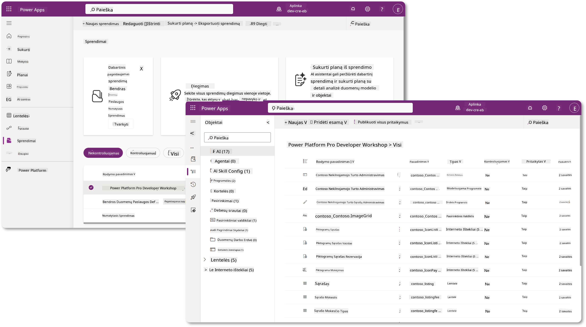

„Copilot Studio“ dabar yra **Sprendimų naršyklė**, kurioje galite tiesiogiai valdyti savo sprendimus. Jums nebereikia pereiti į „Power Apps“ kūrimo portalą, kad galėtumėte valdyti savo sprendimus, tai galima padaryti tiesiog „Copilot Studio“ 🪄

Tai reiškia, kad galite atlikti įprastas su sprendimais susijusias užduotis:

- **Sukurti sprendimą** – pritaikyti sprendimai leidžia agentus eksportuoti ir importuoti tarp aplinkų.
- **Nustatyti pageidaujamą sprendimą** – pasirinkti sprendimą, kuriame pagal numatytuosius nustatymus bus kuriami agentai, programos ir kt.
- **Pridėti arba pašalinti komponentus** – jūsų agentas gali naudoti kitus komponentus, tokius kaip aplinkos kintamieji ar debesų srautai. Todėl šie komponentai turi būti įtraukti į sprendimą.
- **Eksportuoti sprendimus** – perkelti sprendimus į kitą tikslinę aplinką.
- **Importuoti sprendimus** – importuoti kitur sukurtus sprendimus, įskaitant sprendimų atnaujinimą ar atnaujinimą.
- **Kurti ir valdyti sprendimų vamzdynus** – automatizuoti sprendimų diegimą tarp aplinkų.
- **Git integracija** – leidžia kūrėjams susieti sprendimus su „Git“ saugyklomis versijų valdymui, bendradarbiavimui ir ALM. Skirta naudoti tik kūrėjų aplinkose.

   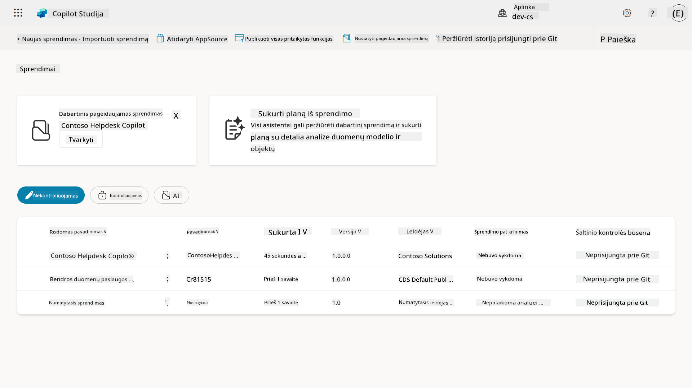

Yra dviejų tipų sprendimai:

- **Nekontroliuojami sprendimai** – naudojami kūrimo metu. Galite laisvai redaguoti ir pritaikyti pagal poreikį.
- **Kontroliuojami sprendimai** – naudojami, kai esate pasiruošę diegti savo programą testavimui ar gamybai. Jie yra užrakinti, kad būtų išvengta atsitiktinių pakeitimų.

## 🤔 Kodėl _turėčiau_ naudoti sprendimą savo agentui?

Galvokite apie sprendimus kaip apie _įrankių dėžę_. Kai reikia taisyti ar kurti ką nors (agentą) kitoje vietoje (aplinkoje), surenkate visus reikalingus įrankius (komponentus) ir sudedate juos į savo įrankių dėžę (sprendimą). Tada galite nešti šią dėžę į naują vietą (aplinką) ir naudoti įrankius (komponentus) darbui užbaigti arba pridėti naujų įrankių (komponentų), kad pritaikytumėte savo agentą ar projektą, kurį kuriate.

!!! citata "Elaiza, jūsų draugiška debesų advokatė, pasidalins keliais žodžiais 🙋🏻‍♀️:"
    Naujojoje Zelandijoje turime posakį „Būk tvarkingas kivi!“ – tai kvietimas Naujosios Zelandijos gyventojams 🥝 prisiimti atsakomybę už savo aplinką, tinkamai išmesti šiukšles ir palaikyti viešųjų erdvių švarą. Tą pačią idėją galime pritaikyti agentams, laikydami viską, kas susiję su jūsų agentu, organizuotą ir mobilų, ir tai padės jums palaikyti tvarkingą aplinką.

Gera praktika sukurti agentą dedikuotame sprendime jūsų šaltinio (kūrėjo) aplinkoje. Štai kodėl sprendimai yra vertingi:

🧩 **Organizuotas kūrimas**

- Jūs laikote savo agentą atskirai nuo numatytojo sprendimo, kuriame yra viskas aplinkoje. Visi jūsų agento komponentai yra vienoje vietoje 🎯

- Viskas, ko reikia jūsų agentui, yra sprendime, todėl lengviau eksportuoti ir importuoti į tikslinę aplinką 👉🏻 tai yra sveikas ALM įprotis.

🧩 **Saugus diegimas**

- Galite eksportuoti savo programą ar agentą kaip kontroliuojamą sprendimą ir diegti jį kitose tikslinėse aplinkose (pvz., testavimui ar gamybai), nerizikuodami atsitiktiniais redagavimais.

🧩 **Versijų kontrolė**

- Galite kurti pataisas (tikslinius pataisymus), atnaujinimus (platesnius pakeitimus) arba atnaujinimus (sprendimo pakeitimas – paprastai dideli pakeitimai ir naujų funkcijų įdiegimas).

- Padeda kontroliuojamai įdiegti pakeitimus.

🧩 **Priklausomybių valdymas**

- Sprendimai seka, kurie komponentai priklauso nuo kitų. Tai apsaugo nuo klaidų, kai atliekate pakeitimus.

🧩 **Komandinis darbas**

- Kūrėjai ir kūrėjai gali dirbti kartu naudodami nekontroliuojamus sprendimus kūrimo metu, o vėliau perduoti kontroliuojamą sprendimą diegimui.

## 🪪 Suprasti sprendimų leidėjus

„Power Platform“ sprendimų leidėjas yra tarsi etiketė ar prekės ženklas, identifikuojantis, kas sukūrė ar valdo sprendimą. Tai nedidelė, bet svarbi jūsų programų, agentų ir srautų pritaikymų valdymo dalis, ypač dirbant komandoje ar skirtingose aplinkose.

Kai kuriate sprendimą, turite pasirinkti leidėją. Šis leidėjas apibrėžia:

- Priešdėlį, kuris pridedamas prie visų pritaikytų komponentų (pvz., lentelės, laukai ir srautai).

- Pavadinimą ir kontaktinę informaciją organizacijai ar asmeniui, kuris valdo sprendimą.

### 🤔 Kodėl tai svarbu?

1. **Lengvas identifikavimas** – priešdėlis (pvz., `new_` arba `abc_`) padeda greitai nustatyti, kurie komponentai priklauso kuriam sprendimui ar komandai.

1. **Konfliktų vengimas** – jei dvi komandos sukuria stulpelį, pavadintą status, jų priešdėliai (`teamA_status`, `teamB_status`) užkerta kelią pavadinimų susidūrimams.

1. **Palaiko ALM** – perkeliant sprendimus tarp aplinkų (Kūrimas → Testavimas → Gamyba), leidėjas padeda sekti nuosavybę ir palaikyti nuoseklumą.

### ✨ Pavyzdys

Tarkime, jūs sukuriate leidėją pavadinimu „Contoso Solutions“ su priešdėliu `cts_`.

Jei pridėsite pritaikytą stulpelį, pavadintą _Prioritetas_, jis bus saugomas kaip `cts_Prioritetas` sprendime.

Bet kas, kas susidurs su stulpeliu sprendimo lygiu, nepriklausomai nuo aplinkos, galės lengvai nustatyti, kad tai stulpelis, susijęs su „Contoso Solutions“.

## 🧭 „Power Platform“ sprendimo gyvavimo ciklas

Dabar, kai suprantate sprendimo paskirtį, pereikime prie jo gyvavimo ciklo.

**1. Sukurkite sprendimą kūrimo aplinkoje** – pradėkite kurdami naują sprendimą savo kūrimo aplinkoje.

**2. Pridėkite komponentus** – pridėkite programas, srautus, lenteles ir kitus elementus į savo sprendimą.

**3. Eksportuokite kaip kontroliuojamą sprendimą** – supakuokite savo sprendimą diegimui eksportuodami jį kaip kontroliuojamą sprendimą.

**4. Importuokite į testavimo aplinką** – išbandykite savo sprendimą atskiroje testavimo aplinkoje, kad įsitikintumėte, jog viskas veikia kaip tikėtasi.

**5. Importuokite į gamybos aplinką** – įdiekite patikrintą sprendimą į savo gyvą gamybos aplinką.

**6. Taikykite pataisas, atnaujinimus ar patobulinimus** – atlikite patobulinimus ar pataisymus naudodami pataisas, atnaujinimus ar patobulinimus. 🔁 Kartokite ciklą!

### ✨ Pavyzdys

Įsivaizduokite, kad kuriate IT pagalbos tarnybos agentą, kuris padėtų darbuotojams spręsti tokias problemas kaip įrenginių gedimai, tinklo trikčių šalinimas, spausdintuvo nustatymas ir kt.

- Pradėkite kūrimo aplinkoje naudodami nekontroliuojamą sprendimą.

- Kai jis bus paruoštas, eksportuokite jį kaip kontroliuojamą sprendimą ir importuokite į tikslinę aplinką, pvz., Sistemos testavimo ar Vartotojo priėmimo testavimo (UAT) aplinką.

- Po testavimo perkelkite jį į gamybos aplinką – visa tai nepaliečiant pradinės kūrimo versijos.

## 🧪 Laboratorija 04: Sukurkite naują sprendimą

Dabar išmoksime:

- [4.1 Kaip sukurti sprendimo leidėją](../../../../../docs/recruit/04-creating-a-solution)
- [4.2 Kaip sukurti sprendimą](../../../../../docs/recruit/04-creating-a-solution)

Tęsime ankstesnį pavyzdį, kuriame sukursime sprendimą dedikuotoje „Copilot Studio“ aplinkoje, kad galėtume sukurti savo IT pagalbos tarnybos agentą.

Pradėkime!

### Būtinos sąlygos

#### Saugumo vaidmuo

„Copilot Studio“ tai, ką _galite daryti_ sprendimų naršyklėje, priklauso nuo jūsų vartotojo saugumo vaidmens.
Jei neturite leidimo valdyti sprendimus „Power Apps“ administravimo centre, negalėsite atlikti šių užduočių „Copilot Studio“.

Kad viskas vyktų sklandžiai, įsitikinkite, kad turite tinkamus saugumo vaidmenis ir leidimus. Jei nevaldote aplinkų savo organizacijoje, kreipkitės į savo IT administratorių (arba atitinkamą) komandą, kuri valdo jūsų nuomotoją/aplinkas.

Šie saugumo vaidmenys leidžia vartotojams kurti sprendimą savo aplinkoje.

| Saugumo vaidmuo    | Aprašymas |
| ---------- | ---------- |
| Aplinkos kūrėjas | Suteikia reikiamus leidimus kurti, pritaikyti ir valdyti išteklius konkrečioje aplinkoje, įskaitant sprendimus  |
| Sistemos pritaikytojas  | Platesni leidimai nei Aplinkos kūrėjas, įskaitant galimybę pritaikyti aplinką ir valdyti saugumo vaidmenis |
| Sistemos administratorius   | Aukščiausio lygio leidimai, leidžiantys valdyti visus aplinkos aspektus, įskaitant saugumo vaidmenų kūrimą ir priskyrimą     |

#### Kūrėjo aplinka

Įsitikinkite, kad perjungėte į savo dedikuotą kūrėjo aplinką, žr. [Pamoka 00 - Kurso nustatymai - 3 žingsnis: Sukurkite naują kūrėjo aplinką](../00-course-setup/README.md#step-3-create-new-developer-environment).

1. Viršutiniame dešiniajame kampe pasirinkite **krumpliaračio piktogramą** ir perjunkite iš numatytosios aplinkos į savo aplinką, pvz., **Adele Vance aplinka**.

    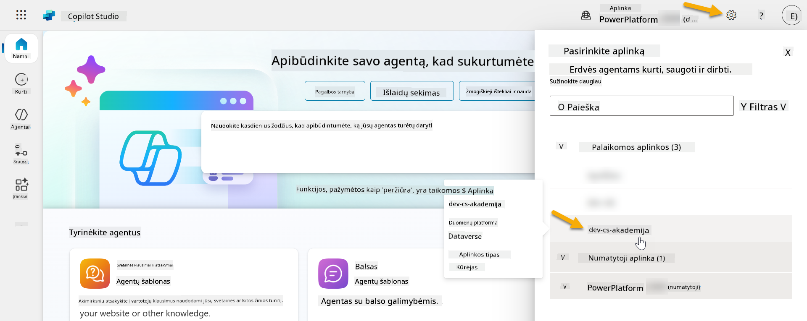

### 4.1 Sukurkite sprendimo leidėją

1. Naudodami tą pačią „Copilot Studio“ aplinką, naudotą ankstesnėje pamokoje, pasirinkite **trijų taškų piktogramą (. . .)** kairėje meniu pusėje „Copilot Studio“. Pasirinkite **Sprendimai** po **Naršyti** antrašte.

    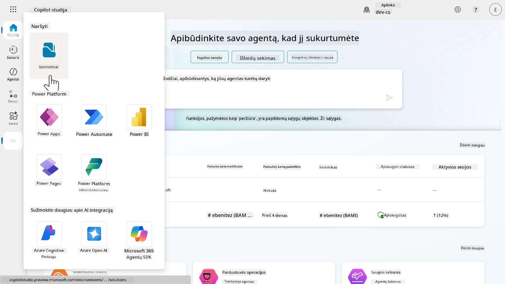

1. „Copilot Studio“ įsikels **Sprendimų naršyklė**. Pasirinkite **+ Naujas sprendimas**

    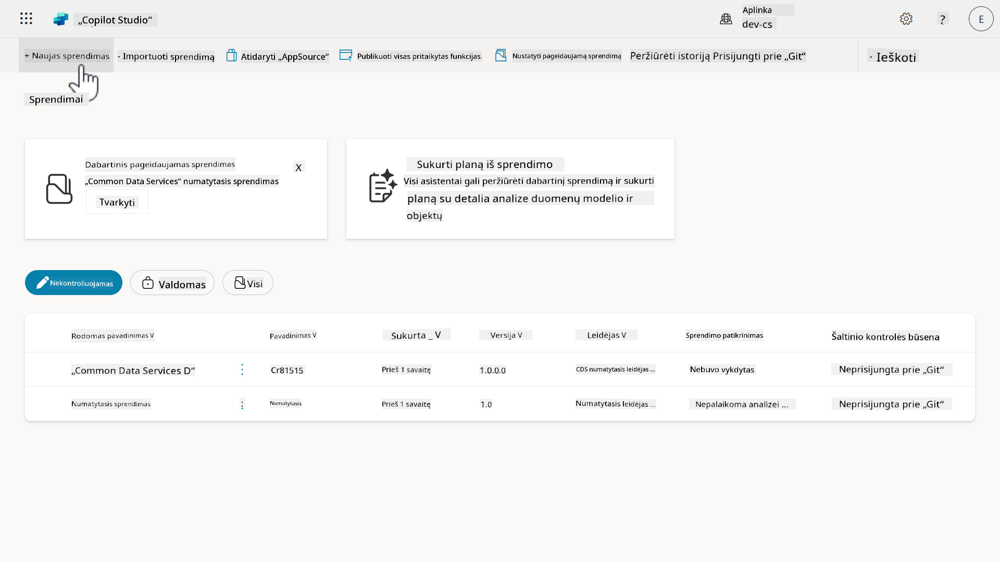

1. Atsiras **Naujo sprendimo** langas, kuriame galėsime apibrėžti savo sprendimo detales. Pirmiausia turime sukurti naują leidėją. Pasirinkite **+ Naujas leidėjas**.

    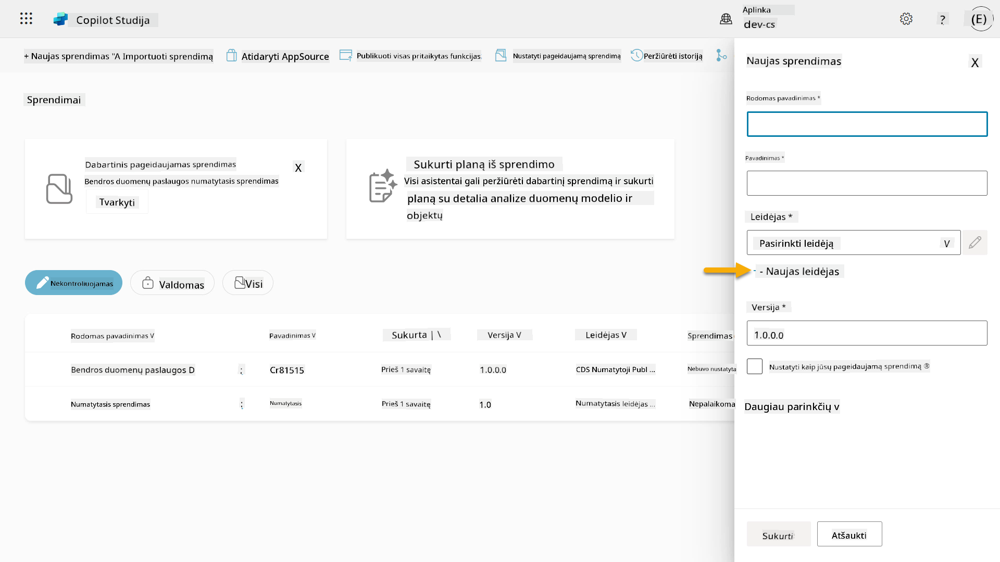  

1. Atsiras **Savybių** skirtukas **Naujo leidėjo** lange su privalomais ir neprivalomais laukais, kuriuos reikia užpildyti **Savybių** skirtuke. Čia galime apibrėžti leidėjo detales, kuris bus naudojamas kaip etiketė ar prekės ženklas, identifikuojantis, kas sukūrė ar valdo sprendimą.

    | Savybė    | Aprašymas | Privaloma |
    | ---------- | ---------- | :----------: |
    | Rodymo pavadinimas | Leidėjo rodomas pavadinimas | Taip   |
    | Pavadinimas  | Unikalus leidėjo pavadinimas ir schemos pavadinimas  | Taip    |
    | Aprašymas   | Apibrėžia sprendimo paskirtį    | Ne     |
    | Priešdėlis
1. Naujas leidėjo langas užsidarys, ir jūs grįšite į **Naujo sprendimo** langą su pasirinktu naujai sukurtu leidėju.

    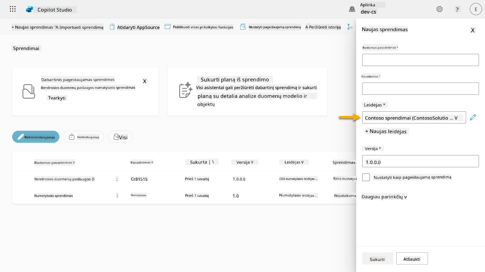  

Puiku, jūs ką tik sukūrėte sprendimo leidėją! 🙌🏻 Dabar išmoksime, kaip sukurti naują pritaikytą sprendimą.

### 4.2 Sukurkite naują sprendimą

1. Dabar, kai sukūrėme savo sprendimus, galime užpildyti likusią formos dalį **Naujo sprendimo** lange.

    Nukopijuokite ir įklijuokite šį tekstą kaip **Rodomą pavadinimą**,

    ```text
    Contoso Helpdesk Agent
    ```

    Nukopijuokite ir įklijuokite šį tekstą kaip **Pavadinimą**,

    ```text
    ContosoHelpdeskAgent
    ```

    Kadangi kuriame naują sprendimą, [**Versijos** numeris](https://learn.microsoft.com/power-apps/maker/data-platform/update-solutions#understanding-version-numbers-for-updates/?WT.mc_id=power-172615-ebenitez) pagal numatymą bus `1.0.0.0`.

    Pažymėkite langelį **Nustatyti kaip jūsų pageidaujamą sprendimą**.

    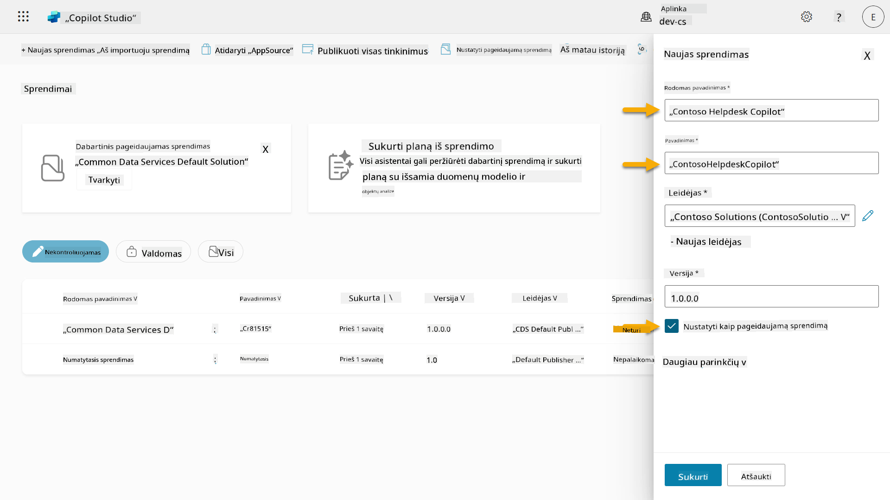  

1. Išplėskite **Daugiau parinkčių**, kad pamatytumėte papildomą informaciją, kurią galima pateikti sprendime.

    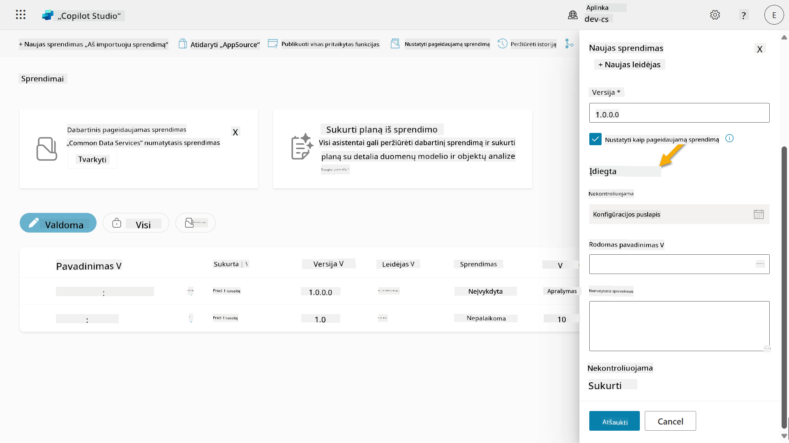

1. Pamatysite šiuos laukus:

    - **Įdiegta** - data, kada sprendimas buvo įdiegtas.

    - **Konfigūracijos puslapis** - kūrėjai nustato HTML interneto išteklius, kad padėtų vartotojams sąveikauti su jų programėle, agentu ar įrankiu, kur jis bus rodomas kaip interneto puslapis informacijos skiltyje su instrukcijomis ar mygtukais. Dažniausiai naudojamas įmonėms ar kūrėjams, kurie kuria ir dalijasi sprendimais su kitais.

    - **Aprašymas** - apibūdina sprendimą arba pateikia aukšto lygio konfigūracijos puslapio aprašymą.

    Šiuos laukus paliksime tuščius šioje laboratorijoje.

    Pasirinkite **Sukurti**.

    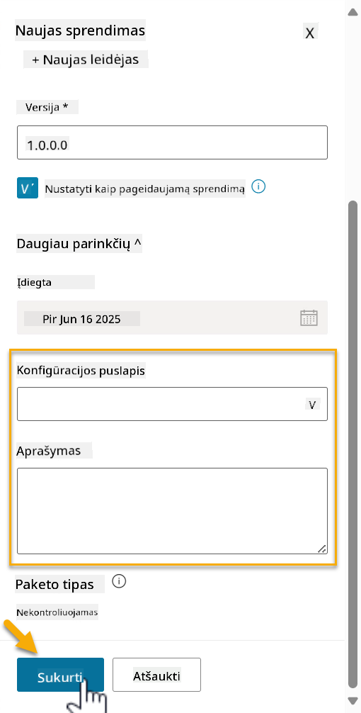

1. Contoso Helpdesk Agent sprendimas dabar sukurtas. Kol kas jame nebus jokių komponentų, kol nesukursime agento Copilot Studio.

    Pasirinkite **grįžimo rodyklės** piktogramą, kad grįžtumėte į Sprendimų naršyklę.

    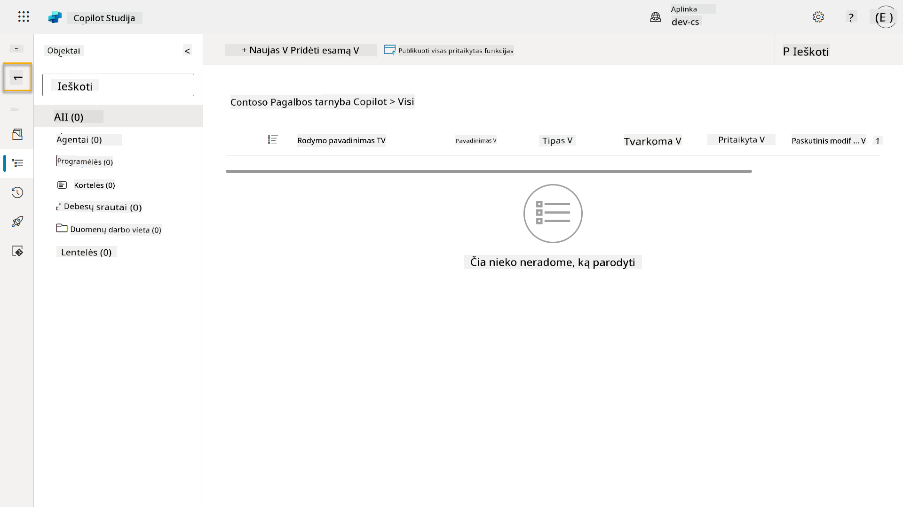

1. Atkreipkite dėmesį, kad Contoso Helpdesk Agent dabar rodomas kaip **Dabartinis pageidaujamas sprendimas**, nes anksčiau pažymėjome langelį **Nustatyti kaip jūsų pageidaujamą sprendimą**.

    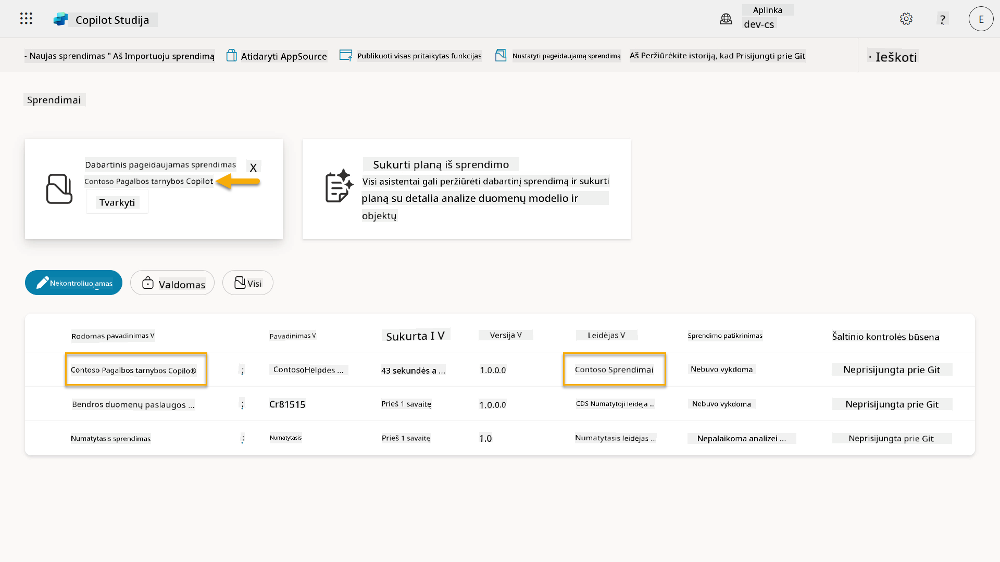

## ✅ Misija įvykdyta

Sveikiname! 👏🏻 Jūs sukūrėte leidėją ir panaudojote jį savo naujai sukurtame sprendime, kad sukurtumėte savo agentą!

Puikiai padirbėta, Agentų kūrėjau. Tvarkingas skaitmeninis pėdsakas yra pirmas žingsnis link veikimo mastu. Dabar turite įrankius ir požiūrį tvariam, įmonės mastui pritaikytam agentų kūrimui.

Tai yra **Laboratorijos 04 - Sprendimo kūrimas** pabaiga, pasirinkite žemiau esančią nuorodą, kad pereitumėte prie kitos pamokos. Jūsų sprendimas, sukurtas šioje laboratorijoje, bus naudojamas kitos pamokos laboratorijoje.

⏭️ [Pereiti prie **Greitas startas su iš anksto sukurtais agentais** pamokos](../05-using-prebuilt-agents/README.md)

## 📚 Taktiniai ištekliai

🔗 [Sukurti sprendimą](https://learn.microsoft.com/power-apps/maker/data-platform/create-solution/?WT.mc_id=power-172615-ebenitez)

🔗 [Kurti ir valdyti sprendimus Copilot Studio](https://learn.microsoft.com/microsoft-copilot-studio/authoring-solutions-overview/?WT.mc_id=power-172615-ebenitez)

🔗 [Dalintis agentais su kitais vartotojais](https://learn.microsoft.com/microsoft-copilot-studio/admin-share-bots/?WT.mc_id=power-172615-ebenitez)

🔗 [Išteklių santrauka, prieinama iš anksto apibrėžtiems saugumo vaidmenims](https://learn.microsoft.com/power-platform/admin/database-security#summary-of-resources-available-to-predefined-security-roles/?WT.mc_id=power-172615-ebenitez)

🔗 [Atnaujinti arba atnaujinti sprendimą](https://learn.microsoft.com/power-apps/maker/data-platform/update-solutions/?WT.mc_id=power-172615-ebenitez)

🔗 [Power Platform vamzdynų apžvalga](https://learn.microsoft.com/power-platform/alm/pipelines/?WT.mc_id=power-172615-ebenitez)

🔗 [Git integracijos apžvalga Power Platform](https://learn.microsoft.com/power-platform/alm/git-integration/overview/?WT.mc_id=power-172615-ebenitez)

<!-- markdownlint-disable-next-line MD033 -->


---

**Atsakomybės apribojimas**:  
Šis dokumentas buvo išverstas naudojant AI vertimo paslaugą [Co-op Translator](https://github.com/Azure/co-op-translator). Nors stengiamės užtikrinti tikslumą, prašome atkreipti dėmesį, kad automatiniai vertimai gali turėti klaidų ar netikslumų. Originalus dokumentas jo gimtąja kalba turėtų būti laikomas autoritetingu šaltiniu. Kritinei informacijai rekomenduojama naudoti profesionalų žmogaus vertimą. Mes neprisiimame atsakomybės už nesusipratimus ar neteisingus aiškinimus, atsiradusius dėl šio vertimo naudojimo.