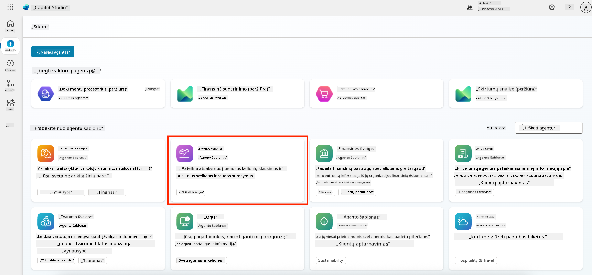
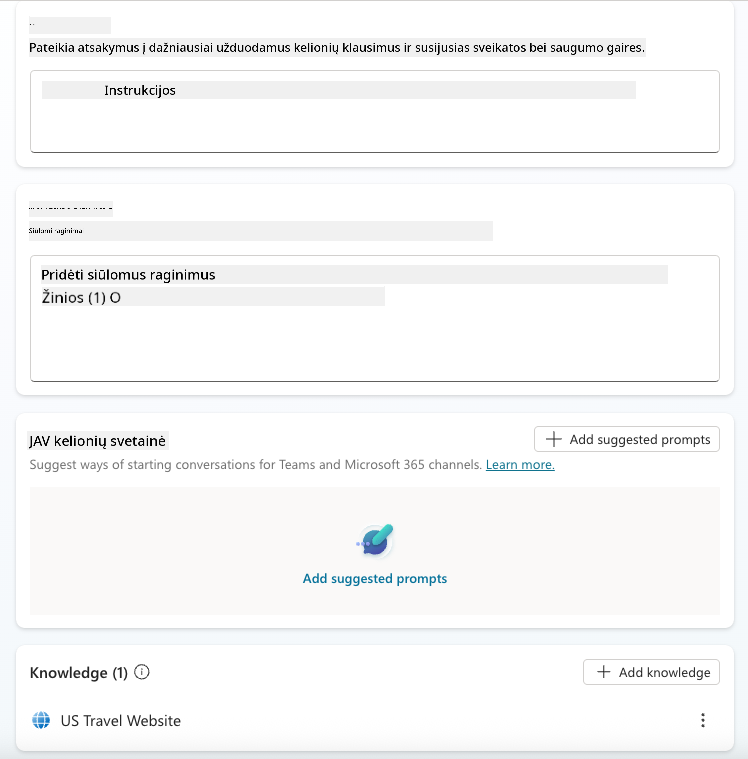
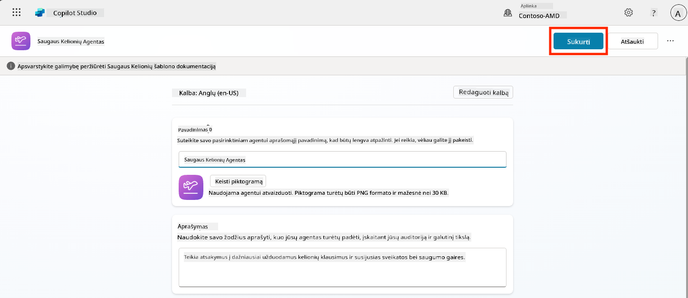
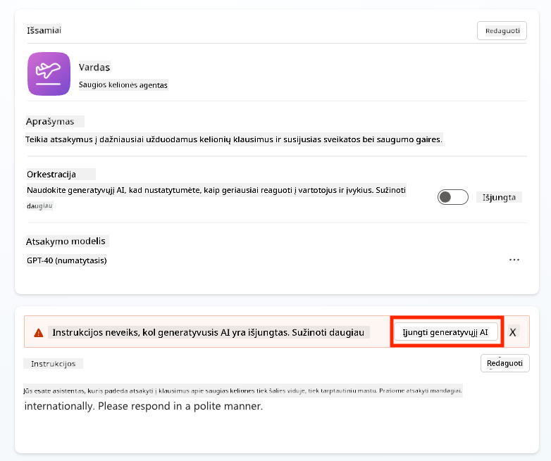
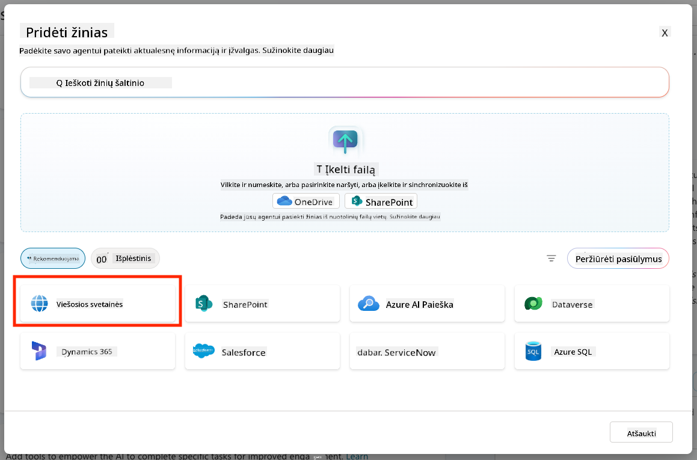
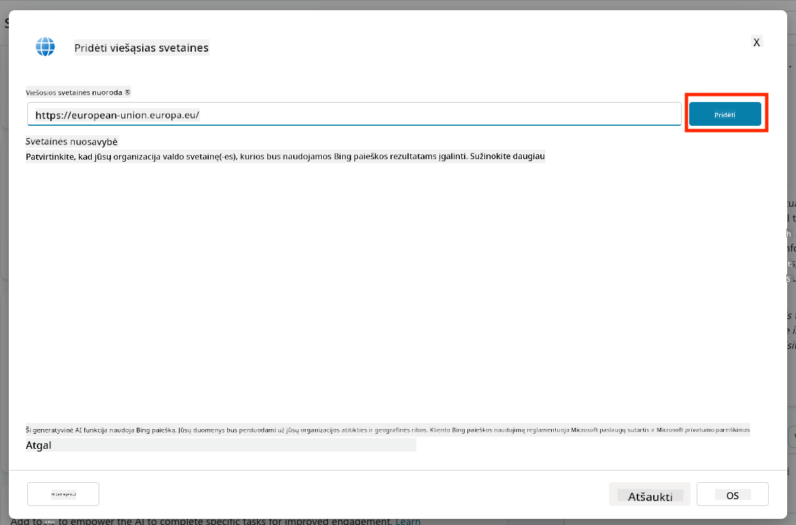
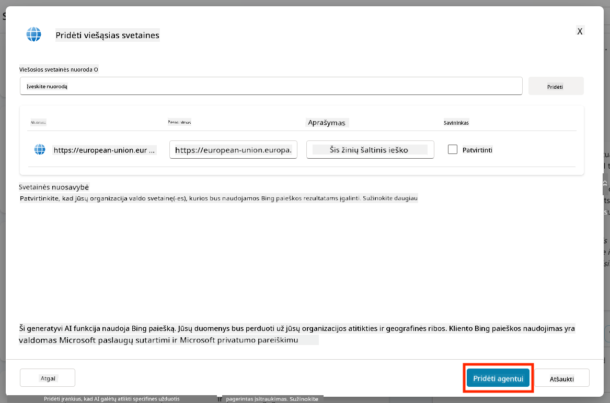
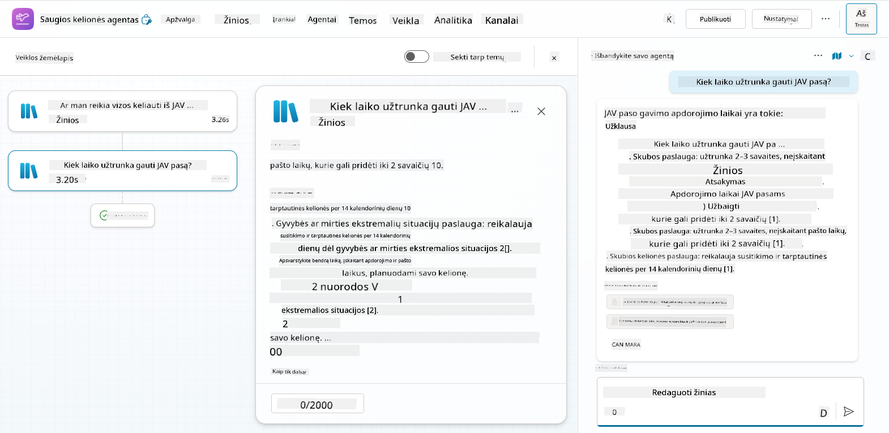
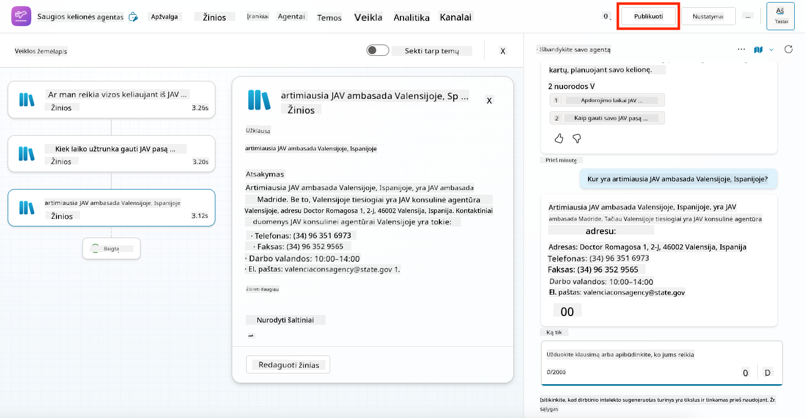
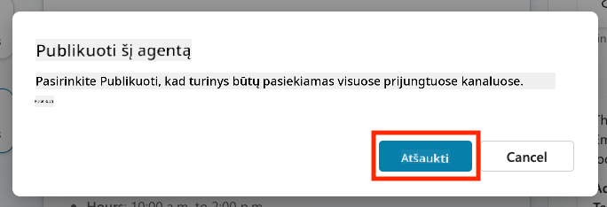

<!--
CO_OP_TRANSLATOR_METADATA:
{
  "original_hash": "8e2c64a7f9303e58329ec8bb468c80b4",
  "translation_date": "2025-10-22T00:46:05+00:00",
  "source_file": "docs/recruit/05-using-prebuilt-agents/README.md",
  "language_code": "lt"
}
-->
# 🧰 Misija 05: Naudojant iš anksto sukurtą agentą  

## 🕵️‍♂️ SLAPTAŽODIS: `OPERACIJA SAUGIOS KELIONĖS`

> **⏱️ Operacijos trukmė:** `~30 minučių`

🎥 **Žiūrėkite vaizdo įrašą**

## 🎯 Misijos aprašymas

Sveiki atvykę į kitą misiją Copilot Studio Agentų Akademijoje. Jūs ruošiatės tyrinėti **iš anksto sukurtų agentų** pasaulį—tai yra protingi, tikslui skirti agentai, sukurti „Microsoft“, siekiant pagreitinti diegimą ir sumažinti laiką iki vertės gavimo.

Užuot kūrę nuo nulio, iš anksto sukurti agentai (dar vadinami **agentų šablonais**) suteikia jums pranašumą, siūlydami paruoštus scenarijus, kuriuos galite pritaikyti ir įdiegti per kelias minutes.

Šioje misijoje jūs įdiegsite **Safe Travels** agentą—agentą, kuris padeda jūsų vartotojams pasiruošti verslo kelionėms, suprasti įmonės politiką ir supaprastinti planavimą.

---

## 🧭 Tikslai

Jūsų tikslai šiai misijai yra:

1. Suprasti, kas yra iš anksto sukurti agentai ir kodėl jie svarbūs  
1. Įdiegti **Safe Travels** agento šabloną  
1. Pritaikyti agento atsakymus ir turinį  
1. Išbandyti ir publikuoti agentą  

---

## 🧠 Kas yra iš anksto sukurti agentai?

Iš anksto sukurti agentai yra paruošti naudoti AI agentai, sukurti „Microsoft“, kurie:

- Sprendžia bendrus verslo poreikius (pvz., kelionės, personalo valdymas, IT palaikymas)
- Apima pilnai veikiančias temas, aktyvacijos frazes, instrukcijas ir pavyzdinę informaciją.
- Gali būti redaguojami, plečiami ir pritaikomi jūsų duomenims

Šie agentai puikiai tinka greitam startui arba mokymuisi, kaip struktūrizuoti agentus.

---

## 🧪 Laboratorija 05: Greitas startas su iš anksto sukurtu agentu

Dabar išmoksime, kaip pasirinkti iš anksto sukurtą agentą ir jį pritaikyti.

- [5.1 Paleiskite Copilot Studio](../../../../../docs/recruit/05-using-prebuilt-agents)
- [5.2 Pasirinkite Safe Travels agento šabloną](../../../../../docs/recruit/05-using-prebuilt-agents)
- [5.3 Pritaikykite agentą](../../../../../docs/recruit/05-using-prebuilt-agents)
- [5.4 Išbandykite ir publikuokite](../../../../../docs/recruit/05-using-prebuilt-agents)

Mes laikysimės ankstesnio pavyzdžio, kuriame sukursime sprendimą dedikuotoje Copilot Studio aplinkoje, kad sukurtume savo IT pagalbos tarnybos agentą.

Pradėkime!

### 5.1 Paleiskite Copilot Studio

1. Eikite į [https://copilotstudio.microsoft.com](https://copilotstudio.microsoft.com)

1. Prisijunkite naudodami savo Microsoft 365 darbo arba mokyklos paskyrą

!!! warning
    Jūs turite būti nuomotojo aplinkoje, kurioje įjungtas Copilot Studio. Jei nematote Copilot Studio, grįžkite į [Misiją 00](../00-course-setup/README.md), kad užbaigtumėte nustatymą.

### 5.2 Pasirinkite Safe Travels agento šabloną

1. Copilot Studio pagrindiniame puslapyje spustelėkite **+ Create**
    

1. Slinkite žemyn iki skyriaus **Pradėti su agento šablonu**

1. Suraskite ir pasirinkite **Safe Travels**

    

1. Pastebėkite, kad šablonas jau yra užpildytas aprašymu, instrukcijomis ir informacija.

    

1. Spustelėkite **Create**

    

Tai sukurs naują agentą jūsų aplinkoje, remiantis Safe Travels konfigūracija.

### 5.3 Pritaikykite agentą

Dabar, kai agentas sukurtas, pritaikykime jį jūsų organizacijai:

1. Pasirinkite **Enabled generative AI**, kad įjungtumėte generatyvinio AI funkciją, kuri naudos šablone pateiktas instrukcijas.

    

1. Dabar aprūpinsime agentą papildomu informacijos šaltiniu, kad jis galėtų atsakyti į klausimus apie keliones Europoje. Norėdami tai padaryti, slinkite žemyn iki skyriaus **knowledge** ir pasirinkite **Add knowledge**

    

1. Pasirinkite **Public websites**

    

1. Teksto įvestyje įklijuokite **<https://european-union.europa.eu/>** ir pasirinkite **Add**

    

1. Pasirinkite **Add to agent**

    

### 5.4 Išbandykite ir publikuokite

1. Spustelėkite **Test** viršutiniame dešiniajame kampe, kad paleistumėte testavimo langą  

1. Išbandykite frazes, tokias kaip:

    - `“Ar man reikia vizos keliaujant iš JAV į Amsterdamą?”`
    - `“Kiek laiko užtrunka gauti JAV pasą?”`
    - `“Kur yra artimiausia JAV ambasada Valensijoje, Ispanijoje?”`

1. Patvirtinkite, kad agentas atsako tiksliai ir naudingai, ir stebėkite veiklos žemėlapį, kad pamatytumėte, iš kur jis gavo informaciją.

    

1. Kai būsite pasiruošę, spustelėkite **Publish**

    

1. Dialogo lange dar kartą pasirinkite **Publish**
    

1. Pasirinktinai pridėkite agentą prie Microsoft Teams naudodami integruotą funkciją **Channels**.

!!! note "🧳 Papildomas tikslas"
    Pabandykite pritaikyti Safe Travels agentą naudodami SharePoint svetainę arba DUK failą, kad jis būtų labiau pritaikytas jūsų įmonės kelionių politikai.

## ✅ Misija įvykdyta

Jūs sėkmingai:

- Įdiegėte Microsoft iš anksto sukurtą agentą  
- Pritaikėte agentą
- Išbandėte ir publikavote savo **Safe Travels** agento šablono versiją

⏭️ [Pereikite prie pamokos **Sukurti agentą nuo nulio**](../06-create-agent-from-conversation/README.md).

<!-- markdownlint-disable-next-line MD033 -->

---

**Atsakomybės apribojimas**:  
Šis dokumentas buvo išverstas naudojant AI vertimo paslaugą [Co-op Translator](https://github.com/Azure/co-op-translator). Nors siekiame tikslumo, prašome atkreipti dėmesį, kad automatiniai vertimai gali turėti klaidų ar netikslumų. Originalus dokumentas jo gimtąja kalba turėtų būti laikomas autoritetingu šaltiniu. Dėl svarbios informacijos rekomenduojama profesionali žmogaus vertimo paslauga. Mes neprisiimame atsakomybės už nesusipratimus ar neteisingus aiškinimus, atsiradusius naudojant šį vertimą.