<!--
CO_OP_TRANSLATOR_METADATA:
{
  "original_hash": "180f9cc0b40527f61be092c9b0f72aba",
  "translation_date": "2025-10-22T00:38:38+00:00",
  "source_file": "docs/recruit/06-create-agent-from-conversation/README.md",
  "language_code": "lt"
}
-->
# 🚨 Misija 06: Sukurkite pritaikytą agentą naudodami natūralią kalbą su Copilot ir susiekite jį su savo duomenimis

## 🕵️‍♂️ SLAPTAŽODIS: `OPERACIJA AGENTŲ KALVĖ`

> **⏱️ Operacijos laiko langas:** `~75 minutės`

🎥 **Žiūrėkite vaizdo įrašą**

[](https://www.youtube.com/watch?v=qZTtQVncGFg "Žiūrėkite vaizdo įrašą YouTube")

## 🎯 Misijos aprašymas

Sveiki sugrįžę, Agentų Kūrėjau. Ši misija suteikia jums galimybę valdyti galingiausią Copilot Studio funkciją - sukurti pritaikytą agentą nuo nulio naudojant tik natūralią kalbą… ir sustiprinti jį savo duomenimis.

Tai nėra tiesiog dar vienas pokalbių robotas. Jūs kuriate žinių pagrindu veikiančią skaitmeninę kolegą - tokią, kuri gali mąstyti, atsakyti ir remtis realia įmonės informacija.

Jūsų pasirinktas ginklas? Natūrali kalba. Jūsų misija? Sukurti, apmokyti ir išbandyti visiškai pritaikytą pagalbos tarnybos agentą, kuris atsako į IT klausimus naudodamas SharePoint, įkeltus failus ar įmonės URL.

Sukurkime jūsų agentą nuo nulio.

## 🔎 Tikslai

Šioje misijoje jūs išmoksite:

1. Suprasti, kas yra pritaikyti agentai ir kuo jie skiriasi nuo iš anksto sukurtų šablonų
1. Kurti agentus naudojant natūralios kalbos užklausas ir pokalbių dizainą su Copilot
1. Susieti agentus su įmonės žinių šaltiniais, įskaitant SharePoint, dokumentus ir svetaines
1. Sužinoti apie generatyvinę orkestraciją ir kaip agentai dinamiškai ieško ir atsako naudodami kelis duomenų šaltinius
1. Sukurti ir išbandyti visiškai funkcionalų IT pagalbos tarnybos agentą, kuris gali atsakyti į klausimus iš jūsų duomenų

## 🤔 Kas yra _pritaikytas_ agentas?

Pritaikytas agentas yra pokalbių robotas arba virtualus asistentas, kurį jūs sukuriate ir suprojektuojate Copilot Studio, kad padėtų vartotojams atlikti specifines užduotis ar atsakyti į klausimus. Jis vadinamas pritaikytu, nes:

- **Jūs nusprendžiate tikslą** - padėti vartotojams prašyti atostogų, patikrinti užsakymo būseną, suteikti pagalbą IT klausimais.
- **Jūs apibrėžiate pokalbį** - ką agentas sako ir kaip jis turėtų reaguoti.
- **Jūs susiejate jį su savo duomenimis** - prisijungiate prie įmonės duomenų per integruotus palaikomus žinių šaltinius.
- **Jūs prijungiate jį prie savo sistemų ar programų** - pasirenkate iš jungčių, srautų, REST API ir modelio konteksto protokolo serverių.

!!! note
    Pagalvokite apie tai taip: jūs kuriate savo skaitmeninį pagalbininką, kuris gali kalbėtis su vartotojais ir atlikti užduotis už juos, pavyzdžiui, atsakyti į klausimus, rinkti informaciją, reikalingą procesui, arba prisijungti prie jūsų įmonės duomenų.

### 🤖 Ką gali pritaikytas agentas?

Pritaikytas agentas gali atlikti šiuos veiksmus:

- Klausti vartotojų informacijos, tokios kaip vardai, datos ar pageidavimai.
- Išsaugoti tą informaciją duomenų bazėje ar lentelėje.
- Ieškoti duomenų pagal užduotus klausimus ir atsakyti į juos.
- Dirbti savarankiškai be tiesioginio vartotojų įsikišimo.
- Sukelti veiksmus pagal poreikį per tiesioginį vartotojo sąveiką arba savarankiškai, pavyzdžiui, siųsti el. laiškus ar kurti įrašus.

### 👩🏻‍💻 Kodėl verta naudoti pritaikytą agentą?

- Taupo laiką automatizuojant pasikartojančias užduotis.
- Suteikia vartotojams draugišką, vadovaujamą patirtį.
- Pritaikomas pagal jūsų verslo ar projekto poreikius.

### ✨ Pavyzdys

Jūs sukuriate pritaikytą agentą, kuris padeda darbuotojams prašyti atostogų.

Jis klausia jų vardo, atostogų datų ir jų vadovo vardo, tada išsaugo informaciją į paskirtą sistemą, kuri tvarko atostogų prašymus, pavyzdžiui, SharePoint sąrašą.

Dabar, užuot naršę SharePoint sąraše ir kūrę naują elementą, darbuotojai tiesiog bendrauja su agentu.

## 🗣️ Naudokite natūralią kalbą agentams kurti

Anksčiau jūs išmokote greitai kurti agentus Copilot Studio naudodami iš anksto sukurtus agentų šablonus [Pamokoje 05 - Greitas startas su iš anksto sukurtais agentais](../05-using-prebuilt-agents/README.md). Šioje pamokoje mes gilinsimės į pokalbių kūrimo patirtį su Copilot. Copilot Studio leidžia lengvai kurti agentus bendraujant su Copilot, tarsi turėtumėte pokalbį.

Copilot Studio nereikia rašyti kodo, kad sukurtumėte agentą. Vietoj to, jūs aprašote, ką norite, kad jūsų agentas darytų, paprasta kalba, o Copilot padeda jums jį sukurti žingsnis po žingsnio per pokalbio tipo patirtį.

## 🌱 Bet aš naujokas „aprašant, ko noriu“ - ką daryti?

Aprašymas natūralia kalba kuriant pritaikytą agentą gali būti nauja koncepcija jums. Kiekvieną kartą, kai naudojate Copilot per Microsoft produktus ir paslaugas, jūs naudojate natūralią kalbą kaip _užklausą_.

Užklausa yra pranešimas arba instrukcija, kurią pateikiate AI agentui, kad pasakytumėte, ką norite, kad jis darytų. Pagalvokite apie tai kaip nurodymų davimą asistentui. Kuo aiškesnės jūsų instrukcijos, tuo lengviau jūsų asistentui suprasti ir veikti pagal jas.

### 🪄 Kodėl užklausos svarbios

- Jos nukreipia agento elgesį.
- Jos padeda agentui suprasti, kokio tipo pokalbį turėti.
- Gera užklausa daro agentą naudingesnį ir tikslesnį.

### 📝 Patarimai, kaip parašyti gerą užklausą

- Būkite aiškūs ir konkretūs - pasakykite tiksliai, ką norite, kad agentas darytų.
- Galvokite kaip vartotojas - ką vartotojas pasakys? Ką agentas turėtų atsakyti?
- Įtraukite pavyzdžius - jei įmanoma, pateikite pavyzdinę sąveiką.

### ✨ Pavyzdys

Tarkime, HR komanda reikia agento, kuris padėtų su atostogų prašymais.

Užklausa galėtų būti:

    „Noriu sukurti agentą, kuris padėtų vartotojams pateikti atostogų prašymą. Kai vartotojas sako, kad nori prašyti laisvo laiko, agentas turėtų paklausti jų vardo, atostogų pradžios datos, atostogų pabaigos datos ir jų vadovo vardo. Kai vartotojas pateikia šią informaciją, agentas turėtų ją išsaugoti SharePoint sąraše, pavadintame ‘Atostogų prašymai’, ir paskelbti pranešimą dedikuotame Microsoft Teams kanale.“

Kodėl ši užklausa veikia:

- **Aiškiai nurodo tikslą** - pateikti atostogų prašymą
- **Aprašo vartotojo sąveiką** - ką vartotojas sako ir ką agentas turėtų klausti
- **Nurodo reikalingus duomenis** - vardas, pradžios data, pabaigos data, vadovas
- **Paminėta, kur duomenys keliauja** - SharePoint sąrašas, pavadintas Atostogų prašymai

## 🔮 Gerai, sukūriau savo agentą... kaip jį susieti su žiniomis?

Copilot Studio žinių šaltiniai yra vietos, kur jūsų agentas gali rasti informaciją, kad pateiktų geresnius atsakymus. Kai pridėsite šiuos šaltinius, jūsų agentas galės įtraukti jūsų įmonės duomenis iš tokių vietų kaip Power Platform, Dynamics 365, svetainės ir kitos jūsų įmonės naudojamos sistemos ar paslaugos.

Šie šaltiniai veikia kartu su AI, kad padėtų jūsų agentui atsakyti tiksliau į vartotojų klausimus, tai pasiekiama per vadinamąją **generatyvinę orkestraciją**.

### 🌿 Kas yra generatyvinė orkestracija agentų kontekste?

Generatyvinė orkestracija reiškia, kad agentas naudoja AI dinamiškai nuspręsti, kaip atsakyti į klausimą, derindamas savo įgimtus kalbos įgūdžius su informacija iš jūsų pridėtų žinių šaltinių.

Kai vartotojas užduoda klausimą, agentas:

- Supranta klausimą naudodamas AI.
- Gali paklausti vartotojų trūkstamos informacijos, generuodamas klausimus vietoje.
- Pasirenka tinkamiausius žinių šaltinius.
- Ieško tuose šaltiniuose atsakymų.
- Generuoja natūralų, naudingą atsakymą naudodamas rastą informaciją.

### 🏦 Kodėl žinių šaltiniai svarbūs?

1. **Protingesni atsakymai** - kai pridėsite žinių šaltinius, jūsų agentas galės pateikti geresnius, tikslesnius atsakymus naudodamas realius jūsų organizacijos duomenis.

1. **Mažiau rankinio darbo** - jums nereikia rašyti kiekvieno galimo atsakymo. Agentas gali ieškoti jūsų pridėtuose šaltiniuose ir atsakyti automatiškai.

1. **Naudokite patikimą informaciją** - jūsų agentas gali gauti atsakymus iš sistemų, kurias jau naudojate, tokių kaip Dataverse, SharePoint ar įmonės svetainės, kad vartotojai gautų patikimą informaciją iš patikimo šaltinio.

1. **Veikia su generatyviniu AI** - žinių šaltiniai ir AI padeda jūsų agentui suprasti klausimus ir atsakyti natūraliai, net jei klausimas nebuvo iš anksto užprogramuotas ar pridėtas kaip pradinė užklausa.

1. **Lankstus ir plečiamas** - galite pridėti žinių šaltinius bet kuriuo metu nustatymo metu arba vėliau, jūsų agentas tampa protingesnis, kai keičiasi jūsų poreikiai.

### ✨ Pavyzdys

Įsivaizduokite, kad sukuriate agentą, kuris padeda darbuotojams su HR klausimais. Jūs pridedate savo įmonės HR politikos dokumentą ir SharePoint svetainę kaip žinių šaltinius.

Kai darbuotojas klausia, _„Kiek atostogų dienų man priklauso?“_, agentas naudoja generatyvinę orkestraciją, kad ieškotų tuose šaltiniuose ir atsakytų teisingą politiką, nereikalaujant, kad jūs rankiniu būdu parašytumėte tą atsakymą. Tai taupo jūsų laiką, nes nereikia numatyti kiekvieno galimo klausimo, kurį darbuotojas gali užduoti apie savo teises.

## Žinių šaltinių tipai, kuriuos galima pridėti

1. **Viešos svetainės**
    - **Ką tai daro:** Ieško specifinėse svetainėse (pvz., jūsų įmonės svetainėje) naudodamas Bing.
    - **Kodėl tai naudinga:** Puikiai tinka viešai prieinamos informacijos, pvz., DUK ar produktų detalių, įtraukimui.

1. **Dokumentai**
    - **Ką tai daro:** Naudoja dokumentus, kuriuos įkeliate tiesiai į savo agentą, pvz., PDF ar Word failus. Šie įkelti failai saugomi saugiai Dataverse.
    - **Kodėl tai naudinga:** Leidžia jūsų agentui atsakyti į klausimus, remiantis vidiniais vadovais, instrukcijomis ar politikomis.

1. **SharePoint**
    - **Ką tai daro:** Prisijungia prie SharePoint aplankų ar failų naudodamas Microsoft Graph Search.
    - **Kodėl tai naudinga:** Idealu norint pasiekti komandos dokumentus, HR politiką ar projekto failus, saugomus SharePoint.

1. **Dataverse**
    - **Ką tai daro:** Naudoja struktūrizuotus duomenis iš jūsų Dataverse aplinkos lentelių ir eilučių, gali taikyti sinonimus ir žodynų apibrėžimus lentelėms ir stulpeliams, kad pagerintų agento atsakymus.
    - **Kodėl tai naudinga:** Kai reikia ieškoti įmonės duomenų, saugomų Dataverse, pvz., klientų informacijos.

1. **Realaus laiko žinios su jungtimis**
    - **Ką tai daro:** Leidžia jūsų agentui pasiekti tiesioginius duomenis iš kitų įmonės sistemų, tokių kaip Salesforce, ServiceNow, Dynamics 365, AzureSQL, Databricks ir daugiau pokalbio metu, naudojant vartotojo leidimus.
    - **Kodėl tai naudinga:** Tai suteikia naujausius, saugius ir tikslius atsakymus, nedubliuojant duomenų, todėl jūsų agentas tampa protingesnis ir saugesnis.

1. **Azure AI Search**
    - **Ką tai daro:** Leidžia jūsų agentui ieškoti dideliuose dokumentų rinkiniuose, saugomuose Azure, naudojant semantinę ir vektorinę paiešką, kad suprastų vartotojo klausimus.
    - **Kodėl tai naudinga:** Pateikia tikslius, patikimus atsakymus iš sudėtingų duomenų šaltinių, palaiko citatas ir gerai skalėja dideliems dokumentų rinkiniams su saugiais prieigos kontrolės mechanizmais.

## 🔒 Pastaba apie saugumą

### Žinių šaltinių autentifikacija

Kai kurie šaltiniai, tokie kaip SharePoint ir Dataverse, reikalauja vartotojo autentifikacijos. Tai reiškia, kad agentas atsakymuose nurodys tik tuos duomenis, kuriuos vartotojas turi teisę matyti. Tuo tarpu kiti šaltiniai gali reikalauti papildomos konfigūracijos, kad agentas galėtų prisijungti, pvz., Azure AI Search, kuris reikalauja Azure paskyros ir autentifikacijos tipo nurodymo.

## Agentų atsakymų tobulinimas Copilot Studio

Po to, kai jūsų agentas sukuriamas per pokalbių kūrimo patirtį, norėsite išbandyti savo agentą pagal instrukcijas, kurias Copilot sugeneravo iš jūsų užklausos. Agentų atsakymų tobulinimas Copilot Studio yra apie tai, kad įsitikintumėte, jog jis aiškiai supranta jūsų tikslus ir turi tinkamą informaciją darbui.

1. **Patobulinkite agento instrukcijas** - čia jūs nurodote savo agentui, kaip jis turėtų elgtis. Naudokite aiškią, konkrečią kalbą.

    Pavyzdžiui:

    ✅ „Elkis kaip draugiškas klientų aptarnavimo agentas, kuris paprastai paaiškina dalykus.“

    ❌ „Būk naudingas.“ (Per daug neaišku)

1. **Patikrinkite toną ir kalbą** - įsitikinkite, kad agento tonas atitinka jūsų auditoriją.

    Galite nustatyti, kad jis būtų:

    - Draugiškas ir neformalus.
    - Profesionalus ir glaustas.
    - Palaikantis ir kantrus.

1. **Pridėkite arba atnaujinkite žinių šaltinius** - jei jūsų agentui reikia atsakyti į klausimus apie temą, įsitikinkite, kad jis turi prieigą prie
Naudosime tą patį naudojimo atvejį iš [Pamoka 03 - Sukurkite deklaratyvų agentą Microsoft 365 Copilot](../03-create-a-declarative-agent-for-M365Copilot/README.md#use-case-scenario)

**Kaip** darbuotojas

**Noriu** greitai ir tiksliai gauti pagalbą iš IT pagalbos tarnybos agento dėl tokių problemų kaip įrenginių gedimai, tinklo trikčių šalinimas, spausdintuvo nustatymas

**Kad galėčiau** išlikti produktyvus ir išspręsti technines problemas be vėlavimų

Pradėkime!

### ✨ Būtinos sąlygos

- **SharePoint svetainė**

Naudosime **Contoso IT** SharePoint svetainę iš [Pamoka 00 - Kurso nustatymas - 3 žingsnis: Sukurkite naują SharePoint svetainę](../00-course-setup/README.md#step-4-create-new-sharepoint-site).

Jei dar nesukūrėte **Contoso IT** SharePoint svetainės, grįžkite į [Pamoka 00 - Kurso nustatymas - 3 žingsnis: Sukurkite naują SharePoint svetainę](../00-course-setup/README.md#step-4-create-new-sharepoint-site).

- **Sprendimas**

Naudosime **Contoso Helpdesk Agent** sprendimą iš [Pamoka 04 - Sukurkite sprendimą savo agentui](../04-creating-a-solution/README.md#41-create-a-solution-publisher).

Jei dar nesukūrėte **Contoso Agent** sprendimo, grįžkite į [Pamoka 04 - Sukurkite sprendimą savo agentui](../04-creating-a-solution/README.md#41-create-a-solution-publisher).

### 6.1 Naudokite natūralią kalbą agentui sukurti su Copilot

!!! warning "Copilot klausimai gali skirtis tarp sesijų"

    Copilot pokalbių kūrimo patirtis gali kaskart skirtis, kur pateikti klausimai vadovavimui gali būti šiek tiek kitokie nei anksčiau.

1. Eikite į Copilot Studio pagrindinį puslapį ir lauke įveskite šią užklausą, apibūdinančią IT pagalbos tarnybos agentą. Užklausoje pateikiamas agento tikslas, kontekstas, numatytos užduotys ir agento atsakymo formatas.

    ```text
    You are an IT help desk agent. Your goal is to assist users with their IT issues. You can access information from our company's knowledge base at https://support.microsoft.com/en-us. Your responses should be polite and helpful. If a user reports a slow computer, ask about the age of the device, current software versions, and if they've recently installed any new programs. If a user is experiencing trouble logging into their email, guide them through password reset procedures. You should be concise and informative, using step-by-step instructions with bullet points when appropriate.
    ```

      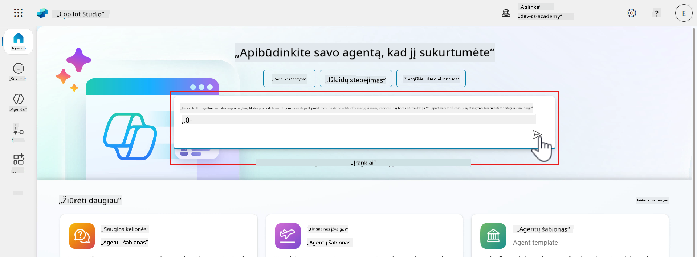

1. Toliau įkeliama Copilot pokalbių kūrimo patirtis. Matysite, kad Copilot vykdo atsakymo procesą.

      

1. Copilot patvirtina, kad agentas buvo sukurtas pagal pateiktas instrukcijas, ir prašo patvirtinti agento pavadinimą. Paprašysime Copilot pavadinti mūsų agentą taip:

       ```text
       Contoso Helpdesk Agent
       ```

      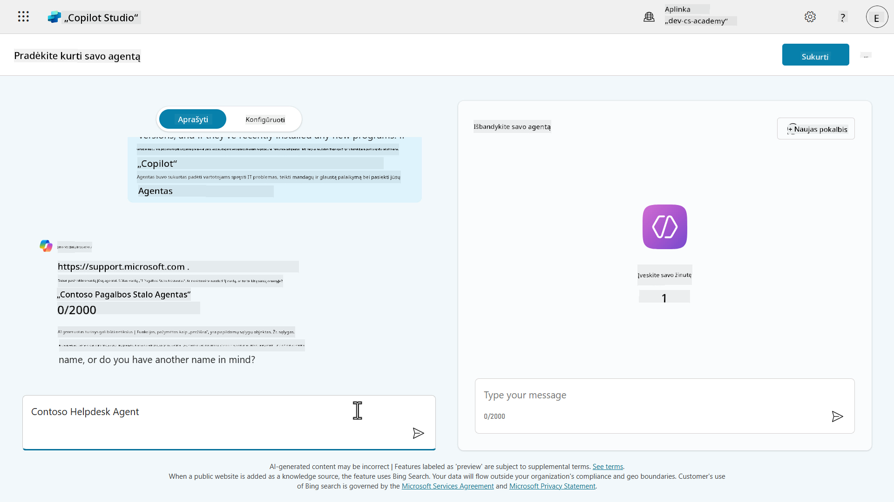

1. Copilot vykdo užklausą ir matysime, kad agento pavadinimas buvo atnaujintas agento skydelyje. Toliau Copilot prašo patikslinti instrukcijas. Jis klausia, kaip turėtume reaguoti į tam tikras problemas, ir paprašysime, kad jis pripažintų problemą, pateiktų pavyzdžių temoms atsakyti ir formatuotų atsakymą kaip sąrašą su ženkleliais.

    Nukopijuokite ir įklijuokite šią užklausą, tada pateikite ją Copilot.

       ```text
       Prioritetą teikite skubiems prašymams. IT problemų ar scenarijų, kuriems padėti, pavyzdžiai: įrenginių problemos, tinklo ryšio problemos, prisijungimo problemos. Trikčių šalinimo metu pirmiausia pripažinkite jų problemą ir atsakykite su empatija, tada pateikite žingsnis po žingsnio instrukcijas naudodami sąrašą su ženkleliais ir paklauskite, ar jiems reikia papildomos pagalbos.
       ```

      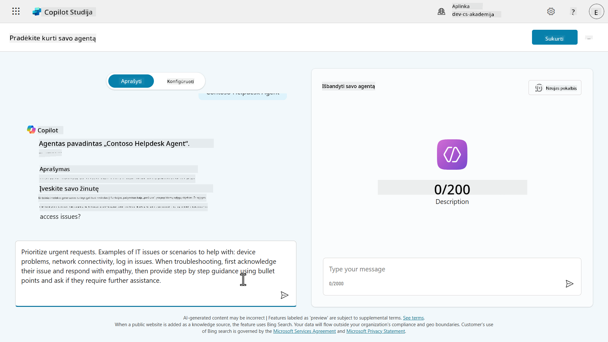

1. Agentas atnaujins instrukcijas po to, kai Copilot gaus užklausą. Atkreipkite dėmesį, kaip dešinėje pusėje atsirado pradinės užklausos. Jos buvo suformuotos remiantis mūsų instrukcijomis.

    Toliau Copilot prašo viešų svetainių, kad pagrįstų agento žinias.

    Nukopijuokite ir įklijuokite šią užklausą, tada pateikite ją Copilot.

      ```text
      https://support.microsoft.com
      ```

      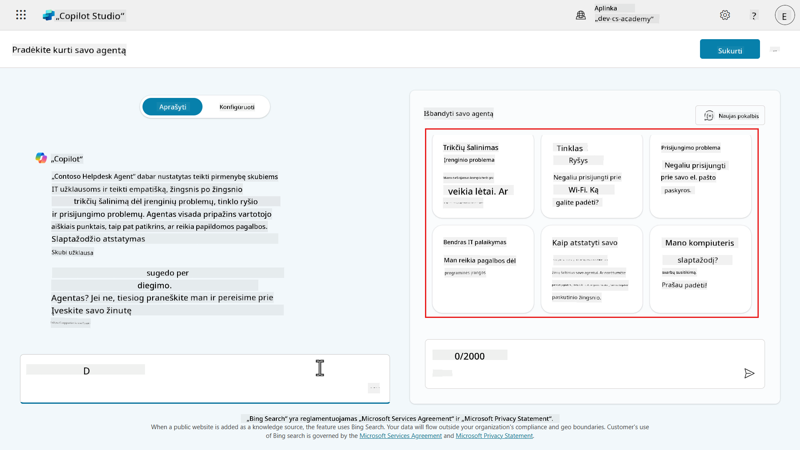

1. Vieša svetainė bus pridėta kaip žinių šaltinis. Copilot klausia, ar reikia pridėti papildomų žinių šaltinių. Papildomų viešų svetainių pridėti nereikia.

    Nukopijuokite ir įklijuokite šią užklausą, tada pateikite ją Copilot.

      ```text
      Proceed with setup
      ```

      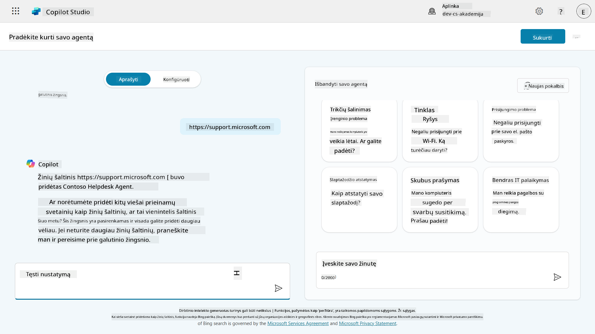

1. Copilot patvirtina, kad mūsų Contoso Helpdesk Agent nustatymas baigtas, tačiau pridėsime dar vieną pakeitimą – paprašysime, kad mūsų agentas neatsakinėtų į klausimus, susijusius su personalo klausimais. Tai leidžia mūsų agentui žinoti, kad jis neturėtų atsakyti į vartotojų užduodamus klausimus, susijusius su personalo klausimais.

    Nukopijuokite ir įklijuokite šią užklausą, tada pateikite ją Copilot.

       ```text
       Nesuteikite pagalbos klausimams, susijusiems su personalo klausimais, pavyzdžiai: Koks mano atostogų likutis? Kiek turiu nedarbingumo dienų? Koks yra mūsų atlyginimų portalo URL?
       ```

      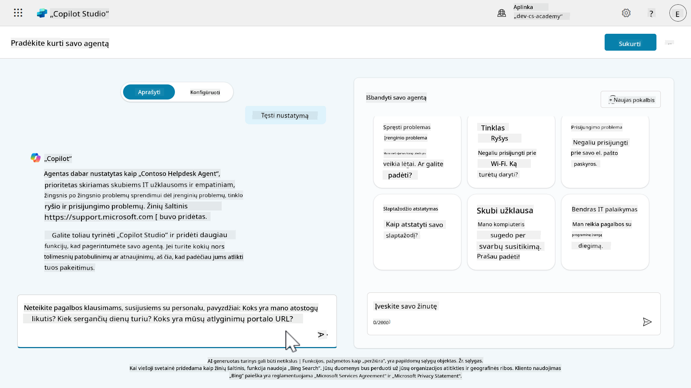

1. Instrukcijos bus atnaujintos, kad nebūtų teikiama pagalba klausimams, susijusiems su personalo klausimais. Daugiau atnaujinimų daryti nereikia, mūsų agentas yra pasiruošęs būti sukurtas.

      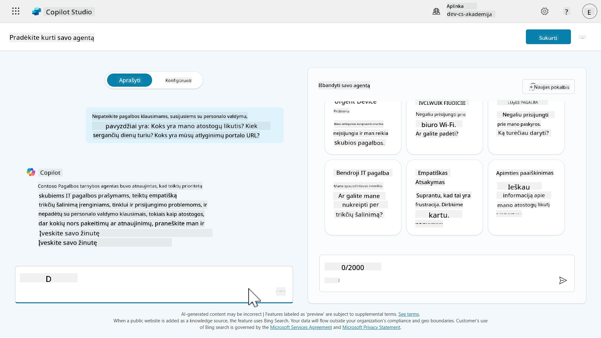

1. Prieš sukurdami agentą, atlikime kelis dalykus.

    Pirmiausia pasirinkite **Konfigūruoti** skirtuką, kad peržiūrėtumėte agento detales, apibrėžtas mūsų pokalbyje su Copilot. Čia matysite pavadinimą, aprašymą, instrukcijas, žinias ir siūlomas/pradines užklausas.

      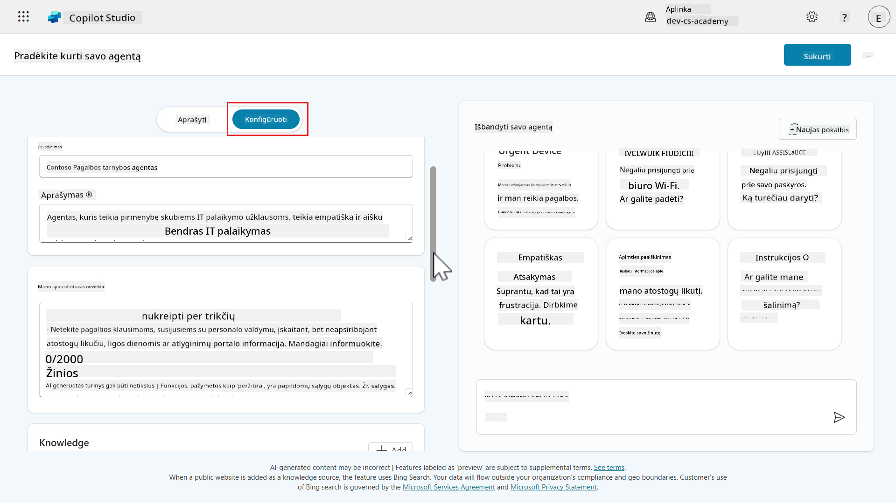

1. Antra, išbandykime mūsų agentą. Nukopijuokite ir įklijuokite šią užklausą, tada pateikite klausimą mūsų agentui.

       ```text
       Kaip galiu patikrinti savo Surface garantijos būseną?
       ```

      

1. Klausimo atsakymas bus rodomas, kur atsakymai pateikiami žingsnis po žingsnio vadovo formatu, naudojant sąrašą su ženkleliais. Puiku, mūsų agentas veikia! 🙌🏻

      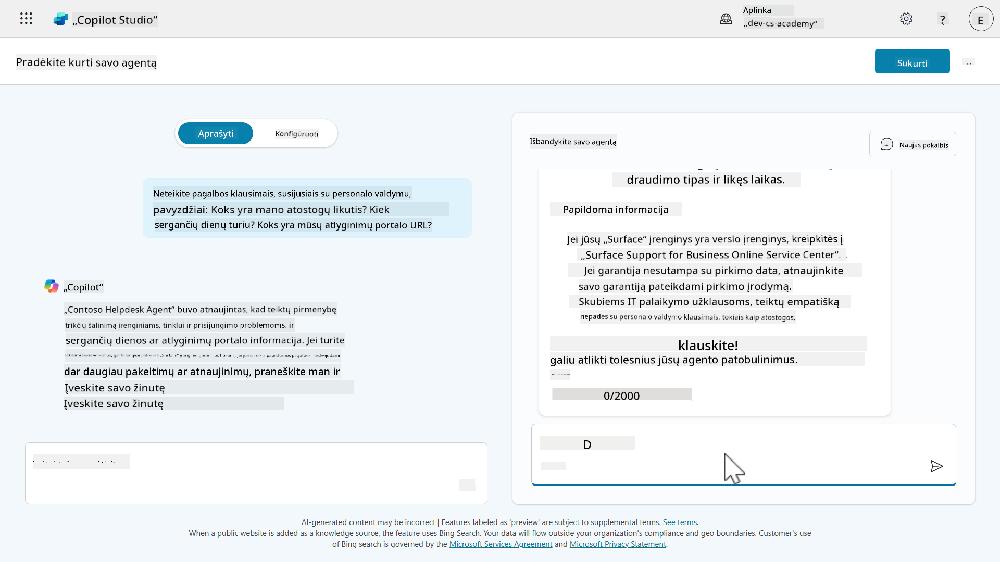

1. Galiausiai dar kartą patikrinkime, ar sprendimas, kuriame bus sukurtas mūsų agentas, yra tas sprendimas, kurį sukūrėme ir pasirinkome kaip pageidaujamą sprendimą [Pamoka 04 - Sukurkite naują sprendimą](../04-creating-a-solution/README.md#42-create-a-new-solution).

    Pasirinkite **trijų taškų piktogramą (...)** ir pasirinkite **Atnaujinti išplėstinius nustatymus**.

      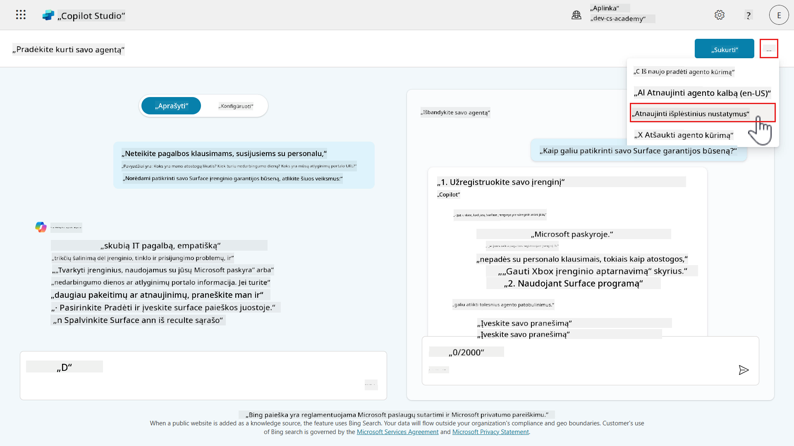

1. Atsiras **Išplėstinių nustatymų** modalas, ir matysime, kad mūsų anksčiau sukurtas sprendimas yra pasirinktas pagal numatytąjį. Taip yra dėl to, kad pasirinkome savo sprendimą kaip pageidaujamą sprendimą [Pamoka 04 - Sukurkite naują sprendimą](../04-creating-a-solution/README.md#42-create-a-new-solution).

    Pasirinkite **Atšaukti.**

      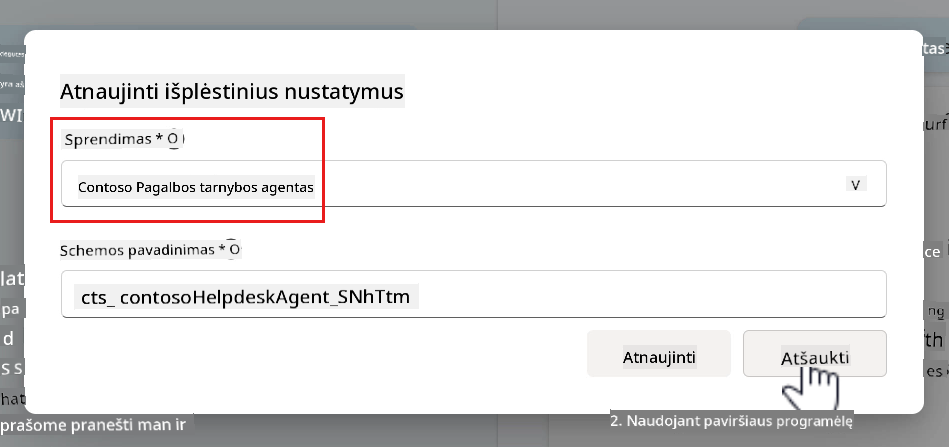

1. Dabar sukurkime mūsų pasirinktą agentą! Pasirinkite **Sukurti**.

      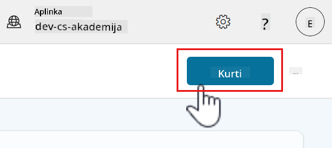

1. Copilot Studio pradės kurti mūsų agentą.

      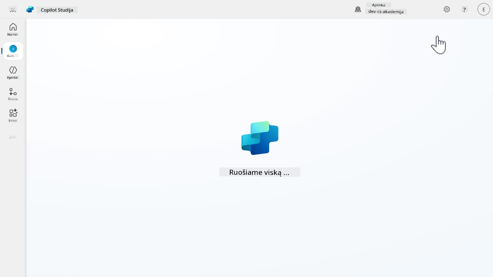

1. Kai mūsų agentas bus sukurtas, galėsime peržiūrėti agento detales, kurios atitinka mūsų prašymus pokalbių kūrimo patirtyje su Copilot. Slinkite žemyn, kad peržiūrėtumėte agentą, kur matysite pavadinimą, aprašymą, instrukcijas, žinių šaltinius ir siūlomas užklausas. Orkestravimo režimas yra įjungtas pagal numatytąjį, o atsakymų modelio numatytasis modelis yra naudojamas.

      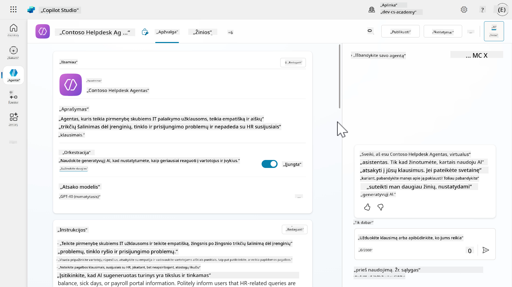

      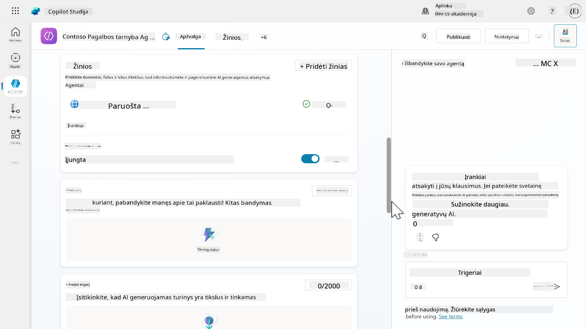

      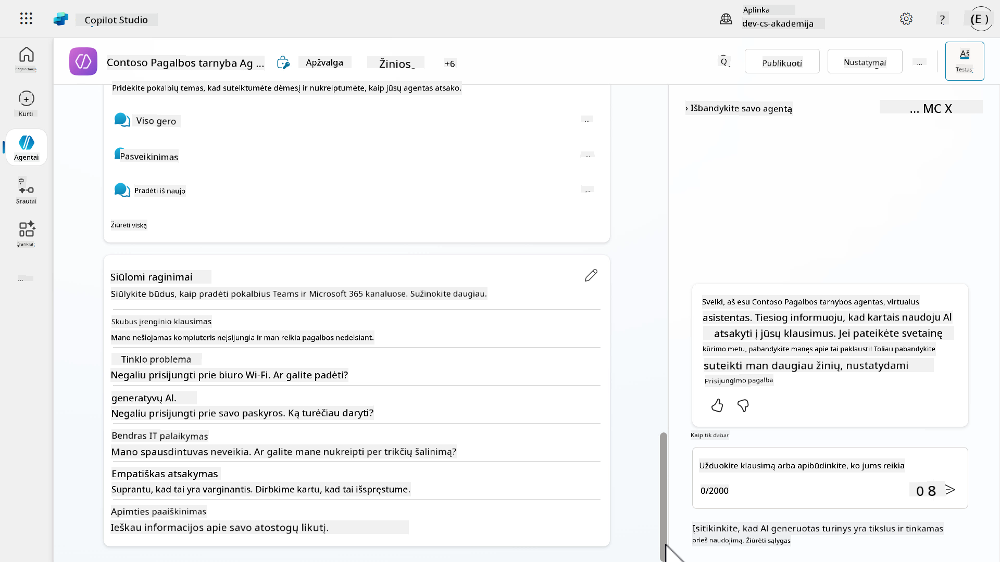

1. Dabar išbandykime naujai sukurtą agentą. Dešinėje pusėje esančiame **Testavimo** skydelyje pasirinkite **Veiklos žemėlapio** piktogramą.

      

1. Įveskite šį klausimą į **Testavimo** skydelį.

       ```text
       Kaip rasti savo Windows 11 produkto raktą?
       ```

      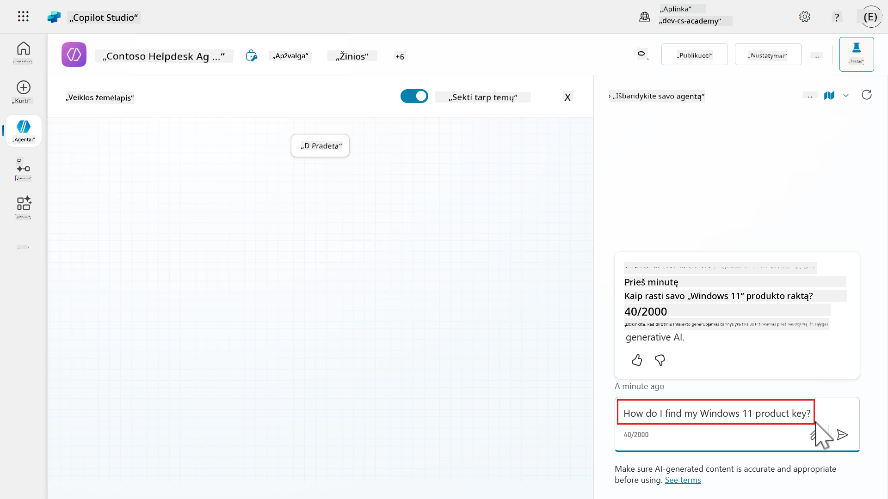

1. Tada įkels Veiklos žemėlapį, kuris realiu laiku parodys, kokį kelią agentas apdoroja. Šiuo atveju mūsų agentas suprato klausimą ir ieško žinių šaltinių. Šiuo metu turime vieną šaltinį – viešą svetainę, kurią anksčiau pridėjome naudodami Copilot, ir būtent ją agentas peržiūri.

      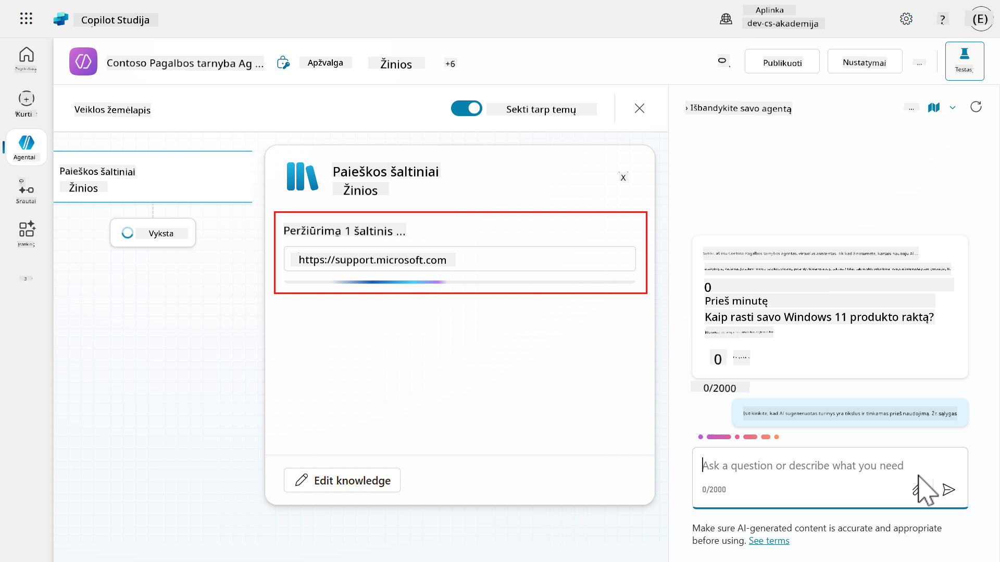

1. Mūsų agentas tada atsako į klausimus, pateikdamas atsakymus, kurie yra išdėstyti kaip sąrašas su ženkleliais, kaip nurodyta instrukcijose. Atsakyme yra nuorodų į tinklalapius, iš kurių agentas suformavo savo atsakymą. Tai leidžia vartotojams patikrinti atsakymo šaltinį.

      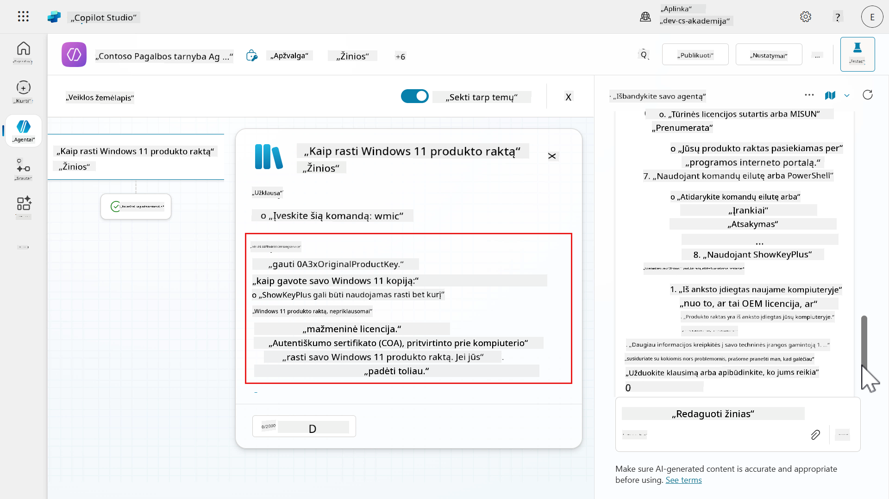

1. Taip pat galite peržiūrėti atsakymą ir jo šaltinius, slinkdami žemyn **Žinių modalą** Veiklos žemėlapyje.

      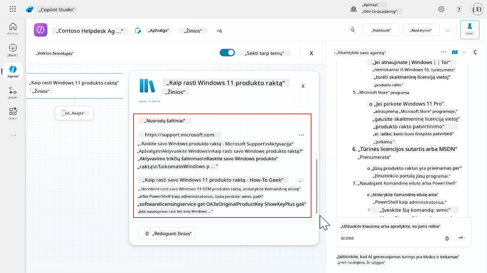

Sveikiname! Jūs sukūrėte savo pirmąjį pasirinktą agentą su Copilot Copilot Studio 🙌🏻

### 6.2 Pridėkite vidinį žinių šaltinį naudodami SharePoint svetainę

Anksčiau su Copilot pridėjome viešą svetainę kaip išorinį žinių šaltinį mūsų agentui pokalbių kūrimo patirties metu. Dabar pridėsime vidinį žinių šaltinį, naudodami SharePoint svetainę. Tai bus SharePoint svetainė, kurią sukūrėte [Pamoka 00 - Kurso nustatymas](../00-course-setup/README.md#step-4-create-new-sharepoint-site) metu.

1. Pasirinkite **+ Pridėti žinias**.

      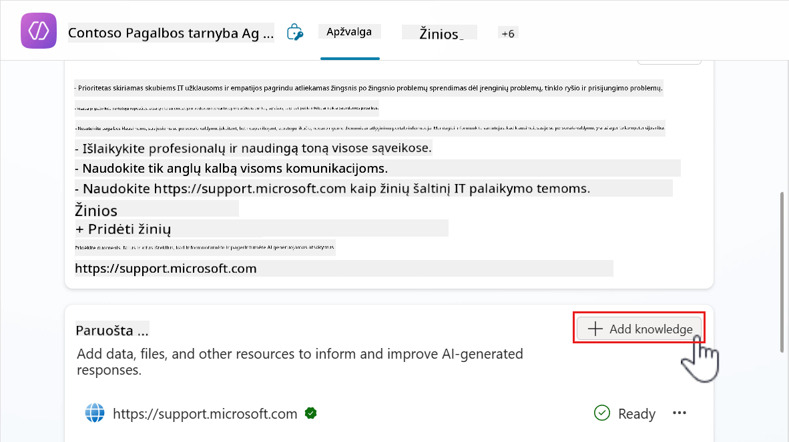

1. Pasirinkite **SharePoint**.

      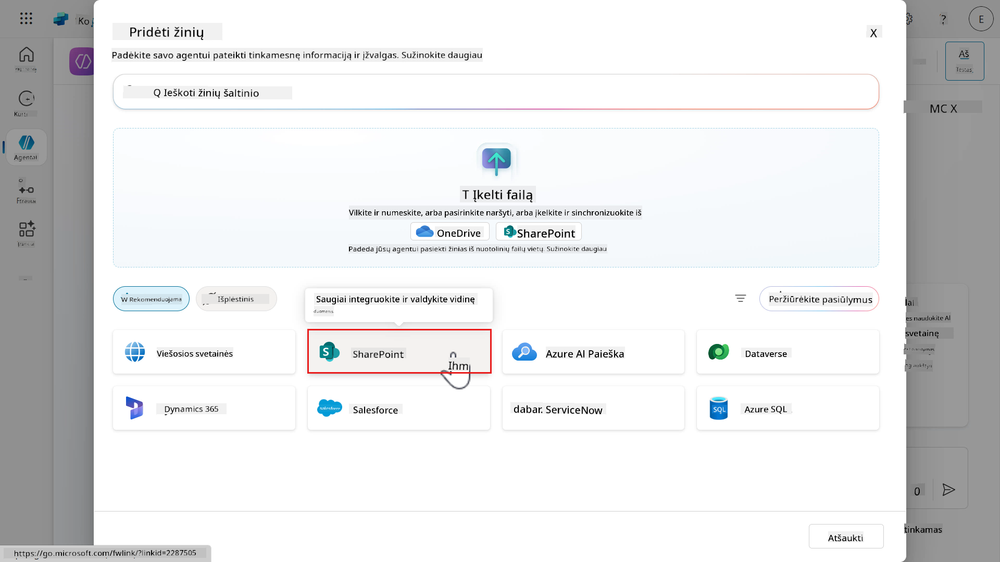

1. Įklijuokite **SharePoint svetainės adresą**, sukurtą [Pamoka 00 - Kurso nustatymas](../00-course-setup/README.md#step-4-create-new-sharepoint-site), į SharePoint URL lauką ir pasirinkite **Pridėti**.

      

1. Atnaujinkite **SharePoint svetainės pavadinimą** į `Contoso IT` ir pasirinkite **Pridėti**.

      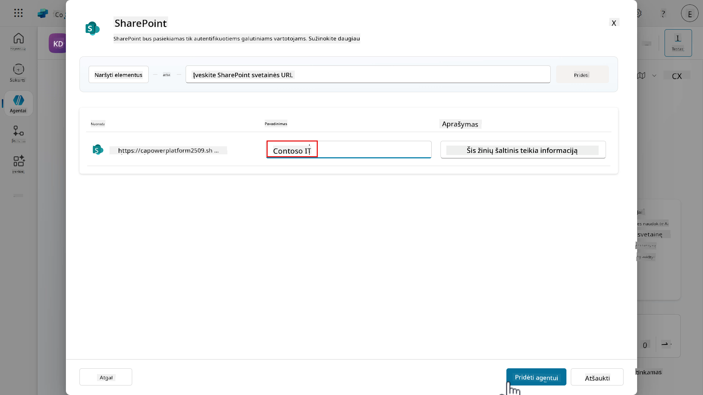

1. SharePoint svetainė dabar buvo pridėta kaip žinių šaltinis su būsena _Paruošta_. Stulpelyje Būsena bus rodoma, ar žinių šaltinis buvo sėkmingai įkeltas/prijungtas, ar yra problema.

      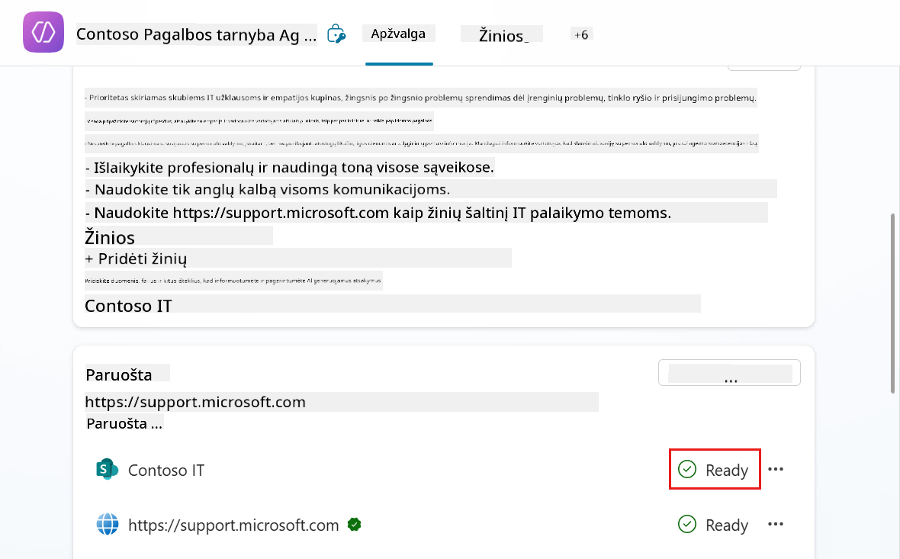

### 6.3 Pridėkite vidinį žinių šaltinį įkeldami dokumentą

Dabar pridėsime dar vieną vidinį žinių šaltinį, tiesiogiai įkeldami dokumentą į mūsų agentą.

1. Pasirinkite **Pridėti žinias**.

      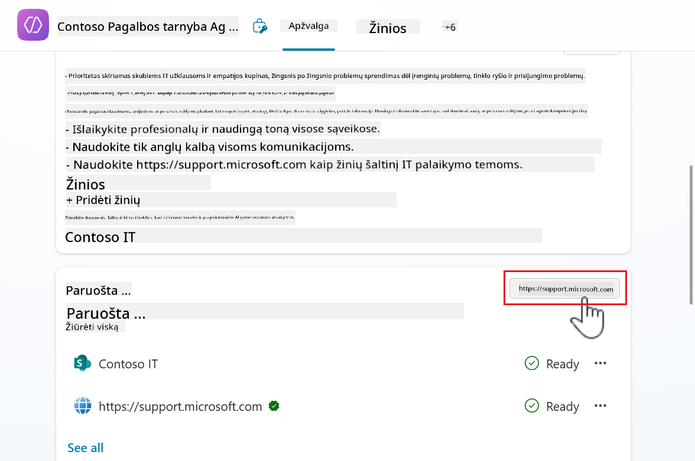

1. Pasirinkite **Įkelti failą** arba **Pasirinkti naršymui**.

      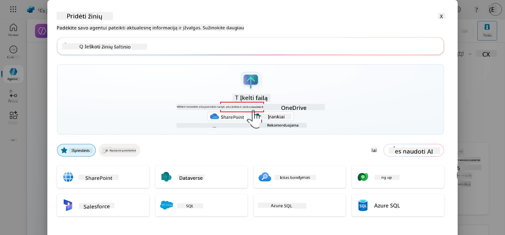

1. Atsisiųskite šį [pavyzdinį failą](../../../../../docs/recruit/06-create-agent-from-conversation/assets/Contoso_Guest_WiFi_Connection_Guide.docx "download") ir pasirinkite jį savo failų naršyklėje. Pasirinkite **Atidaryti**.

      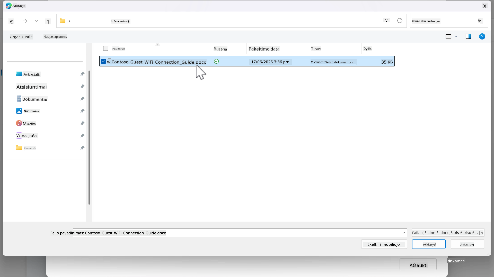

1. Failas buvo pasirinktas įkėlimui. Toliau pasirinkite **Pridėti prie agento**.

      

1. Dokumentas bus įkeltas į agentą. Palaukite, kol įkėlimas bus baigtas, neuždarykite naršyklės lango. Dokumento būsena iš pradžių bus _Vykdoma_, palaukite, kol būsena bus atnaujinta į **Paruošta**, prieš testuodami savo agentą.

      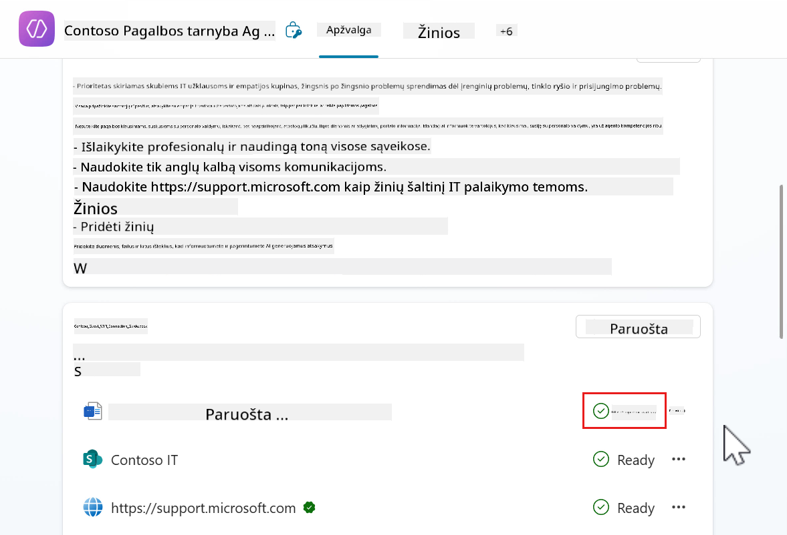

Dabar išbandykime mūsų agentą!

### 6.4 Testuokite agentą

Išbandysime tris žinių šaltinius, užduodami klausimus mūsų Contoso Helpdesk Agent.

1. Pasirinkite **atnaujinimo** piktogramą testavimo skydelyje, po to pasirinkite **veiklos žemėlapio** piktogramą.

      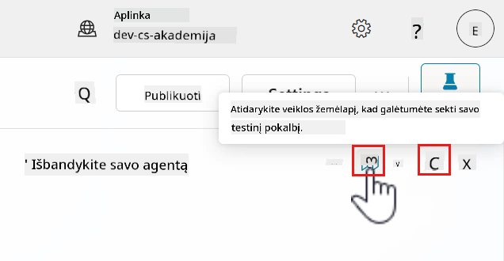

1. Įveskite šį klausimą, kad išbandytumėte mūsų viešos svetainės (išorinio) žinių šaltinį.

      ```text
      How can I find the serial number on my Surface device?
      ```

      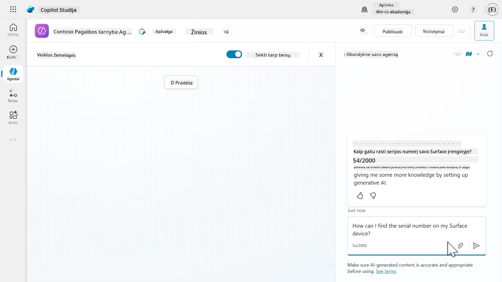

1. Tada matysite, kaip agentas peržiūri žinių šaltinius ir pateikia atsakymą, naudodamasis svetainės žinių šaltiniu.
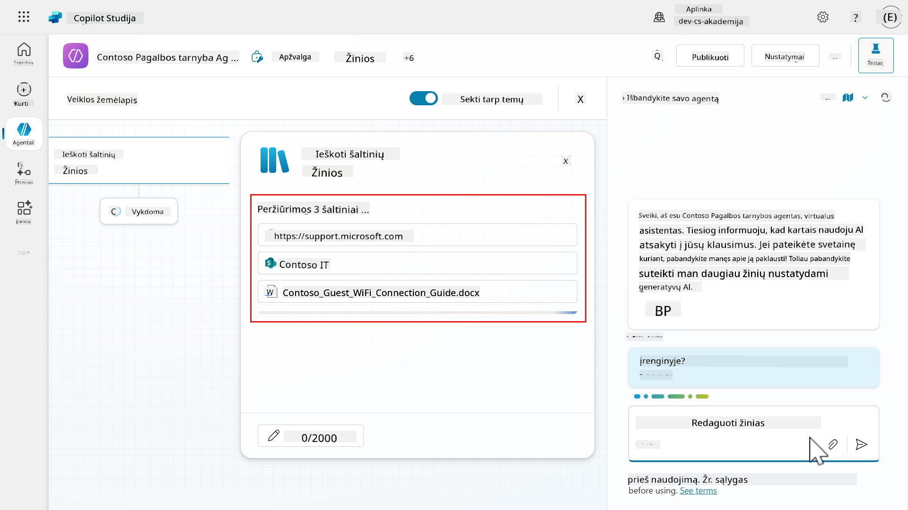

1. Atsakymas bus pateiktas, ir pastebėsite, kad yra nuorodų į interneto puslapį, iš kurio buvo suformuotas atsakymas. Jei slinksite žemyn žinių modalą veiklos žemėlapyje, pamatysite kitus žinių šaltinius, kuriuos agentas peržiūrėjo, tai yra SharePoint svetainė ir įkeltas failas.

    Tačiau jie nebuvo panaudoti, nes **Nuorodų šaltinių** skiltyje buvo nurodytas tik interneto svetainės žinių šaltinis. Atsakymas buvo pagrįstas interneto svetainės žinių šaltiniu. Jei pasirinksite nuorodas, būsite nukreipti į interneto puslapį.

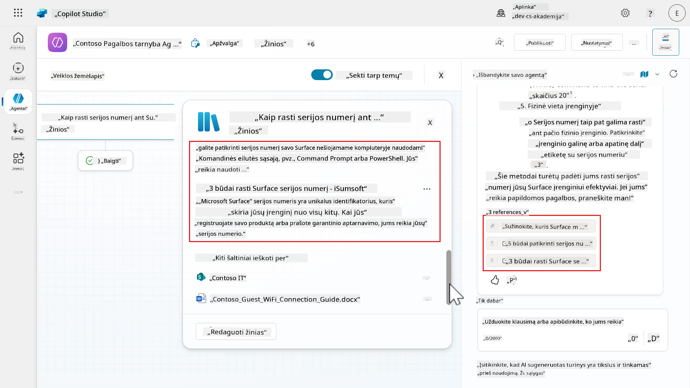

1. Dabar išbandykime tiek mūsų SharePoint svetainės žinių šaltinį, tiek dokumento žinių šaltinį viename pranešime. Įveskite šį klausimą.

      ```text
      How can I access our company Contoso VPN? How do guests connect to the Contoso Guest wifi?
      ```

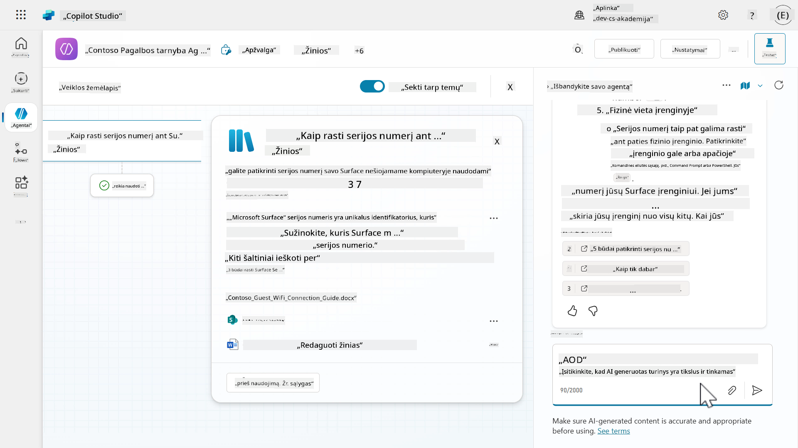

1. Dar kartą pamatysite, kaip agentas peržiūri tris žinių šaltinius, kad sugeneruotų atsakymą į klausimus iš mūsų vieno pranešimo. Agentas atsako į abu klausimus viename pranešime ir atskirai nurodo SharePoint puslapį bei dokumentą, iš kurio buvo suformuotas atsakymas.

    Žinių modaliniame lange veiklos žemėlapyje pamatysite, kad SharePoint svetainė ir dokumentas buvo naudojami kaip nuorodų šaltiniai. Jūs turite pilną matomumą, kokie žinių šaltiniai buvo panaudoti atsakant į abu klausimus.

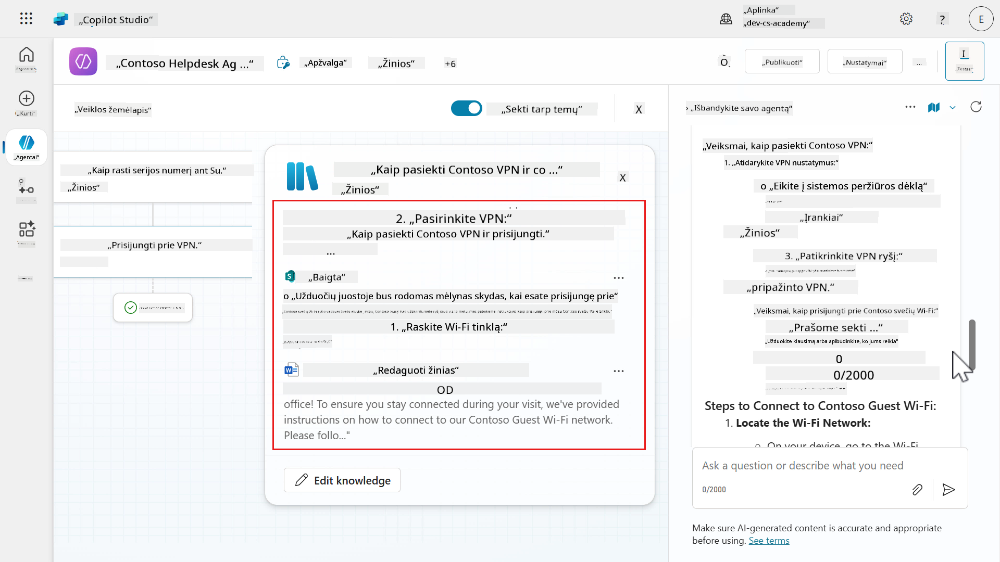

1. Visada verta patikrinti, ar sugeneruotas atsakymas yra teisingas. Pasirinkite SharePoint svetainės nuorodą, ir bus įkeltas SharePoint puslapis su DUK, kur galėsite slinkti žemyn ir peržiūrėti VPN instrukcijas.

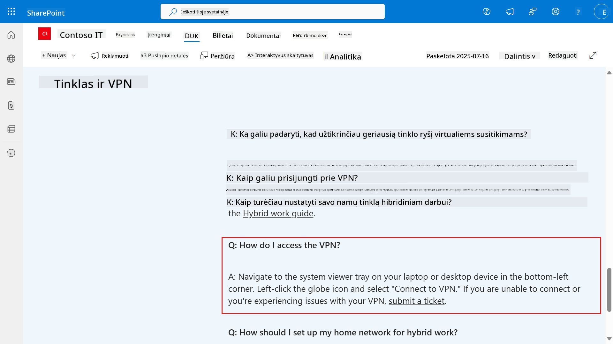

1. Tada pasirinkite dokumento nuorodą, ir pasirodys modalinis langas su tekstu iš dokumento, kuris atspindi atsakymą.

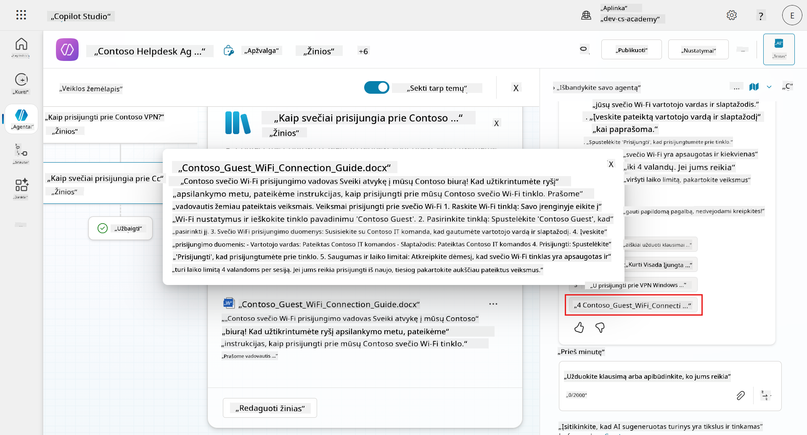

Agentas gali atsakyti į kelis klausimus viename pranešime, peržiūrėti žinių šaltinius ir nurodyti juos savo atsakyme. Visada įsitikinkite, kad atsakymas yra teisingas, peržiūrėdami nuorodas.

## ✅ Misija įvykdyta

Sveikiname! 👏🏻 Jūs išmokote naudoti natūralią kalbą, kad sukurtumėte savo individualų agentą, kuris gali bendrauti su jūsų duomenimis iš trijų skirtingų žinių šaltinių 🙌🏻

Tai yra **Laboratorijos 06 - Sukurkite agentą su Copilot** pabaiga, pasirinkite žemiau esančią nuorodą, kad pereitumėte į kitą pamoką. Jūsų sukurtas agentas šioje laboratorijoje bus naudojamas kitos pamokos laboratorijoje.

⏭️ [Pereiti į pamoką **Pridėti naują temą su trigeriu**](../07-add-new-topic-with-trigger/README.md)

Sveiki atvykę į elitą. Dabar jūs žinote, kaip kurti skaitmeninius agentus, kurie kalba jūsų kalba, remiasi jūsų duomenimis ir palaiko jūsų komandą. Tęskite—jūsų misija tik prasideda.

## 📚 Taktiniai ištekliai

🔗 [Greitas startas: Sukurkite ir įdiekite agentą](https://learn.microsoft.com/microsoft-copilot-studio/fundamentals-get-started?context=%2Fmicrosoft-365-copilot%2Fextensibility%2Fcontext/?WT.mc_id=power-172617-ebenitez)

🔗 [Sukurti ir ištrinti agentus](https://learn.microsoft.com/microsoft-copilot-studio/authoring-first-bot?WT.mc_id=power-172617-ebenitez)

🔗 [Pagrindinės sąvokos - Agentų kūrimas](https://learn.microsoft.com/microsoft-copilot-studio/authoring-fundamentals/?WT.mc_id=power-172617-ebenitez)

📺 [Sukurkite individualų agentą naudodami natūralią kalbą](https://aka.ms/ai-in-action/copilot-studio/ep1)

📺 [Pridėkite žinių savo agentams](https://aka.ms/ai-in-action/copilot-studio/ep2)


---

**Atsakomybės apribojimas**:  
Šis dokumentas buvo išverstas naudojant AI vertimo paslaugą [Co-op Translator](https://github.com/Azure/co-op-translator). Nors siekiame tikslumo, prašome atkreipti dėmesį, kad automatiniai vertimai gali turėti klaidų ar netikslumų. Originalus dokumentas jo gimtąja kalba turėtų būti laikomas autoritetingu šaltiniu. Dėl svarbios informacijos rekomenduojama profesionali žmogaus vertimo paslauga. Mes neprisiimame atsakomybės už nesusipratimus ar neteisingus aiškinimus, atsiradusius naudojant šį vertimą.