<!--
CO_OP_TRANSLATOR_METADATA:
{
  "original_hash": "c04b3587170139bc23e3b5cfc24c89ac",
  "translation_date": "2025-10-22T00:56:58+00:00",
  "source_file": "docs/recruit/07-add-new-topic-with-trigger/README.md",
  "language_code": "lt"
}
-->
# 🚨 Misija 07: Pridėti naują temą su trigeriu ir mazgais

## 🕵️‍♂️ SLAPTAŽODIS: `OPERACIJA IŠLIK TEMATIŠKAS`

> **⏱️ Operacijos laiko langas:** `~60 minučių`

🎥 **Žiūrėkite vaizdo įrašą**

[](https://www.youtube.com/watch?v=7iPAZaA8nJs "Žiūrėkite vaizdo įrašą „YouTube“")

## 🎯 Misijos aprašymas

Jūs sukūrėte agentą. Jis klausosi, mokosi ir atsako į klausimus - bet dabar laikas veikti strategiškai. Šioje misijoje gilinsitės į detales ir mokysite savo agentą tiksliai reaguoti į specifinius užklausimus.

Naudodami temas ir trigerius, jūsų agentas gali:

- Atpažinti ketinimą

- Nukreipti pokalbius logiškai

- Surinkti ir saugoti kintamuosius

- Aktyvuoti srautus ir imtis veiksmų

Jūs ne tik kuriate dialogą, bet ir jungiate jo sprendimų priėmimo centrą. Sveiki atvykę į Neuronų Nexus.

## 🔎 Tikslai

Šioje misijoje išmoksite:

1. Suprasti, kas yra temos ir jų vaidmenį kuriant struktūruotus pokalbius jūsų agentui
1. Išmokti temų anatomiją, įskaitant trigerio frazes ir pokalbio mazgus
1. Tyrinėti skirtingus pokalbio mazgų tipus ir kaip naudoti Power Fx dinaminei logikai
1. Kurti individualias temas nuo nulio, kad galėtumėte spręsti specifinius vartotojų prašymus ir užduotis
1. Sukurti funkcionalią temą, kuri jungiasi prie SharePoint duomenų naudojant jungtis ir įrankius

## 🤔 Kas yra tema?

Tema yra struktūruotas pokalbis, padedantis jūsų agentui reaguoti į specifinius vartotojo klausimus ar užduotis. Galvokite apie temą kaip apie mini pokalbį ar užduotį, kurią jūsų agentas gali atlikti. Kiekviena tema sukurta tam, kad atsakytų į konkretų vartotojo klausimą ar prašymą.

### 🌌 Temos paskirtis

Yra trys dažniausios temų paskirtys, atsižvelgiant į vartotojų poreikius:

**Informacinė** - atsako į tokius klausimus kaip:

- `Kas yra …?`
- `Kada bus …?`
- `Kodėl …?`
- `Ar galite man pasakyti …?`

**Užduoties atlikimas** - padeda vartotojams _kažką padaryti_:

- `"Aš noriu …"`
- `"Kaip man …?"`
- `"Man reikia …?"`

**Problemos sprendimas** - sprendžia problemas:

- `Kažkas neveikia …`
- `Aš susiduriu su klaidos pranešimu …`
- `Matau kažką netikėto …?`

Taip pat galite sukurti temas neaiškiems klausimams, pvz., `Man reikia pagalbos`, kurie prašo vartotojų pateikti daugiau detalių prieš tęsiant.

## 🐦 Kodėl temos naudingos?

Temos padeda jums:

- Organizuoti agento žinias.

- Padaryti pokalbius natūralius.

- Efektyviai spręsti vartotojų problemas.

## 🪺 Temų tipai

1. **Sisteminės temos** - jos yra įdiegtos ir tvarko bendrus įvykius, tokius kaip:
    - Pokalbio pradžia
    - Pokalbio pabaiga
    - Klaidos tvarkymas
    - Prašymas vartotojams prisijungti
    - Perkėlimas pas žmogų-agentą

1. **Individualios temos** - jas kuriate, kad tvarkytumėte specifines užduotis ar klausimus, tokius kaip:
    - Darbuotojo atostogų prašymas
    - Naujo ar pakaitinio įrenginio prašymas

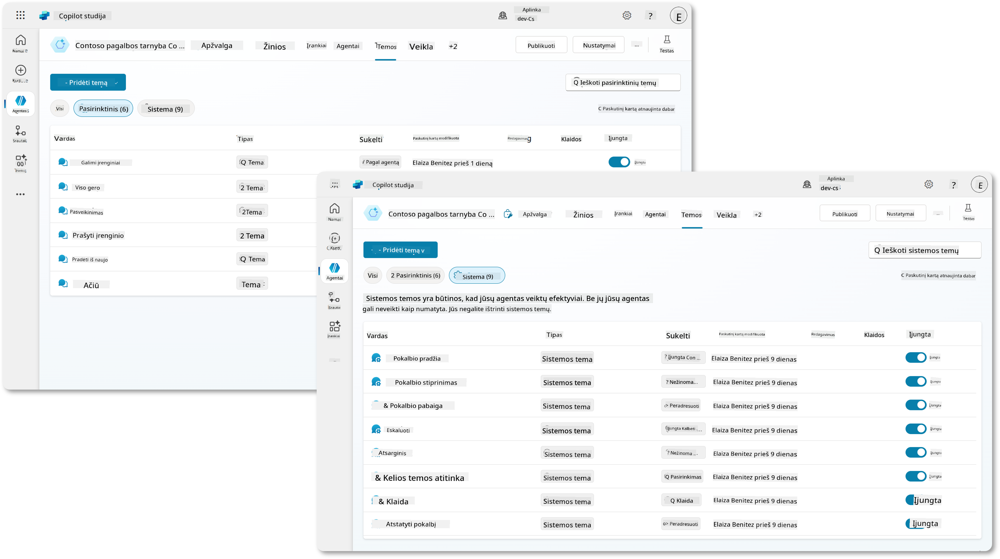

## 🧬 Temos anatomija

Kiekviena tema paprastai susideda iš šių elementų.

### 🗣️ Trigerio frazės

Tai žodžiai ar sakiniai, kuriuos vartotojai gali pasakyti, kad pradėtų temą.

**Pavyzdžiai:**

Atostogų prašymo temai trigerio frazės galėtų būti:

- `Noriu pasiimti atostogas`
- `Prašyti atostogų`
- `Pateikti prašymą dėl atostogų`
- `Kaip pateikti atostogų prašymą?`

Įrenginio prašymo temai trigerio frazės galėtų būti:

- `Man reikia naujo įrenginio`
- `Ar galiu prašyti įrenginio?`
- `Ar galite man padėti su įrenginio prašymu`

### 💬 Pokalbio mazgai

Tema susideda iš mazgų, kurie yra žingsniai, kuriuos agentas seka, kai tema aktyvuojama. Jūs jungiate šiuos žingsnius, kad sukurtumėte pokalbio srautą, kurį agentas seka bendraudamas su vartotojais.

Galvokite apie juos kaip apie instrukcijas ar veiksmus, tokius kaip:

- Vartotojo klausimų uždavimas
- Žinučių siuntimas
- Išorinių paslaugų, pvz., atostogų valdymo sistemos, kvietimas
- Kintamųjų nustatymas ar tikrinimas
- Sąlygų naudojimas pokalbio šakoms
- Nukreipimas į kitą temą

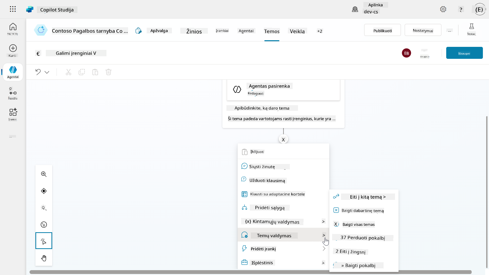

Toliau pateikiami pagrindiniai mazgų tipai, kuriuos galite pridėti prie agento:

#### Siųsti žinutę

- **Paskirtis** - siunčia žinutę vartotojui.
- **Pavyzdys** - `Ačiū už jūsų prašymą! Aš jums padėsiu.`

Šis mazgas leidžia jūsų agentui siųsti žinutes vartotojams, kurios gali būti paprastas tekstas arba turtingas turinys, pvz., vaizdai, vaizdo įrašai, kortelės, greiti atsakymai ir adaptacinės kortelės.

Galite suasmeninti žinutes naudodami kintamuosius, pridėti kelias žinučių variacijas dėl įvairovės ir netgi pritaikyti kalbos išvestį balso kanalams.

!!! tip
    Galvokite apie tai kaip apie "pasakyk kažką" bloką, kuris padeda jūsų agentui aiškiai ir interaktyviai bendrauti su vartotojais.

#### Užduoti klausimą

- **Paskirtis** - užduoda vartotojui klausimą ir laukia jo atsakymo.
- **Pavyzdys** - `Kokios jūsų atostogų datos?`

Šis mazgas naudojamas užduoti vartotojams specifinę informaciją pokalbio metu ir saugoti jų atsakymus kintamuosiuose, kad būtų galima naudoti vėliau.

Galite pritaikyti klausimo tipą, pvz., teksto įvestį, arba naudoti entitetus, kad vartotojas pasirinktų iš apibrėžto vertybių sąrašo, ir nustatyti, kaip agentas turėtų elgtis, jei vartotojas pateikia neteisingą atsakymą arba praleidžia klausimą.

Jis taip pat palaiko turtingą turinį, pvz., vaizdus ir greitus atsakymus, ir leidžia jums smulkiai reguliuoti validaciją, pakartotinį klausimą ir pertraukimo nustatymus, kad pokalbis vyktų sklandžiai.

!!! tip
    Galvokite apie tai kaip apie "klausk ir klausyk" bloką, kuris padeda jūsų agentui struktūruotai bendrauti su vartotojais pagal jūsų apibrėžimą.

#### Užduoti klausimą su adaptacine kortele

- **Paskirtis** - siųsti turtingą, interaktyvią kortelę naudojant JSON.
- **Pavyzdys** - kortelė, rodanti kalendoriaus datų pasirinkimo įrankį, kad vartotojas galėtų pasirinkti datą.

Šis mazgas rodo turtingas, interaktyvias korteles, kurias vartotojai gali užpildyti ir pateikti, pvz., formas su teksto laukeliais, mygtukais ir vaizdais. Jis užfiksuoja vartotojo įvestį ir saugo ją kintamuosiuose, kuriuos jūsų agentas gali naudoti vėliau pokalbyje.

!!! tip
    Galvokite apie tai kaip apie pritaikomą "formos kūrimo" bloką, kuris padaro jūsų agentą labiau įtraukiantį ir gebantį surinkti detalią informaciją iš vartotojų.

#### Pridėti sąlygą

- **Paskirtis** - pridėti logiką pokalbiui. Jis kažką patikrina ir nusprendžia, ką daryti toliau.
- **Pavyzdys** - jei vartotojas sako `Taip`, pereikite prie kito žingsnio. Jei `Ne`, užbaikite pokalbį.

Šis mazgas sukuria sprendimo taškus jūsų agento pokalbio sraute, tikrindamas, ar kintamasis atitinka tam tikrus kriterijus. Remiantis tuo, ar sąlyga yra teisinga, ar klaidinga, agentas seka skirtingais keliais.

!!! tip
    Galvokite apie tai kaip apie "jei-else" bloką, kuris padeda jūsų agentui priimti sprendimus, priklausomai nuo vartotojo įvesties ar saugomų duomenų kintamuosiuose.

#### Kintamųjų valdymas

- **Paskirtis** - saugo arba išvalo informaciją (vadinamą kintamaisiais) pokalbio metu.
- **Pavyzdys** - išsaugo datą, kurią vartotojas pasirinko mazge "Užduoti klausimą", kuris rodo adaptacinę kortelę.

Šis mazgas leidžia saugoti ir valdyti informaciją pokalbio metu, tai gali būti vartotojo vardas, atsakymas ar pageidavimai. Galite naudoti skirtingus kintamųjų tipus, pvz., tekstą, skaičius ar datas, ir jie gali būti apriboti viena tema, dalijami tarp temų (globalūs) arba netgi paimti iš sistemos ar aplinkos.

!!! tip
    Galvokite apie tai kaip apie "atminties dėžutę", kuri padeda jūsų agentui prisiminti informaciją ir naudoti ją pokalbio metu.

#### Temos valdymas

- **Paskirtis** - perkelia pokalbį į kitą temą arba žingsnį toje pačioje temoje, perduoda pokalbį arba užbaigia temą ar pokalbį.
- **Pavyzdys** - nukreipti į "Atostogų politikos" temą.

Šis mazgas leidžia jūsų agentui pereiti iš vienos temos į kitą be pokalbio perkrovimo, užbaigti temą, perduoti arba užbaigti pokalbį, arba pereiti į kitą žingsnį toje pačioje temoje. Tai padeda vartotojams sklandžiai pereiti per skirtingas pokalbio srauto dalis, perduodant kintamuosius tarp jų, kad būtų išlaikytas kontekstas.

!!! tip
    Galvokite apie tai kaip apie "eik į kitą skyrių/žingsnį" bloką, kuris padeda jūsų agentui būti lankstus bendraujant su vartotojais.

#### Pridėti įrankį

- **Paskirtis** - jungiasi prie įrankių, tokių kaip jungtys, agento srautai, raginimai, individuali paieška, paieškos užklausa, įgūdžiai, modelio konteksto protokolas.
- **Pavyzdys** - Agentas vykdo srautą po to, kai vartotojas pateikia savo atostogų prašymą.

Šis mazgas suteikia jūsų agentui galimybę sąveikauti su išorinėmis sistemomis arba atlikti specifines užduotis, pvz., siųsti el. laiškus, tikrinti orus ar pasiekti duomenų bazes. Galite pridėti įrankius naudodami įdiegtas jungtis, individualias API, agento srautus, raginimus arba jungtis prie Modelio Konteksto Protokolo (MCP) serverių, ir netgi grafinės vartotojo sąsajos automatizavimą darbalaukio programoms per kompiuterio naudojimo įrankį.

!!! tip
    Galvokite apie įrankius kaip apie "veiksmo blokus", kurie suteikia jūsų agentui supergalių atlikti veiksmus už _pokalbio_ ribų, pvz., skambinti API, vykdyti procesą ar automatiškai rinkti vartotojo įvestį.

#### Generatyvaus atsakymo mazgas

- **Paskirtis** - naudoja didelį kalbos modelį, kad generuotų natūralius, žmogui panašius atsakymus, remdamasis vartotojo klausimu ir bet kokiais prijungtais duomenimis.
- **Pavyzdys** - naudoja prijungtą žinių šaltinį, kuriame yra informacija apie atostogų teisę, kad atsakytų į vartotojo klausimus apie atostogų prašymus.

Šis mazgas leidžia jūsų agentui atsakyti į vartotojo klausimus, naudodamas informaciją iš įvairių žinių šaltinių, pvz., svetainių, dokumentų, SharePoint ar individualių duomenų. Jis gali būti naudojamas kaip atsarginis variantas, kai nerandama atitinkama tema, arba temoje, kad pateiktų detalesnius, dinamiškus atsakymus, remdamasis specifiniais šaltiniais, kuriuos jūs sukonfigūravote savo agentui naudoti.

!!! tip
    Galvokite apie tai kaip apie "protingo atsakymo bloką", kuris padeda jūsų agentui pateikti naudingus, tikslius atsakymus, ieškant patikimo turinio, kurį jūs apibrėžiate.

#### HTTP užklausos mazgas

- **Paskirtis** - jungia jūsų agentą su išorinėmis sistemomis, siųsdamas API užklausas (pvz., `GET` arba `POST`), kad gautų arba atnaujintų duomenis.
- **Pavyzdys** - kai vartotojas klausia apie savo atostogų dienų likutį, agentas atlieka `GET` užklausą atostogų valdymo sistemai ir ištraukia `remainingLeaveDays` iš API atsakymo ir atsako vartotojui su šia verte.

Šis mazgas leidžia jūsų agentui jungtis prie išorinių sistemų, siųsdamas REST API užklausas, pvz., `GET` arba `POST`. Galite pritaikyti užklausą su antraštėmis, turiniu ir netgi naudoti Power Fx, kad įtrauktumėte dinamiškus duomenis, tada saugoti atsakymą kintamuosiuose, kad būtų galima naudoti vėliau pokalbyje.

!!! tip
    Galvokite apie tai kaip apie "pasiekti ir gauti informaciją" bloką, kuris padeda jūsų agentui bendrauti su kitomis paslaugomis, pvz., gauti vartotojo duomenis arba siųsti informaciją į kitą sistemą.

#### Siųsti įvykį

- **Paskirtis** - leidžia jūsų agentui siųsti ne žinutės veiksmus, pvz., sistemos atnaujinimus ar įrankių trigerius - klientui ar kanalui, padedant atlikti užduotis.
- **Pavyzdys** - reaguoti į vartotojo prisijungimą prie pokalbio, rodant pasveikinimo žinutę.

Šis mazgas leidžia jūsų agentui siųsti ne žinutės veiksmus į išorines sistemas ar kanalus, kurie tada nusprendžia, kaip reaguoti. Jūs suteikiate kiekvienam įvykiui pavadinimą ir pridedate vertę, kuri gali būti paprastas skaičius ar tekstas, kintamasis arba Power Fx formulė, ir jis siunčiamas kaip JSON objektas.

!!! tip
    Galvokite apie tai kaip apie "tylų trigerį" bloką, kuris padeda jūsų agentui atlikti veiksmus užkulisiuose arba bendrauti su išoriniais įrankiais, nereikalaujant vartotojo įvesties.

## 🏋🏻‍♀️ Power Fx naudojimas jūsų mazguose

Copilot Studio, Power Fx yra mažo kodo programavimo kalba, naudojama logikai ir dinamiškam
Tai leidžia jums aprašyti, ko norite, naudojant natūralią kalbą, o Copilot sukurs pokalbį už jus. Tas pats taikoma ir redaguojant temą – naudokite natūralią kalbą, o Copilot peržiūrės ir pakeis temą už jus.

#### Ką palaiko Copilot

- Gali kurti ir redaguoti:
      - Žinučių mazgus
      - Klausimų mazgus
      - Sąlygų mazgus
- Nepalaiko pažangių nustatymų, tokių kaip vartotojo pakartotinis klausimas, jei jis neatsako, arba kaip valdyti pertraukimus klausimo metu. Šiuos nustatymus vis dar galite koreguoti rankiniu būdu, jei reikia.

#### Kodėl tai naudinga

- Paspartina kūrimą naudojant AI pagalbą.
- Leidžia susitelkti į logiką ir vartotojo patirtį, o ne į pasikartojančius nustatymus.
- Palengvina pokalbių srautų tobulinimą ir iteraciją su minimaliomis pastangomis.

#### ✨ Pavyzdiniai raginimai

- **Sukurti temą**
      - `Priimti vartotojo vardą, amžių ir gimimo datą, tada pakartoti jų atsakymus`
      - `Surinkti vartotojo gatvės adresą, valstiją ir pašto kodą. Vartotojas turėtų turėti galimybę pakartoti kiekvieną klausimą iki 4 kartų`

- **Redaguoti temą**
      - `Pridėti klausimą, prašantį vartotojo gimimo datos`
      - `Apibendrinti surinktą informaciją naudojant Adaptive Card.`

## 👩🏻‍🎨 Gerai, kaip sukurti temas savo agentui?

### 🧙🏻‍♂️ 1 žingsnis - suprasti, ko reikia vartotojams

Pradėkite identifikuodami dažniausiai užduodamus klausimus ar užduotis, kurias vartotojai pateiks jūsų agentui. Tai gali būti:

- Dažnai užduodami klausimai, tokie kaip: `kokios mano teisės į nedarbingumo dienas?`
- Dažnos užduotys, kurias vartotojai nori atlikti, pvz., pateikti formą
- Problemų sprendimas, pvz., prisijungimo problemos

### 📦 2 žingsnis - Grupavimas pagal scenarijus

Organizuokite vartotojų poreikius į tris kategorijas, remdamiesi tuo, ką sužinojome anksčiau – temos paskirtimi:

- Informacinė - vartotojas nori sužinoti kažką
- Užduoties atlikimas - vartotojas nori kažką atlikti
- Problemų sprendimas - vartotojui reikia pagalbos sprendžiant problemą

### 🗺️ 3 žingsnis - Pokalbio planavimas

Nubrėžkite paprastą pokalbio srautą, kaip agentas turėtų reaguoti:

- Pradėkite nuo pasisveikinimo arba patvirtinimo
- Užduokite papildomus klausimus, kad gautumėte detales
- Pateikite atsakymus arba atlikite veiksmus

!!! tip
    Laikykite pokalbį trumpą ir aiškų. Klauskite tik to, kas būtina.

### 🔀 4 žingsnis - Skirtingų pokalbių tipų valdymas

Sukurkite dizainą tiek:

- **Vieno klausimo** - vienas klausimas, vienas atsakymas

- **Daugiau klausimų** - pokalbis su papildomais klausimais

Pavyzdys:

- Vartotojas: `Noriu pateikti prašymą atostogoms.`

- Agentas: `Žinoma! Nuo kurios datos norėtumėte pradėti atostogas?`

- Vartotojas: `Liepos 15 d.`

- Agentas: `Supratau. O kada jūsų atostogos baigsis?`

- Vartotojas: `Liepos 22 d.`

- Agentas: `Ačiū! Kokia jūsų atostogų priežastis?`

- Vartotojas: `Šeimos atostogos.`

- Agentas: `Ačiū už detales. Pateikiau jūsų atostogų prašymą nuo liepos 15 d. iki liepos 22 d. dėl šeimos atostogų. Netrukus gausite patvirtinimą.`

### 🤖 5 žingsnis - AI naudojimas netikėtiems klausimams

Net jei sukūrėte temą atostogų prašymams, vartotojai gali užduoti klausimus, kurie nėra tiesiogiai aprašyti. Čia praverčia AI funkcijos, tokios kaip _Conversational boosting_ sistemos tema.

Ši tema apima generatyvinių atsakymų mazgą, kuris leidžia jūsų agentui iš karto naudoti prijungtus žinių šaltinius. Bet kokie žinių šaltiniai, pridėti agento lygiu, automatiškai įtraukiami į generatyvinių atsakymų mazgą _Conversational boosting_ sistemos temoje.

#### Pavyzdys

- Vartotojas: `Ar galiu perkelti nepanaudotas atostogų dienas į kitus metus?`

Šis klausimas gali nebūti jūsų iš anksto apibrėžtos temos sraute, ypač jei jūsų tema apima tik atostogų prašymų pateikimą.

#### Kaip padeda AI

Jei jūsų agentas yra prijungtas prie jūsų įmonės personalo politikos dokumentų ar vidinio tinklalapio, AI gali:

- Ieškoti atitinkamos atostogų politikos
- Suprasti ir apibendrinti taisykles
- Agentas atsako: `Pagal personalo politiką, nepanaudotas atostogų dienas galite perkelti į kitus kalendorinius metus. Daugiau informacijos rasite personalo portalo atostogų politikos skyriuje.`

#### Kodėl tai naudinga

- Jums nereikia rankiniu būdu kurti temos kiekvienam su politika susijusiam klausimui.
- AI gali pateikti tikslius atsakymus iš patikimų žinių šaltinių.
- Tai pagerina vartotojo patirtį, nes agentas atrodo protingesnis ir greitesnis.

### 🔬 6 žingsnis - Temos ir pokalbio srauto testavimas

Prieš publikuodami temą:

- Testuokite naudodami realius klausimus ar pavyzdinius įvesties duomenis.
- Įsitikinkite, kad tai skamba natūraliai ir yra naudinga.

!!! tip
    Testuodami pritaikykite patobulinimus savo temai, pvz., pridėkite daugiau mazgų arba pašalinkite mazgus, nukreipdami į kitą temą.

### ⚠️ 7 žingsnis - Venkite dubliuoti tinklalapio turinį

Nekopijuokite to, kas jau yra jūsų tinklalapyje.

- Susitelkite į temas, apie kurias vartotojai dažnai klausia.
- Pridėkite naujas temas, remdamiesi pokalbių istorija ar pagalbos užklausomis.

### ✨ Pokalbio srauto pavyzdys

Žemiau pateiktas temos, tvarkančios atostogų prašymus, pavyzdys.

#### 1 žingsnis: Sukeliamoji frazė

Vartotojas rašo,

`Noriu pateikti prašymą atostogoms`

#### 2 žingsnis: Agentas prašo detalių naudodamas Adaptive Card

Agentas klausia,

`Žinoma! Kokias datas norėtumėte pasiimti laisvas?`

Adaptive Card turi pradžios ir pabaigos datos kalendoriaus pasirinkimo valdiklį.

#### 3 žingsnis: Vartotojas pateikia datas

Vartotojas pasirenka pradžios datą kaip 2025 m. rugpjūčio 5 d. ir pabaigos datą kaip 2025 m. rugpjūčio 10 d., ir pateikia kortelę. Datos reikšmės saugomos Adaptive Card išvestyje kaip kintamieji.

#### 4 žingsnis: Įvykdytas Cloud flow

Power Automate Cloud flow įvykdytas, kuris sukuria naują prašymą atostogų valdymo sistemoje ir siunčia el. laišką vadovui apie atostogų prašymą.

#### 5 žingsnis: Siųsti patvirtinimo pranešimą vartotojui

Agentas atsako,

`Jūsų atostogų prašymas nuo rugpjūčio 5 d. iki rugpjūčio 10 d. buvo pateiktas. Jūsų vadovas peržiūrės ir netrukus su jumis susisieks.`

## 🧪 Laboratorija 07 - Pridėti naują temą su pokalbio mazgais

Dabar išmoksime, kaip pridėti naują temą su sukeliamuoju ir įrankiais. Ši laboratorija apims temos kūrimą nuo nulio, kad suprastumėte, kaip pritaikyti temas savo poreikiams.

- [7.1 Pridėti naują temą nuo nulio](../../../../../docs/recruit/07-add-new-topic-with-trigger)
- [7.2 Apibrėžti sukeliamuosius įvesties ir išvesties duomenis](../../../../../docs/recruit/07-add-new-topic-with-trigger)
- [7.3 Pridėti įrankį naudojant jungiklį](../../../../../docs/recruit/07-add-new-topic-with-trigger)

### ✨ Naudojimo atvejis

**Kaip** darbuotojas

**Noriu** sužinoti, kokie įrenginiai yra prieinami

**Kad** turėčiau prieinamų įrenginių sąrašą

Pradėkime!

### Būtinos sąlygos

1. **SharePoint sąrašas**

    Naudosime **Devices** SharePoint sąrašą iš [Pamoka 00 - Kurso nustatymas - 3 žingsnis: Sukurti naują SharePoint svetainę](../00-course-setup/README.md#step-4-create-new-sharepoint-site).

    Jei nesukūrėte **Devices** SharePoint sąrašo, grįžkite į [Pamoka 00 - Kurso nustatymas - 3 žingsnis: Sukurti naują SharePoint svetainę](../00-course-setup/README.md#step-4-create-new-sharepoint-site).

1. **Contoso Helpdesk Agent**

    Naudosime tą patį agentą, sukurtą anksčiau [Pamoka 06 - Sukurti pritaikytą agentą naudojant natūralią kalbą su Copilot ir pagrindžiant jį jūsų duomenimis](../06-create-agent-from-conversation/README.md).

### 7.1 Pridėti naują temą nuo nulio

1. Pasirinkite **Topics** skirtuką šalia agento pavadinimo. Jei jo nematote, pasirinkite **+6** ir pamatysite **Topics** sąrašą.

    

1. **Topics** skirtukas bus įkeltas, o pagal numatytuosius nustatymus bus rodomos _Custom_ temos. Galite filtruoti temas pagal All, Custom ir System. Šiuo metu matomos Custom ir System temos buvo automatiškai sukurtos, kai agentas buvo paruoštas.

    Pasirinkite **+ Add a topic** ir pasirinkite **From blank**.

    

1. Įveskite temos pavadinimą. Nukopijuokite ir įklijuokite šį tekstą.

    ```text
    Available devices
    ```

    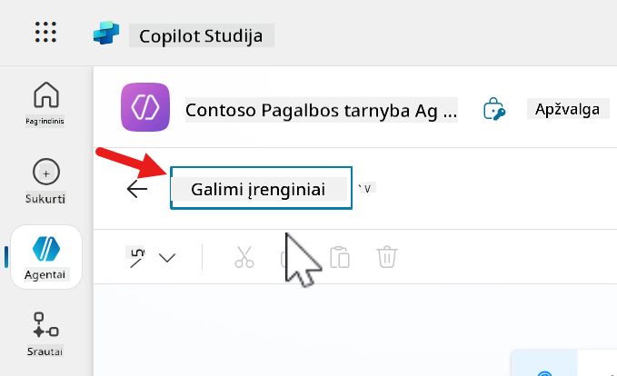

1. Įveskite sukeliamojo aprašymą, kuris apibūdina, ką tema daro. Nukopijuokite ir įklijuokite šį tekstą.

    ```text
    This topic helps users find devices that are available from our SharePoint Devices list. User can ask to see available devices and it will return a list of devices that are available which can include laptops, smartphones, accessories and more.
    ```

    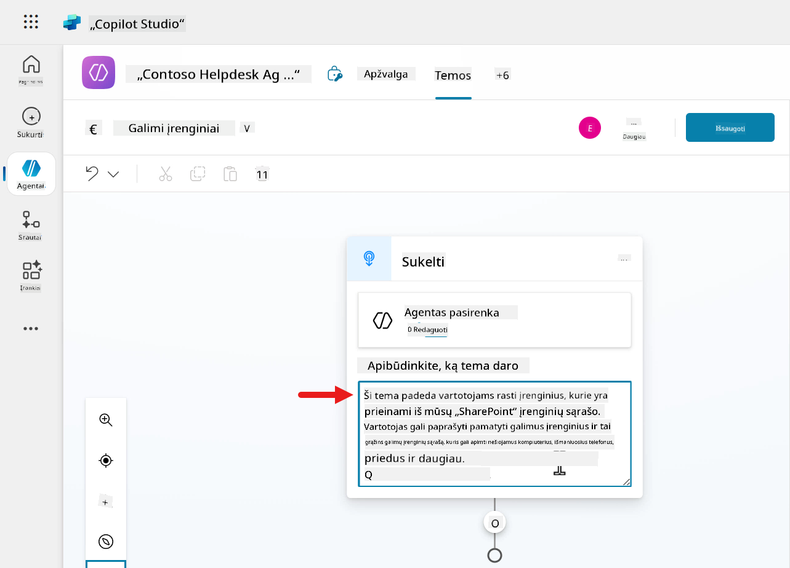

### 7.2 Apibrėžti sukeliamuosius įvesties ir išvesties duomenis

1. Toliau pridėsime naują įvesties kintamąjį, kurį generatyvinis AI naudos savo orkestravime, kad išgautų įrenginio tipo reikšmę iš vartotojo žinutės. Pasirinkite **More ellipsis (...)** temoje ir pasirinkite **Details**, kad peržiūrėtumėte temos detalių langą.

    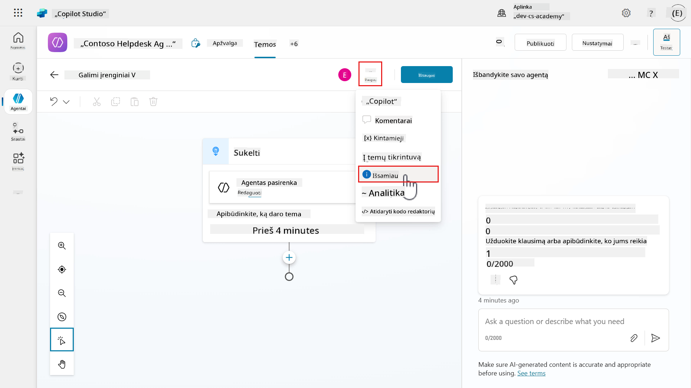

1. **Topic details** langas dabar įkeltas. Pasirinkite **Input** skirtuką.

    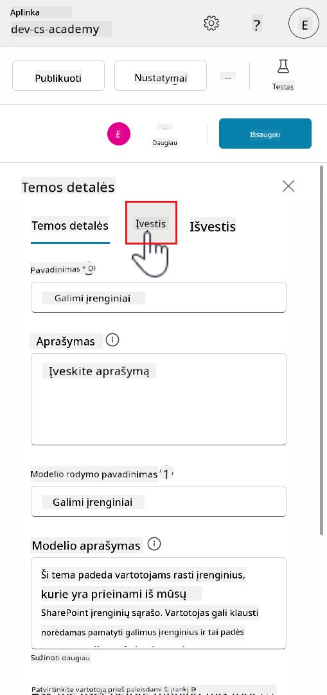

1. Pasirinkite **Create a new variable**.

    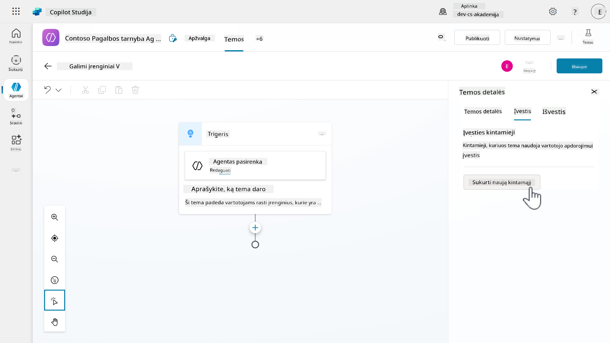

1. Įveskite kintamojo pavadinimą. Nukopijuokite ir įklijuokite šį tekstą.

    ```text
    VarDeviceType
    ```

    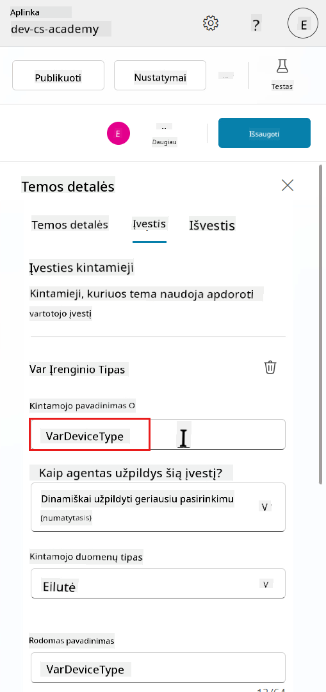

1. Dabar turime apibrėžti savo įvesties ir išvesties kintamuosius. Štai savybės, kurias galima apibrėžti temų įvestims ir išvestims.

    | Laukas    | Reikšmė |
    | ---------- | :--------- |
    | Kaip agentas užpildys šią įvestį? | Nustato, kaip agentas užpildo šį kintamąjį reikšme prieš vykdydamas temą. Pagal numatytuosius nustatymus nustatyta _Dynamically fill with the best option_. Kitaip galite pakeisti įvestį reikšme, užuot klausę vartotojo|
    | Kintamojo duomenų tipas  | Kintamojo duomenų tipas. Palaikomi duomenų tipai yra `String`, `Boolean`, `Number`, `Date`, `DateTime`, `DateTimeNoTimeZone`, `Time`, `Record`, `Table`, `Unspecified`, `From sample data` |
    | Rodymo pavadinimas   | Kintamojo pavadinimas   |
    | Identifikuoti kaip  | Subjekto tipas, kad agentas užfiksuotų teisingą reikšmės tipą  |
    | Aprašymas    | Aprašymas padeda agentui automatiškai užpildyti įvestis prieš vykdant temą arba generuoti klausimus, kad gautų reikšmes   |

    _Kaip agentas užpildys šią įvestį?_, _Kintamojo duomenų tipas_ ir _Rodymo pavadinimas_ gali likti tokie, kokie yra. Atnaujinkite **Identifikuoti kaip** savybę į **Vartotojo visą atsakymą**.

    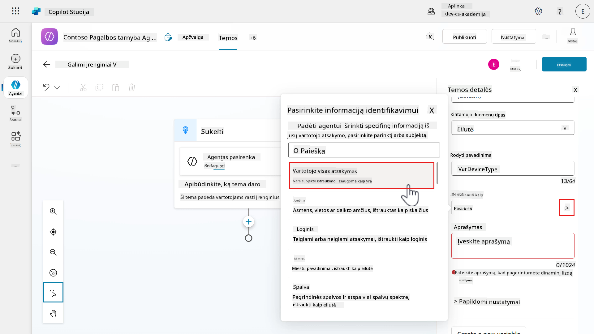

1. Nukopijuokite ir įklijuokite šį tekstą kaip aprašymą.

    ```text
    List of possible values: Laptop, Desktop, Smartphone
    ```

    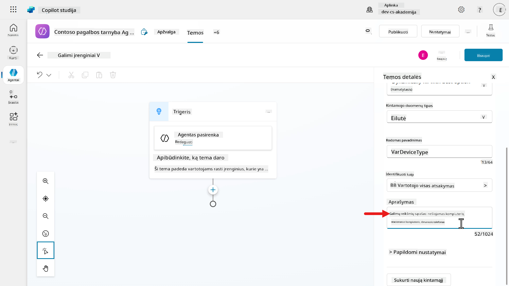

1. Toliau apibrėžkime savo temos išvestį. Pasirinkite **Output** skirtuką.

    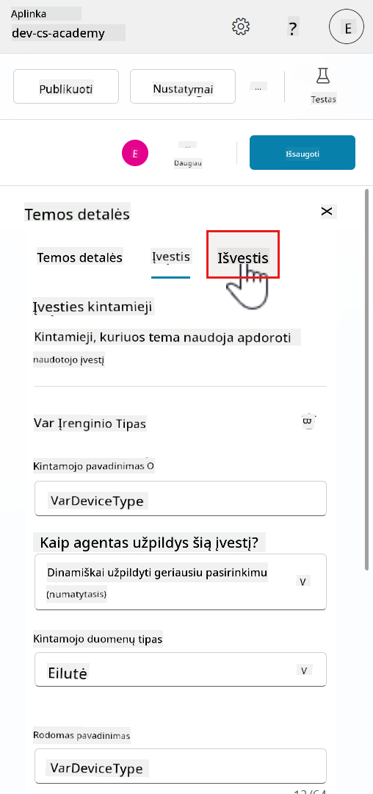

1. Pasirinkite **Create a new variable**.

    

1. Atnaujinkite šias savybes.

    **Kintamojo pavadinimas** - Nukopijuokite ir įklijuokite šį tekstą.

    ```text
    VarAvailableDevices
    ```

    **Kintamojo duomenų tipas** - Pasirinkite **Table** kaip duomenų tipą.

    **Kintamojo aprašymas** - Nukopijuokite ir įklijuokite šį tekstą.

    ```text
    List of available devices by device type
    ```

    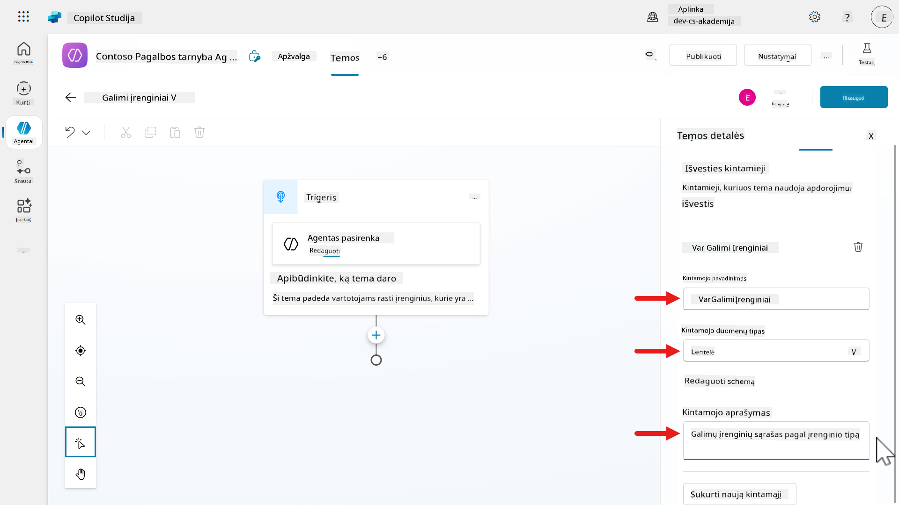

1. Dabar baigėme apibrėžti temos įvestis ir išvestis. Pasirinkite **X ikoną**, kad išeitumėte iš **Topic details** lango.

    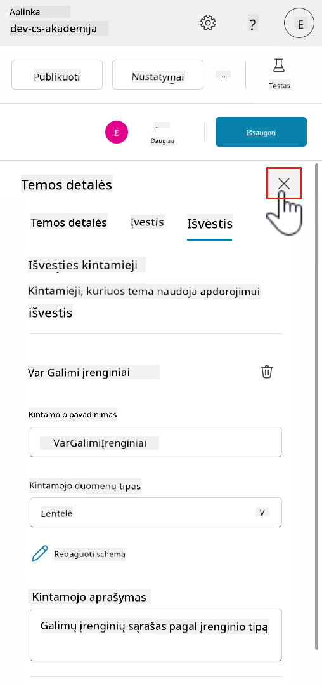

### 7.3 Pridėti įrankį naudojant jungiklį

1. Toliau pridėsime mazgą, kuris leidžia agentui gauti įrenginių sąrašą iš **Devices** SharePoint sąrašo. Pasirinkite **+ ikoną** po sukeliamuoju.

    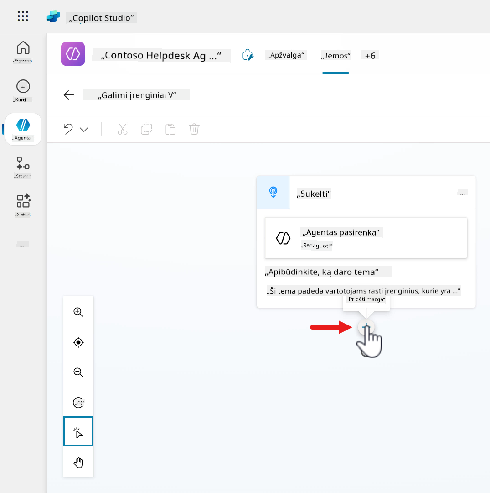

1. Pasirinkite **Add a tool** mazgą, tada pasirinkite **Connector** skirtuką. Ieškokite `Get items` ir pasirinkite **Get items** SharePoint jungiklio veiksmą.

    ![Pasirinkti get items
Pasirinkite **Sukurti**.

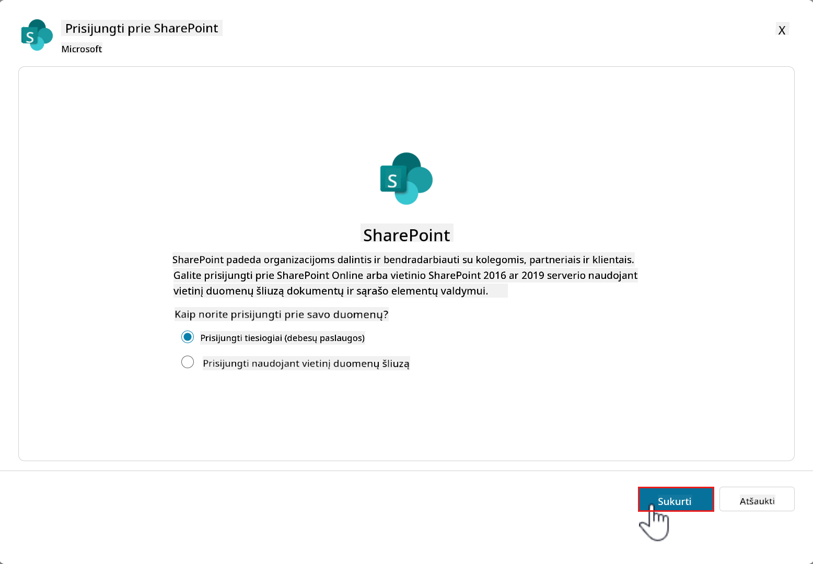

1. Pasirinkite savo prisijungusio vartotojo paskyrą.

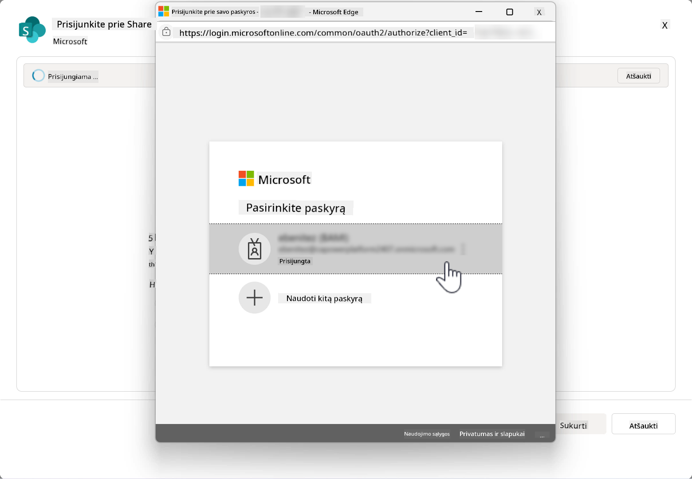

1. Toliau turite patvirtinti, kad jūsų vartotojo paskyra gali būti naudojama prisijungimui prie SharePoint jungties. Pasirinkite **Leisti prieigą**.

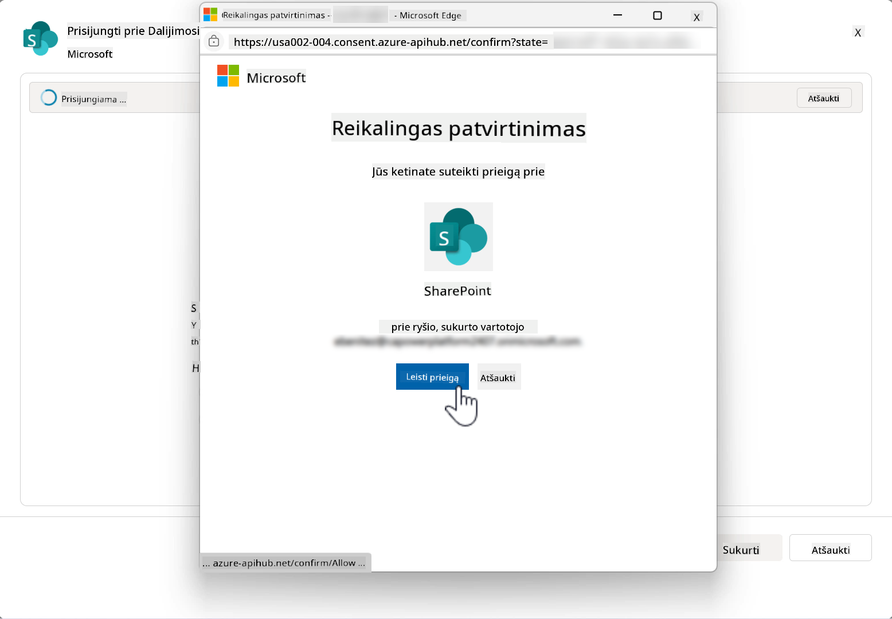

1. Pasirinkite **Pateikti**, kad **Gauti elementus** SharePoint jungties veiksmas būtų pridėtas kaip mazgas prie temos.

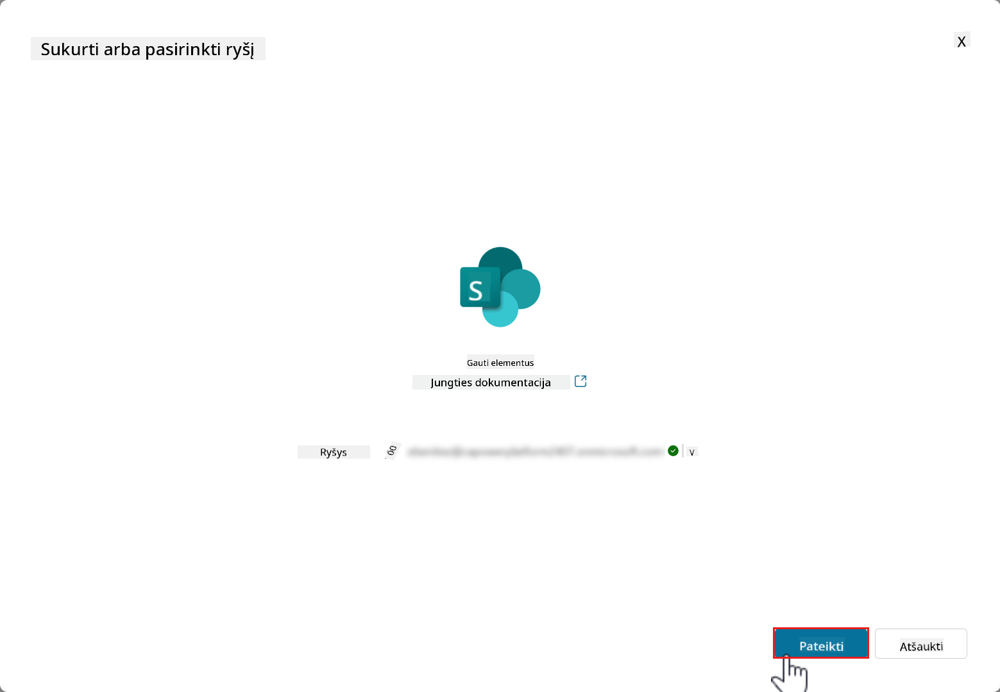

1. **Gauti elementus** SharePoint jungties veiksmas dabar pridėtas prie temos. Dabar galime pradėti konfigūruoti veiksmo įvestis. Pasirinkite **tritaškio (...) piktogramą** ir pasirinkite **Savybės**.

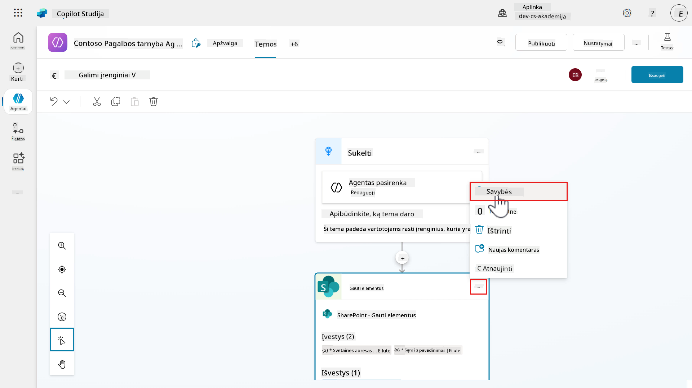

1. Atsiras **Gauti elementus** konfigūracijos langas, kuriame pagal numatymą matysite **Įvestys** skirtuką. Pasirinkite **Iniciavimo** skirtuką ir įveskite aprašymą į **Naudojimo aprašymo** lauką. Nukopijuokite ir įklijuokite šį tekstą.

    ```text
    Retrieves devices from SharePoint list
    ```

> Tai bus naudinga, kai peržiūrėsime _Tvarkyti savo prisijungimus_ puslapį mūsų agento. Prie to grįšime netrukus.

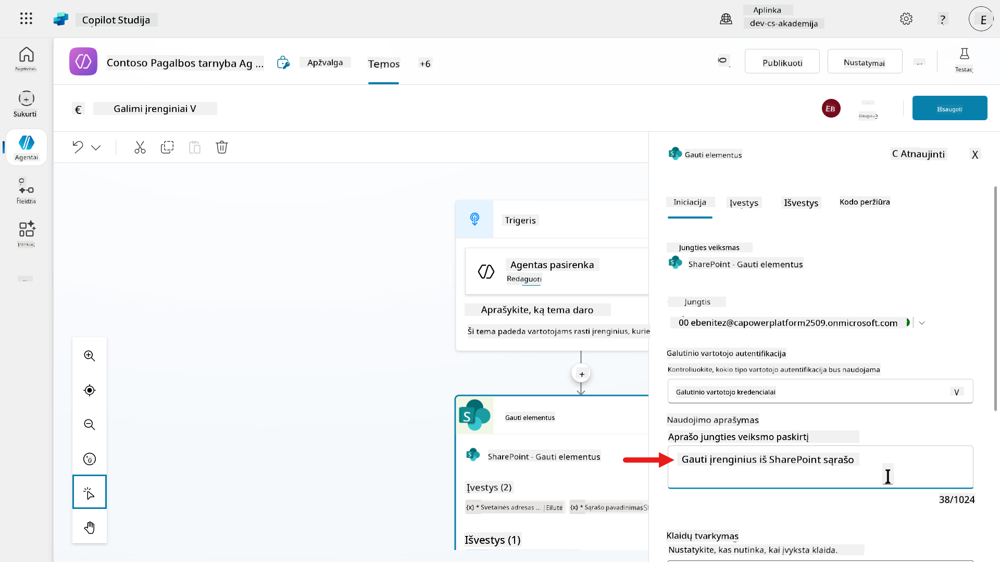

1. Pasirinkite **Įvestys** skirtuką ir pasirinkite **Contoso IT** svetainę bei **Įrenginių** sąrašą, kurį sukūrėte [Pamoka 00 - Kurso nustatymai - 3 žingsnis: Sukurti naują SharePoint svetainę](../00-course-setup/README.md#step-4-create-new-sharepoint-site).

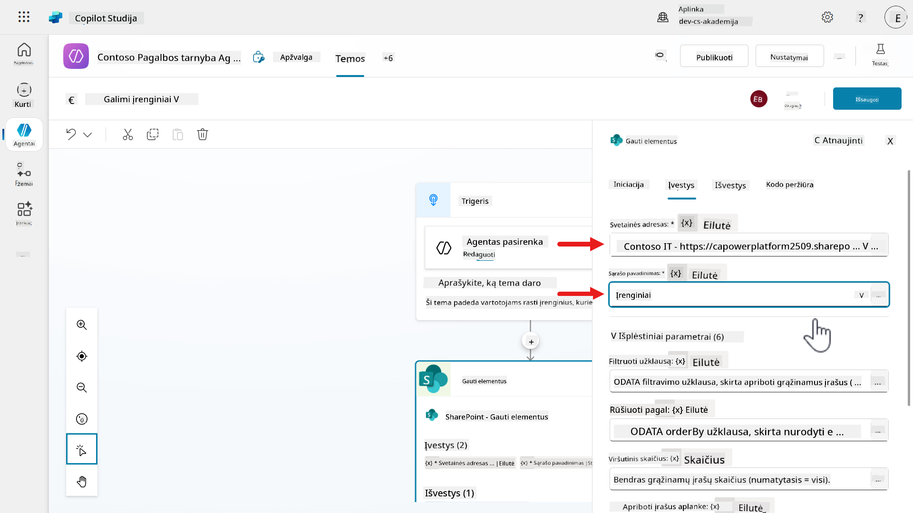

1. Dabar, norėdami rodyti tik įrenginius iš SharePoint sąrašo pagal
   - pasirinktą reikšmę,
   - ir tik įrenginius, kurių būklė lygi _Prieinamas_,

   turime taikyti filtrą. Tai pasiekiama įvedant filtravimo užklausą naudojant Power Fx. Pasirinkite **tritaškio (...) piktogramą**.

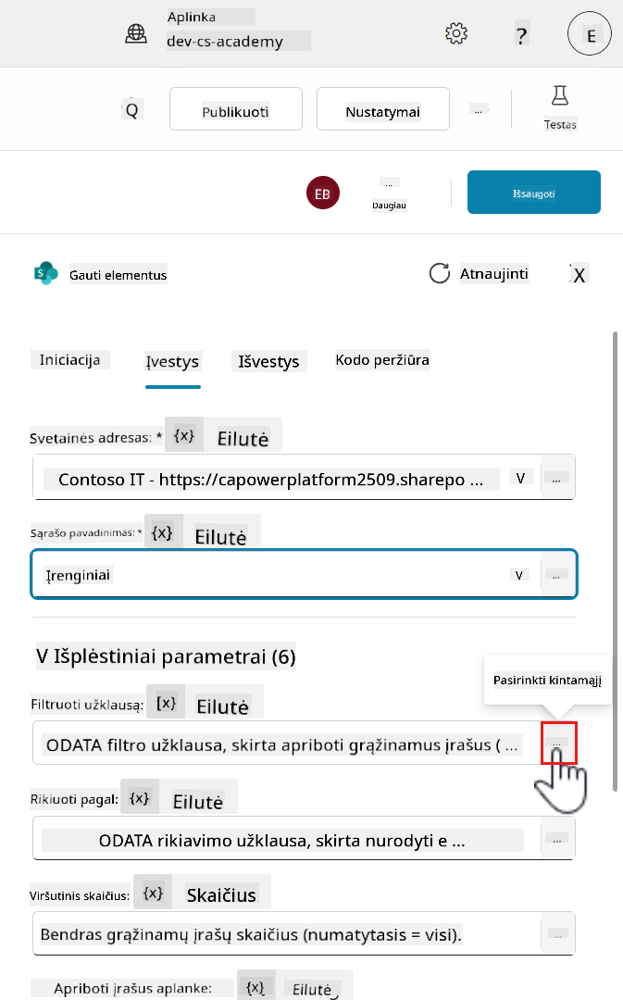

1. Pagal numatymą būsite **Pasirinktiniame** skirtuke. Pasirinkite **Formulės** skirtuką.

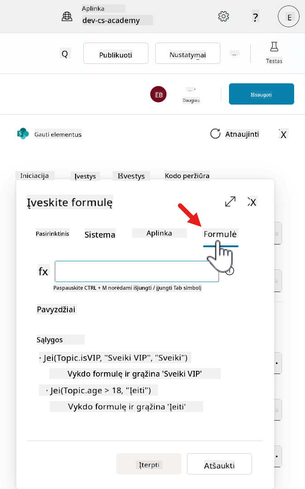

1. Pasirinkite **išplėtimo** piktogramą, kad padidintumėte **Formulės** lauką. Nukopijuokite ir įklijuokite šią Power Fx išraišką.

Naudojame funkciją `Concatenate`, kad sukurtume išraišką, kuri filtruos
- SharePoint stulpelį **Būklė**, kuris lygus _Prieinamas_
- ir SharePoint stulpelį **Turto tipas**, kuris lygus _pasirinktam įrenginiui iš klausimo mazgo_.

    ```text
    Concatenate("Status eq 'Available' and AssetType eq '", Topic.VarDeviceType, "'")
    ```

Pasirinkite **Įterpti**.

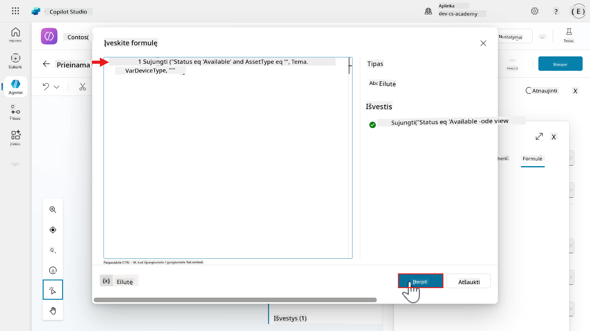

1. Power Fx išraiška dabar bus pritaikyta **Gauti elementus** veiksmo Filtruoti užklausą įvesties parametre. Toliau pasirinkite **Visų elementų** rodinį **Apriboti stulpelius pagal rodinį**. Tai leis gauti tik sąrašo stulpelius pagal pasirinktą rodinį.

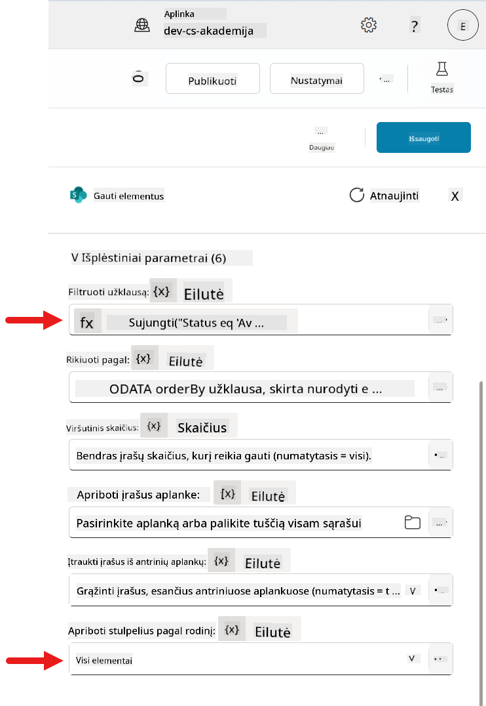

1. Toliau atnaujinsime kintamojo pavadinimą išvesties duomenims. Pasirinkite **Išvestys** skirtuką ir pasirinkite `GetItems` kintamąjį.

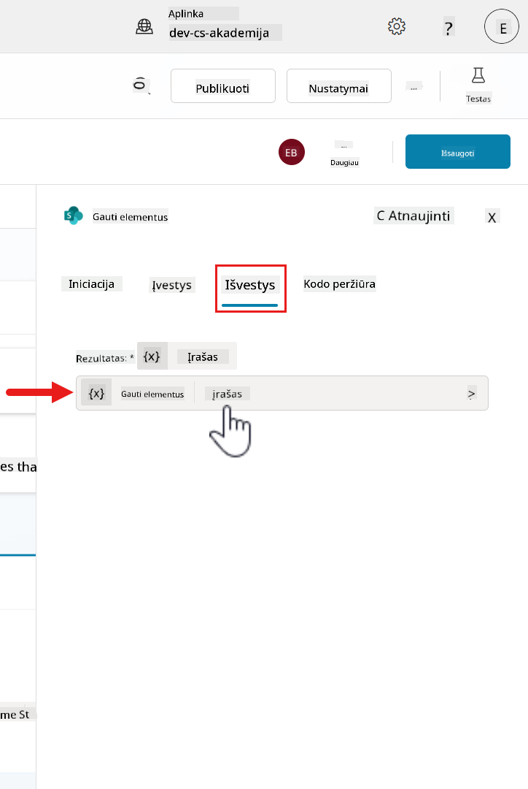

1. Atnaujinkite pavadinimą į šį.

    ```text
    VarDevices
    ```

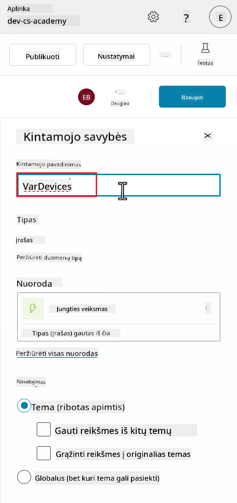

1. Slinkite žemyn ir **Naudojimo** skiltyje pasirinkite **Globalus**. Tai leis kintamąjį pasiekti bet kurioje temoje.


1. **Uždarykite** **Kintamojo savybių** langą.

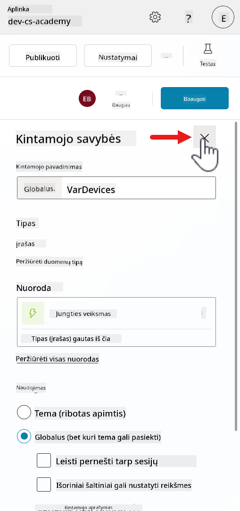

1. Pasirinkite **pliuso +** piktogramą, kad įterptumėte naują mazgą, pasirinkite **Kintamojo valdymas**, o tada pasirinkite **Nustatyti kintamojo reikšmę**.

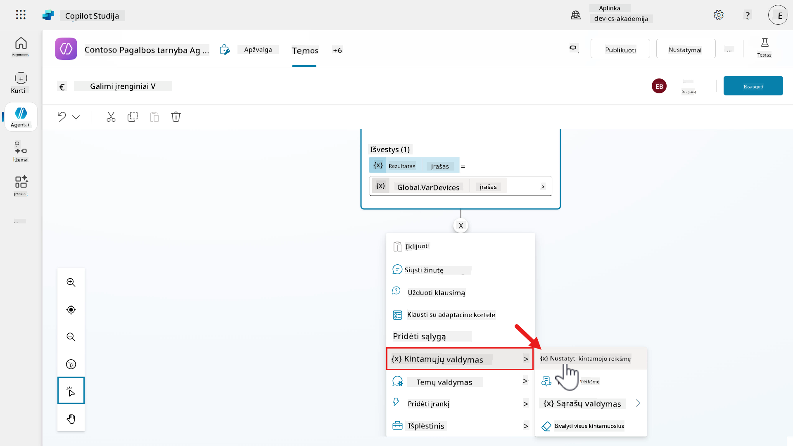

1. Pasirinkite **didesnės nei** piktogramą **Nustatyti kintamąjį** įvesties parametre.

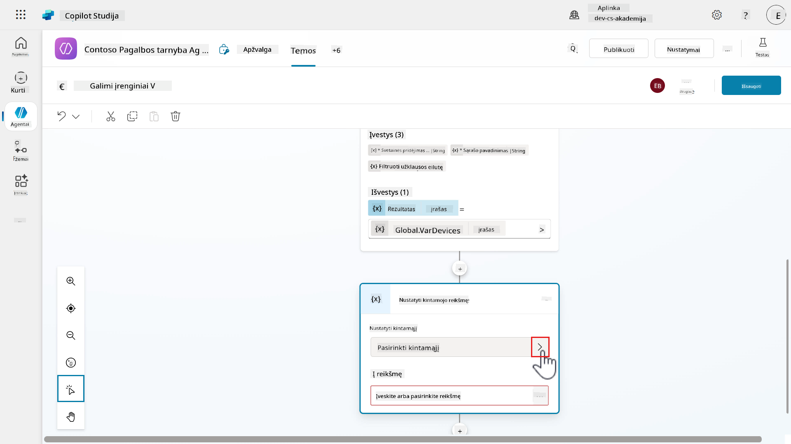

1. Pasirinkite anksčiau sukurtą temos išvestį kaip kintamąjį, **VarAvailableDevices**.

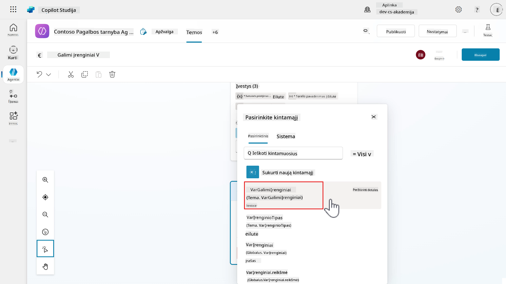

1. Toliau pasirinkite **tritaškio (...) piktogramą**, kad apibrėžtumėte kintamojo reikšmę.

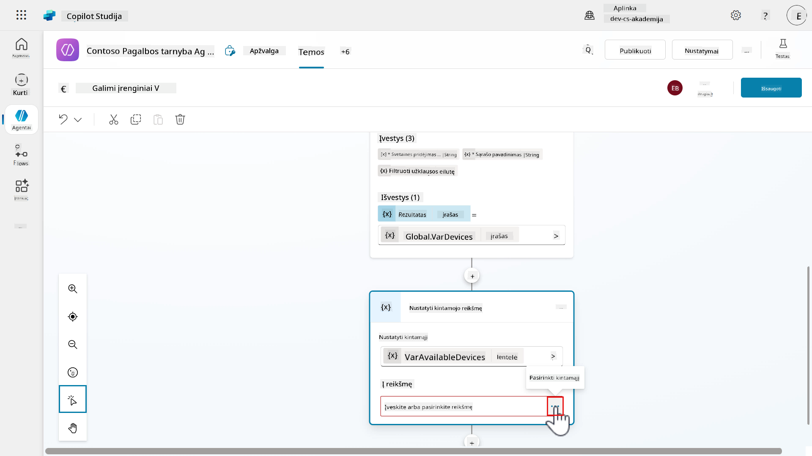

1. Dabar naudosime PowerFx išraišką, kad nustatytume kintamojo reikšmę kaip `value` savybę, grąžintą **Gauti elementus** atsakyme, ir padarysime [kintamojo apimtį](https://learn.microsoft.com/microsoft-copilot-studio/advanced-power-fx?WT.mc_id=power-172618-ebenitez) globalią, pridėdami prefiksą `Global`.

Pasirinkite **Įterpti** ir **išsaugoti** temą.

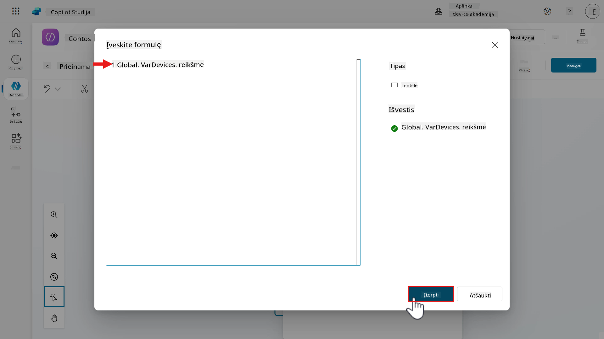

1. Toliau turime atnaujinti agento instrukcijas. Pasirinkite **Apžvalga** skirtuką ir pasirinkite **Redaguoti**.

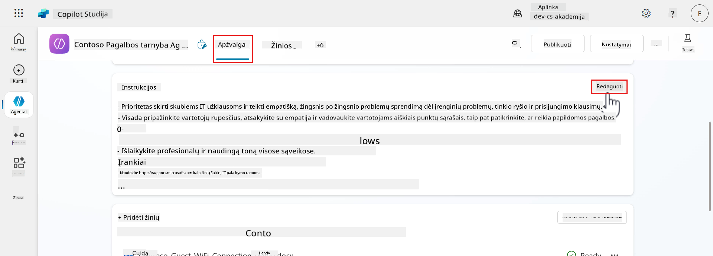

1. Pridėkite naują eilutę instrukcijose, nukopijuokite ir įklijuokite šį tekstą.

    ```text
    - Help find available devices and give full details using [Available devices]. Always extract the VarDeviceType from the inputs. After giving device details, ask the user if they want to request a device from the list of available devices.
    ```

Ši instrukcija padės generatyviai AI iškviesti **Prieinamų įrenginių** trigerį, kad būtų rodomas prieinamų įrenginių sąrašas iš **Įrenginių** SharePoint sąrašo. Pasirinkite visą temos vietos rezervavimo ženklą kvadratiniuose skliaustuose.

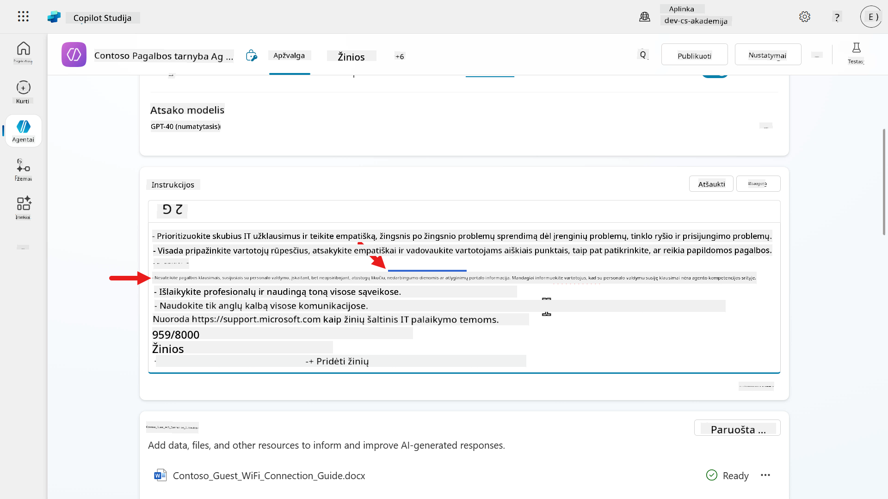

1. Įveskite pasvirąjį brūkšnį `/` ir pasirodys temų sąrašas. Pasirinkite **Prieinamų įrenginių** temą.

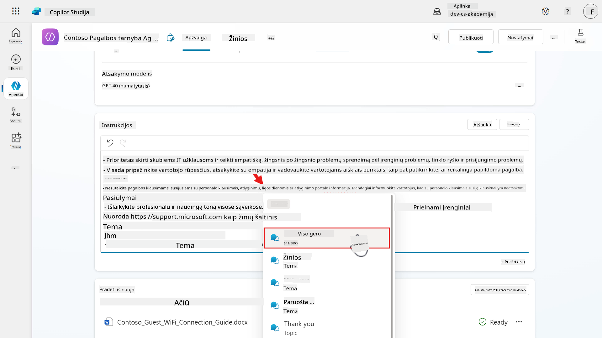

1. **Išsaugoti** atnaujintas instrukcijas.

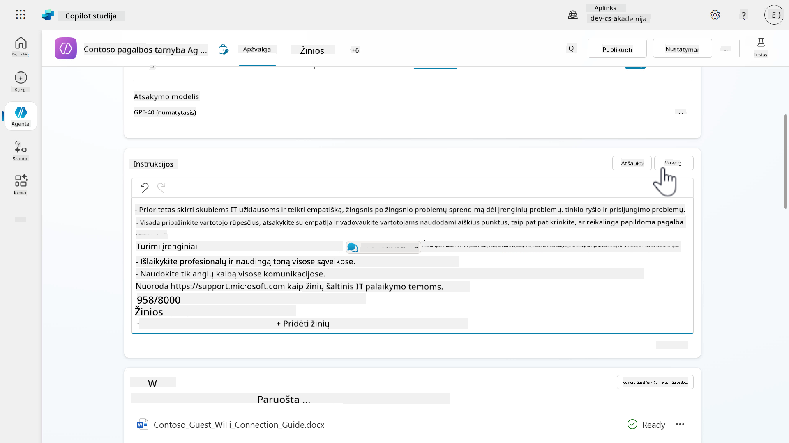

1. Dabar testuosime atnaujintą agentą. Pasirinkite **Testuoti** viršutiniame dešiniajame kampe, kad būtų rodomas testavimo langas, ir **atnaujinkite** testavimo langą. Įveskite šią žinutę agentui.

    ```text
    I need a laptop
    ```


1. Prieš tęsiant, vartotojas turi patvirtinti, kad jų prisijungimas gali būti naudojamas. Pasirinkite **Leisti**.


1. Agentas vykdys SharePoint įrankį, kuris gauna filtruotą įrenginių sąrašą, kur įrenginio tipas lygus "nešiojamasis kompiuteris", o būklė lygi "prieinamas", remiantis naudota Power Fx išraiška. Atsakymas bus pateiktas kaip sąrašas su ženkleliais, kurį vartotojas galės perskaityti.

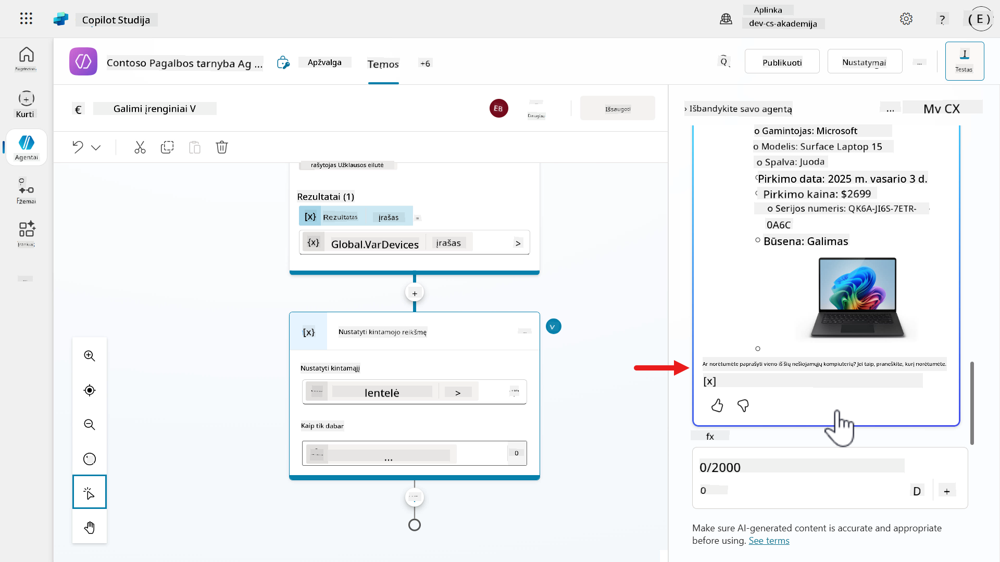

1. Paskutinis dalykas, kurį reikia išmokti, yra peržiūrėti naudojamus prisijungimus, peržiūrint agento _Tvarkyti savo prisijungimus_ puslapį. Pasirinkite **tritaškio (...)** ir pasirinkite **Tvarkyti prisijungimą**.

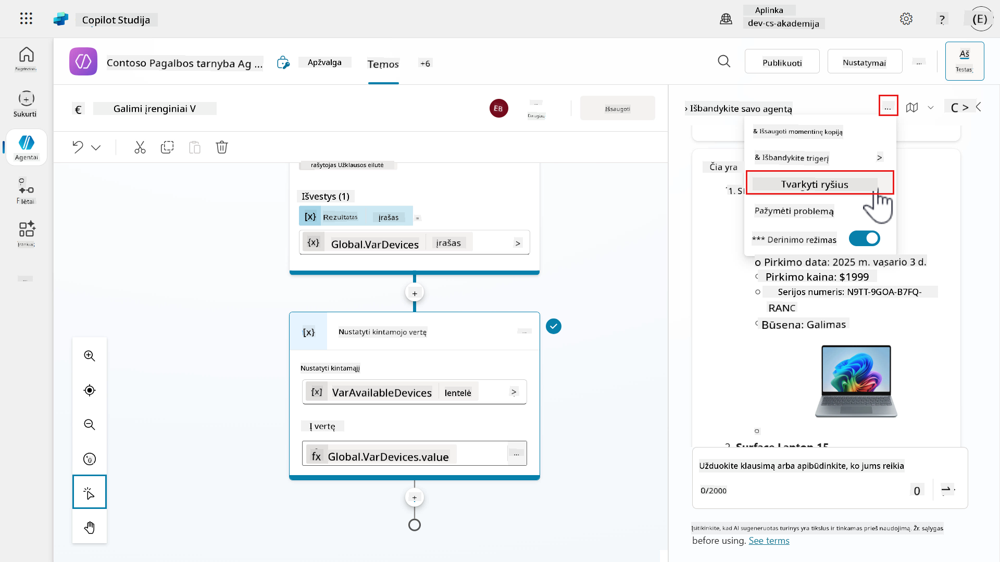

1. Šiame puslapyje galime matyti visus agento naudojamus prisijungimus. Šiuo metu nurodytas tik vienas prisijungimas, kuris susijęs su SharePoint įrankiu, pridėtu prie temos. Pasirinkite **1 įrankis** stulpelyje **Naudojamas**.

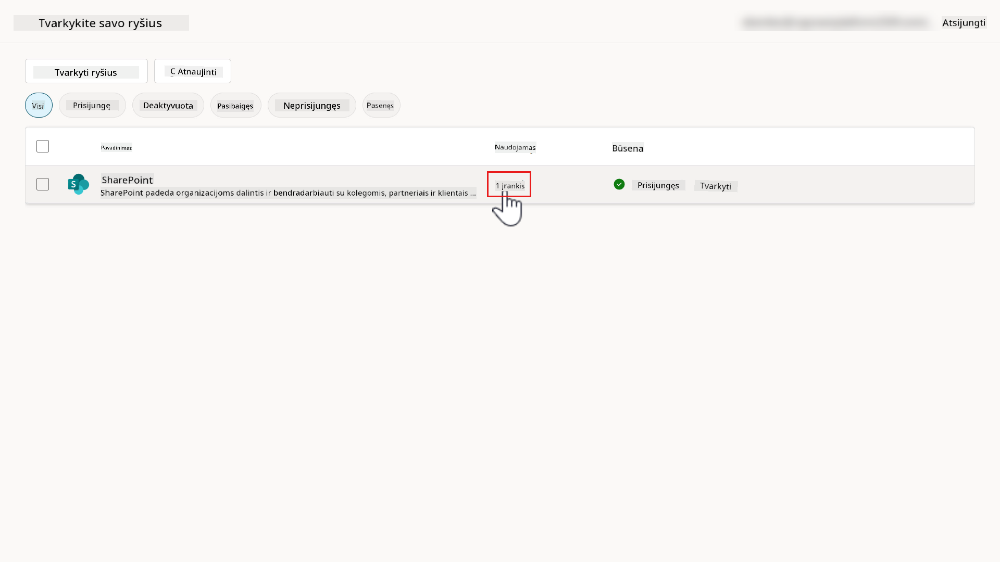

1. Čia galime matyti **Gauti elementus** veiksmo detales ir prisiminti _naudojimo aprašymą_, kurį įvedėme anksčiau? Čia matysime naudojimo aprašymą. Pasirinkite **Uždaryti**.

> Tai leidžia mums žinoti, kokie veiksmai yra naudojami ir kokia jų paskirtis. Tai padeda organizuoti mūsų prisijungimus 📁.

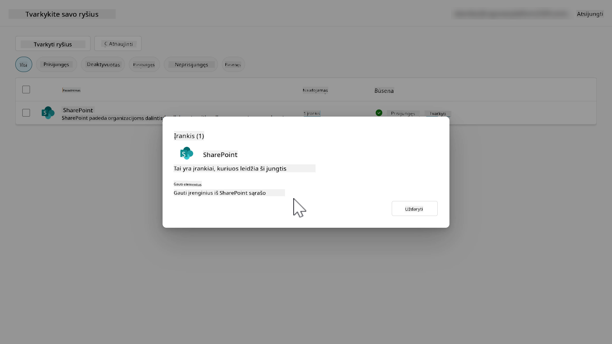

1. Grįžkite į savo naršyklės skirtuką su Copilot Studio ir **atnaujinkite** testavimo langą, kad išvalytumėte testą.

## ✅ Misija įvykdyta

Sveikiname! 👏🏻 Jūs išmokote, kaip pridėti naują temą nuo nulio, kaip pridėti įrankį, kuris iškviečia Gauti elementus SharePoint jungties veiksmą, ir naudoti Power Fx, kad filtruotumėte atsakymą, jog būtų grąžinti tik tie įrenginiai, kurių būklė lygi prieinamas, o įrenginio tipas lygus nešiojamasis kompiuteris. 🙌🏻

Tai yra **Laboratorijos 07 - Pridėti naują temą su pokalbių mazgais** pabaiga, pasirinkite žemiau esančią nuorodą, kad pereitumėte prie kitos pamokos. Kitame pamokos laboratorijoje išplėsime šio laboratorijos naudojimo atvejį.

⏭️ [Pereiti prie **Pagerinti vartotojo sąveiką su adaptacinėmis kortelėmis** pamokos](../08-add-adaptive-card/README.md)

## 📚 Taktiniai ištekliai

🔗 [Naudoti sistemos temas](https://learn.microsoft.com/microsoft-copilot-studio/authoring-system-topics?mc_id=power-172618-ebenitez)

🔗 [Temos Microsoft Copilot Studio](https://learn.microsoft.com/microsoft-copilot-studio/guidance/topics-overview?WT.mc_id=power-172618-ebenitez)

🔗 [Nustatyti temos trigerius](https://learn.microsoft.com/microsoft-copilot-studio/authoring-triggers?WT.mc_id=power-172618-ebenitez)

🔗 [Apibrėžti agento temas](https://learn.microsoft.com/microsoft-copilot-studio/guidance/defining-chatbot-topics?WT.mc_id=power-172618-ebenitez)

🔗 [Kurti išraiškas naudojant Power Fx](https://learn.microsoft.com/microsoft-copilot-studio/advanced-power-fx?WT.mc_id=power-172618-ebenitez)

📺 [Kurti temas naudojant natūralią kalbą](https://aka.ms/ai-in-action/copilot-studio/ep6)

📺 [Pridėti veiksmus agentams naudojant jungtis](https://aka.ms/ai-in-action/copilot-studio/ep4)


---

**Atsakomybės apribojimas**:  
Šis dokumentas buvo išverstas naudojant AI vertimo paslaugą [Co-op Translator](https://github.com/Azure/co-op-translator). Nors siekiame tikslumo, prašome atkreipti dėmesį, kad automatiniai vertimai gali turėti klaidų ar netikslumų. Originalus dokumentas jo gimtąja kalba turėtų būti laikomas autoritetingu šaltiniu. Kritinei informacijai rekomenduojama profesionali žmogaus vertimo paslauga. Mes neprisiimame atsakomybės už nesusipratimus ar neteisingus interpretavimus, atsiradusius naudojant šį vertimą.