<!--
CO_OP_TRANSLATOR_METADATA:
{
  "original_hash": "cc4afa4a5a11c9d03896decfbcbd4060",
  "translation_date": "2025-10-22T00:27:46+00:00",
  "source_file": "docs/recruit/09-add-an-agent-flow/README.md",
  "language_code": "lt"
}
-->
# 🚨 Misija 09: Pridėkite agento srautą prie savo Temos automatizavimui

## 🕵️‍♂️ SLAPTAŽODIS: `OPERACIJA AUTOMATIZACIJOS GALIA`

> **⏱️ Operacijos laiko langas:** `~30 minučių`  

🎥 **Žiūrėkite vaizdo įrašą**

[](https://www.youtube.com/watch?v=vtLZJT3eBXg "Žiūrėkite vaizdo įrašą YouTube")

## 🎯 Misijos aprašymas

Jūsų agentas dabar gali bendrauti su vartotojais ir teikti informaciją, tačiau tikrasis veiklos efektyvumas reikalauja, kad jūsų agentas imtųsi veiksmų. Ši misija pavers jūsų pokalbių agentą automatizacijos galia, aprūpindama jį agentų srautais.

Misijos pabaigoje sukursite pilną įrenginio užklausos automatizaciją, kuri surinks vartotojo įvestį per adaptyvią kortelę, gaus duomenis iš SharePoint, siųs pranešimus vadovams el. paštu ir užtikrins sklandų vartotojo grįžtamąjį ryšį - visa tai bus koordinuojama jūsų agento per intelektualią darbo srautų automatizaciją.

## 🔎 Tikslai

Šios misijos metu išmoksite:

1. Suprasti, kas yra agentų srautai ir kaip jie skiriasi nuo Power Automate debesų srautų automatizacijai
1. Sužinoti pagrindines funkcijas, kurios daro agentų srautus galingus, įskaitant AI veiksmus ir natūralios kalbos kūrimą
1. Ištyrinėti agentų srauto dizainerį ir kaip naudoti išraiškas dinamiškam duomenų apdorojimui
1. Sukurti pilną įrenginio užklausos automatizaciją, integruojančią SharePoint duomenis ir el. pašto pranešimus

## 🤔 Kas yra agentų srautas?

Agentų srautai yra galingas būdas automatizuoti pasikartojančias užduotis ir integruoti jūsų programas bei paslaugas. Galvokite apie juos kaip apie struktūrizuotus, žingsnis po žingsnio darbo srautus, kuriuos jūsų agentas gali vykdyti, kad automatizuotų užduotis arba prisijungtų prie kitų programų ir paslaugų. Jie yra tarsi mini darbo srautai, padedantys jūsų agentui atlikti tokius veiksmus kaip pranešimų siuntimas, įrašų atnaujinimas ar įvykių reagavimas.

Skirtingai nuo autonominių agentų, kurie naudoja AI sprendimams priimti realiu laiku, agentų srautai yra **deterministiniai darbo srautai** - tai reiškia, kad jie visada seka tą patį kelią, užtikrindami nuoseklius ir patikimus rezultatus.

Paprasčiau tariant:

- Jie padeda jūsų agentui _daryti dalykus_, o ne tik _kalbėti_ su vartotojais.
- Jie yra pakartotinai naudojami įvairiose temose ir agentuose, ir gali būti paleisti vartotojo pranešimais, įvykiais ar kitomis programomis bei paslaugomis.

## 🙋🏽 Taip, bet kuo jie skiriasi nuo Power Automate debesų srautų?

Tiek agentų srautai, tiek Power Automate debesų srautai padeda automatizuoti užduotis. Jie sukurti skirtingiems tikslams ir veikia skirtingais būdais.

### 🤖 Agentų srautai Copilot Studio

**Kam jie skirti:**

- Sukurti pokalbių ir autonominiams agentams (per agentų instrukcijas) Copilot Studio.
- Orientuoti į išmanią, AI pagrįstą automatizaciją, kuri sąveikauja su verslo sistemomis.

**Kodėl jie naudingi:**

- Lengva kurti ir valdyti tiesiogiai Copilot Studio.
- Puikiai tinka automatizuoti užduotis, vykstančias _pokalbio metu_ su vartotojais, pvz., pateikiant prašymą dėl atostogų.
- Nereikia atskiros Power Automate licencijos, nes apmokestinimas grindžiamas naudojimu Copilot Studio. Tai gali sutaupyti laiko ir išlaidų įmonių komandoms.

**Ribojimai:**

- Jų negalima dalintis, kopijuoti ar priskirti bendrasavininkiams.
- Agentų srautai matomi ir naudojami tik Copilot Studio.
- Šiuo metu agentų įvykių paleidikliai gali būti redaguojami Power Automate kūrėjo portale.

### ☁️ Power Automate debesų srautai

**Kam jie skirti:**

- Sukurti bendros paskirties automatizacijai įvairiose programose ir paslaugose.
- Gali veikti savarankiškai arba kartu su agentų srautais.

**Kodėl jie naudingi:**

- Siūlo platų jungčių asortimentą.
- Idealiai tinka automatizuoti procesus už agentų ribų.
- Gali būti dalinami, pakartotinai naudojami ir valdomi komandoje.

**Reikalavimai:**

- Jums reikia Power Automate licencijos, kad galėtumėte juos naudoti.

### 📗 Santrauka

| Naudokite tai | Kai norite |
| :- | :- |
| Agentų srautai | Automatizuoti užduotis agento viduje, naudoti AI ir viską laikyti Copilot Studio |  
| Power Automate debesų srautai | Automatizuoti programose ir paslaugose arba kurti darbo srautus už agentų ribų |

## 👍🏻 Kodėl verta naudoti agentų srautus

Agentų srautai visada seka fiksuotą kelią - jie daro tą patį kiekvieną kartą, kai gauna tą pačią įvestį.

Tai daro juos:

- **Patikimus** - galite pasitikėti, kad jie elgsis taip pat kiekvieną kartą.
- **Nuspėjamus** - žinote, kokio rezultato tikėtis, kai srautas vykdomas.
- **Taisyklėmis pagrįstus** - jie seka jūsų apibrėžtus žingsnius.

Kiti privalumai:

- **Automatizacija** - leidžia jūsų agentui tvarkyti pasikartojančias užduotis, pvz., pateikti formas ar siųsti pranešimus.
- **Sujungimas** - prisijungia prie daugiau nei 1400 jungčių, tokių kaip ServiceNow, SharePoint, Salesforce. Taip pat galite sukurti savo pasirinktą jungtį.
- **Glaudi integracija** - agentų srautai yra agento logikos dalis, jie paleidžiami tiesiogiai vartotojo pranešimais ar veiksmais pokalbyje.
- **Mastelio keitimas** - srautus galima naudoti keliuose agentuose ar scenarijuose.
- **Be kodo arba mažai kodo** - galite kurti srautus naudodami natūralią kalbą arba vizualų dizainerį.
- **Viskas vienoje platformoje** - galite kurti, testuoti ir diegti agentų srautus vienoje vietoje - Copilot Studio. Nereikia perjungti platformų.

## 🏄🏻‍♂️ Kaip agentų srautai pagerina jūsų agentą?

Agentų srautai išplečia tai, ką jūsų agentas gali daryti, ne tik "kalbėti" su vartotojais. Jie leidžia jam imtis veiksmų ir sąveikauti su sistemomis.

Tarkime, dirbate finansų skyriuje ir gaunate daug sąskaitų iš tiekėjų. Paprastai kažkas turi perskaityti kiekvieną sąskaitą, ištraukti svarbią informaciją - sumą, datą, kas ją išsiuntė, ir patikrinti, ar viskas atitinka jūsų įrašus. Tada ją nusiųsti tinkamam asmeniui patvirtinimui. Tai užima laiko ir pastangų.

Naudodami agentų srautus Copilot Studio, galite automatizuoti šį procesą. Kai tik gaunama sąskaita, agentas:

1. Perskaito dokumentą naudodamas intelektualų dokumentų apdorojimą, kad rastų pagrindinę informaciją.
1. Patikrina duomenis pagal jūsų įmonės duomenis, kad įsitikintų, jog viskas atrodo teisingai.
1. Nukreipia ją patvirtinimui tinkamam asmeniui (-ims).

Tai taupo laiką, mažina klaidų skaičių ir daro visą procesą daug sklandesnį.

### Pagalvokite apie tai taip

- **Agentai**: išmanūs sprendimų priėmėjai
- **Agentų srautai**: patikimi vykdytojai

### Kodėl tai svarbu

- Gaunate geriausią iš abiejų pasaulių: patikimą automatizaciją ir lankstų AI.
- Lengva kurti ir atnaujinti srautus, kai keičiasi jūsų verslo poreikiai.
- Galite išplėsti automatizaciją visoje komandoje.

## 🔌 Pagrindinės funkcijos, kurios daro agentų srautus galingus

1. **Natūralios kalbos kūrimas**
    - Galite aprašyti, ką norite, kad srautas darytų, paprasta anglų kalba.
    - Copilot supranta jūsų ketinimą ir sukuria srautą už jus.
    - Nereikia rašyti kodo - tiesiog paaiškinkite savo idėją.

1. **AI veiksmai**

    Naudokite AI:

    - Skaityti ir suprasti dokumentus ar vaizdus.
    - Apibendrinti ilgą turinį į trumpus, naudingus atsakymus.
    - Pateikti išmanias rekomendacijas ar sprendimus.

1. **Generatyvūs veiksmai**
    - Leidžia srautui prisitaikyti realiu laiku.
    - Agentas gali planuoti ir koreguoti veiksmus pagal besikeičiančią informaciją.

1. **Integracijos veiksmai**
    - Prijunkite savo srautą prie kitų įrankių, tokių kaip Outlook, Microsoft Teams, ServiceNow, SharePoint ir kitų programų bei paslaugų, naudodami daugiau nei 1400 įmontuotų jungčių arba savo pasirinktą jungtį.
    - Tai padeda jūsų agentui dirbti su programomis, kurias jau naudoja jūsų komanda.

1. **Žmogus procese**
    - Pridėkite patvirtinimo žingsnius, kur asmuo turi peržiūrėti ar patvirtinti kažką.
    - [Išplėstiniai patvirtinimai](https://learn.microsoft.com/microsoft-copilot-studio/flows-advanced-approvals?WT.mc_id=power-172621-ebenitez) palaiko priminimus, delegavimą ir daugiapakopius patvirtinimus.

## ⚙️ Kaip jie veikia

1. **Paleidimas**

    Įvykis pradeda srautą - pvz., vartotojas užduoda klausimą, paleidžia srautą iš temos, suplanuotas laikas arba įvykis kitoje sistemoje.

1. **Veiksmai**

    Tai yra žingsniai, kuriuos agentas atlieka toliau - siunčia el. laišką, kviečia API, atnaujina bilietą ServiceNow.

## 🧶 Kaip sukurti agentų srautą

1. **Natūrali kalba**: aprašykite, ką norite, kad agentas darytų, ir Copilot tai sukurs už jus.
1. **Dizainerio drobė**: vilkite ir numeskite veiksmus, sąlygas ir ciklus agentų srauto dizaineryje, kad sukurtumėte savo agentų srautą.

## 🎨 Kas yra agentų srauto dizaineris?

Tai vizualus įrankis Copilot Studio, kuris padeda kurti, redaguoti ir valdyti agentų srautus, teikiančius žingsnis po žingsnio instrukcijas, kurių agentas laikosi, kad atliktų užduotis. Jis sukurtas taip, kad būtų paprastas naudoti, net jei esate naujokas agentų srautuose.

### Pagrindinės agentų srauto dizainerio funkcijos

1. **Vizualinė drobė**
    - Galite matyti visą savo srautą, išdėstytą kaip diagramą.
    - Lengvai priartinkite/atitolinkite, pritaikykite vaizdą arba naudokite mini žemėlapį dideliems srautams naršyti.

1. **Pridėti ir pašalinti veiksmus**
    - Spustelėkite _pliuso (+)_ mygtuką, kad pridėtumėte naują veiksmą, pvz., siųsti pranešimą arba atnaujinti elementą SharePoint sąraše.
    - Galite ieškoti veiksmų iš jungčių ir konfigūruoti juos per jų nustatymus.
    - Norėdami pašalinti veiksmą, spustelėkite _tris taškus (⋮)_ ir pasirinkite _Ištrinti_.

1. **Patikrinkite parametrus**
    - Spustelėkite bet kurį veiksmą, kad peržiūrėtumėte arba redaguotumėte jo nustatymus, vadinamus _parametrais_.
    - Galite rankiniu būdu įvesti reikšmes arba naudoti _išraiškas_, kad jos būtų dinamiškos.

1. **Versijų istorija**
    - Kiekvieną kartą išsaugant srautą, įrašoma versija.
    - Galite grįžti ir peržiūrėti arba atkurti ankstesnę versiją, jei reikia.

1. **Klaidų tikrinimas**
    - _Srauto tikrintuvas_ parodo visas klaidas.
    - Visos klaidos turi būti išspręstos prieš publikuojant srautą.

1. **Publikavimas ir testavimas**
    - Kai jūsų srautas be klaidų, publikuokite, kad jis būtų aktyvus.
    - Naudokite _Testavimo_ funkciją, kad paleistumėte savo srautą rankiniu būdu arba automatiškai ir patikrintumėte, ar jis veikia kaip tikėtasi.

### Kodėl verta naudoti agentų srauto dizainerį?

- **Vizualus ir intuityvus** - galite kurti srautus vilkdami ir spustelėdami.
- **Saugus eksperimentavimas** - versijų istorija leidžia atšaukti pakeitimus.
- **Integruotas testavimas** - padeda įsitikinti, kad viskas veikia prieš paleidžiant.

## 🔤 Minėjote _išraiškas_ - kas yra išraiškos?

Išraiškos yra mažos formulės arba komandos, kurios padeda jūsų agentų srautui dirbti su duomenimis. Jas naudojate norėdami apskaičiuoti reikšmes, formatuoti tekstą, priimti sprendimus arba išgauti konkrečią informaciją iš įvesties.

### Kodėl verta naudoti išraiškas?

Išraiškos leidžia:

- **Pritaikyti duomenų apdorojimą** - sujungti vardus, formatuoti datas.
- **Priimti sprendimus** - jei reikšmė didesnė nei 10, atlikti veiksmą.
- **Transformuoti duomenis** - pakeisti tekstą į mažąsias raides, išgauti dalį eilutės.
- **Automatizuoti logiką** - be pilno kodo rašymo.

### Kaip atrodo išraiškos?

Išraiškos naudoja funkcijas. Pasiskolinsiu paaiškinimą apie tai, kas yra funkcijos, iš buvusio Microsoft MVP, Jerry Weinstock.

!!! citata
    Funkcijos yra įmontuota logika, skirta transformuoti jūsų duomenis per paprastas arba sudėtingas operacijas jūsų išraiškoje.

Funkcijos leidžia kurti išraiškas, nereikalaujant rašyti kodo.

Man patinka apibūdinti, kad funkcija agentų srautuose yra panaši į Excel funkcijas. Galite atlikti operaciją su duomenimis, kad juos transformuotumėte į norimą rezultatą. Kurdamas formulę Excel, pasirenkate įvesties reikšmę iš lentelės langelių arba diapazono, o tada taikote funkcijas, kad manipuliuotumėte duomenų rezultatu. Pavyzdys yra naudojant `COUNT` funkciją, kad nustatytumėte langelių, kuriuose yra skaičiai, skaičių iš diapazono.

Agentų srautuose, vietoj duomenų iš lentelės langelių, jūs nurodote duomenų išvestis iš paleidiklio arba veiksmų, kurdami savo išraiškas.
- Pavyzdys: `addDays(utcNow(), 7)` rezultatas yra 7 dienos nuo dabar.

- `formatDateTime()` - Formatuoja datą į lengvai skaitomą tekstą.
      - Pavyzdys: Pirmadienis, liepos 7, 2025

#### ✅ Loginės funkcijos

- `if()` - Vykdo vieną reikšmę, jei sąlyga teisinga, kitą - jei klaidinga.
      - Pavyzdys: `if(score > 50, 'Pass', 'Fail')`

- `equals()` - Tikrina, ar dvi reikšmės yra vienodos.

- `and()`, `or()`, `not()` - Kombinuoja kelias sąlygas.

#### 🪣 Kitos naudingos funkcijos

- `coalesce()` - Grąžina pirmąją ne tuščią reikšmę.
      - Naudinga kaip atsarginė/numatytoji reikšmė.

- `guid()` - Generuoja unikalų ID.
      - Naudinga sekimui ar registravimui.

- `length()` - Skaičiuoja, kiek simbolių ar elementų yra eilutėje ar masyve.

## ⭐ Geriausios praktikos

Štai keletas geriausių praktikų, kaip kurti agentų srautus Copilot Studio.

1. **Pradėkite nuo paprasto ir palaipsniui plėskite**

    - Pradėkite nuo mažos, aiškios užduoties, pvz., pranešimo siuntimo.
    - Pridėkite daugiau žingsnių po to, kai išbandysite pagrindinę automatizaciją.

1. **Naudokite aiškius ir aprašomuosius veiksmų pavadinimus**

    - Kiekvieną žingsnį pavadinkite aiškiai, kad jūs ir jūsų komanda suprastumėte, ką jis daro.
    - Pavyzdys: vietoj numatyto pavadinimo „Atnaujinti elementą“ SharePoint jungties veiksmui, pervadinkite jį į tai, ką jis atnaujina, pvz., „Atnaujinti įrenginio būseną“.

1. **Patikrinkite klaidas prieš publikuodami**

    - Naudokite **srauto tikrintuvą**, kad rastumėte ir ištaisytumėte problemas.
    - Negalite publikuoti srautų, jei yra klaidų, todėl stenkitės jas išspręsti, kai tik jos atsiranda.

1. **Išbandykite savo srautą kruopščiai**

    - Vien tai, kad jis išsaugomas ir publikuojamas, dar nereiškia, kad jis veikia kaip tikėtasi.
    - Naudokite _Testavimo_ funkciją, kad paleistumėte savo srautą rankiniu būdu ar automatiškai ir patikrintumėte rezultatus.

1. **Naudokite versijų istoriją**

    - Dažnai išsaugokite savo srautą, kad prireikus galėtumėte grįžti prie ankstesnių versijų.
    - Ankstesnes versijas galite peržiūrėti ir atkurti naudodami _Versijų istorijos_ skydelį.

1. **Naudokite parametrus ir išraiškas protingai**

    - Konfigūruodami veiksmus, naudokite parametrus, kad jūsų srautas būtų dinamiškas.
    - Galite įvesti reikšmes rankiniu būdu arba naudoti išraiškas jų apskaičiavimui, arba derinti jas su veiksmų rezultatais, naudodami _dinaminio turinio_ parinkiklį.

1. **Ištrinkite nenaudojamus veiksmus**

    - Jei pridėjote veiksmą ir vėliau nusprendėte, kad jo nereikia, pašalinkite jį, kad jūsų srautas būtų tvarkingas.

## 🧪 Laboratorija 09 - Pridėkite agento srautą automatizavimui ir pagerinkite temų funkcionalumą

Dabar išmoksime, kaip pagerinti mūsų temą naudojant adaptacines korteles ir pažangias temų bei mazgų funkcijas.

- [9.1 Sukurti agento srautą](../../../../../docs/recruit/09-add-an-agent-flow)
- [9.2 Pridėti agento srautą prie temos](../../../../../docs/recruit/09-add-an-agent-flow)
- [9.3 Atnaujinti „Prašyti įrenginio“ temą su keliais mazgais, kad pagerintume vartotojo patirtį](../../../../../docs/recruit/09-add-an-agent-flow)
- [9.4 Išbandyti agentą naudojant kelis scenarijus](../../../../../docs/recruit/09-add-an-agent-flow)

### ✨ Naudojimo atvejis

**Kaip** darbuotojų vadovas

**Noriu** gauti įrenginių prašymus

**Kad galėčiau** peržiūrėti darbuotojo prašomą įrenginį.

Pradėkime!

### Būtinos sąlygos

1. **SharePoint sąrašas**

    Naudosime **Įrenginiai** SharePoint sąrašą iš [Pamoka 00 - Kurso nustatymas - 3 žingsnis: Sukurti naują SharePoint svetainę](../00-course-setup/README.md#step-4-create-new-sharepoint-site).

    Jei dar nesukūrėte **Įrenginiai** SharePoint sąrašo, grįžkite į [Pamoka 00 - Kurso nustatymas - 3 žingsnis: Sukurti naują SharePoint svetainę](../00-course-setup/README.md#step-4-create-new-sharepoint-site).

1. **Contoso Pagalbos tarnybos agentas**

    Naudosime tą patį agentą, sukurtą anksčiau [Pamoka 06 - Sukurti pasirinktą agentą naudojant natūralią kalbą su Copilot ir susiejant jį su jūsų duomenimis](../06-create-agent-from-conversation/README.md).

### 9.1 Sukurti agento srautą

Šioje užduotyje sukursime agento srautą, kuris gauna SharePoint elemento informaciją apie pasirinktą įrenginį ir siunčia el. laišką vadovui su įrenginio detalėmis.

1. Temoje **Prašyti įrenginio** slinkite žemyn iki mazgo **Klausti su adaptacine kortele** ir pridėkite naują mazgą. Pasirinkite **Pridėti įrankį** ir **Pagrindinių įrankių** skiltyje iššokančiame lange pasirinkite **Naujas agento srautas**.

    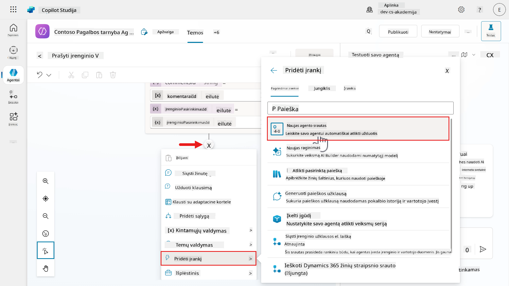

1. Atsidarys Agentų srautų **Dizaineris** su trigeriu ir veiksmu.

    - **Trigeris** - Kai agentas kviečia srautą
        - Tai paleis srautą iš Copilot Studio agento.

    - **Veiksmas** - Atsakyti agentui
        - Tai siunčia atsakymą, kuris gali turėti išvesties reikšmes, atgal į Copilot Studio agentą.

    Pasirinkite trigerį.

    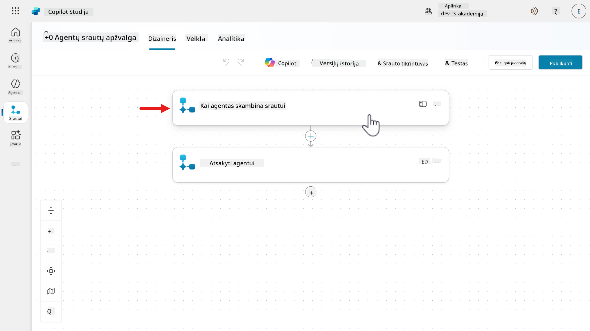

1. Toliau pridėsime kelis įvesties parametrus agento srautui.

    - `DeviceSharePointId` - saugos SharePoint elemento ID reikšmę. Šis ID yra išvestis iš mazgo „Klausti su adaptacine kortele“, kur vartotojas pasirinko įrenginį.

    - `User` - tai bus vartotojo vardas, kuris bus paimtas iš sistemos kintamojo agento.

    - `AdditionalComments` - tai bus vartotojo įvestas komentaras, kuris yra išvestis iš mazgo „Klausti su adaptacine kortele“.

    Pirmiausia pridėsime `DeviceSharePointId` kaip įvestį trigeriui. Pasirinkite **+ Pridėti įvestį**.

    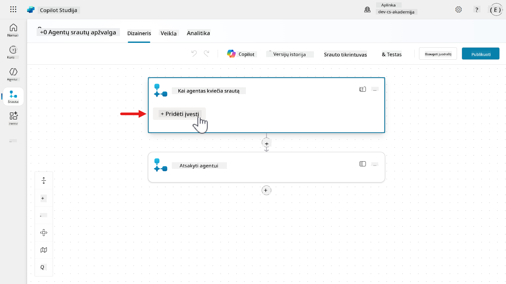

1. Įvesties tipo pasirinkime pasirinkite **Tekstas**.

    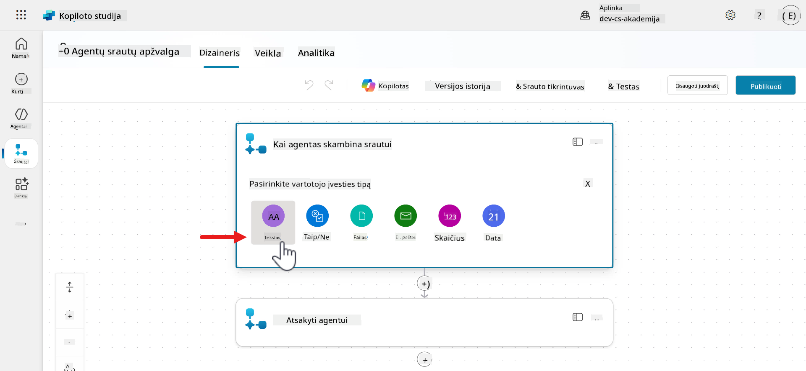

1. Įveskite šį pavadinimą įvesties laukui.

    ```text
    DeviceSharePointId
    ```

    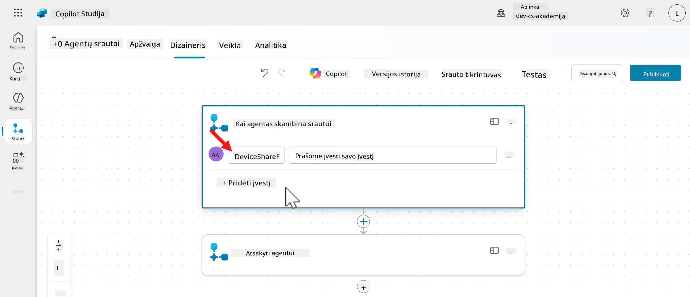

1. Dabar pridėsime antrą įvestį, `User`. Pakartokite tuos pačius veiksmus, pasirinkite **+ Pridėti įvestį** ir pasirinkite **Tekstas**.

    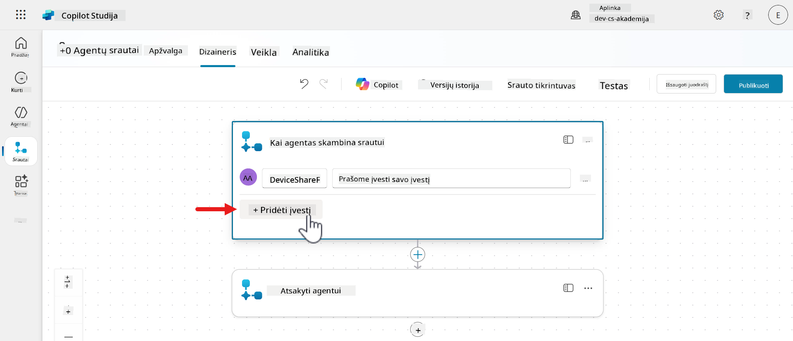

1. Įveskite šį pavadinimą įvesties laukui.

    ```text
    User
    ```

    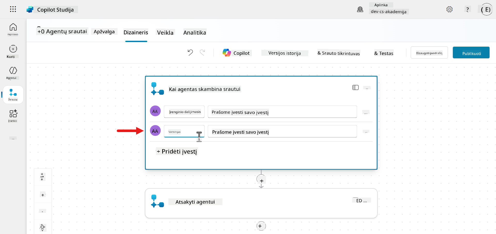

1. Dabar pridėsime trečią įvestį, `AdditionalComments`. Pakartokite tuos pačius veiksmus, pasirinkite **+ Pridėti įvestį** ir pasirinkite **Tekstas**.

    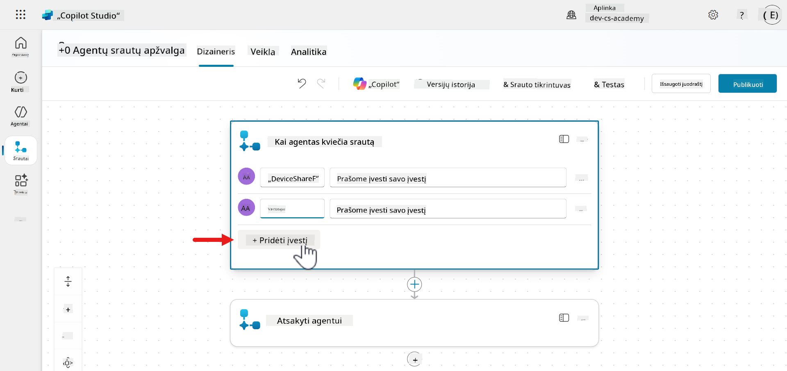

1. Įveskite šį pavadinimą įvesties laukui.

    ```text
    AdditionalComments
    ```

    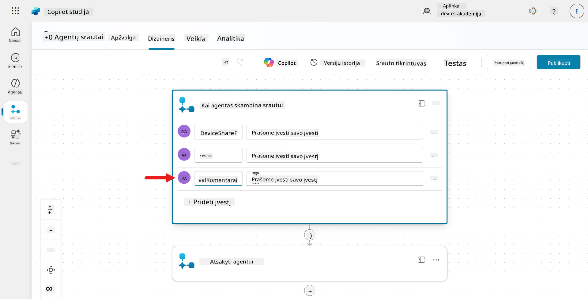

1. `AdditionalComments` įvesties laukui atnaujinsime, kad jis būtų pasirenkamas. Pasirinkite **tritaškio (...) piktogramą** ir pasirinkite **Padaryti lauką pasirenkamu**.

    

1. Puikus darbas! Trigeris dabar sukonfigūruotas, tęskime. Pasirinkite **pliuso + piktogramą** po trigeriu, kad įterptumėte naują veiksmą.

    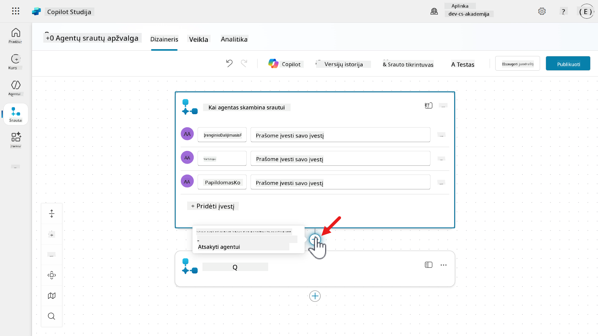

1. Atsidarys **Veiksmų skydelis**, kuriame galite peržiūrėti veiksmus iš daugiau nei 1400 įmontuotų jungčių su Microsoft ir trečiųjų šalių paslaugomis. Paieškos lauke įveskite:

    ```text
    Get item
    ```

    Paieškos rezultatuose bus rodomas veiksmų sąrašas. Pasirinkite **Gauti elementą** veiksmą iš **SharePoint jungties**.

    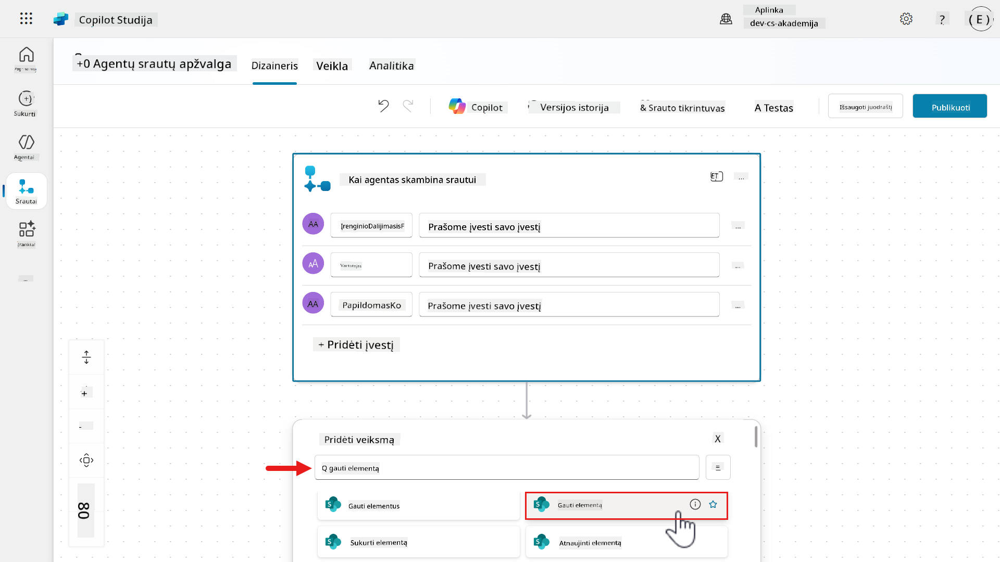

1. Dabar galime pradėti konfigūruoti **Gauti elementą** veiksmą.

    Pasirinkite **Tritaškio (...) piktogramą** veiksmui **Gauti elementą**.

    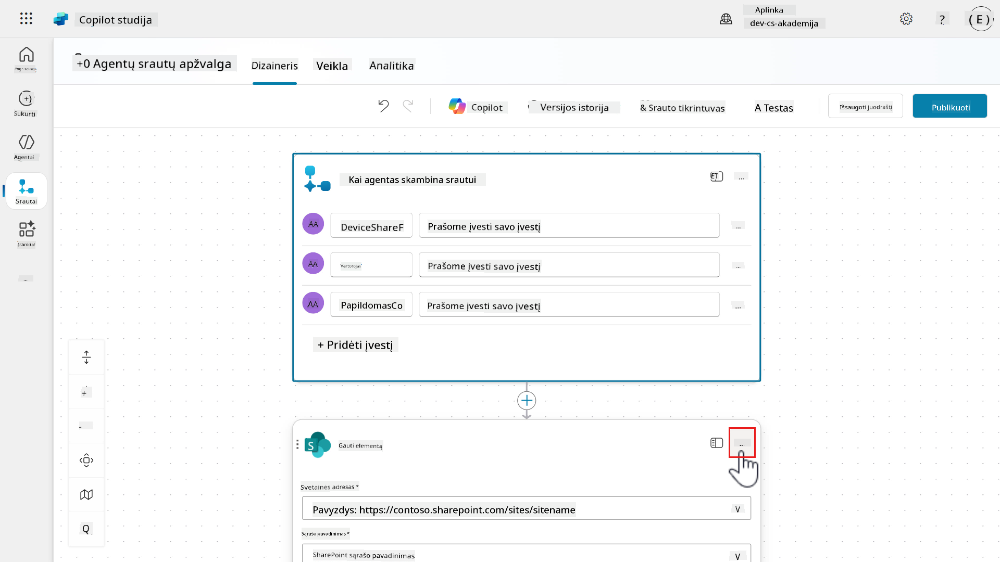

1. Pasirinkite **Pervadinti**.

    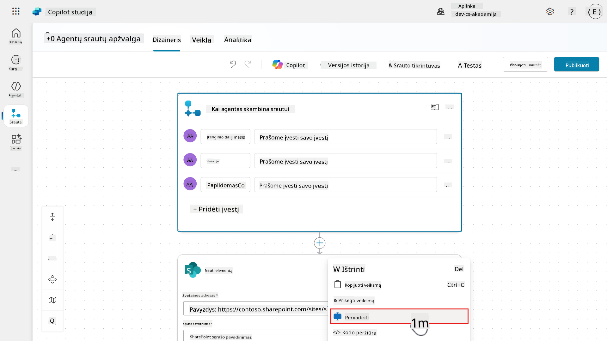

1. Pervadinkite veiksmą į:

    ```text
    Get Device
    ```

    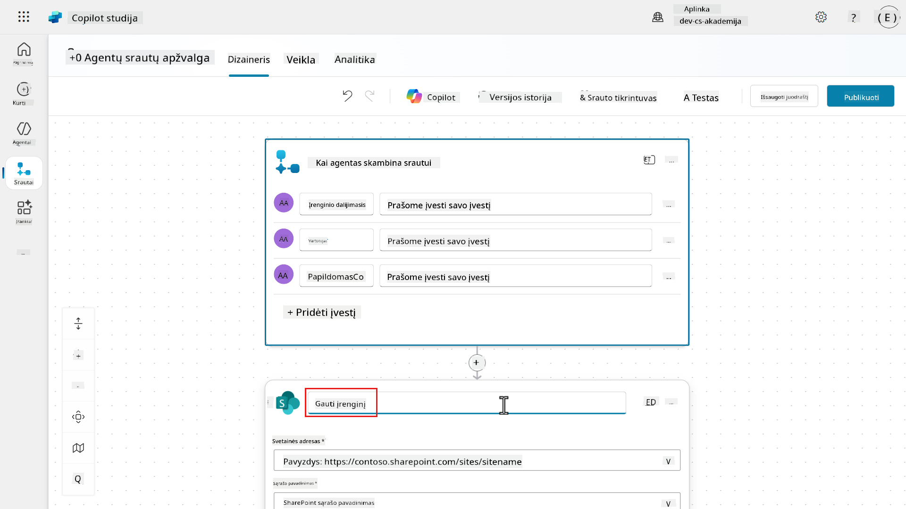

1. Lauke **Svetainės adresas** pasirinkite **Contoso IT SharePoint svetainės adresą**, sukurtą [Pamoka 00 - Kurso nustatymas - 3 žingsnis: Sukurti naują SharePoint svetainę](../00-course-setup/README.md#step-4-create-new-sharepoint-site).

    Lauke **Sąrašo pavadinimas** pasirinkite **Įrenginiai** SharePoint sąrašą.

    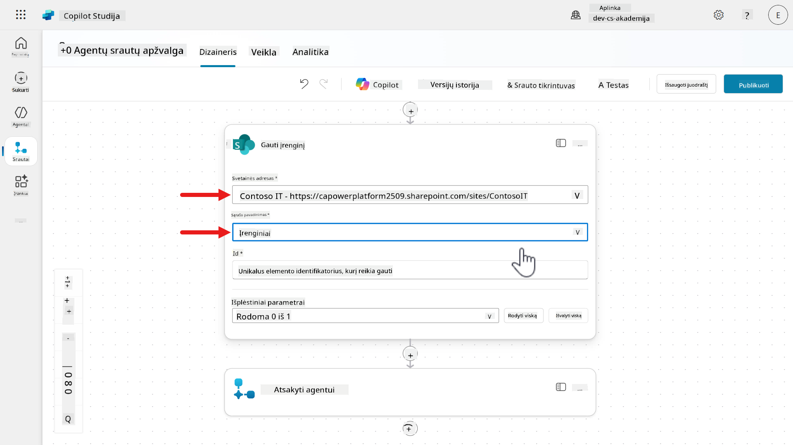

1. Lauke **Id** pasirinkite **žaibo piktogramą** arba **fx piktogramą** dešinėje.

    

1. Skydelio **Dinaminis turinys** skiltyje įveskite:

    ```text
    sharepoint
    ```

    Paieškos rezultatuose bus rodomi įvesties parametrai, atitinkantys paieškos reikšmę. Pasirinkite **DeviceSharePointId** parametrą iš trigerio.

    Tada pasirinkite **Pridėti**, kad pridėtumėte dinaminio turinio įvestį į **Id** parametrą veiksmui.

    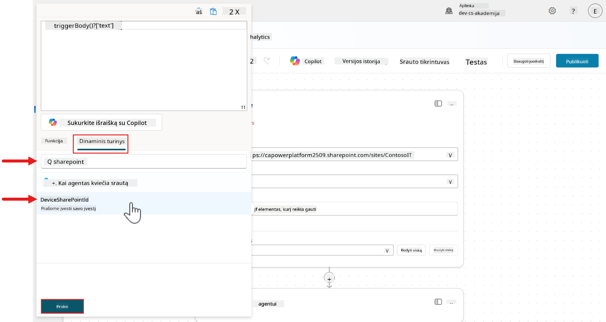

1. Dinaminio turinio įvestis iš trigerio dabar yra nurodyta **Id** parametre veiksmui. Toliau atnaujinsime vieną iš pažangių parametrų. Pasirinkite **Rodyti viską**, kad peržiūrėtumėte pažangius parametrus.

    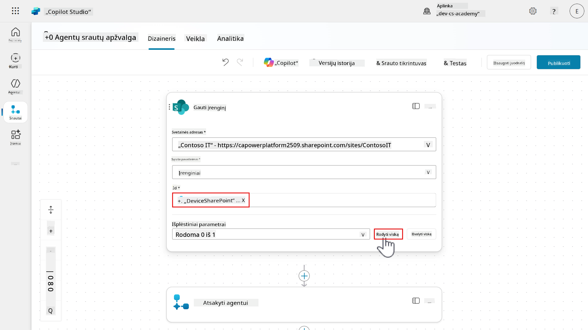

1. Parametras **Apriboti stulpelius pagal rodinį** bus rodomas ir pagal numatytuosius nustatymus nustatytas į **Naudoti visus stulpelius (Neriboti)**. Atnaujinsime šią reikšmę į rodinį, kad apribotume stulpelius, grąžinamus veiksmų atsakyme. Pasirinkite **Apriboti stulpelius pagal rodinį** parametrą, kad peržiūrėtumėte rodinių sąrašą.

    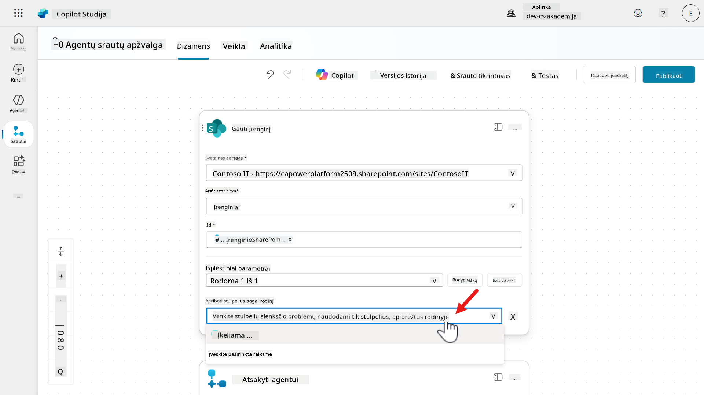

1. Pasirinkite **Visų elementų** rodinį.

    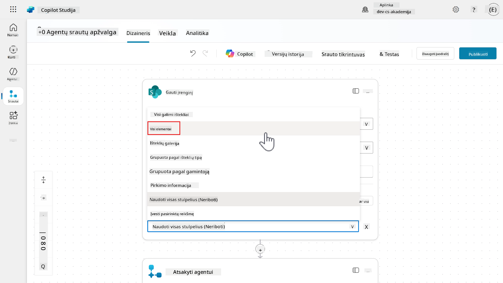

1. Pasirinkite **pliuso + piktogramą** po veiksmu _Gauti įrenginį_, kad įterptumėte naują veiksmą.

    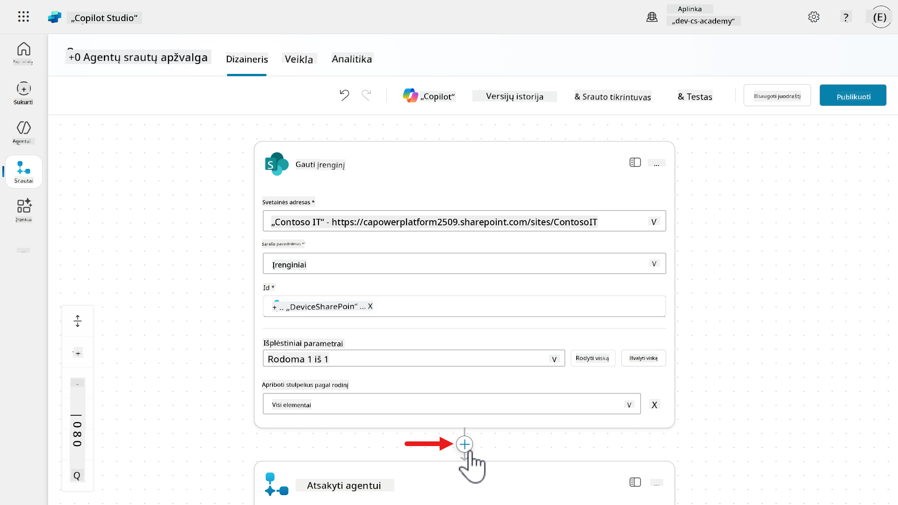

1. Paieškos lauke įveskite:

    ```text
    send an email
    ```

    Paieškos rezultatuose bus rodomas veiksmų sąrašas. Pasirinkite **Siųsti el. laišką (V2)** veiksmą iš **Office 365 Outlook jungties**.

    

1. Toliau turime sukurti ryšį su jungties veiksmu. Pasirinkite **Prisijungti**.

    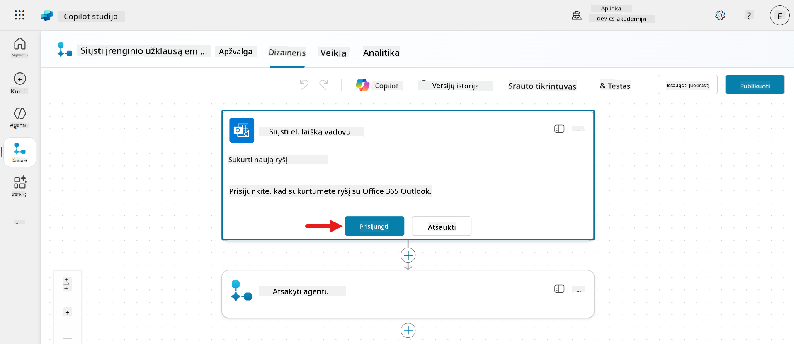

1. Pasirinkite savo prisijungimo vartotojo paskyrą.

    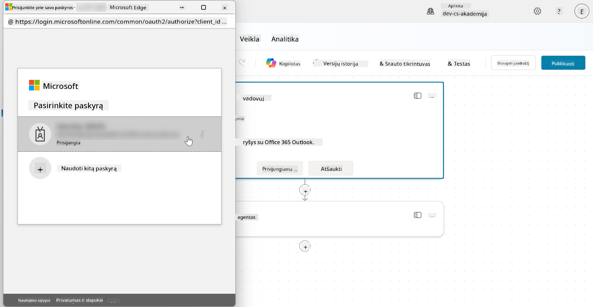

1. Pasirinkite **Leisti prieigą**. Ryšys dabar sukurtas.

    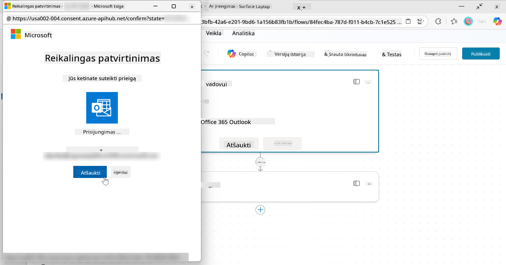

1. Pervadinkite veiksmą į:

    ```text
    Send an email to manager
    ```

    Toliau apibrėžkime veiksmų įvesties parametrus.

    Lauke **Kam** įveskite savo el. pašto adresą. Paprastai tai būtų jūsų vadovas arba naudotume kitą veiksmą, kuris surastų jūsų vadovą pagal jūsų Entra ID profilį, tačiau šios pamokos tikslams pasirinkite save.

    Lauke **Tema** įveskite:

    ```text
    Request type: new device
    ```

    Lauke **Turinys** įveskite:

    ```text
    Hi,

    New device requested from

    Manufacturer:
    Model:
    Link to item in SharePoint
    Additional comments from:

    This is an automated email from Contoso Helpdesk Copilot
    ```

    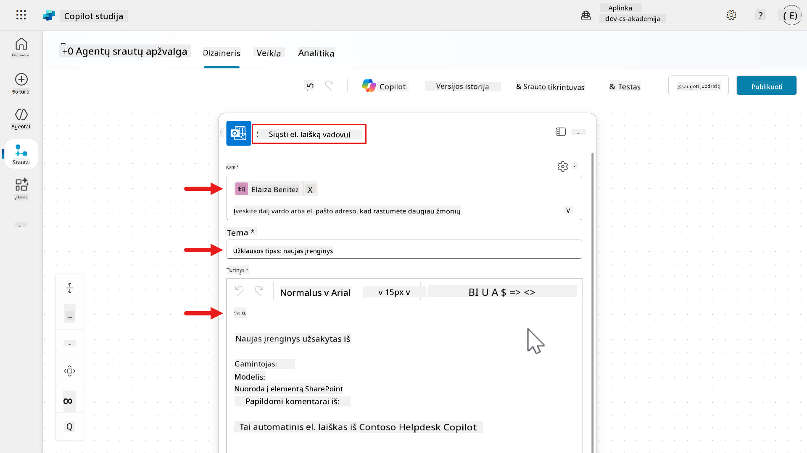

1. Toliau atnaujinsime **Turinys** įvesties parametrą, pridėdami nuorodas į dinaminio turinio įvestį iš **trigerio** arba **Gauti elementą** veiksmą. Įveskite tarpą po antros eilutės, nes įterpsime vartotojo vardą iš trigerio įvesties, **User**.

    Pasirinkite **žaibo piktogramą** arba **fx piktogramą** dešinėje.

    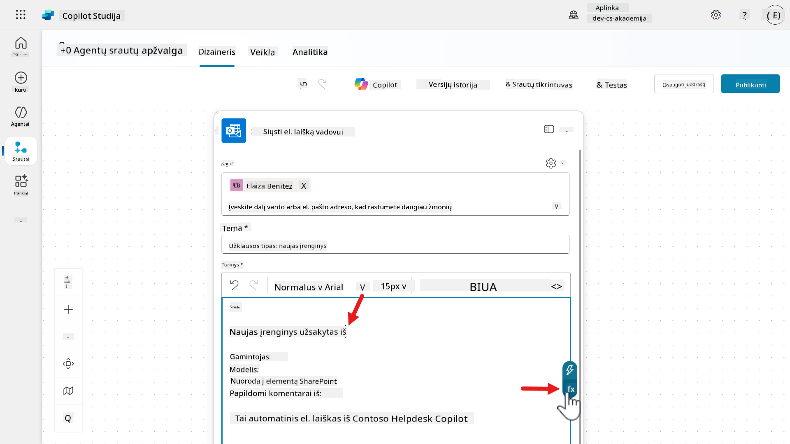

1. Skydelio **Dinaminis turinys** skiltyje pasirinkite **User** įvestį iš trigerio.

    Pasirinkite **Pridėti**, kad pridėtumėte dinaminio turinio **User** įvestį į **Turinys** parametrą veiksmui.

    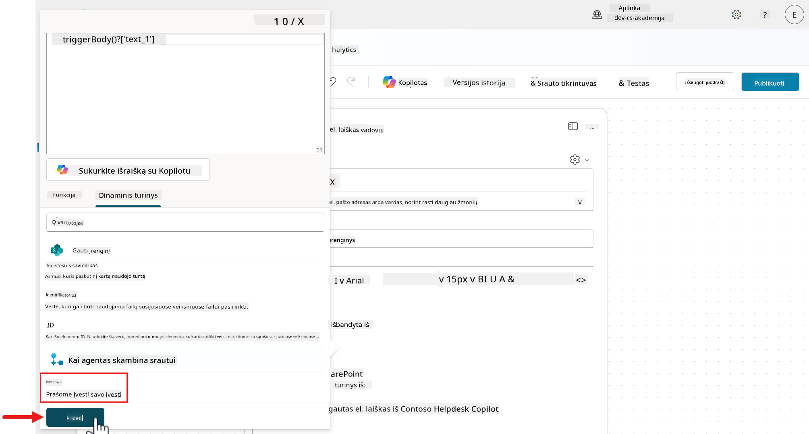
1. Dinaminis turinys, gautas iš trigerio, dabar yra nurodytas veiksmo **Body** parametre. Tą patį pakartosime likusioms eilutėms el. laiško tekste.

    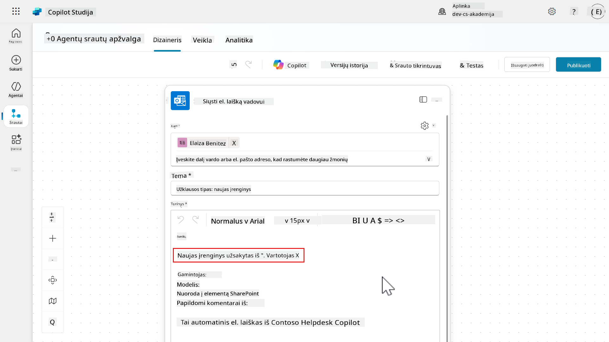

1. Spustelėkite vietą šalia `Manufacturer:`. Pasirinkite **žaibo ikoną** arba **fx ikoną** dešinėje.

    Skydelio **Dynamic content** skirtuke įveskite šią paieškos frazę,

    ```text
    manufacturer
    ```

    Pasirinkite **Manufacturer value** įvestį iš trigerio ir spustelėkite **Add**.

    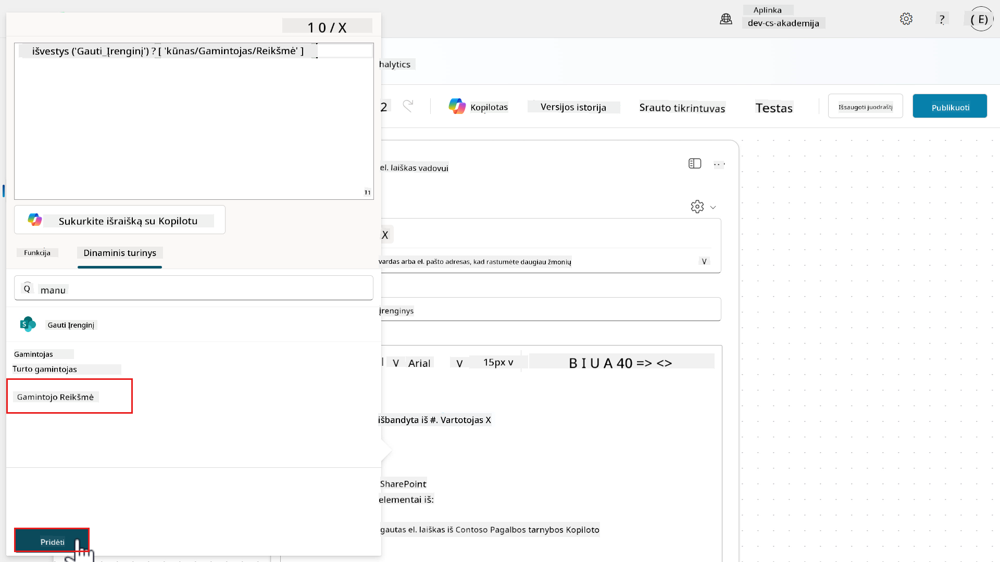

1. Spustelėkite vietą šalia `Model:`. Pasirinkite **žaibo ikoną** arba **fx ikoną** dešinėje.

    Skydelio **Dynamic content** skirtuke įveskite šią paieškos frazę,

    ```text
    model
    ```

    Pasirinkite **Model** įvestį iš **Get item** veiksmo ir spustelėkite **Add**.

    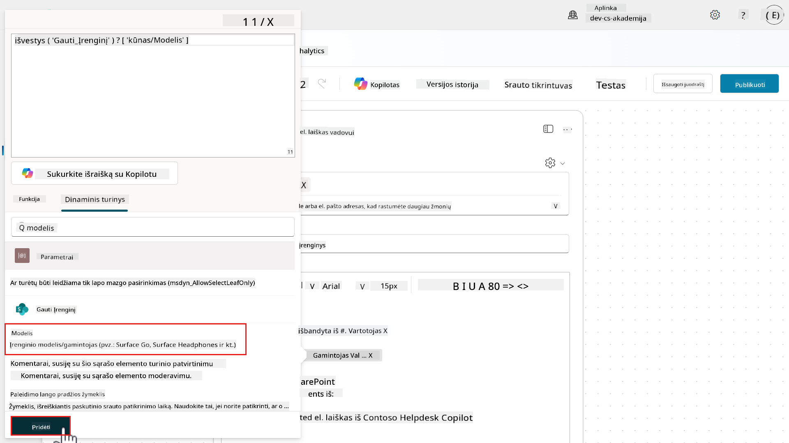

1. Tekstui `Link to item in SharePoint` atnaujinsime jį į hipersaitą el. laiško tekste. Spustelėkite eilutės pradžioje ir pasirinkite **žaibo ikoną** arba **fx ikoną** dešinėje.

    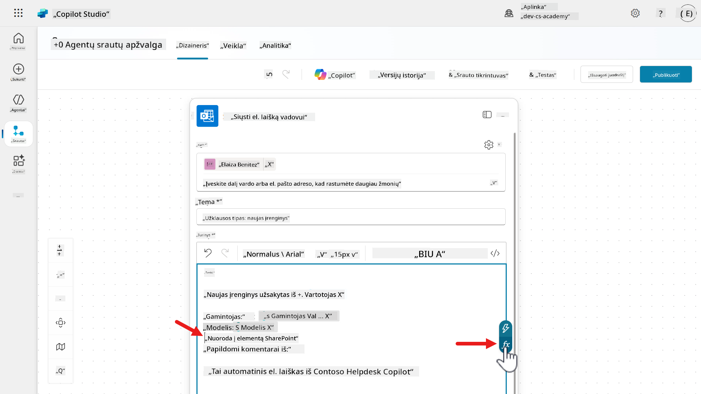

1. Spustelėkite po HTML inkaro žyma ir pasirinkite **žaibo ikoną** arba **fx ikoną** dešinėje.

    Skydelio **Dynamic content** skirtuke įveskite šią paieškos frazę,

    ```text
    link to item
    ```

    Pasirinkite **Link to item** įvestį iš **Get item** veiksmo ir spustelėkite **Add**.

    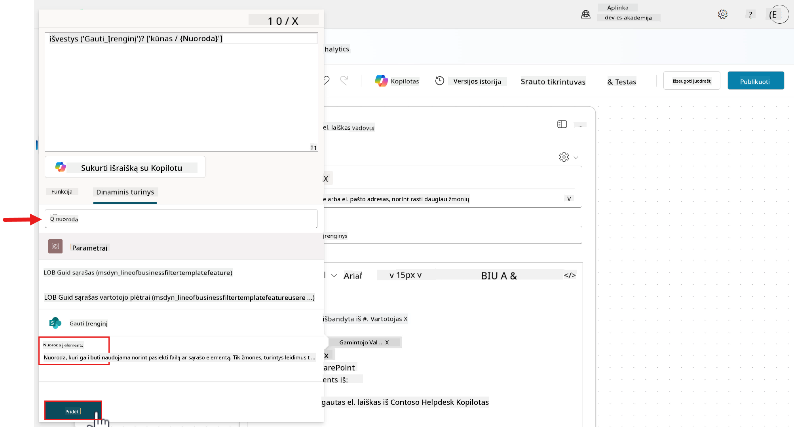

1. Turime perjungti į HTML redaktorių, pasirinkdami **&lt;/&gt;** ikoną.

    

1. HTML redaktorius dabar įjungtas. Spustelėkite prieš `Link to item in SharePoint` tekstą, pridėkite HTML inkaro žymą, kad sukurtumėte hipersaitą. Nukopijuokite ir įklijuokite šį kodą.

    ```text
    <a href="
    ```

    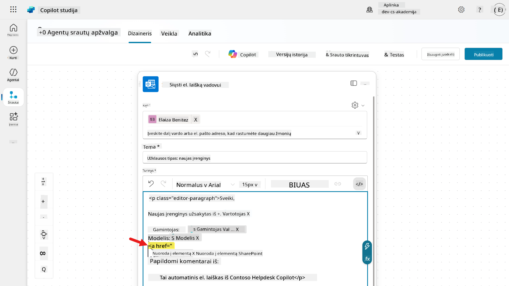

1. Dinaminis turinys **Link to item** dabar yra nurodytas **Body** parametre. Spustelėkite po **Link to item** įvesties, nukopijuokite ir įklijuokite šį kodą.

    ```text
    ">
    ```

    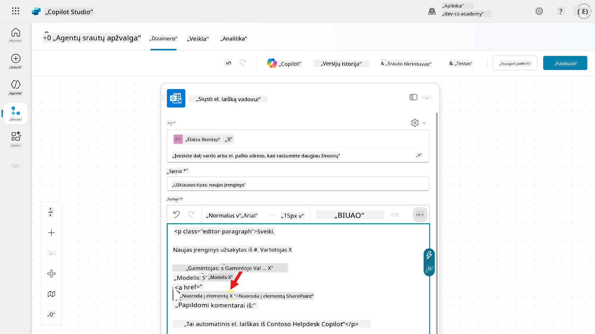

1. Spustelėkite po `Link to item in SharePoint` teksto, uždarykite HTML inkaro žymą. Nukopijuokite ir įklijuokite šį kodą.

    ```text
    </a>
    ```

    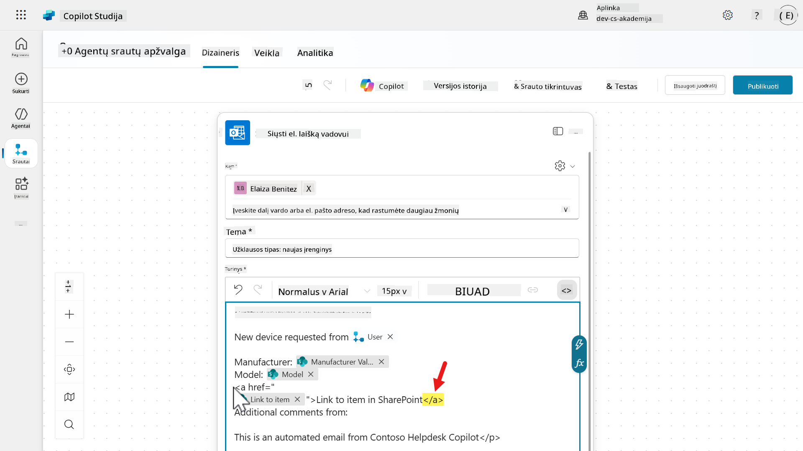

1. Pasirinkite **&lt;/&gt;** ikoną, kad perjungtumėte kodo peržiūrą.

    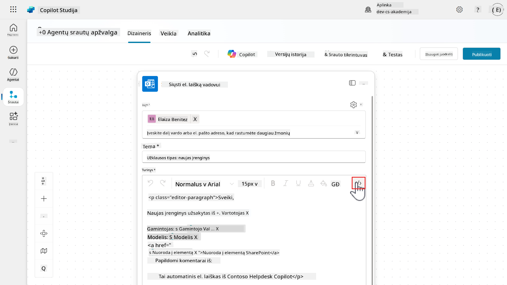

1. Tada dar kartą pasirinkite **&lt;/&gt;** ikoną, kad vėl perjungtumėte kodo peržiūrą.

    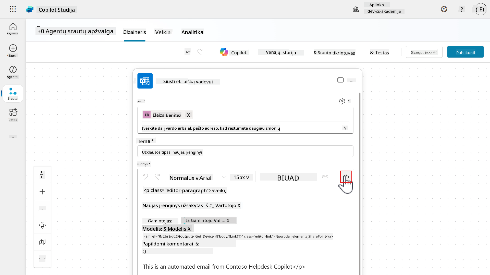

1. Pastebėkite, kad yra keletas papildomų simbolių `&lt;br&gt;`. Ištrinkite šiuos simbolius.

    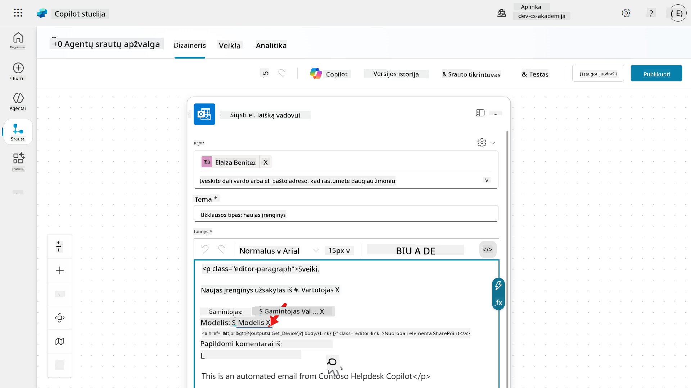

1. Dabar baigėme pridėti hipersaitą į mūsų el. laiško tekstą 😎 Pasirinkite **&lt;/&gt;** ikoną, kad perjungtumėte kodo peržiūrą.

    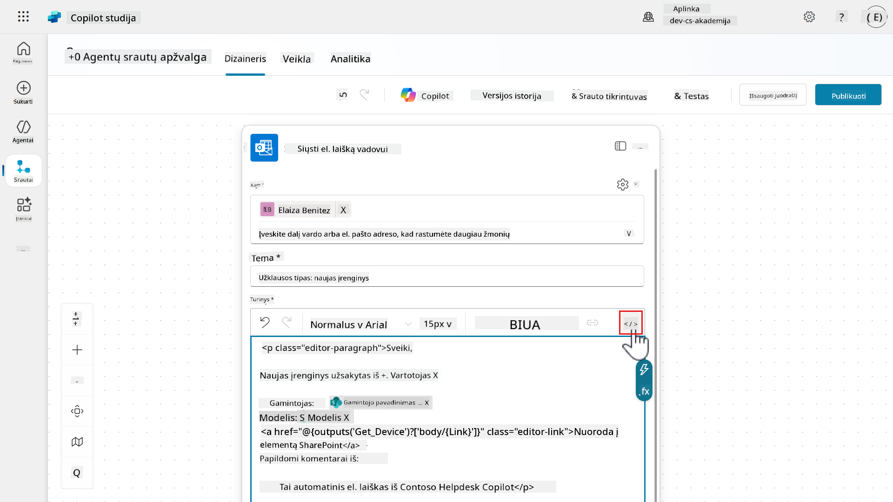

1. Spustelėkite po `Additional comments from` teksto prieš dvitaškį ir pasirinkite **žaibo ikoną** arba **fx ikoną** dešinėje.

    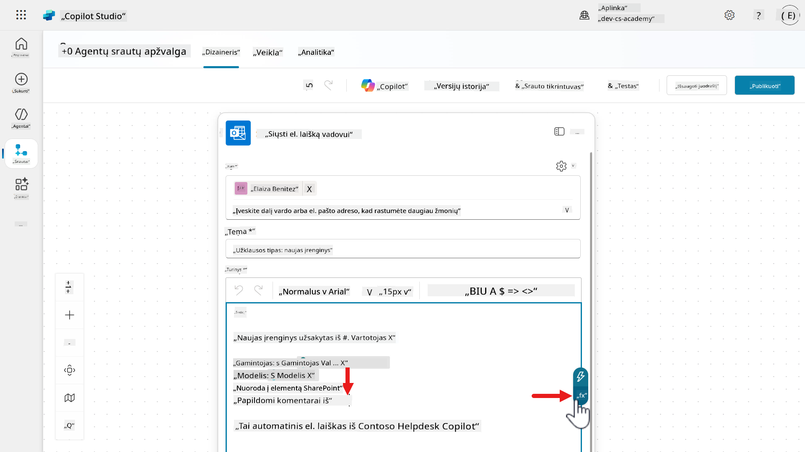

1. Skydelio **Dynamic content** skirtuke įveskite šią paieškos frazę,

    ```text
    user
    ```

    Pasirinkite **User** parametrą iš trigerio ir spustelėkite **Add**.

    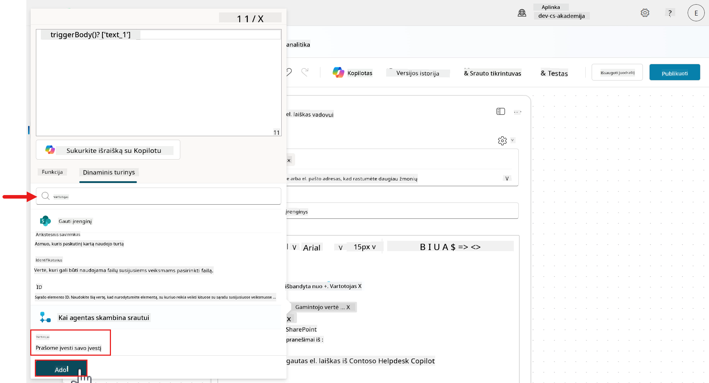

1. Dabar įterpsime išraišką, kuri rodys papildomų komentarų vertę, jei vartotojas ją pateikė **Ask an adaptive card** mazge, arba rodys "None", jei vartotojas nepateikė jokių komentarų.

    Spustelėkite po dvitaškio ir pasirinkite **žaibo ikoną** arba **fx ikoną** dešinėje.

    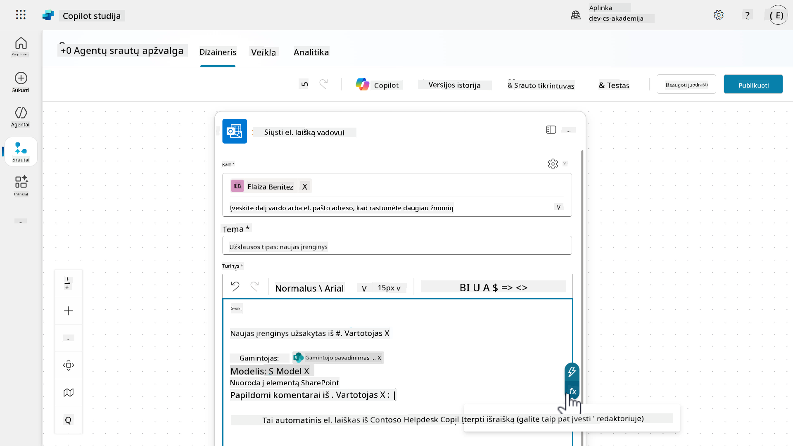

1. Skydelio **Function** skirtuke ir išraiškos lauke viršuje įveskite šią išraišką,

    ```text
    if(empty())
    ```

    Ši išraiška naudoja `if` funkciją if-else sąlygai.

    Kita funkcija yra `empty`, kuri tikrina, ar vertė egzistuoja eilutės parametre. Eilutės parametras, kurį reikia nurodyti, yra `AdditionalComments` įvesties parametro vertė iš trigerio.

    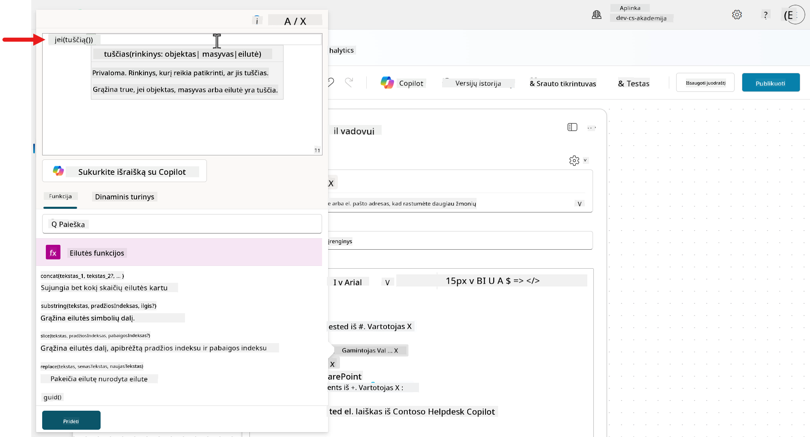

1. Tada spustelėkite **skliaustelių viduje** po `empty` funkcijos. Įterpsime `AdditionalComments` įvesties parametrą iš trigerio.

    Pasirinkite **Dynamic content** skirtuką. Įveskite šią paieškos frazę,

    ```text
    Additional
    ```

    Slinkite žemyn skydelyje ir pasirinkite **AdditionalComments** įvestį iš trigerio. Parametras dabar bus pridėtas kaip eilutės parametras išraiškoje.

    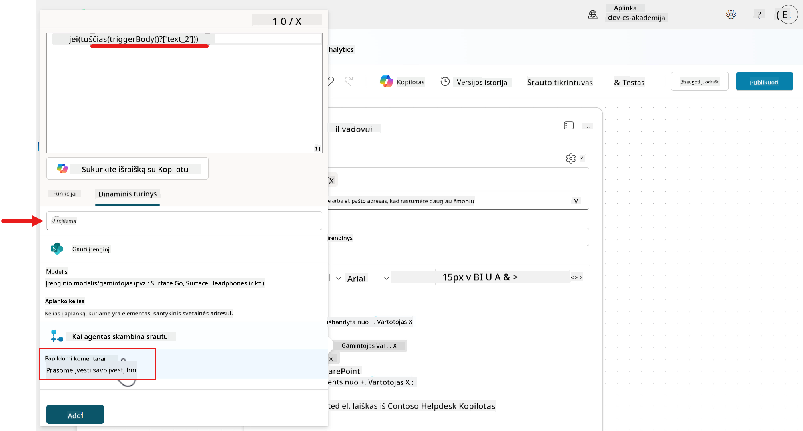

1. Dabar apibrėžsime **_true_** logiką, kur jei `AdditionalComments` eilutės parametras yra tuščias, norime rodyti tekstą `None`.

    Po skliausto, kuris apima eilutės parametrą, įveskite šį kodą,

    ```text
    , 'None',
    ```

    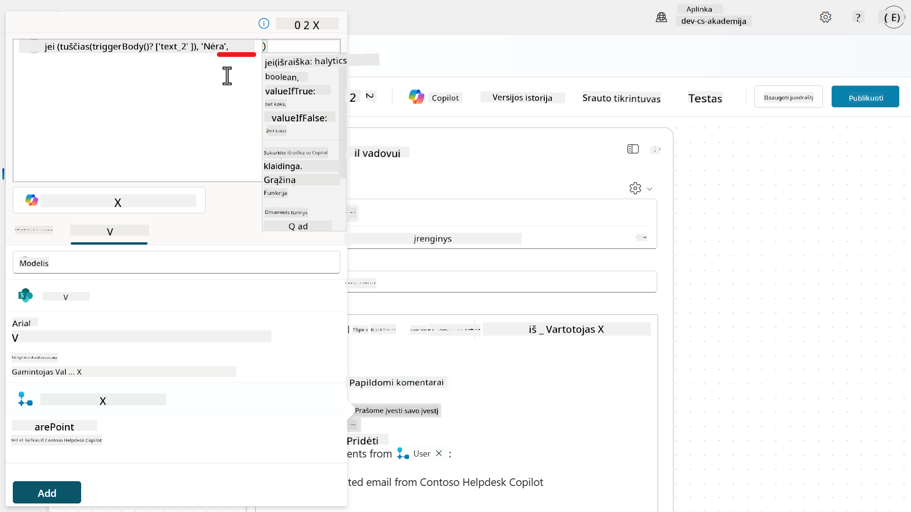

1. Galiausiai apibrėžsime **_false_** logiką, kur jei `AdditionalComments` eilutės parametras nėra tuščias, norime rodyti **AdditionalComments** įvesties parametro vertę iš mūsų trigerio.

    > Primename, kad ši vertė bus iš papildomų komentarų lauko adaptacinėje kortelėje **Ask with adaptive card** mazge **Request device** temoje.

    Po kablelio po mūsų **_true_** logikos, pasirinkite **Dynamic content** skirtuką. Įveskite šią paieškos frazę,

    ```text
    Additional
    ```

    Slinkite žemyn skydelyje ir pasirinkite **AdditionalComments** įvestį iš trigerio. Parametras dabar bus pridėtas kaip eilutės parametras išraiškoje.

    Dabar pridėkite jį prie mūsų **Body** parametro, pasirinkdami **Add**.

    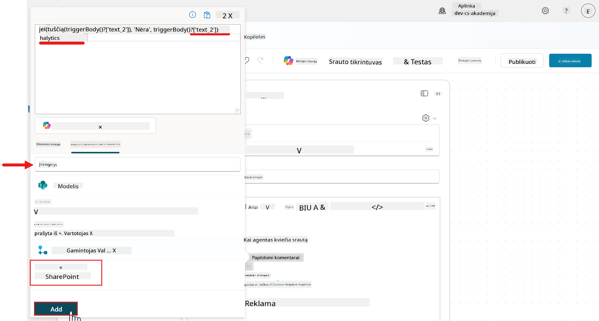

1. Puiku, mūsų išraiška baigta! Išraiška dabar pridėta prie **Body** parametro. Galiausiai suformatuokite paskutinę eilutę kursyvu.

    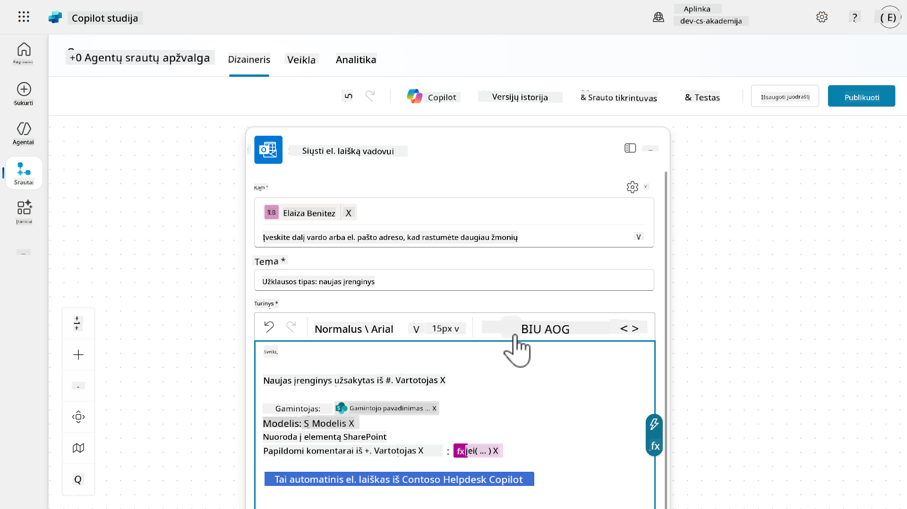

1. Dabar atnaujinsime **Respond to the agent** veiksmą, kad išsiųstume **Model value** parametro vertę iš **Get item** veiksmo atgal agentui.

    Laikykite nuspaustą kairįjį pelės klavišą ir judėkite aukštyn dizainerio viduje, kad pamatytumėte **Respond to the agent** veiksmą.

    Pasirinkite **Respond to the agent** veiksmą ir pasirinkite **Text** išvestį kaip tipą.

    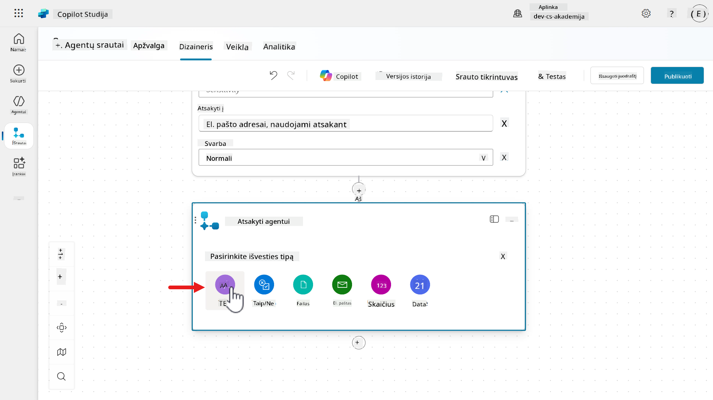

1. Įveskite šį pavadinimą išvesties laukui.

    ```text
    ModelValue
    ```

    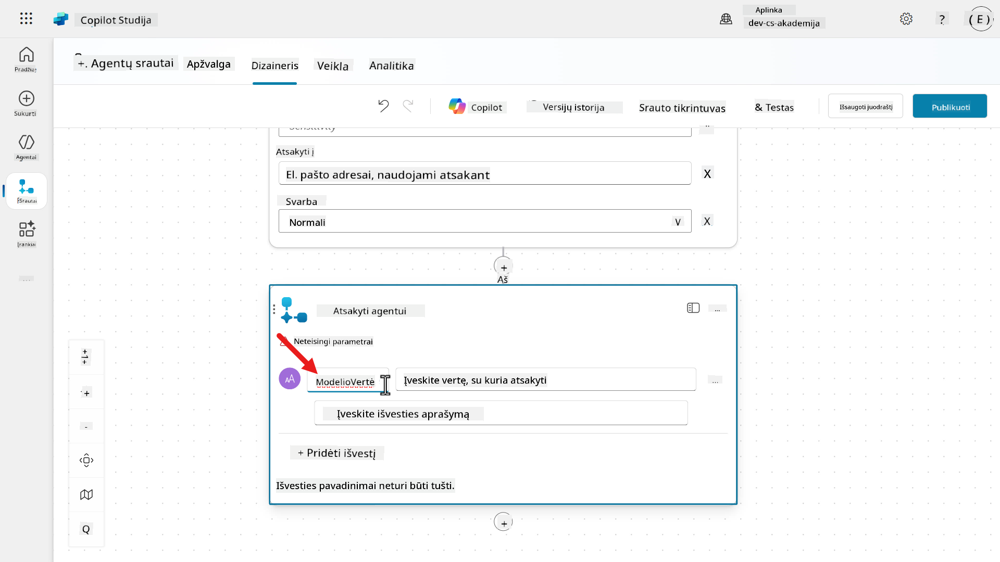

1. Pasirinkite vertės lauką ir pasirinkite **žaibo ikoną** arba **fx ikoną** dešinėje.

    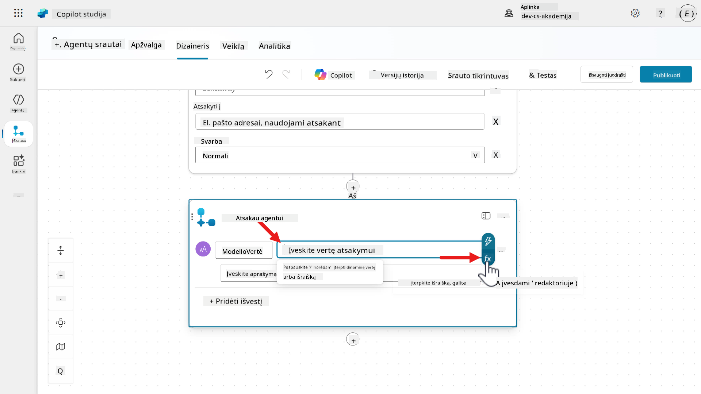

1. Skydelio **Dynamic content** skirtuke įveskite šią paieškos frazę,

    ```text
    model
    ```

    Pasirinkite **Model** parametrą iš **Get item** veiksmo ir spustelėkite **Add**.

    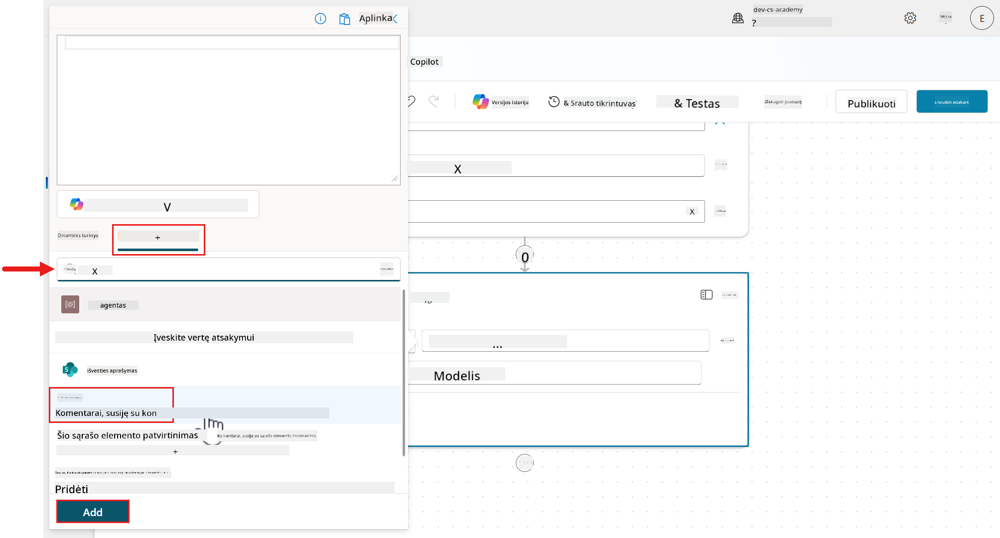

1. **Model** parametras dabar yra teksto išvesties vertė. Pasirinkite **Save draft**, kad išsaugotumėte mūsų agento srautą.

    Dabar baigėme mūsų agento srautą 👏🏻

    

1. Padarykime dar vieną atnaujinimą mūsų agento srautui prieš publikuojant. Pasirinkite **Overview** skirtuką ir pasirinkite **Edit**.

    

1. **Flow name** laukui nukopijuokite ir įklijuokite šį pavadinimą.

    ```text
    Send device request email
    ```

    **Description** laukui pasirinkite **refresh icon**, kad AI automatiškai sugeneruotų aprašymą pagal trigerį ir veiksmus agento sraute.

    Pasirinkite **Save**, kad išsaugotumėte atnaujintą pavadinimą ir aprašymą agento srautui.

    

1. Pasirinkite **Designer** skirtuką ir pasirinkite **Publish**, kad publikuotumėte agento srautą, jog jis galėtų būti pridėtas kaip mazgas **Request device** temoje.

    

1. Netrukus pasirodys patvirtinimo pranešimas, patvirtinantis, kad agento srautas buvo publikuotas.

    

### 9.2 Pridėti agento srautą prie temos

Dabar pridėsime agento srautą prie **Request device** temos.

1. Pasirinkite **Agents** kairėje meniu pusėje ir pasirinkite **Contoso Helpdesk Agent**.

    

1. Pasirinkite **Topics** skirtuką.

    

1. Pasirinkite **Request device** temą.

    

1. Slinkite žemyn iki **Ask with adaptive card** mazgo ir pridėkite naują mazgą.

    Pasirinkite **Add a tool** ir skydelio **Basic tools** skirtuke pasirinkite **Send device request email** agento srautą, kurį neseniai sukūrėme ir publikavome.

    

1. Mūsų agento srauto trigerio įvestims turime pasirinkti kintamųjų išvestis iš **Ask with adaptive card** mazgo.

    Pasirinkite **ellipsis (...) icon** **DeviceSharePointId** įvesties laukui.

    

1. Pasirinkite **deviceSelectionId** kintamąjį, kuris yra viena iš išvesčių, apibrėžtų **Ask with adaptive card** mazge.

    

1. Tada pasirinkite **ellipsis (...) icon** **User** įvesties laukui.

    

1. Skydelio kintamųjų skirtuke pasirinkite **System** ir pasirinkite **User.DisplayName**. Šis kintamasis saugo vidinio vartotojo, sąveikaujančio su agentu, rodomą vardą.

    

1. Tada pasirinkite **greater than icon** **Advanced inputs** laukui, kad išplėstumėte ir pamatytumėte **AdditionalComments** įvestį.

    

1. Pasirinkite **ellipsis (...) icon** **AdditionalComments** įvesties laukui.

    

1. Skydelio kintamųjų skirtuke pasirinkite **Formula** ir išplėtimo ikoną, nes naudosime Power Fx išraišką.

    

1. Panašiai kaip išraiška agento sraute, kuri atlieka sąlyginį patikrinimą naudojant _if_ funkciją, tačiau šį kartą
    - naudojant Power Fx funkcijas,
    - ir įterpiant arba jokios vertės, arba `commentsId` išvesties kintamojo vertę iš **Ask with adaptive card** mazgo.

    Įveskite šias funkcijas Power Fx lauke,

    ```text
    If(IsBlank())
    ```

Ši išraiška naudoja funkciją `If` sąlyginiam if-else teiginiui.

Kita naudojama funkcija yra `IsBlank`, kuri tikrina, ar reikšmė egzistuoja, ar neegzistuoja eilutės parametro viduje. Eilutės parametras, į kurį reikia atsižvelgti, yra kintamasis `commentsId`, gaunamas iš **Ask with adaptive card** mazgo.


1. Toliau spustelėkite **skliaustelių viduje** po funkcija `IsBlank`. Mes įterpsime kintamąjį `commentsId`, gaunamą iš **Ask with adaptive card** mazgo.

   Įveskite šį kodą skliaustelių viduje,

    ```text
    Topic.commentsId
    ```

   Ir pridėkite kablelį po skliaustelio.

   

1. Dabar apibrėšime logiką:

   - kai **_true_** - jei eilutės parametras `Topic.commentsId` yra tuščias, tada norime įterpti jokią reikšmę.
   - kai **_false_** - jei eilutės parametras `Topic.commentsId` nėra tuščias, tada įterpiame kintamojo commentsId reikšmę.

   Po skliaustelio, kuris apima eilutės parametrą, įveskite šį kodą,

    ```text
    "", Topic.commentsId)
    ```

   Power Fx išraiška turėtų būti tokia:

    ```text
    If(IsBlank(Topic.commentsId), "", Topic.commentsId)
    ```

   Puikus darbas, mūsų išraiška baigta! 🙌🏻 Dabar pasirinkite **Insert**, kad nustatytumėte agento srauto įvesties parametrą Power Fx išraiškai.

   

1. **Išsaugokite** temą.

### 9.3 Atnaujinkite „Request device“ temą, pridėdami kelis mazgus geresnei vartotojo patirčiai

Toliau pridėsime dar du mazgus:

- **Send a message** - tai bus patvirtinimo pranešimas, kuriame nurodomas pasirinktas įrenginys ir kad jų užklausa buvo pateikta.
- **Topic management** - užbaigti pokalbį, nukreipiant į **End of conversation** mazgą.

Pradėkime!

1. Pasirinkite **pliuso + ikoną** po agento srauto mazgu ir pasirinkite **Send a message** mazgą.

   

1. Įveskite šį tekstą pranešimo lauke,

    ```text
    Thanks
    ```

   Tada pasirinkite **Insert variable**, nes nurodysime vartotojo vardą.

   

1. Pasirinkite **System** skirtuką ir paieškos lauke suraskite `User`. Pasirinkite kintamąjį **User.DisplayName**.

   

1. Įveskite šį tekstą pranešimo lauke,

    ```text
    . Your selected device,
    ```

   Tada pasirinkite **Insert variable**, šį kartą **Custom** skirtuke, pasirinkite kintamąjį **ModelValue**.

   Tada įveskite šį tekstą, kad užbaigtumėte pranešimą.

    ```text
    , has been submitted and will be reviewed by your manager.
    ```

   Pranešimas turėtų atrodyti taip:

   

1. Galiausiai, pasirinkite **pliuso + ikoną** po **Send a message** mazgu ir pasirinkite **Topic management**, po to **Go to another topic** ir pasirinkite **End of Conversation**.

   

1. **Išsaugokite** temą.

   

### 9.4 Testuokite agentą naudodami kelis scenarijus

Puikus darbas!!! 😁 Dabar galime išbandyti savo agentą.

#### 9.4.1 Prašymas įrenginio ir komentaro įvedimas adaptacinėje kortelėje

1. **Atnaujinkite** testavimo langą, pasirinkite **activity map** ikoną ir įveskite šį tekstą kaip pranešimą agentui.

    ```text
    I need a laptop
    ```

   

1. Agentas aktyvuoja **Available devices** ir atsako su galimų įrenginių sąrašu. Įveskite šį atsakymą į klausimą, ar norite prašyti įrenginio.

    ```text
    Yes
    ```

   

1. Pastebėkite, kaip agentas aktyvavo **Request device** pagal agento instrukcijas ir kad adaptacinė kortelė dabar rodoma agento pranešime.

   Pasirinkite įrenginį **Surface Laptop 15** ir pridėkite šį komentarą.

    ```text
    I need 16GB of RAM please
    ```

   

1. Slinkite žemyn, kol pamatysite mygtuką **Submit Request**, ir pasirinkite jį, kad pateiktumėte adaptacinę kortelę agentui.

   

1. Pasirinkite **Allow**, kad agentas galėtų naudoti jūsų prisijungimo duomenis dviejų jungčių veiksmų autentifikavimui.

   

1. Tada agentas parodys patvirtinimo pranešimą, kuriame bus nurodytas pasirinktas modelis, po to nukreips į **End of Conversation** temą. Šaunu!

   

1. Pasirinkite **Taip**, kad patvirtintumėte likusią **End of Conversation** temą.

   

1. Toliau įvertinkite patirtį pasirinkdami bet kurią žvaigždutę vertinimo skalės kortelėje.

   Tada agentas pereis prie paskutinio **Question** mazgo **End of Conversation** temoje. Pasirinkite **Ne**.

   

1. Tema bus užbaigta, o galutinis pranešimas bus rodomas testavimo lange.

   

1. Patikrinkite savo el. pašto dėžutę, kad peržiūrėtumėte agento srauto išsiųstą el. laišką vadovui. Galite matyti pasirinktą įrenginį ir adaptacinėje kortelėje įvestą pastabą.

   

1. Spustelėkite hipersaitą, ir naršyklė turėtų atidaryti „SharePoint“ elementą su įrenginiu. Puiku!

   

#### 9.4.2 Prašymas įrenginio be komentaro adaptacinėje kortelėje

Dabar išbandykime scenarijų, kai komentaras nėra įvestas.

1. Pakartokite tuos pačius veiksmus:

   - **Atnaujinkite** testavimo langą ir pasirinkite **activity map** ikoną
   - Įveskite pranešimą, `I need a laptop`
   - Atsakykite `Yes` į klausimą apie įrenginio prašymą

   

1. Šį kartą pasirinkite **Surface Laptop 13** kaip įrenginį ir neįveskite komentaro.

   

1. **Pateikite** užklausą pasirinkdami mygtuką **Submit Request**.

   

1. Šį kartą el. laiške, gautame jūsų el. pašto dėžutėje, bus rodoma **None** kaip komentaras.

   

#### 9.4.3 Neprašyti įrenginio

Išbandykime paskutinį scenarijų, kai įrenginys nėra prašomas, ir **Goodbye** tema turėtų būti aktyvuota pagal agento instrukcijas.

1. Pakartokite tuos pačius veiksmus:

   - **Atnaujinkite** testavimo langą ir pasirinkite **activity map** ikoną
   - Įveskite pranešimą, `I need a laptop`
   - Šį kartą atsakykite `No` į klausimą apie įrenginio prašymą

   

1. Agentas aktyvavo **Goodbye** temą, ir klausimas, apibrėžtas temoje, yra užduotas.

   

## ✅ Misija įvykdyta

Sveikiname! 👏🏻 Jūs išmokote, kaip sukurti agento srautą ir pridėti jį prie esamos **Request device** temos, taip pat kaip nukreipti agentą į kitą temą.

Tai yra **Lab 09 - Add an agent flow for automation and enhance topic capabilities** pabaiga, spustelėkite žemiau esančią nuorodą, kad pereitumėte į kitą pamoką. Šioje pamokoje išplėsime šio laboratorinio darbo atvejį.

⏭️ [Pereiti į **Add Event Triggers - Enable autonomous agent capabilities** pamoką](../10-add-event-triggers/README.md)

## 📚 Taktiniai ištekliai

🔗 [Agentų srautų pristatymas: automatizacijos transformavimas naudojant AI pagrįstus darbo srautus](https://www.microsoft.com/microsoft-copilot/blog/copilot-studio/introducing-agent-flows-transforming-automation-with-ai-first-workflows/)

🔗 [Agentų srautų apžvalga](https://learn.microsoft.com/microsoft-copilot-studio/flows-overview?WT.mc_id=power-172621-ebenitez)

🔗 [Naudokite agentų srautus su savo agentu](https://learn.microsoft.com/microsoft-copilot-studio/advanced-flow?WT.mc_id=power-172621-ebenitez)

🔗 [Funkcijų sąrašas nuorodų vadove](https://learn.microsoft.com/azure/logic-apps/workflow-definition-language-functions-reference?WT.mc_id=power-172621-ebenitez)

📺 [Agentų srautai Copilot Studio](https://www.youtube.com/watch?v=VJTKyk3Pr7s)

<!-- markdownlint-disable-next-line MD033 -->


---

**Atsakomybės apribojimas**:  
Šis dokumentas buvo išverstas naudojant AI vertimo paslaugą [Co-op Translator](https://github.com/Azure/co-op-translator). Nors siekiame tikslumo, prašome atkreipti dėmesį, kad automatiniai vertimai gali turėti klaidų ar netikslumų. Originalus dokumentas jo gimtąja kalba turėtų būti laikomas autoritetingu šaltiniu. Dėl svarbios informacijos rekomenduojama profesionali žmogaus vertimo paslauga. Mes neprisiimame atsakomybės už nesusipratimus ar klaidingus aiškinimus, atsiradusius naudojant šį vertimą.